# 8

# 优化和可视化量子电路

在上一章中，你学习了如何使用**Qiskit**进行编程，包括电路和脉冲时序。在本章中，我们将继续探讨电路的话题，特别是通过减少在重计算周期中经典和量子系统之间的开销，来优化和加速端到端过程的一些新特性。

幸运的是，Qiskit 提供了大量功能，使我们能够轻松地做到这一点。此外，Qiskit 还提供了一套类和功能，用于优化和增强电路的可视化。了解这些功能将有助于优化你的电路结果，并允许你以各种风格和表示方式渲染电路，例如**有向无环图**（**DAG**）。

我们将在本章中介绍以下主题：

+   使用预设 Passmanager 优化电路

+   可视化和增强电路图

在阅读本章之后，你将能够通过使用后端系统的各种视觉和程序表示以及可视化工具来优化你的电路。你还将对可帮助优化电路针对特定量子后端系统的转换的各种转换器特性有所了解。你将学习到**预设 Passmanagers**以及它们如何被利用来生成用于在转换器中执行电路转换的自定义 pass managers，这些转换器在不同的优化级别上运行。

# 技术要求

在本章中，我们假设你已经熟悉在模拟器和量子计算机上创建和执行量子电路。了解量子硬件，如量子比特和量子比特之间的连接性，也是推荐的。如果你在运行某些单元格时需要，你可能还需要在 Python 开发环境中安装**Graphviz**、**LaTeX**以及可能的其他依赖项。

这里是本书中使用的完整源代码：[`github.com/PacktPublishing/Learning-Quantum-Computing-with-Python-and-IBM-Quantum-Second-Edition`](https://github.com/PacktPublishing/Learning-Quantum-Computing-with-Python-and-IBM-Quantum-Second-Edition).

# 使用预设 Passmanager 优化电路

我们需要确保当量子电路映射到量子系统（转换）时，是以最有效和最有效的方式进行。这包括将每个量子比特映射到量子系统上，以最小化由退相干或任何可能引入错误的其他噪声源影响的噪声。为了实现这一点，我们将学习**预设 Passmanager**、其用法以及它为我们提供的各种功能，以创建和执行最优电路。通过将电路的执行与量子设备的拓扑结构相匹配，我们减少了噪声及其对我们结果的影响。

在本节中，我们将学习如何将量子电路转换为与量子设备最佳匹配的形式。我们还将学习如何通过使用布局优化器来优化电路。然后我们将了解后端配置及其优化，以及传递管理器和传递。

## 编译量子电路

当你在量子设备上创建一个电路并运行它时，在你将电路发送到量子设备执行和结果返回之间，会发生很多事情。在我们讨论 *第七章*，*使用 Qiskit 编程* 中的 Qiskit 运行时的时候，我们查看了一些那些步骤。在本章中，我们将查看 Qiskit 运行时包含的各种功能，包括在 Qiskit 1.0 最新版本中引入的功能。首先，让我们看看在编译电路时发生的一些基本过程概述。

下面的流程图说明了电路编译的一般过程，以便它可以在指定的后端上运行并根据提供的设置进行优化：

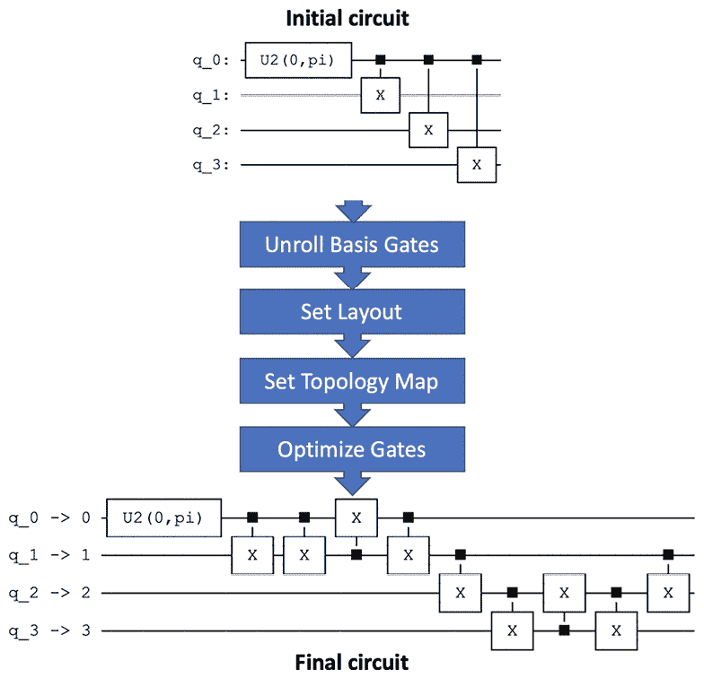

图 8.1：从初始电路到编译器过程的电路，包含传递

我们将从介绍执行过程中显示在前面流程图中的基本步骤开始：

1.  首先，编译器将电路中的门展开到指定后端系统的基门。

1.  接下来，它将电路布局设置为设备。布局的一个例子是*平凡布局*，其中电路将电路上的量子比特映射到量子设备上的相同物理量子比特。例如，你的电路上的量子比特 0 映射到相同的量子比特索引，在这种情况下，物理设备上的量子比特 0。

1.  接下来，它将电路映射到硬件拓扑。这是为了确保你的电路逻辑映射到量子硬件上。例如，假设你有一个连接控制量子比特到目标量子比特的 CNOT。然而，如果控制量子比特和目标量子比特之间没有直接连接，那么编译器将添加一些 SWAP 门以确保通过在控制量子比特和目标量子比特之间交换量子比特之间的信息来建立两个量子比特之间的连接。

1.  最后，电路映射将被优化以确保对于给定的量子系统，电路深度被限制在最小值。步骤 2 和 3 可以映射到物理设备上的任意组合的量子比特；正如你可以想象的那样，找到正确的量子比特组合以减少电路深度是非常困难的。幸运的是，编译器为我们处理了这一点。

编译器由两个主要组件组成——即**传递**和**传递管理器**：

+   transpiler 的**pass**是转换电路从当前状态到新状态的组件。例如，前述步骤中提到的某些 pass 专注于布局选择、布线、优化、电路分析等。要查看所有可用 pass 的详尽列表，您可以运行以下命令：

    ```py
    # Load helper file
    %run helper_file_1.0.ipynb
    # Import the transpiler passes object
    from qiskit.transpiler import passes
    # List out all the passes available
    print(dir(passes)) 
    ```

    上述代码将列出所有可用的 pass。要详细了解 Pass Manager，我建议您查看`qiskit.transpiler.PassManager`下的 API 文档。为确保您拥有最新的代码信息，请检查以下主 API 文档页面：[`docs.quantum.ibm.com/api/qiskit/transpiler`](https://docs.quantum.ibm.com/api/qiskit/transpiler)。

    还可以在以下指南中找到更多示例：[`docs.quantum.ibm.com/guides/transpile`](https://docs.quantum.ibm.com/guides/transpile)。

+   **pass manager**是您可以用来指定希望使用的 pass 的组件。pass manager 还允许 pass 之间相互通信。这在一种 pass 需要从其他 pass 提供或获取信息以确保最终电路符合任何配置或优化要求的情况下是理想的。pass manager 还有一些预设的 pass，它使电路优化简化。

### 生成预设的 passmanagers

为了简化这些 pass 和 passmanagers 的使用，Qiskit 提供了一些预构建的转换管道（在撰写本文时共有四个）。每个都可以在`qiskit.transpiler.preset_passmanagers`模块中找到。这些预构建的预设 pass manager 基于选定的优化级别。这四个目前编号为 0 到 3。使用`generate_preset_pass_manager()`函数生成这些 pass manager 也简化了。预设 pass manager 是`transpile()`函数使用的默认 pass manager，该函数构建一个与`transpile()`函数相对应的独立 passmanager。

在接下来的部分，我们将创建一个简单的电路，并使用预设的 passmanager 生成器对其进行转换，该生成器利用现有的预设 pass manager 管道。我们还将使用两个不同的优化级别运行相同的电路，以查看生成的电路如何区分这两种情况。最后，我们将创建一个自定义拓扑来转换电路，并将该结果与通过预设优化器创建的电路进行比较。这将说明选择未经优化的布局所带来的后果。

### 比较不同后端设备上的电路映射

为了在后端可视化信息，我们之前了解到可以通过调用配置和属性函数来输出所有信息。如果我们想从结果中提取特定数据，这可能会很有用；然而，阅读起来相当困难。这就是可视化工具大显身手的地方。让我们首先挑选两个后端系统进行比较。在这个例子中，我将选择`ibm_brisbane`和`ibm_nazca`，但你可以通过运行`service.backends()`来获取可用设备列表，以选择你拥有的任何量子设备：

```py
# Get a list of all available backend devices
service.backends()
# From the list of backends, select two.
# Get the backend device: ibm_brisbane
backend_brisbane = service.get_backend('ibm_brisbane')
# Get the backend device: ibm_nazca
backend_nazca = service.get_backend('ibm_nazca') 
```

现在我们已经选择了两个后端视图，让我们看看使用耦合图来表示门和它们如何通过耦合连接的物理连接的视觉表示。你可以通过调用以下代码片段中所示的`plot_gate_map`可视化函数来查看耦合图：

```py
# Visualize the coupling directional map between the qubits
plot_gate_map(backend_brisbane, plot_directed=True) 
```

这将打印出指定后端所有量子比特的完整连接图，如图下所示：

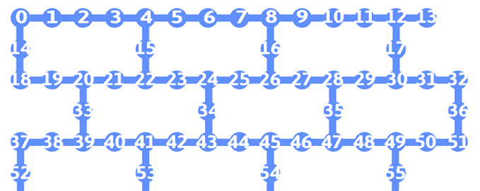

图 8.2：ibm_brisbane 连接图的裁剪视图

在*图 8.2*中，使用`ibm_brisbane`（我们将从现在开始将这个后端设备称为`Brisbane`以简化说明），我们可以看到它不仅是一个 127 量子比特的设备（裁剪以便更容易阅读），而且量子比特以重六边形的形式连接。你可以在这里找到有关此信息的详细信息：[`www.ibm.com/quantum/blog/heavy-hex-lattice`](https://www.ibm.com/quantum/blog/heavy-hex-lattice)。由于处理器的尺寸，一些量子比特的编号可能不清楚，因此你可能需要放大以近距离查看这些内容。此外，请注意，信号可以通过连接在各个量子比特之间双向传输。

现在，让我们可视化`ibm_nazca`的耦合方向图，之后我们将仅称为 Nazca。运行以下单元格：

```py
# Visualize the coupling directional map between the qubits
plot_gate_map(backend_nazca, plot_directed=True) 
```

现在，我们可以看到带有每个量子比特之间耦合方向映射的门图，如图所示：

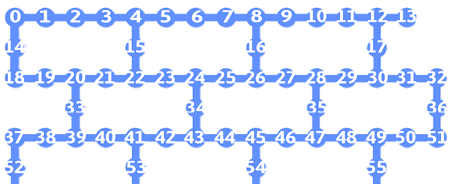

图 8.3：启用耦合方向图的量子比特图视图（ibm_nazca）

你可能会注意到耦合图在这两个系统之间有一些相似之处。

由于量子比特的不同配置，当我们把量子电路上的量子比特映射到硬件设备上的量子比特时，我们创建的量子电路中量子比特的布局可能不是最优的。幸运的是，我们有编译功能，其中包括一个参数设置，允许我们设置电路布局的优化级别。下一节将介绍可用的各种传递，以及用于管理它们使用的传递管理器。

## 理解传递和传递管理器

传递通常用于转换电路，以便它们能够以最佳方式运行。有五种通用的传递类型可以转换电路：

+   **布局选择**确定量子位布局映射如何与所选的后端配置对齐。

+   **路由**根据所选的交换映射类型将 SWAP 门的位置映射到电路中，这可以通过提供耦合图或后端拓扑结构来设置，或者通过使用随机方法来实现，在这种方法中，系统不会假设电路的输入状态是基态/零态，以简化电路。

+   **基变换**提供各种方法来分解或展开门，直到后端的基础门或使用电路的分解规则。

+   **优化**通过移除冗余门（例如，将两个相同的可逆门，如 Hadamard 门，连续放置，从而将量子位恢复到原始状态）来优化电路本身。

+   **电路分析**提供电路信息，例如深度、宽度、操作数量以及有关电路的其他细节。

+   **附加过程**是那些提供某种其他形式的优化，例如各种**检查映射**，这些映射检查 CNOT 门的布局是否与耦合图中声明的方向一致，并在必要时重新排列方向。

我们在*第七章*，*使用 Qiskit 编程*中涵盖了大多数**电路分析**信息，以检测电路的大小、宽度和操作数量。让我们看看第一种过程类型，布局选择，看看我们如何利用提供的布局并了解不同优化级别之间的差异。

### 了解布局选择类型

让我们深入探讨这些类型之一，以获取更多细节。由于我们必须每次将量子位从电路映射到指定的硬件，并且我们希望在量子系统上执行我们的电路，我们将查看布局过程。当您想要将量子位映射到物理设备时，可以选择各种布局过程。这样做的原因可能包括希望您的量子位尽可能靠近以避免有多个 SWAP 门，或者如果您正在从事错误纠正或缓解工作，那么您可能希望将您的门精确映射到物理量子位上，以确保您的实验是一致的。让我们看看一些基本的布局选项：

+   `TrivialLayout`：这种布局将电路量子位按原量子电路中声明的顺序分配给物理设备的量子位。因此，量子位 0 直接映射到物理设备上的量子位 0。

+   `DenseLayout`：这种布局选择具有最多连接量子位子集的布局。如果需要许多纠缠量子位，这种布局将找到一个量子位彼此紧密连接的子集，以避免长距离和交换。

+   `Sabre`：这种布局利用一种量子位映射技术，它查看量子电路的可逆性，它将尝试解释全局电路信息以选择最佳初始布局。

对于上述描述的每个传递，转换器的优化级别都有一个不同的默认设置。优化级别由 4 个级别组成，范围从 0 到 3，指定是否完全不优化电路（级别 0）到完全优化（级别 3）。优化级别越高，生成的电路就越优化；然而，当然需要更多的时间来运行。

在本节中，您将学习如何应用和区分每个级别。

#### 应用默认布局

让我们从默认布局开始。我们将在 transpiler 函数参数中设置各种优化级别，并在以下步骤中将它应用于两个后端设备，`Brisbane`和`Nazca`。需要注意的是，在撰写本文时，所有可用的系统在量子比特之间都有相同的连接性，并且具有非常相似的性质。然而，到本书出版时，将会有具有不同性质的系统，因此，尽管这里的结果可能看起来相同，但您看到的结果（如果您比较的系统不同）可能会有所不同：

1.  我们将重用之前创建的相同的四量子比特量子电路。我将再次包括它，以便于您的使用：

    ```py
    # Quantum circuit with a single and multi-qubit gates
    qc = QuantumCircuit(4)
    qc.h(0)
    qc.cx(0,1)
    qc.cx(0,2)
    qc.cx(0,3)
    circuit_drawer(qc) 
    ```

这将导致我们的基本电路，其中每个 4 个量子比特都通过 CX 门与第一个量子比特，q[0]纠缠。

我们将从`Brisbane`开始，将优化级别设置为`0`，这意味着我们不会在电路中使用任何优化技术。这将导致我们量子电路中的量子比特 `[0,1,2,3]` 映射到后端设备`Brisbane [0,1,2,…,126]`上的相同的量子比特索引值。

1.  在以下代码中，我们将利用`qc`电路，并使用它来测试各种优化级别。然后我们将打印出转换后的电路深度，并使用映射的量子比特作为叠加在后台设备上的覆盖来可视化布局。这将说明不同的方法是如何应用于后台设备的：

    注意，由于转换器的随机部分，您得到的结果可能会有所不同。因此，无论您得到什么结果，都是执行时的最佳结果。为了确保您得到相同的结果，您需要将`transpiler()`函数的`seed_transpiler`参数设置为一个随机整数值。

```py
# Generate a preset pass manager for Brisbane
pass_manager = generate_preset_pass_manager(backend=backend_brisbane, optimization_level = 0)
# Transpile the circuit with an optimization level = 0
qc_brisbane_0 = pass_manager.run(qc)
# Print out the depth of the circuit
print('Depth:', qc_brisbane_0.depth())
# Plot the resulting layout of the quantum circuit after # Layout
plot_circuit_layout(qc_brisbane_0, backend_brisbane) 
```

结果如下，正如预期的那样，其中量子比特没有进行布局优化，并且量子电路到硬件设备的量子比特有直接的映射。请注意，深度为`6464`：

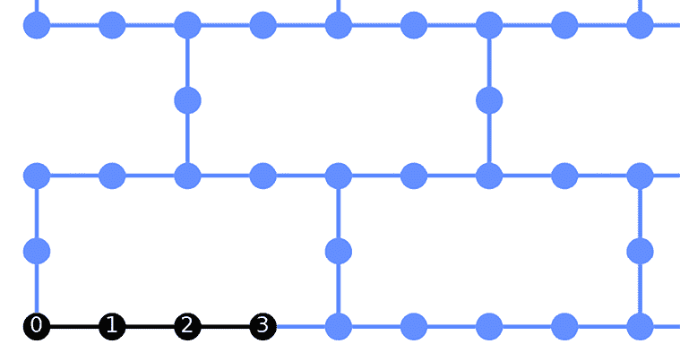

图 8.4：优化级别为 0 的 Brisbane 上的转换量子电路；直接量子比特映射，无变化

1.  现在，让我们在`Brisbane`上绘制转换后的电路：

    ```py
    # Draw the transpiled circuit pertaining to Brisbane
    circuit_drawer(qc_brisbane_0, idle_wires=False, output='mpl') 
    ```

这将使用`Brisbane`上可用的基门渲染转换后的电路；以下图中的电路已被截断以节省空间。

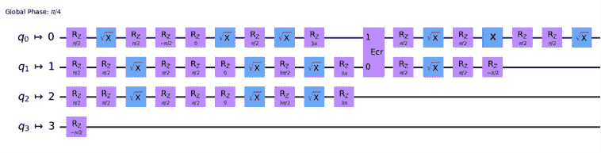

图 8.5：在 Brisbane 上的基本门编译电路

请注意，由于我们在调用`circuit_drawer()`函数时使用了`idle_wires=False`参数，因此未使用的量子比特不可见。如果我们移除此参数，你将看到所有量子比特，即使那些未使用的量子比特。此外，请注意，量子比特映射在电路图的左侧表示，其中电路映射指向物理设备的量子比特。在前面的图中，我们可以看到从电路中，q[0]映射到物理设备上的 0^(th)量子比特（如指示器 q[0] -> 0 所示）。

1.  现在，让我们在`Nazca`上以相同的优化级别设置为`0`运行相同的内容。我们应该看到相同的结果，即编译电路映射到与我们的量子电路相同的量子比特：

    ```py
    # Generate a preset pass manager for Brisbane
    pass_manager = generate_preset_pass_manager(backend=backend_brisbane, optimization_level = 0)
    # Transpile the circuit with an optimization level = 0
    qc_brisbane_0 = pass_manager.run(qc)
    print('Depth:', qc_nazca_0.depth())
    plot_circuit_layout(qc_nazca_0, backend_nazca) 
    ```

上述代码将产生以下深度信息：

```py
Depth: 4040 
```

如下所示，结果布局映射也显示出来：


图 8.6：在 Nazca 上的编译电路

现在，让我们看看`Nazca`量子设备的编译电路。

1.  我们现在将使用以下代码绘制编译电路：

    ```py
    # Draw the transpiled circuit pertaining to Nazca
    circuit_drawer(qc_nazca_0, idle_wires=False, output='mpl') 
    ```

上述代码将显示以下电路：

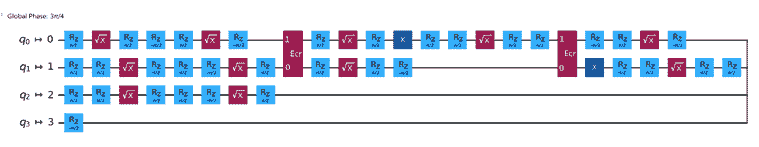

图 8.7：在 Nazca 上的编译电路

需要注意的是，在第一组单量子比特门之后，q[0]和 q[1]之间的多量子比特门集合。这些多量子比特门可以用来创建一个 CNOT、SWAP 或 ROTX 门，由标记为**Ecr**的红色方块表示。这种量子比特之间的信息路由是路由传递的结果，它寻找量子比特之间最优化连接。下图显示了分解后的 SWAP 门。

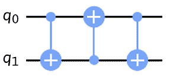

图 8.8：SWAP 门分解

1.  现在，让我们将优化级别最大化到`3`，这将对量子电路进行最高优化：

    ```py
    # Generate a preset pass manager for Brisbane:
    pass_manager = generate_preset_pass_manager(backend=backend_brisbane, optimization_level=3)
    # Transpile the circuit with the optimization level = 3
    qc_transpiled_brisbane= pass_manager.run(qc)
    # Print the depth of the transpiled circuit
    print('Depth:', qc_transpiled_brisbane.depth())
    # Print the number of operations of the transpiled # circuit
    print('Ops count: ', qc_transpiled_brisbane.count_ops())
    # Plot the layout mapping of the transpiled circuit
    plot_circuit_layout(qc_transpiled_brisbane, backend_brisbane) 
    ```

上述代码将在编译电路中打印出总电路深度和操作符总数（`Ops count`），以及量子比特映射到`Brisbane`的渲染。

```py
Depth: 133
Ops count:  OrderedDict([('rz',14), ('sx', 7), ('ecr', 3), ('x', 1)]) 
```

在这里，你会注意到一些你可能之前没有见过的门；你可以在 Qiskit API 文档页面上的电路库中找到每个门的详细信息：[`docs.quantum-computing.ibm.com/api/qiskit/circuit_library`](https://docs.quantum-computing.ibm.com/api/qiskit/circuit_library)。

下图显示了之前提到的量子比特映射的渲染：

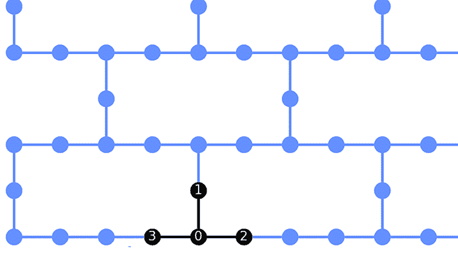

图 8.9：将优化级别设置为 3 的 Brisbane 编译电路

如您在先前的图中所见，为了优化量子电路，量子位顺序从`Brisbane`上的先前的示例中调整。这是由于将`optimization_level`参数设置为 3（最高），它包括映射到最优化量子位。这也突出了两个电路深度之间的差异。

1.  现在让我们绘制编译后的电路，以审查电路布局到后端：

    ```py
    # Redraw the transpiled circuit at new level
    circuit_drawer(qc_transpiled_brisbane, idle_wires=False, output='mpl') 
    ```

结果，如下所示，是与*图 8.6*中的电路相同的电路，但现在映射到不同的量子位上。这个电路与上一个电路的不同之处仅仅在于，编译器将最大优化级别设置为，因此它将量子位操作符映射到最优化量子位上。例如，我们可以看到量子位 0 被映射到量子位 4，如下所示：

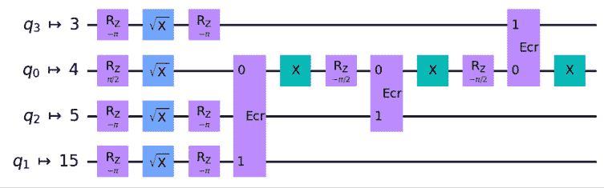

图 8.10：将优化级别设置为 3 的编译电路

1.  我们将在`Nazca`上设置相同的优化级别为`3`，然后编译电路：

    ```py
    # Generate a preset pass manager for Nazca:
    pass_manager = generate_preset_pass_manager(backend=backend_nazca, optimization_level=3)
    # Transpile the circuit with the optimization level = 3
    qc_transpiled_nazca= pass_manager.run(qc)
    # Get the depth and operation count of the transpiled
    # circuit.
    print('Depth:', qc_transpiled_nazca.depth())
    print('Ops count: ', qc_transpiled_nazca.count_ops())
    # Print the circuit layout
    plot_circuit_layout(qc_transpiled_nazca, backend_nazca) 
    ```

这里，总深度相同，操作符的数量和类型也相同：

```py
Depth: 1919
Ops count:  OrderedDict([('rz', 23), ('sx', 13), ('ecr', 3)]) 
```

然而，请注意布局不一定是线性的；它看起来像**T 形**，其中量子位 0 连接到 3 个量子位，就像`Brisbane`那样：

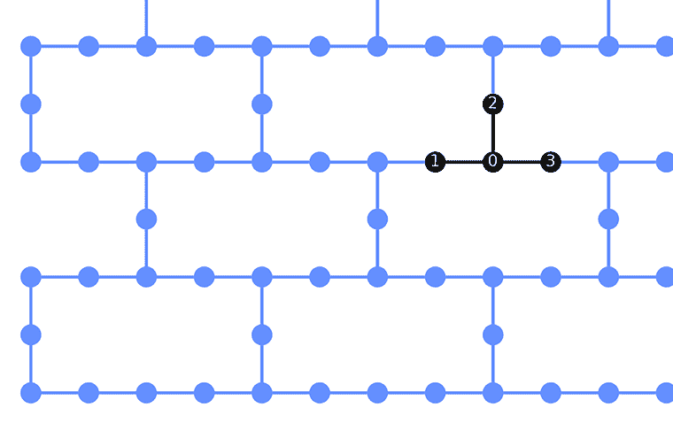

图 8.11：将优化级别设置为 3 的编译电路

如您所见，为了优化电路深度并减少噪声，量子位顺序与在`Nazca`上运行的先前的示例相反。

1.  让我们使用编译后的电路绘制电路，看看这种映射与先前的电路映射相比如何：

    ```py
    # Draw the transpiled circuit
    circuit_drawer(qc_transpiled_nazca, idle_wires=False, output='mpl') 
    ```

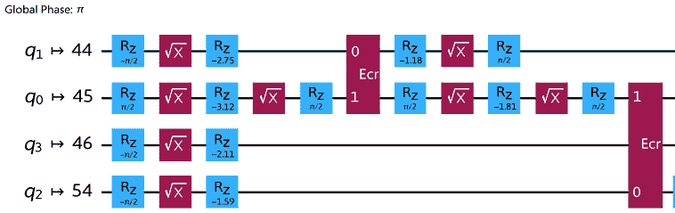

图 8.12：将优化级别设置为 3 的编译电路

注意使用量子位**0**，现在硬件上的量子位**44**，它被映射为电路末尾 ECR（环境控制反转）中连接到其他量子位**0**、**3**和**2**的量子位。这是一个很好的例子，其中优化器将 ECR 门映射到物理量子位上，例如，量子位**45**映射到设备上的量子位**44**、**46**和**54**，以优化除路由之外的其他传递。这种情况的一个原因可能是其中一个传递考虑了量子位的相干时间（弛豫时间，T1），这是量子位可以保持其量子状态的时间，在电路编译时，相干时间最长的量子位是量子位`1`。

#### 应用自定义布局

最后，现在让我们创建我们自己的自定义映射，或称为**拓扑**：

1.  让我们首先回顾现有设备的耦合图；在这种情况下，让我们继续使用具有 127 个量子位的`brisbane`，我们首先将审查后端的配置：

    ```py
    # Set the ibm_brisbane backend device to obtain #configuration
    backend = service.get_backend('ibm_brisbane')
    backend 
    ```

上述代码设置了后端，以便我们可以获取量子设备的配置和属性值。

1.  让我们通过调用后端配置的 `coupling_map` 字段来检查 `ibm_brisbane` 的耦合映射：

    ```py
    # View the backend coupling map, displayed as CNOTs
    # (Control-Target)
    # Extract the coupling map from the backend
    ibm_brisbane_coupling_map = backend.configuration().coupling_map
    # List out the extracted coupling map
    ibm_brisbane_coupling_map 
    ```

上述代码将导致显示 `ibm_brisbane` 的耦合布局数组。您可以通过将其与后端视图进行比较来验证这一点：

```py
[[1, 0],
[2, 1],
[3, 2],
[4, 3],
…
[125.126]] 
```

1.  接下来，我们将绘制耦合映射，以查看默认映射下电路的效率：

    ```py
    # Generate a preset pass manager for Brisbane
    # Set the backend to None so it will force using the coupling map provided:
    pass_manager = generate_preset_pass_manager(backend=None,
    optimization_level=3,
    coupling_map=ibm_brisbane_coupling_map)
    # Transpile the circuit with the pass manager
    qc_custom = pass_manager.run(qc)
    # Draw the resulting custom topology circuit.
    circuit_drawer(qc_custom, idle_wires=False, output='mpl') 
    ```

使用此拓扑，我们的电路现在与我们在 *图 8.10* 中看到的 `brisbane` 不同。在这里，我们看到相同的电路现在基于 `brisbane` 拓扑的早期结果进行编译，如下所示（请注意，这可能会根据系统的校准而变化）：

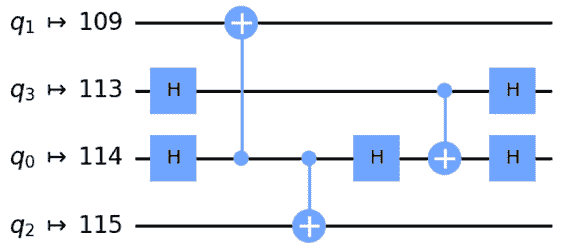 描述自动生成

图 8.13：使用 ibm_brisbane 耦合映射提供的拓扑的自定义电路

1.  到目前为止，您已经从现有的后端系统中提取了耦合映射，在本例中为 `ibm_brisbane`。

1.  现在，让我们创建我们自己的自定义拓扑。为了简单起见，我们将创建一个简单的线性拓扑，其中量子比特以直线形式连接，如下所示：

    ```py
    # Create our own coupling map (custom topology)
    custom_linear_topology = [[0,1],[1,2],[2,3],[3,4]]

    # Generate a preset pass manager
    # Set the backend to None so it will force using the coupling map provided:
    pass_manager = generate_preset_pass_manager(backend=None,
    optimization_level=3,
    coupling_map=custom_linear_topology)
    # Transpile the circuit with the pass manager
    qc_custom = pass_manager.run(qc)
    # Draw the resulting custom topology circuit.
    circuit_drawer(qc_custom, idle_wires=False, output='mpl') 
    ```

上述电路代码的结果显然并不理想：

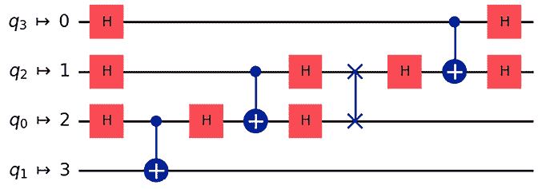 描述自动生成

图 8.14：我们电路的自定义线性拓扑

电路需要许多门，并且相当深，这增加了产生噪声结果的风险。这是优化器重要性的一个很好的说明，优化器处理了许多这些潜在问题。毫不奇怪，在寻找更好的方法来优化电路以避免低效和噪声电路方面，有如此多的研究。然而，拥有自定义拓扑的能力允许您创建最优通行，这可能找到独特和有效的方法来优化电路的映射，用于测试和实验目的。

有许多通行可以优化电路（我们刚刚覆盖了布局，因为它很容易看出差异）。如果您查看通行的完整列表，您会看到，如果您更改通行的顺序，它将改变映射到物理设备时的电路结果。为了解决这个问题，我们需要查看通行管理器。

### 利用通行管理器

通行管理器允许通行之间进行通信，安排哪些通行应该首先执行，并允许将自定义通行包括在通行列表中。这并不像听起来那么简单，因为如果先使用一个通行然后再使用另一个，或者可能无法与其他通行通信，可能会有很大的差异。我们将通过以下步骤使用一个简单的例子来结束本节，创建通行管理器：

1.  我们首先将 `TrivialLayout` 添加到 `PassManager` 并执行电路：

    ```py
    # Import the PassManager and a few Passes
    from qiskit.transpiler import PassManager, CouplingMap
    from qiskit.transpiler.passes import TrivialLayout, BasicSwap
    pm = PassManager()
    # Create a TrivialLayout based on the ibm_brisbane coupling map
    trivial = TrivialLayout(CouplingMap(ibm_brisbane_coupling_map))
    # Append the TrivialLayout to the PassManager
    pm.append(trivial)
    # Run the PassManager and draw the resulting circuit
    tv_qc = pm.run(qc)
    circuit_drawer(tv_qc, idle_wires=False, output='mpl') 
    ```

结果电路如下。注意这个电路的细节，因为我们将会比较这个电路和即将到来的电路（*图 8.16*）的布局差异：

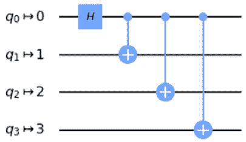

图 8.15：附加了 TrivialLayout 传递的 PassManager 电路

1.  很快我们将通过路由传递类型探索传递管理器的功能。当添加 SWAP 门来连接未直接连接在物理设备上的量子位时，我们看到了一些这方面的内容。在以下步骤中，我们将查看优化这些 SWAP 门路由的传递。

1.  在以下代码中，我们将创建一个`BasicSwap`传递，在电路上重新运行`PassManager`，并将结果与之前的电路进行比较：

    ```py
    # Create a BasicSwap based on the ibm_brisbane coupling
    # map we used earlier
    basic_swap = BasicSwap(CouplingMap(ibm_brisbane_coupling_map))
    #Add the BasicSwap to the PassManager
    pm = PassManager(basic_swap)
    # Run the PassManager and draw the results
    new_qc = pm.run(qc)
    circuit_drawer(new_qc, idle_wires=False, output='mpl') 
    ```

之前的代码将在构造时创建一个`BasicSwap`路由器并将其添加到`PassManager`。执行后的电路结果如下：

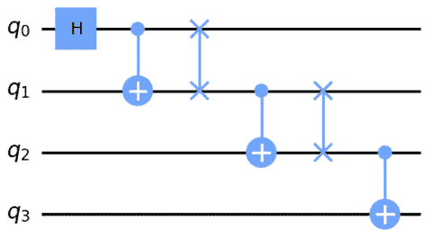

图 8.16：带有 BasicSwap 路由器传递的 PassManager 电路

如您所见，电路将适应从`PassManager`调用的每个传递过程 - 在这种情况下，我们在代码中将`BasicSwap`传递添加到`PassManager`中，然后以一种形式渲染了电路映射，而`TrivialLayout`传递则以不同的形式渲染。这样做可以让你在`PassManager`的优化过程中对各种传递的执行顺序进行排序。拥有这种能力为你提供了测试如何优化电路在后台设备上的映射和运行方式的方法。

让我们花点时间消化一下我们到目前为止所学的内容。当使用`optimization_level`选项在后台执行我们的电路时，`PassManager`会根据所选的具体级别使用预设的传递（即，0、1、2 或 3）。我们在这里做到的是自定义要使用哪些传递以及它们的顺序，就像我们在之前的代码中添加 BasicSwap 传递时做的那样。拥有这种能力不仅为你提供了实验各种传递序列的灵活性，你还可以创建自己的传递并与现有的传递进行比较。

现在你已经熟悉了传递管理器，你可以看到，如果你想以某种方式组合使用传递，从而在修改过程中提高电路的优化，它们可以非常有帮助。

在本节中，我们还学习了编译器以及它如何提供优化电路的方法。我们还学习了使用布局优化器转换和优化电路。

本章的下一段内容更加直观，通过以不同的样式和操作流程（如**DAGs**）渲染电路。这些功能提供了一种以不同形式查看电路及其功能的方法，而不是默认的电路视图，这是我们迄今为止所看到的方式。

# 可视化和增强电路图

本节将重点介绍 Qiskit 中可用的各种可视化。我们迄今为止所使用的图表来自 Qiskit 的默认可视化库。然而，我们可以指定其他更适合你文档目的的绘图工具。比如说，如果你正在编写一篇使用**LaTeX**的研究论文，并且想使用 LaTeX 内容。

通过简单地添加来自 Qiskit 可视化库的样式参数，然后你可以利用可视化库中包含的许多功能。我们现在将介绍其中的一些，以帮助你入门。

## 了解定制可视化电路

在渲染电路时，通常需要或方便以适合你文档格式的格式呈现结果。这就是 Qiskit 的`circuit_drawer`功能派上用场的地方，它具有各种功能。让我们从一个简单的量子电路开始，以说明各种视觉渲染示例：

1.  首先，让我们创建一个包含各种操作符的量子电路，以获得各种格式中所有视觉组件的良好表示：

    ```py
    # Sample quantum circuit
    qc = QuantumCircuit(4)
    qc.h(0)
    qc.cx(0,1)
    qc.barrier()
    qc.cx(0,2)
    qc.cx(0,3)
    qc.barrier()
    qc.cz(3,0)
    qc.h(0)
    qc.measure_all()
    # Draw the circuit using the default renderer
    circuit_drawer(qc, output='mpl') 
    ```

这将渲染以下电路图，它只是门的一个随机表示。这个电路并没有做任何特别的事情；它只是用来表示各种组件。作为一个选项，你可以使用`random_circuit`方法来创建一个随机电路：

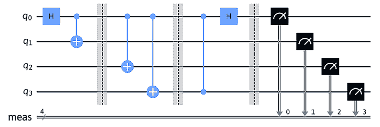

图 8.17：使用默认库进行电路渲染

1.  接下来，我们将使用`latex`渲染前面的电路：

    ```py
    circuit_drawer(qc, output='latex') 
    ```

这将渲染电路的`latex`版本：

如果你在这个平台上运行的不是本地机器，你可能会收到一些警告或错误，表明你需要安装一些文件依赖项，例如安装`pylatexenc`。要安装这个库，你需要在单元格中首先运行`pip install pylatexenc`，然后重新启动内核。

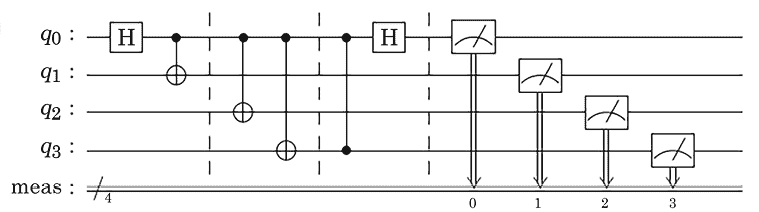

图 8.18：使用 latex 库进行电路渲染

1.  如果你计划将你的电路发布到网站、博客或社交媒体上，并且想在图片中包含一些样式，你也可以通过传递样式内容作为参数来实现，例如`backgroundcolor`、`gatetextcolor`和`fontsize`，仅举几个例子：

    ```py
    # Define the style to render the circuit and components
    style = {'backgroundcolor': 'lightblue','gatefacecolor':     'white', 'gatetextcolor': 'black', 'fontsize': 9}
    # Draw the mpl with the specified style
    circuit_drawer(qc, style=style, output='mpl') 
    ```

前面的代码结果是对背景、门颜色方案和字体大小进行调整，如图所示：

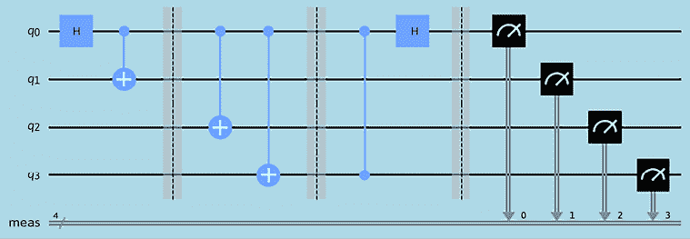

图 8.19：在 matplotlib 上使用自定义样式字典渲染的电路

要使用样式设置，你必须使用输出`matplotlib`，因为这这是唯一支持样式的库。

可用样式列表的详细信息可以在 Qiskit API 文档的*样式字典详细信息*部分找到（[`docs.quantum-computing.ibm.com/api/qiskit/qiskit.visualization.circuit_drawer`](https://docs.quantum-computing.ibm.com/api/qiskit/qiskit.visualization.circuit_drawer)）。

最后，我们将涵盖电路作为 DAG 的完整视图，这将有助于将电路作为图来理解其流程。

## 绘制电路的有向无环图

随着电路变大，它们自然会变得更加复杂，甚至可视化电路也可能变得复杂。想象一下有数千个量子比特且深度超过 1,000 的电路。这将很难渲染，几乎不可能阅读。这就是 DAG 可能有所帮助的地方。让我们基于之前创建的电路创建一个 DAG 来展示渲染，并看看该电路的 DAG 看起来如何。

在下面的代码中，你需要两个组件；第一个是电路到 DAG 转换器。这将把电路转换成一个 DAG。第二个组件是 DAG 绘制器，它将绘制出 DAG，其中节点表示量子寄存器、经典寄存器、量子门、屏障和测量算子。边是有方向的，这说明了电路的流程：

```py
# Import the Circuit to DAG converter
from qiskit.converters import circuit_to_dag
# Import the DAG drawer
from qiskit.visualization import dag_drawer
# Convert the circuit into a DAG
dag = circuit_to_dag(qc)
# Draw the DAG of the circuit
dag_drawer(dag) 
```

这导致了以下 DAG 的渲染：

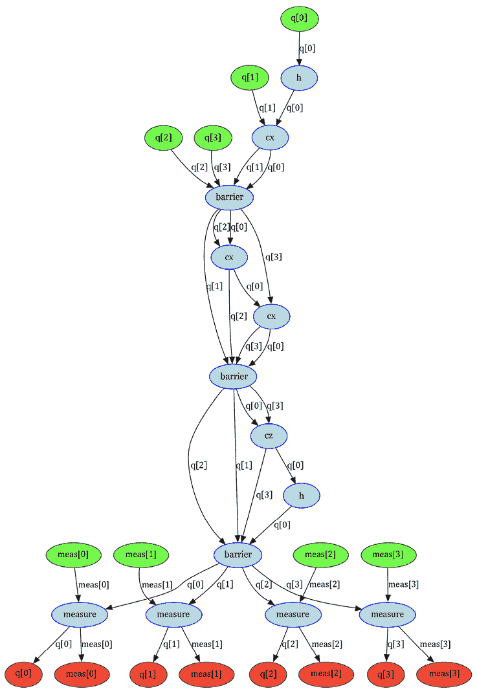

图 8.20：量子电路的 DAG 表示

DAG 可以帮助从上到下说明电路的流程和预期路径，其中顶层是第一个操作，并且随着你遍历图，每个操作都会附加。例如，前面的图从顶部的绿色量子比特开始，然后跟随图，我们看到每个量子比特（由节点之间的边标签表示）都受到一个指定的操作（由节点表示）的作用。图在红色的末端结束，其中对量子比特应用的测量映射到指定的经典比特，由参数值表示。

在本节中，我们学习了在自定义可视化电路的帮助下可视化电路图。我们还学习了如何使用 DAG 来增强我们的电路图并可视化电路的路径。

# 摘要

在本章中，你学习了在当前存在的许多量子计算机上运行电路时优化电路的各种方法。你还了解了可用于优化指定量子设备上电路执行的不同遍历。这包括生成遍历管理器，它允许你根据所选的优化级别自定义要利用的遍历，并允许你选择它们的顺序。

我们随后介绍了拓扑和耦合图，这有助于你理解了解设备配置的重要性，尤其是当你想要创建自己的传递函数时。通过以各种格式可视化电路，你现在拥有了自定义图像渲染的技能，尤其是如果你在记录你的工作并希望保持某种外观和感觉时。最后，我们通过使用 DAGs 来介绍了电路操作流程的替代渲染方式。

在下一章中，我们将学习与量子系统相关的各种噪声，以了解我们如何创建可以用于模拟和识别减轻和运行更高效算法的噪声模型。

# 问题

1.  你能说出 transpiler 的两个组件吗？

1.  哪个组件允许你指定要使用的传递函数？

1.  运行 transpile() 函数时，默认的 `optimization_level` 值是多少？

1.  列出三个布局选择传递函数。

# 加入我们的 Discord

加入我们社区的 Discord 空间，与作者和其他读者进行讨论：

`packt.link/3FyN1`


