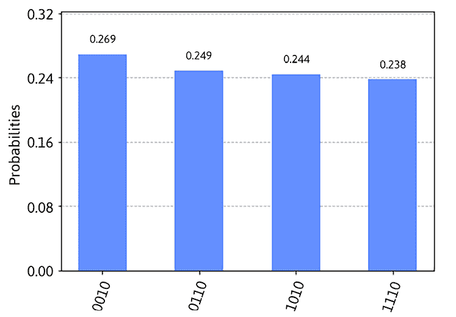
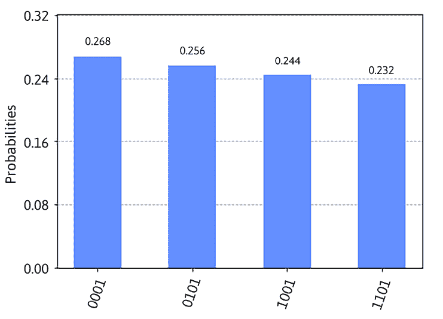
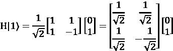

# 9

# 模拟量子系统和噪声模型

**Qiskit**是高性能后端提供商，可用于执行量子电路。可用的各种后端模拟器可以以独特的方式使用，每个都可以提供有关你的电路的不同信息。Qiskit 还提供各种工具，可以用来构建噪声模型以模拟真实量子设备上发生的各种错误。如果你需要比较理想模拟器和复制量子设备噪声效应的模拟器之间的结果差异，这些工具非常有帮助。

模拟器和如**噪声模型**之类的工具将帮助你理解一些结果上的原因，以及如果你以后想自己减轻这些错误，它们将提供见解。

本章将涵盖以下主题：

+   理解模拟器之间的差异

+   生成噪声模型

+   构建你自己的噪声模型

+   使用自定义噪声模型执行量子电路

在本章中，我们将回顾 Qiskit 模拟器，并理解它们之间的差异以及每个模拟器提供的独特功能。我们还将深入研究基于指定后端设备可以生成的 Qiskit 噪声模型，以便我们能够在理想的 Qiskit 模拟器上模拟噪声。

在阅读本章后，你将能够在模拟器上重现类似的噪声效应。这将使你能够观察噪声如何影响我们的结果，这将使我们能够模拟真实的量子设备。最后，我们将介绍如何创建你自己的噪声模型并将它们应用于你的电路。

# 技术要求

在本章中，我们假设你已经熟悉了前几章中描述的量子电路的基本知识，例如创建和执行量子电路、获取后端属性和配置、定制和可视化电路图，并且你应该了解量子比特逻辑门操作符和状态。此外，对噪声效应（如退相时间）有一定的了解将非常理想；然而，我们将在本章中涵盖一些基础知识作为复习。你需要安装**qiskit-aer**的最新版本来运行本章中的笔记本；详细信息可以在 Qiskit 文档中找到：[`qiskit.github.io/qiskit-aer/getting_started.html`](https://qiskit.github.io/qiskit-aer/getting_started.html).

本书所使用的完整源代码如下：[`github.com/PacktPublishing/Learning-Quantum-Computing-with-Python-and-IBM-Quantum-Second-Edition`](https://github.com/PacktPublishing/Learning-Quantum-Computing-with-Python-and-IBM-Quantum-Second-Edition).

# 理解模拟器之间的差异

在本节中，您将了解 Qiskit Aer 中包含的各种模拟器后端，包括它们之间的差异和独特的特性。请注意，您需要单独安装**qiskit-aer**，因为它不是 Qiskit 基础安装的一部分。

这些特性包括生成噪声模型和配置模拟器后端，允许您利用修改其行为和特性以满足您的需求。

我们将了解以下模拟器和它们的关键特性：

+   **Aer 模拟器**，通过多次射击执行量子电路以模拟有噪声的后端量子系统

+   **Statevector 模拟器**，提供量子电路的状态向量

+   **Unitary 模拟器**，提供正在执行的量子电路的单位矩阵

让我们继续，看看量子系统，在此处简称为后端。

## 查看所有可用的后端

如果您已经阅读了本书的前几章，那么您应该已经了解我们使用的一些模拟器。让我们从显示来自各种来源的每个可用模拟器开始。

我们将在 IQP 上创建一个新的**笔记本**，并运行自动生成的单元格，以确保您已加载一些基础类和方法，并加载您的账户信息，以便我们可以访问 IQP：

1.  我们将首先导入一些有用的类和函数，包括辅助文件中的那些：

    ```py
    # Load helper file and import functions:
    %run helper_file_1.0.ipynb
    from qiskit import QuantumCircuit, transpile
    from qiskit_aer import AerProvider, AerSimulator, QasmSimulator, StatevectorSimulator, UnitarySimulator
    from qiskit.visualization import *
    from qiskit_ibm_runtime import QiskitRuntimeService, Sampler, Estimator, Session, Options
    # Load your IBM Quantum account(s)
    service = QiskitRuntimeService(channel="ibm_quantum") 
    ```

1.  接下来，我们将使用以下代码显示 Qiskit Aer 库中所有可用的模拟器：

    ```py
    # View all available backends
    provider = AerProvider()
    provider.backends() 
    ```

这将显示所有可用的模拟器列表：

```py
[AerSimulator('aer_simulator'),
 AerSimulator('aer_simulator_statevector'),
 AerSimulator('aer_simulator_density_matrix'),
 AerSimulator('aer_simulator_stabilizer'),
 AerSimulator('aer_simulator_matrix_product_state'),
 AerSimulator('aer_simulator_extended_stabilizer'),
 AerSimulator('aer_simulator_unitary'),
 AerSimulator('aer_simulator_superop'),
 QasmSimulator('qasm_simulator'),
 StatevectorSimulator('statevector_simulator'),
 UnitarySimulator('unitary_simulator')])] 
```

1.  以下代码将列出`Qiskit-Aer`库中的模拟器。如果您不想安装 Aer 而只想使用 Qiskit，这些模拟器也作为 Python 内置模拟器可用。为了简单性和性能考虑，我们将在这本书中使用 Qiskit 模拟器。然而，您当然可以根据需要将 Aer 模拟器与`service`中列出的实际量子系统进行交换。但由于我们想要节省使用时间，让我们继续使用这些基本电路和学习概念。

1.  最后，我们可以列出从 Qiskit Runtime Service 可用的所有量子系统：

    ```py
    # View all available IBM Quantum backends
    service.backends() 
    ```

这不仅会列出模拟器，还会根据您的账户列出您可用的真实量子设备。所列出的设备将根据可用设备和升级而变化，自本写作以来：

```py
[<IBMBackend('ibm_brisbane')>,
 <IBMBackend('ibm_kyiv')>,
 <IBMBackend('ibm_nazca')>,
 <IBMBackend('ibm_sherbrooke')>,
 <IBMBackend('ibm_kyoto')>,
] 
```

由于本章专注于模拟器，我们将从 Qiskit 库中安装的本地模拟器开始学习。我们将从 Aer 模拟器开始，我们可以使用它来执行小型电路。

## 在 Aer 模拟器上运行电路

**Aer 模拟器**不仅用于执行量子电路，而且由于其能够应用各种模拟方法和配置选项，因此非常灵活。

一些可用的模拟方法如下所述：

+   `statevector`: 这是 Aer 库中的状态向量模拟，允许在量子电路末尾进行理想测量。此外，每个执行电路的射击都可以从噪声模型中采样随机噪声，以提供有噪声的模拟。

+   `density_matrix`: 此方法提供密度矩阵模拟，类似于状态向量，在每个电路末尾给出测量值来采样量子电路。

+   `matrix_product_state`: 这是一个张量网络状态向量模拟器，它利用矩阵乘积状态作为状态的表示。

+   `automatic`: 如果没有设置方法，则此方法将根据量子比特数、量子电路和噪声模型自动选择一个。

可用的后端选项有很多；下面是`backend_options`可用选项的一个子集：

+   `device`: 此选项设置模拟设备，默认设置为`CPU`。然而，`statevector`、`unitary`和`density_matrix`模拟器也可以在配备 Nvidia **图形处理单元**（**GPU**）的系统上运行。要将模拟器配置为 GPU，只需设置选项参数`device='GPU'`。

+   `precision`: 此选项将浮点数设置为单精度或双精度；默认为`double`。将精度设置为`single`将减半后端所需的内存，这可能在某些系统上提供一些性能提升。

+   `zero_threshold`: 此选项将小值截断为 0，并将非常小的值截断。默认截断值设置为 1e-10，但可以根据开发者的需求进行调整。

+   `validation_threshold`: 此阈值用于验证量子电路的初始状态向量是否有效，默认值设置为 1x10^(-8)。

+   `max_parallel_threads`: 将此参数设置为（默认值）`0`将使模拟器能够在所有可用核心上运行。

+   `max_parallel_experiments`: 这是**qobj**（**QASM 对象**）的最大数量，它代表 Qiskit 提供程序并行运行电路的单个有效负载。最大值不能超过`max_parallel_threads`值。如果最大值设置为`0`，则将其设置为`max_parallel_threads`值。

+   `max_parallel_threads`: 此选项设置并行化的最大 CPU 核心数。默认值设置为`0`，这意味着它将设置为 CPU 核心的最大数量。

+   `max_memory_mb`: 将此参数设置为`0`将使模拟器最大化系统内存的大小以存储状态向量；默认值设置为`0`。如果需要更多内存，将抛出错误。作为参考，n 个量子比特的状态向量使用 2^n 个大约 16 字节的复数值。

现在您已经了解了模拟方法和后端选项，我们将创建一个简单的电路，并使用 Aer 的`QasmSimulator`类执行它。对于这个例子，我们将创建我们迄今为止一直在使用的相同电路示例，由 Hadamard 和 CX 门组成，这使量子电路处于叠加态并将两个量子比特纠缠在一起：

在这里，我们创建了一个 2 量子比特和 2 位电路；当使用`measure_all()`函数时，我们需要将`add_bits`参数设置为`False`，这样它就不会添加经典比特，因为我们已经在`QuantumCircuit`构造函数中添加了它们。

```py
# Create a quantum circuit
qc = QuantumCircuit(2, 2)
qc.h(0)
qc.cx(0, 1)
qc.measure_all(add_bits=False) 
```

现在，让我们使用`get_backend()`函数创建 Aer 模拟器：

```py
# Instantiate the QASM simulator from the Aer provider
backend_simulator = QasmSimulator()
# Transpile the circuit transpiled_qc = transpile(qc, backend_simulator)
# Run the circuit using the transpiled circuit
job = backend_simulator.run(transpiled_qc)
# Print out the result counts
result = job.result()
counts = result.get_counts(qc)
print(counts) 
```

这将打印出在 Aer 模拟器上执行量子电路的结果，方法设置为状态向量，获得结果计数。

如您所见，这运行的结果与您运行`aer_simulator`如下所示：

```py
# Get the Aer simulator and set the backend options
aer_simulator = AerSimulator(method='statevector')
# Transpile the circuit
transpiled_qc = transpile(qc, aer_simulator) # Run the circuit with the Aer simulator
job = aer_simulator.run(transpiled_qc)
print(job.result().get_counts(qc)) 
```

这两种形式都以相同的方式执行电路，当然结果中的值会有所不同。在这里，您可以查看结果，它们总共运行了 1024 次射击，这是默认设置的：

```py
{'00': 501, '11': 523} 
```

我们将在下一节继续扩展后端选项，包括我们可能发现有用的其他参数，例如射击和内存。

### 向后端选项添加参数

我们可能已经熟悉了`shots`参数，它指定了在后端上执行电路的次数。然而，如前一个示例所示，返回的计数是所有射击的总值，而不是每个结果返回的顺序。可能存在您希望按时间顺序检查每个射击结果的情况。

要检查存储在各个内存槽中的测量结果，您需要在后端选项中设置`memory`参数。让我们重新运行之前的电路；然而，这次我们将`memory`标志设置为`True`并显示结果。这次我们将只运行 10 次以避免输出一个非常长的字符串：

```py
# Run the circuit on the simulator and set the memory to True
# Run the transpiled circuit using the backend options created
job = backend_simulator.run(transpiled_qc, shots=10, memory=True)
result = job.result()
# Pull the memory slots from the results
memory = result.get_memory(transpiled_qc)
# Print the results from the memory slots
print('Memory results: ', memory) 
```

这将输出电路执行的 10 个内存槽条目结果。请注意，结果为`00`和`11`的变体组合，正如电路所预期的：

```py
Memory results: ['00', '11', '11', '11', '00', '00', '00', '11', '00', '11'] 
```

将内存功能集成到 Aer 模拟器中，您将能够可视化电路计数的每个结果。下一节将说明如何初始化和设置所有或仅部分量子比特。

### 在电路中初始化量子比特

如我们早期所学的，每个量子比特被初始化为基态，或称为状态。然而，有时我们可能希望设置一个不同的初始状态。幸运的是，Aer 模拟器允许我们将电路的状态初始化为除所有状态之外的某个状态，。

我们将按照以下步骤初始化量子比特：

1.  在上一个示例中，我们创建了一个包含 Hadamard 门和控制非门的电路，以获得  或  的纠缠态结果。在这个示例中，我们将初始化我们的电路，以便结果相同，而无需添加任何门：

    ```py
    # Construct a 2 qubit quantum circuit
    qc_init = QuantumCircuit(2, 2)
    # Import numpy to simplify some math for us
    import numpy as np
    # Select the qubits by their index which you wish to initialize
    init_qubits = [0, 1]
    # Inititialize qubit states
    qc_init.initialize([1, 0, 0, 1] / np.sqrt(2), init_qubits)
    # Add measurements and draw the initialized circuit
    qc_init.measure(range(2), range(2))
    qc_init.decompose()
    qc_init.draw(output="mpl") 
    ```

这导致了以下电路图：


图 9.1：初始化量子位到非零初始状态

注意，量子位被集体初始化到  的状态。现在，这个电路有一个初始化状态，如果您希望电路从非基态/零态开始，可以应用于任何电路。在需要每次运行时更新以优化其结果的变分量子算法中，初始化状态可能是必要的。

1.  现在，让我们执行这个电路并观察每个结果：

    ```py
    # Set the memory to True so we can observe each result
    result = backend_simulator.run(qc_init, shots=10,
        memory=True).result()
    # Retrieve the individual results from the memory slots
    memory = result.get_memory(qc_init)
    # Print the memory slots
    print(memory) 
    ```

这将输出以下结果：

```py
['11', '11', '00', '11', '11', '00', '00', '00', '11', '00'] 
```

如您从结果中观察到的，我们只得到了预期的两种初始化状态结果，即  或 。

1.  现在，您不必初始化电路中的所有量子位；您也可以指定要初始化的一组量子位，如下面的代码所示：

    ```py
    # Create a 4 qubit circuit
    qc_init2 = QuantumCircuit(4, 4)
    # Initialize only the last 3 qubits
    initialized_qubits = [1, 2, 3]
    # Set the initial state, remember that the sum of # amplitudes-squared must equal 1
    qc_init2.initialize([0, 1, 0, 1, 0, 1, 0, 1] / np.sqrt(4), 
                        initialized_qubits)
    # Add a barrier so it is easier to read
    qc_init2.barrier(range(4))
    # Measure qubits, decompose and draw circuit
    qc_init2.measure(range(4), range(4))
    qc_init2.decompose()
    qc_init2.draw(output='mpl') 
    ```

这导致了以下电路，它初始化了 `q_1` 到 `q_3` 量子位的状态，而所有其他初始化的量子位仍然处于基态/零态：


图 9.2：最后三个量子位的初始化

在这里，我们的 3 量子位初始化状态设置为 。然而，由于我们正在执行一个 4 量子位电路，并且我们已经初始化了最后 3 个量子位，我们的结果应该包括第四个量子位（q[0]），这将向最低有效位添加一个 0。

1.  让我们运行实验，看看部分量子位的初始状态是否成功：

    ```py
    # Execute the circuit and print results and histogram
    result = backend_simulator.run(qc_init2).result()
    counts = result.get_counts(qc_init2)
    print(counts)
    plot_distribution(counts) 
    ```

如预期的那样，我们的结果如下（请注意，由于电路的随机性，实际结果可能会有所不同）：

```py
{'0010': 275, '1010': 250, '0110': 255, '1110': 244} 
```

我们还得到了以下输出图：



图 9.3：初始化量子电路的结果

如您所见，结果与我们预期的完全一致。请注意，最低有效位（最右边的位）始终设置为 0，因为它不是初始化的量子位之一。其他需要注意的事情是其他位正好如我们预期的那样，，其中粗体表示初始化的位，如果您将它们全部组合起来，它们将提供显示的结果。

1.  现在我们已经初始化了一个电路，我们可以根据需要应用任何门。唯一的区别是，初始化后应用到电路上的门将应用于每个量子比特的初始化状态，而不是默认的初始化状态 。让我们通过向所有量子比特添加一个 NOT（X）门来测试这一点。这应该会导致所有值翻转：

    ```py
    # Create a 4-qubit circuit
    qc_init_x = QuantumCircuit(4, 4)
    # Import numpy
    import numpy as np
    # Initialize the last 3 qubits, same as before
    initialized_qubits = [1, 2, 3]
      qc_init_x.initialize([0, 1, 0, 1, 0, 1, 0, 1] /
    np.sqrt(4), initialized_qubits)
    # Add a barrier so it is easier to read
    qc_init_x.barrier(range(4))
    # Include an X gate on all qubits
    for idx in range(4):
        qc_init_x.x(idx)
    # Measure and draw the circuit
    qc_init_x.measure(range(4), range(4))
    # Decompose the circuit down a level
    qc_init_x.decompose()
    # Draw the completed circuit
    qc_init_x.draw(output='mpl') 
    ```

这导致了以下电路：


图 9.4：在测量之前对所有量子比特应用 X 门的初始化量子电路

注意初始化的量子比特与之前相同，只是在测量之前我们添加了所有量子比特的 X 门。这应该会导致所有位从 0 翻转到 1，反之亦然。

1.  让我们使用以下代码执行电路并显示结果：

    ```py
    # Execute and get counts
    result = backend_simulator.run(qc_init_x).result()
    counts = result.get_counts(qc_init_x)
    print(counts)
    plot_distribution(counts) 
    ```

结果完全符合预期；结果是基于初始化状态，然后是所有量子比特上应用的 NOT 门：

```py
{'0101': 256, '0001': 268, '1101': 232, '1001': 244} 
```

我们还可以看到以下图表：



图 9.5：对所有量子比特应用 X 门后的初始化电路的结果

Aer 模拟器的灵活性和可配置性意味着能够创建具有初始化量子比特状态能力的自定义电路是一个很大的优势。我们将在第十二章“理解量子算法”中更详细地看到这一点，我们将看到这是如何应用于变分或其他混合量子算法的。

现在我们已经熟悉了 Aer 模拟器，让我们继续介绍状态向量模拟器，看看我们有哪些独特的功能可用。

## 在状态向量模拟器上运行电路

**状态向量模拟器**，就像 Aer 模拟器一样，允许您初始化和执行量子电路。当然，有一些明显的区别，其中之一是它通过单次执行返回量子电路的状态向量。这允许您捕获状态向量的快照，以便您可以在某种程度上计算或观察量子比特上的预期结果。因为状态向量模拟器模拟了量子电路的理想执行，并在模拟结束时产生设备的最终量子状态向量，所以这个结果可以用于调试或教育目的。

我们还将利用一些 Aer 可视化工具来帮助显示量子比特和量子电路的状态信息。我们将按照以下步骤进行：

1.  首先，让我们创建一个简单的 1 量子比特电路，并向其中添加一个 Hadamard 门，以便我们有一个处于叠加态的量子比特：

    ```py
    # Construct quantum circuit
    qc = QuantumCircuit(1)
    # Place qubit in superposition
    qc.h(0)
    qc.draw(output='mpl') 
    ```

结果如下，我们有一个处于叠加态的单个量子比特，即  和 ![img/B18420_05_005.png] 的复数线性组合：


图 9.6：具有 Hadamard 门的单个量子比特电路

1.  接下来，我们想查看电路的状态向量表示。在编码之前，让我们回顾一下相关的数学知识。我们知道每个基态都由状态向量表示，例如以下为状态的状态向量：


同样，状态可以用以下状态向量表示：


1.  量子比特的初始状态为 。Hadamard 门通常将 Hadamard 矩阵应用于量子比特的当前状态，从而使量子比特处于叠加态。因此，如果将 Hadamard 门应用于处于状态的量子比特，操作如下：


将矩阵乘以向量得到以下结果：


1.  现在，让我们使用状态向量模拟器执行我们的电路，并输出状态向量值：

    ```py
    # Select the Statevector simulator from the Aer provider
    simulator = StatevectorSimulator()
    # Transpile the circuit
    transpiled_qc = transpile(qc, simulator)
    # Run the transpiled circuit
    result = simulator.run(transpiled_qc).result()
    # Get the state vector and display the results
    statevector = result.get_statevector(transpiled_qc)
    statevector 
    ```

从结果中，我们可以通过简单地从`Job`对象中提取它来获得量子电路的状态向量，在这种情况下，`result.get_statevector()`。

这应该产生以下输出，正确匹配我们的预期结果，包括状态向量矩阵维度信息，并且结果中的振幅值正好是。此外，如果我们平方振幅，结果将为我们提供获得 0 或 1 的概率。状态向量结果表示当我们按照第 3 步中描述的将 Hadamard 应用于初始状态向量时预期的结果：

```py
Statevector([0.70710678+0.j, 0.70710678+0.j], dims=(2,)) 
```

1.  让我们通过添加另一个叠加量子比特来扩展这个例子：

    ```py
    # Construct quantum circuit
    qc = QuantumCircuit(2)
    # Place both qubits in superposition
    qc.h(0)
    qc.h(1)
    qc.draw() 
    ```

该电路的结果与之前类似，只是增加了一个额外的量子比特：


图 9.7：两个叠加的量子比特

1.  让我们使用状态向量模拟器运行这个电路，并打印出我们状态向量的结果：

    ```py
    # Transpile the circuit
    transpiled_qc = transpile(qc, simulator)
    # Run the circuit using the state vector simulator
    result = simulator.run(transpiled_qc).result()
    # Extract the state vector of the circuit from the # results
    statevector = result.get_statevector(transpiled_qc)
    # Output the state vector values
    statevector 
    ```

这产生了以下输出，表示所有 4 种可能状态具有相等的振幅，，和：

```py
Statevector([0.5+0.j, 0.5+0.j, 0.5+0.j, 0.5+0.j], dims=(2,2)) 
```

在这里，如果我们对每个值进行平方以获得概率测量，我们会看到每个都有 25%的正确概率。回想一下，所有概率的总和必须为 1。

1.  最后，让我们将量子比特纠缠起来，看看当我们对第一个量子比特应用 Hadamard 门时，状态向量结果会是什么：

    ```py
    # Construct quantum circuit
    qc = QuantumCircuit(2)
    # Place the first qubit in superposition
    qc.h(0)
    # Entangle the two qubits together using a CNOT gate,
    # where the first is the control and the second qubit is
    # the target
    qc.cx(0, 1)
    # Transpile the circuit
    transpiled_qc = transpile(qc, simulator)
    # Run the circuit on the state vector simulator
    result = simulator.run(transpiled_qc).result()
    # Obtain the state vector of the circuit
    statevector = result.get_statevector(transpiled_qc)
    # Output the state vector values
    statevector 
    ```

状态向量结果符合预期，00 和 11 的振幅值相等，01 和 10 状态没有值：

```py
Statevector([0.70710678+0.j, 0.+0.j, 0.+0.j, 0.70710678+0.j], dims=(2,2)) 
```

1.  我们还可以寻求可视化工具的帮助，以帮助我们说明我们刚刚执行的电路的状态向量结果。我们将添加`plot_state_city`向量函数：

    ```py
    # Display state vector
    plot_state_city(statevector) 
    ```

结果与之前看到的是相同的值，只是在这里我们可以看到实部（左）和虚部（右）的振幅。当我们对结果的振幅进行平方时，我们将得到 00 和 11 状态的 50% 概率，这正是我们在以下状态矢量图中看到的。状态矢量图是描述 3D 柱状图视图（通常是二维）的术语。这个术语被用来描述二维图上的柱状图看起来像城市中的建筑。在这种情况下，我们有两个：一个代表状态矢量的实数值，另一个代表虚数值。

注意，在我们的结果中，状态矢量 `1.`+`0.j` 的任何虚部都没有值：


图 9.8：包含实部（左）和虚部（右）的状态矢量图

状态矢量图有助于可视化 2-比特的密度矩阵，该矩阵本身具有 16 个复数比特振幅。密度矩阵的话题超出了本书的范围，但简而言之，它通常是一种表达所有量子状态（如  和 ）的替代方法，这里与预期的测量结果相同，但允许我们使用密度矩阵来数学地描述这些状态。

描述密度矩阵及其使用的详细信息可以在以下文档中找到：[`docs.quantum.ibm.com/api/qiskit/qiskit.quantum_info.DensityMatrix`](https://docs.quantum.ibm.com/api/qiskit/qiskit.quantum_info.DensityMatrix)。

状态矢量图并不是我们拥有的唯一可视化工具。另一个可用的出色工具是 **Qiskit qsphere**。它将状态矢量绘制到二维图上，并包括独特的可视化功能，允许您看到对状态矢量振幅进行平方时的概率结果和相位。

1.  让我们在 qsphere 上绘制来自相同状态矢量的概率结果：

    ```py
    # Import the plot_state_qsphere class
    from qiskit.visualization import plot_state_qsphere
    %matplotlib inline
    # Create quantum circuit
    qc = QuantumCircuit(1)
    # Place the qubit in a superposition state
    qc.h(0)
    # Execute the circuit on the statevector simulator
    backend = StatevectorSimulator()
    # Tanspile and run the circuit on the statevector simulator
    transpiled_qc = transpile(qc, backend)
    result = backend.run(transpiled_qc).result()
    # Display the QSphere with results from the previous cell
    plot_state_qsphere(transpiled_qc) 
    ```

让我们回顾一下结果以及它们在 qsphere 中的显示方式：


图 9.9：对状态矢量结果进行平方后的 Qsphere 表示

首先，注意向量指向北方  状态和南方  状态，每个向量的末端球体具有相同的直径。这是为了说明结果要么是 0 要么是 1 的概率是相等的，因此它们处于叠加态，正如预期的那样。

接下来，每个球体的颜色与状态轮中描述的状态对应的颜色相匹配，该状态轮位于 qsphere 的右下角。这表明每个向量处于相位（0°），对应蓝色。这里的结果与我们之前推导出的预期方程相符，其中我们将量子比特置于叠加态；然而，我们尚未应用任何相位旋转，在这种情况下是围绕*Z*轴的旋转：


让我们通过引入相位偏移来做些有趣的事情。正如我们在前面的屏幕截图中所见，当我们应用 H 门时，向量从|0⟩移动到|+⟩，相位为（0°）。现在我们将包括一个 Z 门，也称为相位门，它将向量绕*z*轴旋转的角度。和之前一样，我们首先回顾一下数学，以确认我们应该期待看到什么。回想一下，当状态向量起源于|0ñ时，我们如何描述应用 H 门的效果。以下是将 H 门应用于|1ñ状态的情况：



将矩阵与向量相乘的结果如下：


1.  我们将创建一个起源于状态的电路，并对其应用 H 门以确认前面的向量结果：

    ```py
    # Create a quantum circuit
    qc = QuantumCircuit(1)
    # Rotate the state from |0> to |1> by applying an X gate
    qc.x(0)
    # Place qubit in a superposition from the |1> state
    qc.h(0)
    # Transpile the circuit
    transpiled_qc = transpile(qc, backend)
    # Run the circuit
    result = backend.run(transpiled_qc).result()
    # Extract the state vector results and plot them onto the
    # QSphere
    plot_state_qsphere(result.get_statevector(transpiled_qc)) 
    ```

结果 qsphere 现在与之前相同的概率；然而，由于旋转起源于状态，它现在位于侧，因此相位差为，我们可以通过观察以下相位颜色图来确认（请注意，颜色表示可能会随时间变化。只需将颜色与颜色相位轮进行比较，以确定颜色到颜色的映射）：


图 9.10：一个相位差为的叠加态

1.  现在，让我们尝试相同的事情，这次起源于状态：

    ```py
    # Create a quantum circuit
    qc = QuantumCircuit(1)
    # Place qubit in a superposition from the |0> state
    qc.h(0)
    # Apply a Z (phase) gate, to rotate it by
    # an angle π around the Z axis
    qc.z(0)
    # Transpile the circuit
    transpiled_qc = transpile(qc, backend)
    # Run the circuit
    result = backend.run(transpiled_qc).result()
    # Extract the state vector results and plot them onto the
    # QSphere
    plot_state_qsphere(result.get_statevector(transpiled_qc)) 
    ```

结果，正如我们所看到的，是相同的——两个状态和之间存在的相对相位差。


图 9.11：一个叠加态且相位差为的状态向量

我们可以看到，状态向量表示说明了我们在数学上看到的内容，在这种情况下如下所示：


从前面的方程中，负值表示相位差分量。我们将在第十二章“理解量子算法”中看到，各种量子算法如何利用这一点来利用干涉效应。

到目前为止，我们已经看到我们可以使用状态向量模拟器从我们的量子电路中获取和可视化量子状态信息。这使我们能够确定我们的电路状态是否是我们所期望的，这在尝试调试电路的结果时很有帮助。我们还可以使用各种图表来检查我们的量子电路，以审查如密度矩阵和基于状态向量结果的概率结果等信息。接下来，我们将探讨如何通过单元模拟器获取我们电路的单元矩阵。

## 在单元模拟器上运行电路

**单元模拟器**提供了构建电路的单元矩阵**U**。单元矩阵是量子电路的操作符表示，它允许你确定电路是否代表你试图复制或创建的操作符。单元模拟器通过遍历电路并应用每个门到电路的初始状态来构建单元矩阵。如 API 文档([`qiskit.github.io/qiskit-aer/stubs/qiskit_aer.UnitarySimulator.html`](https://qiskit.github.io/qiskit-aer/stubs/qiskit_aer.UnitarySimulator.html))所述，语义验证将验证**qobj**和后端选项的约束，具体如下：

+   射击次数设置为 1，因此将只运行一次以计算单元矩阵。

+   电路不能包含任何重置或测量。由于单元模拟器的任务只是计算单元矩阵，因此没有必要确定电路的测量。

+   不能应用任何噪声模型，因为这需要与非单元一起工作。

+   如果电路超出任何先前的约束，它将引发一个`AerError`。

我们将利用之前为状态向量示例创建的相同电路来运行单元模拟器，以便我们可以比较和对比结果：

1.  首先，让我们验证我们应该在数学上期望看到什么。由于我们将应用单个 Hadamard 门，因此确定单元矩阵应该相当简单。从初始状态开始，我们将对电路应用一个 H 门：


1.  现在，我们将我们的电路运行在单元模拟器上，我们将创建一个量子电路并添加一个 Hadamard 门，然后将模拟器设置为 Aer 提供的单元模拟器。我们应该看到相同的结果：

    ```py
    # Create a quantum circuit and add a Hadamard gate
    qc = QuantumCircuit(1)
    qc.h(0)
    # Set the simulator to the UnitarySimulator from the Aer
    # provider
    simulator = UnitarySimulator()
    # Transpile the circuit
    transpiled_qc = transpile(qc, simulator)
    # Run the circuit on the unitary simulator
    result = simulator.run(transpiled_qc).result()
    # Extract the unitary matrix from the results
    unitary = result.get_unitary(transpiled_qc)
    # Print out the unitary matrix representation of the circuit
    print("Unitary of the circuit:\n", unitary) 
    ```

你的单元结果应该与我们通过数学计算得到的结果相匹配；你可以忽略虚部中的显著小的数字：

```py
Unitary of the circuit:
[[ 0.70710678+0.00000000e+00j 0.70710678-8.65956056e-17j]
[ 0.70710678+0.00000000e+00j -0.70710678+8.65956056e-17j]] 
```

1.  现在，让我们创建另一个电路，但这次，在我们将电路放入叠加态之后，让我们应用一个相移。让我们通过在 H 门之后添加一个 Z 相移门来实现这一点：

    ```py
    # Create a new circuit, adding an H gate followed by a Z gate
    qc = QuantumCircuit(1)
    qc.h(0)
    qc.z(0)
    # Transpile the circuit
    transpiled_qc = transpile(qc, simulator)
    # Run the circuit on the unitary simulator
    result = simulator.run(transpiled_qc).result()
    # Retrieve the unitary matrix from the results
    unitary = result.get_unitary(transpiled_qc)
    # Print the unitary matrix representation of the circuit
    print("Unitary of the circuit:\n", unitary)
    qc.draw(output='mpl') 
    ```

这将产生我们创建的量子电路的以下单元矩阵表示。注意符号的差异：

```py
Unitary of the circuit:
[[ 0.70710678+0.00000000e+00j 0.70710678-8.65956056e- 17j]
[-0.70710678+0.00000000e+00j 0.70710678-8.65956056e- 17j]] 
```

这也将给我们以下电路图：


图 9.12：应用 H 门后跟 Z 门的 2 门电路

我们可以使用一些线性代数来确认这一点。需要注意的是，当我们对电路上的门进行操作并可视化它们时，我们通常从左到右应用它们，如前一个电路图所示，其中我们首先看到**H**门，然后是**Z**门。

1.  然而，在计算幺正矩阵时，我们将每个添加的门从右到左放置幺正矩阵。这是描述将操作应用于初始状态顺序的书写惯例的顺序。例如，在这个电路中，我们按照以下顺序计算了幺正矩阵：首先应用 H 门，然后是 Z 门，因此从右到左结果是**ZH = U**，其中**U**是幺正矩阵解。现在让我们计算这个矩阵：


如前一个方程所示，我们现在已经确认了这是我们从该电路的幺正模拟器获得的相同结果。

与之前的模拟器一样，我们也可以使用给定的幺正矩阵初始化幺正模拟器。让我们使用之前示例的结果作为我们的初始幺正矩阵：

```py
# Create a quantum circuit
qc_init = QuantumCircuit(1)
# Set the initial unitary using the result from the
# previous example and apply it to q[0]
qc_init.unitary(unitary, [0])
# Transpile the circuit
transpiled_qc = transpile(qc_init, simulator)
# Execute and obtain the unitary matrix of the circuit
result = simulator.run(transpiled_qc).result()
# Retrieve the unitary matrix from the result
unitary_result = result.get_unitary(transpiled_qc)
# Print the unitary matrix results representing the
# circuit
print("Unitary of the circuit:\n", unitary_result) 
```

初始化电路的结果现在与之前的电路相同，无需添加任何用于生成该幺正矩阵的门。输出结果表示为一个幺正算子：

```py
Unitary of the circuit:
 Operator([[ 0.70710678+0.00000000e+00j,  0.70710678+8.65956056e-17j],
          [-0.70710678-8.65956056e-17j,  0.70710678+1.73191211e-16j]],
         input_dims=(2,), output_dims=(2,)) 
```

我们已经看到了幺正模拟器是一个在你想使用预定义的幺正矩阵进行实验时非常出色的组件。使用幺正模拟器，我们学习了如何从给定的量子电路中计算幺正算子，以及如何从幺正矩阵创建电路。

现在我们对各种模拟器和它们之间的差异有了更好的理解，我们将使用它们来模拟在真实量子设备上运行电路时获得的噪声。你还了解了每个模拟器提供的各种选项和参数，这样你就可以以多种方式利用每个模拟器来获得各种结果，例如计数和状态向量信息，从提供的量子电路中获取。这将有助于模拟噪声模型影响结果的电路结果，而不是在理想、无噪声模拟器上运行的结果。因此，让我们在下一节中生成噪声模型。

# 考虑量子电路中的噪声

噪声模型用于表示导致量子电路中错误的多种噪声效应。噪声的来源来自量子系统内的许多来源。根据目前可用的设备和即将到来的设备，设备上的错误数量可能会很大，这取决于在它们上执行的量子电路。

在本节中，我们将回顾可能影响量子比特、门和读出的各种错误类型。我们还将学习如何根据真实设备的配置信息生成噪声模型，或者创建我们自己生成的噪声模型，以便使用 Aer 模拟器模拟真实设备。

## 实现 Aer 噪声模型

我们将首先演示如何实现 Aer 噪声库中预构建的各种类型的噪声模型，这将有助于使我们的实验看起来更加真实：

1.  我们将创建我们在大多数示例中使用的相同简单电路，即贝尔态，它包括一个 Hadamard 门和一个 CNOT 门，随后是一组测量算子，并在理想模拟器上执行，没有错误。这应该会产生预期的值 00 和 11：

    ```py
    # Create a 2-qubit circuit
    qc = QuantumCircuit(2, 2)
    # Add some arbitrary gates and measurement operators
    qc.h(0)
    qc.cx(0, 1)
    qc.measure([0, 1], [0, 1])
    backend = AerSimulator()
    # Transpile the circuit
    transpiled_qc= transpile(qc, backend)
    # Run the circuit on the Aer simulator
    result = backend.run(transpiled_qc).result()
    # Obtain and counts
    counts = result.get_counts(transpiled_qc)
    # Plot the count results on a histogram
    plot_distribution(counts) 
    ```

在理想模拟器上运行此电路的结果如下。请注意，我们只获得了预期的两个值，00 和 11：


图 9.13：无噪声效果的理想模拟器结果

1.  现在，我们将在一个实际设备上而不是模拟器上执行相同的电路。为了节省时间，让我们找到最不繁忙且拥有足够量子比特来运行我们的实验的设备。请注意，在量子系统上完成此操作的时间可能会根据您在队列中的位置而有所不同：

    ```py
    # Let's set the number of qubits needed and get the least busy
    num_qubits = 2
    backend = service.least_busy(min_num_qubits = num_qubits, simulator = False, operational=True)
    # Transpile the circuit
    transpiled_qc = transpile(qc, backend)
    # Run the circuit
    options = Options(optimization_level=0)
    shots=1000
    with Session(service=service, backend=backend) as session:
        sampler = Sampler(session=session, options=options)
        job = sampler.run(circuits=transpiled_qc, shots=shots)
        result = job.result()
        print('Quasi dist results: ', result.quasi_dists[0]) 
    ```

结果与之前在模拟器上的执行结果非常相似，但这次，请注意结果中存在一些错误。我们不仅获得了**0**和**3**的结果，还看到了一些**1**和**2**的实例。这是后端噪声对电路结果的影响：

```py
Quasi distribution results:  {0: 0.49323295547592433, 1: 0.01753366164023622, 2: -0.009464115736336355, 3: 0.49869749862017565} 
```

1.  现在，让我们做一些有趣的事情。让我们利用基于特定后端设备特性的噪声模型。Aer 的`NoiseModel`提供了通过简单方法调用来实现这一点的功能。

```py
ibmq_kyoto and its properties: coupling_map, which describes how the qubits are physically connected to each other on the physical device, and the available basis gates. When executing the quantum circuit, we will provide the noise model, coupling_map, and basis gates. This way, when executing the quantum circuit on the simulator, it will simulate the results as experiencing the same effects that would occur when running the circuit on a real device, noise and all:
```

```py
# Import the NoiseModel
from qiskit_aer.noise import NoiseModel
# Obtain an available backend to simulate
backend = service.get_backend('ibm_kyoto')
# Create the noise model based on the backend properties
noise_model = NoiseModel.from_backend(backend)
# Get coupling map from backend
coupling_map = backend.configuration().coupling_map
# Get basis gates from noise model
basis_gates = noise_model.basis_gates
# Get the Aer simulator to apply noise model
noisy_simulator = AerSimulator()
# Execute the circuit on the simulator with the backend
# properties, and generated noise model
result = noisy_simulator.run(transpiled_qc,
                 coupling_map=coupling_map,
                 basis_gates=basis_gates,
                 noise_model=noise_model).result()
# Obtain and print results
counts = result.get_counts()
plot_distribution(counts) 
```

如您所见，前面代码结果的以下图表并不像之前那样理想。我们可以在这里观察到一些错误：


图 9.14：基于指定后端噪声效果的模拟器结果

现在我们能够模拟后端系统对模拟器产生的噪声效果，让我们来了解这些噪声效应的成因。

## 跟踪噪声来源

在实际设备上执行量子电路时，会有各种效应导致我们的计算出现错误。在本节中，我们将回顾这些效应中的一些，以便在您生成或构建噪声模型时，您将更好地理解它们如何影响每个量子比特。

### 理解退相干

**退相干**是指由于量子系统与其环境的物理相互作用而导致的量子相干性的丧失。退相干以多种方式影响每个量子位，其中之一是当每个量子位从  基态开始时，我们对量子位进行操作，将其从  状态移动到  状态。例如，我们说量子位已经从基态  转变到激发态 。对此的一个类比是想象你自己安静地、完美地静止坐着。这个平静的放松时刻就是你处于基态时的状态。

然后，想象一下有人突然从某个地方跳出来对你大喊！你的心率立刻上升，肾上腺素激增，你立刻感到震惊。这就是你现在处于兴奋状态的你。现在，在告诉那个吓到你的人不要再这样做之后，你设法喘过气来，将心率降下来。你开始放松，让你的身体回到之前那种稳定的地面状态。从兴奋状态到稳定状态所需的时间，巧合地被称为**弛豫时间**。当然，对我们人类来说，快速回到放松状态是理想的，但对于量子系统来说，理想的情况是尽可能长时间地保持设定的状态。这将确保我们放置在任意状态的量子位尽可能长时间地保持该状态。

弛豫时间，表示为 **T**[1]，是信号强度纵向损失（沿 *z* 轴方向）的时间常数。另一种退相干效应是**去相位**，表示为 **T**[2]，其中相位信息广泛扩散，以至于相位信息丢失。我们将在下一章中详细介绍信息丢失的细节。一个例子是，如果我们将量子位设置为  状态。去相位时间是一个衰减常数时间，其中初始状态衰减到  和  的混合状态，在这种情况下，很难预测系统的状态，并且系统并不完全处于叠加态，而是倾向于坍缩。

测量 T[1] 和 T[2] 的退相干时间有两种方法：

+   要测量 T[1]，你需要施加一系列间隔固定时间延迟的脉冲，并捕捉状态从  到  变化时的统计结果。在施加不同长度或幅度的脉冲后，测量中出现的振荡被称为**拉比振荡**。

+   要测量 T[2]，你需要将量子比特的状态设置为  或 ，然后按照序列应用  脉冲以施加相位旋转。在经过一段时间应用特定的脉冲序列后，状态应该返回到其原始位置，即  或 。如果发生去相位，那么结果返回其原始起始位置的概率将降低。这种测量 T[2] 的技术被称为**自旋回波**。

现在我们对噪声的来源有了一些了解，让我们将讨论转向导致退相干的因素以及它们如何根据其来源而变化。通常有两种来源类型 – **内部**和**外部**：

+   内部噪声通常被认为具有固有的性质，来源于系统内部，如温度或系统中的缺陷，因此基本上是材料或缺陷。

+   外部噪声来源于环境耦合系统，如波干涉、振动和电磁场。

让我们快速运行一个关于一对量子比特的热弛豫的例子，因为这通常与量子比特的本质相关。在下面的例子中，我们将以秒为单位定义我们的 T[1] 和 T[2] 值，并将它们应用于所有量子比特的基门集合。这些值可以设置为任何你希望的时间常数；后端属性中提供的时间值被声明为平均值，因此你的结果可能不会每次都相同。需要注意的是，你设置的参数必须对以下内容为真，，否则将抛出错误。然后我们将运行一个包含这些热弛豫误差的示例电路，以查看差异。我们将创建并执行的电路将与我们之前创建并在模拟器上运行的贝尔态电路相同，因此我们可以比较结果：

```py
# Initialize your T1 and T2 time constant values in seconds
t1 = 0.0125 
t2 = 0.0025  
# Apply the T1 and T2 to create the thermal relaxation error
from qiskit_aer.noise import thermal_relaxation_error
t_error = thermal_relaxation_error(t1, t2, 0.01)
# Add the errors to a noise model
# and apply to all basis gates on all qubits
noise_model = NoiseModel()
noise_model.add_all_qubit_quantum_error(t_error, ['id', 'rz', 'sx','u1', 'u2', 'u3'])
# Print out the noise model
print(noise_model)
#Create the same 2-qubit quantum circuit as before
qc_error = QuantumCircuit(2,2)
qc_error.h(0)
qc_error.cx(0,1)
qc_error.measure(range(2), range(2))
# Set the simulator
simulator = QasmSimulator()
# Transpile the circuit
transpiled_qc = transpile(qc_error, simulator)
# Apply the noise model we created and run the circuit
result = simulator.run(transpiled_qc, shots=1024, basis_gates=noise_model.basis_gates, noise_model=noise_model).result()
# Obtain result counts
counts = result.get_counts(transpiled_qc)
# Plot the result counts
plot_distribution(counts) 
```

`NoiseModel` 输出通过指示哪些基门可用、哪些门指令会受到噪声的影响以及哪些基门错误应用于量子比特来描述噪声模型。请记住，结果可能会根据可用的后端系统而变化：

```py
NoiseModel:
  Basis gates: ['cx', 'id', 'rz', 'sx', 'u1', 'u2', 'u3']
  Instructions with noise: ['sx', 'id', 'u1', 'u3', 'u2', 'rz']
  All-qubits errors: ['id', 'rz', 'sx', 'u1', 'u2', 'u3'] 
```

正如你所看到的，在模拟器上执行此电路并生成噪声后的结果与之前并不完全相同。在早期的情况下，没有错误，我们在 **00** 和 **11** 之间有一个非常接近的 50/50 分割。然而，正如你在下面的屏幕截图中所看到的，结果是 **00** 和 **11** 之间大约是 75/25 的分割。这当然是由于我们添加到模拟器中的热弛豫误差，导致许多结果从激发态弛豫到基态，如下面的图表所示：


图 9.15：具有热弛豫误差的模拟器结果

T[1]和 T[2]都是作用于量子比特及其保持状态能力的环境效应。其他对系统整体噪声有贡献的效应是由操作量子比特的门引起的。现在让我们看看其中的一些。

### 理解单门、多门和读出错误

**单门错误**和**多门错误**通常是在量子比特被系统上的各种门操作时引入的。这些错误基于门应用于量子比特可能不会按预期精确操作的几率。例如，如果我们将 5%的门错误概率应用于单个量子比特门，如 NOT 门，那么操作的最终结果有 5%的概率不会得到预期的值。单门错误可能来自门保真度差，而多门错误可能来自相邻量子比特的串扰或旁观者噪声，或者来自量子比特之间的物理连接。Aer 库提供了一系列噪声模型方法供我们选择，包括**Pauli 错误**、**去极化错误**、**幅度衰减错误**等等。

单门和多门错误可以使用`NoiseModel`类中的`add_all_qubit_quantum_error()`方法一次性应用于所有量子比特。此方法将量子错误对象应用于指定基门的噪声模型，然后应用于所有量子比特。第一个参数是量子错误，第二个是应用错误的基门列表。

**读出错误**是在触发测量和获取以读取量子比特的值时发生的。在测量和获取量子比特信号的运算过程中，可能存在可能干扰量子比特测量结果的错误。《NoiseModel》类也提供了将读出错误添加到噪声模型的方法。

让我们在电路中构建自己的噪声模型，包括单量子比特、多量子比特和读出错误，以观察这些错误对我们量子电路的影响。

## 构建自己的噪声模型

有时候你可能希望构建自己的自定义噪声模型。无论是为了生成特定的错误来测试你的错误缓解方法，还是为了创建类似特定设备的东西，能够自定义自己的噪声模型是一个非常有用的功能。

在以下步骤中，我们将设置单量子比特和多量子比特错误并查看结果。然后我们将设置读出错误，并在同一电路中运行它们，只是为了可视化当将测量错误引入理想系统时结果之间的差异。单量子比特错误将有一个幅度衰减错误，多量子比特错误将有一个去极化错误，读出错误将应用于电路中的两个量子比特：

1.  我们将首先定义我们的量子电路，并用模拟器进行编译：

    ```py
    # Create quantum circuit qc_error = QuantumCircuit(2,2)qc_error.h(0)qc_error.cx(0,1)qc_error.measure(range(2), range(2))# Let's get the qasm simulator
    simulator = QasmSimulator()# Transpile the circuit
    transpiled_qc = transpile(qc_error, simulator) 
    ```

1.  接下来，我们将首先定义单比特和多比特概率错误值，然后初始化并设置去极化错误，首先是对单比特，然后是对多比特错误：

    ```py
    # Import the error classes and methods
    from qiskit_aer.noise import depolarizing_error
    from qiskit_aer.noise import ReadoutError
    # Single and multi-qubit probability error
    single_qubit_gate_p = 0.25 
    multi_qubit_gate_p = 0.1  
    # Apply the depolarizing quantum errors
    single_error = depolarizing_error(single_qubit_gate_p, 1)
    multi_error = depolarizing_error(multi_qubit_gate_p, 2) 
    ```

1.  接下来，我们将创建我们的`NoiseModel`对象，并添加单比特和多比特错误。单比特错误将被分配给基门`u2`，多比特错误将被分配给 CNOT（`cx`）门：

    ```py
    # Add the single and multi-qubit errors to the noise # model
    noise_model = NoiseModel()
    noise_model.add_all_qubit_quantum_error(single_error, ['u2'])
    noise_model.add_all_qubit_quantum_error(multi_error, ['cx'])
    # Print out the noise model
    print(noise_model) 
    ```

1.  现在，我们将打印出`NoiseModel`以确认我们的噪声模型条目已设置。从噪声模型的输出中我们可以看到，我们有所有可用基门的列表，有分配了噪声的指令列表，以及将影响我们电路中所有量子比特的所有基态列表：

    ```py
    NoiseModel:
      Basis gates: ['cx', 'id', 'rz', 'sx', 'u2']
      Instructions with noise: ['u2', 'cx']
      All-qubits errors: ['u2', 'cx'] 
    ```

1.  现在，让我们将这个错误添加到我们的模拟器中，并使用单比特和多比特噪声模型运行它：

    ```py
    # Run the circuit on the simulator with the noise model
    result = simulator.run(transpiled_qc, shots=1024, basis_gates=noise_model.basis_gates, noise_model=noise_model).result() # Obtain the counts and plot the results
    counts = result.get_counts(transpiled_qc)plot_distribution(counts) 
    ```

1.  这将导致以下直方图：


图 9.16：具有单比特和多比特错误的模拟器结果

1.  如您所见，我们引入的错误对我们的结果产生了影响，我们现在得到了一些意想不到的值，01 和 10，这是我们之前在没有噪声的系统上运行理想情况时没有预期或看到的。然而，即使有噪声，我们也可以看到我们的结果是正确的，因为我们仍然有高概率的状态 00 和 11。所以在这里，噪声是最小的，这样我们就可以得到一些好的结果。让我们尝试不同的错误并增加噪声，看看当我们有非常嘈杂的读出错误时我们会得到什么。

1.  接下来，让我们包括一些读出错误。读出错误在 Aer API 文档中的定义如下：

*经典读出错误由一个赋值概率向量列表 P(A|B)指定，其中 A 是记录的经典比特值，B 是从测量中返回的真实比特值。*

这意味着预期值的概率将被记录并用于根据我们传递给噪声模型的概率值应用读出错误。

单比特读出概率向量的方程定义如下：


在构建`ReadoutError`类时，P(A|B)作为参数提供。对于我们的示例，我们将提供给定 1 的概率为`0.7`，给定 0 的概率为`0.2`。我们还将把我们的读出错误添加到噪声模型中，并打印出结果，如下面的代码所示：

注意，当然，我们设置的这些值非常高，并不一定需要加起来等于 1。我正在使用它们来强调噪声在这种情况下对结果的影响，以一种非常夸张但视觉上可识别的方式，以证明错误实际上是将结果从预期值拉向偏差值。

```py
# Set the readout error probabilities for 0 given 1,
# & 1 given 0,
p0_1 = 0.7
p1_0 = 0.2
p0 = 1 – p1_0
p1 = 1 - p1_1 # Construct a noise model
noise_model = NoiseModel()
# Construct the ReadoutError with the probabilities
readout_error = ReadoutError([[p0, p1_0], [p0_1, p1]])
# Apply the readout error to all qubits
noise_model.add_all_qubit_readout_error(readout_error)
# Print the noise model
print(noise_model) 
```

我们将在结果中看到一些指令和量子比特的列表。第一行指定了`基本门`，下一行是添加了`带噪声的指令`的列表。请注意，现在它只包括`测量`指令。接下来，我们看到指定了特定噪声的量子比特——在这种情况下，我们向所有量子比特的测量算子添加了读出错误：

```py
NoiseModel:
  Basis gates: ['cx', 'id', 'rz', 'sx']
  Instructions with noise: ['measure']
  All-qubits errors: ['measure'] 
```

现在我们已经完成了读出噪声模型，我们将添加我们的自定义噪声模型，并在 Aer 模拟器上运行它以查看结果。

与之前包含热弛豫噪声模型的示例类似，我们将以同样的方式提供读出噪声模型：

```py
# Run the circuit with the readout error noise model
result = simulator.run(transpiled_qc, shots=1024,      basis_gates=noise_model.basis_gates, noise_model=noise_model).result()
# Obtain the result counts and print
counts = result.get_counts(transpiled_qc)
plot_distribution(counts) 
```

如您在以下图表中可以看到的结果，现在并不像以前那样理想：


图 9.17：量子电路中自定义噪声模型的效果结果

我们可以观察到各种由读出噪声引起的错误。首先，我们的预期结果**00**和**11**不再容易从我们的结果中看出。从这个意义上说，我们看到每个量子比特的读出在给定 1 的情况下有更高的 0 的概率，因此导致**00**、**01**和**10**的概率结果更高。这是由于应用于所有量子比特的读出错误造成的，这大大降低了 1 的概率。

所有这些噪声的优势在于，你可以根据我们包含的噪声类型以及应用于指定量子比特（s）的噪声量，对噪声的成因有一个洞察。这允许你在希望研究一些噪声缓解技术时模拟某些噪声效果。

通过应用噪声并理解其影响，你可以创建噪声缓解技术，并在模拟器上验证结果。通过这样做，你可以测试各种噪声效果的组合，这有助于降低某些算法的错误率，从而提高量子计算机的性能。我们将在下一章中探讨噪声缓解技术。

# 摘要

在本章中，我们介绍了各种模拟器。你现在拥有了利用各种模拟器在量子计算机上模拟运行电路并从电路中获取特定内容（如状态向量和幺正矩阵）的技能。

我们还介绍了各种可视化技术。你获得的能力将帮助你可视化来自模拟器的各种信息，例如使用 qsphere 可视化量子比特的状态和相位信息，以及绘制状态向量图。

最后，我们探讨了 Qiskit 提供的噪声模型，无论是从现有的量子计算机中提取噪声，还是创建我们自己的噪声模型并将其应用于模拟器。

在下一章中，我们将学习如何表征和减轻噪声。这将使我们能够优化量子计算机的性能并提高其计算能力。

# 问题

1.  你能列出 Qiskit Aer 模块中找到的所有模拟器吗？

1.  在负 *y* 轴上创建一个量子比特的 qsphere 表示，创建状态 ，仅使用一个哈达德门和相位门。

1.  当在一个电路中初始化一组量子比特时，所有状态的总概率必须是多少？

1.  你能使用 qsphere 可视化量子比特的相位和概率信息吗？

1.  如果你将去极化错误值设置得接近 1，会发生什么？

1.  如果你将读出错误均匀地应用于所有量子比特，你期望得到什么结果，为什么？

# 加入我们的 Discord

加入我们社区的 Discord 空间，与作者和其他读者进行讨论：

`packt.link/3FyN1`


