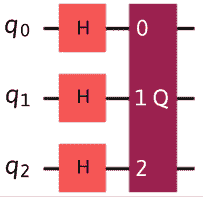

# 10

# 抑制和减轻量子噪声

在本书的前一版中，你可能还记得一个章节，该章节详细讨论了影响各种量子系统的不同类型的噪声。从那时起，有大量的研究不仅发展了硬件，也发展了软件。由于那时以来的变化，包括 Qiskit 的一些主要重构迭代，例如 Ignis 及其许多测试电路库的弃用，我认为现在是时候转向最新的内容，而不是花太多时间讨论如何测试系统，而是理解如何利用最新的错误抑制和减轻技术。当然，我不想让你太迷茫，所以我将涵盖一些关于这些噪声是什么以及它们如何影响你的实验的基本知识。然而，我确实想确保我们涵盖当前量子实用性的时代([`www.nature.com/articles/s41586-023-06096-3`](https://www.nature.com/articles/s41586-023-06096-3))，这包括使用错误抑制和减轻技术来帮助你找到一些有用的量子应用。我们应该期待随着系统的演变和扩展（更多的量子位）以及深化（具有数千个 2 量子位门的复杂量子电路），我们将看到一些进步，这可以被视为朝着无需等待容错量子计算机就能实现有用量子应用迈出的巨大一步。

早期的量子系统通常被称为近端设备，这通常意味着它们接近成为完全容错的量子系统。其中一个原因是，所有当前的量子系统，无论它们使用什么技术来创建量子位，都受到某种形式的**噪声**的影响，这增加了这些系统的错误率。为了解决这个问题，并相应地最小化错误率，了解这些错误的原因以及我们如何抑制或减轻它们是有帮助的。请记住，对以下任何一个示例中的错误的研究都很容易成为一个研究课题，这就是为什么我们只是简单触及一些示例，如果你对更多细节感兴趣，我将在本章末尾提供一些参考资料。目前，本章仅是一个概述，包含一些示例，帮助你了解如何使用 Qiskit 提供的功能来创建一些噪声模型，以及如何使用 Qiskit Runtime 中的功能来抑制和减轻它们。这里的目的是帮助你优化量子电路的有效性，从而帮助你设计尽可能抵抗各种形式错误的应用程序。

本章将涵盖以下主题：

+   理解 Qiskit Runtime 服务

+   理解会话

+   理解 Qiskit Runtime 选项

+   理解原语

+   理解 Sampler 原语

+   理解退相干的噪声效应

+   错误抑制、减轻和纠正之间的区别

在本章中，我们将介绍大多数量子系统面临的一个挑战：噪声。到本章结束时，你将了解一些不同的噪声效应，例如弛豫和去相位。然后，你将概述 Qiskit 运行时服务的最新进展，并了解在任意后端系统上高效运行电路的构建块。最后，你将了解错误抑制和错误减轻技术，以及如何将它们应用于你的复杂量子电路。

在 Qiskit 的早期版本中，有一个名为 Ignis 的模块，该模块包含用于表征和减轻噪声的库。从那时起，Ignis 库已被弃用，因此建议你阅读 Qiskit 迁移指南，位于 Qiskit GitHub 页面([`github.com/Qiskit/qiskit-ignis#migration-guide`](https://github.com/Qiskit/qiskit-ignis#migration-guide))，特别是如果你想使用许多最新的进展。

在量子系统中，噪声来源于各种来源：电子的热量、退相干、去相位、串扰或信号损失。在这里，我们将了解如何测量噪声对**量子比特**的影响，以及如何减轻读出误差噪声以优化我们的结果。最后，我们将比较差异，以更好地理解其影响以及使用其他技术（如**动态去耦**）来减轻它们的方法，动态去耦用于帮助减少量子比特状态闲置时间过长时由于退相干引起的噪声。

在我们开始所有这些之前，我们首先需要熟悉将帮助我们将所有这些技术带到指尖并允许我们根据需要调整它们的最新的一个特性：Qiskit 运行时服务。

# 技术要求

在本章中，我们将回顾一些关于模拟噪声的内容，所以如果你对信号与噪声理论有所了解，这将有所帮助。如果没有，请回顾*第九章*，*模拟量子系统和噪声模型*，以了解影响量子系统的各种噪声形式。这将帮助你了解如何使用 Qiskit 运行时在量子计算机上抑制和减轻错误。

这里是本书中使用的完整源代码：[`github.com/PacktPublishing/Learning-Quantum-Computing-with-Python-and-IBM-Quantum-Second-Edition`](https://github.com/PacktPublishing/Learning-Quantum-Computing-with-Python-and-IBM-Quantum-Second-Edition)。

# 理解 Qiskit 运行时服务

对于那些使用过 Qiskit 早期版本的人来说，你们可能使用过`execute()`或`backend.run()`函数来在量子系统上运行量子电路。这对于在小于 100 个量子比特的小型量子系统上运行一些基本的量子电路用于学习目的来说是很好的。然而，如果我们想要开始考虑未来，以及我们如何为数百、数千甚至数百万个量子比特创建电路，那么我们需要考虑如何最优地做到这一点，而不仅仅是将一个大的电路扔到一台机器上。这就是**Qiskit Runtime 服务**大有用武之地的地方。它不仅包括许多新选项，例如选择优化和弹性级别，我们将在本章后面学习这些内容，而且还包括我们之前覆盖的所有编译功能，所以我们不会失去我们迄今为止所学到的。在本节中，我们将介绍 Qiskit Runtime 是什么以及如何使用它来执行你的电路。了解如何使用 Qiskit Runtime 也将帮助你在此章后面学习各种错误抑制和缓解技术以及它们是如何应用于你的量子电路的。

让我们先来了解 Qiskit Runtime 服务，它与执行函数有何不同，以及我们可以使用哪些新功能来优化在量子系统上执行量子电路。

首先，让我们创建一个新的笔记本，并导入一些 Qiskit Runtime 对象、函数，并使用我们的辅助文件实例化`QiskitRuntimeService`类。

注意，在撰写本文时，已经从当前的 Sampler 版本切换到 SamplerV2。在下面的代码中，假设“V2”将被移除。如果由于某些原因它没有被移除，那么请将`Sampler`更新为`SamplerV2`以确保你使用的是 Sampler 的最新版本。

另一个重要的步骤是，你必须使用`token`参数来设置你的 IBM Quantum 或 IBM Cloud API 令牌，如下面的代码片段所示。如果你不设置这个参数，你可能会遇到错误，并且当尝试访问 Qiskit Runtime 服务时，它将无法工作。

```py
# Loading your IBM Quantum account(s)
service = QiskitRuntimeService(channel="ibm_quantum", token="API_TOKEN") 
```

现在你已经设置了你的笔记本，让我们深入探讨一些执行模式描述。

## 理解会话

**会话**本质上是一组作业，保证在后台运行而不会受到其他用户作业的干扰，尤其是那些需要多次迭代的作业，例如基于变分算法的作业：**变分量子本征求解器**（**VQE**）和**量子近似优化算法**（**QAOA**）。换句话说，“无干扰”意味着 Qiskit Runtime 将确保每个作业都能完成，包括在经典资源和量子资源之间调整变量的期间，在过去，这段时间被用来在队列中交错处理来自另一个用户的作业。

为了理解这种格式的实用性，想象一下站在一个长长的队伍中等待轮到您提交表格，比如更新您的驾驶执照。等了几小时后，您终于到了窗口，递上您的表格，却被告知需要调整表格中的某些值。这就是差异所在。在之前的版本中，您必须站在一旁更新表格字段；同时，另一个人会走到窗口前。现在，如果您恰好准备好了，您现在必须等待那个人完成，然后才能继续。当然，这可能会花费很长时间，让您等待更久。会话允许您在完成更新表格并提交之前，保持窗口空闲并可供您使用。

关于交互式和最大时间值的默认值和最大时间，我建议您参考 Qiskit 运行时文档[`docs.quantum.ibm.com/api/qiskit-ibm-runtime/runtime_service`](https://docs.quantum.ibm.com/api/qiskit-ibm-runtime/runtime_service)，因为这些值可能会随时间而变化。然而，队列中的时间会计算到会话的最大时间之内。空闲时间可以用来根据作业的结果执行任何经典操作，并为会话中的后续作业做准备。

每个作业都可以设置为作业批次的一部分，以确保它们在相同的设备上或紧密地一起运行，以避免它们在单独的系统或相隔很远时运行可能引起的问题，这可能会由于设备特性或设备漂移而使我们的结果出现异常。要了解更多关于设备漂移的信息，请参阅本章末尾的*进一步阅读*部分。在撰写本文时，有一些即将推出的功能将进一步优化电路的执行，因此请密切关注文档和信息源以获取详细信息示例。

在我们开始编码之前，让我们先熟悉其他类，这样将简化我们后续的编码体验。在下一节中，我们将查看可以设置到`Session`类的选项。`Options`类在抑制和缓解错误时也非常重要。

## 理解 Qiskit 运行时选项

`RuntimeOptions`是一个用于设置 Qiskit 运行时执行选项的各种参数的类。参数用于选择使用哪个量子系统以及使用哪种优化或弹性级别，这可以启用各种错误抑制或错误缓解功能。以下是用于各种 Qiskit 运行时原语的一些`Options`参数列表。请记住，就像往常一样，您应该检查 Qiskit API 文档的最新版本，以确保您的代码始终保持最新：

+   环境参数，如`log_level`（`DEBUG`、`INFO`等），以及用于任何中间或最终结果的`callback`，它将接收两个位置参数：作业 ID 和作业结果

+   执行参数用于执行时间选项，如 `shots(int)`（整数）和 `init_qubits(bool)`（布尔值），这将重置每个射击的量子位到基态（默认为 `true`）

+   `max_execution_time` 是作业取消的最大时间，以秒为单位。如果没有设置，则默认为原始的时限。如果设置了，则时间必须在 300 秒和模拟器或设备设置的最大的执行时间之间，这可以在 Qiskit API 文档中找到：[`docs.quantum.ibm.com/guides/max-execution-time`](https://docs.quantum.ibm.com/guides/max-execution-time)。

+   `optimization_level` 设置电路的优化级别。级别越高，优化程度越高，因此编译时间越长。这些优化级别还包括动态去耦等错误抑制，我们将在本章后面介绍。有四个 `optimization_level` 设置。默认值设置为最高值 `3`：

    +   0 – 无优化，使用基本翻译，使用指定的任何布局，并路由（默认使用随机交换）

    +   1 – 轻度优化，路由（使用 SabreSWAP、1Q 门优化和动态去耦以抑制错误）

    +   2 – 中度优化，布局和路由与第 1 级相同，但包括具有更大搜索深度和优化及动态去耦尝试的启发式优化

    +   3 – 高度优化，布局和路由与第 2 级相同，并包括更大努力/尝试的进一步优化，2-量子比特 KAK 优化和动态去耦以抑制错误

+   `resilience_level` 设置缓解错误的恢复级别。恢复级别越高，结果精度越高。更高的结果类似于优化级别，这将导致更长的编译时间。这些恢复级别从 0 到 2，其中级别 1 是默认值，并且仅适用于估计原始。重要的是要注意，随着技术的进步，这些技术的实现和缓解措施也在不断发展。请参考最新的文档，以确保您的代码正在运行最新版本 ([`docs.quantum.ibm.com/guides/configure-error-mitigation`](https://docs.quantum.ibm.com/guides/configure-error-mitigation) )。

    +   0 – 无缓解。

    +   1 – （默认）最小缓解，最小化读出错误。估计原始使用 Twirled Readout Error Extinction。

    +   2 – 中度缓解，用于最小化电路中的偏差，但表示不能保证为零，使用与级别 1 相同的方法，并包括零噪声外推。

现在，我们已经熟悉了可以在我们的后端系统上设置以优化和运行电路的所有选项，让我们继续前进，了解原始类是什么。

## 理解原始类

**原语**，如 Qiskit 文档中定义的，通常是“*设计和优化量子工作负载的基础构建块*。”在撰写本文时，Qiskit Runtime 中有两个原语：**采样器**和**估计器**。每个都提供了一种简单的方式来封装你的电路，并利用其每个功能在执行过程中优化工作负载，以便在多个量子系统上大规模运行。如果你还记得在前面章节中，当我们构建并应用优化级别到我们的电路时，这涉及到相当多的工作，并且优化是基于我们选择的单个量子系统来运行的。你可以想象，如果我们需要为每个执行我们电路的不同系统做这件事，需要多少步骤和开销。通过原语提供的接口，很多工作都由我们通过应用一些选项设置和选择来处理。然后，运行时将相应地应用这些设置，因为它选择多个系统来执行电路。每个原语执行特定的任务，并作为 Qiskit Runtime 服务的入口点。让我们逐一查看每个原语，以了解它们的功能以及它们之间的差异。在本章中，我们将重点关注采样器原语。IBM 量子学习平台有一些非常好的示例、课程和教程，你可以从中学习到比我在本章中提供的更详细的内容。

### 理解采样器原语

**采样器**原语与我们在这本书中使用的类似，它以量子电路作为输入并生成一个准概率结果。这个结果也被误差缓解，以确保结果尽可能精确。采样器原语电路的例子包括 Grover 搜索和 Deutsch-Jozsa。采样器可以被修改以允许更改，例如后端（本地模拟器或量子系统），这简化了你的电路管理以及它们在根据实验需求的后端上运行的方式。这非常有帮助，因为每个原语在量子系统上执行时都有自己操作量子电路的方式，因此某些属性或缓解技术可能不会在某些原语上工作，这取决于它们执行任务的方式。

好吧，到目前为止，我们已经阅读了很多内容，为什么不回到一些编码上来呢？让我们创建一个新的 Qiskit 笔记本，并使用采样器运行一个简单的电路来尝试一下。我们还将包括前面提到的类，这样我们就可以将所有内容封装在一个简单的电路结构中。

首先，我们将创建一个简单的电路：

```py
# Create a simple circuit:
from qiskit import QuantumCircuit, QuantumRegister, ClassicalRegister,   
                   transpile
from qiskit.visualization import plot_distribution
q_reg = QuantumRegister(4, name='qr')
c_reg = ClassicalRegister(4, name='cr')
qc = QuantumCircuit(q_reg, c_reg)
qc.h(0)
qc.cx(0, 1)
qc.cx(1, 2)
qc.cx(2, 3)
qc.draw(output="mpl") 
```

这将显示我们希望运行的以下电路：


图 10.1：要在系统上运行的简单电路

现在，从这里开始就变得有趣了！让我们首先遵循 Qiskit 模式，这样我们不仅确保我们的电路是高效的，而且我们的开发模式也是高效的。

Qiskit 模式是一个 4 步过程，我们可以使用它来帮助我们集成我们的量子计算电路到更大的应用层。这 4 个步骤是映射、优化、执行和后处理。我们将逐一介绍这些步骤，以便您熟悉在量子系统上以最佳方式运行电路。我们将从我们刚刚做的事情开始：将我们的问题映射到量子电路。

#### 第 1 步：映射

将问题映射到量子电路可以有多种方式。我们可能可以写出大量的书籍来专门讨论这一点。这是因为这不仅取决于我们试图解决的问题，还取决于我们如何将我们的输入数据和问题解决方案最佳地映射到量子状态或初始状态。这类似于规划一次旅行。如果我要请你帮我规划一次去纽约的团队旅行，可能会有很多选择，甚至更多关于如何到达那里的问题？大家会在哪里？他们是否在旅行的开始时都在同一个地点。他们会有多长时间可用？这些问题是我们需要考虑的。我们如何将数据传输到量子系统中？在那个时刻，所有数据在哪里，数据会持续多久？一旦我们获得了输入数据，下一步就是将其从经典信息转换为量子状态或电路的输入。现在让我们用一个简单的例子来做这件事，即本章前面构建的电路。在*第十三章*中，我们将讨论一个更复杂的问题，即 Grover 搜索。现在，为了让我们专注于整个过程，我们将继续使用简单的电路和一些随机电路。

到目前为止，我们已经将问题映射到了量子状态，在这种情况下是上面构建的电路。这是第一步，映射，已完成。

现在让我们使用`Statevector`类来运行这个电路，在量子系统上运行之前获取预期的结果。由于这是一个小型且简单的量子电路，我们可以在一个经典系统上轻松模拟，比如你在家或办公室里的系统。如果电路或问题涉及大量比特，你无法在经典系统上运行，那么首选的方法是将问题规模减小到可以在经典系统上运行的大小，这样你可以在较小的规模上确认预期的结果，然后运行在量子系统上以获得全面的结果。

```py
from qiskit.quantum_info import Statevector
# Pass the circuit instructions into the Statevector
results = Statevector.from_instruction(qc).probabilities_dict()
plot_distribution(results) 
```

这将在以下图中显示预期的结果：


图 10.2：使用 Statevector 从电路中得到的预期概率结果

接下来，我们可以准备在真实后端上运行。为此，我们需要在我们的电路中包含测量算子，我们将这样做，然后获取最不繁忙的后端系统来运行这个电路：

```py
# Add measurements to our circuit
qc.measure_all(add_bits=False)
# Select the least busy backend system to run circuit
backend = service.least_busy(simulator=False, operational=True)
print("Least busy backend: ", backend) 
```

这将打印出所选的后端，这是在调用时最不繁忙的后端。

#### 第 2 步：优化

现在，我们可以通过相应的转译来准备电路在后台运行。为此，我们将使用新的`preset_passmanager`函数，这是 Qiskit `transpiler`库的新增功能，允许您设置、运行和绘制电路转译后的结果。将电路与目标后端对齐是理想的，因为它将通过应用不仅通用的传递，还包括引入进一步改进的 AI 生成优化器来优化电路到所选的后端。

```py
from qiskit.transpiler.preset_passmanagers import generate_preset_pass_manager
target = backend.target
pm = generate_preset_pass_manager(target=target, optimization_level=3)
transpiled_qc = pm.run(qc)
transpiled_qc.draw(output="mpl", idle_wires=False, style="iqp") 
```

这显示了针对所选后端目标的特定转译电路。在这里，您将注意到与原始电路的两个不同之处。首先，请注意量子比特映射已更改；量子比特 0 现在分配给量子比特 73。在您的情况下，这取决于您选择了哪个系统，它可能指向其他量子比特。接下来，您还会注意到添加了更多的门。这是由于必须使用基门和量子比特之间的连接性（使用 ECR 门：[`docs.quantum.ibm.com/api/qiskit/qiskit.circuit.library.ECRGate`](https://docs.quantum.ibm.com/api/qiskit/qiskit.circuit.library.ECRGate)）来连接可能不相邻的量子比特。结果可能不同，因为您所选的后端可能得到不同的结果。


图 10.3：转译电路

现在我们知道了如何转译电路并设置优化级别值，让我们现在切换到一个更复杂的电路，这样我们就可以进一步推动优化器，并看到结果电路之间的差异。我们将使用一个简单的 Grover 算子来生成电路。由于我们还没有详细讨论 Grover 算法，让我们先简单地说，我们将使用它来标记电路要找到的状态。在这种情况下，我们将使用二进制表示`110`。Grover 算法将在*第十三章*中讨论。

```py
from qiskit.circuit.library import GroverOperator
oracle = Statevector.from_label("110")
grover_qc = QuantumCircuit(3)
grover_qc.h(range(3))
grover_qc = grover_qc.compose(GroverOperator(oracle))
grover_qc.draw(output="mpl") 
```

这将产生以下电路，其中我们有一系列 Hadamard 门，后面跟着 Grover 算子复合体。请注意，这是一个复合体，它将一系列门表示为单个名为 Q 的块，以简化电路的可视化。您可以通过多次运行`decompose`方法将其分解为基门。

在接下来的步骤中，我们将使用不同的优化级别值进行转译，并比较这两种方法，以便您可以看到`转译器`优化器对电路的影响。



图 10.4：Grover 算子电路

下面的内容将突出显示优化级别之间的差异，以及许多电路伴随的复杂性。为了更具体地进行比较，我们将观察**ECR**门的数量，这是**Echoed Cross-Resonance**门的缩写。它们类似于 CX 门，但有一个回声过程，可以减少一些不希望的项。关于这个门的具体信息可以在 Qiskit 电路库中找到。ECR 门或任何多源/多目标门相当复杂，因为它们需要额外的门来生成连接性。在这个例子中，我们将使用 ECR 门的数量来比较电路。

让我们首先从当前电路中捕获`Statevector`结果，这样我们就可以将它们与转换后在量子系统上运行的结果进行比较：

```py
results = Statevector.from_instruction(grover_qc).probabilities_dict() 
```

接下来，我们将向这个电路添加测量门并创建多个副本，每个副本具有不同的`optimization_level`值以进行比较：

```py
grover_qc.measure_all()
transpiled_grover_qc = pm.run(grover_qc)
transpiled_grover_qc.draw(output="mpl", idle_wires=False, style="iqp") 
```

这里得到的结果是我们创建的原始 Grover 电路的转换版本。我在下面的图中包括了它的截断部分：


图 10.5：转换后的 Grover 算子电路（截断）

如您所见，它要复杂得多，并且包含相当多的额外门，包括 ECR 门。

现在，让我们遍历电路并为每个分配不同的`optimization_level`值。在这种情况下，我们将比较极端的水平，一个在 0，也就是说完全没有优化，另一个在 3，即完全优化。然后我们将它添加到`circuits`数组中，稍后在量子系统上运行。

```py
circuits=[]
for optimization_level in [0,3]:
    transpiled_grover_qc = transpile(grover_qc, backend, optimization_level=optimization_level, seed_transpiler=1000)
    print(f"ECR (Optimization level={optimization_level}): ", transpiled_grover_qc.count_ops()["ecr"])
    circuits.append(transpiled_grover_qc) 
```

这将显示每个电路的 ECR 门数量。注意，与没有优化（级别 0）和完全优化（级别 3）相比，两个电路（它们将根据系统而变化）之间的差异相当大。

```py
ECRs (optimization_level=0):  24
ECRs (optimization_level=3):  14 
```

现在我们已经通过将电路转换为具有特定优化级别的设备来优化了我们的电路，现在让我们运行这两个电路，并在实际的量子系统上比较结果，包括模拟结果。

这完成了优化步骤，我们接下来进行下一个 Qiskit 模式，执行优化后的电路。

#### 第 3 步：执行

在这里，我们现在将在目标后端上运行我们的电路，但这次有一些变化。我们将使用 Qiskit Runtime 的新功能 Batch。这将允许我们提供一批操作在量子系统上运行。

要执行我们创建的电路，我们首先需要创建一个批次，这是 Qiskit Runtime（[`docs.quantum.ibm.com/api/qiskit-ibm-runtime/qiskit_ibm_runtime.Batch`](https://docs.quantum.ibm.com/api/qiskit-ibm-runtime/qiskit_ibm_runtime.Batch)）的执行模式之一，首先将我们的电路和后端信息加载到批次中，然后在批次内部，我们将在后端上运行 Sampler 原语并打印结果。

```py
with Batch(service=service, backend=backend):
    sampler = Sampler()
    job = sampler.run(
        circuits=circuits,
        skip_transpilation=True,
        shots=8000
    )
    result = job.result() 
```

这可能需要一段时间，具体取决于你在队列中的位置。但一旦完成，你应该看到实验的以下结果，包括准概率结果和实验的元数据，在这种情况下是获取结果所使用的射击次数。

```py
SamplerResult(quasi_dists=[{0: 0.136596417234717, 1: 0.057482039100449, 2: 0.03807773583055, 3: 0.051080549862785, 4: 0.028575374054239, 5: 0.068434342226471, 6: 0.540689745421478, 7: 0.079063796269311}, {0: 
0.013241830253957, 1: 0.044991185036454, 2: 0.066493715476242, 3: 0.033981414166734, 4: 0.077452855226391, 5: 0.045273457404358, 6: 0.654480551636603, 7: 0.064084990799261}], metadata=[{'shots': 8000, 'circuit_metadata': {}, 'readout_mitigation_overhead': 1.2784314899265776, 'readout_mitigation_time': 0.03348202304914594}, {'shots': 8000, 'circuit_metadata': {}, 'readout_mitigation_overhead': 1.0800027370262115, 'readout_mitigation_time': 0.0965154911391437}]) 
```

让我们更深入地看看结果。首先，你会看到一组`quasi_dists`。这是我们实验中准分布的结果。由于我们运行了一个 3 量子比特电路，我们应该看到 8 种可能的结果，0-7，以及每个结果的准概率。然后是一些关于每个电路读出开销的详细信息，这仅仅是读取每个电路结果所需的时间。

这现在帮助我们进入 Qiskit 模式的最后一步，后处理。

#### 第 4 步：后处理

在 Qiskit 模式的最后一步，我们将从量子系统中提取结果并进行一些后处理。后处理究竟是什么？简单来说，就是你想让它成为的样子。你可以外推结果并将其返回到你的经典应用程序中的下一个任务，以继续特定的混合经典-量子工作流程，或者你可以简单地提供结果作为另一个经典或量子计算任务的输入并继续。在这种情况下，我们将保持简单，只以可视化的方式显示结果以进行比较。我们将比较我们之前计算的状态向量结果，并将它们与我们在量子系统上运行的两个电路的结果进行比较。以下将结果显示在直方图上：

```py
qc_results = [quasi_dist.binary_probabilities() for quasi_dist in result.quasi_dists]
plot_histogram(
    qc_results + [results],
    legend=[
        "optimization_level=0",
        "optimization_level=3",
        "Simulated results"
    ],
    bar_labels=False
) 
```

结果图将如下所示：


图 10.6：后处理结果，可视化比较

在这里，你可以看到我们的结果是预期的，其中在更高层次优化（3）的结果更接近我们的模拟结果，而没有进行任何优化的电路的结果则不太准确。

这就引出了我们需要讨论的下一个主题：噪声。所有量子系统，无论技术如何，都存在某种形式的噪声或与噪声相关的效应。有些技术可以将量子比特与任何环境噪声隔离；然而，这也带来一个缺点，即当我们想要改变量子比特的状态时，速度和保真度可能比其他技术慢。在这本书中，由于我们使用 IBM 量子系统，我们将重点关注超导量子比特以及噪声对它们的影响。当然，我们还将涵盖错误抑制和错误缓解的最新进展，这些进展随着时间的推移可能会为我们提供有用的量子应用。在下一节中，我们将首先了解不同类型噪声之间的差异以及它们如何影响量子系统。

# 理解退相干噪声效应

在*第九章*，*模拟量子系统和噪声模型*中，我们了解到我们可以生成基于指定量子计算机配置的各种噪声模型。在提取配置信息后，我们可以将一系列错误函数中的任何一个应用到本地模拟器上，这将重现类似于从量子计算机获得的类似错误效应。

在本节中，我们将进一步探讨这些错误如何随时间影响我们的电路。我们将回顾的两个效应是近期量子系统中发现的两个最常见问题：**弛豫**和**失相**。这些是关键错误，因为它们可以影响量子状态信息，从而导致错误响应。

在本章的后面部分，我们还将探讨**读出错误**，这是噪声的另一个常见来源，它发生在系统应用测量脉冲的同时，并行地监听采集通道。从模拟脉冲到数字值（要么是 0 要么是 1）的转换也可能引入许多错误，我们将尝试减轻这些错误。

我们将首先了解量子系统中噪声最常见和最重要的效应之一：**去相干**。去相干主要有三种类型：**T1**、**T2**和**T2**。每一种都代表了对量子比特的去相干效应。我们将逐一研究它们，以了解它们之间的差异，以及如何在真实量子设备上运行时抑制和减轻这些效应。

如果您对学习如何分析**弛豫**（**T1**）和**失相**（**T2/T2**）的效果有浓厚的兴趣，*第九章*，*模拟量子系统和噪声模型*展示了创建包含复制每种三种去相干效应的噪声模型的电路的方法。这将帮助您运行实验以分析设备的表征。

下一个部分将简要概述这两者，以便让您了解在讨论缓解功能时，哪一项受到影响。

## 理解去相干错误

T[1]，正如我们在*第九章*，*模拟量子系统和噪声模型*中提到的，通常被称为**弛豫时间**。弛豫时间指的是量子比特的能量从**激发态**（）衰减回其**基态**（）所需的时间，如下面的图表所示，其中表示概率为`1`，是概率为`0`。T[1]时间定义为*P(t) = 1/e*时的值（参见图表）：


图 10.7：T1 定义为能量状态达到 1/e 的概率衰减时间

当将此应用于量子系统时，如果你想要确定任何量子比特达到 T[1] 所需的时间量，你需要创建一个测试电路，将量子比特置于激发态，。我们知道如何通过简单地对一个量子比特应用 X 门，然后等待一段时间再测量该量子比特来实现这一点。如果你要在一定数量的时间间隔内这样做，你可能会开始看到结果从激发态跃迁到基态。

那么，这一切意味着什么呢？让我们深入探讨一下，看看这如何应用于随着时间的推移和复杂电路上的量子系统。

我们将从简单的类比开始，为你提供一些直观的概念理解。对于那些已经了解这些概念的人来说，请自由地跳到下一节。

想象一下，就在新年除夕前后，或者不久之后，我们大多数人包括我自己，每年都会做出同样的承诺，那就是去健身房锻炼，恢复体型，尤其是在假期享受盛宴之后。然后，通常在一月的第一周或第二周，我们会去健身房，我们的私人教练直接带我们去举重，并要求我们选择一个重量。当然，一开始可能会觉得有点重，但我们还是鼓起勇气。然后，我们的教练想要测试我们的力量，并要求我们用伸直的胳膊将重量高举过头顶。然后我们自信地将重量举过头顶，我们感到*兴奋*，这并不太糟糕。让我们称我们能够将重量举过头顶的能力为激发态。好，现在假设我们的教练要求我们尽可能长时间地保持这个姿势。我们会注意到，我们的力量只能维持这个姿势一段时间。然后，我们会开始感觉到肌肉的疲劳，这会慢慢地，或者在我的情况下，比较快地开始降低到原始位置，即重量靠近*地面*的位置，在那里我不再感觉到肌肉的紧张。让我们称这个位置为*放松*状态，基态。

量子比特在很大程度上遵循这个概念，它将从基态开始，然后我们将在一段时间后从基态放大量子比特到某个激发态。现在，就像我们一样，随着时间的推移，我们将回到基态以放松。这种从激发态到基态的放松，从逻辑上讲，被称为振幅弛豫，这可能听起来很熟悉，因为我们之前在创建振幅衰减噪声模型来表示退相干时学过这个概念。

回顾*图 10.8*，你可以想象这就是环境效应（T[1]）对量子比特的影响。我们所说的环境是什么意思？我很高兴你问了这个问题！量子比特不仅仅是一个带有约瑟夫森结的单个铝铌组件。

哦不，不，不，这里还有更多的事情在发生！当然，根据量子比特所依赖的技术，如超导、离子阱、光子学等，量子比特并不是孤立的。它通常被各种环境变量所包围，这些变量可能会干扰量子比特，有时甚至能加速其退相干。例如，超导量子比特必须处于一定的温度下，大约 15 毫开尔文，才能正常工作并确保基态和第一激发态之间的能级精确，以确定量子比特的状态。然后，发送给量子比特的脉冲必须具有正确的幅度、持续时间、频率等，以便将量子比特置于正确的状态。记住，这可能很困难，因为量子系统可能非常复杂。例如，我们在前面的例子中定义一个幅度值作为激发态，只是比之前的位置高一点：将重物举过头顶。但如果我们需要多个幅度来编码我们的数据呢？那么我们门控的精度就需要非常精确，这意味着门控的保真度也可能影响我们的系统。这就是退相干，也称为弛豫率或 T[1]，如果不被抑制，会导致我们失去电路的量子状态信息，从而导致我们在读取电路结果时出现错误。

## 理解去相干错误

T[1]，我们在上一节中了解到，是指量子比特随时间衰减时引起的退相干或弛豫率。另一方面，去相干错误发生在量子比特的相位变得模糊时，通常被称为 T[2]或 T[2]*。去相干与退相干相似，我们也会随着时间的推移失去状态信息，只是方式略有不同。

简单来说，定义去相干就是失去量子比特的相位信息。

去相干噪声有许多不同的来源，每个来源都有不同的特性。一些例子包括：

+   **白噪声**，当信号在变化频率上具有相等强度且数量相等时。

+   **粉红噪声**，通常被称为闪烁噪声，通常出现在电子设备中，其中功率密度随着频率的增加而减少，即 1/f，其中 f 是频率。

+   **磁通噪声**，出现在**超导量子干涉器件**（SQUID）的表面，通常被称为**SQUID**，其来源是 SQUID 表面的磁自旋。

虽然不能将这本书从开发者手册转变为工程手册，但如果您想了解更多关于这些内容，我将在本章末尾提供一些参考。

现在我们对噪声有了基本的了解，让我们学习一下错误抑制、错误缓解和错误纠正之间的区别，以及我们如何使用它们来创建有用的量子应用。

## 错误抑制、缓解和纠正之间的区别

在上一节中，我们讨论了一些在量子系统上运行量子电路时可能引入的错误来源。在这里，我们将定义从量子电路中消除这些错误的各种方法，以获得最佳结果。我们将首先定义抑制、缓解和纠正错误的区别。

**错误抑制**正如其名所示，就是抑制给定电路的噪声，以保持量子状态完整。这里的特定噪声可能是量子比特的退相干时间（振幅衰减）或去相位。正如我们之前所学的，如果一个量子比特被放置在特定的状态，并在一段时间内保持在那里，那么这个量子比特最终会回到基态，或者某个与设定状态不同的状态。我们在这里想做的就是通过保持电路在当前状态来抑制这种情况。当然，说起来容易做起来难。让我们首先从直觉上考虑这个问题，然后再深入细节。

回到我们之前提到的健身房场景，现在假设你正从卧推凳上的躺姿开始，举起非常重的哑铃进行卧推。这里存在一个风险，随着时间的推移，由于肌肉的紧张，哑铃开始感觉越来越重。这就是为什么大多数做这个动作的人都会站在哑铃非常近的地方，有一个保护者。这个人会在你疲劳需要一点帮助时帮助你，或者在你肌肉突然放弃时帮助你将哑铃从胸部抬起。我相信你可以在网上找到很多视频，可以看到没有保护者在场时的可怕后果，但就现在而言，让我们详细说明这与错误抑制有什么关系。

如果你想象你需要长时间保持头顶上的重量，你会意识到随着时间的推移，你的肌肉会感到紧张；我们将这比作之前的退相干。为了帮助解决这个问题，你的保护者可以通过轻轻地帮助你将杠铃重新举起来，这样你就可以保持你的初始位置或状态。这种来自保护者的帮助可以看作是错误抑制，因为它帮助保持了你的状态，而没有改变状态本身，这意味着你没有把它举得比预期更高或更低，以算作一次举起。现在，让我们离开健身房，将我们的背景切换回量子，看看这如何帮助我们理解与量子电路相关的错误抑制。

当一个门或一组门作用于电路中的量子比特时，该电路可能在一段时间内以多种方式失去其状态，其中一些我们在之前提到过。我们需要做的是应用一种技术，帮助我们保持电路的状态。是的，这听起来像是纠错定义，但让我花点时间来详细说明，以便识别其中的区别。为此，我将解释一个新添加到 Qiskit 中的 Pass（回想一下，Pass 是一个用于优化电路的对象，例如找到最优布局映射或最优量子比特）。这个 Pass 叫做**动态去耦**（**DD**）。动态去耦是一种已知的技巧，由麻省理工学院的 Dr. Seth Lloyd 和 Dr. Lorenza Viola 在 1998 年描述（[`arxiv.org/abs/quant-ph/9803057`](https://arxiv.org/abs/quant-ph/9803057)）。他们将其描述为一种使用控制脉冲来最小化量子比特状态扩散的形式。这通常是通过应用相同的门操作两次来完成的，这模仿了一个恒等门。我们之前在解释大多数通用量子门都是可逆的时候了解到这一点，因此通过连续应用两个可逆门，你最终会得到一个恒等门。那么，这是如何工作的呢？你问得好，下面我们就来探讨一下！

如果你还记得*第七章*，*使用 Qiskit 编程*；*理解脉冲和脉冲库*部分，当我们描述在量子计算机上运行你的电路时，你必须首先创建一个脉冲时序，这是通过按照脉冲时序的顺序来指导控制系统向量子比特发送脉冲的。你可能也记得，脉冲时序包括有关脉冲的信息，但还包括脉冲的持续时间以及脉冲之间的时间间隔。幸运的是，我们了解到所有这些都有 Transpiler 和`PassManager`为我们完成。一旦创建了在特定量子系统上运行的脉冲时序，动态去耦 Pass 就会在系统运行之前遍历它。DD Pass 寻找的是脉冲信号之间的空闲时间间隔，并在这些间隔中插入一系列门。记住，由于门是可逆的，我们不希望改变电路的状态或相位，因此它将应用一对门来确保它持续执行一个幺正门的作用。让我们看看代码，看看这是如何实现的，以便更好地理解。

首先，我们将导入一些我们需要开始工作的对象和函数。

```py
%run helper_file_1.0.ipynb
import numpy as np
from qiskit.circuit.library import XGate
from qiskit.transpiler import PassManager, InstructionDurations
from qiskit.transpiler.passes import ALAPScheduleAnalysis, PadDynamicalDecoupling
from qiskit.visualization import timeline_drawer 
```

让我们回顾一下我们在这里导入的内容。首先，从 Transpiler 中，我们引入了`PassManager`和`InstructionDurations`。`PassManager`是用来管理在编译过程中优化我们的量子电路所使用的 Pass 的。`InstructionDurations`基本上就是那样；它存储了所有门的持续时间、时间尺度（dt）到所选后端系统。让我们拉取一个随机后端系统的持续时间来尝试一下。检查哪些后端可用，因为系统可能会随时间而变化。

```py
# Select a random backend you have access to, or pick the least busy:
backend = service.get_backend('ibm_kyoto')
# Pull and print the duration times of the backend system for each get per qubit:
dur = InstructionDurations.from_backend(backend)
print(dur) 
```

以下是一个输出截断的示例，在这种情况下是 X 门。由于`ibm_kyoto`是一个 127 量子比特的设备，我们看到显示的持续时间是按索引排列的，以识别 x 门及其对应量子比特的持续时间。请注意，实际结果将是所有量子比特之间所有门持续时间的一个列表；以下只是结果的一个子集：

```py
x(0,): 3.5555555555555554e-08 s
x(1,): 3.5555555555555554e-08 s
x(2,): 3.5555555555555554e-08 s
x(3,): 3.5555555555555554e-08 s
x(4,): 3.5555555555555554e-08 s 
```

Qiskit 还为你提供了为每个门设置持续时间的能力。这允许你在需要为特定设备修改它们时拥有更多控制权。以下是如何为所有门执行此操作的说明：

```py
 # Set the duration times for each gate.
custom_duration_times = InstructionDurations([('x', None, 100),
                                              ('h', 0, 100),
                                              ("cx", [0, 1], 200),
                                              ("cx", [1, 2], 200), 
                                              ("cx", [2, 3], 200),
                                              ("measure", None, 500
                                                  )])
# Print the timescales for each gate we set:
print(custom_duration_times) 
```

在这里，我们为每个门设置了以下自定义持续时间：

| **门** | **持续时间** |
| --- | --- |
| x | 100 |
| h | 100 |
| cx[0,1] | 200 |
| cx[1,2] | 200 |
| cx[2,3] | 200 |
| measure | 500 |

表 10.1：自定义门持续时间

接下来，我们将以一个漂亮的时序图来可视化电路的持续时间。为了可视化电路及其时序，我们需要使用一种*调度方法*将电路编译到一个后端。调度方法是指`transpiler`如何调度操作到量子比特上，例如，当量子比特准备好下一个指令时尽可能快地进行，或者你可以将其调度到稍后，这基本上是在可能的情况下保持量子比特处于基态。在这些示例中，我们将使用**alap**调度方法，它是*尽可能晚*的缩写。你可以在 Qiskit API 文档中找到有关各种调度方法的详细信息。

```py
#Let's transpile the circuit and view the default timeline
transpiled_qc = transpile(qc, backend, scheduling_method='alap',
layout_method='trivial')
timeline_drawer(transpiled_qc, time_range=[0,5500], show_idle=False) 
```

这将打印出门持续时间的可视化表示。它看起来非常像我们之前学到的脉冲调度；然而，这是电路而不是脉冲调度。你可以通过我们看到左边的量子比特标签而不是驱动器来辨别。

通道。此外，请注意，在这种情况下，CX 门被标记为**ecr**。


图 10.8：电路时序可视化

如*图 10.8*所示，这是基于所选后端指定的每个门的持续时间。我们将使用这个持续时间来可视化 Qiskit 中包含的一些错误抑制功能，特别是动态去耦。

动态去耦的工作方式是，它将在您的电路中寻找空闲时间，并在那些空闲时间槽中插入一系列动态去耦门，以确保量子位的状态不被改变。所使用的可逆门对将等效于恒等门，因此不会改变电路的状态。让我们使用我们的自定义持续时间和一个 X 门对来创建动态去耦的可逆门序列。

```py
# Create the Dynamical Decoupling sequence of reversible gates, let's use XGates:
rev_gates = [XGate(), XGate()]
# Set the PassManager with the Dynamical Decoupling sequence and custom duration times
pm = PassManager([ALAPScheduleAnalysis(custom_duration_times),
                  PadDynamicalDecoupling(custom_duration_times, rev_gates)]) 
```

我们所定义的是模仿恒等门的可逆门对。在这种情况下，我们使用一对 X 门。然后，我们实例化了我们的`PassManager`，这是在编译阶段管理使用哪些 Pass 来优化电路的东西。在这种情况下，我们将`alap`调度方法和动态去耦时间设置为之前创建的自定义持续时间。还包括将可逆门作为构造函数的参数。

接下来，我们想要运行我们的编译电路通过我们刚刚创建的`PassManager`，以产生包含动态去耦的修改后的电路：

```py
# Run the circuit through the PassManager to add the DD to the circuit
qc_dynamical_decoupling = pm.run(transpiled_qc) 
```

现在，让我们可视化这个电路，并将其与上一电路中的*图 10.9*进行比较：

```py
timeline_drawer(qc_dynamical_decoupling, show_idle=False) 
```

这将在添加了动态去耦错误抑制的情况下绘制电路。您可以看到添加到第一个量子位，q[0]的 X 门。


图 10.9：动态去耦电路的可视化

在这里，我们可以观察到一些事情。首先，由于我们设置的定制持续时间比之前的电路小，因此门持续时间更短。其次，您还会注意到插入的 X 门仅添加到第一个量子位，而没有添加到第二个量子位之后的空位，q[1]。这是因为空闲时间间隔比两个 X 门短，因此没有添加门对。让我们快速但显著地调整定制持续时间，通过将持续时间从 50 增加到 1500，在第二个量子位之后包括一对 X 门。由于我们只更新一个门的价值，我们可以使用`update()`函数仅更新该门的价值，而无需重新声明其他门，如下面的代码所示：

```py
# Update durations
updated_values = [('x', None, 1500)]
updated_durations = custom_duration_times.update(updated_values)
print(updated_durations) 
```

现在，让我们重试并看看这次我们得到了什么。在这里，我们将使用更新的值设置参数，重新运行`PassManager`并可视化结果：

```py
# Set the PassManager with the Dynamical Decoupling sequence and custom duration times
pm = PassManager([ALAPScheduleAnalysis(updated_durations),
                  PadDynamicalDecoupling(updated_durations, rev_gates)])
qc_dynamical_decoupling = pm.run(transpiled_qc)
timeline_drawer(qc_dynamical_decoupling, show_idle=False) 
```

这将现在产生两组可逆门，一组与之前相同，现在还有另一组，我们可以在第二个量子位之后看到。由于我们已经减少了持续时间，它现在可以适应第二个量子位结束时的空闲时间间隔，如下面的图所示：


图 10.10：更新持续时间后的电路可视化

如*图 10.10*所示，我们可以设置每个门的持续时间。在这种情况下，我们增加了持续时间，以便我们可以看到变化。然而，在许多情况下，你需要将其减少，以便尝试将可逆门挤入空闲时间间隙，以满足需要。但是，当然，就像其他任何事情一样，我们并不一定需要自己进行所有这些精细调整。幸运的是，Qiskit 运行时包括优化和**弹性级别**，我们可以设置这些级别以启用这些功能，正如本章前面在讨论我们可以在选项中设置的各个优化级别时所述，其中包括启用动态去耦。

现在我们已经介绍了一个错误抑制的例子，让我们继续并看看误差缓解。

首先，在我们开始定义什么是**误差缓解**之前，让我先介绍一下什么是**错误纠正**以及它们之间的区别。一般来说，错误纠正包括两个步骤：首先识别出错误已经发生，其次，使用各种错误纠正技术来纠正这个错误。而另一方面，误差缓解则是利用错误来计算和确定一个结果，这个结果可以减少错误，但并不一定消除错误本身。

存在着各种误差缓解技术，并且目前还有很多研究正在进行，以寻找更优化的方法来减少错误。在撰写本文时，三种用于缓解错误并包含在 Qiskit 运行时弹性级别选项中的技术是：**TREX**、**ZNE**和**PEC**。关于每种技术的详细信息，请参考本章前面的链接，其中我们定义了弹性级别。这些技术中的每一种都使用经典资源来执行其任务。这当然会给我们的应用程序引入额外的开销。然而，定期发布的进步大大减少了这些开销，以优化速度、质量和可扩展性。通过持续这样做，我们肯定会在未来达到一个量子效用水平，这意味着实现复杂量子电路的成本可能会比经典模拟低得多。

幸运的是，Qiskit 使我们能够通过弹性级别轻松设置误差缓解的级别，以激活特定的误差缓解技术。在下面的代码片段中，我们首先运行一个没有错误抑制或缓解技术的电路，然后我们将创建一个使用动态去耦进行错误抑制和 TREX 进行误差缓解的电路。

我们将从没有错误抑制或缓解开始：

```py
least_busy_backend = service.least_busy(simulator=False, operational=True,    
                         min_num_qubits=transpiled_qc.num_qubits)
# Let's transpile the circuit to this new backend:
transpiled_qc=transpile(qc, backend=least_busy_backend)
options = Options()
options.execution.shots = 1000
options.optimization_level = 0  # No error suppression
options.resilience_level = 0  # No error mitigation
with Session(service=service, backend=least_busy_backend) as session:
    sampler = Sampler(session=session, options=options)
    job_sim_0 = sampler.run(transpiled_qc)
    print(job_sim_0.result())
    session.close()
plot_distribution(job_sim_0.result().quasi_dists) 
```

运行 Sampler 的结果如下，你应该也能看到结果的视觉表示：

```py
SamplerResult(quasi_dists=[{0: 0.463, 1: 0.011, 2: 0.006, 3: 0.008, 4: 0.008, 6: 0.001, 7: 0.009, 8: 0.01, 9: 0.001, 10: 0.008, 11: 0.01, 12: 0.006, 13: 0.014, 14: 0.099, 15: 0.346}], metadata=[{'shots': 1000}]) 
```

接下来，我们将启用动态去耦和 TREX：

```py
options.execution.shots = 1000
options.optimization_level = 3  # Levels 1-3 use Dynamical Decoupling
options.resilience_level = 1  # Level 1 uses TREX for error mitigation
with Session(service=service, backend=least_busy_backend) as session:
    sampler = Sampler(session=session, options=options)
    job_sim_1 = sampler.run(transpiled_qc)
    print(job_sim_1.result())
    session.close()
plot_distribution(job_sim_1.result().quasi_dists) 
```

在这里，我们将`optimization_level`设置为`3`，这将启用动态去耦，并将`resilience_level`设置为`1`，这使用 TREX 进行错误缓解。注意结果差异更加精细，并且元数据包括增加的开销和缓解时间：

```py
SamplerResult(quasi_dists=[{0: 0.4741007821539706, 1: -0.00328801216329741, 2: -0.006989853410409116, 3: 0.0018169643386157586, 4: -0.005096477885881826, 5: 0.00010104383589854057, 6: 0.0016676295409465852, 7: 0.0017229622606998135, 8: 0.0038884349758400295, 11: -0.0025386992448873155, 12: 0.0014124334608473367, 13: 0.0009761688074426505, 14: 3.0231076968467426e-05, 15: 0.5321963922532457}], metadata=[{'shots': 1000, 'readout_mitigation_overhead': 1.6922534955446735, 'readout_mitigation_time': 0.059042368084192276}]) 
```

随着研究人员试图了解噪声的影响并确定减轻噪声的最佳方法，以加速我们从量子效用走向量子优势的进程，许多错误抑制和缓解方法在研究人员中越来越受欢迎。

# 摘要

在本章中，我们讨论了噪声对量子计算系统的影响，包括量子比特的特定影响以及通过读出错误与量子系统本身的相对外部影响。我们发现了如何使用 Qiskit 运行时服务通过称为原语的基本构建块来运行我们的电路。最后，我们学习了如何将错误抑制和缓解技术应用于我们的量子电路，以从量子设备中过滤出噪声结果，这显著减少了错误并提供了更准确的复杂量子电路结果。

在下一章中，我们将学习如何使用 Qiskit 中提供的众多功能来创建量子应用程序。我们将探讨创建量子算法，并最终为您提供创建自己的量子算法和量子应用程序所需的所有工具。

# 问题

1.  列出 Qiskit 运行时服务使用的三种主要错误缓解技术。

1.  用于错误缓解的哪些容错级别被使用？

1.  你可以使用哪些可逆门来使用动态去耦填充量子比特的空闲时间？

1.  哪种类型的噪声会导致量子比特振幅衰减？

1.  哪种类型的噪声会导致量子比特去相干？

# 进一步阅读

+   IBM 量子学习平台: [`learning.quantum.ibm.com`](https://learning.quantum.ibm.com)

+   在容错之前量子计算实用性的证据: [`www.nature.com/articles/s41586-023-06096-3`](https://www.nature.com/articles/s41586-023-06096-3)

+   减少采样开销的准概率分解: [`www.nature.com/articles/s41534-022-00517-3`](https://www.nature.com/articles/s41534-022-00517-3)

+   二态量子系统中退相干的动力学抑制: [`arxiv.org/pdf/quant-ph/9803057.pdf`](https://arxiv.org/pdf/quant-ph/9803057.pdf)

+   短深度电路中的错误缓解: [`arxiv.org/pdf/1612.02058.pdf`](https://arxiv.org/pdf/1612.02058.pdf)

+   Sutor, B., *与量子比特共舞*，Packt 出版公司: [`www.packtpub.com/data/dancing-with-qubits`](https://www.packtpub.com/data/dancing-with-qubits%0D%0A)

+   Nielsen, M. & Chuang, I., *量子计算与量子信息*，剑桥大学出版社: [`www.cambridge.org/us/academic/subjects/physics/quantum-physics-quantum-information-and-quantum-computation/quantum-computation-and-quantum-information-10th-anniversary-edition`](https://www.cambridge.org/us/academic/subjects/physics/quantum-physics-quantum-information-and-quantum-computation/quantum-computation-and-quantum-information-10th-anniversary-edition)

+   Wootton, J., *什么是量子纠错？*，Medium 系列：[`decodoku.medium.com/1-what-is-quantum-error-correction-4ab6d97cb398`](https://decodoku.medium.com/1-what-is-quantum-error-correction-4ab6d97cb398%0D%0A%0D%0A)

# 加入我们的 Discord

加入我们社区的 Discord 空间，与作者和其他读者进行讨论：

`packt.link/3FyN1`


