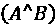
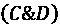
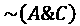
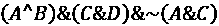
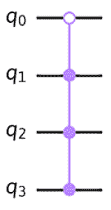
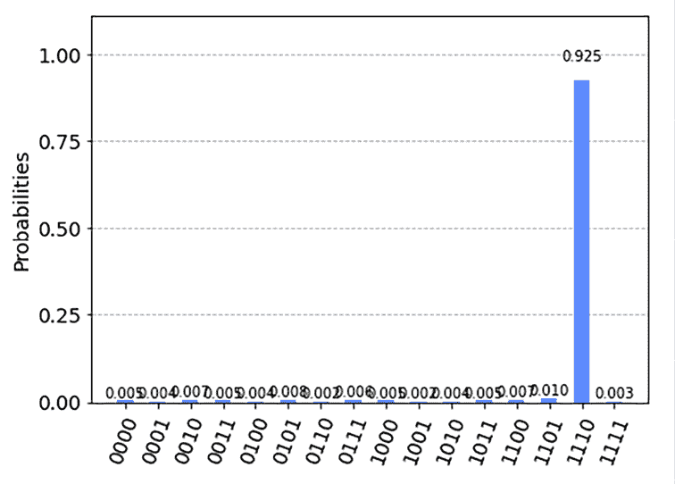

# 理解量子实用工具和 Qiskit 模式

我们在这里，这是最后一章。如果你已经走到这一步，那么恭喜你保持专注和决心，你的时间投资得很值得！当我们结束这一章，以及这本书时，我想确保我不仅仅留给你一些基础知识，并祝愿你一切顺利。我发现大多数技术书籍似乎都是这样做的。这并不是说有什么不对，但我总觉得大多数书籍没有提供关于下一步或更好的行动指南。我想将这一章作为一个从教育到赋能的转变。换句话说，从这里去哪里以及如何去做。随着 Qiskit 1.0（以及未来的更新），我们应该将其视为真正让你提前一步，获得适当的工具和模式，以将你的当前实验演变为理想的实用应用候选者的过渡。这里的目的是，这本书不仅会为你提供开始学习的教育，还会为你提供一些指导，让你知道随着技术的发展和新功能的发布，你可以期待什么并如何发展。

到目前为止，我们已经介绍了一种“自下而上”的方法来理解量子计算，我们从基本的量子计算属性、门和电路开始。然后我们向上移动，将它们结合起来以实现各种量子算法。我们还介绍了如何使用各种模拟器、生成噪声模型以及减轻读出错误。所有这些都帮助我们理解量子计算的基本复杂性以及它们是如何被用来创建既有效又最优的算法的。

然而，要求一个开发者、解决方案架构师或系统集成人员学习所有内部运作机制，只是为了理解如何将量子计算集成到他们的应用程序或工作流程中，这实在要求太高了。实际上，往往很难找到那些想要深入了解量子算法的“螺丝钉”的人。一般来说，我们大多数人只想把数据加载到算法中，在量子系统上执行它，获取结果，然后继续我们的实验。

这种“自上而下”的方法正是 Qiskit 模式出现的地方。

本章将涵盖以下主题：

+   理解量子实用工具

+   理解 Qiskit 模式

在本章中，你将了解量子实用工具的含义以及为什么它是我们接近量子优势的关键。

我们还将介绍 Qiskit 模式以及它如何简化你构建复杂量子电路的开发体验。随着大多数量子算法和应用随着时间的推移变得越来越复杂，尤其是我们现在正进入量子实用时代，我们需要了解它们是什么以及我们如何最好地使用这些构建块来创建可扩展和高效的量子算法。

最后，我们将通过一个快速示例结束本章，该示例使用 Qiskit 模式结合了我们在上一章中学到的 Grover 算法，因为我不想在没有提供一些结合经典和量子代码的情况下结束本章。

# 技术要求

对于本章，我们期望你了解使用 Python 创建量子电路和通用应用开发。

以下是我们将在整本书中使用的源代码：[`github.com/PacktPublishing/Learning-Quantum-Computing-with-Python-and-IBM-Quantum-Second-Edition`](https://github.com/PacktPublishing/Learning-Quantum-Computing-with-Python-and-IBM-Quantum-Second-Edition)。

# 理解量子效用

之前，我提到了“量子效用”这个术语。我想花点时间更详细地描述一下这意味着什么，更重要的是，它不意味着什么。首先，让我们定义另一个术语，“量子优势”。量子优势是一个术语，描述了量子计算机能够解决科学或商业中的实际用例，而这些用例对于经典系统来说是难以处理的。

这种例子之一可能是 Shor 算法，它用于寻找整数的质因数。由于任务的复杂性，目前经典系统难以解决这个问题，这就是为什么它被用来加密我们的大部分数字内容，例如密码。在 Shor 算法的例子中，有人估计使用经典计算机解决该问题可能需要数百万年，而有些人说在容错系统上可能只需要几个小时。当然，在撰写本文时，量子优势还有几年才能实现，所以你现在花时间学习这项新技术是明智的，这样当这些系统达到量子优势时，你将能够领先一步解决有趣的问题。还重要的是要注意，量子优势不会一蹴而就；它将是渐进的，并且将根据问题的类型和与经典系统运行的成本相比而变化。随着技术超越量子优势，解决经典上难以解决的问题的解决方案也将随之发展。

既然我们已经对量子优势有了概念，让我们来看看量子效用意味着什么。回到 2023 年 6 月，IBM 和加州大学伯克利分校的研究人员发表了一篇题为《在容错之前量子计算的效用证据》的论文（[`www.nature.com/articles/s41586-023-06096-3`](https://www.nature.com/articles/s41586-023-06096-3)）。在这篇论文中，作者能够展示量子计算机可以解决超出蛮力经典模拟规模的难题。再次强调，这并不是说这就是量子优势，主要是因为还有一些受量子启发的经典方法，它们使用除蛮力之外的其他技术提供了经典近似。这篇论文使用了一个拥有近 3000 个 CX 门的 127 量子比特量子计算机，这是一个相当复杂的电路，使用蛮力方法进行模拟。当然，之后也发布了一些受量子启发的基于经典方法的论文，它们设法重现了解决方案；然而，并非每个实验的所有结果在特定参数上都一致。因此，准确性开始受到影响，一些结果彼此之间大约相差 20%。此外，之后还发表了超过 100 量子比特且包含数千个 CX 门的许多其他论文。这突出了这样一个事实，即我们正在从最初的小规模电路，这些电路很容易用经典方法模拟，发展到超过 100 量子比特且包含数千个 CX 门的电路。随着电路规模的增长，无论是宽度（量子比特数量）还是深度（CX 门数量），用经典方法模拟电路的成本也在增加。这里的成本可以指精度损失或速度。这个时代，在我们达到量子优势之前的时间，被称为**量子效用**。此外，使用本书前面讨论的错误缓解技术，可以在 100+量子比特系统上运行这些复杂电路。效用时代意味着我们可以找到有用的量子应用来运行，而无需等待容错量子计算机。

现在我们已经熟悉了量子效用是什么，让我们来看看作为开发者我们应该理解什么，以便利用量子技术这一最新进展来构建更复杂的量子电路。

# 理解 Qiskit 模式

2023 年 IBM 量子峰会上的另一个公告是介绍了 Qiskit 模式。Qiskit 模式源于这样一个想法：随着电路变得更大、更复杂，计算科学家不应关心硬件层面发生的事情。计算科学家不需要了解在特定量子比特上使用哪个门，或者当将电路转换为硬件时使用哪个优化器是理想的。计算科学家应该有可以使用的工具，这些工具可以为他们提供最新的硬件和软件，并简化这些 100 多量子比特系统的使用。这些工具应该为科学家提供一种生成代码或函数的方法，以解决特定问题或一系列问题，而不是一个量子比特一个量子比特、一个门一个门地创建电路。因此，Qiskit 模式的目的就是为计算科学家提供一种将量子计算例程注入他们现有应用程序和工作流程的方法。

既然我们已经知道了 Qiskit 模式的目的，让我们来看看它们是什么以及如何使用它们。在深入细节之前，我确实想强调这是一个一直在改进的新功能。代码及其使用可能会有很多变化。我这里写的是写作时的当前状态。正如我们所知，所有编程语言都会有更新或变化，所以我敦促您首先查看文档，以便了解最新的发展。即使代码有变化，整体步骤的概念仍然应该是相同的。

简而言之，Qiskit 模式由 4 个步骤组成，用于在量子计算机上运行算法，并提供给您作为应用程序和/或工作流程一部分的结果。这四个步骤是：**映射**、**优化**、**执行**和**后处理**。我们将学习每个步骤的作用，并使用一个简单的电路运行一个示例。当然，您可以使用任何您想要的电路。

## 第 1 步，映射

在这一步，我们希望将问题映射到一个量子电路中。这涉及到将问题和输入编码到量子电路或状态中。我们可以使用的简单例子是编码一个二进制图像。这是一种每个像素要么是黑色要么是白色，分别对应 0 或 1 的图像。读取每个像素很简单，如果像素是黑色，我们就保持状态为 0；如果是白色，我们添加一个 X 门将其改变为 1 状态。当然，这意味着我们需要与像素数量相同的量子比特，所以这并不容易扩展到拥有数百万像素的大图像。

因此，我们需要找到方法来编码这些图像，这样它们就不需要数百万个量子比特。这就是编码派上用场的地方。如果我们能找到一种方法将像素编码成量子状态，那么这将非常有效。当然，编码图像的方法也有很多，多得无法在此一一列举，但通过搜索量子图像处理，你应该能找到许多形式。其中一些最早的形式是**NEQR**，代表**数字图像的新型增强量子表示**，以及**FRQI**，代表**量子图像的灵活表示**。使用 FRQI 的映射将像素的强度值映射到单个量子比特上，比如说一个 256 位的灰度图像，即π/256 代表像素值。在 NEQR 中，你会使用 8 个量子比特来映射值，其中每个量子比特被设置为二进制值，因此量子比特的强度不是由 1 个量子比特（如在 FRQI 中）表示，而是由 8 个量子比特（8 个量子比特映射到表示从 0 到 256 所需的 8 个二进制值）表示。这些只是其中两种，但还有很多更多，每种都有其自身的优缺点。这意味着，作为计算科学家，你大量的工作就是选择你认为最适合你实验的编码或映射。这种映射应确保你的问题不仅被编码到量子状态中，而且是以一种提供最佳方式来表示你希望解决的问题的方式编码的。一旦你选择了问题的适当映射和输入，就会生成一个电路。我们现在可以进入 Qiskit 模式中的下一步，即优化。

## 第 2 步，优化你的电路

正如我们在前面的章节中提到的，优化电路不仅仅是将电路映射到量子硬件上的一个步骤；它有很多不同的方面。幸运的是，其中大部分都是自动为我们完成的，但它也为我们提供了改变它们的方法，无论是通过设置`optimization_level`选项值来指定要执行优化类型，还是通过最近添加的`resilience_level`选项值，这允许我们选择要应用到电路上的错误抑制和错误缓解类型。由于这些大多数都需要一些经典资源，这为我们提供了设置使用多少这些经典资源的方法。编译和优化的结果是称为**量子指令集架构**（**QISA**）。这个优化电路是针对我们选择的执行此电路的量子硬件的，这使我们进入下一步，即执行。

## 第 3 步，执行你的电路

需要注意的一点是，当我们说执行一个电路时，这并不意味着我们将在量子系统上执行这个电路，尤其是在运行需要执行过程中进行一些经典交互的变分量子算法时。这就是为什么像估计器和采样器这样的原语是很好的构建块，因为它们提供了执行这些电路所需的必要上下文，以便在执行时间允许经典和量子交互。执行一个电路可以使用多种模式之一，例如会话、作业和批量。

我们在*第十章*中讨论了这些问题，*抑制和缓解量子噪声*，其中我们介绍了电路如何在量子系统上运行。现在我们已经在一个量子系统上执行了我们的电路，我们现在已经达到了 Qiskit 模式中的最后一步，即后处理。

## 第 4 步，后处理

这只是获取我们从执行电路中获得的结果并将它们处理成我们的经典应用程序或工作流程所期望的格式的问题。到目前为止，我们一直将结果显示为图表或文本，以便我们可以查看并理解这些结果的意义。但是，当与应用程序或工作流程集成时，结果可能需要以某种方式格式化或与其他系统中的各种结果汇总为一个集合。在两种情况下，后处理步骤只是处理结果并以一种便于将其集成到应用程序本身的方式将其传递回调用系统的问题。这当然取决于结果在下一步或显示中的使用方式。

实质上，这 4 个步骤简单直接，相当简单。但话又说回来，这正是重点！理想情况下，作为开发者、计算科学家或量子爱好者，你不应该需要为如何创建、执行和从量子系统中获取结果而挣扎。这个过程应该是非常直接和简单的。说到简化过程，在峰会期间还有另一个宣布，那就是很快将包含人工智能，它能够自动生成量子代码。尚未宣布何时以及其他人工智能功能将上线，但代码很快将包含这一功能。这应该有助于那些刚开始的新手，因为它可以作为工具询问如何创建某些电路，例如格罗弗、西蒙等，当然也应该帮助那些希望将现有电路扩展到这些更大、更复杂的电路中的经验丰富的研究人员，这可能会将他们的解决方案推向量子优势的道路。

现在，话虽如此，我不会让您失望！我确实在这里留了一些编程内容，以免在没有代码的章节中结束。我们将实现上一章中构建的内容，使用 Grover 算法确定最佳结果的简单逻辑表达式。这是一个简单的例子，我们将从一个逻辑表达式开始，我们可以将其称为经典数据输入。然后我们将继续使用 Sampler 原语，以便我们可以在本地运行它，定义问题，并使用 Grover 算法类来解决问题。这次，我们将使用方法输入问题并提供最佳结果，然后我们将打印出来并直观地显示，从而完成混合经典-量子应用。让我们开始吧！

## 实现逻辑表达式预言机

逻辑表达式通常用于描述问题，尤其是那些有某些约束条件的问题。这些逻辑表达式可以用来构建电路并在各种算法上执行。让我们从一个简单的问题开始。请注意，名字已经更改以保护那些难以保持团结的乐队的隐私。

梅尔巴，一位音乐制作人，被委以组建下一个大型摇滚乐队，基于目前与唱片公司有合约的音乐家。以下音乐家可供选择：

+   **伊万娜**是一位嗓音出色的歌手，可以尽快进行巡演。

+   **卡拉**也是一位嗓音出色的歌手，也可以立即进行巡演。

+   **莱克斯**是一位可以演奏任何风格的吉他手，有自己的巡演巴士。

+   **利奥**是一位与每个人都相处得很好的鼓手，在业界非常受欢迎。

现在，这就是音乐制作人要求您解决的问题：伊万娜和卡拉在巡演中往往相处不来，并且在创作音乐时也出现过创意分歧。另一方面，莱克斯和利奥在录音室和巡演中相处得很好。然而，伊万娜和莱克斯在最近一次巡演后分手了，因此我们可以有以下几种选择：只有伊万娜或利奥可以参加，或者两者都不参加，简单地用他们替换。

您需要做的是确定这四位音乐家中哪一组合最适合您组建乐队，然后根据他们共同的历史，尽量减少问题地进行巡演。

为了解决这个问题，让我们将其写成逻辑表达式：

1.  我们将每位音乐家映射到一个变量，例如：`A = 伊万娜`，`B = 卡拉`，`C = 莱克斯`，和 `D = 利奥`。

1.  接下来，我们将使用逻辑运算符创建一个逻辑表达式来展示约束条件。首先，我们知道伊万娜和卡拉相处不来，因此我们可以用以下方式表示，其中^表示异或。这意味着我们需要至少其中一人参与，但不能同时两人都参与：。

1.  接下来，我们知道 Lex 和 Leo 相处得很好，因此我们可以用 AND 运算符来表示它们，如下所示：.

1.  最后，我们知道 Ivana 和 Lex 刚刚结束了他们的关系，所以他们可能不会愿意一起工作和巡演。我们将它们表示为 NAND，如下所示。这表明他们不能一起工作，但它将允许他们都不参加：.

1.  将这些放在一起，我们这个例子中完整的逻辑表达式如下所示：.

现在我们已经定义了我们的逻辑表达式，让我们在逻辑表达式中创建一个 oracle，这样我们就可以使用**Grover 算法**来搜索最佳结果。

1.  我们将首先导入执行这些步骤所需的所有必要模块和类，并定义我们的逻辑表达式：

    ```py
    # Import the necessary modules and classes
    from qiskit import QuantumCircuit
    from qiskit.visualization import *
    from qiskit_algorithms import Grover, AmplificationProblem
    from qiskit.circuit.library.phase_oracle import PhaseOracle
    # State the SAT problem into a logical expression
    # A = Ivana, B = Karla, C = Leo, D = Lex
    expression = '((A ^ B) & (C & D) & ~(A & C))' 
    ```

1.  现在我们已经将问题定义为逻辑表达式，让我们使用这个逻辑表达式来创建我们的`oracle`，如您所回忆的那样，这是我们用来描述我们希望解决的问题的工具。在这种情况下，它代表逻辑表达式。请注意，在代码中我包含了一个用于安装 PhaseOracle 依赖项的单元格（`pip install tweedledum`），因为你可能也需要安装 Qiskit 算法（`pip install qiskit-algorithms`）。我已经将该行注释掉，以防你已安装；然而，如果你在执行需要依赖项的单元格时遇到错误，只需使用命令行指令在你的开发环境中安装，然后重新启动内核。这样就可以完成安装，然后你可以运行代码而不会出现依赖项错误：

    ```py
    # Create a PhaseOracle based on the logical expression
    oracle = PhaseOracle(expression) 
    ```

1.  现在我们已经从逻辑表达式中创建了一个`oracle`，我们可以通过调用`AmplificationProblem()`方法并传递我们希望解决的表达式作为其参数来创建问题：

    ```py
    # Construct the amplification problem from the oracle
    problem = AmplificationProblem(oracle,
                     is_good_state=oracle.evaluate_bitstring)
    problem.grover_operator.oracle.draw() 
    ```

上述代码从 Grover 运算符中调用 oracle，其中包含 oracle 的量子电路表示，如下所示：



图 13.1：表示逻辑表达式 oracle 的量子电路

1.  我们可以看到，这个预言者描述了逻辑表达式，其中 q[0]、q[1]、q[2]和 q[3]代表我们的逻辑表达式，其中 q[0] = Ivana，q[1] = Karla，q[2] = Lex，和 q[3] = Leo。注意，q[0]中的控制位没有填写。这是为了表示它在 q[0]的状态值为![img/B18420_13_005.png]时被触发，而与其他不同，它们是在量子位处于![img/B18420_13_006.png]状态时被触发的。我们现在可以使用这个预言者来执行任何基于预言者（预言性）算法。由于我们正在寻找这个摇滚乐队问题的解决方案，让我们使用 Grover 算法。首先，我们将设置一个会话并使用 Sampler 原语来演示这个例子，然后使用采样器作为原语创建 Grover 算法类。然后，我们将之前单元格中定义的问题传递给`amplify`方法，这个方法本质上会运行 Grover 算法，提供结果，并显示它：

    ```py
    # Using the Sampler to run circuit
    from qiskit.primitives import Sampler
    # Set the Options
    sampler = Sampler()grover = Grover(sampler=sampler)
    result = grover.amplify(problem)
    plot_distribution(result.circuit_results[0]) 
    ```

上述代码产生以下输出，它代表了我们要寻找的值：`1110`。请注意，位置 0 的量子位表示为最低有效位（最右边）。这意味着结果`1110`等于 D=1，C=1，B=1，A=0：

我们还获得了以下准分布：



图 13.2：基于逻辑表达式预言者的 Grover 解决方案结果

如前所述的结果所示，该算法表明我们的解决方案是**1110**。这意味着 Karla、Leo 和 Lex 是下一个乐队项目的三位理想音乐家。Melba 已经决定招募 Ivana 作为独唱歌手。

当然，这是一个简单的例子。正如您所想象的，如果您的表达式更复杂，那么 Grovers 搜索将有助于在几行代码中确定这一点。正如您所看到的，您可以将由经典系统上的逻辑表达式定义的问题，通过利用 Qiskit 运行时和 Grover 算法类，以各种方式准备该问题，所有这些都可以在量子系统上执行。所有这些都可以在不深入研究量子算法底层（即量子门、算子、错误缓解等）的情况下完成。

随着 Qiskit 继续添加更多功能、算法、实用工具和其他工件，这将帮助您创建灵活且模块化的量子应用程序，满足您的所有需求。

# 摘要

在本章中，我们介绍了 Qiskit 模式，这些模式专注于帮助您快速开发健壮的量子电路，以便将其包含到您的应用程序和工作流程中。随着 Qiskit 1.0 的发布和未来的变化，我也强烈建议您跟上最新的变化。Qiskit 1.0 有一个很好的路线图，其中包含对原语、模式和许多功能的更新，这些更新不仅可以帮助您跟上开发过程，还可以确保您的电路可以扩展到更大的实用电路规模。

现在你已经掌握了理解如何开始创建量子应用程序和使用 Qiskit 模式简化创建过程的一般技能，你可以开始将这些功能应用到现有的电路中，或者如果你是初学者，可以应用到新的电路中。

最后，我们查看了一个需要使用 Grover 量子算法解决的问题，而不必真正理解它们是如何构建的，这意味着我们不必创建量子电路、预言机或扩散算子来运行该算法。重点是表示问题，在这种情况下是一个逻辑表达式，并通过算法提供的可用类和方法组合来应用它，以呈现问题并解决问题。只需记住，随着我们朝着量子实用性的方向发展，将会有更高效和现代的方法来实现这一点以及未来的算法。正如本书中提到的，这些只是帮助你入门的原则和一般编程实践，但随着量子计算的发展，算法以及我们思考编程的方式也将随之发展。这就是你应该从本书中吸取的，这是一个起点，让你可以继续推动你的独创性和想象力。但就目前而言…

恭喜！你已经迈出了非常关键的一步，开始学习和构建量子应用程序。最初，我们遵循自下而上的方法，即首先在本地安装的模拟器和量子计算机上创建和运行量子电路。这样做帮助你理解量子电路在量子系统上构建和执行的内幕。接下来，你回顾了区分经典和量子应用程序的各种算法和量子计算原理。通过运行这些应用程序，你还可视化了结果，当然还有各种环境效应引起的影响，这反过来又帮助你了解减轻量子计算机噪声效应的各种功能。最后，你查看 Qiskit Runtime 提供的自上而下的方法，帮助你快速了解这些算法在各个领域如何用于解决小问题。希望这本书为你提供了一个简单的入门途径，简化你进入量子计算世界的旅程，并且，一如既往，我期待阅读你的研究论文或可能是你自己的教科书！

欢迎来到量子世界！

# 问题

1.  Qiskit 模式有哪四个步骤？

1.  哪个 Qiskit 模式处理将量子电路映射到硬件？

1.  当将你的问题编码到量子状态时，你处于哪个 Qiskit 模式步骤？

1.  为什么我们在 Grover 示例中使用采样器而不是估算器原语？

# 加入我们的 Discord

加入我们社区的 Discord 空间，与作者和其他读者进行讨论：

`packt.link/3FyN1`


