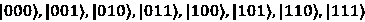
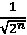
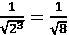
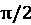
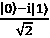
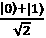
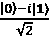
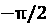
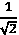
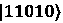

# 附录 B：评估

# 第一章：– 探索 IBM 量子工具

## 第 1 题

哪个应用程序包含你的 API 令牌？

## 答案

有两个地方可以获取你的 API 令牌。第一个是**账户设置视图**，其中可以找到 API 令牌，并且如果需要可以生成不同的令牌。另一个是在主仪表板上。

## 第 2 题

在你的资源列表中，哪个设备量子比特最少？

## 答案

最少量子比特的设备可用性将根据可用的量子设备而变化。然而，在撰写本文时，有至少 127 个量子比特的系统。下一个系统将是 133 个量子比特或更多。这是由于最近转向 IBM 量子平台以提供量子实用系统（超过 100 个量子比特）。

## 第 3 题

哪个应用程序会提供量子系统的量子比特图？

## 答案

**IBM 量子平台**提供了**计算资源**应用程序视图，该视图显示所有可用的量子系统。

# 第二章：– 使用 IBM 量子作曲家创建量子电路

## 第 1 题

从作曲家，你可以在哪里找到在量子计算机上运行你的电路所需的时间？

## 答案

你可以在**作曲家工作视图**的**状态时间线视图**中找到它。

## 第 2 题

你如何在作曲家上添加或删除量子比特到你的电路？

## 答案

你会点击一个量子比特并选择**+**或垃圾桶图标来分别添加或从电路中删除量子比特。

## 第 3 题

在哪个视图中指定要运行电路的量子系统？

## 答案

你可以使用**设置和运行视图**，该视图可通过**作曲家视图**访问，来选择系统。

## 第 4 题

哪个球体最适合在单个球体中查看三个量子比特的量子状态？

## 答案

你会使用 qsphere 来表示单个球体中的多个量子状态。

# 第三章：– 介绍和安装 Qiskit

## 第 1 题

用你自己的话描述内核开发者和应用程序开发者之间的区别。

## 答案

通常，内核开发者可以被视为为量子系统创建特定电路的开发者。这与经典汇编开发者类似。应用程序开发者会将量子算法集成到经典应用程序或工作流程中。

## 第 2 题

如果你想获取电路的单位矩阵，哪个模拟器会提供单位矩阵结果？

## 答案

来自 Qiskit Aer 库的单元模拟器。

## 第 3 题

你能用自己的话描述 Aer 提供的五个模拟器类别中的每一个吗？

## 答案

每个细节都在章节中描述；这个问题是为了检查你对每个模拟器的直观理解。例如，状态向量模拟器不需要测量，因为它只计算电路的最终状态。

## 第 4 题

你需要导入哪个模块来绘制直方图？

## 答案

Qiskit 可视化模块。

# 第四章：– 理解基本量子计算原理

## 问题 1

你会如何创建一个纠缠两个量子位的电路，其中每个量子位都不同（即**01**，**10**）？

## 答案

我们可以使用以下代码创建一个纠缠两个量子位的电路：

```py
qc = QuantumCircuit(2,2)
qc.h(0)
qc.x(1)
qc.cx(0,1)
qc.measure([0,1], [0,1])
qc.draw() 
```

## 问题 2

创建一个包含多量子位门的电路，例如受控 Hadamard 门。

## 答案

电路只需确保有两个量子位，并包含一个受控 Hadamard 门（**ch**）。在以下示例中，第一个量子位是控制位，第二个量子位是目标位。我们向控制量子位添加一个 Hadamard 门，以确保我们得到`0`或`1`；否则，控制位永远不会被设置：

```py
qc = QuantumCircuit(2,2)
qc.h(0)
qc.ch(0,1)
qc.draw() 
```

## 问题 3

在电路中创建所有 4 个贝尔态。

## 答案

电路只需有两个量子位，并包含一个受控-X 门（`cx`），其中第一个参数是控制位，第二个是目标位。在以下示例中，第一个量子位是控制位，第二个量子位是目标位。我们向控制量子位添加一个 Hadamard 门，以确保我们得到`0`或`1`；否则，控制位永远不会被设置：

```py
qc = QuantumCircuit(2,2)
qc.h(0)
qc.cx(0,1)
qc.draw() 
```

后续电路只需改变**cx**门控制位和目标位的方向，并确保 Hadamard 门与控制位在同一量子位上。

## 问题 4

三个量子计算原理是什么？

## 答案

三个量子计算原理是叠加、干涉和纠缠。叠加和干涉在经典物理学中描述，而纠缠在量子物理学中描述。

# 第五章：– 理解量子位

## 问题 1

哪个可以提供关于量子位相位的视觉信息——Bloch 球体还是 qsphere？

## 答案

都有。Qiskit 球体（q-sphere）包括一个复选框来可视化相位信息。Bloch 球体通过向量在相位不同时的位置来表示相位，也就是说，它是绕*z*轴旋转的。

## 问题 2

你能在 Bloch 球体上可视化多个量子位吗？如果不能，请描述为什么不能。

## 答案

不，我们不能像在 qsphere 上那样在 Bloch 球体上可视化多量子位。Bloch 球体通常用于表示给定状态的单一量子位向量位置，而 qsphere 包括相位。要使用 Bloch 球体表示多个量子位，你需要为每个量子位有一个 Bloch 球体。

## 问题 3

将三个量子态的张量积以所有形式写出来。

## 答案

对于一个三量子位系统，结果基态为  。

## 问题 4

三量子位系统的概率振幅是什么？

## 答案

三量子位系统的振幅为 ，其中*n*是量子位的数量，结果为 。

# 第六章：– 理解量子逻辑门

## 问题 1

对于多量子位门，尝试翻转源和目标。当你分解电路时，你看到有什么区别吗？

## 答案

不，没有看到任何差异，只是现在源被分配到了相反的量子比特上。

## 问题 2

将单量子比特和多量子比特电路的所有门分解。您注意到了关于通用门如何构建的哪些方面？

## 答案

单个门现在通过其各自的基门显示，包括任何旋转值。多量子比特门，如 Toffoli 门，也被分解为用于构建指定量子比特之间 Toffoli 门操作的特定门。

## 问题 3

实现目标为三量子比特电路中心量子比特的 Toffoli 门。

## 答案

使用以下代码实现 Toffoli 门，其中目标是三量子比特电路的中心量子比特：

```py
qc = QuantumCircuit(3)
qc.ccx(0,2,1)
qc.draw() 
```

## 问题 4

分解 Toffoli 门。总共使用了多少个门来构建它？

## 答案

在将 Toffoli 门分解为 Hadamard、T、T dagger 和 CX 门时，总共有 15 个门，并且深度运行 11 次。值得注意的是，如果开发出更有效的 Toffoli 门组合方式，深度可能会改变。

## 问题 5

将 Toffoli 门和 Hadamard 门应用于状态向量模拟器，并将结果与采样原语的结果进行比较。您看到了哪些差异，为什么？

## 答案

采样原语默认运行 1024 次，因此将产生大约 50% 的`000`和 50% 的`001`的结果，假设 Hadamard 门放置在第一个量子比特上。另一方面，仅运行一次的态向量模拟器将产生状态`000`或`001`；结果将取决于您放置 Hadamard 门的量子比特。

## 问题 6

如果您想要以相反的方向对三个量子比特进行排序，您将使用哪些门以及它们的顺序？

## 答案

您可以使用`swap`门在任意两个量子比特之间切换每个量子比特的值（以下是一个两个量子比特的示例）：

```py
qc = QuantumCircuit(2)
qc.x(0)
# current state is '01'
qc.swap(0,1)
# current state is reversed, '10' 
```

# 第七章：– 使用 Qiskit 编程

## 问题 1

构建一个宽度为`4`、深度为`9`的随机量子电路。

## 答案

```py
from qiskit.circuit.random import random_circuit
#Circuit with a width = 4, a depth = 9
qc = random_circuit(4, 9, measure=True) 
```

## 问题 2

创建另一个与您在*问题 1*中创建的电路具有相同宽度的随机量子电路，并将其连接，以便在您创建的随机量子电路之前添加。

## 答案

```py
qc1 = random_circuit(2,2)
qc_combined = qc.compose(qc1, [0,1], front=True) 
```

## 问题 3

打印从*问题 3*连接的量子电路的电路属性，并指定操作符的总数，不包括任何测量操作符。

## 答案

```py
qc_combined.draw()
qc_combined.count_ops() 
```

## 问题 4

创建一个参数化的 R[Y] 门电路，使其旋转角度为 。

## 答案

```py
import numpy as np
from qiskit.circuit import Parameter
param_theta = Parameter('Ɵ')
qc = QuantumCircuit(2)
qc.rz(param_theta,0)
qc = qc.assign_parameters({param_theta: np.pi/2})
qc.draw() 
```

# 第八章：– 优化和可视化量子电路

## 问题 1

您能说出翻译器组件的两个组件吗？

## 答案

**Pass**和**PassManager**。

## 问题 2

哪个组件允许您指定要使用的步骤？

## 答案

**PassManager**用于指定使用哪些步骤以及哪些步骤可以与其他步骤通信。

## 问题 3

当运行 transpile() 函数时，默认的 `optimization_level` 值是什么？

## 答案

优化级别 1。

## 问题 4

列出三个布局选择传递。

## 答案

显而易见，密集，和 Sabre。

# 第九章：– 模拟量子系统和噪声模型

## 问题 1

你可以列出 Qiskit Aer 模块中找到的所有模拟器吗？

## 答案

可以使用 `Aer.backends()` 函数生成模拟器的列表。

## 问题 2

使用单个哈达玛门和相位门，在负 *Y* 轴上创建一个量子比特的 qsphere 表示，创建状态 。

## 答案

为了完成这个任务，你需要将量子比特设置在叠加态。这可以通过使用哈达玛门（H）来完成，这将量子比特置于状态 。之后，我们将不得不从  状态运行一个相位偏移到  状态，这意味着我们需要一个相位门来将状态偏移一个  的相位，如下所示：

```py
qc = QuantumCircuit(1)
qc.h(0)
qc.sdg(0)
simulator = Aer.get_backend('statevector_simulator')
transpiled_qc = transpile(qc, backend=simulator)
result = simulator.run(transpiled_qc).result()
statevector = result.get_statevector(transpiled_qc)
statevector 
```

## 问题 3

在初始化电路中的一组量子比特时，所有状态的总概率必须是多少？

## 答案

在 `initialize` 函数参数中，`param` 值的总平方和必须加起来等于 1，如下例所示，其中  设置了两次。因此，如果你取平方和，它将等于 1：

```py
import numpy as np
qc = QuantumCircuit(2, 2)
init_qubits = [0, 1]
qc.initialize([1, 0, 0, 1] / np.sqrt(2), init_qubits) 
```

## 问题 4

你可以使用 qsphere 来可视化量子比特的相位和概率信息吗？

## 答案

是的，相位的给出由状态向量的颜色决定，概率通过状态向量尖端的大小来可视化。直径越大，概率越高。

## 问题 5

如果你将去极化错误值设置得接近 1，会发生什么？

## 答案

这将设置  的值为 `1`，因此完全去极化通道。

## 问题 6

如果你将读出错误平均地应用于所有量子比特，你期望的结果是什么，为什么？

## 答案

在模拟器上运行时，而不是导致理想条件（无错误），你将看到错误，其中错误的显著性基于设置的 `ReadoutError()` 参数。

# 第十章：– 抑制和缓解量子噪声

## 问题 1

列出 Qiskit 运行时服务使用的三种主要错误缓解技术。

## 答案

最小缓解，中等缓解，和重度缓解。

## 问题 2

用于错误缓解的哪些容错级别被使用？

## 答案

级别 0 到 2，其中级别 1 是默认值。

## 问题 3

你可以使用哪些其他可逆门来使用动态去耦填充量子比特的空闲时间？

## 答案

任何可逆门，例如 `XGate` 或 `YGate`。

## 问题 4

哪种类型的噪声会导致量子比特振幅衰减？

## 答案

热噪声。

## 问题 5

哪种类型的噪声会导致量子比特去相干？

## 答案

白噪声，粉红噪声，和磁通噪声。

# 第十一章：– 理解量子算法

## 问题 1

你会使用哪个算法来确定一个*n*-位字符串是否平衡？

## 答案

Deutsch-Jozsa 算法可以用来确定一个函数是否是常数或平衡的。

## 问题 2

实现伯恩斯坦-瓦齐拉尼算法以找到状态`170`。

## 答案

要创建电路，你需要 170 的二进制表示。然后，在所有量子比特（除了辅助量子比特）应用 Hadamard 门之后，首先对该辅助量子比特应用 NOT 门，然后应用 Hadamard 门，对表示 170 的二进制值（表示为值`10101010`）的每个量子比特应用 CX 门，170 的二进制值表示为`10101010`。因此，您将对每个奇数量子比特应用 CX 门，其中每个 CX 门的控制应设置为量子比特`1`、`3`、`5`和`7`，每个 CX 门的目标是辅助量子比特。然后，对除了辅助量子比特之外的所有量子比特应用 Hadamard 门，然后应用测量算子。

## 问题 3

有多少个 oracle 函数？

## 答案

通常，大多数算法都有一个 oracle 函数；然而，有些算法需要多个，或者函数的多次运行，例如 Grover 算法，它根据电路的量子比特数重复 oracle 和扩散算子函数。

# 第十二章：– 应用量子算法

## 问题 1

你可以使用周期函数解决哪些其他问题？

## 答案

**量子傅里叶变换**（**QFT**）是解决周期函数中较为流行的算法之一。

## 问题 2

在 5 个量子比特的状态上实现 QFT——例如：‘10110’。

## 答案

使用书中相同的示例，只需通过添加另一个量子比特来扩展另一个**交换**门的重复次数。

## 问题 3

使用 Grover 算法，找到以下状态，‘101’，‘001’，和‘010’。

## 答案

简单地将参数上的数值更改为上述值，然后观察电路的 oracle 表示每个三个值的变化。由于所有值都是 3 个量子比特的长度，每个值的重复次数将相同（仅一次）。

## 问题 4

你需要运行 Grover 的扩散算子多少次才能找到状态？

## 答案

使用以下内容来确定重复函数的次数，，其中 N 是量子比特的数量。这里，N=4。

## 问题 5

重新运行 Grover 的搜索示例。仅重复 Grover 的扩散算子两次，并注意结果中的差异。你看到了什么不同？如果你运行它超过三次，你会期望它如何改变？

## 答案

我们正在寻找的值与其他值之间的振幅差异将不同，要么增加，要么减少。

# 第十三章：– 理解量子效用和 Qiskit 模式

## 问题 1

Qiskit 模式的四个步骤是什么？

## 答案

映射、优化、执行和后处理。

## 问题 2

哪个 Qiskit 模式处理将量子电路映射到硬件？

## 答案

优化步骤处理将电路映射到硬件的过程。

## 问题 3

当您将问题编码成量子态时，您处于哪个 Qiskit 模式步骤？

## 答案

您正在将经典数据的输入值映射到量子态。

## 问题 4

为什么我们在 Grover 示例中使用了采样器而不是估计器原语？

## 答案

我们不需要使用任何可观察量来解决 Grover 算法。只需返回结果的准分布就能提供答案。

# 加入我们的 Discord

加入我们社区的 Discord 空间，与作者和其他读者进行讨论：

`packt.link/3FyN1`


