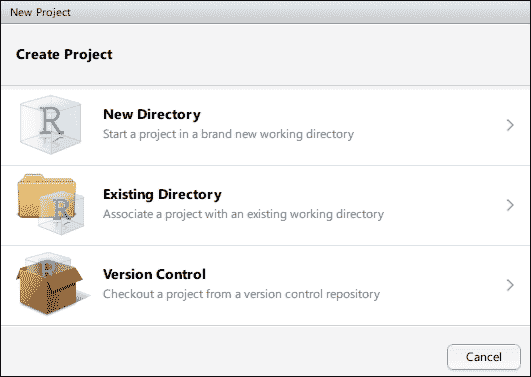
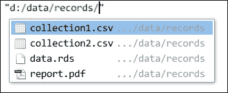
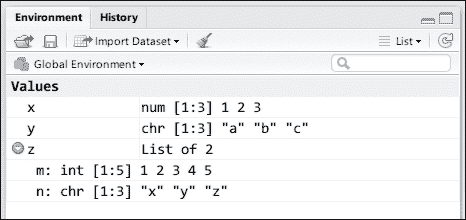
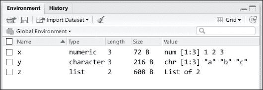
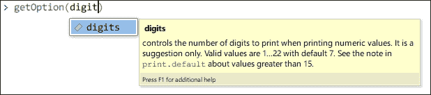
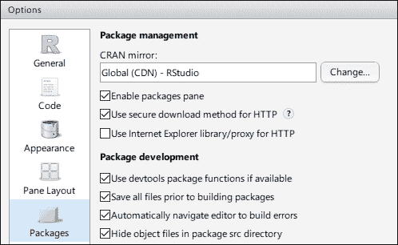
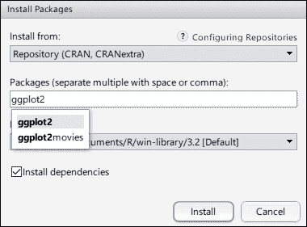

# 第三章. 管理你的工作空间

如果将 R 对象的行性行为比作游戏规则，那么工作空间可以比作游乐场。为了玩好这个游戏，你需要熟悉规则，也要熟悉游乐场。在本章中，我将向你介绍一些基本但重要的技能来管理你的工作空间。这些技能包括：

+   使用工作目录

+   检查工作环境

+   修改全局选项

+   管理包的库

# R 的工作目录

不论是作为 R 终端还是 RStudio 启动，R 会话总是从一个目录开始。R 正在运行的目录被称为 R 会话的**工作目录**。当你访问硬盘上的其他文件时，你可以使用绝对路径（例如，`D:\Workspaces\test-project\data\2015.csv`）在大多数情况下，或者使用正确的**工作目录**（在这种情况下，`D:\Workspaces\test-project`）的相对路径（例如，`data\2015.csv`）。

使用相对于工作目录的路径并不会改变文件路径，但指定它们的方式更短。这也会使你的脚本更易于移植。想象一下，你正在编写一些 R 脚本，根据目录中的一系列数据文件生成图形。如果你将目录作为绝对路径写入，那么任何想要在自己的电脑上运行你的脚本的人都需要修改代码中的路径，以匹配他们硬盘上数据的位置。然而，如果你将目录作为相对路径写入，那么如果数据保持在相同的相对位置，脚本将无需任何修改即可运行。

在 R 终端中，你可以使用`getwd()`函数获取当前 R 会话的工作目录。默认情况下，commandR 从你的用户目录启动一个新的 R 会话，而 RStudio 则在你的用户文档目录的背景中运行一个 R 会话。

除了默认设置外，你还可以选择一个目录，并在 RStudio 中创建一个 R 项目。然后，每次你打开该项目时，工作目录就是项目位置，这使得使用相对路径访问项目目录中的文件变得非常容易，这提高了项目的可移植性。

## 在 RStudio 中创建 R 项目

要创建一个新项目，只需转到**文件**|**新建项目**或点击主窗口右上角的**项目**下拉菜单并选择**新建项目**。会出现一个窗口，你可以在其中创建一个新的目录或选择硬盘上的现有目录作为项目目录：



一旦选择了一个本地目录，项目就会在那里创建。R 项目实际上是一个`.Rproj`文件，它存储了一些设置。如果你在 RStudio 中打开这样的项目文件，其中的设置将被应用，并且工作目录将被设置为项目文件所在的目录。

在使用 RStudio 在项目中工作时，另一个有用的点是自动完成使编写文件路径变得更加高效。当你输入一个绝对或相对文件路径的字符串时，按 *Tab* 键，RStudio 将列出该目录中的文件：



## 比较绝对路径和相对路径

由于我使用 RStudio 中的 RMarkdown 编写这本书，工作目录是我的书项目目录：

```py
getwd()
## [1] "D:/Workspaces/learn-r-programming"

```

你可能会注意到前面提到的工作目录使用 `/` 而不是 `\`。在 Windows 操作系统中，`\` 是默认路径分隔符，但这个符号已经被用来表示特殊字符。例如，当你创建一个字符向量时，你可以使用 `\n` 来表示一个新行：

```py
"Hello\nWorld"
## [1] "Hello\nWorld"

```

当字符向量直接打印为字符串表示时，特殊字符会被保留。然而，如果你给它添加 `cat()`，字符串将在控制台中写入，转义字符将被转换为它们所代表的字符：

```py
cat("Hello\nWorld")
## Hello 
## World

```

第二个单词从新的一行（`\\n`）开始，就像平常一样。然而，如果 `\` 是如此特殊，我们应该如何写出 `\` 本身呢？只需使用 `\\`：

```py
cat("The string with '' is translated")
## The string with '' is translated

```

正因如此，在 Windows 操作系统中，我们应该使用 `\\` 或 `/` 作为路径分隔符，因为两者都受到支持。在类似 Unix 的操作系统中，例如 macOS 和 Linux，事情要简单得多：始终使用 `/`。如果你使用 Windows 并且错误地使用 `\` 来引用文件，将会发生错误：

```py
filename <- "d:\data\test.csv" 
## Error: '\d' is an unrecognized escape in character string starting ""d:\d"

```

相反，你需要这样写：

```py
filename <- "d:\\data\\test.csv"

```

幸运的是，在大多数情况下，我们可以在 Windows 中使用 `/`，这使得相同的代码在几乎所有流行的操作系统上使用相对路径时都能运行：

```py
absolute_filename <- "d:/data/test.csv"
relative_filename <- "data/test.csv"

```

我们不仅可以通过 `getwd()` 获取工作目录，还可以使用 `setwd()` 设置当前 R 会话的工作目录。然而，这几乎总是不被推荐，因为它可以将脚本中的所有相对路径直接指向另一个目录，导致一切出错。

因此，一个好的做法是创建一个 R 项目来开始你的工作。

## 管理项目文件

一旦我们在 RStudio 中创建了一个项目，项目目录中也会创建一个 `.Rproj` 文件，目前该目录中没有其他文件。由于 R 与统计计算和数据可视化相关，R 项目主要包含进行统计计算（或其他编程任务）的 R 脚本，数据文件（如 `.csv` 文件），文档（如 Markdown 文件），有时还包括输出图形。

如果在项目目录中混合了不同类型的文件，随着输入数据的积累或输出数据和图形使目录变得杂乱，管理这些项目文件将会越来越困难。

一个推荐的做法是创建子目录来包含不同类型任务产生的不同类型的文件。

例如，以下目录结构很简单，所有文件都在一起：

```py
project/
- household.csv 
- population.csv 
- national-income.png 
- popluation-density.png 
- utils.R 
- import-data.R 
- check-data.R 
- plot.R 
- README.md 
- NOTES.md
```

与此相反，以下目录结构要干净得多，也更易于使用：

```py
project/ 
- data/ 
  - household.csv 
  - population.csv 
- graphics/ 
  - national-income.png 
  - popluation-density.png 
- R/ 
  - utils.R 
  - import-data.R 
  - check-data.R 
  - plot.R 
- README.md 
- NOTES.md
```

在前面的目录结构中，目录以 `directory/` 的形式表示，文件以 `file-name.ext` 的形式表示。在大多数情况下，建议使用第二种结构，因为随着项目需求和任务的复杂化，第一种结构最终会变得混乱，而第二种结构将保持整洁。

除了结构问题之外，通常会在 `README.md` 中编写项目介绍，并在 `NOTES.md` 中放置额外的注释。这两个文档都是 Markdown 文档（`.md`），熟悉其极其简单的语法是值得的。阅读 *Daring Fireball: Markdown 语法文档* ([`daringfireball.net/projects/markdown/syntax`](https://daringfireball.net/projects/markdown/syntax)) 和 *GitHub 帮助：Markdown 基础* ([`help.github.com/articles/markdown-basics/`](https://help.github.com/articles/markdown-basics/)) 以获取详细信息。我们将在第十五章 提高生产力 中介绍 R 和 Markdown 的结合。

现在工作目录已准备就绪。在下一节中，你将学习在 R 会话中检查工作环境的各种方法。

# 检查环境

在 R 中，每个表达式都是在特定的环境中评估的。环境是一组符号及其绑定的集合。当我们将值绑定到符号、调用函数或引用名称时，R 将在当前环境中查找符号。如果你在 RStudio 控制台中输入命令，你的命令将在 **全局环境** 中评估。

例如，当我们在一个终端或 RStudio 中启动一个新的 R 会话时，我们开始在空的全局环境中工作。换句话说，在这个环境中没有定义任何符号。如果我们运行 `x <- c(1, 2, 3)`，数值向量 `c(1, 2, 3)` 将绑定到全局环境中的符号 `x`。然后，全局环境有一个绑定，将 `x` 映射到向量 `c(1, 2, 3)`。换句话说，如果你评估 `x`，那么你将得到它的值。

## 检查现有符号

除了在上一章中我们处理向量列表之外，我们还需要了解一些基本函数来检查和操作我们的工作环境。检查我们正在处理的对象集合的最基本但有用的函数是 `objects()`。该函数返回当前环境中现有对象名称的字符向量。

在一个新的 R 会话中，当前环境中不应该有任何符号：

```py
objects()
## character(0)

```

让我们假设我们创建了以下对象：

```py
x <- c(1, 2, 3)
y <- c("a", "b", "c")
z <- list(m = 1:5, n = c("x", "y", "z"))

```

然后，你将得到一个包含现有对象名称的字符向量：

```py
objects()
## [1] "x" "y" "z"

```

许多开发者更喜欢将 `ls()` 作为 `objects()` 的别名：

```py
ls()
## [1] "x" "y" "z"

```

在大多数情况下，尤其是在你使用 RStudio 的情况下，你不需要使用 `objects()` 或 `ls()` 来查看创建了哪些符号，因为 **环境** 面板显示了全局环境中所有可用的符号：



**环境**面板以紧凑的形式显示符号及其值。你可以通过展开列表或数据帧并查看其中的向量与之交互。

除了列表视图外，**环境**面板还提供了一个替代的网格视图。网格视图不仅显示现有对象的名字、类型和值结构，还显示它们的对象大小：



虽然 RStudio 中的**环境**面板使得检查所有现有变量变得简单，但在 RStudio 不可用、编写与它们的名称一起工作的函数或对象以不同方式动态提供时，`objects()`或`ls()`仍然很有用。

## 查看对象的结构

在**环境**面板中，对象的紧凑表示来自`str()`函数，该函数打印给定对象的结构。

例如，当`str()`应用于一个简单的数值向量时，它显示其类型、位置和值预览：

```py
x
## [1] 1 2 3
str(x)
## num [1:3] 1 2 3
```

如果向量有超过 10 个元素，`str()`将只显示前 10 个：

```py
str(1:30)
## int [1:30] 1 2 3 4 5 6 7 8 9 10 ...
```

对于列表，直接在控制台或使用`print()`评估它将显示其元素并以冗长形式显示：

```py
z
## $m
## [1] 1 2 3 4 5
## 
## $n
## [1] "x" "y" "z"
```

或者，`str()`显示其类型、长度和元素结构预览：

```py
str(z)
## List of 2
## $ m: int [1:5] 1 2 3 4 5
## $ n: chr [1:3] "x" "y" "z"
```

假设我们创建了以下嵌套列表：

```py
nested_list <- list(m = 1:15, n = list("a", c(1, 2, 3)),
   p = list(x = 1:10, y = c("a", "b")),
   q = list(x = 0:9, y = c("c", "d")))
```

直接打印将显示所有元素并告诉我们如何访问它们，这在大多数情况下可能既长又没有必要：

```py
nested_list
## $m
## [1] 1 2 3 4 5 6 7 8 9 10 11 12 13 14 15
## 
## $n
## $n[[1]]
## [1] "a"
## 
## $n[[2]]
## [1] 1 2 3
## 
## 
## $p
## $p$x
## [1] 1 2 3 4 5 6 7 8 9 10
## 
## $p$y
## [1] "a" "b"
## 
## 
## $q
## $q$x
## [1] 0 1 2 3 4 5 6 7 8 9
## 
## $q$y
## [1] "c" "d"
```

要获取一个更易于查看和工作的紧凑表示，请使用列表调用`str()`：

```py
str(nested_list)
## List of 4
## $ m: int [1:15] 1 2 3 4 5 6 7 8 9 10 ...
## $ n:List of 2
## ..$ : chr "a"
## ..$ : num [1:3] 1 2 3
## $ p:List of 2
## ..$ x: int [1:10] 1 2 3 4 5 6 7 8 9 10
## ..$ y: chr [1:2] "a" "b"
## $ q:List of 2
## ..$ x: int [1:10] 0 1 2 3 4 5 6 7 8 9
## ..$ y: chr [1:2] "c" "d"
```

虽然`str()`显示了对象的结构，但`ls.str()`显示了当前环境的结构：

```py
ls.str()
## nested_list : List of 4
## $ m: int [1:15] 1 2 3 4 5 6 7 8 9 10 ...
## $ n:List of 2
## $ p:List of 2
## $ q:List of 2
## x : num [1:3] 1 2 3
## y : chr [1:3] "a" "b" "c"
## z : List of 2
## $ m: int [1:5] 1 2 3 4 5
## $ n: chr [1:3] "x" "y" "z"
```

其功能类似于 RStudio 中的**环境**面板，当需要检查自定义环境或仅显示某些特定变量的结构时，可能很有用。

`ls.str()`的一个过滤器是模式参数。你可以显示所有值为列表对象的结构：

```py
ls.str(mode = "list")
## nested_list : List of 4
## $ m: int [1:15] 1 2 3 4 5 6 7 8 9 10 ...
## $ n:List of 2
## $ p:List of 2
## $ q:List of 2
## z : List of 2
## $ m: int [1:5] 1 2 3 4 5
## $ n: chr [1:3] "x" "y" "z"
```

另一个过滤器是模式参数，它指定要匹配的名称模式。该模式用**正则表达式**表示。如果你想显示所有只包含一个字符的变量结构，你可以运行以下命令：

```py
ls.str(pattern = "^\\w$")
## x : num [1:3] 1 2 3
## y : chr [1:3] "a" "b" "c"
## z : List of 2
## $ m: int [1:5] 1 2 3 4 5
## $ n: chr [1:3] "x" "y" "z"
```

如果你想显示所有只包含一个字符的列表对象结构，你可以同时使用模式和模式：

```py
ls.str(pattern = "^\\w$", mode = "list")
## z : List of 2
## $ m: int [1:5] 1 2 3 4 5
## $ n: chr [1:3] "x" "y" "z"
```

如果你被像`^\\w$`这样的命令吓到，不要担心。此模式匹配所有形式为`(string begin)(any one word character like a, b, c)(string end)`的字符串。我们将在第六章“处理字符串”中介绍这个强大的工具。

## 移除符号

到目前为止，我们只创建了符号。有时，移除它们可能很有用。`remove()`函数，或等价的`rm()`，从环境中移除现有符号。

在移除 `x` 之前，环境中的符号如下：

```py
ls()
## [1] "nested_list" "x" "y" "z"
```

然后，我们将使用 `rm()` 从环境中移除 `x`：

```py
rm(x)
ls()
## [1] "nested_list" "y" "z"
```

注意，该函数也适用于字符串中的变量名。因此，`rm("x")` 有完全相同的效果。我们也可以在一个函数调用中移除多个符号：

```py
rm(y, z)
ls()
## [1] "nested_list"
```

如果要移除的符号在环境中不存在，将会出现警告：

```py
rm(x)
## Warning in rm(x): object 'x' not found
```

`rm()` 函数也可以通过符号名称的字符向量移除指定的所有符号：

```py
p <- 1:10
q <- seq(1, 20, 5)
v <- c("p", "q")
rm(list = v)
## [1] "nested_list" "v"
```

如果我们想清除环境中的所有绑定，我们可以结合 `rm()` 和 `ls()` 并像这样调用函数：

```py
rm(list = ls())
ls()
## character(0)
```

现在环境中没有符号。

在许多情况下，移除符号不是必需的，但移除占用大量内存的大对象可能很有用。如果 R 感觉到内存压力，它将清理没有绑定的未使用对象。

# 修改全局选项

与在工作环境中创建、检查和删除对象相比，R 选项在当前 R 会话的全局范围内产生影响。我们可以调用 `getOption()` 来查看给定选项的值，并调用 `options()` 来修改它。

## 修改打印数字的位数

在 RStudio 中，当你输入 `getOption(<Tab>)` 时，你可以看到一个可用选项及其描述的列表。例如，常用的一个选项是显示的数字位数。有时，当我们处理需要更高精度的数字时，这并不足够。在一个 R 会话中，屏幕上打印的数字位数完全由 `digits` 管理。我们可以调用 `getOption()` 来查看 `digits` 的当前值，并调用 `options()` 将 `digits` 设置为更大的数字：



当 R 会话开始时，`digits` 的默认值是 7。为了演示其效果，运行以下代码：

```py
123.12345678
## [1] 123.1235
```

显然，11 位的数字只显示了 7 位。这意味着最后几位小数位已经丢失；打印机只显示 7 位的数字。为了验证 `digits = 7` 不会因为精度丢失，请查看以下代码的输出：

```py
0.10000002
## [1] 0.1
0.10000002 -0.1
## [1] 2e-08
```

如果数字默认四舍五入到第七位小数，那么 `0.10000002` 应该四舍五入到 `0.1`，第二个表达式应该得到 `0`。然而，显然这不是因为 `digits = 7` 只意味着要显示的数字位数，而不是向上舍入。

然而，在某些情况下，小数点前的数字可能很大，我们不希望忽略小数点后的数字。在不修改数字的情况下，以下数字将只显示整数部分：

```py
1234567.12345678
## [1] 1234567
```

如果我们想打印更多的数字，我们需要将数字从默认值 7 增加到一个更高的数字：

```py
getOption("digits")
## [1] 7
1e10 + 0.5
## [1] 1e + 10
options(digits = 15)
1e10 + 0.5
## [1] 10000000000.5
```

注意，一旦调用 `options()`，修改后的选项将立即生效，可能会影响所有后续命令的行为。要重置选项，请使用此命令：

```py
options(digits = 7)
1e10 + 0.5
## [1] 1e + 10
```

## 修改警告级别

另一个通过指定`warn`选项值来管理警告级别的选项示例：

```py
getOption("warn")
## [1] 0
```

默认情况下，警告级别是`0`，这意味着警告就是警告，错误就是错误。在这种状态下，警告会被显示，但不会停止代码，而错误会立即终止代码。如果发生多个警告，它们将被合并并一起显示。例如，以下从字符串到数值向量的转换将产生警告并导致缺失值：

```py
as.numeric("hello")
## Warning: NAs introduced by coercion
## [1] NA
```

我们可以使它完全静音，并且仍然从失败的转换中获取缺失值：

```py
options(warn = -1)
as.numeric("hello")
## [1] NA
```

然后，警告信息消失了。使警告信息消失几乎总是个坏主意。它会使得潜在的错误变得无声。你可能（或不可能）从最终结果中意识到有什么地方出了问题。建议对代码严格要求，这样可以节省大量调试时间。

将`warn`设置为 1 或 2 将使有缺陷的代码快速失败。当`warn = 0`时，评估函数调用的默认行为是首先返回值，然后如果有的话，一起显示所有警告信息。为了演示这种行为，以下函数使用两个字符串被调用：

```py
f <- function(x, y) {
as.numeric(x) + as.numeric(y)
}
```

在默认的警告级别下，所有警告信息都在函数返回后显示：

```py
options(warn = 0)
f("hello", "world")
## [1] NA
## Warning messages:
## 1: In f("hello", "world") : NAs introduced by coercion
## 2: In f("hello", "world") : NAs introduced by coercion
```

该函数将两个输入参数强制转换为数值向量。由于输入参数都是字符串，将产生两个警告，但它们只会在函数返回后出现。如果前面的函数执行了一些繁重的工作并花费了相当长的时间，那么在得到最终结果之前你不会看到任何警告，但实际上中间计算已经偏离正确结果有一段时间了。

这促使使用`warn = 1`，它强制警告信息在产生警告时立即打印出来：

```py
options(warn = 1)
f("hello", "world")
## Warning in f("hello", "world") : NAs introduced by coercion
## Warning in f("hello", "world") : NAs introduced by coercion
## [1] NA
```

结果相同，但警告信息出现在结果之前。如果函数耗时较长，我们应该能够先看到警告信息。因此，我们可以选择停止代码并检查是否有问题。

警告级别甚至更严格。`warn = 2`参数直接将任何警告视为错误。

```py
options(warn = 2)
f("hello", "world")
## Error in f("hello", "world") : 
## (converted from warning) NAs introduced by coercion
```

这些选项在全局范围内有影响。因此，它们便于管理 R 会话的常见方面，但改变选项也可能很危险。就像改变工作目录可能会使脚本中所有相对路径无效一样，改变全局选项可能会破坏所有基于全局选项不兼容假设的后续代码。

通常情况下，除非绝对必要，否则不建议修改全局选项。

# 管理包库

在 R 语言中，包在数据分析和可视化中扮演着不可或缺的角色。实际上，R 本身只是一个微小的核心，它建立在几个基本包的基础上。包是一个预定义函数的容器，这些函数通常设计得足够通用，可以解决一定范围内的问题。使用一个设计良好的包，我们不必一次次地重新发明轮子，这使我们能够更多地关注我们试图解决的问题。

R 语言之所以强大，不仅因为其丰富的包资源，还因为有一个维护良好的包存档系统，称为**综合 R 存档网络**，或简称 CRAN ([`cran.r-project.org/`](http://cran.r-project.org/))。R 的源代码和数千个包都存档在这个系统中。在撰写本文时，CRAN 上有 7,750 个活跃的包，由全球超过 4,500 名包维护者维护。每周，将有超过 100 个包被更新，超过 200 万次包下载。您可以在[`cran.rstudio.com/web/packages/`](https://cran.rstudio.com/web/packages/)查看包的表格，其中列出了目前所有可用的包。

当你听到 CRAN 上包的数量时，请不要慌张！数量很大，覆盖面很广，但你只需要学习其中的一小部分。如果你专注于特定领域的工作，那么与你工作和领域高度相关的包可能不超过 10 个。因此，你完全没有必要了解所有的包（没有人能够或甚至需要这样做），只需要了解最有用和与领域相关的那些。

而不是在表格中寻找包，这并不那么有信息量，我建议你访问 CRAN 任务视图([`cran.rstudio.com/web/views/`](https://cran.rstudio.com/web/views/))和 METACRAN [`www.r-pkg.org/`](http://www.r-pkg.org/)，并从学习与你工作领域最常用或最相关的包开始。在学习如何使用特定包之前，我们需要对从不同来源安装包有一个大致的了解，并理解包的基本工作原理。

## 了解一个包

包是一组用于解决一定范围内问题的函数。它可以是一个统计估计器系列、数据挖掘方法、数据库接口或优化工具的实现。要了解更多关于某个包的信息，例如功能强大的图形包 ggplot2，以下信息来源很有用：

+   **软件包描述页面(**[`cran.rstudio.com/web/packages/ggplot2/`](https://cran.rstudio.com/web/packages/ggplot2/))：该页面包含软件包的基本信息，包括名称、描述、版本、发布日期、作者、相关网站、参考手册、示例、与其他软件包的关系等。软件包的描述页面不仅由 CRAN 提供，还由一些其他第三方软件包信息网站提供。METACRAN 还在[`www.r-pkg.org/pkg/ggplot2`](http://www.r-pkg.org/pkg/ggplot2)上提供了 ggplot2 的描述。

+   **软件包网站(**[`ggplot2.org/`](http://ggplot2.org/))：该网页包含软件包的描述和相关资源，如博客、教程和书籍。并非每个软件包都有网站，但如果有，该网站是了解软件包的官方起点。

+   **软件包源代码(**[`github.com/hadley/ggplot2`](https://github.com/hadley/ggplot2))：作者在 GitHub([`github.com`](https://github.com))上托管软件包的源代码，该页面是软件包的源代码。如果您对软件包函数的实现感兴趣，您可以查看源代码并查看。如果您发现一些看起来像错误的不寻常行为，您可以在[`github.com/hadley/ggplot2/issues`](https://github.com/hadley/ggplot2/issues)处报告它。您也可以在同一个地方提交问题以请求新功能。

在阅读软件包描述后，您可以通过将软件包安装到 R 库中来尝试它。

## 从 CRAN 安装软件包

CRAN 存档 R 软件包并将它们分发到全球超过 120 个镜像站点。您可以访问 CRAN 镜像([`cran.r-project.org/mirrors.html`](https://cran.r-project.org/mirrors.html))并查看附近的镜像。如果您找到了一个，您可以去**工具** | **全局选项**并打开以下对话框：



您可以将 CRAN 镜像更改为附近的镜像或简单地使用默认镜像。通常，如果您使用附近的镜像，您将体验到非常快的下载速度。在最近几个月，一些镜像开始使用 HTTPS 来保护数据传输。如果勾选了**使用安全的 HTTP 下载方法**，那么您就只能查看 HTTPS 镜像。

一旦选择了镜像，在 R 中下载和安装软件包就变得极其简单。只需调用 `install.packages("ggplot2")`，R 将自动下载软件包，安装它，有时还会编译它。

RStudio 也提供了一个安装软件包的简单方法。只需转到“软件包”面板并点击**安装**。将出现以下对话框：



如包描述所示，一个包可能依赖于其他包。换句话说，当你调用包中的函数时，该函数也会调用其他包中的某些函数，这要求你也安装那些包。幸运的是，`install.packages()`足够智能，能够知道要安装的包的依赖结构，并将首先安装这些包。

在 METACRAN 的主页（[`www.r-pkg.org/`](http://www.r-pkg.org/))上，特色包是那些在 GitHub 上拥有最多星标的包。也就是说，这些包被许多 GitHub 用户标记。你可能希望在一次调用中安装多个特色包，如果你将包名作为字符向量写入，这是自然允许的：

```py
install.packages(c("ggplot2", "shiny", "knitr", "dplyr", "data.table"))
```

然后，`install.packages()`函数会自动解析所有这些包的联合依赖结构，并安装它们。

## 从 CRAN 更新包

默认情况下，`install.packages()`函数安装指定包的最新版本。一旦安装，包的版本就保持固定。然而，包可能会更新以修复错误或添加新功能。有时，包的更新版本可能会在警告中废弃旧版本中的函数。在这些情况下，我们可能保留包的过时状态，或者阅读包描述中的`NEWS`包后更新它，该包可以在包描述中找到（例如，[`cran.r-project.org/web/packages/ggplot2/news.html`](https://cran.r-project.org/web/packages/ggplot2/news.html)；有关重大更改的新版本详情，请参阅此链接）。

RStudio 在包面板中“安装”旁边的“更新”按钮提供。我们也可以使用以下函数并选择要更新的包：

```py
update.packages()
```

RStudio 和前面的函数会扫描包的新版本，并在必要时安装这些包及其依赖项。

## 从在线仓库安装包

现在，许多包作者在 GitHub 上托管他们的工作，因为版本控制和社区开发非常容易，这得益于精心设计的 issue-tracking 系统和 merge request 系统。一些作者不将他们的工作发布到 CRAN，而其他人只发布稳定的版本到 CRAN，并将新版本的开发保持在 GitHub 上。

如果你想要尝试最新的开发版本，它通常包含新功能或修复了一些错误，你可以直接使用 devtools 包从在线仓库安装包。

首先，如果 devtools 包不在你的库中，请安装它：

```py
install.packages("devtools")
```

然后，使用 devtools 包中的`install_github()`安装 ggplot2 的最新开发版本：

```py
library(devtools)
install_github("hadley/ggplot2")
```

devtools 包将从 GitHub 下载源代码，并将其作为你的库中的一个包。如果你的库中已经有了这个包，安装将替换它而不会询问。如果你想将开发版本回滚到最新的 CRAN 版本，你可以再次运行 CRAN 安装代码：

```py
install.packages("ggplot2")
```

然后，本地版本（GitHub 版本）被 CRAN 版本所取代。

## 使用包函数

使用包中的函数有两种方法。首先，我们可以调用 `library()` 来附加包，这样其中的函数就可以直接调用。其次，我们可以调用 `package::function()` 来仅使用函数，而无需将整个包附加到环境中。

例如，一些统计估计器不是在基础 R 中作为内置函数实现的，而是在其他包中实现。一个例子是偏度；统计函数由 moments 包提供。

要计算数值向量 `x` 的偏度，我们首先可以附加包，然后直接调用函数：

```py
library(moments)skewness(x)
```

或者，我们可以不附加包就调用包函数，使用 `::`:

```py
moments::skewness(x)
```

这两种方法返回相同的结果，但它们以不同的方式工作，并对环境有不同的影响。更具体地说，第一种方法（使用 `library()`）修改了符号的搜索路径，而第二种方法（使用 `::`）则不会。当你调用 `library(moments)` 时，包会被附加并添加到搜索路径中，这样包中的函数就可以在后续代码中直接使用。

有时，通过调用 `sessionInfo()` 来查看我们正在使用的包是有用的：

```py
sessionInfo()
## R version 3.2.3 (2015-12-10)
## Platform: x86_64-w64-mingw32/x64 (64-bit)
## Running under: Windows 10 x64 (build 10586)
## 
## locale:
## [1] LC_COLLATE=English_UnitedStates.1252
## [2] LC_CTYPE=English_UnitedStates.1252
## [3] LC_MONETARY=English_UnitedStates.1252
## [4] LC_NUMERIC=C 
## [5] LC_TIME=English_UnitedStates.1252
## 
## attached base packages:
## [1] stats graphics grDevicesutils datasets 
## [6] methods base 
## 
## loaded via a namespace (and not attached):
## [1] magrittr_1.5formatR_1.2.1tools_3.2.3
## [4] htmltools_0.3yaml_2.1.13stringi_1.0-1 
## [7] rmarkdown_0.9.2knitr_1.12stringr_1.0.0
## [10] digest_0.6.8evaluate_0.8
```

会话信息显示了 R 版本，并列出了附加包和已加载包。当我们使用 `::` 访问包中的函数时，包未附加但已加载到内存中。在这种情况下，包中的其他函数仍然不可直接使用：

```py
moments::skewness(c(1, 2, 3, 2, 1))
## [1] 0.3436216
sessionInfo()
## R version 3.2.3 (2015-12-10)
## Platform: x86_64-w64-mingw32/x64 (64-bit)
## Running under: Windows 10 x64 (build 10586)
## 
## locale:
## [1] LC_COLLATE=English_UnitedStates.1252
## [2] LC_CTYPE=English_UnitedStates.1252
## [3] LC_MONETARY=English_UnitedStates.1252
## [4] LC_NUMERIC=C 
## [5] LC_TIME=English_UnitedStates.1252
## 
## attached base packages:
## [1] stats graphics grDevicesutils datasets 
## [6] methods base 
## 
## loaded via a namespace (and not attached):
## [1] magrittr_1.5formatR_1.2.1tools_3.2.3
## [4] htmltools_0.3yaml_2.1.13stringi_1.0-1 
## [7] rmarkdown_0.9.2knitr_1.12stringr_1.0.0
## [10] digest_0.6.8moments_0.14evaluate_0.8
```

这表明 moments 包已被加载但未附加。当我们 `calllibrary(moments)` 时，包将被附加：

```py
library(moments)sessionInfo()
## R version 3.2.3 (2015-12-10)
## Platform: x86_64-w64-mingw32/x64 (64-bit)
## Running under: Windows 10 x64 (build 10586)
## 
## locale:
## [1] LC_COLLATE=English_UnitedStates.1252
## [2] LC_CTYPE=English_UnitedStates.1252
## [3] LC_MONETARY=English_UnitedStates.1252
## [4] LC_NUMERIC=C 
## [5] LC_TIME=English_UnitedStates.1252
## 
## attached base packages:
## [1] stats graphics grDevicesutils datasets 
## [6] methods base 
## 
## other attached packages:
## [1] moments_0.14
## 
## loaded via a namespace (and not attached):
## [1] magrittr_1.5formatR_1.2.1tools_3.2.3
## [4] htmltools_0.3yaml_2.1.13stringi_1.0-1 
## [7] rmarkdown_0.9.2knitr_1.12stringr_1.0.0
## [10] digest_0.6.8evaluate_0.8
skewness(c(1, 2, 3, 2, 1))
## [1] 0.3436216
```

然后，`skewness()` 以及 moments 中的其他包函数都可直接使用。

查看附加包的一个更简单的方法是使用 `search()`:

```py
search()
## [1] ".GlobalEnv" "package:moments" 
## [3] "package:stats" "package:graphics" 
## [5] "package:grDevices" "package:utils" 
## [7] "package:datasets" "package:methods" 
## [9] "Autoloads" "package:base"
```

该函数返回符号的当前搜索路径。当你评估使用偏度的函数调用时，它首先在当前环境中查找偏度符号。然后，它转到 `package:moment` 并找到符号。如果包未附加，则符号将找不到，因此会发生错误。我们将在后面的章节中介绍这种符号查找机制。

要附加包，`require()` 与 `library()` 类似，但它返回一个逻辑值以指示包是否成功附加：

```py
loaded <- require(moments)
## Loading required package: moments
loaded
## [1] TRUE
```

此功能允许以下代码在包已安装的情况下附加包，如果没有安装，则安装它：

```py
if (!require(moments)) {  install.packages("moments")  library(moments)}
```

然而，用户代码中 `require()` 函数的大多数使用并不像这样。以下是一个典型的例子：

```py
require(moments)
```

这看起来与使用 `library()` 相似，但有一个无声的缺点：

```py
require(testPkg)
## Loading required package: testPkg
## Warning in library(package, lib.loc = lib.loc,
## character.only = TRUE, logical.return = TRUE, : there is no
## package called 'testPkg'
```

如果要附加的包未安装或甚至根本不存在（可能是拼写错误），`require()` 只会产生警告而不是像 `library()` 那样产生错误：

```py
library(testPkg)
## Error in library(testPkg): there is no package called 'testPkg'
```

想象你正在运行一个漫长且耗时的 R 脚本，它依赖于几个包。如果你使用`require()`，不幸的是运行你的脚本的计算机没有安装所需的包，脚本将仅在稍后失败，当调用包函数而找不到函数时。然而，如果你使用`library()`代替，如果运行计算机上不存在这些包，脚本将立即停止。Yihui Xie 就这个问题写了一篇博客([`yihui.name/en/2014/07/library-vs-require/`](http://yihui.name/en/2014/07/library-vs-require/))，并提出了*快速失败*原则：如果任务必须失败，最好是快速失败。

## 掩盖和名称冲突

一个新的 R 会话以自动附加的基本包开始。基本包指的是 base、stats、graphics 等。附加这些包后，你可以使用`mean()`计算数值向量的平均值，使用`median()`计算其中位数，而无需使用`base::mean()`和`stats::median()`或手动附加`base`和`stats`包。

实际上，从自动附加的包中立即可用数千个函数，每个包都定义了为特定目的而设计的函数。因此，两个包中的函数可能存在冲突。例如，假设两个包 A 和 B 都有一个名为 X 的函数。如果你先附加 A 然后附加 B，函数 A::X 将被函数 B::X 掩盖。换句话说，当你附加 A 并调用`X()`时，调用的是 A 的 X。然后，你附加 B 并调用`X()`；现在调用的是 B 的 X。这种机制被称为**掩盖**。以下示例显示了掩盖发生时的情况。

强大的数据处理包 dplyr 定义了一系列函数，使操作表格数据更加容易。当我们附加该包时，会打印一些消息来显示一些现有函数被具有相同名称的包函数掩盖：

```py
library(dplyr)
## 
## Attaching package: 'dplyr'
## The following objects are masked from 'package:stats':
## 
## filter, lag
## The following objects are masked from 'package:base':
## 
## intersect, setdiff, setequal, union
```

幸运的是，`dplyr`中这些函数的实现并没有改变其意义和用法，而是泛化了它们。这些函数与被掩盖的版本兼容。因此，你不必担心被掩盖的函数已损坏且不再工作。

将几乎掩盖基本功能的包函数打包几乎总是泛化而不是替换。然而，如果你必须使用两个包含一些函数具有相同名称的包，你最好不要附加任何包；相反，从你需要的两个包中提取函数，如下所示：

```py
fun1 <- package1::some_function
fun2 <- pacakge2::some_function
```

如果你偶然附加了一个包并想要卸载它，你可以调用`unloadNamespace()`。例如，我们已经附加了 moments，我们可以卸载它：

```py
unloadNamespace("moments")
```

一旦包被卸载，包函数就不再直接可用：

```py
skewness(c(1, 2, 3, 2, 1))
## Error in eval(expr, envir, enclos): could not find function "skewness"
```

然而，你仍然可以使用`::`来调用函数：

```py
moments::skewness(c(1, 2, 3, 2, 1))
## [1] 0.3436216
```

## 检查包是否已安装

有用的一点是，`install.packages()` 执行安装，而 `installed.packages()` 显示已安装软件包的信息，这是一个包含 16 列的矩阵，涵盖了广泛的信息：

```py
pkgs <- installed.packages()
colnames(pkgs)
## [1] "Package" "LibPath" 
## [3] "Version" "Priority" 
## [5] "Depends" "Imports" 
## [7] "LinkingTo" "Suggests" 
## [9] "Enhances" "License" 
## [11] "License_is_FOSS" "License_restricts_use"
## [13] "OS_type" "MD5sum" 
## [15] "NeedsCompilation" "Built"
```

当你需要检查一个软件包是否已安装时，这可能很有用：

```py
c("moments", "testPkg") %in% installed.packages()[, "Package"]
## [1] TRUE FALSE
```

有时，你需要检查软件包的版本：

```py
installed.packages()["moments", "Version"]
## [1] "0.14"
```

获取软件包版本的一个更简单的方法是使用以下命令：

```py
packageVersion("moments")
## [1] '0.14'
```

我们可以比较两个软件包版本，以便检查软件包是否比给定版本新：

```py
packageVersion("moments") >= package_version("0.14")
## [1] TRUE
```

事实上，我们可以直接使用字符串版本来进行比较：

```py
packageVersion("moments") >= "0.14"
## [1] TRUE
```

如果你的脚本依赖于某些必须等于或更新于特定版本的软件包，检查软件包版本可能很有用。如果脚本依赖于该版本中引入的一些新功能，这也可能成立。此外，如果软件包未安装，`packageVersion()` 将产生错误，这也使得检查软件包安装状态成为可能。

# 摘要

在本章中，你了解了工作目录的概念以及处理它的工具。你还探索了检查工作环境、修改全局选项和管理软件包库的函数。现在，你有了管理工作空间的基本知识。

在下一章中，你将学习到几个基本表达式，包括赋值、条件和循环。这些表达式是程序逻辑的构建块。我将在下一章中向你展示如何编写高效且健壮的控制流表达式。
