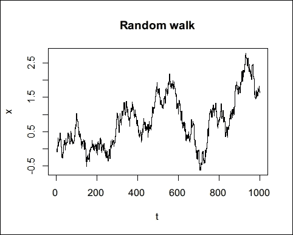

# 第四章 基本表达式

表达式是函数的构建块。R 有一个非常清晰的语法，表明一个表达式要么是一个符号，要么是一个函数调用。

尽管我们做的所有事情本质上都是由函数实现的，但 R 给一些函数提供了特殊的语法，以便编写更易于阅读的 R 代码。

在接下来的几节中，我们将看到以下一些基本表达式，它们具有特殊的语法：

+   赋值表达式

+   条件表达式

+   循环表达式

# 赋值表达式

赋值可能是所有编程语言中最基本的表达式之一。它所做的就是将值分配或绑定到符号上，这样我们就可以通过该符号稍后引用该值。

尽管相似，R 使用 `<-` 操作符进行赋值。这与许多使用 `=` 的其他语言略有不同，尽管在 R 中也允许使用 `=`：

```py
x <- 1 
y <- c(1, 2, 3) 
z <- list(x, y) 

```

我们在给符号赋值之前不需要声明其符号和类型。如果一个符号在环境中不存在，赋值将创建该符号。如果符号已经存在，赋值不会导致冲突，而是将新值重新绑定到该符号上。

## 替代赋值操作符

我们可以使用一些等价的替代操作符。与 `x <- f(z)` 相比，它将 `f(z)` 的值绑定到符号 `x` 上，我们也可以使用 `->` 来执行相反方向的赋值：

```py
2 -> x1 

```

我们甚至可以将赋值操作符链式使用，以便一组符号都取相同的值：

```py
x3 <- x2 <- x1 <- 0 

```

表达式 `0` 只计算一次，因此相同的值被分配给三个符号。为了验证其工作原理，我们可以将 `0` 改为一个随机数生成器：

```py
x3 <- x2 <- x1 <- rnorm(1)
c(x1, x2, x3)
## [1] 1.585697 1.585697 1.585697 

```

`rnorm(1)` 方法生成一个符合标准正态分布的随机数。如果每次赋值都重新调用随机数生成器，每个符号将具有不同的值。然而，实际上并不会发生这种情况。稍后，我将解释究竟发生了什么，并帮助你更好地理解这一点。

与其他编程语言一样，`=` 也可以执行赋值：

```py
x2 = c(1, 2, 3) 

```

如果你熟悉其他流行的编程语言，如 Python、Java 和 C#，你可能会发现使用 `=` 作为赋值操作符几乎成为行业标准，可能会觉得使用 `<-` 不舒服，因为需要更多输入。然而，谷歌的 *R 风格指南* ([`google.github.io/styleguide/Rguide.xml#assignment`](https://google.github.io/styleguide/Rguide.xml#assignment)) 建议使用 `<-` 而不是 `=`，尽管两者都被允许，并且当它们用作赋值操作符时具有完全相同的效果。

在这里，我将提供一个简单的解释来说明 `<-` 和 `=` 之间的细微差别。让我们首先创建一个 `f()` 函数，它接受两个参数：

```py
f <- function(input, data = NULL) { 
  cat("input:\n") 
  print(input) 
  cat("data:\n") 
  print(data) 
} 

```

该函数基本上打印两个参数的值。然后，让我们使用这个函数来展示两个操作符之间的区别：

```py
x <- c(1, 2, 3)
y <- c("some", "text")
f(input = x)
## input: 
## [1] 1 2 3 
## data: 
## NULL 

```

上述代码使用了 `<-` 和 `=` 操作符，但它们扮演不同的角色。前两行中的 `<-` 操作符用作赋值操作符，而第三行中的 `=` 在 `f()` 方法中指定了一个命名参数 `input`。

更具体地说，`<-` 操作符评估其右侧的表达式 `c(1, 2, 3)` 并将评估后的值赋给左侧的符号（变量）`x`。`=` 操作符不作为赋值操作符使用，而是用于通过名称匹配函数参数。

我们知道当作为赋值操作符使用时，`<-` 和 `=` 操作符是可以互换的。因此，前面的代码等同于以下代码：

```py
x = c(1, 2, 3)
y = c("some", "text")
f(input = x)
## input: 
## [1] 1 2 3 
## data: 
## NULL 

```

在这里，我们只使用了 `=` 操作符，但用于两个不同的目的：在前两行中，`=` 执行赋值，而在第三行中 `=` 指定了命名参数。

现在，让我们看看如果我们将所有的 `=` 都改为 `<-` 会发生什么：

```py
x <- c(1, 2, 3)
y <- c("some", "text")
f(input <- x)
## input: 
## [1] 1 2 3 
## data: 
## NULL 

```

如果你运行这段代码，你会发现输出相似。然而，如果你检查环境，你会观察到差异：现在环境中创建了一个新的 `input` 变量，并获得了 `c(1, 2, 3)` 的值：

```py
input
## [1] 1 2 3 

```

那么，发生了什么？实际上，在第三行中发生了两件事：首先，赋值 `input <- x` 将一个新的 `input` 符号引入环境并得到 `x`。然后，`input` 的值提供给函数 `f()` 的第一个参数。换句话说，第一个函数参数不是通过名称匹配，而是通过位置匹配。

为了进一步阐述，我们将进行更多实验。函数的标准用法如下：

```py
f(input = x, data = y)
## input: 
## [1] 1 2 3 
## data: 
## [1] "some" "text" 

```

如果我们将两个 `=` 都替换为 `<-`，结果看起来相同：

```py
f(input <- x, data <- y)
## input: 
## [1] 1 2 3 
## data: 
## [1] "some" "text" 

```

对于使用 `=` 的代码，我们可以交换两个命名参数而不改变结果：

```py
f(data = y, input = x)
## input: 
## [1] 1 2 3 
## data: 
## [1] "some" "text" 

```

然而，在这种情况下，如果我们用 `<-` 代替 `=`，`input` 和 `data` 的值也会交换：

```py
f(data <- y, input <- x)
## input: 
## [1] "some" "text" 
## data: 
## [1] 1 2 3 

```

以下代码与前面代码具有相同的效果：

```py
data <- y
input <- x
f(y, x)
## input: 
## [1] "some" "text" 
## data: 
## [1] 1 2 3 

```

这段代码不仅导致 `f(y, x)`，而且在不必要的情况下在当前环境中创建了额外的 `data` 和 `input` 变量。

从前面的例子和实验中，我们可以得出结论。为了减少歧义，允许使用 `<-` 或 `=` 作为赋值操作符，并且只使用 `=` 为函数指定命名参数。总之，为了提高 R 代码的可读性，正如 Google 风格指南所建议的，只使用 `<-` 进行赋值，使用 `=` 指定命名参数。

## 使用非标准名称的反引号

赋值操作符允许我们将值赋给变量（或符号或名称）。然而，直接赋值限制了名称的格式。它只包含从 a 到 z，从 A 到 Z 的字母（R 区分大小写），下划线（`_`）和点（`.`），并且不应包含空格或以下划线开头（`_`）。

以下是一些有效的名称：

```py
students <- data.frame() 
us_population <- data.frame() 
sales.2015 <- data.frame() 

```

以下名称无效，因为违反了命名规则：

```py
some data <- data.frame() 
## Error: unexpected symbol in "some data" 
_data <- data.frame() 
## Error: unexpected input in "_" 
Population(Millions) <- data.frame() 
## Error in Population(Millions) <- data.frame() :  
##  object 'Millions' not found 

```

前面的名称以不同的方式违反了规则。`some data`变量名包含空格，`_data`以下划线开头，而`Population(Millions)`不是一个符号名，而是一个函数调用。在实践中，某些无效的名称确实可能是数据表中的列名，例如第三个名称。

为了绕过这个问题，我们需要使用反引号来引用无效的名称，使其变得有效：

```py
`some data` <- c(1, 2, 3) 
`_data` <- c(4, 5, 6) 
`Population(Millions)` <- c(city1 = 50, city2 = 60) 

```

要引用这些变量，也使用反引号；否则，它们仍然被视为无效：

```py
`some data`
## [1] 1 2 3
`_data`
## [1] 4 5 6
`Population(Millions)`
## city1city2 
##    50    60 

```

反引号可以在我们创建符号的任何地方使用，无论它是否是一个函数：

```py
`Tom's secret function` <- function(a, d) { 
  (a ^ 2 - d ^ 2) / (a ^ 2 + d ^ 2)  
} 

```

即使它是一个列表：

```py
l1 <- list(`Group(A)` = rnorm(10), `Group(B)` = rnorm(10)) 

```

如果符号名不能直接有效引用，我们还需要使用引号来引用该符号：

```py
`Tom's secret function`(1,2)
## [1] -0.6
l1$`Group(A)`
##  [1] -0.8255922 -1.1508127 -0.7093875  0.5977409 -0.5503219 -1.0826915 
##  [7]  2.8866138  0.6323885 -1.5265957  0.9926590 

```

`data.frame()`是一个例外：

```py
results <- data.frame(`Group(A)` = rnorm(10), `Group(B)` = rnorm(10))
results
##       Group.A.    Group.B. 
## 1  -1.14318956  1.66262403 
## 2  -0.54348588  0.08932864 
## 3   0.95958053 -0.45835235 
## 4   0.05661183 -1.01670316 
## 5  -0.03076004  0.11008584 
## 6  -0.05672594 -2.16722176 
## 7  -1.31293264  1.69768806 
## 8  -0.98761119 -0.71073080 
## 9   2.04856454 -1.41284611 
## 10  0.09207977 -1.16899586 

```

不幸的是，即使我们在具有不寻常符号的名称周围使用反引号，生成的`data.frame`变量也会用点替换这些符号或使用`make.names()`方法，这一点可以通过查看生成的`data.frame`的列名来确认：

```py
colnames(results)
## [1] "Group.A." "Group.B." 

```

这种情况通常发生在你导入如下 CSV 数据表时，该数据表是实验结果：

```py
ID,Category,Population(before),Population(after) 
0,A,10,12 
1,A,12,13 
2,A,13,16 
3,B,11,12 
4,C,13,12 

```

当你使用`read.csv()`读取 CSV 数据时，`Population(before)`和`Population(after)`变量将不会保留它们的原始名称，而是会使用`make.names()`方法在 R 中将它们更改为有效的名称。要了解我们将得到什么名称，我们可以运行以下命令：

```py
make.names(c("Population(before)", "Population(after)"))
## [1] "Population.before." "Population.after."
```

有时，这种行为是不希望的。要禁用它，在调用`read.csv()`或`data.frame()`时设置`check.names = FALSE`：

```py
results <- data.frame(
ID = c(0, 1, 2, 3, 4),
Category = c("A", "A", "A", "B", "C"),
`Population(before)` = c(10, 12, 13, 11, 13),
`Population(after)` = c(12, 13, 16, 12, 12),
stringsAsFactors = FALSE,
check.names = FALSE)
results
##    ID Category Population(before) Population(after)
## 1  0     A          10                  12
## 2  1     A          12                  13
## 3  2     A          13                  16
## 4  3     B          11                  12
## 5  4     C          13                  12
colnames(results)
## [1] "ID"    "Category"   "Population(before)" 
## [4] "Population(after)" 

```

在前面的调用中，`stringAsFactors = FALSE`避免了将字符向量转换为因子，`check.names = FALSE`避免了在列名上应用`make.names()`。有了这两个参数，创建的`data.frame`变量将保留输入数据的大部分方面。

正如我提到的，要访问具有特殊符号的列，使用反引号来引用名称：

```py
results$`Population(before)`
## [1] 10 12 13 11 13
```

反引号使得创建和访问变量成为可能，直接赋值时不允许使用符号。这并不意味着使用这样的名称是推荐的。相反，它可能会使代码更难以阅读和更容易出错，并且使得与强制执行严格命名规则的外部工具一起工作变得更加困难。

总之，除非绝对必要，否则应避免使用反引号创建特殊变量名。

# 条件表达式

通常，程序的逻辑不是完全顺序的，而是包含依赖于某些条件的几个分支。因此，典型编程语言中最基本的构造之一是其条件表达式。在 R 中，`if`可以通过逻辑条件来分支逻辑流程。

## 使用 if 作为语句

与许多其他编程语言一样，`if`表达式与逻辑条件一起工作。在 R 中，逻辑条件由产生单个元素逻辑向量的表达式表示。例如，我们可以编写一个简单的函数`check_positive`，如果提供正数则返回`1`，否则不返回任何内容：

```py
check_positive <- function(x) { 
  if (x > 0) { 
    return(1) 
  } 
} 

```

在前面的函数中，`x > 0`是检查的条件。如果条件满足，则函数返回`1`。让我们用各种输入来验证这个函数：

```py
check_positive(1)
## [1] 1
check_positive(0)
```

看起来函数按预期工作。如果我们添加一些`else if`和`else`分支，函数可以概括为返回**1**的正输入，负输入返回`-1`，0 返回 0 的符号函数：

```py
check_sign <- function(x) { 
  if (x > 0) { 
    return(1) 
  } else if (x < 0) { 
    return(-1) 
  } else { 
    return(0) 
  } 
} 

```

前面的函数与内置函数`sign()`具有相同的功能。为了验证其逻辑，只需用不同输入调用它，并全面覆盖条件分支即可：

```py
check_sign(15)
## [1] 1
check_sign(-3.5)
## [1] -1
check_sign(0)
## [1] 0 

```

函数不需要返回任何内容。我们也可以根据各种条件执行不返回任何内容（更准确地说，是`NULL`）的操作。以下函数始终不显式返回值，但会在控制台发送消息。消息的类型取决于输入数字的符号：

```py
say_sign <- function(x) { 
  if (x > 0) { 
    cat("The number is greater than 0") 
  } else if (x < 0) { 
    cat("The number is less than 0") 
  } else { 
    cat("The number is 0") 
  } 
} 

```

我们可以使用类似的方法，即`say_sign()`，来测试其逻辑：

```py
say_sign(0)
## The number is 0
say_sign(3)
## The number is greater than 0
say_sign(-9)
## The number is less than 0 

```

评估`if`语句分支的工作流程相当直接：

1.  首先，在第一个`if (cond1) { expr1 }`中评估`cond1`。

1.  如果`cond1`是`TRUE`，则评估其对应的表达式`{ expr1 }`。否则，评估下一个`else if (cond2)`分支中的`cond2`条件，依此类推。

1.  如果所有`if`和`else if`分支的条件都被违反，那么如果存在，评估`else`分支中的表达式。

根据工作流程，`if`语句可能比你想象的更灵活。例如，`if`语句可以有以下几种形式之一。

最简单的形式是一个简单的`if`语句分支：

```py
if (cond1) { 
  # do something 
} 

```

更完整的形式是包含一个`else`分支，用于处理`cond1`不是`TRUE`的情况：

```py
if (cond1) { 
  # do something 
} else { 
  # do something else 
} 

```

更复杂的形式是包含一个或多个`else if`分支：

```py
if (cond1) { 
  expr1 
} else if (cond2) { 
  expr2 
} else if (cond3) { 
  expr3 
} else { 
  expr4 
} 

```

在前面的条件分支中，分支条件（`cond1`、`cond2`和`cond3`）可能相关也可能不相关。例如，简单的评分策略完美地符合前面模板中的分支逻辑，其中每个分支条件都是分数范围的切片：

```py
grade <- function(score) {
  if (score >= 90) {
    return("A")
  } else if (score >= 80) {
    return("B")
  } else if (score >= 70) {
    return("C")
  } else if (score >= 60) {
    return("D")
  } else {
    return("F")
  }
}
c(grade(65), grade(59), grade(87), grade(96))
## [1] "D" "F" "B" "A" 

```

在这种情况下，`else if`中的每个分支条件实际上隐含地假设前面的条件不成立；也就是说，`score >= 80`实际上意味着`score < 90`和`score >= 80`，这依赖于前面的条件。因此，我们无法在不明确陈述假设并使所有分支独立的情况下改变这些分支的顺序。

假设我们切换了一些分支：

```py
grade2 <- function(score) {
  if (score >= 60) {
    return("D")
  } else if (score >= 70) {
    return("C")
  } else if (score >= 80) {
    return("B")
  } else if (score >= 90) {
    return("A")
  } else {
    return("F")
  }
}
c(grade2(65), grade2(59), grade2(87), grade2(96))
## [1] "D" "F" "D" "D" 

```

很明显，只有`grade(59)`得到了正确的成绩，而其他所有都失败了。为了在不重新排序条件的情况下修复函数，我们需要重新编写条件，使它们不依赖于评估顺序：

```py
grade2 <- function(score) {
  if (score >= 60 && score < 70) {
    return("D")
  } else if (score >= 70 && score < 80) {
    return("C")
  } else if (score >= 80 && score < 90) {
    return("B")
  } else if (score >= 90) {
    return("A")
  } else {
    return("F")
  }
}
c(grade2(65), grade2(59), grade2(87), grade2(96))
## [1] "D" "F" "B" "A" 

```

这使得函数比第一个正确版本更冗长。因此，确定分支条件的正确顺序并注意每个分支的依赖性非常重要。

幸运的是，R 提供了方便的函数，如`cut()`，它正好做同样的事情。通过输入`?cut`来阅读文档以获取更多详细信息。

## 将 if 用作表达式

由于`if`本质上是一个原始函数，其返回值是满足条件的分支中的表达式值。因此，`if`也可以用作内联表达式。以`check_positive()`方法为例。我们可以在条件表达式中不写`return()`，而是在函数体中返回`if`语句表达式的值，以达到相同的目的：

```py
check_positive <- function(x) { 
  return(if (x > 0) { 
    1 
  }) 
} 

```

实际上，表达式语法可以简化为仅仅一行：

```py
check_positive <- function(x) { 
  return(if (x > 0) 1) 
} 

```

由于函数的返回值是函数体中最后一个表达式的值，在这种情况下可以省略`return()`：

```py
check_positive <- function(x) { 
  if (x > 0) 1 
} 

```

同样的原则也适用于`check_sign()`方法。`check_sign()`的一个更简单的形式如下：

```py
check_sign <- function(x) { 
  if (x > 0) 1 else if (x < 0) -1 else 0 
} 

```

为了显式获取`if`表达式的值，我们可以实现一个成绩报告函数，该函数根据学生姓名和他们的分数提及学生的成绩：

```py
say_grade <- function(name, score) {
  grade <- if (score >= 90) "A"
    else if (score >= 80) "B"
    else if (score >= 70) "C"
    else if (score >= 60) "D"
    else "F"
  cat("The grade of", name, "is", grade)
}
say_grade("Betty", 86)
## The grade of Betty is B 

```

将`if`语句用作表达式看起来更紧凑，也更简洁。然而，在实践中，并非所有条件都是简单的数值比较并返回简单值。对于更复杂的条件和分支，我建议您使用`if`作为语句来清楚地说明不同的分支，并且不要省略`{}`以避免不必要的错误。以下是一个不好的例子：

```py
say_grade <- function(name, score) { 
  if (score >= 90) grade <- "A" 
  cat("Congratulations!\n") 
  else if (score >= 80) grade <- "B" 
  else if (score >= 70) grade <- "C" 
  else if (score >= 60) grade <- "D" 
  else grade <- "F" 
  cat("What a pity!\n") 
  cat("The grade of", name, "is", grade) 
} 

```

函数作者想要向某些分支添加一些说明。如果没有在分支表达式周围使用`{}`括号，当您向条件分支添加更多行为时，您很可能编写出有语法错误的代码。如果您在控制台中评估前面的代码，您将得到足够的错误，让您困惑一段时间：

```py
>say_grade <- function(name, score) { 
+   if (score >= 90) grade <- "A" 
+   cat("Congratulations!\n") 
+   else if (score >= 80) grade <- "B" 
Error: unexpected 'else' in: 
"  cat("Congratulations!\n") 
  else" 
>   else if (score >= 70) grade <- "C" 
Error: unexpected 'else' in "  else" 
>   else if (score >= 60) grade <- "D" 
Error: unexpected 'else' in "  else" 
>   else grade <- "F" 
Error: unexpected 'else' in "  else" 
>   cat("What a pity!\n") 
What a pity! 
>   cat("The grade of", name, "is", grade) 
Error in cat("The grade of", name, "is", grade) : object 'name' not found 
> } 
Error: unexpected '}' in "}" 

```

避免这种潜在陷阱的函数更好形式如下：

```py
say_grade <- function(name, score) {
  if (score >= 90) {
    grade <- "A"
    cat("Congratulations!\n")
  } else if (score >= 80) {
    grade <- "B"
  }
  else if (score >= 70) {
    grade <- "C"
  }
  else if (score >= 60) {
    grade <- "D"
  } else {
    grade <- "F"
    cat("What a pity!\n")
  }
  cat("The grade of", name, "is", grade)
}
say_grade("James", 93)
## Congratulations! 
## The grade of James is A 

```

函数看起来有点冗长，但它对变化的鲁棒性更强，逻辑也更清晰。记住，总是正确比简洁更重要。

## 将 if 与向量一起使用

所有的示例函数都只适用于单值输入。如果我们提供一个向量，函数将产生警告，因为`if`不适用于多元素向量：

```py
check_positive(c(1, -1, 0))
## Warning in if (x > 0) 1: the condition has length > 1 and only the first
## element will be used
## [1] 1 

```

从前面的输出中，我们可以看到，如果提供了多元素逻辑向量，`if`语句会忽略除了第一个元素之外的所有元素：

```py
num <- c(1, 2, 3)
if (num > 2) {
cat("num > 2!")
}
## Warning in if (num > 2) {: the condition has length > 1 and only the first 
## element will be used 

```

表达式会抛出一个警告，说明只会使用第一个元素（`1 > 2`）。实际上，当我们尝试在逻辑向量上条件化表达式时，其逻辑是不清晰的，因为其值可能会与`TRUE`和`FALSE`值混淆。

一些逻辑函数有助于避免这种歧义。例如，`any()`方法如果给定向量中至少有一个元素是`TRUE`，则返回`TRUE`：

```py
any(c(TRUE, FALSE, FALSE))
## [1] TRUE
any(c(FALSE, FALSE))
## [1] FALSE 

```

因此，如果我们真正想要打印消息，如果任何单个值大于`2`，我们应该在条件中调用`any()`方法：

```py
if (any(num > 2)) {
  cat("num > 2!")
}
## num > 2! 

```

如果我们想要打印第一个消息，如果所有值都大于`2`，我们应该改用调用`all()`方法：

```py
if (all(num > 2)) {
  cat("num > 2!")
} else {
  cat("Not all values are greater than 2!")
}
## Not all values are greater than 2! 

```

因此，每次我们使用`if`表达式分支工作流程时，我们应该确保条件是一个单值逻辑向量。否则，可能会发生意外的情况。

另一个例外是`NA`，它也是一个单值逻辑向量，但如果没有注意可能会在`if`条件中引起错误：

```py
check <- function(x) { 
  if (all(x > 0)) { 
    cat("All input values are positive!") 
  } else { 
    cat("Some values are not positive!") 
  } 
} 

```

`check()`函数对于没有缺失值的典型数值向量工作得很好。然而，如果参数`x`包含缺失值，函数最终可能会出错：

```py
check(c(1, 2, 3))
## All input values are positive!
check(c(1, 2, NA, -1))
## Some values are not positive!
check(c(1, 2, NA))
## Error in if (all(x > 0)) {: missing value where TRUE/FALSE needed 

```

从这个例子中，我们应该在编写`if`条件时小心缺失值。如果逻辑复杂且输入数据多样，您不能轻易地以适当的方式处理缺失值。请注意，`any()`和`all()`方法都接受`na.rm`来处理缺失值。我们在编写条件时也应该考虑这一点。

简化条件检查的一种方法是用`isTRUE(x)`，它内部调用`identical(TRUE, x)`。在这种情况下，只有单个`TRUE`值会满足条件，而所有其他值则不会。

## 使用向量化的`ifelse`：`ifelse`

分支计算的另一种方法是`ifelse()`。这个函数接受一个逻辑向量作为测试条件，并返回一个向量。对于逻辑测试条件中的每个元素，如果值为`TRUE`，则选择第二个参数`yes`中的相应元素。如果值为`FALSE`，则选择第三个参数`no`中的相应元素。换句话说，`ifelse()`是`if`的向量版本，如下所示：

```py
ifelse(c(TRUE, FALSE, FALSE), c(1, 2, 3), c(4, 5, 6))
## [1] 1 5 6 

```

由于`yes`和`no`参数可以被回收利用，我们可以使用`ifelse()`重新编写`check_positive()`函数：

```py
check_positive2 <- function(x) { 
  ifelse(x, 1, 0) 
} 

```

`check_positive()`（使用`if`语句）和`check_positive2()`（使用`ifelse`）之间的一个细微差别是：`check_positive(-1)`不会显式地返回值，但`chek_positive2(-1)`返回 0。`if`语句不一定通过仅使用一个`if`而不是`else`来显式地返回一个值。相比之下，`ifelse()`总是返回一个向量，因为您必须在`yes`和`no`参数中指定值。

另一个提醒是，如果你只是简单地将一个替换为另一个，`ifelse()` 和 `if` 并不一定总是能够达到相同的目标。例如，假设你想根据条件返回一个包含两个元素的向量。让我们假设我们使用 `ifelse()`：

```py
ifelse(TRUE, c(1,2), c(2,3))
## [1] 1
```

只有 `yes` 参数的第一个元素被返回。如果你想返回 `yes` 参数，你需要修改条件为 `c(TRUE, TRUE)`，这看起来有点不自然。

如果我们使用 `if`，那么表达式看起来会更加自然：

```py
if (TRUE) c(1,2) else c(2,3)
## [1] 1 2
```

如果需求是矢量化输入和输出，那么另一个问题是，如果 `yes` 参数是数值向量而 `no` 参数是字符向量，则具有混合 `TRUE` 和 `FALSE` 值的条件将强制输出向量中的所有元素能够表示所有值。因此，将产生一个字符向量：

```py
ifelse(c(TRUE, FALSE), c(1, 2), c("a", "b"))
## [1] "1" "b"
```

## 使用 switch 分支值

与处理 `TRUE` 和 `FALSE` 条件的 `if` 相比，`switch` 使用数字或字符串，并根据输入选择一个分支返回。

假设输入是一个整数 `n`。`switch` 关键字以返回第一个参数之后 n^(th) 个参数值的方式工作：

```py
switch(1, "x", "y")
## [1] "x"
switch(2, "x", "y")
## [1] "y" 

```

如果输入的整数超出范围且不匹配任何给定参数，则不会显式返回任何可见值（实际上，返回了一个不可见的 `NULL`）：

```py
switch(3, "x", "y") 

```

当与字符串输入一起工作时，`switch()` 方法的行为有所不同。它返回与输入名称匹配的第一个参数的值：

```py
switch("a", a = 1, b = 2)
## [1] 1
switch("b", a = 1, b = 2)
## [1] 2 

```

对于第一个 `switch`，`a = 1` 匹配变量 `a`。对于第二个，`b = 2` 匹配变量 `b`。如果没有参数匹配输入，将返回一个不可见的 `NULL` 值：

```py
switch("c", a = 1, b = 2) 

```

为了涵盖所有可能性，我们可以添加一个最后一个参数（不带参数名称），以捕获所有其他输入：

```py
switch("c", a = 1, b = 2, 3)
## [1] 3 

```

与 `ifelse()` 方法相比，`switch()` 的行为更类似于 `if()` 方法。它只接受单个值输入（字符串数量），但它可以返回任何内容：

```py
switch_test <- function(x) {
  switch(x,
    a = c(1, 2, 3),
    b = list(x = 0, y = 1),
    c = {
      cat("You choose c!\n")
      list(name = "c", value = "something")
    })
}
switch_test("a")
## [1] 1 2 3
switch_test("b")
## $x
## [1] 0
##
## $y
## [1] 1
switch_test("c")
## You choose c!
## $name 
## [1] "c" 
##  
## $value 
## [1] "something" 

```

总结来说，`if`、`ifelse()` 和 `switch()` 有略微不同的行为。你应该根据不同的情况相应地应用它们。

# 循环表达式

循环（或迭代）通过遍历向量（`for`）或检查条件是否被违反（`while`）来重复评估表达式。

如果相同的任务每次运行时都进行一些输入上的更改，这种语言结构在很大程度上减少了代码的冗余。

## 使用 for 循环

`for` 循环通过遍历给定的向量或列表来评估表达式。`for` 循环的语法如下：

```py
for (var in vector) { 
  expr 
} 

```

然后，`expr` 将迭代评估，`var` 依次取 `vector` 中每个元素的值。如果 `vector` 有 `n` 个元素，则前面的循环相当于评估以下表达式：

```py
var <- vector[[1]] 
expr 
var <- vector[[2]] 
expr 
... 
var <- vector[[n]] 
expr 

```

例如，我们可以创建一个循环来遍历 `1:3`，迭代变量为 `i`。在每次迭代中，我们将在屏幕上显示文本以指示 `i` 的值：

```py
for (i in 1:3) {
cat("The value of i is", i, "\n")
}
## The value of i is 1  
## The value of i is 2  
## The value of i is 3 

```

迭代器不仅与数值向量一起工作，还与所有向量一起工作。例如，我们可以用字符向量替换整数向量`1:3`：

```py
for (word in c("hello","new", "world")) {
cat("The current word is", word, "\n")
}
## The current word is hello  
## The current word is new  
## The current word is world 

```

我们也可以用列表替换它：

```py
loop_list <- list(
  a = c(1, 2, 3),
  b = c("a", "b", "c", "d"))
for (item in loop_list) {
  cat("item:\n length:", length(item),
    "\n class: ", class(item), "\n")
}
## item: 
##   length: 3  
##   class:  numeric  
## item: 
##   length: 4  
##   class:  character 

```

或者，我们可以用数据框替换它：

```py
df <- data.frame(
  x = c(1, 2, 3),
  y = c("A", "B", "C"),
stringsAsFactors = FALSE)
for (col in df) {
  str(col)
}
##  num [1:3] 1 2 3 
##  chr [1:3] "A" "B" "C" 

```

之前我们提到，数据框是一个列表，其中每个元素（列）必须具有相同的长度。因此，前面的循环是遍历列而不是行，这与`for`遍历普通列表时的行为一致。

然而，在许多情况下，我们希望逐行遍历数据框。我们可以使用`for`循环来实现这一点，但遍历的是从 1 到数据框行数的整数序列。

只要`i`获取行号，我们就可以从数据框中单独提取那一行并对其进行操作。以下代码逐行遍历数据框并使用`str()`打印每行的结构：

```py
for (i in 1:nrow(df)) {
  row <- df[i,]
  cat("row", i, "\n")
  str(row)
  cat("\n")
}
## row 1  
## 'data.frame':    1 obs. of  2 variables: 
##  $ x: num 1 
##  $ y: chr "A" 
##  
## row 2  
## 'data.frame':    1 obs. of  2 variables: 
##  $ x: num 2 
##  $ y: chr "B" 
##  
## row 3  
## 'data.frame':    1 obs. of  2 variables: 
##  $ x: num 3 
##  $ y: chr "C" 

```

我应该在这里提醒一下，逐行遍历数据框通常不是一个好主意，因为它可能很慢且冗长。更好的方法是使用第五章中介绍的`apply`族函数，或者第十二章中介绍的更强大、更高级的包函数。

在前面的例子中，`for`循环的每次迭代都是独立的。然而，在某些情况下，迭代会改变循环外的变量以跟踪某些状态或记录累积。最简单的例子是从 1 加到 100 的求和：

```py
s <- 0
for (i in 1:100) {
  s <- s + i
}
s
## [1] 5050 

```

前面的例子演示了使用`for`循环进行累积。下面的例子使用从正态分布`rnorm()`采样的随机数生成器产生一个简单的随机游走实现：

```py
set.seed(123) 
x <- numeric(1000) 
for (t in 1:(length(x) - 1)) { 
  x[[t + 1]] <- x[[t]] + rnorm(1, 0, 0.1) 
} 
plot(x, type = "s", main = "Random walk", xlab = "t") 

```

生成的图如下所示：



尽管前面两个例子中的`for`循环对前一个结果有一个一步的依赖关系，但可以使用现有的函数（如`sum()`方法和`cumsum()`）来简化它们：

```py
sum100 <- sum(1:100) 
random_walk <- cumsum(rnorm(1000, 0, 0.1)) 

```

这些函数的实现基本思想与前面的`for`循环类似，但它们是向量化的，并在 C 语言中实现，因此它们比 R 中的`for`循环要快得多。因此，如果可能的话，你应该首先考虑使用这些内置函数。

### 管理 for 循环的流程

有时，在`for`循环中干预是有用的。在每次迭代中，我们可以选择中断`for`循环，跳过当前迭代，或者什么都不做并完成循环。

我们可以使用`break`来终止`for`循环：

```py
for (i in 1:5) {
  if (i == 3) break
  cat("message ", i, "\n")
}
## message 1
## message 2
```

这可以用来，例如，找到一个问题的解决方案。以下代码尝试找到满足`(i ^ 2) %% 11`等于`(i ^ 3) %% 17`的数字，其中`^`是幂运算符，`%%`是取模运算符，它返回除法的余数：

```py
m <- integer()
for (i in 1000:1100) {
  if ((i ^ 2) %% 11 == (i ^ 3) %% 17) {
    m <- c(m, i)
}
}
m
## [1] 1055 1061 1082 1086 1095 

```

如果你只需要范围内的一个数字来满足条件，你可以用简单的 `break` 语句替换记录跟踪表达式：

```py
for (i in 1000:1100) {
  if ((i ^ 2) %% 11 == (i ^ 3) %% 17) break
}
i
## [1] 1055 

```

一旦找到解决方案，`for` 循环就会中断，并将 `i` 的最后一个值保留在当前环境中，这样你就可以知道满足条件的解决方案。

在某些其他情况下，跳过 `for` 循环中的迭代也是有用的。我们可以使用 `next` 关键字跳过当前迭代中的其余表达式，并直接跳转到循环的下一个迭代：

```py
for (i in 1:5) {
  if (i == 3) next
  cat("message ", i, "\n")
}
## message  1  
## message  2  
## message  4  
## message  5 

```

### 创建嵌套的 `for` 循环

`for` 循环中的表达式可以是任何东西，包括另一个 `for` 循环。例如，如果我们想穷尽向量中所有元素的排列组合，我们可以编写一个两层的嵌套 `for` 循环来解决问题：

```py
x <- c("a", "b", "c")
combx <- character()
for (c1 in x) {
  for (c2 in x) {
    combx <- c(combx, paste(c1, c2, sep = ",", collapse = ""))
  }
}
combx
## [1] "a,a" "a,b" "a,c" "b,a" "b,b" "b,c" "c,a" "c,b" "c,c" 

```

如果你只需要包含不同元素的排列，你可以在内层 `for` 循环中添加一个测试条件：

```py
combx2 <- character()
for (c1 in x) {
  for (c2 in x) {
    if (c1 == c2) next
    combx2 <- c(combx2, paste(c1, c2, sep = ",", collapse = ""))
  }
}
combx2
## [1] "a,b" "a,c" "b,a" "b,c" "c,a" "c,b" 

```

或者，你也可以简单地否定条件，并将内层 `for` 循环中的表达式替换为以下代码以获得相同的结果：

```py
if (c1 != c2) { 
combx2 <- c(combx2, paste(c1, c2, sep = ",", collapse = ""))
}
```

上述代码演示了嵌套循环的工作原理，但用这种方法解决问题并不最优。一些内置函数可以帮助生成向量元素的组合或排列。`combn()` 方法根据原子向量和每个组合中的元素数量生成向量元素的组合矩阵：

```py
combn(c("a", "b", "c"), 2)
##      [,1] [,2] [,3] 
## [1,] "a"  "a"  "b"  
## [2,] "b"  "c"  "c" 

```

与使用 `for` 循环实现的先前列举的例子类似，`expand.grid()` 生成一个包含多个向量中所有排列的数据框：

```py
expand.grid(n = c(1, 2, 3), x = c("a", "b"))
##   n x 
## 1 1 a 
## 2 2 a 
## 3 3 a 
## 4 1 b 
## 5 2 b 
## 6 3 b 

```

虽然`for`循环可能很强大，但有一些函数是为特定任务设计的。最好考虑使用内置函数，而不是直接将所有内容放入 `for` 循环中。在下一章中，我将介绍 `lapply()` 和相关函数来替换许多 `for` 循环，这使得代码更容易编写和理解。

## 使用 `while` 循环

与 `for` 循环相反，`while` 循环不会在给定条件违反之前停止运行。

例如，以下 `while` 循环从 `x = 0` 开始。每次循环都会检查 `x <= 10` 是否成立。如果是，则评估内层表达式；否则，`while` 循环终止：

```py
x <- 0
while (x <= 5) {
  cat(x, " ", sep = "")
  x <- x + 1
}
## 0 1 2 3 4 5 

```

如果我们移除 `x <- x + 1` 以使 `x` 不再增加任何增量，代码将无限运行（直到强制终止 R）。因此，如果实现不当，`while` 循环有时可能很危险。

与 `for` 循环一样，流程控制语句（`break` 和 `next`）也适用于 `while`：

```py
x <- 0
while (TRUE) {
  x <- x + 1
  if (x == 4) break
  else if (x == 2) next
  else cat(x, '\n')
}
## 1  
## 3 

```

在实践中，`while` 循环通常用于迭代次数未知的情况。这通常发生在我们从数据库查询的结果集中分块获取行时。代码可能看起来如下所示：

```py
res <- dbSendQuery(con, "SELECT * FROM table1 WHERE type = 1") 
while (!dbHasCompleted(res)) { 
  chunk <- dbFetch(res, 10000) 
  process(chunk) 
} 

```

首先，我们通过`con`连接从数据库中查询类型为 1 的所有记录。一旦数据库返回结果集`res`，我们就可以分块从结果集中获取数据，每次处理一个数据块。由于在查询之前不知道记录的数量，我们需要使用一个 while 循环，当所有数据完全获取时通过`dbHasCompleted()`来终止循环。

这样做，我们避免了将（可能很大的）数据框加载到内存中。相反，我们处理小块数据。这使我们能够仅使用内存中的小工作集处理大量数据。然而，主要前提是算法`process()`必须支持分块处理数据。

你可能不熟悉前面的代码示例或术语，但不用担心。我们将在后面的章节中详细讲解数据库主题。

除了`for`循环和`while`循环之外，R 还提供了`repeat`循环。像`while (TRUE)`一样，`repeat`关键字也是一个真正的循环，因为它不需要显式的终止条件或边界，除非遇到`break`：

```py
x <- 0
repeat {
  x <- x + 1
  if (x == 4) break
  else if (x == 2) next
  else cat(x, '\n')
}
## 1  
## 3 

```

然而，`repeat`关键字可能非常危险，并且在实践中并不推荐使用。

# 摘要

在本章中，你学习了赋值、条件表达式和循环的语法。在赋值部分，你了解了变量的命名规则以及如何避免命名冲突。在条件表达式部分，你学习了如何将`if`语句用作语句或表达式，以及`ifelse()`在处理向量时与`if`的区别。在循环部分，你学习了`for`循环和`while`循环的相似之处和不同之处。现在，我们已经拥有了控制 R 程序逻辑流程的基本表达式。

在下一章中，你将使用前面章节中学到的知识，看看你可以用表示数据和表示我们逻辑的基本对象以及基本表达式做什么。你将学习各种类别中的基本函数，作为数据转换和统计分析的构建块。
