# 第五章：处理基本对象

在前面的章节中，你学习了如何创建几种基本类型的对象，包括原子向量、列表和数据框来存储数据。你学习了如何创建函数来存储逻辑。在了解了 R 脚本的这些构建块之后，你学习了不同类型的表达式来控制涉及基本对象逻辑流程。现在，我们正在熟悉 R 编程语言的基本语法和句法。是时候使用内置函数构建 R 的词汇表，以处理基本对象了。

R 的真正力量在于它提供的巨大数量的函数。了解各种基本函数非常有用，这将节省你的时间并提高你的生产力。

虽然 R 主要是一个统计计算环境，但许多基本功能与任何统计无关，而是与更基础的任务相关，例如检查环境、将文本转换为数字以及执行逻辑运算。

在本章中，你将了解 R 中广泛的基本但非常有用的函数，包括：

+   对象函数

+   逻辑函数

+   数学函数

+   数值方法

+   统计函数

+   Apply 族函数

# 使用对象函数

在前面的章节中，你学习了关于与环境和包一起工作的某些函数。在本节中，我们将了解一些处理对象的基本函数。更具体地说，我将向你介绍更多用于访问数据对象类型和大小的函数。你将了解这些概念如何结合以及它们是如何协同工作的。

## 测试对象类型

虽然 R 中的所有内容都是一个对象，但对象有不同的类型。

假设我们正在处理的对象是用户定义的。我们将创建一个函数，该函数根据输入对象的类型以不同的方式表现。例如，我们需要创建一个名为`take_it`的函数，如果输入对象是一个原子向量（例如，数值向量、字符向量或逻辑向量），则返回第一个元素，但如果输入对象是一个包含数据和索引的列表，则返回用户定义的元素。

例如，如果输入是一个数值向量，如`c(1, 2, 3)`，则该函数应返回其第一个元素`1`。如果输入是一个字符向量，如`c("a", "b", "c")`，则该函数应返回`a`。然而，如果输入是一个列表`list(data = c("a", "b", "c"), index = 3)`，则该函数应返回`data`的第三个元素（索引=3），即`c`。

要创建这样的函数，我们可以想象其中可能出现的函数和逻辑流程。首先，由于函数的输出取决于输入类型，我们需要使用 `is.*` 中的一个函数来判断输入是否为特定类型。其次，由于函数的行为因输入类型而异，我们需要使用条件表达式如 `if else` 来分支逻辑。最后，如果函数基本上是从输入中提取一个元素，我们需要使用元素提取运算符。现在，函数的实现变得相当清晰：

```py
take_it <- function(x) {
  if (is.atomic(x)) {
    x[[1]]
  } else if (is.list(x)) {
    x$data[[x$index]]
  } else {
    stop("Not supported input type")
  }
} 

```

上述函数的行为因 `x` 的不同类型而异。当 `x` 是一个原子向量（例如，一个数值向量）时，函数提取其第一个元素。当 `x` 是 `data` 和 `index` 的列表时，函数从 `x$data` 中提取 `index` 的元素：

```py
take_it(c(1, 2, 3))
## [1] 1
take_it(list(data = c("a", "b", "c"), index = 3))
## [1] "c" 

```

对于不支持输入类型，函数应该停止并显示错误消息，而不是返回任何值。例如，`take_it` 无法处理 `function` 输入。请注意，我们可以将任何函数作为参数传递给其他函数，就像传递任何其他对象一样。然而，在这种情况下，如果将 `mean` 作为函数传递给它，那么它将变成 `else` 条件并停止：

```py
take_it(mean)
## Error in take_it(mean): Not supported input type 

```

如果输入确实是一个列表但不包含任何预期的元素，`data` 和 `index`，会怎样呢？只需对 `input`（而不是 `data`）的列表进行实验，没有任何 `index` 元素：

```py
take_it(list(input = c("a", "b", "c")))
## NULL 

```

可能会让你感到惊讶的是，函数没有产生错误。输出是 `NULL`，因为 `x$data` 是 `NULL`，并且从 `NULL` 中提取任何值也是 `NULL`：

```py
NULL[[1]]
## NULL
NULL[[NULL]]
## NULL 

```

然而，如果列表只包含 `data` 但缺少 `index`，函数最终将导致错误：

```py
take_it(list(data = c("a", "b", "c")))
## Error in x$data[[x$index]]: attempt to select less than one element 

```

错误发生是因为 `x$index` 结果为 `NULL`，并且通过 `NULL` 提取向量中的值会产生错误：

```py
c("a", "b", "c")[[NULL]]
## Error in c("a", "b", "c")[[NULL]]: attempt to select less than one element 

```

第三种可能性与第一种情况有点相似，其中 `NULL[[2]]` 返回 `NULL`：

```py
take_it(list(index = 2))
## NULL 

```

从早期的异常中，如果你不太熟悉涉及 `NULL` 的这些边缘情况，通常你会看到错误消息不是很具有信息性。对于更复杂的情况，如果确实发生了这些错误，你可能无法在短时间内找出确切的错误原因。一个很好的解决方案是在函数的实现中自己检查输入，并将所做的假设反映到参数上。

为了处理上述误用的情况，以下实现考虑了每个参数的类型是否所需：

```py
take_it2 <- function(x) {
  if (is.atomic(x)) {
    x[[1]]
  } else if (is.list(x)) {
    if (!is.null(x$data) && is.atomic(x$data)) {
      if (is.numeric(x$index) && length(x) == 1) {
        x$data[[x$index]]
      } else {
        stop("Invalid index")
      }
    } else {
      stop("Invalid data")
    }
  } else {
    stop("Not supported input type")
  }
} 

```

对于 `x` 是列表的情况，我们检查 `x$data` 是否不为空且是一个原子向量。如果是这样，那么我们检查 `x$index` 是否被正确指定为一个单元素数值向量或一个标量。如果任何条件被违反，函数将停止并显示一个有信息的错误消息，告诉用户输入有什么问题。

内置检查函数也有一些古怪的行为。例如，`is.atomic(NULL)` 返回 `TRUE`。因此，如果列表 `x` 不包含名为 `data` 的元素，`if (is.atomic(x$data))` 的正分支仍然会被触发，这也会导致 `NULL`。通过一些参数检查，现在的代码更加健壮，当假设被违反时可以产生更详细的错误信息：

```py
take_it2(list(data = c("a", "b", "c")))
## Error in take_it2(list(data = c("a", "b", "c"))): Invalid index
take_it2(list(index = 2))
## Error in take_it2(list(index = 2)): Invalid data 

```

此函数的另一种可能的实现是使用 S3 分发，这将在后面的面向对象编程章节中讲解。

### 访问对象类和类型

除了使用 `is.*` 函数外，我们还可以使用 `class()` 或 `typeof()` 来实现此功能。在直接访问对象的类型之前，了解这两个函数之间的区别是有用的。

以下示例展示了当 `class()` 和 `typeof()` 被调用在不同类型的对象上时，它们输出的区别。

对于每个对象 `x`，会调用 `class()` 和 `typeof()`，然后调用 `str()` 来显示其结构。

对于数值向量：

```py
x <- c(1, 2, 3)
class(x)
## [1] "numeric"
typeof(x)
## [1] "double"
str(x)
##  num [1:3] 1 2 3 

```

对于整数向量：

```py
x <- 1:3
class(x)
## [1] "integer"
typeof(x)
## [1] "integer"
str(x)
##  int [1:3] 1 2 3 

```

对于字符向量：

```py
x <- c("a", "b", "c")
class(x)
## [1] "character"
typeof(x)
## [1] "character"
str(x)
##  chr [1:3] "a" "b" "c" 

```

对于列表：

```py
x <- list(a = c(1, 2), b = c(TRUE, FALSE))
class(x)
## [1] "list"
typeof(x)
## [1] "list"
str(x)
## List of 2
## $ a: num [1:2] 1 2
##  $ b: logi [1:2] TRUE FALSE 

```

对于数据框：

```py
x <- data.frame(a = c(1, 2), b = c(TRUE, FALSE))
class(x)
## [1] "data.frame"
typeof(x)
## [1] "list"
str(x)
## 'data.frame': 2 obs. of 2 variables:
## $ a: num 1 2
##  $ b: logi  TRUE FALSE 

```

我们可以看到，`typeof()` 返回对象的低级内部类型，而 `class()` 返回对象的高级类别。我们之前提到的一个对比是，`data.frame` 本质上是一个具有等长列表元素的 `list`。因此，数据框具有 `data.frame` 类别，以便相关函数可以识别，但 `typeof()` 仍然从内部告知它是一个 `list`。

这个主题与 S3 面向对象编程机制相关，将在后面的章节中详细讲解。然而，在这里提及 `class()` 和 `typeof()` 之间的区别仍然是有用的。

从前面的输出中，也可以清楚地看到 `str()`，我们在上一章中介绍过，显示了对象的结构。对于对象中的向量，它通常显示它们的内部类型（`typeof()`）。

## 访问数据维度

矩阵、数组和数据框除了具有类和类型外，还具有维度的属性。

### 获取数据维度

在 R 中，向量是按构造为一维数据结构：

```py
vec <- c(1, 2, 3, 2, 3, 4, 3, 4, 5, 4, 5, 6)
class(vec)
## [1] "numeric"
typeof(vec)
## [1] "double" 

```

相同的底层数据可以用更多的维度来表示，这些维度可以通过 `dim()`、`nrow()` 或 `ncol()` 访问：

```py
sample_matrix <- matrix(vec, ncol = 4)
sample_matrix
## [,1] [,2] [,3] [,4]
## [1,] 1 2 3 4
## [2,] 2 3 4 5
## [3,] 3 4 5 6
class(sample_matrix)
## [1] "matrix"
typeof(sample_matrix)
## [1] "double"
dim(sample_matrix)
## [1] 3 4
nrow(sample_matrix)
## [1] 3
ncol(sample_matrix)
## [1] 4 

```

第一个前置表达式从数值向量 `vec` 创建了一个四列矩阵。该矩阵具有 `matrix` 类别，而 `typoef()` 保留了 `vec` 中的 `double`。由于矩阵是一个维度的数据结构，`dim()` 以向量形式显示其维度。`nrow()` 和 `ncol()` 函数是访问其行数和列数的快捷方式。如果你阅读这两个快捷方式的源代码，你会发现它们并没有什么特别之处，但它们分别返回相同输入的 `dim()` 的第一和第二个元素。

高维数据通常用数组表示。例如，相同的 `vec` 数据也可以在三个维度上表示，即要访问一个元素，需要依次指定三个维度中的位置：

```py
sample_array <- array(vec, dim = c(2, 3, 2))
sample_array
## , , 1
##
## [,1] [,2] [,3]
## [1,] 1 3 3
## [2,] 2 2 4
##
## , , 2
##
## [,1] [,2] [,3]
## [1,] 3 5 5
## [2,] 4 4 6
class(sample_array)
## [1] "array"
typeof(sample_array)
## [1] "double"
dim(sample_array)
## [1] 2 3 2
nrow(sample_array)
## [1] 2
ncol(sample_array)
## [1] 3 

```

与 `matrix` 类似，数组有一个 `array` 类，但仍然保留了底层数据的类型。`dim()` 的输出长度是表示数据所需的维度数。

另一个具有维度概念的数据结构是数据框。然而，数据框与矩阵在本质上是有区别的。矩阵是从向量派生出来的，但增加了维度属性。另一方面，数据框是从列表派生出来的，但增加了每个列表元素必须具有相同长度的约束：

```py
sample_data_frame <- data.frame(a = c(1, 2, 3), b = c(2, 3, 4))
class(sample_data_frame)
## [1] "data.frame"
typeof(sample_data_frame)
## [1] "list"
dim(sample_data_frame)
## [1] 3 2
nrow(sample_data_frame)
## [1] 3
ncol(sample_data_frame)
## [1] 2 

```

然而，`dim()`、`nrow()` 和 `ncol()` 对于数据框仍然很有用。

### 重新塑形数据结构

`dim(x) <- y` 的语法表示将 `x` 的维度值更改为 `y`。

对于一个普通向量，该表达式将向量转换为具有指定维度的矩阵：

```py
sample_data <- vec
dim(sample_data) <- c(3, 4)
sample_data
## [,1] [,2] [,3] [,4]
## [1,] 1 2 3 4
## [2,] 2 3 4 5
## [3,] 3 4 5 6
class(sample_data)
## [1] "matrix"
typeof(sample_data)
## [1] "double" 

```

你可以看到，对象的类从 `numeric` 变为 `matrix`，而对象的类型保持不变。

对于矩阵，该表达式会重新塑形矩阵：

```py
dim(sample_data) <- c(4, 3)
sample_data
## [,1] [,2] [,3]
## [1,] 1 3 5
## [2,] 2 4 4
## [3,] 3 3 5
## [4,]    2    4    6 

```

有助于理解的是，改变向量、矩阵或数组的维度只会改变对象的表示和访问方法，而不会改变存储在内存中的底层数据。因此，矩阵被重塑为以下数组的情况并不令人惊讶：

```py
dim(sample_data) <- c(3, 2, 2)
sample_data
## , , 1
##
## [,1] [,2]
## [1,] 1 2
## [2,] 2 3
## [3,] 3 4
##
## , , 2
##
## [,1] [,2]
## [1,] 3 4
## [2,] 4 5
## [3,] 5 6
class(sample_data)
## [1] "array" 

```

显然，`dim(x) <- y` 仅在 `prod(y)` 等于 `length(x)` 时才有效，也就是说，所有维度的乘积必须等于数据元素的长度。否则，将发生错误：

```py
dim(sample_data) <- c(2, 3, 4)
## Error in dim(sample_data) <- c(2, 3, 4): dims [product 24] do not match the length of object [12] 

```

### 遍历一个维度

数据框通常是一组记录的集合，每一行代表一条记录。遍历数据框中存储的所有记录是很常见的。让我们看看以下数据框：

```py
sample_data_frame
## a b
## 1 1 2
## 2 2 3
## 3 3 4 

```

对于这个数据框，我们可以通过使用 `for` 循环遍历 `1:nrow(x)` 来打印变量的值：

```py
for (i in 1:nrow(sample_data_frame)) {
  # sample text:
  # row #1, a: 1, b: 2
  cat("row #", i, ", ",
    "a: ", sample_data_frame[i, "a"],
    ", b: ", sample_data_frame[i, "b"],
    "\n", sep = "")
}
## row #1, a: 1, b: 2
## row #2, a: 2, b: 3
## row #3, a: 3, b: 4 

```

# 使用逻辑函数

逻辑向量只接受 `TRUE` 或 `FALSE`，主要用于过滤数据。在实践中，通常通过多个逻辑向量创建联合条件，其中可能涉及多个逻辑运算符和函数。

## 逻辑运算符

与许多其他编程语言一样，R 允许使用一些运算符进行基本的逻辑计算。以下表格展示了它们的功能：

| **符号** | **描述** | **示例** | **结果** |
| --- | --- | --- | --- |
| `&` | 向量化 AND | `c(T, T) & c(T, F)` | `c(TRUE, FALSE)` |
| ` | ` | 向量化 OR | `c(T, T) | c(T, F)` | `c(TRUE, TRUE)` |
| `&&` | 单变量 AND | `c(T, T) && c(F, T)` | `FALSE` |
| ` | | ` | 单变量 OR | `c(T, T) | | c(F, T)` | `TRUE` |
| `!` | 向量化 NOT | `!c(T, F)` | `c(FALSE, TRUE)` |
| `%in%` | 向量化 IN | `c(1, 2) %in% c(1, 3, 4, 5)` | `c(TRUE, FALSE)` |

注意，在`if`表达式中，`&&`和`||`通常用于执行仅需要产生单个元素逻辑向量的逻辑计算。然而，使用`&&`的潜在风险是，如果它被用来与多元素向量一起工作，它将默默地忽略两侧向量中除了第一个元素之外的所有元素。以下示例演示了在条件语句中使用`&&`或`&`时的行为差异。

以下代码创建了一个`test_direction`函数，用于判断提供的参数值的单调性。我们将在下一节中基于此示例进行构建。如果`x`、`y`和`z`的值单调递增，则函数返回`1`；如果它们单调递减，则函数返回`-1`。否则，它返回`0`。请注意，该函数使用`&`执行向量化的 AND 操作：

```py
test_direction <- function(x, y, z) {
  if (x < y & y < z) 1
  else if (x > y & y > z) -1
  else 0
} 

```

如果提供的参数是标量数字，该函数将完美运行：

```py
test_direction(1, 2, 3)
## [1] 1 

```

注意，`&`执行向量化计算，因此如果其中一个参数有多个元素，则返回多元素向量。然而，`if`只与单个值的逻辑向量一起工作；否则，它会产生警告：

```py
test_direction(c(1, 2), c(2, 3), c(3, 4))
## Warning in if (x < y & y < z) 1 else if (x > y & y > z)
## -1 else 0: the condition has length > 1 and only the first
## element will be used
## [1] 1 

```

如果我们将`test_direction2`中出现的两个`&`运算符都替换为`&&`并创建一个新的函数`test_direction2`，该函数将如下所示：

```py
test_direction2 <- function(x, y, z) {
  if (x < y && y < z) 1
  else if (x > y && y > z) -1
  else 0
} 

```

然后，这两个示例测试用例可能会有不同的行为。对于标量输入，两个版本的行为完全相同：

```py
test_direction2(1, 2, 3)
## [1] 1 

```

然而，对于多元素输入，`test_direction2`会默默地忽略每个输入向量的第二个元素，因此不会产生任何警告：

```py
test_direction2(c(1, 2), c(2, 3), c(3, 4))
## [1] 1 

```

最后，哪种用法是正确的，`&`还是`&&`？这完全取决于你的需求。你期望在所有情况下有什么行为？如果输入是标量值或多元素向量，你期望什么？如果你期望函数告诉你每个输入向量中相同位置的元素是否具有单调性，那么这两种用法在部分情况下都是不正确的，需要使用将在下一节中介绍的逻辑聚合函数。

## 逻辑函数

在本节中，我们将查看聚合逻辑向量和查找真元素。

### 聚合逻辑向量

此外，除了二元逻辑运算符之外，还有一些逻辑聚合函数非常有用，正如我们之前提到的。

最常用的两个逻辑聚合函数是`any()`和`all()`。`any()`函数如果给定逻辑向量中的任何（例如，至少一个）元素为`TRUE`，则返回`TRUE`；否则，它将返回`FALSE`。`all()`函数如果给定逻辑向量中的所有元素都是`TRUE`，则返回`TRUE`；否则，它将返回`FALSE`：

```py
x <- c(-2, -3, 2, 3, 1, 0, 0, 1, 2)
any(x > 1)
## [1] TRUE
all(x <= 1)
## [1] FALSE 

```

这两个函数的一个共同点是，它们只返回一个`TRUE`或`FALSE`值，永远不会返回多元素逻辑向量。因此，为了实现上一节中所需的功能，请在`if`条件中使用`all()`和`&`一起：

```py
test_all_direction <- function(x, y, z) {
  if (all(x < y & y < z)) 1
  else if (all(x > y & y > z)) -1
  else 0
} 

```

对于标量输入，`test_all_direction()` 与 `test_direction()` 和 `test_direction2()` 函数的行为完全相同：

```py
test_all_direction(1, 2, 3)
## [1] 1 

```

对于向量输入，该函数测试 `c(1, 2, 3)` 和 `c(2, 3, 4)` 是否具有（相同的）单调性：

```py
test_all_direction(c(1, 2), c(2, 3), c(3, 4))
## [1] 1 

```

以下代码是一个反例，其中位置 `2` 的元素，即 `c(2, 4, 4)`，没有单调性：

```py
test_all_direction(c(1, 2), c(2, 4), c(3, 4))
## [1] 0 

```

函数返回的值因此是有意义的，因为它正确实现了测试三个输入向量中每个位置的所有元素是否具有单调性的需求。

该函数有几种可能的变体，它们使用 `any()` 或 `&&`。你可以尝试弄清楚每个以下版本的潜在需求（这些函数试图做什么？）：

```py
test_any_direction <- function(x, y, z) {
  if (any(x < y & y < z)) 1
  else if (any(x > y & y > z)) -1
  else 0
}
test_all_direction2 <- function(x, y, z) {
  if (all(x < y) && all(y < z)) 1
  else if (all(x > y) && all(y > z)) -1
  else 0
}
test_any_direction2 <- function(x, y, z) {
  if (any(x < y) && any(y < z)) 1
  else if (any(x > y) && any(y > z)) -1
  else 0
} 

```

### 查询哪些元素是 `TRUE`

我们之前介绍的逻辑运算通常返回一个逻辑向量，以指示某个条件是否为 `TRUE` 或 `FALSE`。了解哪些元素满足这些条件也是有用的。`which()` 函数返回逻辑向量中 `TRUE` 元素的位置（或索引）：

```py
x
## [1] -2 -3 2 3 1 0 0 1 2
abs(x) >= 1.5
## [1] TRUE TRUE TRUE TRUE FALSE FALSE FALSE FALSE TRUE
which(abs(x) >= 1.5)
## [1] 1 2 3 4 9 

```

如果我们仔细观察发生了什么，应该很清楚，首先，`abs(x) >= 1.5` 被评估为一个逻辑向量，然后，`which()` 返回该逻辑向量中 `TRUE` 元素的位置。

当我们使用逻辑条件从向量或列表中过滤元素时，机制相当类似：

```py
x[x >= 1.5]
## [1] 2 3 2 

```

在前面的例子中，`x >= 1.5` 被评估为一个逻辑向量。然后，它被用来选择 `x` 中对应于 `TRUE` 值的元素。

一个特殊情况是，我们甚至可以使用所有值为 `FALSE` 的逻辑向量。返回一个零长度的数值向量，因为逻辑向量只包含 `FALSE` 值，因此 `x` 中没有元素被单独选中：

```py
x[x >= 100]
## numeric(0) 

```

## 处理缺失值

实际数据通常包含用 `NA` 表示的缺失值。以下是一个简单的数值向量示例：

```py
x <- c(-2, -3, NA, 2, 3, 1, NA, 0, 1, NA, 2) 

```

使用缺失值的算术计算也会产生缺失值：

```py
x + 2
##  [1]  0 -1 NA  4  5  3 NA  2  3 NA  4 

```

为了考虑这一点，逻辑向量必须接受不仅 `TRUE` 和 `FALSE` 值，还要接受 `NA` 值来表示未知真实性：

```py
x > 2
## [1] FALSE FALSE NA FALSE TRUE FALSE NA FALSE FALSE
## [10]    NA FALSE 

```

因此，像 `any()` 和 `all()` 这样的逻辑聚合函数也必须处理缺失值：

```py
x
## [1] -2 -3 NA 2 3 1 NA 0 1 NA 2
any(x > 2)
## [1] TRUE
any(x < -2)
## [1] TRUE
any(x < -3)
## [1] NA 

```

前面的输出展示了 `any()` 在处理包含缺失值的逻辑向量时的默认行为。更具体地说，如果输入向量中的任何元素是 `TRUE`，则该函数将返回 `TRUE`。如果输入向量中没有 `TRUE` 元素且存在任何缺失值，则该函数将返回 `NA`。否则，如果输入向量只包含 `FALSE`，则该函数将返回 `FALSE`。要验证前面的逻辑，只需运行以下代码：

```py
any(c(TRUE, FALSE, NA))
## [1] TRUE
any(c(FALSE, FALSE, NA))
## [1] NA
any(c(FALSE, FALSE))
## [1] FALSE 

```

要直接忽略所有缺失值，只需在调用中指定 `na.rm = TRUE`：

```py
any(x < -3, na.rm = TRUE)
## [1] FALSE 

```

对于 `all()`，类似的但某种程度上相反的逻辑适用：

```py
x
## [1] -2 -3 NA 2 3 1 NA 0 1 NA 2
all(x > -3)
## [1] FALSE
all(x >= -3)
## [1] NA
all(x < 4)
## [1] NA 

```

如果输入向量中的任何元素为`FALSE`，则该函数将返回`FALSE`。如果输入向量中没有`FALSE`元素，但存在任何缺失值，则该函数将返回`NA`。否则，如果输入向量只包含`TRUE`，则它将返回`TRUE`。为了验证逻辑，只需运行以下代码：

```py
all(c(TRUE, FALSE, NA))
## [1] FALSE
all(c(TRUE, TRUE, NA))
## [1] NA
all(c(TRUE, TRUE))
## [1] TRUE 

```

类似地，`na.rm = TRUE`强制函数直接忽略所有缺失值：

```py
all(x >= -3, na.rm = TRUE)
## [1] TRUE 

```

除了逻辑聚合函数外，当涉及缺失值时，数据过滤的行为也会有所不同。例如，以下代码将保留由`x >= 0`产生的逻辑向量中相应位置的缺失值：

```py
x
## [1] -2 -3 NA 2 3 1 NA 0 1 NA 2
x[x >= 0]
## [1] NA  2  3  1 NA  0  1 NA  2 

```

相比之下，`which()`不会保留输入逻辑向量中存在的缺失值：

```py
which(x >= 0)
## [1]  4  5  6  8  9 11 

```

因此，在以下情况下，通过索引子集的向量不包含缺失值：

```py
x[which(x >= 0)]
## [1] 2 3 1 0 1 2 

```

## 逻辑强制转换

一些应该接受逻辑输入的函数也接受非逻辑向量，例如数值向量。然而，函数的行为可能与它们与逻辑向量处理的行为不同。这是因为非逻辑向量被强制转换为逻辑值。

例如，如果我们把一个数值向量放入`if`条件中，它将被强制转换：

```py
if (2) 3
## [1] 3
if (0) 0 else 1
## [1] 1 

```

在 R 中，数值向量或整数向量中的所有非零值都可以被强制转换为`TRUE`，只有零值会被强制转换为`FALSE`，字符串值不能被强制转换为逻辑值：

```py
if ("a") 1 else 2
## Error in if ("a") 1 else 2: argument is not interpretable as logical 

```

# 使用数学函数

数学函数是所有计算环境中的基本组成部分。R 提供了几组基本数学函数。

## 基本函数

基本函数包括平方根、指数和对数函数，如下表所示：

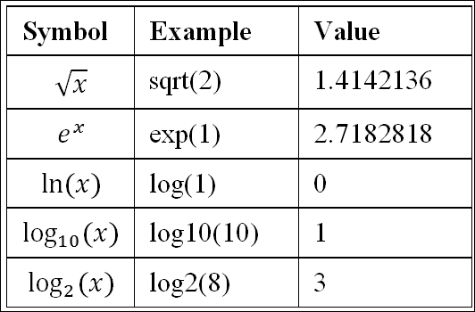

注意，`sqrt()`只适用于实数。如果提供负数，将产生`NaN`：

```py
sqrt(-1)
## Warning in sqrt(-1): NaNs produced
## [1] NaN 

```

在 R 中，数值可以是有限的、无限的（`Inf`和`-Inf`）或`NaN`值。以下代码将产生无限值。

首先，产生一个正无穷值：

```py
1 / 0
## [1] Inf 

```

然后，产生一个负无穷值：

```py
log(0)
## [1] -Inf 

```

有几个测试函数可以检查一个数值是否有限、无限或`NaN`：

```py
is.finite(1 / 0)
## [1] FALSE
is.infinite(log(0))
## [1] TRUE 

```

使用`is.infinite()`，我们如何检查一个数值是否为`-Inf`？在 R 中，不等式仍然适用于无限值：

```py
1 / 0 < 0
## [1] FALSE
1 / 0 > 0
## [1] TRUE
log(0) < 0
## [1] TRUE
log(0) > 0
## [1] FALSE 

```

因此，我们可以使用`is.infinite()`测试数字，并同时比较元素与 0：

```py
is.pos.infinite <- function(x) {
  is.infinite(x) & x > 0
}
is.neg.infinite <- function(x) {
  is.infinite(x) & x < 0
}
is.pos.infinite(1/0)
## [1] TRUE
is.neg.infinite(log(0))
## [1] TRUE 

```

与`sqrt()`类似，如果输入值超出了`log`函数的定义域，即`x > 0`，则该函数将返回带有警告的`NaN`：

```py
log(-1)
## Warning in log(-1): NaNs produced
## [1] NaN 

```

## 数字舍入函数

以下函数用于以不同方式舍入数字：

| **符号** | **示例** | **值** |
| --- | --- | --- |
| [x] log | `ceiling(10.6)` | 11 |
| [x] log | `floor(9.5)` | 9 |
| truncate | `trunc(1.5)` | 1 |
| round | `round(pi,3)` | 3.142 |
| 有效数字 | `signif(pi, 3)` | 3.14 |

之前，我们展示了使用 `options(digits =)` 可以修改显示的数字位数，但这不会改变实际要记住的数字位数。前面的函数会四舍五入数字，可能会造成潜在的信息丢失。

例如，如果输入数字 `1.50021` 已经很精确，那么将其四舍五入到 `1` 位将得到 `1.5`，而其他数字（信息）则丢失。因此，在执行任何四舍五入之前，你应该确保要丢弃的数字确实因为不精确或噪声而可以忽略。

## 三角函数

以下表格列出了最常用的三角函数：

| **符号** | **示例** | **值** |
| --- | --- | --- |
| `sin (x)` | `sin(0)` | 0 |
| `cos (x)` | `cos(0)` | 1 |
| `tan (x)` | `tan(0)` | 0 |
| `arcsin (x)` | `asin(1)` | 1.5707963 |
| `arco (x)` | `acos(1)` | 0 |
| `arctan (x)` | `atan(1)` | 0.7853982 |

R 还提供了 `π` 的数值版本：

```py
pi
## [1] 3.141593 

```

在数学中，方程 *sin (π) = 0* 严格成立。然而，由于浮点数的某些精度问题，相同的公式在 R 或任何其他典型的数值计算软件中不会导致 0：

```py
sin(pi)
## [1] 1.224606e-16 

```

要比较近似相等的数字，请使用 `all.equal()`。虽然 `sin(pi) == 0` 返回 `FALSE`，但 `all.equal(sin(pi), 0)` 在默认容差 `1.5e-8` 下返回 `TRUE`。

提供了另外三个函数，以便在输入是 `π` 的倍数时进行精确计算：

| **符号** | **示例** | **值** |
| --- | --- | --- |
| `sin (πx)` | `sinpi(1)` | 0 |
| `cos (πx)` | `cospi(0)` | 1 |
| `tan (πx)` | `tanpi(1)` | 0 |

## 双曲函数

与其他计算软件类似，双曲函数提供如下表所示：

| **符号** | **示例** | **值** |
| --- | --- | --- |
| `sinh (x)` | `sinh(1)` | 1.1752012 |
| `cosh (x)` | `cosh(1)` | 1.5430806 |
| `tanh (x)` | `tanh(1)` | 0.7615942 |
| `arcsinh (x)` | `asinh(1)` | 0.8813736 |
| `arccosh (x)` | `acosh(1)` | 0 |
| `arctanh (x)` | `atanh(0)` | 0 |

## 极端函数

计算某些数字的最大值或最小值是很常见的。以下表格列出了 `max()` 和 `min()` 的简单用法：

| **符号** | **示例** | **值** |
| --- | --- | --- |
| `max(...)` | `max(1, 2, 3)` | 3 |
| `min(...)` | `min(1, 2, 3)` | 1 |

这两个函数不仅支持多个标量参数，还支持向量输入：

```py
max(c(1, 2, 3))
## [1] 3 

```

此外，它们还支持多个向量输入：

```py
max(c(1, 2, 3),
    c(2, 1, 2),
    c(1, 3, 4))
## [1] 4
min(c(1, 2, 3),
    c(2, 1, 2),
    c(1, 3, 4))
## [1] 1 

```

输出表明 `max()` 返回所有输入向量的所有值中的最大值，而 `min()` 返回相反的值。

如果我们想要获得所有向量中每个位置的最大值或最小值呢？看看下面的代码行：

```py
pmax(c(1, 2, 3),
    c(2, 1, 2),
    c(1, 3, 4))
## [1] 2 3 4 

```

这基本上是在位置 1 的所有数字中找到最大值，然后在位置 2，依此类推，其输出与以下代码相同：

```py
x <- list(c(1, 2, 3),
          c(2, 1, 2),
          c(1, 3, 4))
c(max(x[[1]][[1]], x[[2]][[1]], x[[3]][[1]]),
  max(x[[1]][[2]], x[[2]][[2]], x[[3]][[2]]),
  max(x[[1]][[3]], x[[2]][[3]], x[[3]][[3]]))
## [1] 2 3 4 

```

这被称为**并行最大值**。双胞胎函数 `pmin()` 用于找到**并行最小值**：

```py
pmin(c(1, 2, 3),
     c(2, 1, 2),
     c(1, 3, 4))
## [1] 1 1 2 

```

这两个函数可以非常有用，可以快速组合具有特定函数（如 floor 和/或 ceiling）的向量化函数。例如，假设 `spread()` 是一个分段函数。如果输入小于 `-5`，则值为 `-5`。如果输入在 `-5` 到 `5` 之间，则值为输入。如果输入大于 `5`，则值为 `5`。

一种简单的实现是使用 `if` 来分支片段：

```py
spread <- function(x) {
  if (x < -5) -5
  else if (x > 5) 5
  else x
} 

```

该函数与标量输入一起工作，但它不会自动向量化：

```py
spread(1)
## [1] 1
spread(seq(-8, 8))
## Warning in if (x < -5) -5 else if (x > 5) 5 else x: the
## condition has length > 1 and only the first element will be
## used
## [1] -5 

```

一种方法是使用 `pmin()` 和 `pmax()`，函数将自动向量化：

```py
spread2 <- function(x) {
  pmin(5, pmax(-5, x))
}
spread2(seq(-8, 8))
##  [1] -5 -5 -5 -5 -4 -3 -2 -1  0  1  2  3  4  5  5  5  5 

```

另一种方法是使用 `ifelse()`：

```py
spread3 <- function(x) {
  ifelse(x < -5, -5, ifelse(x > 5, 5, x))
}
spread3(seq(-8, 8))
##  [1] -5 -5 -5 -5 -4 -3 -2 -1  0  1  2  3  4  5  5  5  5 

```

前两个函数 `spread2()` 和 `spread3()` 都有相同的图形：

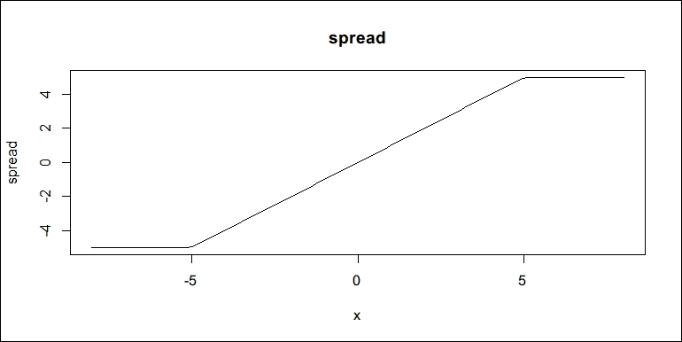

# 应用数值方法

在前面的章节中，你学习了关于从检查数据结构到数学和逻辑运算的许多函数。这些函数对于解决诸如根查找和微积分等问题是基本的。作为一个计算环境，R 已经实现了各种高性能工具，以便用户不必重新发明轮子。在接下来的章节中，你将学习为根查找和微积分设计的内置函数。

## 根查找

根查找是一个常见任务。假设我们想找到以下方程的根：

*x2 + x - 2= 0*

要手动查找根，我们可以将前面的方程转换为乘积形式：

*(x+2)(x-1)= 0*

因此，方程的根是 *x1= -2* 和 *x[2]= 1*。

在 R 中，`polyroot()` 可以找到以下形式的多项式方程的根：

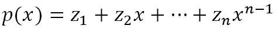

对于前面的问题，我们需要指定从零次项到方程中出现的最高次项的系数向量。在这种情况下，向量是 `c(-2, 1, 1)`，以表示按幂次增加的系数：

```py
polyroot(c(-2, 1, 1))
## [1]  1-0i -2+0i 

```

该函数总是返回一个复数向量，其中每个元素都是形式为 `a + bi` 的复数。一方面，如果函数确实只有实根，你可以使用 `Re()` 提取复根的实部：

```py
Re(polyroot(c(-2, 1, 1)))
## [1]  1 -2 

```

另一方面，输出类型表明 `polyroot()` 有能力找到多项式方程的复根。最简单的一个如下：

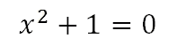

要找到其复根，只需指定一个多项式系数向量：

```py
polyroot(c(1, 0, 1))
## [1] 0+1i 0-1i 

```

一个稍微复杂一点的例子是找到以下方程的根：

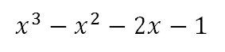

```py
r <- polyroot(c(-1, -2, -1, 1))
r
## [1] -0.5739495+0.3689894i -0.5739495-0.3689894i
## [3]  2.1478990-0.0000000i 

```

注意，所有复根都被找到了。为了验证，只需将 `x` 替换为 `r`：

```py
r ^ 3 - r ^ 2 - 2 * r - 1
## [1] 8.881784e-16+1.110223e-16i 8.881784e-16+2.220446e-16i
## [3] 8.881784e-16-4.188101e-16i 

```

由于一些数值计算问题，前面的表达式并没有严格趋近于零，但它非常接近。如果你只关心 8 位误差，使用 `round()` 函数，你会发现根是有效的：

```py
round(r ^ 3 - r ^ 2 - 2 * r - 1, 8)
## [1] 0+0i 0+0i 0+0i 

```

对于方程**f(x)=0**的一般数值根查找，`uniroot()`函数，正如其名所示，可以用来找到一个根。一个简单的例子是找到以下方程的根：

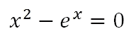

在以下范围内：

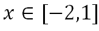

.

生成的图示如下：

在以下范围内：

函数的曲线显示根位于**[-1.0,0.5]**。使用带有函数和区间的`uniroot()`将返回一个包含近似根、该点的函数值、迭代次数和根的估计精度的列表：

```py
uniroot(function(x) x ^ 2 - exp(x), c(-2, 1))
## $root
## [1] -0.7034583
##
## $f.root
## [1] -1.738305e-05
##
## $iter
## [1] 6
##
## $init.it
## [1] NA
##
## $estim.prec
## [1] 6.103516e-05 

```

一个更复杂的例子是找到以下方程的根：

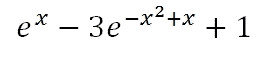

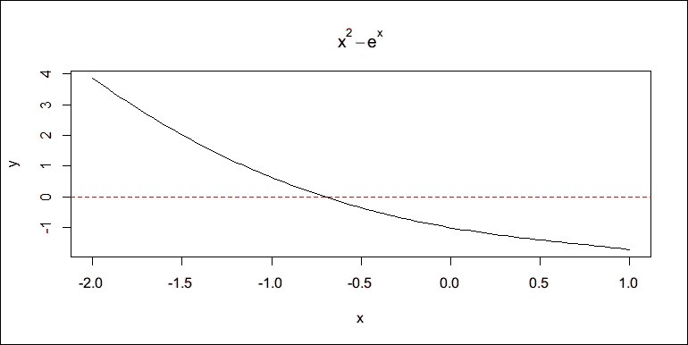

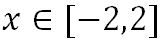

.

生成的图示如下：

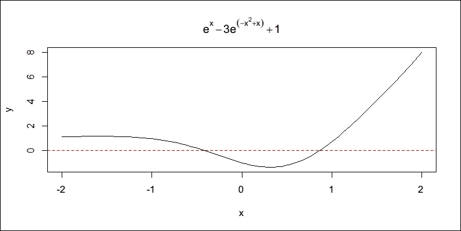

很明显，该方程在**-2**到**2**之间有两个根。然而，`uniroot()`一次只能找到一个根，并且最好是在搜索区间内函数是单调的。如果我们直接让它在这个**[-2,2]**区间内找到一个根，函数会产生错误：

```py
f <- function(x) exp(x) - 3 * exp(-x ^ 2 + x) + 1
uniroot(f, c(-2, 2))
## Error in uniroot(f, c(-2, 2)): f() values at end points not of opposite sign 

```

我们必须确保区间两端的函数值具有相反的符号。我们可以将区间分成两个更小的区间，并分别找到根：

```py
uniroot(f, c(-2, 0))$root
## [1] -0.4180424
uniroot(f, c(0, 2))$root
## [1] 0.8643009 

```

一个更复杂的方程如下：

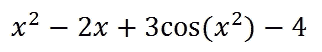

在以下范围内：

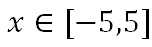

.

生成的图示如下：

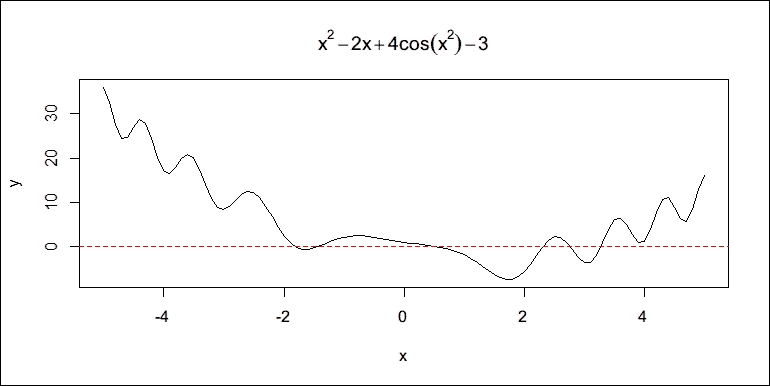

曲线显示该方程还有更多的根。以下代码只在**[0,1]**区间找到了一个：

```py
uniroot(function(x) x ^ 2 - 2 * x + 4 * cos(x ^ 2) - 3, c(0, 1))$root
## [1] 0.5593558 

```

在一些先前的根查找函数调用中，我们直接将一个函数传递给`uniroot()`而没有给函数命名。它们被称为**匿名函数**。我们将在后面的章节中详细讨论这个概念。

## 微积分

除了根查找之外，R 的基础数值方法还包括计算基本微积分。

### 导数

`D()`函数可以针对给定的变量符号地计算函数的导数。

例如，求导 *dx²/dx*：

```py
D(quote (x ^ 2), "x")
## 2 * x 

```

求导 *dsin(x)cos(xy)/dx*：

```py
D(quote(sin(x) * cos(x * y)), "x")
## cos(x) * cos(x * y) - sin(x) * (sin(x * y) * y) 

```

多亏了`quote()`函数，它保持表达式未评估，因此符号可以直接以它们书写的方式直接访问。

由于导数也是一个未评估的表达式，我们可以通过调用`eval()`来评估它，给定所有必要的符号：

```py
z <- D(quote(sin(x) * cos(x * y)), "x")
z
## cos(x) * cos(x * y) - sin(x) * (sin(x * y) * y)
eval(z, list(x = 1, y = 2))
## [1] -1.75514 

```

在前面的例子中，`quote()`创建了一个表达式对象，而`eval()`使用指定的符号评估一个给定的表达式。表达式对象赋予了 R 元编程的能力。我们将在第九章元编程中讨论这个主题。

### 积分

R 还支持数值积分。在这里，我们不需要编写表达式，只需提供一个函数即可，因为这不是符号计算。例如，以下公式是一个定积分问题。它基本上计算了从 *0* 到 *pi/2* 的正弦曲线下的面积。R 提供了内置函数 `integrate()`，可以灵活地解决这类问题，只要数学函数可以用 R 函数表示：

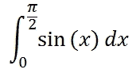

```py
result <- integrate(function(x) sin(x), 0, pi / 2)
result
## 1 with absolute error < 1.1e-14 

```

结果看起来像是一个数值，但它似乎还包含了一些其他信息。实际上，它是一个列表：

```py
str(result)
## List of 5
## $ value : num 1
## $ abs.error : num 1.11e-14
## $ subdivisions: int 1
## $ message : chr "OK"
## $ call : language integrate(f = function(x) sin(x), lower = 0, upper = pi/2)
##  - attr(*, "class")= chr "integrate" 

```

由于这是一个数值计算，它继承了此类计算技术的所有优点和缺点。

# 使用统计函数

R 在进行统计计算和建模方面非常高效，因为它提供了从随机抽样到统计测试的丰富函数。同一类别的函数具有共同的接口。在本节中，我将演示一些示例，以便您可以推断出其他类似函数的用法。

## 从向量中抽样

在统计学中，对总体进行研究通常从对其的随机样本开始。`sample()` 函数旨在从给定的向量或列表中抽取随机样本。默认情况下，`sample()` 进行无替换抽样。例如，以下代码从数值向量中抽取五个样本，不进行替换：

```py
sample(1:6, size = 5)
## [1] 2 6 3 1 4 

```

使用 `replace = TRUE`，抽样是带替换进行的：

```py
sample(1:6, size = 5, replace = TRUE)
## [1] 3 5 3 4 2 

```

虽然 `sample()` 函数通常用于从数值向量中抽取样本，但它也适用于其他类型的向量：

```py
sample(letters, size = 3)
## [1] "q" "w" "g" 

```

它甚至可以与列表一起使用：

```py
sample(list(a = 1, b = c(2, 3), c = c(3, 4, 5)), size = 2)
## $b
## [1] 2 3
##
## $c
## [1] 3 4 5 

```

实际上，`sample()` 能够从任何支持使用方括号 (`[]`) 进行子集操作的任何对象中进行抽样。此外，它支持加权抽样，即您可以指定每个元素的概率：

```py
grades <- sample(c("A", "B", "C"), size = 20, replace = TRUE,
prob = c(0.25, 0.5, 0.25))
grades
## [1] "C" "B" "B" "B" "C" "C" "C" "C" "C" "B" "B" "A" "A" "C"
## [15] "B" "B" "A" "B" "A" "C" 

```

我们可以使用 `table()` 来查看每个值的出现次数：

```py
table(grades)
## grades
## A B C
## 4 8 8 

```

## 处理随机分布

在数值模拟中，我们通常需要从随机分布中抽取样本，而不是从给定的向量中抽取。R 提供了丰富的内置函数来处理流行的概率分布。在本节中，我们将看到 R 如何提供基本的统计工具来处理代表样本数据的 R 对象。这些工具主要用于处理数值向量。

在 R 中，生成遵循统计分布的随机数非常容易。最常用的两种分布是均匀分布和正态分布。

在统计学上，从给定范围内的均匀分布中抽取任何值是等可能的。我们可以调用 `runif(n)` 来生成来自 **[0,1]** 范围内的均匀分布的 `n` 个随机数：

```py
runif(5)
## [1] 0.8894535 0.1804072 0.6293909 0.9895641 0.1302889 

```

要在非默认区间内生成随机数，请指定 `min` 和 `max`：

```py
runif(5, min = -1, max = 1)
## [1] -0.3386789  0.7302411  0.5551689  0.6546069  0.2066487 

```

如果我们使用 `runif(1000)` 生成 1000 个随机数并绘制点，我们将得到一个散点图（用于显示 X-Y 点的图）如下：

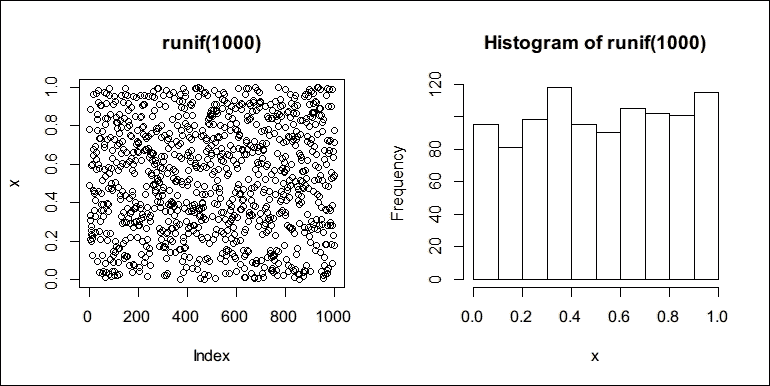

直方图显示，我们生成的随机数在从 0 到 1 的每个区间内分布几乎均匀，这与均匀分布一致。

在现实世界中最常见的另一个分布是正态分布。类似于`runif()`，我们可以使用`rnorm()`来生成遵循标准正态分布的随机数：

```py
rnorm(5)
## [1]  0.7857579  1.1820321 -0.9558760 -1.0316165  0.4336838 

```

您可能会注意到随机生成器函数具有相同的接口。`runif()`和`rnorm()`的第一个参数都是`n`，表示要生成的值的数量，其余参数是随机分布本身的参数。对于正态分布，其参数是均值和标准差（`sd`）：

```py
rnorm(5, mean = 2, sd = 0.5)
## [1] 1.597106 1.971534 2.374846 3.023233 2.033357 

```

生成的图形如下所示：

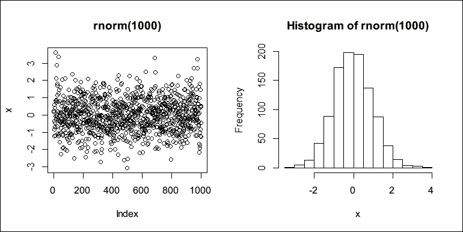

从前面的图形中可以看出，点并不是均匀分布，而是集中在均值附近。众所周知，统计分布可以用某些公式来描述。为了在理论上访问这些公式，R 为每个内置随机分布提供了一组函数。更具体地说，对于均匀分布，R 提供了其概率密度函数`dunif()`，累积密度函数`punif()`，分位数函数`qunif()`和随机生成器`runif()`。对于正态分布，相应的名称是`dnorm()`，`pnorm()`和`qnorm()`。密度函数、累积密度函数、分位数函数以及随机生成器的相同命名方案也适用于 R 支持的其他分布。

除了这两种最常用的统计分布之外，R 还提供了用于离散分布（如二项分布）和连续分布（如指数分布）的函数。您可以通过运行`?Distributions`来查看支持的完整分布列表。这些分布的特性超出了本书的范围。如果您不熟悉它们但对这些分布的特性感兴趣，您可以阅读任何概率论教科书或访问维基百科（[`en.wikipedia.org/wiki/Probability_distribution`](https://en.wikipedia.org/wiki/Probability_distribution)）以获取更多详细信息。

R 支持许多分布，每个分布都有相应的函数。幸运的是，我们不需要记住很多不同的函数名，因为它们都遵循相同的命名约定。

## 计算汇总统计量

对于给定的数据集，我们通常需要一些汇总统计量来对其有一个初步的了解。R 提供了一套函数来计算数值向量的汇总统计量，包括均值、中位数、标准差、方差、最大值、最小值、范围和分位数。对于多个数值向量，我们可以计算协方差矩阵和相关性矩阵。

以下示例展示了我们如何使用内置函数来计算这些汇总统计量。首先，我们从一个标准正态分布中生成一个长度为 50 的随机数值向量：

```py
x <- rnorm(50) 

```

要计算`x`的算术样本均值，我们调用`mean()`：

```py
mean(x)
## [1] -0.1051295 

```

这相当于：

```py
sum(x) / length(x)
## [1] -0.1051295 

```

然而，`mean()`支持从输入数据的两端修剪一定比例的观测值：

```py
mean(x, trim = 0.05)
## [1] -0.141455 

```

如果`x`包含一些远离其他值的异常值，从前面方程获得的平均值应该更稳健，因为异常值被从输入中省略了。

样本数据代表性位置的另一种度量方法是样本中位数。对于一个给定的样本，一半的观测值高于中位数，另一半的观测值低于中位数。如果数据中存在一些极端值，中位数可以是一个稳健的度量。对于`x`，样本中位数是：

```py
median(x)
## [1] -0.2312157 

```

除了均值和中位数等位置度量值之外，变异度量值也很重要。要计算数值向量的标准差，我们使用`sd()`：

```py
sd(x)
## [1] 0.8477752 

```

要计算方差，我们使用`var()`：

```py
var(x)
## [1] 0.7187228 

```

要简单地获取数据中的极端值，我们使用`min()`和`max()`：

```py
c(min = min(x), max = max(x))
## min max
## -1.753655  2.587579 

```

或者，您可以使用`range()`直接获取这两个值：

```py
range(x)
## [1] -1.753655  2.587579 

```

有时，数据不是正态分布的。在这种情况下，位置度量值和变异度量值会受到这种不规则性的影响，并可能产生误导性的结果。在这里，我们可能需要查看数据的临界分位数处的值：

```py
quantile(x)
## 0% 25% 50% 75% 100%
## -1.7536547 -0.6774037 -0.2312157  0.2974412  2.5875789 

```

要查看更多分位数，为`probs`参数指定更多值：

```py
quantile(x, probs = seq(0, 1, 0.1))
## 0% 10% 20% 30%
## -1.753654706 -1.116231750 -0.891186551 -0.504630513
## 40% 50% 60% 70%
## -0.412239924 -0.231215699 0.009806393 0.177344522
## 80% 90% 100%
##  0.550510144  0.968607716  2.587578887 

```

如果数据不是正态分布的，两个分位数之间的值差可能非常大或非常小，与其他值相比。一个快捷方法是使用`summary()`，它直接给出最常用的汇总统计量，包括四个分位数、中位数和平均值：

```py
summary(x)
## Min. 1st Qu. Median Mean 3rd Qu. Max.
## -1.7540 -0.6774 -0.2312 -0.1051  0.2974  2.5880 

```

注意，最小值和最大值分别是 0 百分位数和 100 百分位数。

实际上，`summary()`是一个通用函数，适用于许多类型的对象，并且具有不同的行为。例如，`summary()`与数据框一起工作：

```py
df <- data.frame(score = round(rnorm(100, 80, 10)),
grade = sample(letters[1:3], 100, replace = TRUE))
summary(df)
## score grade
## Min. : 60.00 a:34
## 1st Qu.: 73.00 b:38
## Median : 79.00 c:28
## Mean : 79.65
## 3rd Qu.: 86.00
##  Max.   :107.00 

```

可以看出，对于数值列，`summary()`显示汇总统计量。对于其他类型的列，它可能只是简单地显示值出现的表格。

### 计算协方差和相关性矩阵

前面的例子介绍了单个向量最常用的汇总统计量。对于两个或更多向量，我们可以计算协方差矩阵和相关性矩阵。

以下代码生成另一个与`x`相关的向量：

```py
y <- 2 * x + 0.5 * rnorm(length(x)) 

```

我们可以计算`x`和`y`之间的协方差：

```py
cov(x, y)
## [1] 1.419859 

```

我们还可以计算相关系数：

```py
cor(x, y)
## [1] 0.9625964 

```

这两个函数也适用于超过两个向量。如果我们需要计算超过两个向量的协方差和相关性矩阵，我们需要输入一个矩阵或数据框。在以下示例中，我们生成另一个长度与 `x` 相同的随机向量 `z`。这次，`z` 遵循均匀分布，并且不依赖于 `x` 或 `y`。我们使用 `cbind()` 创建一个三列矩阵，并计算它们的协方差矩阵：

```py
z <- runif(length(x))
m1 <- cbind(x, y, z)
cov(m1)
##           x          y          z
## x 0.7187228 1.41985899 0.04229950
## y 1.4198590 3.02719645 0.07299981
## z 0.0422995 0.07299981 0.08005535 

```

同样，我们可以直接使用矩阵调用 `cor()` 来计算相关性矩阵。

```py
cor(m1)
##           x         y         z
## x 1.0000000 0.9625964 0.1763434
## y 0.9625964 1.0000000 0.1482881
## z 0.1763434 0.1482881 1.0000000 

```

由于 `y` 是由与 `x` 的线性关系以及一些噪声生成的，我们应该预期 `x` 和 `y` 之间高度相关，但与 `z` 发生相同的事情不应该发生。相关矩阵看起来与我们的预期一致。要在统计意义上得出这样的结论，我们需要进行严格的统计测试，但这超出了本书的范围。

# 使用 apply-family 函数

此前，我们讨论了使用 `for` 循环在向量或列表上重复评估带有迭代器的表达式。然而，在实践中，`for` 循环几乎是最后的选择，因为当每个迭代独立于其他迭代时，另一种方式要干净得多，也更容易编写和阅读。

例如，以下代码使用 `for` 创建一个包含三个独立、正态分布随机向量（其长度由向量 `len` 指定）的列表：

```py
len <- c(3, 4, 5)
# first, create a list in the environment.
x <- list()
# then use `for` to generate the random vector for each length
for (i in 1:3) {
  x[[i]] <- rnorm(len[i])
}
x
## [[1]]
## [1] 1.4572245 0.1434679 -0.4228897
##
## [[2]]
## [1] -1.4202269 -0.7162066 -1.6006179 -1.2985130
##
## [[3]]
## [1] -0.6318412  1.6784430  0.1155478  0.2905479 -0.7363817 

```

上述示例很简单，但与使用 `lapply` 的实现相比，代码相当冗余：

```py
lapply(len, rnorm)
## [[1]]
## [1] -0.3258354 -1.4658116 -0.1461097
##
## [[2]]
## [1] -0.1715198 0.5215857 -0.3178271 -0.3967798
##
## [[3]]
## [1] -0.2047106 -1.2009772  1.4859955  0.1940920  0.3758798 

```

`lapply` 版本要简单得多。它将 `rnorm()` 应用于 `len` 中的每个元素，并将每个结果放入一个列表中。

从前面的示例中，我们应该意识到，这只有在 R 允许我们将函数作为普通对象传递时才可能。幸运的是，这是真的。R 中的函数被当作对象对待，可以作为参数传递，就像我们在数值方法部分所展示的那样。这个特性在很大程度上提高了代码的灵活性。

每个 apply-family 函数都是一个所谓的 **高阶函数**，它接受一个函数作为参数。我们将在稍后详细介绍这个概念。

## lapply

`lapply()` 函数，正如我们之前所演示的，它接受一个向量和函数作为其参数。它简单地将函数应用于给定向量的每个元素，并最终返回一个包含所有结果的列表。

当每个迭代独立于其他迭代时，此函数非常有用。在这种情况下，我们不必显式创建迭代器。

它不仅适用于向量，也适用于列表。假设我们有一个学生列表：

```py
students <- list(
  a1 = list(name = "James", age = 25,
    gender = "M", interest = c("reading", "writing")),
  a2 = list(name = "Jenny", age = 23,
    gender = "F", interest = c("cooking")),
  a3 = list(name = "David", age = 24,
    gender = "M", interest = c("running", "basketball"))) 

```

现在，我们需要创建一个字符向量，其中每个元素格式如下：

```py
James, 25 year-old man, loves reading, writing. 

```

注意，`sprintf()` 有助于通过替换占位符（例如，`%s` 用于字符串，`%d` 用于整数）来格式化文本。以下是一个示例：

```py
sprintf("Hello, %s! Your number is %d.", "Tom", 3)
## [1] "Hello, Tom! Your number is 3." 

```

现在，首先，我们确信迭代正在对`students`进行操作，并且每个迭代都是独立的。换句话说，对詹姆斯的计算与珍妮的计算没有任何关系，以此类推。因此，我们可以使用`lapply`来完成这项工作：

```py
lapply(students, function(s) {
  type <- switch(s$gender, "M" = "man", "F" = "woman")
  interest <- paste(s$interest, collapse = ", ")
  sprintf("%s, %d year-old %s, loves %s.", s$name, s$age, type, interest)
})
## $a1
## [1] "James, 25 year-old man, loves reading, writing."
##
## $a2
## [1] "Jenny, 23 year-old woman, loves cooking."
##
## $a3
## [1] "David, 24 year-old man, loves running, basketball." 

```

上述代码使用了一个匿名函数，这是一种没有分配给符号的函数。换句话说，这个函数是临时的，没有名字。当然，我们可以明确地将函数绑定到符号上，即给它一个名字，并在`lapply`中使用这个名字。

尽管如此，代码相当简单。对于`students`中的每个元素`s`，函数会决定学生的类型并将他们的兴趣粘贴在一起，用逗号分隔。然后，它将信息放入我们想要的格式中。

幸运的是，我们使用`lapply`的大部分方法也适用于其他 apply 家族函数，但它们的迭代机制或结果类型可能不同。

## sapply

列表并不总是结果的有利容器。有时，我们希望它们被放入一个简单的向量或矩阵中。`sapply`函数根据其结构简化结果。

假设我们对`1:10`中的每个元素应用平方。如果我们用`lapply`来做，我们将得到一个平方数的列表。这个结果看起来有点冗余，因为结果列表实际上是一个单值数值向量的列表。然而，我们可能仍然希望将结果保持为向量：

```py
sapply(1:10, function(i) i ^ 2)
##  [1]   1   4   9  16  25  36  49  64  81 100 

```

如果应用函数每次都返回一个多元素向量，`sapply`会将结果放入一个矩阵中，其中每个返回的向量占据一列：

```py
sapply(1:10, function(i) c(i, i ^ 2))
## [,1] [,2] [,3] [,4] [,5] [,6] [,7] [,8] [,9] [,10]
## [1,] 1 2 3 4 5 6 7 8 9 10
## [2,]    1    4    9   16   25   36   49   64   81   100 

```

## vapply

虽然`sapply`非常方便且智能，但有时这种智能可能会变成风险。假设我们有一个输入数字的列表：

```py
x <- list(c(1, 2), c(2, 3), c(1, 3)) 

```

如果我们想要获取`x`中每个数字的平方数的数值向量，`sapply`可以很容易地使用，因为它会自动尝试简化结果的数据结构：

```py
sapply(x, function(x) x ^ 2)
## [,1] [,2] [,3]
## [1,] 1 4 1
## [2,] 4 9 9 

```

然而，如果输入数据存在一些错误或损坏，`sapply()`将静默地接受输入并可能返回一个意外的值。例如，假设`x`的第三个元素错误地多了一个元素：

```py
x1 <- list(c(1, 2), c(2, 3), c(1, 3, 3)) 

```

然后，`sapply()`发现它不能再简化为一个矩阵，因此返回一个列表：

```py
sapply(x1, function(x) x ^ 2)
## [[1]]
## [1] 1 4
##
## [[2]]
## [1] 4 9
##
## [[3]]
## [1] 1 9 9 

```

如果我们首先使用`vapply()`，错误将很快被发现。`vapply()`函数有一个额外的参数，指定了每次迭代返回值的模板。在以下代码中，模板是`numeric(2)`，这意味着每个迭代应该返回一个包含两个元素的数值向量。如果模板被违反，函数将最终出错：

```py
vapply(x1, function(x) x ^ 2, numeric(2))
## Error in vapply(x1, function(x) x², numeric(2)): values must be length 2,
##  but FUN(X[[3]]) result is length 3 

```

对于原始和正确的输入，`vapply()`返回与`sapply()`完全相同的矩阵：

```py
vapply(x, function(x) x ^ 2, numeric(2))
## [,1] [,2] [,3]
## [1,] 1 4 1
## [2,] 4 9 9 

```

总之，`vapply`是`sapply`更安全版本，因为它执行额外的模板检查。在实际应用中，如果可以确定模板，最好使用`vapply()`而不是`sapply()`。

## mapply

虽然`lappy()`和`sapply()`都遍历一个向量，但`mapply()`遍历多个向量。换句话说，`mapply`是`sapply`的多变量版本：

```py
mapply(function(a, b, c) a * b + b * c + a * c,
a = c(1, 2, 3), b = c(5, 6, 7), c = c(-1, -2, -3))
## [1] -1 -4 -9 

```

迭代函数不仅可以返回标量值，还可以返回多元素向量。然后，`mapply()`将简化结果，就像`sapply()`做的那样：

```py
df <- data.frame(x = c(1, 2, 3), y = c(3, 4, 5))
df
## x y
## 1 1 3
## 2 2 4
## 3 3 5
mapply(function(xi, yi) c(xi, yi, xi + yi), df$x, df$y)
## [,1] [,2] [,3]
## [1,] 1 2 3
## [2,] 3 4 5
## [3,]    4    6    8 

```

`Map`是`lapply`的多变量版本，因此总是返回一个列表：

```py
Map(function(xi, yi) c(xi, yi, xi + yi), df$x, df$y)
## [[1]]
## [1] 1 3 4
##
## [[2]]
## [1] 2 4 6
##
## [[3]]
## [1] 3 5 8 

```

## apply

`apply`函数在给定的矩阵或数组的给定边缘或维度上应用一个函数。例如，要计算每一行的总和，即第一维度，我们需要指定`MARGIN = 1`，这样`sum`函数就会在每次迭代中对从矩阵中切分的一行（数值向量）应用：

```py
mat <- matrix(c(1, 2, 3, 4), nrow = 2)
mat
## [,1] [,2]
## [1,] 1 3
## [2,] 2 4
apply(mat, 1, sum)
## [1] 4 6 

```

要计算每一列的总和，即第二维度，我们需要指定`MARGIN=2`，这样`sum`函数就会在每次迭代中对从`mat`中切分的每一列应用：

```py
apply(mat, 2, sum)
## [1] 3 7 

```

`apply`函数也支持数组输入和矩阵输出：

```py
mat2 <- matrix(1:16, nrow = 4)
mat2
## [,1] [,2] [,3] [,4]
## [1,] 1 5 9 13
## [2,] 2 6 10 14
## [3,] 3 7 11 15
## [4,] 4 8 12 16 

```

要构建一个显示每列最大和最小值的矩阵，运行以下代码：

```py
apply(mat2, 2, function(col) c(min = min(col), max = max(col)))
## [,1] [,2] [,3] [,4]
## min 1 5 9 13
## max 4 8 12 16 

```

要构建一个显示每行最大和最小值的矩阵，运行以下代码：

```py
apply(mat2, 1, function(col) c(min = min(col), max = max(col)))
## [,1] [,2] [,3] [,4]
## min 1 2 3 4
## max 13 14 15 16
```

# 摘要

在本章中，你通过演示内置函数的使用来学习如何处理基本对象。它们是 R 在实际应用中的词汇。你学习了测试和获取对象类型的基本函数，以及访问和重塑数据维度的函数。你还了解了一些逻辑运算符和函数，用于过滤数据。

为了处理数值数据结构，你学习了基本的数学函数，内置的数值方法来寻找根和进行微积分，以及一些统计函数来执行随机抽样和数据的总结。你还了解了 apply 族函数，这些函数使得迭代和收集结果变得更加容易。

另一个重要的数据类型是字符串，它由字符向量表示。在下一章中，你将学习字符串操作技术，以促进文本分析。
