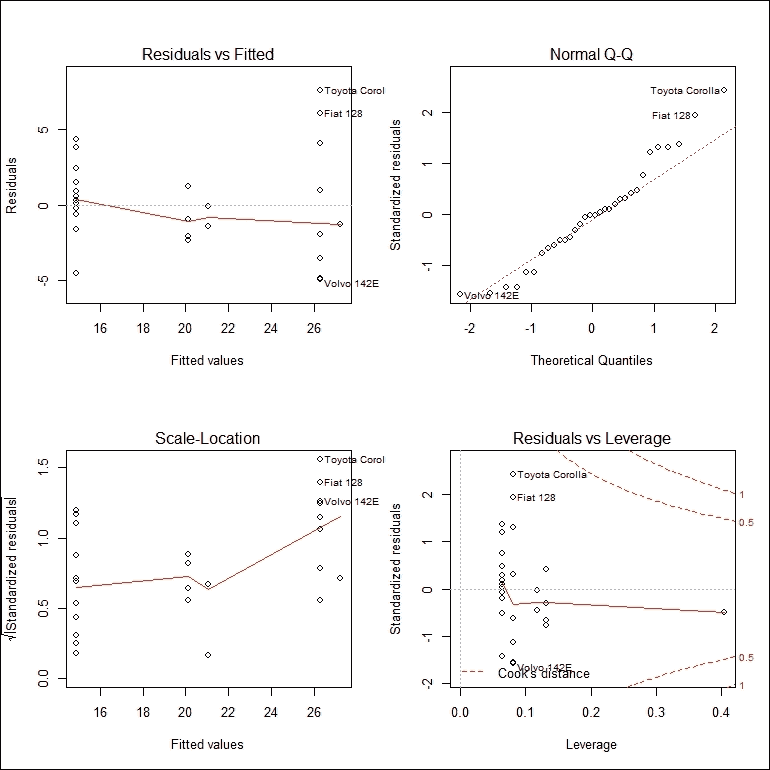
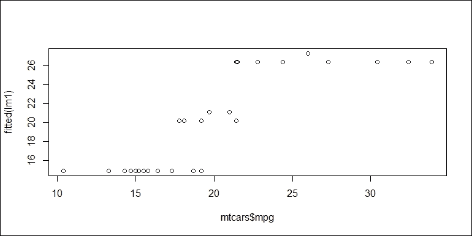
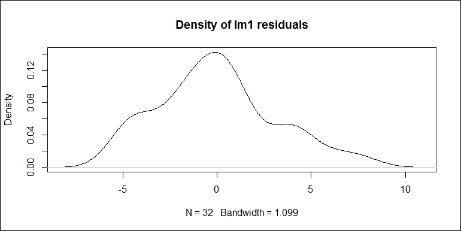
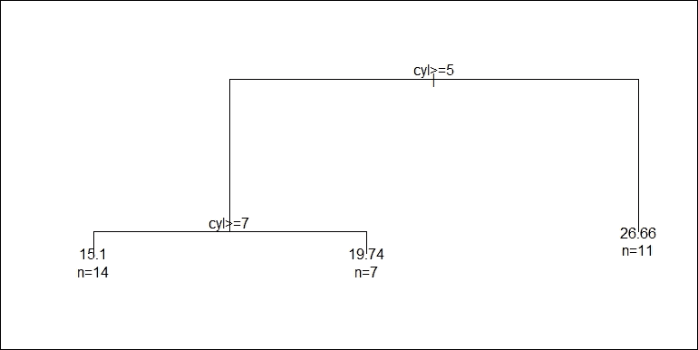
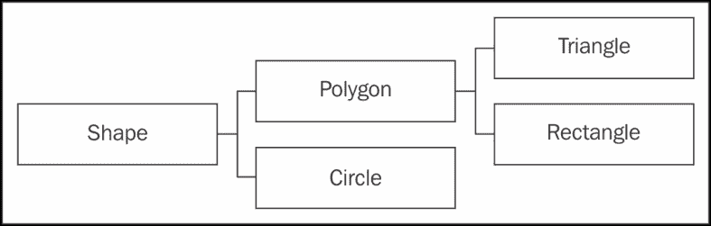

# 第十章 面向对象编程

在上一章中，你学习了函数式编程和元编程如何使自定义函数的行为成为可能。我们可以在某个特定上下文中创建一个函数，这被称为闭包。我们还可以通过传递函数就像传递其他对象一样来使用高阶函数。

在本章中，你将学习如何通过进入面向对象编程的世界来自定义对象的行为。R 提供了几个不同的面向对象系统来工作。乍一看，它们与其他编程语言中的面向对象系统看起来相当不同。然而，基本思想大多是相同的。我将简要解释对象类和方法的观念，并展示它们如何有助于统一我们处理数据和模型的方式。

在接下来的几节中，我们将从入门级别介绍以下主题：

+   面向对象编程的思想

+   S3 系统

+   S4 系统

+   参考类

+   R6 包

最后，我们将从几个方面比较这些系统。

# 介绍面向对象编程

如果你来自 Java、Python、C++、C#等编程语言的开发者，你应该对面向对象的编程风格感到熟悉。然而，如果你不熟悉任何其他面向对象的编程语言，你可能对这个术语感到困惑，因为它听起来有点抽象。但是，不用担心；如果我们从编程的核心来考虑，这比看起来要容易理解得多。

当我们谈论编程时，我们实际上是在谈论使用编程工具来解决问题。在解决问题之前，我们需要首先对问题进行建模。传统上，我们通常找出一个需要几个步骤来解决数值计算问题的算法。然后，我们编写一些过程式代码来实现该算法。例如，大多数统计算法都是以过程式风格实现的，也就是说，根据理论将输入转换为输出，一步一步地。

然而，许多问题与现实世界紧密相连，以至于通过定义一些对象类以及它们之间的交互来建模问题可能非常直观。换句话说，通过面向对象的编程方式，我们只是试图在适当的抽象级别上模拟相关对象的重要特征。

面向对象编程涉及许多概念。在这里，我们只关注其中最重要的。

## 理解类和方法

本章最重要的概念是类和方法。类描述了对象是什么，方法定义了它能够做什么。这些概念在现实世界中有着无数的实际例子。例如，`animal` 可以是一个类。在这个类中，我们可以定义诸如发出声音和移动等方法。`vehicle` 也可以是一个类。在这个类中，我们可以定义诸如启动、移动和停止等方法。`person` 可以是一个具有诸如醒来、与人交谈和去某个地方等方法的类。

对于特定的问题，我们可以根据我们的需求定义类来模拟我们正在处理的对象，并为它们定义方法来模拟对象之间的交互。对象不需要是物理的或可触摸的。一个实际的例子是银行账户。它只存在于银行的数据库中，但使用一些数据字段（如余额和所有者）和一些方法（如存款、取款和账户间转账）来模拟银行账户是有用的。

## 理解继承

面向对象编程的另一个重要概念是继承，即我们可以定义一个继承自基类（或超类）行为的类，并具有一些新的行为。通常，基类在概念上更抽象和通用，而继承类更具体和特定。这在我们的日常生活中是一个简单的真理。

例如，`dog` 和 `cat` 是从 `animal` 类继承的两个类。`animal` 类定义了诸如发出声音和移动等方法。`dog` 和 `cat` 类继承了这些方法，但以不同的方式实现，以便它们发出不同的声音并以不同的方式移动。

此外，`car`、`bus` 和 `airplane` 是从 `vehicle` 类继承的类。`vehicle` 类定义了诸如 `start`、`move` 和 `stop` 等方法。`car`、`bus` 和 `airplane` 类继承了这些功能，但以不同的方式工作。`car` 和 `bus` 可以在表面上以二维方式移动，而飞机可以在空中以三维方式移动。

面向对象编程系统中还有一些其他概念，但在这章中我们不会对它们进行重点讨论。让我们记住我们提到的概念，并看看这些概念在 R 编程中的工作方式。

# 与 S3 对象系统一起工作

R 中的 S3 对象系统是一个简单、松散的面向对象系统。每个基本对象类型都有一个 S3 类名。例如，`integer`、`numeric`、`character`、`logical`、`list`、`data.frame` 等都是 S3 类。

例如，`vec1` 类型的类型是 `double`，这意味着 `vec1` 的内部类型或存储模式是双精度浮点数。然而，它的 S3 类是 `numeric`：

```py
vec1 <- c(1, 2, 3) 
typeof(vec1) 
## [1] "double" 
class(vec1) 
## [1] "numeric" 

```

`data1` 类型的类型是 `list`，这意味着 `data1` 的内部类型或存储模式是一个列表，但它的 S3 类是 `data.frame`：

```py
data1 <- data.frame(x = 1:3, y = rnorm(3)) 
typeof(data1) 
## [1] "list" 
class(data1) 
## [1] "data.frame" 

```

在以下章节中，我们将解释对象内部类型与其 S3 类之间的区别。

## 理解泛型函数和方法调度

如我们本章前面提到的，一个类可以拥有许多方法来定义其行为，主要是与其他对象一起。在 S3 系统中，我们可以创建泛型函数并为不同的类实现它们作为方法。这就是 S3 方法调度如何使对象类变得重要的。

R 中有很多 S3 泛型函数的简单例子。每个都是为通用目的定义的，允许不同类的对象为该目的有自己的实现。让我们首先看看`head()`和`tail()`函数。它们的功能很简单：`head()`获取数据对象的前`n`条记录，而`tail()`获取数据对象的后`n`条记录。它与`x[1:n]`不同，因为它为不同类的对象定义了不同的记录。对于一个原子向量（数值、字符等），前`n`条记录仅意味着前`n`个元素。然而，对于一个数据框，前`n`条记录意味着前`n`行而不是列。因为数据框本质上是一个列表，直接从数据框中取出前`n`个元素实际上是取出前`n`列，这不是`head()`的意图。

首先，让我们输入`head`并看看函数内部有什么内容：

```py
head 
## function (x, ...)  
## UseMethod("head") 
## <bytecode: 0x000000000f052e10> 
## <environment: namespace:utils> 

```

我们发现这个函数中没有任何实际的实现细节。相反，它调用`UseMethod("head")`使`head`成为一个所谓的**泛型函数**以执行方法调度，即它可能对不同的类有不同的行为。

现在，让我们创建两个数据对象，一个是`numeric`类，另一个是`data.frame`类，然后看看当我们把每个对象传递给泛型函数`head`时，方法调度是如何工作的：

```py
num_vec <- c(1, 2, 3, 4, 5) 
data_frame <- data.frame(x = 1:5, y = rnorm(5)) 

```

对于数值向量，`head`简单地取其前几个元素。

```py
head(num_vec, 3) 
## [1] 1 2 3 

```

然而，对于数据框，`head`取其前几行而不是列：

```py
head(data_frame, 3) 
##   x         y 
## 1 1 0.8867848 
## 2 2 0.1169713 
## 3 3 0.3186301 

```

这里，我们可以使用一个函数来模拟`head`的行为。以下代码是一个简单的实现，它取任何给定对象`x`的前`n`个元素：

```py
simple_head <- function(x, n) { 
  x[1:n] 
} 

```

对于数值向量，它的工作方式与`head`完全相同：

```py
simple_head(num_vec, 3) 
## [1] 1 2 3 

```

然而，对于数据框，它实际上试图取出前`n`列。回想一下，数据框是一个列表，数据框的每一列都是列表的一个元素。如果`n`超过了数据框的列数或等价地列表的元素数，可能会出错：

```py
simple_head(data_frame, 3) 
## Error in `[.data.frame`(x, 1:n): undefined columns selected 

```

为了改进实现，我们可以在采取任何措施之前检查输入对象`x`是否是数据框：

```py
simple_head2 <- function(x, n) { 
  if (is.data.frame(x)) { 
    x[1:n,] 
  } else { 
    x[1:n] 
  } 
} 

```

现在，对于原子向量和数据框，`simple_head2`的行为几乎与`head`相同：

```py
simple_head2(num_vec, 3) 
## [1] 1 2 3 
simple_head2(data_frame, 3) 
##   x         y 
## 1 1 0.8867848 
## 2 2 0.1169713 
## 3 3 0.3186301 

```

然而，`head`提供了更多功能。要查看为`head`实现的函数，我们可以调用`methods()`，它返回一个字符向量：

```py
methods("head") 
## [1] head.data.frame* head.default*    head.ftable*     
## [4] head.function*   head.matrix      head.table*      
## see '?methods' for accessing help and source code 

```

这表明除了向量和数据框之外，`head` 已经为许多其他类提供了一些内置方法。请注意，这些方法都是以 `method.class` 的形式存在的。如果我们输入一个 `data.frame` 对象，`head` 将内部调用 `head.data.frame`。同样，如果我们输入一个 `table` 对象，它将内部调用 `head.table`。如果我们输入一个数值向量呢？当找不到与输入对象类匹配的方法时，如果定义了 `method.default`，它将转向 `method.default`。在这种情况下，所有原子向量都通过 `head.default` 匹配。泛型函数找到特定输入对象适当方法的这个过程称为 **方法调度**。

看起来我们可以在函数中始终检查输入对象的类以实现方法调度的目标。然而，为另一个类实现方法以扩展泛型函数的功能更容易，因为你不必每次都通过添加特定的类检查条件来修改原始的泛型函数。我们将在本节稍后讨论这一点。

## 使用内置类和方法

S3 泛型函数和方法在统一我们处理各种模型的方式上最有用。例如，我们可以创建一个线性模型，并使用泛型函数从不同的角度查看模型：

```py
lm1 <- lm(mpg ~ cyl + vs, data = mtcars) 

```

在前面的章节中，我们提到线性模型本质上是由模型拟合产生的数据字段的列表。这就是为什么 `lm1` 的类型是 `list`，但它的类是 `lm`，这样泛型函数就会为 `lm` 选择方法：

```py
typeof(lm1) 
## [1] "list" 
class(lm1) 
## [1] "lm" 

```

S3 方法调度甚至在没有显式调用 S3 泛型函数的情况下发生。如果我们输入 `lm1` 并查看其内容，模型对象将被打印出来：

```py
lm1 
##  
## Call: 
## lm(formula = mpg ~ cyl + vs, data = mtcars) 
##  
## Coefficients: 
## (Intercept)          cyl           vs   
##     39.6250      -3.0907      -0.9391 

```

实际上，`print` 是隐式调用的：

```py
print(lm1) 
##  
## Call: 
## lm(formula = mpg ~ cyl + vs, data = mtcars) 
##  
## Coefficients: 
## (Intercept)          cyl           vs   
##     39.6250      -3.0907      -0.9391 

```

我们知道 `lm1` 本质上是一个列表。为什么打印时它看起来不像一个列表？这是因为 `print` 是一个泛型函数，它有一个为 `lm` 打印线性模型最重要信息的 `lm` 方法。我们可以通过 `getS3method("print", "lm")` 获取我们实际调用的方法。实际上，`print(lm1)` 转向 `stats:::print.lm`，这可以通过检查它们是否相同来验证：

```py
identical(getS3method("print", "lm"), stats:::print.lm) 
## [1] TRUE 

```

注意，`print.lm` 定义在 `stats` 包中，但并未公开导出，因此我们必须使用 `:::` 来访问它。通常，访问包中的内部对象是一个坏主意，因为它们可能在不同的版本中发生变化，并且用户看不到这些变化。在大多数情况下，我们根本不需要这样做，因为像 `print` 这样的泛型函数会自动选择正确的调用方法。

在 R 中，`print` 方法为许多类实现了。以下代码展示了为不同类实现了多少种方法：

```py
length(methods("print")) 
## [1] 198 

```

你可以调用 `methods("print")` 来查看整个列表。实际上，如果加载了更多的包，这些包中的类将定义更多的方法。

虽然`print`显示了模型的简短版本，但`summary`显示了详细的信息。此函数也是一个泛型函数，它为所有类型的模型类提供了许多方法：

```py
summary(lm1) 
##  
## Call: 
## lm(formula = mpg ~ cyl + vs, data = mtcars) 
##  
## Residuals: 
##    Min     1Q Median     3Q    Max  
## -4.923 -1.953 -0.081  1.319  7.577  
##  
## Coefficients: 
##             Estimate Std. Error t value Pr(>|t|)     
## (Intercept)  39.6250     4.2246   9.380 2.77e-10 *** 
## cyl          -3.0907     0.5581  -5.538 5.70e-06 *** 
## vs           -0.9391     1.9775  -0.475    0.638     
## --- 
## Signif. codes:   
## 0 '***' 0.001 '**' 0.01 '*' 0.05 '.' 0.1 ' ' 1 
##  
## Residual standard error: 3.248 on 29 degrees of freedom 
## Multiple R-squared:  0.7283, Adjusted R-squared:  0.7096  
## F-statistic: 38.87 on 2 and 29 DF,  p-value: 6.23e-09 

```

线性模型的总结不仅显示了`print`显示的内容，还提供了系数和整体模型的一些重要统计数据。实际上，`summary`的输出是另一个可以访问其包含数据的对象。在这种情况下，它是一个`summary.lm`类的列表，并且它有自己的`print`方法：

```py
lm1summary <- summary(lm1) 
typeof(lm1summary) 
## [1] "list" 
class(lm1summary) 
## [1] "summary.lm" 

```

要列出`lm1summary`包含的元素，我们可以查看列表中的名称：

```py
names(lm1summary) 
## [1] "call"          "terms"         "residuals"     
## [4] "coefficients"  "aliased"       "sigma"         
## [7] "df"            "r.squared"     "adj.r.squared" 
##[10] "fstatistic"    "cov.unscaled" 

```

我们可以以完全相同的方式访问每个元素，就像从典型的列表中提取元素一样。例如，要访问线性模型的估计系数，我们可以使用`lm1$coefficients`。或者，我们可以使用以下代码来访问估计系数：

```py
coef(lm1) 
## (Intercept)         cyl          vs  
##  39.6250234  -3.0906748  -0.9390815 

```

在这里，`coef`也是一个泛型函数，它从模型对象中提取系数向量。要访问模型总结中的详细系数表，我们可以使用`lm1summary$coefficients`或再次使用`coef`：

```py
coef(lm1summary) 
##               Estimate Std. Error    t value     Pr(>|t|) 
## (Intercept) 39.6250234  4.2246061  9.3795782 2.765008e-10 
## cyl         -3.0906748  0.5580883 -5.5379676 5.695238e-06 
## vs          -0.9390815  1.9775199 -0.4748784 6.384306e-01 

```

还有其他有用的模型相关泛型函数，如`plot`、`predict`等。我们提到的所有这些泛型函数都是 R 中用户与估计模型交互的标准方式。不同的内置模型和第三方包提供的模型都试图实现这些泛型函数，这样我们就不需要记住不同的函数集来处理每个模型。

例如，我们可以使用`plot`函数对线性模型进行 2x2 分区：

```py
oldpar <- par(mfrow = c(2, 2)) 
plot(lm1) 
par(oldpar) 

```

这产生了以下包含四个部分的图像：



我们可以看到我们使用了`plot`函数对线性模型进行操作，这将导致四个诊断图，显示残差的特征，这有助于判断模型拟合是好是坏。注意，如果我们直接在控制台中调用`plot`函数到`lm`，四个图将依次交互式完成。为了避免这种情况，我们调用`par()`将绘图区域划分为 2x2 的子区域。

大多数统计模型都是有用的，因为它们可以用新数据来预测。为此，我们使用`predict`。在这种情况下，我们可以将线性模型和新数据提供给`predict`，它将找到使用新数据进行预测的正确方法：

```py
predict(lm1, data.frame(cyl = c(6, 8), vs = c(1, 1))) 
##        1        2  
## 20.14189 13.96054 

```

此函数可以在样本内和样本外使用。如果我们向模型提供新数据，则是样本外预测。如果我们提供的数据已经在样本中，则是样本内预测。在这里，我们可以创建实际值`(mtcars$mpg)`和拟合值之间的散点图，以查看拟合的线性模型预测得有多好：

```py
plot(mtcars$mpg, fitted(lm1)) 

```

生成的图如下所示：



在这里，`fitted` 也是一个泛型函数，在这种情况下，它等同于 `lm1$fitted.values`，拟合值也等于使用 `predict(lm1, mtcars)` 在原始数据集上预测的值。

响应变量的实际值与拟合值之间的差异称为残差。我们可以使用另一个泛型函数 `residuals` 来访问数值向量，或者等价地使用 `lm1$residuals`。在这里，我们将对残差进行密度图绘制：

```py
plot(density(residuals(lm1)),  
  main = "Density of lm1 residuals") 

```

生成的图如下所示：



在前面的函数调用中，所有涉及到的函数都是泛型函数。`residuals` 函数从 `lm1` 中提取残差并返回一个数值向量。`density` 函数创建一个类为 `density` 的列表来存储残差密度函数的估计数据。最后，`plot` 转换为 `plot.density` 来创建密度图。

这些泛型函数不仅与 `lm`、`glm` 和其他内置模型一起工作，还与其他包提供的模型一起工作。例如，我们使用 `rpart` 包使用与前面例子中相同的数据和公式来拟合回归树模型。

如果你还没有安装该包，你需要运行以下代码：

```py
install.packages("rpart") 

```

现在，包已经准备好附加。我们以与 `lm` 完全相同的方式调用 `rpart`：

```py
library(rpart) 
tree_model <- rpart(mpg ~ cyl + vs, data = mtcars) 

```

我们之所以能够这样做，是因为包的作者希望函数调用与我们在 R 中调用内置函数的方式保持一致。结果对象是一个类为 `rpart` 的列表，它与 `lm` 类似，也是一个类为 `rpart` 的列表：

```py
typeof(tree_model) 
## [1] "list" 
class(tree_model) 
## [1] "rpart" 

```

与 `lm` 对象一样，`rpart` 也实现了一系列泛型方法。例如，我们使用 `print` 函数以自己的方式打印模型：

```py
print(tree_model) 
## n = 32  
##  
## node), split, n, deviance, yval 
##       * denotes terminal node 
##  
## 1) root 32 1126.04700 20.09062   
##   2) cyl >= 5 21  198.47240 16.64762   
##     4) cyl >= 7 14   85.20000 15.10000 * 
##     5) cyl < 7 7   12.67714 19.74286 * 
##   3) cyl < 5 11  203.38550 26.66364 * 

```

输出表明 `print` 为 `rpart` 提供了方法，它简要地显示了回归树的外观。除了 `print` 之外，`summary` 还提供了关于模型拟合的更详细信息：

```py
summary(tree_model) 
## Call: 
## rpart(formula = mpg ~ cyl + vs, data = mtcars) 
##   n = 32  
##  
##           CP nsplit rel error    xerror       xstd 
## 1 0.64312523      0 1.0000000 1.0844542 0.25608044 
## 2 0.08933483      1 0.3568748 0.3858990 0.07230642 
## 3 0.01000000      2 0.2675399 0.3875795 0.07204598 
##  
## Variable importance 
## cyl  vs  
##  65  35  
##  
## Node number 1: 32 observations,    complexity param=0.6431252 
##   mean=20.09062, MSE=35.18897  
##   left son=2 (21 obs) right son=3 (11 obs) 
##   Primary splits: 
##       cyl < 5   to the right, improve=0.6431252, (0 missing) 
##       vs  < 0.5 to the left,  improve=0.4409477, (0 missing) 
##   Surrogate splits: 
##       vs < 0.5 to the left,  agree=0.844, adj=0.545, (0 split) 
##  
## Node number 2: 21 observations,    complexity param=0.08933483 
##   mean=16.64762, MSE=9.451066  
##   left son=4 (14 obs) right son=5 (7 obs) 
##   Primary splits: 
##       cyl < 7   to the right, improve=0.5068475, (0 missing) 
##   Surrogate splits: 
##       vs < 0.5 to the left,  agree=0.857, adj=0.571, (0 split) 
##  
## Node number 3: 11 observations 
##   mean=26.66364, MSE=18.48959  
##  
## Node number 4: 14 observations 
##   mean=15.1, MSE=6.085714  
##  
## Node number 5: 7 observations 
##   mean=19.74286, MSE=1.81102 

```

同样，`plot` 和 `text` 也为 `rpart` 提供了方法来可视化它：

```py
oldpar <- par(xpd = NA) 
plot(tree_model) 
text(tree_model, use.n = TRUE) 
par(oldpar) 

```

然后，我们得到以下树状图：



我们可以使用 `predict` 使用新数据进行预测，就像我们在前面的例子中处理线性模型一样：

```py
predict(tree_model, data.frame(cyl = c(6, 8), vs = c(1, 1))) 
##        1        2  
## 19.74286 15.10000 

```

注意，并非所有模型都实现了所有泛型函数的方法。例如，由于回归树不是一个简单的参数模型，它没有实现 `coef` 的方法：

```py
coef(tree_model) 
## NULL 

```

## 为现有类定义泛型函数

在上一节中，你学习了如何使用现有类和方法来处理模型对象。然而，S3 系统还允许我们创建自己的类和泛型函数。

回想一下我们使用条件表达式来模拟`head`的方法调度示例。我们提到它工作，但通常不是最佳实践。S3 通用函数更灵活且更容易扩展。要定义一个通用函数，我们通常创建一个函数，在其中调用`UseMethod`来触发方法调度。然后，我们为想要通用函数与之一起工作的类创建形式为`method.class`的方法函数，通常还有一个形式为`method.default`的默认方法来捕获所有其他情况。以下是使用通用函数和方法重写此示例的简单示例。在这里，我们将创建一个新的通用函数`generic_head`，它有两个参数：输入对象`x`和要取的记录数`n`。通用函数只调用`UseMethod("generic_head")`来请求 R 根据`x`的类进行方法调度：

```py
generic_head <- function(x, n)  
  UseMethod("generic_head") 

```

对于原子向量（数值、字符、逻辑等），应该取前`n`个元素。我们可以分别定义`generic_head.numeric`、`generic_head.character`等，但在这种情况下，定义一个默认方法来捕获所有其他`generic_head.class`方法未匹配的案例看起来更好：

```py
generic_head.default <- function(x, n) { 
  x[1:n] 
} 

```

现在，`generic_head`只有一个方法，这相当于根本不使用通用函数：

```py
generic_head(num_vec, 3) 
## [1] 1 2 3 

```

由于我们没有为`data.frame`类定义方法，提供数据框将回退到`generic_head.default`，这会导致由于越界列索引的无效访问而引发错误：

```py
generic_head(data_frame, 3) 
## Error in `[.data.frame`(x, 1:n): undefined columns selected 

```

然而，假设我们为`data.frame`定义了一个方法：

```py
generic_head.data.frame <- function(x, n) { 
  x[1:n,] 
} 

```

通用函数按预期工作：

```py
generic_head(data_frame, 3) 
##   x         y 
## 1 1 0.8867848 
## 2 2 0.1169713 
## 3 3 0.3186301 

```

你可能会注意到我们之前实现的方法不够健壮，因为我们没有检查参数。例如，如果`n`大于输入对象的元素数量，函数的行为将不同，通常是不希望的方式。我将把它留给你作为练习，使方法更健壮，并适当地处理边缘情况。

## 创建新类的对象

现在，是时候给出一些定义新类的示例了。请注意，`class(x)`获取`x`的类，而`class(x) <- "some_class"`将`x`的类设置为`some_class`。

### 使用列表作为底层数据结构

就像`lm`和`rpart`一样，列表可能是创建新类最广泛使用的底层数据结构。这是因为一个类代表一种可以存储不同类型数据且长度不同的对象类型，并且有一些方法可以与其他对象交互。

在以下示例中，我们将定义一个名为`product`的函数，它创建一个具有名称、价格和库存的`product`类列表。我们将定义它自己的`print`方法，并在继续的过程中添加更多行为：

```py
product <- function(name, price, inventory) { 
  obj <- list(name = name,  
    price = price,  
    inventory = inventory) 
  class(obj) <- "product" 
  obj 
} 

```

注意，我们首先创建了一个列表，将其类替换为`product`，然后最终返回对象。实际上，对象的类是一个字符向量。另一种方法是使用`structure()`：

```py
product <- function(name, price, inventory) { 
  structure(list(name = name,  
    price = price,  
    inventory = inventory), 
    class = "product") 
} 

```

现在，我们有一个生成`product`类对象的函数。在下面的代码中，我们将调用`product()`并创建这个类的实例：

```py
laptop <- product("Laptop", 499, 300) 

```

就像所有之前的对象一样，我们可以看到它的内部数据结构和它的 S3 类以进行方法调度：

```py
typeof(laptop) 
## [1] "list" 
class(laptop) 
## [1] "product" 

```

显然，`laptop`是一个类`product`的列表，正如我们创建的那样。由于我们没有为这个类定义任何方法，它的行为与普通列表对象没有区别。如果我们输入它，它将以列表的形式打印出来，并带有其自定义的类属性：

```py
laptop 
## $name 
## [1] "Laptop" 
##  
## $price 
## [1] 499 
##  
## $inventory 
## [1] 300 
##  
## attr(,"class") 
## [1] "product" 

```

首先，我们可以为这个类实现`print`方法。在这里，我们希望类及其中的数据字段以紧凑的样式打印出来：

```py
print.product <- function(x, ...) { 
  cat("<product>\n") 
  cat("name:", x$name, "\n") 
  cat("price:", x$price, "\n") 
  cat("inventory:", x$inventory, "\n") 
  invisible(x) 
} 

```

这是一个惯例，`print`方法返回输入对象本身以供进一步使用。如果打印被定制，那么我们通常使用`invisible`来抑制函数返回的相同对象的重复打印。你可以尝试直接返回`x`并看看会发生什么。

然后，我们再次输入变量。由于`print`方法已经被定义，它将被调度到`print.product`。

```py
laptop 
## <product> 
## name: Laptop  
## price: 499  
## inventory: 300 

```

我们可以像从列表中提取元素一样访问`laptop`中的元素：

```py
laptop$name 
## [1] "Laptop" 
laptop$price 
## [1] 499 
laptop$inventory 
## [1] 300 

```

如果我们创建另一个实例并将这两个实例放入一个列表中，当列表被打印时，`print.product`仍然会被调用：

```py
cellphone <- product("Phone", 249, 12000) 
products <- list(laptop, cellphone) 
products 
## [[1]] 
## <product> 
## name: Laptop  
## price: 499  
## inventory: 300  
##  
## [[2]] 
## <product> 
## name: Phone  
## price: 249  
## inventory: 12000 

```

这是因为当`products`作为列表打印时，它会为每个元素调用`print`，这也会导致方法调度。

创建 S3 类比大多数需要正式定义类的编程语言要简单得多。对参数进行充分的检查以确保创建的对象在内部与类所表示的内容一致是很重要的。

例如，如果没有适当的检查，我们可以创建一个具有负数和非整数的库存的产品：

```py
product("Basket", 150, -0.5) 
## <product> 
## name: Basket  
## price: 150  
## inventory: -0.5 

```

为了避免这种情况，我们需要在对象生成函数`product`中添加一些检查条件：

```py
product <- function(name, price, inventory) { 
  stopifnot( 
    is.character(name), length(name) == 1, 
    is.numeric(price), length(price) == 1,  
    is.numeric(inventory), length(inventory) == 1,  
price > 0, inventory >= 0) 
  structure(list(name = name,  
    price = as.numeric(price),  
    inventory = as.integer(inventory)), 
    class = "product") 
} 

```

函数得到了增强，其中`name`必须是一个单独的字符串，`price`必须是一个单独的正数，而`inventory`必须是一个单独的非负数。有了这个函数，我们不会错误地创建荒谬的产品，并且这样的错误可以在早期被发现：

```py
product("Basket", 150, -0.5) 
## Error: inventory >= 0 is not TRUE 

```

除了定义新的类，我们还可以定义新的泛型函数。在下面的代码中，我们将定义一个新的泛型函数，称为`value`，并通过测量产品的库存值来实现`product`的方法：

```py
value <- function(x, ...)  
  UseMethod("value") 

value.default <- function(x, ...) { 
  stop("value is undefined") 
} 

value.product <- function(x, ...) { 
  x$price * x$inventory 
} 

```

对于其他类，它调用`value.default`并停止。现在，`value`可以与所有我们创建的`product`实例一起使用：

```py
value(laptop) 
## [1] 149700 
value(cellphone) 
## [1] 2988000 

```

泛型函数还可以通过为输入向量或列表中的每个元素执行方法调度与 apply 家族函数一起工作：

```py
sapply(products, value) 
## [1]  149700 2988000 

```

另一个问题是一旦我们创建了一个特定类的对象，这意味着我们不能再改变它了吗？不，我们仍然可以改变它。在这种情况下，我们可以修改`laptop`中现有的元素：

```py
laptop$price <- laptop$price * 0.85 

```

我们也可以在`laptop`中创建一个新的元素：

```py
laptop$value <- laptop$price * laptop$inventory 

```

现在，我们可以查看它，并且更改是有效的：

```py
laptop 
## <product> 
## name: Laptop  
## price: 424.15  
## inventory: 300 

```

更糟糕的是，我们甚至可以通过将其设置为 `NULL` 来删除一个元素。这就是为什么 S3 系统被认为比较宽松。你不能确保特定类型的对象具有一组固定的数据字段和方法。

### 使用原子向量作为底层数据结构

在上一节中，我们演示了从列表对象创建新类的示例。实际上，有时从原子向量创建新类对象也是有用的。在本节中，我将向您展示一系列创建具有百分比表示的向量的步骤。

我们首先定义一个函数，`percent`。这个函数简单地检查输入是否为数值向量，并将其类更改为 `percent`，它继承自 `numeric`：

```py
percent <- function(x) { 
  stopifnot(is.numeric(x)) 
  class(x) <- c("percent", "numeric") 
  x 
} 

```

这里的继承意味着方法调度首先寻找 `percent` 的方法。如果没有找到，那么它将寻找 `numeric` 的方法。因此，类名的顺序很重要。S3 继承将在下一节中详细讨论。

现在，我们可以从数值向量创建一个百分比向量：

```py
pct <- percent(c(0.1, 0.05, 0.25, 0.23)) 
pct 
## [1] 0.10 0.05 0.25 0.23 
## attr(,"class") 
## [1] "percent" "numeric" 

```

目前，尚未实现 `percent` 的方法。因此，`pct` 看起来像是一个具有自定义类属性的普通数值向量。这个类的作用是显示其值的百分比形式，例如 25%，而不是其原始的十进制表示。

为了实现这个目标，我们首先为 `percent` 类实现 `as.character`，生成正确的百分比形式的字符串表示：

```py
as.character.percent <- function(x, ...) { 
  paste0(as.numeric(x) * 100, "%") 
} 

```

现在，我们可以得到给定百分比向量的所需字符串表示：

```py
as.character(pct) 
## [1] "10%" "5%"  "25%" "23%" 

```

同样，我们需要通过直接调用 `as.character` 来为 `percent` 实现 `format`：

```py
format.percent <- function(x, ...) { 
  as.character(x, ...) 
} 

```

现在，`format` 有相同的效果：

```py
format(pct) 
## [1] "10%" "5%"  "25%" "23%" 

```

现在，我们可以通过直接调用 `format.percent` 来为 `percent` 实现 `print`：

```py
print.percent <- function(x, ...) { 
  print(format.percent(x), quote = FALSE) 
} 

```

注意，当我们打印格式化的字符串时，我们指定 `quote = FALSE`，使其看起来像数字而不是字符串。这正是我们想要的效果：

```py
pct 
## [1] 10% 5%  25% 23% 

```

注意，算术运算符如 `+` 和 `*` 会自动保留输出向量的类。因此，输出向量仍然以百分比形式打印：

```py
pct + 0.2 
## [1] 30% 25% 45% 43% 
pct * 0.5 
## [1] 5%    2.5%  12.5% 11.5% 

```

不幸的是，其他函数可能不会保留其输入的类。例如，`sum`、`mean`、`max` 和 `min` 将丢弃自定义类，并返回一个普通的数值向量：

```py
sum(pct) 
## [1] 0.63 
mean(pct) 
## [1] 0.1575 
max(pct) 
## [1] 0.25 
min(pct) 
## [1] 0.05 

```

为了确保在执行这些计算时百分比形式得到保留，我们需要为 `percent` 类实现这些方法：

```py
sum.percent <- function(...) { 
  percent(NextMethod("sum")) 
} 
mean.percent <- function(x, ...) { 
  percent(NextMethod("mean")) 
} 
max.percent <- function(...) { 
  percent(NextMethod("max")) 
} 
min.percent <- function(...) { 
  percent(NextMethod("max")) 
} 

```

在第一个方法中，`NextMethod("sum")` 调用数值类的 `sum`，并将输出数值向量再次包裹在 `percent` 中。同样的逻辑也适用于其他三个方法的实现：

```py
sum(pct) 
## [1] 63% 
mean(pct) 
## [1] 15.75% 
max(pct) 
## [1] 25% 
min(pct) 
## [1] 5% 

```

现在，这些函数也以百分比形式返回值。然而，如果我们将百分比向量与其他数值值结合，百分比类就会消失：

```py
c(pct, 0.12) 
## [1] 0.10 0.05 0.25 0.23 0.12 

```

我们可以对 `c` 做同样的事情：

```py
c.percent <- function(x, ...) { 
  percent(NextMethod("c")) 
} 

```

现在，将百分比向量与数值值结合也会产生百分比向量：

```py
c(pct, 0.12, -0.145) 
## [1] 10%    5%     25%    23%    12%    -14.5% 

```

然而，从另一方面来看，当我们对百分比向量进行子集操作或从中提取值时，百分比类将被丢弃：

```py
pct[1:3] 
## [1] 0.10 0.05 0.25 
pct[[2]] 
## [1] 0.05 

```

为了解决这个问题，我们需要以完全相同的方式实现`percent`的`[`和`[[`。您可能会惊讶地看到一个名为`[.percent`的方法，但当我们使用这些运算符对百分比向量进行操作时，它确实会匹配`percent`类：

```py
`[.percent` <- function(x, i) { 
  percent(NextMethod("[")) 
} 
`[[.percent` <- function(x, i) { 
  percent(NextMethod("[[")) 
} 

```

现在，子集和提取都保留了百分比类：

```py
pct[1:3] 
## [1] 10% 5%  25% 
pct[[2]] 
## [1] 5% 

```

在实现所有这些方法之后，我们可以将百分比向量作为数据框的列放置：

```py
data.frame(id = 1:4, pct) 
##   id pct 
## 1  1 10% 
## 2  2  5% 
## 3  3 25% 
## 4  4 23% 

```

百分比形式正确地保留为数据框中的列。

### 理解 S3 继承

S3 系统是宽松的。您只需要创建一个形式为`method.class`的函数来实现泛型函数的方法。您只需要提供一个包含多个元素的字符向量，以指示向量上的继承关系。

如前所述，类向量决定了方法调度中匹配类的顺序。为了演示这一点，我们将使用一个简单的例子，其中我们将构建具有继承关系的多个类。

假设我们想要模拟一些车辆，如汽车、公交车和飞机。这些车辆有一些共同之处。它们都有名称、速度和位置，并且可以移动。为了模拟它们，我们可以定义一个基类`vehicle`，它存储了共同的部分。我们还定义了继承自`vehicle`的`car`、`bus`和`airplane`，但具有自定义的行为。

首先，我们将定义一个函数来创建`vehicle`对象，这本质上是一个环境。我们选择列表中的环境，因为我们需要它的引用语义，即我们传递对象，修改它不会导致对象的副本。因此，无论在哪里传递，对象始终指向同一辆车：

```py
Vehicle <- function(class, name, speed) { 
  obj <- new.env(parent = emptyenv()) 
  obj$name <- name 
  obj$speed <- speed 
  obj$position <- c(0, 0, 0) 
  class(obj) <- c(class, "vehicle") 
  obj 
} 

```

注意，`class(obj) <- c(class, "vehicle")`可能看起来有些模糊，因为`class`既是函数参数也是基本函数。实际上，`class(obj) <-`将寻找`class<-`函数，这样使用就不会造成歧义。`Vehicle`函数是一个通用车辆类对象的创建器，具有常见的数据字段。以下是一些专门函数，用于创建继承自`vehicle`的`car`、`bus`和`airplane`：

```py
Car <- function(...) { 
  Vehicle(class = "car", ...) 
} 
Bus <- function(...) { 
  Vehicle(class = "bus", ...) 
} 
Airplane <- function(...) { 
  Vehicle(class = "airplane", ...) 
} 

```

在这三个先前的函数的基础上，我们可以创建`car`、`bus`和`airplane`对象。所有这些对象都继承自`vehicle`类。现在，我们为每个类创建一个实例：

```py
car <- Car("Model-A", 80) 
bus <- Bus("Medium-Bus", 45) 
airplane <- Airplane("Big-Plane", 800) 

```

现在，我们将为`vehicle`实现一个通用的`print`方法：

```py
print.vehicle <- function(x, ...) { 
  cat(sprintf("<vehicle: %s>\n", class(x)[[1]])) 
  cat("name:", x$name, "\n") 
  cat("speed:", x$speed, "km/h\n") 
  cat("position:", paste(x$position, collapse = ", ")) 
} 

```

由于没有定义`print.car`、`print.bus`或`print.airplane`，输入这些变量将使用`print.vehicle`打印它们：

```py
car 
## <vehicle: car> 
## name: Model-A  
## speed: 80 km/h 
## position: 0, 0, 0 
bus 
## <vehicle: bus> 
## name: Medium-Bus  
## speed: 45 km/h 
## position: 0, 0, 0 
airplane 
## <vehicle: airplane> 
## name: Big-Plane  
## speed: 800 km/h 
## position: 0, 0, 0 

```

车辆是一种设计用来驾驶和移动的载体。自然地，我们定义了一个名为 `move` 的通用函数，该函数修改车辆的位置以反映用户提供的在三维空间中的移动。由于不同的车辆以不同的方式移动，具有不同的限制，因此我们可以为刚刚定义的各种车辆类进一步实现几个 `move` 方法：

```py
move <- function(vehicle, x, y, z) { 
  UseMethod("move") 
} 
move.vehicle <- function(vehicle, movement) { 
  if (length(movement) != 3) { 
    stop("All three dimensions must be specified to move a vehicle") 
  } 
  vehicle$position <- vehicle$position + movement 
  vehicle 
} 

```

在这里，我们将限制汽车和公共汽车的移动为二维。因此，我们将通过检查 `movement` 向量的长度来实现 `move.bus` 和 `move.car`，该长度只允许为 `2`。如果移动有效，那么，我们将强制 `movement` 的第三维为 `0`，然后调用 `NextMethod("move")` 来调用 `move.vehicle`，带有 `vehicle` 和 `movement` 的最新值：

```py
move.bus <- move.car <- function(vehicle, movement) { 
  if (length(movement) != 2) { 
    stop("This vehicle only supports 2d movement") 
  } 
  movement <- c(movement, 0) 
  NextMethod("move") 
} 

```

飞机可以在两个或三个维度上移动。因此，`move.airplane` 可以灵活地接受两者。如果 `movement` 向量是二维的，那么第三维度的移动被视为零：

```py
move.airplane <- function(vehicle, movement) { 
  if (length(movement) == 2) { 
    movement <- c(movement, 0) 
  } 
  NextMethod("move") 
} 

```

对于所有三种车辆都实现了 `move`，我们可以用三个实例来测试它们。首先，让我们看看以下表达式是否会产生错误，如果我们想让汽车用三维向量移动：

```py
move(car, c(1, 2, 3)) 
## Error in move.car(car, c(1, 2, 3)): This vehicle only supports 2d movement 

```

前一个函数调用的方法分派找到 `move.car` 并停止对无效移动的处理。以下代码是二维移动，这是有效的：

```py
move(car, c(1, 2)) 
## <vehicle: car> 
## name: Model-A  
## speed: 80 km/h 
## position: 1, 2, 0 

```

同样，我们可以在两个维度上移动飞机：

```py
move(airplane, c(1, 2)) 
## <vehicle: airplane> 
## name: Big-Plane  
## speed: 800 km/h 
## position: 1, 2, 0 

```

我们也可以在三个维度上移动它：

```py
move(airplane, c(20, 50, 80)) 
## <vehicle: airplane> 
## name: Big-Plane  
## speed: 800 km/h 
## position: 21, 52, 80 

```

注意，由于 `airplane` 实质上是一个环境，其位置是累积的，因此在 `move.vehicle` 中修改 `position` 不会导致它的副本。因此，无论你将它传递到哪里，都只有一个实例。如果你不熟悉环境的引用语义，请参阅第八章，*R 内部*。

# 使用 S4

在上一节中，我们介绍了 S3 系统。与大多数其他编程语言中的面向对象系统不同，S3 系统比使用固定结构和某些方法分派作为程序编译的系统要宽松得多。当我们定义一个 S3 类时，几乎没有什么可以确定的。我们不仅可以在任何时候添加或删除类的方法，还可以根据我们的意愿从对象中插入或删除数据元素。此外，S3 只支持单分派，即根据单个参数的类来选择方法，通常是第一个参数。

然后，R 引入了一个更正式和更严格的面向对象系统，S4。这个系统允许我们定义具有预先指定定义和继承结构的正式类。它还支持多分派，即根据多个参数的类来选择方法。

在本节中，你将学习如何定义 S4 类和方法。

## 定义 S4 类

与仅由字符向量表示的 S3 类不同，S4 类需要正式定义类和方法。要定义 S4 类，我们需要调用 `setClass` 并提供类成员的表示，这些成员被称为 **槽位**。表示由每个槽位的名称和类指定。在本节中，我们将使用 S4 类重新定义产品对象：

```py
setClass("Product",  
  representation(name = "character",  
    price = "numeric",  
    inventory = "integer")) 

```

一旦定义了类，我们就可以通过 `getSlots()` 从其类定义中获取槽位：

```py
getSlots("Product") 
##        name       price   inventory  
## "character"   "numeric"   "integer" 

```

S4 比 S3 更严格，不仅因为 S4 需要类定义，而且因为 R 将确保创建新实例的成员类与类表示一致。现在，我们将使用 `new()` 创建 S4 类的新实例并指定槽位的值：

```py
laptop <- new("Product", name = "Laptop-A", price = 299, inventory = 100) 
## Error in validObject(.Object): invalid class "Product" object: invalid object for slot "inventory" in class "Product": got class "numeric", should be or extend class "integer" 

```

可能会让你惊讶的是，前面的代码会产生错误。如果你仔细查看类表示，你会发现 `inventory` 必须是整数。换句话说，`100` 是一个数值，它不属于 `integer` 类。它需要 `100L`：

```py
laptop <- new("Product", name = "Laptop-A", price = 299, inventory = 100L) 
laptop 
## An object of class "Product" 
## Slot "name": 
## [1] "Laptop-A" 
##  
## Slot "price": 
## [1] 299 
##  
## Slot "inventory": 
## [1] 100 

```

现在，创建了一个新的 `Product` 实例 `laptop`。它被打印为 `Product` 类的对象。所有槽位的值都会自动打印出来。

对于 S4 对象，我们仍然可以使用 `typeof()` 和 `class()` 来获取一些类型信息：

```py
typeof(laptop) 
## [1] "S4" 
class(laptop) 
## [1] "Product" 
## attr(,"package") 
## [1] ".GlobalEnv" 

```

这次，类型是 `S4` 而不是 `list` 或其他数据类型，类名是 S4 类的名称。S4 对象在 R 中也是一个一等公民，因为它有一个检查函数：

```py
isS4(laptop) 
## [1] TRUE 

```

与使用 `$` 访问列表或环境不同，我们需要使用 `@` 来访问 S4 对象的槽位：

```py
laptop@price * laptop@inventory 
## [1] 29900 

```

或者，我们可以调用 `slot()` 使用其名称作为字符串来访问槽位。这相当于使用双括号 (`[[]]`) 访问列表或环境中的元素：

```py
slot(laptop, "price") 
## [1] 299 

```

我们也可以像修改列表一样修改 S4 对象：

```py
laptop@price <- 289 

```

然而，我们不能向槽位提供与类表示不一致的东西：

```py
laptop@inventory <- 200 
## Error in (function (cl, name, valueClass) : assignment of an object of class "numeric" is not valid for @'inventory' in an object of class "Product"; is(value, "integer") is not TRUE 

```

我们也不能像向列表添加新元素一样创建新的槽位，因为 S4 对象的结构固定为其类表示：

```py
laptop@value <- laptop@price * laptop@inventory 
## Error in (function (cl, name, valueClass) : 'value' is not a slot in class "Product" 

```

现在，我们将创建另一个部分提供槽位值的实例：

```py
toy <- new("Product", name = "Toys", price = 10) 
toy 
## An object of class "Product" 
## Slot "name": 
## [1] "Toys" 
##  
## Slot "price": 
## [1] 10 
##  
## Slot "inventory": 
## integer(0) 

```

前面的代码没有指定 `inventory`，因此生成的对象 `toy` 将一个空整数向量作为 `inventory`。如果你认为这不是一个好的默认值，我们可以指定类的原型，这样每个实例都将从这个模板创建：

```py
setClass("Product",  
  representation(name = "character",  
    price = "numeric",  
    inventory = "integer"), 
  prototype(name = "Unnamed", price = NA_real_, inventory = 0L)) 

```

在前面的原型中，我们将 `price` 的默认值设置为数值缺失值，将库存设置为整数零。请注意，`NA` 是逻辑值，不能在这里使用，因为它与类表示不一致。

然后，我们将使用相同的代码重新创建 `toy`：

```py
toy <- new("Product", name = "Toys", price = 5) 
toy 
## An object of class "Product" 
## Slot "name": 
## [1] "Toys" 
##  
## Slot "price": 
## [1] 5 
##  
## Slot "inventory": 
## [1] 0 

```

这次，`inventory`从原型中获取默认值`0L`。但是，如果我们需要对输入参数有更多的约束呢？尽管检查了参数的类，我们仍然可以提供对`Product`实例来说没有意义的值。例如，我们可以创建一个具有负库存的`bottle`类：

```py
bottle <- new("Product", name = "Bottle", price = 1.5, inventory = -2L) 
bottle 
## An object of class "Product" 
## Slot "name": 
## [1] "Bottle" 
##  
## Slot "price": 
## [1] 1.5 
##  
## Slot "inventory": 
## [1] -2 

```

以下代码是一个验证函数，它确保`Product`对象的槽位是有意义的。验证函数有些特殊，因为当输入对象没有错误时，它应该返回`TRUE`。当存在错误时，它应该返回一个描述错误的字符向量。因此，当槽位无效时，最好不使用`stop()`或`warning()`。

在这里，我们将通过检查每个槽位的长度以及它们是否为缺失值来验证对象。此外，价格必须是正数，库存必须是非负数：

```py
validate_product <- function(object) { 
  errors <- c( 
    if (length(object@name) != 1)   
      "Length of name should be 1"  
    else if (is.na(object@name))  
      "name should not be missing value", 

    if (length(object@price) != 1)  
      "Length of price should be 1" 
    else if (is.na(object@price))  
      "price should not be missing value" 
    else if (object@price <= 0)  
      "price must be positive", 

    if (length(object@inventory) != 1)  
      "Length of inventory should be 1" 
    else if (is.na(object@inventory)) 
      "inventory should not be missing value" 
    else if (object@inventory < 0)  
      "inventory must be non-negative") 
  if (length(errors) == 0) TRUE else errors 
} 

```

我们编写一个长的值组合来构成错误消息。这之所以有效，是因为`if (FALSE) expr`返回`NULL`，而`c(x, NULL)`返回`x`。最后，如果没有产生错误消息，函数返回`TRUE`，否则返回错误消息。

定义了这个函数后，我们可以直接使用它来验证`bottle`：

```py
validate_product(bottle) 
## [1] "inventory must be non-negative" 

```

验证结果是一个错误消息，正如预期的那样。现在，我们需要让类在每次创建实例时执行验证。我们只需要在为`Product`类使用`setClass`时指定`validity`参数：

```py
setClass("Product",  
  representation(name = "character",  
    price = "numeric",  
    inventory = "integer"), 
  prototype(name = "Unnamed",  
    price = NA_real_, inventory = 0L), 
  validity = validate_product) 

```

然后，每次我们尝试创建`Product`类的实例时，提供的值都会自动进行检查。即使是原型也会进行检查。以下是两个验证失败的例子：

```py
bottle <- new("Product", name = "Bottle") 
## Error in validObject(.Object): invalid class "Product" object: price should not be missing value 

```

前面的代码失败是因为原型中`price`的默认值是`NA_real_`。然而，在验证过程中，价格不能是缺失值：

```py
bottle <- new("Product", name = "Bottle", price = 3, inventory = -2L) 
## Error in validObject(.Object): invalid class "Product" object: inventory must be non-negative 

```

这失败了，因为`inventory`必须是非负整数。

注意，验证只在创建 S4 类的新实例时发生。然而，一旦对象被创建，验证就不会再发生。换句话说，除非我们显式验证，否则我们仍然可以将槽位设置为不良值。

## 理解 S4 继承

S3 系统是宽松和灵活的。同一类的每个 S3 对象可能有不同的成员。对于 S4，这种情况不会发生，也就是说，当我们创建类的新实例时，我们不能随意添加不在类定义中的槽位。

例如，当我们创建`Product`的新实例时，我们不能放置`volume`槽位：

```py
bottle <- new("Product", name = "Bottle",  
  price = 3, inventory = 100L, volume = 15) 
## Error in initialize(value, ...): invalid name for slot of class "Product": volume 

```

相反，我们只能通过适当的继承来完成这个操作。我们需要创建一个新的类，该类包含（或继承自）原始类。在这种情况下，我们可以定义一个继承自`Product`并具有名为`volume`的新数值槽的`Container`类：

```py
setClass("Container",  
  representation(volume = "numeric"),  
  contains = "Product") 

```

由于`Container`继承自`Product`，任何`Container`的实例都具有`Product`的所有槽位。我们可以使用`getSlots()`来查看它们：

```py
getSlots("Container") 
##      volume        name       price   inventory  
##   "numeric" "character"   "numeric"   "integer" 

```

现在，我们可以创建一个具有 `volume` 插槽的 `Container` 实例：

```py
bottle <- new("Container", name = "Bottle", 
  price = 3, inventory = 100L, volume = 15) 

```

注意，当我们创建 `Container` 实例时，`Product` 的验证仍然有效：

```py
bottle <- new("Container", name = "Bottle", 
  price = 3, inventory = -10L, volume = 15) 
## Error in validObject(.Object): invalid class "Container" object: inventory must be non-negative 

```

因此，检查确保它是一个有效的 `Product` 类，但它仍然不检查 `Container` 的任何内容：

```py
bottle <- new("Container", name = "Bottle", 
  price = 3, inventory = 100L, volume = -2) 

```

就像我们为 `Product` 定义了一个验证函数一样，我们也可以为 `Container` 定义另一个：

```py
validate_container <- function(object) { 
  errors <- c( 
    if (length(object@volume) != 1) 
      "Length of volume must be 1", 
    if (object@volume <= 0) 
      "volume must be positive" 
  ) 
  if (length(errors) == 0) TRUE else errors 
} 

```

然后，我们将使用此验证函数重新定义 `Container`：

```py
setClass("Container",  
  representation(volume = "numeric"),  
  contains = "Product", 
  validity = validate_container) 

```

注意，我们不需要在 `validate_container` 中调用 `validate_product`，因为两个验证函数将依次被调用，以确保继承链中的所有类都通过它们的验证函数得到适当的检查。你可以在验证函数中添加一些文本打印代码，以确认当我们创建 `Container` 实例时，`validate_product` 总是在 `validate_container` 之前被调用：

```py
bottle <- new("Container", name = "Bottle", 
  price = 3, inventory = 100L, volume = -2) 
## Error in validObject(.Object): invalid class "Container" object: volume must be positive 
bottle <- new("Container", name = "Bottle", 
  price = 3, inventory = -5L, volume = 10) 
## Error in validObject(.Object): invalid class "Container" object: inventory must be non-negative 

```

## 定义 S4 泛型函数

在前面的例子中，我们看到了 S4 比 S3 更正式，因为 S4 类需要类定义。同样，S4 泛型函数也更正式。

这里有一个例子，我们定义了一系列具有简单继承关系的 S4 类。这个例子是关于形状的。首先，`Shape` 是一个根类。`Polygon` 和 `Circle` 都继承自 `Shape`，而 `Triangle` 和 `Rectangle` 继承自 `Polygon`。这些形状的继承结构在此处展示：



除了 `Shape` 之外，每个类都有一些必要的插槽来描述自己：

```py
setClass("Shape") 
setClass("Polygon",  
  representation(sides = "integer"),  
  contains = "Shape") 
setClass("Triangle",  
  representation(a = "numeric", b = "numeric", c = "numeric"),  
  prototype(a = 1, b = 1, c = 1, sides = 3L), 
  contains = "Polygon") 
setClass("Rectangle", 
  representation(a = "numeric", b = "numeric"), 
  prototype(a = 1, b = 1, sides = 4L), 
  contains = "Polygon") 
setClass("Circle", 
  representation(r = "numeric"), 
  prototype(r = 1, sides = Inf), 
  contains = "Shape") 

```

定义了这些类之后，我们可以设置一个泛型函数来计算 `Shape` 对象的面积。为此，我们需要在 `area` 上调用 `setGeneric()` 并提供一个函数，该函数调用 `standardGeneric("area")` 使 `area` 成为泛型函数，并准备好进行 S4 方法调度。`valueClass` 用于确保每个方法的返回值必须是 `numeric` 类：

```py
setGeneric("area", function(object) { 
  standardGeneric("area") 
}, valueClass = "numeric") 
## [1] "area" 

```

一旦设置了泛型函数，我们就继续实现不同形状的不同方法。对于 `Triangle`，我们使用海伦公式 ([`en.wikipedia.org/wiki/Heron's_formula`](https://en.wikipedia.org/wiki/Heron's_formula)) 来计算其面积，给定三边的长度：

```py
setMethod("area", signature("Triangle"), function(object) { 
  a <- object@a 
  b <- object@b 
  c <- object@c 
  s <- (a + b + c) / 2 
  sqrt(s * (s - a) * (s - b) * (s - c)) 
}) 
## [1] "area" 

```

对于 `Rectangle` 和 `Circle`，很容易写出它们各自的面积公式：

```py
setMethod("area", signature("Rectangle"), function(object) { 
  object@a * object@b 
}) 
## [1] "area" 
setMethod("area", signature("Circle"), function(object) { 
  pi * object@r ^ 2 
}) 
## [1] "area" 

```

现在，我们可以创建一个 `Triangle` 实例，并查看 `area()` 是否调度到正确的方法并返回正确的结果：

```py
triangle <- new("Triangle", a = 3, b = 4, c = 5) 
area(triangle) 
## [1] 6 

```

我们还创建了一个 `Circle` 实例，并查看方法调度是否工作：

```py
circle <- new("Circle", r = 3) 
area(circle) 
## [1] 28.27433 

```

两个答案都是正确的。`area()` 函数就像一个执行根据输入对象类进行方法调度的 S3 泛型函数一样工作。

## 理解多态调度

S4 泛型函数更灵活，因为它还支持多态调度，即它可以根据多个参数的类执行方法调度。

在这里，我们将定义另一组 S4 类：具有数值`height`的`Object`。`Cylinder`和`Cone`都继承自`Object`。稍后，我们将使用多分派来计算具有特定底部形状的几何对象的体积：

```py
setClass("Object", representation(height = "numeric")) 
setClass("Cylinder", contains = "Object") 
setClass("Cone", contains = "Object") 

```

现在，我们将定义一个新的泛型函数，名为`volume`。正如其名所示，此函数用于计算由底部形状和对象形式描述的物体的体积：

```py
setGeneric("volume",  
  function(shape, object) standardGeneric("volume")) 
## [1] "volume" 

```

在下面的代码中，我们将实现两种情况：一种是矩形形状的圆柱体，另一种是矩形形状的圆锥体：

```py
setMethod("volume", signature("Rectangle", "Cylinder"),  
  function(shape, object) { 
    shape@a * shape@b * object@height 
  }) 
## [1] "volume" 
setMethod("volume", signature("Rectangle", "Cone"), 
  function(shape, object) { 
    shape@a * shape@b * object@height / 3 
  }) 
## [1] "volume" 

```

注意，所有现有的`volume`方法都需要两个参数。因此，方法分派发生在两个参数上，即它需要两个输入对象的类匹配以选择正确的方法。现在，我们将使用`Rectagle`的一个实例和`Cylinder`的一个实例来测试`volume`：

```py
rectangle <- new("Rectangle", a = 2, b = 3) 
cylinder <- new("Cylinder", height = 3) 
volume(rectangle, cylinder) 
## [1] 18 

```

由于具有相同高度和底部形状的圆柱体和圆锥体之间存在关系，圆柱体的体积是圆锥体的三倍。为了简化`volume`方法的实现，我们可以在方法签名中直接放置`Shape`，并调用形状的`area()`，然后直接使用其面积进行计算：

```py
setMethod("volume", signature("Shape", "Cylinder"),  
  function(shape, object) { 
    area(shape) * object@height 
  }) 
## [1] "volume" 
setMethod("volume", signature("Shape", "Cone"), 
  function(shape, object) { 
    area(shape) * object@height / 3 
  }) 
## [1] "volume" 

```

现在，`volume`可以自动应用于`Circle`：

```py
circle <- new("Circle", r = 2) 
cone <- new("Cone", height = 3) 
volume(circle, cone) 
## [1] 12.56637 

```

为了使`volume`更容易使用，我们还可以定义一个方法，该方法接受一个`Shape`的实例和一个表示圆柱体高度的数值：

```py
setMethod("volume", signature("Shape", "numeric"), 
  function(shape, object) { 
    area(shape) * object 
  }) 
## [1] "volume" 

```

然后，我们可以直接使用数值来计算给定形状和高度的圆柱体的体积：

```py
volume(rectangle, 3) 
## [1] 18 

```

此外，我们可以通过实现一个`*`方法来简化表示法：

```py
setMethod("*", signature("Shape", "Object"),  
  function(e1, e2) { 
    volume(e1, e2) 
  }) 
## [1] "*" 

```

现在，我们可以通过简单地乘以形状和对象形式来计算体积：

```py
rectangle * cone 
## [1] 6 

```

注意，S4 对象不是一个列表或环境，但它具有修改时复制的语义。从这个意义上讲，当函数中使用`<-`修改 S4 对象的槽值时，它表现得更像一个列表，即 S4 对象在函数中被复制，而原始对象没有被修改。

例如，在下面的代码中，我们将定义一个函数，该函数尝试通过将`Object`的高度与一个数值因子相乘来延长`Object`：

```py
lengthen <- function(object, factor) { 
  object@height <- object@height * factor 
  object 
} 

```

当我们将此函数应用于我们之前创建的`cylinder`时，其高度完全没有改变。相反，它在函数内部被复制：

```py
cylinder 
## An object of class "Cylinder" 
## Slot "height": 
## [1] 3 
lengthen(cylinder, 2) 
## An object of class "Cylinder" 
## Slot "height": 
## [1] 6 
cylinder 
## An object of class "Cylinder" 
## Slot "height": 
## [1] 3 

```

# 与引用类一起工作

此外，还有一个具有引用语义的类系统。它更类似于其他面向对象编程语言中的类系统。

首先，为了定义一个引用类（**RC**），我们向`setRefClass()`提供一个类定义。与使用`new()`创建实例的 S4 类系统不同，`setRefClass()`返回一个实例生成器。例如，我们定义一个名为`Vehicle`的类，它有两个字段：一个数值位置和一个数值距离。我们将实例生成器存储在一个名为`Vehicle`的变量中：

```py
Vehicle <- setRefClass("Vehicle",  
  fields = list(position = "numeric", distance = "numeric")) 

```

要创建实例，我们使用`Vehicle$new`创建`Vehicle`类的新实例：

```py
car <- Vehicle$new(position = 0, distance = 0) 

```

与 S4 不同，RC 的字段不是槽，因此我们可以使用`$`来访问它们：

```py
car$position 
## [1] 0 

```

我们使用`Vehicle$new`创建的每个实例都是引用语义的对象。它类似于 S4 对象和环境的组合。

在以下代码中，我们将创建一个函数来修改`Vehicle`对象中的字段。更具体地说，我们定义了`move`来修改相对术语中的`position`，并且所有移动都累积到`distance`：

```py
move <- function(vehicle, movement) { 
  vehicle$position <- vehicle$position + movement 
  vehicle$distance <- vehicle$distance + abs(movement) 
} 

```

现在，我们将使用`car`调用`move`，我们创建的实例被修改而不是复制：

```py
move(car, 10) 
car 
## Reference class object of class "Vehicle" 
## Field "position": 
## [1] 10 
## Field "distance": 
## [1] 10 

```

由于 RC 本身更像是一个普通面向对象系统中的类系统，更好的做法是定义它自己的类方法：

```py
Vehicle <- setRefClass("Vehicle",  
  fields = list(position = "numeric", distance = "numeric"), 
  methods = list(move = function(x) { 
    stopifnot(is.numeric(x)) 
    position <<- position + x 
    distance <<- distance + abs(x) 
  })) 

```

与 S3 和 S4 系统不同，其中方法存储在环境中，RC 直接包含其方法。因此，我们可以直接在实例内部调用方法。请注意，要修改方法中字段的值，我们需要使用`<<-`而不是`<-`。以下代码是一个简单的测试，用于检查方法是否工作以及引用对象是否被修改：

```py
bus <- Vehicle(position = 0, distance = 0) 
bus$move(5) 
bus 
## Reference class object of class "Vehicle" 
## Field "position": 
## [1] 5 
## Field "distance": 
## [1] 5 

```

从前面的示例中，我们可以看到 RC 看起来更像 C++和 Java 中的对象。对于更详细的介绍，请阅读`?ReferenceClasses`。

# 与 R6 一起工作

RC 的增强版本是 R6，这是一个实现更高效参考类的包，支持公共和私有字段和方法，以及一些其他强大功能。

运行以下代码来安装包：

```py
install.packages("R6") 

```

R6 类允许我们定义更类似于流行面向对象编程语言的类。以下代码是一个示例，其中我们定义了`Vehicle`类。它为用户提供了一些公共字段和方法，并为内部使用定义了一些私有字段和方法：

```py
library(R6) 
Vehicle <- R6Class("Vehicle",  
  public = list( 
    name = NA, 
    model = NA, 
    initialize = function(name, model) { 
      if (!missing(name)) self$name <- name 
      if (!missing(model)) self$model <- model 
    }, 
    move = function(movement) { 
      private$start() 
      private$position <- private$position + movement 
      private$stop() 
    }, 
    get_position = function() { 
      private$position 
    } 
  ), 
  private = list( 
    position = 0, 
    speed = 0, 
    start = function() { 
      cat(self$name, "is starting\n") 
      private$speed <- 50 
    }, 
    stop = function() { 
      cat(self$name, "is stopping\n") 
      private$speed <- 0 
    } 
  )) 

```

从用户的角度来看，我们只能访问公共字段和方法。只有类方法可以访问私有字段和方法。尽管车辆有一个位置，但我们不希望用户修改其值。因此，我们将其放在私有部分，并通过`get_position()`公开其值，这样用户就很难从外部修改位置：

```py
car <- Vehicle$new(name = "Car", model = "A") 
car 
## <Vehicle> 
##   Public: 
##     clone: function (deep = FALSE)  
##     get_position: function ()  
##     initialize: function (name, model)  
##     model: A 
##     move: function (movement)  
##     name: Car 
##   Private: 
##     position: 0 
##     speed: 0 
##     start: function ()  
##     stop: function () 

```

当打印`car`时，所有公共和私有字段和方法都会显示出来。然后，我们将调用`move()`方法，我们可以通过`get_position()`找到位置已改变：

```py
car$move(10) 
## Car is starting 
## Car is stopping 
car$get_position() 
## [1] 10 

```

为了演示 R6 类的继承，我们定义一个新的类名为`MeteredVehicle`，该类记录其在历史中移动的总距离。为了定义该类，我们需要添加一个私有字段`distance`，一个公共重写的`move`方法，该方法首先调用`super$move()`将车辆移动到正确位置，然后累积由此产生的绝对距离：

```py
MeteredVehicle <- R6Class("MeteredVehicle", 
  inherit = Vehicle, 
  public = list( 
    move = function(movement) { 
      super$move(movement) 
      private$distance <<- private$distance + abs(movement) 
    }, 
    get_distance = function() { 
      private$distance 
    } 
  ), 
  private = list( 
    distance = 0 
  )) 

```

现在，我们可以对`MeteredVehicle`进行一些实验。在以下代码中，我们将创建一个`bus`：

```py
bus <- MeteredVehicle$new(name = "Bus", model = "B") 
bus 
## <MeteredVehicle> 
##   Inherits from: <Vehicle> 
##   Public: 
##     clone: function (deep = FALSE)  
##     get_distance: function ()  
##     get_position: function ()  
##     initialize: function (name, model)  
##     model: B 
##     move: function (movement)  
##     name: Bus 
##   Private: 
##     distance: 0 
##     position: 0 
##     speed: 0 
##     start: function ()  
##     stop: function () 

```

首先，让`bus`向前移动`10`个单位，然后，位置改变，距离累积：

```py
bus$move(10) 
## Bus is starting 
## Bus is stopping 
bus$get_position() 
## [1] 10 
bus$get_distance() 
## [1] 10 

```

然后，让`bus`向后移动`5`个单位。位置更接近原点，而所有移动的总距离变得更大：

```py
bus$move(-5) 
## Bus is starting 
## Bus is stopping 
bus$get_position() 
## [1] 5 
bus$get_distance() 
## [1] 15 

```

### 注意

R6 还支持一些其他强大的功能。更多详情，请阅读其 vignettes 在[`cran.r-project.org/web/packages/R6/vignettes/Introduction.html`](https://cran.r-project.org/web/packages/R6/vignettes/Introduction.html)。

# 摘要

在本章中，你学习了面向对象编程的基本概念：类和方法以及它们如何通过 R 中的泛型函数通过方法调度相互连接。你学习了如何创建 S3、S4、RC 和 R6 类和方法。这些系统在理念上相似，但在实现和使用上有所不同。Hadley Wickham 在挑选系统方面提供了一些不错的建议（[`adv-r.had.co.nz/OO-essentials.html#picking-a-system`](http://adv-r.had.co.nz/OO-essentials.html#picking-a-system)）。

在熟悉 R 最重要的特性之后，我们将在后续章节中讨论更多实际话题。在下一章中，你将学习用于访问流行数据库的包和技术。你将获得连接 R 到关系数据库（如 SQLite 和 MySQL）以及即将到来的非关系数据库（如 MongoDB 和 Redis）所必需的知识和技术。
