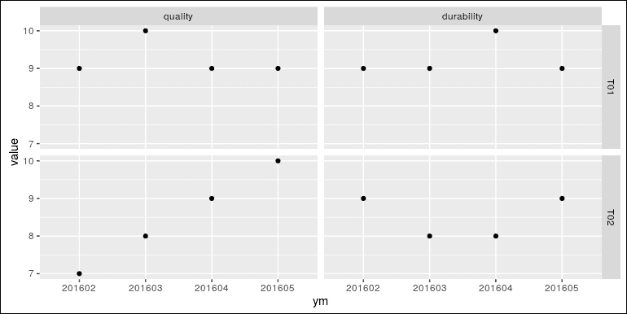
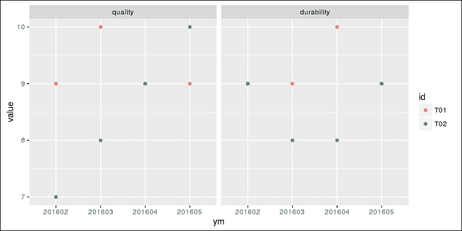
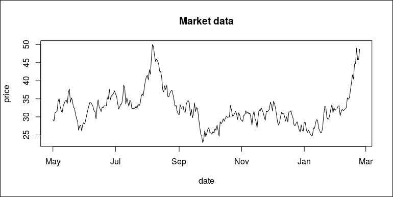
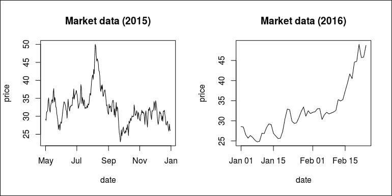
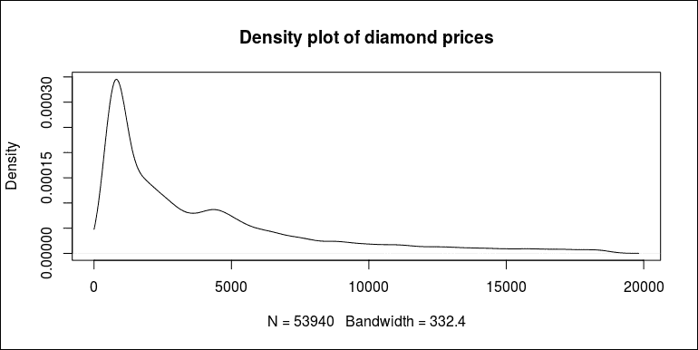

# 第十二章 数据操作

在上一章中，你学习了访问不同类型数据库的方法，例如关系型数据库（SQLite 和 MySQL）和非关系型数据库（MongoDB 和 Redis）。关系型数据库通常以表格形式返回数据，而非关系型数据库可能支持嵌套数据结构和其他功能。

即使数据已经加载到内存中，通常也远未准备好进行数据分析。在这个阶段，大多数数据仍然需要清洗和转换，实际上，这可能占去在应用任何统计模型和可视化之前的大部分时间。在本章中，你将学习到一组内置函数和几个用于数据操作的工具包。这些工具包非常强大。然而，为了更好地使用这些工具包，我们需要对前几章中介绍的知识有一个具体的理解。

在本章中，我们将涵盖以下主题：

+   使用基本函数操作数据框

+   使用 SQL 通过 `sqldf` 包查询数据框

+   使用 `data.table` 操作数据

+   使用 `dplyr` 管道操作数据框

+   使用 `rlist` 处理嵌套数据结构

# 使用内置函数操作数据框

之前，你学习了数据框的基本知识。在这里，我们将回顾用于过滤数据框的内置函数。尽管数据框本质上是一个向量的列表，但由于所有列向量长度相同，我们可以像访问矩阵一样访问它。为了选择满足某些条件的行，我们将提供一个逻辑向量作为 `[]` 的第一个参数，而第二个参数留空。

在 R 中，这些操作可以使用内置函数完成。在本节中，我们将介绍一些最有助于将数据操作成所需形式作为模型输入或用于展示的内置函数。其中一些函数或技术已在之前的章节中介绍过。

本节和随后的部分中的大部分代码都是基于一组关于某些产品的虚构数据。我们将使用 `readr` 包来加载数据，以便更好地处理列类型。如果你还没有安装此包，请运行 `install.packages("readr")`：

```py
library(readr) 
product_info <- read_csv("data/product-info.csv") 
product_info 
##    id      name  type   class released 
## 1 T01    SupCar   toy vehicle      yes 
## 2 T02  SupPlane   toy vehicle       no 
## 3 M01     JeepX model vehicle      yes 
## 4 M02 AircraftX model vehicle      yes 
## 5 M03    Runner model  people      yes 
## 6 M04    Dancer model  people       no 

```

一旦数据以数据框的形式加载到内存中，我们可以查看其列类型：

```py
sapply(product_info, class) 
##          id        name        type       class    released  
## "character" "character" "character" "character" "character" 

```

`readr::read_csv` 参数与内置函数 `read.csv` 的行为不同。例如，它不会自动将字符串列转换为因子（这可能会引起问题，但价值不大）。因此，我建议你使用 `readr` 提供的函数从文件中读取表格数据到 R。如果我们使用 `read.csv` 文件，那么所有这些列都会是具有有限可能值的因子。

## 使用内置函数操作数据框

之前，你学习了数据框的基础知识。在本节中，我们将回顾用于过滤数据框的内置函数。尽管数据框本质上是一系列向量，但由于所有列向量长度相同，我们可以像访问矩阵一样访问它。要选择满足某些条件的行，我们将提供一个逻辑向量作为 `[]` 的第一个参数，而第二个参数留空。在以下示例中，我们将使用我们之前介绍的一系列产品信息和统计数据来演示基本的数据过滤方法和汇总技术。

例如，我们将取出所有 `toy` 类型的行：

```py
product_info[product_info$type == "toy", ] 
##    id     name type   class released 
## 1 T01   SupCar  toy vehicle      yes 
## 2 T02 SupPlane  toy vehicle       no 

```

或者，我们可以取出所有未发布的行：

```py
product_info[product_info$released == "no", ] 
##    id     name  type   class released 
## 2 T02 SupPlane   toy vehicle       no 
## 6 M04   Dancer model  people       no 

```

要过滤列，我们将提供一个字符向量作为第二个参数，而第一个参数留空，这正是我们在子集化矩阵时所做的：

```py
product_info[, c("id", "name", "type")] 
##    id      name  type 
## 1 T01    SupCar   toy 
## 2 T02  SupPlane   toy 
## 3 M01     JeepX model 
## 4 M02 AircraftX model 
## 5 M03    Runner model 
## 6 M04    Dancer model 

```

或者，我们可以将数据框视为列表来过滤数据。我们只提供一个包含列名的字符向量 `[]`，并省略逗号：

```py
product_info[c("id", "name", "class")] 
##    id      name   class 
## 1 T01    SupCar vehicle 
## 2 T02  SupPlane vehicle 
## 3 M01     JeepX vehicle 
## 4 M02 AircraftX vehicle 
## 5 M03    Runner  people 
## 6 M04    Dancer  people 

```

要通过行和列过滤数据框，我们将提供一个向量作为第一个参数来选择行，并提供一个向量作为第二个参数来选择列：

```py
product_info[product_info$type == "toy", c("name", "class", "released")] 
##       name   class released 
## 1   SupCar vehicle      yes 
## 2 SupPlane vehicle       no 

```

如果行过滤条件基于某些列的值，前面的代码可能会非常冗余，尤其是当条件变得更加复杂时。另一个简化代码的内置函数是 `subset`，正如我们之前所介绍的：

```py
subset(product_info,  
  subset = type == "model" & released == "yes", 
  select = name:class) 
##        name  type   class 
## 3     JeepX model vehicle 
## 4 AircraftX model vehicle 
## 5    Runner model  people 

```

`subset` 函数使用非标准评估，这样我们就可以直接使用数据框的列，而无需多次输入 `product_info`，因为表达式是在数据框的上下文中被评估的。

同样，我们可以使用 `with` 在数据框的上下文中评估一个表达式，也就是说，数据框的列可以在表达式中作为符号使用，而无需反复指定数据框：

```py
with(product_info, name[released == "no"]) 
## [1] "SupPlane" "Dancer" 

```

表达式可以不仅仅是简单的子集化。我们可以通过计算向量的每个可能值的出现次数来总结数据。例如，我们可以创建一个记录类型的出现次数表：

```py
with(product_info, table(type[released == "yes"])) 
##  
## model   toy  
##     3     1 

```

除了产品信息表之外，我们还有一个描述每个产品某些属性的产品统计表：

```py
product_stats <- read_csv("data/product-stats.csv")  
product_stats  
##    id material size weight 
## 1 T01    Metal  120   10.0 
## 2 T02    Metal  350   45.0 
## 3 M01 Plastics   50     NA 
## 4 M02 Plastics   85    3.0 
## 5 M03     Wood   15     NA 
## 6 M04     Wood   16    0.6 

```

现在，思考一下我们如何获取最大三个尺寸的产品名称。一种方法是对 `product_stats` 中的记录按尺寸降序排序，选择前三个记录的 `id` 值，并使用这些值通过 `id` 过滤 `product_info` 的行：

```py
top_3_id <- product_stats[order(product_stats$size, decreasing = TRUE), "id"][1:3] 
product_info[product_info$id %in% top_3_id, ] 
##    id      name  type   class released 
## 1 T01    SupCar   toy vehicle      yes 
## 2 T02  SupPlane   toy vehicle       no 
## 4 M02 AircraftX model vehicle      yes 

```

虽然它按预期工作，但这种方法看起来相当冗余。请注意，`product_info` 和 `product_stats` 实际上是从不同角度描述相同产品集合的。这两个表之间的联系是 `id` 列。每个 `id` 都是唯一的，并指代相同的产品。要访问这两组信息，我们可以将两个表合并到一个数据框中。最简单的方法是使用 `merge`：

```py
product_table <- merge(product_info, product_stats, by = "id") 
product_table 
##    id      name  type   class released material size weight 
## 1 M01     JeepX model vehicle      yes Plastics   50     NA 
## 2 M02 AircraftX model vehicle      yes Plastics   85    3.0 
## 3 M03    Runner model  people      yes     Wood   15     NA 
## 4 M04    Dancer model  people       no     Wood   16    0.6 
## 5 T01    SupCar   toy vehicle      yes    Metal  120   10.0 
## 6 T02  SupPlane   toy vehicle       no    Metal  350   45.0 

```

现在，我们创建一个新的数据框，它是`product_table`和`product_info`的合并版本，具有共享的`id`列。实际上，如果你重新排列第二个表中的记录，这两个表仍然可以正确合并。

使用合并版本，我们可以更容易地做事情。例如，使用合并版本，我们可以对任何我们加载的表格中的任何列进行排序，而无需手动处理其他列：

```py
product_table[order(product_table$size), ] 
##    id      name  type   class released material size weight 
## 3 M03    Runner model  people      yes     Wood   15     NA 
## 4 M04    Dancer model  people       no     Wood   16    0.6 
## 1 M01     JeepX model vehicle      yes Plastics   50     NA 
## 2 M02 AircraftX model vehicle      yes Plastics   85    3.0 
## 5 T01    SupCar   toy vehicle      yes    Metal  120   10.0 
## 6 T02  SupPlane   toy vehicle       no    Metal  350   45.0 

```

为了解决问题，我们可以直接使用合并后的表格并得到相同的结果：

```py
product_table[order(product_table$size, decreasing = TRUE), "name"][1:3] 
## [1] "SupPlane"  "SupCar"    "AircraftX" 

```

合并后的数据框允许我们根据一个数据框中的列对记录进行排序，并按另一个数据框中的列过滤记录。例如，我们将首先按重量降序对产品记录进行排序，并选择所有`model`类型的记录：

```py
product_table[order(product_table$weight, decreasing = TRUE), ][ 
  product_table$type == "model",] 
##    id      name  type   class released material size weight 
## 6 T02  SupPlane   toy vehicle       no    Metal  350   45.0 
## 5 T01    SupCar   toy vehicle      yes    Metal  120   10.0 
## 2 M02 AircraftX model vehicle      yes Plastics   85    3.0 
## 4 M04    Dancer model  people       no     Wood   16    0.6 

```

有时，列值是字面值，但可以转换为标准的 R 数据结构以更好地表示数据。例如，`product_info`中的`released`列只接受`yes`和`no`，这可以用逻辑向量更好地表示。我们可以使用`<-`来修改列值，就像你之前学过的那样。然而，通常更好的做法是创建一个新的数据框，其中现有的列已适当调整，并添加了新列，而不污染原始数据。为此，我们可以使用`transform`：

```py
transform(product_table,  
  released = ifelse(released == "yes", TRUE, FALSE), 
  density = weight / size) 
##    id      name  type   class released material size weight 
## 1 M01     JeepX model vehicle     TRUE Plastics   50     NA 
## 2 M02 AircraftX model vehicle     TRUE Plastics   85    3.0 
## 3 M03    Runner model  people     TRUE     Wood   15     NA 
## 4 M04    Dancer model  people    FALSE     Wood   16    0.6 
## 5 T01    SupCar   toy vehicle     TRUE    Metal  120   10.0 
## 6 T02  SupPlane   toy vehicle    FALSE    Metal  350   45.0 
##      density 
## 1         NA 
## 2 0.03529412 
## 3         NA 
## 4 0.03750000 
## 5 0.08333333 
## 6 0.12857143 

```

结果是一个新的数据框，其中`released`被转换为逻辑向量，并添加了一个新的列`density`。你可以轻松验证`product_table`没有被修改。

此外，请注意，`transform`的工作方式与`subset`类似，因为这两个函数都使用非标准评估，允许直接在参数中使用数据框列作为符号，这样我们就不必在所有列前都输入`product_table$`。

在前面的数据中，许多列包含用`NA`表示的缺失值。在许多情况下，我们不想在我们的数据中存在任何缺失值。因此，我们需要以某种方式处理它们。为了展示各种技术，我们将加载另一个包含缺失值的表。这个表是我们之前使用的数据集中每个产品的质量、耐用性和防水测试结果。它是每个产品的质量、耐用性和防水测试结果。我们将数据存储在`product_tests`中：

```py
product_tests <- read_csv("data/product-tests.csv")  
product_tests 
##    id quality durability waterproof 
## 1 T01      NA         10         no 
## 2 T02      10          9         no 
## 3 M01       6          4        yes 
## 4 M02       6          5        yes 
## 5 M03       5         NA        yes 
## 6 M04       6          6        yes 

```

注意，`quality`和`durability`中的值都包含缺失值（`NA`）。为了排除所有包含缺失值的行，我们可以使用`na.omit()`：

```py
na.omit(product_tests) 
##    id quality durability waterproof 
## 2 T02      10          9         no 
## 3 M01       6          4        yes 
## 4 M02       6          5        yes 
## 6 M04       6          6        yes 

```

另一种方法是使用`complete.cases()`来获取一个逻辑向量，指示所有完整行（没有任何缺失值）：

```py
complete.cases(product_tests) 
## [1] FALSE  TRUE  TRUE  TRUE FALSE  TRUE 

```

然后，我们可以使用这个逻辑向量来过滤数据框。例如，我们可以获取所有完整行的`id`：

```py
product_tests[complete.cases(product_tests), "id"] 
## [1] "T02" "M01" "M02" "M04" 

```

或者，我们可以获取所有不完整行的`id`：

```py
product_tests[!complete.cases(product_tests), "id"] 
## [1] "T01" "M03" 

```

注意，`product_info`、`product_stats`和`product_tests`都共享一个`id`列；我们可以将它们全部合并在一起。不幸的是，没有内置的函数可以合并任意数量的数据框。我们一次只能合并两个现有的数据框，或者我们必须递归地合并它们：

```py
product_full <- merge(product_table, product_tests, by = "id") 
product_full 
##    id      name  type   class released material size weight 
## 1 M01     JeepX model vehicle      yes Plastics   50     NA 
## 2 M02 AircraftX model vehicle      yes Plastics   85    3.0 
## 3 M03    Runner model  people      yes     Wood   15     NA 
## 4 M04    Dancer model  people       no     Wood   16    0.6 
## 5 T01    SupCar   toy vehicle      yes    Metal  120   10.0 
## 6 T02  SupPlane   toy vehicle       no    Metal  350   45.0 
##   quality durability waterproof 
## 1       6          4        yes 
## 2       6          5        yes 
## 3       5         NA        yes 
## 4       6          6        yes 
## 5      NA         10         no 
## 6      10          9         no 

```

在完全合并的表中，我们可以使用`tapply`，另一个专门用于处理表格数据的 apply 族函数，通过给定的列使用某些方法来总结数据。例如，我们可以计算每个`type`的`quality`的平均值：

```py
mean_quality1 <- tapply(product_full$quality, 
  list(product_full$type), 
  mean, na.rm = TRUE) 
mean_quality1 
## model   toy  
##  5.75 10.00 

```

注意，我们不仅提供了`mean`，还指定了`na.rm = TRUE`来忽略`quality`中的缺失值。结果看起来像一个数值向量。我们将使用`str()`，让我们看看它的结构：

```py
str(mean_quality1) 
##  num [1:2(1d)] 5.75 10 
##  - attr(*, "dimnames")=List of 1 
##   ..$ : chr [1:2] "model" "toy" 

```

实际上，它是一个一维数组：

```py
is.array(mean_quality1) 
## [1] TRUE 

```

`tapply`函数产生一个数组而不是简单的数值向量，因为它可以很容易地推广到处理多个分组。例如，我们可以计算每个`type`和`class`对的`quality`的平均值：

```py
mean_quality2 <- tapply(product_full$quality,  
  list(product_full$type, product_full$class),  
  mean, na.rm = TRUE) 
mean_quality2 
##       people vehicle 
## model    5.5       6 
## toy       NA      10 

```

现在，我们有一个二维数组，其值可以通过两个参数提取：

```py
mean_quality2["model", "vehicle"] 
## [1] 6 

```

此外，我们可以提供更多用于分组的列。在下面的代码中，我们将使用`with()`函数来减少对`product_full`的冗余输入：

```py
mean_quality3 <- with(product_full, 
  tapply(quality, list(type, material, released), 
    mean, na.rm = TRUE)) 
mean_quality3 
## , , no 
##  
##       Metal Plastics Wood 
## model    NA       NA    6 
## toy      10       NA   NA 
##  
## , , yes 
##  
##       Metal Plastics Wood 
## model    NA        6    5 
## toy     NaN       NA   NA
```

现在，生成了一个三维数组。尽管指定了`na.rm = TRUE`，但许多单元格仍然有缺失值。这是因为分组中没有值：

```py
str(mean_quality3) 
##  num [1:2, 1:3, 1:2] NA 10 NA NA 6 NA NA NaN 6 NA ... 
##  - attr(*, "dimnames")=List of 3 
##   ..$ : chr [1:2] "model" "toy" 
##   ..$ : chr [1:3] "Metal" "Plastics" "Wood" 
##   ..$ : chr [1:2] "no" "yes" 

```

我们可以通过提供三个参数来访问单元格值：

```py
mean_quality3["model", "Wood", "yes"] 
## [1] 5 

```

总结来说，`tapply`使用`n`个指定的变量对输入数据框进行分组，并产生一个具有`n`维度的数组。这种方法总结数据可能很难处理，特别是当有更多用于分组的列时。这主要是因为数组通常是高维的，难以表示，并且不灵活，不适合进一步的操作。在本章的后面部分，你将学习几种不同的方法，这些方法可以使分组总结变得更容易。

## 使用 reshape2 重塑数据框

之前，你学习了如何过滤、排序、合并和总结数据框。这些操作仅在行和列上单独工作。然而，有时我们需要做更复杂的事情。

例如，以下代码加载了两个产品在不同日期上关于质量和耐久性的测试数据集：

```py
toy_tests <- read_csv("data/product-toy-tests.csv") 
toy_tests 
##    id     date sample quality durability 
## 1 T01 20160201    100       9          9 
## 2 T01 20160302    150      10          9 
## 3 T01 20160405    180       9         10 
## 4 T01 20160502    140       9          9 
## 5 T02 20160201     70       7          9 
## 6 T02 20160303     75       8          8 
## 7 T02 20160403     90       9          8 
## 8 T02 20160502     85      10          9 

```

前面的数据框的每一行代表了一个特定产品（`id`）在特定`date`上的测试记录。如果我们需要同时比较两个产品的质量或耐用性，处理这种数据格式可能会很困难。相反，我们需要数据像以下代码那样转换，以便更容易地比较两个产品的值：

```py
date      T01   T02 
20160201    9     9 
20160301    10    9 

```

`reshape2`包就是为了这种转换而设计的。如果您还没有安装它，请运行以下命令：

```py
install.packages("reshape2") 

```

一旦安装了包，我们就可以使用`reshape2::dcast`转换数据，这样我们就可以轻松地比较同一`date`上不同产品的`quality`。更具体地说，它将`toy_tests`重新排列，使得`date`列是共享的，`id`中的值作为列展开，每个`date`和`id`的值是`quality`数据：

```py
library(reshape2) 
toy_quality <- dcast(toy_tests, date ~ id, value.var = "quality") 
toy_quality 
##       date T01 T02 
## 1 20160201   9   7 
## 2 20160302  10  NA 
## 3 20160303  NA   8 
## 4 20160403  NA   9 
## 5 20160405   9  NA 
## 6 20160502   9  10 

```

如您所见，`toy_tests`立即被转换。两个产品的`quality`值与`date`对齐。尽管每个月两个产品都会进行测试，但日期可能并不完全匹配。如果一个产品在某一天有值，而另一个产品在同一天没有相应的值，这会导致缺失值。

填充缺失值的一种方法是用称为**最后观测值前推**（**LOCF**）的方法，这意味着如果一个非缺失值后面跟着一个缺失值，那么非缺失值将被前推以替换缺失值，直到所有后续的缺失值都被替换。`zoo`包提供了一个 LOCF 的实现。如果您还没有安装此包，请运行以下命令进行安装：

```py
install.packages("zoo") 

```

为了演示它是如何工作的，我们将使用`zoo::na.locf()`在具有缺失值的非常简单的数值向量上执行此技术：

```py
zoo::na.locf(c(1, 2, NA, NA, 3, 1, NA, 2, NA)) 
## [1] 1 2 2 2 3 1 1 2 2 

```

显然，所有缺失值都被替换为前面的非缺失值。为了用`T01`和`T02`列的`toy_quality`做同样的事情，我们可以将处理后的向量子赋值给这些列：

```py
toy_quality$T01 <- zoo::na.locf(toy_quality$T01) 
toy_quality$T02 <- zoo::na.locf(toy_quality$T02) 

```

然而，如果`toy_tests`包含成千上万的产品，编写数千行代码来做类似的事情是荒谬的。更好的做法是使用专用的子赋值，如下所示：

```py
toy_quality[-1] <- lapply(toy_quality[-1], zoo::na.locf) 
toy_quality 
##       date T01 T02 
## 1 20160201   9   7 
## 2 20160302  10   7 
## 3 20160303  10   8 
## 4 20160403  10   9 
## 5 20160405   9   9 
## 6 20160502   9  10 

```

我们将使用`lapply()`对`toy_quality`的所有列（除了`date`列）执行 LOCF，并将结果列表分配给没有`date`列的`toy_quality`子集。这是因为数据框的子赋值接受一个列表，并且仍然保留数据框的类。

然而，尽管数据中不包含任何缺失值，但每一行的含义发生了变化。最初，产品`T01`在`20160303`这一天没有进行测试。这个值应该被解释为在该日或之前最后一次质量测试的值。另一个缺点是，在原始数据中，两种产品每个月都会进行测试，但重新排列后的数据框并没有与`date`的常规频率对齐。

修复这些缺点的一种方法是用年月数据而不是确切的日期。在下面的代码中，我们将创建一个新的列`ym`，即`toy_tests`的前 6 个字符。例如，`substr(20160101, 1, 6)`将得到`201601`：

```py
toy_tests$ym <- substr(toy_tests$date, 1, 6) 
toy_tests 
##    id     date sample quality durability     ym 
## 1 T01 20160201    100       9          9 201602 
## 2 T01 20160302    150      10          9 201603 
## 3 T01 20160405    180       9         10 201604 
## 4 T01 20160502    140       9          9 201605 
## 5 T02 20160201     70       7          9 201602 
## 6 T02 20160303     75       8          8 201603 
## 7 T02 20160403     90       9          8 201604 
## 8 T02 20160502     85      10          9 201605 

```

这次，我们将使用`ym`列进行对齐而不是`date`：

```py
toy_quality <- dcast(toy_tests, ym ~ id,  
    value.var = "quality") 
toy_quality 
##       ym T01 T02 
## 1 201602   9   7 
## 2 201603  10   8 
## 3 201604   9   9 
## 4 201605   9  10 

```

现在，缺失值已经消失，每个月两个产品的质量分数自然呈现。

有时，我们需要将多个列组合成一个表示度量，另一个存储值的列。例如，以下代码使用 `reshape2::melt` 将原始数据的两个度量（`quality` 和 `durability`）组合到一个名为 `measure` 的列和一个测量值列中：

```py
toy_tests2 <- melt(toy_tests, id.vars = c("id", "ym"),  
  measure.vars = c("quality", "durability"), 
  variable.name = "measure") 
toy_tests2 
##     id     ym    measure value 
## 1  T01 201602    quality     9 
## 2  T01 201603    quality    10 
## 3  T01 201604    quality     9 
## 4  T01 201605    quality     9 
## 5  T02 201602    quality     7 
## 6  T02 201603    quality     8 
## 7  T02 201604    quality     9 
## 8  T02 201605    quality    10 
## 9  T01 201602 durability     9 
## 10 T01 201603 durability     9 
## 11 T01 201604 durability    10 
## 12 T01 201605 durability     9 
## 13 T02 201602 durability     9 
## 14 T02 201603 durability     8 
## 15 T02 201604 durability     8 
## 16 T02 201605 durability     9 

```

变量名现在包含在数据中，可以直接被一些包使用。例如，我们可以使用 `ggplot2` 来绘制这种格式的数据。以下代码是一个具有不同因素组合的面板网格散点图的示例：

```py
library(ggplot2) 
ggplot(toy_tests2, aes(x = ym, y = value)) +  
  geom_point() + 
  facet_grid(id ~ measure) 

```

然后，我们可以看到一个按产品 `id` 和 `measure` 分组的散点图，其中 `ym` 作为 *x* 值，`value` 作为 *y* 值：



由于分组因素（`measure`）包含在数据中而不是列中，因此绘图可以轻松操作，这从 `ggplot2` 包的角度来看更容易表示：

```py
ggplot(toy_tests2, aes(x = ym, y = value, color = id)) +  
  geom_point() + 
  facet_grid(. ~ measure) 

```

这次，我们将以不同的颜色展示两个产品的点：



# 通过 sqldf 包使用 SQL 查询数据框

在上一章中，你学习了如何编写 SQL 语句来查询诸如 SQLite 和 MySQL 这样的关系型数据库中的数据。有没有一种方法可以直接使用 SQL 来查询 R 中的数据框，就像这些数据框是关系型数据库中的表一样？`sqldf` 包表示这是可能的。

这个包利用了 SQLite 的优势，得益于其轻量级结构和易于嵌入 R 会话的特性。如果你还没有这个包，请运行以下命令来安装它：

```py
install.packages("sqldf") 

```

首先，让我们按照以下代码所示附加该包：

```py
library(sqldf) 
## Loading required package: gsubfn 
## Loading required package: proto 
## Loading required package: RSQLite 
## Loading required package: DBI 

```

注意，当我们附加 `sqldf` 时，会自动加载许多其他包。`sqldf` 包依赖于这些包，因为它基本上是在 R 和 SQLite 之间传输数据和转换数据类型。

然后，我们将重新加载我们在前几节中使用的产品表：

```py
product_info <- read_csv("data/product-info.csv") 
product_stats <- read_csv("data/product-stats.csv") 
product_tests <- read_csv("data/product-tests.csv") 
toy_tests <- read_csv("data/product-toy-tests.csv") 

```

这个包的神奇之处在于我们可以直接使用 SQL 查询我们工作环境中的数据框。例如，我们可以选择 `product_info` 的所有记录：

```py
sqldf("select * from product_info") 
## Loading required package: tcltk 
##    id      name  type   class released 
## 1 T01    SupCar   toy vehicle      yes 
## 2 T02  SupPlane   toy vehicle       no 
## 3 M01     JeepX model vehicle      yes 
## 4 M02 AircraftX model vehicle      yes 
## 5 M03    Runner model  people      yes 
## 6 M04    Dancer model  people       no 

```

`sqldf` 包支持 SQLite 支持的简单选择查询。例如，我们可以选择一组特定的列：

```py
sqldf("select id, name, class from product_info") 
##    id      name   class 
## 1 T01    SupCar vehicle 
## 2 T02  SupPlane vehicle 
## 3 M01     JeepX vehicle 
## 4 M02 AircraftX vehicle 
## 5 M03    Runner  people 
## 6 M04    Dancer  people 

```

我们可以根据特定条件过滤记录：

```py
sqldf("select id, name from product_info where released = 'yes'") 
##    id      name 
## 1 T01    SupCar 
## 2 M01     JeepX 
## 3 M02 AircraftX 
## 4 M03    Runner 

```

我们可以计算一个新的列并给它命名：

```py
sqldf("select id, material, size / weight as density from product_stats") 
##    id material   density 
## 1 T01    Metal 12.000000 
## 2 T02    Metal  7.777778 
## 3 M01 Plastics        NA 
## 4 M02 Plastics 28.333333 
## 5 M03     Wood        NA 
## 6 M04     Wood 26.666667 

```

我们可以按给定顺序对记录进行排序：

```py
sqldf("select * from product_stats order by size desc") 
##    id material size weight 
## 1 T02    Metal  350   45.0 
## 2 T01    Metal  120   10.0 
## 3 M02 Plastics   85    3.0 
## 4 M01 Plastics   50     NA 
## 5 M04     Wood   16    0.6 
## 6 M03     Wood   15     NA 

```

该包还支持查询多个数据框，如 `join`。在以下代码中，我们将通过 `id` 合并 `product_info` 和 `product_stats`，就像我们之前使用 `merge()` 所做的那样：

```py
sqldf("select * from product_info join product_stats using (id)") 
##    id      name  type   class released material size weight 
## 1 T01    SupCar   toy vehicle      yes    Metal  120   10.0 
## 2 T02  SupPlane   toy vehicle       no    Metal  350   45.0 
## 3 M01     JeepX model vehicle      yes Plastics   50     NA 
## 4 M02 AircraftX model vehicle      yes Plastics   85    3.0 
## 5 M03    Runner model  people      yes     Wood   15     NA 
## 6 M04    Dancer model  people       no     Wood   16    0.6 

```

此外，它还支持嵌套查询。在以下代码中，我们将选择所有由木材制成的 `product_info` 中的记录：

```py
sqldf("select * from product_info where id in  
  (select id from product_stats where material = 'Wood')") 
##    id   name  type  class released 
## 1 M03 Runner model people      yes 
## 2 M04 Dancer model people       no 

```

或者，我们可以使用具有相同 `where` 条件的 `join` 来达到相同的目的。对于许多关系型数据库，当数据量大时，`join` 通常比 `in` 更快：

```py
sqldf("select * from product_info join product_stats using (id)  
  where material = 'Wood'") 
##    id   name  type  class released material size weight 
## 1 M03 Runner model people      yes     Wood   15     NA 
## 2 M04 Dancer model people       no     Wood   16    0.6 

```

除了`join`之外，我们还可以轻松地按组汇总数据。例如，我们将`product_tests`按`waterproof`分组为两组：`yes`和`no`。对于每个组，我们分别计算`quality`和`durability`的平均值：

```py
sqldf("select waterproof, avg(quality), avg(durability) from product_tests 
  group by waterproof") 
##   waterproof avg(quality) avg(durability) 
## 1         no        10.00             9.5 
## 2        yes         5.75             5.0 

```

对于`toy_tests`数据，按每个产品汇总数据很容易。以下是一个示例，展示如何计算每个产品随时间变化的`quality`和`durability`值的平均值：

```py
sqldf("select id, avg(quality), avg(durability) from toy_tests  
  group by id") 
##    id avg(quality) avg(durability) 
## 1 T01         9.25            9.25 
## 2 T02         8.50            8.50 

```

为了使结果更加信息丰富，我们可以将`product_info`与分组汇总表连接起来，这样就可以一起展示产品信息和平均度量：

```py
sqldf("select * from product_info join  
  (select id, avg(quality), avg(durability) from toy_tests  
    group by id) using (id)") 
##    id     name type   class released avg(quality) 
## 1 T01   SupCar  toy vehicle      yes         9.25 
## 2 T02 SupPlane  toy vehicle       no         8.50 
##   avg(durability) 
## 1            9.25 
## 2            8.50 

```

使用`sqldf`和 SQL 查询数据框看起来非常方便，但局限性也很明显。

首先，由于`sqldf`默认基于 SQLite，该包的限制也是 SQLite 数据库的限制，即内置的分组聚合函数有限。官方网页([`sqlite.org/lang_aggfunc.html`](https://sqlite.org/lang_aggfunc.html))提供了一系列函数：`avg()`、`count()`、`group_concat()`、`max()`、`min()`、`sum()`和`total()`。如果我们需要更多，例如`quantile()`，那就不会很容易。在 R 中，我们可以使用更先进的算法来聚合列。

第二，由于我们需要提供一个选择语句的字符串来查询数据，当其中一部分由 R 变量确定时，动态生成 SQL 并不方便。因此，我们需要使用`sprintf()`来允许 R 变量的值出现在 SQL 语句中。

第三，`sqldf`的限制也是 SQL 的限制。使用更复杂的算法计算新列比较困难。例如，如果我们需要根据现有的数值列计算排名列，那么实现起来可能不会很容易。然而，在 R 中，我们只需要`order()`。另一件事是，实现更复杂的过滤操作，如基于排名的数据过滤，可能很困难或很冗长。例如，如何根据`material`分组按`size`降序选择前一个或两个产品？这样的查询需要更多的思考和技巧。

然而，如果我们使用`plyr`包，这样的任务就变得轻而易举。如果您已经安装了该包，请运行以下代码：

```py
install.packages("plyr") 

```

为了展示其简单性，我们将使用`plyr::ddply`来完成这个任务。我们将`material`作为数据拆分器，也就是说，`product_stats`根据`material`的每个值被分成几个部分。我们还提供了一个函数来将输入数据框（每个部分）转换为新的数据框。然后，`ddply`函数将这些数据框组合在一起：

```py
plyr::ddply(product_stats, "material",  
  function(x) { 
    head(x[order(x$size, decreasing = TRUE),], 1L) 
  }) 
##    id material size weight 
## 1 T02    Metal  350   45.0 
## 2 M02 Plastics   85    3.0 
## 3 M04     Wood   16    0.6 

```

我们提供的匿名函数使用三个不同的`product_stats`部分调用，每个部分具有不同的`material`，每个部分都有相同的`material`。

另一个例子是选择具有最多样本的前两个测试结果：

```py
plyr::ddply(toy_tests, "id",  
  function(x) { 
    head(x[order(x$sample, decreasing = TRUE), ], 2) 
  }) 
##    id     date sample quality durability 
## 1 T01 20160405    180       9         10 
## 2 T01 20160302    150      10          9 
## 3 T02 20160403     90       9          8 
## 4 T02 20160502     85      10          9 

```

我们提供的匿名函数使用 `toy_tests` 的两部分调用：一部分是 `id` 为 `T01` 的数据框，另一部分是 `T02`。对于每一部分，我们按 `sample` 降序对子数据框进行排序，并取前两条记录。任务很容易完成。

此外，`ddply`、`plyr` 提供了多种输入-输出数据类型对的功能。要了解更多信息，请访问 [`had.co.nz/plyr/`](http://had.co.nz/plyr/) 和 [`github.com/hadley/plyr`](https://github.com/hadley/plyr)。

# 使用 `data.table` 操作数据

在第一部分，我们回顾了一些用于操作数据框的内置函数。然后，我们介绍了 `sqldf`，它使简单的数据查询和汇总变得更容易。然而，这两种方法都有其局限性。使用内置函数可能会很冗长且速度较慢，而且由于 SQL 不如 R 函数的全谱系强大，因此很难汇总数据。

`data.table` 包提供了一种强大的增强版 `data.frame`。它速度极快，能够处理适合内存的大型数据。它通过使用 `[]` 创造了一种自然的数据操作语法。如果您还没有安装此包，请运行以下命令从 CRAN 安装：

```py
install.packages("data.table") 

```

一旦成功安装了包，我们将加载包并查看它提供了什么：

```py
library(data.table) 
##  
## Attaching package: 'data.table' 
## The following objects are masked from 'package:reshape2': 
##  
##     dcast, melt 

```

注意，我们之前加载了 `reshape2` 包，其中定义了 `dcast` 和 `melt`。`data.table` 包也提供了 `dcast` 和 `melt` 的增强版本，具有更强大的功能、更好的性能和更高的内存效率。我们将在本节稍后查看它们。

创建 `data.table` 与创建 `data.frame` 非常相似：

```py
dt <- data.table(x = 1:3, y = rnorm(3), z = letters[1:3]) 
dt 
##    x           y z 
## 1: 1 -0.50219235 a 
## 2: 2  0.13153117 b 
## 3: 3 -0.07891709 c 

```

我们可以使用 `str()` 来查看其结构：

```py
str(dt) 
## Classes 'data.table' and 'data.frame':   3 obs. of  3 variables: 
##  $ x: int  1 2 3 
##  $ y: num  -0.5022 0.1315 -0.0789 
##  $ z: chr  "a" "b" "c" 
##  - attr(*, ".internal.selfref")=<externalptr> 

```

很明显，`dt` 是 `data.table` 和 `data.frame` 类，这意味着 `data.table` 继承自 `data.frame`。换句话说，它继承了 `data.frame` 的一些行为，但作为增强也覆盖了其他行为。

首先，我们仍然加载产品数据。然而，这次我们将使用 `data.table` 包提供的 `fread()`。`fread()` 函数非常快，内存效率高，并直接返回 `data.table`：

```py
product_info <- fread("data/product-info.csv") 
product_stats <- fread("data/product-stats.csv") 
product_tests <- fread("data/product-tests.csv") 
toy_tests <- fread("data/product-toy-tests.csv") 

```

如果我们查看 `product_info`，它的外观与数据框的略有不同：

```py
product_info 
##     id      name  type   class released 
## 1: T01    SupCar   toy vehicle      yes 
## 2: T02  SupPlane   toy vehicle       no 
## 3: M01     JeepX model vehicle      yes 
## 4: M02 AircraftX model vehicle      yes 
## 5: M03    Runner model  people      yes 
## 6: M04    Dancer model  people       no 

```

再次，我们将查看其结构：

```py
str(product_info) 
## Classes 'data.table' and 'data.frame':   6 obs. of  5 variables: 
##  $ id      : chr  "T01" "T02" "M01" "M02" ... 
##  $ name    : chr  "SupCar" "SupPlane" "JeepX" "AircraftX" ... 
##  $ type    : chr  "toy" "toy" "model" "model" ... 
##  $ class   : chr  "vehicle" "vehicle" "vehicle" "vehicle" ... 
##  $ released: chr  "yes" "no" "yes" "yes" ... 
##  - attr(*, ".internal.selfref") =< externalptr> 

```

与 `data.frame` 相比，如果我们只为 `data.table` 的子集提供单个参数，这意味着选择行而不是列：

```py
product_info[1] 
##     id   name type   class released 
## 1: T01 SupCar  toy vehicle      yes 
product_info[1:3] 
##     id     name  type   class released 
## 1: T01   SupCar   toy vehicle      yes 
## 2: T02 SupPlane   toy vehicle       no 
## 3: M01    JeepX model vehicle      yes 

```

如果我们在 `[]` 中提供的数字是负数，这意味着排除记录，这与子集向量的操作完全一致：

```py
product_info[-1] 
##     id      name  type   class released 
## 1: T02  SupPlane   toy vehicle       no 
## 2: M01     JeepX model vehicle      yes 
## 3: M02 AircraftX model vehicle      yes 
## 4: M03    Runner model  people      yes 
## 5: M04    Dancer model  people       no 

```

此外，`data.table` 还提供了一些表示 `data.table` 重要组件的符号。其中最有用的符号之一是 `.N`，它表示行数。如果我们想选择最后一行，我们不再需要 `nrow(product_info)`：

```py
product_info[.N] 
##     id   name  type  class released 
## 1: M04 Dancer model people       no 

```

我们可以轻松地选择第一行和最后一行：

```py
product_info[c(1, .N)] 
##     id   name  type   class released 
## 1: T01 SupCar   toy vehicle      yes 
## 2: M04 Dancer model  people       no 

```

`data.table` 子集的语法会自动评估数据上下文中的表达式，即我们可以直接使用列名作为符号，就像我们使用 `subset`、`transform` 和 `with` 一样。例如，我们可以直接使用 `released` 作为第一个参数来选择已发布产品的行：

```py
product_info[released == "yes"] 
##     id      name  type   class released 
## 1: T01    SupCar   toy vehicle      yes 
## 2: M01     JeepX model vehicle      yes 
## 3: M02 AircraftX model vehicle      yes 
## 4: M03    Runner model  people      yes 

```

方括号中的第一个参数是一个行过滤器，而第二个参数在过滤数据的上下文中进行评估。例如，我们可以直接使用 `id` 来代表 `product_info$id`，因为 `id` 在 `product_info` 的上下文中进行评估：

```py
product_info[released == "yes", id] 
## [1] "T01" "M01" "M02" "M03" 

```

选择数据框列的方法在这里不适用。如果我们把一个字符向量放在第二个参数中，那么我们会得到一个字符向量本身，因为字符串确实是一个字符串：

```py
product_info[released == "yes", "id"] 
## [1] "id" 

```

要禁用此行为，我们可以指定 `with = FALSE`，这样第二个参数接受一个字符向量来选择列，并且无论指定多少列，它总是返回一个 `data.table`：

```py
product_info[released == "yes", "id", with = FALSE] 
##     id 
## 1: T01 
## 2: M01 
## 3: M02 
## 4: M03 
product_info[released == "yes", c("id", "name"), with = FALSE] 
##     id      name 
## 1: T01    SupCar 
## 2: M01     JeepX 
## 3: M02 AircraftX 
## 4: M03    Runner 

```

我们也可以将一些其他表达式作为第二个参数。例如，我们可以生成一个按 `type` 和 `class` 的组合生成的发布产品数量的表格：

```py
product_info[released == "yes", table(type, class)] 
##        class 
## type    people vehicle 
##   model      1       2 
##   toy        0       1 

```

然而，如果生成了一个列表，它将被转换为 `data.table`：

```py
product_info[released == "yes", list(id, name)] 
##     id      name 
## 1: T01    SupCar 
## 2: M01     JeepX 
## 3: M02 AircraftX 
## 4: M03    Runner 

```

这样，我们可以轻松地创建一个新的 `data.table` 包，并用现有列替换：

```py
product_info[, list(id, name, released = released == "yes")] 
##     id      name released 
## 1: T01    SupCar     TRUE 
## 2: T02  SupPlane    FALSE 
## 3: M01     JeepX     TRUE 
## 4: M02 AircraftX     TRUE 
## 5: M03    Runner     TRUE 
## 6: M04    Dancer    FALSE 

```

我们也可以轻松地基于现有列创建一个新的 `data.table` 包，并添加新列：

```py
product_stats[, list(id, material, size, weight,  
  density = size / weight)] 
##     id material size weight   density 
## 1: T01    Metal  120   10.0 12.000000 
## 2: T02    Metal  350   45.0  7.777778 
## 3: M01 Plastics   50     NA        NA 
## 4: M02 Plastics   85    3.0 28.333333 
## 5: M03     Wood   15     NA        NA 
## 6: M04     Wood   16    0.6 26.666667 

```

为了简化，`data.table` 提供了 `.()` 来代表 `list()`：

```py
product_info[, .(id, name, type, class)] 
##     id      name  type   class 
## 1: T01    SupCar   toy vehicle 
## 2: T02  SupPlane   toy vehicle 
## 3: M01     JeepX model vehicle 
## 4: M02 AircraftX model vehicle 
## 5: M03    Runner model  people 
## 6: M04    Dancer model  people 
product_info[released == "yes", .(id, name)] 
##     id      name 
## 1: T01    SupCar 
## 2: M01     JeepX 
## 3: M02 AircraftX 
## 4: M03    Runner 

```

通过提供有序索引，我们可以轻松地按给定标准对记录进行排序：

```py
product_stats[order(size, decreasing = TRUE)] 
##     id material size weight 
## 1: T02    Metal  350   45.0 
## 2: T01    Metal  120   10.0 
## 3: M02 Plastics   85    3.0 
## 4: M01 Plastics   50     NA 
## 5: M04     Wood   16    0.6 
## 6: M03     Wood   15     NA 

```

以前，我们总是在子集化后创建一个新的 `data.table` 包。`data.table` 包还提供了 `:=` 用于列的就地赋值。例如，`product_stats` 的原始数据如下所示：

```py
product_stats 
##     id material size weight 
## 1: T01    Metal  120   10.0 
## 2: T02    Metal  350   45.0 
## 3: M01 Plastics   50     NA 
## 4: M02 Plastics   85    3.0 
## 5: M03     Wood   15     NA 
## 6: M04     Wood   16    0.6 

```

我们将使用 `:=` 在 `product_stats` 中直接创建一个新列：

```py
product_stats[, density := size / weight] 

```

这里没有显示任何内容，但原始的 `data.table` 包已被修改：

```py
product_stats 
##     id material size weight   density 
## 1: T01    Metal  120   10.0 12.000000 
## 2: T02    Metal  350   45.0  7.777778 
## 3: M01 Plastics   50     NA        NA 
## 4: M02 Plastics   85    3.0 28.333333 
## 5: M03     Wood   15     NA        NA 
## 6: M04     Wood   16    0.6 26.666667 

```

我们可以使用 `:=` 来替换现有列：

```py
product_info[, released := released == "yes"] 
product_info 
##     id      name  type   class released 
## 1: T01    SupCar   toy vehicle     TRUE 
## 2: T02  SupPlane   toy vehicle    FALSE 
## 3: M01     JeepX model vehicle     TRUE 
## 4: M02 AircraftX model vehicle     TRUE 
## 5: M03    Runner model  people     TRUE 
## 6: M04    Dancer model  people    FALSE 

```

`data.table` 包提供 `:=` 主要是因为就地修改具有更高的性能，因为它避免了数据的不必要复制。

## 使用键访问行

`data.table` 的另一个独特特性是支持索引，即我们可以在 `data.table` 上创建键，因此通过键访问记录可以非常高效。例如，我们将使用 `setkey()` 将 `id` 设置为 `product_info` 的键：

```py
setkey(product_info, id) 

```

注意，该函数的行为与大多数 R 函数非常不同。它不会返回数据表的新副本，而是直接在原始输入上安装一个键。然而，数据框看起来没有变化：

```py
product_info 
##     id      name  type   class released 
## 1: M01     JeepX model vehicle     TRUE 
## 2: M02 AircraftX model vehicle     TRUE 
## 3: M03    Runner model  people     TRUE 
## 4: M04    Dancer model  people    FALSE 
## 5: T01    SupCar   toy vehicle     TRUE 
## 6: T02  SupPlane   toy vehicle    FALSE 

```

此外，它的键也被创建：

```py
key(product_info) 
## [1] "id" 

```

现在，我们可以使用键来访问 `product_info` 中的记录。例如，我们可以直接写入一个 `id` 的值来获取具有该 `id` 的记录：

```py
product_info["M01"] 
##     id  name  type   class released 
## 1: M01 JeepX model vehicle     TRUE 

```

如果我们在没有键的 `data.table` 包上使用此操作，将发生错误并提示您设置键：

```py
product_stats["M01"] 
## Error in `[.data.table`(product_stats, "M01"): When i is a data.table (or character vector), x must be keyed (i.e. sorted, and, marked as sorted) so data.table knows which columns to join to and take advantage of x being sorted. Call setkey(x,...) first, see ?setkey. 

```

我们也可以使用 `setkeyv()` 来设置键，但它只接受字符向量：

```py
setkeyv(product_stats, "id") 

```

如果我们有一个动态确定的向量作为键，这个函数将更容易使用。现在，我们可以使用键来访问 `product_stats`：

```py
product_stats["M02"] 
##     id material size weight  density 
## 1: M02 Plastics   85      3 28.33333 

```

如果两个表有相同的键，我们可以轻松地将它们连接起来：

```py
product_info[product_stats] 
##     id      name  type   class released material size 
## 1: M01     JeepX model vehicle     TRUE Plastics   50 
## 2: M02 AircraftX model vehicle     TRUE Plastics   85 
## 3: M03    Runner model  people     TRUE     Wood   15 
## 4: M04    Dancer model  people    FALSE     Wood   16 
## 5: T01    SupCar   toy vehicle     TRUE    Metal  120 
## 6: T02  SupPlane   toy vehicle    FALSE    Metal  350 
##    weight   density 
## 1:     NA        NA 
## 2:    3.0 28.333333 
## 3:     NA        NA 
## 4:    0.6 26.666667 
## 5:   10.0 12.000000 
## 6:   45.0  7.777778 

```

`data.table` 包的键可以包含多个元素。例如，为了定位 `toy_tests` 的记录，我们需要指定 `id` 和 `date`。在下面的代码中，我们将为 `toy_tests` 设置两个列的键：

```py
setkey(toy_tests, id, date) 

```

现在，我们可以通过提供键中的两个元素来获取一行：

```py
toy_tests[.("T01", 20160201)] 
##     id     date sample quality durability 
## 1: T01 20160201    100       9          9 

```

如果我们只提供第一个元素，我们将得到一个数据子集，其中包含所有与第一个元素匹配的记录：

```py
toy_tests["T01"] 
##     id     date sample quality durability 
## 1: T01 20160201    100       9          9 
## 2: T01 20160302    150      10          9 
## 3: T01 20160405    180       9         10 
## 4: T01 20160502    140       9          9 

```

然而，如果我们只提供第二个元素，我们除了错误之外什么也得不到。这是因为背后的算法要求键是有序的：

```py
toy_tests[.(20160201)] 
## Error in bmerge(i, x, leftcols, rightcols, io, xo, roll, rollends, nomatch, : x.'id' is a character column being joined to i.'V1' which is type 'double'. Character columns must join to factor or character columns. 

```

此外，如果我们提供一个错误的键顺序，我们无法获取任何数据：

```py
toy_tests[.(20160201, "T01")] 
## Error in bmerge(i, x, leftcols, rightcols, io, xo, roll, rollends, nomatch, : x.'id' is a character column being joined to i.'V1' which is type 'double'. Character columns must join to factor or character columns. 

```

## 按组汇总数据

子集化 `data.table` 的另一个重要参数是 `by`，它用于将数据分割成多个部分，并对每个部分评估第二个参数。在本节中，我们将演示 `by` 语法如何使按组汇总数据变得更加容易。例如，`by` 的最简单用法是计算每个组中的记录数。在下面的代码中，我们将计算已发布和未发布产品的数量：

```py
product_info[, .N, by = released] 
##    released N 
## 1:     TRUE 4 
## 2:    FALSE 2 

```

组可以由多个变量定义。例如，`type` 和 `class` 的元组可以是一个组，并且对于每个组，我们将计算记录数：

```py
product_info[, .N, by = .(type, class)] 
##     type   class N 
## 1: model vehicle 2 
## 2: model  people 2 
## 3:   toy vehicle 2 

```

我们也可以为每个组执行统计计算。在这里，我们将计算防水产品和非防水产品的质量平均值：

```py
product_tests[, mean(quality, na.rm = TRUE),  
  by = .(waterproof)] 
##    waterproof    V1 
## 1:         no 10.00 
## 2:        yes  5.75 

```

注意，平均值存储在 `V1` 中，因为我们没有为该列提供名称，因此包使用了其默认列名。为了避免这种情况，我们将使用形式为 `.(y = f(x))` 的表达式：

```py
product_tests[, .(mean_quality = mean(quality, na.rm = TRUE)), 
  by = .(waterproof)] 
##    waterproof mean_quality 
## 1:         no        10.00 
## 2:        yes         5.75 

```

我们可以依次链式使用多个 `[]`。在以下示例中，我们将首先通过共享键 `id` 将 `product_info` 和 `product_tests` 连接起来，然后计算已发布产品中 `type` 和 `class` 每个组的 `quality` 和 `durability` 的平均值：

```py
product_info[product_tests][released == TRUE, 
  .(mean_quality = mean(quality, na.rm = TRUE), 
    mean_durability = mean(durability, na.rm = TRUE)), 
  by = .(type, class)] 
##     type   class mean_quality mean_durability 
## 1:   toy vehicle          NaN            10.0 
## 2: model vehicle            6             4.5 
## 3: model  people            5             NaN 

```

注意，`by` 列的值在结果 `data.table` 中将是唯一的。我们可以使用 `keyby` 代替 `by` 来确保它自动用作结果 `data.table` 的键：

```py
type_class_tests <- product_info[product_tests][released == TRUE, 
  .(mean_quality = mean(quality, na.rm = TRUE), 
    mean_durability = mean(durability, na.rm = TRUE)), 
  keyby = .(type, class)] 
type_class_tests 
##     type   class mean_quality mean_durability 
## 1: model  people            5             NaN 
## 2: model vehicle            6             4.5 
## 3:   toy vehicle          NaN            10.0 
key(type_class_tests) 
## [1] "type"  "class" 

```

然后，我们可以直接使用键值的元组来访问记录：

```py
type_class_tests[.("model", "vehicle"), mean_quality] 
## [1] 6 

```

您可以清楚地看到，当我们试图在表中查找特定记录时，使用键比使用逻辑比较要方便得多。然而，它的真正优势尚未体现，因为数据量不够大。对于大量数据，使用键搜索记录可以比迭代逻辑比较快得多，因为键搜索利用了二分搜索，而迭代则浪费了大量时间进行不必要的计算。

这里有一个例子来做一个对比。首先，我们将创建一个包含 1000 万行、索引列`id`和两个填充随机数的数值列的数据：

```py
n <- 10000000 
test1 <- data.frame(id = 1:n, x = rnorm(n), y = rnorm(n)) 

```

现在，我们想找到`id`为`8765432`的行。让我们看看这需要多长时间：

```py
system.time(row <- test1[test1$id == 876543, ]) 
##    user  system elapsed  
##   0.156   0.036   0.192 
row 
##            id          x        y 
## 876543 876543 0.02300419 1.291588 

```

这似乎没什么大不了的，但假设你需要频繁地这样做，比如说每秒几百次，那么你的机器就无法及时返回结果。

然后，我们将使用`data.table`来完成这个任务。首先，我们将调用`setDT()`将`data.frame`转换为`data.table`。这个函数会对对象进行一些魔法般的转换，就地转换，不创建副本。当我们使用`setDT()`函数时，我们还提供了一个键`id`，以便结果`data.table`以`id`作为其键列：

```py
setDT(test1, key = "id") 
class(test1) 
## [1] "data.table" "data.frame" 

```

现在，`test1`已转换为`data.table`。然后，我们将搜索相同的元素：

```py
system.time(row <- test1[.(8765432)]) 
##    user  system elapsed  
##   0.000   0.000   0.001 
row 
##         id         x         y 
## 1: 8765432 0.2532357 -2.121696 

```

结果相同，但`data.table`所需的时间比`data.frame`短得多。

## 重塑 data.table

之前，你学习了如何使用`reshape2`包重塑数据框。`data.table`包为`data.table`对象提供了更快、更强大的`dcast`和`melt`实现。

例如，我们将通过将每个产品的质量分数与年月元组对齐来重塑`toy_tests`。

```py
toy_tests[, ym := substr(date, 1, 6)] 
toy_quality <- dcast(toy_tests, ym ~ id, value.var = "quality") 
toy_quality 
##        ym T01 T02 
## 1: 201602   9   7 
## 2: 201603  10   8 
## 3: 201604   9   9 
## 4: 201605   9  10 

```

首先，我们在`toy_tests`中直接使用`:=`创建了一个新的列`ym`，并使用`dcast`以与之前`reshape2`的示例相同的方式进行转换。结果看起来与`reshape2::dcast`对`data.frame`的输出相同。

虽然`reshape2::dcast`不支持多值`value.var`，但`data.table::dcast`可以处理多个值变量，如下所示：

```py
toy_tests2 <- dcast(toy_tests, ym ~ id, value.var = c("quality", "durability")) 
toy_tests2 
##        ym quality_T01 quality_T02 durability_T01 
## 1: 201602           9           7              9 
## 2: 201603          10           8              9 
## 3: 201604           9           9             10 
## 4: 201605           9          10              9 
##    durability_T02 
## 1:              9 
## 2:              8 
## 3:              8 
## 4:              9 

```

除了第一个之外，列名不再是`id`的值，而是由下划线符号连接的`id`值变量。此外，输出`data.table`的键自动设置为重塑公式`ym ~ id`左侧出现的变量：

```py
key(toy_tests2) 
## [1] "ym" 

```

键意味着我们可以通过提供一个`ym`的值直接访问记录。然而，以下代码最终导致错误：

```py
toy_tests2[.(201602)] 
## Error in bmerge(i, x, leftcols, rightcols, io, xo, roll, rollends, nomatch, : x.'ym' is a character column being joined to i.'V1' which is type 'double'. Character columns must join to factor or character columns. 

```

数据类型存在问题。我们可以运行以下代码来查看每列的数据类型：

```py
sapply(toy_tests2, class) 
##             ym    quality_T01    quality_T02 durability_T01  
##    "character"      "integer"      "integer"      "integer"  
## durability_T02  
##      "integer" 

```

问题出在`ym`的类上。它是一个字符向量，但我们提供了一个数值型键。因此，由于数据类型不匹配，搜索失败。如果我们提供一个字符串，我们就可以得到相应的记录：

```py
toy_tests2["201602"] 
##        ym quality_T01 quality_T02 durability_T01 
## 1: 201602           9           7              9 
##    durability_T02 
## 1:              9 

```

但`ym`最初是如何成为字符向量的？回想一下`ym := substr(date, 1, 6)`，其中`date`是一个整数向量，但`substr()`会将`date`强制转换为字符向量，然后取出前六个字符。因此，结果是字符向量是自然的。这简单地如下所示：

```py
class(20160101) 
## [1] "numeric" 
class(substr(20160101, 1, 6)) 
## [1] "character" 

```

这里的问题是，我们需要注意关键列的数据类型。

## 使用就地设置函数

如果我们使用 `data.frame`，更改名称或列顺序将导致数据结构副本。在最近的 R 版本中，当我们重命名列时，复制的次数较少，但仍然很难在不创建新副本的情况下重新排序数据框的列。当数据量较小时，这通常不会成为问题，但如果数据量非常大，它施加的性能和内存压力可能真的成为一个问题。

`data.table` 是 `data.frame` 的增强版本，提供了一组具有引用语义的 `set` 函数，即它们就地修改 `data.table` 并避免不必要的复制，从而展现出惊人的性能。

以 `product_stats` 为例。我们可以调用 `setDF()` 在不创建副本的情况下就地将 `data.table` 转换为 `data.frame`：

```py
product_stats 
##     id material size weight   density 
## 1: M01 Plastics   50     NA        NA 
## 2: M02 Plastics   85    3.0 28.333333 
## 3: M03     Wood   15     NA        NA 
## 4: M04     Wood   16    0.6 26.666667 
## 5: T01    Metal  120   10.0 12.000000 
## 6: T02    Metal  350   45.0  7.777778 
setDF(product_stats) 
class(product_stats) 
## [1] "data.frame" 

```

我们可以通过调用 `setDT()` 将任何 `data.frame` 转换为 `data.table`，并如果指定的话设置一个键：

```py
setDT(product_stats, key = "id") 
class(product_stats) 
## [1] "data.table" "data.frame" 

```

我们可以通过调用 `setnames` 来更改指定列的名称为其新名称：

```py
setnames(product_stats, "size", "volume") 
product_stats 
##     id material volume weight   density 
## 1: M01 Plastics     50     NA        NA 
## 2: M02 Plastics     85    3.0 28.333333 
## 3: M03     Wood     15     NA        NA 
## 4: M04     Wood     16    0.6 26.666667 
## 5: T01    Metal    120   10.0 12.000000 
## 6: T02    Metal    350   45.0  7.777778 

```

如果我们添加一个新列，该列应作为最后一列出现。例如，我们将使用代表 `1:.N` 的 `.I` 为所有行添加一个索引列：

```py
product_stats[, i := .I] 
product_stats 
##     id material volume weight   density i 
## 1: M01 Plastics     50     NA        NA 1 
## 2: M02 Plastics     85    3.0 28.333333 2 
## 3: M03     Wood     15     NA        NA 3 
## 4: M04     Wood     16    0.6 26.666667 4 
## 5: T01    Metal    120   10.0 12.000000 5 
## 6: T02    Metal    350   45.0  7.777778 6 

```

按照惯例，索引列在大多数情况下应作为第一列出现。我们可以向 `setcolorder()` 提供新的列名顺序，以便直接重新排序列而不创建副本：

```py
setcolorder(product_stats,  
  c("i", "id", "material", "weight", "volume", "density")) 
product_stats 
##    i  id material weight volume   density 
## 1: 1 M01 Plastics     NA     50        NA 
## 2: 2 M02 Plastics    3.0     85 28.333333 
## 3: 3 M03     Wood     NA     15        NA 
## 4: 4 M04     Wood    0.6     16 26.666667 
## 5: 5 T01    Metal   10.0    120 12.000000 
## 6: 6 T02    Metal   45.0    350  7.777778 

```

## 理解 data.table 的动态作用域

`data.table` 最常用的语法是 `data[i, j, by]`，其中 `i`、`j` 和 `by` 都使用动态作用域进行评估。换句话说，我们不仅可以直接使用列，还可以使用预定义的符号，如 `.N`、`.I` 和 `.SD` 来引用数据的重要组件，以及可以在调用环境中访问的符号和函数。

在演示这一点之前，我们将创建一个新的名为 `market_data` 的 `data.table`，其中包含连续的 `date` 列：

```py
market_data <- data.table(date = as.Date("2015-05-01") + 0:299) 
head(market_data) 
##          date 
## 1: 2015-05-01 
## 2: 2015-05-02 
## 3: 2015-05-03 
## 4: 2015-05-04 
## 5: 2015-05-05 
## 6: 2015-05-06 

```

然后，我们将通过调用 `:=` 作为函数来向 `market_data` 添加两个新列：

```py
set.seed(123) 
market_data[, `:=`( 
  price = round(30 * cumprod(1 + rnorm(300, 0.001, 0.05)), 2), 
  volume = rbinom(300, 5000, 0.8) 
)] 

```

注意，`price` 是一个简单的随机游走，而 `volume` 是从二项分布中随机抽取的：

```py
head(market_data) 
##          date price volume 
## 1: 2015-05-01 29.19   4021 
## 2: 2015-05-02 28.88   4000 
## 3: 2015-05-03 31.16   4033 
## 4: 2015-05-04 31.30   4036 
## 5: 2015-05-05 31.54   3995 
## 6: 2015-05-06 34.27   3955 

```

然后，我们将绘制数据：

```py
plot(price ~ date, data = market_data,  
  type = "l", 
  main = "Market data") 

```

生成的图表如下所示：



一旦数据准备就绪，我们就可以汇总数据，看看动态作用域如何被用来使事情变得更简单。

首先，我们将查看 `date` 列的范围：

```py
market_data[, range(date)] 
## [1] "2015-05-01" "2016-02-24" 

```

通过分组聚合，数据可以轻松地减少到每月的 **开盘价-最高价-最低价-收盘价**（**OHLC**）数据：

```py
monthly <- market_data[,  
  .(open = price[[1]], high = max(price),  
    low = min(price), close = price[[.N]]), 
  keyby = .(year = year(date), month = month(date))] 
head(monthly) 
##    year month  open  high   low close 
## 1: 2015     5 29.19 37.71 26.15 28.44 
## 2: 2015     6 28.05 37.63 28.05 37.21 
## 3: 2015     7 36.32 40.99 32.13 40.99 
## 4: 2015     8 41.52 50.00 30.90 30.90 
## 5: 2015     9 30.54 34.46 22.89 27.02 
## 6: 2015    10 25.68 33.18 24.65 29.32 

```

在 `j` 表达式中，我们可以通过按 `year` 和 `month` 分组每个 `data.table` 来生成一个 OHLC 记录。如果 `j` 的输出是 `list`、`data.frame` 或 `data.table`，则输出将堆叠在一起，最终形成一个 `data.table`。

实际上，`j` 表达式可以是任何内容，甚至当指定了 `by` 时也是如此。更具体地说，`j` 在每个 `data.table` 的上下文中被评估，作为原始数据的一个子集，该子集由 `by` 表达式的值分割。例如，以下代码不是按组聚合数据，而是为每年的价格绘制图表：

```py
oldpar <- par(mfrow = c(1, 2)) 
market_data[, { 
  plot(price ~ date, type = "l", 
    main = sprintf("Market data (%d)", year)) 
}, by = .(year = year(date))] 
par(oldpar) 

```

生成的图表如下所示：



注意，我们没有指定 `plot` 的 `data` 参数，因为它在按 `year` 分组的 `market_data` 上下文中进行评估，其中 `price` 和 `date` 已经定义。

此外，`j` 表达式可以是模型拟合代码。以下是一个批量拟合线性模型的示例。首先，我们将从 `ggplot2` 包中加载 `diamonds` 数据：

```py
data("diamonds", package = "ggplot2") 
setDT(diamonds) 
head(diamonds) 
##    carat       cut color clarity depth table price    x 
## 1:  0.23     Ideal     E     SI2  61.5    55   326 3.95 
## 2:  0.21   Premium     E     SI1  59.8    61   326 3.89 
## 3:  0.23      Good     E     VS1  56.9    65   327 4.05 
## 4:  0.29   Premium     I     VS2  62.4    58   334 4.20 
## 5:  0.31      Good     J     SI2  63.3    58   335 4.34 
## 6:  0.24 Very Good     J    VVS2  62.8    57   336 3.94 
##       y    z 
## 1: 3.98 2.43 
## 2: 3.84 2.31 
## 3: 4.07 2.31 
## 4: 4.23 2.63 
## 5: 4.35 2.75 
## 6: 3.96 2.48 

```

数据包含 53940 条钻石记录，具有 10 个属性。在这里，我们将对每个 `cut` 组拟合线性回归模型，以查看 `carat` 和 `depth` 如何为每个组提供 `log(price)` 的信息。

在以下代码中，`j` 表达式涉及拟合线性模型并将其系数强制转换为列表。请注意，`j` 表达式为 `keyby` 表达式的每个值进行评估。由于返回了一个列表，因此每个组的估计线性系数将堆叠为一个 `data.table`，如下所示：

```py
diamonds[, { 
  m <- lm(log(price) ~ carat + depth) 
  as.list(coef(m)) 
}, keyby = .(cut)] 
##          cut (Intercept)    carat        depth 
## 1:      Fair    7.730010 1.264588 -0.014982439 
## 2:      Good    7.077469 1.973600 -0.014601101 
## 3: Very Good    6.293642 2.087957 -0.002890208 
## 4:   Premium    5.934310 1.852778  0.005939651 
## 5:     Ideal    8.495409 2.125605 -0.038080022 

```

动态作用域还允许我们结合使用在 `data.table` 内部或外部预定义的符号。例如，我们可以定义一个函数来计算 `market_data` 中用户定义列的年度平均值：

```py
average <- function(column) { 
  market_data[, .(average = mean(.SD[[column]])), 
    by = .(year = year(date))] 
} 

```

在前面的 `j` 表达式中，`.SD` 表示每个 `year` 值的分组 `data.table`。我们可以使用 `.SD[[x]]` 来提取列 `x` 的值，就像从列表中按名称提取元素一样。

然后，我们可以运行以下代码来计算每年平均价格：

```py
average("price") 
##    year  average 
## 1: 2015 32.32531 
## 2: 2016 32.38364 

```

我们只需将参数更改为 `volume`，就可以计算每年的平均数量：

```py
average("volume") 
##    year  average 
## 1: 2015 3999.931 
## 2: 2016 4003.382 

```

此外，我们可以使用特别发明的语法来创建具有动态数量的列，这些列的名称也是动态确定的。

假设我们添加了三个新的替代价格列，每个列都向原始 `price` 值添加了一些随机噪声。我们不必重复调用 `market_data[, price1 := ...]` 和 `market_data[, price2 := ...]`，而是可以使用 `market_data[, (columns) := list(...)]` 来动态设置列，其中 `columns` 是列名的字符向量，`list(...)` 是 `columns` 中每个相应列的值：

```py
price_cols <- paste0("price", 1:3) 
market_data[, (price_cols) := lapply(1:3,  
  function(i) round(price + rnorm(.N, 0, 5), 2))] 
head(market_data) 
##          date price volume price1 price2 price3 
## 1: 2015-05-01 29.19   4021  30.55  27.39  33.22 
## 2: 2015-05-02 28.88   4000  29.67  20.45  36.00 
## 3: 2015-05-03 31.16   4033  34.31  26.94  27.24 
## 4: 2015-05-04 31.30   4036  29.32  29.01  28.04 
## 5: 2015-05-05 31.54   3995  36.04  32.06  34.79 
## 6: 2015-05-06 34.27   3955  30.12  30.96  35.19 

```

另一方面，如果我们得到一个具有许多列的表，并且我们需要对其中的一小部分进行一些计算，我们也可以使用类似的语法来解决问题。想象一下，价格相关的列可能存在缺失值。我们需要对每个价格列执行 `zoo::na.locf()`。首先，我们将使用正则表达式获取所有价格列：

```py
cols <- colnames(market_data) 
price_cols <- cols[grep("^price", cols)] 
price_cols 
## [1] "price"  "price1" "price2" "price3" 

```

然后，我们将使用类似的语法，但添加一个额外的参数`.SDcols = price_cols`，以限制`.SD`的列仅为我们获取的价格列。以下代码对每个价格列调用`zoo::na.locf()`，并替换每个列的旧值：

```py
market_data[, (price_cols) := lapply(.SD, zoo::na.locf), 
  .SDcols = price_cols] 

```

在本节中，我们展示了`data.table`的使用方法以及它如何使数据处理变得更加容易。要查看`data.table`的完整功能列表，请访问[`github.com/Rdatatable/data.table/wiki`](https://github.com/Rdatatable/data.table/wiki)。要快速复习使用方法，请查看数据表速查表([`www.datacamp.com/community/tutorials/data-table-cheat-sheet`](https://www.datacamp.com/community/tutorials/data-table-cheat-sheet))。

# 使用 dplyr 管道操作数据框

另一个流行的包是`dplyr`，它发明了一种数据处理语法。而不是使用子集函数（`[]`），`dplyr`定义了一组基本`erb`函数作为数据操作的基本构建块，并引入了一个管道操作符来将这些函数链接起来以执行复杂的多步骤任务。

如果您还没有安装`dplyr`，请运行以下代码从 CRAN 安装：

```py
install.packages("dplyr") 

```

首先，我们将重新加载产品表以重置所有数据到其原始形式：

```py
library(readr) 
product_info <- read_csv("data/product-info.csv") 
product_stats <- read_csv("data/product-stats.csv") 
product_tests <- read_csv("data/product-tests.csv") 
toy_tests <- read_csv("data/product-toy-tests.csv") 

```

然后，我们将加载`dplyr`包：

```py
library(dplyr) 
##  
## Attaching package: 'dplyr' 
## The following objects are masked from 'package:data.table': 
##  
##     between, last 
## The following objects are masked from 'package:stats': 
##  
##     filter, lag 
## The following objects are masked from 'package:base': 
##  
##     intersect, setdiff, setequal, union 

```

以下输出表明`dplyr`泛化了许多内置函数，因此在包附加后它们会被遮蔽。

现在，我们可以开始使用它提供的动词函数进行操作。首先，我们将使用`select`通过创建一个包含给定列的新表来从提供的数据框中选择列：

```py
select(product_info, id, name, type, class) 
## Source: local data frame [6 x 4] 
##  
##      id      name  type   class 
##   (chr)     (chr) (chr)   (chr) 
## 1   T01    SupCar   toy vehicle 
## 2   T02  SupPlane   toy vehicle 
## 3   M01     JeepX model vehicle 
## 4   M02 AircraftX model vehicle 
## 5   M03    Runner model  people 
## 6   M04    Dancer model  people 

```

前一个表的打印方式与`data.frame`和`data.table`的打印方式略有不同。它不仅显示了表本身，还包括一个标题，指示数据框的大小以及每列的数据类型。

很明显，`select()`使用非标准评估，允许我们直接使用给定数据框的列名作为参数。它的工作方式与`subset()`、`transform()`和`with()`类似。

我们可以使用`filter`通过逻辑条件过滤数据框，该条件也在数据框的上下文中进行评估：

```py
filter(product_info, released == "yes") 
## Source: local data frame [4 x 5] 
##  
##      id      name  type   class released 
##   (chr)     (chr) (chr)   (chr)    (chr) 
## 1   T01    SupCar   toy vehicle      yes 
## 2   M01     JeepX model vehicle      yes 
## 3   M02 AircraftX model vehicle      yes 
## 4   M03    Runner model  people      yes 

```

如果我们要根据多个条件过滤记录，我们只需要将每个条件作为`filter()`函数的参数：

```py
filter(product_info, 
  released == "yes", type == "model") 
## Source: local data frame [3 x 5] 
##  
##      id      name  type   class released 
##   (chr)     (chr) (chr)   (chr)    (chr) 
## 1   M01     JeepX model vehicle      yes 
## 2   M02 AircraftX model vehicle      yes 
## 3   M03    Runner model  people      yes 

```

`mutate`函数用于创建一个新的数据框，添加新列或替换现有列，类似于`transform`，但如果提供的数据是`data.table`，也支持就地赋值，`:=`：

```py
mutate(product_stats, density = size / weight) 
## Source: local data frame [6 x 5] 
##  
##      id material  size weight   density 
##   (chr)    (chr) (int)  (dbl)     (dbl) 
## 1   T01    Metal   120   10.0 12.000000 
## 2   T02    Metal   350   45.0  7.777778 
## 3   M01 Plastics    50     NA        NA 
## 4   M02 Plastics    85    3.0 28.333333 
## 5   M03     Wood    15     NA        NA 
## 6   M04     Wood    16    0.6 26.666667 

```

`arrange`函数用于根据一个或多个列创建一个新的数据框，按顺序排列。`desc()`函数表示降序：

```py
arrange(product_stats, material, desc(size), desc(weight)) 
## Source: local data frame [6 x 4] 
##  
##      id material  size weight 
##   (chr)    (chr) (int)  (dbl) 
## 1   T02    Metal   350   45.0 
## 2   T01    Metal   120   10.0 
## 3   M02 Plastics    85    3.0 
## 4   M01 Plastics    50     NA 
## 5   M04     Wood    16    0.6 
## 6   M03     Wood    15     NA 

```

`dplyr` 函数提供了一套丰富的连接操作，包括 `inner_join`、`left_join`、`right_join`、`full_join`、`semi_join` 和 `anti_join`。如果两个要连接的表中有不匹配的记录，这些连接操作可能会有很大的不同。对于 `product_info` 和 `product_tests`，记录完全匹配，因此 `left_join` 应该返回与 `merge` 相同的结果：

```py
product_info_tests <- left_join(product_info, product_tests, by = "id") 
product_info_tests 
## Source: local data frame [6 x 8] 
##  
##      id      name  type   class released quality durability 
##   (chr)     (chr) (chr)   (chr)    (chr)   (int)      (int) 
## 1   T01    SupCar   toy vehicle      yes      NA         10 
## 2   T02  SupPlane   toy vehicle       no      10          9 
## 3   M01     JeepX model vehicle      yes       6          4 
## 4   M02 AircraftX model vehicle      yes       6          5 
## 5   M03    Runner model  people      yes       5         NA 
## 6   M04    Dancer model  people       no       6          6 
## Variables not shown: waterproof (chr) 

```

要了解更多关于这些连接操作之间的区别，请运行 `?dplyr::join`。

要按组总结数据，我们首先需要通过 `group_by()` 创建一个分组表。然后，我们将使用 `summarize()` 来聚合数据。例如，我们将按 `type` 和 `class` 对 `product_info_tests` 进行划分，然后对于每个类型类别的组，我们将计算 `quality` 和 `durability` 的平均值：

```py
summarize(group_by(product_info_tests, type, class), 
  mean_quality = mean(quality, na.rm = TRUE), 
  mean_durability = mean(durability, na.rm = TRUE)) 
## Source: local data frame [3 x 4] 
## Groups: type [?] 
##  
##    type   class mean_quality mean_durability 
##   (chr)   (chr)        (dbl)           (dbl) 
## 1 model  people          5.5             6.0 
## 2 model vehicle          6.0             4.5 
## 3   toy vehicle         10.0             9.5 

```

从前面的代码示例中，你学习了动词函数 `select()`、`filter()`、`mutate()`、`arrange()`、`group_by()` 和 `summarize()`。每个函数都设计来做一件小事情，但在一起，当适当组合时，它们可以执行全面的数据操作。除了这些函数之外，`dplyr` 从 `magrittr` 包中导入了管道操作符 `%>%` 来将函数组合成管道。

假设我们有两个表 `product_info` 和 `product_tests`。我们需要通过计算每个类型类组的质量和耐用性的平均值来分析发布的产品，并以平均质量的降序展示汇总数据。这可以通过由管道操作符组成的 `dplyr` 动词函数很好地完成：

```py
product_info %>% 
  filter(released == "yes") %>% 
  inner_join(product_tests, by = "id") %>% 
  group_by(type, class) %>% 
  summarize( 
    mean_quality = mean(quality, na.rm = TRUE), 
    mean_durability = mean(durability, na.rm = TRUE)) %>% 
  arrange(desc(mean_quality)) 
## Source: local data frame [3 x 4] 
## Groups: type [2] 
##  
##    type   class mean_quality mean_durability 
##   (chr)   (chr)        (dbl)           (dbl) 
## 1 model vehicle            6             4.5 
## 2 model  people            5             NaN 
## 3   toy vehicle          NaN            10.0 

```

但 `%>%` 是如何工作的呢？管道操作符基本上只做一件事：将结果放在右侧函数调用第一个参数的左侧，即 `x %>% f(...)` 将基本上被评估为 `f(x, ...)`。由于 `%>%` 是一个包定义的二进制操作符，它允许我们将函数调用链式连接，以避免冗余的中间值或分解嵌套调用。

假设我们需要通过三个步骤将 `d0` 转换为 `d3`。在每一步中，我们需要调用一个函数，该函数使用前一个结果和一个参数。如果我们这样处理数据，将会有很多中间结果，而且当数据量大时，有时会消耗大量的内存：

```py
d1 <- f1(d0, arg1) 
d2 <- f2(d1, arg2) 
d3 <- f3(d2, arg3) 

```

如果我们想要避免中间结果，我们就必须编写嵌套调用。这项任务看起来一点也不直接，尤其是在每个函数调用中都有许多参数时：

```py
f3(f2(f1(d0, arg1), arg2), arg3) 

```

使用管道操作符，工作流程可以重新排列如下：

```py
d0 %>% 
  f1(arg1) %>% 
  f2(arg2) %>% 
  f3(arg3) 

```

代码看起来更简洁、更直接。整个表达式不仅看起来像管道，而且实际上也像管道一样工作。`d0 %>% f1(arg1)` 等式被评估为 `f1(d0, arg1)`，然后被发送到 `f2(., arg2)`，再发送到 `f3(., arg3)`。每个步骤的输出成为下一个步骤的输入。

因此，管道操作符不仅与`dplyr`函数一起工作，还与其他所有函数一起工作。假设我们想要绘制钻石价格的密度图：

```py
data(diamonds, package = "ggplot2") 
plot(density(diamonds$price, from = 0), 
  main = "Density plot of diamond prices") 

```

生成的图表如下所示：



使用管道操作符，我们可以将代码重写如下：

```py
diamonds$price %>% 
  density(from = 0) %>% 
  plot(main = "Density plot of diamonds prices") 

```

与`data.table`类似，`dplyr`也提供了`do()`来对每组数据执行任意操作。例如，我们可以按`cut`对`diamonds`进行分组，并且对于每个组，我们可以拟合`log(price) ~ carat`的线性模型。与`data.table`不同，我们需要指定此类操作的名称，以便结果可以存储为列。此外，`do()`中的表达式不是在分组数据的上下文中直接评估的。相反，我们需要使用`.`来表示数据：

```py
models <- diamonds %>% 
  group_by(cut) %>% 
  do(lmod = lm(log(price) ~ carat, data = .)) 
models 
## Source: local data frame [5 x 2] 
## Groups: <by row> 
##  
##         cut    lmod 
##      (fctr)   (chr) 
## 1      Fair <S3:lm> 
## 2      Good <S3:lm> 
## 3 Very Good <S3:lm> 
## 4   Premium <S3:lm> 
## 5     Ideal <S3:lm> 

```

注意，创建了一个新的列`lmod`。它不是一个典型的原子向量的数据列。相反，它是一个线性模型对象的列表，即每个`cut`值的模型存储在列表类型的列`lmod`中。我们可以使用索引访问每个模型：

```py
models$lmod[[1]] 
##  
## Call: 
## lm(formula = log(price) ~ carat, data = .) 
##  
## Coefficients: 
## (Intercept)        carat   
##       6.785        1.251 

```

`do()`函数在执行高度定制化的操作时非常有帮助。例如，假设我们需要通过总结每个产品的质量和耐用性来分析`toy_tests`数据。考虑一下，如果我们只需要具有最多样本的前三个测试记录，并且每个产品的质量和耐用性应该是测量值和样本的加权平均值，我们应该怎么做。

使用`dplyr`函数和管道，前面的任务可以很容易地用以下代码完成：

```py
toy_tests %>% 
  group_by(id) %>% 
  arrange(desc(sample)) %>% 
  do(head(., 3)) %>% 
  summarize( 
    quality = sum(quality * sample) / sum(sample),  
    durability = sum(durability * sample) / sum(sample)) 
## Source: local data frame [2 x 3] 
##  
##      id  quality durability 
##   (chr)    (dbl)      (dbl) 
## 1   T01 9.319149   9.382979 
## 2   T02 9.040000   8.340000 

```

注意，当数据分组时，所有后续操作都是按组执行的。为了查看中间结果，我们将运行`do(head(., 3))`之前的代码：

```py
toy_tests %>% 
  group_by(id) %>% 
  arrange(desc(sample)) 
## Source: local data frame [8 x 5] 
## Groups: id [2] 
##  
##      id     date sample quality durability 
##   (chr)    (int)  (int)   (int)      (int) 
## 1   T01 20160405    180       9         10 
## 2   T01 20160302    150      10          9 
## 3   T01 20160502    140       9          9 
## 4   T01 20160201    100       9          9 
## 5   T02 20160403     90       9          8 
## 6   T02 20160502     85      10          9 
## 7   T02 20160303     75       8          8 
## 8   T02 20160201     70       7          9 

```

我们按`sample`降序排序获取所有记录。然后，`do(head(., 3))`将为每个组中的`head(., 3)`进行评估，其中`.`代表组中的数据：

```py
toy_tests %>% 
  group_by(id) %>% 
  arrange(desc(sample)) %>% 
  do(head(., 3)) 
## Source: local data frame [6 x 5] 
## Groups: id [2] 
##  
##      id     date sample quality durability 
##   (chr)    (int)  (int)   (int)      (int) 
## 1   T01 20160405    180       9         10 
## 2   T01 20160302    150      10          9 
## 3   T01 20160502    140       9          9 
## 4   T02 20160403     90       9          8 
## 5   T02 20160502     85      10          9 
## 6   T02 20160303     75       8          8 

```

现在，我们将获取具有最多样本的前三个记录。将数据总结如下是方便的。

`dplyr`函数定义了一种非常直观的数据操作语法，并提供了一组为在管道中使用而设计的性能动词函数。要了解更多信息，我建议您阅读该包的 vignettes（[`cran.rstudio.com/web/packages/dplyr/vignettes/introduction.html`](https://cran.rstudio.com/web/packages/dplyr/vignettes/introduction.html)）并访问 DataCamp 上的交互式教程（[`www.datacamp.com/courses/dplyr-data-manipulation-r-tutorial`](https://www.datacamp.com/courses/dplyr-data-manipulation-r-tutorial)）。

# 使用 rlist 处理嵌套数据结构

在上一章中，你学习了存储在表中的关系型数据库和非关系型数据库，后者支持嵌套数据结构。在 R 中，最常用的嵌套数据结构是列表对象。所有前面的部分都集中在操作表格数据上。在本节中，让我们玩一玩我开发的 `rlist` 包，该包旨在操作非表格数据。

`rlist` 的设计非常类似于 `dplyr`。它为列表对象提供映射、过滤、选择、排序、分组和聚合功能。运行以下代码从 CRAN 安装 `rlist` 包：

```py
install.packages("rlist") 

```

我们将非表格版本的产品数据存储在 `data/products.json` 中。在这个文件中，每个产品都有一个如下的 JSON 表示：

```py
{ 
    "id": "T01", 
    "name": "SupCar", 
    "type": "toy", 
    "class": "vehicle", 
    "released": true, 
    "stats": { 
      "material": "Metal", 
      "size": 120, 
      "weight": 10 
    }, 
    "tests": { 
      "quality": null, 
      "durability": 10, 
      "waterproof": false 
    }, 
    "scores": [8, 9, 10, 10, 6, 5] 
  } 

```

所有产品都存储在一个 JSON 数组中，例如 `[ {...}, {...} ]`。我们不是将数据存储在不同的表中，而是将所有与产品相关的信息放在一个对象中。要处理这种格式的数据，我们可以使用 `rlist` 函数。首先，让我们加载 `rlist` 包：

```py
library(rlist) 

```

要将数据加载到 R 中作为列表，我们可以使用 `jsonlite::fromJSON()` 或简单地使用 `rlist` 提供的 `list.load()`：

```py
products <- list.load("data/products.json") 
str(products[[1]]) 
## List of 8 
##  $ id      : chr "T01" 
##  $ name    : chr "SupCar" 
##  $ type    : chr "toy" 
##  $ class   : chr "vehicle" 
##  $ released: logi TRUE 
##  $ stats   :List of 3 
##   ..$ material: chr "Metal" 
##   ..$ size    : int 120 
##   ..$ weight  : int 10 
##  $ tests   :List of 3 
##   ..$ quality   : NULL 
##   ..$ durability: int 10 
##   ..$ waterproof: logi FALSE 
##  $ scores  : int [1:6] 8 9 10 10 6 5 

```

现在，`products` 包含了所有产品的信息。`products` 的每个元素代表一个包含所有相关信息的产品。

要在元素上下文中评估表达式，我们可以调用 `list.map()`：

```py
str(list.map(products, id)) 
## List of 6 
##  $ : chr "T01" 
##  $ : chr "T02" 
##  $ : chr "M01" 
##  $ : chr "M02" 
##  $ : chr "M03" 
##  $ : chr "M04" 

```

它迭代地在 `products` 的每个元素上评估 `id` 并返回一个包含所有相应结果的新列表。`list.mapv()` 函数简化了列表并仅返回一个向量：

```py
list.mapv(products, name) 
## [1] "SupCar"    "SupPlane"  "JeepX"     "AircraftX" 
## [5] "Runner"    "Dancer" 

```

要过滤 `products`，我们可以使用带有逻辑条件的 `list.filter()`。对于 `products` 中条件返回 `TRUE` 的所有元素将被挑选出来：

```py
released_products <- list.filter(products, released) 
list.mapv(released_products, name) 
## [1] "SupCar"    "JeepX"     "AircraftX" "Runner" 

```

注意，`rlist` 函数的设计类似于 `dplyr` 函数，即输入数据总是第一个参数。因此，我们可以使用管道操作符将结果传递下去：

```py
products %>% 
  list.filter(released) %>% 
  list.mapv(name) 
## [1] "SupCar"    "JeepX"     "AircraftX" "Runner" 

```

我们可以使用 `list.select()` 来选择输入列表中每个元素的给定字段：

```py
products %>% 
  list.filter(released, tests$waterproof) %>% 
  list.select(id, name, scores) %>% 
  str() 
## List of 3 
##  $ :List of 3 
##   ..$ id    : chr "M01" 
##   ..$ name  : chr "JeepX" 
##   ..$ scores: int [1:6] 6 8 7 9 8 6 
##  $ :List of 3 
##   ..$ id    : chr "M02" 
##   ..$ name  : chr "AircraftX" 
##   ..$ scores: int [1:7] 9 9 10 8 10 7 9 
##  $ :List of 3 
##   ..$ id    : chr "M03" 
##   ..$ name  : chr "Runner" 
##   ..$ scores: int [1:10] 6 7 5 6 5 8 10 9 8 9 

```

或者，我们可以在 `list.select()` 中根据现有字段创建新字段：

```py
products %>% 
  list.filter(mean(scores) >= 8) %>% 
  list.select(name, scores, mean_score = mean(scores)) %>% 
  str() 
## List of 3 
##  $ :List of 3 
##   ..$ name      : chr "SupCar" 
##   ..$ scores    : int [1:6] 8 9 10 10 6 5 
##   ..$ mean_score: num 8 
##  $ :List of 3 
##   ..$ name      : chr "SupPlane" 
##   ..$ scores    : int [1:5] 9 9 10 10 10 
##   ..$ mean_score: num 9.6 
##  $ :List of 3 
##   ..$ name      : chr "AircraftX" 
##   ..$ scores    : int [1:7] 9 9 10 8 10 7 9 
##   ..$ mean_score: num 8.86 

```

我们还可以使用 `list.sort()` 和 `list.stack()` 将列表元素按某些字段或值排序，并将所有元素堆叠到一个数据框中：

```py
products %>% 
  list.select(name, mean_score = mean(scores)) %>% 
  list.sort(-mean_score) %>% 
  list.stack() 
##        name mean_score 
## 1  SupPlane   9.600000 
## 2 AircraftX   8.857143 
## 3    SupCar   8.000000 
## 4    Dancer   7.833333 
## 5     JeepX   7.333333 
## 6    Runner   7.300000 

```

要对列表进行分组，我们将调用 `list.group()` 来创建一个嵌套列表，其中所有元素都按字段的值进行划分：

```py
products %>% 
  list.select(name, type, released) %>% 
  list.group(type) %>% 
  str() 
## List of 2 
##  $ model:List of 4 
##   ..$ :List of 3 
##   .. ..$ name    : chr "JeepX" 
##   .. ..$ type    : chr "model" 
##   .. ..$ released: logi TRUE 
##   ..$ :List of 3 
##   .. ..$ name    : chr "AircraftX" 
##   .. ..$ type    : chr "model" 
##   .. ..$ released: logi TRUE 
##   ..$ :List of 3 
##   .. ..$ name    : chr "Runner" 
##   .. ..$ type    : chr "model" 
##   .. ..$ released: logi TRUE 
##   ..$ :List of 3 
##   .. ..$ name    : chr "Dancer" 
##   .. ..$ type    : chr "model" 
##   .. ..$ released: logi FALSE 
##  $ toy  :List of 2 
##   ..$ :List of 3 
##   .. ..$ name    : chr "SupCar" 
##   .. ..$ type    : chr "toy" 
##   .. ..$ released: logi TRUE 
##   ..$ :List of 3 
##   .. ..$ name    : chr "SupPlane" 
##   .. ..$ type    : chr "toy" 
##   .. ..$ released: logi FALSE 

```

`rlist` 函数还提供了许多其他函数，旨在使非表格数据操作更容易。例如，`list.table()` 增强 `table()` 以直接处理元素列表：

```py
products %>% 
  list.table(type, class) 
##        class 
## type    people vehicle 
##   model      2       2 
##   toy        0       2 

```

它还支持通过在输入列表的上下文中评估每个参数来评估多维表格：

```py
products %>% 
  list.filter(released) %>% 
  list.table(type, waterproof = tests$waterproof) 
##        waterproof 
## type    FALSE TRUE 
##   model     0    3 
##   toy       1    0 

```

尽管数据存储不是表格形式，但我们仍然可以轻松地进行全面的数据操作，并将结果以表格形式呈现。例如，假设我们需要计算平均分数最高的前两个产品的平均分数和分数数量，但至少有五个分数。

我们可以将这样的任务分解成更小的数据处理子任务，这可以通过 `rlist` 函数轻松完成。由于数据操作中涉及的步骤数量，我们将使用管道来组织工作流程：

```py
products %>% 
  list.filter(length(scores) >= 5) %>% 
  list.sort(-mean(scores)) %>% 
  list.take(2) %>% 
  list.select(name,  
    mean_score = mean(scores), 
    n_score = length(scores)) %>% 
  list.stack() 
##        name mean_score n_score 
## 1  SupPlane   9.600000       5 
## 2 AircraftX   8.857143       7 

```

代码看起来很简单，可以很容易地预测或分析每一步会发生什么。如果最终结果可以用表格形式表示，我们就可以调用 `list.stack()` 来将所有列表元素绑定在一起形成一个数据框。

要了解更多关于 `rlist` 函数的信息，请阅读 `rlist` 教程（[`renkun.me/rlist-tutorial/`](https://renkun.me/rlist-tutorial/)）。还有其他处理嵌套数据结构的包，但可能具有不同的哲学，例如 purrr ([`github.com/hadley/purrr`](https://github.com/hadley/purrr))。如果您感兴趣，请访问并了解他们的网站。

# 摘要

在本章中，您学习了大量的基本函数和用于数据操作的各种包。使用内置函数来操作数据可能是多余的。有几个包专门针对基于不同技术和哲学的数据过滤和聚合。`sqldf` 包使用嵌入式 SQLite 数据库，这样我们就可以直接在我们的工作环境中编写 SQL 语句来查询数据框。另一方面，`data.table` 提供了 `data.frame` 的增强版本和强大的语法，而 `dplyr` 通过提供一组管道友好的动词函数来定义数据操作语法。`rlist` 类提供了一组针对非表格数据操作的管道友好函数。没有哪个包适用于所有情况。每个包都代表了一种思维方式，最适合某个问题的方法取决于您如何理解问题以及您与数据工作的经验。

数据处理和模拟需要相当的计算能力。然而，从开始到今天，性能并不是 R 的首要任务。尽管 R 在交互式分析、可视化和报告方面非常强大，但与其他一些流行的脚本语言相比，当用于处理大量数据时，其实现被认为是较慢的。在下一章中，我们将介绍从性能度量到分析、向量化、MKL 加速的 R 内核、并行计算和 Rcpp 等几种技术。这些技术将帮助您在真正需要时实现高性能。
