# 第十四章。网络爬取

R 提供了一个易于访问统计计算和数据分析的平台。给定一个数据集，使用灵活的数据结构或高性能，可以方便地进行数据转换并应用分析模型和数值方法，如前几章所述。

然而，输入数据集并不总是像有组织商业数据库提供的表格那样立即可用。有时，我们必须自己收集数据。网络内容是众多研究领域的重要数据来源。为了从互联网收集（爬取或收割）数据，我们需要适当的技术和工具。在本章中，我们将介绍网络爬取的基本知识和工具，包括：

+   查看网页内部

+   学习 CSS 和 XPath 选择器

+   分析 HTML 代码并提取数据

# 查看网页内部

网页是为了展示信息而制作的。以下截图显示了位于 `data/simple-page.html` 的简单网页，它包含一个标题和一个段落：

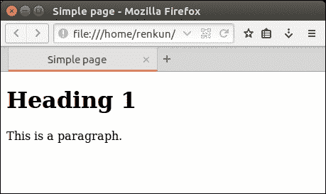

所有现代网络浏览器都支持此类网页。如果你用任何文本编辑器打开 `data/simple-page.html`，它将显示网页背后的代码如下：

```py
<!DOCTYPE html> 
<html> 
<head> 
  <title>Simple page</title> 
</head> 
<body> 
  <h1>Heading 1</h1> 
  <p>This is a paragraph.</p> 
</body> 
</html> 

```

上述代码是 HTML（超文本标记语言）的一个示例。它是互联网上使用最广泛的语言。与任何最终被翻译成计算机指令的编程语言不同，HTML 描述了网页的布局和内容，而网络浏览器被设计成根据网络标准将代码渲染成网页。

现代网络浏览器使用 HTML 的第一行来确定使用哪种标准来渲染网页。在这种情况下，使用的是最新的标准，HTML 5。

如果你阅读代码，你可能会注意到 HTML 仅仅是一系列嵌套的标签，如 `<html>`、`<title>`、`<body>`、`<h1>` 和 `<p>`。每个标签以 `<tag>` 开头，并以 `</tag>` 结尾。

实际上，这些标签并不是随意命名的，也不允许它们包含其他任意标签。每个标签对网络浏览器都有特定的含义，并且只允许包含标签的子集，甚至没有任何标签。

`<html>` 标签是所有 HTML 的根元素。它通常包含 `<head>` 和 `<body>`。`<head>` 标签通常包含 `<title>` 以显示在标题栏和浏览器标签页上，以及网页的其他元数据，而 `<body>` 在确定网页布局和内容方面扮演主要角色。

在 `<body>` 标签中，标签可以更自由地嵌套。简单的页面只包含一级标题 (`<h1>`) 和一个段落 (`<p>`)，而下面的网页包含一个有两行两列的表格：

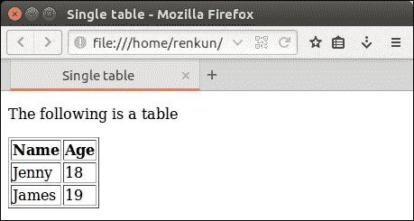

网页背后的 HTML 代码存储在 `data/single-table.html` 中：

```py
<!DOCTYPE html> 
<html> 
<head> 
  <title>Single table</title> 
</head> 
<body> 
  <p>The following is a table</p> 
  <table id="table1" border="1"> 
    <thead> 
      <tr> 
        <th>Name</th> 
        <th>Age</th> 
      </tr> 
    </thead> 
    <tbody> 
      <tr> 
        <td>Jenny</td> 
        <td>18</td> 
      </tr> 
      <tr> 
        <td>James</td> 
        <td>19</td> 
      </tr> 
    </tbody> 
  </table> 
</body> 
</html> 

```

注意，`<table>` 标签是按行构建的：`<tr>` 代表表格行，`<th>` 代表表头单元格，`<td>` 代表表格单元格。

注意，HTML 元素如`<table>`可能有额外的属性，形式为`<table attr1="value1" attr2="value2">`。这些属性不是任意定义的。相反，每个属性都有根据标准指定的特定含义。在前面代码中，`id`是表格的标识符，`border`控制其边框宽度。

以下页面与之前的页面不同，因为它显示了内容的某些样式：

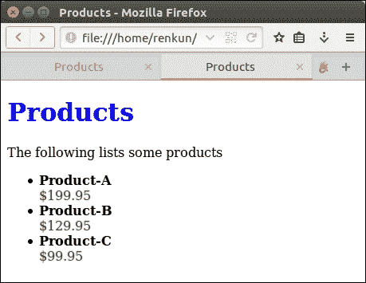

如果你查看其源代码`data/simple-products.html`，你会发现一些新的标签，如`<div>`（一个部分），`<ul>`（未记录的列表），`<li>`（列表项），以及`<span>`（也是一个用于应用样式的部分）；此外，许多 HTML 元素都有一个名为`style`的属性来定义其外观：

```py
<!DOCTYPE html> 
<html> 
<head> 
  <title>Products</title> 
</head> 
<body> 
  <h1 style="color: blue;">Products</h1> 
  <p>The following lists some products</p> 
  <div id="table1" style="width: 50px;"> 
    <ul> 
      <li> 
        <span style="font-weight: bold;">Product-A</span> 
        <span style="color: green;">$199.95</span> 
      </li> 
      <li> 
        <span style="font-weight: bold;">Product-B</span> 
        <span style="color: green;">$129.95</span> 
      </li> 
      <li> 
        <span style="font-weight: bold;">Product-C</span> 
        <span style="color: green;">$99.95</span> 
      </li> 
    </ul> 
  </div> 
</body> 
</html> 

```

样式值以`property1: value1; property2: value2;`的形式书写。然而，列表项的样式有些冗余，因为所有产品名称都共享相同的样式，这也适用于所有产品价格。以下`data/products.html`中的 HTML 使用 CSS（**层叠样式表**）来避免冗余的样式定义：

```py
<!DOCTYPE html> 
<html> 
<head> 
  <title>Products</title> 
  <style> 
    h1 { 
      color: darkblue; 
    } 
    .product-list { 
      width: 50px; 
    } 
    .product-list li.selected .name { 
      color: 1px blue solid; 
    } 
    .product-list .name { 
      font-weight: bold; 
    } 
    .product-list .price { 
      color: green; 
    } 
  </style> 
</head> 
<body> 
  <h1>Products</h1> 
  <p>The following lists some products</p> 
  <div id="table1" class="product-list"> 
    <ul> 
      <li> 
        <span class="name">Product-A</span> 
        <span class="price">$199.95</span> 
      </li> 
      <li class="selected"> 
        <span class="name">Product-B</span> 
        <span class="price">$129.95</span> 
      </li> 
      <li> 
        <span class="name">Product-C</span> 
        <span class="price">$99.95</span> 
      </li> 
    </ul> 
  </div> 
</body> 
</html> 

```

注意，我们在`<head>`中添加了`<style>`来声明网页中的全局样式表。我们还把内容元素（`div`、`li`和`span`）的`style`切换到`class`，以使用这些预定义的样式。CSS 的语法在以下代码中简要介绍。

匹配所有`<h1>`元素：

```py
h1 { 
  color: darkblue; 
} 

```

匹配所有具有`product-list`类的元素：

```py
.product-list { 
  width: 50px; 
} 

```

匹配所有具有`product-list`类的元素，然后匹配所有嵌套的具有`name`类的元素：

```py
.product-list .name { 
  font-weight: bold; 
} 

```

匹配所有具有`product-list`类的元素，然后匹配所有嵌套的`<li>`元素具有`selected`类，最后匹配所有嵌套的具有`name`类的元素：

```py
.product-list li.selected .name { 
  color: 1px blue solid; 
} 

```

注意，仅使用`style`无法实现这一点。以下截图显示了渲染的网页：

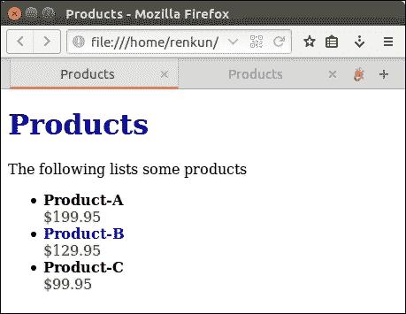

每个 CSS 条目由一个 CSS 选择器（例如，`.product-list`）组成，用于匹配 HTML 元素，以及要应用的样式（例如，`color: red;`）。CSS 选择器不仅用于应用样式，而且通常用于从网页中提取内容，以便正确匹配感兴趣的 HTML 元素。这是网络爬取背后的基本技术。

CSS 比前面代码中展示的要丰富得多。对于网络爬取，我们使用以下示例来展示最常用的 CSS 选择器：

| **语法** | **匹配** |
| --- | --- |
| `*` | 所有元素 |
| `h1, h2, h3` | `<h1>`,`<h2>`,`<h3>` |
| `#table1` | `<* id="table1">` |
| `.product-list` | `<* class="product-list">` |
| `div#container` | `<div id="container">` |
| `div a` | `<div><a>`和`<div><p><a>` |
| `div > a` | `<div><a>`，但不包括`<div><p><a>` |
| `div > a.new` | `<div><a class="new">` |
| `ul > li:first-child` | `<ul>`中的第一个`<li>` |
| `ul > li:last-child` | `<ul>`中的最后一个`<li>` |
| `ul > li:nth-child(3)` | `<ul>`中的第三个`<li>` |
| `p + *` | `<p>` 的下一个元素 |
| `img[title]` | 带有标题属性的 `` |
| `table[border=1]` | `<table border="1">` |

在每个级别，`tag#id.class[]` 可以与 `tag`、`#id.class` 以及可选的 `[]` 一起使用。有关 CSS 选择器的更多信息，请访问 [`developer.mozilla.org/en-US/docs/Web/CSS/CSS_Selectors`](https://developer.mozilla.org/en-US/docs/Web/CSS/CSS_Selectors)。要了解更多关于 HTML 标签的信息，请访问 [`www.w3schools.com/tags/`](http://www.w3schools.com/tags/).

# 使用 CSS 选择器从网页中提取数据

在 R 中，用于网络抓取的最易用的包是 `rvest`。运行以下代码从 CRAN 安装该包：

```py
install.packages("rvest") 

```

首先，我们加载包并使用 `read_html()` 读取 `data/single-table.html` 并尝试从网页中提取表格：

```py
library(rvest) 
## Loading required package: xml2 
single_table_page <- read_html("data/single-table.html") 
single_table_page 
## {xml_document} 
## <html> 
## [1] <head>\n  <title>Single table</title>\n</head> 
## [2] <body>\n  <p>The following is a table</p>\n  <table i ... 

```

注意，`single_table_page` 是一个解析后的 HTML 文档，它是一个嵌套的 HTML 节点数据结构。

使用 `rvest` 函数从此类网页抓取信息的典型过程是：首先，定位我们需要从中提取数据的 HTML 节点。然后，使用 CSS 选择器或 XPath 表达式过滤 HTML 节点，以便所需的节点被选中，而不需要的节点被省略。最后，使用适当的选择器通过 `html_nodes()` 获取节点子集，`html_attrs()` 提取属性，以及 `html_text()` 从解析的网页中提取文本。

该包还提供了直接从网页中提取数据并返回数据框的简单函数。例如，要从中提取所有 `<table>` 元素，我们直接调用 `html_table()`：

```py
html_table(single_table_page) 
## [[1]] 
##    Name Age 
## 1 Jenny  18 
## 2 James  19 

```

要提取第一个 `<table>` 元素，我们使用 `html_node()` 通过 CSS 选择器 `table` 选择第一个节点，然后使用 `html_table()` 与节点一起获取数据框：

```py
html_table(html_node(single_table_page, "table")) 
##    Name Age 
## 1 Jenny  18 
## 2 James  19 

```

做这件事的一个更自然的方法是使用管道，就像使用 `dplyr` 函数中的 `%>%` 一样，如第十二章中介绍的 Chapter 12，*数据操作*。回想一下，`%>%` 实际上评估 `x %>% f(...)` 为 `f(x, ...)`，这样嵌套调用可以展开并变得更加易读。前面的代码可以重写为以下使用 `%>%`：

```py
single_table_page %>% 
  html_node("table") %>% 
  html_table() 
##    Name Age 
## 1 Jenny  18 
## 2 James  19 

```

现在，我们读取 `data/products.html` 并使用 `html_nodes()` 匹配 `<span class="name">` 节点：

```py
products_page <- read_html("data/products.html") 
products_page %>% 
  html_nodes(".product-list li .name") 
## {xml_nodeset (3)} 
## [1] <span class="name">Product-A</span> 
## [2] <span class="name">Product-B</span> 
## [3] <span class="name">Product-C</span> 

```

注意，我们想要选择的节点是 `product-list` 类节点中的 `<li>` 节点的 `name` 类，因此我们可以使用 `.product-list li.name` 来选择所有这样的节点。如果你对这种表示法不熟悉，请查看 CSS 表。

要从选定的节点中提取内容，我们使用 `html_text()`，它返回一个字符向量：

```py
products_page %>% 
  html_nodes(".product-list li .name") %>% 
  html_text() 
## [1] "Product-A" "Product-B" "Product-C" 

```

类似地，以下代码提取产品价格：

```py
products_page %>% 
  html_nodes(".product-list li .price") %>% 
  html_text() 
## [1] "$199.95" "$129.95" "$99.95" 

```

在前面的代码中，`html_nodes()` 返回一组 HTML 节点，而 `html_text()` 足够智能，可以从每个 HTML 节点中提取内部文本，并返回一个字符向量。

注意，这些价格仍然以原始格式表示为字符串，而不是数字。以下代码提取相同的数据并将其转换为更有用的形式：

```py
product_items <- products_page %>% 
  html_nodes(".product-list li") 
products <- data.frame( 
  name = product_items %>% 
    html_nodes(".name") %>% 
    html_text(), 
  price = product_items %>% 
    html_nodes(".price") %>% 
    html_text() %>% 
    gsub("$", "", ., fixed = TRUE) %>% 
    as.numeric(), 
  stringsAsFactors = FALSE 
) 
products 
##        name  price 
## 1 Product-A 199.95 
## 2 Product-B 129.95 
## 3 Product-C  99.95 

```

注意，所选节点的中间结果可以存储为变量并重复使用。然后后续的 `html_nodes()` 和 `html_node()` 调用仅匹配内部节点。

由于产品价格应该是数值，我们使用 `gsub()` 从原始价格中删除 `$` 并将结果转换为数值向量。在管道中 `gsub()` 的调用有些特殊，因为前一个结果（用 `.` 表示）应该放在第三个参数而不是第一个参数。

在这种情况下，`.product-list li .name` 可以简化为 `.name`，同样也适用于 `.product-list li .price`。然而，在实际应用中，CSS 类可能被广泛使用，这样的通用选择器可能会匹配到太多不希望匹配的元素。因此，最好使用更描述性和足够严格的选择器来匹配感兴趣的节点。

# 学习 XPath 选择器

在上一节中，我们学习了 CSS 选择器以及如何使用它们，以及 `rvest` 包提供的函数来从网页中提取内容。

CSS 选择器足够强大，可以满足大多数 HTML 节点匹配的需求。然而，有时需要更强大的技术来选择满足更特殊条件的节点。

看一下以下网页，它比 `data/products.html` 稍微复杂一些：

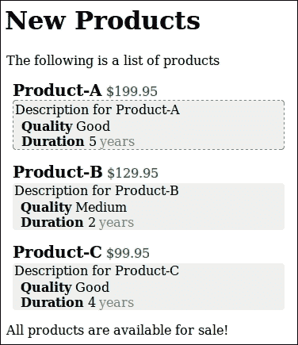

这个网页存储在 `data/new-products.html` 的独立 HTML 文件中。完整的源代码很长，我们只显示 `<body>` 部分。请查看源代码以了解其结构：

```py
<body> 
  <h1>New Products</h1> 
  <p>The following is a list of products</p> 
  <div id="list" class="product-list"> 
    <ul> 
      <li> 
        <span class="name">Product-A</span> 
        <span class="price">$199.95</span> 
        <div class="info bordered"> 
          <p>Description for Product-A</p> 
          <ul> 
            <li><span class="info-key">Quality</span> <span class="info-value">Good</span></li> 
            <li><span class="info-key">Duration</span> <span class="info-value">5</span><span class="unit">years</span></li> 
          </ul> 
        </div> 
      </li> 
      <li class="selected"> 
        <span class="name">Product-B</span> 
        <span class="price">$129.95</span> 
        <div class="info"> 
          <p>Description for Product-B</p> 
          <ul> 
            <li><span class="info-key">Quality</span> <span class="info-value">Medium</span></li> 
            <li><span class="info-key">Duration</span> <span class="info-value">2</span><span class="unit">years</span></li> 
          </ul> 
        </div> 
      </li> 
      <li> 
        <span class="name">Product-C</span> 
        <span class="price">$99.95</span> 
        <div class="info"> 
          <p>Description for Product-C</p> 
          <ul> 
            <li><span class="info-key">Quality</span> <span class="info-value">Good</span></li> 
            <li><span class="info-key">Duration</span> <span class="info-value">4</span><span class="unit">years</span></li> 
          </ul> 
        </div> 
      </li> 
    </ul> 
  </div> 
  <p>All products are available for sale!</p> 
</body> 

```

网页的源代码包含样式表和详细信息的商品列表。每个商品都有一个描述和更多属性以显示。在以下代码中，我们以与之前示例相同的方式加载网页：

```py
page <- read_html("data/new-products.html") 

```

HTML 代码的结构简单明了。在深入研究 XPath 之前，我们需要了解一些关于 XML 的知识。编写良好且组织有序的 HTML 文档基本上可以被视为 **XML**（**扩展标记语言**）文档的专门化。与 HTML 不同，XML 允许任意标签和属性。以下是一个简单的 XML 文档：

```py
<?xml version="1.0"?> 
<root> 
  <product id="1"> 
    <name>Product-A<name> 
    <price>$199.95</price> 
  </product> 
  <product id="2"> 
    <name>Product-B</name> 
    <price>$129.95</price> 
  </product> 
</root> 

```

XPath 是一种专为从 XML 文档中提取数据而设计的技巧。在本节中，我们将比较 XPath 表达式与 CSS 选择器，并了解它们如何有助于从网页中提取数据。

`html_node()` 和 `html_nodes()` 通过 `xpath=` 参数支持 XPath 表达式。以下表格显示了 CSS 选择器和等效 XPath 表达式之间的一些重要比较：

| **CSS** | **XPath** | **匹配** |
| --- | --- | --- |
| `li > *` | `//li/*` | `<li>` 的所有子节点 |
| `li[attr]` | `//li[@attr]` | 所有具有 `attr` 属性的 `<li>` |
| `li[attr=value]` | `//li[@attr='value']` | `<li attr="value">` |
| `li#item` | `//li[@id='item']` | `<li id="item">` |
| `li.info` | `//li[contains(@class,'info')]` | `<li class="info">` |
| `li:first-child` | `//li[1]` | 第一个`<li>` |
| `li:last-child` | `//li[last()]` | 最后一个`<li>` |
| `li:nth-child(n)` | `//li[n]` | 第`n`个`<li>` |
| (N/A) | `//p[a]` | 所有包含子`<a>`的`<p>`元素 |
| (N/A) | `//p[position() <= 5]` | 前五个`<p>`节点 |
| (N/A) | `//p[last()-2]` | 最后第三个`<p>` |
| (N/A) | `//li[value>0.5]` | 所有具有子`<value>`且其值`> 0.5`的`<li>`元素 |

注意，CSS 选择器通常匹配所有子级别的节点。在 XPath 中，`//`标签和`/`标签被定义为以不同的方式匹配节点。更具体地说，`//`标签指的是所有子级别的`<tag>`节点，而`/`标签仅指第一子级别的`<tag>`节点。

为了展示用法，以下是一些示例：

选择所有`<p>`节点：

```py
page %>% html_nodes(xpath = "//p") 
## {xml_nodeset (5)} 
## [1] <p>The following is a list of products</p> 
## [2] <p>Description for Product-A</p> 
## [3] <p>Description for Product-B</p> 
## [4] <p>Description for Product-C</p> 
## [5] <p>All products are available for sale!</p> 

```

选择所有具有`class`属性的`<li>`元素：

```py
page %>% html_nodes(xpath = "//li[@class]") 
## {xml_nodeset (1)} 
## [1] <li class="selected">\n        <span class="name">Pro ... 

```

选择`<div id="list"><ul>`的子元素`<li>`：

```py
page %>% html_nodes(xpath = "//div[@id='list']/ul/li") 
## {xml_nodeset (3)} 
## [1] <li>\n        <span class="name">Product-A</span>\n   ... 
## [2] <li class="selected">\n        <span class="name">Pro ... 
## [3] <li>\n        <span class="name">Product-C</span>\n   ... 

```

选择`<div id="list">`内部`<li>`的子元素`<span class="name">`：

```py
page %>% html_nodes(xpath = "//div[@id='list']//li/span[@class='name']") 
## {xml_nodeset (3)} 
## [1] <span class="name">Product-A</span> 
## [2] <span class="name">Product-B</span> 
## [3] <span class="name">Product-C</span> 

```

在`<li class="selected">`中，选择所有作为子元素的`<span class="name">`：

```py
page %>% 
  html_nodes(xpath = "//li[@class='selected']/span[@class='name']") 
## {xml_nodeset (1)} 
## [1] <span class="name">Product-B</span> 

```

所有的前述示例都可以用等效的 CSS 选择器实现。然而，以下示例无法用 CSS 选择器实现。

选择所有具有子`<p>`的`<div>`：

```py
page %>% html_nodes(xpath = "//div[p]") 
## {xml_nodeset (3)} 
## [1] <div class="info bordered">\n          <p>Description ... 
## [2] <div class="info">\n          <p>Description for Prod ... 
## [3] <div class="info">\n          <p>Description for Prod ... 

```

选择所有`<span class="info-value">Good</span>`：

```py
page %>%  
  html_nodes(xpath = "//span[@class='info-value' and text()='Good']") 
## {xml_nodeset (2)} 
## [1] <span class="info-value">Good</span> 
## [2] <span class="info-value">Good</span> 

```

选择所有品质优良的产品名称：

```py
page %>% 
  html_nodes(xpath = "//li[div/ul/li[1]/span[@class='info-value' and text()='Good']]/span[@class='name']") 
## {xml_nodeset (2)} 
## [1] <span class="name">Product-A</span> 
## [2] <span class="name">Product-C</span> 

```

选择所有持续时间超过三年的产品名称：

```py
page %>% 
  html_nodes(xpath = "//li[div/ul/li[2]/span[@class='info-value' and text()>3]]/span[@class='name']") 
## {xml_nodeset (2)} 
## [1] <span class="name">Product-A</span> 
## [2] <span class="name">Product-C</span> 

```

XPath 非常灵活，可以成为匹配网页节点的一个强大工具。要了解更多信息，请访问[`www.w3schools.com/xsl/xpath_syntax.aspac`](http://www.w3schools.com/xsl/xpath_syntax.aspac)。

# 分析 HTML 代码和提取数据

在前面的章节中，我们学习了 HTML、CSS 和 XPath 的基础知识。为了抓取现实世界的网页，现在的问题变成了编写正确的 CSS 或 XPath 选择器。在本节中，我们将介绍一些简单的方法来确定有效选择器。

假设我们想要抓取[`cran.rstudio.com/web/packages/available_packages_by_name.html`](https://cran.rstudio.com/web/packages/available_packages_by_name.html)上所有可用的 R 包。网页看起来很简单。为了确定选择器表达式，在表格上右键单击，并在上下文菜单中选择**检查元素**，这通常在大多数现代网络浏览器中可用：

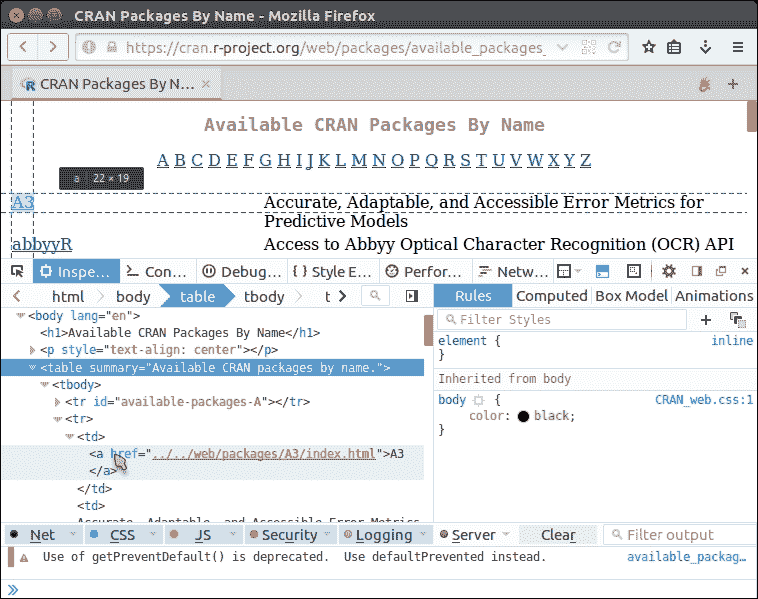

然后会出现检查器面板，我们可以看到网页的底层 HTML。在 Firefox 和 Chrome 中，选中的节点会被突出显示，以便更容易定位：

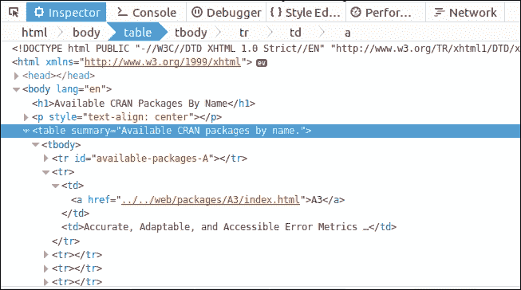

HTML 中包含一个唯一的`<table>`，因此我们可以直接使用`table`来选择它，并使用`html_table()`将其提取出来作为数据框：

```py
page <- read_html("https://cran.rstudio.com/web/packages/available_packages_by_name.html") 
pkg_table <- page %>% 
  html_node("table") %>%  
  html_table(fill = TRUE) 
head(pkg_table, 5) 
##            X1 
## 1             
## 2          A3 
## 3      abbyyR 
## 4         abc 
## 5 ABCanalysis 
##                                                                         X2 
## 1                                                                     <NA> 
## 2 Accurate, Adaptable, and Accessible Error Metrics for Predictive\nModels 
## 3                  Access to Abbyy Optical Character Recognition (OCR) API 
## 4                         Tools for Approximate Bayesian Computation (ABC) 
## 5                                                    Computed ABC Analysis 

```

注意，原始表格没有标题。结果的数据框使用默认标题，并且第一行是空的。以下代码是为了修复这些问题：

```py
pkg_table <- pkg_table[complete.cases(pkg_table), ] 
colnames(pkg_table) <- c("name", "title") 
head(pkg_table, 3) 
##     name 
## 2     A3 
## 3 abbyyR 
## 4    abc 
##                                                                      title 
## 2 Accurate, Adaptable, and Accessible Error Metrics for Predictive\nModels 
## 3                  Access to Abbyy Optical Character Recognition (OCR) API 
## 4                         Tools for Approximate Bayesian Computation (ABC) 

```

下一个例子是提取 MSFT 在[`finance.yahoo.com/quote/MSFT`](http://finance.yahoo.com/quote/MSFT)的最新股价。使用元素检查器，我们发现价格包含在一个由程序生成的非常长的类别的`<span>`中：

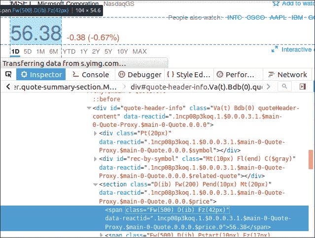

向上查看几个层级，我们可以找到一个路径，`div#quote-header-info > section > span`，用来导航到这个节点。因此，我们可以使用这个 CSS 选择器来查找并提取股价：

```py
page <- read_html("https://finance.yahoo.com/quote/MSFT") 
page %>% 
  html_node("div#quote-header-info > section > span") %>% 
  html_text() %>% 
  as.numeric() 
## [1] 56.68 

```

在网页的右侧，有一个公司关键统计数据的表格：

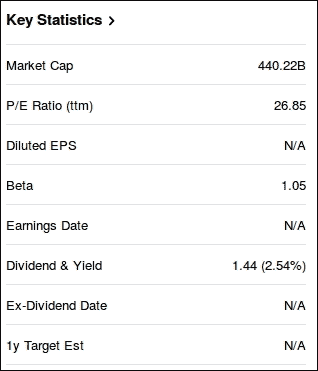

在提取之前，我们再次检查表格及其包围的节点，并尝试找到一个选择器可以导航到这个表格：

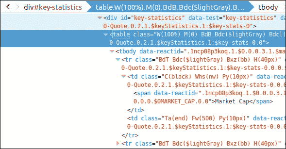

显然，感兴趣的`<table>`被一个`<div id="key-statistics">`包围。因此，我们可以直接使用`#key-statistics table`来匹配表格节点并将其转换为数据框：

```py
page %>% 
  html_node("#key-statistics table") %>% 
  html_table() 
##                 X1           X2 
## 1       Market Cap      442.56B 
## 2  P/E Ratio (ttm)        26.99 
## 3      Diluted EPS          N/A 
## 4             Beta         1.05 
## 5    Earnings Date          N/A 
## 6 Dividend & Yield 1.44 (2.56%) 
## 7 Ex-Dividend Date          N/A 
## 8    1y Target Est          N/A 

```

使用类似的技术，我们可以创建一个函数，根据股票代码（例如，`MSFT`）返回公司名称和价格：

```py
get_price <- function(symbol) { 
  page <- read_html(sprintf("https://finance.yahoo.com/quote/%s", symbol)) 
  list(symbol = symbol, 
    company = page %>%  
      html_node("div#quote-header-info > div:nth-child(1) > h6") %>% 
      html_text(), 
    price = page %>%  
      html_node("div#quote-header-info > section > span:nth-child(1)") %>% 
      html_text() %>% 
      as.numeric()) 
} 

```

CSS 选择器足够限制性，可以导航到正确的 HTML 节点。为了测试这个函数，我们运行以下代码：

```py
get_price("AAPL") 
## $symbol 
## [1] "AAPL" 
##  
## $company 
## [1] "Apple Inc." 
##  
## $price 
## [1] 104.19 

```

另一个例子是抓取[`stackoverflow.com/questions/tagged/r?sort=votes`](http://stackoverflow.com/questions/tagged/r?sort=votes)上的顶级 R 问题，如下所示：

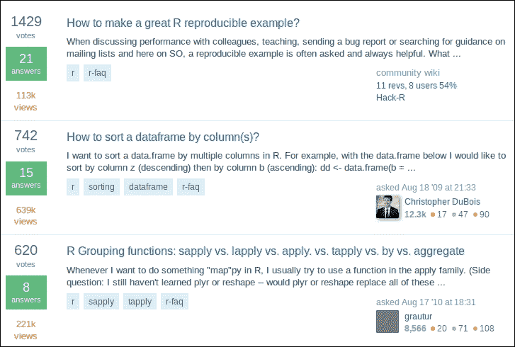

使用类似的方法，很容易发现问题列表包含在一个`id`为`questions`的容器中。因此，我们可以加载页面并使用`#questions`选择器和存储问题容器：

```py
page <- read_html("https://stackoverflow.com/questions/tagged/r?sort=votes&pageSize=5") 
questions <- page %>%  
  html_node("#questions") 

```

为了提取问题标题，我们仔细查看第一个问题的 HTML 结构：

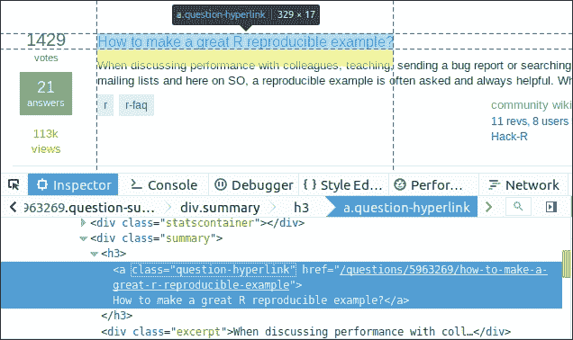

很容易发现每个问题标题都包含在`<div class="summary"><h3>`中：

```py
questions %>% 
  html_nodes(".summary h3") %>% 
  html_text() 
## [1] "How to make a great R reproducible example?"                                        
## [2] "How to sort a dataframe by column(s)?"                                              
## [3] "R Grouping functions: sapply vs. lapply vs. apply. vs. tapply vs. by vs. aggregate" 
## [4] "How to join (merge) data frames (inner, outer, left, right)?"                       
## [5] "How can we make xkcd style graphs?" 

```

注意，`<a class="question-hyperlink">`也提供了一个更简单的 CSS 选择器，可以返回相同的结果：

```py
questions %>% 
  html_nodes(".question-hyperlink") %>% 
  html_text() 

```

如果我们对每个问题的投票也感兴趣，我们可以再次检查投票，看看它们如何用 CSS 选择器描述：

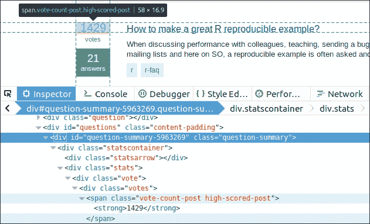

幸运的是，所有投票面板具有相同的结构，并且找出它们的模式相当直接。每个问题都包含在一个具有`question-summary`类的`<div>`中，其中投票在一个具有`.vote-count-post`类的`<span>`中：

```py
questions %>% 
  html_nodes(".question-summary .vote-count-post") %>% 
  html_text() %>% 
  as.integer() 
## [1] 1429  746  622  533  471 

```

类似地，以下代码提取了答案的数量：

```py
questions %>% 
  html_nodes(".question-summary .status strong") %>% 
  html_text() %>% 
  as.integer() 
## [1] 21 15  8 11  7 

```

如果我们继续提取每个问题的标签，这会变得有点棘手，因为不同的问题可能有不同数量的标签。在下面的代码中，我们首先选择所有问题的标签容器，并通过迭代提取每个容器中的标签。

```py
questions %>% 
  html_nodes(".question-summary .tags") %>% 
  lapply(function(node) { 
    node %>% 
      html_nodes(".post-tag") %>% 
      html_text() 
  }) %>% 
  str 
## List of 5 
##  $ : chr [1:2] "r" "r-faq" 
##  $ : chr [1:4] "r" "sorting" "dataframe" "r-faq" 
##  $ : chr [1:4] "r" "sapply" "tapply" "r-faq" 
##  $ : chr [1:5] "r" "join" "merge" "dataframe" ... 
##  $ : chr [1:2] "r" "ggplot2" 

```

所有的前序抓取都在一个网页中完成。如果我们需要跨多个网页收集数据怎么办？假设我们访问每个问题的页面（例如，[`stackoverflow.com/q/5963269/2906900`](http://stackoverflow.com/q/5963269/2906900)）。注意，右上角有一个信息框。我们需要提取列表中每个问题的此类信息框：

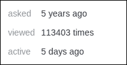

检查告诉我们 `#qinfo` 是每个问题页面上信息框的关键。然后我们可以选择所有问题超链接，提取所有问题的 URL，遍历它们，读取每个问题页面，并使用该键提取信息框：

```py
questions %>% 
  html_nodes(".question-hyperlink") %>% 
  html_attr("href") %>% 
  lapply(function(link) { 
    paste0("https://stackoverflow.com", link) %>% 
      read_html() %>% 
      html_node("#qinfo") %>% 
      html_table() %>% 
      setNames(c("item", "value")) 
  }) 
## [[1]] 
##     item        value 
## 1  asked  5 years ago 
## 2 viewed 113698 times 
## 3 active   7 days ago 
##  
## [[2]] 
##     item        value 
## 1  asked  6 years ago 
## 2 viewed 640899 times 
## 3 active 2 months ago 
##  
## [[3]] 
##     item        value 
## 1  asked  5 years ago 
## 2 viewed 221964 times 
## 3 active  1 month ago 
##  
## [[4]] 
##     item        value 
## 1  asked  6 years ago 
## 2 viewed 311376 times 
## 3 active  15 days ago 
##  
## [[5]] 
##     item        value 
## 1  asked  3 years ago 
## 2 viewed  53232 times 
## 3 active 4 months ago 

```

除了所有这些，`rvest` 还支持创建 HTTP 会话以模拟页面导航。要了解更多信息，请阅读`rvest`文档。对于许多抓取任务，你也可以通过使用[`selectorgadget.com/`](http://selectorgadget.com/)提供的工具来简化选择器的查找。

网络抓取还有更多高级技术，如使用 JavaScript 处理 AJAX 和动态网页，但这些内容超出了本章的范围。更多用法，请参阅`rvest`包的文档。

注意，`rvest` 主要受到 Python 包 Robobrowser 和 BeautifulSoup 的启发。这些包在某些方面比`rvest`更强大，因此在某些方面的网络抓取中更受欢迎。如果源代码复杂且规模大，你可能需要学习如何使用这些 Python 包。更多信息请访问[`www.crummy.com/software/BeautifulSoup/`](https://www.crummy.com/software/BeautifulSoup/)。

# 摘要

在本章中，我们学习了网页是如何用 HTML 编写的，以及如何通过 CSS 进行样式化。CSS 选择器可以用来匹配 HTML 节点，以便提取其内容。编写良好的 HTML 文档也可以通过 XPath 表达式进行查询，它具有更多功能和更大的灵活性。然后我们学习了如何使用现代网络浏览器的元素检查器来确定一个限制性选择器来匹配感兴趣的 HTML 节点，从而可以从网页中提取所需的数据。

在下一章中，我们将学习一系列提高你生产力的技术，从 R Markdown 文档、图表到交互式 shiny 应用。这些工具使得创建高质量、可重复和交互式的文档变得容易得多，这是展示数据、思想和原型的好方法。
