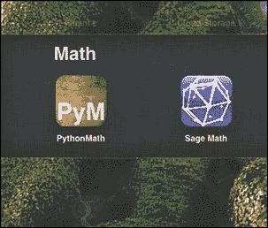
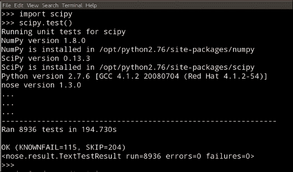
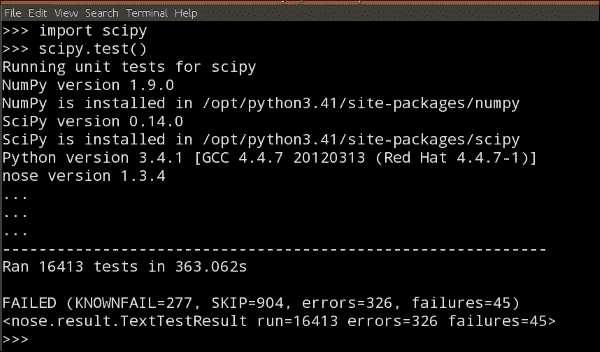
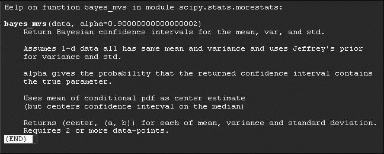
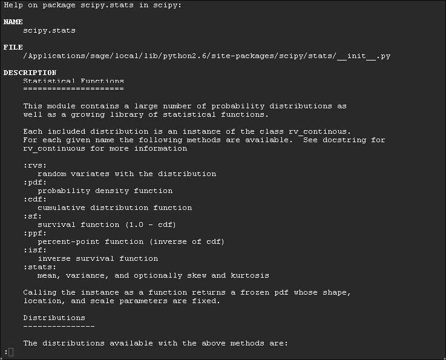
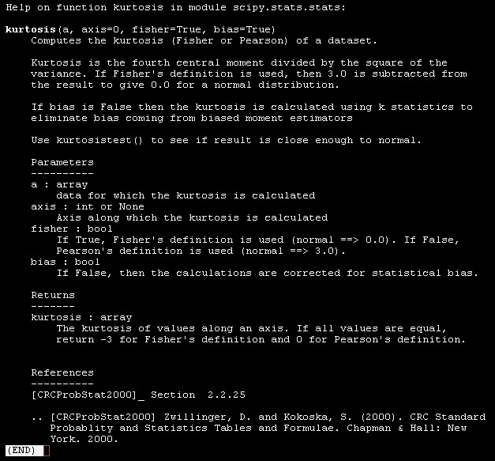
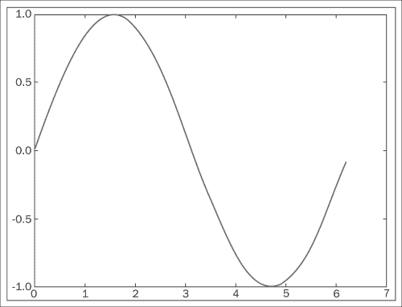

# 第一章。SciPy 简介

毫无疑问，21 世纪的科学家劳动比前几代人更为全面和跨学科。科学界的成员以更大的团队形式连接，共同致力于以任务为导向的目标，并在各自的领域内合作。这种研究范式也反映在研究人员使用的计算资源上。研究人员不再局限于一种商业软件、操作系统或供应商，而是受到研究机构和开源社区提供的开源贡献的启发和测试；研究工作经常跨越各种平台和技术。

本书介绍了迄今为止高度认可的开放源代码编程环境——一个基于计算机语言 Python 的两个库的系统：**NumPy**和**SciPy**。在接下来的章节中，我们将通过科学和工程领域的示例来指导您使用这个系统。

# SciPy 是什么？

理想的可计算数学编程环境具有以下特点：

+   它必须基于一种允许用户快速工作并有效集成系统的计算机语言。理想情况下，计算机语言应可移植到所有平台：Windows、Mac OS X、Linux、Unix、Android 等。这对于促进不同资源和使用能力的科学家之间的合作至关重要。它必须包含一套强大的库，允许以简单有效的方式获取、存储和处理大量数据集。这是核心——允许进行模拟和大规模使用数值计算。

+   与其他计算机语言以及第三方软件的平滑集成。

+   除了运行编译后的代码，编程环境还应允许进行交互式会话以及脚本能力，以便快速实验。

+   应支持不同的编码范式——命令式、面向对象和/或函数式编码风格。

+   它应该是一个开源软件，允许用户访问原始数据代码，并允许用户在需要时修改基本算法。在商业软件中，改进算法的包含由卖家决定，并且通常会给最终用户带来成本。在开源领域，社区通常进行这些改进，并在发布时发布新版本——无需付费。

+   应用程序集不应仅限于简单的数值计算；它应该足够强大，允许进行符号计算。

在科学界使用的最知名数值计算环境之一是**MATLAB**，这是一个商业软件，价格昂贵，并且不允许对代码进行任何篡改。**Maple**和**Mathematica**则更侧重于符号计算，尽管它们可以匹配 MATLAB 中的许多数值计算。然而，这些也是商业软件，价格昂贵，且不开放修改。基于类似数学引擎的 MATLAB 的合理替代品是**GNU Octave 系统**。大多数 MATLAB 代码可以轻松移植到 Octave，它是开源的。不幸的是，其配套的编程环境并不十分用户友好，而且也非常限制于数值计算。一个结合了所有优点的是 Python，它带有开源库 NumPy 和 SciPy 进行数值操作。无疑，吸引用户使用 Python 的第一个特性是其代码的可读性。其语法极其清晰和表达性强。它支持用不同范式编写的代码：面向对象、函数式或传统的命令式。它允许打包 Python 代码，并通过`py2exe`、`pyinstaller`和`cx_Freeze`库将它们作为独立的可执行程序运行，但也可以用作交互式编程语言或脚本语言。这在开发符号计算工具时是一个巨大的优势。因此，Python 已经成为 Maple 和 Mathematica 的强劲竞争对手：开源数学软件**Sage**（**代数和几何实验系统**）。

NumPy 是 Python 的一个开源扩展，它增加了对大型多维数组的支持。这种支持允许获取、存储和复杂操作之前提到的数据。仅凭 NumPy 本身就是一个解决许多数值计算问题的强大工具。

在 NumPy 之上，我们还有另一个开源库 SciPy。这个库包含用于操纵 NumPy 对象（具有明确的科学和工程目标）的算法和数学工具。

Python、NumPy 和 SciPy（以下简称为“SciPy”）的组合已经多年成为许多应用数学家的首选环境；我们每天与纯数学家和硬核工程师一起工作。这个行业的挑战之一是将不同视野、技术、工具和软件的专业人士的科学产出集中在一个工作站上。SciPy 是协调计算顺畅、可靠和一致性的完美解决方案。

我们经常需要编写并执行脚本，例如，使用 SciPy 本身、C/C++、Fortran 和/或 MATLAB 的组合进行实验。通常，我们会从一些信号采集设备接收大量数据。从所有这些异构材料中，我们使用 Python 来检索和处理数据，一旦分析完成，就生成高质量的文档，其中包含专业外观的图表和可视化辅助工具。SciPy 使得执行所有这些任务变得轻松。

这部分是因为许多专门的软件工具可以轻松扩展 SciPy 的核心功能。例如，尽管绘图和绘图通常由**matplotlib**的 Python 库处理，但还有其他可用的包，例如**Biggles** ([`biggles.sourceforge.net/`](http://biggles.sourceforge.net/))、**Chaco** ([`pypi.python.org/pypi/chaco`](https://pypi.python.org/pypi/chaco))、**HippoDraw** ([`github.com/plasmodic/hippodraw`](https://github.com/plasmodic/hippodraw))、用于**3D**渲染的**MayaVi** ([`mayavi.sourceforge.net/`](http://mayavi.sourceforge.net/))、**Python Imaging Library** 或 **PIL** ([`pythonware.com/products/pil/`](http://pythonware.com/products/pil/))，以及在线分析和数据可视化工具**Plotly** ([`plot.ly/`](https://plot.ly/))。

与非 Python 包的接口也是可能的。例如，SciPy 与 R 统计软件包的交互可以通过**RPy** ([`rpy.sourceforge.net/rpy2.html`](http://rpy.sourceforge.net/rpy2.html))来实现。这允许进行更稳健的数据分析。

# 安装 SciPy

在本书编写时，Python 的稳定生产版本是 2.7.9 和 3.4.2。尽管如此，如果用户需要与第三方应用程序通信，Python 2.7 仍然更方便。Python 2 不再计划发布新版本；Python 3 被认为是 Python 的现在和未来。出于 SciPy 应用的目的，我们建议您保留 2.7 版本，因为还有一些使用 SciPy 的包尚未移植到 Python 3。尽管如此，本书的配套软件已在 Python 2.7 和 Python 3.4 上进行了测试。

Python 软件包可以从官方网站([`www.python.org/downloads/`](https://www.python.org/downloads/))下载，并可以安装在所有主要系统上，如 Windows、Mac OS X、Linux 和 Unix。它也已移植到其他平台，包括 Palm OS、iOS、PlayStation、PSP、Psion 等。

以下截图显示了在 iPad 上使用 Python 进行编码的两个流行选项——**PythonMath** 和 **Sage Math**。虽然第一个应用程序仅允许使用简单的数学库，但第二个应用程序允许用户远程加载和使用 NumPy 和 SciPy。



**PythonMath** 和 **Sage Math** 将 Python 编码带到了 iOS 设备上。**Sage Math** 允许导入 NumPy 和 SciPy。

我们不会详细介绍如何在您的系统上安装 Python，因为我们已经假设您熟悉这门语言。如果有疑问，我们建议浏览优秀的书籍 *Expert Python Programming*，作者 *Tarek Ziadé*，由 *Packt Publishing* 出版，其中详细解释了在不同系统上安装许多不同实现的方法。通常，遵循官方 Python 网站上的说明是个好主意。我们还将假设您熟悉在 Python 中进行交互式会话以及编写独立脚本。

NumPy 和 SciPy 的最新库可以从官方 SciPy 网站下载 ([`scipy.org/`](http://scipy.org/))。它们都需要 Python 版本 2.4 或更高，所以我们现在应该处于良好的状态。我们可以选择从 SourceForge ([`sourceforge.net/projects/scipy/`](http://sourceforge.net/projects/scipy/))、**Gohlke** ([`www.lfd.uci.edu/~gohlke/pythonlibs/`](http://www.lfd.uci.edu/~gohlke/pythonlibs/)) 或 **Git** 仓库（例如，来自 [`stronginference.com/ScipySuperpack/`](http://stronginference.com/ScipySuperpack/) 的 **superpack**）下载软件包。

在某些系统中，也可以使用预包装的可执行捆绑包来简化过程，例如 **Anaconda** ([`store.continuum.io/cshop/anaconda/`](https://store.continuum.io/cshop/anaconda/)) 或 **Enthought** ([`www.enthought.com/products/epd/`](https://www.enthought.com/products/epd/)) Python 发行版。在这里，我们将向您展示如何在最常见的情况下在各种平台上下载和安装 Scipy。

## 在 Mac OS X 上安装 SciPy

在 Mac OS X 上安装 SciPy 时，您在系统上安装它之前必须考虑一些标准。这有助于 SciPy 的顺利安装。以下是需要注意的事项：

+   例如，在 Mac OS X 上，如果已安装 `MacPorts`，则过程将非常简单。以超级用户身份打开终端，并在提示符（`%`）下输入以下命令：

    ```py
    % port search scipy

    ```

+   这列出了所有安装 SciPy 或将 SciPy 作为依赖项的端口。对于 Python 2.7，我们需要安装 `py27-scipy`，输入以下命令：

    ```py
    % port install py27-scipy

    ```

几分钟后，库就正确安装并准备好使用了。注意 `macports` 还会为我们安装所有需要的依赖项（包括 NumPy 库），而无需我们做任何额外的工作。

## 在 Unix/Linux 上安装 SciPy

在任何其他 Unix/Linux 系统中，如果没有任何端口可用或用户更喜欢从 SourceForge 或 Git 下载的软件包中安装，则只需执行以下步骤：

1.  按照官方页面上的推荐，解压 NumPy 和 SciPy 软件包。这将创建两个文件夹，每个库一个。

    在终端会话中，切换到存储 NumPy 库的文件夹，其中包含`setup.py`文件。找出你正在使用的 Fortran 编译器（`gnu`、`gnu95`或`fcompiler`之一），然后在提示符下输入以下命令：

    ```py
    % python setup.py build –fcompiler=<compiler>

    ```

1.  一旦构建完成，在同一文件夹下，输入安装命令。这应该就足够了：

    ```py
    % python setup.py install

    ```

## 在 Windows 上安装 SciPy

你可以通过多种方式在 Windows 上安装 Scipy。以下是一些推荐的方法，你可能想看看：

+   在 Microsoft Windows 下，我们建议你从 Anaconda 或 Enthought Python 发行版提供的二进制安装程序中进行安装。然而，请注意内存要求。或者，你可以下载并安装 SciPy 堆栈或库。

+   SciPy 库的安装过程与上述过程完全相同，即在 Unix/Linux 下下载和构建后再安装，或在 Microsoft Windows 下下载和运行。请注意，不同的 Python 实现可能对安装 NumPy 和 SciPy 有不同的要求。

## 测试 SciPy 安装

如你所知，计算机系统并非完美无缺。因此，在开始使用 SciPy 进行计算之前，需要确保其运行正常。为此，SciPy 的开发者提供了一套测试程序，任何 SciPy 用户都可以执行这些测试来确保所使用的 SciPy 运行良好。这样，在使用 SciPy 提供的任何函数时发生错误时，可以节省大量的调试时间。

要运行测试程序，在 Python 提示符下，可以运行以下命令：

```py
>>> import scipy
>>> scipy.test()

```

### 小贴士

**下载示例代码**

你可以从[`www.packtpub.com`](http://www.packtpub.com)购买的所有 Packt 书籍的账户中下载示例代码文件。如果你在其他地方购买了这本书，你可以访问[`www.packtpub.com/support`](http://www.packtpub.com/support)并注册，以便将文件直接通过电子邮件发送给你。

读者应该知道，执行此测试需要一些时间才能完成。它应该以类似以下内容结束：



这意味着在基本层面上，你的 SciPy 安装是正常的。最终，测试可能以以下形式结束：



在这种情况下，需要仔细检查错误和失败的测试。获取帮助的一个地方是 SciPy 邮件列表（[`mail.scipy.org/pipermail/scipy-user/`](http://mail.scipy.org/pipermail/scipy-user/)），你可以订阅该列表。我们包括了一个 Python 脚本，读者可以使用它来运行这些测试，这些测试可以在本书的配套软件中找到。

# SciPy 组织

SciPy 被组织成一系列模块。我们喜欢将每个模块视为数学的不同领域。因此，每个模块都有其特定的技术和工具。您可以在[`docs.scipy.org/doc/scipy-0.14.0/reference/py-modindex.html`](http://docs.scipy.org/doc/scipy-0.14.0/reference/py-modindex.html)找到包含在 SciPy 中的一些不同模块的列表。

让我们使用其中的一些函数来解决一个简单的问题。

下表显示了 31 个人的智商测试分数：

| 114 | 100 | 104 | 89 | 102 | 91 | 114 | 114 |
| --- | --- | --- | --- | --- | --- | --- | --- |
| 103 | 105 | 108 | 130 | 120 | 132 | 111 | 128 |
| 118 | 119 | 86 | 72 | 111 | 103 | 74 | 112 |
| 107 | 103 | 98 | 96 | 112 | 112 | 93 |   |

这些 31 个分数的茎叶图（请参考本章的 IPython 笔记本）显示，没有明显偏离正态分布，因此我们假设分数的分布接近正态分布。现在，使用 99%的置信区间来估计这个群体的平均智商分数。

我们首先将数据加载到内存中，如下所示：

```py
>>> import numpy
>>> scores = numpy.array([114, 100, 104, 89, 102, 91, 114, 114, 103, 105, 108, 130, 120, 132, 111, 128, 118, 119, 86, 72, 111, 103, 74, 112, 107, 103, 98, 96, 112, 112, 93])

```

在这一点上，如果我们输入 `dir(scores)`，然后按 *return* 键，接着按一个点（`.`），再按 *tab* 键；系统会列出从 NumPy 库继承的所有可能的方法，这在 Python 中是惯例。技术上，我们可以继续计算所需的 `mean`、`xmean` 和相应的置信区间，根据公式 `xmean ± zcrit * sigma / sqrt(n)`，其中 `sigma` 和 `n` 分别是数据的标准差和大小，而 *zcrit* 是与置信度相对应的临界值（[`en.wikipedia.org/wiki/Confidence_interval`](http://en.wikipedia.org/wiki/Confidence_interval)）。在这种情况下，我们可以在任何统计书籍的表格中查找其值的粗略近似，*zcrit = 2.576*。其余的值可以在我们的会话中计算并适当组合，如下所示：

```py
>>> import scipy
>>> xmean = scipy.mean(scores)
>>> sigma = scipy.std(scores)
>>> n = scipy.size(scores)
>>> xmean, xmean - 2.576*sigma /scipy.sqrt(n), \
 xmean + 2.576*sigma / scipy.sqrt(n)

```

输出如下所示：

```py
(105.83870967741936, 99.343223715529746, 112.33419563930897)

```

因此，我们已经计算出了估计的平均智商分数（值为 `105.83870967741936`）和置信区间（从大约 `99.34` 到约 `112.33`）。我们使用纯 SciPy 操作并遵循已知公式来完成这些计算。但与其手动进行所有这些计算并在表格中查找临界值，我们只需询问 SciPy。

注意，在使用 `scipy.stats` 模块中的任何函数之前，需要先加载该模块：

```py
>>> from scipy import stats
>>> result=scipy.stats.bayes_mvs(scores)

```

变量 `result` 包含我们问题的解决方案和一些附加信息。请注意，根据 `help` 文档的说明，result 是一个包含三个元素的元组：

```py
>>> help(scipy.stats.bayes_mvs)

```

这个命令的输出将取决于 SciPy 的安装版本。它可能看起来像这样（运行本章的配套 IPython 笔记本以查看您系统的实际输出，或在 Python 控制台中运行该命令）：



我们的解决方案是元组 `result` 的第一个元素；要查看其内容，请输入：

```py
>>> result[0]

```

输出如下所示：

```py
(105.83870967741936, (101.48825534263035, 110.18916401220837))

```

注意这个输出给出了与之前相同的平均值，但由于 SciPy（输出可能取决于您计算机上可用的 SciPy 版本）的计算更准确，因此置信区间略有不同。

# 如何查找文档

在线有大量信息，无论是来自 SciPy 的官方页面（尽管其参考指南可能有些不完整，因为它是一个正在进行中的工作），还是来自许多其他在论坛、YouTube 或个人网站上提供教程的贡献者。一些开发者还在线发布了他们工作的详细示例。

正如我们之前看到的，从我们的交互式 Python 会话中获取帮助也是可能的。NumPy 和 SciPy 库大量使用 **docstrings**，这使得使用常规 Python 帮助系统请求使用说明和建议变得简单。例如，如果对 `bayes_mvs` 例程的使用有疑问，用户可以发出以下命令：

```py
>>> import scipy.stats
>>> help(scipy.stats.bayes_mvs)

```

执行此命令后，系统将提供必要的信息。等价地，NumPy 和 SciPy 都自带了它们自己的帮助系统，`info`。例如，查看以下命令：

```py
>>> import numpy
>>> numpy.info('random')

```

这将提供从与给定关键字关联的 NumPy 库的所有 docstrings 内容中解析出的所有信息的摘要。用户可以上下滚动输出，而不会进一步交互。

如果我们不确定函数的使用，但已经知道我们想要使用它，这很方便。但是，如果我们不知道这个程序的存在，并且怀疑它可能存在，我们应该怎么办？Python 的常规方法是调用模块上的 `dir()` 命令，它列出了所有可能的属性。

交互式 Python 会话使得在帮助会话的输出中进行搜索变得更容易，并且可以在输出中导航和执行进一步的搜索。例如，在提示符中输入以下命令：

```py
>>> import scipy.stats
>>> help(scipy.stats)

```

此命令的输出将取决于 SciPy 的安装版本。它可能看起来像这样（运行本章的配套 IPython Notebook 以查看您系统的实际输出，或在 Python 控制台中运行该命令）：



注意屏幕末尾的冒号（**:**）——这是一个老式的提示符。系统处于待机模式，等待用户发出命令（以单个键的形式）。这也表明在给定文本之后还有几页帮助。如果我们打算阅读帮助文件的其余部分，我们可以按空格键滚动到下一页。

以这种方式，我们可以访问以下关于此主题的手册页面。也可以通过逐行滚动使用上下箭头键导航手册页面。当我们准备好退出帮助会话时，我们只需简单地按（键盘字母）*Q*。

还可以在帮助内容中搜索给定的字符串。在这种情况下，在提示符下，我们按 (*/*) 斜杠键。提示符从冒号变为斜杠，然后我们输入我们想要搜索的关键字。

例如，是否存在一个 SciPy 函数可以计算给定数据集的**皮尔逊峰度**？在斜杠提示符下，我们输入 `kurtosis` 并按 *enter*。帮助系统带我们到该字符串的第一个出现位置。要访问字符串 kurtosis 的后续出现，我们按 *N* 键（表示下一个）直到找到所需的内容。在那个阶段，我们继续退出这个帮助会话（通过按 *Q*），并请求有关该函数的更多信息：

```py
>>> help(scipy.stats.kurtosis)

```

此命令的输出将取决于 SciPy 的安装版本。它可能看起来像这样（运行本章的配套 IPython Notebook 以查看您系统的实际输出，或在 Python 控制台中运行该命令）：



# 科学可视化

在这一点上，我们想向您介绍另一个我们将使用来生成图表的资源，即 matplotlib 库。它可以从其官方网站 [`matplotlib.org/`](http://matplotlib.org/) 下载，并按照标准的 Python 命令进行安装。官方网站上有很好的在线文档，我们鼓励读者比本书中我们将使用的几个命令更深入地挖掘。例如，由 Sandro Tosi 编写的优秀专著《Matplotlib for Python Developers》，由 Packt Publishing 出版，提供了我们所需要的一切以及更多。其他绘图库也可用（商业或其他，旨在针对非常不同和特定的应用。matplotlib 的复杂程度和使用简便性使其成为科学计算中生成图形的最佳选择之一）。

安装完成后，可以使用 `import matplotlib` 来导入。在其所有模块中，我们将重点关注 `pyplot`，它提供了一个与绘图库的舒适接口。例如，如果我们想要绘制正弦函数的周期，我们可以执行以下代码片段：

```py
>>> import numpy
>>> import matplotlib.pyplot as plt
>>> x=numpy.linspace(0,2*numpy.pi,32)
>>> fig = plt.figure()
>>> plt.plot(x, numpy.sin(x))
>>> plt.show()
>>> fig.savefig('sine.png')

```

我们得到了以下图表：



让我们解释上一节中的每个命令。前两个命令是按照惯例导入 `numpy` 和 `matplotlib.pyplot`。我们定义一个名为 *x* 的数组，包含从 0 到 2π 的 32 个均匀分布的浮点数值，并将 *y* 定义为包含 *x* 中数值的正弦值的数组。`figure` 命令在内存中创建空间以存储后续的图形，并放置一个 `matplotlib.figure.Figure` 形式的对象。`plt.plot(x, numpy.sin(x))` 命令创建一个 `matplotlib.lines.Line2D` 形式的对象，其中包含 *x* 与 `numpy.sin(x)` 的绘图数据，以及与之相连并按变量范围标记的一组坐标轴。此对象存储在之前的 `Figure` 对象中，并通过 `plt.show()` 命令在屏幕上显示。会话中的最后一个命令 `fig.savefig()`，将图形对象保存为我们想要的任何有效图像格式（在这种情况下，是一个 **可移植** **网络** **图形** (**PNG**) 图像）。从现在起，在处理 matplotlib 命令的任何代码中，我们将保留显示/保存的选项。

当然，有一些命令可以控制坐标轴的样式、坐标轴之间的纵横比、标签、颜色、图例、同时管理多个图形（子图）的可能性（subplots），以及许多其他用于显示各种数据的特性。随着我们在本书中的进展，我们将通过示例来发现这些特性。

# 如何打开 IPython 笔记本

本书附带一套 IPython 笔记本，可以帮助你交互式地测试和修改或适应书中每一章中显示的代码片段。然而，我们应该警告，这些 IPython 笔记本只有在与本书一起阅读时才有意义。

在这方面，本书假设读者熟悉 Python 以及其开发环境中的 IPython 笔记本。因此，我们只会参考 IPython 笔记本官方网站上的文档（[`ipython.org/notebook.html`](http://ipython.org/notebook.html)）。你可以在 [`ipython.org/ipython-doc/stable/notebook/index.html`](http://ipython.org/ipython-doc/stable/notebook/index.html) 找到额外的帮助。请注意，IPython Notebook 也通过 **Wakari** ([`wakari.io/`](https://wakari.io/))、作为 Anaconda 包的一部分或通过 Enthought 提供。如果你是 IPython Notebook 的新手，可以通过查看示例集合和阅读文档开始学习。

要使用本书中的文件，打开终端并转到你想要打开的文件所在的目录（它应该具有 `filename.ipynb` 的形式）。在那个终端的命令行中，输入：

```py
ipython notebook filename.ipynb

```

在按下*回车*键后，文件应该会在默认的网页浏览器中显示。如果未发生这种情况，请注意，IPython Notebook 官方支持 Chrome、Safari 和 Firefox 浏览器。有关更多详细信息，请参阅当前位于[`ipython.org/ipython-doc/stable/install/install.html`](http://ipython.org/ipython-doc/stable/install/install.html)的文档中的*浏览器兼容性*部分。

一旦打开`.ipynb`文件，请按住*shift*键并按下*回车*键，以逐个执行笔记本单元格。另一种逐个执行笔记本单元格的方法是通过位于单元格标签**markdown**左侧菜单附近的播放器图标。或者，您可以从**单元格**菜单（位于浏览器顶部）中选择几个选项来执行笔记本的内容。

要离开笔记本，您可以从浏览器顶部的**文件**菜单中选择**关闭**和**停止**，位于**笔记本**标签下面的**笔记本**。保存笔记本的选项也可以在**文件**菜单下找到。要完全关闭笔记本浏览器，您需要在笔记本启动的终端上同时按下*ctrl*和*C*键，然后按照之后的指示操作。

# 摘要

在本章中，您已经了解了使用 Python、NumPy、SciPy 和 matplotlib 组合作为任何需要数学的科学研究编程环境的益处；特别是与数值计算相关的一切。您已经探索了该环境，学习了如何下载、安装和测试所需的库，使用它们进行了一些快速计算，并找到了一些寻找帮助的好方法。

在第二章中，我们将引导您了解 SciPy 中的基本对象创建，包括操作数据或从中获取信息的最佳方法。
