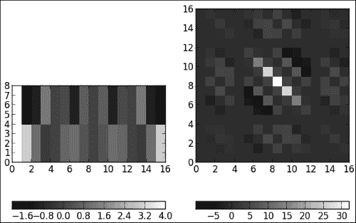
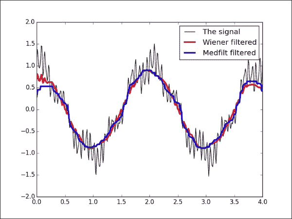
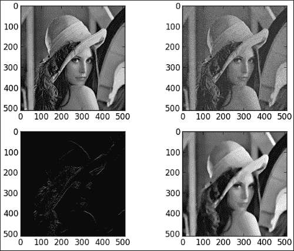
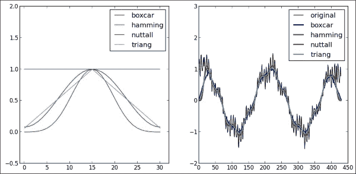
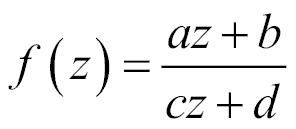
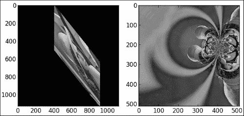
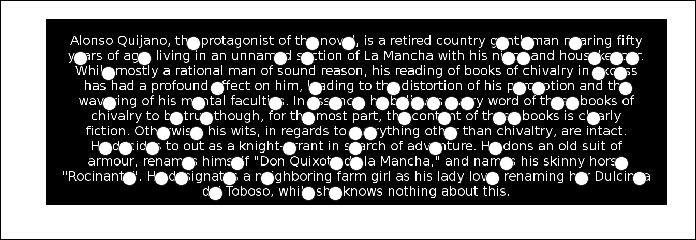

# 第五章. SciPy 信号处理

我们将信号定义为测量时间变化或空间变化现象的数据。声音或心电图是时间变化量的优秀例子，而图像则体现了典型的空间变化情况。动态图像（电影或视频）显然使用了这两种信号类型的技术。

信号处理领域处理此类数据的四个方面——其获取、质量改进、压缩和特征提取。SciPy 有许多例程可以有效地处理四个领域中的任何一项任务。所有这些都被包含在两个低级模块中（`scipy.signal`是主要的一个，侧重于时变数据，而`scipy.ndimage`用于图像）。这两个模块中的许多例程都是基于数据的离散傅里叶变换。

在本章中，我们将涵盖以下内容：

+   背景算法的定义，`scipy.fftpack`

+   信号构建的内建函数

+   函数的展示，用于过滤空间或时间序列信号

关于该主题的更多详细信息可以在*Python for Signal Processing*，*Unpingco José*，*Springer Publishing*中找到。

# 离散傅里叶变换

离散傅里叶变换（DFT）将任何信号从其时间/空间域转换到相关频率域的信号。这使我们不仅能够分析数据的不同频率，而且当正确使用时，还能实现更快的滤波操作。由于逆傅里叶变换（IFT）的存在，我们还可以将频率域中的信号转换回其时间/空间域。由于我们假设对这种理论有一定程度的熟悉，因此我们不会深入探讨这些算子背后的数学细节。我们将专注于语法和应用。

`scipy.fftpack`模块中的基本例程计算 DFT 及其逆变换，适用于任何维度的离散信号——`fft`，`ifft`（一维）；`fft2`，`ifft2`（二维）；`fftn`，`ifftn`（任意维数）。所有这些例程都假设数据是复值。如果我们事先知道特定的数据集实际上是实值，并且应该提供实值频率，我们则使用`rfft`和`irfft`，以获得更快的算法。所有这些例程都设计得使得与它们的逆运算组合总是得到恒等变换。所有情况下的语法都是相同的，如下所示：

```py
fft(x[, n, axis, overwrite_x])
```

第一个参数，`x`，总是任何数组形式的信号。请注意，`fft`执行一维变换。这意味着如果`x`是二维的，例如，`fft`将输出另一个二维数组，其中每一行是原始每一行的变换。我们可以使用列代替，通过可选参数`axis`。其余参数也是可选的；`n`表示变换的长度，`overwrite_x`移除原始数据以节省内存和资源。我们通常在需要用零填充信号或截断它时玩整数`n`。对于更高维数，`n`由`shape`（一个元组）替换，`axis`由`axes`（另一个元组）替换。

为了更好地理解输出，通常使用`fftshift`将零频率移到输出数组的中心是有用的。该操作的逆操作`ifftshift`也包含在该模块中。以下代码展示了当应用于棋盘图像时，这些例程的一些实际应用：

```py
>>> import numpy
>>> from scipy.fftpack import fft,fft2, fftshift
>>> import matplotlib.pyplot as plt
>>> B=numpy.ones((4,4)); W=numpy.zeros((4,4))
>>> signal = numpy.bmat("B,W;W,B")
>>> onedimfft = fft(signal,n=16)
>>> twodimfft = fft2(signal,shape=(16,16))
>>> plt.figure()
>>> plt.gray()
>>> plt.subplot(121,aspect='equal')
>>> plt.pcolormesh(onedimfft.real)
>>> plt.colorbar(orientation='horizontal')
>>> plt.subplot(122,aspect='equal')
>>> plt.pcolormesh(fftshift(twodimfft.real))
>>> plt.colorbar(orientation='horizontal')
>>> plt.show()

```

注意一维变换的前四行是相等的（后四行也是如此），而二维变换（一旦移位）在原点处呈现峰值，并在频域中表现出良好的对称性。

在以下屏幕截图（由前面的代码获得）中，左边的图像是`fft`，右边的图像是 2 x 2 棋盘信号的`fft2`：



`scipy.fftpack`模块还提供了离散余弦变换及其逆变换（`dct`，`idct`），以及许多以所有这些变换为定义的微分和伪微分算子 – `diff`（用于导数/积分）；`hilbert`，`ihilbert`（用于希尔伯特变换）；`tilbert`，`itilbert`（用于周期序列的 h-Tilbert 变换）等等。

# 信号构造

为了帮助构建具有预定属性的信号，`scipy.signal`模块提供了一系列文献中最常见的单维波形 – `chirp`和`sweep_poly`（用于频率扫描余弦发生器），`gausspulse`（高斯调制的正弦波），`sawtooth`和`square`（用于具有这些名称的波形）。它们都以一维`ndarray`作为主要参数，表示信号要评估的时间。其他参数根据频率或时间约束控制信号的设计。让我们看看以下代码片段，它说明了我们刚才讨论的这些一维波形的用法：

```py
>>> import numpy
>>> from scipy.signal import chirp, sawtooth, square, gausspulse
>>> import matplotlib.pyplot as plt
>>> t=numpy.linspace(-1,1,1000)
>>> plt.subplot(221); plt.ylim([-2,2])
>>> plt.plot(t,chirp(t,f0=100,t1=0.5,f1=200))   # plot a chirp
>>> plt.title("Chirp signal")
>>> plt.subplot(222); plt.ylim([-2,2])
>>> plt.plot(t,gausspulse(t,fc=10,bw=0.5))      # Gauss pulse
>>> plt.title("Gauss pulse")
>>> plt.subplot(223); plt.ylim([-2,2])
>>> t*=3*numpy.pi
>>> plt.plot(t,sawtooth(t))                     # sawtooth
>>> plt.xlabel("Sawtooth signal")
>>> plt.subplot(224); plt.ylim([-2,2])
>>> plt.plot(t,square(t))                       # Square wave
>>> plt.xlabel("Square signal")
>>> plt.show()

```

由此代码生成的以下图表显示了`chirp`，`gausspulse`，`sawtooth`和`square`的波形：


创建信号的传统方法是从文件中导入它们。这可以通过使用纯 NumPy 例程来实现；例如，`fromfile`:

```py
fromfile(file, dtype=float, count=-1, sep='')
```

`file`参数可以指向一个文件或一个字符串，`count`参数用于确定要读取的项目数量，而`sep`表示原始文件/字符串中的分隔符。对于图像，我们有通用的例程`imread`，在`scipy.ndimage`或`scipy.misc`模块中：

```py
imread(fname, flatten=False)
```

`fname`参数是一个包含图像位置的字符串。例程推断文件类型，并相应地将数据读入数组。如果将`flatten`参数设置为`True`，则图像被转换为灰度。请注意，为了使`fromfile`和`imread`工作，需要安装**Python Imaging Library**（**PIL**）。

还可以使用`read`和`write`例程从`scipy.io`模块中的`wavfile`子模块加载`.wav`文件进行分析。例如，以下代码行使用`read`例程读取一个音频文件，例如`audio.wav`：

```py
>>> rate,data = scipy.io.wavfile.read("audio.wav")

```

该命令将一个整数值分配给`rate`变量，表示文件的采样率（以每秒样本数计），并将一个 NumPy `ndarray`分配给`data`变量，其中包含分配给不同音符的数值。如果我们希望将一些一维`ndarray 数据`写入这种类型的音频文件，采样率由`rate`变量给出，我们可以通过以下命令实现：

```py
>>> scipy.io.wavfile.write("filename.wav",rate,data)

```

# 过滤器

滤波器是对信号的操作，要么去除特征，要么提取某些成分。SciPy 提供了一套完整的已知滤波器以及构建新滤波器的工具。SciPy 中的滤波器列表很长，我们鼓励读者探索`scipy.signal`和`scipy.ndimage`模块的帮助文档以获得完整的信息。在这些页面上，我们将介绍一些在音频或图像处理中常用的滤波器。

我们首先创建一个需要过滤的信号：

```py
>>> from numpy import sin, cos, pi, linspace
>>> f=lambda t: cos(pi*t) + 0.2*sin(5*pi*t+0.1) + 0.2*sin(30*pi*t) + 0.1*sin(32*pi*t+0.1) + 0.1*sin(47* pi*t+0.8)
>>> t=linspace(0,4,400); signal=f(t)

```

首先，我们测试了**Wiener**和**Kolmogorov**的经典平滑滤波器`wiener`。我们在`plot`中展示了原始信号（黑色）和相应的滤波数据，选择 Wiener 窗口大小为 55 个样本（蓝色）。接下来，我们比较了应用具有与之前相同大小的核的中值滤波器`medfilt`的结果（红色）：

```py
>>> from scipy.signal import wiener, medfilt
>>> import matplotlib.pylab as plt
>>> plt.plot(t,signal,'k', label='The signal')
>>> plt.plot(t,wiener(signal,mysize=55),'r',linewidth=3, label='Wiener filtered')
>>> plt.plot(t,medfilt(signal,kernel_size=55),'b',linewidth=3, label='Medfilt filtered')
>>> plt.legend()
>>> plt.show()

```

这给出了以下图表，显示了平滑滤波器（红色的是**Wiener**，其起点正好在**0.5**上方，蓝色的是**Medfilt**，其起点在**0.5**下方）的比较：



`scipy.signal`模块中的大多数滤波器都可以适应与任何维度的数组一起工作。但在图像的特定情况下，我们更倾向于使用`scipy.ndimage`模块中的实现，因为它们是针对这些对象编写的。例如，为了对图像执行中值滤波以平滑处理，我们使用`scipy.ndimage.median_filter`。让我们看一个例子。我们将首先将 Lena 加载为数组，并用高斯噪声（均值为零，标准差为 16）对图像进行破坏：

```py
>>> from scipy.stats import norm     # Gaussian distribution
>>> import matplotlib.pyplot as plt
>>> import scipy.misc
>>> import scipy.ndimage
>>> plt.gray()
>>> lena=scipy.misc.lena().astype(float)
>>> plt.subplot(221);
>>> plt.imshow(lena)
>>> lena+=norm(loc=0,scale=16).rvs(lena.shape)
>>> plt.subplot(222);
>>> plt.imshow(lena)
>>> denoised_lena = scipy.ndimage.median_filter(lena,3)
>>> plt.subplot(224); 
>>> plt.imshow(denoised_lena)

```

图像滤波器集有两种类型——统计和形态。例如，在具有统计性质的滤波器中，我们有**索贝尔**算法，该算法面向边缘检测（曲线上的奇点）。其语法如下：

```py
sobel(image, axis=-1, output=None, mode='reflect', cval=0.0)
```

可选参数`axis`表示计算所进行的维度。默认情况下，这始终是最后一个轴（-1）。`mode`参数，它可以是字符串`'reflect'`、`'constant'`、`'nearest'`、`'mirror'`或`'wrap'`之一，表示在数据不足无法进行计算时如何处理图像的边界。如果`mode`是`'constant'`，我们可以使用`cval`参数来指定用于边界的值。让我们看看以下代码片段，它说明了`sobel`滤波器的使用：

```py
>>> from scipy.ndimage.filters import sobel
>>> import numpy
>>> lena=scipy.misc.lena()
>>> sblX=sobel(lena,axis=0); sblY=sobel(lena,axis=1)
>>> sbl=numpy.hypot(sblX,sblY)
>>> plt.subplot(223); 
>>> plt.imshow(sbl) 
>>> plt.show()

```

以下截图展示了前两个滤波器的实际应用——Lena（左上角）、噪声 Lena（右上角）、索贝尔边缘图（左下角）和中值滤波器（右下角）：



## LTI 系统理论

为了研究时不变线性系统对输入信号的响应，我们在`scipy.signal`模块中拥有许多资源。实际上，为了简化对象的表示，我们有一个`lti`类（线性时不变类），以及与之相关的方法，如`bode`（用于计算博德幅度和相位数据）、`impulse`、`output`和`step`。

无论我们是在处理连续时间还是离散时间线性系统，我们都有模拟此类系统（连续的`lsim`和`lsim2`，离散的`dsim`）、计算冲激（连续的`impulse`和`impulse2`，离散的`dimpulse`）和阶跃（连续的`step`和`step2`，离散的`dstep`）的例程。

使用`cont2discrete`可以将系统从连续转换为离散，但在任何情况下，我们都能为任何系统提供其任何表示形式，以及从一种表示形式转换为另一种表示形式。例如，如果我们有传递函数的零点`z`、极点`p`和系统增益`k`，我们可以使用`zpk2tf(z,p,k)`获得多项式表示（先分子后分母）。如果我们有传递函数的分子（`num`）和分母（`dem`），我们可以使用`tf2ss(num,dem)`获得状态空间。这个操作可以通过`ss2tf`例程进行逆操作。从零极增益到/从状态空间的表示形式变化也在（`zpk2ss`，`ss2zpk`）模块中考虑。

## 过滤器设计

`scipy.signal`模块中有一些例程允许使用不同的方法创建不同类型的过滤器。例如，`bilinear`函数使用双线性变换将模拟转换为数字滤波器。**有限脉冲响应**（**FIR**）滤波器可以通过`firwin`和`firwin2`例程使用窗口方法设计。**无限脉冲响应**（**IIR**）滤波器可以通过`iirdesign`或`iirfilter`以两种不同的方式设计。**巴特沃斯**滤波器可以通过`butter`例程设计。还有设计**切比雪夫**（`cheby1`，`cheby2`）、**卡乌尔**（`ellip`）和 Bessel（`bessel`）滤波器的例程。

## 窗口函数

没有广泛列表的窗口——在特定域外为零值的数学函数——的信号处理计算系统将是不完整的。在本节中，我们将使用`scipy.signal`模块中实现的一些编码窗口，通过卷积设计非常简单的平滑滤波器。

我们将在之前使用的相同一维信号上测试它们，以便进行比较。

我们首先展示四个著名的窗口函数的图表——箱形、汉明、布莱克曼-哈里斯（Nuttall 版本）和三角形。我们将使用 31 个样本的大小：

```py
>>> from scipy.signal import boxcar, hamming, nuttall, triang
>>> import matplotlib.pylab as plt
>>> windows=['boxcar', 'hamming', 'nuttall', 'triang']
>>> plt.subplot(121)
>>> for w in windows:
 eval( 'plt.plot(' + w + '(31))' )
 plt.ylim([-0.5,2]); plt.xlim([-1,32])
 plt.legend(windows)

```

为了绘图目的，我们需要将原始信号扩展十五个样本：

```py
>>> plt.subplot(122)
>>> import numpy
>>> from numpy import sin, cos, pi, linspace
>>> f=lambda t: cos(pi*t) + 0.2*sin(5*pi*t+0.1) + 0.2*sin(30*pi*t) + 0.1*sin(32*pi*t+0.1) + 0.1*sin(47* pi*t+0.8)
>>> t=linspace(0,4,400); signal=f(t)
>>> extended_signal=numpy.r_[signal[15:0:-1],signal,signal[-1:-15:- 1]]
>>> plt.plot(extended_signal,'k')

```

最后一步是过滤器本身，我们通过简单的卷积来实现：

```py
>>> for w in windows:
 window = eval( w+'(31)')
 output=numpy.convolve(window/window.sum(),signal)
 plt.plot(output,linewidth=2)
 plt.ylim([-2,3]); plt.legend(['original']+windows)
>>> plt.show()

```

这会产生以下输出，显示信号与不同窗口的卷积：



## 图像插值

对图像进行某些几何操作的过滤器集合在经典上被称为图像插值，因为这种数值技术是所有算法的根源。实际上，SciPy 将这些功能收集在子模块`scipy.ndimage.interpolation`下，以便于访问。本节最好通过示例来解释，涵盖几何变换中最有意义的例程。起点是图像，Lena。我们现在假设子模块中的所有函数都已导入会话中。

我们需要在图像的域上应用一个仿射变换，如下矩阵形式给出：


要在图像域上应用变换，我们发出`affine_transform`命令（请注意，语法是自解释的）：

```py
>>> import scipy.misc
>>> import numpy 
>>> import matplotlib.pylab as plt 
>>> from scipy.ndimage.interpolation import affine_transform
>>> lena=scipy.misc.lena() 
>>> A=numpy.mat("0,1;-1,1.25"); b=[-400,0]
>>> Ab_Lena=affine_transform(lena,A,b,output_shape=(512*2.2,512*2.2))
>>> plt.gray() 
>>> plt.subplot(121) 
>>> plt.imshow(Ab_Lena)

```

对于一般变换，我们使用`geometric_transform`例程，其语法如下：

```py
geometric_transform(input, mapping, output_shape=None, 
                    output=None, order=3, mode='constant',
cval=0.0, prefilter=True, extra_arguments=(),
extra_keywords={})
```

我们需要提供一个从元组到元组的 2 阶映射作为参数映射。例如，我们希望对复数值`z`（假设`a`、`b`、`c`和`d`的值已经定义，并且它们是复数值）应用**莫比乌斯**变换，如下公式所示：



我们必须以以下方式编写代码：

```py
>>> def f(z):
 temp = a*(z[0]+1j*z[1]) + b
 temp /= c*(z[0]+1j*z[1])+d
 return (temp.real, temp.imag)

```

在这两个函数中，无法直接用公式计算的网格值使用样条插值推断。我们可以使用`order`参数指定此插值的顺序。定义域外的点不进行插值，而是根据某些预定的规则填充。我们可以通过传递一个字符串到`mode`选项来强制执行此规则。选项有 – `'constant'`，使用我们可以通过`cval`选项施加的常数值；`'nearest'`，在每个水平线上继续插值的最后一个值；和`'reflect'`或`'wrap'`，这些是自解释的。

例如，对于值`a = 2**15*(1+1j)`、`b = 0`、`c = -2**8*(1-1j*2)`和`d = 2**18-1j*2**14`，在应用`reflect`模式后，我们得到的结果，如代码行之后所示：

```py
>>> from scipy.ndimage.interpolation import geometric_transform 
>>> a = 2**15*(1+1j); b = 0; c = -2**8*(1-1j*2); d = 2**18-1j*2**14
>>> Moebius_Lena = geometric_transform(lena,f,mode='reflect')
>>> plt.subplot(122); 
>>> plt.imshow(Moebius_Lena) 
>>> plt.show()

```

以下截图显示了仿射变换（左侧）和几何变换（右侧）：



对于旋转、平移或缩放的特殊情况，我们有语法糖例程，`rotate(input,angle)`、`shift(input, offset)`和`zoom(input,dilation_factor)`。

对于任何图像，我们知道数组在域中像素值（具有整数坐标）的值。但没有整数坐标的位置对应的值是什么？我们可以使用有价值的例程`map_coordinates`来获取这些信息。请注意，语法可能令人困惑，特别是对于`coordinates`参数：

```py
map_coordinates(input, coordinates, output=None, order=3, 
                mode='constant', cval=0.0, prefilter=True)
```

例如，如果我们希望评估 Lena 在位置（10.5，11.7）和（12.3，1.4），我们收集坐标作为序列的序列；第一个内部序列包含`x`值，第二个，包含`y`值。我们可以使用`order`指定使用的样条顺序，如果需要，在域外指定插值方案，如前例所示。让我们使用以下代码片段评估 Lena 在（我们刚才在示例中讨论的位置）：

```py
>>> import scipy.misc 
>>> from scipy.ndimage.interpolation import map_coordinates
>>> lena=scipy.misc.lena().astype(float)
>>> coordinates=[[10.5, 12.3], [11.7, 1.4]]
>>> map_coordinates(lena, coordinates, order=1)

```

输出如下所示：

```py
array([ 157.2 ,  157.42])

```

此外，我们使用`order=2`评估 Lena，如下代码行所示：

```py
>>> map_coordinates(lena, coordinates, order=2)

```

输出如下所示：

```py
array([ 157.80641507,  157.6741489 ])

```

## 形态学

我们还有可能基于数学形态学创建和应用图像过滤器，这些过滤器既可以应用于二值图像，也可以应用于灰度图像。四种基本的形态学操作是开运算（`binary_opening`）、闭运算（`binary_closing`）、膨胀（`binary_dilation`）和腐蚀（`binary_erosion`）。请注意，每个这些过滤器的语法都非常简单，因为我们只需要两个成分——要过滤的信号和执行形态学操作的结构元素。让我们来看看这些形态学操作的一般语法：

```py
binary_operation(signal, structuring_element)
```

我们已经展示了这些操作在获取氧化物结构模型中的应用，但我们将把这个例子推迟到我们介绍第七章中的三角剖分和 Voronoi 图概念时再进行。

我们可以使用这四种基本形态学操作的组合来创建更复杂的过滤器，用于去除孔洞、点中击或未击变换（用于在二值图像中找到特定模式的位置）、降噪、边缘检测等等。该模块甚至为我们提供了一些最常用的这种方式的过滤器。例如，对于文本中字母 e 的位置（我们已在第二章中介绍过，*作为 SciPy 计算几何第一步的 NumPy 数组处理*，作为相关性的应用），我们可以使用以下命令代替：

```py
>>> binary_hit_or_miss(text, letterE)

```

为了比较的目的，让我们将此命令应用于第二章中的示例，*作为 SciPy 计算几何第一步的 NumPy 数组处理*：

```py
>>> import numpy
>>> import scipy.ndimage
>>> import matplotlib.pylab as plt
>>> from scipy.ndimage.morphology import binary_hit_or_miss
>>> text = scipy.ndimage.imread('CHAP_05_input_textImage.png')
>>> letterE = text[37:53,275:291]
>>> HitorMiss = binary_hit_or_miss(text, structure1=letterE, origin1=1) 
>>> eLocation = numpy.where(HitorMiss==True)
>>> x=eLocation[1]; y=eLocation[0]
>>> plt.imshow(text, cmap=plt.cm.gray, interpolation='nearest')
>>> plt.autoscale(False)
>>> plt.plot(x,y,'wo',markersize=10)
>>> plt.axis('off')
>>> plt.show()

```

这将生成以下输出，读者应该将其与第二章中的对应输出进行比较，*作为 SciPy 计算几何第一步的 NumPy 数组处理*：



对于灰度图像，我们可以使用结构元素（`structuring_element`）或足迹。因此，语法略有不同：

```py
grey_operation(signal, [structuring_element, footprint, size, ...])

```

如果我们希望使用一个完全平坦且矩形的结构元素（所有*1*），那么只需要用一个元组来表示其大小即可。例如，为了在我们的经典图像 Lena 上对`size (15,15)`的平坦元素进行灰度膨胀，我们发出以下命令：

```py
>>> grey_dilation(lena, size=(15,15))

```

scipy.ndimage 模块中编码的最后一种形态学操作执行距离和特征变换。距离变换创建一个映射，将每个像素分配到最近的对象的距离。特征变换则提供最近背景元素的索引。这些操作用于将图像分解为不同的标签。我们甚至可以选择不同的度量标准，如欧几里得距离、棋盘距离和**出租车**距离。使用暴力算法的距离变换（`distance_transform`）的语法如下：

```py
distance_transform_bf(signal, metric='euclidean', sampling=None,
return_distances=True, return_indices=False,
                      distances=None, indices=None)
```

我们用字符串如 `'euclidean'`、`'taxicab'` 或 `'chessboard'` 来指示度量标准。如果我们想提供特征变换，我们将 `return_distances` 设置为 `False`，将 `return_indices` 设置为 `True`。

使用更复杂的算法，也有类似的程序可用 – `distance_transform_cdt`（使用 chamfering 计算出租车和棋盘距离）。对于欧几里得距离，我们也有 `distance_transform_edt`。所有这些都使用相同的语法。

# 摘要

在本章中，我们探讨了信号处理（任何维度），包括通过它们的离散傅里叶变换来处理频域中的信号。这些对应于 `fftpack`、`signal` 和 `ndimage` 模块。

第六章, *SciPy 数据挖掘*，将探讨 SciPy 中包含的工具，以解决统计和数据挖掘问题。除了标准统计量之外，还将介绍特殊主题，如核估计、统计距离和大数据集的聚类。
