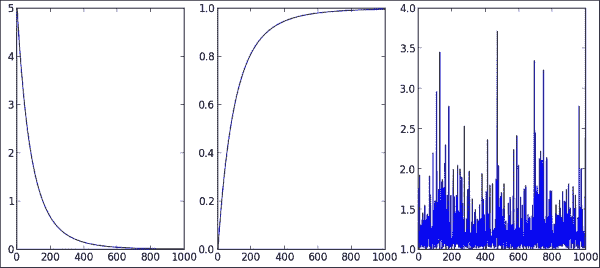
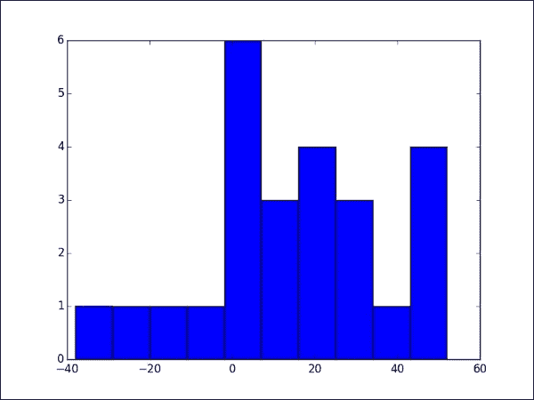
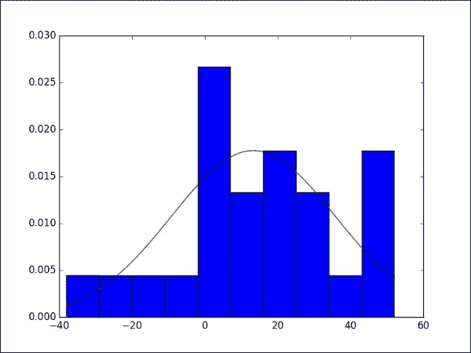
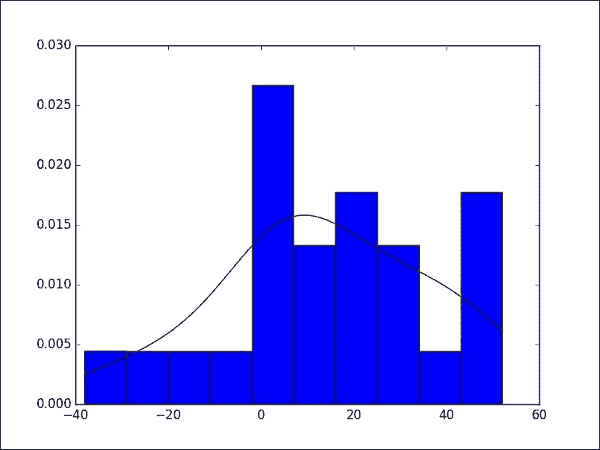
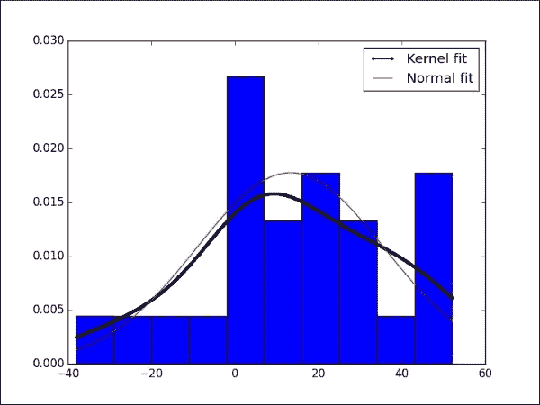
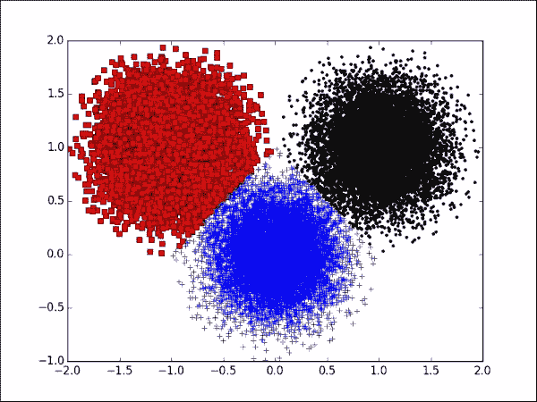
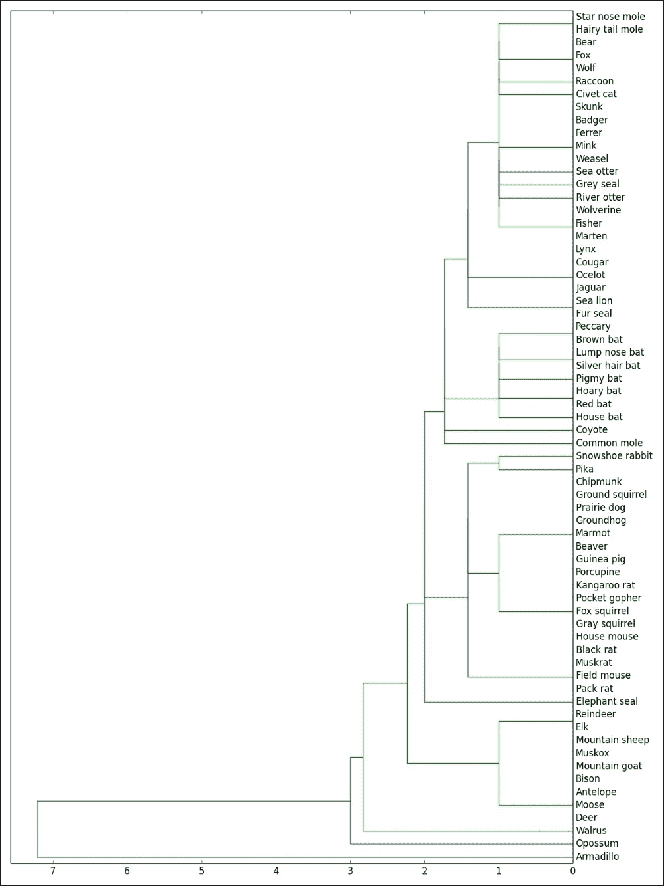

# 第六章 SciPy 数据挖掘

本章涵盖了数学和统计学中处理数据收集、组织、分析和解释的分支。这些应用和操作分布在多个模块和子模块中：`scipy.stats`（纯统计工具）、`scipy.ndimage.measurements`（数据分析和组织）、`scipy.spatial`（空间算法和数据结构），以及最终的聚类包`scipy.cluster`。`scipy.cluster`聚类包包括两个子模块：`scipy.cluster.vq`（矢量量化）和`scipy.cluster.hierarchy`（用于层次和**聚合**聚类）。

如前几章所述，假设读者对主题熟悉。我们的重点是向您展示一些可用于执行统计计算的 SciPy 函数，而不是教授它。因此，您可以在阅读您喜欢的相关书籍的同时阅读本章，以便您可以全面探索本章中提供的示例以及额外的数据集。

然而，我们应该提到，Python 中还有其他专门模块可以用于从不同角度探索这个主题。其中一些（本书中未涉及）是**模块化数据处理工具包**（**MDP**）([`mdp-toolkit.sourceforge.net/install.html`](http://mdp-toolkit.sourceforge.net/install.html))、**scikit-learn**([`scikit-learn.org/`](http://scikit-learn.org/))和**Statsmodels**([`statsmodels.sourceforge.net/`](http://statsmodels.sourceforge.net/))。

在本章中，我们将涵盖以下内容：

+   通过 SciPy 计算的标准描述性统计量

+   SciPy 中处理统计分布的内置函数

+   Scipy 查找区间估计的功能

+   执行统计相关性和一些统计测试的计算，分布拟合和统计距离

+   聚类示例

# 描述性统计

我们经常需要分析数据，其中某些特征被分组在不同的区域，每个区域具有不同的尺寸、值、形状等。`scipy.ndimage.measurements`子模块具有完成此任务的正确工具，最佳方式是通过详尽的示例来展示模块的功能。例如，对于零和一的二值图像，可以使用`label`命令标记每个连通区域（值为一的连续像素区域），并使用该命令获取这些区域的数量。如果我们希望获取这些区域的质心，可以使用`center_of_mass`命令。我们可以在第七章 *SciPy 计算几何*的应用中再次看到这些操作的实际应用。

对于非二进制数据，`scipy.ndimage.measurements`子模块提供了通常的基本统计测量（极值值和位置，均值，标准差，总和，方差，直方图等）。

对于更高级的统计测量，我们必须访问来自`scipy.stats`模块的函数。我们现在可以使用几何平均数和调和平均数（`gmean`，`hmean`），中位数，众数，偏度，各种矩，或峰度（`median`，`mode`，`skew`，`moment`，`kurtosis`）。为了概述数据集最重要的统计特性，我们更喜欢使用`describe`过程。我们还可以计算项目频率（`itemfreq`），百分位数（`scoreatpercentile`，`percentileofscore`），直方图（`histogram`，`histogram2`），累积频率和相对频率（`cumfreq`，`relfreq`），标准误差（`sem`），以及信噪比（`signaltonoise`），这些总是很有用的。

# 分布

`scipy.stats`模块的主要优势之一是编码了大量的分布，包括连续和离散。列表令人印象深刻，至少有 80 个连续分布和 10 个离散分布。

使用这些分布最常见的方法是生成随机数。我们一直在使用这种技术来*污染*我们的图像，例如：

```py
>>> import scipy.misc 
>>> from scipy.stats import signaltonoise 
>>> from scipy.stats import norm     # Gaussian distribution
>>> lena=scipy.misc.lena().astype(float)
>>> lena+= norm.rvs(loc=0,scale=16,size=lena.shape)
>>> signaltonoise(lena,axis=None)

```

输出如下所示：

```py
array(2.459233897516763)

```

让我们看看 SciPy 处理分布的方法。首先，创建一个随机变量类（在 SciPy 中，对于连续随机变量有`rv_continuous`类，对于离散情况有`rv_discrete`类）。每个连续随机变量都有一个相关的概率密度函数（`pdf`），累积分布函数（`cdf`），生存函数及其逆函数（`sf`，`isf`），以及所有可能的描述性统计。它们还关联了随机变量`rvs`，这是我们实际生成随机实例所用的。例如，对于一个参数*b = 5*的帕累托连续随机变量，为了检查这些特性，我们可以发出以下命令：

```py
>>> import numpy
>>> from scipy.stats import pareto
>>> import matplotlib.pyplot as plt
>>> x=numpy.linspace(1,10,1000)
>>> plt.subplot(131); plt.plot(pareto.pdf(x,5))
>>> plt.subplot(132); plt.plot(pareto.cdf(x,5))
>>> plt.subplot(133); plt.plot(pareto.rvs(5,size=1000))
>>> plt.show()

```

这给出了以下图表，显示了概率密度函数（左），累积分布函数（中间），和随机生成（右）：



# 区间估计，相关度量，和统计测试

我们在第一章中简要介绍了 SciPy 的区间估计作为入门示例：`bayes_mvs`，语法非常简单，如下所示：

```py
bayes_mvs(data, alpha=0.9)
```

它返回一个包含三个参数的元组，其中每个参数的形式为`(center, (lower, upper))`。第一个参数指的是均值；第二个指的是方差；第三个指的是标准差。所有区间都是根据`alpha`给出的概率计算的，默认值为`0.9`。

我们可以使用 `linregress` 程序来计算二维数据 *x* 的回归线，或者两组一维数据，*x* 和 *y*。我们还可以计算不同的相关系数，以及它们对应的 p 值。我们有 **皮尔逊相关系数**（`pearsonr`），**斯皮尔曼秩相关**（`spearmanr`），**点二列相关**（`pointbiserialr`），以及 **肯德尔 tau**（`kendalltau`）用于有序数据。在所有情况下，语法都是相同的，因为它只需要一个二维数据数组，或者两个长度相同的一维数据数组。

SciPy 也包含了大多数已知的统计测试和程序：**t 检验**（`ttest_1samp` 用于一组分数，`ttest_ind` 用于两个独立样本的分数，或 `ttest_rel` 用于两个相关样本的分数），**柯尔莫哥洛夫-斯米尔诺夫检验**（`kstest`，`ks_2samp`）用于拟合优度，单因素 **卡方检验**（`chisquare`），以及更多。

让我们用一个教科书上的例子来说明这个模块的一些常规操作，这个例子基于 Timothy Sturm 对控制设计的 研究。

为了转动一个通过螺丝动作移动指示器的旋钮，25 名右手使用者被要求使用他们的右手。有两种相同的仪器，一个有右手螺纹，旋钮顺时针转动，另一个有左手螺纹，旋钮逆时针转动。以下表格给出了每个受试者将指示器移动到固定距离所需的时间（秒）：

| **受试者** | 1 | 2 | 3 | 4 | 5 | 6 | 7 | 8 | 9 | 10 |
| --- | --- | --- | --- | --- | --- | --- | --- | --- | --- | --- |
| **右螺纹** | 113 | 105 | 130 | 101 | 138 | 118 | 87 | 116 | 75 | 96 |
| **左螺纹** | 137 | 105 | 133 | 108 | 115 | 170 | 103 | 145 | 78 | 107 |
| **受试者** | 11 | 12 | 13 | 14 | 15 | 16 | 17 | 18 | 19 | 20 |
| **右螺纹** | 122 | 103 | 116 | 107 | 118 | 103 | 111 | 104 | 111 | 89 |
| **左螺纹** | 84 | 148 | 147 | 87 | 166 | 146 | 123 | 135 | 112 | 93 |
| **受试者** | 21 | 22 | 23 | 24 | 25 |   |   |   |   |   |
| **右螺纹** | 78 | 100 | 89 | 85 | 88 |   |   |   |   |   |
| **左螺纹** | 76 | 116 | 78 | 101 | 123 |   |   |   |   |   |

我们可以通过一个简单的单样本 t 统计量分析来得出结论，即右手使用者发现右手螺纹更容易使用。我们将如下方式将数据加载到内存中：

```py
>>> import numpy
>>> data = numpy.array([[113,105,130,101,138,118,87,116,75,96, \
 122,103,116,107,118,103,111,104,111,89,78,100,89,85,88], \
 [137,105,133,108,115,170,103,145,78,107, \
 84,148,147,87,166,146,123,135,112,93,76,116,78,101,123]])

```

每一行的差异表示哪个旋钮更快，以及快了多少时间。我们可以轻松地获得这些信息，并对它进行一些基本的统计分析。我们将从计算平均值、标准差和具有 10 个分箱的直方图开始：

```py
>>> dataDiff = data[1,:]-data[0,:]
>>> dataDiff.mean(), dataDiff.std()

```

输出如下所示：

```py
(13.32, 22.472596645692729)

```

让我们通过以下一系列命令绘制直方图：

```py
>>> import matplotlib.pyplot as plt
>>> plt.hist(dataDiff)
>>> plt.show()

```

这产生了以下直方图：



鉴于这个直方图，假设数据服从正态分布并不牵强。如果我们假设这是一个合适的简单随机样本，使用 t 统计量是合理的。我们想要证明左旋螺纹的转动时间比右旋螺纹长，因此我们将`dataDiff`的均值设定为与零均值（这表明两种螺纹所需时间相同）进行对比。

通过简单的命令计算双样本 t 统计量和双样本检验的 p 值，如下所示：

```py
>>> from scipy.stats import ttest_1samp
>>> t_stat,p_value=ttest_1samp(dataDiff,0.0)

```

然后计算单侧检验的 p 值：

```py
>>> print (p_value/2.0)

```

输出如下所示：

```py
0.00389575522747

```

注意，这个 p 值比通常的阈值`alpha = 0.05`或`alpha = 0.1`都要小得多。因此，我们可以保证我们有足够的证据来支持以下说法：右旋螺纹比左旋螺纹转动所需时间更短。

# 分布拟合

在 Timothy Sturm 的例子中，我们声称某些数据的直方图似乎符合正态分布。SciPy 有几个例程可以帮助我们近似随机变量的最佳分布，以及最佳拟合的参数。例如，对于那个问题中的数据，实现最佳拟合的正态分布的均值和标准差可以通过以下方式找到：

```py
>>> from scipy.stats import norm     # Gaussian distribution
>>> mean,std=norm.fit(dataDiff)

```

现在，我们可以绘制数据的（归一化）直方图，以及计算出的概率密度函数，如下所示：

```py
>>> plt.hist(dataDiff, normed=1)
>>> x=numpy.linspace(dataDiff.min(),dataDiff.max(),1000)
>>> pdf=norm.pdf(x,mean,std)
>>> plt.plot(x,pdf)
>>> plt.show()

```

我们将获得以下图表，显示对`dataDiff`最佳拟合的正态分布的最大似然估计：



我们甚至可以不指定任何特定的分布来拟合最佳概率密度函数，这要归功于一种非参数技术，**核密度估计**。我们可以在`scipy.stats.kde`子模块中找到一个执行高斯核密度估计的算法。让我们通过以下示例来展示，使用与之前相同的数据：

```py
>>> from scipy.stats import gaussian_kde
>>> pdf=gaussian_kde(dataDiff)

```

如前所述的稍微不同的绘图会给出以下图表，显示通过核密度估计在`dataDiff`上获得的概率密度函数：



以下为完整的代码块：

```py
>>> from scipy.stats import gaussian_kde
>>> pdf = gaussian_kde(dataDiff)
>>> pdf = pdf.evaluate(x)
>>> plt.hist(dataDiff, normed=1)
>>> plt.plot(x,pdf,'k')
>>> plt.savefig("hist2.png")
>>> plt.show()

```

为了比较目的，最后两个图表可以合并成一个：

```py
>>> plt.hist(dataDiff, normed=1)
>>> plt.plot(x,pdf,'k.-',label='Kernel fit')
>>> plt.plot(x,norm.pdf(x,mean,std),'r',label='Normal fit')
>>> plt.legend() 
>>> plt.savefig("hist3.png")
>>> plt.show()

```

输出是以下综合图表：



# 距离

在数据挖掘领域，经常需要确定训练集中哪些成员与未知测试实例最接近。对于任何执行搜索的算法，拥有一个好的不同距离函数集是必不可少的，SciPy 为此目的在`scipy.spatial`模块的距离子模块中提供了一个巨大的优化编码函数集合。列表很长。除了欧几里得、平方欧几里得或标准化欧几里得之外，我们还有许多其他函数——**Bray-Curtis**、**Canberra**、**Chebyshev**、**Manhattan**、相关距离、余弦距离、**dice 不相似性**、**Hamming**、**Jaccard-Needham**、**Kulsinski**、**Mahalanobis**等等。在大多数情况下，语法都很简单：

```py
distance_function(first_vector, second_vector)
```

语法不同的只有三种情况，即闵可夫斯基、马氏和标准化欧几里得距离，其中距离函数需要整数（用于闵可夫斯基距离定义中范数的阶数），马氏距离的情况需要协方差（但这是一个可选要求），或者方差矩阵来标准化欧几里得距离。

现在我们来看一个有趣的练习，用于可视化 Minkowski 度量中的单位球：

```py
>>> import numpy 
>>> from scipy.spatial.distance import minkowski 
>>> Square=numpy.mgrid[-1.1:1.1:512j,-1.1:1.1:512j]
>>> X=Square[0]; Y=Square[1]
>>> f=lambda x,y,p: minkowski([x,y],[0.0,0.0],p)<=1.0
>>> Ball=lambda p:numpy.vectorize(f)(X,Y,p)

```

我们创建了一个函数`Ball`，它创建一个 512 x 512 的布尔值网格。该网格代表一个以原点为中心、边平行于坐标轴的长度为 2.2 的正方形，其上的真实值代表所有在 Minkowski 度量中参数`p`的单位球内的网格点。我们只需将其图形化展示，如下例所示：

```py
>>> import matplotlib.pylab as plt
>>> plt.imshow(Ball(3), cmap = plt.cm.gray)
>>> plt.axis('off')
>>> plt.subplots_adjust(left=0.0127,bottom=0.0164,\
 right=0.987,top=0.984)
>>> plt.show()

```

这产生了以下结果，其中`Ball(3)`是参数`p = 3`的 Minkowski 度量的单位球：


我们觉得有必要发出以下四个重要警告：

+   **第一次警告**：只要可能，我们必须使用这些过程而不是创建我们自己的对应距离函数的定义。它们保证了更快的结果，并优化了处理输入过大或过小的情况的编码。

+   **第二次警告**：这些函数在比较两个向量时工作得很好；然而，对于许多向量的成对计算，我们必须求助于`pdist`过程。此命令接受一个表示*m*个维度为*n*的向量的*m x n*数组，并计算它们之间的距离。我们使用选项 metric 和所需的附加参数来指示要使用的距离函数。例如，对于五个随机选择的四维向量（整数值为`1`、`0`或`-1`）的曼哈顿（`cityblock`）距离，我们可以发出以下命令：

    ```py
    >>> import scipy.stats
    >>> from scipy.spatial.distance import pdist
    >>> V=scipy.stats.randint.rvs(0.4,3,size=(5,4))-1
    >>> print (V)

    ```

    输出如下所示：

    ```py
    [[ 1  0  1 -1]
     [-1  0 -1  0]
     [ 1  1  1 -1]
     [ 1  1 -1  0]
     [ 0  0  1 -1]]

    ```

    让我们看看以下`pdist`命令：

    ```py
    >>> pdist(V,metric='cityblock')

    ```

    输出如下所示：

    ```py
    array([ 5.,  1.,  4.,  1.,  6.,  3.,  4.,  3.,  2.,  5.])

    ```

    这意味着，如果`v1 = [1,0,1,-1]`，`v2 = [-1,0,-1,0]`，`v3 = [1,1,1,-1]`，`v4 = [1,1,-1,0]`，`v5 = [0,0,1,-1]`，那么`v1`到`v2`的曼哈顿距离是 5。`v1`到`v3`的距离是 1；到`v1`到`v4`，4；到`v1`到`v5`，1。从`v2`到`v3`的距离是 6；从`v2`到`v4`，3；从`v2`到`v5`，4。从`v3`到`v4`的距离是 3；从`v3`到`v5`，2。最后，`v4`到`v5`的距离是 5，这是输出的最后一个条目。

+   **第三次警告**：在计算两个输入集合中每对之间的距离时，我们应该使用`cdist`过程，它具有类似的语法。例如，对于两个由随机选择的四维布尔向量组成的集合，相应的 Jaccard-Needham 不相似度计算如下：

    ```py
    >>> from scipy.spatial.distance import cdist
    >>> V=scipy.stats.randint.rvs(0.4, 2, size=(3,4)).astype(bool)
    >>> W=scipy.stats.randint.rvs(0.4, 3, size=(2,4)).astype(bool)
    >>> cdist(V,W,'jaccard')
    array([[ 0.75      ,  1\.        ],
     [ 0.75      ,  1\.        ],
     [ 0.33333333,  0.5       ]])

    ```

    即，如果`V`中的三个向量分别标记为`v1`、`v2`和`v3`，而`W`中的两个向量分别标记为`w1`和`w2`，那么`v1`和`w1`之间的不相似度为 0.75；`v1`和`w2`之间的不相似度为 1；依此类推。

+   **第四次警告**：当我们有大量数据点并且需要解决最近邻问题（例如，定位数据中与新的实例点最近的元素）时，我们很少通过暴力方法来做。执行此搜索的最佳算法基于 k 维树的概念。SciPy 有两个类来处理这些对象—`KDTree`和`cKDTree`。后者是前者的子集，由于它是用 C 代码包装的，所以稍微快一点，但用途非常有限。它只有`query`方法来查找输入的最近邻。语法简单，如下所示：

    ```py
    KDTree(data, leafsize=10)
    ```

    这创建了一个包含二叉树的结构，非常适合快速搜索算法的设计。`leafsize`选项表示在什么级别上必须放弃基于二叉树结构的搜索，转而使用暴力搜索。

    与`KDTree`类相关联的其他方法包括—`count_neighbors`，用于计算可以与另一个`KDTree`形成的邻近对的数量；`query_ball_point`，用于查找给定距离内的所有点；`query_ball_tree`和`query_pairs`，用于查找一定距离内的所有点对；以及`sparse_distance_matrix`，它计算两个`KDTree`类之间的距离稀疏矩阵。

    让我们用一个包含 10 个随机生成的四维整数点的数据集来看看它的实际应用：

    ```py
    >>> from scipy.spatial import KDTree
    >>> data=scipy.stats.randint.rvs(0.4,10,size=(10,4))
    >>> print (data)

    ```

    输出如下所示：

    ```py
    [[8 6 1 1]
     [2 9 1 5]
     [4 8 8 9]
     [2 6 6 4]
     [4 1 2 1]
     [3 8 7 2]
     [1 1 3 6]
     [5 2 1 5]
     [2 5 7 3]
     [6 0 6 9]]
    >>> tree=KDTree(data)
    >>> tree.query([0,0,0,0])

    ```

    输出如下所示：

    ```py
    (4.6904157598234297, 4)

    ```

这意味着，在数据集中的所有点中，到原点欧几里得距离最近的是第五个点（索引 4），距离恰好是 4.6 个单位。

我们可以有一个包含多个点的输入；输出仍然是一个元组，其中第一个条目是一个数组，指示每个输入点的最小距离。第二个条目是另一个数组，指示最近邻的索引。

# 聚类

数据挖掘中使用的另一种技术是聚类。SciPy 有两个模块来处理这个领域的任何问题，每个模块都针对不同的聚类工具——`scipy.cluster.vq`用于 k-means 聚类和`scipy.cluster.hierarchy`用于层次聚类。

## 向量量化与 k-means

我们有两个例程使用 k-means 技术将数据划分为聚类——`kmeans`和`kmeans2`。它们对应于两种不同的实现。前者具有非常简单的语法：

```py
kmeans(obs, k_or_guess, iter=20, thresh=1e-05)
```

`obs`参数是一个包含我们希望聚类的数据的`ndarray`。如果数组的维度是*m* x *n*，则算法将此数据解释为*n*维欧几里得空间中的*m*个点。如果我们知道这些数据应该被划分为多少个聚类，我们通过`k_or_guess`选项输入这个数字。输出是一个包含两个元素的元组。第一个是一个*k* x *n*维的`ndarray`，表示一个点的集合——与指示的聚类数量一样多。这些位置中的每一个都表示找到的聚类的质心。元组的第二个条目是一个表示传递的点与先前生成的质心之间的畸变的浮点值。

如果我们希望为聚类的质心指定一个初始猜测，我们可以再次通过`k_or_guess`参数这样做，通过发送一个*k* x *n*的`ndarray`。

我们传递给`kmeans`的数据需要通过`whiten`例程进行归一化。

第二种选项更加灵活，正如其语法所表明的：

```py
kmeans2(data, k, iter=10, thresh=1e-05,
minit='random', missing='warn')
```

`data`和`k`参数分别与`obs`和`k_or_guess`相同。这个例程的不同之处在于可以选择不同的初始化算法，因此，如果我们知道我们数据的一些属性，我们可以通过将一个字符串传递给`minit`参数来加速过程并使用更少的资源。我们可以通过传递一个*k* x *n*的`ndarray`来这样做，例如`'random'`（使用高斯随机构建初始化质心），`'points'`（通过选择属于我们数据的点进行初始化），或`'uniform'`（如果我们更喜欢均匀分布而不是高斯分布）。

如果我们希望使用`k`参数自己提供初始化质心，我们必须通过将`'matrix'`传递给`minit`选项来向算法指示我们的选择。

在任何情况下，如果我们希望通过将每个点分配到它所属的聚类来对原始数据进行分类；我们使用`vq`例程（用于向量量化）。语法同样简单：

```py
vq(obs, centroids)
```

输出是一个包含两个条目的元组。第一个条目是一个包含*n*个元素的二维`ndarray`，对于`obs`中的每个点，它表示该点所属的聚类。第二个条目是另一个同样大小的二维`ndarray`，但它包含表示每个点到其聚类质心的距离的浮点值。

让我们用一个经典的例子来说明，即鼠标数据集。我们将创建一个包含在三个圆盘内随机生成的点的大数据集，如下所示：

```py
>>> import numpy
>>> from scipy.stats import norm
>>> from numpy import array,vstack
>>> data=norm.rvs(0,0.3,size=(10000,2))
>>> inside_ball=numpy.hypot(data[:,0],data[:,1])<1.0
>>> data=data[inside_ball]
>>> data = vstack((data, data+array([1,1]),data+array([-1,1])))

```

一旦创建，我们将请求数据被分成三个簇：

```py
>>> from scipy.cluster.vq import *
>>> centroids, distortion = kmeans(data,3)
>>> cluster_assignment, distances = vq(data,centroids)

```

让我们展示结果：

```py
>>> from matplotlib.pyplot import plot
>>> import matplotlib.pyplot as plt
>>> plt.plot(data[cluster_assignment==0,0], \
 data[cluster_assignment==0,1], 'ro')
>>> plt.plot(data[cluster_assignment==1,0], \
 data[cluster_assignment==1,1], 'b+')
>>> plt.plot(data[cluster_assignment==2,0], \
 data[cluster_assignment==2,1], 'k.')
>>> plt.show()

```

这给出了以下从左到右显示包含三个簇的鼠标数据集的图——红色（正方形）、蓝色（加号）和黑色（点）：



## 层次聚类

有几种不同的算法可以进行层次聚类。SciPy 提供了以下方法的例程：

+   **单/最小/最近方法**：`single`

+   **完全/最大/最远方法**：`complete`

+   **平均/UPGMA 方法**：`average`

+   **加权/WPGMA 方法**：`weighted`

+   **质心/UPGMC 方法**：`centroid`

+   **中位数/WPGMC 方法**：`median`

+   **沃德链接方法**：`ward`

在任何上述情况下，语法都是相同的；唯一的输入是数据集，它可以是表示 n 维欧几里得空间中 *m* 个点的 *m* x *n* `ndarray`，或者是从之前数据使用 `scipy.spatial` 中的 `pdist` 例程获得的压缩距离矩阵。输出始终是一个表示聚类获得的对应链接矩阵的 `ndarray`。

或者，我们也可以使用通用的 `linkage` 例程进行聚类。这个例程接受一个数据集/距离矩阵，以及一个表示要使用的方法的字符串。这些字符串与之前引入的名称相匹配。`linkage` 相比之前的例程的优势在于，我们还可以指定不同于通常欧几里得距离的不同度量。`linkage` 的完整语法如下：

```py
linkage(data, method='single', metric='euclidean')
```

可以使用诸如观察之间的柯芬特距离（`cophenet`）、不一致性统计（`inconsistent`）、每个非单簇及其后代的最大不一致系数（`maxdists`）以及每个非单簇及其后代的最大统计量（`maxRstat`）等例程对结果链接矩阵执行不同的统计操作。

使用二叉树来表示关联矩阵是惯例，`scipy.cluster.hierachy` 子模块提供了大量不同的例程来操作和从这些树中提取信息。其中最有用的例程是这些树的可视化，通常称为树状图。SciPy 中对应的例程是 `dendrogram`，其语法如下：

```py
dendrogram(Z, p=30, truncate_mode=None, color_threshold=None, 
get_leaves=True, orientation='top', labels=None, 
count_sort=False, distance_sort=False, 
show_leaf_counts=True, no_plot=False, no_labels=False, 
color_list=None, leaf_font_size=None, 
leaf_rotation=None, leaf_label_func=None, 
no_leaves=False, show_contracted=False,
link_color_func=None)
```

第一个明显的参数，`Z`，是一个链接矩阵。这是唯一的非可选变量。其他选项控制输出样式（颜色、标签、旋转等），由于它们在技术上是非数学性质，我们不会在本专著中详细探讨它们，除了通过以下简单应用于动物聚类的示例。

## 根据牙齿排列聚类哺乳动物

哺乳动物的牙齿被分为四组，如门齿、犬齿、前臼齿和臼齿。已经收集了多种哺乳动物的牙齿数据，可在[`www.uni-koeln.de/themen/statistik/data/cluster/dentitio.dat`](http://www.uni-koeln.de/themen/statistik/data/cluster/dentitio.dat)下载。

此文件展示了哺乳动物的名称，以及顶门齿、底门齿、顶犬齿、底犬齿、顶前臼齿、底前臼齿、顶臼齿和底臼齿的数量。

我们希望使用层次聚类对数据集进行聚类，以评估哪些物种在这些特征上更接近。

我们将首先准备数据集并将相关数据存储在 ndarrays 中。原始数据以文本文件的形式给出，其中每行代表不同的哺乳动物。以下是前四行：

```py
OPOSSUM                    54113344
HAIRY TAIL MOLE            33114433
COMMON MOLE              32103333
STAR NOSE MOLE            33114433
```

每一行的前 27 个字符包含动物的名称。第 28 至 35 位的字符表示各自种类的牙齿数量。我们需要将此数据准备成 SciPy 可以处理的形式。我们将单独收集名称，因为我们将在树状图中使用它们作为标签。其余的数据将被强制转换为整数数组：

```py
>>> import numpy
>>> file=open("dentitio.dat","r") # open the file
>>> lines=file.readlines() # read each line in memory
>>> file.close() # close the file
>>> mammals=[] # this stores the names
>>> dataset=numpy.zeros((len(lines),8)) # this stores the data
>>> for index,line in enumerate(lines):
 mammals.append( line[0:27].rstrip(" ").capitalize() )
 for tooth in range(8):
 dataset[index,tooth]=int(line[27+tooth])

```

我们将继续计算连接矩阵及其后继树状图，确保使用 Python 列表 mammals 作为标签：

```py
>>> import matplotlib.pyplot as plt
>>> from scipy.cluster.hierarchy import linkage, dendrogram
>>> Z=linkage(dataset)
>>> dendrogram(Z, labels=mammals, orientation="right")
>>> matplotlib.pyplot.show()
>>> plt.show()

```

这给出了以下树状图，显示了根据牙齿聚类哺乳动物：



注意所有蝙蝠都被聚在一起。老鼠也聚在一起，但离蝙蝠很远。绵羊、山羊、羚羊、鹿和驼鹿也有类似的牙齿，它们在树的底部聚集，靠近负鼠和犰狳。注意所有猫科动物也聚在一起，在树的顶部。

数据分析专家可以从树状图中获得更多信息；他们能够解释分支的长度或组成中使用的不同颜色，并给我们更多关于簇之间差异的深入解释。

# 摘要

本章讨论了适用于数据挖掘的工具，并探讨了`stats`（用于统计）、`spatial`（用于数据结构）和`cluster`（用于聚类和向量量化）等模块。在下一章中，将研究 SciPy 模块`scipy.spatial`中包含的附加功能，以补充前几章中已经探讨的功能。像往常一样，每个介绍的功能将通过非平凡示例进行说明，这些示例可以通过修改与本章对应的 IPython Notebook 来丰富。
