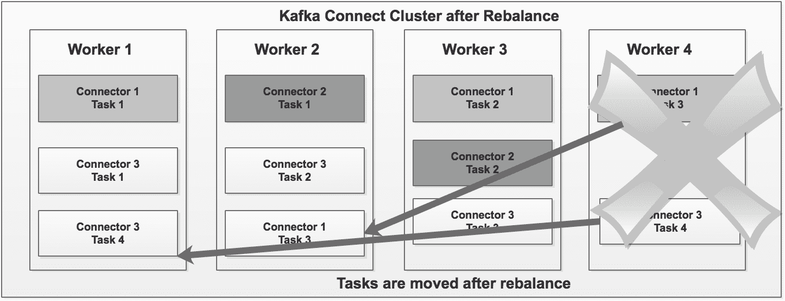

# 数据移动技术

在上一章中，我们学习了如何创建和配置 Hadoop 集群、HDFS 架构、各种文件格式以及 Hadoop 集群的最佳实践。我们还学习了 Hadoop 的高可用性技术。

由于我们现在已经知道如何创建和配置一个 Hadoop 集群，在本章中，我们将学习各种数据导入 Hadoop 集群的技术。我们了解 Hadoop 的优势，但现在，我们需要在我们的 Hadoop 集群中有数据来利用其真正的力量。

数据导入被认为是 Hadoop 数据生命周期中的第一步。数据可以以批处理或（实时）记录流的形式导入 Hadoop。Hadoop 是一个完整的生态系统，MapReduce 是 Hadoop 的批处理生态系统。

以下图表显示了各种数据导入工具：


在接下来的几节中，我们将详细了解每个工具。

在本章中，我们将介绍以下将数据传输到和从我们的 Hadoop 集群的方法：

+   Apache Sqoop

+   Apache Flume

+   Apache NiFi

+   Apache Kafka Connect

# 批处理与实时处理

在我们深入探讨不同的数据导入技术之前，让我们讨论一下批处理和实时（流）处理之间的区别。以下解释了这两个生态系统的区别。

# 批处理

以下要点描述了批处理系统：

+   在处理大量数据方面非常高效。

+   所有数据处理步骤（即数据收集、数据导入、数据处理和结果展示）都作为一个单独的批处理作业完成。

+   吞吐量比延迟更重要。延迟总是超过一分钟。

+   吞吐量直接取决于数据的大小和可用的计算系统资源。

+   可用的工具包括 Apache Sqoop、MapReduce 作业、Spark 作业、Hadoop DistCp 工具等。

# 实时处理

以下要点描述了实时处理与批处理的不同之处：

+   延迟非常重要，例如，不到一秒

+   计算相对简单

+   数据作为独立的单元进行处理

+   可用的工具包括 Apache Storm、Spark Streaming、Apache Fink、Apache Kafka 等

# Apache Sqoop

Apache Sqoop 是一个工具，旨在高效地在 Hadoop 集群和结构化数据存储（如关系数据库）之间传输大量数据。在典型的用例中，例如数据湖，总是需要将基于 RDBMS 的数据仓库存储中的数据导入到 Hadoop 集群中。在数据导入和数据聚合之后，需要将数据导回到 RDBMS。Sqoop 允许轻松地从结构化数据存储（如 RDBMS、企业数据仓库和 NoSQL 系统）导入和导出数据。借助 Sqoop，可以从外部系统将数据配置到 Hadoop 集群中，并在 Hive 和 HBase 中填充表。Sqoop 使用基于连接器的架构，支持提供外部系统连接性的插件。内部，Sqoop 使用 MapReduce 算法导入和导出数据。默认情况下，所有 Sqoop 作业运行四个 map 作业。我们将在接下来的几节中详细看到 Sqoop 的导入和导出功能。

# Sqoop 导入

以下图显示了 **Sqoop 导入** 功能，用于将 RDBMS 表中的数据导入到 Hadoop 集群中：


# 导入到 HDFS

以下是将数据导入 HDFS 的示例命令：

```py
$sqoop import -connect jdbc:mysql://localhost/dbname -table <table_name>   --username <username> --password >password> -m 4
```

导入分为两个步骤，如下所述。

1.  Sqoop 扫描数据库并收集要导入的表元数据

1.  Sqoop 提交一个仅 map 作业并使用必要的元数据传输实际数据

导入的数据存储在 HDFS 文件夹中。用户可以指定替代文件夹。导入的数据根据导入的表存储在 HDFS 的一个目录中。与 Sqoop 操作的大部分方面一样，用户可以指定任何替代目录，以便填充文件。您可以通过明确指定字段分隔符和记录终止符字符来轻松覆盖数据复制的格式。用户可以使用不同的格式，如 Avro、ORC、Parquet、序列文件、文本文件等，将文件存储到 HDFS 上，例如，将 MySQL 表导入到 HDFS。以下是将 MySQL 表导入 HDFS 的示例：

```py
$ mysql>  create database  sales;
$ mysql>  use sales;
$  mysql>   create table customer 
 (cust_num int not null,cust_fname  varchar(30),cust_lname varchar     (30),cust_address  varchar (30),cust_city varchar (20),cust_state      varchar (3), cust_zip  varchar (6),primary key (cust_num));
$ ctrl-C   -- to exit from MySQL
```

在命令提示符下，运行以下 `sqoop` 命令以导入 MySQL 销售数据库表 `customer`：

```py
$  sqoop import --connect jdbc:mysql://127.0.0.1:3306/sales --username root --password hadoop --table customer  --fields-terminated-by ","  --driver com.mysql.jdbc.Driver --target-dir /user/data/customer
```

按如下方式验证 HDFS 上的 `customer` 文件夹：

```py
$ hadoop fs -ls /user/data/customerFound 5 items-rw-r--r--   1 root hdfs          0 2017-04-28 23:35 /user/data/customer/_SUCCESS-rw-r--r--   1 root hdfs        154 2017-04-28 23:35 /user/data/customer/part-m-00000-rw-r--r--   1 root hdfs         95 2017-04-28 23:35 /user/data/customer/part-m-00001-rw-r--r--   1 root hdfs         96 2017-04-28 23:35 /user/data/customer/part-m-00002-rw-r--r--   1 root hdfs        161 2017-04-28 23:35 /user/data/customer/part-m-00003
```

让我们创建一个外部 Hive 表来验证记录，如下面的片段所示：

```py
$ hive$hive > CREATE EXTERNAL TABLE customer_H 
(cust_num int,cust_fname  string,cust_lname  string,cust_address string,  cust_city  string,cust_state  string,cust_zip   string) 
ROW FORMAT DELIMITED FIELDS TERMINATED BY ','LINES TERMINATED BY 'n'LOCATION '/user/data/customer';
$hive> select * from customer_H; 
```

| **Custnum** | **Cust Fname** | **Cust Lname** | **Cust address** | **City** | **State** | **Zip** |
| --- | --- | --- | --- | --- | --- | --- |
| 1 | James | Butt | 6649 N Blue Gum St | New Orleans | LA | 70116 |
| 2 | Art | Venere 8 | W Cerritos Ave #54 | Bridgeport | NJ | 8014 |
| 3 | Lenna | Paprocki | 639 Main St | Anchorage | AK | 99501 |
| 4 | Donette | Foller | 34 Center St | Hamilton | OH | 45011 |
| 5 | Simona | Morasca | 3 Mcauley Dr | Ashland | OH | 44805 |
| 6 | Mitsue | Tollner | 7 Eads St | Chicago | IL | 60632 |
| 7 | Leota | Dilliard | 7 W Jackson Blvd | San Jose | CA | 95111 |
| 8 | Sage | Wieser | 5 Boston Ave #88 | Sioux Falls | SD | 57105 |
| 9 | Kris | Marrier | 228 Runamuck Pl #2808 | Baltimore | MD | 21224 |
| 10 | Minna | Amigon | 2371 Jerrold Ave | Kulpsville | PA | 19443 |

以下是将 MySQL 表导入 Hive 的示例：

```py
$ sqoop import --connect jdbc:mysql://127.0.0.1:3306/sales --username root --password hadoop --table customer  --driver com.mysql.jdbc.Driver --m 1 --hive-import  --hive-table customor_H
```

验证 Hive 表：

```py
$hive$use default;
$ show tables;
```

你会看到`customer_H`表在默认数据库下创建。如果你想将`customer_H`表创建在不同的数据库下，例如，销售数据库，你必须事先创建销售数据库。此外，你必须将`-hive-table`参数更改为`--hive-table` sales `cutomer_H`增量加载（仅插入）。这是一个典型仅加载数据源表中发生增量变化的数据加载需求。让我们假设一个新的客户`11`被插入到源`customer` MySQL 表中：

```py
insert into customer values (11,'Abel','Maclead','25 E 75th St #69','Los Angeles','CA','90034');
```

为了仅适应新的记录（即客户 11），我们不得不在我们的原始`sqoop`命令中添加一些额外的参数。新的`sqoop`命令如下：

```py
sqoop import --connect jdbc:mysql://127.0.0.1:3306/sales --username root --password hadoop --table customer  --driver com.mysql.jdbc.Driver --incremental append --check-column cust_num 
      --last-value 10 
    --m 1 --split-by cust_state --target-dir /user/data/customer
```

执行此命令后，Sqoop 将仅获取新行（即`cust_num`，其值为`11`）：

```py
$hive> select * from  customer_H;
```

| **客户编号** | **客户名** | **客户姓** | **客户地址** | **城市** | **州** | **邮编** |
| --- | --- | --- | --- | --- | --- | --- |
| 1 | James | Butt | 6649 N Blue Gum St | New Orleans | LA | 70116 |
| 2 | Art | Venere 8 | W Cerritos Ave #54 | Bridgeport | NJ | 8014 |
| 3 | Lenna | Paprocki | 639 Main St | Anchorage | AK | 99501 |
| 4 | Donette | Foller | 34 Center St | Hamilton | OH | 45011 |
| 5 | Simona | Morasca | 3 Mcauley Dr | Ashland | OH | 44805 |
| 6 | Mitsue | Tollner | 7 Eads St | Chicago | IL | 60632 |
| 7 | Leota | Dilliard | 7 W Jackson Blvd | San Jose | CA | 95111 |
| 8 | Sage | Wieser | 5 Boston Ave #88 | Sioux Falls | SD | 57105 |
| 9 | Kris | Marrier | 228 Runamuck Pl #2808 | Baltimore | MD | 21224 |
| 10 | Minna | Amigon | 2371 Jerrold Ave | Kulpsville | PA | 19443 |
| 11 | Abel | Maclead | 25 E 75th St #69 | Los Angeles | CA | 90034 |

对于增量加载，我们无法直接使用 Sqoop 导入来更新数据。

请按照给定链接中的步骤进行行级更新：[`hortonworks.com/blog/four-step-strategy-incremental-updates-hive/`](http://hortonworks.com/blog/four-step-strategy-incremental-updates-hive/) [](http://hortonworks.com/blog/four-step-strategy-incremental-updates-hive/) 现在，让我们看看一个将 MySQL 表的子集导入 Hive 的示例。以下命令显示了如何将 MySQL 中`customer`表的子集仅导入 Hive。例如，我们只导入了`State = "OH"`的客户数据：

```py
$ sqoop import --connect jdbc:mysql://127.0.0.1:3306/sales --username root --password hadoop --table sales.customer  --driver com.mysql.jdbc.Driver --m 1 --where "city = 'OH' --hive-import  --hive-table customer_H_1$ hive> select * from customer_H_1;
```

| **客户编号** | **客户名** | **客户姓** | **客户地址** | **城市** | **州** | **邮编** |
| --- | --- | --- | --- | --- | --- | --- |
| 4 | Donette | Foller | 34 Center St | Hamilton | OH | 45011 |
| 5 | Simona | Morasca | 3 Mcauley Dr | Ashland | OH | 44805 |

# 将 MySQL 表导入 HBase 表

以下是一个将数据导入 HBase 表的示例命令：

```py
$sqoop import -connect jdbc:mysql://localhost/dbname -table <table_name>  --username <username> --password >password>  --hive-import -m 4                                    --hbase-create-table --hbase-table <table_name>--column-family <col family name>
```

Sqoop 将数据导入 HBase 表的列族。数据被转换为 UTF-8 字节格式。

# Sqoop 导出

以下图示展示了**Sqoop 导出**功能，用于从 Hadoop 集群导出数据：


在类似数据湖的使用案例中处理的数据可能需要用于额外的业务功能。Sqoop 可以用于将那些数据从 HDFS 或 Hive 表导出到 RDBMS。在将数据导回到 RDBMS 表的情况下，目标表必须存在于 MySQL 数据库中。HDFS 文件中的行或 Hive 表中的记录作为`sqoop`命令的输入，并被称为目标表中的行。这些记录被读取并解析成一组记录，并以用户指定的分隔符分隔。

以下是从 HDFS 导出到 MySQL 表的命令。让我们在 MySQL 中创建一个表来存储从 HDFS 导出的数据：

```py
$ mysql>  use sales;$  mysql>   create table customer_export (      cust_num int not null,      cust_fname  varchar(30),      cust_lname varchar (30),      cust_address  varchar (30),      cust_city varchar (20),      cust_state  varchar (3),      cust_zip  varchar (6),      primary key (cust_num));

$  sqoop export --connect jdbc:mysql://127.0.0.1:3306/sales --driver com.mysql.jdbc.Driver --username root --password hadoop --table customer_exported  --export-dir /user/data/customer
```

`--table`参数指定了将被填充的表。Sqoop 将数据拆分，并使用单独的 map 任务将拆分推入数据库。每个 map 任务执行实际的数据传输。`--export-dir <directory h>`是数据将从中导出的目录：

```py
$ mysql>  use sales;$ mysql>  select * from customer_exported;
```

| **客户编号** | **客户名** | **客户姓** | **客户地址** | **城市** | **州** | **邮编** |
| --- | --- | --- | --- | --- | --- | --- |
| 1 | James | Butt | 6649 N Blue Gum St | 新奥尔良 | LA | 70116 |
| 2 | Art | Venere 8 | W Cerritos Ave #54 | 桥港 | NJ | 8014 |
| 3 | Lenna | Paprocki | 639 Main St | 安克雷奇 | AK | 99501 |
| 4 | Donette | Foller | 34 Center St | Hamilton | OH | 45011 |
| 5 | Simona | Morasca | 3 Mcauley Dr | Ashland | OH | 44805 |
| 6 | Mitsue | Tollner | 7 Eads St | 芝加哥 | IL | 60632 |
| 7 | Leota | Dilliard | 7 W Jackson Blvd | 圣何塞 | CA | 95111 |
| 8 | Sage | Wieser | 5 Boston Ave #88 | 硅谷 | SD | 57105 |
| 9 | Kris | Marrier | 228 Runamuck Pl #2808 | Baltimore | MD | 21224 |
| 10 | Minna | Amigon | 2371 Jerrold Ave | Kulpsville | PA | 19443 |

# Flume

Flume 是一个可靠、可用且分布式的服务，用于高效地收集、聚合和传输大量日志数据。它具有基于流数据流的灵活和简单架构。Apache Flume 的当前版本是 1.7.0，于 2016 年 10 月发布。

# Apache Flume 架构

以下图示描绘了 Apache Flume 的架构：


让我们更详细地看看 Apache Flume 架构的组件：

+   **事件**：事件是一个带有可选字符串头部的字节有效负载。它代表 Flume 可以从其来源传输到目的地的数据单元。

+   **流**：从来源到目的地的事件传输被视为数据流，或简称流。

+   **代理**：它是一个独立进程，承载 Flume 的组件，如来源、通道和接收器。因此，它具有接收、存储并将事件转发到其下一跳目的地的能力。

+   **来源**：来源是一个接口实现。它具有通过特定机制消费发送给它的事件的 capability。

+   **通道**：它是一个存储库，事件通过在代理内运行的源传递到通道。放置在通道中的事件将保留在那里，直到汇入端将其取出以进行进一步传输。通道在确保这一点方面发挥着重要作用。

+   **汇入端（Sink）**：它是一个接口实现，就像源一样。它可以从通道中移除事件并将它们传输到流程中的下一个代理或最终目的地。

+   **拦截器（Interceptors）**：它们有助于在传输过程中更改事件。事件可以根据选择的准则被移除或修改。拦截器是实现 `org.apache.flume.interceptor.Interceptor` 接口的类。

# 使用 Flume 的数据流

整个 Flume 代理都在 JVM 进程中运行，包括所有组件（源、通道和汇入端）。Flume 源从外部源接收事件，如 Web 服务器、外部文件等。源将事件推送到通道，通道将其存储，直到汇入端取走。通道根据源的类型将有效载荷（消息流）存储在本地文件系统或内存中。例如，如果源是文件，则有效载荷将本地存储。汇入端从通道中提取有效载荷并将其推送到外部数据存储。代理内的源和汇入端异步运行。有时，汇入端可能可以将有效载荷推送到另一个 Flume 代理。我们将在下一节中讨论这种情况。

# Flume 复杂数据流架构

在以下架构中，有三个源（服务器）。为了从这些服务器上存储的日志文件中提取数据，我们必须在每个服务器上安装 Flume 软件。安装后，需要将文件名添加到 `flume.conf` 文件中。Flume 收集所有文件数据并通过通道将其推送到相应的汇入端。上述架构中有多个汇入端；Hive HDFS，以及连接到另一个服务器上安装的另一个 Flume 代理的另一个汇入端。它从汇入端将数据推送到源，并将数据写入 Cassandra 数据存储。

请注意，这不是一个好的架构，但我提到它是为了解释 Flume 汇入端和 Flume 源如何连接。

下面的图示展示了涉及多个代理的复杂数据流：


# Flume 设置

Flume 代理配置存储在本地文本文件中。请参阅本书代码库中的示例 Flume 代理配置文件。Flume 1.7.0 支持各种源和汇入端。广泛使用的 Flume 源（摘要）如下：

| **源** | **描述** |
| --- | --- |
| Avro 源 | 监听 Avro 端口并从外部 Avro 客户端流接收事件 |
| 执行源 | 运行给定的 Unix 命令并期望该进程持续在标准输出上产生数据 |
| 存储目录源 | 从磁盘上的文件中摄取数据 |
| Taildir 源 | 在检测到文件中的新行后，近实时地跟踪文件 |
| Kafka 源 | 从 Kafka 主题中读取消息 |
| Syslog 源 | 读取 syslog 数据（支持 syslog-TCP 和 syslog-UDP） |
| HTTP 源 | 通过 HTTP `POST` 和 `GET` 接受 Flume 事件 |

广泛使用的 Flume 输出端可以总结如下：

| **输出端** | **描述** |
| --- | --- |
| Avro 输出端 | 将事件转换为 Avro 事件并发送到配置的主机名/端口号 |
| HDFS 输出端 | 将事件写入 HDFS |
| Hive 输出端 | 将文本或 JSON 数据写入 Hive 表 |
| HBase 输出端 | 将数据写入 HBase |
| Morphline Solr 输出端 | 在近实时中将数据加载到 Apache Solr 服务器 |
| Elasticsearch 输出端 | 将数据写入 Elasticsearch 集群 |
| Kafka 输出端 | 将数据写入 Kafka 主题 |

广泛使用的 Flume 通道（总结）如下：

| **通道** | **描述** |
| --- | --- |
| JDBC 通道 | 事件存储在数据库支持的存储中 |
| Kafka 通道 | 事件存储在 Kafka 集群中 |
| 文件通道 | 事件存储在文件中 |
| 可溢出内存通道 | 事件存储在内存中；如果内存满了，则存储在磁盘上 |

广泛使用的 Flume 拦截器可以总结如下：

| **拦截器** | **描述** |
| --- | --- |
| 时间戳拦截器 | 将事件的处理时间添加到事件头中 |
| 主机拦截器 | 添加代理的主机名 |
| 搜索和替换拦截器 | 支持 Java 正则表达式 |
| 正则表达式过滤拦截器 | 对事件进行正则表达式过滤 |
| 正则表达式提取拦截器 | 从事件中提取并附加匹配的正则表达式组作为事件头 |

# 日志聚合用例

在日常业务场景中，我们总是需要获取日志文件并对其进行分析。例如，我们总是需要从不同的应用程序和服务器中获取日志，并将它们合并在一起以找到趋势和模式。让我进一步扩展这个例子。假设我们有五个部署在五个不同服务器上的 Web 服务器。我们想要获取所有五个 Web 服务器的日志并将它们合并/聚合在一起，通过在 HDFS 上存储一份副本，并将另一份副本发送到 Kafka 主题进行实时分析。问题是我们是如何设计基于 Flume 的日志聚合架构的。以下是我们 Web 服务器日志聚合场景的 Flume 架构：


让我们详细地了解架构：总共有五个 Web 服务器。每个 Web 服务器生成一个日志文件并将其本地存储。Flume 代理安装在每个 Web 服务器上。Flume 代理实际上是一个（JVM）进程，它通过宿主事件从外部源流向下一个目的地（跳转）的组件。每个 Flume 代理根据 `flume.conf` 的本地配置访问日志文件。每个 Flume 代理读取日志文件并将数据推送到 Flume 收集器。日志文件的每一行都被视为一条消息（有效负载）。Flume 收集器从所有 Web 服务器、适配器接收消息，聚合所有消息，并将这些消息推送到数据存储。以下是 Flume 代理的示例 `flume.conf` 和收集器代理的 `flume.conf`：

```py
## Sample Flume Agent Configuration  
## This conf file should deploy on each webserver 
##   

a1.sources = apache 
a1.sources.apache.type = exec 
a1.sources.apache.command = gtail -F /var/log/httpd/access_log 
a1.sources.apache.batchSize = 1 
a1.sources.apache.channels = memoryChannel 

a1.channels = memoryChannel 
a1.channels.memoryChannel.type = memory 
a1.channels.memoryChannel.capacity = 100 

## Collector Details 

a1.sinks = AvroSink 
a1.sinks.AvroSink.type = avro 
a1.sinks.AvroSink.channel = memoryChannel 
a1.sinks.AvroSink.hostname = 10.0.0.10 
a1.sinks.AvroSink.port = 6565 
```

收集器 `flume.conf` 文件如下：

```py

## Collector get data from all agents 

collector.sources = AvroIn 
collector.sources.AvroIn.type = avro 
collector.sources.AvroIn.bind = 0.0.0.0 
collector.sources.AvroIn.port = 4545 
collector.sources.AvroIn.channels = mc1 mc2 

collector.channels = mc1 mc2 
collector.channels.mc1.type = memory 
collector.channels.mc1.capacity = 100 

collector.channels.mc2.type = memory 
collector.channels.mc2.capacity = 100 

## Write copy to Local Filesystem (Debugging) 
# http://flume.apache.org/FlumeUserGuide.html#file-roll-sink 
collector.sinks.LocalOut.type = file_roll 
collector.sinks.LocalOut.sink.directory = /var/log/flume 
collector.sinks.LocalOut.sink.rollInterval = 0 
collector.sinks.LocalOut.channel = mc1 

## Write to HDFS 
collector.sinks.HadoopOut.type = hdfs 
collector.sinks.HadoopOut.channel = mc2 
collector.sinks.HadoopOut.hdfs.path = /flume/events/%{log_type}/%{host}/%y-%m-%d 
collector.sinks.HadoopOut.hdfs.fileType = DataStream 
collector.sinks.HadoopOut.hdfs.writeFormat = Text 
collector.sinks.HadoopOut.hdfs.rollSize = 0 
collector.sinks.HadoopOut.hdfs.rollCount = 10000 
collector.sinks.HadoopOut.hdfs.rollInterval = 600 
```

# Apache NiFi

什么是 Apache NiFi？在任何组织中，我们都知道存在各种系统。一些系统生成数据，而其他系统则消费这些数据。Apache NiFi 是为了自动化数据从系统到系统的流动而构建的。Apache NiFi 是一个带有 Web UI 的数据流管理系统，它可以帮助实时构建数据流。它支持基于流的编程。图编程包括一系列节点和边，数据通过这些节点和边移动。在 NiFi 中，这些节点被转换为处理器，而边被转换为连接器。数据存储在一个称为 **FlowFile** 的信息包中。这个 FlowFile 包括内容、属性和边。作为用户，您可以使用连接器将处理器连接起来，以定义数据应该如何处理。

# Apache NiFi 的主要概念

下表描述了 Apache NiFi 的主要组件：

| **组件名称** | **描述** |
| --- | --- |
| FlowFile | 在系统中运行的数据包 |
| FlowFile 处理器 | 执行数据路由、转换和数据移动的实际工作 |
| 连接 | 处理器之间的实际数据链接 |
| 流控制器 | 促进处理器之间的 FlowFile 交换 |
| 流程组 | 特定的数据输入和输出处理器组 |

# Apache NiFi 架构

下图显示了 Apache NiFi 架构的组件（来源：[`nifi.apache.org/docs.html`](https://nifi.apache.org/docs.html))：


组件如下：

+   **Web 服务器**：这是 NiFi 的基于 HTTP 的 UI 的宿主

+   **文件控制器**：这提供线程并管理扩展运行的调度

+   **扩展**：扩展在 JVM 中运行和执行

+   **FileFlow 存储库**：这跟踪它所知道的关于当前在流程中活动的给定 FlowFile 的状态

+   **内容存储库**：这是给定 FlowFile 的实际内容字节存储的地方

+   **来源存储库**：这是所有来源事件数据存储的地方

# 关键特性

Apache NiFi 的以下是一些关键特性：

+   **保证交付**：在数据量增加、电源故障、NiFi 中的网络和系统故障的情况下，确保数据的稳健交付变得必要。NiFi 确保在数据流系统内部，NiFi 与其接收到的数据点之间的交易性通信。

+   **带背压和压力释放的数据缓冲**：在任何数据流中，都可能存在涉及系统的某些问题；一些可能已经关闭或运行缓慢。在这种情况下，数据缓冲变得非常关键，以应对进入或离开数据流的数据。

当 NiFi 达到特定限制和数据年龄时，它支持所有队列的带背压缓冲。NiFi 以最大可能的吞吐量率进行，同时保持良好的响应时间。

+   **优先级队列**：通常，数据队列保持自然顺序或插入顺序。但是，很多时候，当数据插入速率快于带宽时，您必须优先从队列中检索数据。默认情况下是先处理最旧的数据。但是，NiFi 支持基于大小、时间等优先级队列，以拉取数据，即先处理最大的或最新的数据。

+   **特定流的质量服务（QoS）**：有些情况下，我们必须在特定时间段内处理数据，例如，在一秒内等，否则数据会失去其价值。Apache NiFi 通过这些特定配置的细粒度流来启用这些关注点。

+   **数据溯源**：NiFi 自动记录、索引并使系统中的对象流通过时的溯源数据可用——甚至包括扇入、扇出、转换等。这些信息在支持合规性、故障排除、优化和其他场景中变得极其关键。

+   **可视化命令和控制**：Apache NiFi 允许用户对数据流进行交互式管理。它对数据流的每次更改都提供即时反馈。因此，用户可以理解和立即纠正他们数据流中的任何问题、错误或问题。基于数据流的分析结果，用户可以对其数据流进行更改，优先处理队列，添加更多数据流等。

+   **流模板**：可以开发、设计和共享数据流。模板允许主题专家构建和发布他们的流设计，并允许其他人从中受益并协作。

+   **扩展**：NiFi 允许我们扩展其关键组件。

+   **扩展点**：处理器、控制器服务、报告任务、优先级排序器和客户 UI。

+   **多角色安全**：多粒度、多角色安全可以应用于每个组件，这允许管理员用户拥有细粒度的访问控制级别。

+   **聚类**：NiFi 通过将多个节点组合在一起进行扩展设计。这样，通过向集群添加更多节点，它可以处理更多数据。

要开始使用 Apache NiFi，请使用此链接： [`nifi.apache.org/docs/nifi-docs/html/getting-started.html`](https://nifi.apache.org/docs/nifi-docs/html/getting-started.html)。

让我们设想一个场景。我有一个正在运行的日志文件。它实时更新。我想根据其内容捕获和监控该文件中的每一行，并将其发送到我的 Kafka 代理。我还想将所有错误记录发送到 HDFS 以进行归档和进一步分析。不同类型的行将被发送到不同的 Kafka 代理。例如，错误、信息和成功类型的行将被发送到三个不同的 Kafka 主题，即错误、信息和成功。为此，我开发了以下 NiFi 工作流程。以下表格详细说明了每个处理器的说明：

| **处理器** | **目的** | **属性** | **值** |
| --- | --- | --- | --- |
| TailFile | 尾随日志文件 | 要尾随的文件 | `/var/log/apache.log` |
| SplitText | 将日志条目拆分为行 | 行拆分计数 | `1` |
| RouteOnContent | 进行路由决策 |  |  |
| PutHDFS | 将错误发送到 HDFS |  | HDFS 详细信息 |
| PublishKafka | 向 Kafka 主题发送数据 | 代理和主题名称 | 主机名：端口，主题面板 |

# 实时日志捕获数据流

以下示例工作流程展示了如何将日志文件数据推送到 HDFS，然后将其移动到 Kafka 代理：


# Kafka Connect

Kafka Connect 是 Apache Kafka 的一部分。它是一个使用连接器从一种系统到另一种系统摄取数据的框架。有两种类型的连接器：源连接器和目标连接器。目标连接器从源系统导入数据并将其写入 Kafka 主题。目标连接器从 Kafka 主题读取数据并将其导出到目标系统。Kafka Connect 提供了各种内置的源和目标连接器。

# Kafka Connect 的简要历史

Kafka Connect 主要在 2015 年 11 月的 Kafka 0.9.x 版本中引入。除了 Kafka 0.9.x 的各种功能外，Connect API 是一个全新的功能。然后，在 2016 年 5 月，发布了新版本 Kafka 0.10.0。在该版本中，Kafka Streams API 是一个新且令人兴奋的功能。但是，在 2017 年 3 月，Kafka 版本 0.10.2 是 Kafka Connect 获得真正动力的版本。作为 Kafka 0.10.2 的一部分，发布了改进的简化 Connect API 和单消息转换 API。

# 为什么选择 Kafka Connect？

Kafka Connect 有助于简化数据进出 Kafka 的过程。它提供大量开箱即用的连接器来完成这项工作。在我看来，这是像我这样的开发者最好的激励，因为我无需开发单独的代码来开发自己的连接器以导入和导出数据；我总是可以重用开箱即用的连接器。此外，如果我想，我总是可以使用 Kafka Connect API 开发自己的独特连接器。此外，所有连接器都是基于配置的。常见的源和目标包括数据库、搜索引擎、NoSQL 数据存储以及像 SAP、GoldenGate、Salesforce、HDFS、Elasticsearch 等应用程序。有关所有可用源和连接器的详细列表，请参阅 [`www.confluent.io/product/connectors/`](https://www.confluent.io/product/connectors/)。

# Kafka Connect 特性

以下是一些 Kafka Connect 的特性：

+   **可扩展**：这是一个在 Apache Kafka 和其他系统之间进行可扩展和可靠流数据传输的框架

+   **简单**：这使得定义将大量数据移动到和从 Kafka 中移动的连接器变得简单

+   **偏移量管理**：框架负责记录连接器的偏移量的大部分繁重工作

+   **易于操作**：这提供了一个具有 RESTful API 的服务，用于管理和部署连接器

+   **分布式**：框架可以集群化，并将连接器自动分布到集群中，确保连接器始终运行

+   **开箱即用的连接器**：有关所有可用源和连接器的详细列表，请参阅 [`www.confluent.io/product/connectors/`](https://www.confluent.io/product/connectors/)

# Kafka Connect 架构

以下图表示 Kafka Connect 架构：


Kafka 集群由 Kafka 代理组成：如图所示，有三个代理。源可以是任何类型，例如，数据库、NoSQL、Twitter 等。在源和 Kafka 集群之间，有一个 Kafka Connect 集群，由工作节点组成。Kafka Connect 的工作包括以下步骤：

1.  工作节点根据配置从源中拉取数据

1.  在获取数据后，连接器将数据推送到 Kafka 集群

1.  如果需要使用流应用程序（如 Spark、Storm 等）对数据进行转换、过滤、连接或聚合，流 API 将改变 Kafka 中的数据

1.  根据配置，连接器将从 Kafka 中拉取数据并写入到目标

一些 Kafka Connect 概念如下：

+   源连接器从常见的数据源获取数据。

+   目标连接器将数据发布到常见的数据源。

+   Kafka Connect 使得将数据可靠地快速导入 Kafka 变得容易。

+   它是 ETL 管道的一部分。

+   从小型管道扩展到公司级管道非常容易。

+   代码是可重用的。

+   Kafka Connect 集群有多个加载的连接器。每个连接器是一段可重用的代码，`(Java JARs)`。有许多开源连接器可用，可以加以利用。

+   每个连接器任务是由连接器类和配置的组合。任务链接到连接器配置。作业创建可能会创建多个任务。因此，如果您有一个连接器和配置，则可以创建两个或更多任务。

+   Kafka Connect 工作者和服务器执行任务。工作者是一个单一的 Java 进程。工作者可以是独立的或分布式的。

# Kafka Connect 工作者模式

Kafka Connect 工作者有两种模式：

+   独立模式

+   分布式模式

# 独立模式

独立模式是一个运行所有连接器和任务的单一进程（工作者）。配置捆绑在一个进程中。它不具有容错性或可扩展性，并且很难监控。由于它易于设置，因此主要用于开发和测试。

# 分布式模式

在分布式模式下，多个工作者（进程）运行您的连接器和任务。配置通过 REST API 提交。它是可扩展的和容错的。如果任何工作者死亡，它会自动在集群上重新平衡所有任务。由于它可扩展且容错，因此主要用于生产环境。

# Kafka Connect 集群分布式架构

以下是对 Kafka Connect 集群分布式架构细节的表示：


在前面的图中，我们可以看到以下细节：

+   我们有一个带有三个任务的**连接器 1**：**任务 1**、**任务 2**和**任务 3**。这三个任务分布在四个工作者之间：**工作者 1**、**工作者 3**和**工作者 4**。

+   我们还有一个带有两个任务的**连接器 2**：**任务 1**和**任务 2**。这两个任务分布在两个工作者之间：**工作者 2**和**工作者 3**。

+   我们还有一个带有四个任务的**连接器 3**：**任务 1**、**任务 2**、**任务 3**和**任务 4**。这四个任务分布在四个工作者之间：**工作者 1**、**工作者 2**、**工作者 3**和**工作者 4**。

+   现在，发生了一些事情，**工作者 4** 死机了，我们完全失去了这个工作者。

+   作为容错的一部分，重新平衡活动启动。**连接器 1**和**任务 3**从**工作者 4**移动到**工作者 2**。同样，**连接器 3**和**任务 4**从**连接器 4**移动到**连接器 1**。

以下图表示重新平衡后的 Kafka Connect 集群：



# 示例 1

在独立模式下，从源文件 `Demo-Source.txt` 流式传输的数据被移动到目标文件 `Demo-Sink.txt`，如下所示：


为了在独立模式下从源文件 `Demo-Source.txt` 流式传输数据到目标文件 `Demo-Sink.txt`，我们需要执行以下步骤：

1.  启动 Kafka：

```py
$ /bin/kafka-server-start.sh config/server.properties 
```

1.  创建主题：

```py
$ .bin/kafka-topics --create --topic demo-1-standalone --partitions 3 --replication-factor 1 --zookeeper 127.0.0.1:2181 
```

1.  配置`source-file-stream-standalone.properties`文件：

```py
name=source-file-stream-standalone 
connector.class=org.apache.kafka.connect.file.FileStreamSourceConnector 
tasks.max=1 
file=demo-source.txt 
topic=file-source-topic 
```

1.  配置`file-stream-standalone.properties`文件：

```py
name=sinkfile-stream-standalone 
connector.class=org.apache.kafka.file.FileStreamSourceConnector 
tasks.max=1 
file=demo-sink.txt 
topics=file-source-topic 
```

1.  配置`file-worker.properties`文件：

```py
bootstrap.servers=127.0.0.1:9092 
key.converter=org.apache.kafka.connect.json.JsonConverter 
key.converter.schemas.enable=false 
value.converter=org.apache.kafka.connect.json.JsonConverter 
value.converter.schemas.enable=false 
# we always leave the internal key to JsonConverter 
internal.key.converter=org.apache.kafka.connect.json.JsonConverter 
internal.key.converter.schemas.enable=false 
internal.value.converter=org.apache.kafka.connect.json.JsonConverter 
internal.value.converter.schemas.enable=false 
rest.port=8086 
rest.host.name=127.0.0.1 
# this config is only for standalone workers 
offset.storage.file.filename=standalone.offsets 
offset.flush.interval.ms=10000 
```

1.  启动 Kafka Connect。打开另一个终端并运行以下命令：

```py
$ .bin/connect-standalone config/file-worker.properties config/source-file-stream-standalone.properties config/ sink-file-stream-standalone.properties 
```

1.  向`demo-source.txt`文件添加数据。打开另一个终端并运行以下命令：

```py
$ touch demo-source.txt 

$ echo "Test Line 1 " >>  demo-source.txt 

$ echo "Test Line 2 " >>  demo-source.txt 

$ echo "Test Line 2 " >>  demo-source.txt 
```

1.  读取`demo-sink.txt`文件：

```py
$ cat demo-sink.file 
```

# 示例 2

从源文件`Demo-Source.txt`流式传输的数据在分布式模式下移动到目标文件`Demo-Sink.txt`。如果您想使用分布式模式运行前面的示例，您必须在步骤 3 和步骤 4 中的`source-file-stream`和`sink-file-stream`中添加以下参数：

```py
key.converter=org.apache.kafka.connect.json.JsonConverter 
key.converter.schemas.enable=true 
value.converter=org.apache.kafka.connect.json.JsonConverter 
value.converter.schemas.enable=true 
```

# 概述

在本章中，我们学习了在生产环境中使用的所有流行数据摄取工具。Sqoop 主要用于在关系型数据库管理系统（RDBMS）数据存储中导入和导出数据。Apache Flume 用于实时系统以导入数据，主要来自文件源。它支持广泛的源和目标。Apache NiFi 是一个相对较新的工具，最近非常受欢迎。它还支持基于 GUI 的 ETL 开发。Hortonworks 从他们的 HDP 2.4 版本开始支持这个工具。Apache Kafka Connect 是市场上另一个流行的工具。它也是 Confluent 数据平台的一部分。Kafka Connect 可以摄取整个数据库或从所有应用程序服务器收集指标到 Kafka 主题中，使数据能够以低延迟进行流处理。

由于我们到目前为止已经知道如何构建 Hadoop 集群以及如何在其中摄取数据，我们将在下一章学习数据建模技术。
