# 第七章：大规模数据处理框架

随着数据源的数量和复杂性的增加，从数据中提取价值也变得越来越困难。自从 Hadoop 出现以来，它已经构建了一个可大规模扩展的文件系统 HDFS。它采用了函数编程中的 MapReduce 概念来应对大规模数据处理挑战。随着技术不断进化以克服数据挖掘带来的挑战，企业也在寻找方法来拥抱这些变化，以保持领先。

在本章中，我们将关注以下数据处理解决方案：

+   MapReduce

+   Apache Spark

+   Spark SQL

+   Spark Streaming

# MapReduce

MapReduce 是从函数编程中借用的一个概念。数据处理被分解为映射阶段，其中进行数据准备，以及归约阶段，其中计算实际结果。MapReduce 之所以扮演了重要角色，是因为我们可以通过将数据分片到多个分布式服务器来实现巨大的并行性。没有这个优势，MapReduce 实际上无法很好地执行。

让我们用一个简单的例子来了解 MapReduce 在函数编程中的工作原理：

+   输入数据使用我们选择的映射函数进行处理

+   映射函数的输出应该处于归约函数可消费的状态

+   映射函数的输出被送入归约函数以生成必要的结果

让我们通过一个简单的程序来理解这些步骤。该程序使用以下文本（随机创建的）作为输入：

```py
Bangalore,Onion,60
Bangalore,Chilli,10
Bangalore,Pizza,120
Bangalore,Burger,80
NewDelhi,Onion,80
NewDelhi,Chilli,30
NewDelhi,Pizza,150
NewDelhi,Burger,180
Kolkata,Onion,90
Kolkata,Chilli,20
Kolkata,Pizza,120
Kolkata,Burger,160
```

输入由以下字段组成：**城市名称**、**产品名称**和当天的**项目价格**。

我们想编写一个程序来显示给定城市所有产品的总成本。这可以通过多种方式完成。但让我们尝试使用 MapReduce 来解决这个问题，看看它是如何工作的。

映射程序如下：

```py
#!/usr/bin/env perl -wl

use strict;
use warnings;

while(<STDIN>) {
    chomp;
    my ($city, $product, $cost) = split(',');
    print "$city $cost";
}
```

归约程序如下：

```py
#!/usr/bin/perl

use strict;
use warnings;

my %reduce;

while(<STDIN>) {
    chomp;
    my ($city, $cost) = split(/\s+/);
    $reduce{$city} = 0 if not defined $reduce{$city};
    $reduce{$city} += $cost;
}

print "-" x 24;
printf("%-10s : %s\n", "City", "Total Cost");
print "-" x 24;

foreach my $city (sort keys %reduce) {
    printf("%-10s : %d\n", $city, $reduce{$city});
}
```

我们使用 UNIX 终端创建一个数据管道，如下所示：

```py
[user@node-1 ~]$ cat input.txt | perl map.pl | perl reduce.pl 
------------------------
City : Total Cost
------------------------
Bangalore : 270
Kolkata : 390
NewDelhi : 440
```

如我们所见，结果是预期的。这是一个非常简单的 MapReduce 案例。让我们尝试看看发生了什么：

+   每个输入行都由`map.pl`程序处理并打印城市和价格

+   `map.pl`程序的输出被送入`reduce.pl`，它对所有记录执行`SUM()`操作并将它们按城市分类

让我们洗牌`input.txt`并看看我们是否得到期望的结果。

这里是修改后的`input.txt`：

```py
Bangalore,Onion,60
NewDelhi,Onion,80
Bangalore,Pizza,120
Bangalore,Burger,80
Kolkata,Onion,90
Kolkata,Pizza,120
Kolkata,Chilli,20
NewDelhi,Chilli,30
NewDelhi,Burger,180
Kolkata,Burger,160
NewDelhi,Pizza,150
Bangalore,Chilli,10
```

MapReduce 操作的输出如下：

```py
[user@node-1 ~]$ cat input-shuffled.txt | perl map.pl | perl reduce.pl 
------------------------
City : Total Cost
------------------------
Bangalore : 270
Kolkata : 390
NewDelhi : 440
```

没有区别，因为映射和归约操作都是一次性独立执行的。这里没有数据并行性。整个过程可以在以下图中可视化：

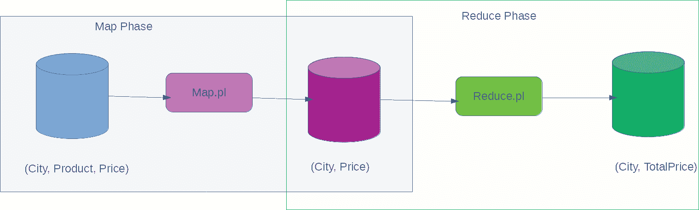

如我们所见，在**映射阶段**之后有一个输入数据的副本，在**归约阶段**之后的最终输出是我们感兴趣的。

运行单线程进程是有用的，并且在我们不需要处理大量数据时是必需的。当输入大小无界且无法适应单个服务器时，我们需要开始考虑分布式/并行算法来处理当前的问题。

# Hadoop MapReduce

Apache MapReduce 是一个框架，它使我们能够更容易地在非常大的分布式数据集上运行 MapReduce 操作。Hadoop 的一个优点是具有一个具有机架感知性和可扩展性的分布式文件系统。Hadoop 作业调度器足够智能，可以确保计算发生在数据所在的节点上。这也是一个非常重要的方面，因为它减少了网络 I/O 的数量。

让我们看看框架如何通过这个图帮助我们在大量并行计算中更容易地运行：

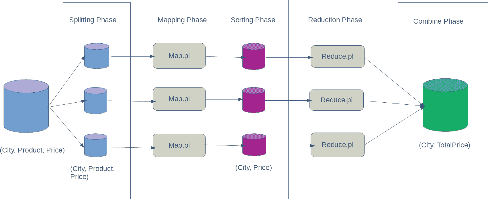

这个图看起来比之前的图复杂一些，但大部分工作都是由 Hadoop MapReduce 框架为我们自己完成的。我们仍然编写代码来映射和归约我们的输入数据。

让我们详细看看当我们使用前面的图中的 Hadoop MapReduce 框架处理我们的数据时会发生什么：

+   我们将输入数据分解成块。

+   每个数据块都被喂给一个 mapper 程序。

+   所有 mapper 程序的输出被收集、洗牌和排序。

+   每个排序好的数据块被喂给 reducer 程序。

+   所有 reducer 的输出被组合起来生成输出数据。

# 流式 MapReduce

Streaming MapReduce 是 Hadoop MapReduce 框架中的一项功能，在这里我们可以使用任何外部程序作为 Mapper 和 Reducer。只要这些程序可以被目标操作系统执行，它们就可以被接受来运行 Map 和 Reduce 任务。

在编写这些程序时，以下是一些需要注意的事项：

+   这些程序应该从 `STDIN` 读取输入。

+   它们应该能够处理无限量的数据（流）否则它们会崩溃。

+   在使用流式 MapReduce 之前，应该提前很好地了解这些程序的内存需求，否则我们可能会看到不可预测的行为。

在前面的部分，我们编写了简单的 Perl 脚本来执行映射和归约。在当前场景中，我们也将使用相同的程序来了解它们如何执行我们的任务。

如果你仔细观察，`map.pl` 可以处理无限量的数据，并且不会有任何内存开销。但是，`reduce.pl` 程序使用 Perl Hash 数据结构来执行归约操作。在这里，我们可能会遇到一些内存压力，尤其是在处理真实世界的数据时。

在这个练习中，我们使用随机输入数据，如下所示：

```py
[user@node-3 ~]$ cat ./input.txt
 Bangalore,Onion,60
 NewDelhi,Onion,80
 Bangalore,Pizza,120
 Bangalore,Burger,80
 Kolkata,Onion,90
 Kolkata,Pizza,120
 Kolkata,Chilli,20
 NewDelhi,Chilli,30
 NewDelhi,Burger,180
 Kolkata,Burger,160
 NewDelhi,Pizza,150
 Bangalore,Chilli,10
```

之后，我们需要将 mapper 和 reducer 脚本复制到所有 Hadoop 节点上：

我们使用的是作为第十章，*生产 Hadoop 集群部署*一部分构建的同一个 Hadoop 集群。如果您还记得，节点是 master，`node-1`，`node-2`和`node-3`。

```py
[user@master ~]$ scp *.pl node-1:~
[user@master ~]$ scp *.pl node-2:~
[user@master ~]$ scp *.pl node-3:~
```

在这一步，我们正在将输入复制到`hadoop /tmp/`目录。

请根据您的企业标准在您的生产环境中使用一个合理的目录。在这里，`/tmp`目录仅用于说明目的。

```py
[user@node-3 ~]$ hadoop fs -put ./input.txt /tmp/
```

在这一步，我们使用 Hadoop 流式 MapReduce 框架来使用我们的脚本来执行计算：

`map.pl`和`reduce.pl`的内容与我们之前使用的例子完全相同。

```py
[user@node-3 ~]$ hadoop jar \
    /usr/hdp/current/hadoop-mapreduce-client/hadoop-streaming.jar \
    -input hdfs:///tmp/input.txt \
    -output hdfs:///tmp/output-7 \
    -mapper $(pwd)/map.pl \
    -reducer $(pwd)/reduce.pl
```

输出存储在 HDFS 中，我们可以这样查看：

```py
[user@node-3 ~]$ hadoop fs -cat /tmp/output-7/part*
 NewDelhi, 440
 Kolkata, 390
 Bangalore, 270
[user@node-3 ~]$
```

如果我们仔细观察，结果与我们的传统程序完全一致。

# Java MapReduce

在上一节中，我们看到了如何使用任何任意编程语言在 Hadoop 上运行 MapReduce 操作。但在大多数实际场景中，如果我们利用 Hadoop MapReduce 基础设施提供的库，那会更好，因为它们功能强大，并为我们处理许多需求。

让我们尝试编写一个简单的 Java 程序，使用 MapReduce 库，看看我们是否能生成与之前练习相同的输出。在这个例子中，我们将使用官方文档中的官方 MapReduce 实现。

文档位于：[`hadoop.apache.org/docs/r2.8.0/hadoop-mapreduce-client/hadoop-mapreduce-client-core/MapReduceTutorial.html`](https://hadoop.apache.org/docs/r2.8.0/hadoop-mapreduce-client/hadoop-mapreduce-client-core/MapReduceTutorial.html)

由于我们的输入与示例非常不同，而且我们还想找到给定城市中所有产品的总价，我们必须根据我们的 CSV `input.txt`文件更改 mapper 程序。reduce 函数与官方文档中相同，其中我们的 mapper 函数生成一个`<City, Price>`对。这可以很容易地被现有实现消费。

我们将我们的程序命名为`TotalPrice.java`。让我们看看我们的源代码是什么样的：

```py
[user@node-3 ~]$ cat TotalPrice.java 
import java.io.IOException;
import java.util.StringTokenizer;

import org.apache.hadoop.conf.Configuration;
import org.apache.hadoop.fs.Path;
import org.apache.hadoop.io.IntWritable;
import org.apache.hadoop.io.Text;
import org.apache.hadoop.mapreduce.Job;
import org.apache.hadoop.mapreduce.Mapper;
import org.apache.hadoop.mapreduce.Reducer;
import org.apache.hadoop.mapreduce.lib.input.FileInputFormat;
import org.apache.hadoop.mapreduce.lib.output.FileOutputFormat;

public class TotalPrice {
  public static class TokenizerMapper extends Mapper<Object, Text, Text, IntWritable>{
    public void map(Object key, Text value, Context context) throws IOException, InterruptedException {
      StringTokenizer itr = new StringTokenizer(value.toString(), ",");
      Text city = new Text(itr.nextToken());
      itr.nextToken();
      IntWritable price = new IntWritable(Integer.parseInt(itr.nextToken()));
      context.write(city, price);
    }
  }

  public static class IntSumReducer extends Reducer<Text,IntWritable,Text,IntWritable> {
  private IntWritable result = new IntWritable();

    public void reduce(Text key, Iterable<IntWritable> values, Context context) throws IOException, InterruptedException {
      int sum = 0;
      for (IntWritable val : values) {
        sum += val.get();
      }
      result.set(sum);
      context.write(key, result);
    }
  }

  public static void main(String[] args) throws Exception {
    Configuration conf = new Configuration();
    Job job = Job.getInstance(conf, "TotalPriceCalculator");
    job.setJarByClass(TotalPrice.class);
    job.setMapperClass(TokenizerMapper.class);
    job.setCombinerClass(IntSumReducer.class);
    job.setReducerClass(IntSumReducer.class);
    job.setOutputKeyClass(Text.class);
    job.setOutputValueClass(IntWritable.class);
    FileInputFormat.addInputPath(job, new Path(args[0]));
    FileOutputFormat.setOutputPath(job, new Path(args[1]));
    System.exit(job.waitForCompletion(true) ? 0 : 1);
  }
}
```

一旦我们有了源代码，我们需要编译它来创建一个**Java 归档**（**JAR**）文件。这可以通过以下方式完成：

```py
 [user@node-3 ~]$ javac -cp `hadoop classpath` TotalPrice.java 
 [user@node-3 ~]$ jar cf tp.jar TotalPrice*.class
```

一旦我们创建了 JAR 文件，我们可以使用 Hadoop 命令提交作业来处理`input.txt`，并在`/tmp/output-12`目录中生成输出：

就像流式 MapReduce 的情况一样，我们不需要将源代码复制到所有的 Hadoop 服务器上。

```py
 [user@node-3 ~]$ hadoop jar tp.jar TotalPrice /tmp/input.txt /tmp/output-12
```

这次运行应该会顺利，并将在`/tmp/output-12`目录中生成输出文件。我们可以使用以下命令查看输出内容：

```py
[user@node-3 ~]$ hadoop fs -cat /tmp/output-12/part*
Bangalore       270
Kolkata 390
NewDelhi        440
```

这与之前的运行完全一致。

如我们所见，Hadoop Mapreduce 框架已经采取了所有必要的步骤来确保整个管道进度保持在它的控制之下，从而给我们带来期望的结果。

尽管我们使用了非常简单的数据集进行计算，但 Hadoop Mapreduce 确保，无论我们处理的数据大小如何，我们之前编写的相同程序都能得到我们想要的结果。这使得它成为一个非常适合批量作业的强大架构。

# 摘要

到目前为止，我们已经看到 Hadoop Mapreduce 是一个强大的框架，它提供了流式和批量操作模式，可以用非常简单的指令处理大量数据。尽管 Mapreduce 最初是 Hadoop 的计算框架选择，但它未能满足市场不断变化的需求，因此开发了新的架构来解决这些问题。在下一节中，我们将学习一个名为**Apache Spark**的框架。

# Apache Spark 2

Apache Spark 是一个通用的集群计算系统。它非常适合大规模数据处理。当完全在内存中运行时，它的性能比 Hadoop 高 100 倍，当完全从磁盘运行时，性能高 10 倍。它拥有复杂的定向无环图执行引擎，支持无环数据流模型。

Apache Spark 为 Java、Scala、Python 和 R 编程语言提供了第一类支持，以适应更广泛的受众。它提供了超过 80 种不同的算子来构建并行应用程序，而无需担心底层基础设施。

Apache Spark 拥有针对**结构化查询语言**（Structured Query Language，简称 Spark SQL）的库，支持在程序中使用 ANSI SQL 编写查询。它还支持计算流数据，这在当今实时数据处理需求中非常必要，例如为交互式用户体验系统提供仪表板。Apache Spark 还拥有**机器学习库**，如**Mlib**，用于运行科学程序。然后它还支持编写遵循图数据结构的程序，称为**GraphX**。这使得它成为一个真正强大的框架，支持大多数先进的计算方式。

Apache Spark 不仅运行在 Hadoop 平台上，还运行在各种系统上，如 Apache Mesos、Kubernetes、Standalone 或云。这使得它成为当今企业选择利用该系统力量的完美选择。

在接下来的章节中，我们将学习更多关于 Spark 及其生态系统的内容。我们在这个练习中使用 Spark 2.2.0 版本。

# 使用 Ambari 安装 Spark

在上一章中，我们已经有一个正在运行的 Ambari 安装。我们将利用相同的安装来添加 Spark 支持。让我们看看我们如何实现这一点。

# Ambari Admin 中的服务选择

一旦我们登录到 Ambari Admin 界面，我们会看到创建的主集群。在这个页面上，我们点击左侧菜单中的操作按钮。屏幕显示如下。从该菜单中，我们点击添加服务选项：

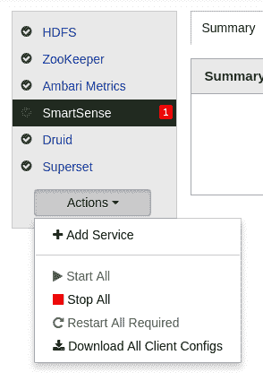

# 添加服务向导

一旦我们点击“添加服务”菜单项，我们将看到一个向导，我们必须从 Ambari 支持的所有服务列表中选择 Spark 2。屏幕看起来像这样：

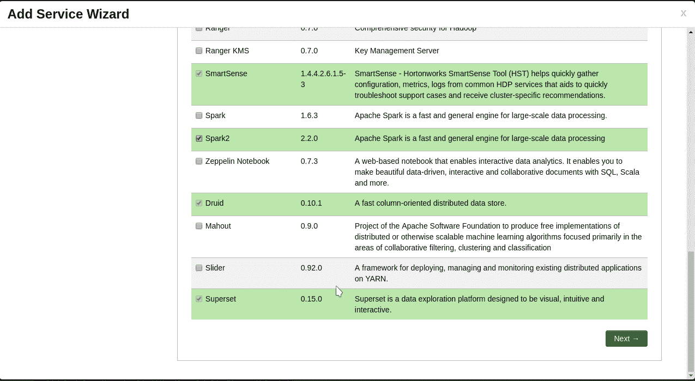

在服务选择完成后，点击“下一步”按钮。

# 服务器放置

一旦选择了 Spark 2 服务，其他依赖服务也会自动为我们选择，并允许我们选择主服务器的放置位置。我已将默认选择保持不变：

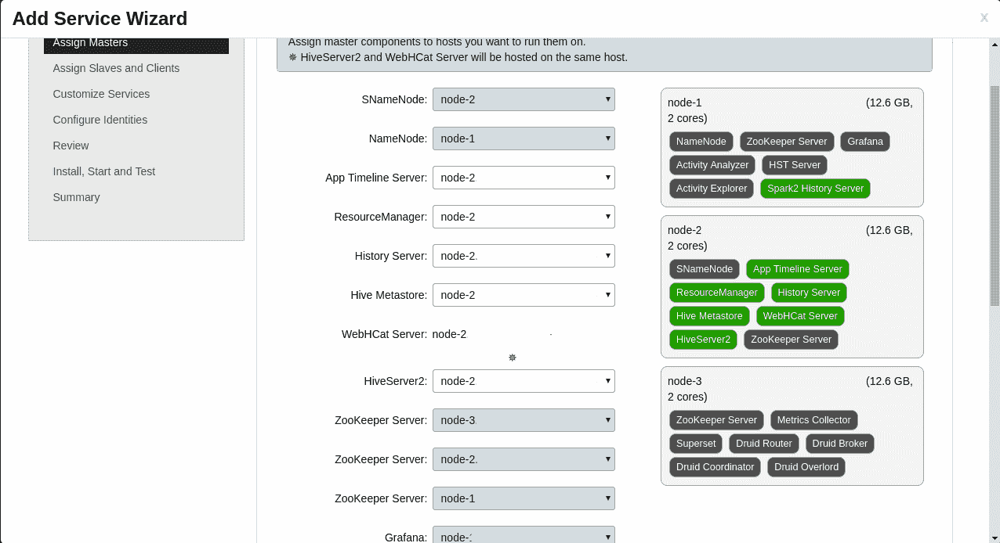

当更改看起来不错时，点击“下一步”按钮。

# 客户端和从节点选择

在此步骤中，我们可以选择作为之前步骤中选定的主服务器客户端的节点列表。我们还可以选择可以安装客户端工具的服务器列表。根据您的选择进行选择：

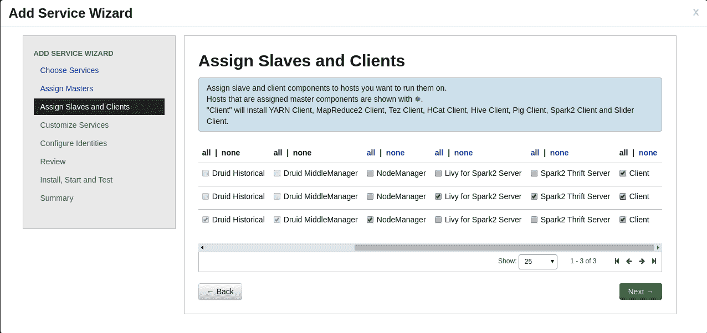

在更改完成后，点击“下一步”按钮。

# 服务定制

由于 Hive 也是作为 Spark 2 选择的一部分进行安装的，因此我们有机会自定义 Hive 数据源的具体细节。我已经在主节点上创建了数据库，用户名为`hive`，密码为`hive`，数据库也命名为`hive`。在更改生产环境中的设置时，请选择一个强大的密码。

定制屏幕看起来像这样：

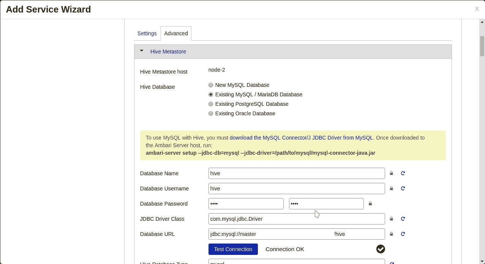

当更改正确完成后，点击“下一步”。

# 软件部署

在此屏幕上，我们展示了我们迄今为止所做的选择摘要。点击“部署”以开始在所选服务器上部署 Spark 2 软件。如果我们觉得我们错过了任何定制，我们可以在这一步取消向导并重新开始：

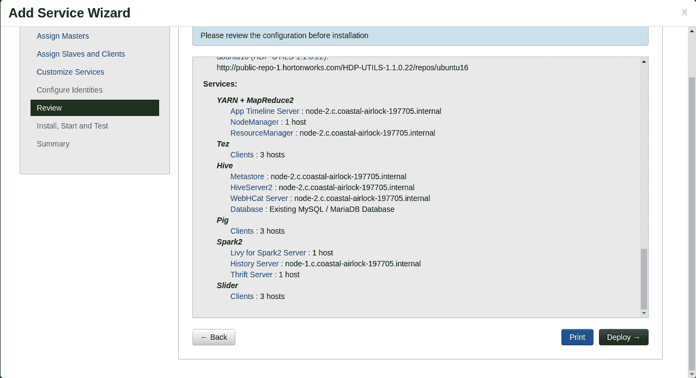

# Spark 安装进度

在此步骤中，我们展示了 Spark 软件安装及其其他依赖项的进度。一旦一切部署完成，我们将显示任何警告和错误的摘要。正如我们从以下屏幕中可以看到的，在安装过程中遇到了一些警告，这表明在向导完成后我们需要重新启动一些服务。不要担心，看到这些错误是很正常的。我们将在接下来的步骤中纠正这些错误，以确保 Spark 系统成功运行：

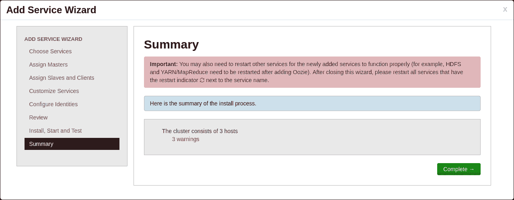

点击“完成”以完成向导。

# 服务重启和清理

由于在安装过程中出现了警告，我们必须重新启动所有受影响的组件。重启过程显示在此屏幕上：

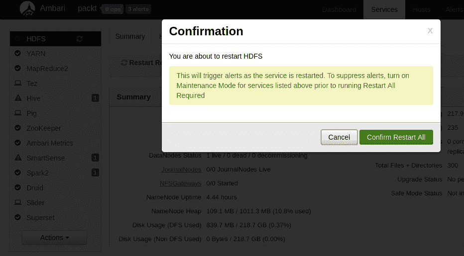

一旦我们确认，所有相关的服务都将重新启动，我们将拥有一个成功运行的系统。

这完成了在由 Ambari 管理的现有 Hadoop 集群上安装 Spark 2 的过程。在接下来的章节中，我们将学习更多关于 Spark 中的各种数据结构和库。

# Apache Spark 数据结构

尽管 Mapreduce 提供了一种处理大量数据的有力方式，但它由于几个缺点而受到限制：

+   缺乏对各种运算符的支持

+   实时数据处理

+   缓存数据结果以加快迭代速度

这只是列举了一小部分。由于 Apache Spark 是从底层构建的，它以非常通用的方式处理大数据计算问题，并为开发者提供了数据结构，使得表示任何类型的数据和使用这些数据结构进行更好的计算变得更加容易。

# RDDs, DataFrames and datasets

Apache Spark 的核心是称为 RDD 的分布式数据集，也称为**弹性分布式数据集**。这些是不可变的、存在于集群中的数据集，具有高度可用性和容错性。RDD 中的元素可以并行操作，为 Spark 集群提供了很大的能力。

由于数据已经存在于存储系统中，如 HDFS、RDBMS、S3 等，因此可以轻松地从这些外部数据源创建 RDD。API 还为我们提供了从现有的内存数据元素创建 RDD 的能力。

这些 RDD 没有预定义的结构。因此，它们可以采取任何形式，通过利用 Spark 库中的不同操作符，我们可以编写强大的程序，提供必要的结果，而不必过多担心数据复杂性。

为了满足 RDBMS 的需求，DataFrame 应运而生，其中 DataFrame 可以与关系数据库系统中的表进行比较。正如我们所知，表有行和列，数据结构在事先是已知的。通过了解数据结构，可以在数据处理过程中执行多种优化。

Spark 数据集与 DataFrame 有些相似。但它们通过支持使用本地语言对象（Java 和 Scala）的半结构化数据对象来扩展 DataFrame 的功能。DataFrame 是一个不可变的对象集合，具有关系模式的语义。由于我们处理的是半结构化数据和本地语言对象，因此存在一个编码/解码系统，负责在类型之间自动转换。

下面是一个快速比较表：

| **特性** | **RDD** | **DataFrame** | **Dataset** |
| --- | --- | --- | --- |
| 数据类型 | 非结构化数据 | 结构化数据 | 半结构化数据 |
| 模式要求 | 完全自由形式 | 严格数据类型  | 松散耦合 |
| Spark 提供的优化 | 对于非结构化数据不需要 | 利用已知的数据类型进行优化 | 推断的数据类型提供一定程度的优化 |
| 高级表达式/过滤器 | 数据形式复杂，难以处理 | 我们知道我们处理的数据，因此可以利用这些 |

# Apache Spark 编程

Apache Spark 提供了非常好的编程语言支持。它为 Java、Scala、Python 和 R 编程语言提供了第一级支持。尽管编程语言中可用的数据结构和运算符在本质上相似，但我们必须使用特定于编程语言的构造来达到所需的逻辑。在本章中，我们将使用 Python 作为首选的编程语言。然而，Spark 本身对这些编程语言是中立的，并且使用任何编程语言都会产生相同的结果。

使用 Python 的 Apache Spark 可以有两种不同的方式。第一种方式是启动`pyspark`交互式外壳，它帮助我们运行 Python 指令。体验类似于 Python 外壳实用程序。另一种方式是编写可以由 spark-submit 命令调用的独立程序。为了使用独立的 Spark 程序，我们必须了解 Spark 程序的基本结构：

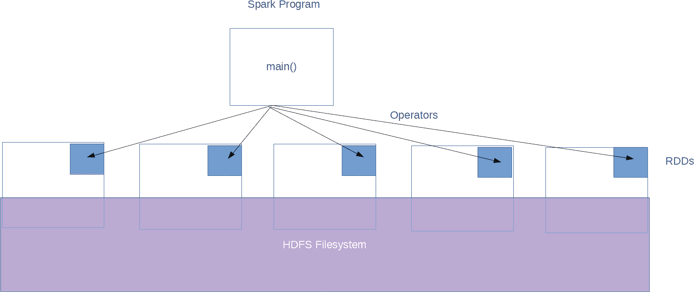

Spark 程序的一般结构包括一个主函数，该函数在 RDD 上执行不同的运算符以生成所需的结果。Spark 库支持超过 80 种不同类型的运算符。从高层次上讲，我们可以将这些运算符分为两种类型：转换和动作。转换运算符将数据从一种形式转换为另一种形式。动作运算符从数据生成结果。为了优化集群中的资源以实现性能，Apache Spark 实际上在检查点中执行程序。只有当有动作运算符时，才会到达检查点。这是需要记住的一个重要事项，尤其是如果你是 Spark 编程的新手。即使是经验最丰富的程序员有时也会对为什么他们没有看到预期的结果而感到困惑，因为他们没有在数据上使用任何动作运算符。

回到前面的图表，我们有一个驱动程序，它有一个主程序，该程序对存储在类似 HDFS 的文件系统中的数据进行几个操作/转换，并给出我们期望的结果。我们知道 RDD 是 Spark 编程语言中的基本并行数据存储。Spark 足够智能，可以从种子存储（如 HDFS）创建这些 RDD，一旦创建，它可以在内存中缓存 RDD，并通过使它们容错来提高这些 RDD 的可用性。即使由于节点崩溃，RDD 的副本离线，对相同 RDD 的后续访问也将快速从原始生成的计算中生成。

# 分析的样本数据

为了理解 Spark 的编程 API，我们应该有一个样本数据集，我们可以对其进行一些操作以获得信心。为了生成这个数据集，我们将从上一章的员工数据库中导入样本表。

这些是我们遵循的指令来生成这个数据集：

登录到服务器并切换到 Hive 用户：

```py
ssh user@node-3
[user@node-3 ~]$ sudo su - hive
```

这将使我们进入一个远程 shell，在那里我们可以从 MySQL 数据库中导出表：

```py
[hive@node-3 ~]$ mysql -usuperset -A -psuperset -h master employees -e "select * from vw_employee_salaries" > vw_employee_salaries.tsv
[hive@node-3 ~]$ wc -l vw_employee_salaries.tsv 
2844048 vw_employee_salaries.tsv
[hive@node-3 ~]$ 
```

接下来，我们应该使用以下命令将文件复制到 Hadoop：

```py
[hive@node-3 ~]$ hadoop fs -put ./vw_employee_salaries.tsv /user/hive/employees.csv
```

现在，数据准备已经完成，因为我们已经成功将其复制到 HDFS。我们可以开始使用 Spark 来使用这些数据。

# Interactive data analysis with pyspark

Apache Spark 发行版附带一个名为**pyspark**的交互式 shell。由于我们处理的是像 Python 这样的解释型编程语言，我们可以在学习的同时编写交互式程序。

如果你还记得，我们使用 Apache Ambari 安装了 Spark。因此，我们必须遵循 Apache Ambari 的标准目录位置来访问与 Spark 相关的二进制文件：

```py
[hive@node-3 ~]$ cd /usr/hdp/current/spark2-client/
[hive@node-3 spark2-client]$ ./bin/pyspark 
Python 2.7.5 (default, Aug  4 2017, 00:39:18) 
[GCC 4.8.5 20150623 (Red Hat 4.8.5-16)] on linux2
Type "help", "copyright", "credits" or "license" for more information.
Setting default log level to "WARN".
To adjust logging level use sc.setLogLevel(newLevel). For SparkR, use setLogLevel(newLevel).
Welcome to
      ____              __
     / __/__  ___ _____/ /__
    _\ \/ _ \/ _ `/ __/  '_/
   /__ / .__/\_,_/_/ /_/\_\   version 2.2.0.2.6.4.0-91
      /_/

Using Python version 2.7.5 (default, Aug  4 2017 00:39:18)
SparkSession available as 'spark'.
>>> 
```

前面的步骤启动了交互式 Spark shell。

在理解 Spark 数据结构的第一个步骤中，我们将从 HDFS 加载`employees.csv`文件，并使用以下说明来计算文件中的总行数：

```py
>>> ds = spark.read.text("employees.csv")
>>> ds.count()
2844048                                                                         
>>> 
```

如我们所见，计数与之前在 Unix shell 上的加载操作相匹配。

现在，让我们尝试从文件中加载前五条记录并尝试查看数据结构对象的模式：

```py
>>> ds.first()
Row(value=u'emp_no\tbirth_date\tfirst_name\tlast_name\tgender\thire_date\tsalary\tfrom_date\tto_date')
>>> ds.head(5)
[Row(value=u'emp_no\tbirth_date\tfirst_name\tlast_name\tgender\thire_date\tsalary\tfrom_date\tto_date'), Row(value=u'10001\t1953-09-02\tGeorgi\tFacello\tM\t1986-06-26\t60117\t1986-06-26\t1987-06-26'), Row(value=u'10001\t1953-09-02\tGeorgi\tFacello\tM\t1986-06-26\t62102\t1987-06-26\t1988-06-25'), Row(value=u'10001\t1953-09-02\tGeorgi\tFacello\tM\t1986-06-26\t66074\t1988-06-25\t1989-06-25'), Row(value=u'10001\t1953-09-02\tGeorgi\tFacello\tM\t1986-06-26\t66596\t1989-06-25\t1990-06-25')]
>>> ds.printSchema()
root
 |-- value: string (nullable = true)

>>> 
```

如我们所见，即使我们有 CSV（制表符分隔的文件），Spark 也将文件读取为以换行符分隔的普通文本文件，其模式中只包含一个值，即字符串数据类型。

在这种操作模式下，我们将每条记录视为一行，我们只能执行几种类型的操作，例如计算给定名称的所有出现次数：

```py
>>> ds.filter(ds.value.contains("Georgi")).count()
2323                                                                            
>>> 
```

这种操作模式与日志处理有些相似。但 Spark 的真正力量来自于将数据视为具有行和列的表格，也称为**DataFrames**：

```py
>>> ds = spark.read.format("csv").option("header", "true").option("delimiter", "\t").load("employees.csv")
>>> ds.count()
2844047   
>>> ds.show(5)
+------+----------+----------+---------+------+----------+------+----------+----------+
|emp_no|birth_date|first_name|last_name|gender| hire_date|salary| from_date|   to_date|
+------+----------+----------+---------+------+----------+------+----------+----------+
| 10001|1953-09-02|    Georgi|  Facello|     M|1986-06-26| 60117|1986-06-26|1987-06-26|
| 10001|1953-09-02|    Georgi|  Facello|     M|1986-06-26| 62102|1987-06-26|1988-06-25|
| 10001|1953-09-02|    Georgi|  Facello|     M|1986-06-26| 66074|1988-06-25|1989-06-25|
| 10001|1953-09-02|    Georgi|  Facello|     M|1986-06-26| 66596|1989-06-25|1990-06-25|
| 10001|1953-09-02|    Georgi|  Facello|     M|1986-06-26| 66961|1990-06-25|1991-06-25|
+------+----------+----------+---------+------+----------+------+----------+----------+
only showing top 5 rows

>>> 
>>> ds.printSchema()
root
 |-- emp_no: string (nullable = true)
 |-- birth_date: string (nullable = true)
 |-- first_name: string (nullable = true)
 |-- last_name: string (nullable = true)
 |-- gender: string (nullable = true)
 |-- hire_date: string (nullable = true)
 |-- salary: string (nullable = true)
 |-- from_date: string (nullable = true)
 |-- to_date: string (nullable = true)

>>> 
```

现在，我们可以看到 Spark 已经自动将输入 CSV 文本转换为 DataFrame。但所有字段都被视为字符串。

让我们尝试使用 Spark 的架构推断功能自动找到字段的类型：

```py
>>> ds = spark.read.format("csv").option("header", "true").option("delimiter", "\t").option("inferSchema", "true").load("employees.csv")
18/03/25 19:21:15 WARN FileStreamSink: Error while looking for metadata directory.
18/03/25 19:21:15 WARN FileStreamSink: Error while looking for metadata directory.
>>> ds.count()                                                                  
2844047                                                                         
>>> ds.show(2)
+------+-------------------+----------+---------+------+-------------------+------+-------------------+-------------------+
|emp_no|         birth_date|first_name|last_name|gender|          hire_date|salary|          from_date|            to_date|
+------+-------------------+----------+---------+------+-------------------+------+-------------------+-------------------+
| 10001|1953-09-02 00:00:00|    Georgi|  Facello|     M|1986-06-26 00:00:00| 60117|1986-06-26 00:00:00|1987-06-26 00:00:00|
| 10001|1953-09-02 00:00:00|    Georgi|  Facello|     M|1986-06-26 00:00:00| 62102|1987-06-26 00:00:00|1988-06-25 00:00:00|
+------+-------------------+----------+---------+------+-------------------+------+-------------------+-------------------+
only showing top 2 rows

>>> ds.printSchema()
root
 |-- emp_no: integer (nullable = true)
 |-- birth_date: timestamp (nullable = true)
 |-- first_name: string (nullable = true)
 |-- last_name: string (nullable = true)
 |-- gender: string (nullable = true)
 |-- hire_date: timestamp (nullable = true)
 |-- salary: integer (nullable = true)
 |-- from_date: timestamp (nullable = true)
 |-- to_date: timestamp (nullable = true)

>>> 
```

现在，我们可以看到所有字段都有一个合适的数据类型，这与 MySQL 表定义最接近。

我们可以在数据上应用简单的操作来查看结果。让我们尝试找到总男性记录数：

```py
>>> ds.filter(ds.gender == "M").count()
1706321 
```

此外，尝试找到工资超过$100K 的男性记录：

```py
>>> ds.filter(ds.gender == "M").filter(ds.salary > 100000).count()
57317   
```

难道很简单吗？官方 Spark 文档中还有许多其他可用于探索的操作符。

# Standalone application with Spark

在上一节中，我们看到了如何使用交互式 shell `pyspark`来学习 Spark Python API。在本节中，我们将编写一个简单的 Python 程序，我们将在 Spark 集群上运行它。在现实场景中，这就是我们在 Spark 集群上运行应用程序的方式。

为了做到这一点，我们将编写一个名为`MyFirstApp.py`的程序，其内容如下：

```py
[hive@node-3 ~]$ cat MyFirstApp.py 
from pyspark.sql import SparkSession

# Path to the file in HDFS
csvFile = "employees.csv"

# Create a session for this application
spark = SparkSession.builder.appName("MyFirstApp").getOrCreate()

# Read the CSV File
csvTable = spark.read.format("csv").option("header", "true").option("delimiter", "\t").load(csvFile)

# Print the total number of records in this file
print "Total records in the input : {}".format(csvTable.count())

# Stop the application
spark.stop()
[hive@node-3 ~]$ 
```

为了在 Spark 集群上运行此程序，我们必须使用 spark-submit 命令，该命令在调度和协调整个应用程序生命周期方面执行必要的操作：

```py
[hive@node-3 ~]$ /usr/hdp/current/spark2-client/bin/spark-submit ./MyFirstApp.py 2>&1 | grep -v -e INFO -e WARN
Total records in the input : 2844047
```

如预期的那样，这些是我们输入文件中的总记录数（不包括标题行）。

# Spark 流应用程序

Spark 的一个强大功能是构建处理实时流数据并产生实时结果的应用程序。为了更好地理解这一点，我们将编写一个简单的应用程序，尝试在输入流中查找重复消息并打印所有唯一消息。

当我们处理不可靠的数据流并只想提交唯一数据时，此类应用程序非常有用。

此应用程序的源代码如下：

```py
[hive@node-3 ~]$ cat StreamingDedup.py 
from pyspark import SparkContext
from pyspark.streaming import StreamingContext

context = SparkContext(appName="StreamingDedup")
stream = StreamingContext(context, 5)

records = stream.socketTextStream("localhost", 5000)
records
    .map(lambda record: (record, 1))
    .reduceByKey(lambda x,y: x + y)
    .pprint()

ssc.start()
ssc.awaitTermination()
```

在此应用程序中，我们连接到端口`5000`上的远程服务，该服务在其自己的页面上发出消息。程序每 5 秒总结一次操作结果，如`StreamingContext`参数中定义的那样。

现在，让我们使用 UNIX netcat 命令（`nc`）和简单循环启动一个简单的 TCP 服务器：

```py
for i in $(seq 1 10)
do
  for j in $(seq 1 5)
  do
   sleep 1
   tail -n+$(($i * 3)) /usr/share/dict/words | head -3
  done
done | nc -l 5000

```

然后，将我们的程序提交到 spark 集群：

```py
[hive@node-3 ~]$ /usr/hdp/current/spark2-client/bin/spark-submit ./StreamingDedup.py 2>&1 | grep -v -e INFO -e WARN
```

程序启动后，我们看到以下输出：

```py
-------------------------------------------
Time: 2018-03-26 04:33:45
-------------------------------------------
(u'16-point', 5)
(u'18-point', 5)
(u'1st', 5)

-------------------------------------------
Time: 2018-03-26 04:33:50
-------------------------------------------
(u'2', 5)
(u'20-point', 5)
(u'2,4,5-t', 5)
```

我们看到每个单词的计数正好是 5，这是预期的，因为我们已经在 Unix 命令循环中打印了五次。

我们可以通过这张图来理解这一点：

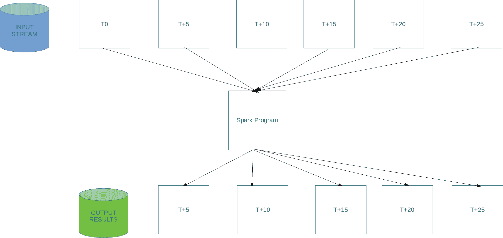

**输入流**产生一个连续的数据流，该数据流被**Spark 程序**实时消费。之后，通过消除重复项来打印结果。

如果按时间顺序查看，从时间零到五秒（**T0** - **T5**）的数据被处理，并在**T5**时间提供结果。对于所有其他时间槽也是如此。

在这个简单的示例中，我们刚刚学习了如何使用 Spark Streaming 构建实时应用程序的基础知识。

# Spark SQL 应用程序

当使用 Spark 编写应用程序时，开发人员可以选择在结构化数据上使用 SQL 来获取所需的结果。以下示例使我们更容易理解如何做到这一点：

```py
[hive@node-3 ~]$ cat SQLApp.py 
from pyspark.sql import SparkSession

# Path to the file in HDFS
csvFile = "employees.csv"

# Create a session for this application
spark = SparkSession.builder.appName("SQLApp").getOrCreate()

# Read the CSV File
csvTable = spark.read.format("csv").option("header", "true").option("delimiter", "\t").load(csvFile)
csvTable.show(3)

# Create a temporary view
csvView = csvTable.createOrReplaceTempView("employees")

# Find the total salary of employees and print the highest salary makers
highPay = spark.sql("SELECT first_name, last_name, emp_no, SUM(salary) AS total FROM employees GROUP BY emp_no, first_name, last_name ORDER BY SUM(salary)")

# Generate list of records
results = highPay.rdd.map(lambda rec: "Total: {}, Emp No: {}, Full Name: {} {}".format(rec.total, rec.emp_no, rec.first_name, rec.last_name)).collect()

# Show the top 5 of them
for r in results[:5]:
    print(r)

# Stop the application
spark.stop()
[hive@node-3 ~]$ 
```

在此示例中，我们从`employees.csv`构建一个 DataFrame，然后在内存中创建一个名为**employees**的视图。稍后，我们可以使用 ANSI SQL 编写和执行查询以生成必要的结果。

由于我们感兴趣的是查找最高薪酬的员工，结果正如预期的那样：

```py
[hive@node-3 ~]$ /usr/hdp/current/spark2-client/bin/spark-submit ./SQLApp.py 2>&1 | grep -v -e INFO -e WARN
[rdd_10_0]
+------+----------+----------+---------+------+----------+------+----------+----------+
|emp_no|birth_date|first_name|last_name|gender| hire_date|salary| from_date|   to_date|
+------+----------+----------+---------+------+----------+------+----------+----------+
| 10001|1953-09-02|    Georgi|  Facello|     M|1986-06-26| 60117|1986-06-26|1987-06-26|
| 10001|1953-09-02|    Georgi|  Facello|     M|1986-06-26| 62102|1987-06-26|1988-06-25|
| 10001|1953-09-02|    Georgi|  Facello|     M|1986-06-26| 66074|1988-06-25|1989-06-25|
+------+----------+----------+---------+------+----------+------+----------+----------+
only showing top 3 rows

Total: 40000.0, Emp No: 15084, Full Name: Aloke Birke
Total: 40000.0, Emp No: 24529, Full Name: Mario Antonakopoulos
Total: 40000.0, Emp No: 30311, Full Name: Tomofumi Coombs
Total: 40000.0, Emp No: 55527, Full Name: Kellyn Ouhyoung
Total: 40000.0, Emp No: 284677, Full Name: Richara Eastman
```

如我们所见，Apache Spark 提供的简化 API 使得在 CSV 数据上编写 SQL 查询（无需 RDBMS）变得更加容易，以获取我们想要的结果。

# 摘要

在本章中，你了解了大规模数据处理框架的基本概念，并且还了解到 Spark 的一个强大功能是构建处理实时流数据并产生实时结果的应用程序。

在接下来的几章中，我们将讨论如何使用 Elasticsearch 堆栈构建实时数据搜索管道。
