# 第十章：使用云开发应用程序

在计算机的早期阶段，CPU 功率和存储非常稀缺，因此购买相关设备的成本非常高。随着 80 年代初苹果和微软个人计算机发展的进步，越来越多的个人和组织获得了这些计算设备。随着芯片制造技术的发展，现在单芯片上可以放置数十亿甚至数万亿个晶体管，这些计算设备的大小急剧减小，从占据整个房间到仅由数据中心中的一个机架单元组成。当计算速度和存储设备容量开始增加时，个人和企业开始意识到，有效地管理他们的计算资源正成为一个挑战。

互联网的广泛应用也对个人获取资源的方式做出了重大贡献。

在本章中，我们将涵盖以下主题：

+   什么是云？

+   云中的可用技术

+   规划云基础设施

    +   云中的高可用性

    +   云中的业务连续性规划

    +   云中的安全性

+   在云中构建 Hadoop 集群

+   云与内部应用

+   云中的数据访问

# 什么是云？

云计算，或简称云，是一种简单的方式来租用和使用互联网上的资源，如电子存储空间、计算能力、网络带宽、IP 地址、数据库、Web 服务器等。云推动了“按使用付费”的范式，客户只需为使用这些资源付费，就像电网为客户计费其电力消耗一样。

云计算改变了个人和组织访问和管理互联网上服务器和应用程序的方式。在云计算之前，每个人都习惯于在自己的场所或专用数据中心管理自己的服务器和应用程序。计算（CPU 和 GPU）多核单芯片原始计算能力的增加以及存储空间（HDD 和 SSD）的增加，给有效利用现有计算资源带来了挑战。

# 云中的可用技术

随着云计算的日益普及，企业开始构建各种技术并将其提供给消费者。我们将通过列表介绍那些开创云服务的企业，以及他们提供的不同类型的技术。

这里是一份提供云服务的公司列表：

+   微软 Azure (Azure)

+   亚马逊网络服务

+   谷歌云平台

+   IBM

+   Salesforce

+   SAP

+   Oracle

+   VMware

各种类型的资源正以以下形式提供给消费者：

+   平台即服务

+   基础设施即服务

+   软件即服务

+   后端即服务

+   网络即服务

随着这些服务提供的增加，许多组织无需关注基础设施，如房地产、服务器、防火墙、负载均衡器、交换机、电源供应等。相反，他们可以直接从云服务提供商那里购买这些服务，然后只需关注他们正在构建的应用程序。

现在，让我们看看顶级提供商，微软、亚马逊和谷歌，提供哪些技术：

| **技术** | **Azure** | **Amazon Web Services** | **Google Cloud** | **描述** |
| --- | --- | --- | --- | --- |
| 服务器 | Azure 计算 | Amazon EC2 | **Google Compute Engine** (**GCE**) | 这种技术涉及提供按需服务器，这些服务器可以是虚拟化的或本质上是专用/裸金属的。 |
| 存储 | Azure 存储 | Amazon EBS | Google 存储 | 这是一种按需存储，可以根据需要附加到计算节点。一些供应商提供按需调整这些存储设备大小的能力。 |
| 网络 | Azure 网络 | 是 | Google 网络服务 | 提供商根据应用程序的网络需求提供从 100 Mbps 到 10 Gbps 的网络带宽。 |
| 数据库 | Azure 数据库 | Amazon RDS | Google Cloud SQL | 使用托管数据库，我们无需担心数据库服务器的维护，因为供应商会自动处理这些支持。请注意，在某些情况下，我们需要自己规划高可用性。 |
| 内容分发 | Azure CDN | Amazon CloudFront | Google Cloud CDN | 如果我们想通过利用分发网络将静态资源推送给用户，从而显著降低延迟，这将非常有帮助。我们还可以将其用作私有存储，存储所有文件，如备份、会议录音等。 |
| **域名系统** (**DNS**) | Azure DNS | Amazon Route S3 | Google Cloud DNS | DNS 对于在互联网上运行我们的应用程序至关重要。这项服务通过确保我们的服务器对其他基础设施的可用性，而无需运行自己的 DNS 服务器，使我们的生活变得更加容易。 |
| 商务邮件 | Microsoft o365 | Amazon WorkMail | Google Mail | 对于需要以安全且可扩展的方式访问电子邮件和日历的组织来说，这是必不可少的。 |
| 机器学习 | Azure AI + 机器学习 | Amazon 机器学习 | Google ML Engine | 机器学习技术如今已成为热门词汇。供应商们提供了与机器学习相关的多种技术，我们只需关注我们需要做什么，而无需担心运行这些算法所需的基础设施。 |
| **分布式拒绝服务** (**DDoS**) 保护 | Azure DDoS Protection | AWS Shield | – | 对于无法承受服务中断的组织来说，这是一件非常重要的事情，当发生大规模拒绝服务攻击影响其网站的常规访客时。 |
| 监控 | Azure Monitor | Amazon CloudWatch | Google monitoring | 如果不监控我们的应用程序和基础设施，我们可能无法看到我们的表现。这些服务帮助我们保持业务正常进行，并响应触发应用程序和云上运行的基础设施停机的事件。 |
| 容器 | **Azure Container Service**（**AKS**） | **Amazon Elastic Container Service For Kubernetes**（**Amazon EKS**） | Google Kubernetes Engine | 这是一种基础设施，允许您以容器形式运行应用程序，而不是拥有完整的计算环境来运行它们。 |

# 规划云基础设施

传统组织拥有自己的 IT/基础设施团队来管理他们的专用服务器和网络。在规划迁移到云的过程中，为了更好地操作基础设施，我们必须牢记以下几点。

规划云基础设施涉及：

+   专用或共享服务器

+   高可用性

+   业务连续性规划

+   安全性

+   网络架构

# 专用服务器与共享服务器的比较

云服务提供商为我们提供了租用完全拥有物理硬件或与其他云用户（如我们）共享物理硬件的服务器选项。为了做出决定，我们需要了解这些模型各自的优缺点。

# 专用服务器

这些是类型的服务器，其所有权属于单个用户或组织，并且不会与其他用户共享。这种设置有几个优点，如下所示：

+   我们完全拥有物理服务器，并且我们分配的任何进一步的服务器都将部署在同一硬件上

+   我们可能需要为这种设置支付更多费用

+   由于 Spectre 和 Meltdown，我们得到了更好的保护，因为硬件没有与任何人共享

+   由于我们完全拥有硬件，我们不会受到邻居的影响

# 共享服务器

对于简单的实验来说，拥有一个完整的服务器是昂贵的。在这种情况下，我们可以选择共享设置，在给定的物理硬件上租用一些资源。以下是一些共享服务器的优点：

+   我们只对我们按需租用的虚拟服务器付费。

+   尽管云服务提供商提供了绝对隔离，但由于 Spectre 和 Meltdown，我们需要稍微小心一些。

+   比专用服务器更容易部署。

# 高可用性

根据我们计划运行的应用程序类型，我们必须了解供应商为这些应用程序提供的**服务级别协议**（**SLA**）在正常运行时间方面的条款，并据此规划我们的应用程序。

让我们看看使用 DNS 实现应用高可用性的简单方法：

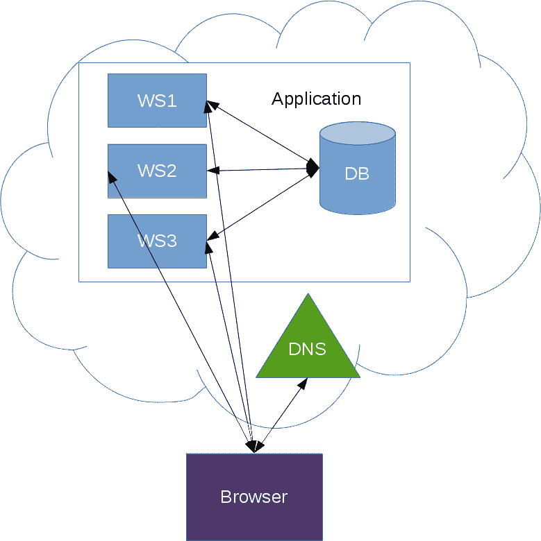

在这种设计中，以下事情会发生：

+   当用户尝试使用像 Google Chrome 或 Firefox 这样的网络浏览器连接到我们的网站时，它首先尝试联系 DNS 服务器

+   **DNS**服务器了解我们的前端服务器，并返回所有服务器的列表

+   浏览器将直接连接到前端服务器

+   前端服务器连接到数据库并返回请求的资源

在这个设计中，我们需要注意以下事项：

+   前端服务器直接暴露在互联网上，因此我们应该采取适当的措施，如防火墙或 DDos 保护，以保护我们的服务器

+   这些前端服务器也应安装最新的操作系统软件，以防止任何攻击

+   数据库服务器不应对外界可见，因此应设置适当的防火墙以允许前端服务器的请求

云服务提供商提供私有 IP 地址。为了最小化数据库服务器意外暴露给互联网的风险，我们应该阻止这些服务器的公共互联网访问。

让我们看看另一个设计，它也能保护我们的 Web 服务器免受互联网攻击：

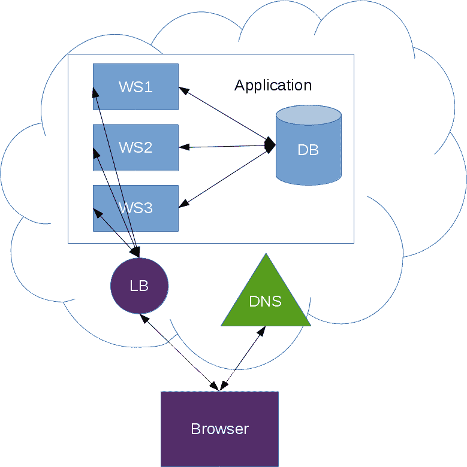

与之前的设计相比，我们在以下方面进行了以下更改：

+   当**浏览器**联系**DNS**服务器以连接到我们的网站时，**DNS**服务器提供**负载均衡器**（**LB**）/代理服务器的 IP 地址

+   浏览器连接到这个**LB**

+   **LB**跟踪哪些后端服务器可用，然后将请求转发到服务器：

    +   服务器与**数据库**（**DB**）通信并完成响应的构建

    +   响应被发送回**LB**（负载均衡器）

+   **LB**将响应发送到**浏览器**

如果我们仔细观察这个设计，我们会看到它相对于之前设计的优势：

+   **LB**隐藏了我们的基础设施，因此外部人员无法轻易知道我们的基础设施中有多少服务器

+   **LB**保护我们的 Web 服务器免受多种攻击

+   **LB**可以进行 SSL 卸载，其中所有加密/解密操作都在**LB**级别进行，我们的服务器可以免受 SSL 开销的影响

根据组织的安全策略，您可能需要在 Web 服务器上启用 SSL。

# 业务连续性规划

**业务连续性规划**（**BCP**）在组织处于成长阶段时是一个非常重要的考虑因素。网络、服务器、数据库或其他云基础设施组件的任何停机都可能使整个业务陷入瘫痪。

在规划 BCP 时，有几个关键事项需要牢记：

+   基础设施不可用

+   自然灾害

+   商业数据

# 基础设施不可用

如果云提供商提供的服务出现计划外中断，它将使我们的所有服务都中断。为了最大限度地提高我们业务的可用性，我们需要在另一个地理区域建立备份设置。这对某些组织来说可能很昂贵，因为整个设置将需要复制，但出于业务连续性的考虑，这是在规划云基础设施时需要考虑的重要功能。

# 自然灾害

如地震、洪水、火灾事故等事件很难预测。因此，我们需要根据我们的服务器在云中的位置以及供应商遵循的数据中心建设技术标准，制定必要的计划以保持我们的业务运营。

# 商业数据

商业数据以多种形式存在，并以文件、数据库服务器和大数据系统的形式存储。对于 BCP，我们需要仔细分析在其他远程位置我们可以计划保留我们数据的副本，并执行测试运行以查看我们的应用程序是否可以从任一地理位置通过单击按钮无缝运行。

由于我们在这里处理多个地理区域，我们需要了解，当数据量巨大时，从数据中心到另一个数据中心进行复制需要时间。如果我们在原始设计中没有考虑 BCP，我们的应用程序也必须重新设计。

# BCP 设计示例

这张图试图解释我们如何通过在多个数据中心设置相同的应用程序来实现业务连续性计划（BCP）：

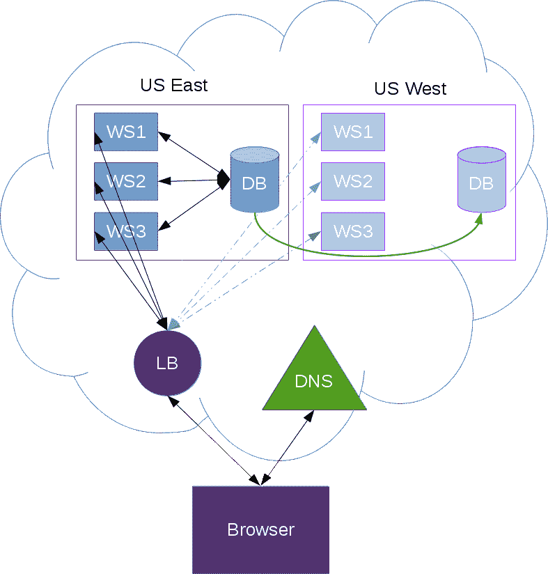

该系统可以是：

+   热热

+   热冷

# 热热系统

在热热系统中，两个数据中心同时处于活动状态，并为用户的流量提供服务。在这里，我们采用多个 CDN 和地理位置技术将用户路由到指定的数据中心。

在这样做时所面临的挑战是，如果一个区域完全变为空白，另一个区域应该有足够的余量来确保其他区域的流量被吸收

采用这种系统的优势在于用户体验很好，因为在这个设计中，用户会被路由到最近的系统

# 热冷系统

在这个系统/设计中，任何时候只有一个区域处于活动状态，只有在业务连续性计划（BCP）的情况下，我们才会回退到另一个区域。

我们在使用此系统时面临的挑战如下：

+   很容易忘记另一个区域，直到问题出现；持续保持两个区域在数据与软件方面的同步非常重要。

+   由于只有一个区域是活跃的，因此必须仔细考虑将用户正确地故障转移到另一个数据中心。

采用这种系统的优势在于所有写入操作都在一个区域进行，这使数据库设计变得简单。

# 安全性

考虑到迁移到云，安全性非常重要。以下是需要注意的事项：

+   服务器安全

+   应用安全

+   网络安全

+   单点登录

+   AAA 要求

# 服务器安全

既然我们在谈论云，我们就永远无法物理访问服务器（除非我们从云服务提供商那里获得许可）。在这种情况下，我们必须了解云提供商遵循的政策和实践水平，以确保我们应用程序将要运行的服务器物理安全。

例如，当政府考虑迁移到云时，可能需要一套不同的物理安全限制。同样，还有几个标准，如 PCI 和 HIPAA，对这个模型实施更严格的规则。

如果我们的业务需要遵守这些标准，我们需要选择支持所有这些的云变体。

# 应用安全

在云上，我们可以选择自己托管应用程序，或者使用作为服务提供的应用程序**软件即服务（SaaS**）（**SaaS**）。如果我们自己托管在自行配置的服务器上（无论是专用还是共享），我们需要在服务器级别实施正确的防火墙规则，以及正确的用户访问规则，以确保我们的软件只允许授权和正确认证的用户。

如果应用是内部的，我们应该确保我们的员工能够使用 2FA 或 3FA 方法登录这些服务。

# 网络安全

为了保护我们在云上的服务器，我们需要实施适当的防火墙规则、DNS 区域，甚至拥有我们自己的虚拟专用网络，以确保我们的所有资产不受损害，不会暴露在互联网上。

云与互联网同义，我们的数据和基础设施面临着持续的威胁。除非我们实施适当的安全措施，否则一切对每个人来说都是开放的，他们可以随意从我们的系统中获取他们喜欢的东西。

# 单点登录

**单点登录**（**SSO**）在那些在云上使用多个应用程序的组织中变得流行。最近，组织已经停止构建自己的应用程序来运营业务，而是开始采用其他服务的使用。当这些应用程序的数量增加时，这些应用程序的用户不断面临在所有这些网站上输入用户名和密码的挑战。

为了提供无缝的浏览体验，同时遵守企业安全标准，许多提供商实施 OAuth 和 SAML，因为它们是行业认可的。

这些 SSO/身份提供者与公司员工数据库集成，以进一步将云应用程序融入企业，如图所示：

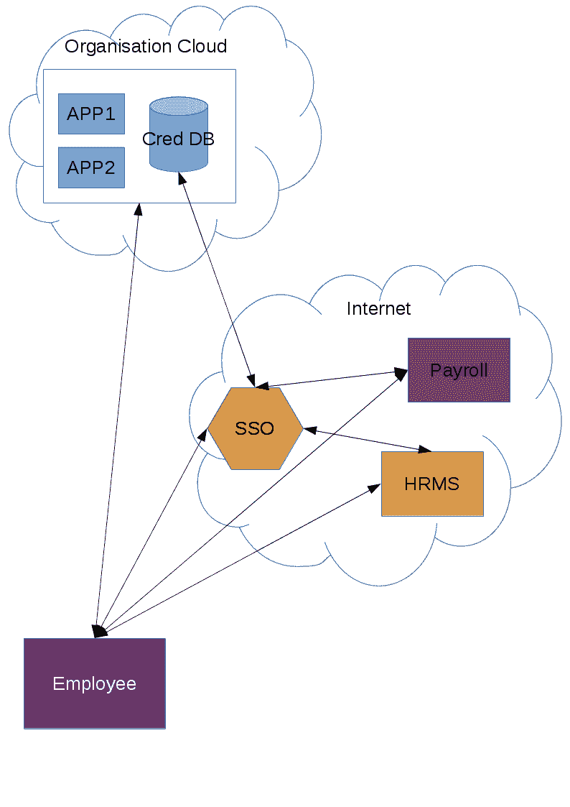

这个设计试图解释组织如何利用身份提供者实现 SSO：

+   组织与身份提供者共享员工和组织详情：

    +   密码可能会共享，也可能不会共享，因为这可能会危及整个组织，如果发生泄露

    +   SSO 系统可以强制对员工实施自己的密码

+   当用户尝试打开组织中的任何应用程序时，它会将用户重定向到 SSO 提供商

+   SSO 提供商完成认证，并将必要的凭据与应用程序共享

+   应用程序根据 SSO 的反馈授权用户

+   应用程序打开用户特定详情，然后用户可以与应用程序交互

现在，这些 SSO 的最大优势是，一旦用户与系统建立了会话，他们就可以无需进一步登录即可登录其他企业批准的应用程序。

与 SSO 提供商交互时，机密性是最大的挑战，因此组织应仔细评估并选择符合其安全需求的正确解决方案。

# AAA 需求

当涉及到安全时，重要的是要理解遵循 AAA 标准的应用程序将处理企业面临的大多数挑战。

AAA 标准处理：

+   认证

+   授权

+   审计

**认证**确保用户的身份得到适当的验证。

**授权**进一步控制是否允许特定用户根据公司政策访问某些资源。

**审计**确保跟踪所有尝试访问和使用资源的行为——这也可以用于任何调查，并提供适当的会计和计费（如果需要）。

通过遵循这些最佳实践，我们可以确保大规模上事情运行顺利。

# 在云中构建 Hadoop 集群

我们之前看到，云提供了一种灵活且简单的方式来租赁资源，如服务器、存储、网络等。云通过按需付费模式使消费者非常容易，但云的大部分复杂性都被提供商隐藏起来。

为了更好地理解 Hadoop 是否适合在云上运行，让我们进一步挖掘并看看云是如何内部组织的。

云的核心机制如下：

+   非常多的服务器，具有各种硬件配置

+   通过 IP 网络连接并可供使用的服务器

+   大型数据中心来托管这些设备

+   涵盖地理区域的数据中心，具有演进的网络和数据中心设计

如果我们仔细观察，我们正在讨论以下内容：

+   非常多的不同 CPU 架构

+   大量具有各种速度和性能的存储设备

+   速度和互连性各不相同的网络

让我们看看云上这样一个数据中心的一个简单设计：

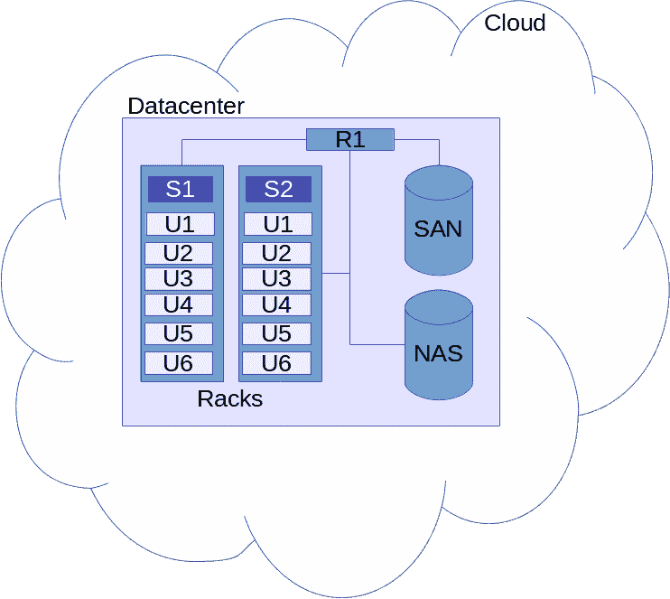

在前面的图中，我们有以下设备：

+   **S1**，**S2**：机架交换机

+   **U1-U6**：机架服务器

+   **R1**：路由器

+   存储区域网络

+   网络附加存储

如我们所见，云服务提供商拥有大量这样的架构，以使它们可扩展和灵活。

您可以正确地猜到，当这种服务器的数量增加，并且当我们请求新的服务器时，提供商可以在该区域内的任何地方分配服务器。

这使得计算和存储在一起变得有点具有挑战性，但也提供了弹性。

为了解决这种同地问题，一些云服务提供商提供了创建虚拟网络并获取专用服务器的选项，然后在这些服务器上分配所有虚拟节点。这有点类似于数据中心设计，但足够灵活，在不需要时可以回收资源。

让我们回到 Hadoop，并提醒自己，为了从 Hadoop 系统中获得最佳性能，我们应该让 CPU 功率更接近存储。这意味着 CPU 和存储之间的物理距离应该小得多，因为总线速度与处理需求相匹配。

CPU 和存储之间的 I/O 速度越慢（例如，iSCSI、存储区域网络、网络附加存储等），我们从 Hadoop 系统获得的表现就越差，因为数据是通过网络获取的，保存在内存中，然后被送到 CPU 进行进一步处理。

这是在设计云上的 Hadoop 系统时需要记住的重要事项之一。

除了性能原因外，还有其他需要考虑的事项：

+   扩展 Hadoop

+   管理 Hadoop

+   保护 Hadoop

现在，让我们尝试理解如何在云环境中处理这些问题。

在前面的章节中，我们看到了 Hadoop 可以通过以下方式安装：

+   独立部署

+   半分布式

+   全分布式

当我们想在云上部署 Hadoop 时，我们可以使用以下方式：

+   自定义 shell 脚本

+   云自动化工具（Chef、Ansible 等）

+   Apache Ambari

+   云服务提供商提供的方法

    +   Google Cloud Dataproc

    +   Amazon EMR

    +   Microsoft HDInsight

+   第三方管理的 Hadoop

    +   Cloudera

+   云无关部署

    +   Apache Whirr

# Google Cloud Dataproc

在本节中，我们将学习如何使用 Google Cloud Dataproc 设置单个节点 Hadoop 集群。

这些步骤可以分解为以下内容：

1.  获取 Google Cloud 账户。

1.  激活 Google Cloud Dataproc 服务。

1.  创建新的 Hadoop 集群。

1.  登录到 Hadoop 集群。

1.  删除 Hadoop 集群。

# 获取 Google Cloud 账户

本节假设您已经拥有 Google Cloud 账户。

# 激活 Google Cloud Dataproc 服务

一旦您登录到 Google Cloud 控制台，您需要访问 Cloud Dataproc 服务。激活界面看起来大致如下：

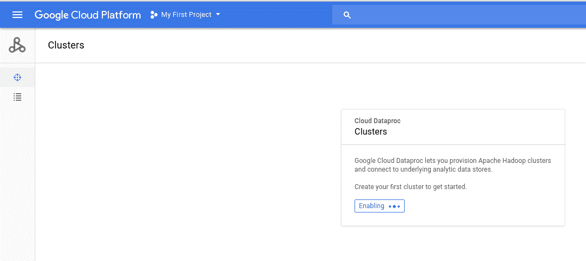

# 创建新的 Hadoop 集群

一旦在项目中启用 Dataproc，我们就可以点击创建来创建一个新的 Hadoop 集群。

之后，我们看到另一个屏幕，我们需要配置集群参数：

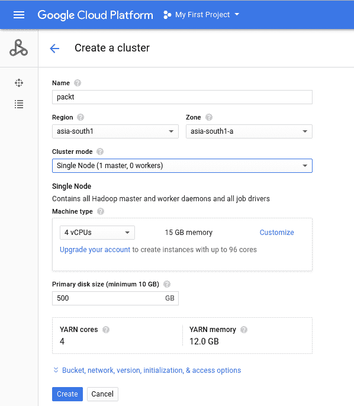

我已经将大部分内容留给了它们的默认值。稍后，我们可以点击创建按钮，它将为我们创建一个新的集群。

# 登录到集群

集群成功创建后，我们将自动转到集群列表页面。从那里，我们可以启动一个 SSH 窗口来登录到我们创建的单节点集群。

SSH 窗口看起来大致如下：

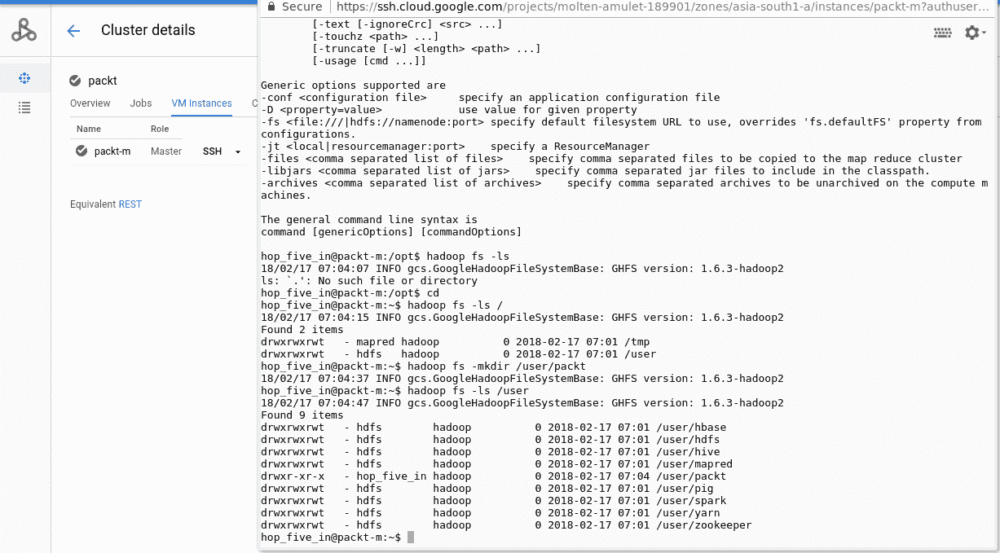

如您所见，Hadoop 命令已经为我们准备好了，我们可以运行任何标准 Hadoop 命令来与系统交互。

# 删除集群

为了删除集群，点击删除按钮，它将显示一个确认窗口，如下截图所示。之后，集群将被删除：

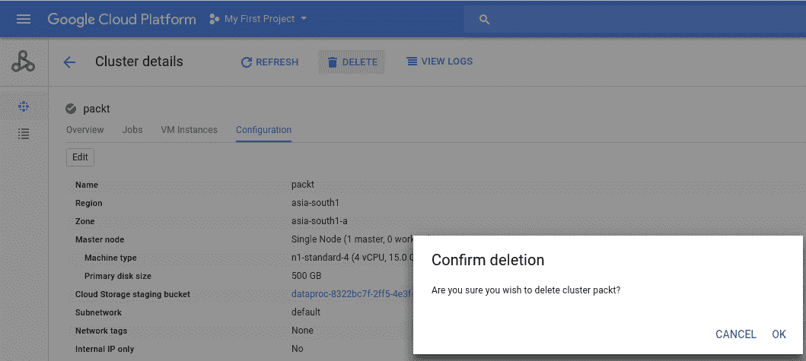

看起来很简单，对吧？是的。云服务提供商已经让用户使用云变得非常简单，并且只需为使用付费。

# 云中的数据访问

云已经成为存储个人数据和商业数据的重要目的地。根据数据的重要性和保密性要求，组织开始使用云来存储它们的关键数据集。

下面的图试图总结典型企业的各种访问模式以及它们如何利用云来存储他们的数据：

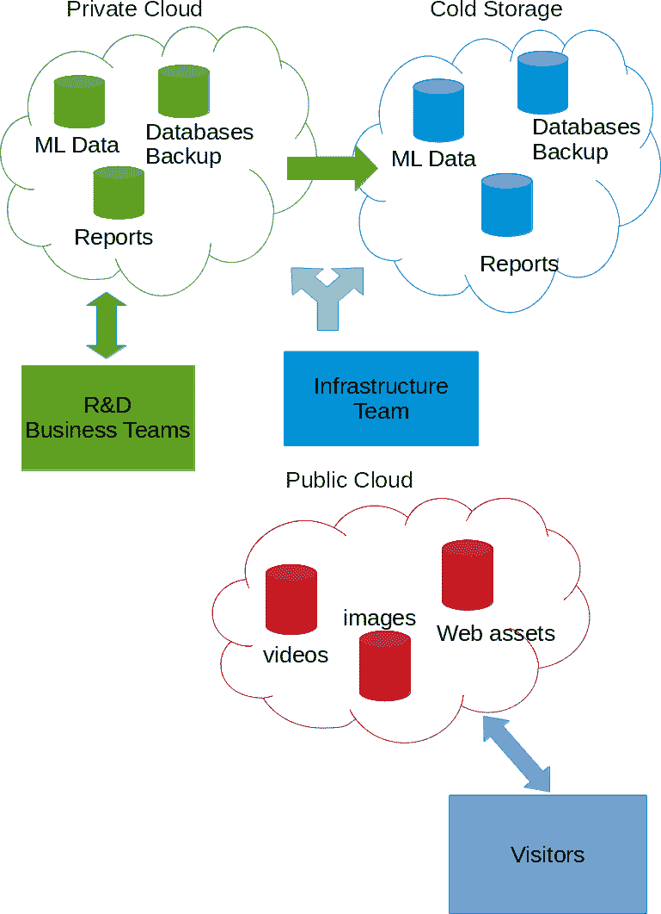

云服务提供商提供不同类型的存储。让我们看看这些类型是什么：

+   块存储

+   基于文件的存储

+   加密存储

+   离线存储

# 块存储

这种类型的存储主要在我们要将其与计算服务器一起使用，并通过主机操作系统管理存储时非常有用。

为了更好地理解这一点，这种类型的存储相当于我们购买笔记本电脑/MacBook 时附带的硬盘/SSD。在笔记本电脑存储的情况下，如果我们决定增加容量，我们需要用另一个硬盘替换现有的硬盘。

当涉及到云时，如果我们想增加更多容量，我们只需购买另一个更大容量的存储并将其连接到我们的服务器。这就是云变得流行的一个原因，因为它使得添加或缩小我们需要的存储变得非常容易。

好记的是，由于我们的应用程序有许多不同的访问模式，云供应商还提供了具有不同存储/速度要求的块存储，这些要求用它们自己的容量/IOPS 等来衡量。

让我们以这个容量升级需求为例，看看我们如何利用云上的这块存储。

为了理解这一点，让我们看看这个图例中的例子：

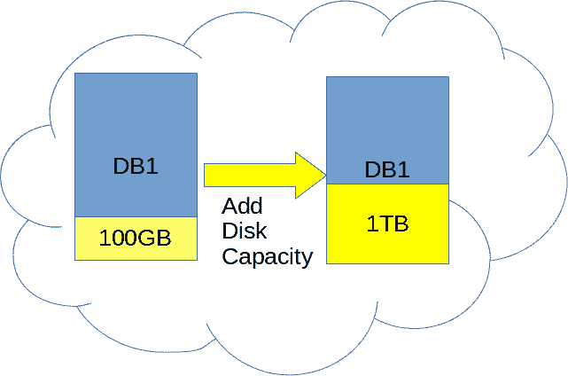

想象一下管理员创建的服务器，名为 **DB1**，原始容量为 **100 GB**。后来，由于客户需求意外增加，一个应用程序开始消耗所有 **100 GB** 的存储空间，因此管理员决定将容量增加到 **1 TB**（1,024 GB）。

这是此场景中工作流程的样子：

1.  在云上创建一个新的 1 TB 磁盘

1.  将磁盘连接到服务器并挂载

1.  对数据库进行备份

1.  将数据从现有磁盘复制到新磁盘

1.  启动数据库

1.  验证数据库

1.  在旧磁盘上销毁数据并归还磁盘

此过程简化了，但在生产中，这可能会花费一些时间，具体取决于管理员执行的类型维护。但从云的角度来看，获取新的块存储非常快。

# 文件存储

文件是计算的基础。如果您熟悉 UNIX/Linux 环境，您已经知道在 Unix 世界中，*一切都是文件*。但不要因此混淆，因为每个操作系统都有自己处理硬件资源的方式。在这种情况下，我们不关心操作系统如何处理硬件资源，而是谈论用户作为其日常业务的一部分存储的重要文档。

这些文件可以是：

+   电影/会议录音

+   图片

+   电子表格

+   文档

即使它们在我们电脑中看起来很简单，它们也可能具有重大的商业重要性，并且在我们考虑将它们存储在云上时应该谨慎处理。

大多数云服务提供商都提供了一种简单的方法来在云上存储这些简单的文件，并且在安全性方面也提供了灵活性。

获取此类存储的典型工作流程如下：

1.  创建一个唯一标识的新存储桶

1.  为此存储桶添加私有/公共可见性

1.  将多地域复制要求添加到存储在此存储桶中的数据

一些云服务提供商根据客户在其存储桶创建过程中选择的特性数量来计费。

请为包含机密数据的存储桶选择一个难以发现的名称，并使其保持私有。

# 加密存储

这对于关键业务数据来说是一个非常重要的要求，因为我们不希望信息泄露到组织范围之外。云服务提供商为我们提供了静态加密功能。一些供应商选择自动执行此操作，而一些供应商还提供了灵活性，让我们可以选择加密密钥和加密/解密我们拥有的数据的方法。根据组织政策，我们应该在云上处理此类事务时遵循最佳实践。

随着存储设备性能的提高，加密在解密/加密文件时不会增加显著的开销。这在下图中表示：

继续之前的例子，当我们选择加密**1 TB**的底层块存储时，我们可以利用云提供的加密服务，它们会自动为我们加密和解密数据。因此，我们不需要在主机操作系统上使用特殊软件来进行加密和解密。

记住，加密可以是供应商提供的块存储和基于文件的存储方案中的功能之一。

# 冷存储

这种存储对于在云上存储很少访问的重要备份非常有用。由于我们在这里处理的是一种特殊类型的数据，我们还应该意识到云服务提供商可能会对从这种存储中访问数据收取显著较高的费用，因为它旨在一次性写入并遗忘（直到需要时）。这种机制的优点是我们甚至可以以较低的费用存储 PB 级的数据。

# 摘要

在本章中，我们探讨了云计算的含义，并看到了云计算如何彻底改变了我们在互联网上访问和管理服务器和应用程序的方式。然后，我们走过了不同提供商在云上提供的一系列不同技术的列表。

我们还学习了如何规划我们的云基础设施，并了解了在云上构建自己的 Hadoop 集群所涉及的不同步骤。最后，我们看到了在云上存储和访问我们数据的不同方式。

在下一章中，我们将探讨一些策略和最佳实践来部署您的 Hadoop 集群。
