# 第十一章：生产级 Hadoop 集群部署

Hadoop 本身始于一个强大的核心和文件系统，旨在处理大数据挑战。后来，在之上开发了众多应用程序，形成了一个相互兼容的应用程序大生态系统。随着应用程序数量的增加，创建和管理 Hadoop 环境的挑战也随之增加。

在本章中，我们将探讨以下内容：

+   Apache Ambari

+   带有 Ambari 的 Hadoop 集群

# Apache Ambari 架构

Apache Ambari 采用主/从架构，其中主节点指导从节点执行特定操作并报告每个操作的状态。主节点负责跟踪基础设施的状态。为了做到这一点，主节点使用数据库服务器，该服务器可以在设置时进行配置。

为了更好地理解 Ambari 的工作原理，让我们看一下 Ambari 的高级架构，如下所示：

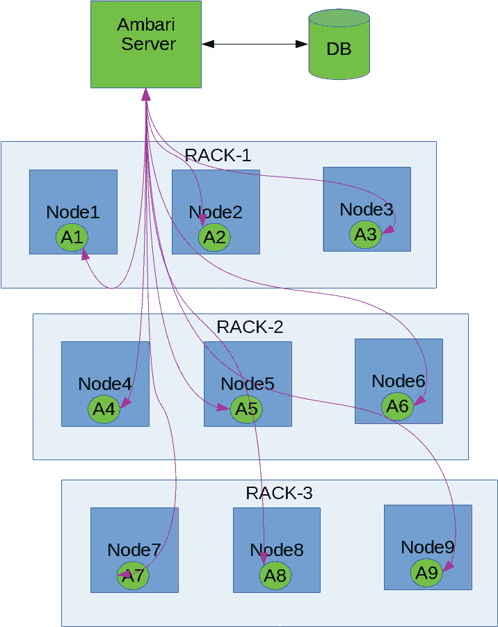

在核心，我们有以下应用程序：

+   Ambari 服务器

+   Ambari 代理

+   Ambari 网页界面

+   数据库

# Ambari 服务器

Ambari 服务器（`ambari-server`）是一个 shell 脚本，它是主服务器上所有管理活动的入口点。此脚本内部使用 Python 代码 `ambari-server.py`，并将所有请求路由到它。

Ambari 服务器有以下入口点，当向 `ambari-server` 程序传递不同参数时可用：

+   守护进程管理

+   软件升级

+   软件设置

+   LDAP/PAM/Kerberos 管理

+   Ambari 备份和恢复

+   其他选项

# 守护进程管理

当脚本通过命令行使用 `start`、`stop`、`reset`、`restart` 参数调用时，守护进程管理模式被激活。

例如，如果我们想启动 Ambari 背景服务器，我们可以运行以下命令：

```py
Example: ambari-server start
```

# 软件升级

安装 Ambari 后，我们可以使用此模式升级 Ambari 服务器本身。当我们使用 `upgrade` 标志调用 `ambari-server` 程序时，会触发此操作。如果我们想升级整个 Ambari 堆栈，我们可以传递 `upgradestack` 标志：

```py
Example: ambari-server upgrade
```

# 软件设置

一旦从互联网下载 Ambari（或通过 YUM 和 APT 安装），我们需要对软件进行初步设置。当我们向程序传递 `setup` 标志时，可以触发此模式。此模式将询问我们几个需要回答的问题。除非我们完成此步骤，否则 Ambari 无法用于管理我们的服务器：

```py
Example: ambari-server setup
```

# LDAP/PAM/Kerberos 管理

**轻量级目录访问协议**（**LDAP**）在企业中用于身份管理。为了使用基于 LDAP 的身份验证，我们需要使用以下标志：`setup-ldap`（用于使用 `ambari` 设置 `ldap` 属性）和 `sync-ldap`（用于从 `ldap` 服务器同步数据）：

```py
Example: ambari-server setup-ldap
Example: ambari-server sync-ldap
```

**可插拔身份验证模块**（**PAM**）是任何 UNIX 或 Linux 操作系统身份验证和授权的核心。如果我们想利用基于 PAM 的访问权限为 Ambari，我们需要使用 `setup-pam` 选项运行它。如果我们想从 LDAP 迁移到基于 PAM 的身份验证，我们需要使用 `migrate-ldap-pam` 运行它：

```py
Example: ambari-server setup-pam
Example: ambari-server migrate-ldap-pam
```

**Kerberos** 是另一种在网络环境中非常有用的高级身份验证和授权机制。这简化了在大型服务器上的**真实性、授权和审计**（**AAA**）。如果我们想为 Ambari 使用 Kerberos，我们可以使用 `setup-kerberos` 标志：

```py
Example: ambari-server setup-kerberos
```

# Ambari 备份和还原

如果我们想要对当前安装的 Ambari（不包括数据库）进行快照，我们可以进入此模式。这支持通过 `backup` 和 `restore` 标志调用的备份和还原方法：

```py
Example: ambari-server backup
Example: ambari-server restore
```

# 其他选项

除了这些选项之外，还有其他选项可以通过 Ambari 服务器程序调用，您可以使用 `-h`（帮助）标志调用这些选项。

# Ambari 代理

Ambari 代理是一个程序，它运行在我们想要用 Ambari 管理的所有节点上。这个程序定期向主节点发送心跳。使用此代理，`ambari-server` 在服务器上执行许多任务。

# Ambari 网络界面

这是 Ambari 应用程序的一个强大功能。这个网络应用程序由运行在主主机上的 Ambari 服务器程序暴露；我们可以在端口 `8080` 上访问此应用程序，并且它受到身份验证的保护。

一旦我们登录到这个网络门户，我们就可以控制并查看我们 Hadoop 集群的各个方面。

# 数据库

Ambari 支持多个关系数据库管理系统（RDBMS），以跟踪整个 Hadoop 基础设施的状态。在第一次设置 Ambari 服务器时，我们可以选择我们想要使用的数据库。

在撰写本文时，Ambari 支持以下数据库：

+   PostgreSQL

+   Oracle

+   MySQL 或 MariaDB

+   嵌入式 PostgreSQL

+   Microsoft SQL Server

+   SQL Anywhere

+   Berkeley DB

# 使用 Ambari 设置 Hadoop 集群

在本节中，我们将学习如何使用 Ambari 从头开始设置全新的 Hadoop 集群。为了做到这一点，我们需要四台服务器——一台用于运行 Ambari 服务器，另外三台节点用于运行 Hadoop 组件。

# 服务器配置

以下表格显示了我们在本次练习中使用的服务器的配置：

| **服务器类型** | **名称** | **CPU** | **RAM** | **磁盘** |
| --- | --- | --- | --- | --- |
| Ambari 服务器节点 | master | 1 | 3.7 GB | 100 GB |
| Hadoop 节点 1 | node-1 | 2 | 13 GB | 250 GB |
| Hadoop 节点 2 | node-2 | 2 | 13 GB | 250 GB |
| Hadoop 节点 3 | node-3 | 2 | 13 GB | 250 GB |

由于这是一个示例设置，我们对此配置感到满意。对于现实世界的场景，请根据您的需求选择配置。

# 准备服务器

本节以及所有后续章节都假设您在所有服务器上都有正常工作的互联网连接，并且已经安全地设置了防火墙以防止任何入侵。

所有服务器都运行 CentOS 7 操作系统，因为它是一个使用 RPM/YUM 进行软件包管理的系统。在以下部分看到 `yum` 时，不要感到困惑。

在我们开始使用服务器之前，我们需要运行一些基本的实用程序，这些程序可以帮助我们解决服务器上的各种问题。它们是作为下一个命令的一部分安装的。如果你不确定它们是什么，不要担心。除了 `mysql-connector-java` 和 `wget` 之外，所有其他实用程序都是非强制性的：

```py
sudo yum install mysql-connector-java wget iftop iotop smartctl -y
```

# 安装 Ambari 服务器

创建 Hadoop 集群的第一个步骤是启动我们的 Ambari 服务器应用程序。因此，使用 SSH 登录到主节点，并按以下顺序执行以下步骤：

1.  使用以下命令下载适用于 CentOS 7 的 Ambari YUM 仓库：

```py
[user@master ~]$ wget http://public-repo-1.hortonworks.com/ambari/centos7/2.x/updates/2.6.1.5/ambari.repo

```

1.  在此步骤之后，我们需要使用以下命令将 `ambari.repo` 文件移动到 `/etc/yum.repos.d` 目录：

```py
[user@master ~]$ sudo mv ambari.repo /etc/yum.repos.d
```

1.  下一个步骤是使用以下命令安装 `ambari-server` 软件包：

```py
[user@master ~]$ sudo yum install ambari-server -y
```

1.  我们将使用 MySQL 服务器作为我们的 Ambari 服务器。因此，让我们安装所需的软件包：

```py
[user@master ~]$ sudo yum install mariadb-server -y
```

1.  在我们接触 Ambari 设置过程之前，让我们配置 MySQL 服务器（或 MariaDB）。这是通过以下命令完成的：

```py
[user@master ~]$ sudo service mariadb start
Redirecting to /bin/systemctl start mariadb.service
```

1.  然后，创建一个名为 `ambari` 的数据库和一个名为 `ambari` 的用户，密码为 `ambari`，这样在以下步骤中设置 Ambari 服务器配置就会变得容易。可以使用以下 SQL 查询完成此操作：

```py
CREATE DATABASE ambari;
GRANT ALL PRIVILEGES ON ambari.* to ambari@localhost identified by 'ambari';
GRANT ALL PRIVILEGES ON ambari.* to ambari@'%' identified by 'ambari';
FLUSH PRIVILEGES;
```

1.  将这四行存储到一个名为 `ambari.sql` 的文本文件中，并使用以下命令执行：

```py
[user@master ~] mysql -uroot < ambari.sql
```

1.  这将创建一个数据库、用户并赋予必要的权限。

请在生产设置中使用强密码，否则您的系统将容易受到任何攻击。

现在我们已经完成了准备工作，让我们运行 Ambari 服务器设置。请注意，我们需要回答一些突出显示的问题，如下所示：

```py
[user@master ~]$ sudo ambari-server setup
Using python /usr/bin/python
Setup ambari-server
Checking SELinux...
SELinux status is 'enabled'
SELinux mode is 'enforcing'
Temporarily disabling SELinux
WARNING: SELinux is set to 'permissive' mode and temporarily disabled.
OK to continue [y/n] (y)? <ENTER>
Customize user account for ambari-server daemon [y/n] (n)? <ENTER>
Adjusting ambari-server permissions and ownership...
Checking firewall status...
WARNING: iptables is running. Confirm the necessary Ambari ports are accessible. Refer to the Ambari documentation for more details on ports.
OK to continue [y/n] (y)? <ENTER>
Checking JDK...
[1] Oracle JDK 1.8 + Java Cryptography Extension (JCE) Policy Files 8
[2] Oracle JDK 1.7 + Java Cryptography Extension (JCE) Policy Files 7
[3] Custom JDK
==============================================================================
Enter choice (1): <ENTER>
To download the Oracle JDK and the Java Cryptography Extension (JCE) Policy Files you must accept the license terms found at http://www.oracle.com/technetwork/java/javase/terms/license/index.html and not accepting will cancel the Ambari Server setup and you must install the JDK and JCE files manually.
Do you accept the Oracle Binary Code License Agreement [y/n] (y)? <ENTER>
Downloading JDK from http://public-repo-1.hortonworks.com/ARTIFACTS/jdk-8u112-linux-x64.tar.gz to /var/lib/ambari-server/resources/jdk-8u112-linux-x64.tar.gz
jdk-8u112-linux-x64.tar.gz... 100% (174.7 MB of 174.7 MB)
Successfully downloaded JDK distribution to /var/lib/ambari-server/resources/jdk-8u112-linux-x64.tar.gz
Installing JDK to /usr/jdk64/
Successfully installed JDK to /usr/jdk64/
Downloading JCE Policy archive from http://public-repo-1.hortonworks.com/ARTIFACTS/jce_policy-8.zip to /var/lib/ambari-server/resources/jce_policy-8.zip

Successfully downloaded JCE Policy archive to /var/lib/ambari-server/resources/jce_policy-8.zip
Installing JCE policy...
Checking GPL software agreement...
GPL License for LZO: https://www.gnu.org/licenses/old-licenses/gpl-2.0.en.html
Enable Ambari Server to download and install GPL Licensed LZO packages [y/n] (n)? y <ENTER>
Completing setup...
Configuring database...
Enter advanced database configuration [y/n] (n)? y <ENTER>
Configuring database...
==============================================================================
Choose one of the following options:
[1] - PostgreSQL (Embedded)
[2] - Oracle
[3] - MySQL / MariaDB
[4] - PostgreSQL
[5] - Microsoft SQL Server (Tech Preview)
[6] - SQL Anywhere
[7] - BDB
==============================================================================
Enter choice (1): 3 <ENTER>
Hostname (localhost): 
Port (3306): 
Database name (ambari): 
Username (ambari): 
Enter Database Password (bigdata): ambari <ENTER>
Re-enter password: ambari <ENTER>
Configuring ambari database...
Configuring remote database connection properties...
WARNING: Before starting Ambari Server, you must run the following DDL against the database to create the schema: /var/lib/ambari-server/resources/Ambari-DDL-MySQL-CREATE.sql
Proceed with configuring remote database connection properties [y/n] (y)? <ENTER>
Extracting system views...
ambari-admin-2.6.1.5.3.jar
...........
Adjusting ambari-server permissions and ownership...
Ambari Server 'setup' completed successfully.
```

1.  一旦设置完成，我们需要使用设置过程中生成的上一个文件在 Ambari 数据库中创建表。可以使用以下命令完成此操作：

```py
[user@master ~] mysql -u ambari -pambari ambari < /var/lib/ambari-server/resources/Ambari-DDL-MySQL-CREATE.sql
```

1.  下一个步骤是启动 `ambari-server` 守护进程。这将启动我们将用于以下步骤创建 Hadoop 集群的 Web 界面：

```py
[user@master ~]$ sudo ambari-server start
Using python /usr/bin/python
Starting ambari-server
Ambari Server running with administrator privileges.
Organizing resource files at /var/lib/ambari-server/resources...
Ambari database consistency check started...
Server PID at: /var/run/ambari-server/ambari-server.pid
Server out at: /var/log/ambari-server/ambari-server.out
Server log at: /var/log/ambari-server/ambari-server.log
Waiting for server start...............................
Server started listening on 8080
DB configs consistency check: no errors and warnings were found.
Ambari Server 'start' completed successfully.
```

1.  服务器设置完成后，配置 JDBC 驱动程序（这对其他所有节点也有帮助）：

```py
[user@master ~] sudo ambari-server setup --jdbc-db=mysql --jdbc-driver=/usr/share/java/mysql-connector-java.jar
```

# 准备 Hadoop 集群

在我们继续创建 Hadoop 集群之前，我们还需要执行几个步骤。

由于我们已经启动并运行了 Ambari 服务器，让我们生成一个 RSA 密钥对，我们可以用它来在 Ambari 服务器和 Ambari 代理节点之间进行通信。

这个密钥对允许 Ambari 服务器节点登录到所有 Hadoop 节点，并以自动化的方式执行安装。

如果你已经作为获取服务器和基础设施的一部分完成了这一步，则此步骤是可选的：

```py
[user@master ~]$ ssh-keygen -t rsa
Generating public/private rsa key pair.
Enter file in which to save the key (/home/user/.ssh/id_rsa): 
Enter passphrase (empty for no passphrase): <ENTER>
Enter same passphrase again: <ENTER>
Your identification has been saved in /home/user/.ssh/id_rsa.
Your public key has been saved in /home/user/.ssh/id_rsa.pub.
The key fingerprint is:
SHA256:JWBbGdAnRHM0JFj35iSAcQk+rC0MhyHlrFawr+d2cZ0 user@master
The key's randomart image is:
+---[RSA 2048]----+
|.oo   *@@**    |
| +oo +o==*.o     |
| .=.. = .oo +    |
| .o+ o . o =     |
|.. .+ . S . .    |
|. .  o . E      |
| . .  o    |
|  o. .           |
|  ...            |
+----[SHA256]-----+
```

这将在`/home/user/.ssh`目录内生成两个文件：

+   `~/.ssh/id_rsa`：这是一个私钥文件，必须将其保存在一个秘密的地方

+   `~/.ssh/id_rsa.pub`：这是一个公钥文件，它允许使用私钥文件进行任何 SSH 登录

应将此`id_rsa.pub`文件的内容放入所有 Hadoop 节点上的`~/.ssh/authorized_keys`中。在这种情况下，它们是节点服务器（1–3）。

在服务器配置过程中就可以完成传播所有公钥的步骤，因此每次获取新服务器时都可以避免手动步骤。

现在，我们将只使用 Ambari Web 界面来完成所有工作。

# 创建 Hadoop 集群

在本节中，我们将使用 Ambari Web 界面构建一个 Hadoop 集群。本节假设以下事项：

+   节点（1–3）可以通过主服务器使用 SSH 进行访问

+   管理员可以使用主服务器上的`id-rsa`私钥登录到节点（1–3）

+   UNIX 用户可以通过运行`sudo`在节点（1–3）服务器上执行所有管理操作。

+   Ambari 服务器设置已完成

+   Ambari Web 界面可以通过浏览器无任何防火墙限制进行访问

# Ambari Web 界面

让我们打开一个网页浏览器，并使用`http://<server-ip>:8080`连接到 Ambari 服务器 Web 界面。我们将看到一个登录屏幕，如下所示。请输入`admin`作为用户名，并输入`admin`作为密码以继续：

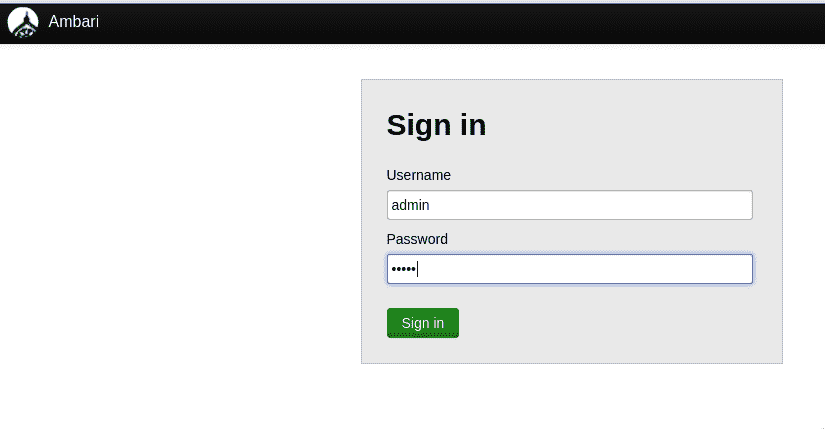

登录成功后，我们将被带到首页。

# Ambari 首页

这是主页面，其中 UI 上有多个选项。由于这是一个全新的安装，目前还没有集群数据。

让我们看看这个截图的首页：

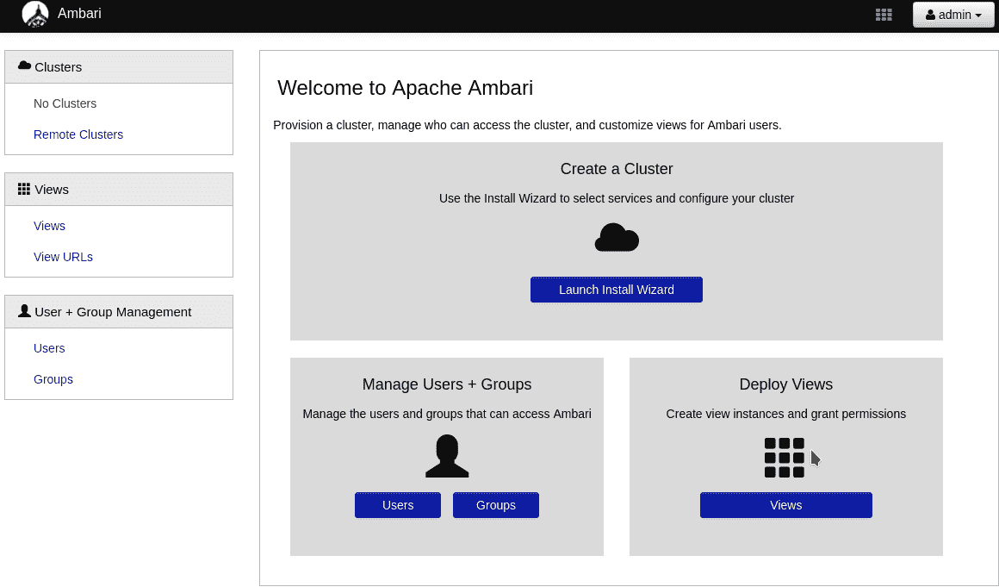

从这个地方，我们可以执行以下活动：

# 创建一个集群

如你所猜，这个部分用于启动一个向导，它将帮助我们通过浏览器创建一个 Hadoop 集群。

# 管理用户和组

本节有助于管理可以使用和管理的 Ambari Web 应用程序的用户和组。

# 部署视图

此界面有助于为不同类型的用户创建视图，以及他们可以通过 Ambari Web 界面执行的操作。

由于我们的目标是创建一个新的 Hadoop 集群，我们将点击“启动安装向导”按钮，开始创建 Hadoop 集群的过程。

# 集群安装向导

Hadoop 集群创建被分解为多个步骤。我们将在接下来的章节中逐一介绍这些步骤。首先，我们面对一个屏幕，我们需要为我们的 Hadoop 集群命名。

# 命名你的集群

我已经将`packt`选为 Hadoop 集群的名称。当屏幕上输入 Hadoop 名称时，请点击“下一步”。屏幕看起来像这样：

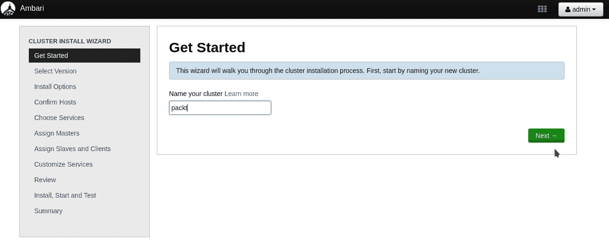

# 选择 Hadoop 版本

一旦我们为 Hadoop 集群命名，系统就会显示一个界面，让我们选择要运行的 Hadoop 版本。

在撰写本文时，Ambari 支持以下 Hadoop 版本：

+   Hadoop 2.3

+   Hadoop 2.4

+   Hadoop 2.5

+   Hadoop 2.6（至 2.6.3.0）

您可以选择任何版本进行安装。我选择了默认选项，即版本 2.6.3.0，这在以下截图中可以看到：

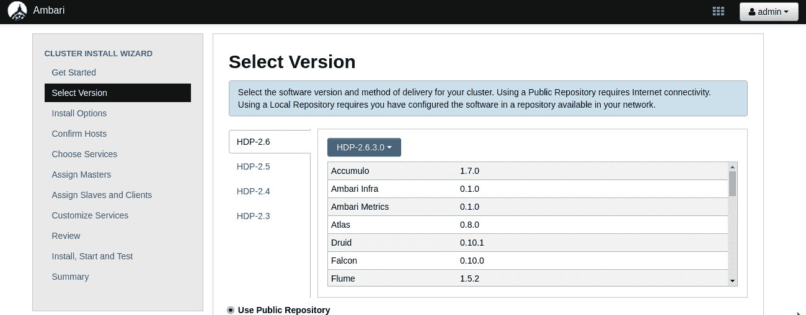

点击屏幕底部的“下一步”继续到下一步。

# 选择服务器

下一个逻辑步骤是选择要安装 Hadoop-2.6.3.0 版本的服务器列表。如果您还记得原始表格，我们命名了我们的节点服务器（1–3）。我们将在 UI 中输入这些名称。

由于安装将完全自动化，我们还需要在 UI 中提供在前一节中生成的 RSA 私钥。这将确保主节点可以通过 SSH 无密码登录到服务器。

此外，我们还需要提供一个 UNIX 用户名，该用户名已在所有节点（1–3）服务器上创建，并且也可以接受 RSA 密钥进行身份验证。

将 `id_rsa.pub` 添加到节点（1–3）服务器上的 `~/.ssh/authorized_keys`。

请记住，这些主机名应该在 **DNS**（**域名系统**）服务器中有适当的条目，否则安装将无法从这一步继续进行。

我给出的名称可以在以下截图看到：

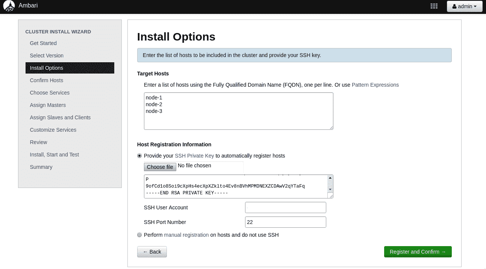

输入数据后，点击“注册”和“确认”。

# 设置节点

在这一步，如果详细信息准确，Ambari 代理将自动安装到指定的节点上。成功确认看起来像这样：

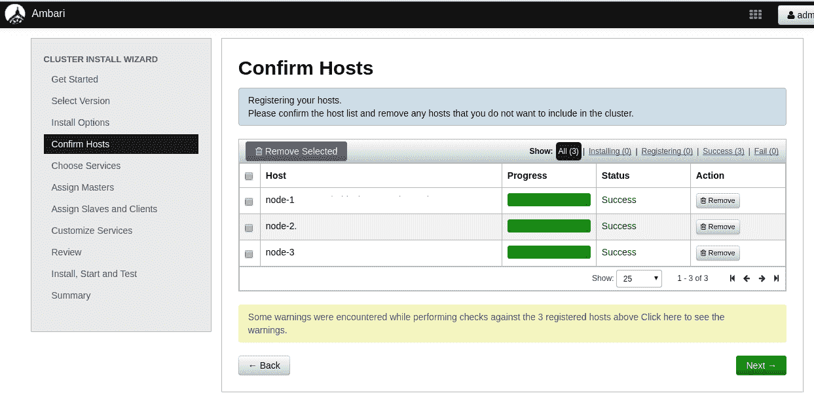

如果我们要删除任何节点，这就是我们可以做到的屏幕。准备好进入下一步时，点击“下一步”。

# 选择服务

现在，我们需要选择要在我们选择的三个服务器上安装的应用程序/服务列表。

在撰写本文时，Ambari 支持以下服务：

| **应用程序/服务** | **应用程序描述** |
| --- | --- |
| HDFS | Hadoop 分布式文件系统 |
| YARN + MapReduce2 | 下一代 MapReduce 框架 |
| Tez | 基于 YARN 的 Hadoop 查询处理框架 |
| Hive | 用于 ad hoc 查询的数据仓库系统 |
| HBase | 非关系型分布式数据库 |
| Pig | 用于分析 HDFS 中数据集的脚本平台 |
| Sqoop | 在 Hadoop 和 RDBMS 之间传输数据的工具 |
| Oozie | 带有 Web UI 的 Hadoop 作业工作流协调 |
| ZooKeeper | 提供服务的分布式系统协调服务 |
| Falcon | 数据处理和管理平台 |
| Storm | 流处理框架 |
| Flume | 用于收集、聚合并将流数据移动到 HDFS 的分布式系统 |
| Accumulo | 分布式键/值存储 |
| Ambari Infra | Ambari 组件使用的共享服务 |
| Ambari Metrics | 基于 Grafana 的指标收集和存储系统 |
| Atlas | 元数据和治理平台 |
| Kafka | 分布式流平台 |
| Knox | Hadoop 所有组件的单点认证提供者 |
| Log Search | Ambari 管理的服务日志聚合器和查看器 |
| Ranger | Hadoop 数据安全应用 |
| Ranger KMS | 密钥管理服务器 |
| SmartSense | Hortonworks Smart Sense 工具，用于诊断应用程序 |
| Spark | 大规模数据处理框架 |
| Zeppelin Notebook | 基于 Web 的数据分析笔记本 |
| Druid | 列式数据存储 |
| Mahout | 机器学习算法 |
| Slider | 用于监控 YARN 上应用程序的框架 |
| Superset | 基于浏览器的 RDBMS 和 Druid 数据探索平台 |

作为当前步骤的一部分，我们只选择了 HDFS 及其依赖项。屏幕如下所示：

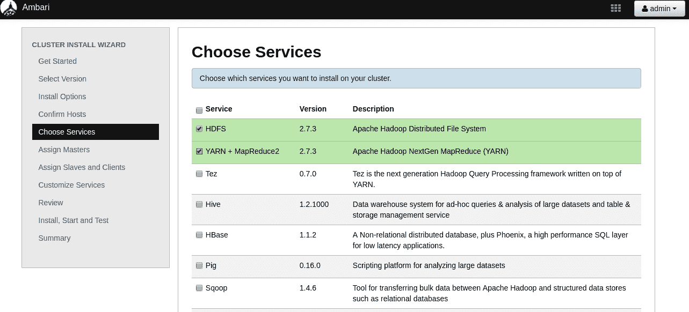

一旦你做出了选择，点击 UI 底部的“下一步”按钮。

# 节点上的服务放置

在此步骤中，我们展示了在安装所选的三个节点上自动选择服务的情况。如果我们想自定义节点上服务的放置，我们可以这样做。放置情况如下所示：

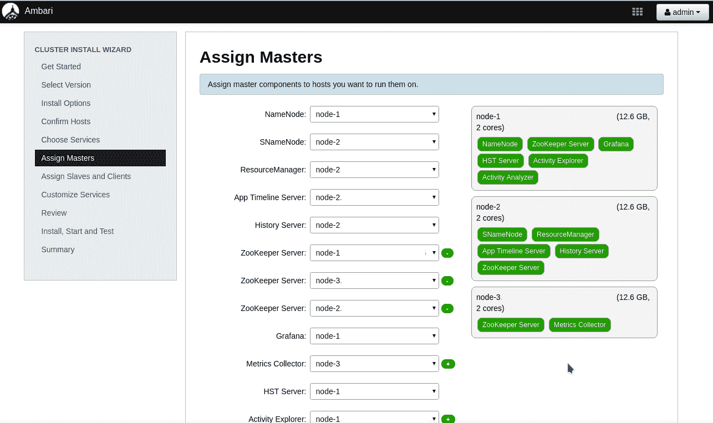

当更改看起来不错时，点击“下一步”。

# 选择从属节点和客户端节点

一些应用程序支持从属和客户端实用工具。在此屏幕上，我们需要选择我们希望在哪些节点上安装这些应用程序的节点。如果你不确定，请点击“下一步”。屏幕如下所示：

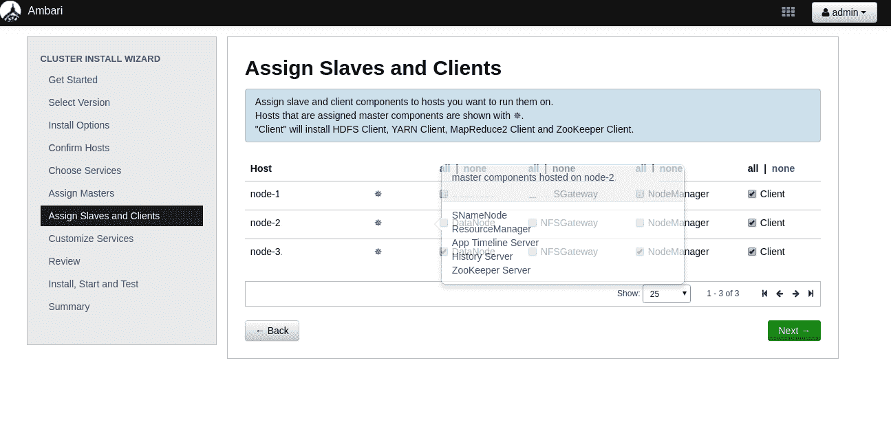

# 自定义服务

尽管 Ambari 自动选择了大多数属性和应用程序之间的链接，但它为我们提供了一些灵活性，可以选择一些功能的值，例如：

+   数据库

+   用户名

+   密码

以及其他有助于应用程序平稳运行的属性。这些在当前屏幕中以红色突出显示。

为了自定义这些，我们需要转到带有突出显示属性的标签页，并根据我们的需求选择值。屏幕如下所示：

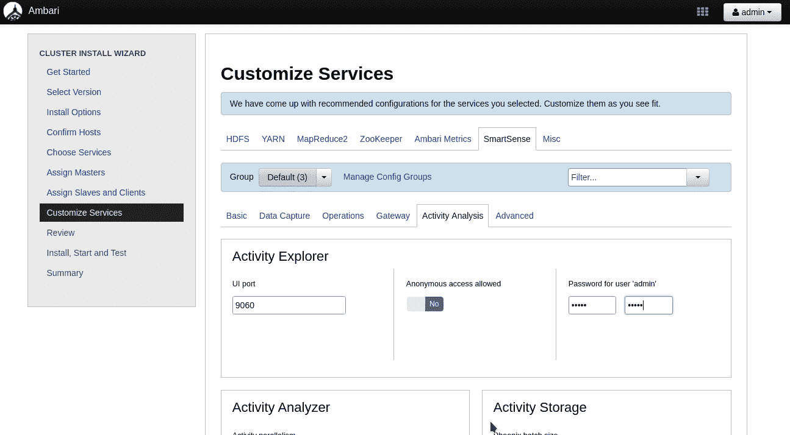

在正确配置所有服务属性后，我们将在 UI 中看不到任何红色内容，并且可以点击页面底部的“下一步”按钮。

# 审查服务

在此步骤中，我们展示了我们迄今为止所做的更改摘要。我们有一个选项可以打印更改，这样我们就不会忘记它们（别担心，所有这些都可以在 UI 稍后找到）。现在我们可以点击“部署”。这是实际更改将应用于节点的时候。

如果我们取消此过程，服务器将不会进行任何更改。当前向导的状态如下所示：

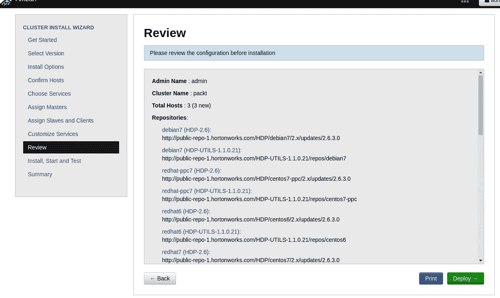

# 在节点上安装服务

在上一步点击“部署”之后，Ambari 服务器将生成一个部署计划，并使用所有节点上运行的 Ambari 代理并行地在所有节点上部署应用程序。

在这一步，我们可以实时看到正在部署的进度。

一旦所有组件都安装完毕，它们将自动启动，我们可以在屏幕上看到成功的完成状态：

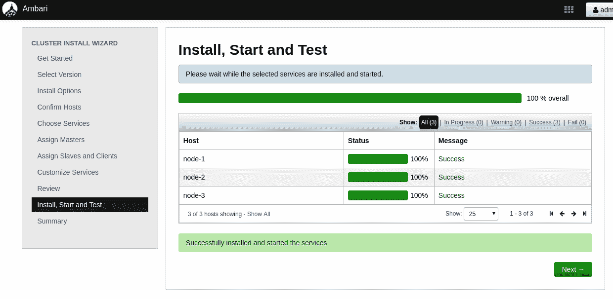

当一切操作成功完成后，请点击“下一步”。如果出现任何故障，我们会看到哪些失败了，并会提供一个选项来重试安装。如果出现任何故障，我们需要深入错误并修复根本问题。

如果你已经遵循了本节开头给出的说明，你应该一切运行顺利。

# 安装摘要

在这一步，我们会看到已安装内容的摘要。屏幕看起来像这样：

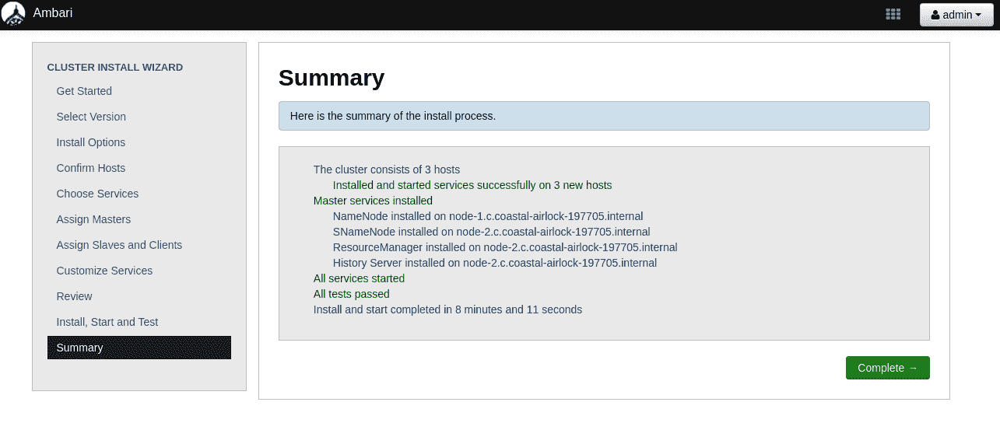

点击“完成”按钮，这标志着 Hadoop 集群设置的结束。接下来，我们将被带到集群仪表板。

# 集群仪表板

这是刚刚创建的 Hadoop 集群的主页，在这里我们可以看到已安装的所有服务的列表和健康传感器。

我们可以通过这个界面管理 Hadoop 集群的所有方面。请随意探索这个界面，并尝试操作以了解更多信息：

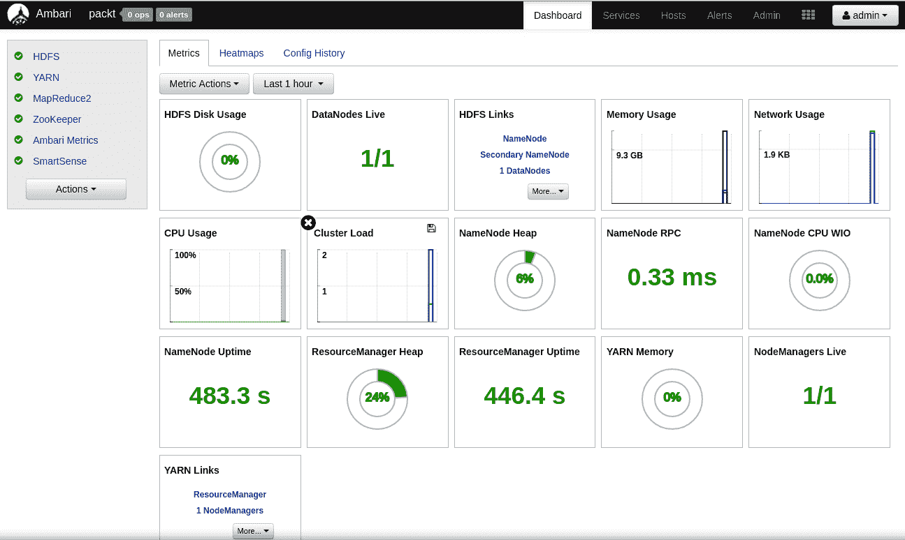

这标志着使用 Ambari 创建 Hadoop 集群的结束。

# Hadoop 集群

到目前为止，我们已经看到了如何使用 Ambari 创建单个 Hadoop 集群。但是，是否真的需要多个 Hadoop 集群？

答案取决于业务需求。在单集群与多集群之间，都有一些权衡。

在我们深入探讨这两种方案的优缺点之前，让我们看看在什么场景下我们可能会使用其中之一。

# 整个业务的单一集群

这是最直接的方法，每个企业至少从一个集群开始。随着业务多样性的增加，组织倾向于为每个部门或业务单元选择一个集群。

以下是一些优点：

+   **易于操作**：由于只有一个 Hadoop 集群，因此管理它非常容易，在管理它时，团队规模也将是最优的。

+   **一站式服务**：由于所有公司数据都在一个地方，因此很容易想出创新的方法来使用数据并生成数据上的分析。

+   **集成成本**：企业内部团队和部门可以非常容易地与这个单一系统集成。在管理他们的应用程序时，他们需要处理的配置更简单。

+   **服务成本**：企业可以更好地了解其整个大数据使用情况，并且可以以不那么严格的方式计划扩展其系统。

采用这种方法的一些缺点如下：

+   **规模成为挑战**：尽管 Hadoop 可以在数百甚至数千台服务器上运行，但管理如此大的集群，尤其是在升级和其他变更期间，成为一个挑战。

+   **单点故障**：Hadoop 在 HDFS 文件系统中内置了复制功能。当更多节点失败时，数据丢失的可能性增加，且难以从中恢复。

+   **治理是一个挑战**：随着数据、应用程序和用户的规模增加，如果没有适当的规划和实施，跟踪数据是一个挑战。

    +   **安全和机密数据管理**：企业处理各种数据，从高度敏感的数据到临时数据不等。当所有类型的数据都放入大数据解决方案中时，我们必须采用非常强大的身份验证和授权规则，以确保数据只对正确的受众可见。

带着这些想法，让我们来看看企业中拥有 Hadoop 集群的另一种可能性。

# 多个 Hadoop 集群

虽然在组织内部维护单个 Hadoop 集群更容易，但有时为了使业务顺利运行并减少对单点故障系统的依赖，有时需要拥有多个 Hadoop 集群。

这些多个 Hadoop 集群可以用于以下几个原因：

+   冗余

+   冷备份

+   高可用性

+   业务连续性

+   应用环境

# 冗余

当我们考虑冗余的 Hadoop 集群时，我们应该考虑我们可以保持多少冗余。正如我们所知，**Hadoop 分布式文件系统**（**HDFS**）内部已经内置了数据冗余。

考虑到 Hadoop 集群周围构建了大量的生态系统（如 YARN、Kafka 等服务），我们应该仔细思考和计划是否要使整个生态系统冗余，或者只通过将数据保存在不同的集群中来使数据冗余。

由于有工具可以从一个 HDFS 复制数据到另一个 HDFS，因此使 Hadoop 的 HDFS 部分冗余更容易。

让我们通过这张图来看看实现这一目标的可能方法：

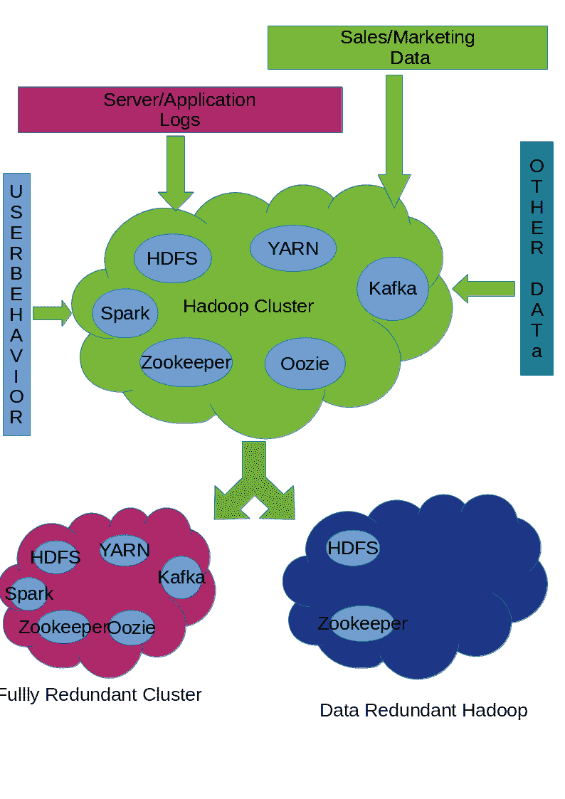

正如我们所见，主 Hadoop 集群运行了所有其应用程序的全栈，数据通过多个来源供应给它。

我们已经定义了两种类型的冗余集群：

# 一个完全冗余的 Hadoop 集群

这个集群运行与主集群完全相同的应用程序集合，并且数据定期从主 Hadoop 集群复制。由于这是从主集群到第二个集群的单向复制，因此当我们对这个完全冗余的集群进行任何更改时，我们可以 100%确信主集群不会受到影响。

需要理解的一个重要问题是，我们在这个集群中运行所有其他应用程序实例。由于每个应用程序都维护其预定义位置的状态，应用程序状态不会从主 Hadoop 集群复制到这个集群，这意味着在主 Hadoop 集群中创建的作业在这个集群中是不可见的。同样适用于 Kafka 主题、zookeeper 节点等。

这种类型的集群有助于运行不同的环境，例如 QA、预发布等。

# 数据冗余的 Hadoop 集群

在这种类型的集群设置中，我们创建一个新的 Hadoop 集群，并从主集群复制数据，就像之前的例子一样；但在这里，我们并不担心在这个集群中运行的其他应用程序。

这种设置适用于：

+   在不同的地理区域为 Hadoop 进行数据备份

+   与其他企业/组织共享大数据

# 冷备份

对于企业来说，冷备份很重要，因为数据会随着时间的推移而老化。尽管 Hadoop 被设计用来存储无限量的数据，但并非总是需要保留所有数据以供处理。

有时为了审计目的和历史原因，有必要保留数据。在这种情况下，我们可以创建一个仅包含 HDFS（文件系统）组件的专用 Hadoop 集群，并定期将所有数据同步到这个集群中。

该系统的设计类似于数据冗余的 Hadoop 集群。

# 高可用性

尽管 Hadoop 架构中包含多个组件，但由于内部设计，并非所有组件都高度可用。

Hadoop 的核心组件是其分布式、容错的文件系统 HDFS。HDFS 有多个组件，其中之一是 NameNode，它是 HDFS 中文件位置的注册表。在 HDFS 的早期版本中，NameNode 是单点故障，而在最近版本中，Secondary NameNode 已被添加以协助满足 Hadoop 集群的高可用性需求。

为了使 Hadoop 生态系统的每个组件都成为一个高可用系统，我们需要添加多个冗余节点（它们有自己的成本），这些节点协同工作形成一个集群。

另一点需要注意的是，在单个地理区域内，使用 Hadoop 实现高可用性是可能的，因为数据的本地性与应用程序是 Hadoop 的关键因素之一。当我们有多个数据中心参与时，我们需要考虑其他方法来实现数据中心间的高可用性。

# 业务连续性

这部分是**业务连续性计划**（**BCP**）的一部分，如果计划不当，自然灾害可能会结束 Hadoop 系统。

在这里，策略将是使用多个地理区域作为提供者来运行大数据系统。当我们谈论多个数据中心时，明显的挑战是网络以及管理两个系统的成本。最大的挑战之一是如何保持多个区域同步。

一种可能的解决方案是在其他地理区域构建一个完全冗余的 Hadoop 集群，并定期保持数据同步。在任何一个区域发生灾难/故障的情况下，我们的业务不会停止，因为我们可以平稳地运行我们的操作。

# 应用环境

许多企业内部遵循不同的方式将软件发布到生产环境中。作为其中的一部分，他们遵循几种持续集成方法，以便更好地控制 Hadoop 环境的稳定性。构建多个较小的 Hadoop 集群，其中包含主生产环境的 X%的数据，并在这些集群中运行所有应用程序是很好的。

应用程序可以在这些专用环境中（如 QA、Staging 等）构建它们的集成测试，并在一切正常后将其软件发布到生产环境。

我遇到的一种做法是，组织倾向于直接将代码发送到生产环境，最终因为未经测试的工作流程或错误而面临应用程序的中断。拥有专门的 Hadoop 应用程序环境来彻底测试软件，实现更高的正常运行时间和更满意的客户是一个好的做法。

# Hadoop 数据复制

我们在前面几节中看到，拥有高度可用的数据对于企业成功并跟上其竞争至关重要。

在本节中，我们将探讨实现高度可用数据设置的可能方法。

# HDFS 数据复制

Hadoop 使用 HDFS 作为其核心来存储文件。HDFS 具有机架感知性，并且足够智能，能够在数据节点上运行应用程序时减少网络数据传输。

在 HDFS 环境中进行数据复制的一种首选方式是使用 DistCp。官方文档可在以下 URL 找到：[`hadoop.apache.org/docs/r1.2.1/distcp.html`](http://hadoop.apache.org/docs/r1.2.1/distcp.html)。

我们将看到一些从一个 Hadoop 集群复制数据到另一个 Hadoop 集群的示例。但在那之前，让我们看看数据是如何布局的：

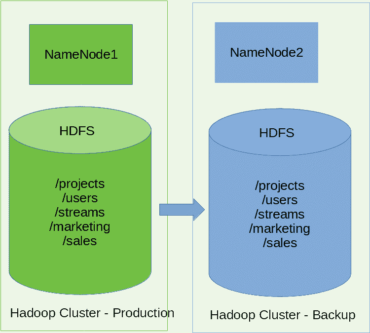

为了将生产 Hadoop 集群中的数据复制到备份 Hadoop 集群，我们可以使用`distcp`。让我们看看如何操作：

```py
hadoop distcp hdfs://NameNode1:8020/projects hdfs://NameNode2:8020/projects
hadoop distcp hdfs://NameNode1:8020/users hdfs://NameNode2:8020/users
hadoop distcp hdfs://NameNode1:8020/streams hdfs://NameNode2:8020/streams
hadoop distcp hdfs://NameNode1:8020/marketing hdfs://NameNode2:8020/marketing
hadoop distcp hdfs://NameNode1:8020/sales hdfs://NameNode2:8020/sales
```

当我们运行`distcp`命令时，会创建一个 MapReduce 作业来自动找出文件列表，然后将它们复制到目标位置。

完整的命令语法如下：

```py
Distcp [OPTIONS] <source path …> <destination path>
```

+   `OPTIONS`：这些是命令接受的多个选项，它们控制执行的行为。

+   `source path`：源路径可以是 Hadoop 支持的任何有效的文件系统 URI。DistCp 支持一次性处理多个源路径。

+   `目标路径`：这是一个单独的路径，所有源路径都需要复制到这个路径。

让我们更详细地看看一些重要的选项：

| **标志/选项** | **描述** |
| --- | --- |
| `append` | 如果目标文件已存在，则增量地将数据写入目标文件（仅执行`append`，不执行块级检查以进行增量复制）。 |
| `async` | 以非阻塞方式执行复制。 |
| `atomic` | 即使其中一个失败，也会执行所有文件复制或中止。 |
| `Tmp <路径>` | 用于原子提交的路径。 |
| `delete` | 如果在源树中不存在，则从目标位置删除文件。 |
| `Bandwidth <参数>` | 限制复制过程中使用的网络带宽。 |
| `f <文件路径>` | 包含需要复制的所有路径的文件名列表。 |
| `i` | 忽略文件复制过程中的任何错误。 |
| `Log <文件路径>` | 执行日志保存的位置。 |
| `M <数字>` | 用于复制的最大并发映射数。 |
| `overwrite` | 即使在目标位置存在，也会覆盖文件。 |
| `update` | 仅复制缺少的文件和目录。 |
| `skipcrccheck` | 如果通过，则在传输过程中将跳过 CRC 检查。 |

# Summary

在本章中，我们学习了 Apache Ambari，并详细研究了其架构。然后我们了解了如何使用 Ambari 准备和创建自己的 Hadoop 集群。为了做到这一点，我们在准备集群之前还研究了根据需求配置 Ambari 服务器。我们还了解了单集群和多集群，以及根据业务需求如何使用它们。
