# 1

# 什么是网络？

本章介绍了图论的基础及其在网络科学中的应用。网络科学并不是数据科学中常见的教学领域，但许多问题可以通过网络科学的视角来构建。基于网络的算法通常比其他机器学习算法具有更好的可扩展性，这使得它们非常适合分析具有许多变量的数据集，探索具有许多位置的地理数据集，或者在高维时间序列数据中识别趋势。后续章节将通过实际示例更深入地探讨这些主题。

在本章中，我们将定义本书中将要使用的术语，探讨网络科学在分析社会关系数据中的常见应用，并介绍将在后续章节中使用的两个 Python 包。完成本章后，你将开始识别那些可以表述为网络科学问题并如何在 Python 中可视化的数据科学问题。

正式来说，我们将涵盖以下主题：

+   图论和网络简介

+   真实世界社交网络的例子

+   其他类型的网络

# 技术要求

对于本章，我们只有非常少的技术要求或假设。如果你还没有安装 Python，我们鼓励你安装它，因为我们将会经常使用 Python——特别是与 Anaconda 版本 Python 安装一起安装的 Jupyter Notebooks。如果你在安装过程中遇到困难，可以在 Stack Overflow 上找到支持。每个章节的代码可以在以下 GitHub 链接下找到：[`github.com/PacktPublishing/Modern-Graph-Theory-Algorithms-with-Python`](https://github.com/PacktPublishing/Modern-Graph-Theory-Algorithms-with-Python)。

# 图论和网络简介

社会联系对社会至关重要，包括家庭关系、社区中的共同角色、贸易关系等等。在过去几十年中，从 MySpace 到 Twitter 再到 TikTok，社交网络在营销、求职和信息共享中扮演了越来越重要的角色。软件系统甚至可以在全球各地的工程师之间构建，他们通过 GitHub 或 Slack 等平台协作，协调来自肯尼亚、印度和澳大利亚的团队的努力，而这些团队从未见过面。

数据科学的一个分支，称为**网络科学**，使用起源于称为**图论**的数学领域的算法和统计方法，研究个人、群体甚至社会网络中个体之间的关系。图论研究对象之间的成对关系。图对象（包括人、城镇、思想、时间点以及许多其他要研究的对象）在网络科学中作为网络中的顶点或点来表示；请注意，某些学科可能使用“*节点*”而不是“*顶点*”这个术语。对象之间的关系（如人们之间的共同合作或连接不同岛屿的桥梁，或时间点之间的统计联系）在网络中以边的形式表示，并连接具有关系的顶点对。

为了使这个问题更加具体，让我们考虑三位年轻女性：来自南非的 Ayanda，来自日本的 Machiko 和来自比利时的 Greta：


图 1.1 – Ayanda，Machiko 和 Greta

也许 Ayanda，Machiko 和 Greta 参加了一个旨在可持续能源解决方案的在线女性编码黑客马拉松。通过黑客马拉松，他们相遇并组建了一个团队，共同研究为农村村庄提供太阳能解决方案。他们之间形成了具有相互关系的专业网络，如图*图 1.2*所示：

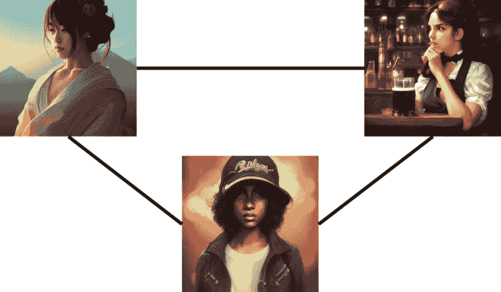

图 1.2 – 显示女性之间成对连接的 Ayanda，Machiko 和 Greta 的网络表示

当这些女性在他们的黑客马拉松项目中工作时，Ayanda 可能会邀请她社交网络中的同事，增加团队人数，并为 Machiko 和 Greta 随着时间的推移创造新的联系。也许来自肯尼亚的 Amara，Ayanda 的同事，与 Greta 建立了联系，但没有与 Machiko 建立联系，以编码他们项目的后端，为网络增加另一个成员：

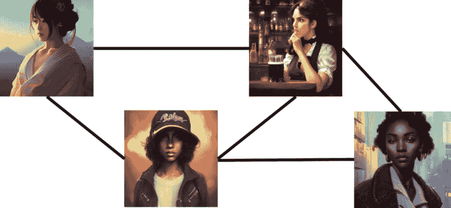

图 1.3 – 添加 Amara 后的社交网络

随着时间的推移，网络的演变是当今网络科学中的一个关键问题，因为我们往往对我们明确观察到的关系之外存在的关系的完整数据不完整，并且想要预测未来的现象，例如预测下一次选举中两党假新闻的潜在传播可能性，或者根据现有联系，新成员可能加入犯罪组织的情况。我们将在*第八章*中探讨与动态社交网络及其应用相关的一些问题，其中我们分析随着社交网络的发展，疾病随时间传播的情况。

在深入研究 Python 中的现实世界问题和解决方案之前，了解网络科学的基本原理非常重要。让我们深入了解图论和网络的一些术语和约定。

## 正式定义

现实世界的网络通常使用图论的工具进行形式化和研究。正如我们提到的，图论以顶点和连接相关顶点的边的形式定义对象之间的关系。让我们对此进行一些形式化，并探索图论中网络科学的基石。一个图被定义为顶点的集合和连接顶点对的边的集合（Berge，2001）。因此，图很好地代表了网络的架构。回到我们的黑客松社交网络，我们将同事表示为顶点，如果他们合作，则通过边将他们连接起来。

图可以表示不同类型的关系。顶点的自关系可以通过连接顶点到自身的回路来表示。例如，在写电子邮件时，某人可能会在电子邮件中抄送自己，或者给自己发送一封提醒邮件。另一种关系类型是方向性。例如，转发内容是一种单向交互（通常），但成为朋友是一种双向交互，双方都相互连接。单向关系在图中用有向边表示，通常在图的视觉表示中用箭头表示。双向关系用无向边表示，表示为没有箭头的线条。*图 1.4* 展示了一个具有回路、有向边和无向边的图：

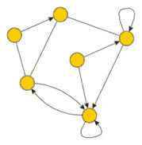

图 1.4 – 具有回路、有向边和无向边的图

在科学文献中，网络和图这两个术语可以互换使用，边和顶点的术语也是如此。*表 1.1* 展示了一些常见的术语：

| **网络科学** | **图论** |
| --- | --- |
| 网络 | 图 |
| 节点 | 顶点 |
| 链接 | 边 |
| 集合 | 集合 |
| 关系 | 函数 |
| 有向图 | 有向图 |

表 1.1 – 网络科学和图论之间的术语比较

在实践中，这些区别很少被做出，因此这两个术语通常是同义的。在这本书中，我们将坚持使用 *边* 和 *顶点* 作为我们的图组件，并将网络作为从现实世界数据中创建的顶点和边的集合的首选术语。

图论中存在许多类型的图，这些图在现实世界的数据中得到了实现。让我们简要定义一些存在的图类型：

+   一个有向图包含一个或多个有方向的边（指向或来自另一个顶点，称为弧）

+   一个无向图只有边，没有起点或终点顶点

*“如果一个图没有多条边（通常用来表示存在或表示关系的强度），则该图是简单的。”* 一个简单的无向图不包含回路，但一个简单的有向图可以包含回路。让我们可视化这些图在实际中的样子：

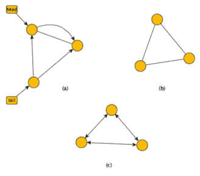

图 1.5 – (a) 有向图，(b) 简单图，和(c) 简单有向图底部

我们可以根据数据定义顶点和它们的连接边或弧，以在 Python 中创建用于可视化和分析的图。在下一节中，我们将介绍一些将在整本书中使用的 Python 包，用于创建和实际研究网络。

## 在 Python 中创建网络

现在我们对网络有了一些了解，让我们探索它们是如何使用网络科学中常用的两个 Python 包创建的：`igraph`和`NetworkX`。

igraph 是一种在 C、R 和 Python 中可用的网络科学软件。igraph 提供了许多网络科学工具，包括网络创建选项、许多网络分析算法和网络可视化图表。让我们通过我们的 Hackathon 网络来探索 igraph 的网络创建和可视化：

1.  首先，让我们安装**igraph**：

    ```py
    #install igraph and pycairo
    !pip install igraph
    !pip install pycairo
    ```

1.  然后，我们将导入**igraph**及其**Graph**模块：

    ```py
    #import igraph
    import igraph as ig
    from igraph import Graph
    ```

1.  接下来，我们将使用**Graph**模块创建一个有三个顶点且顶点之间无向边连接的图：

    ```py
    #create hackathon network
    g_colleagues=ig.Graph(
        edges=[(0,1),(0,2),(1,2)],n=3,directed=False)
    ```

1.  现在，我们可以使用**plot**函数来可视化我们的 Hackathon 网络。igraph 提供了许多定制选项，包括顶点颜色、顶点大小、边颜色、边大小、顶点标签以及图表的大小（等等）。对于这个图表，我们将限制图像的大小，并创建足够大的顶点，以便用 Hackathon 网络成员的首字母标记：

    ```py
    #plot the hackathon network
    ig.plot(g_colleagues,bbox= (200,200), vertex_size=40,
        vertex_label=["M","A","G"])
    ```

    这应该会给你一个看起来像*图 1.6*的图表，显示*Machiko*、*Greta*和*Ayanda*的 Hackathon 网络：

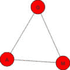

图 1.6 – igraph 中 Hackathon 网络的图表

现在，让我们在 NetworkX 中重复我们的网络创建过程。NetworkX 包含了 igraph 的大部分功能，但提供了与其他网络科学工具和平台更简单的集成方式，以及探索网络上的微分方程的简单方法：

1.  让我们先安装**NetworkX**：

    ```py
    #install NetworkX
    !pip install NetworkX
    ```

1.  现在，让我们导入**NetworkX**：

    ```py
    #import NetworkX
    import networkx as nx
    ```

1.  NetworkX 在网络构建方面与 igraph 略有不同。我们首先定义一个空图，填充顶点，然后定义存在的边：

    ```py
    #create hackathon network
    G = nx.Graph()
    G.add_nodes_from([1, 3])
    G.add_edges_from([(1, 2), (1, 3), (2, 3)])
    ```

1.  我们需要添加属性（我们的网络成员首字母），导入**matplotlib**，然后绘制我们的图：

    ```py
    #plot the hackathon network
    import matplotlib.pyplot as plt
    G.nodes[1]['initial'] = 'M'
    G.nodes[2]['initial'] = 'A'
    G.nodes[3]['initial'] = 'G'
    labels = nx.get_node_attributes(G, 'initial')
    nx.draw(G, labels=labels, font_weight='bold')
    ```

    这应该会显示一个结构类似但风格略有不同的图表，与我们之前在 igraph 中构建的图表不同：

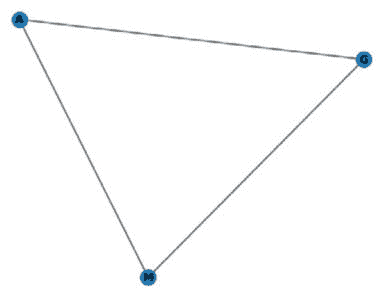

图 1.7 – 我们 Hackathon 网络的 NetworkX 图表

在接下来的章节中，我们将使用 igraph 和 NetworkX 来展示这两个包中的示例。对于某些问题，igraph 将具有更好的功能；对于其他问题，NetworkX 更可取。在实践中，当你将网络科学应用于现实世界问题时，你将遇到这两个包。在下一节中，我们将概述不同的网络类型和问题，为我们的未来章节奠定基础。

## 随机图

随着网络科学开始解决越来越多的现实世界问题，理解网络增长过程成为了一个研究方向：

*构建边缘是否纯粹是随机的？*

*给定顶点的数量，任何顶点可能培养的边的数量有限制吗？*

*具有许多边的顶点倾向于鼓励与特定**高度连接的顶点**共享边的未连接顶点之间的边吗？*

*顶点和边是否分离成与其他组连接不良的紧密连接的组？*

几种增长过程模型产生了在网络科学研究中有用的常见增长模式。其中一些，例如**Erdös-Rényi 网络**，作为现实世界网络中组织发展的比较。Erdös-Rényi 网络是随机网络，其中顶点之间的边是以概率方式在任意一对顶点之间创建的。例如，为了创建一个具有许多边的网络，我们可能会将顶点对连接的概率设置为 70%。为了创建一个具有较少边的网络，我们可能会将顶点对连接的概率设置为 10%。*图 1.8（a）*显示了边连接概率为 70%的 Erdös-Rényi 网络；*图 1.8（b）*显示了边连接概率为 10%的 Erdös-Rényi 网络：

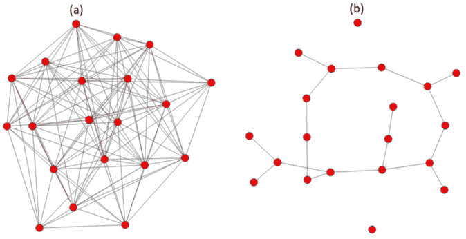

图 1.8 – 具有边概率为（a）70%和（b）10%的 Erdös-Rényi 网络

在现实世界中，偏好连接，其中一些顶点吸引其他顶点的连接，是顶点之间添加边的一个更现实的模型。偏好连接最著名的例子之一是**Barabási-Albert 模型**，其中网络围绕某些顶点形成更多的连接。

在一个现实世界的偏好连接例子中，让我们考虑一个前端工程师在社交媒体上寻找潜在合作者的后端工程师。因此，前端工程师的连接不会是随机的。它们将基于工程师的具体需求和搜索后端工程师的结果来培养。**无标度网络**是这种在现实世界网络形成过程中经常发生的偏好连接的模型。*图 1.9*显示了添加所需连接后的前端工程师的社会网络，这些连接可能在他们与前端工程师连接之前并不相识：

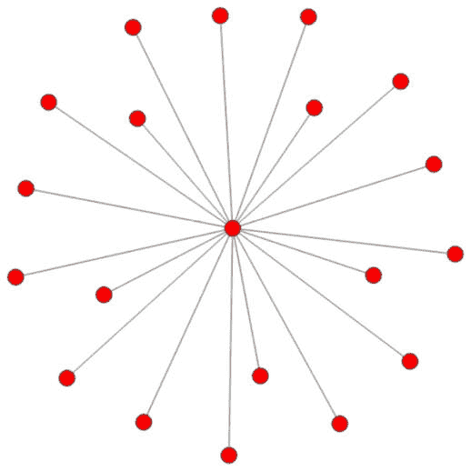

图 1.9 – 前端工程师通过社交媒体搜索培养的工程连接的无标度网络

网络形成无标度模型的重大批评之一是缺乏中心节点，或者是一组顶点之间具有高连接性而与其他顶点集的连接相对较少的区域。**Watts-Strogatz 模型**解释了这种形成更密集连接区域的趋势。例如，基因网络通常形成相关基因的簇，这些基因在功能上相互影响；一些基因簇也会影响其他基因簇，形成偶尔连接的基因集，如图 *图 1.10* 所示：

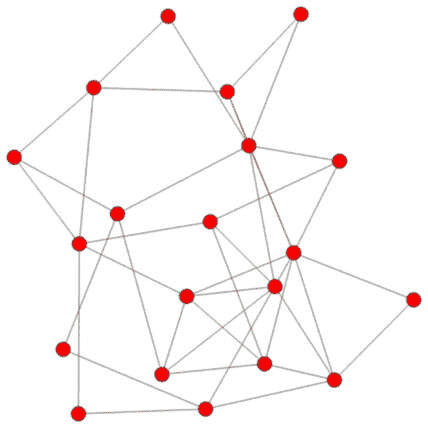

图 1.10 – 相关基因的网络

最近的研究表明，这些随机的网络模型都无法捕捉到真实网络所具有的所有细微差别。许多真实网络具有优先连接和密集聚类的特点，以及一些根据网络已知信息不会出现的随机连接。朋友的朋友经常会相遇。个人通过搜索社交网络或连接到朋友的其它社交群体来找到与自己有共同兴趣的人。有些友谊是在个人被困在电梯或渡轮上时随机开始的。

现在我们已经探讨了如何在 Python 中创建网络，让我们回到一些真实世界的网络例子，包括有向和无向网络以及随时间改变结构的网络。

# 真实世界社交网络的例子

真实世界的网络通常比我们考虑的例子要复杂得多。让我们考虑一下社交媒体网络中的细微差别。在最简单的形式中，一个社交网络包含在某个时间点朋友之间的相互连接。然而，一些朋友可能在社交媒体平台上比其他人互动得更频繁；他们可能会评论帖子、重新分享内容，并频繁地互相发消息。加权网络根据关系强度或互动频率的某种测量标准为网络中的边分配数值。

让我们回到我们的黑客马拉松网络，并根据不同团队成员在黑客马拉松期间每天的平均对话次数来加权我们的边。也许 *Machiko* 正在协调技术的业务用例，与后端工程师 *Ayanda* 的互动不多，但需要确保前端直观（*Greta* 的团队位置）。然而，我们预计 *Ayanda* 和 *Greta* 会更频繁地合作，因为他们正在整合产品的后端和前端。也许我们有一个如图 *图 1.11* 所示的加权网络：

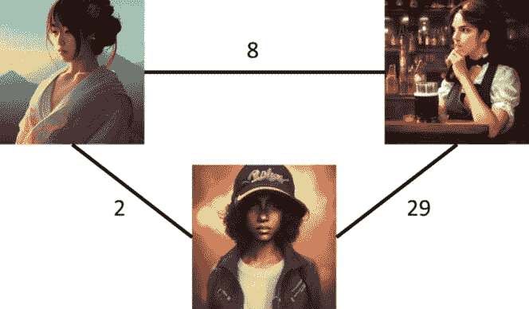

图 1.11 – 团队成员之间对话的加权黑客马拉松网络

除了加权，关系可以是无向的或定向的。到目前为止，我们已经考虑了无向网络，其中关系是相互的。友谊、Zoom 会议、共享课程、团队会员资格以及许多其他现实世界的网络都涉及相互关系。然而，消息是一方互动，在发送者和接收者之间。社交媒体内容的转发也是一方关系。基因调控、人口迁移、航班和货物运输也涉及一方互动。有向图允许我们在图中捕捉方向信息，并且像无向图一样，有向图可以是加权的或无加权的。

让我们考虑一场足球比赛，球员们在 5 分钟内互相传球。也许一个前锋会带球一段时间，然后传球给另一个前锋，后者迅速将球传给空中的中锋。*图 1.12* 展示了队友之间这种加权的足球场互动网络：

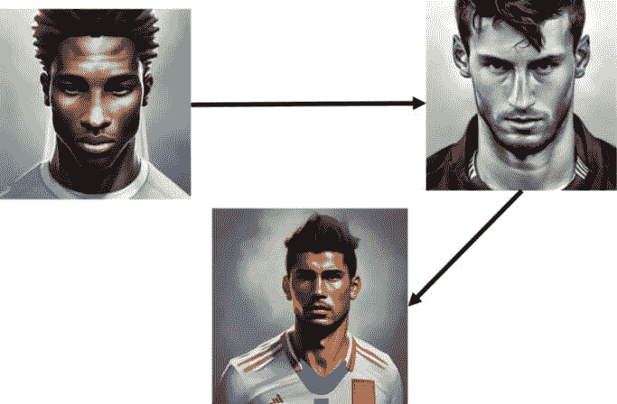

图 1.12 – 在 5 分钟内互相传球的一组足球队友网络

网络很少是静态的。考虑一群从大学毕业的朋友。有些人会在接下来的几年里保持联系；有些人会失去联系。持久友谊的强度也可能发生变化。那些留在他们上大学的地方的人可能会在进入职场时加强他们的友谊。那些搬走的人可能会在他们的新地点与其他人建立联系，并开始与其他地区的朋友失去联系。让我们考虑四名从开普敦大学毕业并在不同城市追求不同职业的亲密朋友：


图 1.13 – 毕业生在不同城市迁移和追求不同职业的友谊网络

十年后，这些大学朋友中的一些人不再相互联系，从而产生了一个截然不同的友谊网络，如 *图 1.14* 所示：


图 1.14 – 毕业十年后的大学友谊网络

*图 1**.14*显示，一个朋友（右上角）与所有但一个亲密的大学朋友失去了联系。一个朋友（左下角）保持了所有她的亲密大学友谊。这种变化可能看起来相当微不足道，因为所有朋友都至少保持了原始群体中的一个朋友。然而，从网络信息交换的角度来看，原始的友谊网络更容易从右上角的朋友向网络中的其他朋友交换信息。她可以直接与每个朋友沟通。

然而，在十年的友谊漂移之后，右上角的朋友的信息交换必须通过左下角的朋友才能到达网络中的其他部分。在*图 1**.14*中，重要新闻（可能是关于团聚或婚礼的消息）到达整个网络所需的时间将比*图 1**.13*中的时间更长。

在本节中，我们介绍了几种类型的社会网络。我们看到了关系可以是相互的或单方面的。我们看到了网络如何随时间变化，以及这可能如何影响网络上的信息交换。我们将在*第二章、第三章、第八章和第九章*中重新审视社会关系。现在，让我们探索一些可以表述为网络的其他类型的问题。

# 其他类型的网络

到目前为止，我们主要考虑了社会网络。然而，对象及其关系可以在更广泛的问题范围内定义。网络科学为理解空间数据提供了有用的工具。例如，考虑一个由一系列桥梁连接的几个小岛镇的区域，这些桥梁允许货物和人们从一个地区到另一个地区旅行。在流行病期间，了解哪些路线需要关闭以最大限度地减少疾病从一个镇传播到另一个镇可能是有用的。然而，完全切断路线将使一些地区缺乏必要的供应，如食物或药品。我们将在后面的章节中考虑的工具可以帮助地区规划商品的优化路线，并最大限度地减少流行病的潜在传播。

我们还可以考虑一个商店地图，每个商店都有不同数量的柑橘水果销售量。商店可以根据跨商店的共享管理、基于柑橘水果销售模式相似性或基于地理位置（例如，在同一县或国家内）连接成一个网络。我们如何定义我们的网络将影响我们能够从区域柑橘水果销售和可能影响这些销售模式的因素中获得哪些见解。我们将在*第四章*中更深入地探讨这个用例。

同样，我们可以将时间序列数据整理成网络，并使用网络科学工具来洞察时间上的模式。例如，考虑科技、农业和制造业部门的每日金融数据。我们可以考虑部门之间的每周相关性，并构建一个由相关性值定义边权的加权网络，跟踪数据中存在的几周内的网络属性，以确定可能预示即将到来的市场崩溃的变化。股票和金融部门之间的相关性网络已被广泛研究，我们将在*第六章*中回到这个例子。

有时，我们拥有时空数据，其中我们的数据具有空间和时间序列组件。考虑一个国家几个城市市场的粮食价格。价格将在市场之间有所不同，受当地供需、国家某些地区的法规以及当地工资的影响，这些因素可能会影响特定市场的粮食价格。与其他市场的邻近性和随时间的变化（例如，乌克兰冲突限制全球粮食供应）也会影响价格。通过创建一系列基于地理、时间段以及上述其他一些因素的网络的系列，我们可以了解哪些市场在粮食价格方面倾向于相似的行为，哪些地区可能最容易受到价格上涨的影响，哪些地区可能最容易受到供应链问题的影响。这可能允许援助组织更快地将粮食援助转向人们不太可能负担得起未来粮食价格或可能完全失去粮食的地区。我们将在*第七章*中解决这个问题。

现在我们已经看到了一些空间和时间数据的用例，让我们转向一些可以用网络科学术语表述的数据科学中的更高级问题，包括神经网络架构和语言本体。

# 网络科学的高级用例

网络科学的工具不仅限于社交网络、空间数据和时间数据。深度学习模型在当今数据科学中无处不在，解决计算机视觉、自然语言处理、时间序列预测和生成式人工智能的问题。**大型语言模型**（**LLMs**）和文本到图像生成器依赖于一种称为变换器模型的深度学习架构，这种架构通过嵌入输入数据、调整注意力权重和根据结果解码数据来在数据中寻找模式。这些模型可以调整数十亿甚至数万亿个参数，跨越许多连接的层。当与预训练的**对比语言-图像预训练**（**CLIP**）模型结合时，如 DALL-E 这样的变换器模型甚至可以根据文本输入生成逼真的图像。例如，将 *hyperdetailed photorealistic king cobra, background desert market* 输入 NightCafe 的 DALL-E 算法，产生了 *图 1.15* 中的图像：


图 1.15 – NightCafe 的 DALL-E 输出图像，提示为“超详细的真实感蛇王，背景沙漠市场。”

然而，考虑到深度学习模型如变换器模型（或常用于图像分类的卷积神经网络）的大小，理解层与层之间的连接对于构建不需要过多调整的良好初始模型至关重要，这有助于根据网络属性调整架构。

此外，网络本身也可以通过一种特殊的深度学习算法进行建模，称为图神经网络，它将网络作为输入数据，并根据某些输出构建回归或分类模型。例如，假设我们想了解哪些网络最容易受到虚假新闻传播的影响；在 2014 年和 2018 年的埃博拉疫情爆发中，有关公共卫生措施和病毒来源的虚假新闻阻碍了公共卫生工作，并导致了更多生命损失，以及一些针对治疗中心的暴力袭击。我们可能已经研究了数百个网络，并根据网络属性和在这些网络上模拟的虚假新闻传播情况将它们分类为高风险、中风险或低风险，但我们想评估从全球社交媒体网站收集的数十万个实际网络。我们可以在我们的分类数据上训练一个图神经网络，并将其应用于更广泛的已抓取网络集合，以对它们的虚假新闻风险进行分类。

除了神经网络之外，网络还有许多其他高级应用，包括本体映射。本体组织对象之间的关系，例如词语之间的语义关系、基因之间的调控关系或疾病之间的共有症状。通常存在多个本体，例如跨连锁店消费者商品的组织。将一个本体映射到另一个本体提供了一种将每个本体中的信息组合成一个单一实体的方法。鉴于每个本体都作为其自身的网络存在，并映射到其他本体上，问题可以简化为网络映射。我们将在本书的后面更深入地探讨这一点。

# 摘要

在本章中，我们探讨了不同类型的网络，介绍了两个 Python 网络包，检查了不同的网络增长理论模型及其局限性，并考虑了几个非基于社会关系的网络示例。我们还简要介绍了网络科学今天的一些更高级主题，包括网络在深度学习、网络分类和本体映射中的应用。在下一章中，我们将通过实际网络示例更深入地探讨 igraph 和 NetworkX。

# 参考文献

Aganze, E., Kusinza, R., & Bukavu, D. R. (2020). 刚果民主共和国当前虚假新闻的状况及其社会影响。*全球计算机科学和技术杂志*。

Aric A. Hagberg, Daniel A. Schult 和 Pieter J. Swart “使用 NetworkX 探索网络结构、动态和功能”。在第七届 Python 科学会议（SciPy2008）的论文集中，Gäel Varoquaux，Travis Vaught 和 Jarrod Millman（编），（Pasadena, CA USA），第 11–15 页，8 月 20 日。

Berge, C. (2001, 1 月 1 日)。图论。Courier Corporation。

BRANDES, U., ROBINS, G., McCRANIE, A., & WASSERMAN, S. (2013, 4 月)。什么是网络科学？*网络科学*，*1*(1)，1–15。

Csárdi G., Nepusz T. 复杂网络研究的 igraph 软件包。*InterJournal Complex Systems*，1695，2006。

Ducruet, C., & Beauguitte, L. (2014)。空间科学和网络科学：复杂关系的回顾和结果。网络与空间经济学，14(3-4)，297-316。

Estrada E. *复杂网络的架构*：理论与应用。OUP Oxford，2012。

Fung, I. C. H., Fu, K. W., Chan, C. H., Chan, B. S. B., Cheung, C. N., Abraham, T., & Tse, Z. T. H. (2016)。社交媒体对 2014 年 8 月埃博拉病毒信息和不实信息的初始反应：事实与谣言。公共卫生报告，131(3)，461-473。

Hagberg, A., & Conway, D. (2020). Networkx：使用 Python 进行网络分析。[`github.com/networkx`](https://github.com/networkx)。

Kim, M., & Sayama, H. (2017). 利用网络科学预测股市波动：一种信息论方法。应用网络科学，2(1)，1-14。

Kiss, I. Z., Miller, J. C., & Simon, P. L. (2017). 网络上的流行病学数学。Cham: Springer，598，31。

Mehler, A., Lücking, A., Banisch, S., Blanchard, P., & Job, B. (Eds.). (2016). Towards a theoretical framework for analyzing complex linguistic networks (pp. 3-26). Berlin: Springer.

Mocanu, D. C., Mocanu, E., Stone, P., Nguyen, P. H., Gibescu, M., & Liotta, A. (2018). Scalable training of artificial neural networks with adaptive sparse connectivity inspired by network science. Nature communications, 9(1), 2383.

Valente, T. W. (2005). Network models and methods for studying the diffusion of innovations. Models and methods in social network analysis, 28, 98-116.
