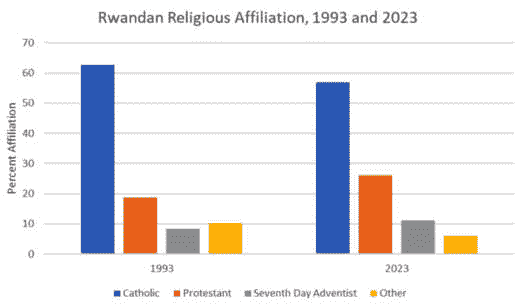
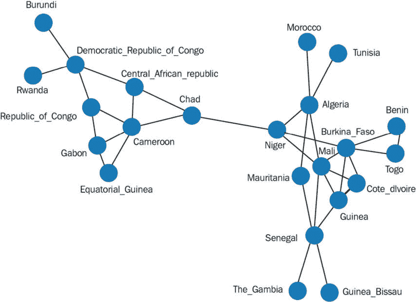
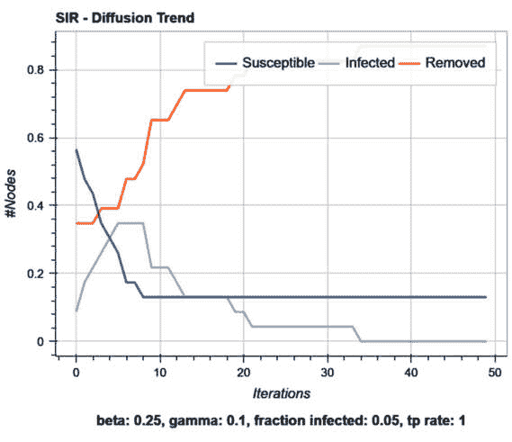
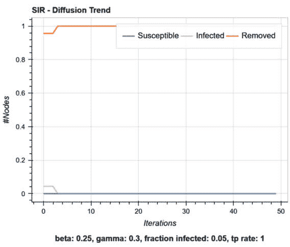
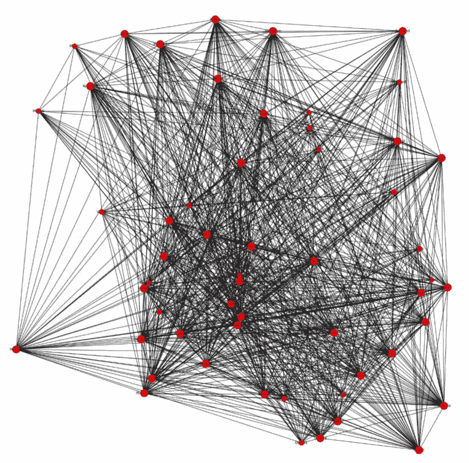
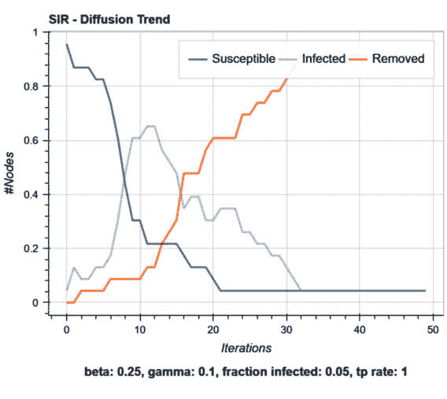
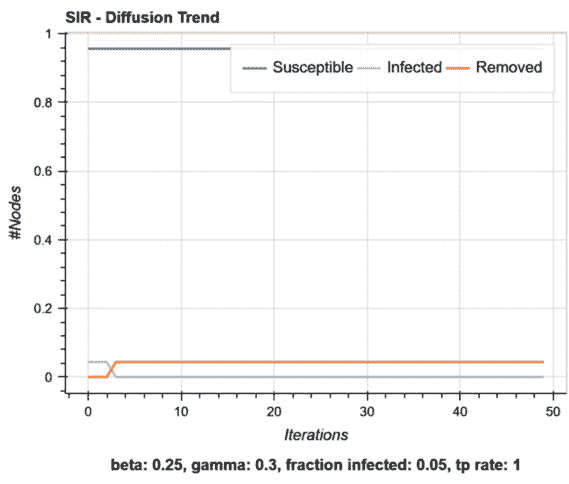

# 3

# 人口统计数据

在本章中，我们将使用社会数据来分析跨越国家的文化趋势以及通过**非洲数学科学研究所**（**AIMS**）学生群体传播的流行病。这些学生群体首次在*第二章*中介绍。我们将看到文化相似性、地理和共享的社会特征如何创造人与人、人与地点之间的联系，从而影响网络结构。我们还将介绍一些在网络上常见的重要结构。最后，我们将通过我们的文化趋势和流行病传播示例来探讨思想和疾病的传播如何受到网络结构的影响。

到本章结束时，你将了解社会因素如何影响社会联系的形成，思想和疾病的传播如何受到网络结构的影响，以及如何在绘制的网络中识别重要特征。我们将在后续章节中继续探讨这些观点。现在，让我们来看看人口及其定义特征。

具体来说，本章将涵盖以下主题：

+   人口统计学简介

+   法语非洲音乐传播

+   AIMS 喀麦隆学生网络流行病模型

# 技术要求

你将需要 Jupyter Notebook 来运行本章中的实践示例。

本章的代码可在以下链接获取：[`github.com/PacktPublishing/Modern-Graph-Theory-Algorithms-with-Python`](https://github.com/PacktPublishing/Modern-Graph-Theory-Algorithms-with-Python)

# 人口统计学简介

**人口统计学**，最初被定义为对人口生命统计的研究，衡量感兴趣的人口中的个体特征。关于人口的生命记录对于制定公共政策、流行病追踪、城市规划以及许多其他对基础设施和增长至关重要的政府任务至关重要。约翰·斯诺在 1854 年伦敦霍乱爆发期间开创了人口统计学领域，通过绘制地理数据和感染个体的共同特征来确定霍乱爆发的源头（一个水泵）。从那时起，人口统计学在医学研究、政策规划、教育改革以及其他社会科学应用于社会需求的应用中发挥了重要作用。

在本章中，我们将介绍人口研究的一些重要方面以及我们如何通过基于共享地理和人口因素的边来连接顶点来创建网络，从而使用共享的地理和人口因素来创建网络。

## 人口因素

人口统计学为我们提供了许多潜在的测量方法来研究人口及其小组成员，从而让我们能够推断出这些人口和小组成员之间可能存在的社会联系。例如，我们可能希望了解在卢旺达基加利、印度班加罗尔或中国西安等城市，在一段城市增长期间，性别、教育成就、宗教、社会经济地位或国籍的分布情况。通常，我们通过简单的图表来展示随时间的变化，如图 *图 3**.1* 所示，它描绘了卢旺达宗教构成 30 年的变化：



图 3.1 – 1993 年与 2023 年卢旺达宗教归属对比图

人口统计学因素随着人口变化而变化，它们在人口内部的不同小组成员之间也有所不同。虽然个人可能共享诸如年龄、性别和教育水平等人口统计学因素，但他们的兴趣、个性和成长环境可能使他们进入更大人口中的不同文化小组成员，例如在南非开普敦。杰斯可能会倾向于朋克摇滚音乐和文化。达拉可能喜欢社交和派对。 Sadako 和 Brigette 可能喜欢自然和艺术追求：


图 3.2 – 来自城市不同小组成员的四个年龄、社会经济地位和教育背景相似的年轻女性

虽然这些年轻女性有一些人口统计学因素，使她们在城市中相遇并形成社会联系的可能性增加，但她们所属的小组身份使得喜欢派对的酒吧女招待不太可能与自己制作衣服以反映自然的艺术女孩建立友谊。然而，如果这四位年轻女性移居到阿联酋迪拜，她们在外国同一城市共同成长的环境使她们在共同探索新国家时相遇并建立友谊的可能性增加。

在大多数情况下，人口统计学因素在社交关系的形成中发挥作用，但它们并不保证这些联系的存在。然而，在没有关于友谊的调查或我们可以抓取的社会媒体数据的情况下，人口统计学因素为共享共同背景的个人之间可能存在的联系提供了证据。我们将在本章后面创建一个新的基于人口统计学因素而不是学生之间认可互动的 AIMS 喀麦隆学生网络时回到这个概念。

## 地理因素

地理在确定社交关系的形成和可能性方面也起着重要作用。在同一地区的人更有可能在同一餐馆吃饭、在同一地区徒步旅行和加入基于地区的兴趣小组时相遇。例如，考虑三个区域——一个有更大房屋和郁郁葱葱院子的郊区环境、一个人口密集的城市和一个房屋很少的非常乡村社区（如图 3.3 所示）：


图 3.3 – 三种不同地理区域的示意图

也许图 3.3 中显示的区域都位于比利时，使他们拥有共同的国家文化。虽然我们预计图 3.3 中每个地理区域内的个体之间形成社交关系的可能性高于跨区域，但这些比利时地区的社交关系更有可能形成，而不是与图 3.4 中显示的内罗毕或德黑兰的个体形成社交关系：


图 3.4 – 分别展示内罗毕和德黑兰的女性

在国家、城市或邻里层面共享地理的人更有可能通过区域互动相互了解。然而，一个在布鲁塞尔的研究人员可能通过学术会议或专业社交媒体平台，如**ResearchGate**或**LinkedIn**，遇到内罗毕或德黑兰的研究人员。全球经济和全球社交媒体平台的兴起减弱了地理对社交关系的影响，但仍然更有可能的是，同一地理区域内的人会形成社交关系，尤其是在他们共享人口统计特征的情况下。

然而，全球化，尤其是对于受过教育的专业人士来说，已经改变了社交关系的形成过程，对于那些研究专业人士社交网络的人来说，考虑与该职业相关的其他人口统计因素，而不仅仅是考虑地理，是明智的。COVID-19 大流行及其随后在线/混合工作、会议和网络活动的兴起，使许多专业人士的社交网络超越了本地地理。尽管如此，那些在地理上具有共同背景的人往往拥有共同的文化，这使得即使在疫情之后涉及的地理发生了变化，这些关系也更有可能形成。

## 网络中的同质性

正如我们所看到的，人口统计和地理因素驱动着人群中个体之间的联系。随着知识经济的兴起，大多数地理区域都专注于某些人口统计因素，因为人们选择与那些在相同地区工作、财富水平相似、来自相似教育背景的人一起生活。相似的人更有可能相遇，更有可能结婚，更有可能属于同一个群体。

让我们考虑三个年轻的女性（马里科、瑞伊和绫子），她们在日本的津和野，年龄组相同，教育水平相似，并来自传统背景，如*图 3.5*所示：


图 3.5 – 马里科、瑞伊和绫子在日本的津和野外

基于地理和共享的人口统计因素，我们预计如果马里科、瑞伊和绫子相遇，他们将会形成社会联系；鉴于他们所在城镇的大小，他们可能已经见过面了。在网络科学中，这种顶点与其他共享重要特征（如人口统计或地理因素）的顶点形成边的倾向被称为**同质性**。

同质性在社会网络中的链接预测中起着重要作用，它基于共享的人口统计/地理因素和共享的相互联系来暗示个人的潜在联系。例如，考虑巴黎两位数据科学家路易斯和简之间建立联系的可能性，他们虽然不知道彼此在专业上有所联系，但共享二十位共同同事以及许多人口统计因素：年龄组、教育背景、他们居住和工作的行政区以及职业。如果他们在专业活动中相遇，他们很可能建立专业联系，而且他们可能已经认识但尚未在社交媒体平台上建立联系。路易斯认识简的可能性比认识帕特里克要大得多，帕特里克是一位居住在另一个行政区、年龄较大的房地产专业人士，从未上过研究生院，也从未参加过技术会议。

除了链接预测之外，同质性在聚类网络中也很有用。我们不是通过网络特定的聚类方法（将在后面的章节中详细介绍）根据网络连通性来聚类顶点，而是可以通过我们收集的人口统计和地理因素使用 k 均值或基于密度的聚类来聚类顶点。虽然这在社交网络中更为常见，但这种聚类也可以应用于基因网络、基于地理的销售网络或其他任何类型的网络。

让我们通过两个例子来看看同质性的作用，第一个例子强调了同质性如何影响非洲法语国家的音乐趋势传播，第二个例子展示了基于学生研究领域和家乡的社会互动，流行病可能如何通过我们的 AIMS 学生网络传播。

# 法语非洲音乐传播

使用共同语言的国家往往在共同的音乐品味、文学和其他文化标志以及贸易、跨境提供就业机会和共享经济联系方面有共同点。在非洲，许多国家的历史包括殖民时期，当时它们处于英语或法国的控制之下；许多国家仍然使用英语或法语作为行政目的的通用语。为了理解法语国家之间的音乐传播，我们将创建一个网络，将拥有超过 10%法语人口的、共享边界的国家联系起来。尽管像毛里求斯或马达加斯加这样的国家有大量的法语人口，但它们在地理上与其他法语非洲部分地区隔离。音乐或文学趋势可能通过其他法语国家的在线来源或广播电台传播；然而，地区音乐会和活动可能不会像与共享边界的国家那样容易地促进传播。

我们首先整合了有关国家边界和法语人口估计的在线信息。让我们根据我们在网上找到的信息，使用`脚本 3.1`创建我们的法语国家网络：

```py
#load needed packages
import numpy as np
import networkx as nx
import matplotlib.pyplot as plt
#create Francophone country network
G = nx.Graph()
G.add_nodes_from([1, 23])
G.add_edges_from([
    (23,13),(13,11),(12,13),(13,18),(13,1),(12,3),(12,18),
    (3,22),(3,18),(3,21),(3,20),(18,1),(18,14),(18,17),(18,21),
    (21,17),(21,14),(17,14),(14,1),(14,6),(14,5),(6,5),(1,8),
    (8,16),(8,7),(16,7),(16,2),(16,4),(16,19),(19,4),(4,2),
    (7,10),(2,10),(10,15),(10,9)])
```

现在我们已经确定了至少与 1 个其他法语国家接壤的 23 个法语国家，让我们通过添加到`脚本 3.1`中来可视化我们的国家网络：

```py
#plot the Francophone network
import matplotlib.pyplot as plt
G.nodes[1]['country'] = 'Niger'
G.nodes[2]['country'] = 'Republic_of_Congo'
G.nodes[3]['country'] = 'Senegal'
G.nodes[4]['country'] = 'Gabon'
G.nodes[5]['country'] = 'Benin'
G.nodes[6]['country'] = 'Togo'
G.nodes[7]['country'] = 'Central_African_Republic'
G.nodes[8]['country'] = 'Chad'
G.nodes[9]['country'] = 'Rwanda'
G.nodes[10]['country'] = 'Democratic_Republic_of_Congo'
G.nodes[11]['country'] = 'Morocco'
G.nodes[12]['country'] = 'Mauritania'
G.nodes[13]['country'] = 'Algeria'
G.nodes[14]['country'] = 'Burkina_Faso'
G.nodes[15]['country'] = 'Burundi'
G.nodes[16]['country'] = 'Cameroon'
G.nodes[17]['country'] = 'Cote_dIvoire'
G.nodes[18]['country'] = 'Mali'
G.nodes[19]['country'] = 'Equatorial_Guinea'
G.nodes[20]['country'] = 'The_Gambia'
G.nodes[21]['country'] = 'Guinea'
G.nodes[22]['country'] = 'Guinea_Bissau'
G.nodes[23]['country'] = 'Tunisia'
labels = nx.get_node_attributes(G, 'country')
nx.draw(G, labels=labels, font_weight='bold')
```

*图 3.6* 展示了我们法语国家和它们通过共享边界连接的链接：



图 3.6 – 法语国家网络的可视化

注意

当处理长标签时，带有标签的图表的绘图将包括重叠的标签或被截断的标签。然而，*图 3.6* 展示了我们网络的一些重要属性：即我们有两个国家（乍得和尼日尔）连接了两个不同的网络（如加蓬或布隆迪这样的中非法语国家以及如塞内加尔或摩洛哥这样的西非/北非法语国家）。正如我们将在创建音乐趋势传播模型时看到的那样，连接网络不同部分的*桥梁*，例如法语国家网络中的乍得和尼日尔，控制着从子网络到另一个子网络的传播过程。

为了模拟趋势的传播——或者说是思想或疾病的扩散——我们转向一个被称为微分方程的数学领域。**微分方程**关联了函数及其随时间变化（它们的导数）在一个感兴趣的系统中的关系。例如，微分方程可以模拟机械部件的热流，人口中的观点变化，重力对运动物体的影响，房间内声音的传播，或历史上的天气模式（以及其他许多情况）。

微分方程可以包括一阶导数，即感兴趣函数斜率的变化，二阶导数，与函数的曲率相关，甚至更高阶的导数。对于网络上的传播过程，我们将我们的讨论限制在一阶导数的微分方程上。然而，可以使用我们将在 NetworkX 网络上使用的软件定义和运行任何类型的微分方程。

有时，微分方程会在感兴趣函数中包含多个变量；这些方程被称为**偏微分方程**。包括流行病传播模型在内的许多现实世界过程都使用偏微分方程进行建模。此外，许多现实世界过程具有随机性成分或依赖于过程在物体或网络上的起始位置。在网络上，通常会对过程进行多次偏微分方程的计算，这些计算具有相同或不同的起始点。这允许出现一系列可能的结局。

现在我们对微分方程有了些了解，让我们深入探讨我们感兴趣的行为、思想和流行病的传播模型：**易感者-感染者-康复者**（**SIR**）模型。SIR 模型最初是为了研究流行病（在 1927 年）而开发的，其组成部分与人群中易感个体（尚未感染但可能被感染）相关，感染者（目前患有疾病的人），以及康复或具有抵抗力的人（那些曾经感染或免疫且不能被感染的人）。

随着个体在人群中的混合，感染个体可以以一定的概率将感染传播给易感者。对于我们的模型，感染易感个体的概率由参数*beta*给出。在实践中，这要么来自文献中关于行为或疾病传播概率的估计，要么在最佳猜测的范围内进行估计，在这些最佳猜测之间运行模型以估计该可能性范围内的潜在传播。一旦个体被感染，该个体就有恢复的概率，由参数*gamma*给出。一旦恢复，我们的模型也允许再次感染。然而，在**易感-感染-恢复-易感**（**SIRS**）模型中，恢复后的个体在一段时间后可以再次感染。在**易感-感染-易感**（**SIS**）模型中，恢复被立即再感染的机会所取代，而不是恢复。

流行病传播的一个重要特性是所谓的`beta`参数值相对于我们的`gamma`参数值。如果基本再生数 R0 大于`1`，则预期在流行病的初始阶段，疫情将在人群中传播，这表明可能发生大规模的疫情。许多传染病的爆发都具有 R0 值大于`1`，包括最近的埃博拉疫情（`R0`约为`1.5`）、1960 年加纳的麻疹疫情（`R`约为`14`）和 1918 年的西班牙流感（最初`R0`约为`1.5`，后来波次中约为`3.5`）。COVID-19 的 R0 值在不同变体和国家之间差异很大，这使得获得一个标准的 R0 值变得困难。然而，非洲的一个估计将大多数国家的 COVID-19 的估计 R0 值定为`2.0-9.7`。

SIR 模型在网络上运作的方式略有不同。一个感染顶点通常只感染网络中的邻居，产生一种邻近效应。在我们的网络中，桥梁特性限制了从子网络到另一个子网络的传播机会，因为桥梁顶点和其相邻顶点的感染率低于通过相互连接顶点的中心节点传播。一般来说，桥梁是网络中信息、想法或流行病传播的重要顶点，通常是干预的目标。在疾病流行期间进行疫苗接种活动以限制传播、在营销活动中针对提高产品采用率，以及在犯罪通信网络中捕获，都是针对桥梁进行目标干预以影响感兴趣网络上的传播动态的真实世界例子。

让我们更深入地探讨网络的几何结构，包括中心节点和桥梁。**中心节点**是高连接性的区域，其中许多顶点连接到许多其他顶点。从几何学角度来看，像中心节点这样的密集连接区域具有高曲率，为传播过程或网络上的随机游走提供了许多可能的路径。在我们的法语非洲网络中，喀麦隆、塞内加尔和马里都表现出中心节点的特性。

然而，需要注意的是，塞内加尔与其他顶点之间有许多边，而这些顶点没有大量与之关联的边。虽然塞内加尔由于其连通性而充当中心，但它不是一个理想的传播目标，因为过程将在相对孤立的顶点周围死亡。然而，喀麦隆和马里是连接到其他顶点的中心，这些顶点要么是中心，要么是桥梁，允许过程以高概率继续传播。**中心性度量**衡量一个顶点对网络的重要性，创建了不同类型的网络中心测量，可以找到在网络中充当马里/喀麦隆或塞内加尔的顶点。我们将在后面的章节中回顾这些中心性测量，我们将使用 igraph 评估网络属性。

**桥梁**的工作方式略有不同，但它们也为网络贡献了重要的几何特征。尼日尔和乍得在我们的法语非洲网络中充当桥梁，连接彼此之间没有其他边的中心。技术上，一种称为**中介中心性**的中心性类型通过计算每对顶点之间的最短路径（代表最直接的通信路线）并计算包含给定顶点的最短路径数量来衡量这种桥梁属性。那些有许多最短路径通过它们的顶点充当网络不同部分之间的桥梁。从几何学上讲，桥梁作为从网络的一部分到另一部分的流量交叉点。如果没有像乍得和尼日尔这样的桥梁将北非和西非与中非连接起来，我们的音乐从加蓬传播到西非将是不可能的，因为趋势必须通过这些国家才能离开中非。

对于我们音乐在法语非洲的传播，让我们考虑一个以 5%的国家开始听新桑巴艺术家的 SIR 模型。我们将说我们的音乐趋势有 25%的机会传播到邻近国家（我们的`beta`参数）和 10%的机会作为趋势消亡（我们的`gamma`参数）。这给我们 R0~2.5，这意味着我们的音乐趋势应该一开始就能很好地传播。

让我们通过添加到`Script 3.1`下载并导入`ndlib`包：

注意

对于某些包可能存在依赖关系，如果它们尚未在您的机器上安装，则需要安装。

```py
#install and import epidemic models
#you may need to install bokeh and restart the notebook if it is not
#already installed
!pip install ndlib
import ndlib.models.epidemics as ep
```

现在，我们可以选择我们希望实施的流行病模型，并根据我们提出的音乐传播流行病设置其参数，通过添加到`Script 3.1`：

```py
# Model Selection
model = ep.SIRModel(G)
# Model Configuration
import ndlib.models.ModelConfig as mc
config = mc.Configuration()
config.add_model_parameter('beta', 0.25)
config.add_model_parameter('gamma', 0.1)
config.add_model_parameter("fraction_infected", 0.05)
model.set_initial_status(config)
```

现在我们已经将模型导入并配置好，根据我们提出的传播动力学，我们可以在我们的法语国家网络上进行模拟。我们将包括 50 个时间段——可能是一周的时间段，表示大约一年的传播。让我们添加到`Script 3.1`以模拟传播：

```py
# Simulation
iterations = model.iteration_bunch(50)
trends = model.build_trends(iterations)
```

如果你的运行给出`bokeh`库：

```py
#visualize spread dynamics
from bokeh.io import output_notebook, show
from ndlib.viz.bokeh.DiffusionTrend import DiffusionTrend
viz = DiffusionTrend(model, trends)
p = viz.plot(width=500, height=400)
show(p)
```

这应该会给你一个类似于*图 3**.7*的图表，它显示了我们的音乐趋势流行病中易感、感染和康复/移除国家的比例。请注意，我们预计受这种新鲁姆巴艺术家影响的国家的峰值数量大约是我们国家数量的三分之一，而这位新艺术家的这种影响持续了超过半年。这对于我们这位新艺术家来说是一个相当成功的成果：



图 3.7 – 音乐在法语国家网络中的趋势传播

现在，让我们将我们的`gamma`参数修改为等于`0.3`，给出小于`1`的 R0。我们预计我们的趋势会非常快地消亡。在这个新场景下修改`Script 3.1`会产生截然不同的动态（*图 3**.8*）：

```py
# Model Configuration
import ndlib.models.ModelConfig as mc
config = mc.Configuration()
config.add_model_parameter('beta', 0.25)
config.add_model_parameter('gamma', 0.3)
config.add_model_parameter("fraction_infected", 0.05)
model.set_initial_status(config)
# Simulation
iterations = model.iteration_bunch(50)
trends = model.build_trends(iterations)
#visualize spread dynamics
from bokeh.io import output_notebook, show
from ndlib.viz.bokeh.DiffusionTrend import DiffusionTrend
viz = DiffusionTrend(model, trends)
p = viz.plot(width=500, height=400)
show(p)
```



图 3.8 – 在新的 gamma 参数下，音乐在法语国家网络中的传播

*图 3**.8*表明，新鲁姆巴艺术家的音乐并没有在邻国传播很多，在专辑发布后很快就会消亡。艺术家在其家乡国家之外不太可能为人所知，而听过专辑的人很快就会忘记这些歌曲。对于我们这位艺术家来说，这与原始场景的结果大相径庭。

# 喀麦隆 AIMS 学生网络流行病学模型

为了了解流感可能通过社交网络传播的方式，让我们回到我们的喀麦隆 AIMS 学生网络。回想一下，我们使用了关于互动的调查数据来在学生之间建立连接。这使我们能够连接那些经常互动的学生。然而，考虑一下关于互动的调查数据不存在的情况。我们如何推断学生之间可能存在的连接？

我们有关于学生国籍、研究领域和年龄的信息。来自同一国家的学生可能共享一种共同的文化——可能是有相同的本地语言、相同的最喜欢的舒适食品或相同的最喜欢的音乐家。

同样，由于他们共享的课程负担和职业兴趣，同一研究领域的学生很可能在课内外都会花时间在一起。他们的研究领域中的学习小组、小组项目和职业活动可能会定期将学生聚集在一起。如果在任何这些聚会中发生流感或 COVID-19 等传染病爆发，它很可能会在研究领域内传播。

让我们通过连接来自同一国家或共享同一研究领域的学生来创建一个新的喀麦隆 AIMS 学生网络。我们将使用`Script 3.2`来加载数据集：

```py
#import needed packages
import pandas as pd
import networkx as nx
import matplotlib.pyplot as plt
import numpy as np
import math
#reading the dataset
fichier = pd.read_csv("C:/users/njfar/OneDrive/Desktop/AIMS_data.csv")
data = pd.DataFrame(fichier)
```

现在，让我们设置我们的网络和一些初步的向量和数量，帮助我们生成学生之间的连接，包括学生的数量和他们的属性，通过添加到`Script 3.2`：

```py
#intializing the social network
aimsNetwork = nx.Graph()
#populating the network with nodes and edges
for i in range(len(data["Name"])):
    aimsNetwork.add_node(
        data["Name"][i], Age=data["Age"][i],
        country=data["Country"][i],Field=data["Field"][i],
        background=data["Background"][i])
#define length
N = len(aimsNetwork.nodes())
# one can build the adjacency matrix
AIMS_by_Country_or_Field = nx.Graph()
#define objects
AIMS = aimsNetwork
students = list(AIMS.nodes())
```

现在，我们可以通过遍历我们的属性来根据共享的国籍或研究领域连接学生，通过添加到`Script 3.2`来在 NetworkX 中构建一个图：

```py
#create edges
for i in range(N-1):
    for j in range(i+1,N):
        sti = students[i]
        stj = students[j]
        if AIMS.nodes[sti]['Field'] == AIMS.nodes[stj]['Field'] or
            AIMS.nodes[sti]['country'] == AIMS.nodes[stj]['country']:
            AIMS_by_Country_or_Field.add_edge(sti,stj)
```

现在我们有了我们的网络，让我们可视化 AIMS 中学生的连接：

```py
#create plot
Degree=AIMS_by_Country_or_Field.degree()
var = [10*k[1] for k in list(Degree)]
plt.figure(figsize=(20,20))
nx.draw_random(AIMS_by_Country_or_Field, font_size=10,
    node_size = var, with_labels=True, node_color="red")
plt.show()
```

这应该会给你一个高度连接的学生网络的图表，如图*图 3.9*所示：



图 3.9 – 通过国籍和研究领域连接的 AIMS 喀麦隆学生网络

*图 3.9* 显示了一个紧密连接的网络，表明许多学生很可能会与其他许多学生互动。这个网络没有很多桥接点，但大多数顶点似乎都是中心。在非常密集的网络中，传播过程往往移动得更快。与法语非洲网络相比，这个网络中顶点之间的最短路径将相对较短，因为大多数顶点都相互连接或几乎连接。网络的**直径**，即最长最短路径，代表了两个顶点之间信息或疾病传播的最大最短路径。网络直径小（或平均最短路径长度小）表明传播过程（如信息、趋势或疾病）的效率。因此，我们预计我们的 AIMS 喀麦隆学生网络比我们的法语非洲网络更容易受到传播过程的影响。从技术上讲，直径为定义在网络上的一类微分方程（如我们的传播过程）提供了界限。

在这个网络上，如果流行病的 R0 值超过 1，很可能会迅速传播并感染网络中的大部分。让我们运行一个与我们在法语网络中使用的相同`beta`和`gamma`参数的流行病，通过添加到`Script 3.2`来绘制结果，看看类似西班牙流感的流行病是如何通过我们的学生群体传播的：

```py
#Run the simulated epidemic on the AIMS Cameroon student network
model = ep.SIRModel(G)
config = mc.Configuration()
config.add_model_parameter('beta', 0.25)
config.add_model_parameter('gamma', 0.1)
config.add_model_parameter("fraction_infected", 0.05)
model.set_initial_status(config)
iterations = model.iteration_bunch(50)
trends = model.build_trends(iterations)
viz = DiffusionTrend(model, trends)
p = viz.plot(width=500, height=400)
show(p)
```

*图 3.10* 显示了流行病的动态，包括流行高峰时的许多感染学生，以及到第 32 周流行病缓解时，几乎整个网络都被感染：



图 3.10 – beta = 0.25 和 gamma = 0.1 在 AIMS 喀麦隆学生网络中传播的流行病

*图 3.10* 显示了一场非常严重的流行病，这可能会迫使关闭课程并隔离感染的学生。在*第八章*中，我们将考虑你可以利用的具体策略来降低在人口层面的流行病影响，包括移除连接人口或创建中心的关键顶点。现在，让我们修改`Script 3.2`来运行第二种类型的流行病，其中 R0 小于 1（beta = 0.25 和 gamma = 0.3）：

```py
#Run the simulated epidemic on the AIMS Cameroon student network
model = ep.SIRModel(G)
config = mc.Configuration()
config.add_model_parameter('beta', 0.25)
config.add_model_parameter('gamma', 0.3)
config.add_model_parameter("fraction_infected", 0.05)
model.set_initial_status(config)
iterations = model.iteration_bunch(50)
trends = model.build_trends(iterations)
viz = DiffusionTrend(model, trends)
p = viz.plot(width=500, height=400)
show(p)
```

*图 3.11*显示了一种非常不同的流行病类型，它不会迅速感染大量学生并迅速消亡：



图 3.11 – beta = 0.25 和 gamma = 0.3 在 AIMS 喀麦隆学生网络中传播的流行病

如我们从*图 3.11*中可以看到，即使是密集连接的网络也不会受到某些类型流行病的威胁。如果没有有效的传播条件——无论是通过网络结构还是通过影响传播潜力的疾病特征——流行病将在人群中消亡。然而，像*图 3.11*中显示的具有初始动态的病毒有可能突变成更具传染性的病毒。

如本章前面所述，1918 年的西班牙流感病毒株从一种传染病突变成为高度传染性疾病，将基本再生数 R0 从略大于`1`（允许传播）变为`3.5`，预示着一场全球性的灾难。在实践中，当模拟通过感兴趣的网络传播的流行病时，考虑各种现实参数值非常重要，因为参数的微小差异可能导致非常不同的结果；流行病规划在模拟了广泛的各种场景时效果最佳。

# 摘要

在本章中，我们介绍了人口统计学因素及其如何通过同质性影响网络发展。我们还介绍了枢纽和桥梁的概念。然后，我们转向 SIR 模型，通过微分方程模型中的传播因子展示了基于社会网络的疾病传播趋势。我们考虑了两个网络：一个相邻的法语国家地理网络和基于人口统计学因素的推定的 AIMS 喀麦隆学生网络。然后，我们通过改变流行病参数进行流行病模拟，考察了 R0 在这两个网络中的作用；这表明，要使趋势或疾病在网络上传播，需要特定的条件。我们将在*第八章*中再次回顾这些想法和策略，届时我们将更详细地探讨动态网络度量随时间变化，以及个人随时间改变网络中与他人连接时的中心性度量。

在下一章中，我们将探讨网络在交通运输物流中的作用，以及如何将运输路线数据表示为网络。

# 参考文献

Aiello, L. M., Barrat, A., Schifanella, R., Cattuto, C., Markines, B., & Menczer, F. (2012). 社交媒体中的友谊预测和同质性。*ACM 网络交易（TWEB*），6(2)，1-33。

Cooper, I., Mondal, A., & Antonopoulos, C. G. (2020). COVID-19 在不同社区传播的 SIR 模型假设。*混沌、孤子和分形*，*139，110057*。

Das, K., Samanta, S., & Pal, M. (2018). Study on centrality measures in social networks: a survey. *社会网络分析及挖掘,* *8, 1-11.*

Estrada, E., Kalala-Mutombo, F., & Valverde-Colmeiro, A. (2011). Epidemic spreading in networks with nonrandom long-range interactions. *物理评论 E,* *84(3), 036110.*

Iyaniwura, S. A., Rabiu, M., David, J. F., & Kong, J. D. (2022). The basic reproduction number of COVID-19 across Africa. *Plos one,* *17(2), e0264455.*

McPherson, M., Smith-Lovin, L., & Cook, J. M. (2001). Birds of a feather: Homophily in social networks. *社会学年度评论,* *27(1), 415-444.*

Rodrigues, F. A. (2019). Network centrality: an introduction. *从非线性动力学到复杂系统的数学建模方法,* 177-196.*

Smith, H. L. (2003). Some thoughts on causation as it relates to demography and population studies. *人口与发展评论,* *29(3), 459-469.*

Weiss, H. H. (2013). The SIR model and the foundations of public health. *材料数学,* *0001-17.*
