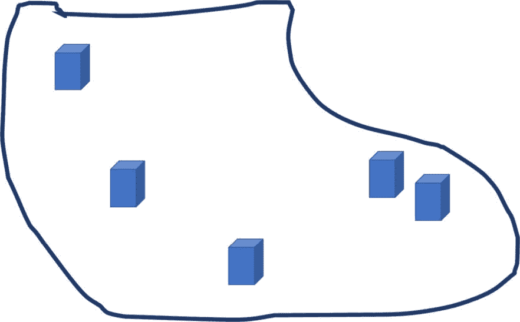
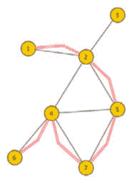
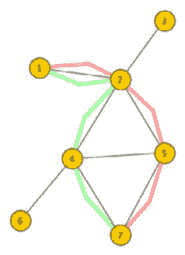
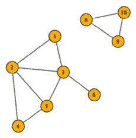
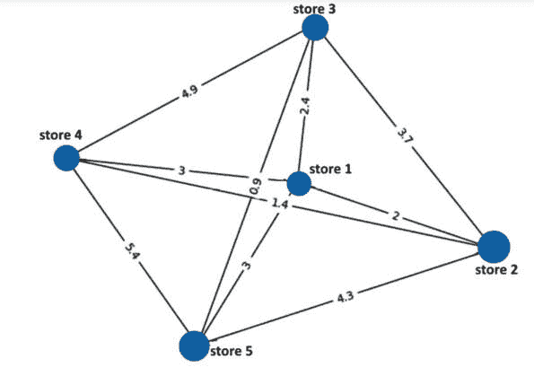
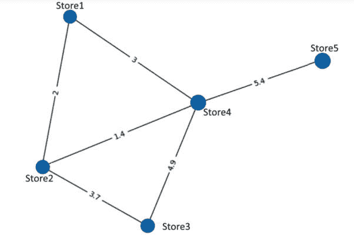
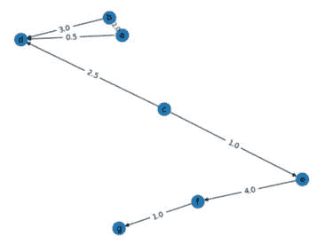

# 4

# 运输数据

本章探讨了运输物流，涉及将供应或商品从一处地点移动到另一处地点。我们将介绍一个货物配送问题，以找到最佳路线，以最小化配送时间和成本来交付商品。我们将探讨最短路径、访问所有必要地点的最佳路线，以及将算法扩展到大型网络的缩放算法。此外，我们还将检查简单距离加权的潜在问题，以计算路线最优性，考虑路线上的配送风险，这些风险可能会影响最优性。

完成本章后，你将了解如何将运输问题表述为网络问题，并使用 Python 将其扩展到非常大的路由网络。

具体来说，本章将涵盖以下内容：

+   运输问题简介

+   最短路径应用

+   旅行商问题

+   **最大流/最小割**（**max-flow** **min-cut**）算法

让我们从运输物流的一些基本问题开始吧。

# 技术要求

你需要 Jupyter Notebook 来运行本章中的实践示例。

本章的代码可在以下链接找到：[`github.com/PacktPublishing/Modern-Graph-Theory-Algorithms-with-Python`](https://github.com/PacktPublishing/Modern-Graph-Theory-Algorithms-with-Python)

# 运输问题简介

物理商品和供应在许多行业中都很重要，商品在地点之间的移动代表了消费包装商品、零售、军事和制造业等行业的一个重要问题。**供应链物流**——获取、运输和储存资源的科学——影响着这些行业部门的许多商业方面。没有商品出售，公司就无法盈利。没有材料来制造商品，产品就无法制造或运送到供应商那里。

在 COVID-19 大流行期间，许多关键的供应链路线关闭，导致世界许多地区的商品供应出现长时间等待，或者必需品如食品的价格上涨。像乌克兰战争这样的危机可能导致整个国家粮食短缺，在其他地区造成人道主义危机。许多供应链物流问题可以通过网络科学的视角来表述，图论提供了几个有用的工具来规划在不同地点之间存储货物或材料的最佳路线。在本章中，我们将更多地了解供应链物流，并利用图论工具来规划超市之间的供应路线。

## 商店之间的路径

零售商面临的一个常见供应链物流问题是跨区域运输商品。例如，考虑一个郊区，该地区有五个属于同一连锁品牌的超市分散在该地区，如图*4.1*所示：



**图 4.1** – 一个拥有五个连锁超市的都市区域

**图 4**.1 的都市区域显示了附近（右角）的一些商店以及彼此之间较远的商店（如左侧的商店）。也许我们正在将新鲜水果和蔬菜从附近的农场运送到每个商店。不考虑街道、加油站点或其他考虑因素（我们将在本章后面讨论这些），似乎定义商店之间的路线很容易。其中一条路径在**图 4**.2 中显示：


**图 4.2** – 一个为假设的郊区区域中的每个超市配送水果和蔬菜的路线计划

与**图 4**.2 相反，在实际情况中，卡车可能需要经过许多路线才能到达商店。可能存在替代街道和路线组合。卡车在商店之间可能需要加油，加油站的位置可能会影响哪条路线是最理想的。道路可能因施工而关闭。下午的雷暴雨可能会淹没一些良好路线上的街道，给卡车带来需要避免的危险。一些商店可能没有橙子和葡萄柚，因此需要优先安排早些时候的配送，以便顾客可以购买这些水果。

在更长的距离上，运输方式的问题也会出现。如果需要补充库存的商店之间存在海洋或山脉等障碍，通过海上运输或通过飞机运输货物可能更可取。自从世界全球化以来，商品跨越大陆和海洋运输（海运在**图 4**.3 中显示）是常见的：


**图 4.3** – 一艘离开港口的货船的插图

在美国和欧洲使用的许多产品或产品部件来自中国、日本或印度。海上运输可以提供比陆路或空运更便宜、更快捷的替代方案。供应链物流中的一个关键问题是平衡成本效益、**交货时间**（**TTD**）和大量货物移动的需求。让我们更详细地探讨一些这些考虑因素。

## 燃料成本

当今物流中一个紧迫的问题是关于配送成本优化路线。顾客不希望为配送支付高价或等待很长时间等待货物到达。自 COVID-19 关闭和乌克兰战争以来，燃料价格上升，一些货物路线不再可用。这推高了制造商、需要将货物运送到物理位置的商家以及从商家购买商品的消费者的成本。

地面路线，尤其是当与电动配送车辆（如图 4.4(a)所示）结合使用时，可以为本地运营的公司提供良好的选择。然而，许多供应链依赖于海外定位的部件或商品，因此需要如运输（如图 4.4(b)所示）或航空旅行等选项：


图 4.4 – 以下插图：（a）用于国内运输的半挂车和（b）用于海外运输的运输选项

然而，燃料成本很少是唯一考虑因素，因为对于可能变质的任何商品来说，时间是关键，而在现实世界中，与货物损失相关的安全问题往往比燃料成本更重要。让我们考虑一些场景，在这些场景中，总运输时间（TTD）是优化算法中用于安排交货时间、路线和最佳运输方式的重要考虑因素。

## 交货商品的时间

对于交货时间的首要考虑因素是紧急程度。某些商品（如农产品或疫苗）可能在一定时间内变质，这通常超过了成本，因为商品在必要的使用时间之外将无法使用。销售窗口也值得考虑，因为圣诞节或斋月期间的物品在假日过后需求不会那么大。这会导致企业利润损失。

让我们考虑两个旅游咖啡馆，一个位于苏里南的帕拉马里博市，另一个位于苏里南乡村地区，靠近一个自然探险营地。城市位置（如图 4.5(a)所示）可以访问冰箱来储存用于其冰沙的水果；乡村位置（如图 4.5(b)所示）没有冰箱。从当地农场运送新鲜水果的运输优先级可能会优先考虑乡村位置，因为那里的水果会更快变质：


图 4.5 – 以下插图：（a）苏里南帕拉马里博的一家咖啡馆和（b）苏里南乡村地区靠近旅游营地的一家咖啡馆

除了变质商品和错过促销期的问题外，时间因素还可以包括路线上的运输障碍，如施工或收费公路。此外，各国海关所需时间可能会有很大差异，因此选择更长的驾驶路线以避免穿越特定国家可能是有利的。

通常，在计算路线时，不仅需要考虑物理距离，还需要考虑旅行时间，包括诸如海关或施工可能性等因素。

## 导航危险

导航问题不仅包括对交付的人为障碍，还包括自然障碍。飓风可能会延误通过繁忙港口（如迈阿密港）的运输。阿尔卑斯山的雪崩是选择火车运输的公司需要考虑的导航因素。航运业每年平均有 10 艘船在公海和巨浪中损失。一些航线，如南非东南海岸的航线，已知会产生高浪（通常是因为洋流与来自不同方向的多种海洋波浪混合）。

在处理最优旅行路线和确定哪种交通方式最经济便捷时，路径的风险加权可能是明智的。世界上大多数地区都包含开源的风险数据和资料，以确定哪些风险存在以及一个人遇到它们的可能性有多大。例如，世界银行提供了**气候变化知识门户**（**CCKP**）在不同时期内的自然灾害风险，包括可下载的数据。

现在我们已经了解了一些路由考虑因素，让我们深入一个简单的例子，包括迈阿密一个局部区域内需要运送农产品到五个商店，这些商店都可以通过卡车到达，并且定义在一年中该地区不会发生洪水或飓风的时期内排除当前施工区域。首先，我们需要了解我们如何计算网络中顶点之间的最短路径，这在图论中有着深厚的根源。

# 最短路径应用

在图论中，地点和地点集合之间的最短路径有着悠久的历史。最初，这个问题源于关于穿越德国柯尼斯堡七座桥的问题。1736 年，莱昂哈德·欧拉提出，一条穿过每座桥到桥一侧相邻地区的路线恰好只穿过一次是不存在的。确实如此。如果桥的数量比地区的数量多一个，且桥的数量为奇数，那么旅行是可能的，不需要穿越桥超过一次。请注意，这个证明超出了本书的范围；如果你对此感兴趣，你可以在网上找到许多关于柯尼斯堡桥问题的证明，如果你搜索柯尼斯堡桥问题的证明的话。

然而，这种问题在运输行业中经常出现，**全球定位系统**（**GPS**）路由解决方案和算法在今天的路由问题中很常见，这些算法计算带有或没有特定约束（如柯尼斯堡桥问题）的最短路径。我们经常希望在穿越尽可能少的道路、桥梁或障碍物的同时访问多个地点，我们可以用类似欧拉提出他的桥梁问题的方式提出这个问题。然而，我们通常有许多不同的可能路线和地点，这使得在有替代路线的情况下证明变得更加困难。

在邻接矩阵中用`0`或`1`表示顶点之间是否存在边（或加权，其中存在的边有数字，不仅限于`1`来表示它们的存存以及它们之间的某些属性）。在地理数据中最短路径计算的情况下，这些权重通常表示位置之间的距离。

在顶点之间可能存在多条路径。例如，考虑一个包含七个顶点的网络。在顶点一和顶点六之间，存在许多可能的路径，包括图中*图 4.6*所示的那条。然而，最短路径总是存在的，它会最小化网络中任意两个顶点之间的距离（物理距离或其他，这取决于如何从数据集中分配边权重）。当一个网络不连通时，这可能是不确定的或设置为无限距离：



图 4.6 – 一个包含七个顶点，从第一个顶点到第六个顶点的路径的网络

有时，顶点之间的最短路径（比如，在我们*图 4.6*网络中的一和七之间）可能不是唯一的。可能存在多条相同长度的路径，例如顶点一和顶点七之间的两条最短路径（如*图 4.7*所示）：



图 4.7 – 一对顶点（顶点一和顶点七）之间有多条最短路径的网络

在无向网络中，在寻找顶点之间的最短路径时，可以考虑到顶点之间的所有边。如前所述，如果网络不连通，可能存在无限路径长度。对于无向和无权网络，最短路径将穿越最少的边（如果没有边路径连接两个顶点，则可能存在无限值）。*图 4.8*显示了一个不连通的网络：



图 4.8 – 一个不连通的网络

顶点八和顶点九之间的最短路径仅仅是连接顶点八和顶点九的边。假设这个网络没有加权，从这个路径的最短距离是一。顶点一和顶点六之间的最短路径是由连接顶点六到顶点三和顶点三到顶点一的边给出的。因此，顶点六和三之间的最短距离是二。然而，顶点八和顶点六之间的最短路径不存在，将被指定为无限距离。

迪杰斯特拉算法从一个配对顶点开始，探索与该顶点相连的顶点。然后记录从该初始顶点到其相邻顶点的最短路径，减去初始顶点（因为它已经在我们的路径集中）。然后探索连接到最短距离相邻顶点的下一个顶点集，以找到存在的下一个最短路径。这种迭代探索一直持续到找到另一个配对顶点。

让我们考虑一下迪杰斯特拉算法如何帮助我们找到商店之间的最短路线。考虑一个来自同一郊区同一杂货连锁店的五家商店的集合，这些商店可能需要母公司的供应商进行补货。*表 4.1* 给出了这五家商店之间的距离摘要（以英里为单位）：

|  | **商店 1** | **商店 2** | **商店 3** | **商店 4** | **商店 5** |
| --- | --- | --- | --- | --- | --- |
| **商店 1** | `0` | `2` | `2.4` | `3` | `3` |
| **商店 2** | `2` | `0` | `3.7` | `1.4` | `4.3` |
| **商店 3** | `2.4` | `3.7` | `0` | `4.9` | `0.9` |
| **商店 4** | `3` | `1.4` | `4.9` | `0` | `5.4` |
| **商店 5** | `3` | `4.3` | `0.9` | `5.4` | `0` |

表 4.1 – 郊区连锁商店之间的英里距离表

我们可以在`Script 4.1`中创建这个商店网络：

```py
#import packages
import networkx as nx
#create the Stores network
STRS = nx.Graph()
STRS.add_nodes_from(["store1","store2","store3","store4","store5"])
#define weighted ebunches, which represent lists of edges
e1 = [("store1","store2",2),("store1","store3",2.4),
    ("store1","store4",3),("store1","store5",3)]
e2 = [("store2","store3",3.7),("store2","store4",1.4),
    ("store2","store5",4.3)]
e3 = [("store3","store4",4.9),("store3","store5",0.9),
    ("store4","store5",5.4)]
#add edges
STRS.add_weighted_edges_from(e1)
STRS.add_weighted_edges_from(e2)
STRS.add_weighted_edges_from(e3)
#plot
weight_labels=nx.get_edge_attributes(STRS,'weight')
pos = nx.spring_layout(STRS)
nx.draw(STRS,pos,with_labels=True,)
nx.draw_networkx_edge_labels(STRS, pos,edge_labels=weight_labels)
```

`Script 4.1` 给出了我们五家商店的网络，并有一个很好的图表摘要显示了商店之间的距离，如图 *图 4.9* 所示：



图 4.9 – 我们五家商店及其之间的距离图

现在我们可以根据我们的网络创建一个邻接矩阵，并通过添加到`Script 4.1`来找到地点之间的最短路径。让我们计算我们的连锁店位置中**商店 1**与其他每个商店之间的最短距离：

```py
#create adjacency matrix
adj1 = nx.adjacency_matrix(STRS)
adj1.todense()
#find all shortest paths starting at Store 1
length1, path1 = nx.single_source_dijkstra(STRS,"store1")
length1
```

从这个计算中，我们得到了`length1`)之间的最短距离以及一般情况下的最短路径(`path1`)。我们可以看到`length1`之间的最短距离。到**商店 2**的最短路线是两英里，而到**商店 4**或**商店 5**的最短路线是三英里。**商店 3**距离**商店 1**为 2.4 英里。

使用迪杰斯特拉算法的一个主要缺点是它是一种盲目搜索算法，需要遍历所有可能的选择，以找到路径上每个可能顶点对之间的最短路径。对于大型网络来说，这需要很长时间，在实践中，需要对迪杰斯特拉算法进行修改以减少搜索时间。

**A* 算法**（发音为 A-star）通过使用启发式函数来引导搜索（与迪杰斯特拉算法中访问每个顶点相反）修改了迪杰斯特拉算法。启发式函数在搜索任务中很常见，因为它们可以加速过程，并可以修改失败算法的搜索。A* 算法中使用的启发式函数结合了从起始顶点到路径的成本以及到达给定目的地剩余成本的估计，以优先考虑最接近最终顶点的顶点。A* 算法的主要用途之一是为 GPS 用户提供路线，以找到到达目的地的最佳路线。

通常，A* 算法有效地找到最短路径候选者，尤其是在大型或密集网络中。然而，其性能取决于用于估计通过网络到达给定目的地成本的启发式函数。虽然迪杰斯特拉算法保证找到最短路径，但 A* 算法不保证找到最短路径。然而，在大型、密集网络中，运行迪杰斯特拉算法是不切实际的，因此必须使用 A*。

*表 4.2* 总结了迪杰斯特拉算法和 A* 算法之间的差异，以指导您如何以及何时使用每种算法进行最短路径计算：

| **最短路径算法** | **搜索类型** | **结果保证** | **计算速度** |
| --- | --- | --- | --- |
| 迪杰斯特拉算法 | 全局搜索所有顶点 | 总是找到最短路径 | 足够慢以限制在密集或大型网络上的使用 |
| A* 算法 | 引导搜索的启发式函数 | 没有找到最短路径的保证 | 足够快以解决大多数问题 |

表 4.2 – 迪杰斯特拉算法和 A* 算法之间的差异

让我们考虑一个不同的商店网络，其中一个网络中并非每个商店都通过创建一个二级商店网络在 NetworkX 中通过 `Script 4.2` 存在路线：

```py
#create a different Stores network
STRS2 = nx.Graph()
STRS2.add_nodes_from(["store1","store2","store3","store4","store5"])
#define weighted ebunch
e12 = [("store1","store2",2),("store1","store4",3)]
e22 = [("store2","store3",3.7),("store2","store4",1.4)]
e32 = [("store3","store4",4.9),("store4","store5",5.4)]
#add edges
STRS2.add_weighted_edges_from(e12)
STRS2.add_weighted_edges_from(e22)
STRS2.add_weighted_edges_from(e32)
#plot
weight_labels=nx.get_edge_attributes(STRS2,'weight')
pos = nx.spring_layout(STRS2)
nx.draw(STRS2,pos,with_labels=True,)
nx.draw_networkx_edge_labels(STRS2,pos,edge_labels=weight_labels)
```

*图 4**.10* 展示了这种新的商店网络，其中一些商店直接相互连接，而其他商店则需要经过其他商店的路线。请注意，**商店 5** 是离其他商店最远的商店，连接到 **商店 4** 但没有连接到其他商店：



图 4.10 – 一个商店网络，其中并非每个商店都通过可通行的路线连接到另一个商店

让我们考虑从 **商店 2** 到 **商店 5** 的路线。存在几种可能的路线（**商店 2** 到 **商店 3** 到 **商店 4** 到 **商店 5**，**商店 2** 到 **商店 1** 到 **商店 4** 到 **商店 5**，以及 **商店 2** 到 **商店 4** 到 **商店 5**）。如果所有距离都相对较短，最短的可能路线可能不是沿途停站最少的路线。在这种情况下，我们只需查看我们的网络，就可以看到 **商店 2** 到 **商店 4** 到 **商店 5** 是最短路线。然而，在非常大的网络中，这会花费很多时间，并且可能涉及更长的路径。

我们可以通过向`Script 4.2`中添加内容来在 NetworkX 中使用 A*算法找到我们的最短路线：

```py
#find shortest path from Store 2 to Store 5
nx.astar_path(STRS2,"store2","store5", weight='weight')
```

如预期的那样，A*算法找到了从**商店 2**到**商店 4**再到**商店 5**的最短路径。再次，对于更大的网络，我们需要像 A*算法这样的算法来快速找到最短路线。即使是一个有 20 家商店并且商店之间有多个连接的网络，手动从网络的可视化中计算也会很成问题。我们已经看到算法如何帮助我们找到两个特定目的地之间的最短路径。现在让我们看看包括在几个不同顶点停止的最短路径。这类解决方案对于许多最优路径问题至关重要，并建立在我们在两个不同目的地之间找到最短路径的问题之上。

# 旅行商问题

最短路径的自然扩展是在每个位置停止的最短可能路线。例如，考虑一辆需要为我们的五个商店补充所有货物的生产卡车。在每个我们的五个商店停止的最短路线可以节省司机的驾驶时间和燃料，并允许产品在最短的时间内到达每个商店。

**旅行商问题**旨在找到在每个位置或任意数量可能位置停止的最短路线。在图论中，这个问题（以及欧拉问题）与图中的回路相关，回路定义了一个非空路径，该路径从同一顶点开始并结束。

在实践中，需要算法来找到最短路径，对于大型问题，计算时间和收敛到解决方案可能会限制大多数算法的使用。NetworkX 提供了**Christofides 算法**作为求解器，该算法找到最短生成树（没有回路的树状网络结构）然后匹配树顶点以找到最小距离。

让我们使用`Script 4.3`为我们的原始五个商店网络找到旅行商问题的解决方案：

```py
#define traveling salesman algorithm and apply it to the stores's #networks
tsp = nx.approximation.traveling_salesman_problem
tsp(STRS)
```

此路径从**商店 1**开始，接着到**商店 3**（2.4 英里），然后是**商店 5**（0.9 英里），接着是**商店 4**（5.4 英里），然后是**商店 2**（1.4 英里），最后回到**商店 1**（2 英里）。

让我们通过向`Script 4.3`中添加内容来查看这是如何在我们的二级存储网络中工作的：

```py
#apply TSP algorithm to the second stores's networks
tsp(STRS2)
```

在这种情况下，我们需要访问一些商店多次以访问每个商店。我们的算法给出的解决方案从**商店 1**开始，然后是**商店 4**（3 英里），然后是**商店 5**（5.4 英里），然后再次是**商店 4**（5.4 英里），然后是**商店 2**（1.4 英里），然后是**商店 3**（3.7 英里），然后回到**商店 2**（3.7 英里），最后回到**商店 1**（2 英里）。这比我们原始的商店网络中需要的路线要长得多（12.1 英里比 22.6 英里），这是由于许多商店之间的非直接路径造成的。

在本节中，我们回顾了解决旅行商问题的解决方案，其中我们需要访问一组顶点，并希望找到访问所有这些顶点的最有效方式。在下一节中，我们将从检查最短路径问题转向查看分割顶点以最大化每个集合中顶点之间的旅行（例如，在关闭几条路线进行维护的同时最大化高峰时段的交通流量）。

# 最大流最小割算法

除了最短路径和路线之外，运输物流有时还涉及城市规划，例如，以最少的交通模式或供应链中断来规划道路工程。目标是最大化通过兴趣点（例如，主要交叉口或每天有大量游客/工作人员的建筑）的交通流量，同时最小化切断哪些路线。

在图论中，最大流最小割算法旨在将网络分割以最大化通过社交网络、交通网络、通过电气或水管道网络等的信息流。通常，有一个起点和一个终点与流量相关，尽管可以通过所有可能的组合运行算法，并将结果汇总以最大化整个网络的最大流量。

让我们考虑一个例子，即从城市外的密集住宅区到大多数人都工作的市中心地区的交通流量。我们希望规划在整个城市中更换关键交叉路口的交通信号灯的工作，这些交叉路口被运河分隔。城市中的一些道路比其他道路有更多的车道，允许更多的交通流量使用这些路线。我们希望在白天的工作时间内最小化对通勤者的干扰。

我们可以创建一个这种情况的网络，将住宅区指定为顶点`"a"`，市中心地区指定为顶点`"g"`。我们将使用容量参数指定路线可以处理的交通量。让我们使用`Script 4.4`在 NetworkX 中构建一个示例网络：

```py
#build the city intersection network
G1=nx.DiGraph()
G1.add_edge("a", "b", capacity=2.0)
G1.add_edge("a", "d", capacity=0.5)
G1.add_edge("b", "d", capacity=3.0)
G1.add_edge("c", "d", capacity=2.5)
G1.add_edge("c", "e", capacity=1.0)
G1.add_edge("e", "f", capacity=4.0)
G1.add_edge("f", "g", capacity=1.0)
#plot network
capacity_labels=nx.get_edge_attributes(G1,'capacity')
pos = nx.spring_layout(G1)
nx.draw(G1,pos,with_labels=True,)
nx.draw_networkx_edge_labels(G1,pos,edge_labels=capacity_labels)
```

此脚本应生成一个看起来像*图 4.11*的网络：



图 4.11 – 交通网络的图示

现在我们有了我们的网络，让我们应用我们的最大流最小割算法，并找出我们可以在`Script 4.4`中添加以替换我们的第一个交通信号灯的地方：

```py
#find cut-points
partition = nx.minimum_cut(G1, "a", "g")
print(partition)
```

我们的分割建议，我们最好的选择是切断交叉路口`"c"`和`"d"`之间的连接。一些通勤者可能会受到影响，但这对最大数量的通勤者来说保留了移动性。

# 摘要

在本章中，我们探讨了运输问题和路由问题，这些问题在现实世界的工业中经常出现。我们在两个示例商店网络上使用 Dijkstra 和 A*算法找到了商店之间的最短路径。然后，我们考虑了在我们的两个商店网络上进行最优路线规划时的旅行商问题，以了解连通性如何影响路线长度。最后，我们考虑了在小型城市网络上最大化流量的最优切割。在下一章中，我们将通过检查生态数据来处理网络上的聚类问题。

# 参考文献

陈，L.，金，R.，刘，Y. P.，彭，R.，古腾堡，M. P.，萨切瓦，S. (2022 年 10 月)。几乎线性时间内的最大流和最小成本流。*在 2022 年 IEEE 第 63 届计算机科学基础年会(FOCS) (第 612-623 页)。IEEE.*

约翰逊，D. B. (1973)。关于 Dijkstra 最短路径算法的注释。*《美国计算机学会会刊(JACM)，* 第 20 卷，第 3 期，第 385-388 页。

康，N. K.，孙，H. J.，李，S. H. (2018)。模块化植物土地运输的改进 A*算法。*《机械科学与技术杂志，* 第 32 卷，第 5563-5571 页。

利特尔，J. D.，穆尔蒂，K. G.，斯威尼，D. W.，卡雷尔，C. (1963)。旅行商问题的算法。*《运筹学，* 第 11 卷，第 6 期，第 972-989 页。

刘，S.，闵奇，F.，佩耶里霍夫，N. (2018). 图上的 Bakry–Émery 曲率和直径界限。*变分法和偏微分方程计算，* 第 57 卷，第 1-9 页。

朗迪内利，D.，贝里，M. (2000)。多模式运输、物流和环境：在全球经济中管理相互作用。*《欧洲管理杂志，* 第 18 卷，第 4 期，第 398-410 页。

罗森塔尔，W.，莱纳，S. (2008)。*《MaxWave 项目：异常波浪的结果。* 
