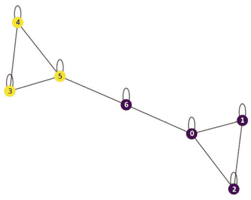
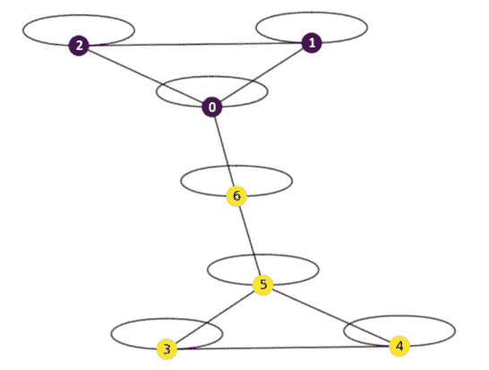

# 生态数据

本章中，我们将介绍一些在生态数据收集中常用的方法，然后探讨可以解析出监测地理区域内动物群体的图论聚类方法。这在生态研究中是一个非常普遍的问题，因为动物群体会迁徙并与其他动物群体重叠。此外，解析出健康和不健康的生态系统是保护和城市规划中常见的调查任务。我们将使用**谱聚类**分析两种类型的生态数据，以在蛇捕获计数和生态调查文本数据中找到群体。

到本章结束时，你将了解如何将谱聚类应用于网络中的群体查找。你还将看到不同的谱聚类实现如何被公式化，一些算法在处理大型网络时比其他算法更有效。

具体来说，我们将涵盖以下主题：

+   生态数据简介

+   谱图工具

让我们从生态问题的背景知识开始。

# 技术要求

运行本章中的实践示例需要 Jupyter Notebook。

本章的代码可在以下链接找到：[`github.com/PacktPublishing/Modern-Graph-Theory-Algorithms-with-Python`](https://github.com/PacktPublishing/Modern-Graph-Theory-Algorithms-with-Python)

# 生态数据简介

环境研究在保护战略、气候变化监测和农业实践中发挥着重要作用。收集的数据可能包括植物类型分布和密度、动物迁徙模式或疾病范围的数据。例如，农民可能希望跟踪大型农场上的作物疾病，以监测各种作物对年度产量的潜在威胁。保护主义者可能希望跟踪濒危动物群体在穿越国家公园时的迁徙，以便将反偷猎资源部署到拥有大量本地或迁徙群体的地区。让我们首先探讨一些数据收集方法。

## 探索跟踪地理区域内动物群体的方法

动物群体通常具有高度的流动性，季节变化、天气事件和人类互动驱使动物从一个地理位置移动到另一个地理位置。最大的动物迁徙之一发生在东非的草原上，每年随着雨季的来临和结束，数百万的兽群（如斑马和角马）从塞伦盖蒂迁徙到马赛马拉，然后再返回塞伦盖蒂（*图 5.1*）。偷猎不仅危害动物群体，而且往往助长其他非法活动，造成当地和国际问题；了解保护区边界的迁徙模式可以将资源定位以遏制偷猎：


图 5.1 – 雨季开始时斑马群的画面

监测一个种群在地理上的移动有多种方式。一种方法是在动物身上贴上卫星追踪标签，这些标签会上传每个标记动物的定位数据。这使得研究人员可以为每个动物构建路径，并汇总标记种群（可能只包括一个物种或几个感兴趣的物种）的结果。例如，在斑马群中，也许在雨季之前，一个保护团队已经用标签标记了 10 只斑马，这些标签将每小时追踪斑马的位置，持续几周。虽然我们预计这 10 只动物将遵循从一座公园到另一座公园的相同的一般路径，但个体可能以不同的速度迁徙，走稍微不同的路线，或者在不同的地点停下来寻找食物和水。这些数据允许研究人员识别出群内行为偏离群体大多数的亚种群。

另一种在地理上追踪动物种群的方法是使用隐藏在可能被感兴趣物种频繁出没的地点（如水坑、森林中的空地或健康的珊瑚礁）的陷阱相机。例如，假设公共卫生官员已经注意到孟加拉国阿特拉伊河附近村庄的眼镜王蛇咬伤事件有所增加（*图 5**.2*），并希望了解当地的眼镜王蛇种群，以便制定防止人类与眼镜王蛇互动的政策。

或许可以调整工作时间，以防止在特定时间或季节里，农业工人进入被眼镜王蛇频繁出没的地区。官员可以在咬伤事件更为常见的地区设置陷阱相机，以捕捉使用在陷阱相机中的胶片整个生命周期内的眼镜王蛇图像。根据咬伤密度，在感兴趣的区域设置多个相机，并通过每个相机追踪包括眼镜王蛇在内的有毒蛇类的种类、每天的时间、种类以及每个相机识别的个体蛇的数量。然后，这些数据将指导有关人口流动和蛇类控制策略的政策，以减轻对公共安全的威胁。


图 5.2 – 孟加拉国乡村眼镜王蛇的插图

## 探索捕捉植物分布和疾病的方法

植物分布和疾病的数据捕获涉及一种不同的方法，因为植物通常不会跨越地理区域移动。手动数据收集需要人类对植物物种和疾病的识别，这可能是不可靠的，并且需要很长时间才能收集到有意义的数据。然而，自动驾驶车辆和无人机提供了一种在广阔地理区域内捕获植物图像和视频的方法，这些图像和视频可以用在研究区域本土植物图像数据上训练的**卷积神经网络**（**CNNs**）进行处理。例如，哥伦比亚的农民可能希望通过在每周捕获的区域农场无人机或漫游车数据上运行咖啡锈分类器 CNN 来早期识别咖啡锈的实例，以避免作物损失（*图 5.3* 中的示例）。显示潜在咖啡锈的图像可能会触发一个系统警报，为农民提供农场上的地理位置或植物识别编号。


图 5.3 – 一张用于扫描哥伦比亚咖啡农场上咖啡锈的咖啡树图像

然而，对植物的现场记录文档在研究可能存在新植物物种的地区可以是一个有用的工具。刚果盆地和亚马逊盆地的大部分地区相对未开发，识别潜在的新植物物种可能有助于了解生态系统的重要部分，可能的用于治疗人类疾病的药物，或识别外来物种的威胁。

侵入性植物可能威胁到生态系统。新物种可能预示着新化学物质的发现。让我们考虑一位在亚马逊进行实地考察的植物学家，她遇到了一种以前从未见过的蘑菇类型（*图 5.4*）。为了确认这是一种新的蘑菇物种，我们的植物学家会拍照，收集样本进行基因分析，并记录她遇到蘑菇的生态系统。


图 5.4 – 一种可能的新蘑菇物种的插图

所有这些数据收集方法都创建了空间数据，其中一些区域可能或可能不在物理上相邻。在地理位置上相隔甚远的地理区域发现的物种可能对应于不同的种群，这些种群将受到不同的人类和环境因素的影响。将此数据视为空间数据并应用一些图论工具可以帮助在生态数据分析中解析出感兴趣的亚种群。

在许多情况下，收集植物生物样本或给动物放置追踪标签是不切实际的。然而，无人机和其他自主车辆可以拍摄该地区的植物和动物的照片（*图 5.5*），使研究人员能够通过一种特殊的深度学习算法从图像中识别物种，并从深度学习结果中构建网络。


图 5.5 – 一幅森林溪流的插图，通过深度学习算法可以从中识别出植物

现在我们已经知道了如何收集生态数据，让我们探索一些来自图论的工具，这些工具将帮助我们分析来自不同地理区域的收集到的生态数据。

# 谱图工具

**邻接矩阵**和邻接矩阵中的**顶点度**包含了关于网络中顶点连通性的信息。对于一个无向网络，网络的**拉普拉斯矩阵**是通过从度矩阵中减去邻接矩阵得到的（即 *L = D - A*，其中 *D* 是度矩阵，*A* 是邻接矩阵）。这个矩阵包含了关于网络许多重要属性的信息，包括连通分量的数量、可以将网络分离成单独组件的最稀疏割，以及网络中连接的整体强度。

**连通性**是图论中的一个重要概念。一个**连通网络**是指所有顶点之间都存在路径的网络；一个**不连通网络**是指某些顶点没有到达其他所有顶点的路径。连通网络可以通过切割边来分离；**最小割集**是需要移除的最少边，将网络分割成两部分以断开连通网络。这些值不仅与图论中与传播过程和其他定义在网络上微分方程相关的理论结果相联系，而且这些信息还告诉我们如何分离网络上的群体。

为了获得这些信息，我们需要对拉普拉斯矩阵进行分解以获得特征向量和特征值（网络频谱）。有时，我们首先对拉普拉斯矩阵进行归一化；在谱聚类中，这不如从频谱计算特定的图论值那样必要。然后，我们找到拉普拉斯矩阵的特征值和特征向量。在实践中，这是通过算法而不是通过直接的线性代数运算来完成的。

从此过程中获得的第二个特征值对应于**菲德勒值**（也称为**代数连通性**）；此值计算网络中存在多少个连通分量，并关系到网络的鲁棒性。相应的特征向量将网络划分为不同的网络，从而为网络上的分组划分提供两个聚类的解决方案。在谱聚类中，将网络划分为两个单独网络的过程可以重复进行，直到达到预定义的停止点（例如，总聚类数）。

从生态数据构建的空间网络上的谱聚类允许研究人员划分出动物迁徙的区域，区分可能孤立的种群，以及记录植被类型或农作物病害的差异。让我们设置一个简单的例子，并探索计算谱聚类的不同方法。

# 使用谱图工具聚类生态种群

考虑一位在加蓬的研究者，他希望了解洛昂戈国家公园保护区内加蓬蝰蛇种群之间的相互连通性（*图 5**.6*）。蛇在公园的七个区域（由顶点表示）被标记，它们的标签记录了它们下一个月的位置。如果蛇的栖息地与多个区域重叠，它们通常会在这几个区域之间移动。可能存在多个蛇种群，为不同的蛇种群提供不同的领地。如果两个区域共享一个区域种群，那么对应这两个区域的两个顶点将有一条边。如果没有蛇在这几个区域之间迁徙，两个顶点将不会共享边，可能代表不同的种群。孤立的种群往往更容易受到气候变化、偷猎和栖息地丧失的影响；了解物种和个体种群范围对于保护工作至关重要。


图 5.6 – 丛林地面上加蓬蝰蛇的插图

让我们使用`Script 5.1`创建一些关于蛇种群移动的数据：

```py
#create snake area network adjacency matrix
import numpy as np
import networkx as nx
np.random.seed(0)
adj_mat = [[1,1,1,0,0,0,1],
           [1,1,1,0,0,0,0],
           [1,1,1,0,0,0,0],
           [0,0,0,1,1,1,0],
           [0,0,0,1,1,1,0],
           [0,0,0,1,1,1,1],
           [1,0,0,0,0,1,1]]
adj_mat = np.array(adj_mat)
```

在实践中，地理区域很少与数据集中所有其他区域共享边界。使用`Script 5.1`空间加权组件（权重总和）对我们的蛇重叠邻接矩阵（`adj_mat`）进行加权，以推导出加权邻接矩阵（`adj_mat_w`）：

```py
#create spatial weight matrix
weights_total = [[1,1,1,0,0,0,1],
           [1,1,1,0,0,0,0],
           [1,1,1,0,0,0,0],
           [0,0,0,1,1,1,1],
           [0,0,0,1,1,1,1],
           [0,0,0,1,1,1,1],
           [1,0,0,1,1,1,1]]
weights_total = np.array(weights_total)
adj_mat_w=np.multiply(adj_mat,weights_total)
```

我们可以创建并探索我们的度矩阵，以及我们的拉普拉斯矩阵（从度矩阵中减去邻接矩阵）。让我们将此信息添加到`Script 5.1`中：

```py
#explore degree and Laplacian matrices
degree_matrix=np.diag(adj_mat_w.sum(axis=1))
laplacian_matrix=degree_matrix-adj_mat_w
print(degree_matrix)
print(laplacian_matrix)
```

度矩阵编码了连接到给定顶点的顶点数量，并作为中心性的基本度量。中心节点具有高度分数，而更孤立的区域可能具有零或一度。我们关于蛇种群重叠的网络在整个网络中具有类似的度中心性度量：

```py
[[4 0 0 0 0 0 0]
 [0 3 0 0 0 0 0]
 [0 0 3 0 0 0 0]
 [0 0 0 3 0 0 0]
 [0 0 0 0 3 0 0]
 [0 0 0 0 0 4 0]
 [0 0 0 0 0 0 3]]
```

现在我们来看拉普拉斯矩阵，它编码了我们将在谱分解和聚类中使用的连接信息：

```py
[[ 3 -1 -1  0  0  0 -1]
 [-1  2 -1  0  0  0  0]
 [-1 -1  2  0  0  0  0]
 [ 0  0  0  2 -1 -1  0]
 [ 0  0  0 -1  2 -1  0]
 [ 0  0  0 -1 -1  3 -1]
 [-1  0  0  0  0 -1  2]]
```

我们有多种方法可以计算 Fielder 矢量以获得我们的谱聚类结果。我们将通过两种方法使用 Python 来计算。根据你的 NetworkX 版本，你可能需要将 `nx.from_numpy_matrix` 替换为 `nx.from_numpy_array`。根据问题的规模，使用类似于我们在 Script 5.1 中添加的线性代数求解器可能更容易：

```py
#define Fiedler vector and obtain clustering
G = nx.from_numpy_matrix(adj_mat_w)
ev = nx.linalg.algebraicconnectivity.fiedler_vector(G)
labels = [0 if v < 0 else 1 for v in ev]
labels
nx.draw(G,with_labels=True, node_color=labels)
```

这显示了两个不同的蛇群汇聚到我们洛昂戈国家公园采样区的第六个区域（以及留在确切相同区域的蛇，用环表示），如图 *图 5**.7* 所示：



图 5.7 – 蛇群谱聚类

Scikit-learn 提供了一个谱聚类包，我们通过将其添加到 `Script 5.1` 中提供了一个替代的计算方法。如果在 Windows 上遇到警告信息，请不要惊慌；这不是错误。现在让我们将内容添加到 `Script` `5.1` 中：

```py
#perform spectral clustering with sklearn
from sklearn.cluster import SpectralClustering
from sklearn import metrics
sc = SpectralClustering(2, affinity='precomputed', n_init=100)
sp_clust=sc.fit(adj_mat_w)
sc_labels=sp_clust.labels_
nx.draw(G,with_labels=True, node_color=sc_labels)
```

如预期，scikit-learn 包产生了与我们的线性代数方法相同的网络划分 (*图 5**.8*)：



图 5.8 – Scikit-learn 蛇群谱聚类

谱聚类不仅限于网络数据或生态数据。任何数值数据集都可以使用谱聚类进行聚类。在图像和文本分析中，我们通常没有很多预标记数据的实例，手动标注数据既耗时又可能错过数据集中的一些重要类别，如果这些类别没有出现在某人手动评分的小样本中。谱聚类使我们能够通过这些领域的工具嵌入数据，基于最近邻创建网络，并应用谱聚类为数据集获取标签，然后可以使用这些标签来训练分类算法。这个过程被称为 **半监督学习**，自然语言处理和图像分析中的现实世界数据科学通常依赖于这种方法从数据集中构建分类模型。让我们通过考虑一个基于文本的生态数据集来观察这一过程。

## 文本上的谱聚类

让我们考虑一个生态笔记数据集，包括五个健康和五个不健康的本地公园。虽然这些笔记不如完整的生态调查那么详尽，但它们应该展示如何创建一个半监督学习流程来分类生态系统健康。以下是笔记中一个健康生态系统的例子：

```py
"Mangrove ecosystem. Numerous butterflies, lizards, and insects. Gumbolimbo trees. Soggy soil.', 'Tropical pines. Scat shows raccoon and coyote populations here. Recent controlled burn."
```

数据集中一个不健康生态系统的例子如下：

```py
"Small grass area. Some saplings. Gravel paths. Many cars parked in non-parking zones. Lots of run-off."
```

虽然我们可以自己标注这些笔记，但我们将使用光谱聚类来了解半监督学习如何用于为可能无法实现或不可靠的更大数据集生成训练数据标签。首先，我们将使用`Script 5.2`导入我们的数据：

```py
#set up needed packages
import pandas as pd
import numpy as np
import os
#you may need to install sentence_transformers
#if the package is not already in your environment
#!pip install sentence_transformers
from sentence_transformers import SentenceTransformer
#import first network's data
File ="C:/users/njfar/OneDrive/Desktop/SC_Notes.csv"
pwd = os.getcwd()
os.chdir(os.path.dirname(File))
mydata = pd.read_csv(os.path.basename(File),encoding='latin1')
```

为了嵌入我们的数据，我们将使用`Script 5.2`：

```py
#prepare data
mydata['Notes']=mydata['Notes'].fillna(value=".")
#strip to text for input into BERT model
text_list=list(mydata.Notes)
#get BERT--768 vectors;
#note: you will need enough memory to load the transformer model
sbert_model1 = SentenceTransformer('all-mpnet-base-v2')
#encode data with BERT
encoded_text1=sbert_model1.encode(text_list)
```

现在我们已经嵌入我们的数据，我们可以创建我们的最近邻图。由于我们的样本量很小，我们将通过向`Script 5.2`添加内容来考虑一个点的三个最近邻：

```py
#make nearest neighbors graph
from sklearn.neighbors import kneighbors_graph
n_adj = kneighbors_graph(encoded_text1, n_neighbors=3).toarray()
```

现在我们已经准备好运行我们的光谱聚类并检查我们的数据在这个算法中的聚类情况。让我们向`Script 5.2`添加内容以观察其效果：

```py
#run spectral clustering
from sklearn.cluster import SpectralClustering
from sklearn import metrics
sc = SpectralClustering(2, affinity='precomputed', n_init=100)
sp_clust=sc.fit(n_adj)
sc_labels=sp_clust.labels_
print(sc_labels)
```

从我们打印的标签中，我们可以看到生态系统`3`、`7`、`8`和`10`形成一个簇，而生态系统`1`、`2`、`4`、`5`、`6`、`7`和`9`形成另一个簇。让我们通过向`Script 5.2`添加内容来查看我们的笔记样本，看看这种方法通过添加内容到`Script 5.2`如何找到音调或主题上的差异：

```py
#examine notes
print(text_list)
```

我们可以看到笔记`3`、`4`、`7`、`8`和`10`与我们的样本中的其他部分相比是不健康的生态系统。光谱聚类似乎没有发现所有这些差异，但可能另一种类型的文本嵌入会比我们选择的更好地区分音调。也可能更少的邻居或更大的样本量会提供更好的结果。然而，通过我们的光谱聚类算法，我们确实找到了五个不健康生态系统中的四个。如果有人审查结果，就不需要切换很多标签（20%）来生成用于训练分类模型的正确训练标签。我们的数据集的第二列包括正确的音调分类标签。让我们通过向`Script 5.2`添加内容将我们的 BERT 嵌入转换为 DataFrame：

```py
#create training dataset for supervised learning
#turn BERT embedding into array
BERT_array1=np.array([x for x in encoded_text1])
#convert to dataframes
BERT_df1=pd.DataFrame(BERT_array1)
```

现在，让我们将我们的数据分为训练集和测试集（分别占 80%和 20%），创建一个*k*最近邻分类器（根据其两个最近邻的标签对点进行分类，其中*k* = 2），并通过向`Script 5.2`添加内容来衡量测试集的错误率：

```py
#create KNN classifier and test accuracy
from sklearn.neighbors import KNeighborsClassifier
from sklearn.model_selection import train_test_split
#get predictors and outcome
BERT_df1['Type']=mydata['Type']
df_train, df_test = train_test_split(BERT_df1,test_size=0.2, random_state=0)
X = df_train.iloc[:,0:767]
y = df_train.iloc[:,768]
X_test = df_test.iloc[:,0:767]
y_test = df_test.iloc[:,768]
#create KNN classifier and print accuracy
eu=KNeighborsClassifier(n_neighbors=2,metric='euclidean')
eu.fit(X,y)
print(eu.score(X_test,y_test))
```

我们的数据分割得到 100%的准确率，这表明没有生态系统类型的误分类。根据您机器上的种子和随机数生成器，您的结果可能会有所不同。然而，这种方法似乎适用于这个数据集。我们通过嵌入处理文本数据、通过光谱聚类获得良好的标签创建起点，然后创建分类模型，为我们的数据集产生了一个高准确率的分类系统。

# 摘要

在本章中，我们学习了如何为各种数据科学问题收集生态数据。在简要介绍了光谱聚类理论之后，我们通过我们关于加蓬蝰蛇分布的例子展示了如何通过光谱聚类解析出不同的动物种群。最后，我们通过生态系统笔记数据示例探讨了可用于半监督学习管道的最近邻网络光谱聚类。在*第六章*中，我们将介绍中心性度量，并使用它们来寻找股票定价的临界点。

# 参考文献

Angelici, F. M., Effah, C., Inyang, M. A., & Luiselli, L. (2000). *自由游荡加蓬蝰蛇（Bitis gabonica）的移动、活动模式和栖息地使用初步放射性追踪研究*。*生态学、陆地与生命杂志*，*55*(1)，45-55。

Corrales, D. C., Figueroa, A., Ledezma, A., & Corrales, J. C. (2015). *用于哥伦比亚咖啡锈病检测的经验多分类器*。见*计算科学及其应用—ICCSA 2015：第 15 届国际会议，加拿大班夫，AB，2015 年 6 月 22-25 日，第 I 部分 15*（第 60-74 页）。Springer 国际出版社。

Froese, G. Z., Ebang Mbélé, A., Beirne, C., Atsame, L., Bayossa, C., Bazza, B., ... & Poulsen, J. R. (2022). *耦合生态学狩猎者 GPS 自我跟踪以量化景观尺度上的村庄野味狩猎动态*。*非洲生态学杂志*，*60* (2)，229-249。

Mutombo, F. K. (2012). *复杂网络中的长距离相互作用*。

Ng, A., Jordan, M., & Weiss, Y. (2001). *关于光谱聚类：分析和算法*。*神经信息处理系统进展*，*14*。

Nunez-Mir, G. C., Iannone III, B. V., Pijanowski, B. C., Kong, N., & Fei, S. (2016). *自动内容分析：解决生态学和进化中的大量文献挑战*。*生态与进化方法*，*7* (11)，1262-1272。

Qi, X., Fuller, E., Wu, Q., Wu, Y., & Zhang, C. Q. (2012). *拉普拉斯中心性：加权网络的新中心性度量*。*信息科学*，*194*，240-253。

Reimers, N., & Gurevych, I. (2019). *Sentence-bert：使用 Siamese BERT 网络的句子嵌入*。*arXiv* 预印本 arXiv:1908.10084。

White, S., & Smyth, P. (2005, April). *图中的社区发现光谱聚类方法*。见*2005 年 SIAM 国际数据挖掘会议论文集*（第 274-285 页）。工业与应用数学学会。
