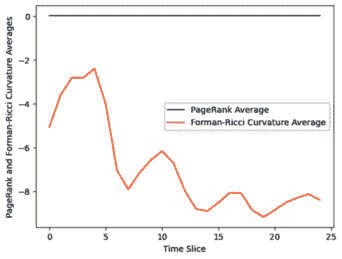
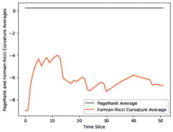
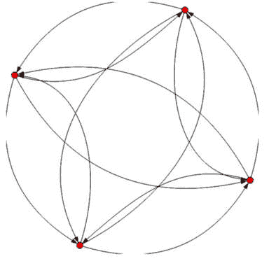

# 7

# 商品价格/销售数据

在本章中，我们将结合空间和时间方法来处理**时空数据**——这类数据既包含空间组件也包含时间序列组件。为了处理时间组件，我们将像在*第六章*中处理股票数据那样，将我们的数据集切割成重叠的时间窗口。为了处理空间组件，我们将基于每个时间切片的相关性计算局部莫兰统计量，并将阈值设置为创建该时间切片的网络。然后，我们将观察时间和空间切片中的**Forman-Ricci 曲率中心性**和**PageRank 中心性**的变化。示例包括在*第二章*中首次出现的布基纳法索小米数据集和一个新的商店销售数据集。

到本章结束时，你将了解如何使用**igraph**和不同类型的图表来设置时空数据分析，以捕获数据集中空间和时间关系随时间的变化。

尤其是我们将涵盖以下主题：

+   时空数据简介

+   分析我们的时空数据

# 技术要求

你需要 Jupyter Notebook 来运行本章中的实践示例。

本章的代码可在以下链接找到：[`github.com/PacktPublishing/Modern-Graph-Theory-Algorithms-with-Python`](https://github.com/PacktPublishing/Modern-Graph-Theory-Algorithms-with-Python)

# 时空数据简介

在*第二章*中，我们讨论了使这类数据难以处理、分析和用统计和机器学习方法扩展的一些时空数据方面。回想一下，这两种类型的数据都不是独立的，数据集中的依赖关系跨越了空间或时间。需要预测的替代方法，将时空数据作为网络表示允许分析师利用网络科学工具来找到变化点、挖掘模式，甚至在时间数据的情况下预测未来系统行为。在前几章中，我们学习了如何使用网络科学工具（如中心性）来分析空间和时间数据，以了解重要趋势。

世界上许多分析任务都涉及时空数据——包括受当地政策影响的世界股票市场的分析、分析不同地点的商店数据以了解客户行为和收入趋势、在流行病期间识别疾病来源和人口脆弱性、跟踪特定国家或该国家特定地区的国家或地区的人类行为（如犯罪、饮食习惯、物质使用、出生率或恐怖主义），以及展示气候变化对脆弱国家的影响。

让我们熟悉我们的两个数据集以及与许多时空数据应用相关的相关问题。

## 布基纳法索市场数据集

在*第二章*中，我们介绍了布基纳法索市场数据集，该数据集记录了从 2015 年第二季度到 2022 年第二季度的全国市场小米价格。在此期间，由于 COVID-19 供应链问题和乌克兰冲突限制食品分销和援助，世界粮食价格波动。食品安全是全球许多地区的主要问题，了解可能造成价格飙升，使普通个人或家庭无法负担的关键因素，对于满足全球粮食需求和避免饥荒至关重要。

一个国家的某些地区可能比其他地区更容易受到粮食短缺或商品价格上涨的影响，我们数据集中的空间特征捕捉了布基纳法索市场的这些情况。我们可以想象，一个乡村市场（如*图 7.1*中所示）可能面临比位于奥罗达古市中心的市场的更大的价格和可用性波动。此外，在某个时期内，某些事件可能比同一时期内的其他事件导致更大的价格波动。捕捉时间序列趋势对于理解事件对地区粮食价格的影响原因和潜在影响也很重要。因此，将数据作为时空数据捕捉使我们能够分析跨地点和跨时间的趋势。


图 7.1 – 布基纳法索乡村市场的插图

为了捕捉空间趋势，我们将回到在*第二章*中引入的权重矩阵，该矩阵连接了位于共享边界的省份的市场。这大致捕捉了布基纳法索的地理特征，使得共享许多边界的地区有可能相互影响其定价，并展示了与国家偏远地区相关的潜在供应链问题。

就像价格可以随时间和地理变化一样，销售量也可以变化。让我们转向下一个例子，探讨由于 COVID-19 期间工作政策的变化和城市人口流动的变化，销售如何在不同商店之间变化。

## 存储销售数据

让我们考虑一个中等城市中一家本地打印机供应连锁店。随着商店附近人口的变化，可能需要调整业务策略：关闭经营困难以最小化房地产成本的商店，优先为表现良好的商店补货，并在销售量高的地区开设新店。也许 COVID-19 期间的远程办公倡议导致某些城市地区的更多人从家工作，以及更多的人因为可以自由选择居住地而不是靠近办公室而搬往某些地区。也许重返办公室的倡议也影响了家庭办公用品的需求。所有这些因素都可能影响打印机供应店，并迅速变化。

为了进一步探讨这个问题，我们创建了一个模拟数据集，其中包含四个服务于单一大都市区的商店的销售数据，这些数据模仿了由 COVID-19 政策和随后的关于重返办公室与远程工作政策摇摆不定的决策所预示的人口流动趋势。假设商店 1（*图 7.2*）服务于主要从事护理、杂货店管理和其他不太可能长期远程工作的职业的人口。该地区还有临时学校关闭。我们预计在 COVID-19 封锁期间销售量会最初上升，但随后会迅速回到正常的销售模式：


图 7.2 – 一家打印机供应店的插图 – 商店 1

然而，商店 2 位于市中心附近，服务于主要是中级技术工人的群体，一旦他们完全远程工作，他们大多不适用于重返工作岗位的政策。因此，在最初的封锁期间销售量激增，并稳定到该地区的新的正常水平。

商店 3 服务于市中心附近一个非常受欢迎的郊区，主要由高收入专业人士组成，他们在 COVID-19 之前要么在家工作，要么定期去办公室。通勤通常很漫长，但学校系统和社区的安全性都很出色。在 COVID-19 期间，这个郊区经历了房地产的繁荣，因为该州其他地区的家庭现在可以远程工作，决定搬到这里定居。因此，到 2023 年，该地区将有大量需要打印机供应的远程工作者。如图 7.3*所示，商店 3 可能到 2023 年需要更大的空间：


图 7.3 – 一家打印机供应仓库的插图

然而，商店 4 服务于市中心区域，该区域经历了人口的大量流失，因为喜欢短途通勤便利的年轻家庭搬到了郊区。重返工作岗位的政策并没有吸引工人回到市中心区域的公寓，导致大多数建筑部分空置或被季节性居民居住。理想情况下，我们希望避免供应积压和没有潜在客户的情况（*图 7.4*）：


图 7.4 – 一家无客户的废弃打印机供应店的插图

我们的目的是在趋势发生时迅速发现趋势，以便尽可能快地调整业务策略，以满足对供应不断增长的区域需求，并在我们大都市区的租金飙升时最大限度地减少房地产费用。鉴于这些商店共享地理位置，我们假设空间权重矩阵将所有四个商店相互连接。在一个更大的连锁店中，基于人口统计特征或其他商店的距离创建空间权重可能会使分析更加精确。

现在，让我们将注意力转向代码，这将帮助我们深入了解我们的布基纳法索市场数据和我们的 COVID-19 门店销售数据。

# 分析我们的时空数据集

我们布基纳法索市场数据集方便地分为季度，为了理解季度间的变化，将我们的窗口大小设置为四个季度（一年），三个季度的重叠（以关注月度变化）是有意义的。正如我们在*第二章*中所做的那样，我们将通过权重矩阵和相关性指标计算局部莫兰统计量。让我们通过`Script 7.1`设置所需的包并导入布基纳法索市场数据集及其权重矩阵：

```py
#import packages
import igraph as ig
from igraph import Graph
import numpy as np
import pandas as pd
import os
import matplotlib.pyplot as plt
#import Burkina Faso market millet prices
File="C:/users/njfar/OneDrive/Desktop/BF_Millet.csv"
pwd=os.getcwd()
os.chdir(os.path.dirname(File))
mydata=pd.read_csv(os.path.basename(File),encoding='latin1')
#import weight matrix of Burkina Faso markets
File="C:/users/njfar/OneDrive/Desktop/weights_bk.csv"
pwd=os.getcwd()
os.chdir(os.path.dirname(File))
weights=pd.read_csv(os.path.basename(File),encoding='latin1')
```

现在我们有了数据和包，让我们通过添加到`Script 7.1`来计算 Forman-Ricci 曲率和 PageRank 中心性，并将每个时间切片的网络和整体指标保存下来，将相关阈值设置为`0.9`（以对主要变化的最大敏感性）：

```py
#score in yearly sets with 3 quarter overlap
vcurv_t=[]
vcurv_ave=[]
eig_t=[]
eig_ave=[]
nets=[]
for Year in range(4,29):
    data=mydata.iloc[(Year-4):(Year),1:46]
    cor=np.corrcoef(data.transpose())
    weights_total=weights.iloc[:,1:46]
    cor[cor>=0.9]=1
    cor[cor<0.9]=0
    cor_weighted=np.multiply(cor,weights_total)
    bf_market_w=Graph.Adjacency(cor_weighted,diag=False)
    edge_list=bf_market_w.get_edgelist()
    self_loop=[]
    for i in range(0,46):
        self=(i,i)
        self_loop.append(self)
    to_remove=[]
    for i in edge_list:
        for j in self_loop:
            if i==j:
                to_remove.append(i)
    bf_market_w.delete_edges(to_remove)
    nets.append(bf_market_w)
    d=Graph.degree(bf_market_w)
    e=Graph.pagerank(bf_market_w)
    eig_t.append(e)
    eig_ave.append(np.mean(e))
    ecurvw=[]
    for edge in bf_market_w.es:
        s=edge.source
        t=edge.target
        ecurvw.append(2-d[s]-d[t])
    vcurvw=[]
    for vertex in bf_market_w.vs:
        inc=Graph.incident(bf_market_w,vertex)
        inc_curv=[]
        for I in inc:
            inc_curv.append(ecurvw[i])
        vcurvw.append(sum(inc_curv))
    vcurv_t.append(vcurvw)
    vcurv_ave.append(np.mean(vcurv_t))
```

现在我们已经计算了指标，让我们通过添加到`Script 7.1`来绘制结果，以查看 PageRank 和 Forman-Ricci 曲率中心性随时间的变化：

```py
#plot metric averages across time slices
time=range(0,25)
plt.plot(time, eig_ave, label = "PageRank Average")
plt.plot(time, vcurv_ave, label = "Forman-Ricci Curvature Average")
plt.xlabel("Time Slice")
plt.ylabel("PageRank and Forman-Ricci Curvature Averages")
plt.legend()
plt.show()
```

这应该会显示一个 PageRank 中心性变化非常小的图表，但 Forman-Ricci 曲率中心性（*图 7**.5*）会增加并周期性波动。这表明我们市场的小米价格波动性有所增加，大约从 2018-2019 年开始（波动性增加，然后减少，然后再次增加，最终在更高的波动水平上稳定下来），在 COVID-19 和乌克兰冲突期间略有恶化。



图 7.5 – 2015-2022 年布基纳法索市场小米价格的平均中心性指标图

现在我们有一个显示波动性变化的图表，我们可以调查在不同时期我们的市场看起来如何。你可能希望调查所有时期，但我们将比较两个时期——一个低波动性时期和一个高波动性时期——并在以下代码中展示它们。让我们绘制时间周期`4`，根据 Forman-Ricci 曲率中心性（数据集中的最高中心性测量），波动性较低，每个顶点的尺寸由该顶点的 Forman-Ricci 曲率加权，通过添加到`Script 7.1`：

```py
#examine different time points with Forman-Ricci
#curvature plots, fourth slice
ig.plot(nets[4],vertex_size=np.array(vcurv_t[4])*-0.5)
```

这应该会产生一个类似于*图 7**.6*的图表，显示通过相关性和空间加权连接的非常少的市场，以及顶点（顶点尺寸非常小）的非常低的 Forman-Ricci 曲率：


图 7.6 – 显示同一地理区域内通过相关性>0.9 连接的市场，并按 Forman-Ricci 曲率中心性加权的图表

*图 7**.6* 显示，大多数市场之间没有相互连接，而那些相互连接的市场往往相互连接性非常小，产生的 Forman-Ricci 曲率中心性指标接近`0`。这意味着价格是独立的，表明市场网络稳健，不太可能受到 COVID-19 或国际贸易变化等外部因素的影响。影响一到两个市场的变化不太可能影响该国的所有市场，受本地问题（如干旱季度）影响的卖家和消费者在需要时可以从邻近地区寻求谷物。政府也可以通过简单地将一个供应充足的省份的过剩谷物转移到供应有问题的另一个省份来解决短缺问题。从政府的角度来看，解决本地供应问题不会花费太多时间和金钱。

让我们考察一个波动性较高的时期（第 19 个时期），并看看连接性和 Forman-Ricci 曲率中心性如何与时间周期`4`进行比较，通过向`脚本 7.1`中添加内容：

```py
#examine different time points with Forman-Ricci
#curvature plots, 19th slice
ig.plot(nets[19],vertex_size=np.array(vcurv_t[19])*-0.5)
```

这应该会产生一个类似于*图 7**.7*的图表，其中许多市场相互连接，产生的 Forman-Ricci 曲率中心性指标远高于零，表明该国广大地区的供应链高度互联，容易受到可能导致该地区饥荒的大规模短缺的影响。解决这些问题将使政府在时间和成本上付出更多，使人们容易受到食品短缺或价格飙升的影响，使得谷物对消费者来说难以负担。

注释

一些相互连接的市场有许多相互连接，产生了强大的曲率指标，而一些市场则与其他任何市场都没有连接。这些连接性较弱的市场的价格表明，一些地区不太容易受到广泛的谷物价格上涨或短缺的影响，这些短缺可能导致饥荒。


图 7.7 – 布基纳法索市场小米价格网络的第 19 个时期

从我们的分析中，我们可以了解到我们市场价格随时间的变化情况。在 2017 年之前，市场价格在各个市场之间的波动性较小。各个市场在价格方面并没有紧密相连，这表明价格受到的是本地影响。然而，随着市场在价格方面越来越依赖于全球力量，市场变得更加波动，容易受到世界事件（如 COVID-19 和乌克兰冲突）的影响。确实，在我们的原始数据集中，我们可以看到在这些事件之后价格飙升。这表明需要全国范围内的方法来解决不断上升的食品价格，而不是仅仅关注那些正在挣扎或容易受到本地生产或全球援助变化影响的本地市场。

通过查看**美国国际开发署**（**USAID**）数据库和 Google 上找到的文章的历史变化，我们看到 2010-2020 年是布基纳法索发展和国际粮食援助的时期，尽管这个国家的大多数人主要依赖自给自足的农业，而不是在市场上购买的食物。鉴于价格上涨，自给自足的农业和粮食援助是必要的，因为粮食价格达到了危机水平。

现在我们已经看到了如何分析时空数据来可视化波动趋势，让我们将注意力转向受在家办公和重返办公室政策影响的本地城市中的四个商店。我们将忽略权重，因为这些商店位于同一区域，并且只包括四个商店。我们将再次使用`0.9`作为阈值，以最大化我们在数据中找到极端波动期的机会。让我们使用`Script 7.2`导入我们的数据并开始：

```py
#import store sales data
File="C:/users/njfar/OneDrive/Desktop/Store_Sales.csv"
pwd=os.getcwd()
os.chdir(os.path.dirname(File))
mydata=pd.read_csv(os.path.basename(File),encoding='latin1')
```

我们将通过在`Script 7.2`中添加内容来计算这个网络的 Forman-Ricci 曲率和 PageRank 中心性；如果你遇到运行时警告，不用担心，因为它可能出现在 Windows 机器上，但这并不表示你的代码运行有问题：

```py
#score in yearly sets with monthly  overlap
vcurv_t=[]
vcurv_ave=[]
eig_t=[]
eig_ave=[]
nets=[]
for Month in range(2,54):
    data=mydata.iloc[(Month-2):(Month),1:6]
    cor=np.corrcoef(data.transpose())
    cor[cor>=0.9]=1
    cor[cor<0.9]=0
    stores=Graph.Adjacency(cor)
    edge_list=stores.get_edgelist()
    self_loop=[]
    for i in range(0,52):
        self=(i,i)
        self_loop.append(self)
    to_remove=[]
    for i in edge_list:
        for j in self_loop:
            if i==j:
                to_remove.append(i)
    stores.delete_edges(to_remove)
    nets.append(stores)
    d=Graph.degree(stores)
    e=Graph.pagerank(stores)
    eig_t.append(e)
    eig_ave.append(np.mean(e))
    ecurvw=[]
    for edge in stores.es:
        s=edge.source
        t=edge.target
        ecurvw.append(2-d[s]-d[t])
    vcurvw=[]
    for vertex in stores.vs:
        inc=Graph.incident(stores,vertex)
        inc_curv=[]
        for i in inc:
            inc_curv.append(ecurvw[i])
        vcurvw.append(sum(inc_curv))
    vcurv_t.append(vcurvw)
    vcurv_ave.append(np.mean(vcurv_t))
```

再次，我们可以通过在`Script 7.2`中添加内容来绘制 PageRank 和 Forman-Ricci 曲率中心性，以识别高波动和低波动期：

```py
#plot metric averages across time slices
time=range(0,52)
plt.plot(time, eig_ave, label = "PageRank Average")
plt.plot(time, vcurv_ave, label = "Forman-Ricci Curvature Average")
plt.xlabel("Time Slice")
plt.ylabel("PageRank and Forman-Ricci Curvature Averages")
plt.legend()
plt.show()
```

你应该会看到一个类似于*图 7.8*的图表，其中波动性在时间期间总体上相当稳定，有几个波动性增加或减少的时期，这些时期的价格可能受到我们商店经理无法控制的外部因素的影响。



图 7.8 – PageRank 和 Forman-Ricci 曲率平均值的图表

虽然我们不会期望波动性在各个时期之间有重大变化，从而在各个时期的网络图中显示出来，但我们确实看到了一些值得调查的波动性差异。让我们再次选择两个时期进行调查（时期`10`和时期`30`）。我们将首先通过在`Script 7.2`中添加内容，通过 Forman-Ricci 曲率对顶点进行加权来可视化销售的互连性，来调查时期`10`：

```py
#examine different time points with
#Forman-Ricci curvature plots, tenth slice
ig.plot(nets[10],vertex_size=np.array(vcurv_t[10])*-0.5)
```

这应该会显示一个类似于*图 7.9*的图表，其中只有两家商店相互连接，这表明这是一个相对稳定的时期，外部影响不应该像在其他更波动的时期那样影响我们的商店的销售。


图 7.9 – 第 10 个时期的商店图表

让我们通过在`Script 7.2`中添加内容来比较这个图表与时期`30`的图表：

```py
#examine different time points with
#Forman-Ricci curvature plots, thirtieth slice
ig.plot(nets[30],vertex_size=np.array(vcurv_t[30])*-0.5)
```

这段代码应该会生成一个类似于*图 7.10*的图表，显示所有四个商店之间的连通性（最大可能的波动性），这使得商店容易受到可能影响所有四个商店的销售而不是仅影响一个本地商店的事件的影响：



图 7.10 – 来自第 30 期的我们店铺数据的网络图，显示了最大波动性

综合来看，我们的结果表明，在 COVID-19 爆发前几个月，我们店铺的波动性相对稳定，在居家办公政策实施后波动性增加，并在一定程度上持续到重返工作岗位的政策实施。从我们的原始模拟数据来看，一些店铺从这种变化中受益，而其他店铺则遭受了相当大的损失。随着波动性的变化，店铺经理需要关注他们可以控制的与各自店铺相关的因素，而负责该地区所有店铺的经理可能需要制定策略，以在考虑那些陷入困境的店铺的建筑整合的同时，调整增长店铺的供应和增长需求。

总体而言，这些分析在危机时期对定价和销售脆弱性提供了一些见解，使决策者能够确定需要战略转变的时间点。结合其他分析（例如，通过多通道单频谱分析进行的时间序列预测，或者关于人口统计或购买行为时间差异的信息），这些类型的分析为在变化的时代继续繁荣提供了对时间和特定地理区域的洞察。

# 摘要

在本章中，我们将我们对时间和空间数据的先前见解扩展到处理时空数据集的分析问题，包括一个店铺销售数据集和布基纳法索市场小米价格数据集。我们按时间切分了这两个数据集，计算了空间统计量，并分析了网络中心性指标以识别数据中的变化点和波动期。波动期对应于网络对崩溃和价格、销售以及其他指标飙升的脆弱性，因为系统的互联互通使得网络的一部分对其他部分产生影响。我们在 COVID-19 和布基纳法索市场的乌克兰冲突期间以及 COVID-19 对销售数据的影响中看到了这一点。在 *第七章* 中，我们将查看时间和地理空间上的销售和商品定价，以了解网络科学如何解决时空数据中的问题。在 *第八章* 中，我们将考虑动态网络，其中连接甚至个人会随时间变化，并研究这些变化如何影响野生动物种群中的疾病传播。

# 参考文献

Han, X., Zhu, G., Zhao, L., Du, R., Wang, Y., Chen, Z., ... & He, S. (2023). *基于 Ollivier–Ricci 曲率的时空图神经网络用于交通流量预测*. *对称性*, *15* (5), 995.

Schlör, J., Strnad, F. M., Fröhlich, C., & Goswami, B. (2022, May). *基于曲率的网络分析识别遥相关模式*. 见 *EGU General Assembly Conference Abstracts* (pp. EGU22-7256).

谢克哈, 姜志, 阿里, R. Y., 伊夫特利奥古卢, E., 唐晓, G. M., & 周晓 (2015). *时空数据挖掘：计算视角*. *国际摄影测量与遥感杂志*, *4* (4), 2306-2338.

王宇, 黄志, 邢国, 李辉, 杨磊, 苏燕, ... & 山晓 (2022). *将 Ollivier-Ricci 曲率应用于表示城市交通网络中出行需求与供给的不匹配*. *国际应用地球观测与地理信息杂志*, *106*, 102666.
