# 8

# 动态社会网络

在前面的章节中，我们考虑了随时间不变化的网络。它们的几何形状保持不变，基于它们的传播过程和重要性指标也不会变化。然而，这在许多现实世界的网络中并不适用，在这些网络中，新的连接被建立，旧的连接被切断。

在本章中，我们将考虑随时间变化网络以及这些变化如何影响网络结构和传播过程。例如，在社会网络中，用户可以加入或停用账户。随着他们与其他用户内容的互动，他们关系的强度可能会发生变化。所有这些行为都会随着时间的推移推动网络变化，影响信息交换等过程作为中心出现和消失或在不同中心之间建立桥梁。我们将考虑从野生动物观察和假设在鳄鱼和苍鹭种群中传播的流行病收集的模拟数据和试验数据。

到本章结束时，你将了解网络随时间变化的方式以及这些影响对传播过程和网络指标的意义。你还将知道如何将动态数据集整理成网络并分析时间切片。这些方法可以扩展到更大的人口和更长的时间框架，因此到本章结束时，你将能够以规模处理人口模型。

在本章中，我们将涵盖以下主题：

+   随时间变化的社会网络

+   对网络传播的深入探讨

+   带有不断演变的野生动物交互数据集的示例

# 技术要求

在本章中，我们将使用 Jupyter 笔记本来运行我们的动态网络示例。您也可以在支持 Jupyter 笔记本的云平台上运行此代码，例如 **Amazon Web Services** (**AWS**) 或 **Google Cloud Platform** (**GCP**)。我们将使用在笔记本电脑上运行的 Jupyter 笔记本，处理本章中的示例不需要云访问权限。

# 随时间变化的社会网络

考虑你最近的朋友圈。在过去一年、过去五年、过去十年里，这个圈子发生了怎样的变化？

许多可以用网络表示的社会关系和其他类型的数据会随着时间的推移而演变。友谊随着人们的搬家、毕业、结婚、换工作、旅行或去世而疏远或建立。动物随着季节、气候的变化以及人类活动侵占放牧地而迁徙。商店的销售模式可能会因该地区新商店的开设、人口流动和重大世界事件（如 COVID-19 或乌克兰冲突）而中断。

在接下来的几节中，我们将探讨动态网络，其结构随时间变化。随着网络结构的变化，与信息/疾病流动和网络分割相关的重要属性也会发生变化。

## 友谊网络

许多社交网络平台允许友谊群体发展和甚至鼓励结构的变化。考虑分享帖子或推文，在你的网络帖子/推文/图片中标记其他人，他们可能有尚未遇见你的朋友，并添加与你分享的内容相关的可搜索标签。这些活动中的每一项都能为你带来更多的可见性，让你在最初的社会网络之外得到关注，让朋友的朋友、尚未在社交媒体平台上与你建立联系的认识者，以及与你话题帖子中分享相似兴趣的个人能够找到你并建立联系。

假设有人在社交媒体平台上发布了一张超现实的梦境捕手图像（*图 8.1*）：


图 8.1 – 一张使用人工智能（AI）创建并发布到社交媒体平台上的梦境捕手图像

也许用户添加了`#AIArt`和`#Dreamcatcher`标签，并标记了一个发布类似内容的朋友（*图 8.1*）。其他平台用户可能会搜索使用人工智能艺术平台创建图像的其他人，并希望关注该用户或点赞/分享内容。这为用户提供了更多联系，并扩大了他们的社交网络。

被标记的朋友可能会从这些新联系中受益，因为该用户的新联系会访问朋友的主页。此外，那些尚未遇见该用户的朋友也可能与该用户建立联系或点赞/分享他们的内容。这也扩大了用户的社会网络。

许多社交网络平台还通过创建兴趣页面或群体来连接用户，这些页面或群体允许具有相似兴趣的用户发布内容、建立联系和讨论主题。例如，许多社交媒体平台提供动物兴趣群体或页面，展示可爱的动物艺术或照片，如*图 8.2*中所示的动物艺术：


图 8.2 – 一张茶杯中环绕着玫瑰的小象人工智能艺术图像

这些兴趣群体鼓励用户之间的联系和可搜索内容的共享，以增长群体的成员人数（有时由广告优化算法或其他付费用户，包括在某些情况下的一些群体本身）鼓励）。受欢迎的内容往往鼓励群体增长和群体内用户之间的互动/联系。不受欢迎的内容往往阻碍增长。

鼓励具有相似兴趣的用户之间建立联系并优化内容传播的算法的阴暗面是阴谋论和错误信息传播的可能性，以及促进种族主义或歧视性群体之间的联系。在 2016 年和 2020 年美国总统选举（以及 COVID-19 大流行期间），错误信息在社交媒体平台上迅速传播。在大流行或国家危机期间，错误信息可能引发公众恐慌，增加资源压力，或导致更高的死亡率。在政治领域，错误信息可能影响选举结果或加速不同政治团体之间的分歧。

鼓励社交网络演化以增加点赞数，通过连接那些可能喜欢其他用户内容或相关广告观点的人的算法可能会无意中做到以下事情：

+   促进可能喜欢或评论错误信息之间的用户之间的传播

+   鼓励在分享错误信息或有害内容之间的用户之间建立联系

+   在社交网络上创建一个持续加剧这一问题的反馈循环

这也可能发生在社交媒体平台、社区团体、网络聊天室和其他论坛上。虽然推广更多猫猫表情包可能无害（除了浪费时间看猫猫表情包的潜在可能性），但推广种族主义意识形态或鼓励宗教暴力则相当有害。

## 三角闭合

大多数网络演化算法的影响结果来自一个称为**三角闭合**的网络属性。社交网络中的三角闭合大致基于以下前提：在网络上，一个用户的朋友的朋友的用户可能在实际生活中认识该用户，但尚未建立联系。这是社交网络中基于直接连接的三角闭合实例。另一个与我们的用户的朋友共享许多朋友群体的用户很可能认识该用户（或者基于共享的社交网络，会成为该用户的好连接）；此外，其他用户可能与该用户有众多共同兴趣（许多朋友推荐算法的前提）；这是基于元数据的三角闭合实例，其中连接的形成取决于用户元数据的相似性，而不是共享的连接。

考虑 Pieter、Kwame 和 Pablo。这三个人都喜欢足球、软件工程和远足。Pablo 和 Pieter 彼此认识，Pieter 和 Kwame 也是如此；然而，我们不知道 Kwame 和 Pablo 是否认识（*图 8.3**.3*）：

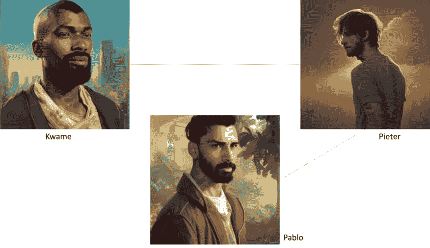

图 8.3 – 我们三位足球迷之间已知关系的图示

给定已知的两种关系以及共享的兴趣元数据，Kwame 和 Pablo 很可能彼此认识（或者如果他们建立了联系，也会相处融洽）。网络中开放三角形的百分比衡量了网络的总体三角形开放度。具有高开放三角形百分比的网络在时间上有很高的进化潜力，因为朋友的朋友或具有相似兴趣的个人可以通过共享内容或团体成员资格相互连接。现在我们对我们对关系及其随时间演变的情况有了更多的了解，让我们更深入地研究在演变网络上的传播过程。

# 深入研究网络上的传播

现在我们对网络随时间变化的情况有了一定的了解，让我们看看如何在 Python 中表示这些网络，并计算在动态网络上随时间推移的传播过程，例如流行病学模型。Python 提供了几个工具来帮助我们可视化并分析动态网络，正如我们在前面的章节中所做的那样。让我们开始吧。

## 动态网络简介

我们可以通过跟踪不同时间点的连接来跟踪网络随时间的变化。让我们考虑一个狮子群，其中个体在一天中的不同时间周期性地互动。*图 8.4* 展示了这个具有时间戳的示例网络，以跟踪边：

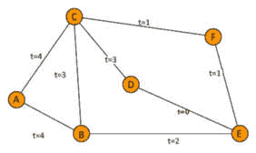

图 8.4 – 一个具有时间戳的动态网络示例

*图 8.4* 展示了一个具有随时间演变的边和顶点结构的动态狮子网络示例，这些边和顶点可以带有时间信息。Python 提供了一个方便的包来创建这样的网络。`NDlib` 包利用 `DyNetx` 来模拟时间演化的图，它利用 `DyNetx` 的几个关键原语来创建和分析动态网络。这为在现实世界中处理动态网络提供了一个强大的框架。这在流行病学、社会网络分析和交通系统等领域尤其有价值，在这些领域中，理解时间动态至关重要。让我们通过使用 `Script 8.1` 创建 *图 8.4* 来探索这个包：

```py
#create Figure 8.4
#import packages
#install dynetx if needed
#!pip install dynetx
import dynetx as dn
import networkx as nx
import matplotlib.pyplot as plt
#create an empty graph
g = dn.DynGraph()
#add vertices and edges with time information added
#adding the edge ("D","E") at t=0 that vanishes at time e=2
g.add_interaction(u="D", v="E", t=0, e=2)
# adding some edges at time t=1
g.add_interactions_from([("C", "F"), ("F", "E")], t=1)
# adding some edges at time t=2
g.add_interactions_from([("B", "E"), ("A", "B")], t=2)
# adding some edges at time t=3
g.add_interactions_from([("B", "C"),("C","D")], t=3)
# adding some edges at time t=4
g.add_interaction(u="A", v="C", t=4)
```

一旦我们创建了 *图 8.4*，我们就可以返回一个快照列表，每个快照代表狮子网络在时间不同点的静态视图。这些快照实际上是不同时间戳的图的实例。让我们在 `Script 8.1` 中添加以显示这些图表：

```py
#create plots for each time point
for i in range (5):
    g1 = g.time_slice(i)
    nx.draw(g1,with_labels=True)
    print ("snapshot at t = ", i)
    plt.show()
```

我们还可以打印每个快照的边列表。让我们在 `Script 8.1` 中添加以获取每个时间点的边列表：

```py
#create lists of edges at each time point
for i in range (5):
    g1 = g.time_slice(i)
    print ("snapshot at t = ", i)
    print(g1.edges())
```

这应该给我们以下每个时间点的边分析，如下所示：

```py
snapshot at t =  0
[('D', 'E')]
snapshot at t =  1
[('D', 'E'), ('E', 'F'), ('F', 'C')]
snapshot at t =  2
[('E', 'B'), ('B', 'A')]
snapshot at t =  3
[('D', 'C'), ('C', 'B')]
snapshot at t =  4
[('C', 'A')]
```

在每个时间点理解边结构对于评估网络结构和性质至关重要，这些性质有助于网络上的流动，例如中心节点和桥梁。可视化和边列表也为我们提供了一种总结信息的方法，这可能会为例如通过小群体传播的流行病提供额外的见解。离开我们的狮子例子，让我们考虑在新型疾病（如 COVID-19）爆发期间办公室环境中的徽章跟踪。不同的人将在不同的日子与办公室中不同数量的人互动，这取决于他们的日程安排。不同时间点存在的边列表以及员工之间的交互可视化可以帮助研究人员追踪新的爆发并计算重要的流行病模型参数，以了解疾病对更大人群的潜在影响。

正如个人之间的联系会随时间变化一样，网络中的个人本身也可能发生变化。也许有一位员工因病请假或请了个人假，因此在那个时间点从网络中退出。使用`DyNetx`，我们还可以创建一个交互网络来模拟一个动态结构，其中顶点和边都可以随着时间演变而出现和消失。回到*图 8**.4*，让我们在`Script 8.1`中添加以下交互流：

```py
#print interaction stream
for i in g.stream_interactions():
    print(i)
```

此脚本为每个时间点创建一个交互列表，表示网络中存在的交互。虽然我们没有狮子离开或进入我们的网络，但狮子的交互确实会改变，并且狮子在特定时间点可能与网络中的其他狮子有或没有交互。让我们进一步查看输出，以了解哪些时间点在网络狮子之间涉及最多和最少的交互：

```py
#output of interactions for each time point
('D', 'E', '+', 0)
('C', 'F', '+', 1)
('F', 'E', '+', 1)
('D', 'E', '-', 2)
('B', 'E', '+', 2)
('A', 'B', '+', 2)
('B', 'C', '+', 3)
('C', 'D', '+', 3)
('A', 'C', '+', 4)
```

前两个值指定了参与边的顶点。第三个值指定了边操作的类型，其中`'+'`表示出现（边创建）和`'-'`表示消失（边删除）。最后一个值表示与边操作相关的时间戳。例如，我们可以看到狮子 F 在时间点`1`建立了多个网络内的交互。我们还可以看到狮子`D`和`E`，它们的交互始于第 0 个时间点，在第 2 个时间点停止交互。

这种类型的信息对于流行病追踪至关重要，因为它允许我们缩小接触范围以进行接触追踪。**接触追踪**涉及通过时间和受影响个体之间的互动向后工作，以找到最初感染了感兴趣疾病的原始患者（**零号患者**）。这使流行病学家能够确定疫情开始的地域，以及从零号患者开始追踪其在时间和空间上的演变。一些疾病迅速突变，这使治疗的发展变得复杂。今天有效的方法可能无法应对下一次突变。这就是为什么流感疫苗通常每年都要接种，因为流感病毒株会定期突变。然而，一些疾病的突变非常缓慢或根本不发生，这允许有效的治疗或疫苗。

现在我们对 Python 中的动态网络构建有了一些了解，让我们更深入地探讨**易感者-感染者-康复者**（**SIR**）模型，比我们在*第三章*中探讨的要详细一些。

## SIR 模型，第二部分

在*第三章*中，我们探讨了 SIR 模型来追踪网络传播过程，但我们没有深入到微分方程的技术细节。在本节中，我们将更深入地探讨 SIR 模型的数学。让我们首先定义我们将在模型中使用的术语：

+   *S(t)* 表示时间 *t* 时易感者的数量：那些没有疾病但可以感染它

+   *I(t)* 表示时间 *t* 时感染者的数量：那些正在积极感染并能将疾病传播给易感者的个体

+   *R(t)* 表示时间 *t* 时康复者的数量：那些不再感染且由于免疫力而不能再被重新感染的个体

+   **beta** (*β*) 是感染者向易感者群体的传播率

+   **gamma** (*γ*) 是康复率（感染者成为康复者的速率）

+   *N* 是总人口大小

易感者、感染者和康复者的数量会随时间变化，因为个体会感染并在之后康复。我们可以通过将这些群体与一系列方程中的传播和康复率联系起来，来定义每个时间点的群体数量。易感者群体会随着疾病从感染者传播到易感者而减少。在特定时间点，感染者群体可能会增长或减少，因为更多的易感者被感染，以及更多的感染者康复。康复者群体会随着时间的推移而增长，因为感染者从疾病中康复。

对于更技术性的读者，我们可以安排这些术语来定义一个微分方程系统，该系统控制着易感者群体中的传播和康复过程，如下所示：


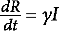

高传播率与低恢复率相结合将导致大量感染个体的出现。低传播率与高恢复率将导致人群中缓慢或逐渐消失的流行病。

然而，人群内的互动很少是随机的，正如 SIR 方程所假设的那样。动态网络提供了一种捕捉随时间互动的方法，从而可以更准确地模拟感兴趣人群中的传播模型，或者通过模拟感兴趣人群中的互动水平来更准确地规划。

## 影响传播的因素

在*第三章*中，我们考察了桥梁和中心节点对音乐趋势或流行病在网络上传播的重要性。从那时起，我们考虑了许多与中心节点和桥梁概念相关的网络中心性指标。让我们简要回顾一下这些中心性指标中的几个。

集中度可以通过几个中心性指标来评估，包括以下内容：

+   度中心性（在*第六章*中定义）

+   PageRank 中心性（在*第六章*中定义）

+   中心节点度中心性（在*第六章*中定义）

度中心性是最简单且与网络上的传播过程最相关的。一个感染顶点与其他顶点之间的连接数量会影响感染顶点将其疾病传播给其直接邻居的能力。整个网络中度中心性的组合会影响疾病在全球范围内传播的整体能力。具有非常低度中心性的稀疏网络不会为疾病同时感染许多个体提供机会，导致公共卫生工作者可以有效地实施隔离和接触追踪等策略，而不会在特定时间点被大量感染者所淹没。

然而，具有非常高的度中心性的网络可能包括许多中心或单个大型中心。一个大型中心允许一个感染个体将疾病传播给许多人，这些人也有许多可能被感染的接触者。这意味着在流行病初期，公共卫生资源很容易被压垮，在许多人被感染之前控制这种流行病的可能性相当低。我们在许多全球城市在 COVID-19 期间看到了这一点，全城关闭成为避免压垮医疗系统的必要措施；农村地区没有像大城市那样经历感染率的快速上升。

桥梁在网络流行病建模中也发挥着重要作用。如果两个大型中心没有连接，很容易将一个中心从另一个中心隔离，以阻止流行病从一个中心传播到另一个中心，因为我们只需确保在感染中心流行病结束之前，两个中心之间不建立任何桥梁。连接两个中心的桥梁为桥梁顶点/顶点成为感染源并从一个社区传播到另一个社区提供了机会。因此，桥梁为感染传播提供了机会，使其成为地区或全球问题，而不是局部社区问题。

回想一下，桥接属性可以通过**中介中心性**（在*第六章***)来衡量，它衡量的是通过一个顶点的网络最短路径的数量。本质上，这是衡量每个顶点在网络上的传播过程重要性的方法。具有高中介中心性的顶点表示，如果该顶点被感染，有很高的可能性将疾病传播到人群的其他部分。隔离或接种疫苗给具有高中介中心性的顶点可以破坏网络上的疾病传播，这些个体代表在有限资源的情况下对整体流行病严重程度产生重大影响的机会。在 COVID-19 的背景下，频繁的国际旅行者充当了国家之间的桥梁。停止从感染区域到尚未受影响地区的国际旅行允许小国，如加勒比海岛屿上的国家，避免流行病传播到其人群。

**Forman-Ricci 曲率中心性**（在*第六章*中定义）通过考虑通过一组顶点连接到其他边的边，在网络上同时考虑了桥接属性和中心属性。最近的研究表明，Forman-Ricci 曲率可以找到对传播过程重要的边和顶点，因此，它可以用作在流行病模拟中（例如，通过疫苗接种将顶点从人群中移除）的一个有效指标。

**离心率**，图中从一个顶点到另一个顶点的最大距离，是另一个常用于衡量流行病在种群水平上潜在影响的指标。网络的**半径**是网络顶点中最小的离心率值，网络的**直径**是网络顶点中最大的离心率值。密集网络比稀疏网络直径小，因为顶点往往更相互连接（允许在更短的时间内有更大的传播潜力）。

半径和直径限制了网络上的微分方程，如我们的 SIR 模型，的行为。虽然理论证明超出了本书的范围，但我们将通过下一节中两个野生动物流行病数据集的真实世界模拟来实际探索半径和直径。让我们从探索我们的数据集开始。

# 进化中的野生动物相互作用数据集示例

我们收集了两个关于物种内野生动物相互作用（涉及同一物种动物的相互作用）的短期数据集。

第一个数据集包括在冷锋经过该地区后，在南佛罗里达湾每隔 15 分钟观察到的 4 只鳄鱼在 12 个时间段内的观察。鳄鱼之间的社会相互作用被定义为在单个 15 分钟内相互作用的动物。每 15 分钟记录一次连接，从而在 12 个时间段内形成鳄鱼社会相互作用的动态网络。

第二个数据集包括在南佛罗里达湾的迁徙鱼饵球中，7 只蓝鹭在 10 个时间段内每隔 5 分钟进行观察的相互作用。蓝鹭之间的相互作用被定义为占据同一立方米空间内的蓝鹭。每 5 分钟记录一次连接，从而在 10 个时间段内形成蓝鹭社会相互作用的动态网络。最初，种群被分为两个筑巢社区，一个社区有 2 只蓝鹭，另一个社区有 5 只蓝鹭。

让我们从检查`Crocodile` `Network`数据集上的流行病动力学和中心性指标开始。

## 鳄鱼网络

我们首先考虑我们的鳄鱼网络，其中 4 只鳄鱼在 3 小时内进行相互作用。`脚本 8.2`加载相关包并创建随时间变化的初始网络集：

```py
#import packages
import networkx as nx
import dynetx as dn
from past.builtins import xrange
import matplotlib.pyplot as plt
#create a dynamic graph object
crocodile = dn.DynGraph() # empty dynamic graph
#fill in relevant interactions
crocodile.add_interaction(u="Croc1", v="Croc2",t=0)
crocodile.add_interactions_from(
    [("Croc1","Croc2"),("Croc3","Croc4")],t=1)
crocodile.add_interactions_from(
    [("Croc1","Croc2"),("Croc3","Croc4")],t=2)
crocodile.add_interactions_from([("Croc1","Croc2")],t=3)
crocodile.add_interactions_from(
    [("Croc1","Croc2"),("Croc2","Croc3")],t=4)
crocodile.add_interactions_from(
    [("Croc1","Croc2"),("Croc2","Croc3")],t=5)
crocodile.add_interactions_from([("Croc1","Croc2")],t=6)
crocodile.add_interactions_from([("Croc3","Croc4")],t=7)
crocodile.add_interactions_from([("Croc3","Croc4")],t=8)
crocodile.add_interactions_from(
    [("Croc2","Croc3"),("Croc3","Croc4")],t=9)
crocodile.add_interactions_from([("Croc2","Croc3")],t=10)
crocodile.add_interactions_from(
    [("Croc1","Croc2"),("Croc2","Croc3")],t=11)
#plot time slices
for i in range(12):
    g1 = crocodile.time_slice(i)
    nx.draw(g1,with_labels=True)
    plt.show()
```

*图 8**.5*显示了第二个时间点图，其中两组鳄鱼与另一只鳄鱼进行了相互作用：

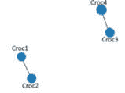

图 8.5 – 鳄鱼网络的第二个时间段图

我们可以通过向`脚本 8.2`中添加内容来跟踪鳄鱼相互作用随时间的变化：

```py
for i in crocodile.stream_interactions():
    print(i)
```

这在它们发生的时间点产生了以下相互作用变化：

```py
('Croc1', 'Croc2', '+', 0)
('Croc3', 'Croc4', '+', 1)
('Croc2', 'Croc3', '+', 4)
('Croc1', 'Croc2', '-', 7)
('Croc3', 'Croc4', '+', 7)
('Croc2', 'Croc3', '+', 9)
('Croc3', 'Croc4', '-', 10)
('Croc1', 'Croc2', '+', 11)
('Croc2', 'Croc3', '-', 12)
```

我们可以看到，互动在观察期结束时变得更为频繁，而在观察期开始时变化缓慢。这可能会影响流行病的动态，因为在观察期后期，鳄鱼有更多样化的互动。此外，早期增加的互动为疾病在人群中传播提供了机会，因为鳄鱼开始相互互动。

让我们考虑一个以高感染率（`beta` = `0.3`）相对于恢复率（`gamma` = `0.05`）感染一只鳄鱼的流行病开始的情况。这相当于一种中等传染性疾病穿过我们的鳄鱼种群，导致较长的感染期。鳄鱼痘就是这样一种可以导致幼鳄死亡的疾病。感染动物往往会出现数周或数月的症状。细胞感染通常发生得很快，潜伏期短（几分钟）。虽然感染率和恢复率的精确参数尚不清楚，但这些估计是感染的良好代理。让我们在`Script 8.2`中添加代码来模拟鳄鱼种群在 12 个时间周期内的互动过程中鳄鱼痘的传播：

```py
#run epidemic model
import ndlib.models.ModelConfig as mc
%matplotlib inline
from ndlib.viz.mpl.DiffusionTrend import DiffusionTrend
import ndlib.models.dynamic as dm
#model selection
model = dm.DynSIRModel(crocodile)
#model configuration
config = mc.Configuration()
config.add_model_parameter('beta', 0.3) # infection rate
config.add_model_parameter('gamma', 0.05) # recovery rate
config.add_model_parameter("percentage_infected", 0.25)
model.set_initial_status(config)
# simulate snapshot based execution
iterations = model.execute_snapshots()
#iterations = model.execute_iterations()
trends = model.build_trends(iterations)
#visualize trends
viz = DiffusionTrend(model, trends)
viz.plot()
```

*图 8**.6* 总结了算法运行过程中我们鳄鱼样本中这种流行病的动态。鉴于这是一个概率模型，你的流行病在时间点或特定时间点感染鳄鱼的数量上可能会有所不同。该图总结了流行病每个时间点易感、感染和移除（康复）鳄鱼的数量。

在我们的试验中，这种鳄鱼痘流行病以第`0`期的单个鳄鱼感染迅速开始，并在第`5`期迅速感染整个种群，观察期结束时没有动物康复。任何新引入种群且对鳄鱼痘没有免疫力的动物很可能在进入种群后不久就会感染鳄鱼痘，并在整个观察期内保持生病。这表明需要对感染鳄鱼进行隔离，以避免野生种群中流行病的传播（可能通过在当地康复中心隔离和治疗）：

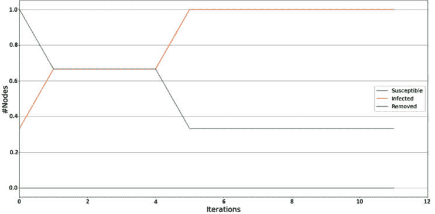

图 8.6 – 我们鳄鱼网络中鳄鱼痘的病毒动力学

我们可以通过检查关键网络指标随时间的变化来检查任何可能有助于鳄鱼痘在我们鳄鱼网络动物中传播的变化。从我们构建的动态网络中，我们可以看到在鳄鱼网络数据集的 `0`-`5` 期间人口混合的增加，到 `5` 期末期（对应于所有鳄鱼实际上都已感染的时间点），所有鳄鱼都可以相互感染。让我们向 `脚本 8.2` 添加内容，以便我们可以在每个时间点计算网络中顶点的中介中心性以及网络的总体半径和直径：

```py
#obtain network centrality statistics for crocodile network
for i in range(12):
    dg = crocodile.time_slice(i)
    try:
        # computing betweenness centrality
        dd = nx.betweenness_centrality(dg)
        plt.plot(dd.values())
        plt.title("betweenness centrality")
        print()
        plt.show()
        print ("timestamp = ", i,",", "nodes =",
            len(dg.nodes()),",",
            "max degree = ",max(dg.degree().values()))
        print ("diameter = ", nx.diameter(dg))
        print ("radius = ", nx.radius(dg))
    except:
        print('Infinite value observed.')
```

注意，当我们观察到孤立顶点时，我们观察到无限值。我们将通过在我们的脚本中添加一个 `try`/`except` 子句来跳过这些时间段的计算。输出应显示类似于 *图 8**.7* 的图表（对应于第一个时间点），显示顶点之间的中介中心性：

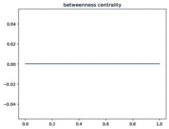

图 8.7 – 鳄鱼网络观察的第一个时间点的中介中心性图表

在每个图表下方，我们可以看到时间戳的摘要、连接顶点的数量、网络的最大度数、网络半径和网络直径（对于存在连接顶点的时间点）。*图 8**.8* 显示了观察的第一个时间点的输出，其中网络的半径和直径都是 `1`：

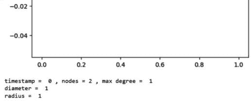

图 8.8 – 鳄鱼网络数据集中观察的第一个时间点的输出

注意，我们在动态 `Crocodile Network` 数据集中观察到的最大直径是 `2`。其中一些较大的直径发生在感染期间，此时更多的鳄鱼在相互互动（并形成新的互动）。在现实世界的流行病中，人群混合在流行病传播动力学中起着重要作用，更多的混合往往会产生更严重的流行病，涉及更多人群的病例，以及更长的流行病持续时间。

现在我们对动态网络和流行病学模型有了更多了解，让我们转向更大的 `Heron Network` 数据集，其中包含来自两个不同筑巢群体的个体在诱饵球上的互动，这更接近于涉及多个群体的真实流行病的开始。

## 鹅网络

让我们从我们的 `Heron Network` 数据集开始。`脚本 8.3` 创建了一个鹅网络并绘制了该网络中的每个时间点：

```py
#create empty graph
blue_heron = dn.DynGraph() # empty dynamic graph
#add relevant interactions
blue_heron.add_interactions_from(
    [("h1","h2"),("h2","h3"),("h3","h4"),("h4","h5")],t=0)
blue_heron.add_interactions_from(
    [("h1","h2"),("h2","h3"),("h3","h4"),("h5","h6")],t=1)
blue_heron.add_interactions_from(
    [("h1","h2"),("h2","h3"),("h5","h6"),("h6","h7")],t=2)
blue_heron.add_interactions_from(
    [("h1","h2"),("h3","h4"),("h6","h7")],t=3)
blue_heron.add_interactions_from(
    [("h2","h3"),("h3","h4"),("h4","h5"),("h6","h7")],t=4)
blue_heron.add_interactions_from([("h3","h4")],t=5)
blue_heron.add_interactions_from(
    [("h1","h2"),("h2","h3"),("h3","h4"),("h4","h5"),
        ("h5","h6")],t=6)
blue_heron.add_interactions_from(
    [("h1","h2"),("h2","h3"),("h3","h4"),("h4","h5"),
        ("h5","h6"),("h6","h7")], t=7)
blue_heron.add_interactions_from(
    [("h1","h2"),("h2","h3"),("h3","h4"),("h5","h6"),
        ("h6","h7")],t=8)
blue_heron.add_interactions_from(
    [("h1","h2"),("h3","h4"),("h5","h6"),("h6","h7")],t=9)
#plot network over time
for i in range(10):
    g1 = blue_heron.time_slice(i)
    nx.draw(g1,with_labels=True)
    print()
    plt.show()
```

*图 8**.9* 显示了我们鹅网络中的第一个时间点，其中来自一个筑巢社区的五个鹅在我们的诱饵球上相互互动：

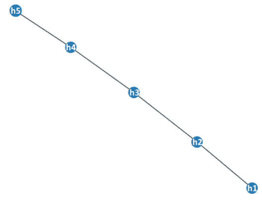

图 8.9 – 我们鹅网络的第一个时间点图表

注意，我们的白鹭网络在观察期间显示出许多不同的交互模式。这会影响我们的病毒动力学，因为不同的动物在不同的时间周期进行交互。让我们考虑一种传播迅速（`beta` = `0.4`）且解决较慢（`gamma` = `0.2`）的传染性疾病。禽流感疫情往往传播迅速，这些参数可能代表一种通过人群的新型禽流感变种。在真实的禽流感疫情中，较长的潜伏期意味着我们需要观察种群超过 50 分钟（可能是在几天的时间里）。然而，让我们看看我们通过向`Script 8.3`添加交互来提出的流行病是如何在我们白鹭种群中传播的：

```py
#run epidemic model
import ndlib.models.ModelConfig as mc
%matplotlib inline
from ndlib.viz.mpl.DiffusionTrend import DiffusionTrend
#from ndlib.viz.mpl.DiffusionPrevalence import DiffusionPrevalence
import ndlib.models.dynamic as dm
# model selection
model = dm.DynSIRModel(blue_heron)
# model configuration
config = mc.Configuration()
config.add_model_parameter('beta', 0.4) # infection rate
config.add_model_parameter('gamma', 0.2) # recovery rate
config.add_model_parameter("percentage_infected", 0.1)
model.set_initial_status(config)
# simulate snapshot based execution
iterations = model.execute_snapshots()
#iterations = model.execute_iterations()
trends = model.build_trends(iterations)
#visualize trends
viz = DiffusionTrend(model, trends)
viz.plot()
```

这个模拟显示，到观察期结束时，近一半的白鹭种群被感染，感染和恢复水平在第二个时间点较低。新的感染定期发生，有一只白鹭似乎比预期的感染期更长（周期 4–7）。*图 8.10*可视化了这个流行病的动态（由于感染模型是概率性的，所以你的运行结果可能会有所不同）：

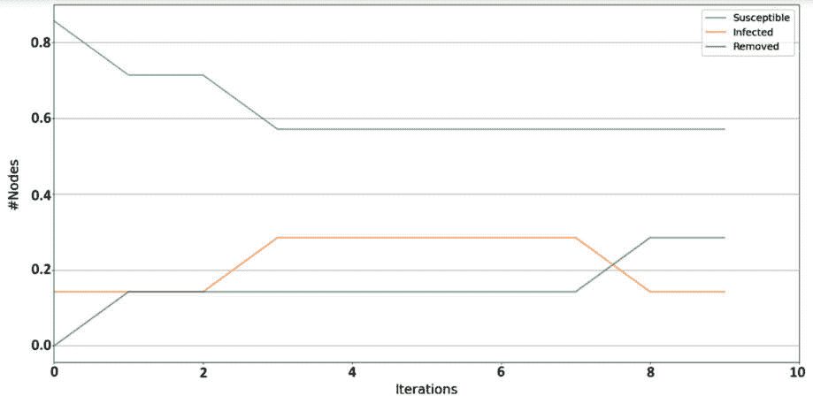

图 8.10 – 我们白鹭网络中流行病的可视化

如果这种流行病发生在白鹭的真实种群中，可能可以对表现出长期感染期的感染白鹭进行隔离，以避免在种群中进一步传播。在野生动物保护区或康复中心等受保护的种群以及为人类消费而培育的种群中，这种策略是常见的，以避免疾病在动物之间传播。在野外，很难识别感染动物，甚至直到许多动物在监测区域生病，才能检测到爆发。

现在我们通过向`Script 8.3`添加内容来考虑流行病过程中的网络度量，再次添加一个`try`/`except`子句，因为在观察期间有时白鹭会被隔离：

```py
#obtain network centrality statistics for the blue heron network
for i in range(10):
    dg = blue_heron.time_slice(i)
    try:
        # computing betweenness centrality
        dd = nx.betweenness_centrality(dg)
        plt.plot(dd.values())
        plt.title("betweenness centrality")
        print()
        plt.show()
        print ("timestamp = ", i,",", "nodes =",
            len(dg.nodes()),",",
            "max degree = ",max(dg.degree().values()))
        print ("diameter = ", nx.diameter(dg))
        print ("radius = ", nx.radius(dg))
    except:
        print('Infinite value observed.')
```

在第一个观察期，我们得到一个介于度中心性图之间，值变化很大，如图*图 8.11*所示：

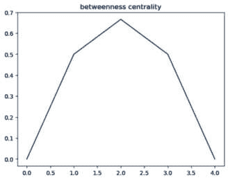

图 8.11 – 我们白鹭网络中时间周期 1 的介于度中心性图

介于度中心性在整个观察期间变化很大，从几乎`1`到`0`。直径从`1`（时间点`6`）到`6`（时间点`8`）；半径从`1`（时间点`6`）到`3`（时间点`7`和`8`）。孤立顶点很常见，我们看到种群在交互中分裂（时间点`3`和`9`），其中一些白鹭在不同的地点交互，而一些则完全不交互。*图 8.12*显示了分裂的白鹭种群示例：

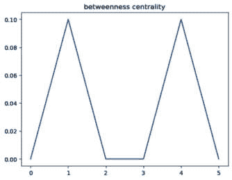

图 8.12 – 在点 3 观察到的分叉苍鹭种群相互作用模式

交互模式的频繁变化可能限制了这种流行病的潜在传播，因为动物的交互频率足够低，持续时间足够短，相对于鳄鱼群体中记录的频繁和持久的交互，限制了接触传染个体的机会。在野外，同一物种动物之间交互的频率和持续时间在确定共享同一地理区域的物种中种群流行病的可能性方面起着关键作用。独居物种往往比形成大型 herd 或 flock 的物种传播传染病的速度要低。

自然现象，如诱饵球或暴风雨后的临时水源，为疾病在独居物种或孤立群体中传播提供了时间有限的相互作用机会。因此，它们为保护主义者提供了一个机会，研究那些除了涉及所需资源（如食物或水）的一次性事件外，可能不会频繁互动的动物群体中的流行病潜力。我们检查过的模型为我们提供了估计传染病对通常孤立但在这些事件中混合的群体影响的工具。

# 摘要

在本章中，我们探讨了动态网络以及随着时间的推移网络结构的变化如何影响流行病的传播，通过鳄鱼和蓝鹭种群中疾病传播的例子进行了探讨。我们还探讨了网络指标与流行病传播之间的关系，指出与更高传播率和假设群体中更严重流行病相关的连通性模式。这些工具对于理解现实世界网络中的趋势和流行病传播至关重要，使研究人员能够规划关键基础设施以应对人类群体中如 COVID-19 或埃博拉等危机，威胁濒危动物群体的传染病，国家选举前的虚假新闻，或社交媒体上青少年中传播的危险行为趋势。

在下一章中，我们将重点转向网络上的**机器学习**（**ML**）。

# 参考文献

Bianconi, G., Darst, R. K., Iacovacci, J., & Fortunato, S. (2014). 三角闭合作为复杂网络中社区基本生成机制的论文。*物理评论 E,* *90(4), 042806.*

Büttner, K., Krieter, J., Traulsen, A., & Traulsen, I. (2016). 动物贸易网络中的流行病传播 – 基于距离和网络的控制措施比较。*跨界和新兴疾病,* *63(1), e122-e134.*

Fèvre, E. M., Bronsvoort, B. M. D. C., Hamilton, K. A., & Cleaveland, S. (2006). 动物迁徙与传染病传播。*微生物学趋势,* *14(3), 125-131.*

Ganesh，A.，Massoulié，L.，& Towsley，D. (2005 年 3 月)。网络拓扑对流行病传播的影响。*IEEE 计算机和通信学会第 24 届年度联合会议论文集。* (第 2 卷，第 1455-1466 页)。IEEE。

Garin，F.，Varagnolo，D.，& Johansson，K. H. (2012)。匿名网络中直径、半径和离心率的分布式估计。*IFAC 会议论文集，* 45(26), 13-18.*

Giuggioli，L.，Pérez-Becker，S.，& Sanders，D. P. (2013)。重叠域中的相遇时间：应用于领土动物种群中的流行病传播。*物理评论快报，* 110(5), 058103.*

刘，C.，& 张，Z. K. (2014). 动态社交网络中的信息传播。*非线性科学和数值模拟通讯，* 19(4), 896-904.*

洛，T.，唐，J.，霍普克罗夫特，J.，方，Z.，& 丁，X. (2013)。在社交网络中学习预测互惠和三角闭合。*ACM 知识发现数据（TKDD），* 7(2), 1-25.*

Martcheva，M. (2014)。禽流感：建模及其控制意义。*生物系统杂志，* 22(01), 151-175.*

*Milli，L. (2018)。理解复杂网络中的传播和演化。*

Moore，R. L.，Isberg，S. R.，Shilton，C. M.，& Milic，N. L. (2017)。痘病毒病变对咸水鳄（Crocodylus porosus）皮肤的影响。*兽医微生物学，* 211, 29-35.*

Read，J. M.，Eames，K. T.，& Edmunds，W. J. (2008)。动态社交网络及其对传染病传播的影响。*皇家学会接口杂志，* 5(26), 1001-1007.*

Sarker S，Isberg SR，Moran JL，Araujo R，Elliott N，Melville L，Beddoe T，Helbig KJ。鳄鱼痘病毒进化基因组学支持观察到的痘病毒在咸水鳄（Crocodylus porosus）上的感染动力学。*病毒。2019 年 12 月 2 日；11(12):1116。DOI：10.3390/v11121116。PMID：31810339；*PMCID：PMC6950651。

Sekara，V.，Stopczynski，A.，& Lehmann，S. (2016). 动态社交网络的基本结构。*美国国家科学院院刊，* 113(36), 9977-9982.*

Stewart，J. D.，Barroso，A.，Butler，R. H.，& Munns，R. J. (2018)。在表面被捕获。*生态学，* 99(8), 1894-1896.*

van Dam，E. R.，& Kooij，R. E. (2007)。具有给定直径的图的极小谱半径。*线性代数及其应用，* 423(2-3), 408-419.*

王毅，曹，阿洛菲，阿卜杜拉，A. M.，& 埃莱伊，A. (2015). 复杂网络中节点相关性下的 SIR 模型的重新审视。*物理 A：统计力学及其应用，* 437, 75-88.*
