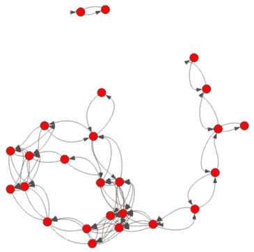
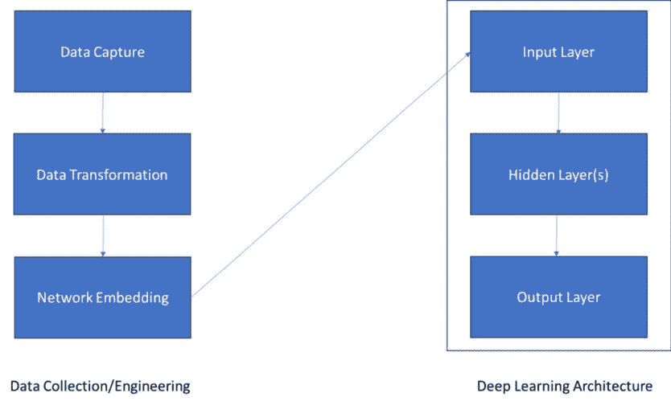

# 9

# 网络机器学习

在本章中，我们将考虑在关系数据上通常使用的**机器学习**（**ML**）模型及其在网络科学中的应用。虽然许多特定于网络的工具提供了对网络结构和网络内传播预测的良好见解，但机器学习工具使我们能够利用关于网络中个体的额外信息，构建一个更全面的关系、传播过程和与网络或其个体相关的关键结果视图。我们将考虑友谊网络以及与个人及其与其他个人的联系相关的元数据，以探索网络上的机器学习。

我们首先将回到基于共享活动和个体特征的网络构建，然后转向基于网络和元数据特征的聚类，最后根据网络及其元数据预测个体和友谊网络的结果。您将学习如何将网络度量与元数据相结合，以及如何使用网络数据构建几种类型的机器学习模型，这些模型将在本书剩余章节中构建。让我们深入探讨一些友谊网络及其元数据。

具体来说，本章将涵盖以下主题：

+   友谊网络和友谊关系数据集简介

+   网络上的机器学习

+   网络上的 SDL

# 技术要求

本章中展示的实用示例代码可以在以下位置找到：[`github.com/PacktPublishing/Modern-Graph-Theory-Algorithms-with-Python`](https://github.com/PacktPublishing/Modern-Graph-Theory-Algorithms-with-Python)

# 友谊网络和友谊关系数据集简介

在本节中，我们将考虑基于学生行为因素的友谊网络，以形成一个网络。然后，我们将应用**无监督学习**（**UL**）方法，即聚类，将个体分组到友谊群体中，以比较添加额外网络结构信息前后的性能。

## 友谊网络简介

让我们考虑一个以年龄和地理为基础的小学校的学生群体，这在美国很常见。同学可能参加相同的课外活动，如运动队、校报或管弦乐队。他们也可能一起学习、共享餐食或在周末聚在一起。有些人可能形成一个核心的友谊群体，他们上一些相同的课程，参加相同的课外活动，一起学习，并在与学校相关活动之外一起闲逛。这种强大的社会联系通常是一个重要的社会支持和社会关系的来源。这些往往对个人的生活决策和结果非常重要，尤其是在青春期和成年早期，同龄人在心理社会发展中扮演着重要角色。

其他朋友群体可能只一起学习或同一个团队打球，共享的其他兴趣或互动很少。这种弱社会联系在社会中也发挥着重要作用，将个人与社区内广泛的各种资源联系起来，使年轻人接触到更广泛的各种观点和新思想。社会变革通常来自不同社区之间的弱联系，例如在同一个体育队伍中打球、在学校共享课程以及参与宗教活动。虽然弱社会联系通常不会提供强大的社会支持，但它们在网络中起着桥梁作用，可以将个人介绍给将成为强社会联系的其他人。

在我们的第一个友谊网络中，我们将考虑弱社会联系和强社会联系。强社会联系主要发生在由七个朋友组成的群体中，他们大多数时间都在同一个团队打球，上一些相同的课程，一起学习，并在上学前和周末进行体育活动：


图 9.1 – 一群男孩在上学前打篮球的插图

*图 9**.1* 展示了三个强社会联系男孩在上学前打篮球。我们预计想法、行为和传染性疾病会迅速通过这一部分网络传播，因为这个群体大部分时间都在一起。

相比之下，网络中的弱社会联系包括偶尔的互动，可能包括核心课程或一个共同兴趣将个人聚集在一起短暂的时间，这样他们可以互相认识，并且可能对同学有所了解，但可能不太了解其他学生的兴趣、家庭生活或抱负：


图 9.2 – 同一课堂中的学生在课程期间可能不会互动的插图

*图 9**.2* 展示了同一课堂中的学生，他们可能不会在那个单一的课程之外互动。这种弱社会联系使学生接触到不同的想法、不同的兴趣、季节性流感等，但对个人的影响不如对整个个体群体的影响大。

在本章中，我们将通过在学生人口统计数据和网络指标以及与学生人口统计数据相关的元数据上使用 UL 算法来推断可能共享强社会联系的学生群体。我们还将通过使用 GNN 的**监督学习**（**SL**）来分析随机生成的网络中的社会网络风险，以了解不同类型网络的不同流行病风险。在深入分析之前，让我们先探索一下我们的初始数据集。

## 友谊人口统计和学校因素数据集

在本章中，我们将主要使用一个包含关于 25 名学生信息的数据集，这些学生通过许多不同的生活方式因素相互连接：团队会员资格、休闲锻炼、周末体育活动、游戏出席率和家庭作业学习小组会员资格。人口统计和社会经济因素，以及课程分配，也通过四门选修课程的注册、性别、居住区的邻里和之前在两所当地初中之一就读的经历将学生联系起来。

这个数据集是从 Farrelly 在大学一年级的一个月日记中提取的。Farrelly 本人是编号*#7*的个体。为了创建一个加权网络，我们将计算学生之间因子的连接总和。这将给出一个近似值，表明哪些学生彼此之间联系最紧密。我们首先将探索聚类以辨别友谊群体。

在我们转向同时基于元数据和网络指标进行聚类之前，让我们看看如何仅根据元数据来聚类这个网络。

# 网络上的机器学习

现在我们已经对友谊数据进行了探索，让我们看看聚类算法的性能如何根据是否包含关于网络的结构信息而变化。我们将首先考虑仅学生因素。

## 基于学生因素的聚类

在我们第一次尝试聚类时，我们将关注数据集本身，该数据集包含有关学生人口统计和社会活动的元数据。最简单的聚类算法之一是*k-means 聚类*，它通过迭代地划分数据以最小化簇内方差并最大化簇间方差。这意味着聚在一起的学生的共同点比与其他簇中的学生更多。k-means 聚类是一个简单的算法，在大多数情况下都表现良好。然而，需要指定期望的簇数，这通常在事先并不知道。我们将使用`3`个簇的大小并评估模型拟合度；此外，我们将重新启动算法五次，以确保无论算法的起始点如何以及随机误差如何，我们都能得到一个最优的三簇解决方案。

重要提示

如果你使用的是 Windows 机器，你可能会收到一个不影响结果的警告；`scikit-learn`上的一些包没有考虑到新的 Windows 操作系统。操作系统的最新版本和包依赖关系的更新往往会触发这些警告。

让我们用`Script 9.1`深入探讨 k-means 聚类代码：

```py
#import packages needed
import pandas as pd
from sklearn.cluster import KMeans
import igraph as ig
from igraph import Graph
import numpy as np
import os
#import file
File ="<YourPath>/Friendship_Factors.csv"
pwd = os.getcwd()
os.chdir(os.path.dirname(File))
mydata =
    pd.read_csv(os.path.basename(File),encoding='latin1')
#k-means model
X=mydata[mydata.columns.drop('Individual ID')]
km=KMeans(n_clusters=3,init='random',n_init=5)
km_model=km.fit_predict(X)
#explore k-means model
km_model
#add to dataset as first solution
km_1=np.array(km_model)+1
mydata['km_1']=km_1
```

聚类结果建议三聚类解决方案是一个很好的拟合。一个聚类组（**#0**）包括个体`1`-`7`和个体`10`；这个组主要一起做作业，参加比赛，周末一起锻炼，并在同一个团队中玩耍。聚类**#0**的特点是紧密的朋友圈，他们共享许多相同的活动，并且在一周的大部分时间里都在一起。我们会担心在这个组中开始并传播流行病。很可能，他们共享相同的保护行为，如健康饮食、定期体育锻炼和社会参与。然而，可能导致身体伤害的传染病或风险行为（尝试危险的体育动作，接受挑战…）是一个担忧，因为这种行为很可能会在整个朋友圈中传播。

另一个组（**#1**）包括个体`8`-`9`、`12`-`14`、`16`、`19`和`23`-`25`；这些个体通常共享*课程 2*，不在学校外一起锻炼或运动，不一起做作业，也不共享许多其他课程。集群**#1**的特点是缺乏与我们样本中其他人的参与和互动。这个组在保护行为和风险行为传播方面风险较低，因为他们与我们样本中的其他人没有强烈的社交联系。很可能，他们不会受到或影响他人的行为。

最后一个组（**#2**）包括个体`11`、`15`、`17`-`18`和`20`-`22`；这个组是异质的，包括没有太多共同点的队友，一些共享几门课程的个体，以及与其他人联系较少的孤立个体。总的来说，这个组对于像集群**#1**那样的流行病或行为传播风险较低；然而，他们在样本中更为活跃，可能会受到队友或与他们共享多门课程的个体的影响。

## 基于学生因素和网络指标的聚类

现在，让我们基于阈值化的皮尔逊相关系数创建一个网络，这通过在`Script 9.1`中添加内容来表示个体之间活动/课程的相似性：

```py
#create network via Pearson correlation
cor=np.corrcoef(X)
cor[cor>=0.5]=1
cor[cor<0.5]=0
X2=np.asmatrix(cor)
#create graph with self-loops removed
friends=Graph.Adjacency(X2)
edge_list=friends.get_edgelist()
self_loop=[]
for i in range(0,25):
    self=(i,i)
    self_loop.append(self)
to_remove=[]
for i in edge_list:
    for j in self_loop:
        if i==j:
            to_remove.append(i)
friends.delete_edges(to_remove)
ig.plot(friends)
```

运行这个添加到`Script 9.1`的代码，会得到如图*图 9**.3*所示的友谊网络图：



图 9.3 – 阈值化友谊数据集的网络图

*图 9**.3*显示了两个独立的组，一个由两个个体组成的小组，以及一个由组内个体之间稀疏和密集连接组成的大组。鉴于我们友谊数据集的连接模式，我们预计个体之间的度数和 PageRank 中心性会有很大的变化。让我们在`Script 9.1`中添加内容，并将我们的特征矩阵附加到重新运行我们的 k-means 分析中，包括人口统计因素和两个缩放中心性指标，以查看我们的聚类如何变化：

注意

你可能会发现关于复制对象的警告；这不会影响分析或对象。

```py
#create scaled metrics and attach to X
d=np.array(Graph.degree(friends))/10
p=np.array(Graph.pagerank(friends))*20
X['degree']=d
X['pagerank']=p
#create new k-means model with graph metrics added
km2=KMeans(n_clusters=3,init='random',n_init=5)
km_model2=km2.fit_predict(X)
#explore new k-means model
km_model2
#add to dataset as first solution
km_2=np.array(km_model2)+1
mydata['km_2']=km_2
```

与我们最初的 k-means 模型相比，我们可以看到聚类结果中的一些变化。在聚类*#0*中，个体`19`被添加（一个与初始*#0*聚类一起做作业并参加比赛的同队成员）。我们的初始聚类*#1*显示了个体`8`-`9`、`12`、`16`和`23`-`25`；个体`13`、`14`和`19`不再分配到这个聚类，但其他个体仍然保留。在剩余的聚类中，个体`13`和`14`加入了我们的初始聚类，他们似乎比初始聚类*#1*有更多的连接性，根据中心性指标更适合聚类*#2*。似乎添加网络连接性指标提高了 k-means 聚类结果，因为那些可能不共享每个活动但显示出类似群体连接的个体被重新分配到更接近他们在社交网络中位置的群体。

现在我们来看看如何使用我们在*第五章*中首次遇到的半监督聚类算法——谱聚类——来获得我们友谊网络聚类的半监督解决方案。

## 友谊网络的谱聚类

正如我们在*第五章*中看到的，谱聚类提供了一个聚类选项，可以分割邻接矩阵或距离矩阵；这可以通过 UL 或`Script 9.1`来完成，以在我们的友谊数据集上运行具有三个聚类和五个初始化（类似于我们的 k-means 运行）的无监督谱聚类，并与我们的 k-means 结果进行比较，通过向`Script 9.1`添加以下内容：

注意

再次，你可能会遇到来自 scikit-learn 的 Windows 警告，或者关于图未完全连接的警告（通过拉普拉斯矩阵评估，这会导致与完全连接网络不同的聚类方法）。这两个警告都不会影响结果。

```py
#import packages needed
from sklearn.cluster import SpectralClustering
from sklearn import metrics
#perform spectral clustering and attach to dataset
sc = SpectralClustering(3, affinity='precomputed',n_init=5)
sp_clust=sc.fit(cor)
mydata['sp']=sp_clust.labels_
sp_clust.labels_
```

与我们在前一小节中获得的 k-means 解决方案相比，这些结果有显著差异。鉴于 k-means 模型都考虑了特定的活动和课程表，而不仅仅是相关性的总结，这种差异是有意义的。谱聚类解决方案专注于网络连接性，而不是友谊数据集中包含的因素或连接性和因素的组合。在这种情况下，k-means 解决方案更符合我们的数据——尤其是第二个 k-means 解决方案，它包括网络指标和原始因素。

无监督与半监督聚类算法的选择高度特定于当前任务。对于非常大的网络，k-means 算法有很好的扩展性解决方案，并且添加良好的扩展性网络连通性度量可以改善 k-means 解决方案，而不会牺牲效率。对于涉及纯网络连通性解决方案的问题，谱聚类可能更可取，尤其是如果构建网络所使用的因素未收集或对于第三方网络是未知的。然而，谱聚类也可以接受部分标记的数据作为输入，允许 SSL 指导学习过程，考虑到已知的数据信息。

现在我们已经看到了如何将 UL 和 SSL 算法用于网络数据集，让我们将注意力转向 SL 算法，重点关注一种特别设计的**深度学习**（**DL**）算法，该算法专门用于将网络数据集作为其输入。

# 网络上的深度学习

在本节中，我们将考虑一种新的深度学习模型，称为 GNNs，它通过嵌入网络顶点、边或全局属性来处理和操作网络，以学习与单个网络、网络内的顶点属性或网络内的边属性相关的结果。本质上，深度学习架构通过演变这些嵌入的拓扑结构来找到输入数据中的关键拓扑特征，这些特征可以预测结果。这可以通过完全监督或半监督的方式进行。在这个例子中，我们将专注于 SSL，其中只有一些标签是已知的；然而，通过提供所有标签作为输入，这可以改变为 SL 设置。

在我们深入探讨 GNNs 的技术细节之前，让我们更深入地探讨它们的使用案例。对网络本身进行分类通常可以提供关于图像特征或类型、分子化合物毒性或作为药物剂的潜在用途，或给定旅行路线和人口枢纽，在感兴趣的国家的潜在流行病传播等重要问题的见解。

通常，在 GNNs 的网络嵌入步骤之前，数据如分子或图像会被转换成网络结构。在分子化合物的背景下，共享共价键的原子，例如，被表示为通过边连接的顶点。因此，每个化合物都基于该化合物的分子结构产生一个独特的网络。对于蛋白质，氨基酸可以作为顶点，共享键（如由二硫键产生的半胱氨酸桥）的氨基酸之间存在连接。

在筛选用于药物开发的潜在化合物时，我们通常想要预测该化合物是否可能具有毒性。使用已知的毒性化合物数据库和无毒性化合物数据库，我们可以开发一个 GNN，根据新化合物的分子结构以及我们关于已知或未知毒性的分子的知识，预测开发中的新化合物的毒性。这允许在动物或人体试验之前快速筛选潜在的新药毒性。

GNN 还能够根据输入网络学习顶点标签，这是本章的重点。例如，在一个犯罪或恐怖主义网络中，我们可能希望根据收集到的情报数据中关于领导者和非领导者的知识，在网络中识别潜在的领导层。情报数据中通常存在不完整的信息，从已知信息中进行学习可以帮助识别网络中未知的关键玩家，这些玩家可能难以从线人或卧底特工中识别。由于顶点预测涉及已经构建的网络，我们通常跳到 GNN 的嵌入步骤，而不是整理数据。然而，可能需要在图中添加顶点标签，以表示网络中关于领导结构已知的信息。

使用 GNN 进行边学习与顶点学习类似，通常通过使用具有关于边属性（如恐怖主义网络成员之间的通信频率或重要性，可能涉及协调恐怖袭击或在该地理区域内招募新成员）的完整或不完整信息的现有网络。在这种情况下，我们在进行 GNN 训练之前将边嵌入，而不是顶点。

现在我们已经了解了一些可以用 GNN 解决的问题，让我们更多地了解构建 GNN 所使用的架构和数学运算。

## GNN 简介

GNN 构建涉及几个关键步骤。在前一小节中，我们提到了数据转换作为可能的第一个步骤。GNN 需要一个网络或网络张量作为算法嵌入步骤的输入，因此数据必须包含网络结构化的数据以及与网络本身或感兴趣网络中的边/顶点相关的一些结果标签。可能需要一些数据工程来将图像、分子或其他数据源整理成网络结构。在前一小节中，我们概述了分子或蛋白质数据如何转换为网络结构。许多常见类型的数据都有标准的转换方法，可以将它们转换为网络数据；例如，在前几章中，我们将空间和时间序列数据转换为可用于 GNN 输入的网络结构。

当我们的数据存在于一个具有网络、边或顶点标签的网络结构中时，我们就准备好在网络、边或顶点级别嵌入相关结构了。嵌入的目标是在嵌入级别（网络、边或顶点）找到相关网络几何的低维表示。它们还可以包括其他相关信息，例如网络、边或顶点的其他属性。有时，手动创建这些嵌入是有利的，以便包含相关的网络结构和属性信息。例如，在我们的友谊网络中，我们有许多个人参与的活动数据；我们可能希望创建一个嵌入，不仅能够捕捉网络中心性指标，还能够捕捉作为网络顶点表示的个人活动参与度。在我们的 k-means 示例中，包括这两种类型的信息（网络结构和收集到的活动数据）提高了 k-means 在寻找我们假设存在的组时的性能。

Python 中的许多 GNN 包，如 PyTorch（我们将在后续部分中使用），都有函数可以总结网络在网络、边和顶点级别的属性，以在指定的维度上创建自动嵌入。我们在 GNN 训练之前如何嵌入数据对结果有很大影响，因此在构建 GNN 时考虑这一步很重要。即使使用我们将会使用的 PyTorch 等包函数，指定维度也会影响算法性能。我们不想维度太低（遗漏了与感兴趣的结果相关的关键特征），但也不希望维度太高（可能包含很多噪声）。在实践中，这个参数通常通过网格搜索进行优化。

一旦我们有了嵌入，我们就可以定义结果为目标标签。我们可能需要使用 one-hot 编码将文本标签转换为一系列二进制结果。正如其他深度学习算法可以处理多类分类问题、连续结果或其他类型的分布一样，GNN 可以适应许多感兴趣的不同结果。这种灵活性使它们非常适合建模网络分类/回归问题中的结果。

深度学习架构本身并不独特。熟悉**卷积神经网络**（**CNNs**）的读者将认识到我们将讨论的许多组件和反向拟合算法，因为它们在 GNN 的上下文中是相同的。我们从一个维度等于嵌入维度的输入层开始，并以一个维度等于我们结果类别数（对于分类问题，我们将在本章中考虑）的输出层结束。当只有输入层和输出层存在时，**神经网络**（**NNs**）近似线性回归，输入矩阵和输出向量之间存在一个学习到的映射。然而，在这些层之间，我们通常包括隐藏层，以进一步处理输入层和输出层之间的特征，如图*9**.4*所示：



图 9.4 – GNN 生命周期总结，包括数据工程和深度学习架构步骤

隐藏层细化输入层和输出层之间的拓扑映射，通常在训练过程中汇总发现的拓扑特征，以输入到下一个隐藏层。对于小型网络和小型网络样本，隐藏层的数量应该较小，以保持解的稳定性和获得良好的性能。对于大型网络或网络集，可以添加更多隐藏层以提高性能，而不会遇到解的不稳定性或拟合问题。

隐藏层通常使用一个非线性映射函数，称为**激活函数**，在输入层和连接到该特定隐藏层的输出层之间。在实践中，只有少数激活函数是常见的，包括**ReLU 函数**，对于负数或零输入值返回 0，对于正输入值返回输入值本身。

**卷积层**，也常用于隐藏层，将一个滤波函数（通常是核）应用于输入层，通过定义的核函数对其进行转换。通常，卷积层会降低矩阵或张量的维度，因此可能使用零填充以保持维度，以避免以限制给定输出维度可能层数的方式转换层。对于小型数据集，例如我们考虑的，这并不一定是问题，因为浅层网络往往是我们在有限数据量下可以训练的唯一稳定的 GNN。

构建有效架构的理论超出了本书的范围，对深度学习（DL）感兴趣但没有背景知识的读者可以通过阅读本章末尾提供的参考文献来获取这些知识。

一旦定义了架构（无论是通过专家猜测还是再次通过网格搜索来优化架构），我们必须拟合连接每一层节点以及层间节点的参数（称为 *权重*）。有许多选项可以做到这一点，并且可以定义自定义拟合算法。然而，我们将关注 PyTorch 包中我们示例中使用的两个最常见选项：**Adam 优化器**和**随机梯度下降**（**SGD**）。

*SGD* 通过探索定义在神经网络上的梯度函数，在节点之间以及层与层之间调整权重，这与梯度提升法拟合线性回归模型的方式非常相似。定义了一个 *学习率* 来控制梯度函数的探索。较大的学习率可以更快地拟合模型，但可能无法找到全局最小值或最大值。SGD 的一个缺点是算法可能会陷入局部最优，导致结果准确率低于给定输入数据、层间映射函数和输出数据所能达到的准确率。它还倾向于较慢，需要更多的算法迭代，甚至可能需要更多的处理能力来拟合模型。

*Adam 优化器* 允许节点之间具有灵活的学习率，从而加快模型拟合速度，并通过允许学习率调整到局部梯度景观来避免局部最优。Adam 还允许衰减率，进一步定制局部权重学习。自从最初的 Adam 优化器开发以来，已经发展了许多 Adam 优化器，并且很可能会有更多针对 GNN 和其他深度学习架构的开发。一个缺点是 Adam 优化器通常占用内存较多。在训练大型 GNN 时，可能更倾向于使用 SGD 以避免训练过程中的内存问题。

在实践中，很难知道哪种优化器最适合拟合定义的架构的权重，因此通常会采用网格搜索来优化这一选择。一旦选择了拟合算法，就会运行预定义的（通常通过网格搜索优化）迭代次数，或者算法会运行直到满足停止标准。Adam 优化器通常比 SGD 优化器收敛得更快，但性能可能会根据数据和架构而变化。

现在我们对 GNN 的构建块有了一些了解，让我们通过一个开源体育网络示例来探索，该网络由分配给两位不同老师的两名学生组成（这是我们感兴趣的结果）。

## 示例 GNN 对 Karate Network 数据集进行分类

对于我们的示例，我们将预测一个常见开源网络中的顶点级属性：Zachary 的`Karate Network`数据集。这个数据集由 34 个个体组成，他们通过 78 条边连接在一个空手道训练网络中，当管理员和教练之间发生冲突时，他们最终分裂成管理员和教练两派。在这个网络上的顶点分类和学习问题中的一个主要任务是预测哪些个体最终站在冲突中的哪一方（管理员或教练）。我们将通过半监督 GNN 模型方法来预测顶点标签。

我们首先将安装所需的包并导入我们的数据集。如果您还没有安装必要的包，请在运行我们的代码之前在您的机器上安装它们。我们已经在`Script 9.2`中提供了这一步骤作为选项：

```py
#install packages if you have not installed them on your machine
#!pip install dgl
#!pip install torch
#import packages
import dgl
import dgl.data
import torch
import torch.nn as nn
import torch.nn.functional as F
import itertools
from dgl.nn import SAGEConv
#import Karate Club dataset with instructor/administrator labels
dataset = dgl.data.KarateClubDataset()
num_classes = dataset.num_classes
g = dataset[0]
```

为了嵌入我们的顶点数据，我们将使用 PyTorch 的默认嵌入算法，其维度为`6`。考虑到我们网络的大小，任何位于`4`至`6`维度范围内的内容都应该能合理地工作。让我们在`Script 9.2`中添加代码以嵌入我们的顶点：

```py
#embed vertices with a dimension of 6
vert_em = nn.Embedding(g.number_of_nodes(),6)
inputs = vert_em.weight
nn.init.xavier_uniform_(inputs)
```

这段脚本应该为我们的网络中的每个顶点输出嵌入向量。现在我们已经嵌入顶点，我们可以创建我们的标签。鉴于我们希望展示半监督方法，我们将向网络提供关于六个顶点（`1`、`3`、`5`、`12`、`15`和`32`）的信息。您可以尝试调整脚本的这一部分，看看顶点数量的增减如何影响我们选择架构的性能和稳定性。让我们通过添加到`Script 9.2`来添加标签信息：

```py
#obtain labels and denote available labels for GNN learning
#(here: 1, 3, 5, 12, 15, 32)
labels = g.ndata['label']
labeled_nodes = [1, 3, 5, 12, 15, 32]
```

接下来，我们需要构建我们的 GNN 架构并定义训练参数。许多使用此数据集的 GNN 论文和教程采用非常浅的网络架构和 Adam 优化器。为了比较和展示构建 GNN 的其他选项，我们将使用两个隐藏层而不是一个（包括与 ReLU 函数耦合的卷积层），使用小型层（隐藏层分别为八个和六个节点），SGD 拟合算法（学习率为`0.01`，动量为推动算法的`0.8`，接近默认值），以及`990`次迭代。许多在线的例子使用 Adam 优化器和比我们的架构节点更多的单隐藏层，允许更少的训练迭代。然而，对于更大的网络顶点标签预测问题，更复杂的架构可能表现更好，因此我们将展示如何包含更多隐藏层以及如何使用不同于 Adam 的拟合算法。让我们通过添加到`Script 9.2`来定义我们的架构并拟合我们的权重：

```py
#build a three-layer GraphSAGE model
class GraphSAGE(nn.Module):
    def __init__(self, in_feats, h_feats1, h_feats2,
        num_classes):
        super(GraphSAGE, self).__init__()
        self.conv1 = SAGEConv(in_feats, h_feats1, 'mean')
        self.conv2 = SAGEConv(h_feats1, h_feats2, 'mean')
        self.conv3 = SAGEConv(h_feats2, num_classes,'mean')
    def forward(self, g, in_feat):
        h = self.conv1(g, in_feat)
        h = F.relu(h)
        h = self.conv2(g, h)
        h = F.relu(h)
        h = self.conv3(g, h)
        return h
#6 embedding dimensions as input,
#a hidden layers of 8 and 6 nodes, and 2 classes to output
net = GraphSAGE(6,8,6,2)
#GNN training parameters
optimizer=torch.optim.SGD(
    itertools.chain(
        net.parameters(), vert_em.parameters()),
        lr=0.01, momentum=0.8)
all_logits = []
#train GNN
for e in range(990):
    logits = net(g, inputs)
    logp = F.log_softmax(logits, 1)
    loss = F.nll_loss(logp[labeled_nodes],labels[labeled_nodes])
    optimizer.zero_grad()
    loss.backward()
    optimizer.step()
    all_logits.append(logits.detach())
    if e % 90 == 0:
        print('In epoch {}, loss: {}'.format(e, loss))
```

你应该看到损失函数（此处为逻辑回归链接函数）随着迭代次数的增加而降低，这是你的输出。典型的 GNN 架构准确率在 95%-100% 范围内。由于这个数据集较小，我们的架构较大，你的算法运行准确率可能会有很大差异。这与算法拟合步骤中的随机采样和底层梯度景观的粗糙度有关。让我们在`脚本 9.2`中添加一些内容来找到我们的准确率：

```py
#obtain accuracy statistics
pred = torch.argmax(logits, axis=1)
print('Accuracy',(pred == labels).sum().item() / len(pred))
```

我们运行该算法的准确率在此次运行中达到了 ~97%。这与其他 GNN 架构的性能相当。然而，如果你的准确率在一个或多个脚本运行中显著降低，请不要感到惊讶，因为我们没有足够大的样本量来适应这种架构。改变嵌入维度、架构和训练算法参数将影响准确率，并且鼓励感兴趣的读者修改`脚本 9.2`，以了解不同选择如何影响准确率和拟合的稳定性。

通常，GNN 分类器在较大的网络和更多的标签输入到半监督使用时工作得更好，并且表现出更好的稳定性。Zachary 拳击网络数据集足够小，因此建议使用其他方法来分类网络。然而，在大型社交网络（如社交媒体平台上的那些）或大型地理网络（如由连接城市超过 50,000 人的道路定义的美国城市网络）上学习标签将导致更稳定的 GNN 解决方案，并且可以创建一个非常深的架构。但是，为了拟合这些大型模型，我们通常需要一个云计算平台，因为大型数据集和大量迭代对笔记本电脑来说可能很难处理。

GNN 在许多不同领域的基于网络的分类问题中显示出巨大的潜力，并且它们很可能将继续发展和解决与大型网络和网络集合相关的紧迫问题。然而，云计算解决方案通常是必需的，这需要与数据以及云平台上的 Python 笔记本解决方案合作的专业知识，该平台用于存储数据和拟合 GNN。

# 摘要

在本章中，我们考虑了网络数据集上机器学习算法的几个用例。这包括通过拟合 k-means 和谱聚类在友谊网络上的 UL。我们考虑了对个人参与的活动原始数据集以及添加了网络度量以改进聚类精度的原始数据集进行 k-means 聚类。然后，我们通过一种称为 GNNs 的深度学习算法类型，在网络上和网络的集合上进行 SL 和 SSL。我们通过浅层 GNN 准确预测了 Zachary 的空手道网络数据集中个人的标签，并将结果与其他现有的网络分类问题解决方案进行了比较。在*第十章*中，我们将使用与条件概率相关的网络工具挖掘教育数据中的因果关系。

# 参考文献

Acharya, D. B., & Zhang, H. (2021). *加权图节点聚类通过 Gumbel Softmax*。arXiv 预印本 arXiv:2102.10775。

Bongini, P., Bianchini, M., & Scarselli, F. (2021)。用于药物发现的分子生成图神经网络。*神经计算*，*450，242-252。*

Fan, W., Ma, Y., Li, Q., He, Y., Zhao, E., Tang, J., & Yin, D. (2019, 五月)。图神经网络在社交推荐中的应用。*世界万维网会议(**第 417-426 页)。*

Hartigan, J. A., & Wong, M. A. (1979)。算法 AS 136：一个 k-means 聚类算法。*皇家统计学会系列 C（应用统计）*，*28(1)，100-108。*

Imambi, S., Prakash, K. B., & Kanagachidambaresan, G. R. (2021)。PyTorch。*使用 TensorFlow 进行编程：边缘计算应用解决方案*，*87-104。*

Kumar, V. (2020)。*对图神经网络的研究（博士论文，都柏林爱尔兰的 Trinity College）。*

Labonne, M. (2023)。*使用 Python 进行图神经网络实践：使用 PyTorch 构建强大的图和深度学习应用程序的技术和架构。Packt 出版社*。

Liang, F., Qian, C., Yu, W., Griffith, D., & Golmie, N. (2022)。图神经网络及其应用的综述。*无线通信和移动计算*，2022。

Mantzaris, A. V., Chiodini, D., & Ricketson, K. (2021)。利用简单的图卷积神经网络作为模拟网络中影响传播的模型。*计算社交网络*，*8，1-17。*

Min, S., Gao, Z., Peng, J., Wang, L., Qin, K., & Fang, B. (2021). STGSN—一个用于时间演变社交网络的时空图神经网络框架。*知识系统*，*214，106746.*

Ng, A., Jordan, M., & Weiss, Y. (2001)。关于谱聚类的分析和一个算法。*神经网络信息处理系统进展*，*14。*

Scarselli, F., Gori, M., Tsoi, A. C., Hagenbuchner, M., & Monfardini, G. (2008). 图神经网络模型。*IEEE 神经网络 Transactions*，*20(1)，61-80.*

Wieder, O., Kohlbacher, S., Kuenemann, M., Garon, A., Ducrot, P., Seidel, T., & Langer, T. (2020). A compact review of molecular property prediction with graph neural networks. *《药物发现今日：技术》*，*37*，1-12.

Wu, Z., Pan, S., Chen, F., Long, G., Zhang, C., & Philip, S. Y. (2020). A comprehensive survey on graph neural networks. *《IEEE 神经网络与学习系统汇刊》*，*32*(1)，4-24.

Zachary, W. W. (1977). An information flow model for conflict and fission in small groups. *《人类学研究杂志》*，*33*(4)，452-473.

Zhang, L., Xu, J., Pan, X., Ye, J., Wang, W., Liu, Y., & Wei, Q. (2023). Visual analytics of route recommendation for tourist evacuation based on graph neural network. *《科学报告》*，*13*(1)，17240.

Zhou, J., Cui, G., Hu, S., Zhang, Z., Yang, C., Liu, Z., ... & Sun, M. (2020). *《图神经网络：方法与应用综述》*，*AI open*，*1*，57-81.
