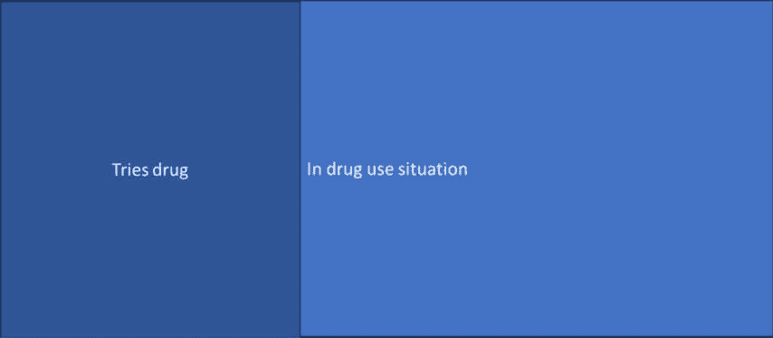
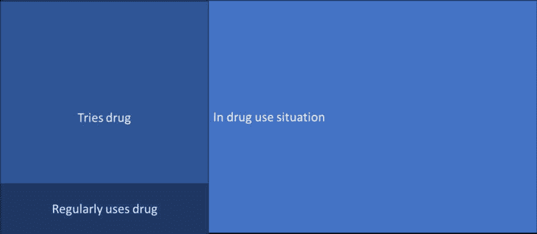
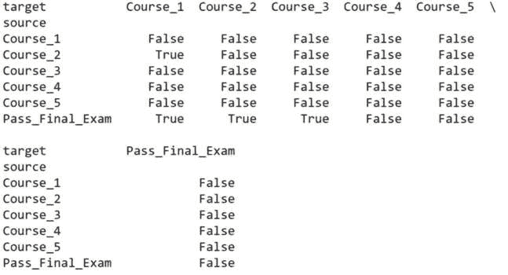
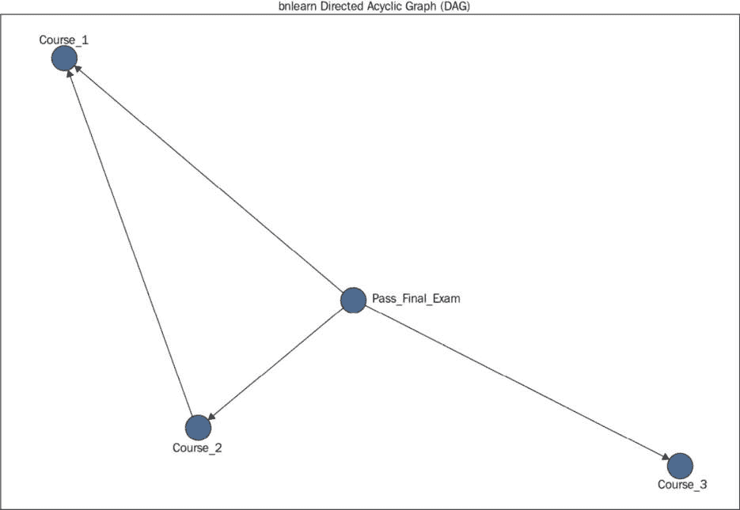
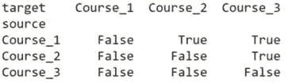
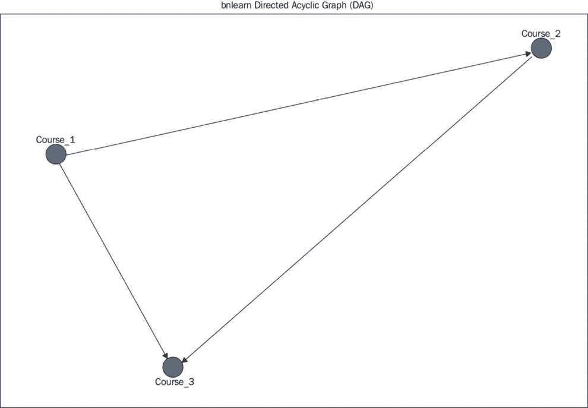
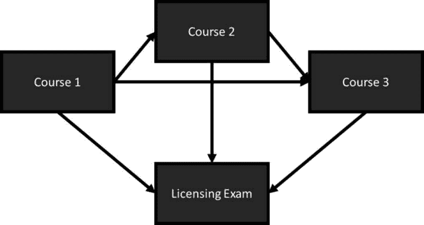

# 路径挖掘

在本章中，我们将探讨路径挖掘，我们将使用网络科学和推理算法来揭示存在于顺序数据中的路径。在医学领域，疾病进展通常遵循从一种疾病状态到另一种疾病状态的路径，在教育领域，课程材料通常建立在学位课程（如法律或医学）中的先前课程材料之上，这两种领域的结果路径都很常见。我们将考虑一个模拟的医学课程示例，以了解哪些课程可能需要额外的支持，以确保学生在假设的医学院中取得成功或失败。我们将探讨教育背景下的路径挖掘，但现实世界中的许多问题都涉及路径。让我们更深入地探讨一些这些场景。

到本章结束时，您将了解如何识别涉及达到感兴趣结果路径的问题，将高级推理算法应用于在数据集中找到可能的路径，并解释结果以在路径的关键点进行干预，以达到给定的感兴趣结果。我们将探讨教育背景下的路径挖掘，但现实世界中的许多问题都涉及路径。让我们更深入地探讨一些这些场景。

具体来说，本章我们将涵盖以下主题：

+   贝叶斯网络和因果路径简介

+   教育路径示例

+   分析课程顺序以找到最佳学生毕业路径

# 技术要求

您需要 Jupyter Notebook 来运行本章中的实践示例。

本章的代码可在以下链接找到：[`github.com/PacktPublishing/Modern-Graph-Theory-Algorithms-with-Python`](https://github.com/PacktPublishing/Modern-Graph-Theory-Algorithms-with-Python)

# 贝叶斯网络和因果路径简介

许多跨行业的感兴趣的结果都涉及一系列事件或选择，以达到感兴趣的结果。包裹的到达取决于在运输和到达之间每个中继点的包裹安全到达。机械故障可能涉及**单点故障**（**SPOFs**）或故障级联，其中在机械本身故障之前，机器的多个部分会先发生故障。

考虑药物成瘾的路径。首先，一个人必须处于药物使用的情况中——通过朋友、通过家庭或通过一个新的社交群体。然后，这个人必须尝试一种成瘾性物质。接着，他们必须足够喜欢这种物质，以至于频繁使用，达到对药物产生身体或心理依赖的程度。*图 10.1*以图表形式展示了这一系列步骤：


图 10.1 – 导致药物成瘾的事件连续发展过程

*图 10**.1*看起来很像一个有向网络，其中每个情况是一个顶点，每个途径中的每一步是一个有向边。每个代表进展步骤的边可能被从一个顶点到下一个顶点的进展概率加权。让我们考虑一个处于尝试新型毒品高风险的青少年群体，以及研究人员收集的关于每个使用阶段的群体横断面数据，以确定每个步骤的风险。假设所有青少年都处于他们可以尝试毒品的情况中，但实际上只有 30%的人尝试了。尝试毒品的人中，只有 20%的人喜欢它并继续使用。然而，继续使用的人中，有 40%会依赖毒品。*图 10**.2*总结了这些信息：


Figure 10.2 – A pathway to drug addiction with probability of transition at each step in the pathway

*图 10**.2*显示了随着毒品使用进展到不同使用阶段，概率链。我们可以通过乘以给定阶段之前每一步的转换概率来找到达到每个阶段的概率。例如，在这个群体中，定期使用涉及尝试毒品（有 30%的可能性这样做）和开始定期使用（有 20%的可能性这样做）；这给出了 6%的可能性（0.3 乘以 0.2），即这个群体中的青少年定期使用这种新毒品。鉴于 40%的这些定期使用新毒品的青少年最终会对其产生依赖，我们预计在这个群体中的任何青少年在他们的环境有利于尝试毒品的情况下，对新毒品的依赖性进展的概率为 2.4%。

数学为我们提供了一种正式的方式来研究这些途径或从一组数据中构建它们。让我们转向我们需要用来形式化事件序列中概率直觉的数学工具。

## 贝叶斯定理

依赖于其他事件的事件的概率称为**条件概率**。在概率论中，条件概率是在另一个事件已经发生的情况下，事件发生的概率的度量。在*图 10**.2*中，药物依赖的进展依赖于定期使用新毒品，这又依赖于第一次尝试毒品，这又依赖于处于人们使用毒品的情况中。虽然条件概率不需要涉及这么多条件步骤，但它确实涉及一个先前的、影响感兴趣事件发生概率的事件。

回到我们*图 10**.2*中的例子，我们有一个宇宙，其中青少年接触到了毒品使用，在*图 10**.3*中以矩形表示：


Figure 10.3 – A universe in which drug use is possible

*图 10.3* 展示了一个对我们青少年群体来说概率为 100% 的事件；他们中的所有人都在家、学校或与朋友在一起时接触到了这种新药。然而，在新的、远小的宇宙（如 *图 10.4* 所示）中，尝试新药的事件只发生了 30%：



图 10.4 – 在我们最初接触药物使用的宇宙中尝试药物的新宇宙

*图 10.4* 展示了一个新宇宙，其中一部分青少年尝试了新药。在这些青少年中，20% 会定期使用该药物。这创造了一个新的宇宙，如 *图 10.5* 所示：



图 10.5 – 包含经常使用新药的青少年的较小宇宙

*图 10.5* 展示了一个与最初所有可能尝试这种新药的青少年群体相比非常小的青少年宇宙（正如我们所预期的那样，因为在这个群体中只有 6% 的青少年最终会定期使用这种新药）。在那些经常使用新药的青少年中，我们可以再次将 *图 10.5* 中所示的宇宙分割，以获得成为药物依赖的青少年的集合。我们不会可视化这个宇宙，因为它太小，无法在常规药物使用的狭小矩形框内很好地可视化。

**贝叶斯定理**提供了一个公式，通过将先前事件的概率与感兴趣的事件相关联来计算条件概率。我们可以通过以下公式计算事件 *A* 在事件 *B* 发生的条件下的概率：

`P(A|B)=(P(A)*P(B|A))/P(B)`

在这里，*P(A|B)* 是在事件 *B* 发生的条件下事件 *A* 发生的概率，*P(A)* 是事件 *A* 发生的概率，*P(B|A)* 是在事件 *A* 发生的条件下事件 *B* 发生的概率，而 *P(B)* 是事件 *B* 发生的概率。

为了使这个例子更加具体，让我们回到我们的药物使用例子。我们将事件 *A* 定义为尝试新药，事件 *B* 定义为出现在使用该药物的地方。事件 *B* 的概率是 100%，同样，在事件 *A* 发生的条件下，事件 *B* 的概率也是 100%。事件 *A* 的概率是 30%。让我们将这些值代入我们的公式中：

`P(A|B)=(0.3*1)/1`

这给我们带来了预期的 30%。然而，在概率论中，并非所有事件都有 100% 的概率，并且随着条件事件的增加，许多计算将变得更加复杂。在现实世界的数据中，我们可能需要使用算法来估计这些概率，前提是我们已经收集了数据。让我们继续到事件链，例如我们的药物使用例子。

## 因果途径

条件概率可能涉及超过两个感兴趣的事件及其条件关系。**因果路径**涉及一系列条件概率，这些概率可能相对较短，例如我们的药物依赖示例，或者非常非常长且复杂，例如导致疾病风险的蛋白质激活路径。

多亏了贝叶斯定理，我们可以以分段的方式将条件概率链式连接起来，直到所有条件概率都链接到一个最终路径。这对于估计已知因果路径的效果大小和进展速率非常有效。然而，很多时候，我们不知道导致感兴趣的结果的确切事件序列，只是收集了大量我们认为与结果相关的数据。为了分析这些数据，我们需要一个算法。幸运的是，这样的算法确实存在。让我们深入了解贝叶斯网络及其在因果路径挖掘中的应用。

## 贝叶斯网络

一个**贝叶斯网络**描绘了一组变量及其条件概率，作为一个**有向无环图**（**DAG**）。没有通过边连接的顶点是条件独立的（不相互依赖）。通过边连接的顶点是条件依赖的。

**概率的链式法则**允许我们将贝叶斯网络构建为条件概率的乘积。考虑事件 *A*、*B* 和 *C*。回到我们的药物使用示例，事件 *A* 可能是常规使用，事件 *B* 是尝试药物，而事件 *C* 可能是与药物相关。因此，我们的因果链如下：

`P(A,B,C)=P(A|B,C)*P(B|C)*P(C)`

*P(A, B, C)* 指的是所有事件发生的概率。*P(A|B, C)* 指的是在 *B* 和 *C* 发生的情况下 A 发生的概率。*P(B|C)* 是在 *C* 发生的情况下 *B* 发生的概率。因为这些事件通常是从数据中推断出来的，我们需要使用算法来估计联合概率分布 *P(A,B,C)*。通常，这是通过计算基于数据的条件期望值来完成的。然后，算法通过最大化完全似然来最大化期望值，假设计算出的期望值是正确的。然后，根据上一步计算出的似然值再次调整值。一旦期望值和似然值收敛，算法就会停止。

现在我们已经了解了贝叶斯网络的基础知识，让我们转向一个教育数据示例，其中包含因果路径和贝叶斯网络可以学习的数据集。

# 教育路径示例

贝叶斯概率和网络的一个常见用途是在教育研究中。课程排序涉及建立先前的知识，而基于先前知识选择课程的学生必须首先获得这些先前的知识，才能在当前课程中取得成功。先修课程允许教授要求学生在他们的课程之前先修某些课程。进入大学以及随后进入研究生项目都是基于在先前教育水平成功完成考试的条件。因此，教育是一个自然产生贝叶斯网络的领域。让我们深入一个例子。

## 教育成果

教育中的许多成果都是学生长期学习课程序列的最终结果。例如，在南非和美国，一个希望从事法律工作的学生必须学习许多课程，并通过最后的考试，才能独立执业。通过考试依赖于课程作业的先前成功以及实习和其他实际法律活动中获得的经验。大多数医学学位都遵循类似的教育方法，结合课程作业、实践经验以及最终考试，最终达到该领域的专业地位。

理解这些路径中的关键里程碑和转折点确保尽可能多的学生通过最终考试以获得他们的执照。然而，存在许多课程，并非所有学生在整个教育过程中都学习相同的课程。医学学生可能专注于与他们感兴趣的医学亚专业最相关的课程。法学学生可能在不同的法律实践分支实习，以了解他们可能喜欢从事哪种类型的法律。因此，数据通常是 incomplete；加上项目规模小，这创造了一个困难的数据挖掘场景。

## 课程序列

在专业教育中的一个主要注意事项是课程依赖性。例如，在开始病理学课程之前，医学学生通常完成人体解剖学。你可能会预期病理学的成功至少部分依赖于人体解剖学的成功。然而，病理学的成功可能并不依赖于人体遗传学课程的成功。也可能的情况是，这三门课程的成功并不影响最终考试结果（不太可能，但有可能）。

为了使问题更加复杂，课程中的某些模块可能比其他模块与学生成果更相关。因此，即使是课程层面的分析也可能不足以精确指出学生成功或失败通常源于何处。当查看这类现实世界问题时，考虑路径被审查的分析水平是很重要的。

## 成功的前因

收集与学生成功相关的数据时，通常有两种方法。一种方法是无假设的方法，不对哪些课程或模块与结果关系最密切做出假设。这种方法的优势在于确保收集所有可能的数据，以便发现任何现有的关系。然而，收集的课程/模块数据量可能与样本量相对较大，导致算法性能下降。

另一种方法是在收集数据之前对感兴趣的路径有先验知识。这种方法限制了收集的数据量，允许算法在足够大的样本量上运行以获得良好的性能；然而，如果猜测错误，结果不会反映系统中实际存在的真实路径。

随着我们模拟数据，我们将采用先验知识方法生成一个小数据集，以展示贝叶斯网络如何在数据集中找到路径。让我们深入数据集模拟，看看贝叶斯网络的实际应用。

# 分析课程顺序以找到最佳学生毕业路径

在这个例子中，我们将处理一个代表医学课程的数据集，以理解完成医学学位的路径。在真实的医学课程中，我们可能会包括所有课程以及可能的其他因素，例如毕业所需的临床经验和研究项目。然而，为了运行一个简单的例子，我们假设数据挖掘已经完成，以确定与毕业结果相关的课程。

## 数据集简介

让我们想象一个有许多课程最终导致最终执照考试的医学课程。一些课程在最终执照考试中并不是特别强调（但在进入该领域之前仍然很重要）。然而，有一小部分课程会定期出现在执照考试中，其中一些课程建立在先前重要的执照课程之上。让我们假设人体解剖学、细胞生物学、病理学、微生物学和神经科学是通常与执照考试成功相关的五门课程。一些材料可能在课程之间重叠——尤其是人体解剖学、病理学和微生物学。

我们可以使用 Python 模拟五门课程的学生表现，其中三门课程在课程序列中有材料重叠，两门课程与其他三门课程相对无关，并在期末考试中探索我们如何挖掘与期末结果——我们的期末考试——相关的课程路径。`numpy`包有几个有用的函数，首先生成具有不同成功概率的二项分布（`random.binomial()`），然后根据其他生成的概率分布选择不同的结果（使用`where()`子句）：

1.  让我们通过**脚本 10.1**来观察这一过程，其中我们首先导入我们的包，然后为**500**名学生生成条件课程分布：

    ```py
    #import needed packages
    import pandas as pd
    import numpy as np
    #create conditional courses that relate to final exam passage #rates
    #course 1, with low passage rates in general
    course1=np.random.binomial(1,0.75,500)
    #course 2, with low passage rates on the first attempt if course #1 was failed
    course2a=np.random.binomial(1,0.95,500)
    course2b=np.random.binomial(1,0.5,500)
    course2=np.where(course1>0,course2a,course2b)
    #course 3, with passage rates relative dependent on prior #performance
    course3a=np.random.binomial(1,0.95,500)
    course3b=np.random.binomial(1,0.65,500)
    course3=np.where(course2+course1>1,course3a,course3b)
    ```

1.  然后，我们将向**脚本 10.1**添加我们的最后两门课程以及期末考试上的相关表现：

    ```py
    #create two other courses that are not related to performance on #final exam
    course4=np.random.binomial(1,0.8,200)
    course5=np.random.binomial(1,0.85,200)
    #create final exam passage rates
    passa=np.random.binomial(1,0.95,200)
    passb=np.random.binomial(1,0.75,200)
    pass_final=np.where(course1+course2+course3>2,
        course3a,course3b)
    ```

1.  现在我们已经有了关于课程通过/失败表现的课程数据，我们可以创建一个包含这些数据的数据框，以便将其传递给我们的贝叶斯网络路径挖掘。让我们将此部分添加到**脚本 10.1**中，为我们的路径挖掘做准备：

    ```py
    Course_Data=pd.DataFrame([course1, course2, course3,
        course4, course5, pass_final],
        index=['Course_1', 'Course_2', 'Course_3',
        'Course_4','Course_5',
        'Pass_Final_Exam']).transpose()
    ```

现在我们有了我们的数据集，我们可以将注意力转向我们将创建的贝叶斯网络。

## bnlearn 分析

Python 有一个易于使用的包可以将贝叶斯网络拟合到数据集，例如我们在`脚本 10.1`中生成的数据集：`bnlearn`包。如果您尚未安装当前版本的`numpy`，您需要在安装`bnlearn`包之前更新您的`numpy`版本，以避免安装错误。我们假设您已经完成了这一步。请按照以下步骤操作：

注意

此外，还有一个`pandas`依赖项，因此我们将在以下代码中提供一个安装特定版本包的示例，以处理`pandas`版本依赖问题。安装完成后，您需要重新启动您的 Jupyter 内核。

1.  首先，我们将安装**bnlearn**包，并使用**脚本 10.2**加载它：

    ```py
    #install bnlearn package if not already in directory and import
    !pip install pandas==1.5.3
    !pip install bnlearn
    import bnlearn as bn
    ```

1.  现在我们已经安装了包，我们可以通过向**脚本 10.2**添加函数的默认参数来将贝叶斯网络拟合到我们的**Course_Data**数据集：

    ```py
    #fit Bayesian network
    model = bn.structure_learning.fit(Course_Data)
    ```

    默认参数包括一种爬山算法，它以贪婪的方式搜索局部模型空间（其中每一步调整一个边），以及用作性能测量的**贝叶斯推理标准**（**BIC**）（这是一个基于模型偏差的测量，并受到模型参数数量的惩罚）。

1.  **bnlearn**包有一个很好的表格总结，显示了贝叶斯网络中发现的依赖关系，以显示哪些变量是相关的。让我们将此部分添加到**脚本 10.2**中，并检查打印的表格结果在*图 10*.*6*中的结果：

    ```py
    #print dependencies
    print(model['adjmat'])
    ```



图 10.6 – 我们贝叶斯网络结果的总结

*图 10*.*6*显示了不同变量之间存在的哪些关系。目标是依赖事件，而来源是目标所依赖的先验事件。如果发现存在依赖关系，则目标与来源相关的单元格将读取为`True`，如果没有发现依赖关系，则单元格将读取`False`。由于这是关于课程时间安排的朴素分析，我们将忽略结果的方向性（例如，根据来源和目标的方向性，期末考试不依赖于它之前的任何课程，但发现课程依赖于期末考试成绩）。通常，贝叶斯网络分析用于寻找关系，而不是显式方向性，这可以通过其他统计方法（本章后面讨论）进行测试。

我们确实找到了我们模拟的几个依赖关系。`Course_2`被发现依赖于`Course_1`，期末考试成绩依赖于`Course_1`、`Course_2`和`Course_3`。虽然这并不完全准确，但我们确实发现我们所有的四个依赖关系都在因果路径中。

1.  通过向**Script 10.2**添加内容，我们可以可视化我们在分析中找到的 DAG：

    ```py
    #plot Bayesian network derived from dataset
    bn.plot(model)
    ```

    这个图应该显示类似于*图 10.7*的内容，显示我们模拟的四个相关变量作为一个课程成功路径中存在的：



图 10.7 – 贝叶斯网络输出图

对于我们使用条件随机分布抽取的小数据集，我们的结果相当不错。然而，贝叶斯网络对拟合中使用的算法非常敏感。让我们重新运行我们的分析，使用穷举搜索，它对所有可能的贝叶斯网络结构进行评分，以选择最佳模型，而不是使用爬山算法。请注意，由于拟合模型所需的计算时间和功率增加，它不推荐作为大型数据集或具有许多变量的数据集的拟合算法。

注意

根据您的系统，您可能无法在您的系统上完整运行以下脚本。在我们的机器上，以下脚本运行超过了一个小时。

`Script 10.3`运行了这个新的贝叶斯网络拟合到我们设计为依赖于先前课程成绩的三门课程：

```py
#fit Bayesian network
model = bn.structure_learning.fit(Course_Data,methodtype='ex')
```

现在我们可以通过向`Script 10.3`添加内容来检查我们贝叶斯网络找到的关系表，如图*图 10.8*所示：

```py
#print dependencies
print(model['adjmat'])
```



图 10.8 – 我们模拟的三门课程之间的贝叶斯网络依赖关系表

*图 10.8* 显示，这个穷举搜索算法确实找到了所有三门课程都是相互依赖的，以及这些依赖关系的正确方向——通过`Course_2`依赖于通过`Course_1`，以及通过`Course_3`依赖于通过`Course_1`和`Course_2`。

现在让我们通过向`Script 10.3`添加以下内容来用我们贝叶斯网络的图形表示可视化这些结果：

```py
#plot Bayesian network derived from dataset
bn.plot(model)
```

这产生了*图 10.9*所示的输出，它显示了三门课程之间的依赖关系。注意*图 10.6*中的方向性与我们在数据集中模拟的依赖关系相匹配：



图 10.9 – 模拟的三门课程之间相互依赖的通过依赖关系图

注意，虽然穷举搜索可以找到正确的因果关系路径，但对于大多数现实世界的问题来说，它是不切实际的，因为它的运行时间限制在包含更多变量的数据集上。即使对于我们的完整数据集，使用穷举搜索计算贝叶斯网络的运行时间也是不切实际的。然而，贪婪爬山算法足够好，可以解析我们的数据并找到数据集中可能存在的关系。在现实世界中，挖掘路径通常只是理解系统的一个第一步。识别主要组件通常足以用于下一步，我们将在下一节讨论。

## 结构方程模型

一旦我们有了关于路径哪些部分可能导致感兴趣的结果的想法，我们就可以形成关于这些部分之间逻辑步骤的假设。例如，在我们的课程示例中，我们可能知道大多数学生在`Course_1`之前选择`Course_2`，在`Course_2`之前选择`Course_3`。这导致了一个假设，即`Course_1`影响`Course_2`和`Course_3`的表现，而`Course_2`影响`Course_3`的表现。所有三门课程都被假设会影响许可考试的表现。这给我们提供了*图 10.10*中显示的假设路径：



图 10.10 – 导致最终许可考试表现的假设路径

*图 10.10*显示了导致许可考试的事件序列。先前课程的表现会影响未来课程的表现，并最终影响许可步骤。过程中的失败会增加未来失败的可能性，而过程中的成功会增加未来成功的可能性。

现在我们有了假设的路径，我们可以收集来自另一年的学生通过这条路径的数据来测试我们的假设。因为我们正在测试几个关系，我们希望有一个相对较大的样本量。也许每年有 500 名学生参加许可考试。我们可能需要两年关于学生路径到该许可考试的新数据或历史数据，以足够的统计能力来发现存在的效应。

由于随机误差会影响回归模型拟合和统计结果，运行六个逻辑回归模型并不理想；我们可能会在我们的回归模型集中发现假阳性。然而，存在一个方便的框架来模拟多个回归模型对感兴趣因果关系路径的拟合：**结构方程模型**（**SEMs**）。SEMs 提供了一个框架，用于在回归框架内拟合因果关系路径数据，包括那些完全测量的变量和**潜在变量**——这些变量是从测量变量之间的关系中推断出来的，但并未直接在数据中测量。

虽然结构方程模型（SEMs）超出了本书的范围，但存在许多用于拟合模型的框架，其中一些与我们之前在贝叶斯网络模型拟合中看到的相同估计算法和拟合优度统计量被用于拟合 SEMs。与 Python 相比，R 和 Mplus 更常用于拟合 SEMs，但 Python 包含用于拟合 SEMs 的`semopy`包。请注意，与另外两种软件系统相比，SEMs 的类型有限，并且截至 2023 年，并非所有估计算法或拟合优度统计量都存在于 Python 中。然而，如果您对此感兴趣，我鼓励您探索 SEMs 作为路径挖掘的下一步，如果您想进一步了解路径挖掘领域，本章末尾提供了参考文献。

# 摘要

在本章中，我们通过社会科学示例介绍了因果路径和条件概率理论，构建了一个基于网络的挖掘工具，称为贝叶斯网络。然后，我们从教育路径模拟数据以在 Python 中实现贝叶斯网络。这些工具为收集更多数据提供了起点，这些数据可以通过称为结构方程模型（SEMs）的一类模型进行分析，以确认从贝叶斯网络构建的假设。在下一章中，我们将从因果路径转向分析分析学的另一个细分领域：计算语言学，我们将研究语言及其在长时间内的关系。

# 参考文献

Gladwin, T. E., Figner, B., Crone, E. A., & Wiers, R. W. (2011). Addiction, adolescence, and the integration of control and motivation. *《发展认知神经科学》*，1(4)，364-376。

Heckerman, D. (2008). A tutorial on learning with Bayesian networks. *《贝叶斯网络创新：理论与应用》*，33-82。

Hoffman, K. I. (1993). The USMLE, the NBME subject examinations, and assessment of individual academic achievement. *《学术医学》*，68(10)，740-7。

Hoyle, R. H. (Ed.). (1995). *《结构方程建模：概念、问题和应用》*。Sage。

Igolkina, A. A. & Meshcheryakov, G. (2020). semopy: A Python package for structural equation modeling. *《结构方程建模：多学科杂志》*，27(6)，952-963。

Kaufman, K. A., LaSalle-Ricci, V. H., Glass, C. R., & Arnkoff, D. B. (2007). *《通过法律考试：心理、教育和人口统计学成功预测》*。*《法律教育杂志》*，57，205。

Mak, K. K., Jeong, J., Lee, H. K., & Lee, K. (2018). Mediating effect of internet addiction on the association between resilience and depression among Korean University students: a structural equation modeling approach. *《精神病学调查》*，15(10)，962。

Meca, A., Sabet, R. F., Farrelly, C. M., Benitez, C. G., Schwartz, S. J., Gonzales-Backen, M., ... & Lizzi, K. M. (2017). Personal and cultural identity development in recently immigrated Hispanic adolescents: Links with psychosocial functioning. *《文化多样性与少数民族心理学》*，23(3)，348。

Ross, S. M. (2014). *概率模型导论.* *学术出版社.*

Scutari, M. (2009). *使用 bnlearn R 包学习贝叶斯网络. arXiv* *预印本* arXiv:0908.3817.

Turner, M. E., & Stevens, C. D. (1959). *因果路径的回归分析. 生物学统计,* *15(2), 236-258.*

Violato, C., & Hecker, K. G. (2007). *如何在医学教育研究中使用结构方程模型：简明指南. 医学教学与学习,* *19(4), 362-371.*

Wise, R. A., & Koob, G. F. (2014). 药物成瘾的发展和维持. *精神药理学,* *39(2), 254-262.*

Wu, W., Garcia, K., Chandrahas, S., Siddiqui, A., Baronia, R., & Ibrahim, Y. (2021). USMLE step 1 成绩的预测因素. *西南呼吸与重症护理年鉴,* *9(39), 63-72.*
