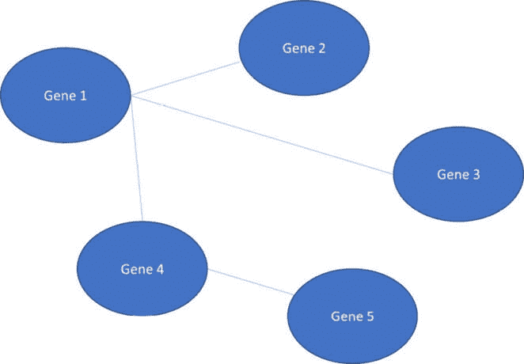
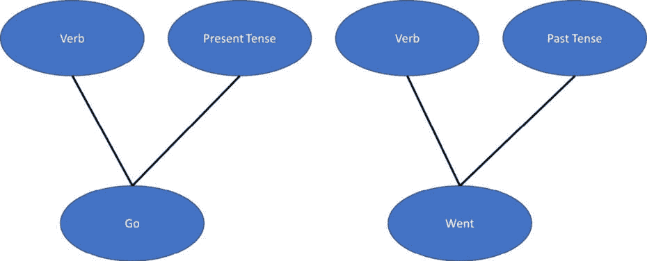
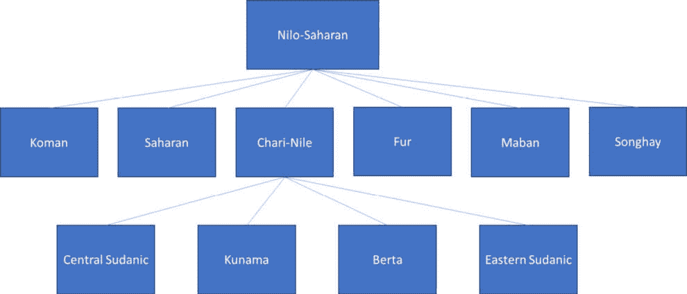
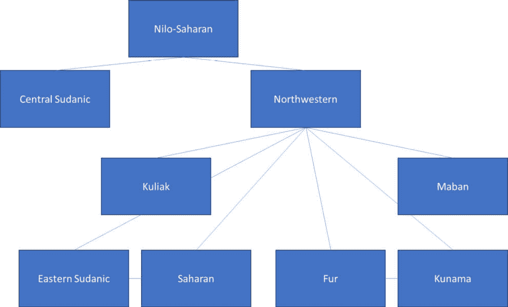
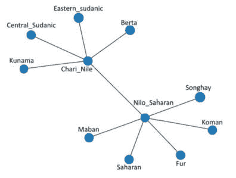
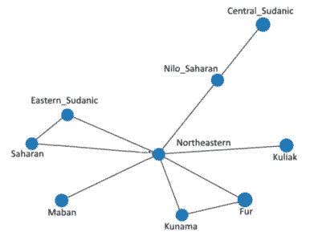

# 11

# 语言家族的映射 – 本体论方法

在本章中，我们将探讨一个被称为语言学的科学领域。**语言学**是研究语言，包括词汇使用模式、语法演变以及语言的社会结构。我们将探讨**本体论**，它通过定义的关系将诸如词汇等概念相互关联，并构建**语言家族**，其中同一家族内的语言在时间和地理上相互关联。

网络科学为我们提供了总结和比较本体论和语言家族的工具，以研究假设的相似性和差异性。我们将在本章末尾量化假设语言家族的差异，尽管该方法可以应用于本体论或任何其他从语言学研究中派生的基于网络的结构的分析。

在本章中，我们将涵盖以下主题：

+   什么是本体论？

+   语言家族

+   语言家族的映射

到本章结束时，您将了解一些在语言学相关分析中使用的基本工具，并能够比较不同的网络，以理解它们之间的关键差异。因为这些工具具有良好的可扩展性，您将能够处理甚至非常大的本体论。

# 技术要求

您需要 Jupyter Notebook 来运行本章中的实践示例。

本章的代码可在以下链接找到：[`github.com/PacktPublishing/Modern-Graph-Theory-Algorithms-with-Python`](https://github.com/PacktPublishing/Modern-Graph-Theory-Algorithms-with-Python)

# 什么是本体论？

在本节中，我们将了解本体论以及它们如何作为网络表示和存储。虽然本章侧重于语言学本体论，但存在许多其他类型的本体论，包括基因本体论，简要回顾以激发本节内容。

## 本体论简介

如本章引言中所述，本体论是一组通过某种属性相互关联的思想。通常，它们用于组织特定学科内的知识。让我们通过一个例子使其更加具体。由于遗传学中的例子在本体论研究中更为广泛使用，我们将在处理语言学之前，先通过一个生物学例子来建立直觉。

假设我们有五种基因，它们位于一个调节途径中，该途径控制着动物毒液中酶或多肽的产生。通常，环境条件和地理因素在毒液中活性化合物的比例中起着作用，即使在同一物种中也是如此，这是通过调节毒液腺中的基因转录来实现的。在我们开始收集这些基因及其对毒液产生的影响的信息之前，我们仅仅有一组基因，如图*图 11.1*所示：


图 11.1 – 参与调节动物毒液产生过程的五种基因的集合

为了更好地理解**图 11.1**中的基因，我们可能需要进行一个环境实验，通过改变条件来开启和关闭基因，并阐明它们之间的相互关系——存在于这个调控途径中的依赖关系。这些相互依赖关系可以通过将每个基因顶点与一条边连接来表示。假设我们进行了几个实验，并发现了以下关系：



图 11.2 – 表示调控毒液生产基因之间关系的本体

**图 11.2**显示，所有其他四个基因都位于**基因 1**的下游，这表明这个基因对于动物毒液中的关键化合物的调控至关重要。**基因 1**的突变可能导致功能丧失（并可能危及动物）。将这个本体作为网络视觉表示，使我们能够轻松地定位我们正在研究的系统中的关键信息。

然而，许多生物的基因调控途径比这个例子要大得多，在实践中难以可视化——尤其是整个基因本体，其中生物的全部基因集合被映射并通过功能途径连接。这意味着我们需要使用网络分析工具来研究提议的基因调控途径之间的差异，或者比较具有相同功能的生物之间的基因调控途径。例如，在我们的毒液例子中，我们可能对绘制一种海蛇的完整基因本体感兴趣，海蛇是眼镜蛇科的一员，并将其完整基因本体与另一种眼镜蛇科物种（如太攀蛇或黑曼巴）进行比较。这些物种可能有超过 12,000 个基因，从而产生一个非常大的本体比较问题。

让我们回到语言学的焦点，看看语言相关的本体是如何构建的，以及如何用来研究方言、皮钦语或社会经济群体之间的语言差异，或者简单地理解一种语言的结构和功能。

考虑英语中的两个单词：*go*和*went*。这两个单词都是动词。它们在句子的主语方面具有相同的语义意义。然而，一个表示现在时态，另一个表示过去时态。所有这些信息帮助我们理解这些单词在英语中的功能。我们可以将这些关系映射到每个单词的网络结构中，如图**11.3**总结：



图 11.3 – 显示单词“go”和“went”语言特性的两个网络

*图 11**.3* 总结了我们两个单词的语言特性：*go* 和 *went*。想象一下为英语中的每一个单词创建这样的网络。我们将拥有非常多的网络，它们将语言特性映射到单词上，这很容易导致重要网络丢失。我们还会使用大量的计算能力来搜索图集合中感兴趣的字词或特性。让我们进一步探讨本体创建。

## 将信息表示为本体

要创建本体，我们需要定义感兴趣的概念/单词/术语及其可能共享的特性。在我们的图 11**.3*示例中，我们有一组具有感兴趣的语言特性的单词。一旦我们定义了这两组（图 11**.3*中的单词和语言特性），我们就可以在这两组之间创建映射（图 11**.3*中显示的线条）。我们的单词示例是一个非常小的示例。很多时候，这些集合可以包括每个集合中成千上万的条目。

为了处理这些更大的信息集以及其中项目之间可能存在的潜在关系，我们需要一种系统的方式来存储这两组信息及其关系。我们还需要很多人来创建这个非常大的本体，最好有一种方式让所有参与创建本体的工作人员共享信息。这正是数据库发挥作用的地方。

**本体网络语言**（**OWL**）数据库系统组织知识网络，如图 11**.3*所示。每个单词、术语或概念在数据库中占据一行，该行映射到本体中与该单词/术语/概念匹配的任何感兴趣的特性，从而创建一种数据库的数据库，用于存储单词/术语/概念数据及其与本体中关键特性的关系。从这个数据库中，我们可以搜索信息，可视化感兴趣的关系，并挖掘整个本体以寻找主题。

任何类型的知识都可以在 OWL 数据库中组织。例如，我们可以使用 OWL 数据库来组织关于动物分类学或进化遗传学的知识，以便根据遗传分析结果快速搜索游蛇科物种之间的关系。我们还可以组织医学术语，为医生提供一个易于使用的查找系统，以便他们在遇到超出其专业领域的症状或疾病时，有助于患者的诊断。我们甚至可以组织关于长篇小说中人物关系的知识，为像《战争与和平》这样的书籍提供学习指南。

现在我们已经了解了本体及其存储系统的基本知识，让我们将注意力转回到语言学上，在那里我们可能希望研究语言家族之间的语言演变。

# 语言家族

**语言家族**是由具有共同祖先的语言组成的群体，这些语言通常在相关的地理区域内演变。例如，罗曼语族包括在南部欧洲地区从通俗拉丁语（晚期拉丁语）演变而来的语言。尼罗-撒哈拉语族在努比亚王国时期在尼罗河三角洲演变。大约有 150 个语言家族合并成了今天存在的几个主要语言家族，还有几个**孤立语言**（例如澳大利亚的蒂维语）没有与其他语言的关系。孤立语言没有与其他语言相关的遗传祖先。Campbell 提出了七个主要语言家族（每个大陆一个），尽管其他研究人员将主要语言家族分类到其他语言群体中。

## 语言漂移和关系

当不同遗传祖先语言的群体在地理上足够孤立，以至于祖先语言可以在地区上演变时，语言家族就出现了。随着语言的演变，词汇可能会变化。发音可能会变化。语法可能会发展。在许多英语皮钦语（包括英语在内的两种或更多语言的混合）中，英语与当地语言混合，创造了一种混合语言，它保留了英语的一些语法和表达方式，同时结合了当地语言。在尼日利亚的英语皮钦语中，英语与当地语言，如伊博语、豪萨语或约鲁巴语混合。例如，“*How are you?*”变成了“*How na?*”，而“*Please come join me for a meal*”变成了“*Abeg come* *chop food*”。

随着时间的推移，皮钦语可以演变到成为完全独立的语言（英语的一个分支，就像中古英语从古英语演变一样，其他语言影响了古英语）或者仍然保持为母语言的皮钦语（在这种情况下是英语）。当语言演变时，它成为母语言的子分支。在英语的情况下，它在商业和学校系统中的广泛使用表明，许多子语言将在未来一段时间内发展成为具有独特词汇和语法的独立语言。鉴于尼日利亚的皮钦语及其广泛的使用，尼日利亚英语子语言可能是下一个世纪或更长时间内最有可能发展的子语言。

一些驱动因素倾向于促进语言向儿童语言或皮钦语（pidgin）的演变。不同国家或地区之间的贸易，这些地区在语言上不重叠，需要沟通手段。皮钦语通常在市场等地方发展，那里许多讲不同语言的人必须相互沟通以买卖商品。在交易过程中可能会反复使用一些常见的词汇和短语（例如货币价值或数量）。为了方便两种不同语言之间的理解，可能会省略一些棘手的语法或冠词。

帝国扩张是语言演化的另一个驱动力。罗马帝国将拉丁语传播到欧洲的大部分地区，几个世纪以来影响了语言，尤其是那些靠近罗马的语言。西班牙和葡萄牙是两个有趣的案例，罗马对拉丁语的影响和摩尔人对阿拉伯语的影响都影响了当地方言。随着时间的推移，随着罗马帝国权力的衰落和其他语言和文化影响将使用拉丁语进行商业、学校和宗教活动的地区分开，罗曼语族，包括西班牙语和葡萄牙语，从拉丁语中演变出来。事实上，罗马帝国对这些语言的发展影响如此直接，以至于术语**罗曼语族**指的是罗马帝国！

今天存在的多数英语皮钦语的存在归因于英国殖民主义，正如大不列颠、美国和澳大利亚等地英语的不同方言一样。根据英语作为商业通用语的时间长短，我们可能在未来的几个世纪中看到许多从英语演变而来的儿童语言。

**系统发育树**可以用来通过展示亲缘和子代关系，在视觉上总结思想、语言或物种随时间演化的关系。这使得研究演化结构变得更容易，因为视觉提供了关于假定的演化路径和易于分析的信息和潜在统计差异的网络结构。一般本体结构没有层次结构，网络的一部分在意识形态上依赖于网络的前一部分。让我们通过尼罗-撒哈拉语言的假定的演化路径来看看这一点。

## 尼罗-撒哈拉语系

尼罗-撒哈拉语系包括南苏丹、埃塞俄比亚、苏丹、肯尼亚、坦桑尼亚、乌干达、乍得、布基纳法索、喀麦隆、马里、刚果民主共和国、贝宁、阿尔及利亚、尼日利亚、尼日尔、埃及和利比亚等地区使用的语言。此外，在几个其他国家也存在一些小的语言社区。这个语系中的一些常见语言包括马萨伊语、松加语、丁卡语、鲁奥语和卡努里语。大约有 7000 万人使用尼罗-撒哈拉语系的语言，某些地区和方言的使用者数量正在增加。

尼罗-撒哈拉语言的语言学研究至少可以追溯到 19 世纪，过去十年中许多论文都讨论了语言漂移以及母语与其子语的关系。在本节中，我们将检查一些提出的历史层级，然后在下一节中用 Python 代码分析这些层级之间的相似性和差异性。如果你对论文本身感兴趣，可以查阅章节末尾的参考文献，特别是 Dimmendaal 的论文，该论文总结了关于尼罗-撒哈拉语族中母语与子语关系的最近辩论。

Greenberg 在 1963 年提出了以下层次结构，对几个语言家族分支进行了分类。*图 11.4* 展示了这个层次结构，包括从更大的尼罗-撒哈拉语族的一个子分支中延伸出来的子分支：



图 11.4 – Greenberg 的尼罗-撒哈拉语族语言分类

*图 11.4* 展示了尼罗-撒哈拉语族语言家族中的一些子分类。这些子分类继续细分到个别语言，总计大约有 130 种语言在这个地区被使用，这些语言起源于尼罗河支流交汇的近邻地区，那里曾经是努比亚。

自 1963 年以来，许多论文进一步细分了这些子类，并添加了额外的子类，最终形成了我们将在本节讨论的 Dimmendaal 论文，偶尔会创造出非常复杂和深层的网络结构。语法、词汇、音韵（在这种情况下，辅音的发音）和术语通常决定了线条的绘制位置，但语言往往是流动的，可能会在一定程度上重叠，使得分类系统难以辨别。让我们转向尼罗-撒哈拉语族语言研究中较为近期的作品。

Dimmendaal 的最新工作提出了尼罗-撒哈拉语族子族的新层次结构，总结在 *图 11.5* 中：



图 11.5 – Dimmendaal 的尼罗-撒哈拉语族子族层次结构

注意

在 *图 11.5* 中，Dimmendaal 的分类首先按地区划分语言，然后按方言或地区划分。注意，一些语言子族似乎是一起出现的（例如 Fur 和 Kunama），而没有中间家族的存在。这比 *图 11.4* 中的 Greenberg 分类结构要复杂。

随着语言家族层次结构随着语言研究的系统化而演变，重要的是要注意出现的差异及其潜在原因。这为进一步的语言学研究提供了线索，并可能有助于未来语言家族层次结构的发展。

现在我们对尼罗-撒哈拉语族及其层次结构有了一些了解，让我们看看网络科学如何帮助我们理解可能重要的结构差异。

注意

我们的例子在规模上非常有限，这使得可视化结果以及为什么我们的分析可能会显示出差异变得容易。使用完整的 OWL 数据库或完整的语言层次结构会创建出更加细致和庞大的网络来研究。然而，无论网络大小或复杂度如何，进行此类研究的工具都是相同的。因此，我们即将开始的分析可以应用于更加复杂的语言数据结构，在这些结构中，仅仅可视化由不同研究小组或不同语言家族层次结构创建的 OWL 数据库之间的差异可能并不可行。

# 语言家族的映射

让我们回到我们两个尼罗-撒哈拉语族树的例子。为了检查结构上的差异，我们首先需要在 NetworkX 中创建这些树。对于 Dimmendaal 的家族树，我们将稍微打破树结构以显示一些子语族之间存在的相互关系。让我们通过使用 `脚本 11.1` 创建和绘制 Greenberg 树开始：

```py
#load needed packages
import numpy as np
import networkx as nx
import matplotlib.pyplot as plt
#create the Greenberg Nilo-Saharan language family network
G = nx.Graph()
G.add_nodes_from([1, 11])
G.add_edges_from([(1,2),(1,3),(1,4),(1,5),(1,6),(1,7),(7,8),
    (7,9),(7,10),(7,11)])
#plot the Greenberg Nilo-Saharan language family  network
import matplotlib.pyplot as plt
G.nodes[1]['subfamily'] = 'Nilo_Saharan'
G.nodes[2]['subfamily'] = 'Koman'
G.nodes[3]['subfamily'] = 'Saharan'
G.nodes[4]['subfamily'] = 'Songhay'
G.nodes[5]['subfamily'] = 'Fur'
G.nodes[6]['subfamily'] = 'Maban'
G.nodes[7]['subfamily'] = 'Chari_Nile'
G.nodes[8]['subfamily'] = 'Central_Sudanic'
G.nodes[9]['subfamily'] = 'Kunama'
G.nodes[10]['subfamily'] = 'Berta'
G.nodes[11]['subfamily'] = 'Eastern_Sudanic'
labels = nx.get_node_attributes(G, 'subfamily')
nx.draw(G, labels=labels, font_weight='bold')
```

这个脚本生成了与 *图 11.4* 类似的表现。*图 11.6* 显示了 Greenberg 尼罗-撒哈拉语亚语族树的 NetworkX 图：



图 11.6 – Greenberg 的尼罗-撒哈拉语语族树图

现在我们可以看到 Greenberg 的尼罗-撒哈拉语亚语族树及其各个分支，让我们通过添加到 `脚本 11.1` 来创建和绘制 Dimmendaal 的尼罗-撒哈拉语亚语族树及其各个分支：

```py
#create the Dimmendaal Nilo-Saharan language family network
G2 = nx.Graph()
G2.add_nodes_from([1, 9])
G2.add_edges_from([(1,2),(1,3),(2,4),(2,5),(2,6),(5,6),(2,7),
    (2,8),(7,8),(2,9)])
#plot the Dimmendaal Nilo-Saharan language family  network
G2.nodes[1]['subfamily'] = 'Nilo_Saharan'
G2.nodes[2]['subfamily'] = 'Northeastern'
G2.nodes[3]['subfamily'] = 'Central_Sudanic'
G2.nodes[4]['subfamily'] = 'Maban'
G2.nodes[5]['subfamily'] = 'Kunama'
G2.nodes[6]['subfamily'] = 'Fur'
G2.nodes[7]['subfamily'] = 'Saharan'
G2.nodes[8]['subfamily'] = 'Eastern_Sudanic'
G2.nodes[9]['subfamily'] = 'Kuliak'
labels2 = nx.get_node_attributes(G2, 'subfamily')
nx.draw(G2, labels=labels2, font_weight='bold')
```

这段脚本生成了 Dimmendaal 的尼罗-撒哈拉语亚语族树的图，如图 *图 11.7* 所示：



图 11.7 – Dimmendaal 的尼罗-撒哈拉语语族树图

注意 Dimmendaal 的尼罗-撒哈拉语亚语族树中 Kunama 和 Fur 以及撒哈拉和东苏丹之间的连接。这些代表了尼罗-撒哈拉语东北支中的相关子语族。从 *图 11.6* 和 *11.7* 中，我们可以看到类似的总体结构，其中存在许多浅层、未连接的分支。然而，Dimmendaal 的尼罗-撒哈拉语亚语族树在树中添加了一个额外的层次，并包括了没有共同祖先直接产生它们的子语族。

由于这些差异，我们预计两个语言亚语族树之间的某些中心性度量会有所变化。我们将从之前章节中定义的一些熟悉度量开始。`脚本 11.2` 分析了我们两个语言亚语族树之间平均介数中心性的差异：

```py
#compare betweenness centrality of language families
gb=nx.betweenness_centrality(G)
print(np.mean(np.array(list(gb.values()))))
gb2=nx.betweenness_centrality(G2)
print(np.mean(np.array(list(gb2.values()))))
```

我们得到了平均介数中心性为 `0.131`（Greenberg 的）和 `0.127`（Dimmendaal 的），这表明在这些亚语族树之间桥接属性相似。让我们通过添加到 `脚本 11.2` 来计算平均度中心性以评估中心性属性：

```py
#compare degree centrality of language families
gd=nx.degree_centrality(G)
print(np.mean(np.array(list(gd.values()))))
gd2=nx.degree_centrality(G2)
print(np.mean(np.array(list(gd2.values()))))
```

我们得到了平均度中心性为 `0.182`（Greenberg 的）和 `0.278`（Dimmendaal 的），这表明中心性属性在这些亚语族树之间有所变化。鉴于 Dimmendaal 的亚语族树结构中连接其他树层的额外深度层，我们预计会看到这种差异。

让我们把注意力转向一个特别适合现实世界语言数据（以及其他本体或系统发育网络数据集）的中心性度量。

**子图中心性**衡量每个顶点在网络中的子图中的参与程度，通过在网络的邻接矩阵的频谱中给予小子网络更高的权重，而给予大子网络较低的权重，并通过网络上的随机游走来估计子网络。这结合了**频谱聚类**（在*第五章*中看到）和度中心性的特性，以创建一个混合中心性度量。

我们可以通过向 `Script 11.2` 中添加内容来在我们的两个亚家族树上看到这一点：

```py
#compare subgraph centrality of language families
gs=nx.subgraph_centrality(G)
print(np.mean(np.array(list(gs.values()))))
gs2=nx.subgraph_centrality(G2)
print(np.mean(np.array(list(gs2.values()))))
```

此脚本表明，平均子图中心性在这两个亚家族树之间有所不同，Greenberg 的平均子图中心性为 `2.478`，Dimmendaal 的平均子图中心性为 `3.276`。这表明在这些假设的亚家族树之间，频谱和度分布是不同的。

虽然这个例子只涉及两个小的本体结构，但当与许多本体一起工作或比较非常大的本体（在这种情况下不建议进行可视化）时，这些类型的分析可能是有帮助的。例如，我们可能希望比较许多不同论文中假设的完整的尼罗-撒哈拉语言树。这些树将包括数百个顶点，可能还有数十棵树。通过视觉跟踪这些差异将是一项相当大的挑战！

当我们考虑语言 OWL 数据库时，我们的分析规模进一步扩大，达到数十万个顶点，以便在 OWL 数据库之间进行比较。在这个规模下，无法通过视觉方式挖掘比较中的数据。网络科学提供了一种比较所提出的 OWL 数据库结构并聚焦于这些数据库之间存在的差异的方法，以找到这些结构之间的关键差异。此外，我们概述的许多工具都能很好地扩展到这种规模的数据分析，提供了一种高效的方法来找到这些关键差异。然而，理解词源理论中存在的差异超出了本书的范围，并且许多 OWL 数据库包含在专有系统中存储或本身就是专有的。

本章重点介绍了语言学领域。然而，其他学科中存在许多类型的本体和系统发育树。动物学和人类基因组学经常使用本体来研究基因、环境和基因表达之间的关系。这些本体往往很大，创建这些本体所需的知识整理可能导致不同本体在尝试捕捉相同知识时出现显著差异或知识空白。可扩展的中心性度量，如我们在简单可视化示例中概述的，可以确定这些复杂本体中的总体和个体分支差异，以确定感兴趣的区域和使用一个开源本体与另一个本体相比的潜在注意事项。

随着不同领域知识的增长，比较本体的方法论将进一步发展，网络科学将在不同学科中本体的管理、理解和应用中发挥重要作用。

# 摘要

在本章中，我们学习了如何在数据库和网络中表示语言数据。我们比较了两种尼罗-撒哈拉语言亚族网络，使用中心性指标，并引入子图中心性作为特别适合分析本体和系统发育树的中心性指标。最后，我们将本体的处理扩展到语言学领域之外，并讨论了如何使用本章中的工具将这些分析扩展到非常大的本体组，以比较其在实际应用中的适用性。

在下一章中，我们将学习关于图数据库的知识，它可以用来存储本章讨论的本体数据。

# 参考文献

Campbell, L. R. (2018). *世界上有多少个语系？*

Dimmendaal, G. J. (2019). *尼罗-撒哈拉语言形态学的类型学视角*。载于 *牛津语言学研究百科全书*。

Dimmendaal, G. J., Ahland, C., Jakobi, A., and Lojenga, C. K. (2019). *常被称为“尼罗-撒哈拉”语言的语文学特征和类型学*。*非洲语言手册*，326-381。

Done, B., Khatri, P., Done, A., and Draghici, S. (2008). *预测新型人类基因本体注释的语义分析方法*。*IEEE/ACM 计算生物学与生物信息学杂志*，*7*(1)，91-99。

Ehret, C. (2006). *尼罗-撒哈拉背景下的乍得语*。*非洲语言学研究*，*35*，56-66。

Estrada, E., and Rodriguez-Velazquez, J. A. (2005). *复杂网络中的子图中心性*。*物理评论 E*，*71*(5)，056103。

基因本体联合体。 (2008). *2008 年基因本体项目*。*核酸研究*，*36*(增刊 1)，D440-D444。

Greenberg, J. H. (1957). *语言学论文集*。

Greenberg, Joseph H. 1963\. *非洲的语言*。印第安纳大学，印第安纳州，布卢明顿。

Jakobi, A., and Dimmendaal, G. J. (2022). *Karko 和尼罗-撒哈拉中的数字标记*。*世界语言中的数字：比较手册*，63-106。

McGuinness, D. L., and Van Harmelen, F. (2004). *OWL 网络本体语言概述*。*W3C 建议书*，*10*(10)，2004。

Oladnabi, M., Omidi, S., Mehrpouya, M., Azadmehr, A., Kazemi-Lomedasht, F., and Yardehnavi, N. (2021). *毒理学和抗毒理学数据：当前和未来展望*。*生物技术与生物医学档案*，*5*(1)，026-031。

Souag, L. (2022). *西非语言如何变成北非语言，反之亦然*。*语言学类型学*，*26*(2)，283-312。

Subich, V. G. (2020). *非洲语言谱系的结构和类型学分析*。*欧亚大陆阿拉伯语研究*，(12)，103-117。

Suryamohan, K., Krishnankutty, S. P., Guillory, J., Jevit, M., Schröder, M. S., Wu, M., ... and Seshagiri, S. (2020). *印度眼镜蛇参考基因组与转录组使全面识别毒液毒素成为可能*. *自然遗传学*, *52*(1), 106-117.

Urban, M. (2021). *语言孤立体的地理和开发*. *皇家学会开放科学*, *8*(4), 202232.

Wardhaugh, R. (1972). *语言学导论*.

*尼日利亚皮钦语 - 20 个有用词汇和短语* (n.d.): [`www.britishcouncil.org/voices-magazine/nigerian-pidgin-words-phrases`](https://www.britishcouncil.org/voices-magazine/nigerian-pidgin-words-phrases)
