# 12

# 图数据库

在前几章中，我们将网络视为可以分析以从数据科学问题中提取见解的数据结构。在本章中，我们将考虑网络作为数据存储选项，以多关系方式链接许多信息。存在许多存储选项，但我们将关注一个与 Python 集成良好的开源选项——**Neo4j**。

我们在本章中将涵盖以下主题：

+   图数据库简介

+   在 Neo4j 中查询和修改数据

到本章结束时，你将了解图数据库在存储网络科学数据集方面的优势，能够可视化图数据库，并知道如何查询它们以快速检索相关信息。你将能够通过插入和删除来轻松修改表格。你将了解我们前几章中的工具如何帮助你高效查询以找到相关数据。让我们通过探索图数据库背后的原理开始吧。

# 图数据库简介

**图数据库**（以网络形式存储数据的数据库）相对于传统的关系型数据库具有许多优势。首先，图数据库可以捕获和遍历层次关系。虽然关系型数据库可以捕获分类法，但它们是在不同的列中捕获的，这些列并没有明确地链接。

此外，图数据库通过连接它们来明确捕获项目或项目组之间的复杂关系。这允许数据库内存在多向关系；例如，当邻居通过边连接时，查询最近邻要容易得多，并且不需要估计步骤来找到数据库中所有项目之间的**欧几里得**或**曼哈顿**距离。

此外，图数据库可以非常容易地捕获数据库中项目之间关系的方向性。在关系型数据库中，一个单一关系的方向性可能需要几个列的信息来捕获该关系。因此，对于可能具有单向关系的项目，图数据库提供了数据结构的紧凑表示。

最后，在图数据库中，可以使用网络算法来挖掘数据集，以发现数据库中未编程的隐含关系。这些算法可以通过在网络的不同部分寻找相似模式来探测相似关系，或者根据三角闭包推断不存在的关系。对于许多数据集——例如持续增长的*组学*数据集、演化的本体或知识不完整的其他非静态数据集——挖掘数据提供了新的研究途径。

现在我们已经了解了一些关于图数据库的优势，让我们深入了解图数据库和关系型数据库之间的具体差异。

## 什么是图数据库？

图数据库是基于网络科学的数据库。与关系型数据库中按列存储数据不同（如下一个图所示），图数据库将数据存储为 *网络*，其中原本占据一行的项目被表示为顶点，并通过存在的关系连接到其他顶点。列数据用于向顶点添加元数据或将它连接到其他顶点。图数据库查询依赖于网络科学算法来遍历图，模式发现算法，以及这两种方法的组合。因此，图数据库的查询可以变得相当复杂，而不会像 SQL 中的子查询那样导致长时间运行。效率是图数据库的一个重大优势。让我们看看与超市客户服务或产品相关的客户反馈示例，如图 *图 12.1* 所示：

图 12.1 – 关系型数据库设计的示例，其中行包含按列组织的信息项（经微软 Excel 授权使用）

*图 12.1* 展示了一个关系型数据库，其中包含许多作为列存在的数据行。然而，这些数据可能更好地用图数据库来表示，在图数据库中，项目通过列相关联，或者以可查询的方式将列用作元数据。或许，评论中附有日期，可以按时间将项目链接起来，并使用与投诉相关的部门作为元数据。

虽然可视化关系型数据库比较困难，但可视化图数据库则要直接得多。一些图数据库自带内置的可视化工具，可以放大感兴趣的区域或查询结果。一些允许开发者基于现有的可视化构建，以满足他们的需求。当鼠标悬停在边和顶点上时，大多数图数据库可视化工具将显示与顶点或边关联的元数据，为查询中提取的感兴趣关系提供上下文。Cytoscape 是最常用的网络可视化程序之一；最初，它是为了可视化蛋白质组数据集而构建的，其中蛋白质相互作用在生物体之间被记录。以下是 Cytoscape 与示例图的演示图像：[`js.cytoscape.org/`](https://js.cytoscape.org/).

Cytoscape 的一个优点是它能够处理保存的 igraph 网络，这样就可以在 Python 中分析非常大的网络，然后用 Cytoscape 进行可视化，其中网络大小不会像使用 igraph 绘图函数那样复杂化可视化。此外，Cytoscape 还提供了一个桌面版本，应该适用于基于 Java 的设备，以及一个网络界面版本，供那些无法访问桌面版本的人使用。如果你感兴趣，我们鼓励你下载 Cytoscape 并使用我们在这本书中使用的数据集或你感兴趣的数据集来测试其可视化功能。

现在我们已经了解了图数据库的结构和优势，让我们深入研究一些数据集，在这些数据集中，图数据库在组织信息和检索感兴趣的信息方面可能比关系数据库表现得更好。

## 你可以在图数据库中表示什么？

许多数据科学领域都可以从图数据库中受益。在我们深入一个开源图数据库的编码之前，我们将深入探讨这些用例中的几个。让我们从一个流行病学例子开始。

### 接触者追踪

当一个新疫情在一个地区开始时，流行病学家通常会使用一种称为**接触者追踪**的工具，收集每个病例的数据，以便将病例相互联系起来，希望找到疫情源头或零号病人。零号病人通常能提供关于疫情来源的线索——是动物宿主、实验室泄露还是环境灾难。然后，流行病学家可以确定有效的遏制政策，并监控潜在的源头，以防止未来的疫情爆发。

在持续时间较长的疫情中，病毒有足够的时间发生变异，接触者追踪使流行病学家能够研究疫情的病毒进化。在 COVID-19 大流行期间，我们看到了许多 COVID-19 的变异，这些变异有不同的死亡率率和不同的症状，其中一些对当前疫苗或先前菌株已响应的治疗方法反应不佳。早期识别新的变异及其地理来源为各国和大陆的快速响应提供了关键信息。

让我们考虑一个新出现的 HIV 疫情中的接触者追踪的例子。假设我们身处一个中等规模的城市，这里有许多社区和次级人口群体。在过去两个月里，几个检测中心和医院出现了病例，流行病学家担心该地区的优势菌株已经变异成了一种更致命的 HIV 菌株，威胁着整个城市。HIV 在人群中传播的两种主要方式是性接触和静脉注射毒品时共用针头；这个假设的疫情似乎主要局限于药物使用率高和有高风险性行为的年轻人群中。

当发现病例时，医疗保健提供者收集有关通过性接触或针头共享可能暴露于 HIV 的其他人的信息，以便个人或提供者可以告知那些暴露者他们面临 HIV 的风险。通过识别和追踪阳性病例，可以建立一个暴露网络。通常，收集并附加到这个网络上的元数据包括菌株基因组学、人口统计学因素、地理历史和暴露途径，以便快速识别传播的主要来源和根据已识别的病例特征最易受伤害的人群。

确定因果关系并不总是直接的。很多时候，当个人没有出现疾病症状或没有定期接受检测时，就会错过病例。这意味着在流行病后期发现的病例可能是感染源。*图 12.2*显示了接触追踪网络的一小部分，其中通过接触追踪在流行病后期发现的病例比出现症状的个人（*病例#161*）感染时间更早：

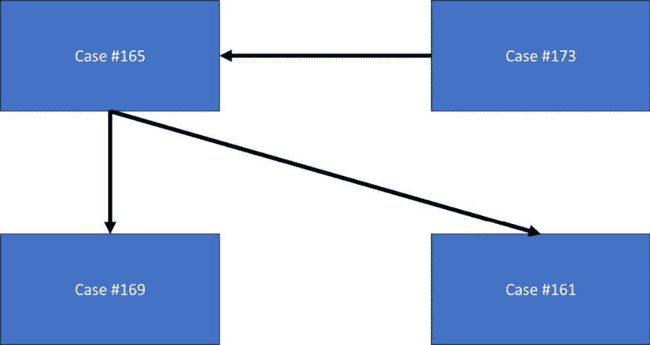

图 12.2 – 接触追踪网络的一个小部分

在*图 12.2*中，我们看到*病例#161*被识别（可能是通过检测中心或寻求医疗护理）。这个人的接触者揭示了从*病例#165*（由*病例#173*感染）那里感染的情况。接触追踪还揭示了另一个从*病例#165*（*病例#169*）感染的个人。如果没有接触追踪，至少会错过另外三个病例，导致治疗延误，并可能导致更多的暴露和病例。通常，通过菌株分析和关于通过性伴侣或针头共享的暴露时间的信息来确定因果关系。这些因素包含在病例元数据中。

在关系数据库中存储病例元数据和因果关系信息将非常困难，因为感染的方向性对于研究人群中的流行病演变以及联系尚未检测的潜在暴露者（因为病例接触可能重叠，在这种类型的流行病中通常如此）至关重要。图数据库允许高效地存储和检索这些信息，以实现接触追踪和制定保护该人群中 HIV 暴露风险者的公共卫生政策的最大效率。早期识别可以拯救人们免受痛苦，甚至可能避免死亡。

### 岛屿生态学研究

既然我们知道了图数据库如何提高社会科学数据的分析和结果，让我们考虑图数据库如何改善保护学研究。假设科学家在远离大陆人群的偏远地区发现了一个新岛屿。*图 12.3*显示了这个假设的岛屿：

图 12.3 – 一个长期与大陆隔离的岛屿的插图

在*图 12**.3*所示的岛屿上，我们希望记录该岛屿上生活的动植物，以及岛屿的食物链。我们将收集有关种群大小、捕食者-猎物关系以及这些种群和关系的潜在威胁（如气候变化）的信息。我们可能希望将物种链接到食物网中，以探索岛屿上温度、天气和海平面变化对食物来源的可持续性影响。我们可能还希望将岛屿划分为不同的生态系统，这些生态系统可能被高悬崖的峡谷所隔离，或者通过迁徙模式或栖息地重叠与岛屿上的其他生态系统相连。食物网和重叠的栖息地/迁徙模式在我们的数据集中创建了种群数据之间的关系，这些数据自然以网络形式存在。我们可以在网络中的顶点（物种或栖息地）或连接它们的边（例如关于迁徙模式的季节性信息，这些信息可能定期连接来自两个不同栖息地的物种）上添加元数据。

在这个保护示例中，我们可能会收集多个数据集。我们可能有来自不同地理区域的几个不同的食物网。我们还可能有关于栖息地重叠的数据集，这些数据集连接岛屿上的地理区域，这些区域与我们的食物网相连，例如关于种群大小估计、生态系统健康指标和季节性模式的元数据。

在关系型数据库中连接许多数据集，其中一些包含层次关系，相当棘手；然而，在使用图数据库时则非常简单。不同类型的边可以连接收集到的网络中的不同顶点，以连接每个网络以及每个网络中包含的元数据。这使得查询和探索那些未明确定义的潜在关系（可能由于时间限制或地形导航的难度而没有收集）对保护主义者来说更容易。

从这些数据和对其图数据库的探索中，我们可以推断并定义岛屿上的保护区，其中许多食物网相连或是有大量生物多样性的孤立区域。这保护了物种免受人类活动或气候变化威胁，并允许研究人员将有限的资金集中在对整体生态系统至关重要的监测区域上。此外，随着进一步的探险和保护工作收集新的数据，图数据库的设置允许研究人员测试在第一次探险中未直接观察到的生态系统或食物网之间的假设性联系。

现在我们对将受益于图数据库存储解决方案的数据集有了一定的了解，让我们将注意力转向 Neo4j，这是一个开源的图数据库选项。

# 在 Neo4j 中查询和修改数据

在我们开始使用 Neo4j 之前，我们需要在我们的机器上下载并安装软件。您可以点击此链接访问 Neo4j 桌面版下载页面：[`neo4j.com/download/`](https://neo4j.com/download/).

你应该看到一个页面，其中你可以通过点击**下载**按钮来下载 Neo4j：

图 12.4 – Neo4j 下载网站

在点击*图 12.4*中的**下载**按钮后，你将提示遵循安装程序说明完成安装。安装程序完成后，你将看到一个图标，或者将从安装过程中直接在你的机器上启动 Neo4j。这应该会带你到一个看起来像这样的页面：

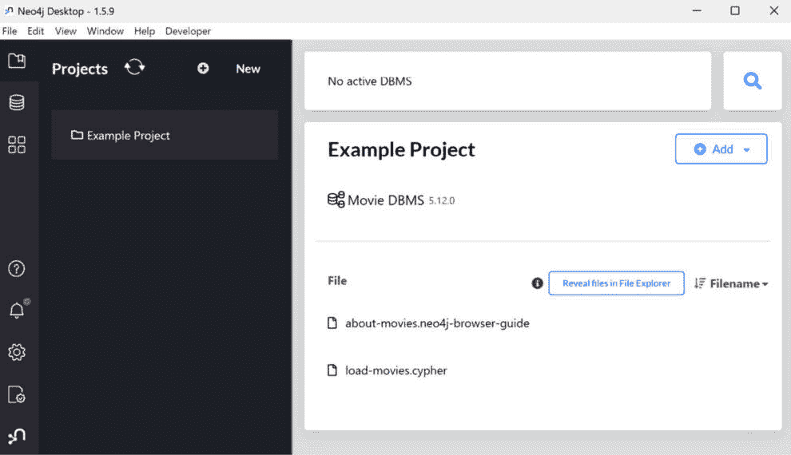

图 12.5 – Neo4j 的起始页面

*图 12.5*显示了 Windows 机器上的 Neo4j 免费桌面版本。

注意

已经有一个示例项目可供探索或查询。

我们将使用这些数据执行一些基本查询，但如果你希望在查询之前探索这个数据库，请点击**Movie DBMS**并点击**启动**按钮以在您的机器上运行数据库；探索完成后，请确保点击**停止**按钮再次缓存数据库。

Neo4j 使用的查询语言称为`Match`命令，其功能类似于 SQL 的`SELECT`命令，`limit`和`as`等操作也存在于 Cypher 中。然而，用于检索数据库中对象（顶点）之间方向关系（边）的操作也存在，以便查询可能存在的特定类型的关系。随着我们在 Neo4j 桌面应用程序上探索 Movie DBMS（数据库管理系统）数据库，我们将看到更多这方面的实际应用。

现在，让我们探索 Neo4j。

## 基本查询示例

当你打开你的 Neo4j 桌面应用程序时，你会看到一个`Example Project`文件夹。当你将鼠标悬停在屏幕右侧的**Movie DBMS**标签上时，你会看到一个**启动**按钮，该按钮启动与此数据库的连接（如*图 12.6*所示）。点击**启动**：

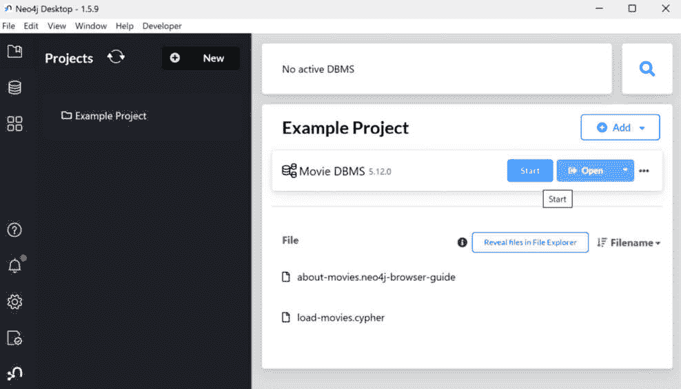

图 12.6 – 启动 Movie DBMS 数据库的启动按钮

如*图 12.6*所示，一旦通过点击`about-movies.neo4j-browser-guide`文件选项启动了 Movie DBMS 数据库，并运行了一些查询示例以熟悉 Cypher 的语法和结果。

当你点击`about-movies.neo4j-browser-guide`文件选项时，你会看到一个像*图 12.7*一样的页面。第一个页面显示了一个基本的查询，用于检索演员的数据。在这里，我们将演员更改为`Brad Pitt`并查询图中`Brad Pitt`的实例。当你将代码更改为*图 12.7*中所示的内容时，点击箭头以运行代码。请注意，你将在你编写的代码下方看到默认教程。我们不会在我们的 Neo4j 查询图像中显示此内容，但它将出现在你的屏幕上：

图 12.7 – 一个基本的 Cypher 查询，用于搜索布拉德·皮特

这个数据库不包含关于布拉德·皮特的任何信息。在`Tom Hanks`上运行建议的查询会产生以 JSON 形式的信息，因为此数据不包含图元素。当你查询数据库中的`Tom Hanks`时，你应该看到类似*图 12.8*的内容：

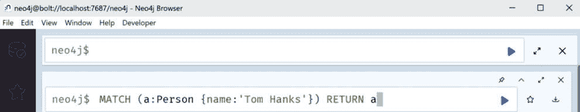

图 12.8 – 在电影数据库管理系统中查询 Tom Hanks 的结果

让我们翻到指南的下一页，向数据库中添加一个演员。我们将添加布拉德·皮特，因为我们的查询最初返回了空结果。*图 12.9*显示了如何将演员及其出生年份添加到数据库中。

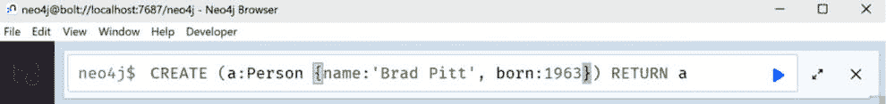

图 12.9 – 创建布拉德·皮特条目的说明

当我们运行*图 12.9*中的代码时，Neo4j 显示给我们一个包含布拉德·皮特信息的顶点，如图*图 12.10*所示：

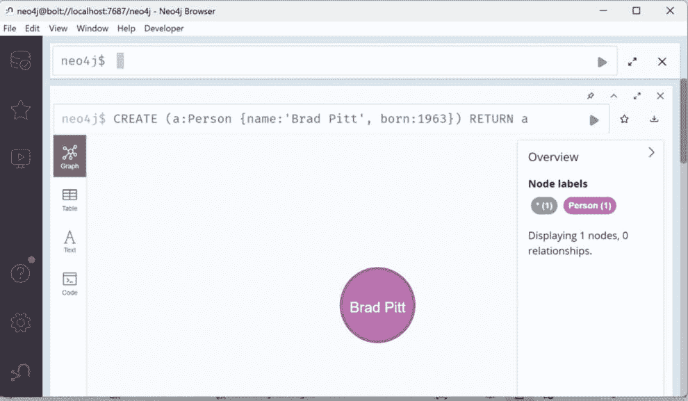

图 12.10 – 创建布拉德·皮特条目的结果

我们可以添加与`Brad Pitt`相关的电影，例如，`七年内》，如图 12.11*中的代码所示：

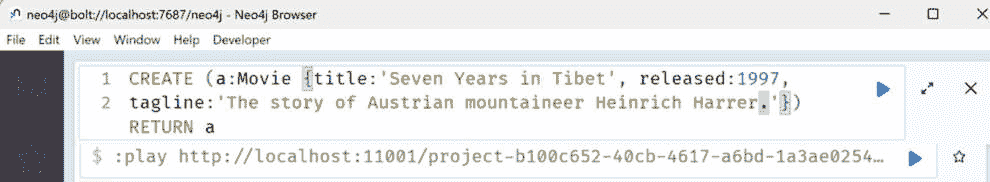

图 12.11 – 添加与布拉德·皮特相关的电影的 Cypher 代码

当我们运行这个 Cypher 代码时，我们会看到另一个图数据库顶点出现，如图*图 12.12*所示：

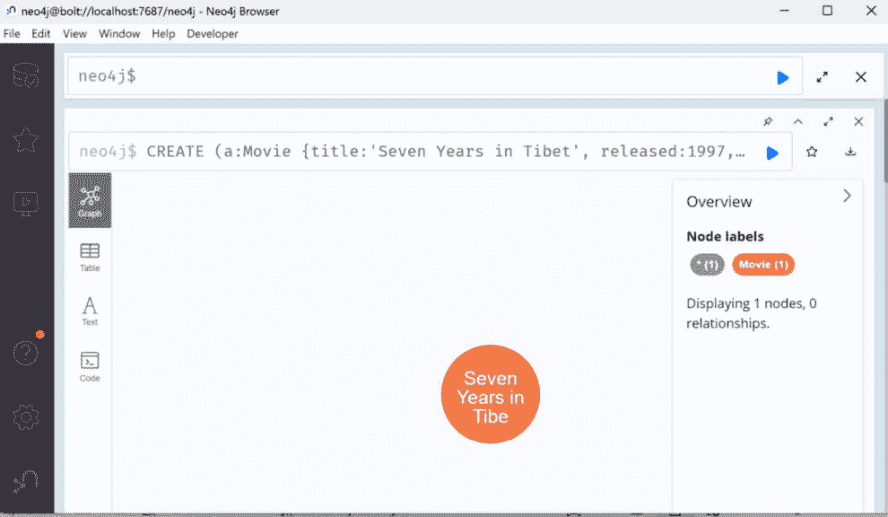

图 12.12 – 运行图 12.11 中的 Cypher 查询的结果

正如我们可以向我们的图数据库添加内容一样，我们也可以从数据库中删除单个记录。让我们删除我们刚刚为`Brad Pitt`创建的记录。*图 12.13*显示了删除`Brad Pitt`记录的过程。我敦促你在继续下一章的任务之前尝试删除`七年内》：

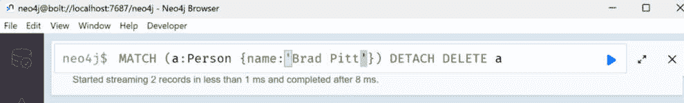

图 12.13 – 删除我们为布拉德·皮特创建的记录的 Cypher 代码

我们还可以使用带有`CREATE`和`MATCH`语句的`MERGE`语句在数据库中创建或更新记录，以创建新记录或更新现有记录（取决于数据库中存在的内容）。我们将使用*图 12.14*中显示的代码将布拉德·皮特的信息重新添加到数据库中：

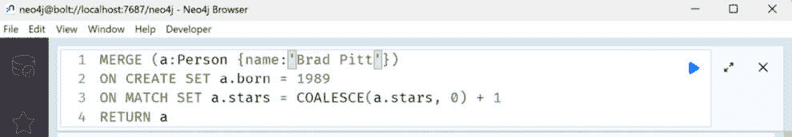

图 12.14 – Cypher 代码的更新示例

当我们运行*图 12.14*中的代码时，我们会再次看到*图 12.9*，其中布拉德·皮特的信息已经添加到数据库中。现在我们了解了一些基本的 Cypher 命令，我们可以继续到下一节，学习更复杂的图数据库操作。

## 更复杂的查询示例

现在我们知道了如何执行基本查询，我们可以继续学习 Neo4j 中更复杂的操作，例如在项目之间添加关系。让我们通过 Cypher 查询将布拉德·皮特与 *《七年的西藏》* 通过他的角色海因里希·哈勒连接起来。

注意

在运行此查询之前，您需要使用 *基本查询示例* 部分的代码将电影和演员都添加到我们的数据库中。此查询如图 *12.15* 所示。

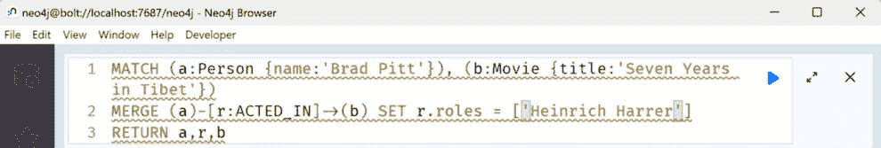

图 12.15 – 将布拉德·皮特与《七年的西藏》中的角色海因里希·哈勒连接起来的 Cypher 查询

运行此查询返回关于演员、电影以及我们刚刚在这两个数据集之间创建的关系的信息，如图 *12.16* 所示：

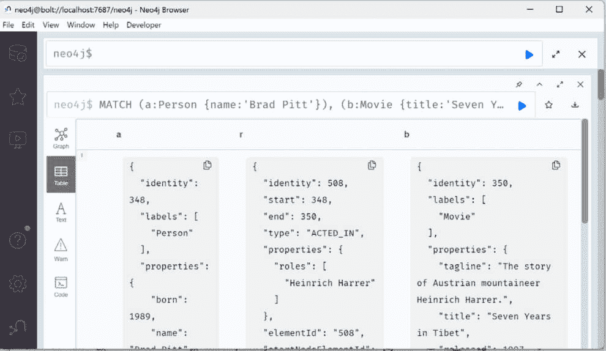

图 12.16 – 图 12.15 的 Cypher 查询结果，将布拉德·皮特与《七年的西藏》连接起来

Neo4j Cypher 指南的下一页展示了创建此关系的另一种方法。鼓励您修改该代码以添加另一个演员和电影作为练习。让我们将注意力转向 Cypher 的 `WHERE` 子句，它们在 SQL 中的功能非常相似。

我们将搜索以名字 `Brad` 开头的人名，这将检索布拉德·皮特的条目，以及任何其他名字也是 `Brad` 的演员。*图 12.17* 展示了此查询：

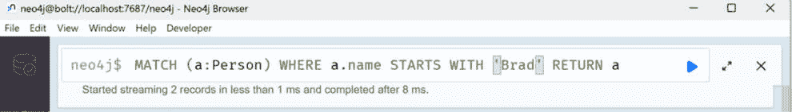

图 12.17 – Cypher 中 WHERE 查询的示例

当我们在 *图 12.17* 中运行 Cypher 代码时，我们应该在我们的数据库中看到两个 `Brad Pitt` 的实例，如图 *12.18* 所示：

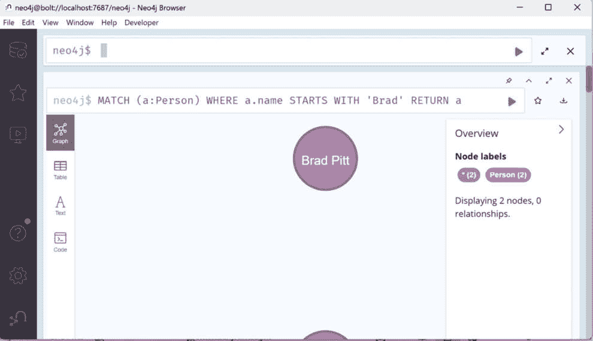

图 12.18 – 图 12.17 的 WHERE Cypher 查询结果

我们还可以根据关系进行匹配，例如找到与演员相关的电影。让我们尝试一个 Cypher 查询来找到与布拉德·皮特相关的所有电影（在这里，只是 `Seven Years in Tibet`，因为我们添加了此关系）。*图 12.19* 展示了我们将使用的查询：

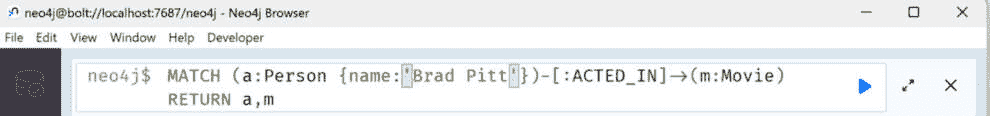

图 12.19 – 人与电影之间图关系的 Cypher 查询

当我们运行 *图 12.19* 中所示的 Cypher 查询时，我们看到 `Brad Pitt` 的实例与《七年的西藏》之间的连接以图形形式显示 (*图 12.20*):

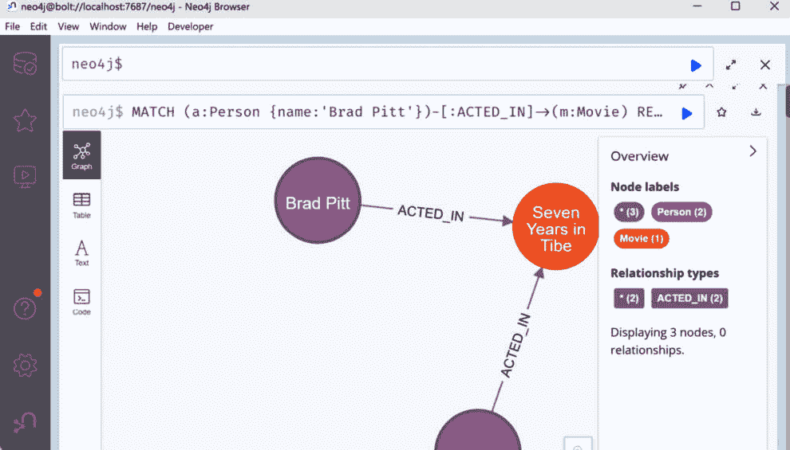

图 12.20 – 图 12.19 的图关系查询结果

*图 12**.20* 展示了图数据库的基本优势。我们可以看到连接不同表（在此处，`Person` 表和 `Movie` 表）中不同项的关系，以及这种关系的性质。很容易看到与电影相连的演员，如果有更多电影存在，我们就可以轻松地通过基于图查询的查询结果来可视化我们的查询结果。

虽然这个电影数据库包含基本的表和关系，但我们可以想象在 *图数据库中可以表示什么？* 这一部分的例子中包含了许多更多表之间更加复杂的关系。在表和表中的项目上以图形形式可视化查询结果，提供了对查询中感兴趣的数据和关系的易于理解的摘要。这正是图数据库的力量所在。查询通常很快，即使是对于包含许多子查询的查询或在大表及其关系中进行搜索时也是如此，结果的可视化使用户能够深入探索表之间的关系（或为报告提供简洁的视觉表示）。

如果您想进一步探索 Neo4j，Neo4j 的 AuraDB 允许用户通过建立账户并使用 Python 中的 `neo4j` 包和 `GraphDatabase.driver()` 函数通过 API 连接到 Neo4j 来连接到数据库。

注意

对于任何大型数据库或您希望永久保存的数据库，您需要一个付费账户。

数据库创建完成后，您可以通过 Python 的 `neo4j driver.execute_query()` 语句查询 Neo4j 数据库，并将数据作为网络导入 igraph 以分析结果。这为您的分析项目提供了强大的图存储和图分析组合。如果您感兴趣，我们鼓励您进一步探索 Neo4j 并创建您自己的 igraph 和 Neo4j 的 AuraDB 账户之间的连接项目。

# 摘要

在本章中，我们探讨了图数据库的优势，熟悉了名为 Neo4j 的开源图数据库，并简要了解了 Neo4j 的查询语言，称为 Cypher。我们在 Neo4j 电影数据库中创建了、删除了和修改了记录。我们探讨了查询图数据库的优势以及图数据库中可能的独特查询结果可视化。如果您感兴趣，我鼓励您查阅 Cypher 和 Neo4j 资源，以深入了解图数据库的潜力。

在下一章中，我们将把本书中迄今为止学到的所有技能结合起来，解决一个现实世界问题，即预测刚果民主共和国各地区随时间和地理变化的埃博拉疫情严重程度。

# 参考文献

Adler, M. W. 和 Johnson, A. M. (1988). *HIV 感染的接触追踪*. *英国医学杂志（临床研究版）*，*296*(6634)，1420。

Angles, R., Arenas, M., Barceló, P., Hogan, A., Reutter, J., and Vrgoč, D. (2017). *图数据库现代查询语言的基础*. *ACM 计算机调查 (CSUR)*, *50*(5), 1–40.

Beas-Luna, R., Novak, M., Carr, M. H., Tinker, M. T., Black, A., Caselle, J. E., ... and Iles, A. (2014). *一个在线数据库，用于指导生态网络模型*：[`kelpforest`](http://kelpforest). ucsc. edu. *PloS one*, *9*(10), e109356.

Hyman, J. M., Li, J., and Stanley, E. A. (2003). *建模随机筛查和接触追踪在减少 HIV 传播中的影响*. *数学生物科学*, *181*(1), 17–54.

Mueller, W., Rudowicz-Nawrocka, J., Otrzasek, J., Idziaszek, P., and Weres, J. (2016). *空间数据和图数据库在识别牛群成员关系中的应用*. *国际多学科科学地理会议：SGEM*, *1*, 835–841.

Pasquale, D. K., Doherty, I. A., Leone, P. A., Dennis, A. M., Samoff, E., Jones, C. S., ... and Miller, W. C. (2021). *失而复得：将网络分析应用于 HIV 公共卫生接触追踪*. *应用网络科学*, *6*, 1–16.

Pokorný, J. (2015). *图数据库：其力量与局限性*. 在 *计算机信息系统与工业管理：第 14 届 IFIP TC 8 国际会议，CISIM 2015，波兰华沙，2015 年 9 月 24-26 日，论文集 14* (pp. 58-69). Springer 国际出版社.

Robinson, I., Webber, J., and Eifrem, E. (2015). *图数据库：连接数据的全新机遇*. O’Reilly Media, Inc..

Shannon, P., Markiel, A., Ozier, O., Baliga, N. S., Wang, J. T., Ramage, D., ... and Ideker, T. (2003). *Cytoscape：一个用于生物分子相互作用网络综合模型的软件环境*. *基因组研究*, *13* (11), 2498–2504.

Webber, J. (2012, October). *Neo4j 程序化入门*. 在 *第三届系统、编程和应用：为人类服务的软件年度会议论文集* (pp. 217–218).
