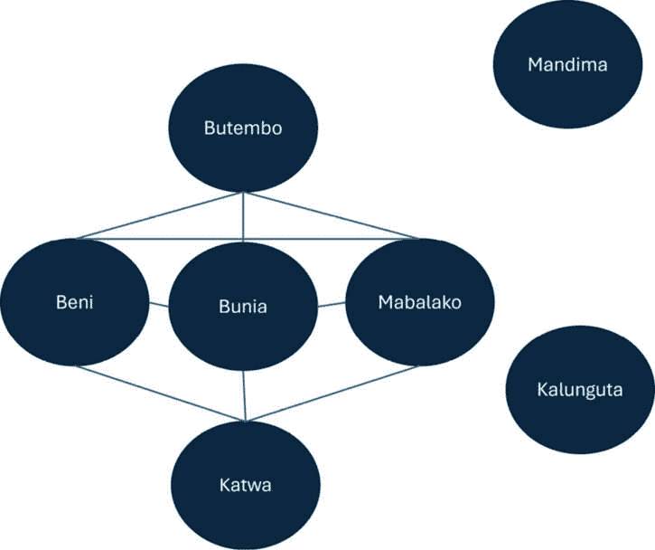

# 13

# 综合运用

在前面的章节中，我们探讨了适合网络科学解决方案的不同数据问题，学习了众多网络中心性指标，并将**机器学习**（**ML**）模型应用于网络科学数据集。在本章中，我们将把迄今为止所学的内容结合起来，评估时空数据集上的流行病风险，该数据集在每个时间点都评估了中心性指标和爱博拉病例数。我们的例子将包括 2018-2020 年大型爱博拉疫情以及自 2020 年以来几次较小疫情影响的刚果民主共和国的一个地理区域收集的网络和其他数据。我们还将介绍一个用于模拟时间序列数据的统计模型，类似于回归模型。

具体来说，本章将涵盖以下内容：

+   问题简介

+   **广义估计方程**（**GEEs**）简介

+   数据转换

+   数据建模

到本章结束时，你将了解如何使用网络科学工具和统计模型从头到尾解决问题。你将能够用 Python 运行时间序列模型并从数学角度解释结果。最后，你将具备将本书所学应用于你在工作中遇到的数据科学问题的能力。

# 技术要求

本章中展示的实用示例代码可以在以下链接找到：[`github.com/PacktPublishing/Modern-Graph-Theory-Algorithms-with-Python`](https://github.com/PacktPublishing/Modern-Graph-Theory-Algorithms-with-Python)

# 问题简介

爱博拉病毒是一种**丝状病毒**，是一种被脂质层包裹的单链核糖核酸（RNA）病毒。它于 1976 年首次被发现，是**动物源性**的——从感染动物宿主传播到人类群体。目前尚不清楚爱博拉病毒从哪种动物宿主传播给人类。然而，该病毒通过直接接触体液从人传人，使一线医疗工作者和家庭护理者面临感染和传播病毒的双重高风险。

爱博拉病毒抑制免疫反应，抑制凝血，促进肾脏和电解质功能障碍，并促进酸中毒。所有这些因素都导致低血容量，这在许多情况下会触发器官衰竭和死亡。它在非洲的几个地区是地方性的，包括刚果盆地，大多数疫情都起源于那里。在已知的疫情中，死亡率通常在 40-50%之间，通常是由于农村地区缺乏支持性护理，如输血和生命支持，这些地区经常出现最初病例。

在疫情爆发期间，个人防护装备对于避免医疗保健提供者之间以及被他们传播至关重要。然而，在许多农村地区，医疗用品的缺乏限制了医疗保健提供者自我保护的能力，这导致了疾病的早期传播。此外，隔离病例是必要的，以避免感染在诊所寻求护理的其他患者。*图 13.1*显示了一位身穿个人防护装备的医生在为隔离埃博拉患者而设立的诊所：


图 13.1 – 一位医生在临时诊所中穿着个人防护装备治疗埃博拉患者的插图

2013 年 12 月，埃博拉病毒最严重的爆发始于几内亚盖克杜省梅利安杜——一个病毒通过几内亚及其邻国塞拉利昂和利比里亚传播的小镇。最终，病例传播到意大利、马里、尼日利亚、塞内加尔、西班牙、英国和美国，这些国家中有几个报告了继发性病例（主要是医疗工作者）。到疫情结束时，近 30,000 人感染，超过 10,000 人死亡。病毒在 2016 年疫情结束时发生了多次突变，研究人员开发了一种疫苗来扑灭疫情并限制其在全球以及如几内亚的康科雷等大城市中的传播。繁殖数在利比里亚为 1.20，在塞拉利昂为 2.02，这导致了这三个主要受影响国家快速传播和高感染率。

2018 年，刚果民主共和国的埃博拉病毒爆发影响了伊图里省、北基伍省和南基伍省，病例集中在本尼、布滕博、卡图瓦、卡隆古塔、马巴洛科和曼迪马。到 2020 年，共确认和疑似病例超过 3,500 例，尽管当地和国际公共卫生工作者及时干预，并且有 2014 年西非埃博拉疫情期间开发的疫苗，但死亡人数超过 2,200 人。从 2018 年底到 2019 年中期，繁殖数一直超过 1，表明持续的感染潜力。事实上，大多数病例确实发生在这个时间段内。

由于城镇的隔离和公共卫生工作者的及时干预，及时干预将感染人数的可能数量限制在大约 16,000 人——而不是受影响省份的 1,600 万人——这限制了埃博拉病毒的传播。边界监控措施限制了病毒传播到邻近国家如布隆迪和卢旺达。然而，对国际援助工作者的不信任、与 M23 叛乱组织的持续冲突以及暴力事件蔓延到治疗区域，这些都使得当地和国际援助团体对疫情的应对复杂化。更好的应对协调和更好的处理安全威胁可能阻止了病毒的传播，并提高了生存率。

虽然本章将专注于模拟刚果民主共和国各地区埃博拉病毒传播所促进的网络模型，但我们将使用的方法可以扩展到与网络传播相关的任何类型的**偏微分方程**（**PDE**）模型。例如，对生态和保育感兴趣的读者可能会考虑使用网络科学方法来模拟影响叶海龙、巴哈马锯鲨或苏卡达陆龟种群的有毒物质的地理传播；他们还可能希望了解捕食者-猎物关系中逃避或延迟的情况。社会科学家可能会考虑一个地区内国家间政治意识形态的传播，或者在社会媒体运动中，人口层面的行为变化可能涉及延迟，变化发生在较长时间内或需要达到阈值才能看到效果。生物医学研究人员可能会考虑细胞分化和形态发生背景下的化学梯度模型，通过大脑皮层的癫痫传播，甚至大脑区域肿瘤生长的动力学。农民可能希望考虑限制蝗虫或其他危害农作物的害虫传播的空间模型，这些害虫可能面临有限的屏障资源。

现在，让我们回到我们的埃博拉病毒例子，并深入探讨疫情发生的背景。

## 爱博拉病毒在刚果民主共和国蔓延 – 2018-2020 年疫情

尽管公共卫生工作者做出了快速反应，但 2018 年的埃博拉疫情包括指数级增长的波次。许多受影响地区包括人口超过 10 万的城市，在疫情爆发前和爆发后，对医疗设施的军事袭击威胁了医疗基础设施和患者的及时护理。由于持续的冲突，许多主要城市以外的农村地区的风险人群犹豫不决地接受疫苗或遵循公共卫生建议。错误信息泛滥，延误了一些患者的治疗，并允许埃博拉病毒传播到护理人员。所有这些因素都促进了埃博拉病毒在受影响地区城市间的传播。

然而，伊图里、北基伍和南基伍的大部分地区包括茂密的雨林、野生动物保护区和稀疏的人口，这限制了城市之间的旅行，而城市之间的旅行通常是跨区域流行病传播的典型推动力（见图*13**.2*）。事实上，大部分传播发生在由交通连接的大城市之间。这可能会减轻与 2014 年西非疫情相比的影响，后者包括许多交通路线的城市：


图 13.2 – 刚果盆地保护区示意图

不幸的是，由于埃博拉动物宿主栖息的茂密森林地区中的城市，刚果民主共和国东北部的地理环境增加了该地区爆发疫情的可能性。这增加了该地区未来埃博拉疫情爆发的可能性。因此，研究一些促进流行病传播和脆弱性随时间变化的因素非常重要，这样一旦发现新的疫情，就能迅速有效地做出反应。这限制了暴露人数，随着越来越多的人接种疫苗和治疗，可能降低死亡率。

## 地理和物流

正如我们在前面的子节中看到的，区域地理和城市间的运输物流在流行病的潜在传播中起着重要作用。在一个流行病中，一个与其它地区几乎没有或没有人口混合的孤立地区表明该流行病是受控制的。然而，一个交通枢纽（例如每天有众多国际航班的城市）在爆发期间对公共健康构成的风险要大得多。事实上，这正是 COVID-19 迅速传播的原因；短的潜伏期加上来自国际枢纽的许多旅客前往其他国际枢纽，导致新国家和大陆的病例激增，直到边境关闭以阻止疾病的传播。

在我们的分析中，我们将考虑 2018 年埃博拉疫情影响最严重的几个地区，包括基于区域间运输路线的网络连通性指标，每年病例数，暴力事件数量（可能造成地区人口流动），以及 2017-2021 年的灾害事件数量（再次，区域流动风险）。我们假设从区域连通性中得出的网络指标将影响爆发期间的埃博拉病例数量。

在我们开始构建我们的数据集之前，让我们首先建立我们分析所需的工具——特别是，纵向回归建模。

# GEEs 简介

回归模型附带许多假设，这些假设需要放松以适应许多现实世界的问题。例如，线性回归假设结果呈正态分布。在许多问题中，我们可能希望处理二元结果数据（是/否，存活/死亡，复发/未复发……），计数数据（一段时间内的事件数量，如本章的结果），或制造产品的故障率（故障结果的可能性）。

最常见的输出分布之一来自二项分布，其中在整个人群中收集了二元数据。例如，我们可能有一个来自胶质母细胞瘤研究的患者样本，我们比较了不同治疗组的患者 6 个月生存率。每个患者要么存活要么死亡（二元结果）；按组汇总，这些结果形成二项分布，可以通过统计方法进行比较，以确定是否存在针对胶质母细胞瘤患者的最佳治疗方案。

**广义线性回归**通过使用连接函数将结果转换为正态分布的结果，扩展了线性回归到上述结果等，使用基于几何的映射；大多数类型的输出都适合这个框架，因为它们属于一个称为**指数族**的结果家族。指数族中的分布可以使用几何工具相互映射。

然而，广义线性回归伴随着许多与线性回归共有的假设：变量的线性独立性、预测变量与结果之间的线性关系，以及预测变量各水平上误差的恒定性（技术上称为同方差性）等。其中一些假设——即预测变量的独立性——对于时间序列或空间数据并不成立。在某一时间点测量的预测变量很可能依赖于先前时间点测量的那些变量的值。在我们的例子中，公共卫生工作者和医生能够及早识别疫情并阻止其蔓延的能力在后续病例率和资源需求中起着重要作用（如图*13.3*所示）：


图 13.3 – 医生和流行病学家追踪疫情来源的示意图

GEEs（广义估计方程）是一种解决方案，它将广义线性模型数学上转换为涉及多个时间点或数据集中聚类数据的模型。本质上，我们可以使用依赖相关性矩阵来建模时间（或聚类）之间的依赖关系。GEEs 保留了一个连接函数，允许它们在指数族内建模结果，例如我们跨地区的年度埃博拉病例数。

与其他针对时间序列或聚类数据的广义线性模型扩展方法相比，这种方法的一个优点是 GEEs 更容易计算。许多其他扩展，如广义线性混合模型，需要多级建模，涉及各级之间的依赖关系。这会在模型中创建额外的参数和依赖关系（这些依赖关系会创建条件分布）。GEEs 不涉及条件分布计算。这使得我们即使在模型中包含简单的时间序列或聚类组件时也能节省计算成本。

对于具有更高级数学背景的读者，我们将在下一节花一些时间深入探讨广义线性模型和 GEE 的数学。对于数学不太熟悉的读者可以跳过数学形式化，直接进入“我们的问题和 GEE 公式化”部分的**数据构建**部分。然而，了解回归方程背后的数学对于使用它们是有帮助的，并且鼓励有兴趣使用 GEE 的读者查阅章节末尾的参考文献，以获取更详细的数学解释。

## GEE 的数学

在**线性回归**中，当结果呈正态分布且观测值和预测值彼此独立时，我们通过矩阵代数的估计来估计每个预测变量的效应大小。对于每个观测值（表示为**向量**），结果已知，而对于每个观测值，预测变量也已知（表示为与每个预测变量相关联的向量矩阵）。结果向量等于效应大小向量乘以预测矩阵加上一个误差项，以捕捉测量中的随机误差。在实践中，使用矩阵运算解决这个问题是困难的，因此使用一个迭代估计效应大小的算法来解决这个问题。

广义线性回归通过引入一个应用于结果向量的链接函数来扩展这种方法，将方程转换为线性形式，通过应用算法找到效应大小系数。然而，为了重新缩放这些效应大小，使它们与链接函数应用之前原始结果的比例相匹配，我们需要反转链接函数的操作来适当地缩放效应大小。例如，在逻辑回归中，一个常见的链接函数涉及对数变换。对效应大小进行指数化重新缩放这些效应大小，使它们与结果的规模相匹配，而不是结果的对数。

在实践中，线性回归和广义线性回归模型使用**最大似然估计**（**MLE**）来拟合，这是一个迭代调整效应大小向量估计的算法。该算法通过迭代重采样根据假设的结果概率分布和观测到的预测变量分布进行拟合。这允许对效应大小的估计进行统计分析。

关于 GEEs，我们样本中个体随时间变化的输出和预测因子的聚类性质，为我们的样本中的每个个体引入了相关结构，以及基于结果的预测因子的样本效应大小。我们定义了一个关于个体内相关矩阵结构的最佳猜测，称为**自回归结构**，该结构可以从数据中估计、未指定或定义为将时间或空间上的观察值联系在一起的具体结构。在实践中，如果相关结构未知，则最好未指定或从数据中估计。在定义自回归结构后，我们估计协方差矩阵以纠正自回归规格中的任何假设错误。

然后一个算法估计个体内和个体间的效应大小。通常，用于拟合模型的算法依赖于计算 GEE 的线性代数公式的导数，而不是最大似然估计量的计算；基于导数的方法通常在计算上优于 MLE 方法。此外，基于导数的方法产生的模型输出类似于广义线性回归模型，尽管并非所有整体模型拟合统计量都可以估计。

对广义线性回归和广义估计方程（GEEs）的线性代数公式感兴趣的朋友们，可以参考本章末尾的参考文献，以获取这些模型及其用于寻找预测效应大小的估计量的详细解释。Nelder（1972）的文本很好地概述了广义线性模型及其计算理论。Hanley 等人（2003）的文本提供了 GEEs 的线性代数概述，以及一个简单案例研究，读者可以轻松计算出估计值。建议那些希望理解 GEEs 背后的数学原理的朋友们，在尝试解决如 GEEs 之类的从广义线性模型派生出的模型之前，先从广义线性模型的数学和计算方法学开始。

现在，让我们回到我们数据集的构建。

## 我们的问题和 GEE 公式

在我们关于刚果民主共和国时间和地理上埃博拉风险的公式中，我们将查看以下城市中每年埃博拉病例的数量作为我们的结果：

+   Mandima

+   Mabalako

+   Kangulata

+   Katwa

+   Butembo

+   Bunia

+   Beni

我们将按省份对这些城市进行聚类，包括伊图里省的 Mandima 和 Bunia，以及北基伍省的 Mandima、Mabalako、Kangulata、Katwa、Butembo 和 Beni。接下来，我们将构建城市之间的交通选择网络，并获取每个城市的介数和中心度。这将为我们提供每年网络中桥接性和枢纽性的估计值。

我们还将包括其他统计数据，包括那一年涉及我们城市的暴力事件数量以及影响我们城市的自然灾害数量。

对于一些埃博拉病例，我们将合并`ebola-epidemic-health-zone-figures.csv` **人道数据交换**（**HDX**）数据集（[`data.humdata.org/dataset/ebola-cases-and-deaths-drc-north-kivu`](https://data.humdata.org/dataset/ebola-cases-and-deaths-drc-north-kivu)），以包括我们分析感兴趣的城市。为了获得必要的交通，我们将在城市之间搜索可行的路线（骑自行车、乘坐公共交通或开车）。鉴于这是当前数据，我们还将搜索 2017-2021 年期间的变化，包括 COVID-19 限制。我们将使用**ReliefWeb**查找提及自然灾害的事件（[`reliefweb.int/disasters?list=Democratic%20Republic%20of%20the%20Congo%20Disasters&advanced-search=%28C75%29`](https://reliefweb.int/disasters?list=Democratic%20Republic%20of%20the%20Congo%20Disasters&advanced-search=%28C75%29)）。合并另一个 HDX 数据集将提供关于每个地区的暴力事件信息（[`data.humdata.org/dataset/ucdp-data-for-democratic-republic-of-the-congo`](https://data.humdata.org/dataset/ucdp-data-for-democratic-republic-of-the-congo)）。虽然这可能不会包括我们时间范围内该地区所有信息，但我们应捕捉到主要冲突或灾害。

现在我们已经拥有了数据源，让我们来探索数据并执行所需的转换，以便将数据转换为适合作为我们的 GEE 模型输入的格式。

# 数据转换

在我们组装数据集时，我们注意到一些关于数据质量的问题值得提及。在我们感兴趣的时期内，该地区发生的自然灾害非常少，并且这些灾害分布在一个广阔的地域。这个因素不太可能影响埃博拉传播，但我们将保留这个变量在我们的数据集中。

暴力事件的来源似乎缺少信息，因为已知在卡图瓦对援助工作者和埃博拉治疗场所的攻击并未包含在数据中。这表明数据源可能不完整，可能无法捕捉到影响埃博拉传播的实际世界分析所需级别的暴力事件。然而，为了演示这种方法，它捕捉到的信息足以在分析中可能具有潜在的兴趣。在类似这样的项目中，数据质量可能会存在问题，因为在许多发展中国家很难找到好的数据源。

对交通路线的搜索也存在疑问，提供了一些关于直接路线的见解，但不如理想的详细。我们认为，如果开车、乘坐公共汽车或步行旅行时间少于 10 小时，城市之间的任何路线都是可行的。大多数城市都产生了可用的数据；然而，一些城市没有显示可行的路线，在我们的旅行网络中产生了孤立的顶点。多年来在路由方面没有出现重大差异（没有列出创建新道路或公交路线的项目），因此我们的网络属性在多年内不会发生变化。

爱博拉病例源数据可能显示了一些错误，因为某些地点的累积病例有时随着时间的推移而降低。鉴于我们希望将结果建模为计数数据，我们倾向于保留每年正或零病例总数。在这样的大流行中确定病例可能很困难，因为实验室确认困难，并且当送到另一个城市进行分析时通常耗时。

因此，我们这个项目的数据收集突显了从零开始构建数据集的一些现实世界挑战，特别是在数据收集可能不完整或不存在于开源网站上的领域。通常，检查许多潜在来源并合并见解或选择最佳来源是有利的。在我们的情况下，我们选择了最完整的数据源来获取我们的数据集。

## Python 数据处理

从我们的来源中，我们组装了一个包含年份、城市、地区、冲突、灾害和爱博拉病例数据的`.csv`文件。然而，我们需要从我们的交通网络中计算**中介中心性**和**度中心性**，并将其添加到我们的数据集中，以捕捉每个城市的交通网络属性。

让我们从计算我们交通数据集中每个城市的中心性度量开始，这样我们就可以将这些值附加到我们的`.csv`文件中。我们将使用`Script 13.1`来计算这些度量：

```py
#install igraph and pycairo
!pip install igraph
!pip install pycairo
#import igraph, pandas, and numpy
import igraph as ig
from igraph import Graph
import numpy as np
import pandas as pd
import os
#import adjacency matrix
File ="C:/users/njfar/OneDrive/Desktop/DRC_Transport.csv"
pwd = os.getcwd()
os.chdir(os.path.dirname(File))
mydata =
    pd.read_csv(os.path.basename(File),encoding='latin1',header=None)
#create and plot graph
g_transport=Graph.Adjacency(mydata)
ig.plot(
    g_transport,bbox=(200,200),
    vertex_label = ["Beni","Bunia","Butembo","Kalunguta","Katwa",
        "Mabalako","Mandima"]
)
#calculate betweenness and degree centrality
bet=Graph.betweenness(g_transport)
deg=Graph.degree(g_transport)
#create vector to add to dataset
degree=deg+deg+deg+deg+deg
betweenness=bet+bet+bet+bet+bet
```

此脚本应该会生成一个显示两个孤立顶点和几个通过加权路径连接的顶点的图，路径的值为`1`、`2`或`3`，如图*图 13.4*所示：



图 13.4 – 爱博拉网络城市的图

从*图 13.4*中，我们可以看到 Kalunguta 和 Mandima 没有连接到其他城市，而其他城市似乎紧密连接到一个高流量区域。为了更全面地检查旅行，我们也可能考虑地区之间的旅行量；在我们的背景下，这些数据似乎不存在。

现在我们有了我们城市之间的桥梁性和中心度向量，这些向量捕捉了我们城市的桥梁性和枢纽性，我们可以将这些值附加到我们创建的数据集中，以便为使用 GEE 分析准备数据集。

## GEE 输入

现在我们已经推导出了我们的网络度量，让我们导入我们的收集数据集，并通过添加到`Script 13.1`来将网络度量作为额外的列：

```py
#import Ebola dataset
File ="C:/users/njfar/OneDrive/Desktop/Ebola_Data.csv"
pwd = os.getcwd()
os.chdir(os.path.dirname(File))
data = pd.read_csv(os.path.basename(File),encoding='latin1')
#add degree and betweenness to Ebola dataset
degree=np.array(degree)
betweenness=np.array(betweenness)
data['Betweenness']=betweenness
data['Degree']=degree
```

现在我们已经组装了完整的数据集，我们准备使用我们的 GEE 模型来分析它。

# 数据建模

对于我们的模型，我们将假设我们的结果具有**泊松分布**。虽然我们的数据集中零值不多，但考虑使用零膨胀泊松分布或负二项分布而不是泊松分布可能是有意义的。然而，为了建模的简便性，我们将我们的分布设置为泊松分布。

我们将使用数据推导出的自相关结构，因为对于城镇间时间上的相关性的最佳猜测并不明显。在实践中，通常从数据中推导出这种结构比在结构事先不太清楚的情况下进行猜测要好。

让我们开始使用 Python 建模这个 GEE。

## 在 Python 中运行 GEE

让我们首先导入我们的 GEE 模型，并使用`Script 13.2`定义分布族和协方差结构：

```py
#load packages
import statsmodels.api as sm
import statsmodels.formula.api as smf
#define GEE parameters
family=sm.families.Poisson() #count data
#data-derived covariance structure
cov_str=sm.cov_struct.Exchangeable()
```

现在我们已经定义了我们的模型，我们可以通过将相关预测变量添加到`Script 13.2`中来拟合我们的数据：

```py
#create GEE model predicting Ebola cases
Model = smf.gee(
    "Ebola_Cases~Province+ViolentIncidents+Disasters+Degree+Betweenness",
    "Town",
    data,
    cov_struct=cov_str,
    family=family
)
results=model.fit()
```

由于数据集规模较小，这个模型应该拟合得很快。较大的模型可能需要一段时间才能运行，尤其是那些具有大量簇和许多时间点的模型。然而，这个模型将比其他纵向模型（如广义线性混合模型）运行得更快，因为它没有层次结构或似然函数推导。

我们现在可以通过将相关内容添加到`Script 13.2`中来检查我们的模型参数和拟合统计量，以查看哪些因素可以预测我们数据中的爱博拉病例：

```py
#examine resulting model
results.summary()
```

这应该会给出类似于*表 13.1*的摘要：

| **GEE** **回归结果** |
| --- |
| 因变量： | 爱博拉病例 | 观察次数： | 35 |
| 模型： | GEE | 簇数量： | 7 |
| 方法： | 广义 | 最小簇大小： | 5 |
|  | 估计方程 | 最大簇大小： | 5 |
| 家族： | 泊松 | 平均簇大小： | 5.0 |
| 依赖结构： | 交换型 | 迭代次数： | 11 |
| 日期： | 周四，2023 年 12 月 21 日 | 规模： | 1.000 |
| 协方差类型： | 稳健型 | 时间： | 10:18:47 |
|  | **系数** | **标准误** | **Z** | **P>&#124;z&#124;** | **[****0.025** | **0.975]** |
| --- | --- | --- | --- | --- | --- | --- |
| 截距 | 3.8291 | 0.716 | 5.345 | 0.000 | 2.425 | 5.233 |
| 省份[T.North_Kivu] | 1.1145 | 0.699 | 1.593 | 0.111 | -0.256 | 2.485 |
| 暴力事件 | 0.0312 | 0.022 | 1.415 | 0.157 | -0.012 | 0.074 |
| 灾难 | -3.3828 | 0.323 | -10.467 | 0.000 | -4.016 | -2.749 |
| 度数 | -0.0098 | 0.093 | -0.105 | 0.917 | -0.192 | 0.173 |
| 介数 | -0.0806 | 0.975 | -0.083 | 0.934 | -1.991 | 1.830 |
| **偏度：** | **1.7851** | **峰度：** | **3.7263** |
| --- | --- | --- | --- |
| 偏度： | 1.3387 | 峰度： | 2.2241 |

表 13.1 – GEE 模型拟合统计量

*表 13.1* 显示，我们的大多数预测因子与每个城镇的埃博拉病例数量之间没有关系。灾害似乎与数量呈负相关（*z*-值为 `-10.467`，在 `p<0.001` 的水平上显著）。这可能关系到该地区为应对灾害而定位的相关资源，这些资源可以重新用于应对埃博拉疫情。请注意，暴力事件在统计上几乎达到显著性水平（*z*-值为 `1.415`，*p*-值为 `0.157`），表明与病例数量可能存在潜在的积极关系。在一个更大的样本和更好的暴力事件数据下，暴力事件很可能会成为埃博拉病例的预测因子，正如我们所假设的那样。北基伍的位置似乎有另一个几乎显著的关联（*p*-值为 `0.111`），表明它是一个重要的监测地点。其他潜在预测因子的 *z*-值接近 `0`，表明它们可能并不重要，即使在更大的样本量下也不太可能发挥作用。

我们认为我们的网络指标都不是埃博拉病例的显著预测因子。运输可能没有在疫情病例数量中发挥重要作用；考虑到一些地区的相对孤立，这在逻辑上是合理的。如果可以获得城市间的年度旅行量，它们可能更能预测随时间变化的埃博拉病例。然而，据我们所知，我们分析中考虑的城镇并没有这样的数据。

# 摘要

在本章中，我们将前几章中探讨的许多工具结合起来，以应对公共卫生领域的一个重大问题：埃博拉疫情。我们构建并分析了受埃博拉疫情影响的地区时空数据的属性。然后，我们使用 Python 将这些信息输入到一种纵向统计模型 GEE 中，以了解哪些因素可能导致了疫情随时间和地理空间的传播。

到目前为止，我们在本书中概述了许多工具，并已将它们应用于最终项目。接下来，我们将考虑网络科学中新兴的工具，这些工具为未来的项目提供了希望，包括超图和量子网络科学算法。

# 参考文献

Ballinger, G. A. (2004). 使用广义估计方程进行纵向数据分析。*组织研究方法,* *7(2), 127-150.*

Bolker, B. M., Brooks, M. E., Clark, C. J., Geange, S. W., Poulsen, J. R., Stevens, M. H. H., & White, J. S. S. (2009). 广义线性混合模型：生态学和进化的实用指南。*生态学与进化趋势,* *24(3), 127-135.*

Breslow, N. E. (1996). 广义线性模型：检查假设和加强结论。*应用统计学,* *8(1), 23-41.*

Gatherer, D. (2014). 西非 2014 年埃博拉病毒疾病疫情。*普通病毒学杂志,* *95(8), 1619-1624.*

Groseth, A., Feldmann, H., & Strong, J. E. (2007). 埃博拉病毒的生态学。*微生物学趋势,* *15(9), 408-416.*

Guetiya Wadoum, R. E., Sevalie, S., Minutolo, A., Clarke, A., Russo, G., Colizzi, V., ... & Montesano, C. (2021). 2018-2020 年刚果民主共和国埃博拉疫情：通过非洲国家间协调实现更好的应对。*风险管理与健康政策,* *4923-4930.*

Hanley, J. A., Negassa, A., Edwardes, M. D. D., & Forrester, J. E. (2003). 使用广义估计方程对相关数据进行统计分析：入门。*美国流行病学杂志,* *157(4), 364-375.*

Holmes, E. C., Dudas, G., Rambaut, A., & Andersen, K. G. (2016). 埃博拉病毒的进化：2013-2016 年大流行的见解。*自然,* *538(7624), 193-200.*

Jacob, S. T., Crozier, I., Fischer, W. A., Hewlett, A., Kraft, C. S., Vega, M. A. D. L., ... & Kuhn, J. H. (2020). 埃博拉病毒病。*自然综述疾病原初,* *6(1), 13.*

Liang, K. Y., & Zeger, S. L. (1986). 使用广义线性模型进行纵向数据分析。*生物计量学,* *73(1), 13-22.*

McKinney, W., Perktold, J., & Seabold, S. (2011). 使用 statsmodels 在 Python 中进行时间序列分析。*Jarrodmillman* *Com, 96-102.*

Nelder, J. A., & Wedderburn, R. W. (1972). 广义线性模型。*皇家统计学会 A 系列：社会统计学,* *135(3), 370-384.*

Vossler, H., Akilimali, P., Pan, Y., KhudaBukhsh, W. R., Kenah, E., & Rempała, G. A. (2022). 分析 2018-2020 年刚果民主共和国埃博拉疫情的个人层面数据。*科学报告,* *12(1), 5534.*

WHO Ebola Response Team. (2014). 西非埃博拉病毒病：疫情前 9 个月及未来预测。*新英格兰医学杂志,* *371(16), 1481-1495.*
