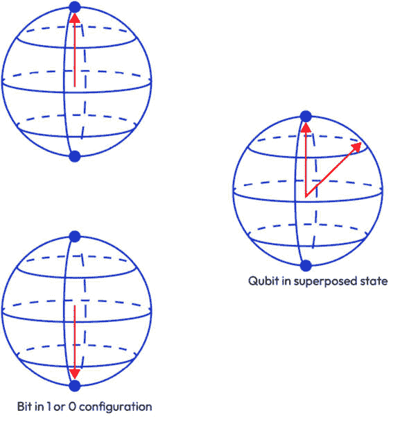
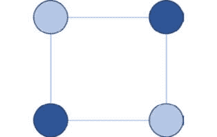
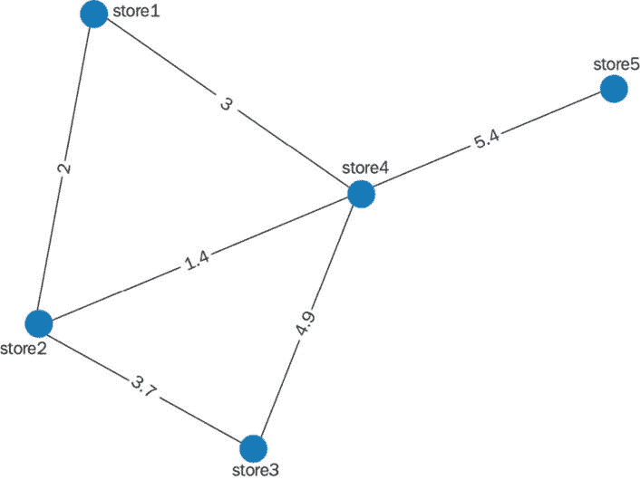
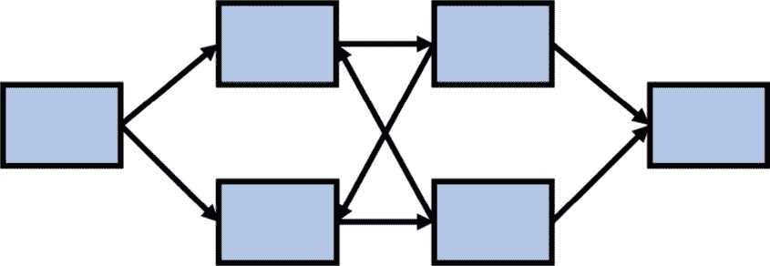
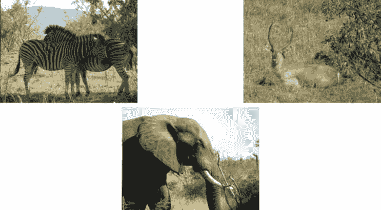
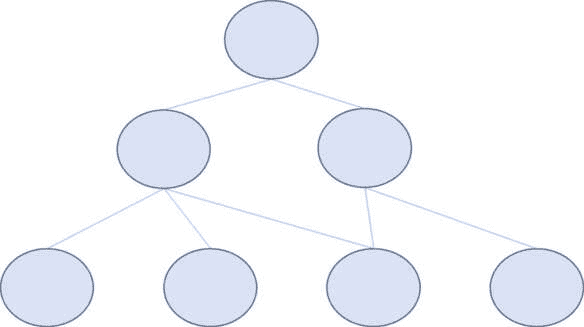
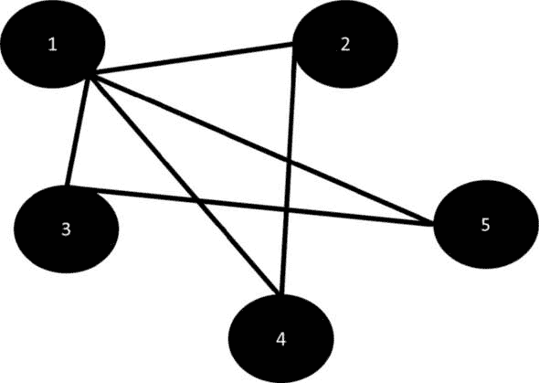

# 第十五章：新的领域

在前面的章节中，我们概述了网络科学在分析项目中的许多工具和应用。在本章中，我们将展望正在开发的新工具，这些工具在网络科学中有许多有希望的应用，包括量子图算法、深度学习/大型语言模型架构优化和多级图，这些图对于组织元数据和理解遗传数据非常有用。

虽然前面的章节包含了编码示例，但本章将侧重于思想和未来发展的可能性。网络科学是一个不断发展的领域，我们很可能现在无法想象的工具将在下一个十年内变得司空见惯。让我们深入研究一些新的应用，看看网络科学如何继续为许多不同领域的知识做出贡献。

具体来说，我们将涵盖以下主题：

+   量子网络科学算法

+   作为图的神经网络架构

+   层次网络

+   超图

# 量子网络科学算法

量子计算是网络科学算法开发的一个新且充满希望的途径。**量子计算**利用了量子层次物理的许多有利特性来提高计算能力并解决难题。尽管量子计算有许多不同的类型，但我们将专注于**量子位**系统，其中比特被它们的量子版本所取代。

量子位在计算框架中相对于比特提供了许多优势。`0`或`1`配置，量子位可以在被测量之前同时以`1`和`0`存在，测量后坍缩到比特的常规状态。这允许进行大规模并行搜索解决方案。

除了可以同时以`1`和`0`存在之外，叠加态还允许存在分数值，在概率意义上，量子位部分是`1`，部分是`0`。正因为这种分数状态，才有可能设计出作用于概率函数而不是单个比特状态的门。这种灵活性使得电路设计能够增强算法，并且这种计算方法在图像分类中已经显示出优势。*图 14.1*展示了量子位和比特之间的差异：

图 14.1 – 量子位与比特的可视化

许多类型的机器学习算法已经被翻译成可以在量子计算机上使用，以加快解的收敛速度或扩展算法以处理更大的问题。量子机器学习是一个活跃的研究领域，网络科学算法是量子机器学习研究中的一个较大领域。让我们更详细地探讨两个量子网络科学算法。

## 图着色算法

**图着色算法**是网络科学算法的一个分支，旨在找到图的色数。**色数**是着色网络顶点所需的最少颜色数，使得没有颜色相邻。在现实世界的应用中，色数对于确定通信系统中分配的信道数量或在并行处理中安排作业非常重要。着色网络顶点所需的最少颜色数代表完成上述任务所需的最少信道数或所需的最少作业数。*图 14.2*显示了具有四个顶点、四个边和色数为二的简单网络：

图 14.2 – 具有四个顶点、四个边和色数为二的简单网络

虽然**图 14.2**的色数容易确定，但计算网络色数通常被认为是非常困难的，即**NP-hard**，这意味着它不能在多项式时间内求解。具有高复杂度的算法意味着对于足够大或足够密集的网络，计算非常困难或目前无法实现。这在解决通信和作业调度问题时带来了问题，因为呼叫量或作业量非常大。

幸运的是，量子图着色算法允许算法在经典机器上运行得更快，从而为大型图提供更快的解决方案，甚至可能为非常大的图提供可计算的解决方案。然而，当前的量子硬件系统限制了可以运行量子图着色算法的图的大小，因为问题必须映射到物理系统。随着量子硬件支持越来越大的网络，色数计算将适用于更多现实世界的问题。

## 最大流/最小割

在*第四章*中，我们探讨了**运输物流**和**最大流/最小割算法**。回想一下，这个算法在分割网络流量方面很有用，并且可以用来规划交通网格上的道路关闭，例如*图 14.3*中显示的网格：

图 14.3 – 与五个商店（在第四章中考虑）相关的交通网格

寻找最优割以避免对每个这些五个商店（如*图 14.3*所示）的服务延迟是一个难以计算的难题，而计算效率高的解决方案为这些类型分析的可扩展性提供了良好的方法。

最大流/最小割算法的另一个常见用途是图像分割，其中确定图像的前景和背景。图像增强通常依赖于区分图像中不同的焦点部分。图像处理也需要一个前景/背景区分步骤。

就像计算色数一样，在处理经典系统时，在大或密集图上计算最大流/最小割最优解可能具有挑战性。这个算法的量子版本存在，并且比经典版本更容易优化解决方案。然而，硬件尺寸目前限制了量子最大流/最小割算法在大问题上的应用。

存在许多其他量子版本的网络算法，它们在小问题上取得了强有力的成果，代表着在硬件方面采用新方法扩展网络算法的稳固未来方向。随着硬件的发展，网络科学可能会受益，目前无法像其他网络科学算法那样扩展的网络科学算法将找到解决困难问题的途径。迄今为止，网络科学算法代表了量子机器学习研究的主要部分，鉴于它们的成功，网络科学和量子计算可能会继续相互影响。

让我们把注意力转向深度学习架构，这些架构可以在经典计算和量子计算中表述。

# 作为图的神经网络架构

在*第一章*中，我们提到了深度学习模型，特别是在生成式人工智能的背景下。深度学习模型出现在许多分析领域，包括**自然语言处理**、**图像分类**和**时间序列预测**。让我们更详细地探讨这些应用。

在大数据时代，自然语言处理无处不在。调查通常采用自由文本收集方法。客户提供产品文本评论。社会科学家在观察人群时做笔记（被称为**民族志研究**）。博主发布定期的内容以传播思想。法律、医疗和教育笔记可能包含需要解决的有偏见的内容，以保护人们免受限制未来机会和福祉的制度偏见。

所有这些数据在输入分类模型或探索性数据工具之前都需要进行解析。大多数执行此操作的工具依赖于能够连接句子或段落中分离的信息的深度学习模型，这些模型被称为**循环神经网络**。Python 中的许多常用包都依赖于预训练的循环神经网络，其中训练步骤已经在大型数据集上完成并保存为模型。更新预训练模型通常涉及根据新数据调整神经网络权重和/或连接，这些新数据可能来自特定的领域，如化学或法律。*图 14.4*显示了简单的循环神经网络架构。在实践中，循环神经网络可以有更多的隐藏层和节点，它们之间有连接：

图 14.4 – 一个简单的循环神经网络图，其中隐藏层以前向和反向的方式相互提供反馈

当今分析中的另一个关键任务是图像分类。社交媒体允许用户上传大量图像，涵盖各种主题，需要用主题信息进行标记，并在内容不安全时进行标记。陷阱相机和无人机允许对保护区内的野生动物和可能的偷猎者进行监控，这些图像需要进行分析以保护野生动物并分配有限的资源。农民现在可以使用机器人成像技术监测作物，然后将图像与疾病分类模型匹配，以早期识别作物中的疾病或损害，这些疾病或损害会危害当地食品来源或损害当地经济。*图 14.5*显示了三张图像，这些图像可用于南非克鲁格国家公园图像分类器的训练集中，以识别不同类型的动物：

图 14.5 – 在克鲁格国家公园拍摄的三个图像，这些图像可用于图像分类器的训练样本

从*图 14.5*中，请注意，从陷阱相机或调查中获得的图像可能不包括整个动物的图像，图像中可能包含多个动物，有树枝或其他杂乱物体遮挡图像，或者截断图像中的整个动物。这些都对图像分类造成问题，可能会增加样本大小需求或分类器架构复杂性。让我们在深度学习中探讨一些解决这些问题的潜在方案。

许多图像分类模型使用一种称为**卷积神经网络**（**CNNs**）的深度学习架构。CNNs 包含许多处理层和一些池化层，其中先前层中导出的特征被总结并输入到后续层中。这专注于训练过程中找到的最相关特征。正如在自然语言处理中一样，存在许多预训练模型，可以通过新数据更新来修改神经网络权重和连接。

现在我们对深度学习模型有了一些了解，让我们深入了解一些在深度学习模型中常见的架构以及这些架构如何表示为网络。

## 深度学习层和连接

尽管存在许多深度学习算法，但它们都包含由边连接的多个处理层，这些层由顶点组成。随着算法将层和连接拟合以优化其在训练和测试数据上的性能，深度学习架构的网络结构也随之演变。这意味着网络科学及其相关工具，如研究单纯复形时发现的那些工具，可以用于指导拟合过程或评估算法在特定基准上的表现。虽然这是一种相对较新的深度学习算法方法，但这种方法已经提高了模型拟合度，减少了获得良好拟合所需的样本量，并加快了训练速度。

在图像生成中，使用称为**持久同伦**的算法对过滤单纯复形特征的分类在通过深度学习算法（称为**生成对抗网络**）生成逼真的景观地形特征和医学特征（如血管分支）方面发挥了重要作用。我们在*第一章*中简要概述了这些生成器的基础，即图像生成器。网络拟合所测量的损失函数中的基于网络的度量组合促使算法生成更逼真的图像。

在医学背景下，人工图像集非常重要。构建图像分类器依赖于大量样本，而对于罕见疾病或小型医疗系统来说，这些样本可能不存在。通过图像生成进行数据增强使我们能够创建更大的样本量，并（希望！）生成现实图像，这些图像可以用于构建其他应用，例如图像分类器。这反过来又允许研究人员通过研究疾病不同阶段的细胞结构形态变化，或通过将患者样本与算法训练的增强先前患者数据进行匹配，尽可能快地识别侵袭性疾病，从而深入了解疾病的病因。

## 分析架构

从网络结构的角度来看，深层学习架构的另一个视角是通过使用网络科学工具分析它们来探索好的架构。**大型语言模型**（**LLMs**）是涉及数十亿到数万亿参数的巨大深度学习算法，它们需要在层及其连接中进行估计。它们在大量文本数据上训练，并且需要大量的计算资源来拟合模型。较大的模型通常比较小的模型表现更好，这需要更多的数据和计算能力。这并不理想，因为计算资源受硬件限制，并且对环境有重大影响。

网络科学为寻找好的、小型 LLM 架构提供了潜在途径，这些架构需要较少的训练数据和计算资源来拟合。当为代表性不足的语言构建模型时，这些架构对资源匮乏国家的开发者来说更容易获得，并且它们为可持续的 LLM 增长提供了途径。

将这种网络科学方法与训练数据相结合，也可以减少构建有效大型语言模型（LLM）所需的训练样本量。可以从 LLM 内部所需的每个结构或领域中抽取具有相似语言结构或内容的相关文档。这提供了可以更有效地使用较少资源进行质量检查的全面数据。更好的训练数据可以增强模型拟合，减少训练时间，并减少拟合良好模型所需的计算资源。现在，我们已对神经网络架构有了些许了解，让我们转向一种在其结构中整合层次和分层信息的网络类型。

# 层次网络

在*第十一章*中，我们在语言和遗传背景下遇到了本体和系统发育。**层次网络**建立在本体和系统发育的直觉之上；层次网络是树状网络，可以包括从树的顶部流向底部的多个源和汇。基因调控网络通常遵循这种层次网络结构，而不是严格的树状结构，其中网络中不存在多个源和汇，或者本体结构，其中父节点通常不存在。*图 14*.*6*展示了层次网络的一个示例：

图 14.6 – 一个层次网络示例，其中网络的第二层包含第三层顶点的父节点

研究基因调控可以为众多研究领域提供洞察，包括器官系统或物种内的进化途径、与基因失调相关的病理学，以及细胞功能的辨别。基因调控并不像理解基因途径本身那样简单。环境条件可以改变与 DNA 或 RNA 相关的蛋白质结构，使 DNA/RNA 对参与基因转录的蛋白质更易或更难接近。这反过来通常进一步改变这些蛋白质的结构，通过 DNA/RNA 的可及性上调或下调转录速率。

**基因组学**和**表观基因组学**（将遗传分析与环境条件相结合）的最近进展包括测量基因表达和基因周围蛋白质结构（这些结构反映了局部环境条件）的工具。通过在不同条件和不同遗传突变线路上测量这些表达水平，可以辨别生物体内的调控途径。

在考虑蛇毒表观基因组学中层次网络的一个例子之前，让我们从更理论的角度来探讨网络数据中的高级结构。

## 高级结构和网络数据

如果我们回顾一下*第十一章*，语言家族以一个源头开始——一个随着时间的推移演变为其他语言的初始语言。这为语言家族提供了一个由时间（通常还有地理）定义的层次结构。不同时期内出现不同的级别，从原始语言到该语言的现代派生语言。

在基因调控途径中，多个基因可以影响调控途径中后续步骤所涉及的基因，从而形成一个比树状结构更复杂的网络结构。然而，顺序仍然很重要，这导致了层次网络的出现。在生物研究中，这种结构可能很难通过实验室实验来辨别，因为结构不是一对一的，偶尔效果也不是线性的。然而，最近的技术进步允许研究人员通过改变环境或敲除途径中的基因，更容易地辨别这些途径。

现在我们对层次网络有了一些了解，让我们考察一个现实世界的用例，这些用例揭示了进化途径以及不同蛇毒生物特性的差异。有毒物种对许多环境的健康至关重要。近年来，对它们毒液的研究导致了人类疾病（包括非成瘾性止痛药、心脏病治疗和可以治疗耐药菌株的新抗生素）的药物突破。了解有毒物种之间的差异使研究人员和临床医生能够开发出更好的蛇咬受害者治疗方法，使医学研究人员能够研究可能对人类疾病药物治疗的药物有用的毒液特性，并使保护生物多样性成为可能。

## 使用基因家族的例子

有毒的蛇类通过控制的方式（攻击猎物）或非控制的方式（当蛇受到威胁时的防御性咬伤）消耗毒液。最终，毒液储存耗尽，蛇必须产生更多的毒液以生存。毒液主要由蛋白质和多肽组成；鉴于这一点，快速产生毒液会对**内质网**（**ER**），一个主要参与细胞内蛋白质生产的细胞器产生压力。这表明参与 ER 调节的基因家族可能在毒液调节和产生中发挥作用。

最近对草原响尾蛇的功能基因组学研究揭示了两个与毒液调节密切相关且独特的通路：

+   与激酶通路相关的细胞外通路

+   与内质网相关的蛋白质通路

这是有道理的，因为信号需要对外部条件（毒液浓度降低）和内部条件（过度工作的内质网）做出反应；在毒液浓度和细胞健康之间取得平衡，从启动和停止信号的角度来看，对于调节产生多少毒液是有意义的。有趣的是，这些通路在物种之间普遍存在，并且认为类似的通路可能参与了普遍的毒液调节。

让我们检查一个通路内遗传保守性的系统发育树。您可以在参考文献部分引用的 Perry 2022 论文中找到这张图片（*图 6**C*）。我们将在以下章节中讨论这张图片及其对进化途径的影响。

这棵树表明，在这个通路中研究的增强子区域对于有毒蛇种是保守的，在进化途径中发生了一些进一步的突变，从而产生了不同类型的毒液，这些毒液在受毒的猎物或捕食者体内具有不同的作用方式。

层次化网络使我们能够在多个级别上组织信息，例如佩里 2022 年论文中的*图 6**C*这样的可视化允许我们检查与层次化网络的组织原则相关的其他相关信息（如时间）。然而，层次化网络可能对于某些可视化来说不够灵活，在下一节中，我们将探讨一个更加灵活的可视化工具。

# 超图

网络科学中另一个令人兴奋的研究领域涉及**超图**，它是网络的扩展，其中多向关系可以包括多个顶点。以这种方式，边概念被扩展的方式与在*第六章*中“扩展网络度量用于时间序列分析”部分对单纯复形的边概念扩展方式相似。事实上，单纯复形的抽象是一种超图。

超图通常用于可视化数据库图和规划信息检索系统，在这些系统中，经常存在多对多的关系。一些分布式计算系统甚至提供超图算法来帮助进行这些大规模检索任务。

通过超图进行可视化在生物信息学中也得到了广泛的应用，其中蛋白质、生物途径、基因表达数据集和代谢过程之间存在多向关系。在复杂系统中，用视觉方式展示关系通常比展示矩阵或关系列表更容易。与包含许多重叠线条或复杂表格的图表相比，这种表示方式也更加紧凑。

让我们深入探讨超图可视化的细节，然后转向一个超图在生物信息学中简化数据可视化的真实世界示例。

## 显示信息

在科学领域，清晰简洁的沟通非常重要，尤其是在讨论可能对读者来说非常陌生的复杂或微妙概念时。与冗长、术语繁多的段落相比，准确简洁的信息图表为读者提供了材料的替代表示形式。这使得材料更容易被更广泛的受众接受。对于机器学习中的新算法或生物信息学中的新测量工具，一个很少被采用的好工具与一个被用来解决实际问题的工具之间的区别，往往是一个市场营销的问题。能够邀请读者深入材料的坚实沟通将导致受众更大、更多样化。

让我们考虑四种不同的方式来向观众传达生物网络复杂关系。第一种方式是通过文本。也许有五个途径在途径的某些阶段重叠。**途径 1** 沿着自己的途径直到与 **途径 2** 和 **途径 3** 合并，这两个途径最初重叠，但在与 **途径 1** 合并后分叉。**途径 4** 独立出现，然后与 **途径 2** 连接。**途径 5** 独立出现，然后连接到 **途径 3**。当你阅读文本时，你能在脑海中想象出这些途径吗？通过文本来可视化所有这些途径是困难的。

我们也可以通过关系表来展示这一点。对于五个途径，当使用途径表，例如 *表 14.1* 时，可视化并不糟糕。然而，考虑一下对于复杂的代谢过程或包含数十或数百个途径的基因网络，这样的表格会是什么样子。通过表格来可视化这些途径并不理想：

|  | **途径 1** | **途径 2** | **途径 3** | **途径 4** | **途径 5** |
| --- | --- | --- | --- | --- | --- |
| 途径 1 |  | X | X | X | X |
| 途径 2 | X |  |  | X |  |
| 途径 3 | X |  |  |  | X |
| 途径 4 | X | X |  |  |  |
| 途径 5 | X |  | X |  |  |

表 14.1 – 显示生物体内五个代谢途径之间途径重叠的表格

现在让我们考虑一个网络，其中每个途径用一个顶点表示，每个通过代谢途径的连接用一个边表示。虽然途径数量有限，不会产生一个特别混乱的图，但这种表示方法不会扩展，尤其是当途径边随着顶点数量的增加而扩展时。当达到十个途径时，使用这种方法很难辨别哪些边连接哪些顶点。*图 14.7* 展示了代谢途径的例子，以网络的形式可视化：

图 14.7 – 代谢途径中关系的网络表示

最后，让我们考虑这些途径及其重叠的超图表示。这种方法看起来有点像显示集合重叠的维恩图，不同的颜色或纹理将关系解析为相关项目的集合。如果数据包含时间成分，我们甚至可以为代谢途径的每个分支点创建演化的超图表示。当途径数量增加时，这更容易向读者传达，将这个演化的网络视为项目集合，使得在变化和属性方面更容易进行计算。*图 14.8* 展示了一个包含时间成分的超图表示：

图 14.8 – 随时间变化的代谢途径的超图表示

*图 14.8* 体现了路径合并信息和路径运行至完成的时间维度。这比文本或表格表示更容易理解，并且比简单的网络图更容易扩展。超图是有效的可视化工具，对于复杂问题具有很好的扩展性。

## 元数据

经常情况下，网络中包含关于边或顶点的元数据，这些数据通常存储在表中。正如我们在本节前面提到的，超图在处理复杂数据库时是很有用的工具。实际上，超图数据库已经存在，并且在 OWL 数据库的数据管理、语言主题模型、文档存储等方面可以非常有帮助。与图数据库相比，超图数据库的灵活性包括能够轻松捕捉和表示数据表、文档或文档集之间的多向连接和交互。

在回到我们的生物信息学例子时，超图数据库非常适合管理与基因、蛋白质、代谢途径或其他相互关联的过程集相关的生物信息学数据。层可以表示途径重叠的不同方面、不同时间段或具有重叠代谢或调节途径的不同生物体。

考虑前一小节中的毒液例子。一个超图数据库可以包含与有毒生物体中产生的毒液相关的所有已知基因途径。系统发育关系、分布地理、抗毒血清类别和其他类型的元数据可以用来将基因途径分组连接起来，以促进对特定基因或调节功能在生境、物种以及与人类种群相互作用中的研究。随着新论文的发表定期更新此类知识将加速该领域的研究，并以一种便于研究人员访问的方式将不同知识分支联系起来。

考虑到超图数据库的实用性，我们预计在未来几年内，网络科学这一领域将会有更多的发展。

# 摘要

在本章中，我们通过将网络算法与量子计算框架相结合，推动了网络科学的极限，增强了我们对现代数据科学中无处不在的深度学习算法扩展性的理解，并探讨了在分子生物学和遗传学中至关重要的特殊类型网络。网络科学在数据科学中扮演着重要角色，为常见问题提供可扩展性和新颖的解决方案。随着网络科学领域的发展，数据科学及其从业者将继续受益。我们希望这本书能为任何与数据工作的人提供装备和灵感，通过使用数据来推动知识的边界并解决世界上的难题。加入我们吧！

# 参考文献

Berkolaiko, G.，& Kuchment, P. (2013). *量子图论导论* (No. 186). 美国数学学会。

Biamonte, J., Wittek, P., Pancotti, N., Rebentrost, P., Wiebe, N., & Lloyd, S. (2017). *量子机器学习*. *自然*, *549*(7671), 195-202.

Cerezo, M., Verdon, G., Huang, H. Y., Cincio, L., & Coles, P. J. (2022). *量子机器学习中的挑战与机遇*. *自然计算科学*, *2*(9), 567-576.

Cui, S. X., Freedman, M. H., Sattath, O., Stong, R., & Minton, G. (2016). *量子最大流/最小割*. *数学物理杂志*, *57*(6).

Ekanayake, E. M. U. S. B., Daundasekara, W. B., & Perera, S. P. C. (2022). *网络中最大流的新方法以及运输问题的最优解*. *现代应用科学*, *16*(1), 30.

Feng, S., Heath, E., Jefferson, B., Joslyn, C., Kvinge, H., Mitchell, H. D., ... & Purvine, E. (2021). *生物网络的高阶图模型以识别对病原体病毒反应至关重要的基因*. *生物信息学杂志*, *22*(1), 1-21.

Iordanov, B. (2010). *Hypergraphdb：一种通用图数据库*. 在 *Web-Age Information Management: WAIM 2010 国际研讨会：IWGD 2010, XMLDM 2010, WCMT 2010, 九寨沟，中国，2010 年 7 月 15-17 日修订选集 11* (pp. 25-36). Springer Berlin Heidelberg.

James, D. F., Kwiat, P. G., Munro, W. J., & White, A. G. (2001). *量子比特的测量*. *物理评论 A*, *64*(5), 052312.

Karlebach, G., & Shamir, R. (2008). *基因调控网络的建模和分析*. *分子细胞生物学评论*, *9*(10), 770-780.

Leighton, F. T. (1979). *用于大型调度问题的图着色算法*. *国家标准局研究杂志*, *84*(6), 489.

Perry, B. W., Gopalan, S. S., Pasquesi, G. I., Schield, D. R., Westfall, A. K., Smith, C. F., ... & Castoe, T. A. (2022). *蛇毒基因表达由新型调控架构和多条脊椎动物途径的整合所协调*. *基因组研究*, *32*(6), 1058-1073.

Titiloye, O., & Crispin, A. (2011). *图着色问题的量子退火*. *离散优化*, *8*(2), 376-384.

Vidya, V., Achar, R. R., Himathi, M. U., Akshita, N., Kameshwar, V. H., Byrappa, K., & Ramadas, D. (2021). *毒肽——疼痛管理中的全面转化视角*. *当前毒理学研究*, *2*, 329-340.

Wittek, P. (2014). *量子机器学习：量子计算对数据挖掘的意义*. Academic Press.
