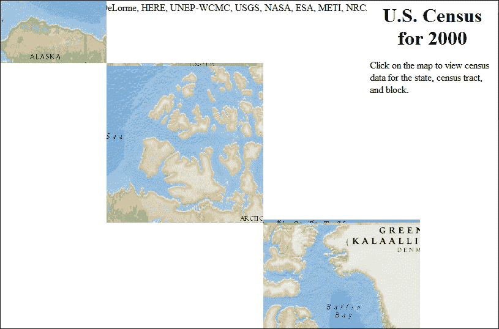
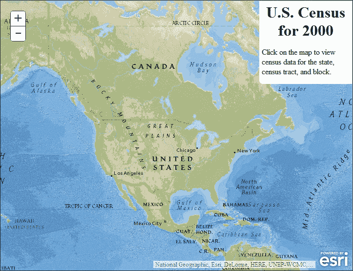
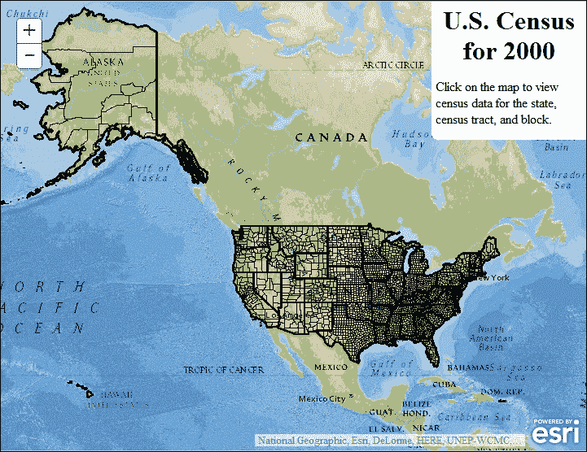
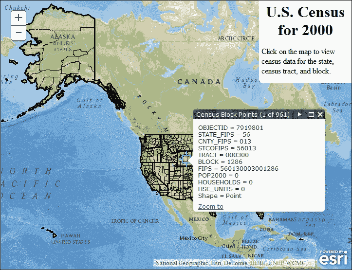

# 第一章. 你的第一个地图应用

假设你有一张地图。你已经使用 ESRI 提供的一种桌面地图和数据分析软件 ArcGIS Desktop 对其进行了数字化处理。你已经经历了绘制点、连接线和检查多边形边界的繁琐过程。你已经添加了漂亮的背景航空影像，并应用了使地图可读的所有部分。

你将如何与公众分享这张地图呢？你可以在公共信息办公室张贴它，但市民们抱怨说那个地方太偏远，而且地下有太多的楼梯。你也可以制作一千份印刷品，但这会非常昂贵。

如果你运行并连接到 Web 服务器的 **ArcGIS Server** 软件，你可以将你的地图在线发布，并通过运行 **ArcGIS JavaScript API** 的网站提供服务（[`developers.arcgis.com/javascript`](http://developers.arcgis.com/javascript)）。

ArcGIS JavaScript API 是一个与 ArcGIS Server 一起工作的 JavaScript 库，它将地图制作者与公众连接起来。地图制作者可以使用 ESRI 的产品，例如 ArcMap，来生成地图文档。然后，该地图制作者可以通过 ArcGIS Server 发布地图文档。从那里，加载了 ArcGIS JavaScript API 的网页可以在浏览器中绘制地图，并让公众平移、识别和与地图交互。

在本章中，我们将涵盖以下主题：

+   使用 ArcGIS Server 和 ArcGIS API for JavaScript 创建网络地图应用的要求

+   使用 JavaScript API 提供的 HTML head 和 body 内容来服务地图

+   如何使用 ArcGIS JavaScript API 创建地图并添加内容

+   如何制作一个交互式地图

# API 的功能

ArcGIS JavaScript API 提供了许多构建健壮网络地图应用所需的工具。它可以生成**可滑动**的地图，即允许用户平移和缩放的交互式地图。其行为类似于 Google 或 Bing 地图，但使用的是你的数据。你控制着内容，从背景影像到标记和弹出内容。使用 ArcGIS Server，你可以控制地图的布局方式，以及你使用的颜色、样式和字体。该 API 还附带了一些自定义元素，允许你从在地图上绘制、搜索数据、在地图上测量事物到以多种格式打印地图等一切操作。

ArcGIS JavaScript API 是基于 **Dojo** 框架构建的 ([www.dojotoolkit.org](http://www.dojotoolkit.org)). 由于 Dojo 与 API 一起打包，您还可以访问一个广泛的免费 HTML 表单元素、控件和布局元素库，用于您的 Web 应用程序。这些 Dojo 用户控件已在多个浏览器中进行了测试，并包括一个完整的库，可用于制作移动应用程序。虽然 ArcGIS JavaScript API 是用 Dojo 构建的，但它也与 jQuery 和 AngularJS 等其他库很好地协同工作。

ArcGIS JavaScript API 是与 ArcGIS API 一起设计和构建的，用于 Flash 和 Silverlight。与其他需要专用编译器、插件和相关软件的 API 不同，ArcGIS JavaScript API 可以用简单的文本编辑器编写，并在大多数常见浏览器上查看，无需任何特殊插件。由于移动浏览器，如 iPad 的 Safari 和 Android 的 Chrome，不支持第三方插件，因此 ArcGIS JavaScript API 是创建移动平台交互式地图网站的优选选择。

### 小贴士

现在，使用 Windows Notepad 编写网站代码成为可能，就像在没有向导的情况下攀登珠穆朗玛峰一样。但一旦出现问题，您可能会想使用具有语法高亮和其他功能的免费文本编辑器，例如 NotePad++ ([`notepad-plus-plus.org/`](http://notepad-plus-plus.org/))、Aptana Studio 3 ([`www.aptana.com/products/studio3.html`](http://www.aptana.com/products/studio3.html)) 或 Visual Studio Code ([`code.visualstudio.com`](http://code.visualstudio.com))，适用于 Windows；Brackets ([`brackets.io`](http://brackets.io)) 或 Textmate ([`macromates.com/`](http://macromates.com/))，适用于 Mac；Kate ([`kate-editor.org/`](http://kate-editor.org/))、Emacs ([`www.gnu.org/software/emacs/`](http://www.gnu.org/software/emacs/)) 或 vim ([`www.vim.org/`](http://www.vim.org/))，适用于 Linux。如果您想使用不免费但提供更多功能和支持的文本编辑器，可以查看 Sublime Text ([`www.sublimetext.com/`](http://www.sublimetext.com/)) 或 Webstorm ([`www.jetbrains.com/webstorm/`](http://www.jetbrains.com/webstorm/))。

# ArcGIS JavaScript API 社区

ArcGIS JavaScript API 拥有一个活跃的开发者社区，他们愿意在您学习过程中提供帮助。ESRI 有博客，在那里他们发布更新，并在全国乃至全球的各个城市举办聚会。许多 ArcGIS JavaScript 开发者，无论是 ESRI 内部还是外部，都在 Twitter 和其他社交媒体平台上非常活跃。

### 注意

您可以通过书籍和网站找到许多资源来帮助您学习 ArcGIS JavaScript API。对于书籍，您可以查阅 Eric Pimpler 的《Building Web and Mobile ArcGIS Server Applications with JavaScript》，Hussein Nasser 的《Building Web Applications with ArcGIS》，以及 Rene Rubalcava 的《ArcGIS Web Development》。对于在线资源，您可以访问 ESRI GeoNet（[`geonet.esri.com/community/developers/content`](https://geonet.esri.com/community/developers/content)），查看 GIS StackExchange 上的 arcgis-javascript-api 标签（[`gis.stackexchange.com/questions/tagged/arcgis-javascript-api`](http://gis.stackexchange.com/questions/tagged/arcgis-javascript-api)），或访问 ESRI GitHub 页面（[`github.com/esri`](https://github.com/esri)）。

# 我们的第一张 Web 地图

现在介绍部分已经结束，我们应该开始使用 API 进行工作了。在本章中，我们将查看一些代码，这些代码将创建一个简单的交互式地图。示例将是一个单页应用程序，所有的样式和编码都在同一页上。在现实世界中，我们希望将这些内容分别存放在不同的文件中。对于这个示例，项目由以下内容组成：

+   设置 HTML5 网页

+   添加必要的样式和 ArcGIS JavaScript 库

+   框架我们的 HTML 内容

+   设置创建地图的脚本

+   加载图层文件

+   添加点击事件以从地图服务收集数据

+   在地图上显示这些数据

## 我们的作业

我们刚刚被 Y2K 历史学会要求制作一个关于 2000 年左右美国的交互式地图应用程序。他们希望该应用程序能够显示该年的美国人口统计，包括性别、年龄和种族。在审查客户的要求后，我们确定 2000 年的人口普查数据将提供我们所需的全部地图和人口统计数据。

经过一番研究，我们找到了一个提供 2000 年人口普查数据的 ArcGIS Server 地图服务。我们可以使用 ArcGIS JavaScript API 在 HTML 文档上显示这些数据。用户将能够点击地图，应用程序将按州、人口普查区和人口普查区块组显示人口普查数据。

# 设置 HTML 文档

让我们打开我们最喜欢的文本编辑器并创建一个 HTML 文档。由于我们正在处理人口普查数据，让我们将其命名为`census.html`。我们将从一个 HTML5 模板开始。浏览器将通过页面顶部的适当文档类型将其识别为 HTML5。我们的 HTML5 页面开始如下：

```py
<!DOCTYPE html>
<html>
<head></head>
<body></body>
</html>

```

## 从头部开始

HTML 文档的头部包含有关页面信息，包括标题、页面内容的元数据、**层叠样式表**（**CSS**）链接，告诉浏览器如何渲染输出，以及开发人员需要浏览器在读取页面其余部分之前运行的任何脚本。以下是一个简单网页的示例：

```py
<!DOCTYPE html>
<html>
<head>
 <meta http-equiv="Content-Type" content="text/html;charset=utf-8"/>
 <meta http-equiv="X-UA-Compatible" content="IE=Edge" />
 <meta name="viewport" content="initial-scale=1, maximum-scale=1,user-scalable=no"/>
 <title>Census Map</title>
 <link rel="stylesheet" href="http://js.arcgis.com/3.13/esri/css/esri.css" />
 <style>
 html, body {
 border: 0;
 margin: 0;
 padding: 0;
 height: 100%;
 width: 100%;
 }
 </style>
 <script type="text/javascript">
 dojoConfig = {parseOnLoad: true, debug: true};
 </script>
 <script type="text/javascript" src="img/" ></script>
</head>
…
```

### 小贴士

**下载示例代码**

您可以从您在[`www.packtpub.com`](http://www.packtpub.com)的账户中下载示例代码文件，以获取您购买的所有 Packt Publishing 书籍。如果您在其他地方购买了这本书，您可以访问[`www.packtpub.com/support`](http://www.packtpub.com/support)并注册，以便将文件直接通过电子邮件发送给您。

让我们分别查看每个项目。

### 元标签和标题标签

文档头部的标题和元标签向浏览器和搜索引擎提供了更多关于页面的信息。以下代码是一个示例：

```py
<meta http-equiv="Content-Type" content="text/html;charset=utf-8"/>
 <meta http-equiv="X-UA-Compatible" content="IE=Edge" />
 <meta name="viewport" content="initial-scale=1, maximum-scale=1,user-scalable=no"/>
 <title>Census Map</title>

```

一些标签告诉搜索引擎如何读取和分类你网站的内容。其他标签，如本文件中的元标签，告诉浏览器如何显示和操作页面。在前面代码中，第一个元标签我们设置了用于渲染文本的字符集。第二个元标签告诉 Internet Explorer 浏览器使用最新版本加载页面。第三个元标签告诉移动浏览器内容已缩放到正确大小，禁用了在屏幕上用手指捏或展开来放大或缩小文本的能力。这与放大或缩小地图比例尺不同，并且大多数移动浏览器需要此标签才能放大或缩小地图。

### 级联样式表

网站的样式由 CSS 决定。这些样式表告诉浏览器如何将元素放置在页面上，为每个元素指定颜色，如何分配空间，等等。您可以在当前文档中看到它们的排列方式：

```py
<link rel="stylesheet" href="http://js.arcgis.com/3.13/esri/css/esri.css" />
 <style>
 html, body {
 border: 0;
 margin: 0;
 padding: 0;
 height: 100%;
 width: 100%;
 }
 </style>

```

以下是三种使用 CSS 组织和控制元素样式的办法：

+   首先，我们可以通过向 HTML 元素（例如`<div style="..."></div>`）添加样式属性，使用内联样式为页面上的单个元素应用样式。

+   其次，我们可以通过使用内部样式表（由`<style></style>`标签表示）来为整个页面应用样式。

+   第三，我们可以通过引用外部样式表（由`<link rel="stylesheet" … />`表示）来为多个样式表应用样式。对于我们的单页应用程序，我们将使用我们自己的内部样式表和由 ESRI 提供的外部样式表。

ArcGIS JavaScript 库需要它自己的样式表来正确地在屏幕上定位地图。没有这个文件，地图将无法正确渲染，因此无法显示预期结果。要加载库所需的样式表，请添加一个`link`标签，并将`href`属性设置为指向`esri.css`文件。

如果你正在使用 3.2 或更高版本，并且你的地图在页面上以棋盘图案显示，每隔一个方块显示地图瓦片，那么最可能的问题是`esri.css`样式表没有加载。请确保你引用了正确版本的`esri.css`样式表。以下图片展示了这种行为示例：



### Dojo 配置脚本

我们的 JavaScript 代码添加了一个变量，告诉 Dojo 如何加载，在第一个脚本标签中。从这个脚本中，我们可以告诉浏览器如何解释我们文档中特别定义的 HTML 元素，我们是否希望浏览器缓存所有文件，甚至如何将包和其他库加载到 Dojo 构建系统中：

```py
 <script type="text/javascript">
 dojoConfig = {
 parseOnLoad: true, 
 cacheBust: true
 };
 </script>

```

在这个例子中，我们告诉 Dojo 在页面加载时解析 body 中任何特别装饰的 HTML 元素，并用适当的 Dojo 小部件替换它们。使用 `cacheBust` 参数，我们还要求浏览器在加载文件时使用时间戳，这样文件就不会在浏览器中缓存。添加时间戳会强制浏览器加载 JavaScript 文件的最新副本，而不是依赖于缓存的副本。处于开发中的缓存脚本可能不会显示您所做的最新更改，这会减慢开发速度并增加故障排除时间。

### 小贴士

加载 `dojoConfig` 对象的脚本必须在你加载 ArcGIS JavaScript API 之前。如果 `dojoConfig` 对象是在 API 脚本引用之后创建的，则 `dojoConfig` 的内容将被忽略。

### ArcGIS JavaScript API 脚本

ArcGIS JavaScript 库是您将用于从 ArcGIS Server 渲染、操作和与地理数据交互的主要工具：

```py
<script type="text/javascript" src="img/" ></script>

```

本应用以及其他书中的应用都使用了 ArcGIS JavaScript API 的 3.13 版本。这是在编写本书时可用的新版。在维护这些应用时，请注意版本号更新。ESRI 经常发布新版本以添加新功能，修复旧版本中的错误，并确保 API 与最新浏览器兼容。

## 从 head 移动到 body

在设置好 HTML head 之后，我们可以专注于应用的身体部分。我们将在身体中添加 HTML 元素，其中包含地图和其他信息。我们将从内联样式表中设置这些功能。最后，我们将编写一个脚本以处理地图创建、人口数据检索以及对地图事件的响应。

### 框架 HTML body

我们的客户指定他们希望应用显示两个面板，一个主地图面板和一个单独的面板，解释用户应该做什么。我们将通过使用 HTML `div` 元素划分区域来满足这一请求。`div` 元素是 HTML 中的通用内容块。在第一个 `div` 中，我们将添加一个 `instructions` 样式类，并填充适当的说明。在第二个 `div` 中，我们将应用特定的 `id` 元素 `map`，以告诉我们和 ArcGIS JavaScript API 应该在哪里放置地图：

```py
<body>
 <div class="instructions">
 <h1>U.S. Census for 2000</h1>
 <p>Click on the map to view census data for the state, census tract, and block.</p>
 </div>
 <div id="map"></div>
</body>
```

### 添加一些样式

我们需要为我们添加的新元素添加一些样式。为此，我们将修改应用程序头部部分的原始内部样式表。我们的客户希望地图占据整个屏幕，在右上角留出一点空间用于地图标题和说明。客户还没有决定颜色，但他们要求使用今天大家都在网站上使用的圆角。

因此，在审查需求并查找如何设置元素样式后，让我们在`<style></style>`元素内添加以下内容。以下代码片段中的更改已被突出显示，以帮助您看到以下代码中发生了什么变化：

```py
<style>
  html, body, #map {
 border: 0;
 margin: 0;
 padding: 0;
 width: 100%;
 height: 100%;
  }
 .instructions {
 position: absolute;
 top: 0;
 right: 0;
 width: 25%;
 height: auto;
 z-index: 100;
 border-radius: 0 0 0 8px;
 background: white;
 padding: 0 5px;
 }
 h1 {
 text-align: center;
 margin: 4px 0;
 }
</style>
```

这里是对我们添加的样式的解释。我们希望 HTML 文档，地图`<div>`没有边距、边框或填充，并占据整个页面的高度。我们还希望具有说明类`<div>`元素精确地定位在右上角，占据页面宽度的百分之二十五，然后其高度将自动确定。说明块将浮起 100 z-index 单位向用户（将其置于我们的地图之前），其左下角将有一个 8 像素半径的曲线。它将有一个白色背景，并在左右两侧有一些填充。最后，标题`<h1>`将水平居中，上面和下面有一些填充。

### 在末尾添加脚本

如果我们现在查看我们的网页，我们不会看到太多。只有一个标题和右上角的说明。我们需要将这个普通的页面转换成一个功能齐全的地图应用程序。为此，我们需要通过 JavaScript 指导浏览器如何将我们的地图`<div>`转换成地图。

在我们的`<body>`标签结束之前，我们将添加一个脚本标签，在其中我们将编写我们的 JavaScript 代码。我们将脚本放在 HTML 文档的末尾，因为与图像和样式表不同，浏览器一次只加载一个脚本标签。当浏览器正在加载脚本时，它不会加载其他任何内容。如果您将其放在页面的开头，用户可能会注意到一点延迟，即在页面加载之前的延迟。当我们把脚本放在末尾时，用户会被页面上的图像和其他元素分散注意力，以至于不会注意到您的脚本何时加载。这使得它看起来加载得更快：

```py
  <div id="map"></div>
 <script type="text/javascript"></script>
</body>
```

那么，为什么我们没有在页面末尾加载 ArcGIS JavaScript 库呢？有时，尤其是如果您正在使用 Dojo 的其他部分，我们需要在浏览器加载页面时操纵库。在这种情况下，我们将库引用放在 HTML 文档的头部。

现在我们有了用于编写一些 JavaScript 的脚本标签，我们可以编写一个交互式地图。但是，在我们开始编写代码之前，我们需要了解如何使用 ArcGIS JavaScript API 和 Dojo。我们将从一个简短的历史课开始。

在网络开发的美好时光里，甚至直到今天，JavaScript 库试图通过创建一个全局对象（例如 JQuery 的`$`或 Yahoo 的 YUI）来避免相互冲突。库的所有功能都会集成到这个对象中。如果你使用过 Google Maps API，你可能使用过`google.maps.Map()`来创建地图，以及`google.maps.LatLng()`来在地图上加载一个点。库的每个子部分都通过点(`.`)分隔。

ArcGIS JavaScript 库的旧版本并无不同。所有 ESRI 的地图库都被加载到主"esri"对象中。你可以使用`esri.map`创建一个地图，并通过`esri.layer.FeatureLayer`加载它来显示一些数据，例如。Dojo 框架也是类似的，使用`dojo`、`dijit`和`dojox`全局对象。

但这种类似树状结构的 JavaScript 库设计方法有其缺点。随着库的扩展和成熟，它会积累很多开发者并未经常使用的部分。我们可能只使用库中的一个或两个特定功能，但可能不会使用库提供的每一个工具和功能。我们未使用的库部分浪费了客户端带宽，增加了内存负担，并使得我们的应用看起来加载速度更慢。

# 异步模块定义

ArcGIS JavaScript API 和 Dojo 都决定通过引入**异步模块定义**（**AMD**）的概念来解决库膨胀的问题。在 AMD 中，库被分解成模块化组件。开发者可以选择他们想要包含在应用程序中的库的部分。通过只加载所需的模块，我们可以减少下载时间，释放浏览器内存中未使用的功能，并提高性能。

AMD 的另一个优点是避免命名冲突，或者说是控制库加载时变量名的开发者。此外，加载的库的作用域限制在调用函数内部，就像一个自执行的语句。

在基于 AMD 的应用程序中，我们列出我们想要使用的库模块，通常是一个字符串数组，库知道如何解释它。然后我们跟随一个函数，该函数加载大多数或所有这些模块到 JavaScript 对象中。我们可以在函数中使用这些模块来获取我们想要的结果。

# 加载所需模块

要利用 Dojo 的 AMD 风格，我们将使用 Dojo 的`require`函数。在旧例子中，我们会创建多个`dojo.require("")`语句来加载我们需要的 ArcGIS JavaScript 库的部分（并且希望在我们想要使用它们的时候）。但使用 AMD 风格时，我们使用一个单一的`require`函数来请求我们请求的库列表，并在所有库在浏览器中加载后，在函数中加载它们：

```py
  <div id="map"></div>
  <script type="text/javascript">
    require([], function () {});
  </script>
</body>
```

`require` 函数接受两个参数，一个字符串数组，对应于我们库中的文件夹位置，以及一个在那些库加载后运行的函数。在第二个函数中，我们添加参数（函数括号内的变量）与列表中加载的库对应。

因此，对于这个应用程序，我们需要从 ArcGIS JavaScript API 中获取几个模块。我们需要创建一个空地图，并以我们称之为层的格式向地图添加数据。我们需要在地图上识别事物，从我们点击地图的位置检索所需的普查数据，然后显示它：

```py
<div id="map"></div>
<script type="text/javascript">
  require([
 "esri/map",
 "esri/layers/ArcGISDynamicMapServiceLayer",
 "esri/tasks/IdentifyParameters",
 "esri/tasks/IdentifyTask",
 "esri/InfoTemplate",
 "dojo/_base/array",
 "dojo/domReady!"
 ], function (
 Map, ArcGISDynamicMapServiceLayer,
 IdentifyParameters, IdentifyTask, InfoTemplate,
 arrayUtils
 ) {
 // code goes here
 });
</script>
```

注意 require 语句中加载库的顺序以及以下函数中的参数。列表中的第一项对应于函数中的第一个参数。在创建更复杂的应用程序时，混淆元素顺序是一个常见的错误，尤其是如果它已经被修改多次。确保列表中的项目随着列表的下降而对应。

你可能已经注意到，尽管加载了七个库，但只有六个参数。最后加载的库，即 `dojo/domReady!` 库，告诉 require 语句的第二个函数不要运行，直到所有 HTML 元素都已加载并在浏览器中渲染。

# 地图对象

现在我们有了组件，我们需要创建一个交互式地图；让我们将它们组合起来。我们将首先构建一个 `map` 对象，它为我们提供了所需的基础和交互平台。地图构造函数接受两个参数。第一个参数，要么是 HTML 节点，要么是节点的 `id` 字符串，表示我们想要放置地图的位置。地图构造函数的第二个参数是一个 `options` 对象，我们在其中添加使地图按预期工作的可配置选项：

```py
function (
    Map, ArcGISDynamicMapServiceLayer,
    IdentifyParameters, IdentifyTask, InfoTemplate,
    arrayUtils
  ) {
 var map = new Map("map", {
 basemap: "national-geographic",
 center: [-95, 45],
 zoom: 3
 });
  });
```

在前面的代码中，我们正在创建一个具有 `id` 为 `map` 的 `div` 元素中的地图。在地图中，我们添加了一个 **基础地图**，或背景参考地图，采用国家地理的风格。我们将地图中心定位在北纬 45° 和西经 95°，缩放级别为三。我们将在后面的章节中更深入地讨论这些配置。如果你使用桌面浏览器查看结果，你应该看到包括阿拉斯加和夏威夷在内的美国，如下面的图像所示：



### 小贴士

如果你有过使用 Dojo 的经验，大多数元素构造函数都有选项，然后是节点或节点的 `id`。这与我们构建地图的方式相反。记住，顺序很重要。

# 层

几年前，地图部门在透明的 Mylar 薄膜上绘制地图。绘制这些薄膜需要付出艰辛的努力，并且要保持相同的比例。当 Mylar 薄膜堆叠在一起，并且每一层的对应点对齐时，它们会提供重叠地图层的视觉混合。

今天，我们可以通过基于浏览器的地图应用程序创建相同的效果。而不是使用清晰的 Mylar 薄片，该应用程序利用分层图像文件和矢量图形来创建相同的效果。在 ArcGIS JavaScript API 中，我们将这些可堆叠的地图数据源称为**层**。

ArcGIS JavaScript API 可以接受来自不同来源的多种类型的层文件。有些层非常灵活，可以被重新定位和重新投影以与其他地图源对齐。这些通常被称为**动态层**。其他层由特定比例绘制的图像组成，并不设计得那么灵活。这些通常被称为**瓦片层**。

在我们的当前应用程序中，我们添加的国家地理背景被认为是瓦片层。它的预渲染内容在浏览器中快速加载，这是使用瓦片层的一个优点。另一方面，我们的普查数据的数据源是由 ArcGIS Server 地图服务提供的动态层。其动态特性有助于它拉伸并与我们的瓦片背景对齐。以下是我们将用于添加层的代码：

```py
var censusUrl = "http://sampleserver6.arcgisonline.com/arcgis/rest/services/Census/MapServer/";
var map = new Map("map", {
      basemap: "national-geographic",
      center: [-95, 45],
      zoom: 3
    });

var layer = new ArcGISDynamicMapServiceLayer(censusUrl);

map.addLayer(layer);

```

因此，如果我们现在查看页面，我们应该看到一个世界地图，每个州、普查区和区块周围都有黑色线条。我们可以放大地图以查看更多细节。您的地图应该看起来像以下图像：



# 添加一些动作

到目前为止，我们有一个绘制所有州、普查区块和轨迹数据的地图。我们需要更多。我们需要一种让用户与网站交互的方式。ArcGIS JavaScript API 集成了由原生 JavaScript 语言提供的许多工具，以及由 Dojo 提供的新工具。

## 事件

当我们中的许多人学习传统编程时，我们了解到程序遵循线性设计。它们从第一行开始，到最后一行结束。计算机按顺序执行每个计算，并且不会继续到下一行，直到当前行完成。

但 JavaScript 添加了不同的东西。JavaScript 添加了一个事件循环，它监视特定的网站交互，例如文本框中的变化。我们可以将一个函数，通常称为**事件监听器**，附加到一个已知元素的事件。当该事件被触发时，事件监听器就会运行。

例如，按钮有一个点击事件，如果我们为按钮的点击事件附加一个事件监听器，那么该函数将在每次点击按钮时响应。我们还可以通过通过点击事件传递的数据来获取有关按钮的信息。

对于我们的应用程序，我们希望地图在被点击时执行某些操作。如果我们查看支持的地图事件列表，我们可以使用 `.on()` 方法附加事件监听器。`.on()` 方法接受两个参数，一个是事件的字符串描述，另一个是当事件发生时希望被调用的事件监听器函数。支持的事件列表可以在 ArcGIS JavaScript API 文档中找到：

```py
map.addLayer(layer);
function onMapClick (event) {
}
map.on("click", onMapClick);

```

在我们可以对地图进行任何操作之前，我们需要知道它是否已经加载。如果我们在我们最快的计算机上运行更新的浏览器，并且有高速互联网连接，地图可能会立即加载，但如果我们从较旧的智能手机上的移动浏览器进行测试，互联网下载速度较慢，地图可能不会很快加载。

在我们分配点击事件之前，我们将测试地图是否已加载。如果是这样，我们将把 `onMapClick` 函数作为事件监听器添加到地图的 `click` 事件。如果不是，我们将等待地图触发其 `load` 事件来设置 `click` 事件。为了在添加地图点击事件时避免重复，我们将把这个赋值放在另一个函数中：

```py
function onMapClick(event) {
}
function onMapLoad() {
  map.on("click", onMapClick);
}
if (map.loaded) {
 onMapLoad();
} else {
 map.on("load", onMapLoad);
}

```

## 任务

虽然开发者可以编写使用 JavaScript 执行大量任务的代码，但有些任务最好留给服务器。ArcGIS JavaScript API 通过 **任务** 对象向服务器发送请求。有计算复杂形状面积和周长的任务，有查询并返回地图中特征的空间和非空间数据的任务，还有创建包含我们正在查看的地图的 `.pdf` 文档的任务，以及其他许多任务。这些任务减轻了浏览器执行可能非常慢的复杂计算的负担。它们还允许库更轻量，因此库不需要加载一个坐标系统到另一个坐标系统之间的所有转换因子的集合，例如。

大多数任务分为三个部分：任务对象、任务参数和任务结果。任务对象使我们能够向 ArcGIS 服务器发送特定任务的请求，并包括可能需要引用的一些任务的常量。任务对象通常接受一个 URL 字符串参数，告诉任务将请求发送到哪个 ArcGIS 服务器服务端点。任务参数对象定义了我们从任务中需要获取的信息。最后，在执行任务并从服务器接收响应后，我们得到一个结构化对象，或称为任务结果的列表。任务、任务参数和任务结果的格式可以在 ArcGIS JavaScript API 文档中找到，网址为 [`developers.arcgis.com/javascript/jsapi/`](https://developers.arcgis.com/javascript/jsapi/)。

在我们的代码中，我们将使用一个名为 `IdentifyTask` 的任务方法。我们将告诉 `IdentifyTask` 方法通过我们的普查 URL 联系 ArcGIS 服务器。在地图点击事件处理程序内部，我们将创建一个名为 `IdentifyParameter` 的任务参数对象。我们将使用关于我们点击的点以及地图上的数据来配置它。最后，我们将执行 `IdentifyTask` 方法，传入 `IdentifyParameters` 对象，以从我们点击的位置检索普查数据：

```py
layer = new ArcGISDynamicMapServiceLayer(censusUrl),
 iTask = new IdentifyTask(censusUrl);

function onMapClick (event) {
  var params = new IdentifyParameters();
 params.geometry = event.mapPoint;
 params.layerOption = IdentifyParameters.LAYER_OPTION_ALL;
 params.mapExtent = map.extent;
 params.returnGeometry = true;
 params.width = map.width;
 params.height= map.height;
 params.spatialReference = map.spatialReference;
 params.tolerance = 3;
 iTask.execute(params);
}
```

## Deferreds 和承诺

几年前，当 FORTRAN 统治着计算机编程世界时，有一个语句让开发者们在调试代码时感到疯狂：`GOTO`。使用这条代码行，会打断应用程序的流程，使应用程序跳转到另一行代码。从一个代码段跳转到另一个代码段，在最好情况下也使得跟踪应用程序的逻辑变得困难。

随着现代 JavaScript 和异步开发的出现，跟踪某些异步应用程序的逻辑也可能变得困难。当用户点击按钮时，应用程序会触发一个 AJAX 请求以获取数据。在数据成功返回后，另一个事件被触发，这使得地图执行一些需要一点时间的事情。地图完成后，它会触发另一个事件，以此类推。

Dojo 通过创建 **Deferreds** 对象来应对这个问题。Deferred 对象返回一个承诺，表示异步过程的结果即将到来。等待结果的函数只有在承诺得到满足后才会被调用。使用返回 Deferred 结果的函数，开发者可以使用 `.then()` 语句将函数链接在一起。`.then()` 语句仅在结果得到满足后才会启动其参数中的第一个函数。可以将多个 `.then()` 语句与返回 Deferred 对象的函数链接在一起，从而实现有序且更易于阅读的编码逻辑。

在我们的 `onMapClick` 函数中，`IdentifyTask` 对象的 `execute` 方法返回一个 Deferred 对象。我们将把这个延迟结果存储在一个变量中，以便稍后可以被另一个工具使用：

```py
function onMapClick (event) {
  var params = new IdentifyParameters(),
 defResults;
  …
 defResults = iTask.execute(params);
}
```

# 展示结果

一旦我们收到数据，我们应该向用户展示结果。如果我们查看通过网络传递的数据格式，我们会看到一个复杂的 **JavaScript 对象表示法**（**JSON**）对象的列表。这些数据以原始形式，在普通用户手中将毫无用处。幸运的是，ArcGIS JavaScript API 提供了将此数据转换为更易于用户使用的工具和方法。

## 地图的 infoWindow

在现代地图应用程序如 Google Maps、Bing Maps 和 OpenStreetmaps 的时代，用户已经学会了，如果你在地图上点击某个重要位置，应该会弹出一个小窗口并告诉你更多关于该物品的信息。ArcGIS JavaScript API 为地图提供了一个类似的弹出控制，称为`infoWindow`控制。`infoWindow`在地图上突出显示特征形状，并叠加一个弹出窗口来显示与特征相关的属性。

`infoWindow`可以作为地图的一个属性来访问（例如，`map.infoWindow`）。从这一点起，我们可以隐藏或显示弹出窗口。我们可以告诉`infoWindow`要突出显示哪些特征。`infoWindow`提供了一系列可配置和控制点，以帮助创建更好的用户体验。

在我们应用程序的地图点击处理程序中，我们需要将搜索结果转换为`infoWindow`可以使用的形式。我们将通过向`IdentifyTask`对象的`execute`函数添加一个`.addCallback()`调用来实现这一点。我们将从`IdentifyResults`中提取特征，并创建一个特征列表。从那时起，我们可以将处理后的结果传递到`infoWindow`对象所选特征的列表中。我们还将提示`infoWindow`显示用户点击的位置：

```py
function onIdentifyComplete (results) {
 // takes in a list of results and return the feature parameter 
 // of each result.
 return arrayUtils.map(results, function (result) {
 return result.feature;
 });
}

function onMapClick (event) {
…
  defResults = iTask.execute(params).addCallback(onIdentifyComplete);
  map.infoWindow.setFeatures([defResults]);
 map.infoWindow.show(event.mapPoint);
}
```

你现在可以从你的浏览器中运行应用程序，并尝试点击地图上黑色轮廓线中的一个特征。你应该会看到一个用青色（浅蓝色）轮廓的形状，以及一个指向你点击位置的弹出窗口。弹出窗口会告诉你那里至少有一条记录（可能更多）。如果你点击弹出窗口上的小前后箭头，可以浏览所选结果（如果有多个）。

## `InfoTemplate`对象

到目前为止，我们可以看到我们数据的外形。问题是，我们看不到里面是什么。与我们在结果中看到的形状相关的重要表格数据，但弹出窗口还没有被告知如何显示信息。为此，我们可以使用一个`InfoTemplate`对象。`InfoTemplate`对象告诉弹出窗口如何格式化用于显示的数据，包括使用什么标题，以及我们希望如何显示搜索结果。`InfoTemplate`对象与特征数据、特征的几何形状和属性连接在一起。

`InfoTemplate`对象可以通过不同的方式构建，但最常见的是使用一个字符串来描述标题，另一个字符串来显示内容。内容可以包含任何有效的 HTML，包括表格、链接和图片。由于标题和内容是模板，你可以在模板字符串中插入特征属性。用`${fieldname}`包围你想要使用的字段名称，其中"fieldname"是你想要使用的字段的名称。如果你想在不进行任何特殊格式化的情况下显示所有字段名称和值，可以将`InfoTemplate`对象的内容值设置为`${*}`。

对于我们的应用程序，我们需要将`InfoTemplates`添加到`IdentifyTask`结果中。我们将使用`onIdentifyComplete`回调并将它们插入其中。我们将首先插入以下代码：

```py
function onIdentifyComplete (results) {
  return arrayUtils.map(results, function (result) {
    var feature = result.feature,
        title = result.layerName;
    feature.infoTemplate = new InfoTemplate(title, "${*}");
    return feature;
  });
}
```

在这段代码中，我们正在提取结果的图层名称，并使用它作为标题。对于内容，我们使用“显示所有内容”模板来显示所有字段和值。如果你现在在浏览器中运行网页，并点击一个要素，你应该看到以下图像：



现在，有很多难以阅读的字段名和可能无法理解的字段值。我们可以根据要素的图层名称应用不同的内容格式。查看前面的示例，我们主要对人口、家庭数量和住房单元数量感兴趣：

```py
function onIdentifyComplete (results) {
  return arrayUtils.map(results, function (result) {
    var feature = result.feature,
        title = result.layerName,
        content;

 switch(title) {
 case "Census Block Points":
 content = "Population: ${POP2000}<br />Households: ${HOUSEHOLDS}<br />Housing Units: ${HSE_UNITS}";
 break;
 default:
 content = "${*}";
 }
    feature.infoTemplate = new InfoTemplate(title, content);
    return feature;
  });
}
```

如果你再次在浏览器中运行页面，你应该看到更易读的结果，至少对于人口普查区块点来说是这样。其他要素，如州、县和区块组，将显示字段名及其对应值的列表，用冒号（`:`）分隔。我将把其他字段的模板留作你的家庭作业练习。

最后，你的代码应该如下所示：

```py
<!DOCTYPE HTML>
<html>
<head>
  <meta http-equiv="Content-Type" content="text/html; charset=utf-8" />
  <meta http-equiv="X-UA-Compatible" content="IE=Edge" />
  <meta name="viewport" content="initial-scale=1, maximum-scale=1,user-scalable=no"/>
  <title>Census Map</title>
  <link rel="stylesheet" href="http://js.arcgis.com/3.13/esri/css/esri.css">
  <style>
    html, body, #map {
      border: 0;
      margin: 0;
      padding: 0;
      height: 100%;
    }
    .instructions {
      position: absolute;
      top: 0;
      right: 0;
      width: 25%;
      height: auto;
      z-index: 100;
      border-radius: 0 0 0 8px;
      background: white;
      padding: 0 5px;
    }
    h1 {
      text-align: center;
      margin: 4px 0;
    }
  </style>
  <script type="text/javascript">
    dojoConfig = { parseOnLoad: true, isDebug: true };
  </script>
  <script src="img/"></script>
</head>
<body>
  <div class="instructions">
    <h1>U.S. Census for 2000</h1>
    <p>Click on the map to view census data for the state, census tract, and block.</p>
  </div>
  <div id="map"></div>
  <script type="text/javascript">
    require([
      "esri/map",
      "esri/layers/ArcGISDynamicMapServiceLayer",
      "esri/tasks/IdentifyParameters",
      "esri/tasks/IdentifyTask",
      "esri/InfoTemplate",
      "dojo/_base/array",
      "dojo/domReady!"
    ], function (
      Map, ArcGISDynamicMapServiceLayer,
      IdentifyParameters, IdentifyTask, InfoTemplate,
      arrayUtils
    ) {
      var censusUrl = "http://sampleserver6.arcgisonline.com/arcgis/rest/services/Census/MapServer/",
          map = new Map("map", { 
            basemap: "national-geographic",
            center: [-95, 45],
            zoom: 3
          }),
          layer = new ArcGISDynamicMapServiceLayer(censusUrl),
          iTask = new IdentifyTask(censusUrl);

      function onIdentifyComplete (results) {
        return arrayUtils.map(results, function (result) {
          var feature = result.feature,
              title = result.layerName,
              content;
          switch(title) {
            case "Census Block Points":
              content = "Population: ${POP2000}<br />Households: ${HOUSEHOLDS}<br />Housing Units: ${HSE_UNITS}";
              break;
            default:
              content = "${*}";
          }
          feature.infoTemplate = new InfoTemplate(title, content);
          return feature;
        });
      }

      function onMapClick (event) {
        var params = new IdentifyParameters(),
            defResults;
        params.geometry = event.mapPoint;
        params.layerOption = IdentifyParameters.LAYER_OPTION_ALL;
        params.mapExtent = map.extent;
        params.returnGeometry = true;
        params.width = map.width;
        params.height= map.height;
        params.spatialReference = map.spatialReference;
        params.tolerance = 3;

        defResults = iTask.execute(params).addCallback(onIdentifyComplete);
        map.infoWindow.setFeatures([defResults]);
        map.infoWindow.show(event.mapPoint);
      }

      function onMapLoad() {
        map.on("click", onMapClick);
      }

     map.addLayer(layer);

      if (map.loaded) {
        onMapLoad();
      } else {
        map.on("load", onMapLoad);
      }

    });
    </script>
  </body>
</html>
```

恭喜你，如果你这是第一次使用 ArcGIS Server 和 JavaScript 开发的网络地图应用程序。你已经完成了多个步骤，制作了一个工作状态良好的交互式地图应用程序。这个应用程序应该适用于所有最新的浏览器。然而，较旧的浏览器可能无法正确连接到服务器，可能需要代理。

# 关于代理的注意事项

如果你曾经长时间使用过 ArcGIS JavaScript API，或者不得不支持像 Internet Explorer 9 或更早的旧浏览器，那么你可能遇到过代理。代理是服务器端应用程序，代表网络浏览器进行网络请求，通常传输和接收浏览器本身无法收集的数据。浏览器需要代理与服务器通信有三个主要的原因。具体如下：

1.  浏览器是较旧的浏览器，不支持**跨源资源共享**（**CORS**），服务器请求将发送到应用程序所在的服务器之外的其他服务器。

1.  代理提供额外的安全密钥以访问特定数据，这可能包括开发者不希望公开的受保护令牌。

1.  网络请求的长度超过了`GET`请求的最大字符数 2048+。

第一个示例在较旧的浏览器中很常见，包括 Internet Explorer 9 或更低版本。由于安全限制，它们无法从与网络服务器分离的第三方服务器获取数据。根据 HTML5 CORS 规范，较新的浏览器可以检查是否允许从不在服务器上的脚本请求应用程序。

第二个示例在大型安全环境中很常见，需要跳过许多安全关卡。部门门户网站可以使用部门特有的令牌访问代理，提供额外的安全层。

第三个示例在用户传递具有许多不规则顶点的大几何体时很常见。例如，如果您使用绘图工具使用自由手绘工具绘制不规则形状，其顶点会在您在地图上移动时添加。由于有这么多点，并且这些点需要很多字符来显示它们的纬度和经度，所以形状请求可能超过浏览器的最大字符长度也就不足为奇了。

ArcGIS Server 代理可以从 GitHub 免费下载（[`github.com/Esri/resource-proxy`](https://github.com/Esri/resource-proxy)）。它们有与 Java、.NET 和 PHP 兼容的版本。请使用最新版本，并确保它已正确配置以用于您将使用的所有服务。

### 小贴士

如果您的计算机和 ArcGIS Server 都位于网络防火墙之后，并且 ArcGIS Server 具有独特的公共和私有 IP 地址，您的网络防火墙可能会阻止对 ArcGIS Server 的代理连接。如果您仅在较旧的浏览器上看到网络流量失败，例如 Internet Explorer 8，并且仅针对内部请求，那么防火墙可能是问题所在。请联系您的网络管理员以解决问题。

# 摘要

在本章中，我们学习了使用 ArcGIS JavaScript API 编写简单 Web 应用的基础知识，并构建了一个基于地图的应用程序。我们学习了如何在 HTML 文档的头部设置应用程序。我们学习了如何在页面上创建地图以及如何添加图层以便我们可以查看数据。我们还学习了如何通过任务检索要素形状和属性，以及如何向用户展示这些数据。

在下一章中，我们将更深入地探讨 ArcGIS JavaScript API 中可用的工具。
