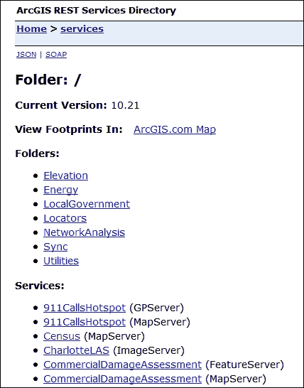
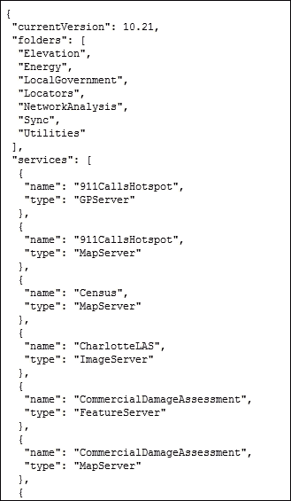
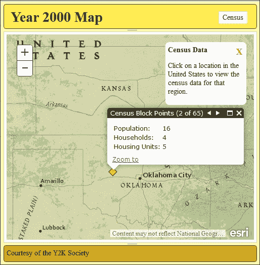
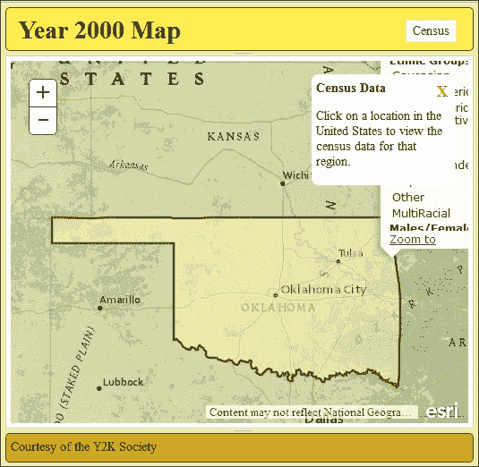

# 第四章。在 REST 中寻找平静

我们已经花费了几章讨论和构建使用 ArcGIS API for JavaScript 的应用程序。我们使用不同的 API 工具与 ArcGIS Server 通信，关于其地图服务。但 API 是如何与 ArcGIS Server 通信的呢？

在本章中，我们将专注于 ArcGIS Server。我们将探讨它是如何实现 REST 接口的。我们将回顾 ArcGIS REST API，该 API 在 [`resources.arcgis.com/en/help/arcgis-rest-api/#/The_ArcGIS_REST_API/02r300000054000000/`](http://resources.arcgis.com/en/help/arcgis-rest-api/#/The_ArcGIS_REST_API/02r300000054000000/) 中概述。这描述了服务器和浏览器之间传递的文件结构和数据格式。最后，我们将通过更改弹出高亮符号来扩展前一章的应用程序。

什么是 REST？REST 代表 **表征状态转移**。它是一种软件架构，它侧重于使用超媒体环境在服务器和客户端之间的接口。它限制了客户端和服务器之间可以执行的操作，但提供了足够的信息和文档，使用户能够在数据和状态之间导航。

在本章关于 ArcGIS Server 和 REST 的讨论中，我们将涵盖以下主题：

+   处理 REST 端点和数据格式

+   通过浏览器看到的 ESRI REST 服务层次结构

+   常见的 JSON 格式 REST 数据

+   如何使用 ArcGIS REST 服务和 JSON，如 REST 服务 REST API 要求中定义的那样

REST 是一种基于网页的方法论。一个网站展示一个状态（URL），数据传输（HTML 页面、CSS 和 JavaScript），以及一种良好的文档化方式在各个状态之间导航（链接）。虽然理解一个网站是 RESTful 的很好，但是什么让 ArcGIS Server 如此 RESTful 呢？

为了使一个网络服务被认为是 RESTful 的，它必须满足以下要求：

+   **客户端-服务器**：客户端和服务器的作用被明确定义。客户端不关心服务器包含一条或一百万条记录，服务器也不依赖于客户端的特定 UI。只要客户端和服务器之间的接口保持不变，客户端和服务器代码可以独立更改。

+   **无状态**：客户端处理应用程序的状态，而服务器不需要跟上它。客户端拥有进行请求所需的一切，包括必要的参数和安全令牌。

+   **可缓存**：有时客户端应用程序为了提高性能而缓存数据，因为万维网以异步方式交付数据。服务器需要告诉客户端哪些请求可以被缓存以及缓存多长时间。

+   **分层系统**：服务器端应用程序可以放置在负载均衡器、安全系统或代理后面，而对客户端应用程序没有明显的影响。

+   **按需代码（可选）**：服务器可以为客户端提供运行代码。例如包括 Java 小程序或 JavaScript 脚本。并非所有 REST 服务都这样做。

+   **统一接口**：使用 REST 服务，服务器通过一个统一的接口提供客户端与数据交互的方式。这个统一接口可以进一步分解为四个原则。

    +   包含资源标识的信息请求。这包括从数据源到输出类型的一切。

    +   客户端从请求中获取足够的信息来操纵或删除数据。

    +   服务器发送的消息包含有关如何使用它们的说明。

    +   状态是由客户端使用超媒体（网页、查询参数和会话状态）处理的。

如果您查看 ArcGIS 服务器实现，会发现它符合这些标准。因此，它被认为是 RESTful 的。

# 查看地图服务器

ArcGIS 服务器提供对其地图服务内容的网络访问。要访问内容，您需要知道 ArcGIS 服务器名称和站点名称。默认情况下，ArcGIS 服务器通过端口 `6080` 访达。如果它已配置并授权在端口 `80` 上提供网络内容，也可以通过该端口访问。REST 服务端点可以通过以下地址通过浏览器访问：

```py
http://<GIS Server Name>:6080/<site name>/rest/services
```

其中 `GIS 服务器名称` 指的是 ArcGIS 服务器机器，而 `站点名称` 指的是 ArcGIS 服务器实例，默认情况下是 `arcgis`，如果 ArcGIS 服务器已经设置为在端口 `80` 上传输流量，则端口号是可选的。这是互联网流量的默认端口。

当有多个 GIS 服务器时，通常处理大量的流量或复杂的服务，可能会安装一个网络适配器。网络适配器根据服务请求、负载均衡和其他相关问题将流量路由到多个 ArcGIS 服务器。网络适配器还提供一层安全性，其中 ArcGIS 服务器机器名称不会直接暴露给外界。要通过网络适配器访问 REST 服务，请使用以下 URL。

```py
http://<web server name>/<web adaptor name>/rest/services
```

只要 ArcGIS 服务器可以从我们的计算机访问，我们就可以在网页浏览器中访问信息。默认情况下，服务数据以 HTML 格式呈现。从那里我们可以看到 REST 服务的属性，并跟随链接到服务器上的其他服务和操作。这使得开发者可以在不创建任何应用程序的情况下审查和测试地图服务。

ArcGIS REST 服务提供了一种很好的方式，使用 HTML 查看和交互服务数据，这对于演示很有用。我们的大多数应用程序将通过服务器请求与 REST 服务交互。因此，ArcGIS 服务器可以通过另一种称为 JSON 的数据格式通过 REST 进行通信。

# 与 JSON 一起工作

**JavaScript 对象表示法（JSON）**为松散定义的数据结构提供了一种结构化数据格式。一个 JSON 对象由其他 JSON 对象构建而成，包括字符串、数字、其他对象和数组。任何数据都是允许的，只要所有内容都是自包含的，并且没有因为缺少括号和花括号而出现格式上的混乱。

有许多方法可以测试有效的 JSON。访问[`jsonlint.com`](http://jsonlint.com)，在那里你可以复制并粘贴你的 JSON，并提交它进行验证。它将指出缺失或格式错误的问题，以及如何解决它们。

随着你阅读这本书中的示例，你会发现 JSON 的格式并不总是相同的，尤其是在 JSON 对象键字段（或属性名）中。JSON 验证器要求所有字符串项都必须用引号括起来。单引号或双引号都行，只要你在字符串的末尾使用与开头相同的标记。这包括 JSON 对象键字段。浏览器中的 JavaScript 解释器更灵活，键字段不需要用引号括起来。这完全取决于你如何测试 JSON。

在 JSON 开发之前，数据是以一种称为**可扩展标记语言（XML）**的格式从服务器传递到客户端的。XML 是一种文档标记语言，它以人类和机器都能读取的格式显示数据。XML 格式可以被多种编程语言读取和解析。

与 XML 相比，JSON 是 Web 应用程序首选的数据格式有两个主要原因。首先，JSON 数据可以立即被 JavaScript 应用程序消费。XML 需要额外的步骤将数据解析成可用的对象。其次，JSON 数据占用的空间更少。让我们通过比较两个数据片段来探讨这一点。以下片段是用 XML 编写的：

```py
<mountain>
  <name>Mount Everest</name>
  <elevation>29029</elevation>
  <elevationUnit>ft</elevationUnit>
  <mountainRange>Himalaya</mountainRange>
  <dateOfFirstAscent>May 29, 1953</dateOfFirstAscent>
  <ascendedBy>
    <person>
      <firstName>Tenzing</firstName>
      <lastName>Norgay</lastName>
    </person>
    <person>
      <firstName>Edmund</firstName>
      <lastName>Hillary</lastName>
    </person>
  </ascendedBy>
</mountain>
```

现在，这是用 JSON 编写的相同数据：

```py
{
  "type": "mountain",
  "name": "Mount Everest",
  "elevation": 29029,
  "elevationUnit": "ft",
  "mountainRange": "Himilaya",
  "dateOfFirstAscent": "May 29, 1953",
  "ascendedBy": [
    {
      "type": "person",
      "firstName": "Tenzing",
      "lastName": "Norgay"
    },
    {
      "type": "person",
      "firstName": "Edmund",
      "lastName": "Hillary"
    }
  ]
}
```

在 JSON 中，相同的数据比 XML 少 62 个字符。如果我们去掉换行和额外空格，或者**最小化**数据，JSON 数据比最小化的 XML 数据短 93 个字符。考虑到带宽宝贵，尤其是在移动浏览器中，你可以看到为什么 JSON 是数据传输的首选格式。

## JSON 和 PJSON 格式

JSON 有两种风味。默认的 JSON 是经过最小化的，所有额外的空格和换行都已被移除。漂亮的 JSON，或简称 PJSON，包含换行和空格以显示数据的结构和层次。之前的珠穆朗玛峰示例显示了 PJSON 的样子。虽然 PJSON 更容易阅读，因此更容易调试错误，但最小化的 JSON 要小得多。在示例中，PJSON 有 397 个字符，而最小化版本只有 277 个字符，大小减少了 30%。

当查看 ArcGIS REST 服务数据时，你可以通过在 REST 服务 URL 中添加一个`f`查询参数来更改数据的格式。它应该看起来像以下 URL：

```py
http://<GIS web service>/arcgis/rest/services/?f=<format>
```

在这里，您可以设置 `f=JSON` 以接收原始 JSON 数据，或 `f=PJSON` 以接收人类可读的格式化 JSON（如果您更喜欢，也可以是填充的 JSON）。一些浏览器，如 Google Chrome 和 Mozilla Firefox，提供第三方扩展，可以将原始 JSON 数据重新格式化为 PJSON，而无需发出请求。

# 服务级别

让我们从查看示例 ArcGIS Server 服务开始，[`sampleserver6.arcgisonline.com/arcgis/rest/services`](http://sampleserver6.arcgisonline.com/arcgis/rest/services)。当我们以 HTML 的形式请求页面时，我们注意到一些事情。首先，显示了 ArcGIS Server 的版本（在撰写本文时为版本 10.21）。版本号很重要，因为许多功能和信息可能不会出现在旧版本中。其次，我们看到指向文件夹的链接列表。这些是按照发布者选择的任何方式组合的地图服务。我们还在文件夹列表下方看到地图服务链接列表。最后，在页面底部，我们看到支持的接口。在这个网站上，我们可以看到我们熟悉的 REST 接口。本书不会涵盖其他接口。以下是服务的图片：



如果我们将浏览器中 REST 服务请求的格式更改为 Pretty JSON，通过在 URL 末尾添加 `?f=pjson`，我们可以大致了解 ArcGIS JavaScript API 会如何查看此位置：



在这里，返回的 JSON 对象包括数字 `currentVersion`、文件夹名称的数组以及服务对象的数组。服务 JSON 对象包含一个名称和一个类型属性，这告诉您正在处理什么类型的服务，并提供了构建指向这些服务的 URL 链接所需组件。此格式如下：

```py
http://<server>/arcgis/rest/services/<service.name>/<service.type>
```

如果我们跟随链接到我们的人口普查地图服务，我们可以看到更多详细信息。

# 地图服务

地图服务使应用程序能够访问使用 ArcGIS Server 发布的地图数据。它包含有关地图布局、格式、内容和其他必要项的信息，以正确使用各种 ArcGIS API 渲染地图。地图服务 URL 的格式如下：

```py
http://<ArcGIS Server REST Services>/<mapName>/MapServer
or
http://<ArcGIS Server REST Services>/<folder>/<mapName>/MapServer
```

当您使用浏览器导航到地图服务时，您会看到有关地图服务的大量信息。HTML 提供了查看不同应用程序中数据的链接，包括 ArcGIS JavaScript API 和 ArcMap。如果地图服务已发布以提供该格式的数据，则还可以使用 Google Earth。地图服务的 HTML 还提供了大量元数据，以帮助您了解其提供的内容。这些属性包括**描述**、**服务描述**、**版权文本**和**文档信息**。

一些地图服务属性在没有上下文的情况下可能难以理解。我们将回顾一些重要的属性。请记住，此列表中的属性显示了它们在 HTML 中的列出方式。当以 JSON 显示时，这些项是驼峰式命名的（第一个字母小写，没有空格，并且每个新单词的首字母大写，第一个单词除外）。

+   **空间参考**：地图布局与真实世界之间的比较，我们稍后会讨论这一点。

+   **单个融合地图缓存**：让您知道地图数据是否已被缓存，或者是否是动态的。您可以使用`ArcGISTiledMapServiceLayer`或`ArcGISDynamicMapServiceLayer`分别加载图层。

+   **初始范围**/**完整范围**：当您首次使用 ArcGIS JavaScript API 加载地图时，初始范围描述了您第一次看到的区域的边界框。完整范围是地图服务的预期完整区域，可能比所有数据都要宽得多。

+   **支持的图像格式类型**：当 ArcGIS 服务器将地图层绘制为瓦片时，这些是可以返回的图像格式。如果您的数据有很多半透明度和颜色，则推荐使用`PNG32`，而`PNG8`与非常简单的符号配合良好。

+   **支持动态层**：如果为真，则开发人员可以在显示地图服务时更改符号和层定义。

+   **最大记录数**：在提交查询、标识或其他搜索时，这是地图服务可以返回的最大结果数。此信息只能通过服务器端对地图服务的更改来更改。

最后，地图服务 HTML 提供了到许多相关 REST 服务端点的链接。大多数这些链接扩展了现有的 URL，并提供了有关地图服务的更多信息。至少应该包含以下内容：

+   **图例**：显示地图服务中层的符号。

+   **导出地图**：此功能允许您下载一个图像，显示地图中适合特定边界框的区域。您可以指定参数。

+   **标识**：这允许您根据传入的几何形状在地图服务的所有层中识别功能。此功能由`IdentifyTask`使用。

+   **查找**：这允许用户根据传递给它的文本行的存在来搜索功能。此功能通过`FindTask`实现。

## 地图服务层

在探索地图服务的层时，了解要寻找的内容很有帮助。地图服务在其层属性中列出了其层的基内容，以对象数组的形式。

所有图层对象具有相同的格式，具有相同的属性。每个图层对象都有一个表示图层在列表中零基位置的数字 `id` 属性。图层对象还有一个 `name` 属性，它来自图层在地图服务中的命名方式。这些图层也有 `minScale` 和 `maxScale` 属性，显示图层可见的范围（0 值表示没有 `minScale` 或 `maxScale` 限制）。在确定可见性时，图层对象还包含一个布尔 `defaultVisibility` 属性，描述了图层在地图服务加载时是否最初可见。

地图服务图层对象还包含有关其图层层次结构的信息。每个地图图层对象包含一个 `parentLayerId` 和一个 `subLayerIds` 属性。`parentLayerId` 是一个数字，它引用了特定图层父组图层的索引。父层 `id` 为 `-1` 表示所讨论的图层没有父层。`subLayerIds` 是一个整数数组，其中包含可以找到特定父层子图层的索引。如果一个图层没有子图层，`subLayerIds` 将是一个 `null` 值，而不是空列表。你可以在以下代码中看到一个地图服务图层的示例：

```py
layers: [
  {
    "id" : 0, 
    "name" : "Pet Lovers", 
    "parentLayerId" : -1, 
    "defaultVisibility" : true, 
    "subLayerIds" : [1, 2], 
    "minScale" : 16000
    "maxScale" : 0
  },
  {
    "id" : 1, 
    "name" : "Dog Lovers", 
    "parentLayerId" : 0, 
    "defaultVisibility" : true, 
    "subLayerIds" : null, 
    "minScale" : 16000
    "maxScale" : 0
  },
  {
    "id" : 2, 
    "name" : "Cat Lovers", 
    "parentLayerId" : 0, 
    "defaultVisibility" : true, 
    "subLayerIds" : null, 
    "minScale" : 16000
    "maxScale" : 0
  }
],
      …
```

在前面的代码片段中，地图服务有三个图层。`Pet Lovers` 图层实际上是一个 `parentLayer`，对应于在 ArcMap `.mxd` 文件中分配的组图层。`parentLayer` 中有两个图层：`Dog Lovers` 和 `Cat Lovers`。所有图层默认都是可见的，并且根据 `minScale`，图层不会显示，直到地图的比例小于 1:16,000。`maxScale` 属性设置为零，意味着没有最大比例，图层会再次关闭。

# 特征服务

特征服务类似于地图服务，但提供了更多的功能。如果数据库和地图设置支持这些操作，它们的内容可以进行编辑。它们不需要图例服务即可显示其特征符号。它们的符号也可以通过更改其渲染器在客户端进行修改。特征服务的 URL 与地图服务类似，但以 `FeatureServer` 结尾，如下所示：

```py
http://<GIS-web- server>/arcgis/rest/services/<folder>/<mapname>/FeatureServer
```

特征服务首先和最重要的是其功能。除了允许你查询数据外，特征服务功能允许用户创建、更新和/或删除记录。熟悉 CRUD 操作的人会认出这些词作为 CRUD 中的 C、U 和 D（R 代表读取，即当你查询结果时发生的情况）。功能包括如果允许创建、更新或删除，则包括编辑。此外，如果特征服务支持将文件附件（如照片）附加到数据，则功能将包括“上传”一词。

还有其他特征服务属性可能有助于你了解该服务。它们包括以下内容：

+   **具有版本化数据**：让您知道地理数据库已启用版本控制，这允许撤销/重做编辑。

+   **支持断开连接编辑**：数据可以在没有互联网连接的环境中签出并进行编辑。当应用程序再次连接到互联网时，数据可以被签回。

+   **同步启用**：如果这是真的，则要素数据可以在数据来源的地理数据库和另一个地理数据库（另一个书籍的主题）之间同步。

+   **允许几何更新**：如果允许编辑，这会让 API 知道要素几何是否可以编辑。由于某些权限，应用程序可能只允许更新要素属性，而几何形状保持不变。

+   **启用 Z 默认值**：如果数据包含高度数据（`z`），则在地图服务中分配默认值。

# 层级

地图服务和要素服务由图层组成。这些图层将具有相同几何类型和相同属性集的地理要素组合在一起。图层在列表中通过其数值索引进行引用。图层索引从 `0` 开始，对于底层图层，每增加一个图层就向上增加一个。地图服务中第一层的 URL 可能看起来像这样：

```py
http://<GIS-web- server>/arcgis/rest/services/<folder>/<mapname>/MapServer/0
```

地图图层提供了一整套数据，帮助您理解您正在查看的内容。图层的 `name` 属性要么来自 `.mxd` 文件中的名称，要么来自未保存的文件中的图层内容表。地图图层还提供描述和版权数据。显示字段属性告诉地图服务在开启标签时使用什么来标记要素。

地图图层也提供了您可以在应用程序中使用的重要数据。`type` 参数告诉您图层的几何形状，是点、线还是多边形。默认可见性让您知道图层在地图服务开始时是否原本是可见的。最小比例尺和最大比例尺会影响可见性，这取决于您的缩放级别。地图服务还会告诉您图层是否有附件，是否可以使用不同的渲染器进行修改，以及查询可以返回多少结果。

## 字段

地图服务图层通过字段属性提供有关其属性的信息。字段属性是一系列具有类似格式的字段对象。所有字段都有一个类型、一个名称和一个别名属性。类型指的是字段的 数据类型，无论是字符串还是整数，还是其他类型。支持的类型列表可以在 [`resources.arcgis.com/en/help/arcgis-rest-api/#/field/02r300000051000000/`](http://resources.arcgis.com/en/help/arcgis-rest-api/#/field/02r300000051000000/) 找到。名称属性是属性在地理数据库中的字段名称，字段名称不包含空格或特殊字符。

`alias`字段是一个字符串，用于显示用于展示目的的字段`name`。与`field`名称不同，`alias`可以包含空格或其他特殊字符。如果在地理数据库或地图服务中没有分配`alias`，则`alias`字段与字段`name`相同。例如，当使用 ArcMap 创建地图服务时，你可能有一些具有字段名称`NUMB_HSES`的区块数据。如果你想在一个图表中显示这个属性的值，字段名称可能看起来粗糙且有些令人困惑。你可以通过将其称为`Number of Houses`来为`NUMB_HSES`字段添加一个别名。这个`alias`为字段提供了一个更好的描述：

```py
{
  "type": "esriFieldTypeInteger",
  "name" "NUMB_HSES",
  "alias": "Number of Houses"
}
```

## 域

字段对象也可以分配域属性。域是在地理数据库级别强加的字段值限制。域在地理数据库中唯一创建，可以分配给要素类和表字段。域通过限制可以输入的内容，使输入正确的值变得更容易。例如，在报告服务中，你可能会提供一个包含所有正确输入的街道名称的域字段，而不是允许用户在报告中误输入街道名称。然后用户可以从列表中选择，而不是猜测如何拼写街道名称。

ArcGIS REST API 支持两种域类型：范围和编码值。范围，正如其名，为特征属性设置最小和最大数值。一个范围示例可能是一家中餐馆的平均用户评分。餐馆可能得到一星到五星之间的评分，所以你不想餐馆意外得到`6`或小于`1`的值。你可以在以下代码片段中看到一个具有该范围域的评分字段示例：

```py
{
  "type": "esriFieldTypeInteger",
  "name": "RATING",
  "alias": "Rating",
  "domain": {
    "type": "range",
    "name": "Star Rating",
    "range": [1, 5]
  }
}
```

编码值域提供了一组代码和值对的列表，用作合法的属性值。编码值列表包含具有名称和代码的项目。代码是存储在地理数据库中的值。名称是编码值的文本表示。它们很有用，因为用户被迫选择一个有效值，而不是输入一个正确的值。

在以下示例中，我们可以看到一个具有编码值域的字段。该字段包含州缩写，但域允许用户看到完整的州名：

```py
{
  "type": "esriFieldTypeString",
  "name": "STATE",
  "alias": "State",
  "length": 2,
  "domain": {
    "type": "codedValue",
    "name": "State Abbreviation Codes",
    "codedValues": [
      {"name": "Alabama", "code": "AL"},
      {"name": "Alaska", "code": "AK"},
      {"name": "Wisconsin", "code": "WI"},
      {"name": "Wyoming", "code": "WY"}
    ]
  }
}
```

在前面的示例中，州名以两位字母代码形式存储。域提供了一个完整的州名参考表，包含各州的完整名称。如果你使用此字段发送查询以获取特征，你会使用代码值。查询所有`STATE = 'Alaska'`的特征将不会产生结果，而一个`STATE = 'AK'`的查询可能会给你结果。

### 注意

注意，代码和值不必是同一类型。你可以为水线部件编号使用数字代码，并使用编码值来显示它们的描述性名称。

# 相关表

非地理数据的表可以发布在地图服务中。这些表可能提供与地图特征相关的数据，例如露营地点的评论或财产的销售历史。这些表可以像特征一样进行搜索和查询。地图层和表之间的关系也可以发布和搜索。

图层和表可以通过使用地理数据库关系类或 ArcMap 中的临时关系分配进行连接。当使用 ArcMap 发布时，这些关系在 ArcGIS Server 中得以保留。相关特征和表之间的连接存储在图层和表的`relationships`属性中。开发者可以根据父特征类中的选择查询相关数据。

关联对象具有相同的一般格式。每个关联对象都包含一个数值`id`和`relatedTableId`。`relatedTableId`与`RelationshipQuery`对象相关联，用于查询相关结果。角色描述了当前层或表是关系的起点还是终点。基数描述了单个起点对象是否有一个或多个与之相关的终点。

### 小贴士

在查询结果时，如果从起点开始并使用`RelationshipQuery`在目标表上进行操作，结果返回得更快。从目标表开始可能需要更长的时间。

# 常见 JSON 对象

ArcGIS REST API 定义了系统常用 JSON 数据对象的格式。ArcGIS JavaScript API 使用此格式与服务器通信。当你在浏览器开发者控制台中查看网络流量时，你会在请求和响应中看到这些常见的 JSON 对象。让我们更详细地看看这些 JSON 对象定义中的两个：几何形状和符号。

## 几何形状

几何 JSON 是 ArcGIS Server 过程中常用的数据格式。这是有道理的，因为寻找地理位置依赖于几何形状。几何形状和大小多种多样。

### 空间参考

如前几章所述，空间参考指的是在地图上表示地球的计算，可以是球体（几乎是一个球体），也可以是地表的二维表示。而不是记录所有可能影响计算空间参考的因素，遵循一个通用格式，要么使用分配的**已知 ID**（**WKID**），要么使用**已知文本**（**WKT**）。

对于具有已知 id 的空间参考，空间参考 JSON 由一个必需参数（WKID）和三个可选参数组成。WKID 是空间参考的数值参考，可以在[`www.spatialreference.org`](http://www.spatialreference.org)进行搜索。常见的值包括`wkid 4326`，代表 WGS84，通常用于纬度和经度。可选的空间参考对象参数包括最新的 WKID 或`latestWkid`，垂直坐标系统 WKID 或`vcs Wkid`，以及最新的垂直坐标系统 WKID 或`latest vcs Wkid`。最后两个用于具有三维点的要素，包括高度。

空间参考也可以使用字符串定义，在已知文本的情况下。已知文本详细说明了用于在数学上简化地图所需的必要项。

我们不会使用带有空间参考的计算。在我们的应用中，我们将它们用于数据比较或作为服务请求的参数。假设我们需要查询结果的纬度和经度坐标，但数据不是以十进制度数纬度/经度空间参考形式存在。我们可以查询数据，但将`query.outSpatialReference`设置为`wkid 4326`，然后 ArcGIS Server 执行必要的计算，以我们需要的格式给出结果。

### 点

点是最简单的几何形状，因此也是最容易解释的。它们有三个必需的参数，一个`x`值，一个`y`值和一个`spatialReference`值。`x`值指的是经度，或者根据坐标系统是东经值。`y`值指的是纬度或北纬值。点还可以有一个可选的`z`值来描述高度，以及一个可选的`m`值来描述坡度。您可以在以下示例中看到一个点的 REST 对象示例：

```py
// a two-dimensional point
{x: -95.25, y: 38.09, spatialReference: {wkid: 4326}}

// a three-dimensional point
{x: -38.93, y: -45.08, z: 28.9, spatialReference: {wkid: 4326}} 
```

在前面的例子中，点具有`x`和`y`值，以及一个空间参考。正如我们在上一节中学到的，已知的`id`为`4326`意味着`x`和`y`值是经度和纬度。在第二个例子中，添加了一个`z`值，表示高度。

### 多点

如您可能从前面的章节中回忆起来，多点定义了一组点。这些点共享相同的空间参考(`spatialReference`)。多点通过使用`points`属性定义点，这是一个点的二维数组。最低的数组包含`x`、`y`值，以及可能的`z`（高度）和`m`（坡度）值。如果点包含`z`和/或`m`值，多点的 JSON 也将对其`hasZ`和`hasM`属性有 true 值：

```py
// a two-dimensional multipoint
{
  "points": [[12.831, 48.132], [19.813, 49.908], [-90.10, 83.132]],
  "spatialReference": {wkid: 4326}
}
```

此示例显示了三个点作为一个多点组合在一起，使用纬度和经度坐标（wkid 4326）定义位置。

### 多点

折线可以是单条线，也可以是描述地图上相同线性特征的线条组。折线的 JSON 由一个空间参考和其`paths`属性中的三维点数组组成。折线路径数组的最低级别包含线上一点的`x`、`y`、可能还有`z`和`m`坐标。如果存在`z`和`m`值，折线 JSON 对象将`hasZ`和`hasM`值分别设置为 true。

一条折线可能包含多于一条线。例如，如果铁路线的一部分被废弃，铁路仍然拥有该部分两侧的线路。两个好的部分仍然被视为一条折线。这就是为什么折线包含三个级别的数组。前面的代码用一系列经纬度坐标表示了一条线：

```py
// a two dimensional path.
{
  "paths": [[[43.234,-28.093], [44.234,-32.232], [43.239,-33.298], [49.802,-35.099]]],
  "spatialReference": {wkid: 4326}
}
```

### 多边形

多边形为区域提供了一个实心形状。多边形 JSON 由一个空间参考和一个`rings`参数组成。`rings`参数包含一个三重数组，其中包含一个或多个点的列表，其中最后一个点与第一个点相同。这样，多边形就封闭了自己，并提供了内部和外部。多边形环内的点可以包含高度`z`值。在这种情况下，多边形将可选的`hasZ`属性设置为 true。

多边形 JSON 可以包含多个闭合的点环，这些多边形被称为**多部分多边形**。一个例子就是一块土地中间有一条道路穿过。如果道路不再属于所有者，所有者仍然保留由道路分割的两部分财产的所有权。由于土地曾经是一个整体，它仍然被视为一个单位，但有两部分。下面的 JSON 代码展示了多部分多边形。该多边形有两个`环`，每个环有三个点：

```py
// a two dimensional polygon with two rings.
{
  "rings": [[[-85.032,18.098], [-85.352,18.423], [-85.243,18.438], [-85.032,18.098]], [[85.042,18.098], [84.995,18.008], [85.123,18.900], [85.042,18.098]]],
  spatialReference: {wkid: 4326}
}
```

### 信封

信封，也称为范围，是表示地图上项目最小和最大`x`和`y`值的边界框。以下示例显示了经度`42.902`度和`53.923`度之间，纬度`-23.180`度和`-18.45`度之间的区域：

```py
{
  "xmin": 42.902, "xmax": 53.923, "ymin": -23.180, "ymax": -18.45,
  "spatialReference": {wkid: 4326}
}
```

## 符号

符号 JSON 包含描述符号属性所需的最小数据量。正如我们在前面的章节中学到的，图形符号描述了图形的外观，影响颜色、线宽和透明度等特性。不同的几何类型有相应的符号类型来展示其特性。我们将探讨 ArcGIS REST API 如何描述不同的符号类型，以及如何在我们的应用程序中使用它们。

### 颜色

在 ArcGIS REST 服务中，颜色定义为包含三个到四个元素的整数数组，取值范围从 0 到 255。前三个值分别代表红色、绿色和蓝色颜色值。数值越高表示颜色越浅，数值越低表示颜色越深，`[0, 0, 0]`代表黑色。

第四个值指的是 alpha 值，或颜色的不透明度。255 的值是完全不透明的，而 0 的值是完全透明的，介于两者之间的值则有一定的透视性。如果省略了第四个值，则默认为完全不透明（255）。这种描述与`esri/Color`对不透明度的描述不同，后者将值定义为介于`0.0`和`1.0`之间的十进制值。

### 简单线符号

至于符号，我们首先从简单的线符号开始，因为它被所有其他符号所使用。线由四个基本属性组成：一个`type`，一个`style`，一个`width`和一个`color`。对于简单的线符号，`type`，`esriSLS`始终相同。`width`描述了线的像素宽度，而`color`描述了在前面颜色部分中描述的数值 RGB 值。`style`是几个以`esriSLS`为前缀的字符串常量之一。选项包括`Solid`，`Dash`，`Dot`，`DashDot`，`DashDashDot`和`Null`。您可以在以下代码片段中看到一个 JSON 简单线符号定义的示例：

```py
{
  type: "esriSLS",
  style: "esriSLSDash",
  width: 3,
  color: [123,98,74,255]
}
```

### 简单标记符号

简单标记符号描述了简单点的样式，由以下属性组成：一个`type`，`style`，`color`，`size`，`angle`，`xoffset`，`yoffset`和`outline`。对于这些符号，`type`始终是`esriSMS`。样式以类似于简单线符号的方式定义，除了所有样式都以`esriSMS`为前缀。样式可以从`Circle`，`Cross`，`Diamond`，`Square`，`X`或`Triangle`中选择。`Angle`定义了符号的旋转，而`xoffset`和`yoffset`描述了绘制的点与实际点之间的距离。`Size`是数值，衡量图形的像素大小。最后，`outline`接受一个简单的线符号定义来描述点图形的边框：

```py
{
  type: "esriSMS",
  style: "esriSMSCircle",
  color: [255,255,255,50],
  size: 10,
  angle: 0,
  xoffset: 0,
  yoffset: 0,
  outline: {
    width: 1,
    color: [0,0,0]
  }
}
```

### 简单填充符号

简单填充符号可以用以下属性描述：`type`，`style`，`color`和`outline`。`Type`始终是`esriSFS`，所有样式都以相同的方式开始。样式包括`Solid`，`Null`以及描述图形内绘制的线的各种其他方式。`Outline`，就像简单的标记符号一样，使用简单的线符号来描述多边形的边框。查看以下代码以获取 JSON 描述的示例：

```py
{
  type: "esriSFS",
  style: "esriSFSSolid",
  color: [123, 99, 212, 120],
  outline: {
    type: "esriSLS",
    style: "esriSLSDashDot",
    width: 3,
    color: [123, 99, 212]
  }
}
```

### 图片标记符号

图片标记符号描述了一个带有图片图形的点符号。该符号的 JSON 包括独特的属性，如`url`，`imageData`，`contentType`，`width`和`height`，以及与简单标记符号共有的属性（`type`，`angle`，`xoffset`和`yoffset`）。URL 链接到您想要查看的图像。`Width`和`height`描述了您想要图像在像素中有多大。`ContentType`指的是文件扩展名，例如`.png`文件的`image/png`。最后，`imageData`由可以转换为图像文件的`base64`字符串填充。请参考以下示例：

```py
{
  type: "esriPMS",
  url: "images/Cranston.jpg",
  imageData: "iVBORw0KGgoAAAANSUhEUgAAABoAAAAaCAYAAACpSkzOAAAAA…",
  contentType: "image/jpg",
  width: 24,
  height: 24,
  angle: 0,
  xoffset: 0,
  yoffset: 0
}
```

### 图片填充符号

图片填充符号可以添加到多边形中，以显示形状内部镶嵌的图像。图片填充符号具有与图片标记符号许多相同的参数，包括`url`、`imageData`、`contentType`、`width`、`height`、`angle`、`xoffset`和`yoffset`。它需要线符号 JSON 来定义轮廓。它接受自己的数值`xscale`和`yscale`参数，这些参数可以缩小或拉伸特征内显示的图像。您可以在以下位置看到图片填充符号 JSON 的示例：

```py
{
  type: "esriPFS",
  url: "images/foliage.png",
  imageData: "iVBORwoadfLKJFDSFKJLKEWIUnjnKUHWkunUWNkJNiuN…",
  contentType: "image/png",
  outline: {
    type: "esriSLS",
    style: "esriSLSSolid",
    width: 3,
    color: [16, 243, 53]
  },
  width: 32,
  height: 32,
  angle: 0,
  xoffset: 0,
  yoffset: 0,
  xscale: 1,
  yscale: 1
}
```

### 文本符号

文本符号 JSON 描述了在地图上创建自定义文本标签的格式。文本符号 JSON 与其他符号看起来非常不同，因为它还涉及字体、粗体和斜体等因素。然而，文本符号确实与其他符号有一些共同属性，例如`color`、`angle`、`xoffset`和`yoffset`。

文本符号有一些独特的属性需要处理。垂直和水平对齐位置将文本定位到点附近，因为文本符号通常放置在标签点周围。光环大小和颜色，自 ArcGIS Server 10.1 引入，描述了围绕文本的颜色轮廓，使其在繁忙的航空背景中更易于阅读。字体参数数量众多，需要自己的对象来描述标签的 CSS 样式。您可以在以下位置看到文本符号的示例：

```py
{
  "type": "esriTS",
  "color": [158,38,12,255],
  "backgroundColor": [0,0,0,0],
  "borderLineSize": 1,
  "borderLineColor": [158,38,12,255],
  "haloSize": 2,
  "haloColor": [255,255,128,255],
  "verticalAlignment": "bottom",
  "horizontalAlignment": "center",
  "rightToLeft": false,
  "angle": 0,
  "xoffset": 0,
  "yoffset": 0,
  "kerning": true,
  "font": {
    "family": "Georgia",
    "size": 14,
    "style": "normal",
    "weight": "bold",
    "decoration": "none"
  }
}
```

### 使用

虽然你很少在服务器和客户端之间看到传递的符号 JSON，但 ArcGIS JavaScript API 中的所有符号构造函数都可以接受 JSON 对象来定义符号。因此，开发者可以将符号样式存储在配置文件中，直到需要时再使用。开发者还可以在将 JSON 对象分配为符号之前，使用不同的调色板和定义小部件来构建 JSON 对象。

使用 JSON 分配符号比之前定义简单符号的方法要简单得多。旧的方法包括包含长列表参数的符号构造函数。一些构造函数可能包含嵌套构造函数。另一种构建符号的方法是创建一个基本符号，然后使用赋值方法分配必要的属性。让我们看看旧方法的例子：

```py
require(["esri/symbols/SimpleFillSymbol", "esri/symbols/SimpleLineSymbol","esri/Color", …], 
function (SimpleFillSymbol, SimpleLineSymbol, esriColor, …) {
  …
  var lineSymbol = new SimpleLineSymbol()
    .setColor(new esriColor([255,128, 128, 0.8]))
    .setWidth(3)
    .setStyle(SimpleLineSymbol.STYLE_DASHDOTDOT);
  var fillSymbol = new SimpleFillSymbol()
    .setOutline(lineSymbol)
    .setColor(new esriColor([64,255,64,0.4]));
  …
});
```

在这里，构建了一个基本符号，并调用其他方法来分配颜色、线宽和线型。将此与使用 JSON 进行相同符号声明的相同符号进行比较：

```py
require(["esri/symbols/SimpleFillSymbol", …], 
function (SimpleFillSymbol, …) {
  …
  var fillSymbol = new SimpleFillSymbol({
    style: "esriSFSSolid",
    color: [64,255,64,102],
    outline: { 
      color: [255,128,128,204], 
      width: 3,
      style: "esriSLSDashDotDot"
    }
     });
  …
});
```

虽然 JSON 代码占用额外的代码行，但它更紧凑且易于阅读。此外，此符号分配不需要客户端加载两个额外的模块来分配颜色和线型。所有这些都在单个构造调用中包含。

### 小贴士

当使用 JSON 构造符号时，您不需要添加符号中定义的每个 JSON 属性。当符号被构造时，JSON 对象的属性会混合到默认符号中。这意味着，如果您使用以下代码构造线符号，您将创建一个 1 像素宽的绿色线，而不是 1 像素宽的黑线。

```py
Var symbol = new SimpleLineSymbol({color: [0,255,0]});
```

# 回到我们的应用

现在我们已经了解了如何处理 JSON 数据，我们可以改进我们的 2000 年人口普查地图。我们在应用样式方面已经取得了很大的进步，但地图的默认高亮颜色与网站的其他部分不协调。

## 那个 InfoWindow 怎么样

Y2K 社会的客户刚刚对网站给出了反馈。他们喜欢页面的调色板。不幸的是，他们抱怨说，当他们点击地图时，地图弹出窗口上的青色高亮符号与网站不协调。甚至有用户声称长时间盯着它会让他头疼。这个问题是可以解决的，我们可以做一些事情让客户满意。

让我们看看我们在上一章中编写的应用程序。如果您还没有看到第三章中的应用程序，这本书中包含了代码示例。我们使用 Dojo 框架创建了一个小部件，以与地图交互并揭示 2000 年的人口普查数据。我们将修改这个小部件，使其能够为我们修改地图属性。

在您最喜欢的文本编辑器中打开 `Census.js` 文件。如果您仔细查看，您会看到我们构建了人口普查小部件，然后使用 `show()` 和 `hide()` 函数切换地图的可点击性。我们希望修改地图 `infowindow` 的符号，但我们从哪里开始呢？

我们可以在构造函数中更改地图的 `infowindow` 属性，但这可能会导致问题。如果您还记得，在第二章中，我们讨论了在地图完成加载之前更改地图设置会导致错误，并可能停止应用程序。在我们对 `infowindow` 进行任何更改之前，我们必须检查地图是否已加载。如果没有加载，我们将为地图的加载事件分配一个事件监听器。如果已经加载，我们将继续运行事件监听器。我们将调用 `_onMapLoad()` 事件监听器，如下面的代码所示：

```py
…
this.map = options.map || null;
this.domNode = srcRefNode;

if (this.map.loaded) {
 this._onMapLoad();
} else {
 this.map.on("load", lang.hitch(this, this._onMapLoad));
}
…

```

在 `Census` dijit `constructor()` 方法下方，我们将添加新的 `_onMapLoad()` 方法。我们知道地图已经加载，这意味着 `infoWindow` 对象也应该准备好了。我们将使用我们自己的符号修改 `infoWindow` 对象的 `markerSymbol` 和 `fillSymbol` 属性。现在，我们还没有添加 `SimpleMarkerSymbol` 和 `SimpleFillSymbol` 的模块，所以我们将在我们定义语句中添加对这些模块的引用：

```py
define([
  …
  "esri/InfoTemplate",
  "esri/symbols/SimpleMarkerSymbol",
 "esri/symbols/SimpleFillSymbol"
], function (

  InfoTemplate, MarkerSymbol, FillSymbol
) {
  …
    _onMapLoad: function () {
 // change the infoWindow symbol
 this.map.infoWindow.markerSymbol = new MarkerSymbol({});

 this.map.infoWindow.fillSymbol = new FillSymbol({});
 },

});
```

因此，我们知道符号构造函数可以接受 JSON 对象来创建符号。让我们填写我们将传递给符号的对象中的属性。我们将根据应用程序的颜色调色板选择一些颜色。我们还将调整填充符号的内部透明度，以便用户可以看到下面的内容。记住，在定义颜色时，四个数字代表红色、绿色、蓝色和不透明度值，范围从全 255 到空 0。另外，如果你不介意它使用默认值，你不必传递每个单独的符号 JSON 属性。

```py
this.map.infoWindow.markerSymbol = new MarkerSymbol({
  style: "esriSMSDiamond",
  color: [255,200,30],
  size: 12,
  outline: {
    width: 1,
    color: [111,98,34]
  }
});

this.map.infoWindow.fillSymbol = new FillSymbol({
  style: "esriSFSSolid",
  color: [255,250,169,128],
  outline: {
    width: 2,
    color: [111,98,34]
  }
});
```

然后，我们可以在浏览器中保存并重新加载我们的应用程序。如果我们输入的内容都是正确的，地图应该会无错误地加载。当我们点击**人口普查**按钮时，浮动小部件应该加载在角落，当我们放大并点击一个区域时，我们应该在选定点时看到新的黄色钻石，并且以与应用程序类似的颜色突出显示的多边形。我们希望客户会对我们的颜色选择感到满意。



前面的图像显示了带有金色杆状钻石的**人口普查区块点**。每个选定的点都会显示相同的图形。以下你可以看到其中一个州的样子。请注意，填充颜色是半透明的，这使用户能够阅读下面的内容：



# 摘要

我们已经探讨了 ArcGIS Server REST 服务端点的不同部分，这是我们的基于 ArcGIS JavaScript API 的应用程序的主要数据源。我们学习了服务 RESTful 的含义以及它如何应用于 ArcGIS Server。我们探讨了 ArcGIS Server 地图服务的组织结构。我们了解了在网页浏览器中查看 REST 服务时可以获取哪些信息，以及使用 JSON 请求时的情况。我们学习了 ArcGIS REST API，了解了数据是如何为请求格式化的，以及它如何被 ArcGIS Server 和 ArcGIS JavaScript API 消费。最后，我们将一些知识应用到改进我们的应用程序中。

通过你对客户端和服务器端数据处理的了解，你将能够实现 ArcGIS Server 为基于 Web 的应用程序提供的许多强大功能。在下一章中，我们将探讨这些强大功能之一：编辑地图数据。
