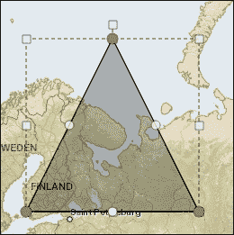
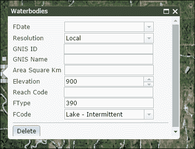
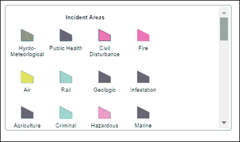
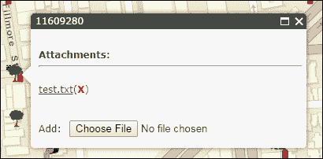
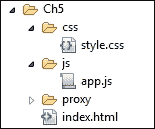
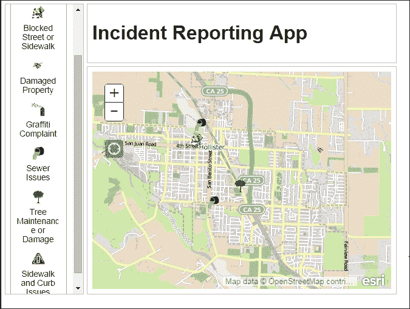
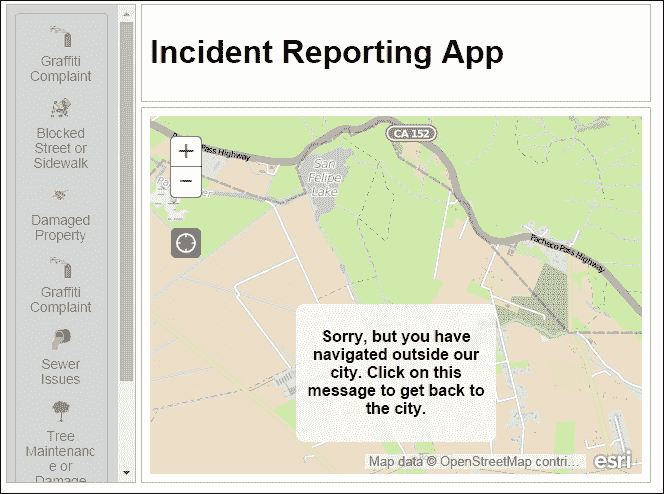

# 第五章. 编辑地图数据

数据必须来自某个地方。在价值数十亿美元的地理空间行业中，收集数据是昂贵的。从航空摄影中可见的特征需要绘制，而在工作站上不太明显的特征需要在现场收集它们的 GPS 坐标。你的时间是宝贵的，数据收集不会自行发生。

但如果你能让别人为你工作会怎样？如果你能创建一个让其他人收集信息的网站会怎样？经过培训的工人可以记录公用事业线路，或者关心市民可以报告城镇中的问题地点。通过使用志愿者数据收集，你可以快速收集所需的数据。

ArcGIS Server 不仅提供地图上的数据可视化，还提供编辑功能。可以创建服务，并围绕它们构建应用程序，使用户能够向地图添加项目、更改它们的形状、编辑它们的属性，甚至删除它们。ArcGIS Server 还允许服务的创建者控制哪些数据更改是被允许的。

在本章中，我们将做以下事情：

+   查看 ArcGIS Server 通过 ArcGIS JavaScript API 提供的地图数据编辑功能

+   了解 API 中的编辑控制以及它们如何创建一个有用的编辑体验

+   创建一个使用 ArcGIS JavaScript API 工具的编辑应用程序

# 网络地图编辑的使用案例

GIS 专业人士不必独自编辑所有地图数据。经过培训的员工和热心的志愿者可以协助他们感兴趣的数据收集和地图编辑项目。作为开发者，你需要提供他们收集和更新数据的工具。以下是一些使用网络地图编辑的应用程序示例，你可以创建：

+   现场工作人员更新公用事业数据

+   公共服务请求和事件报告

+   分析后的地块分类重新分配

+   志愿者地理信息数据收集

# 地图编辑需求

使用 ArcGIS JavaScript API 编辑地理数据需要在 ArcGIS Server 上进行一些设置。必须在 ArcGIS Server 上发布可编辑的**要素服务**，这需要 ArcSDE 地理数据库。文件地理数据库、个人地理数据库和 shapefile 不能用于存储可编辑数据。ArcGIS Online 允许你将可编辑数据上传到 ESRI 的云服务，但数据上传和编辑过程有一些要求，这些要求在第十一章 *ArcGIS 开发的未来* 中有所介绍。

使用 ArcGIS Server 和其 JavaScript API 设置可编辑地图应用程序有一些要求。存储数据的地理数据库应该是版本化的，如果您想在提交到默认数据库之前审查数据。版本化数据还支持撤销和重做操作。您可能希望与可编辑特征服务一起发布只读地图服务。最后，一些编辑操作需要几何服务来处理几何变化，例如切割、合并和修剪特征。

# 特征服务

特征服务提供了一个在服务器上存储的数据与用于使用它的浏览器应用程序之间的网络接口。它们可以通过类似于地图服务的 URL 端点访问。然而，它们产生非常不同的结果。它们可以像动态或瓦片服务一样在地图上加载和查询，但不仅如此。特征服务返回图形而不是瓦片。这些图形可以被查询，如果服务允许，甚至可以编辑。

## 特征模板

在 ArcGIS Server 10.1 中，可以发布带有**特征模板**功能的服务。特征模板为用户提供预先配置的特征，以便添加到地图中。特征模板在 ArcMap 中创建，并定义了符号和预定义属性。这些模板使得编辑服务数据变得更加容易。

特征模板的一个例子可以在动物观测地图上找到。地图上的点表示动物观测发生的位置。可以创建特征模板来显示每种主要动物（猫、狗、鸟、兔子、鹿等）的图片。某些字段中的值可以在事先定义。例如，可以说所有猫都是温血的。

作为开发者，您如何利用特征模板？除了演示每个符号的含义之外，ArcGIS JavaScript API 的工具中还有模板选择器，不仅显示特征模板，还允许您点击它们并将它们添加到您的地图中。

# 特征层

特征层提供了访问特征类中图形的途径。因此，用户可以查询和编辑图形的形状和属性。我们在第四章*在 REST 中寻找平静*中回顾了它们的 REST 服务配置文件。我们以加载动态和瓦片服务相同的方式加载特征层。然而，由于内容可编辑的特性，它们的选项通常需要更多的参数。

## 特征服务模式

当从特征服务初始化特征层时，您可以选择如何加载数据。您是想一次性加载所有数据？您是想加载所有可见的特征？您只想加载您已选择的特征，而不显示其余的？在接下来的章节中，我们将回顾用于将数据下载到客户端浏览器的三种特征服务模式。

### 快照模式

有时，如果没有太多数据，一次性下载所有数据会更好。这就是快照模式的作用。快照模式根据时间定义和定义表达式下载要素数据，但受最大下载限制的限制。数据的可见性随后由时间范围确定。

如果没有太多数据要下载，或者在使用过程中可能存在连接问题，快照模式很有帮助。用户可以一次性下载所有要素数据，处理它，然后在连接变得有利时再次保存更改。

### 按需模式

有时，您可能只对下载眼前的数据感兴趣。在这种情况下，按需模式是最佳选择。按需模式仅下载地图范围内的要素。它们也受时间定义和定义表达式的影响。与快照模式不同，每次地图范围改变时都会进行数据请求。对于任何`FeatureLayer`，按需模式是默认模式。

在特征层中数据量很大，但用户只需查看其中一小部分时，通常会使用按需模式。这对于专注的编辑任务非常适用。对于包含大量地图导航和连接问题的移动应用来说，它并不那么好，因为一些图形可能无法加载。

### 选择模式

通过选择加载要素更为限制性，因为它只显示已选择的功能。要素选择是通过使用特征层的`selectFeatures()`方法来处理的，其方式类似于从地图服务层进行查询。在这种情况下，返回的图形被认为是“已选择”。选择方法包括在地图上点击并发送带有特定参数的查询。如果有很多要素，而您只想下载特定的要素，无论是通过区域还是属性，这种方法非常有帮助。

# 编辑工具

ArcGIS JavaScript API 附带了一套专为编辑设计的控件和模块。使用编辑控件，用户可以向地图添加要素，更改它们的形状，编辑它们的属性，如果服务允许，甚至可以删除它们。让我们看看 API 中可用的工具。

### 小贴士

为什么您应用程序中的编辑工具不起作用？可能是 CSS 的问题。编辑小部件是用 Dojo 用户控件或 dijits 创建的。这些控件需要 Dojo 样式表，例如`claro.css`或`nihilo.css`。如果没有它们，按钮将停止工作，并可能出现其他意外的行为。

## 编辑工具栏

加载了`esri/toolbars/edit`模块的编辑工具栏允许用户更改地图上图形的形状、方向、比例和位置。我们曾在第二章 *深入 API* 中讨论过它，与其他工具栏相关。需要单独的控件来保存使用编辑工具栏所做的更改。您可以在以下位置看到用于编辑工具栏的三角形图像：



编辑工具栏在其构造函数中需要一个地图。构造函数还需要一些可选参数来修改其外观和行为。许多选项取决于正在操作的数据的几何类型。截至 API 版本 3.13，以下是编辑工具栏的一些可用选项：

+   `allowAddVertices`（`布尔值`）：如果为真，你可以向折线或多边形添加顶点。

+   `allowDeleteVertices`（`布尔值`）：如果为真，你可以从折线或多边形中删除顶点。

+   `ghostLineSymbol`（`线符号`）：当移动线或多边形边缘时，这是显示新线/边缘将去往何处的符号。

+   `ghostVertexSymbol`（`标记符号`）：如果你被允许添加顶点，这是显示点击以插入顶点的符号。

+   `textSymbolEditorHolder`（`字符串`或`HTML DOM 节点`）：当你想要添加文本符号编辑小部件时网页的位置。

+   `uniformScaling`（`布尔值`）：当为真时，调整折线或多边形的大小时保持原始的宽高比。

+   `vertexSymbol`（`标记符号`）：在编辑折线和多边形时，这是每个顶点的符号。

你可以在以下代码片段中看到加载编辑工具栏的示例：

```py
require([…, "esri/toolbars/edit", 
  "esri/symbols/SimpleMarkerSymbol", 
  "esri/symbols/SimpleLineSymbol",  ], 
function ( …, EditToolbar, MarkerSymbol, Linesymbol, …) {

  var editTB = new EditToolbar(map,… {
    allowAddVertices: true,
    allowDeleteVertices: true,
    ghostLineSymbol: new LineSymbol(…),
    ghostMarkerSymbol: new MarkerSymbol(…),
    uniformScaling: false,
    vertexSymbol: new MarkerSymbol(…)
  });

});
```

当你想使用编辑工具栏来编辑一个特性时，你调用`activate()`方法。`activate()`方法需要两个参数，并有一个可选的第三个参数。首先，该方法需要一个工具，这个工具是通过将编辑工具栏常量与管道`|`符号组合而成的。常量包括`EDIT_TEXT`、`EDIT_VERTICES`、`MOVE`、`ROTATE`和`SCALE`。其次，`activate()`方法需要一个要编辑的图形。最后一个可选参数是一个类似于创建编辑工具栏的对象。在下面的代码片段中，我们有一个添加到地图中的图形，并且给它分配了一个点击事件，当双击该图形时激活编辑工具栏来编辑该图形：

```py
var editTB = new EditToolbar(…);
  …
map.graphics.add(myGraphic);
dojoOn(myGraphic, "dblclick", function () {
  editTB.activate(EditToolbar.EDIT_VERTICES | EditToolbar.MOVE | EditToolbar.ROTATE | EditToolbar.SCALE, myGraphic);
  dojoOn.once(myGraphic, "dblclick", function () {
    editTB.deactivate();
  });
});
```

## 属性检查器

有时候，你不在乎事物在哪里，你只关心内容。这就是属性检查器发挥作用的地方。属性检查器提供了一个带有可编辑字段列表和适当空白来编辑它们的表单。属性检查器绑定到一个要素层，并显示所选层的可编辑值。属性检查器中的字段响应于属性的字段类型。日期字段在编辑时显示日历。具有编码值域的字段显示一个下拉列表而不是文本空白。下面，你可以看到一个属性检查器加载到弹出窗口中的示例，尽管它也可以添加到单独的 HTML 元素中。



当初始化属性检查器时，您需要定义检查器将如何处理图形属性中的不同字段。属性检查器构造函数接受一个 `options` 对象，以及一个 HTML 元素或元素的 id 字符串引用。`options` 对象有一个名为 `layerInfos` 的参数，它接受一个 `layerInfo` 对象数组。每个 `layerInfo` 对象包含以下参数之一或多个：

+   `featureLayer` (`必需`): 要编辑的要素层。

+   `userId` (`字符串`, `可选`): 如果编辑需要令牌身份验证，则连接到服务的 ArcGIS Server 用户 ID。如果您已使用身份管理器来处理登录，则不需要此信息。

+   `showObjectID` (`布尔值，可选`): 当要素被选中时，您是否想看到要素的对象 ID。默认情况下，此值是 `false`。

+   `showGlobalID` (`布尔值`, `可选`): 当要素被选中时，您是否想看到要素的全局 ID。默认情况下，此值是 `false`。

+   `showDeleteButton` (`布尔值`, `可选`): 默认情况下，属性检查器显示一个删除按钮，允许您删除选定的要素。将此设置为 false 将移除它。

+   `showAttachments` (`布尔值`, `可选`): 当设置为 true，并且要素层有附件时，这将在属性检查器中显示一个附件编辑表单，允许您查看和上传附加到要素的文件。

+   `isEditable` (`布尔值`, `可选`): 允许您控制要素是否可编辑。这不会覆盖要素在服务器端是否可编辑。它只是阻止没有适当凭证的人编辑数据的额外方式。

+   `fieldInfos` (`对象数组 []`, `可选`): 允许开发者对可编辑的字段及其方式进行细粒度控制。这不允许用户编辑根据要素层的发布方法不允许编辑的字段。如果未设置此值，属性检查器将列出所有可编辑字段。`FieldInfo` 对象包含以下内容：

    +   `fieldname` (`字符串`): 要编辑的字段名称。

    +   `format` (`对象`, `可选`): 一个对象，允许您在编辑日期时编辑时间。当设置时，添加以下对象：`{time: true}`。

    +   `isEditable` (`布尔值`, `可选`): 当设置为 false 时，这将禁用用户更改该字段值的权限

    +   `stringFieldOption` (`字符串`, `可选`): 当设置时，用户可以在单行文本框、多行文本区域或包含额外格式的富文本字段中编辑 `字符串` 值。

    +   `label` (`字符串`, `可选`): 当设置时，这允许您覆盖要素服务中的字段别名名称。

    +   `tooltip` (`字符串`, `可选`): 当设置时，在用户开始编辑属性时显示文本工具提示。

+   您可以在以下位置看到属性检查器加载单个要素层的示例：

    ```py
    var layerInfos = [{
      'featureLayer': bananaStandFL,
      'showAttachments': false,
      'isEditable': true,
      'format': {'time': true },
      'fieldInfos': [
        {'fieldName': 'address', 'isEditable':true, 'tooltip': 'Where is it?', 'label':'Address:'},
        {'fieldName': 'time_open', 'isEditable':true, 'tooltip': 'Time the Banana Stand opens.', 'label':'Open:'},
        {'fieldName': 'time_closed', 'isEditable':true, 'tooltip': 'Time the Banana Stand closes.', 'label':'Closed:'},
        {'fieldName': 'is_money_here', 'isEditable':false, 'label':'Is Money Here:', 'tooltip': 'There\'s money in the Banana Stand.'}
      ]
    }];

    var attInspector = new AttributeInspector({
      layerInfos: layerInfos
    }, "edit-attributes-here");

    attInspector.startup();
    ```

虽然属性检查器允许您编辑地图上图形的属性，但它不提供立即保存编辑的方法。何时将属性更改保存到服务器由开发者决定。开发者可以添加一个保存按钮，或者每当功能不再被选中时自动保存。

## 模板选择器

**模板选择器**允许用户从一系列功能模板中选择，以向地图添加功能。它显示来自连接的功能层的功能模板网格。这些模板包括功能名称、几何类型和预设样式。用户可以点击任何模板按钮，然后在地图上绘制它们。您可以加载多个功能层，并且可以轻松地在它们之间切换。您可以在下面的屏幕截图中看到一个示例：



模板选择器，像大多数 dijit 一样，需要参数对象以及一个 HTML 元素或元素的 id 的字符串引用，以便加载。在选项中，模板选择器接受一个`featureLayers`数组。它还接受它将创建的`rows`或`columns`的数量。如果您不使用具有自己的功能模板的`featureLayers`，您可以使用`items`数组中的配置项来定义自己的模板。您还可以直接设置 CSS 样式。最后，您可以控制当您悬停在符号上时是否显示工具提示。在下面的代码片段中，您可以看到一个初始化的模板选择器示例：

```py
var widget = new TemplatePicker({
  featureLayers: layers,
  rows: "auto",
  columns: 9,
  showTooltip: true,
  style: "height: 100%; width: 900px;"
}, "templatePickerDiv");
```

上述代码显示了一个具有九列和显示其`featureLayers`属性中加载的`layers`数据的工具提示的模板选择器。宽度为 900 像素，高度根据需要调整。

## 附件编辑器

有句老话说，一张图胜千言。有时，你需要那张图来解释你提交的数据。**附件编辑器**可以帮到您。附件编辑器允许应用程序上传文件，通常是图像，并将其连接到地图上的功能。您可以查看其他附件，如果权限允许，还可以编辑或删除它们。附件编辑器可以作为属性检查器的一部分加载，通过在构建编辑器时将属性编辑器选项中的`showAttachments`属性设置为`true`：



## 编辑器 dijit

**编辑器 dijit**提供了一个一站式编辑工具，用于创建、更新和删除地图功能。编辑器 dijit 包括模板选择器、属性检查器和带有众多工具的编辑工具栏。它允许您在地图上绘制新功能、编辑现有功能，还可以删除功能。

编辑器 dijit 提供的工具如下：

+   功能选择工具，用于添加新选择、进一步添加到现有选择或从现有选择中删除

+   功能绘制工具，包括从地图中删除功能的功能

+   允许您剪切、合并和裁剪折线和多边形部分的工具

+   撤销和重做操作（需要版本化地图服务）

## 捕捉管理器

当创建编辑工具时，你可能会收到一个常见的请求：“我想有一个工具，让我可以根据另一个特征的线条来编辑这个特征”。你可以尝试编写自己的工具来选择一个特征并遍历特征的每个阶段。或者，通过一些额外的设置，你可以实现地图的**捕捉管理器**。

捕捉管理器在浏览器中模仿 ArcMap 的捕捉控制。当你的鼠标指针接近图形特征的角落或边缘时，例如在一个`GraphicsLayer`或一个`FeatureLayer`中，一个新的指针会移动到特征的点上。这显示了如果你在地图上点击，你会在哪里添加一个点。你可以沿着一系列的点、线顶点或多边形角落点击，使用这个工具绘制与现有特征完美对齐的东西。

在加载捕捉管理器时，有一些重要的选项需要设置。每个捕捉管理器都需要一个地图来捕捉。它还需要加载一个图形层或特征层，以及有关其捕捉行为的信息。它应该知道是否要捕捉到线或多边形的边缘或顶点，以及是否要捕捉到点特征类的点。所有这些信息都添加在其构造函数选项中的`layerInfo`数组中，或者可以通过使用`setLayerInfos()`方法稍后添加。

在捕捉管理器中还有其他可选的可配置项。你可以告诉捕捉管理器始终捕捉到图形，或者你希望在点击时按住键盘上的某个键来控制捕捉。你还可以配置哪个键盘键是`snapKey`，通过加载适当的`dojo/keys`常量来设置该属性。最后，捕捉管理器的`tolerance`指的是指针在捕捉到特征之前应该与特征的最大像素数。

在以下代码中，你可以看到一个在 JavaScript API 中加载的捕捉管理器的示例：

```py
require([…, "esri/SnappingManager", "dojo/keys", …], 
function (…, SnappingManager, dojoKeys …) {

  var propertyLayer = new FeatureLayer({…});
  var sm = new SnappingManager({
    alwaysSnap: false, // default: false
    map: map,
    snapKey: dojoKeys.CTRL, // default: dojoKeys.copyKey
    tolerance: 10, // default: 15
    layerInfo: [{
      layer: propertyLayer, // this is a featureLayer,
      snapToEdge: false, // default: true
      snapToVertex: true //default: true
    }]
  });
  …
});
```

上述示例显示了一个在用户在 PC 上按下*Ctrl*键（在 Mac 上为*Command*键）时开启的捕捉管理器。它只捕捉到`propertyLayer`特征层中线条或多边形的角落。捕捉的`tolerance`设置为 10 像素。

# 保护编辑服务

如果你打算公开你的数据供公众编辑，你需要准备好应对麻烦。从不良数据输入到恶意攻击，作为开发者，你需要考虑到可能出现的问题。幸运的是，ArcGIS Server 和 ArcGIS API for JavaScript 可以帮助你。

## 限制用户输入

我记得有一个项目，我们需要让用户根据另一个系统提供的列表来搜索地址。那个系统对用户可以输入的内容没有任何限制。结果，地址列表非常不正常。在一条街道上，可能会有十五种不同的方式来列出街道名称。有的全部大写，而有的用 "Rd" 代替 "Road"。有的拼写错误，一个 m 而不是两个，还有一些在街道名称和后缀之间有太多的空格。不用说，数据构建得很差，没有标准化。

ArcGIS Server 提供了一些工具来帮助您限制用户输入。在地理数据库中实现编码值域和范围可以帮助减少不良输入。属性检查器尊重字段属性，如长度和数据类型。您可以在要素服务要素模板中设置默认值，以限制额外的用户输入。

您还可以将验证和其他控件结合起来，以确保用户不会意外地做一些像将电话号码添加到日期列之类的事情。Dojo 自带用户控件，如验证文本框，可以限制不良输入。

## 密码保护服务

当涉及到保护您的编辑服务时，ArcGIS Server 也提供了一个更好的选项。如果您想限制对编辑数据的访问，您可以为地图服务要求基于令牌的认证。**令牌**是一个包含用户名、过期日期和用于验证目的的额外信息的加密字符串。您需要从 `http://myserver/arcgis/tokens` 请求令牌，其中 myServer 指的是您的 ArcGIS Server 网络端点或网络适配器。在令牌作为 cookie 添加到您的浏览器之前，您需要提交必要的用户名和密码。令牌只在有限的时间内有效，这可以通过在 ArcGIS Server 中的可配置设置进行调整。

这些基于令牌的安全措施与地图服务和可编辑要素服务都兼容。没有令牌，您无法在浏览器中看到受保护地图服务。有了它，您可以探索受保护的服务，查询它们，甚至编辑其中的数据。

### 身份管理器

**身份管理器**（`esri/IdentityManager`）用于处理登录以及 ArcGIS Server 和 ArcGIS Online 服务的安全性。当您尝试在浏览器中加载受令牌保护的服务时，身份管理器会显示用户名和密码提示。其用户界面使用 Dojo UI 控件，因此需要加载适当的 Dojo 样式表，以便身份管理器正常工作。

现在我们已经回顾了 ArcGIS Server 提供的部分编辑功能，让我们将这些知识应用到应用程序中。

# 新的地图应用程序

那么，回到我们的故事和我们的地图应用程序。我们仍在等待 Y2K 协会关于人口普查地图的消息，但我们有一个新的应用程序，我们被要求去工作。看起来加利福尼亚州的霍利斯特市要求我们为他们制作一个应用程序。让我们看看他们想要什么。

霍利斯特市希望创建一个应用程序，让市民能够报告城市中的问题。他们希望市民能够在地图上报告涂鸦、人行道、路缘石和街道问题、损坏的财产、下水道问题和树木问题，并提供额外的信息。如果可能的话，他们希望有问题的照片，以便工作人员知道要寻找什么。

## 文件设置

由于我们将使用现成的 ArcGIS JavaScript API 编辑工具，我们不需要创建任何自定义包。相反，我们将创建一个简单的文件设置，包含一个`css`和一个`js`文件夹。我们将在`css`文件夹中添加我们的自定义`style.css`样式表，在`js`文件夹中添加我们的`app.js`文件。我们还将添加一个名为`proxy`的文件夹来处理我们的代理服务。文件结构应类似于以下内容：



## 首页

让我们从 HTML 文档开始。我们将使用我们的基本 cookie-cutter 网站。这次，我们将添加 Dojo 的`claro.css`样式表。我们不需要任何自定义包，因此我们可以将这些包从`dojoConfig`文件中排除。我们希望有一个沿着页面侧边的长列，以及一个放置页面布局标题的页眉部分。我们将加载具有侧边栏设计的`BorderContainer`，其中较长的侧边栏。我们将为页眉添加三个`ContentPanes`，一个用于按钮的引导列，以及一个用于地图的中心区域。

```py
<!DOCTYPE html>
<html>
     <head>
    <meta http-equiv="Content-Type" content="text/html; charset=utf-8" />
    <meta http-equiv="X-UA-Compatible" content="IE=Edge" />
    <meta name="viewport" content="initial-scale=1, maximum-scale=1,user-scalable=no" />
    <title>Incident Reporting App</title>
    <meta name="description" content="">
    <meta name="author" content="Ken Doman">
    <link rel="stylesheet" href="http://js.arcgis.com/3.13/dijit/themes/claro/claro.css">
    <link rel="stylesheet" href="https://js.arcgis.com/3.13/esri/css/esri.css" />
    <link rel="stylesheet" href="./css/style.css" />
    <script type="text/javascript">
      dojoConfig = {
 async: true,
 isDebug: true
 };
    </script>
    <script src="img/"></script>
  </head>
  <body class="claro">
    <div id="mainwindow" 
      data-dojo-type="dijit/layout/BorderContainer" 
      data-dojo-props="design:'sidebar', gutter:false" 
      style="width: 100%; height: 100%; margin: 0;">
        <div data-dojo-type="dijit/layout/ContentPane" data-dojo-props="region:'top'">
          <h1>Incident Reporting App</h1>
        </div>
        <div id="map" data-dojo-type="dijit/layout/ContentPane" data-dojo-props="region:'center'"></div>
        <div id="editpane" style="width: 130px" data-dojo-type="dijit/layout/ContentPane" data-dojo-props="region:'leading'">
 <div id="editordiv"></div>
 </div>
      </div>
    <script type="text/javascript" src="img/app.js"></script>
  </body>
</html>
```

我们将在`style.css`页面为 HTML 和 body 添加一些基本的样式。让我们添加以下样式：

```py
html, body {
  width: 100%;
  height: 100%;
  border: 0;
  margin: 0;
  padding: 0;
  box-sizing: border-box;
  font-family: Helvetica, Arial, sans-serif;
}

*, *:before, *:after { box-sizing: inherit;}
```

我们已将 HTML 和`body`的`width`和`height`设置为`100%`，没有边框、边距或填充。我们还更改了字体为常见的`sans-serif`字体，如`Helvetica`、`Arial`或简单的`sans-serif`。最后，我们设置页面上的元素使用`border-box`的`box-sizing`，这使得在页面上处理尺寸框更容易。

## 加载地图

我们将从页面设置开始编写我们应用程序的代码。我们有一个焦点区域，即霍利斯特市。为了方便起见，我们将添加城市边界作为范围：

```py
require([
  "dojo/parser", "esri/map", "esri/graphic", 
  "esri/geometry/Extent", "esri/dijit/editing/Editor",
  "esri/dijit/editing/TemplatePicker", "esri/tasks/query",
  "dijit/layout/BorderContainer", "dijit/layout/ContentPane", 
  "dojo/domReady!"
], function (parser, Map, Graphic, Extent,Editor, TemplatePicker, Query) {

  var maxExtent = new Extent({
    "xmin":-13519092.335425414,
    "ymin":4413224.664902497,
    "xmax":-13507741.43672508,
    "ymax":4421766.502813354,
    "spatialReference":{"wkid":102100}
  }),
    map, selected, updateFeature, attInspector;

  parser.parse();

  map = new Map("map", {
    basemap: "osm",
    extent: maxExtent
  });

});
```

在前面的代码中，我们已加载必要的模块并使用`dojo/parser`解析它们。我们已添加基于 OpenStreetMap 的基本地图，并创建了一个`maxExtent`来模拟城市边界。

### 添加地图图层

现在我们有了地图，我们需要向地图添加图层。为了这个练习，我们将使用 ESRI 提供的旧金山 311 特征服务。我们将以选择模式加载特征层，这样我们只影响我们点击的特征。我们还将添加互补的动态地图服务，因为没有它我们无法看到特征。我们还将使用简单的标记符号设置特征层选择符号，以着色我们点击的特征：

```py
require([
  …, 
  "esri/layers/FeatureLayer",
  "esri/layers/ArcGISDynamicMapServiceLayer",
  "esri/symbols/SimpleMarkerSymbol",
…
], function (…, 
  FeatureLayer, ArcGISDynamicMapServiceLayer, 
  MarkerSymbol, … 
) {
  var maxExtent = …,
    map, incidentLayer, visibleIncidentLayer;
  …
  incidentLayer = new FeatureLayer("http://sampleserver3.arcgisonline.com/ArcGIS/rest/services/SanFrancisco/311Incidents/FeatureServer/0", {
    mode: FeatureLayer.MODE_SELECTION,
    outFields: ["req_type","req_date","req_time","address","district", "status"],
    id: "incidentLayer"
  });

  visibleIncidentLayer = new ArcGISDynamicMapServiceLayer( "http://sampleserver3.arcgisonline.com/ArcGIS/rest/services/SanFrancisco/311Incidents/MapServer");
  …
  map.addLayers([visibleIncidentLayer, incidentLayer]);
```

当地图图层被添加后，我们最终可以与之交互，无论是作为用户还是作为开发者。我们将向地图的 `layers-add-result` 事件添加一个名为 `startEditing()` 的事件监听器。我们将在那里设置要素层的编辑事件。我们将添加一个地图点击事件，如果已从页面侧边的菜单中选择了一些内容，则会绘制一个要素。务必在定义图层之后、将它们添加到地图之前添加此事件。

```py
var …, incidentLayer, visibleIncidentLayer, selected;

visibleIncidentLayer = …;

function startEditing () {
 var incidentLayer = map.getLayer("incidentLayer");
 // add map click event to create the new editable feature
 map.on("click", function(evt) {
 // if a feature template has been selected.
 if (selected) {
 var currentDate = new Date();
 var incidentAttributes = {
 req_type: selected.template.name,
 req_date:(currentDate.getMonth() + 1) + "/" + currenDate.getDate() + "/" + currentDate.getFullYear(),
 req_time: currentDate.toLocaleTimeString(),
 address: "",
 district: "",
 status: 1
 };
 var incidentGraphic = new Graphic(evt.mapPoint, selected.symbol, incidentAttributes);
 incidentLayer.applyEdits([incidentGraphic],null,null) 
 } 
 });

 incidentLayer.setSelectionSymbol(
 new MarkerSymbol({color:[255,0,0]})
 );

 map.infoWindow.on("hide", function() {
 incidentLayer.clearSelection();
 });
}

incidentLayer.on("edits-complete", function() {
 visibleIncidentLayer.refresh();
});

map.on("layers-add-result", startEditing);
map.addLayers([visibleIncidentLayer, incidentLayer]);
```

在前面的代码中，我们创建了一个名为 `startEditing()` 的 `callback` 函数。这会导致每当地图被点击时，应用程序都会向可编辑要素层添加一个新的图形。可编辑要素应用了默认属性和符号。每当弹出窗口被隐藏时，可编辑要素层会清除其选择。此外，当编辑完成后，可见层会使用新数据刷新。当一组图层被添加时，`startEditing()` 方法会被分配执行，这会导致图层被添加到地图中。

### 使用代理

如果您现在尝试加载地图，可能会出现错误。如果您现在没有出现错误，您可能在尝试在地图上保存更改时出现错误。原因是这些编辑操作通常需要一个代理应用程序来处理数据，这些数据太大，无法适应大多数浏览器 GET 请求的大约 2,048 个字符的限制。

### 注意

您可以遵循 ESRI 提供的说明来设置代理服务，请参阅 [`developers.arcgis.com/javascript/jshelp/ags_proxy.html`](https://developers.arcgis.com/javascript/jshelp/ags_proxy.html)。

代理根据您的应用程序环境有三种类型。ESRI 提供了基于 PHP、Java 和 .Net 的代理服务。我们将在应用程序中添加对代理的引用。以下示例展示了如何使用基于 .Net 的代理来完成此操作：

```py
require([
  …, 
  "esri/config",
  "esri/layers/FeatureLayer",
  "esri/layers/ArcGISDynamicMapServiceLayer",
  "esri/symbols/SimpleMarkerSymbol",
…
], function (…, esriConfig, …) {
  …
  // set up proxy for the featureLayer
  esriConfig.defaults.io.proxyUrl = "./proxy/proxy.ashx";

  incidentLayer = …
```

### 查找用户的位置

我们的客户要求应用程序能够使用户在地图上找到他们，无论他们是在使用移动设备还是 Wi-Fi 上的笔记本电脑。我们可以通过添加一个名为 `LocateButton` 的 ArcGIS dijit 来提供该功能。我们在应用程序中加载该模块，在地图准备好时初始化它，然后就可以使用了。加载它的代码可能看起来像这样：

```py
require([…, "esri/dijit/LocateButton", …
], function (…, LocateButton, …) {
  …
  function startEditing() {
    // add the Locate button
     var locator = new LocateButton({map: map}, "locatebutton");
  }
  …
});
```

如果我们在地图 `ContentPane` 内插入一个具有 `id` 为 `locatebutton` 的 `<div>`，并在我们的浏览器中查看页面，我们会看到定位按钮位于地图上方，将地图向下推。我们更愿意将它定位在其他的缩放按钮附近。我们将添加以下样式到 `style.css` 表格中以达到这个目的：

```py
.LocateButton {
  position: absolute;
  left: 29px;
  top: 120px;
  z-index: 500;
}
```

## 模板选择器

对于我们的应用程序，我们将使用 ArcGIS JavaScript API 的模板选择器来选择要添加到地图中的事件点类型。我们将在页面侧边栏中加载它们，并将它们设置为单列宽以添加要素。当选择要素模板时，我们将该要素模板传递给 `selected` 变量。最后，当地图和要素层都加载完成后，我们将加载所有这些内容：

```py
  function generateTemplatePicker(layer) {
    console.log("layer", layer);
    var widget = new TemplatePicker({
      featureLayers: [ layer ],
      rows: layer.types.length,
      columns: 1,
      grouping: false,
      style: "width:98%;"
    }, "editordiv");

    widget.startup();

    widget.on("selection-change", function() {
      selected = widget.getSelected();
      console.log("selected", selected);
    });
  }
…
function startEditing () {
  var incidentLayer = map.getLayer("incidentLayer");
  generateTemplatePicker(incidentLayer);
  …
```

## 属性检查器

现在我们能够向地图添加新功能，我们需要一种方法来编辑这些功能的内容。为此，我们将添加属性检查器。我们将初始化属性检查器并将其绑定到地图的`infoWindow`。

```py
require([…,
  "dojo/dom-construct",
  "esri/dijit/AttributeInspector",
  "dijit/form/Button",
  …
], function (…, domConstruct, AttributeInspector, Button, …) {
  var maxExtent = …,
    map, incidentLayer, visibleIncidentLayer, selected, 
    attInspector, updateFeature;
…
function generateAttributeInspector(layer) {
  var layerInfos = [{
    featureLayer: layer,
    showAttachments: true,
    isEditable: true,
  }];

  attInspector = new AttributeInspector({
    layerInfos: layerInfos
  }, domConstruct.create("div", null, document.body));

  attInspector.startup();

  //add a save button next to the delete button
  var saveButton = new Button({ label: "Save", "class": "saveButton"});
  domConstruct.place(saveButton.domNode, attInspector.deleteBtn.domNode, "after");

  saveButton.on("click", function(){
    updateFeature.getLayer().applyEdits(
      null, [updateFeature], null
    );
  });

  attInspector.on("attribute-change", function(evt) {
    //store the updates to apply when the save button is clicked
    updateFeature.attributes[evt.fieldName] = evt.fieldValue;
  });

  attInspector.on("next", function(evt) {
    updateFeature = evt.feature;
    console.log("Next " + updateFeature.attributes.objectid);
  });

  attInspector.on("delete", function(evt){
    evt.feature.getLayer().applyEdits(
      null, null, [updateFeature]
    );
    map.infoWindow.hide();
  });

  if (attInspector.domNode) {
    map.infoWindow.setContent(attInspector.domNode);
    map.infoWindow.resize(350, 240);
  }

}
…
function startEditing () {
  var incidentLayer = map.getLayer("incidentLayer");
  generateTemplatePicker(incidentLayer);
 generateAttributeInspector(incidentLayer);
…

```

我们需要在属性检查器的保存按钮上添加一点定位样式。我们将把这个条目添加到`style.css`样式表中，以便它不会覆盖删除按钮。

```py
.saveButton {
  margin: 0 0 0 48px;
}
```

现在属性检查器已加载，我们可以将其集成到地图层和事件层的点击事件中。我们将创建一个`showInspector()`函数，该函数接受一个地图点击事件。它将查询`incidentLayer`以获取该位置上的任何功能，并弹出一个包含属性检查器的地图`infoWindow`。它还将选定的图形（如果有）分配给：

```py
…
  function showInspector(evt) {
     var selectQuery = new Query(),
       point = evt.mapPoint,
       mapScale = map.getScale();

    selectQuery.geometry = evt.mapPoint;

    incidentLayer.selectFeatures(selectQuery, FeatureLayer.SELECTION_NEW, function (features) {
      if (!features.length) {
        map.infoWindow.hide();
        return;
      }

      updateFeature = features[0];

      map.infoWindow.setTitle(updateFeature.getLayer().name);
      map.infoWindow.show(evt.screenPoint, map.getInfoWindowAnchor(evt.screenPoint));
    });
  }
…
function startEditing() {
  …
  map.on("click", function (evt) {
    …
    if (selected) {
      …
      incidentLayer.applyEdits([incidentGraphic],null,null)
        .then(function () {
          showInspector(evt);
        });

    } else {
      showInspector(evt);
    }
  …
  }); 
…
  incidentLayer.on("click", showInspector);
```

前面代码的结果显示在下述屏幕截图：



## 保护应用程序

现在我们已经有一个工作状态的事件报告应用程序，是时候考虑如何保护应用程序了。这是一个公开的应用程序，因此公众应该被允许提交问题。然而，我们不希望数据不符合我们的数据模式，或者我们的代表边界。

我们可以确保应用程序免受不良输入影响的一种方法是对我们接受更改的位置进行限制。我们不希望员工浪费时间调查记录在市、州甚至国家之外的系统投诉。我们可以通过使用应用程序开始时提供的城市范围来实现这一点。我们可以在点击事件中测试点击的点是否位于城市范围内，如果不在，就通知客户端。这应该看起来像下面这样：

```py
…
map.on("click", function (evt) {
  // if the clicked point isn't inside the maxExtent
  if (!maxExtent.contains(evt.mapPoint)) {
    alert("Sorry, that point is outside our area of interest.");
    return; // disregard the click
  }
…
```

谈到与范围一起工作，我们还可以在导航出城市区域时锁定选择按钮。这将提醒用户我们不接受城市区域外的投诉。当然，我们应该通知用户他们为何被锁定。

我们将从在 HTML 中添加阻塞内容和通知开始。我们将在页面上添加两个`div`，一个具有`outsidemessage` ID 的`div`位于地图中，另一个`div`与编辑`div`相邻，具有`blockerdiv` ID。我们将通过添加内联样式`display: none`将它们默认设置为隐藏。它应该看起来像下面这样：

```py
…
<div id="map" data-dojo-type="dijit/layout/ContentPane" data-dojo-props="region:'center'" >
  <div id="locatebutton"></div>
  <div id="outsidemessage" style="display:none;">
 <p>Sorry, but you have navigated outside our city. Click on this message to get back to the city.</p>
 </div>
</div>
<div id="editpane" style="width: 130px" 
  data-dojo-type="dijit/layout/ContentPane" 
  data-dojo-props="region:'leading'">
  <div id="editordiv"></div>
  <div id="blockerdiv" style="display:none;"></div>
</div>
```

我们将在`style.css`文件中添加以下样式来美化这些项目。外部消息将以灰色块状浮动在地图的中间部分，文字足够大以便阅读，并且具有圆角（因为很多人喜欢圆角）。阻塞的`div`将直接位于模板选择按钮的上方。当可见时，阻塞的`div`将是浅灰色，半透明，并覆盖整个模板选择器。

```py
#blockerdiv {
  width: 100%;
  background: rgba(188, 188, 188, 0.6);
  position: absolute;
  top: 0;
  left: 0;
  bottom: 0;
  z-index: 500;
}

#outsidemessage {
  position: absolute;
  bottom: 40px;
  left: 50%;
  width: 200px;
  height: auto;
  margin: 0 0 0 -100px;
  background: rgba(255,255,255,0.8);
  padding: 8px;
  z-index: 500;
  border-radius: 8px;
  text-align: center;
  font-weight: bold;
}
```

我们将在`app.js`文件中添加一些代码来处理这两个节点的可见性。我们可以监听地图范围的更改。当地图的范围超出城市范围，并且它们不再相交时，消息 div 和阻塞性 div 都将变为可见（`display: block;`）。如果用户可以看到查看区域的一部分，`div`对象将再次隐藏（`display: none;`）。它应该看起来像这样：

```py
require([…, "dojo/dom-style", …
], function (…, domStyle, …) {

function onMapExtentChange (response) {
  if (!response.extent.intersects(maxExtent)) {
     // show these blocks if the map extent is outside the 
    // city extent
     domStyle.set("blockerdiv", "display", "block");
     domStyle.set("outsidemessage", "display", "block");
  } else {
     // hide these blocks if the max Extent is visible within 
    // the view.
     domStyle.set("blockerdiv", "display", "none");
     domStyle.set("outsidemessage", "display", "none");
  }
}

map.on("extent-change", onMapExtentChange);
…
```

我们还将向外部消息`div`添加一个事件处理程序，允许用户点击返回地图的起始位置。我们将加载`dojo/on`事件来处理`click`事件：

```py
require([…, "dojo/dom", "dojo/on", …
], function (…, dojoDom, dojoOn, …) {
  …
  dojoOn(dojoDom.byId("outsidemessage"), "click", function () {
    map.setExtent(maxExtent);
  })
  …
});
```

现在，当我们加载我们的应用程序并平移到城市界限之外时，应该出现以下消息：



### 限制数据输入

除了阻止来自点击的不良用户输入外，我们还应该考虑阻止来自文本编辑的不良用户输入。我们可以通过修改分配给属性检查器的`layerInfos`数组来实现这一点。我们将首先移除删除按钮，因为我们不希望市民删除其他人的投诉。我们还将修改`fieldInfos`列表，并将一些字段设置为仅在属性检查器中编辑时显示。在这种情况下，我们将保留`req_type`、地址和区域标签页以供编辑。

```py
var layerInfos = [{
      featureLayer: layer,
      showAttachments: true,
      isEditable: true,
      showDeleteButton: false,
      fieldInfos: [
        {'fieldName': 'req_type', 'isEditable':true, 'tooltip': 'What\'s wrong?', 'label':'Status:'},
        {'fieldName': 'req_date', 'isEditable':false, 'tooltip': 'Date incident was reported.', 'label':'Date:'},
        {'fieldName': 'req_time', 'isEditable':false,'label':'Time:'},
        {'fieldName': 'address', 'isEditable':true, 'label':'Address:'},
        {'fieldName': 'district', 'isEditable':true, 'label':'District:'},
        {'fieldName': 'status', 'isEditable':false, 'label':'Status:'}
      ]
    }];
```

这些是我们可以做的简单事情之一，以帮助保护我们的应用程序免受不受欢迎的结果的影响，同时仍然使应用程序对公众用户友好。

# 摘要

在本章中，我们探讨了 ArcGIS Server 和 ArcGIS API for JavaScript 提供的工具和流程，以使网络编辑成为可能。我们研究了可编辑要素服务中包含的内容。我们还探讨了 ArcGIS JavaScript API 附带的各种小部件，用于添加新要素、编辑几何形状和编辑属性属性。我们通过创建一个使用编辑工具创建事件报告应用程序的应用程序来结束，用户可以使用该应用程序在地图上报告城市中的问题。

在下一章中，我们将对现有数据进行图形上的调整。
