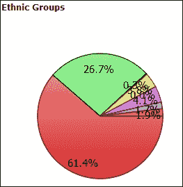
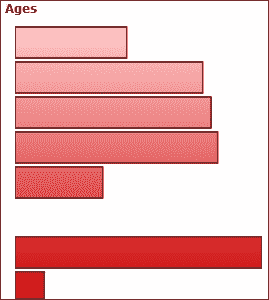
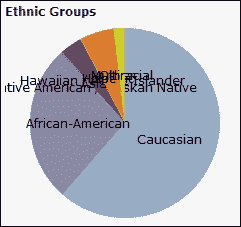
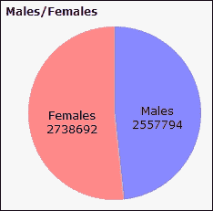
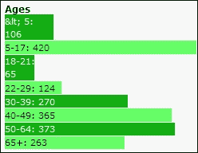

# 第六章. 绘制进度图表

在地理上显示数据为用户提供位置意识，但有些人想看到的不仅仅是地图上的点和一些数字。他们想看到每个位置的数据如何进行比较，无论是在地图上还是在位置内部。其他显示数据的方法，如图表和图形，可以提供更多信息。

图表和图形是商业的大事。公司花费数百万美元创建执行仪表板，这些仪表板是图表和图形的组合，与公司数据和指标相连。它们之所以有效，是因为人类在处理大量抽象数字方面不如计算机，但在处理视觉数据方面做得更好。好的图表和图形可以一目了然地提供可比数据，任何人都能理解。

在本章中，我们将学习：

+   如何使用 ArcGIS JavaScript API 和 Dojo 框架提供的工具创建图表和图形

+   如何使用`D3.js`实现相同的图表和图形

+   如何添加外部库如`D3.js`作为 AMD 模块

# 将图形混合到我们的地图中

正如我们之前所学的，**ArcGIS JavaScript API** 不仅包含创建地图和文本的工具。建立在 Dojo 框架之上，ArcGIS API 附带了许多用户控件和小部件，以帮助您展示数据。我们可以创建动态表格、图表、图形和其他数据可视化。

但您不仅限于 API 提供的图表和图形工具。使用 Dojo 的 AMD 风格，您可以将框架之外的库集成到小部件的构建中，并在需要时加载它们。如果您与更熟悉像`D3.js`这样的库的团队成员合作，您可以将库异步加载到您的组件中，并让其他人开发图形。

在本章中，我们将探讨内部和外部图形库，以将图形添加到我们的数据中。我们将使用 ArcGIS JavaScript API 中打包的`dojox/charting` ([`dojotoolkit.org/reference-guide/1.10/dojox/charting.html`](http://dojotoolkit.org/reference-guide/1.10/dojox/charting.html))模块，我们还将使用`D3.js` ([`d3js.org`](http://d3js.org))实现图形，这是一个流行的数据可视化库。

# 我们的故事还在继续

Y2K 协会的客户又提出了另一个请求。他们不喜欢我们添加到人口弹出窗口中的表格。所有的大数字让一些用户感到不知所措。他们更愿意看到数据以图形的形式表示，这样用户就可以看到数据之间的关系。

Y2K 协会特别要求为种族和性别数据提供饼图。我们可以为种族数据使用任何颜色，但对于性别，他们提出了具体的颜色要求。他们想使用水平条形图来表示年龄数据，因为他们看到人口数据以这种方式展示，并且喜欢这种外观。他们希望其他一些数据也能以图表和图形的形式展示，但他们愿意将如何展示的决定权交给我们。

在这一轮中，我们将尝试两种不同的方法，看看客户更喜欢哪一种。我们将使用这两个库以相同的数据创建图表，并将它们添加到人口普查数据弹出窗口中，看看客户更喜欢哪一个。

# 使用 dojox 图表

我们首先应该查看 ArcGIS API for JavaScript，看看它有什么可以提供的。我们可以使用`dojox/charting`访问一系列图表资源。这些模块允许您在浏览器中绘制线形图、饼图、柱状图以及大量其他图表。它包含许多预定义的主题来展示您的数据，并且可以扩展以使用您自定义的主题。图表库可以在**可缩放矢量图形**（**SVG**）、**矢量标记语言**（**VML**）、Silverlight 和 Canvas 上渲染，这使得它们既适用于较新的浏览器，也适用于像 IE7 这样的旧浏览器。

与大多数 Dojo 组件一样，`dojox/charting`可以在 HTML 中声明性地渲染图表，也可以通过 JavaScript 编程方式渲染。声明性图表利用了`data-dojo`属性。在接下来的练习中，我们将探索编程示例，因为它们更动态，当出现问题时更容易调试。

## 在 JavaScript 中创建图表

`dojox/charting`没有单一的模块可以处理您所有的绘图需求。`dojox/charting`中的这四个主要模块类可以加载以创建独特的图表或图形，并添加新的外观和功能：

+   图表对象

+   图表样式

+   图表主题

+   图表动作和效果

以下是对四种模块类型按顺序加载的示例：

```py
require([
"dojox/charting/Chart",  // object
"dojox/charting/plot2d/Pie",   // style
"dojox/charting/themes/MiamiNice",   // theme
"dojox/charting/action2d/Highlight",  // action
"dojox/charting/action2d/Tooltip",  // action
"dojo/ready"],
  function(Chart, Pie, MiamiNice, Highlight, Tooltip, ready){
  ready(function(){
    var myChart = new Chart("myChart ");
    myChart.setTheme(MiamiNice)
     .addPlot("default", {
        type: Pie,
        font: "normal normal 11pt Tahoma",
        fontColor: "black",
        labelOffset: -30,
        radius: 80
    }).addSeries("Series A", [
      {y: 3, text: "Red", stroke: "black", tooltip: "Red Alert"},
      {y: 5, text: "Green", stroke: "black", tooltip: "Green Day"},
      {y: 8, text: "Blue",  stroke: "black", tooltip: "I'm Blue!"},
      {y: 13, text: "Other", stroke: "black", tooltip: "A bit different"}
    ]);
    var anim_a = new Highlight(myChart, "default");
    var anim_b = new Tooltip(myChart, "default");
    myChart.render();
  });
});
```

## 图表对象

图表对象，加载了`dojox/charting/Chart`模块，是您创建和修改图表的主要对象。几乎所有的自定义设置都将通过此对象执行。图表对象通过页面上的 HTML 元素创建，可以是节点或与节点 id 匹配的字符串。在下面的代码中，您可以看到一个创建简单图表的示例：

```py
require(["dojox/charting/Chart", "dojox/charting/axis2d/Default", "dojox/charting/plot2d/Lines", "dojo/ready"],
  function(Chart, Default, Lines, ready){
  ready(function(){
    var chart1 = new Chart("fibonacci");
    chart1.addPlot("default", {type: Lines});
    chart1.addAxis("x");
    chart1.addAxis("y", {vertical: true});
    chart1.addSeries("Series 1", [1, 1, 2, 3, 5, 8, 13, 21]);
    chart1.render();
  });
});
```

在前面的代码中，生成了一条线形图，其中一系列的值从`1`增加到`21`。

图表对象的构建也可以接受一个选项对象。在这些选项中，您可以添加地图标题和控制元素，例如标题文本、位置、字体、颜色以及标题和图表之间的间隙。

`dojox/charting`库还包括一个名为`dojox/charting/Chart3D`的 3D 图表库。该对象可以渲染三维图表和图形，可以旋转和缩放以获得对数据的良好视角。在下面的代码中，您可以看到一个 3D 柱状图的示例：

```py
require(["dojox/charting/Chart3D", "dojox/charting/plot3d/Bars", "dojox/gfx3d/matrix", "dojo/ready"
], function(Chart3D, Bars, m, ready){
  ready(function(){
    var chart3d = new Chart3D("chart3d", {
       lights: [{direction: {x: 6, y: 6, z: -6}, color: "white"}],
       ambient:  {color:"white", intensity: 3},
       specular: "white"
     },
    [m.cameraRotateXg(10), m.cameraRotateYg(-10), m.scale(0.8), m.cameraTranslate(-50, -50, 0)]),
      bars3d_a = new Bars(500, 500, {gap: 8, material: "red"}), 
      bars3d_b = new Bars(500, 500, {gap: 8, material: "#0F0"}), 
      bars3d_c = new Bars(500, 500, {gap: 8, material: "blue"});
    bars3d_a.setData([3, 5, 2, 4, 6, 3, 2, 1]);
    chart3d.addPlot(bars3d_a);

    bars3d_b.setData([5, 6, 4, 2, 3, 1, 5, 4]);
    chart3d.addPlot(bars3d_b);

    bars3d_c.setData([4, 2, 5, 1, 2, 4, 6, 3]);
    chart3d.addPlot(bars3d_c);

    chart3d.generate().render();
  });
});
```

在前面的代码中，已经生成了一个 3D 柱状图，有三组数据分别用红色、绿色和蓝色着色。然后通过一个稍微旋转的相机来查看这些值，以增加图像的透视感。

## 图表样式

图表样式描述了我们正在创建的图表类型。它定义了我们是将数据加载为折线图还是柱状图、饼图还是散点图。对于二维图表，你可以在`dojox/charting/plot2d`文件夹中找到这些样式。图表样式可以分为五大主要类别，如下所示：

+   **线条**：这些是典型的折线图，可能显示或不显示个别数据点。

+   **堆叠线**：与折线图类似，但高度是堆叠在一起的。这些允许用户比较随时间变化的绘图数据的综合效果以及比例的变化。

+   **柱状图**：通过图表上的行宽比较值。

+   **柱状图**：通过相关柱的高度比较数量。

+   **杂项**：当其他图表无法像之前那样按类别分组时，它们就会归入这个类别。这个组包括饼图、散点图和气泡图。

如果你正在使用 3D 图表，这些图表的样式可以在`dojox/charting/plot3d`文件夹中找到。为了充分利用 3D 样式，最好加载`dojox/gfx3d/matrix`模块以实现 3D 图形效果。`matrix`模块允许你旋转 3D 图形，以便获得 3D 图表的良好视角。

## 图表主题

图表主题描述了图表和图形中文本元素的颜色、阴影和文本格式。Dojo 框架附带了许多预定义的主题，你可以从中选择，在`dojox/charting/themes`中。

### 注意

你可以通过访问[`archive.dojotoolkit.org/nightly/checkout/dojox/charting/tests/test_themes.html`](http://archive.dojotoolkit.org/nightly/checkout/dojox/charting/tests/test_themes.html)来查看不同的主题外观。

以下示例是加载具有`MiamiNice`主题的图表的代码。在这个例子中，我们加载了一个带有`x`轴和`y`轴的折线图。我们使用`setTheme()`方法将主题设置为`MiamiNice`。然后，我们添加了要绘制和渲染的数字系列：

```py
require(["dojox/charting/Chart", "dojox/charting/axis2d/Default", "dojox/charting/plot2d/Lines", "dojox/charting/themes/MiamiNice", "dojo/ready"],
  function(Chart, Default, Lines, MiamiNice, ready){
  ready(function(){
    var chart1 = new Chart("simplechart");
    chart1.addPlot("default", {type: Lines});
    chart1.addAxis("x");
    chart1.addAxis("y", {vertical: true});
 chart1.setTheme(MiamiNice);
    chart1.addSeries("Fibonacci", [1, 1, 2, 3, 5, 8, 13, 21]);
    chart1.render();
  });
});
```

如果你找不到适合你的主题，或者如果你需要在应用程序设计中遵循特定的颜色和样式，你可以使用`SimpleTheme`对象来帮助定义你的自定义主题。`SimpleTheme`基于`GreySkies`主题，但可以扩展为其他颜色和任何你选择的格式。你不需要定义主题的每个属性，因为`SimpleTheme`应用了所有未用自定义样式覆盖的默认值。你可以在以下位置查看实现`SimpleTheme`的代码示例：

```py
var BaseballBlues = new SimpleTheme({
  colors: [ "#0040C0", "#4080e0", "#c0e0f0", "#4060a0", "#c0c0e0"]
});
myChart.setTheme(BaseballBlues);
```

### 提示

主题通常在其调色板中使用不超过五种颜色。如果你需要为数据集添加更多颜色，将颜色十六进制字符串`push()`到主题的`.color`数组中，但必须在设置图表主题之前这样做。

## 图表动作和效果

创建吸引人的图表和图形可能对你来说很有趣，但现代网络时代的用户期望与数据进行交互。他们期望当鼠标悬停在图表元素上时，图表元素会发光、生长并改变颜色。他们期望在点击饼图时发生某些事情。

`dojox/charting/action2d` 包含使图表更具教育性和交互性的图表动作和效果。你不必过度使用动作，让你的图表做所有的事情。你可以简单地应用你需要的事件来让用户感受到效果。以下是一个基本动作和效果的列表，以及相应的描述：

+   `Highlight`：这会在你选择的图表或图表元素上添加高亮。

+   `Magnify`：这允许你放大图表或图形的一部分以便更容易查看。

+   `MouseIndicator`：你可以将鼠标拖动到图上的特征上以显示更多数据。

+   `MouseZoomAndPan`：这允许你使用鼠标缩放和平移图表。滚动轮缩放和缩小，而点击和拖动则允许你在图表周围平移。

+   `MoveSlice`：当使用饼图时，点击一个切片可以将其从图表的其余部分移出。

+   `Shake`：这会在图表上的一个元素上创建震动动作。

+   `Tooltip`：将鼠标光标悬停在图表元素上会显示更多信息。

+   `TouchIndicator`：这提供了在图表上显示数据的触摸动作。

+   `TouchZoomAndPan`：这提供了使用触摸手势进行缩放和平移的能力。

与图表样式和主题不同，你将图表组件附加到图表对象上，图表动作是单独调用的。图表动作构造函数将新图表作为第一个参数加载，并将可选参数作为第二个参数。请注意，动作是在图表渲染之前创建的。你可以在以下代码中看到一个示例：

```py
require(["dojox/charting/Chart", 
  …,
  "dojox/charting/action2d/Tooltip"],
  function(Chart, …, Tooltip){
    var chart = new Chart("test");
    …
    new Tooltip(chart, "default", {
 text: function(o){
 return "Population: "+o.y;
 }
 });
    chart.render();
});
```

在前面的示例中，创建了一个图表，并添加了一个工具提示，显示当你悬停在图表特征上时的人口数据。

# 在弹出窗口中使用 Dojox 图表

将 dojox/charting 模块与 ArcGIS API for JavaScript 结合使用提供了许多显示数据的方式。通过地图的 `infoWindow` 传递特征数据的一种方式是通过图表。信息窗口使用 HTML 模板作为其内容，这可以提供我们需要的钩子来附加我们的图表。

当将图表添加到信息窗口时，一个问题是在何时绘制图表。幸运的是，有一个事件可以处理这个问题。地图的 `infoWindow` 在所选特征图形改变时触发 `selection-changed` 事件，无论是通过点击另一个图形，还是通过点击下一个和上一个按钮。我们可以为该事件分配事件监听器，查看所选图形，如果它包含我们所需的数据，我们就可以绘制图表。

# 在我们的应用程序中使用 Dojo 图表

在上一章中，我们的普查应用程序在呈现数据时可能需要一些视觉吸引力。我们将使用 `dojox/charting` 库尝试添加图表和图形。每当用户点击普查区块组、县或州时，我们将应用图形到地图弹出窗口。普查区块没有足够的信息供我们进行图形化。

## 加载模块

由于我们的图表目前仅限于我们的普查应用程序，我们需要更新自定义 `y2k/Census` 模块定义中的模块：

1.  我们将首先添加 `dojo/on` 来处理地图弹出事件。

1.  我们将添加默认图表对象以及饼图和柱状图模块。

1.  我们将添加 `PrimaryColors` 主题和 `SimpleTheme` 来创建我们自己的自定义颜色模板。

1.  最后，我们将添加高亮和工具提示操作，以便用户在悬停在图表的部分时阅读结果。

1.  它应该看起来有点像以下内容：

    ```py
    define([…
      "dojo/on",
      "dojox/charting/Chart", 
      "dojox/charting/plot2d/Pie",
      "dojox/charting/plot2d/Bars",
      "dojox/charting/action2d/Highlight",
      "dojox/charting/action2d/Tooltip",
      "dojox/charting/themes/PrimaryColors",
      "dojox/charting/SimpleTheme",.
    ], function (…, dojoOn, Chart, Pie, Bars, Highlight, Tooltip, PrimaryColors, SimpleTheme, …) { … });
    ```

## 准备弹出窗口

作为我们计划的一部分，我们希望当特征被点击时，图表和图形将在地图的 `infowindow` 中渲染。我们只对显示当前选中特征的图表和图形感兴趣，因此我们将添加一个事件处理程序，每次 `infoWindow` 对象的 `selection-change` 事件触发时都会运行。我们将称之为 `_onInfoWindowSelect()`。在我们为 `Census.js` 模块编写该函数的存根后，我们将在 `_onMapLoad()` 方法中添加事件处理程序。这样我们就知道地图及其弹出窗口是可用的。它应该类似于以下代码：

```py
_onMapLoad: function () {
  …
  dojoOn(this.map.infoWindow, "selection-change", lang.hitch(this, 
    this._onInfoWindowSelect));
}, 
  …
_onInfoWindowSelect: function () {
  //content goes here
}
```

当特征被添加到或从选择中删除时，`infoWindow` 对象的 `selection-change` 事件会触发。当我们检查 `infoWindow` 对象的选中特征时，我们必须测试以确定它是否包含特征。如果存在一个，我们可以处理该特征的属性并将相关的图形添加到弹出窗口。`infoWindow` 函数应类似于以下内容：

```py
_onInfoWindowSelect: function () {
  var graphic = this.map.infoWindow.getSelectedFeature(),
    ethnicData, genderData, ageData;
  if (graphic && graphic.attributes) {
 // load and render the ethnic data
 ethnicData = this.ethnicData(graphic.attributes);
 this.ethnicGraph(ethnicData);
 // load and render the gender data
 genderData = this.genderData(graphic.attributes);
 this.genderGraph(genderData);
 // load and render the age data
 ageData = this.ageData(graphic.attributes);
 this.ageGraph(ageData);
 }
},
…
ethnicData: function (attributes) { },
ethnicGraph: function (data) { },
genderData: function (attributes) { },
genderGraph: function (data) { },
ageData: function (attributes) { },
ageGraph: function (data) { }
```

### 更新 HTML 模板

为了将图形添加到我们的弹出窗口中，我们需要更新 HTML 模板以包含元素 ID。JavaScript 代码将寻找渲染图形的位置，我们可以指示它在添加了 `id` 的元素中渲染。打开 `CensusBlockGroup.html` 来查看弹出窗口模板。找到 *种族群体* 部分，并删除其下的整个表格。您可以在测试目的下将其注释掉，但当我们把此应用程序投入生产时，我们不希望每个人都下载所有这些浪费的内容。用具有 `id` 等于 `ethnicgraph` 的 `div` 替换表格。它应该看起来像以下内容：

```py
…
<b>Ethnic Groups</b>
<div id="ethnicgraph"></div> 
…
```

在 `Males/Females` 和 `Ages` 部分下重复相同的操作，分别用 `div` 元素替换那些表格，这些元素分别标识为 `gendergraph` 和 `agegraph`。如果您选择显示其他图形，请遵循相同的指南。同样，对 `CountyCensus.html` 和 `StateCensus.html` 模板也进行重复操作。

## 处理数据

如果你回顾一下其他 `dojox/charting` 操作的示例，你会注意到数据是以数组的形式添加到图表中的。然而，我们从地图服务中获得的数据并不是这种格式。我们需要将属性数据处理成 `dojox/charting` 模块可以使用的格式。

当将数据对象传递给 `dojox/charting` 图表和图形时，图表期望数据具有可绘制的 `x` 和 `y` 属性。由于我们不是比较价值随时间变化或某些其他独立变量的变化，我们将数值人口添加到我们的因变量 `y` 中。工具提示文本的值可以分配给 JSON 工具提示数据属性。你可以在以下代码中看到生成的函数：

```py
…
formatAttributesForGraph: function (attributes, fieldLabels) {
  var data = [], field;
  for (field in fieldLabels) {
    data.push({ 
 tooltip: fieldLabels[field], 
 y: +attributes[field] 
 });
  }
  return data;
},
…
```

### 注意

在人口对象中的属性前面的 `+` 符号是一个快捷方式，用于将值转换为数字，如果它还不是数字的话。你可以使用 `parseInt()` 或 `parseFloat()` 方法得到相同的效果。

现在我们能够将我们的数据转换成可用于我们的图形小部件的格式，我们可以调用我们的 `ethnicData()`、`genderData()` 和 `ageData()` 方法。我们将从特征属性中提取所需的数据，并将其放入数组格式，以便由 `chart` 模块使用。

### 解析种族数据

我们对提取人口普查区域人口的种族构成感兴趣。我们感兴趣的是州、县和街区组特征类中存在的 `WHITE`、`BLACK`、`AMER_ES`、`ASIAN`、`HAWN_PI`、`HISPANIC`、`OTHER` 和 `MULT_RACE` 字段。由于我们有很多字段可能存在于特征类中，或者可能不存在，我们将以相同的方式添加它们，因此我们将创建一个字段名称和我们要添加的相应标签的数组。请参见以下代码：

```py
…
ethnicData: function (attributes) {
  var data = [],
 fields = ["WHITE", "BLACK", "AMERI_ES", "ASIAN", "HAWN_PI", "HISPANIC", "OTHER", "MULT_RACE"],
 labels = ["Caucasian", "African-American", "Native American /<br> Alaskan Native", "Asian", "Hawaiian /<br> Pacific Islander", "Hispanic", "Other", "Multiracial"];
},
…
```

现在我们有了字段和标签，让我们将所需的信息添加到数据数组中。`dojox/charting` 库期望图形数据为数值列表或具有特定格式的 JSON 对象。由于我们想在饼图中添加标签到我们的数据，我们将创建复杂对象：

```py
…
ethnicData: function (attributes) {
  var fieldLabels = {
    "WHITE": "Caucasian", 
    "BLACK": "African-American", 
    "AMERI_ES":"Native American /<br> Alaskan Native", 
    "ASIAN": "Asian", 
    "HAWN_PI":"Hawaiian /<br> Pacific Islander", 
    "HISPANIC": "Hispanic", "OTHER": "Other", 
    "MULT_RACE": "Multi-racial"
  }
 return this.formatAttributesForGraph(attributes, fieldLabels);
},
…
```

### 解析性别数据

我们将以类似的方式计算性别数据。我们只对特征属性中的 `MALES` 和 `FEMALES` 字段感兴趣。我们将它们添加到与前面代码中相同的格式的 JSON 对象列表中。它应该看起来像以下这样：

```py
genderData: function (attributes) {
  var fieldLabels = {
    "MALES": "Males", "FEMALES", "Females"
  }
 return this.formatAttributesForGraph(attributes, fieldLabels);
},
…
```

### 解析年龄数据

我们将对 `ageData()` 方法执行与 `ethnicData()` 方法相同风格的数据处理。如果年龄小于 `5`、`5-17`、`18-21`、`22-29`、`30-39`、`40-49`、`50-64` 和 `65` 岁及以上有可用的人口普查数据，我们将收集这些数据。然后，我们将添加适当的工具提示标签，并返回格式化的数据数组。它应该看起来如下：

```py
ageData: function (attributes) {
  var fieldLabels = {
    "AGE_UNDER5": "&lt; 5", "AGE_5_17": "5-17", "AGE_18_21": "18-21", 
 "AGE_22_29": "22-29", "AGE_30_39": "30-39", "AGE_40_49": "40-49", 
 "AGE_50_64": "50-64", "AGE_65_UP": "65+"
 };
 return this.formatAttributesForGraph(attributes, fieldLabels);
},
```

## 显示结果

现在我们已经以我们可以用于图表的格式获得了结果，我们可以将它们加载到我们的图表中。我们的民族和性别图都是饼图，而年龄图是水平条形图。让我们看看构建每个图表需要什么。您可以在自己的时间里使用剩余的数据创建任何额外的图表。

### 民族图

我们希望一个饼图能够适应民族图的弹出窗口。90 像素的半径应该可以很好地适应弹出窗口。我们将使用`PrimaryColors`，这是`dojox/charting`中的默认主题之一，来设置图表的主题。我们还将向图表添加饼图功能，并在用户悬停数据时添加工具提示和突出显示动画。最后，我们将渲染民族饼图：

```py
ethnicGraph: function (data) {
  var ethnicChart = new Chart("ethnicgraph");
  ethnicChart.setTheme(PrimaryColors)
    .addPlot("default", {
      type: Pie,
      font: "normal normal 11pt Tahoma",
      fontColor: "black",
      radius: 90
  }).addSeries("Series A", data);
  var anim_a = new Tooltip(ethnicChart, "default");
  var anim_b = new Highlight(ethnicChart, "default");
  ethnicChart.render();
},
```

当应用程序绘制民族图时，它应该看起来像以下图像：



民族群体

### 性别图

对于性别图，我们将设置一个与民族图相似的饼图。但在我们这样做之前，我们将加载一个新的主题来使用。我们将从`SimpleTheme`构造函数创建一个`genderTheme`构造函数，并为女性添加浅粉色，为男性添加浅蓝色。然后我们将创建图表，添加新的主题，并添加与民族图相同的一切。您可以在以下代码中看到这一点：

```py
genderGraph: function (data) {
 var genderTheme = new SimpleTheme({
 colors: ["#8888ff", "#ff8888"]
 }),
  genderChart = new Chart("gendergraph");

  genderChart.setTheme(genderTheme)
    .addPlot("default", {
      type: Pie,
      font: "normal normal 11pt Tahoma",
      fontColor: "black",
      radius: 90
  }).addSeries("Series A", data);
  var anim_a = new Tooltip(genderChart, "default");
  var anim_b = new Highlight(genderChart, "default");
  genderChart.render();
},
```

当应用程序绘制性别图时，它应该看起来像以下图像：


### 年龄图

我们将为年龄图创建一个条形图来显示年龄人口统计。与饼图不同，条形图不关心半径，而是更喜欢知道条形可以增长多长（`maxBarSize`），以及它们应该相隔多远（间隙）。我们将继续使用`PrimaryColors`主题来创建这个对象：

```py
ageGraph: function (data) {
  var ageChart = new Chart("agegraph");
  ageChart.setTheme(PrimaryColors)
   .addPlot("default", {
     type: Bars,
      font: "normal normal 11pt Tahoma",
      fontColor: "black",
      gap: 2,
      maxBarSize: 220
  }).addSeries("Series A", data);
  var anim_a = new Tooltip(ageChart, "default");
  var anim_b = new Highlight(ageChart, "default");
  ageChart.render();
}
```

当您绘制`ageChart`时，它应该看起来像以下图像：



# 介绍 D3.js

如果您想要创建令人惊叹的图形，可以超越 ArcGIS JavaScript API 和 Dojo。一个流行的 JavaScript 库，您可以使用它来创建图表、图形和其他数据驱动的可视化，是`D3.js`。`D3.js`是由纽约时报的 Mike Bostock 创建的，用于使用 HTML、SVG、CSS 和 JavaScript 创建交互式数据驱动的图形。它从 HTML 读取数据，并以您决定的方式渲染。

`D3.js`自首次公开发布以来，其发展势头迅猛。这个库非常灵活，因为它不仅渲染图表和图形。它提供了创建图表、图形和其他可以像任何 HTML 元素一样移动和样式的交互式图形的构建块。甚至可以使用`D3.js`和一种称为 GeoJSON 的文件格式在网页上显示不同投影的 GIS 地图。

对于有 jQuery 经验的任何人，使用`D3.js`编写的脚本的行为方式相同。您可以使用`d3.select()`或`d3.selectAll()`方法选择 HTML 元素，这些方法类似于 jQuery 基本方法。D3 命令可以一个接一个地链接，这也是许多 jQuery 开发人员喜欢的功能之一。在以下示例中，我们使用 D3 通过`select()`方法查找具有`addflair`类的元素。然后我们向这些元素添加相关的文本内容：

```py
d3.select(".addflair").append("span").text("I've got flair!");
```

## 使用 Dojo 的 AMD 添加 D3.js 库

假设您想将`D3.js`添加到您的地图应用中。您找到`d3`库的链接，并将其像这样复制并粘贴到您的应用中：

```py
…
  <link rel="stylesheet" 
  href="https://js.arcgis.com/3.13/esri/css/esri.css" />
  <script src="img/"></script>
  <script src=https://d3js.org/d3.v3.js"></script>
</head>
…
```

您复制并粘贴一个示例来测试它是否可行。您打开浏览器，加载您的页面。您耐心地等待一切加载，然后它崩溃了。发生了什么？

结果表明，在 ArcGIS JavaScript API 之后加载的额外库干扰了 AMD 库引用。让我们看看一些将外部库加载到基于 AMD 的应用程序中的解决方案。

### 在 AMD 模块外部加载另一个库

如果您打算在 AMD 模块之外与 JavaScript 库一起工作，最好在加载 ArcGIS JavaScript API 之前加载该库。如果您是在在另一个框架中先前编写的现有应用上添加地图，您将使用此方法。

### 在 AMD 模块内加载另一个库

在您的 AMD 应用中处理 D3 和其他外部库的另一种方法是将其作为 AMD 模块加载。您可以像对待任何其他基于 Dojo 的模块一样对待它们，并且仅在必要时将它们加载到内存中。这对于您偶尔使用且不需要在启动时使用的库来说效果很好。它也适用于将库的所有功能加载到单个 JavaScript 对象中的库，例如`D3.js`或 jQuery。

要将外部库作为 AMD 模块加载，您必须首先在`dojoConfig`中将其作为包引用，就像您在第三章 *《Dojo 小部件系统》* 中对自定义`Dojo`模块所做的那样。将您的外部库添加到包中会告诉 Dojo 的`require()`和`define()`函数在哪里查找库。记住，当在包中列出库的位置时，您引用的是 JavaScript 库的文件夹，而不是库本身。对于 D3，`dojoConfig`脚本可能看起来像以下这样：

```py
dojoConfig = {
  async: true,
  packages: [
    {
      name: "d3",
      location: "http://cdnjs.cloudflare.com/ajax/libs/d3/3.4.12/"
    }
  ]
};
```

一旦将库文件夹引用添加到您的`dojoConfig`变量中，您就可以将其添加到任何`require()`或`define()`语句中。将库加载到 AMD `require()`语句中的样子如下：

```py
require([…, "d3/d3", …], function (…, d3, …) { … });
```

# 在我们的应用中使用 D3.js

在我们的应用中，我们将探索使用 D3 向我们的应用添加图表。我们将用它来替换`dojox/charting`代码中添加到地图弹出窗口的部分。许多步骤将是相似的，但也有一些不同。

## 将 D3.js 添加到配置中

由于我们的应用程序严重依赖于 Dojo 框架，我们将使用 AMD 添加我们的`D3.js`库。我们将在`dojoConfig.packages`列表中添加 D3 的引用。新的`dojoConfig`脚本应如下所示：

```py
dojoConfig = {
  async: true,
  packages: [
    {
      name: 'y2k',
      location: location.pathname.replace(/\/[^\/]*$/, '') +'/js'
    },
    {
 name: "d3",
 location: "http://cdnjs.cloudflare.com/ajax/libs/d3/3.4.12/"
 }
  ]
};
```

现在 AMD 代码知道在哪里查找`D3`库，我们可以在我们的普查应用程序中添加对它的引用。然后`D3`库将可用于我们的普查小部件，但它不会干扰可能有自己的`d3`变量的其他应用程序。我们的`Census.js`代码应如下所示：

```py
define([
  …,
  "esri/config", "d3/d3"
], function (
  …,
  esriConfig, d3
) {
…
});
```

## 准备弹出窗口

`D3.js`现在应该在我们的小部件中可用，我们可以准备弹出窗口以加载数据。我们将以与加载`dojox/charting`模块相同的方式设置我们的代码。我们将把相同的事件附加到地图的`infoWindow`对象的`selection-change`事件上，然后在该事件上运行函数来操作和渲染我们的数据。

### 注意

请参考章节中 dojox/charting 部分的**准备弹出窗口**部分以获取代码。

至于块组、县和州的 HTML 弹出模板，我们可以对`dojox/charting`示例中进行的相同更改。遵循互联网上的最佳实践，我们将用具有相同名称的类标签替换绘图`div`元素上的`id`标签（例如，种族群体获得`class="ethnicgraph"`）。这将减少 HTML `id`冲突的可能性。此外，虽然 Dojo 小部件需要 HTML 元素或`id`字符串，但`D3.js`图表可以添加到任何 CSS 选择器找到的元素中。

## 处理我们的数据

当我们收集`dojox/Charting`模块的属性数据时，我们必须将属性数据排列成数组，以便它们可以被绘图模块消费。对于`D3.js`也是如此。我们将格式化属性为列表，以便图表可以读取。

与`dojox/charting`库不同，`D3.js`对绘图部分使用的属性没有名称限制。你可以给属性起更合理的名字。`D3.js`中的函数将被添加来计算图表值。由于我们的大部分种族、性别和年龄数据基于人口并按名称排序，因此将那些属性分别命名为人口和名称是有意义的：

```py
…
formatAttributesForGraph: function (attributes, fieldLabels) {
  var data = [], field;
  for (field in fieldLabels) {
    data.push({ 
 name: fieldLabels[field], 
 population: +attributes[field] 
 });
  }
  return data;
},
…
```

我们在`formatAttributesForGraph()`方法中将属性名称和人口值添加到列表中。该列表将在稍后时间进行绘图。我们不需要更改任何代码，因为我们使用相同的函数在`ethnicData()`、`genderData()`和`ageData()`函数中处理属性数据。

## 显示结果

现在我们已经创建了数据列表，我们可以在弹出窗口的图表中显示它们。

### 显示种族图表

对于我们的种族图表，我们将创建一个饼图：

1.  我们将调整其大小以适应弹出窗口中的`240`像素乘以`210`像素的区域。

1.  我们将使用 CSS 颜色列表添加自己的颜色比例。

1.  我们将寻找我们想要放置图表的 HTML DOM 元素（`class="ethnicgraph"`），然后附加饼图图形。

1.  我们将应用颜色，使用我们的人口数据调整大小，然后用种族群体的名称标记它：

    ```py
    ethnicGraph: function (data) {
          var width = 240,
            height = 210,
            radius = Math.min(width, height) / 2;

          var color = d3.scale.ordinal()
            .range(["#98abc5", "#8a89a6", "#7b6888", "#6b486b", "#a05d56", "#d0743c", "#ff8c00", "#c7d223"]);
          var arc = d3.svg.arc()
            .outerRadius(radius - 10)
            .innerRadius(0);

          var pie = d3.layout.pie()
            .sort(null)
            .value(function(d) { return d.population; });

          var svg = d3.select(".censusethnic").append("svg")
            .attr("width", width)
            .attr("height", height)
            .append("g")
            .attr("transform", "translate(" + width/2 + "," + height/2 + ")");

          if (!data || !data.length) {
            return;
          }

          var g = svg.selectAll(".arc")
            .data(pie(data))
            .enter().append("g")
            .attr("class", "arc");

          g.append("path")
            .attr("d", arc)
            .style("fill", function(d) { return color(d.data.name); });

          g.append("text")
            .attr("transform", function(d) { return "translate(" + arc.centroid(d) + ")"; })
            .attr("dy", ".35em")
            .style("text-anchor", "middle")
            .text(function(d) { return d.data.name; });
        },
    ```

当应用程序绘制图表时，它应该看起来像以下图表：



### 显示性别图表

对于性别图表，我们将从种族图表复制并粘贴代码。代码类似，除了两个小的变化：

1.  对于我们的第一个更改，我们将为男性和女性人口添加自定义颜色。查找颜色变量分配的地方，并将两个十六进制颜色数字插入到颜色范围内：

    ```py
    genderGraph: function (data) {
    …
      var color = d3.scale.ordinal().range(["#8888ff", "#ff8888"]);
    …
    }, 
    ```

1.  接下来，我们希望标签显示所讨论的性别和实际人口。为了制作两行标签，我们需要添加另一个 `tspan` 来填写人口数据。我们还需要移动该标签，使其位于其他标签下方，并且不与之交叉：

    ```py
    g.append("text")
      .attr("transform", function(d) { return "translate(" + arc.centroid(d) + ")"; })
      .attr("dy", ".35em")
      .style("text-anchor", "middle")
      .text(function(d) { return d.data.name; })
      .append("tspan")
      .text(function(d) { return d.data.population;})
      .attr("x", "0").attr("dy", '15');
    ```

1.  一旦运行应用程序并使用一些数据测试它，图表应该看起来像以下图像，待数据：

### 显示年龄图表

年龄图表从简单的 html `div` 元素创建条形图。它会根据我们提供的数据调整大小。我们需要计算数据的最大值，以便将数据值调整到最大宽度内。从那里，我们可以使用提供的数据绘制和标记我们的图表：

```py
ageGraph: function (data) {
  // calculate max data value
  var maxData = d3.max(arrayUtils.map(data, function (item) {return item.population;}));
  // create a scale to convert data value to bar width
  var x = d3.scale.linear()
            .domain([0, maxData])
            .range([0, 240]);
  // draw bar graph and label it.
  d3.select(".censusages")
    .selectAll("div")
    .data(data)
      .enter().append("div")
      .style("width", function(d) { return x(d.population) + "px"; })
      .text(function(d) { return d.age + ": " + d.population; });
}
```

使用 CSS 样式，我们可以根据需要转换数据的外观。在这个例子中，我们决定采用交替颜色主题，使用 CSS3 的 `nth-child(even)` 伪类选择器。您也可以添加自己的 CSS 悬停效果，以匹配我们与 `dojox/charting` 所做的：

```py
.censusages > div {
  background: #12af12;
  color: white;
  font-size: 0.9em;
  line-height: 1.5;
}
.censusages > div:nth-child(even) {
  background: #64ff64;
  color: #222;
  margin: 1px 0;
}
```

使用 CSS 和我们的数据，我们能够创建以下图表：



### 注意

如果您想了解更多关于 `D3.js` 库的信息，有大量的信息可供参考。官方 `D3.js` 网站是 [`d3js.org/`](http://d3js.org/)。您可以去那里找到示例、教程和其他令人惊叹的图形。您还可以查看 Swizec Tellor 的 *Data Visualization with d3.js*、Nick Qi Zhu 的 *Data Visualization with D3.js Cookbook* 和 Pablo Navarro Castillo 的 *Mastering D3.js*。

# 摘要

在我们的网络地图应用中，`dojox/charting` 和 `D3.js` 都有其优点和缺点。`dojox/charting` 库与 ArcGIS JavaScript API 一起提供，并且易于与现有应用程序集成。它提供了许多可以快速添加的主题。另一方面，`D3.js` 与 HTML 元素和 CSS 样式一起工作，以创建令人惊叹的效果。它提供了比 `dojox/charting` 更多的数据可视化技术，并使用 CSS 样式提供了可定制的外观。您的最终选择可能取决于您对这些工具的舒适程度和您的想象力。

在本章中，我们学习了如何在我们的 ArcGIS JavaScript API 应用程序中集成图表和图形。我们使用了 Dojo 框架提供的图形库，这些库基于地图要素的数据创建图形。我们还使用了 `D3.js` 在我们的应用程序中渲染图表和图形。在这个过程中，我们学习了如何在基于 Dojo 的 AMD 应用程序中加载和访问其他库。

在下一章中，我们将探讨如何将我们的 ArcGIS JavaScript API 应用程序与其他流行的 JavaScript 框架混合使用。
