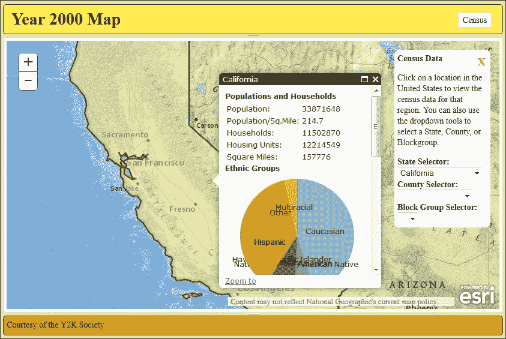

# 第七章：与其他库和框架兼容

近年来，JavaScript 开发已经成熟。曾经只是用来编写一些动画和用户交互的简单语言，JavaScript 应用现在可以支持几年前只有桌面应用才能完成的全面任务。有众多文档齐全的库和框架，通过网页浏览器使复杂应用变得可管理。

没有任何 JavaScript 库或框架能够完美地完成所有事情。大多数库专注于提高应用开发的一些关键需求，例如 DOM 操作、数据绑定、动画或图形。有些库侧重于速度；而有些则侧重于跨浏览器兼容性。

成功的 JavaScript 开发者不必从头开始使用单个库或原生 JavaScript 来构建应用以使其工作。通过添加当前兼容性良好的库，开发者可以加快开发速度，并处理多种浏览器类型，而无需担心它们。

在本章中，我们将涵盖以下内容：

+   将 jQuery 集成到应用中

+   将 Backbone.js 集成到应用中

+   将 Knockout.js 集成到应用中

+   讨论在地图应用中使用 AngularJS

# 与其他库和框架的兼容性

开发者描述 JavaScript 库可用性的一个方式是它们与其他库的兼容性。你的库与越多库兼容，就越有可能在项目中使用。当库与其他库和框架不兼容时，可能会导致意外的代码错误和未预料到的行为。由于开发者无法控制项目中使用的其他库，因此如果库与其他库兼容会更好。

库之间可能存在几种冲突方式。过去更常见的一种方式是通过命名空间冲突。如果两个库在全局命名空间中创建了相同的 `cut()` 函数，你无法确定哪个会被调用。另一种更微妙的是通过操作标准 JavaScript 类型的原型。一个库可能会期望对数组上的 `map()` 方法执行特定任务，但如果另一个库覆盖了 `Array.prototype.map()`，结果可能不会如预期，甚至可能破坏应用。通常，只有当你修补旧浏览器的支持时，才礼貌地操作基础 JavaScript 类型的原型。

JavaScript 库之间冲突的另一种较新的方式是它们实现模块的方式。在 ECMAScript 6 发布模块标准之前，有两种模块开发流派。一种是通过使用 CommonJS 来定义模块，另一种是 AMD。通常，一种模块可以从另一种中加载，因为它们的调用和构建方式不同。大多数未明确定义的小型库都可以通过一些工作加载到其中。

即使在 AMD 中，也可能存在一些冲突。一些库和框架使用 Require.JS 来加载它们的模块。虽然语法上相似，但 Dojo 的老版本与 Require.JS 模块混合时会产生错误。当你在应用程序中混合和匹配 JavaScript 库时，这是一件需要注意的事情。

# 常用的库来玩耍

现在我们已经整体研究了库的兼容性，是时候检查 ArcGIS API for JavaScript 如何与其他 JavaScript 库和框架协同工作了。我们将查看一些开发者使用的流行库，并尝试将它们与 ArcGIS API for JavaScript 一起加载。我们将使用 jQuery、Backbone.js、Knockout.js 和 AngularJS 创建相同的应用程序，并比较它们。最后，我们将探讨与任何框架和 ArcGIS API 相关的几项“应该做”和“不应该做”的事项。

## 我们的故事还在继续

因此，我们的普查数据应用程序在 Y2K 社会中非常受欢迎。他们喜欢图形的外观，并希望我们扩展它。小部件的功能很棒，但他们提出了新的要求。似乎有一位成员在昨晚的深夜喜剧节目中得知，有些人无法在地图上找到他们的州或县。

在与客户讨论可能的解决方案后，我们决定添加一些下拉控件，让用户可以选择一个州、县，甚至是一个人口普查区块组。选择一个州后，地图会缩放到该州，并在弹出窗口中显示数据。此外，县下拉列表会填充该州的所有县名。当选择县时，县会通过弹出窗口被选中，并为该县和州填充区块组名称。最后，如果选择了区块组，区块组会被缩放到，并在地图上显示数据。

在某种程度上相关的新闻中，我们招聘了一名实习生。他是一位热衷于跟随最新 JavaScript 动态的年轻小伙子。他希望为这个项目做出贡献，而这个任务看起来是一个让他锻炼的好机会。

问题在于，我们的实习生想要使用另一个库或框架来编写代码，而不仅仅是简单的库。他希望引入包括 jQuery、Backbone、Knockout、Node.js 和 Angular 在内的多个流行库。虽然我们欣赏他学习的愿望（以及充实简历），但我们不得不与他严肃地讨论选择适合项目的库。

在说服实习生放弃 Node.js 项目（因为这个是一个客户端应用程序，目前不需要服务器端工作）之后，我们向他解释了他在列表上其他库的一般用法。我们决定给实习生一个学习项目，让他构建四个应用程序的副本，每个应用程序都包含 jQuery、Backbone、Knockout 或 Angular 之一。他可以评估每个应用程序，并告诉我们哪个与该应用程序配合得最好。我们认为他做四倍的工作是可以接受的，因为他不是付费实习生。

我们应该继续设置四个项目文件夹，并复制我们上一章工作中的`D3.js`应用程序的副本。在每个项目中，我们需要修改`/js/template`文件夹中的`Census.html`模板，以显示下拉菜单。我们将添加三个带有粗体标签的下拉菜单，这些菜单将由四个库稍后填充。它应该看起来像以下这样：

```py
<div class="${baseClass}" style="display: none;">
  <span class="${baseClass}-close" data-dojo-attach-event="ondijitclick:hide">X</span>
  <b>Census Data</b><br />
  <p>
    Click on a location in the United States to view the census  data for that region. You can also use the dropdown tools to  select a State, County, or Blockgroup.
  </p>
  <div >
 <b>State Selector: </b>
 <select></select>
 </div>
 <div>
 <b>County Selector: </b>
 <select></select>
 </div>
 <div>
 <b>Block Group Selector: </b>
 <select></select>
 </div>
</div>
```

当新应用程序加载时，新的小部件应该看起来像以下这样：



# jQuery 概述

在过去几年中，最受欢迎的库之一无疑是 jQuery。jQuery 最初由 John Resig 创建，作为一个用于处理 DOM 操作和事件的库。跨浏览器兼容性是该库的一个强大卖点，因为它在从最新版本的 Chrome 到非常古老的 Internet Explorer 版本上都能工作，以至于大多数开发者都会感到不适。其直观的命令和功能使得新手开发者容易上手。该库非常受欢迎，据 jQuery 博客（[`blog.jquery.com/2014/01/13/the-state-of-jquery-2014/`](http://blog.jquery.com/2014/01/13/the-state-of-jquery-2014/)）报道，截至 2013 年底，它被估计用于世界上排名前 100,000 的网站中的 61%。

如果你理解 jQuery 的工作原理，你可以跳过下一节，直接进入*在我们的应用程序中添加 jQuery*。如果不理解，这里简要介绍一下 jQuery 的工作原理。

## jQuery 的工作原理

jQuery 库在网页上选择和操作 DOM 元素方面非常有用。可以使用`jQuery()`函数或其常用快捷方法`$()`来选择 DOM 元素。它接受一个 DOM 元素或一个包含 CSS 选择器的字符串。要选择一个具有`id`的元素，你需要在 ID 名称前加上一个`#`。要选择一个 CSS 类，你需要在类名前插入一个`.`。要选择具有特定标签名的所有元素，只需使用该标签名。实际上，jQuery 几乎支持任何合法的 CSS `select`语句。以下是一些代码示例：

```py
jQuery("#main"); // selects a node with an id="main"
$("#main"); // A common shortcut for jQuery; same as above.
$(".classy"); // selects all elements with class="classy"
$("p"); // selects all paragraphs
$(".article p"); // selects all paragraphs in nodes of
                 // class="article"
$("input[type='text']"); // selects all text inputs
```

一旦 jQuery 对象选择了节点，你可以在它们上执行多个函数。你可以使用`show()`和`hide()`方法使它们显示或消失。你可以使用`css()`改变它们的样式，使用`attr()`改变它们的属性，使用`html()`或`text()`方法改变它们的内容。可以使用`val()`方法检索和设置选定的表单元素值。你也可以使用`find()`在选定的元素内查找元素，并使用`each()`方法遍历每个项目。事件也可以使用`on()`方法分配，并使用`off()`方法移除。这些只是最常见的 jQuery 方法。

jQuery 的另一个强大功能是名为 **链式** 的属性。jQuery 函数返回 jQuery 对象。您可以直接在返回的内容上调用另一个函数。这些链式命令从左到右进行评估。您可以使用此代码对您的 HTML 执行一些强大的转换。例如，如果您想将每个无序列表项变成一只绿色的青蛙，每个有序列表项变成一只大棕色的蟾蜍，您可以这样做：

```py
$("ul > li").css("color", "green").text("Frog"); 
$("ol > li").css({"color": "green", "font-size": "72px"})
  .text("Toad"); // totally legal to do this.
```

只是要警告一下，当您在 jQuery 中使用复杂的链式函数时，有时函数的目标会改变。像 `each()` 和 `find()` 这样的函数会改变传递给下一个函数的选择。在这个例子中，开发者想要显示一个表单，将其宽度设置为 `400px`，清除文本框的值，并将标签变为蓝色。当他们运行它时，他们会发现标签没有像预期的那样变蓝：

```py
$("form").show().css("width", "400px")
  .find('input').val('')
  .find('label').css('color', '#0f0');
```

当开发者调用 `find('input')` 时，它将选定的表单元素更改为输入元素。然后，当调用 `find('label')` 时，jQuery 在输入标签内搜索标签。没有找到任何标签，所以没有东西变蓝。幸运的是，开发者记得 jQuery 还提供了一个 `end()` 函数，该函数可以返回到原始选择。以下代码片段工作得更好：

```py
$("form").show().css("width", "400px")
  .find('input').val('').end()
  .find('label').css('color', '#0f0');
```

现在我们已经对 jQuery 进行了快速学习，让我们尝试在我们的应用中使用它。

# 将 jQuery 添加到您的应用中

因此，我们的实习生开始使用基于 jQuery 的应用时，遇到了他的第一个问题。他如何让 jQuery 和 Dojo 一起良好地工作？为了回答这个问题，我们可以参考 第六章，*绘制您的进度*，当我们向应用中添加 `D3.js` 时的一些经验教训。

加载我们 `D3.js` 应用的副本，我们首先将在 `dojoConfig` 包中添加对 jQuery 库的引用。记住，这是在加载 ArcGIS JavaScript API 之前加载的 JavaScript 配置对象。我们将添加一个具有名称和文件位置的包，但我们还会添加一个 `main` 属性，这将使应用加载 jQuery 库。您可以从网上下载 jQuery 库并将其放置在应用中的一个可访问文件夹中，或者您可以将引用指向一个托管库的外部 **内容分发网络**（或 **CDN**）。使用由 Google 托管的 jQuery 的外部引用，它应该看起来像以下代码：

```py
dojoConfig = {
  async: true,
  packages: [
    {
     name: 'y2k',
     location: location.pathname.replace(/\/[^\/]*$/, '') + '/js'
    }, {
      name: "d3",
      location: "http://cdnjs.cloudflare.com/ajax/libs/d3/3.4.12/"
    }, {
 name: "jquery",
 location:"http://ajax.googleapis.com/ajax/libs/jquery/1.11.2",
 main: "jquery"
 }
  ]
};
```

现在我们可以通过 AMD 访问 jQuery，让我们打开 `Census.js` 文件，并将其作为模块添加到我们的文件中。我们将在 `require` 语句中添加对其的引用，并将其分配给模块 `$`，正如在大多数 jQuery 示例中常见的那样。它应该看起来像以下代码：

```py
require([…, "d3/d3", "jquery"], function (…, d3, $) {
  …
});
```

接下来，我们需要更新`Census`小部件模板，以便 jQuery 有东西可以搜索。当我们在`js/templates/`文件夹中更新`Census.html`时，我们将为每个`select`菜单添加一个`stateselect`、`countyselect`和`blockgroupselect`类。虽然添加 ID 会使选择元素更快，但添加类名将确保与应用程序中的其他小部件没有 ID 名称冲突。模板将看起来像以下示例：

```py
…
  <p>
  Click on a location in the United States to view the census data for that region. You can also use the dropdown tools to select a State, County, or Blockgroup.
  </p>
  <div >
    <b>State Selector: </b>
    <select class="stateselect"></select>
  </div>
  <div>
    <b>County Selector: </b>
    <select class="countyselect"></select>
  </div>
  <div>
    <b>Block Group Selector: </b>
    <select class="blockgroupselect"></select>
  </div>
…
```

由于我们有东西让 jQuery 选择，我们需要在我们的代码中让 jQuery 选择它。向我们的`Census`小部件构造函数中添加一些 jQuery 选择器，以获取具有`stateselect`、`countyselect`和`blockgroupselect`类的节点，并将它们按顺序分配给小部件的`stateSelect`、`countySelect`和`blockGroupSelect`属性。这被称为**缓存**我们的选择，这对于 jQuery 应用程序来说是一个好习惯，因为重复的 DOM 搜索可能需要很长时间，尤其是在一个较大的应用程序中：

```py
constructor: function (options, srcNodeRef) {
  …
  this.map = options.map || null;
  this.domNode = srcRefNode;

 this.stateSelect = $(".stateselect");
 this.countySelect = $(".countyselect");
 this.blockGroupSelect = $(".blockgroupselect");
  …
},
```

如果我们现在运行应用程序，我们会发现`stateSelect`、`countySelect`和`blockGroupSelect`属性中没有任何内容。为什么？如果你还记得，在第三章《Dojo 小部件系统》中，我们讨论了`Dojo`小部件的生命周期。我们讨论了这样一个事实，即在构造函数运行时，模板还没有加载。实际上，它将不会可用，直到小部件运行`postCreate()`方法。我们需要在我们的应用程序中添加`postCreate()`，添加一行引用从`WidgetBase`类继承的`postCreate`函数的代码，然后将我们之前编写的 jQuery 代码剪切并粘贴到这个函数中。它应该看起来像以下代码：

```py
constructor: function (options, srcNodeRef) { 
  …
  this.domNode = srcRefNode;
  /* stateSelect, countySelect, and blockGroupSelect removed */
  …
},

postCreate: function () {
 this.inherited(arguments);

  this.stateSelect = $(".stateselect");
 this.countySelect = $(".countyselect");
 this.blockGroupSelect = $(".blockgroupselect");
},

```

现在，当`postCreate`方法被调用时，`stateSelect`、`countySelect`和`blockGroupSelect`将填充适当的对象。

## 填充下拉列表

我们需要数据来填充我们的选择下拉列表。为此，我们需要从地图服务中获取州、县和街区组名称，并将它们填充到下拉列表中。对于五十多个州来说，这很简单，但县和街区组怎么办？仅德克萨斯州就有 250 多个县，街区组更多。我们需要一种系统化的方法来填充下拉列表。

如果每次我们选择一个州，县下拉列表就填充该州的所有县，会怎么样？此外，如果街区组列表直到用户选择了感兴趣的县才填充，会怎么样？如果我们监听`select`元素的`change`事件，我们可以实现这一点。当事件触发时，我们将从上一级查询的新列表中获得新的选择结果。

我们将首先在`Census`模块中添加两个新的方法，分别命名为`queryDropdownData()`和`populateDropdown()`。而不是添加我们尚未知的参数列表，我们将向`queryDropdownData()`方法添加一个名为`args`的单个参数。对于`populateDropdown()`方法，我们将添加`args`参数，以及一个来自查询地图数据的`featureSet`参数：

```py
…
getDropDownData: function (args) { },
populateDropdown: function (args, featureSet) { },
…
```

### 添加查询任务

在`queryDropdownData()`方法内部，我们将查询地图服务以获取一个州中的县列表或县中的街区组列表。为此，我们需要添加 ArcGIS JavaScript API 的`QueryTask`引用。如果你还记得第二章中的内容，*深入 API*，`QueryTask`允许我们从地图服务中的单个图层中拉取类似 SQL 的查询。我们需要添加对`QueryTask`及其关联的任务参数构建器`Query`的引用。我们将继续在我们的`getDropdown()`方法中构建这些：

```py
require([…, "esri/tasks/Query", "esri/tasks/QueryTask", …], 
  function (…, Query, QueryTask, …) {
    …
  queryDropdownData: function (args) {
    var queryTask = new QueryTask(/* url */),
        query = new Query();
  },
  …
});
```

现在我们需要定义`QueryTask`和查询的参数。为此，我们将使用通过`args`对象传递的参数。我们可以定义一个`args.url`来向`QueryTask`发送 URL 字符串。我们还可以使用`args.field`来设置查询对象中我们想要返回的数据的字段名，以及`args.where`来提供一个`where`子句以过滤结果。`queryDropdownData()`现在应该看起来如下：

```py
queryDropdownData: function (args) {
  var queryTask = new QueryTask(args.url),
  query = new Query();
  query.returnGeometry = false;
  query.outFields = args.fields;
  query.orderByFields = args.fields;
  query.where = args.where;
  query.returnDistinctValues = true;

  return queryTask.execute(query); 
},
```

对于我们的`populateDropdown()`方法，我们将使用基于 jQuery 的选择器，并添加来自`queryDropdownData()`方法的`featureSet`功能。记住，`featureSet`包含一个`features`参数，它包含一系列图形结果。我们只对返回的图形的属性感兴趣。它应该看起来如下。我们将使用 jQuery 的`each()`函数遍历功能列表，为每个结果创建一个选项，将其附加到选择器上，并用值填充它。它应该看起来像以下这样：

```py
_populateDropdown: function (args, featureSet) {
  args.selector.empty();
  $.each(featureSet.features, function () {
    args.selector.append($("<option />")
      .val(this.attributes[args.fieldName])
      .text(this.attributes[args.fieldName])
      .attr("data-fips", this.attributes[args.fips]));
  });
},
```

### 其他辅助函数

通过添加`QueryTask`，我们现在可以直接查询从下拉菜单中选择的州、县或街区组。我们需要定义一个函数，从服务器收集这些信息。我们可以在我们的小部件中调用`queryShapeAndData()`方法，它将接受一个包含所需数据的单个`args`参数：

```py
queryShapeAndData: function (args) {
  var queryTask = new QueryTask(args.url),
    query = new Query();
  query.returnGeometry = true;
  query.outFields = ["*"];
  query.outSpatialReference = this.map.spatialReference;
  query.where = args.where;

  return queryTask.execute(query);
},
```

虽然直接将这些图形添加到地图上是可能的，但我们应该格式化数据，使其在点击时能够弹出 `infoWindow`，就像我们亲自点击一样。为此，我们将添加一个 `_onQueryComplete()` 方法。它将接受来自 `QueryTask` 的 `featureSet`，并返回一个具有适当弹出模板的特征列表，就像我们在通过点击进行识别时分配的模板一样。不幸的是，`featureSets` 并不返回与 `IdentifyResults` 相同的描述信息，因此我们将必须手动添加特征的标题，以便它能够准确地选择正确的 `InfoTemplate`：

```py
_onQueryComplete: function (title, featureSet) {
  featureSet.features = arrayUtils.map(
 featureSet.features, 
 lang.hitch(this, function (feature) {
 return this._processFeature(feature, title);
 }));
},
```

回到 `queryShapeAndData()` 方法，我们可以在 `execute` 语句中添加 `callback` 函数，并使其每次返回一个处理过的结果。`queryShapeAndData()` 的最后部分将看起来像以下这样：

```py
  …  
  return queryTask.execute(query)
    .addCallback(lang.hitch(
 this, this._onQueryComplete, args.title)
 );
},
```

最后，我们需要一种方法来在地图上显示查询到的图形。我们将创建一个名为 `_updateInfoWindowFromQuery()` 的方法，它接受一个 `featureSet`，将其特征缩放到合适的大小，并添加 `infoWindow`。我们将使用 `esri/graphicsUtils` 模块来收集图形的整体范围，以便我们可以将其缩放。一旦异步缩放完成，我们将在 `infoWindow` 上设置图形并显示它。您可以在以下代码中看到执行所有这些操作的代码：

```py
_updateInfoWindowFromQuery: function (results) {
  var resultExtent = graphicsUtils.graphicsExtent(results.features);

  this.map.setExtent(resultExtent)
    .then(lang.hitch(this, function () {
       this.map.infoWindow.setFeatures(results.features);
       this.map.infoWindow.show(resultExtent.getCenter());
     }));
},
```

## 处理事件

现在，我们将向 `stateSelect`、`countySelect` 和 `blockGroupSelect` 项添加事件监听器。我们将使用我们在前面的章节中开发的辅助函数来填充数据，并使用我们对 `dojo/Deferred` 的了解来异步连接它们。让我们从州开始。

当您从下拉菜单中选择一个状态时，`select` 元素将触发一个 `change` 事件。我们不会收集这个事件的数据。相反，我们将直接从下拉选择器获取数据，并使用这些数据生成我们需要的查询。

让我们继续在 `Census` 小部件中创建 `_stateSelectChanged()` 方法。它不接受任何参数。我们将以相同的方式处理 `_countySelectChanged()` 和 `_blockGroupSelectChanged()` 方法。然后，使用 jQuery 的 `.on()` 方法，我们将监听 `stateSelect`、`countySelect` 和 `blockGroupSelect` 控件中的 `change` 事件。我们将使用 dojo 的 `lang.hitch()` 方法确保当我们说 `this` 时，我们指的是 `this` 小部件。它应该看起来像以下这样：

```py
postCreate: function () {
  this.stateSelect = $(".stateselect")
 .on("change", lang.hitch(this, this._stateSelectChanged));
  this.countySelect = $(".countyselect")
 .on("change", lang.hitch(this, this._countySelectChanged));
  this.blockGroupSelect = $(".blockgroupselect")
 .on("change",lang.hitch(this, this._blockGroupSelectChanged));
},
…
_stateSelectChanged: function () {},
_countySelectChanged: function () {},
_blockGroupSelectChanged: function () {},
…
```

### 处理状态

在 `_stateSelectChanged()` 方法中，我们将首先收集在 `stateSelect` 中选择的状态的名称。如果有值，我们将开始查询该州上的图形数据。我们将使用 `queryShapeAndData()` 方法来查询形状数据并处理它。当这完成时，我们可以将其传递给 `_updateInfoWindowFromQuery()` 方法：

```py
_stateSelectChanged: function () {
  var stateName = this.stateSelect.val();
  if (value && value.length > 0) {
    this.queryShapeAndData({
      title: "states",
      url:  "http://sampleserver6.arcgisonline.com/arcgis/rest/services/Census/MapServer/3",
      where: "STATE_NAME = '" + stateName + "'"
    }).then(lang.hitch(this, this._updateInfoWindowFromQuery),
      function (err) { console.log(err); });
  }
},
…
```

现在我们正在显示图形，是时候填写县名了。我们将使用`queryDropdownData()`方法查询县列表，并使用`.then()`异步地将结果传递给我们的`_populateDropdown()`方法。我们将首先在查询值列表中分配县名，因为我们希望它们按字母顺序排列。我们将在`_stateSelectChanged()`方法的末尾添加它，它应该看起来像以下内容：

```py
…
// search for counties in that state.
this.queryDropdownData({
  url: "http://sampleserver6.arcgisonline.com/arcgis/rest/services/Census/MapServer/2",
  fields: ["NAME", "CNTY_FIPS"],
  where: "STATE_NAME = '" + stateName + "'",
}).then(lang.hitch(this, this._populateDropdown, {
  selector: this.countySelect,
  fieldName: "NAME",
  fips: "CNTY_FIPS"
}));
…
```

### 各县之间的差异

县应该以类似州的方式加载。主要问题是我们必须查询具有州和县 FIP 代码的县下的基础区块组。区块组人口普查数据中没有州或县名称。

由于我们将 FIP 代码分配给了下拉菜单的`data-fips`属性，应该有一种方法可以获取它们，对吧？是的，我们可以，但我们必须利用 jQuery 的链式方法。例如，从`stateSelect`，我们可以使用`jQuery.find(":selected")`方法在`select`中找到选定的选项。从那里，我们可以调用 jQuery 的`attr()`方法来获取`data-fips`属性。对于州和县名称以及 FIP 代码，它应该看起来像以下内容：

```py
_countySelectChanged: function () {
  var stateName = this.stateSelect.val(),
    stateFIPS = this.stateSelect.find(":selected")
 .attr("data-fips"),
   countyName = this.countySelect.val(),
   countyFIPS = this.countySelect.find(":selected")
 .attr("data-fips");
…
```

从这里，我们可以使用`stateName`和`countyName`来查询要显示的正确县，使用`stateFIPS`和`countyFIPS`来获取区块组的列表。它们将使用与`_stateSelectChanged()`方法相同的函数，但具有不同的地图服务和`where`子句。

### 最后，区块组

`_blockGroupSelectChanged()` 方法编写起来要容易得多，因为我们只对显示区块组感兴趣。关键在于收集从各自的下拉菜单中选择的州 FIP 代码、县 FIP 代码以及`blockgroup`值。然后我们将拼接查询中的`where`子句，并请求地图的图形。该方法应类似于以下代码：

```py
_blockGroupSelectChanged: function () {
  var stateFIPS = this.stateSelect.find(":selected").attr("data- fips"),
    countyFIPS = this.countySelect.find(":selected").attr("data- fips"),
    blockGroup = this.blockGroupSelect.val();
  this.queryShapeAndData({
     title: "Census Block Group",
     url: "http://sampleserver6.arcgisonline.com/arcgis/rest/services/Census/MapServer/1",
     where: "STATE_FIPS = '" + stateFIPS + "' AND CNTY_FIPS = '" + countyFIPS + "' AND BLKGRP = '" + blockGroup + "'"
  }).then(
    lang.hitch(this, this._updateInfoWindowFromQuery),
    function (err) { console.log(err); });
},
```

## 填充州信息

现在应用程序已经连接好，我们终于可以从地图服务中加载数据了。我们将首先查询州层以获取州名和州 FIP 代码。为了获取所有州，我们将使用一个小巧的 SQL 技巧。SQL 将返回`where`子句为真的所有行，因此如果你想要所有行，你必须返回一些总是为真的东西。在这种情况下，我们将`1=1`分配给`queryDropdownData()`的`where`子句，因为`1=1`总是为真。

一旦我们从服务器收到查询结果，我们将它们传递给我们的`_populateDropdown()`方法。我们将选项分配给`stateSelect`下拉菜单，在每个选项上显示州名，并将 FIP 代码也存储在选项中。我们将在`postCreate()`方法的末尾添加以下片段：

```py
this.queryDropdownData({
  url: "http://sampleserver6.arcgisonline.com/arcgis/rest/services/Census/MapServer/3",
  fields: ["STATE_NAME", "STATE_FIPS"],
  where: "1=1",
}).then(lang.hitch(this, this._populateDropdown, {
  selector: this.stateSelect,
  fieldName: "STATE_NAME",
  fips: "STATE_FIPS"
}));
```

因此，如果我们已经正确连接了一切，我们就可以在浏览器中查看网站并打开`Census`小部件。然后我们应该看到已经加载到下拉菜单中的各州。在县份填充之前，您必须选择一个州，并为区块组选择一个县。

将此项目放在手边。我们将以此作为起点复制此项目以用于其他项目。现在让我们尝试构建一个 Backbone 应用程序。

# Backbone.js 概述

在像我们用 jQuery 编写的简单应用程序中，逻辑可以迅速变成意大利面代码。我们需要实施良好的实践来组织我们的代码。我们实施哪些实践？第一个试图回答这个问题的库之一是 Backbone.js。

Backbone.js 是早期实现**模型-视图-控制器（MVC）**架构的 JavaScript 库之一。MVC 通过将数据和企业逻辑（`Model`）与输出（`View`）分离，并通过一个单独的组件（`Controller`）更新两者来组织代码。使用 MVC，您不需要编写一个复杂的 JavaScript 函数，该函数从一些文本框中获取输入，将内容相加，并保存结果。这三个动作可以写入三个不同的函数，分别根据它们的功能以及它们如何适合`Model`、`View`和`Controller`分类。

Backbone.js 需要几个其他库才能正常工作。Backbone 使用 jQuery 来处理 DOM 操作，包括在页面上显示和隐藏元素。Backbone 还需要另一个名为 Underscore.js 的库。这个库提供了一系列处理 JavaScript 对象、数组等的函数和快捷方式。Underscore.js 提供了在`dojo/_base/lang`和`dojo/_base/array`中找到的方法，以及可以帮助您从特征图形中提取相关数据的其他方法。

## Backbone 的组件

与大多数流行的库和框架相比，Backbone.js 相当简单。它将您的代码组织成五个类别：`Model`、`View`、`Collection`、`Event`和`Router`。这些类别共同展示您的数据并对用户输入做出反应。除了事件之外，所有这些类别都是通过 Backbone 的`extend()`方法创建的，该方法包含一个定义`Model`、`View`、`Collection`或`Router`的 JavaScript 对象。另一方面，事件是通过创建其他项目来定义的。让我们逐个回顾每个项目。

### 模型

Backbone.js 的 `Model` 提供了将要使用的数据的描述。你可以将默认属性、方法和事件分配给模型，这些模型将由其他类别中创建的应用程序功能调用。模型通过 `Backbone.Model.extend()` 构造函数创建。使用此方法创建的模型成为应用程序中模型数据的构造函数。通过模型创建的数据具有不同的 `get()` 和 `set()` 数据的方法，通过 `has()` 测试数据的存在，甚至可以通过 `isChanged()` 或 `changedAttributes()` 检测数据的变化。

这里是一个玩牌模型示例，以及使用该模型创建的卡片。`CardModel` 变量包括 `rank` 和 `suit` 属性，以及一个用于将卡片描述为单个字符串的函数：

```py
var CardModel = Backbone.Model.extend({
  defaults: {
    "rank": "2",
    "suit": "heart"
  },
  description: function () {
    return this.rank + " of " + this.suit + "s";
  }
});
var myCard = new CardModel({rank: "9", suit: "spade"});
myCard.description(); // returns "9 of spades";
```

### 视图

Backbone 的 `View` 设置了数据在应用程序中的展示方式。`View` 通过一系列在 `Backbone.View.extend()` 构造函数中定义的参数来定义 HTML 输出。你可以在 HTML 中的特定 DOM 元素上创建一个视图，通过在 `extend()` 构造函数方法中分配 `.el` 属性来实现。你还可以分配一个 `tagName` 属性来定义创建的 HTML 元素，一个 `template` 属性如果内容比单个元素更复杂，甚至可以分配一个 `className` 属性来将 CSS 类分配给主元素。

视图大量使用了 jQuery 和 Underscore.js。例如，虽然视图的元素由视图的 `.el` 属性定义，但可以通过引用视图的 `$el` 属性获得 jQuery 版本。此外，HTML 内容可以通过视图的模板定义，该模板是通过 Underscore 的 `.template()` 创建器创建的。

当视图首次创建时，它从一个名为 `initialize()` 的方法开始，该方法由你定义。在 `initialize()` 方法中，你可以将事件监听器分配给视图的其他部分，包括模型和集合。你还可以告诉视图 `render()`，或者写出 HTML 代码。你定义的 `render()` 方法用于在 `View` 元素内添加自定义 HTML。你还可以在 `View` 内渲染其他视图。

在以下代码中，你可以找到一个展示卡片的示例 `View`：

```py
var CardView = Backbone.View.extend({
  tagName: "li"
  className: "card"
  template: _.template("<%= description %> <button>Discard</button>"),
  initialize: function () {
    this.render();
  }
  render: function () {
    this.$el.html(
      this.template(this.model.toJSON())
    );
  }
});
```

### 集合

如果一个 `Backbone` 模型描述了一个数据项，那么如何描述一个数据项的列表呢？这就是 `Collection` 的用武之地。一个 `Collection` 代表了特定模型的数据项列表。可能不会让人意外，`Collection` 构造函数可以通过 `Backbone.Collection.extend()` 方法创建。

集合提供了一系列管理列表内容的方法。你可以从集合列表中 `.add()` 或 `.remove()` 模型定义的项目，以及 `.reset()` 整个列表到传递的任何参数。你可以定义一个 `url` 参数作为 JSON 数据源，并 `.fetch()` 数据。

在以下代码中，你可以看到如何使用一副扑克牌创建一个 `Collection`。它基于在模型中定义的 `CardModel`：

```py
Var CardCollection = Backbone.Collection.extend({
  model: CardModel,
  url: "http://cardjson.com", // made up for this example
  deal: function () {
    return this.shift();
  }
});
var deck = new CardCollection();
deck.fetch(); //load cards from website if it existed.
```

### 实现路由器

Backbone 路由器帮助通过 URL 定义应用程序的状态。它们响应 URL 哈希的变化，或者 URL 中 `#` 符号后面的文本。哈希最初是在网页中创建的，以便你可以点击锚点标签向下移动页面到相关内容，而无需重新加载整个页面。当启用 `Backbone` 路由器时，你可以更改哈希，比如通过按钮或锚点点击，它将运行一些 JavaScript 代码来响应内容。所有这些都在发生，页面不会重新加载。

当路由器更改时没有页面重新加载，这使得单页应用程序成为可能。而不是加载新页面，Backbone 可以简单地根据路由器显示不同的视图。这给页面带来了更快的响应。

### 处理事件

事件在 Backbone 创建的其他项中定义。通过 `on()` 方法将事件监听器附加到 `Model`、`View`、`Collection` 或 `Router` 的元素上。`on()` 方法接受三个参数，一个包含事件名称的字符串，当事件发生时要调用的函数，以及定义 `this` 的上下文。

由视图创建的 HTML 元素中的事件以不同的方式定义。`Backbone.View.extend()` 构造函数包含一个 `events` 参数，它由一个格式不寻常的 JSON 对象定义。事件名称和元素的 jQuery 选择器用作键，一个包含在视图中调用的函数名称的字符串组成键值。示例事件可能如下所示：

```py
…
events: {
  "keypress input": "stopOnEnter",
  "click #mybutton": "itsMine",
  "focus .tinything": "bigScare",
  "blur .tinything": "makeSmallAgain"
}
…
```

# 在你的应用程序中加入一些 Backbone

由于 Backbone 底层使用 jQuery 与 DOM 交互，我们可以重用 jQuery 应用程序中的大部分代码。我们将使用相同的 ArcGIS JavaScript API 模块与地图服务交互。我们只需更改下拉选项的渲染方式和处理这些下拉框上的更改事件。所以，让我们先复制我们的 jQuery 应用程序，并将文件夹命名为 `Backbone`。

接下来，我们需要在我们的 `dojoConfig` 中添加对 Backbone 和 Underscore 库的引用，以便它们可以通过 AMD 可用。对于这个应用程序，我们将从 CDN 源加载它们，尽管你可以将它们下载到自己的应用程序文件夹中：

```py
dojoConfig = {
  async: true,
  packages: [
    …
    {
      name: "jquery",
      location: "http://ajax.googleapis.com/ajax/libs/jquery/1.11.2",
      main: "jquery"
    }, {
 name: "underscore",
 location: "http://cdnjs.cloudflare.com/ajax/libs/underscore.js/1.7.0",
 main: "underscore"
 }, {
 name: "backbone",
 location: "http://cdnjs.cloudflare.com/ajax/libs/backbone.js/1.1.2",
 main: "backbone"
 }
  ]
};
```

之后，我们将在 `Census.js` 文件中的 `define` 语句中引用 jQuery、Underscore 和 Backbone 库。文件应按如下方式加载：

```py
define([…, "d3/d3", "jquery", "underscore", "backbone"], 
  function (…, d3, $, _, Backbone), {
    …
});
```

## 定义模型

现在，我们有定义我们将要工作的数据模型的机会。如果你还记得 jQuery 练习，我们主要对普查地点的名称和 FIP 代码感兴趣。在普查小部件的 `postCreate()` 方法中，我们将使用这些字段的默认值来定义我们的模型：

```py
postCreate: function () {
  …
  // Backbone Models
  var State = Backbone.Model.extend({
  defaults: {
    "STATE_NAME": "",
    "STATE_FIPS": ""
  }
  });

  var County = Backbone.Model.extend({
  defaults: {
    "STATE_NAME": "",
    "STATE_FIPS": "",
    "NAME": "",
    "CNTY_FIPS": ""
  }
  });

  var BlockGroup = Backbone.Model.extend({
  defaults: {
    "BLKGRP": "0"
  }
  });
},
```

## 定义集合

对于州、县和街区组集合，我们将简单地根据之前定义的相应模型来定义它们。然后我们将创建与 Dojo `dijit`关联的集合对象。它应该看起来像以下这样：

```py
postCreate: function () {

  // Backbone Collections
  var StateCollection = Backbone.Collection.extend({
    model: State
  });
  var CountyCollection = Backbone.Collection.extend({
    model: County
  });
  var BlockGroupCollection = Backbone.Collection.extend({
    model: BlockGroup
  });

  this.stateCollection = new StateCollection([]);
  this.countyCollection = new CountyCollection([]);
  this.blockGroupCollection = new BlockGroupCollection([]);
},
```

## 定义视图

现在我们已经定义了我们的模型和集合，是时候为它们创建视图了。我们的视图应该创建出我们在应用程序中需要的数据选项。由于在创建视图时分配模板会导致 Backbone 版本出现错误，因此我们需要为每个下拉菜单创建一个单独的视图。

让我们从`StateView`变量开始。`StateView`变量将通过`Backbone.View.extend`创建。在`StateView`变量中，我们想要定义一个模板、一个`initialize()`方法和一个`render()`方法。`initialize()`方法将监听集合的`reset`事件，并使其再次`render()`。模板是通过 Underscore 的`_.template`函数定义的，该函数调用由 jQuery 拉取的 HTML 字符串。jQuery 选择器将查找具有`stateitemtemplate` ID 的元素：

```py
// Backbone Views
var StateView = Backbone.View.extend({
  initialize: function () {
   this.collection.on("reset", this.render, this);
  },
  template: _.template( $("#stateitemtemplate").html()),
  render: function () {
    // compile the template using underscore
    var template = this.template,
      el = this.$el.empty();
    // load the compiled HTML into the Backbone "el"ement
    _.each(this.collection.models, function (item) {
       el.append(template(item.toJSON()));
      });
  }
});
```

在前面的视图中，`render`函数做了两件事。首先，它将视图模板和空的 jQuery 选择对象加载到变量中。接下来，它使用 Underscore 的`each()`方法遍历每个集合模型，用模型中的 JSON 内容填充模板，并将其追加到`select`元素内部。一些其他的 Backbone 示例会在单独的视图中停止选项创建，将选项追加到`select`元素中，但这种方法是为了简洁而选择的。

现在已经定义了`StateView`，你可以复制并粘贴代码，并对其进行调整以创建单独的`CountyView`和`BlockGroupView`构造函数。在这些构造函数中，你需要更改的唯一事情是模板 jQuery 选择器，分别更改为`#countyitemtemplate`和`#blkgrpitemtemplate`。保持`initialize()`和`render()`方法不变：

```py
…
var CountyView = Backbone.View.extend({
  …
  template: _.template( $("#countyitemtemplate").html()),
  …
});

var BlockGroupView = Backbone.View.extend({
  …
  template: _.template( $("#blkgrpitemtemplate").html()), 
  …
});
```

最后，我们将实际的视图属性分配给这些`View`构造函数。对于每个视图，我们将分配它们将要渲染的元素，即我们的小部件中的`select`元素以及它们将要使用的集合：

```py
this.stateView = new StateView({
  el: $(".stateselect"),
  collection: this.stateCollection
});

this.countyView = new CountyView({
  el: $(".countyselect"),
  collection: this.countyCollection
});

this.blockGroupView = new BlockGroupView({
  el: $(".blockgroupselect"),
  collection: this.blockGroupCollection
});
```

### 创建模板

回想一下 jQuery 应用程序，我们用包含特征名称和可用于查询下一级 FIP 代码的选项标签填充了选择下拉菜单。我们需要在 HTML 模板中创建相同的 HTML 元素，而不是通过代码将它们拼接在一起。我们将通过向我们的主页添加 HTML 模板来完成此操作。

我们如何创建页面上不可见的 HTML 模板？我们可以通过将它们插入到脚本标签中来实现。我们将给每个模板脚本标签一个 `text/template` 类型。这让我们知道脚本的内容实际上是 HTML 代码。浏览器会查看类型，不知道如何处理 `text/template` 类型，因此简单地忽略它。

因此，让我们为州选项、县选项和区块组选项创建模板。我们将分配模板 ID 为 `stateitemtemplate`、`countyitemtemplate` 和 `blkgrpitemtemplate`，正如我们在代码中所添加的那样。在每个模板中，我们将值、文本和 `data-fips` 值分配给模型中的适当项。请看以下模板：

```py
<script type="text/template" id="stateitemtemplate">
  <option value="<%= STATE_NAME %>" data-fips="<%= STATE_FIPS %>">
    <%= STATE_NAME %>
  </option>
</script>
<script type="text/template" id="countyitemtemplate">
  <option value="<%= NAME %>" data-fips="<%= CNTY_FIPS %>">
    <%= NAME %>
  </option>
</script>
<script type="text/template" id="blkgrpitemtemplate">
  <option value="<%= BLKGRP %>" data-fips="<%= BLKGRP %>">
    <%= BLKGRP %>
  </option>
</script>
```

根据你使用的模板库，不同的库有不同的赋值方式。Underscore 的 `template()` 方法将属性名称包裹在 `<%= %>` 标签中。你可以使用其他模板库，如 Handlebars.js，但由于需要 Underscore，为什么不使用我们已有的呢？

## 连接事件

现在让我们让事情发生。我们将重用为 jQuery 练习创建的事件监听器，并使它们适用于 Backbone。我们将从查看 `_stateSelectChanged()` 方法开始。

首先改变的是我们如何收集 `stateName` 和 `stateFIPS`。我们不再引用之前定义的作为 jQuery 对象的 `stateSelect`，而是通过 `stateView.$el` 属性访问 `select`。记住，在 `View` 中，`el` 属性暴露 DOM 元素，而 `$el` 属性暴露 jQuery 元素。对于其他选择更改监听器，我们可以找到并替换 `countySelect` 和 `blockGroupSelect` 为 `countyView.$el` 和 `blockGroupView.$el`。

需要更改的唯一其他部分是在从地图服务查询后如何填充新的下拉数据。我们可以用简单的匿名函数替换 `_populateDropdown()` 方法。在匿名函数中，我们将使用 Underscore 的 `pluck()` 方法从 `featureSet` 创建一个属性列表。它逐项遍历数组，获取你描述的项的属性，并将其放入一个新的列表中。接下来，我们将通过其 `reset()` 方法将这个列表分配给 `countyCollection`。这就是更新县列表所需的所有内容。同样的过程也可以应用于 `_countySelectChanged()` 方法，以重新填充区块组。你的代码更改应如下所示：

```py
_stateSelectChanged: function () {
  var stateName = this.stateView.$el.val();
  …
  This.queryDropdownData({
    …
  }).then(lang.hitch(this, function (featureSet) {
 this.countyCollection.reset(
 _.pluck(featureSet.features, "attributes")
 );
 });
}, 

_countySelectChanged: function () {
  var stateValue = this.stateView.$el.val(),
    stateFIPS = this.stateView.$el.find(":selected")
      .attr("data-fips"),
    countyValue = this.countyView.$el.val(),
    countyFIPS = this.countyView.$el.find(":selected")
      .attr("data-fips");
  …
  This.queryDropdownData({
    …
  }).then(lang.hitch(this, function (featureSet) {
 this.blockGroupCollection.reset(
 _.pluck(featureSet.features, "attributes")
 );
 });
},

_blockGroupSelectChanged: function () {
  var stateFIPS = this.stateView.$el.find(":selected")
      .attr("data-fips"),
    countyFIPS = this.countyView.$el.find(":selected")
      .attr("data-fips"),
    blockGroup = this.blockGroupView.$el.val();
…
},
```

## 让 Backbone 跳舞

最后，我们需要填充 `stateView` 的初始值。我们将在 jQuery 的 `postCreate()` 方法调用的末尾使用 `queryDropdownData()` 方法。如果我们对这个调用做出与事件监听器相同的更改，我们应该能够填充状态下拉菜单。从那里，我们应该能够通过分配给 `View` 元素的事件监听器填充其他菜单：

```py
postCreate: function () {
  …
  this.queryDropdownData({
    url: "http://sampleserver6.arcgisonline.com/arcgis/rest/services/Census/MapServer/3",
    fields: ["STATE_NAME", "STATE_FIPS"],
    where: "1=1",
  }).then(lang.hitch(this, function (featureSet) {
 this.stateCollection.reset(
 _.pluck(featureSet.features, "attributes")
 );
 }));
```

### 注意

如果你想了解更多关于使用 Backbone.js 和 Marionette 实现 ArcGIS JavaScript API 的信息，你可以查看 Dave Bouwman 关于此问题的博客文章，网址为[`blog.davebouwman.com/2013/02/20/part-1-app-design-and-page-layout/`](http://blog.davebouwman.com/2013/02/20/part-1-app-design-and-page-layout/)。有关 Backbone.js 的更多信息，你可以阅读 Swarnendu De 的《Backbone.js Patterns and Best Practices》。

# Knockout.js 概述

另一个可以用来创建交互式单页应用的 JavaScript 库是 Knockout.js。Knockout.js 是由微软的 Steve Sanderson 开发的，尽管它不被视为微软的产品。它基于 Windows Presentation Framework，因为它使用**模型-视图-ViewModel (MVVM**)架构，并允许在观察属性上进行双向绑定。双向绑定意味着数据不仅被写入 HTML 元素，还可以更新，就像表单中的文本输入字段一样，数据将已经在应用中反映出来。

## Knockout 和 MVVM

MVVM 架构在本质上与 MVC 架构相似。两者都使用模型来获取数据，并使用`View`来显示数据。然而，与一个主动的控制器指导模型和视图不同，`ViewModel`位于 UI 层之下，并将模型的功能和数据暴露给`View`。`ViewModel`通常对其所工作的`View`一无所知。它只是根据 HTML `View`的请求存储和提供信息。

在 Knockout 中，`ViewModel`的创建方式与任何正常的 JavaScript 对象一样，只是 Knockout 增加了一些功能。用于双向绑定的`ViewModel`属性使用 Knockout 的`observable()`和`observableArray()`构造函数创建。这允许这些属性被`View`访问，并更新，而不需要像 jQuery 那样更新 DOM。构造函数看起来如下所示：

```py
// note that ko is the global library object for knockout.js
function PersonViewModel (firstName, lastName) {
  this.firstName = ko.observable(firstName);
  this.lastName = ko.observable(lastName);
}
```

HTML 文档充当`View`，可以通过基于 HTML5 的`data-*`属性（更具体地说，是`data-bind`属性）绑定到`ViewModel`。当浏览器加载包含`ViewModel`的 HTML 视图和脚本时，Knockout 将绑定`data-bind`标签中的属性到`ViewModel`中的相应字段。对于前面创建的`ViewModel`，你可能会看到一些如下所示的 HTML：

```py
<div>
  <label for='fninput'>First Name:</label>
  <input type='text' id='fninput' data-bind='value:firstName' />
  <br />
  <label for='lninput'>Last Name:</label>
  <input type='text' id='lninput' data-bind='value:lastName'/>
  <br />
  <p>
    Hello, 
    <span data-bind='text: firstName'></span>&nbsp;
    <span data-bind='text: lastName></span>!
  </p>
</div>
```

在`ViewModel`中，可以添加基于`ViewModel`中其他可观察值的计算属性。这些属性使用`ko.computed()`构造函数创建。例如，我们可以从前面代码中的`PersonViewModel`添加一个计算属性`fullName`，当名字或姓氏改变时，它会自动更新：

```py
function PersonViewModel (firstName, lastName) {
  this.firstName = ko.observable(firstName);
  this.lastName = ko.observable(lastName);
 this.fullName = ko.computed(function () {
 return this.firstName() + " " + this.lastName();
 }, this);
}
```

Knockout 没有许多其他库和框架所拥有的额外功能，例如路由器和 AJAX 请求。它通常依赖于其他库，如`Sammy.js`用于路由和 jQuery 用于 AJAX。然而，它所提供的是即使在旧浏览器上也能工作的双向绑定。

# 在我们的应用程序中使用 Knockout

让我们复制我们的 jQuery 应用程序并命名文件夹为 `Knockout`。我们不需要 jQuery 来处理这个应用程序，因为我们可以使用 Knockout 和 ArcGIS JavaScript API 来处理这些功能。我们将首先将所有对 jQuery 的引用替换为 Knockout 引用。文档开头的 `dojoConfig` 脚本应该看起来像以下这样：

```py
dojoConfig = {
  async: true,
  packages: [
    {
      name: 'y2k',
      location: location.pathname.replace(/\/[^\/]*$/, '') + '/js'
   }, {
      name: "d3",
      location: "http://cdnjs.cloudflare.com/ajax/libs/d3/3.4.12/"
    }, {
     name: "knockout",
     location: "http://cdnjs.cloudflare.com/ajax/libs/knockout/3.2.0",
     main: "knockout-min"
   }
  ]
};
```

接下来，我们将在 `Census.js` 文件中添加对 Knockout 的引用。我们将保留其他 AMD 模块和代码，并在进行过程中替换它们。`Census.js` 文件顶部的 `define()` 语句应该看起来有点像以下这样：

```py
define([…, "d3/d3", "knockout"], function (…, d3, ko) {
  …
});
```

## 定义 ViewModel

我们知道我们正在处理什么类型的数据模型，但我们需要的是一个 `ViewModel` 来组织它。我们可以在我们的 `Census` dijit 中创建 `ViewModel` 构造函数，并公开它供我们的小部件使用。

我们这个小部件的 `ViewModel` 只需要六个项目。我们需要维护州、县和街区组的列表，以填充 `select` 元素，以及选定的值。对于 `ViewModel` 的 `stateList`、`countyList` 和 `blockGroupList` 属性，我们将为每个构建 Knockout 的 `observableArrays`。`selectedState`、`selectedCounty` 和 `selectedBlockGroup` 将分别使用 Knockout 可观察对象创建。您可以在以下示例中看到我们如何在小部件中构建 `ViewModel`：

```py
…
SelectorViewModel: function () {
  this.stateList = ko.observableArray([]);
  this.selectedState = ko.observable();
  this.countyList = ko.observableArray([]);
  this.selectedCounty = ko.observable();
  this.blockGroupList = ko.observableArray([]);
  this.selectedBlockGroup = ko.observable();
},
…
```

## 添加自定义绑定处理程序

在我们的 jQuery 和 Backbone 应用程序中，我们向 `select` 元素附加了事件监听器，以便在它们发生变化时，我们可以查询人口普查数据并填充下一个下拉列表。在 Knockout 中，我们可以使用自定义绑定处理程序做同样的事情。绑定处理程序有两个可选方法：`init()` 和 `update()`。`init()` 方法在绑定首次发生时运行，而 `update()` 方法在绑定值每次更改时运行。`init()` 和 `update()` 都有五个参数，如下所示：

+   `element`: 参与绑定的 HTML DOM 元素。

+   `valueAccessor`: 一个函数，它提供了对绑定到元素的观察属性访问权限。要获取此属性的值，请在 `ValueAccessor()` 返回的值上调用 `ko.unwrap()` 方法。

+   `allBindings`: 一个用于获取元素特定绑定的对象，如文本、值或名称。可以使用 `allBindings.get()` 获取绑定属性。

+   `viewModel`: 这是获取整个 `ViewModel` 的旧方法，在 3.x 版本之前。

+   `bindingContext`: 这是获取所有绑定的方式。`bindingContext` 至少可能包含以下内容：

    +   `$data`: 当前分配给此元素的 `ViewModel`

    +   `$rawData`: 直接访问 `ViewModel` 中持有的值

    +   `$parent`: 访问可能分配给此 `ViewModel` 的父 `ViewModel`

    +   `$parents`: 一个数组对象，提供对连接到此 `ViewModel` 的每个层的 `ViewModel` 的访问

    +   `$root`: 这提供了对基础 `ViewModel` 的直接访问，最初绑定到整个页面

在将绑定应用到页面之前，我们需要创建绑定处理程序。虽然我们可以在更早的时候创建绑定处理程序，但我们打算在部件的`postCreate()`方法中分配它们，因为这是我们其他应用程序中应用更改的地方。我们将首先为`stateUpdate`、`countyUpdate`和`blockGroupUpdate`创建一些空的绑定处理程序。我们只对`update()`方法感兴趣，所以我们将省略`init()`方法。以下代码是`stateUpdate`的空版本：

```py
…
postCreate: function () {
  ko.bindingHandlers.stateUpdate = {
 update: function (
 element, valueAccessor, allBindings, viewModel, bindingAccessor
 ) {
 // content will come here shortly.
 }
 };

},
…
```

在绑定处理程序和随后的对 ArcGIS JavaScript API 模块的调用中，部件作用域将会丢失。在`postCreate()`方法中，我们将创建一个名为`self`的变量，并将对部件的引用分配给它，如下所示：

```py
postCreate: function () {
 var self = this;
  ko.bindingHandlers.stateUpdate = {…};
…
},
```

设置了绑定处理程序后，我们将从我们之前的事件处理程序中迁移我们的代码。从`_stateSelectChanged()`复制代码并做出我们的更改。首先，我们将更改函数收集州名称和人口普查 FIP 代码以供查询的方式。一旦我们有了名称，获取视觉数据将会很容易。最后，我们将更改一旦完成对州内县的查询后如何更新`ViewModel`。`stateUpdate`绑定处理程序应如下所示：

```py
… 
// within the postCreate() method.
var self = this;

ko.bindingHandlers.stateUpdate = {
  update: function (
    element, valueAccessor, allBindings, viewModel, 
    bindingAccessor
  ) {
    // retrieve the selected state data.
 var stateData = ko.unwrap(valueAccessor()),
      stateName, stateFIPS;

      // if stateData is valid and has a state name…
    if (stateData && stateData.STATE_NAME) {
       // assign state name and FIPS code.
      stateName = stateData.STATE_NAME;
 stateFIPS = stateData.STATE_FIPS;

       // query for shape and attributes to show on the map.
       // Replace all "this" references with "self" variable.
       self.queryShapeAndData({
         url: "http://sampleserver6.arcgisonline.com/arcgis/rest/services/Census/MapServer/3",
         where: "STATE_NAME = '" + stateName + "'"
       }).then(
         lang.hitch(self, self._updateInfoWindowFromQuery),
         function (err) { console.log(err); });

      // search for counties in that state.
      self.queryDropdownData({
        url: "http://sampleserver6.arcgisonline.com/arcgis/rest/services/Census/MapServer/2",
        fields: ["NAME","STATE_NAME","CNTY_FIPS","STATE_FIPS"],
        where: "STATE_NAME = '" + stateName + "'",
      }).then(function (featureSet) {

         // create an array of county data attributes
         var theCounties = arrayUtils.map(
 featureSet.features, 
 function (feature) {
 return feature.attributes;
 });

        // insert a blank value in the beginning of the array.
        theCounties.splice(0, 0, {
 NAME:"",STATE_NAME:"",CNTY_FIPS:"",STATE_FIPS:""});

         // assign the list to the countyList in the ViewModel
         bindingContext.$data.countyList(theCounties);
       });
    }
  }
 };
```

对于县和区块组，我们将在`countyUpdate`和`blockGroupUpdate`中遵循类似的模式。记住以下对这个应用程序的更改：

+   将`this`引用替换为变量`self`

+   从`ko.unwrap(valueAccessor())`获取县和区块组特征属性数据

+   使用`Dojo`模块方法`arrayUtils.map()`收集下拉列表的特征属性列表

+   在特征属性列表的第一个特征上添加一个值为空的属性

+   将新列表添加到`bindingContext.$data`数组中

## 定义视图

现在我们已经完成了设置`ViewModel`及其相关功能的所有艰苦工作，让我们来处理一些 HTML。在`js/template/`文件夹中打开`Census.html`模板。这是我们将要应用`View`的地方。首先，移除三个`select`元素上的类分配，并用文本`data-bind=""`替换它们。

接下来，我们将在每个`data-bind`上下文中分配四个属性：`options`、`optionsText`、`value`以及我们在上一节中创建的适当绑定处理程序。选项将被分配到适当的`observableArray`列表中。`optionsText`将是我们要在选项中看到的字段名称。值和我们创建的绑定处理程序都将绑定到该类型的选定可观察对象。`Census.html`文件应如下所示：

```py
…
<div >
  <b>State Selector: </b>
  <select data-bind="options: stateList,
 optionsText: 'STATE_NAME',
 value: selectedState,
 stateUpdate: selectedState"></select>
</div>
<div>
  <b>County Selector: </b>
  <select data-bind="options: countyList,
 optionsText: 'NAME',
 value: selectedCounty,
 countyUpdate: selectedCounty"></select>
</div>
<div>
  <b>Block Group Selector: </b>
  <select data-bind="options: blockGroupList,
 optionsText: 'BLKGRP',
 value: selectedBlockGroup,
 blockGroupUpdate: selectedBlockGroup"></select>
</div>
…
```

## 应用 ViewModel

现在我们已经有了工作的`View`和`ViewModel`，以及将它们与`Model`连接的代码，是时候将它们全部组合在一起了。一旦页面在`postCreate()`方法中加载，并且所有我们的绑定处理程序都已分配，就可以安全地调用`ko.applyBindings()`到`ViewModel`上。在您在网上看到的多数示例中，`ViewModel`的绑定方式如下：

```py
ko.applyBindings(new ViewModel());
```

如果能就此结束并称之为一天，那将是极好的，但我们没有状态数据来初始化`SelectViewModel`。我们将以某种方式分配它。我们将从 jQuery 和 Backbone 代码中取一些代码来分配状态下拉框的初始值。然后我们将修改它以适应我们为分配其他下拉框所建立的模式。我们将查询州列表，并将列表添加到我们的工作`ViewModel`中，如下所示：

```py
…
var viewModel = new this.SelectorViewModel();
ko.applyBindings(viewModel);

this.queryDropdownData({
  url: "http://sampleserver6.arcgisonline.com/arcgis/rest/services/Census/MapServer/3",
  fields: ["STATE_NAME", "STATE_FIPS"],
  where: "1=1",
}).then(function (featureSet) {
  // make a list of the feature attributes of the states
  var theStates = arrayUtils.map(
    featureSet.features, 
    function (feature) { return feature.attributes; });
  // add in a blank value to the beginning of the list
 theStates.splice(0, 0, {STATE_NAME: "", STATE_FIPS: ""});
  // apply the list of states to our viewModel
  viewModel.stateList(theStates);

});
```

### 注意

如需了解更多关于 KnockoutJS 的信息，您可以访问[`knockoutjs.com`](http://knockoutjs.com)或[`learn.knockoutjs.com`](http://learn.knockoutjs.com)获取交互式教程。关于该库的书籍，您可以查阅 Eric M. Barnard 所著的*KnockoutJS Starter*，或 Timothy Moran 所著的*Mastering KnockoutJS*。

# AngularJS 简要概述

我们可以在 JavaScript 应用程序旁边使用的较新的流行框架之一是 AngularJS。Angular 最初在 Google 创建，作为一种帮助设计师编码的语言。它很快成为 Google 和国外首选的 JavaScript 框架。核心 Angular 开发团队确保 Angular 在数据绑定和可测试性方面表现出色。

Angular 通过解析 HTML 页面中的特定元素属性来工作。这些属性向 Angular 提供了关于如何将页面上的输入和输出元素绑定到内存中的 JavaScript 变量的指令。绑定到 HTML 的数据可以是代码中定义的，也可以是从 JSON 源请求的。绑定是双向的，类似于 Knockout，但这个框架已经扩展，提供了其他库中更受欢迎的功能。

## Angular 和 MV*

虽然 Angular 的设计初衷是 MVC 模式，但开发者们争论说它并不完全遵循 MVC 模式。他们说控制器方面并不真正像控制器那样行为，更像演示者（在 MVP 中）或`ViewModel`（在 MVVM 中）。这导致一些 Angular 开发者创造了术语**模型视图任意**（**MVW**或简称**MV**）。无论它使用哪种架构风格，它都引起了众多开发者的注意。它目前是最受欢迎的框架之一，甚至比 jQuery 更受大多数 JavaScript 开发者的青睐。

## Angular 词汇表

使用 AngularJS 的一个障碍是它引入的新词汇。许多术语是由 Google 的计算机科学家创造的，所以它们可能听起来非常学术。然而，当我们把它们放在我们熟悉的语言环境中时，我们可以更好地理解这些概念。我们将讨论以下 Angular 术语，以及它们如何与我们的映射应用程序相关联：

+   控制器

+   服务

+   指令

### 应用程序控制器

在 Angular 中，**控制器**是一个通过 Angular 标签与 HTML 文档进行双向绑定的 JavaScript 对象。控制器范围内的值的变化将改变 HTML 文档上显示的值。Angular 控制器与 Knockout 中的`ViewModel`类似。对于使用 Angular 编写的基于地图的应用程序，地图通常被定义为主要控制器的一部分。

### 应用程序服务

在 Angular 中，**服务**是一个用于与服务器和其他数据源通信的 JavaScript 对象。服务创建一次，并在浏览器应用程序的生命周期内持续运行。ArcGIS JavaScript API 中的等效项可能是`QueryTask`或`GeometryService`之类的任务。实际上，如果你使用 ArcGIS JavaScript API 编写 Angular 应用程序，你可以将`QueryTask`包装在 Angular 服务中，并通过这种方式提供数据。

### 应用程序指令

在 Angular 中，**指令**是一个具有在代码中定义的自身行为的自定义元素。指令加载一个模板 HTML 文件，应用自己的绑定，并在网页上显示。在 ArcGIS JavaScript API 中，与指令相对应的是我们在第三章“Dojo 小部件系统”中了解到的 Dojo `dijit`。`dijit`定义了一个 HTML 模板以及与之绑定的 JavaScript 行为。指令和`dijit`之间有一个区别，那就是 Angular 指令允许给 HTML 元素一个自定义名称，例如`<overviewmap></overviewmap>`，而`dijits`必须建立在现有的 HTML 元素之上。此外，Angular 事件和描述是用`ng-*` HTML 参数而不是`data-dojo-*`参数来描述的。

# 使 Web 地图应用更加 Angular

由于 AngularJS 是一个框架，它被期望处理页面布局、事件处理等工作。然而，Dojo 也是一个框架，并且对如何处理这些页面事件有自己的看法。这两个框架能否和平共处？

在 AngularJS 和 ArcGIS JavaScript API 并行的使用中，关键是要让 Angular 处理大部分页面布局，但使用来自 ArcGIS JavaScript API 的地图、小部件和任务与 ArcGIS Server 进行通信。

使我们的应用程序在 AngularJS 下运行所需的大部分工作需要太长时间来解释，并值得拥有自己的章节。相反，我提供了一些你可以查阅的资源，以将 Angular 集成到自己的应用程序中。

### 注意

关于将 ArcGIS JavaScript API 与 Angular.JS 集成的更多信息，你可以阅读 Rene Rubalcava 在 [`odoe.net/blog/using-angularjs-with-arcgis-api-for-javascript/`](http://odoe.net/blog/using-angularjs-with-arcgis-api-for-javascript/) 的博客文章，或者阅读他由 Manning Press 出版的书籍 *ArcGIS Web Development*。你还可以查看 ESRI 在 [`github.com/Esri/angular-esri-map`](https://github.com/Esri/angular-esri-map) 上的代码。最后，关于 Angular.JS 的更多信息，你可以阅读 Dan Menard 的 *Instant AngularJS Starter*，或者 Pawel Kozlowski 和 Peter Bacon Darwin 的 *Mastering Web Application Development with AngularJS*。

# 其他框架的整体结果

本章中我们审查的所有框架都与 ArcGIS API for JavaScript 一起工作。其中一些，如 jQuery，可以无缝使用，可以直接使用。而其他一些，如 Backbone 和 Angular，则需要重写应用程序。这些库在浏览器下载网站时都会占用大量的带宽。这些库和框架必须带来非常重要的东西，才能使等待变得值得。

## jQuery

jQuery 库执行了在 Dojo 中找到的许多功能。两者在广泛的浏览器中都能很好地工作。虽然 jQuery 的功能和风格使其更容易与 HTML DOM 一起工作，但其事件处理并不直接与 Dojo 的事件处理程序耦合。换句话说，`$(map).on("click", …)` 并不与 `map.on("click", …)` 做同样的事情。

如果你正在创建一个以 jQuery 为核心的应用程序，并且想添加一个基于 ArcGIS 的地图，将这两个库混合在一起是完全可以的。你可以轻松地使用 Dojo 和其他表单操作通过 jQuery 定义地图操作。然而，jQuery 并没有添加任何 ArcGIS JavaScript 库中无法通过导入几个额外的 Dojo 模块（这也有助于节省下载带宽）实现的功能。

## Backbone.js

Backbone 代码组织良好，但需要大量的代码才能使其工作。所有模型、视图和其他功能都必须单独定义，并且相互关联。还有一些扩展库，如 `Marionette.js`，可以使 Backbone 更容易编写。使用 Backbone 可以非常有益于围绕地图构建应用程序，但对于这个简单的任务来说，它有点过度了。

## Knockout 和 Angular

Knockout 和 Angular 都是优秀的 CRUD（创建、读取、更新和删除）应用框架，但它们并没有为网络地图应用带来任何新颖和强大的功能。如果在一个 HTML 文档中应用大量的双向绑定，它们可能会使应用程序变慢。此外，由于 Angular 是一个框架，它被编写来处理许多后台的用户交互。如果将 Angular 添加到现有的 ArcGIS JavaScript API 应用程序中，大部分代码都需要重写。

总之，我们本可以使用 Dojo 和 ArcGIS JavaScript API 轻松实现我们的目标。通过使用 ArcGIS JavaScript API 编写这些部分，我们可以在智能手机或平板电脑等小型设备上节省时间和带宽。然而，了解如何将这些框架中编写的现有应用程序与 ArcGIS 地图集成是有帮助的。

# 摘要

在本章中，您已经学习了如何使用 ArcGIS JavaScript API 以及其他 JavaScript 库。我们使用 jQuery、Backbone.js、Knockout.js 和 Angular.js 构建了应用程序。我们比较了这些库和框架的不同用途，以及它们如何与 ArcGIS API 和 Dojo 一起工作。

在下一章中，我们将探讨一些 JavaScript 开发者可能会感到恐惧的主题……样式。
