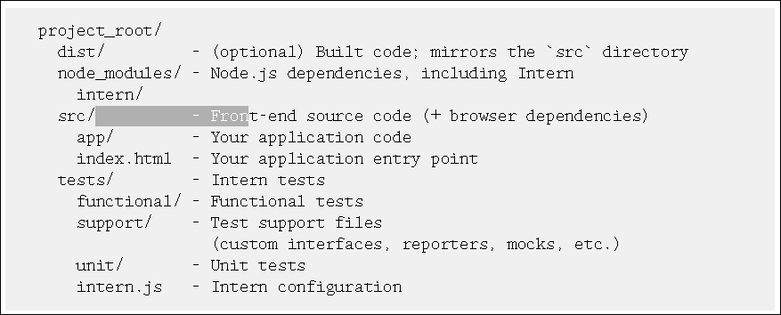
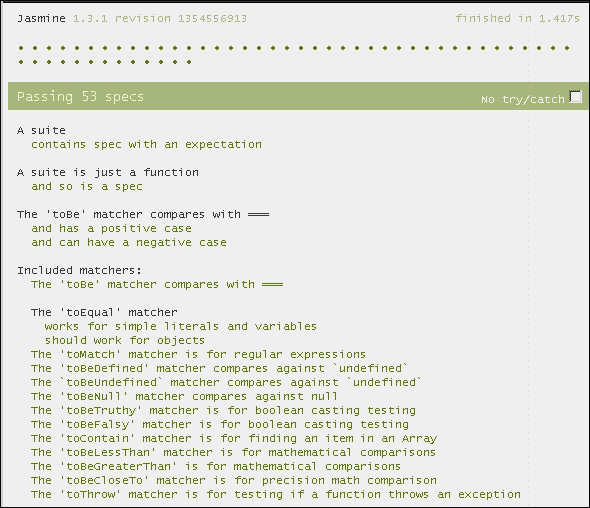
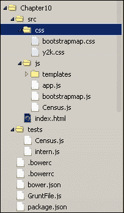
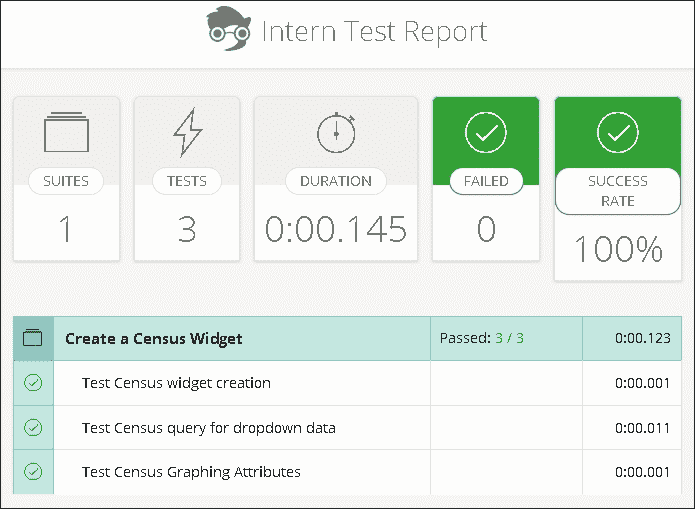

# 第十章。测试

当你将网站或网络应用程序发布给公众时，用户期望它能正常工作。链接应该占据它们的位置，按钮应该执行它们的功能。他们可能没有足够的技能去检查浏览器控制台或观察网络流量。他们甚至有充分的理由在浏览器中禁用 JavaScript。

事实上，有时网站无法正常工作是因为硬件、软件或用户错误，但有时原因来自开发者的有缺陷的代码。也许代码是从代码样本和 Stack Overflow 答案的剪切和粘贴拼贴画中拼凑起来的。然后开发者匆忙测试应用程序一次或两次，使用他们每次编写组件时都使用的相同工作流程。

然而，也许有些事情超出了开发者的控制范围。也许曾经包含数字值的功能属性现在包含字符串。也许 API 已更新，应用程序发生了根本性的变化。也许 REST 数据服务宕机了，或者也许有些无聊的孩子正在尝试输入随机数据或恶意 SQL 注入代码来使网站崩溃。

# 通过代码进行测试

这些都是为你的应用程序创建测试的良好理由。测试是确保你的代码按预期执行的一种方法。它定义了明确的用例，具有明确定义的预期结果。测试还充当一种项目文档。它告诉其他与项目合作的开发者代码应该如何表现。

现在你已经了解了为什么测试很重要，让我们来看看多年来其他开发者所使用的测试方法。

## 单元测试

单元测试是指将单个组件或代码模块加载到测试框架中并单独进行测试。测试被开发出来，结果与预期值进行比较。对于面向对象的编程，可以加载并测试单个对象，而无需等待其他组件加载。

JavaScript 对象和模块非常适合单元测试。开发者可以编写脚本来单独加载模块，将值传递给函数和对象，并查看输出结果。通过测试确保 JavaScript 模块和对象将按照预期的测试案例执行。

然而，单元测试并不能防止所有错误。虽然它们测试了对象和函数的输入和输出，但它们并没有测试这些对象是如何交互的。当两个或更多内存密集型模块在同一浏览器中运行时会发生什么？当从模块 B 期望的输入超时时，模块 A 会发生什么？此外，单元测试也没有解决用户体验问题。很难为地图编写单元测试，因为它的缩放速度比我预期的要慢。显然，单元测试不能成为你测试工具箱中的唯一工具。

## 功能测试

功能测试处理单个流程的测试，而不是单个单元的测试。它执行工作流程中预期的许多更改，并检查结果是否符合预期。虽然一个或多个单元测试可能覆盖功能测试中测试的组件，但功能测试将它们连接起来以模拟现实世界的例子。

一个例子可能是计算欧洲国家在线购买中的**增值税**（**VAT**）。你可能有一些单元测试覆盖以下内容：

+   意大利是否有正确的增值税百分比

+   购买物品列表的小计成本是多少

+   应用增值税后购买的总成本是多少

使用功能测试，你可以将它们全部串联起来。你可以问，如果意大利人购买了这些物品，增值税后的总成本是否符合预期。

## 端到端测试

如果单元测试检查应用程序的各个组件，而功能测试测试单个工作流程，那么端到端测试则从开始到结束检查整个流程。整个应用程序被加载到一个专门为处理测试而设计的平台上。一个用户脚本被加载，包含预定义的操作，如要输入的文本或要点击的按钮。任何错误都会由系统记录以供审查。一些测试框架甚至记录测试过程的截图或视频以供审查。

端到端测试旨在捕获组件之间交互产生的错误。它们还倾向于捕获组件的不当实现（即人为错误）。然而，端到端测试在计算机资源和时间方面可能很昂贵。你使用端到端测试测试的用例越多，得到结果所需的时间就越长。端到端测试通常用于代码发布或夜间构建过程，而单元测试则预期覆盖发布之间的较小代码更改。

网上有很多端到端测试的付费服务。对于一些框架，例如 Angular，有如**Protractor**.js 这样的测试框架可用于端到端测试，但如果你想要既免费又与框架无关的端到端测试，你也有选择。开源库如 Phantom.js、Casper.js 以及像 Selenium 这样的网络浏览器自动化工具可以帮助你从开始到结束测试你的应用程序，只需一点设置。

# 编码时的测试

许多开发者发现，测试代码的最佳时机是在编写代码时。当你花费一整天编写一个模块，结果却失败，却不知道为什么，这是一种糟糕的感觉。通过在开发过程中创建单元测试，开发者可以快速收到有关其代码部分成功或失败的反馈。现在，让我们看看开发者如何在编码时编写测试的一些方法。

## 测试驱动开发

**测试驱动开发**（**TDD**）是一个编写单元测试和端到端测试，然后编写代码以通过这些测试的过程。每当代码重构时，它都会运行相同的测试以确保结果符合预期。

使用 TDD 的开发者通常会按照以下步骤进行编码：

1.  根据需求编写一个测试。

1.  运行所有测试并查看新测试失败。这消除了不必要的测试并测试了整体测试框架。

1.  编写一些代码以通过测试。

1.  再次运行测试。

1.  根据需要重构，以清理丑陋的代码、名称和功能。

1.  重复步骤 1 到 5，直到完成。

通过在编写代码之前编写测试，开发者保持对模块目标的关注，并且不会编写不必要的代码。测试还增强了开发者对代码的信心，并导致代码开发速度更快。

## 行为驱动开发

**行为驱动开发**（**BDD**）是 TDD 的一种形式，它回答了“我应该测试多少？”的问题。在 BDD 中，为代码模块和对象编写的测试带有以“它应该做 ______”开始的描述。然后编写代码测试以测试这些特性和这些特性。

BDD 测试有助于定义验收标准和记录代码。通过查看测试描述，其他开发者将更好地了解代码应该做什么。通过提前描述验收标准，开发者不需要为代码永远不会遇到的使用情况编写额外的代码。

## 测试语句

每个 TDD 和 BDD 设置的核心是测试语句。测试语句是以可读的格式编写的代码行，用于测试结果的性质和值。测试语句在单元测试或功能测试中定义了一个简单的测试。

根据你选择的生成测试语句的库，它们可能遵循 BDD 的 `should` 模式、TDD 的 `expect` 模式或 TDD 的 `assert` 模式。一些库可能允许你为测试使用这些模式中的一个或多个。例如，使用 `Chai.js` 库（我们将在本章稍后讨论），我们可以查看使用这三种模式中的任何一种的示例。使用 `should` 模式的测试可能看起来像以下这样：

```py
chai.should();

country.should.be.a('string');
country.should.equal('Greece');
country.should.have.length(6);
texas.should.have.property('counties')
  .with.length(253);
```

`expect` 模式可能看起来像以下这样：

```py
var expect = chai.expect;

expect(country).to.be.a('string');
expect(country).to.equal('Greece');
expect(country).to.have.length(6);
expect(texas).to.have.property('counties')
  .with.length(253);
```

最后，`assert` 模式应该看起来像以下这样：

```py
var assert = chai.assert;

assert.typeOf(country, 'string');
assert.equal(country, 'Greece');
assert.lengthOf(country, 6)
assert.property(texas, 'counties');
assert.lengthOf(texas.counties, 253);
```

这三种格式测试相同的内容。它们之间的唯一区别是它们用来获得相同结果的语法。根据你的团队喜欢使用的测试格式，许多测试库都将提供相应的功能。

现在我们已经回顾了软件测试背后的基本概念，让我们看看我们可用的工具。在过去的几年里，JavaScript 社区已经产生了一系列测试框架。有些是特定于某个框架的，例如用于 Angular 的 Protractor，而其他则几乎与任何库或框架一起工作，例如 Mocha、Jasmine 或 Intern。在本章中，我们将探讨其中的两个：Intern 和 Jasmine。

# Intern 测试框架

Intern ([`theintern.github.io/`](https://theintern.github.io/)) 是一个用于测试网站和应用的测试框架。其网站宣称，它不仅可以测试纯 JavaScript 应用，还可以测试用 Ruby 和 PHP 构建的服务器端网站，以及 iOS、Android 和 Firefox 应用。Intern 支持 AMD 和异步测试。

如果你使用 Node.js 作为你的开发环境，Intern 可能很好地集成。如果你使用 Grunt，Intern 自带 Grunt 任务，可以轻松集成到现有的工作流程中。Intern 还与持续集成服务如 Jenkins 和 Travis CI 兼容。

Intern 在大多数现代浏览器中工作，包括 Android Browser、Chrome、Firefox、Safari、Opera 和 Internet Explorer。对于 Internet Explorer，Intern 与 9 及更高版本兼容。如果你需要测试 Internet Explorer 的旧版本，可以通过`npm`获取一个名为`intern-geezer`的模块。测试将适用于不支持 EcmaScript 5 的 Internet Explorer 6-8 版本，而常规的 Intern 需要 EcmaScript 5。

## 设置你的测试环境

如果你使用 Node.js，安装可以像`npm install intern`一样简单。根据网站上的说明，Intern 为你的项目推荐了一种文件夹结构，如下面的截图所示：



Intern 的制作者建议你将源代码和可分发代码保存在与测试不同的文件夹中。这样，测试就不会意外地与代码一起发布。你可能不希望人们找到你的测试，这可能会暴露你的安全服务、私有 API 密钥和敏感密码。

### ArcGIS JavaScript API 的特殊要求

根据几位用户的报告，使用 Intern 与 ESRI 提供的 ArcGIS API for JavaScript 的托管链接不建议。因为它可能导致测试在不应失败的地方失败，因为模块及其依赖加载得太慢。推荐的解决方案是将 API 和 Dojo 框架下载到与你的项目文件并列的文件夹中。你可以使用 Grunt，这是一个 Node.js 任务运行器。

## 为 Intern 编写测试

考虑到 Dojo 的 AMD 风格，为 Intern 编写测试是可能的。一旦分配了模块路径，这些模块就可以加载到测试中并运行。让我们看看如何做到这一点。

### 使用 Intern 进行单元测试

为 Intern 编写单元测试与编写`Dojo`模块非常相似，但有几点例外。每个单元测试由一个`define()`函数组成。`define()`函数可以接受一个带有单个`require`参数的函数，或者是一个字符串引用模块的列表，以及一个在所有这些模块加载完成后要运行的函数。在 Node.js 模块中，通过单个`require()`函数单独加载模块是一种常见的做法。

你需要在单元测试函数中加载一个测试接口和一个断言库。测试接口提供了一种注册测试套件的方式。当将接口作为函数调用时，你提供一个 JavaScript 对象，其中包含描述性的键字符串和包含运行测试或分类子测试的函数的值。以下是一个单元测试的示例：

```py
define(function (require) {
  var registerSuite = require('intern!object');
  var assert = require('intern/chai!assert');

  registerSuite({
    'One plus one equals two': function () {
      Var result = 1 + 1;
      assert.equal(result, 2, "1 + 1 should add up to 2");

    },
    'Two plus two equals four': function () {
      Var result = 2 + 2;
      assert.equal(result, 4, "2 + 2 should add up to 4");
    }
  });
});
```

在前面的代码中，`registerSuite`变量接受 Intern 创建测试的对象接口，而`assert`接受 Intern 加载的`chai.assert`库。调用`registerSuite()`函数，传入一个包含两个测试的对象。第一个测试检查一加一是否等于二，而第二个测试检查两个二相加是否等于四。`assert.equal()`函数测试结果变量是否与预期结果匹配，如果测试失败，将抛出一个带有文本消息的错误。

### 使用 Intern 的测试生命周期

在测试套件中运行测试之前，或者在每个测试之前和之后，你可能需要做一些事情。这是测试生命周期。Intern 在测试定义中提供了关键字来定义测试生命周期中应该发生什么。所有这些生命周期函数都是可选的，但它们将帮助你创建可用的测试。以下是测试的一般生命周期的概述：

+   `setup`: 这个函数在所有测试运行之前执行，可能是为了设置测试对象。例如，你可以在测试小部件之前在这里创建一个地图。

+   在每个测试期间，以下事件会发生：

    +   `beforeEach`: 这个函数将在每个测试之前运行。例如，你可能需要加载你小部件的新副本。

    +   测试运行。

    +   `afterEach`: 这个函数将在每个测试之后运行。在这里，你可能需要销毁在`beforeEach`函数中创建的小部件，或者你可能需要重置在测试过程中可能改变的变量值。

+   `teardown`: 这个函数在套件中的所有测试运行之后执行。在这里，你可能需要销毁在`setup`阶段创建的任何地图或对象。

你可以在以下代码中看到一个使用生命周期的单元测试示例。这个示例模拟了加载地图并向地图添加小部件：

```py
define(["intern!object", "intern/chai!expect", "esri/map", "app/widget"], 
function (registerSuite, expect, Map, Widget) {
  var map, widget;
  registerSuite({
    setup: function () {
      map = new Map("mapdiv", {});
    },
    beforeEach: function () {
      widget = new Widget({map: map}, "widget");
    },
    afterEach: function () {
      widget.destroy();
    },
    teardown: function () {
      map.destroy();
    },
    'My first test': function () {
      // test content goes here.
    }
  });
});
```

在前面的代码中，`define`语句看起来与我们熟悉的语句非常相似，可以一次性加载多个对象。请注意，`map`是在`setup`阶段创建并在`teardown`阶段销毁的，而`widget`是在每个测试之前新创建的，并在每个测试之后销毁。

# Jasmine 测试框架

如果你正在寻找一个简单的 BDD 框架来测试你的应用程序，Jasmine 可能正是你所需要的。Jasmine 是一个框架无关的 BDD 库，可以用来在 JavaScript 应用程序上运行测试。它可以通过 Node.js 安装，或者将库下载并复制到测试项目文件夹中。

Jasmine 将其测试加载到一个名为 `SpecRunner` 的 HTML 文件中（简称规范运行器）。这个页面加载了主要的 Jasmine 库，以及所有用户库和单元测试。一旦加载，Jasmine 库就会在浏览器中运行测试并显示结果。

## 为 Jasmine 编写测试

一旦我们设置了 `SpecRunner`，就到了编写测试的时候了。测试使用常规的 JavaScript 逻辑和 Jasmine 提供的一些测试对象和方法编写。让我们看看一些不同的部分。

### 编写套件、规范和测试

Jasmine 测试是由套件、规范和测试组成的。套件构成了顶层，并描述了被测试的单元。实际上，Jasmine 测试使用 `describe()` 函数来编写套件，该函数描述了要测试的功能。`describe()` 函数的参数包括一个描述功能的字符串和一个运行测试的函数。

可以使用 `describe` 套件中的 `it()` 函数编写功能的规范。`it()` 函数与 `describe()` 函数类似，包含一个描述测试的字符串和一个执行测试的函数。在 `it()` 函数中发生的任何错误都会导致测试失败，而成功运行的 `it()` 函数会显示行为的通过测试。以下是一个 `describe()` 和 `it()` 语句的示例：

```py
describe("A widget listing the attributes of the U.N.", 
  function () {
    it("has its headquarters located in New York City.", 
      function () {
        //tests go here
      }
    );
  }
);
```

在每个规范中都有一个或多个测试。在 Jasmine 中，测试是以 expect 格式编写的。根据传递给 `expect` 对象的对象，你可以对其进行多种测试，例如是否等于特定值，或者它是否返回一个“真”的 JavaScript 语句：

```py
describe("A widget listing the attributes of the U.N.", 
  function () {
  // unitedNations.countries is a string array of country names.
  it("contains more than 10 countries.", function () {
    expect(unitedNations.countries.length).toBeGreaterThan(10);
  });
  it("should contain France as a member country.", function () {
    expect(unitedNations.countries).toContain("France");
  });
});
```

### 设置和清理

有时候你需要加载模块或创建 JavaScript 对象来测试。你可能还希望在测试之间重置它们，并在测试后拆解它们以节省内存。为了设置和清理要测试的项目，你会使用 `beforeEach` 和 `afterEach` 函数。每个函数都允许你在测试之间设置和清理值，以便每个测试都有新鲜且可重复的值。这些值在套件中加载，并应在需要它们的任何规范之前调用：

```py
describe("A widget listing the attributes of the U.N.", 
  function () {
    var unitedNations;

    beforeEach(function () {
      unitedNations = new UnitedNations();
    });

    afterEach(function () { 
      unitedNations.destroy();
    });

    it("should do something important", function () {
      //…
    });
  }
);
```

### 忽略测试

如果你的模块有一个已过时的功能呢？如果你期望你的模块有一天会有一个功能，但现在你不想编写一个会失败的测试。你可以删除或注释掉代码，但这样做你会在某种程度上失去你模块的一些历史。Jasmine 有一种方法可以禁用套件并将规范标记为挂起，而不会丢失代码。通过将你的`describe`语句替换为`xdescribe`，以及将你的`it`语句替换为`xit`，你可以编写现在不会失败的测试，但会被标记为“挂起”。你可以在以下代码示例中找到一个使用`xit`的例子：

```py
xit("Elbownia will join the United Nations next year.", 
  function () {
    expect(unitedNations.countries).toContain("Elbownia");
  }
);
```

## 红灯绿灯

许多编写 TDD 和 BDD 测试的开发者会练习红绿测试，这在 Jasmine 中得到支持。红代表失败的测试，而绿代表通过的测试。在红绿测试中，开发者会做以下操作：

1.  编写一个他们知道会失败的必要单元测试（红）。

1.  编写代码以使对象或模块通过测试（绿）。

1.  根据需要重构代码，确保它仍然通过测试。

1.  重复步骤 1 到 3，直到代码和测试都令人满意。

使用红绿测试方法，开发者在开发模块功能时始终牢记测试。通过测试会给予开发者对代码的信心，并允许更快地开发。

在 Jasmine 中，`SpecRunner` HTML 页面上的测试结果使用红色和绿色显示。当测试失败时显示红色，而当所有测试通过时显示绿色。`SpecRunner`页面将显示哪个规范失败（如果有），以及失败时抛出的错误。有了这些信息，开发者可以修复问题并继续开发过程中的下一步。

## Jasmine 和 ArcGIS JavaScript API

为使用 ArcGIS JavaScript API 的应用程序设置`SpecRunner`会有点更具挑战性。Dojo 框架的 AMD 特性使得加载模块和测试变得有点更具挑战性，但这是可以做到的。

第一步是将 Jasmine 和 ArcGIS JavaScript API 加载到应用程序中。由于 Jasmine 需要在我们的应用程序外部处理所有部分，以及因为 AMD 模块在发生错误时往往不会显示，我们需要在 ArcGIS JavaScript API 之前加载 Jasmine：

```py
<!DOCTYPE html>
<html>
<head>
  <meta http-equiv="Content-Type" content="text/html; charset=UTF-8" />
  <title>Jasmine Spec Runner</title>

  <link rel="stylesheet" href="https://js.arcgis.com/3.13/esri/css/esri.css" />
  <link rel="stylesheet" type="text/css" href="tests/jasmine/jasmine.css" />

  <script type="text/javascript" src="img/jasmine.js">
  </script>
  <script type="text/javascript" src="img/jasmine-html.js" ></script>

  <script type="text/javascript">var dojoConfig={};</script>
  <script type="text/javascript" src="img/" ></script>
</head>
```

你将能够加载你模块的位置，以及那些模块上的测试，在`dojoConfig`包中。我们将使用 AMD 加载器来加载测试套件作为模块。在以下示例中，AMD 模块位于`js`子文件夹中，而规范测试位于`tests`子文件夹中。`dojoConfig`包应该看起来像以下这样：

```py
Var basePath = location.pathname.replace(/\/[^\/]*$/, '');
var dojoConfig = {
  async: true,
  packages: [
    {
      name: 'app',
      location: basePath + '/js/'
    }, {
      name: 'spec',
      location: basePath + "/tests/"
    }
  ]
};
```

由于你的许多自定义小部件将需要加载其他模块，包括其他自定义模块，因此你需要确保你的自定义模块的路径与你的应用程序中的路径相同。

在 HTML 文档的主体中，添加一个脚本通过 Dojo 的`require()`函数调用规范。代码将通过 AMD 从测试子文件夹中加载规范。当模块加载完毕并且调用`dojo/ready`函数时，我们将加载 Jasmine 的`HtmlReporter`并执行 Jasmine 测试：

```py
<body>
<script type="text/javascript">
  require([
    "dojo/ready",
    "spec/Widget1",
    "spec/Widget2",
    "spec/Widget3"
  ], function (ready) {

    ready(function () {
      // Set up the HTML reporter - this is responsible for
      // aggregating the results reported by Jasmine as the
      // tests and suites are executed.
      jasmine.getEnv().addReporter(
        new jasmine.HtmlReporter()
      );
      // Run all the loaded test specs.
      jasmine.getEnv().execute();
    });
  });
</script>
</body>
```

当测试加载并运行时，它们将在浏览器中的这个 HTML 页面上渲染。

### 在规范中

通常，Jasmine 规范可以作为脚本运行或封装在自运行的 JavaScript 函数中。然而，为了与 Dojo 一起工作，它们需要被封装在模块定义中。与过去我们制作的自定义模块不同，我们不会使用`dojo/_base/declare`模块来创建自定义模块。我们将简单地使用`define()`语句来加载必要的模块，并在其中运行测试。

对于每个套件，使用`define()`语句来帮助加载测试。你也可以加载任何可能需要的其他 ArcGIS JavaScript API 模块或小部件来帮助测试模块。根据主应用的要求，`Widget1`规范代码可能如下所示：

```py
define(["app/Widget1", "esri/geometry/Point"], 
  function (Widget1, Point) {

});
```

在`define`语句中开始编写 Jasmine 规范。当套件模块加载时，它们将自动运行其中的任何测试并显示在浏览器中的`SpecRunner`页面上的结果。你可以使用`beforeEach`来加载一个全新的模块进行测试，如果需要的话，使用`afterEach`来销毁它。你可以在套件和规范中执行任何与 ArcGIS JavaScript API 相关的自定义任务：

```py
define(["app/Widget1", "esri/geometry/Point"], 
  function (Widget1, Point) {

  describe("My widget does some incredible tasks.", function () {
    var widget, startingPoint;

    // before each test, make a new widget from a staring point.
    beforeEach(function () {
      startingPoint = new Point([-43.5, 87.3]);
      widget = new Widget({start: startingPoint}); 
    });

    // after each test, destroy the widget.
    afterEach(function () {
      widget.destroy();
    });

    it("starts at the starting point", function () {
      expect(widget.start.X).toEqual(startingPoint.X);
      expect(widget.start.Y).toEqual(startingPoint.Y);
    });
    //…
  });

});
```

一旦你定义了测试，你可以在浏览器中查看`SpecRunner`页面并检查结果。如果你已经设置好了一切，你应该有正在运行的测试并显示结果。查看以下截图以获取示例：



## Jasmine 和 ArcGIS JavaScript API 的使用案例

Jasmine 为你的 JavaScript 小部件提供了一个易于编写的测试环境。如果你是单元测试和 BDD 的新手，并且不习惯在测试之上设置 Node.js 环境，那么 Jasmine 是一个很好的起点。你需要的所有库都可以从 GitHub 下载，你几乎可以立即开始编写测试。

### 注意

你可以从其 GitHub 仓库[`github.com/jasmine/jasmine`](https://github.com/jasmine/jasmine)下载 Jasmine。Jasmine 的文档可以在[`jasmine.github.io/`](http://jasmine.github.io/)找到。如果你对这个框架感兴趣，可以阅读 Paulo Ragonha 的《Jasmine JavaScript Testing, Second Edition》或 Munish Sethi 的《Jasmine Cookbook》。

# 我们的应用

对于我们的应用程序，我们将使用 Intern 为我们的 Y2K 地图应用程序设置单元测试。与我们的其他应用程序不同，它们只需要浏览器，我们将使用 Node.js 进行此设置。如果我们遵循真正的 TDD/BDD 实践，我们会在开发应用程序时编写这些测试。然而，这将为您练习为之前编写的任何遗留应用程序编写测试提供机会。

对于这个示例，我们将遵循 David Spriggs 和 Tom Wayson 通过 GitHub 提供的示例（[`github.com/DavidSpriggs/intern-tutorial-esri-jsapi`](https://github.com/DavidSpriggs/intern-tutorial-esri-jsapi)）。我们将对 ArcGIS JavaScript API 和与测试相关的模块的最新更新进行一些修改。

## 添加测试文件

在我们的 Y2K 应用程序中，我们将添加几个文件以与所需的 Node.js 模块一起工作。我们将添加一个 `package.json` 文件，它告诉 **Node 包管理器** (**NPM**) 我们需要哪些模块以及需要哪些版本号。接下来，我们将添加一个 `Grunt.js` 文件，因为我们将使用 Grunt 在本地加载 ArcGIS JavaScript API。我们还将添加一个 `bower.json` 文件，以便 Bower 在本地加载正确的 `Dojo` 库，并添加一个 `.bowerc` 文件以在运行时配置 Bower。最后，我们将在 `tests` 文件夹中添加一个 `intern.js` 文件以配置 Intern 测试。

我们的新文件夹结构应该如下所示：



### package.json 文件

在我们的 `package.json` 文件中，我们将添加我们 Node.js 模块所需的文件依赖项。当指定某些模块的版本号时，你会注意到一些模块前面有一个波浪号 (~) 符号，而其他模块则有一个 caret 符号 (`^`)。波浪号匹配主版本号和次版本号（三位版本代码中的前两个数字），而 caret 符号将拉取最新的匹配主版本号。将以下内容复制到您的 `package.json` 文件中：

```py
{
  "name": "intern-tutorial-esri-jsapi",
  "repository": {
    "type": "git",
    "url": "https://github.com/DavidSpriggs/intern-tutorial-esri-jsapi.git"
  },
  "version": "0.2.0",
  "devDependencies": {
    "dojo": "¹.10",
    "esrislurp": "¹.1.0",
    "grunt": "⁰.4",
    "grunt-contrib-watch": "~0",
    "grunt-esri-slurp": "¹.4.7",
    "intern": "².0.3",
    "selenium-server": "2.38.0"
  }
}
```

### Grunt 设置

Grunt 是在 Node.js 应用程序中使用的流行任务运行器。它用于自动化代码构建步骤，例如压缩 JavaScript、从 LESS 或 SASS 等预处理器创建 CSS 文件，或者在这种情况下，测试代码。Grunt 读取 `Grunt.js` 文件，该文件告诉它在哪里查找文件以及如何处理它们。在我们的 `Grunt.js` 文件中，我们将添加以下代码：

```py
module.exports = function(grunt) {
    grunt.initConfig({
        intern: {
            dev: {
                options: {
                    runType: 'runner',
                    config: 'tests/intern'
                }
            }
        },
        esri_slurp: {
      options: {
        version: '3.13'
      },
            dev: {
                options: {
                    beautify: false
                },
      dest: 'esri'
            }
        },
       esri_slurp_modules:{
      options: {
      version: '3.13',
      src: './',
      dest: './modules'
        }
    },
        watch: {
            all: {
                options: { livereload: true },
                files: ['src/js/*.js']
            }
        }
    });

    // Loading using a local copy
    grunt.loadNpmTasks('intern');
    grunt.loadNpmTasks('grunt-contrib-watch');
    grunt.loadNpmTasks('grunt-esri-slurp');

    // download Esri JSAPI
    grunt.registerTask('slurp', ['esri_slurp']);
    grunt.registerTask('create_modules', ['esri_slurp_modules']);

    // Register a test task
    grunt.registerTask('test', ['intern']);

    // By default we just test
    grunt.registerTask('default', ['test']);
};
```

在前面的代码中，Node.js 预期我们将把我们的模块定义传递给 `module.exports` 变量。我们在 `grunt.initConfig` 中告诉 Grunt 在哪里找到我们的 `intern` 模块以进行测试，以及 `esri_slurp` 以下载 ArcGIS JavaScript API。我们还告诉它监视 `src/js/` 文件夹中的任何 JavaScript 文件更改，这将触发测试再次运行。

一旦配置加载完成，我们告诉 Grunt 加载 `intern`、`grunt-contrib-watch` 和 `grunt-esri-slurp` 模块，从 `npm` 中加载模块。然后注册任务，并设置好运行测试的环境。

### 设置 Bower

Bower 是一个 Node.js 模块，用于自动下载项目所需的所有 JavaScript 库。我们将使用 Bower 下载运行测试所需的库和 Dojo 模块。大多数常见的库和框架都可以通过 Bower 在本地下载。在这个例子中，我们的例外是 ArcGIS JavaScript API，它目前将通过 `esri-slurp` 处理。我们需要填写一个 `bower.json` 文件来告诉 Bower 我们需要哪些库，以及它们的版本应该是什么。

在我们的 `bower.json` 文件中，我们需要创建一个 JSON 对象来列出我们的项目名称、版本号、依赖项以及任何开发依赖项。我们可以将其命名为任何我们想要的名称，所以我们将命名为 `y2k-map-app`。我们将为测试分配版本号 `0.0.1`，并且我们确保在依赖项或库版本号需要更新时增加它。在这种情况下，我们没有开发依赖项，但我们需要列出 Dojo 框架的各个部分，以及 `D3.js`，在这个应用程序中。

我们不仅需要列出测试所需的库和模块，还需要列出版本号。我们可以参考 ArcGIS JavaScript API 的 *What's New* 页面 [`developers.arcgis.com/javascript/jshelp/whats_new.html`](https://developers.arcgis.com/javascript/jshelp/whats_new.html) 来查找。根据页面，我们需要 Dojo 框架的版本 `1.10.4`，包括来自 `dojo/util` 的 `dojo`、`dijit`、`dojox` 和 `util` 模块。我们还需要添加版本为 `0.3.16` 的 `dgrid` 模块、版本为 `0.3.6` 的 `put-selector` 和版本为 `0.1.3` 的 `xstyle`。回顾我们 `index.html` 页面上的 `dojoConfig` 包，我们看到 `d3.js` 使用的是版本 `3.5.6`。我们将在 JSON 对象中列出依赖项，版本号前加一个 `#` 符号。我们的 `bower.json` 文件的内容应如下所示：

```py
{
  "name": "y2k-map-app",
  "version": "0.0.1",
  "dependencies": {
    "dijit": "#1.10.4",
    "dojo": "#1.10.4",
    "dojox": "#1.10.4",
    "util": "dojo-util#1.10.4",
    "dgrid": "#0.3.16",
    "put-selector": "#0.3.6",
    "xstyle": "#0.1.3",
    "d3": "#3.5.6"
  },
  "devDependencies": {}
}
```

对于 `.bowerc` 文件，我们将添加一个简单的配置对象。在配置对象的 JSON 中，我们将添加一个目录字段并分配一个值为 `.`。这将告诉 Bower 加载此文件夹中请求的文件。`.bowerc` 文件的内容应如下所示：

```py
{"directories": "."}
```

### Intern.js 配置

现在我们需要在 `tests` 文件夹中设置我们的 `Intern.js` 配置文件以运行测试。我们将从在页面上添加一些默认代码开始。有关此配置文件的更多信息，请参阅 [`github.com/theintern/intern/wiki/Configuring-Intern`](https://github.com/theintern/intern/wiki/Configuring-Intern)。首先，复制以下内容：

```py
// Learn more about configuring this file at <https://github.com/theintern/intern/wiki/Configuring-Intern>.
// These default settings work OK for most people. The options that *must* be changed below are the
// packages, suites, excludeInstrumentation, and (if you want functional tests) functionalSuites.
define({
  // The port on which the instrumenting proxy will listen
  proxyPort: 9000,

  // A fully qualified URL to the Intern proxy
  proxyUrl: 'http://localhost:9000/',

  // Default desired capabilities for all environments. Individual capabilities can be overridden by any of the
  // specified browser environments in the `environments` array below as well. See
  // https://code.google.com/p/selenium/wiki/DesiredCapabilities for standard Selenium capabilities and
  // https://saucelabs.com/docs/additional-config#desired-capabilities for Sauce Labs capabilities.
  // Note that the `build` capability will be filled in with the current commit ID from the Travis CI environment
  // automatically
  capabilities: {
    'selenium-version': '2.38.0'
  },

  // Browsers to run integration testing against. Note that version numbers must be strings if used with Sauce
  // OnDemand. Options that will be permutated are browserName, version, platform, and platformVersion; any other
  // capabilities options specified for an environment will be copied as-is
  environments: [{
    browserName: 'internet explorer',
    version: '10',
    platform: 'Windows 8'
  }, {
    browserName: 'internet explorer',
    version: '9',
    platform: 'Windows 7'
  }, {
    browserName: 'firefox',
    version: '23',
    platform: ['Linux', 'Windows 7']
  }, {
    browserName: 'firefox',
    version: '21',
    platform: 'Mac 10.6'
  }, {
    browserName: 'chrome',
    platform: ['Linux', 'Mac 10.8', 'Windows 7']
  }, {
    browserName: 'safari',
    version: '6',
    platform: 'Mac 10.8'
  }],

  // Maximum number of simultaneous integration tests that should be executed on the remote WebDriver service
  maxConcurrency: 3,

  // Name of the tunnel class to use for WebDriver tests
  tunnel: 'SauceLabsTunnel',

  // Connection information for the remote WebDriver service. If using Sauce Labs, keep your username and password
  // in the SAUCE_USERNAME and SAUCE_ACCESS_KEY environment variables unless you are sure you will NEVER be
  // publishing this configuration file somewhere
  webdriver: {
    host: 'localhost',
    port: 4444
  },

  // The desired AMD loader to use when running unit tests (client.html/client.js). Omit to use the default Dojo
  // loader
  useLoader: {
    'host-node': 'dojo/dojo',
    'host-browser': 'node_modules/dojo/dojo.js'
  },

  // Configuration options for the module loader; any AMD configuration options supported by the Dojo loader can be
  // used here
  loader: {
    // Packages that should be registered with the loader in each testing environment
    packages:[]
  },

  // Non-functional test suite(s) to run in each browser
  suites: [],

  // A regular expression matching URLs to files that should not be included in code coverage analysis
  excludeInstrumentation: /^tests\//
});
```

在 `loader.packages` 列表中，我们将添加我们预期拥有的所有文件的文件夹位置。这包括我们现在拥有的文件，以及我们预期通过 Bower 下载的文件。请注意，我们的 `app` 文件夹是通过存储我们的 `Census` 小部件的文件夹引用的。此外，我们正在加载所有 ESRI 和 Dojo 文件，以及用于图形的 `D3.js`。您的包部分应如下所示：

```py
packages: [{
  name: 'tests',
  location: 'tests'
}, {
  name: 'app',
  location: 'src/js'
}, {
  name: 'gis',
  location: 'gis'
}, {
  name: 'esri',
  location: 'esri'
}, {
  name: 'dgrid',
  location: 'dgrid'
}, {
  name: 'put-selector',
  location: 'put-selector'
}, {
  name: 'xstyle',
  location: 'xstyle'
}, {
  name: 'dojo',
  location: 'dojo'
}, {
  name: 'dojox',
  location: 'dojox'
}, {
  name: 'dijit',
  location: 'dijit'
}, {
  name: 'd3',
  location: 'd3'
}
], 
…
```

我们需要将我们的测试套件名称添加到套件列表中。目前，我们将添加以下内容：

```py
…
// Non-functional test suite(s) to run in each browser
  suites: [
  'tests/Census'
],
…
```

在这个文件中，我们应该有运行 `Census` 小部件的一些成功测试所需的一切。随着我们添加更多模块，我们可以通过更多测试来扩展这一点。

到目前为止，我们应该准备好通过 Node.js 加载所需的文件。如果您还没有安装 Node.js 或此应用程序的其他节点依赖项，请参阅下一节。如果您已经安装了，您仍然可以查看下一节，或者如果您已经熟悉 Grunt 和 Bower，可以跳过。

## 如果您还没有安装 Node.js

在本节中，我们将介绍设置 Node.js 和必要依赖项的必要步骤。在这些示例中，我们将使用 NPM、Grunt、Grunt-CLI 和 Bower。如果您已经在您的开发环境中设置了这些，您可以跳到下一节。

如果您还没有安装 Node.js，您可以从 [`nodejs.org`](http://nodejs.org) 下载一份。在主页上，您会找到一个链接，指向适合您电脑的安装程序。按照安装向导中的说明来安装软件。

Node.js 通过命令行界面工作。所有命令都将在 Linux 或 OSX 终端或 Windows 命令提示符 (`cmd.exe`) 中输入。某些部分可能需要您具有 root 或管理员权限。此外，如果您使用的是 Windows 机器，可能需要更新 `PATH` 变量以包括 `node.js` 文件夹及其 `node_modules` 子文件夹，其中将加载其他命令和实用程序。

接下来，如果您还没有安装 `grunt`、`grunt-cli` 和 `bower` 模块，我们将使用 `npm` 安装它们。NPM 是 Node.js 的内置组件，并提供对大量插件、库和应用程序的访问，以帮助您更快地生成应用程序。从您的命令提示符（或终端）输入以下内容以下载我们需要的模块：

```py
npm install –g grunt
npm install –g grunt-cli
npm install –g bower

```

`-g` 标志告诉 `npm` 全局安装模块，这样它们就可以在任何可以调用 Node.js 和 `npm` 的地方访问。如果没有 `-g` 标志，模块将在当前目录的 `node_modules` 子目录中加载。

## 本地加载所有库

现在是加载所有必要的 Node.js 应用程序以进行测试的时候了。我们将执行以下操作：

1.  使用 `npm` 安装我们所有的模块。

1.  使用 Bower 本地加载大多数外部 JavaScript 库。

1.  使用 Grunt Slurp 下载 ArcGIS JavaScript API。

我们将首先通过`npm`加载所有模块。您需要使用命令行工具，如 Windows 的命令提示符(`cmd.exe`)或 Mac 或 Linux 的`terminal`来运行代码。我们的`package.json`文件定义了我们需要运行的模块。我们可以在命令行中键入以下内容来安装模块：

```py
npm install

```

如果我们需要测试旧浏览器中的功能，例如 Internet Explorer 8 或更早版本，我们需要安装一个名为`intern-geezer`的 Intern 扩展。它允许测试在可能没有标准 Intern 使用的功能的旧浏览器上运行。如果您需要旧版支持，请在命令行中输入以下内容：

```py
npm install intern-geezer

```

为了在本地上加载我们的 JavaScript 库，我们可以调用 Bower 来安装文件。我们的`bower.json`文件告诉它要加载什么，我们的`.bowerc`文件告诉它在哪里加载。在命令行中输入以下内容：

```py
bower install

```

现在，我们需要加载 ArcGIS JavaScript 库以进行本地测试。由于我们在`Grunt.js`文件中为这个任务定义了所有内容，我们只需在命令行中输入以下内容即可下载文件并启动测试：

```py
grunt slurp

```

现在我们的项目应该已经启动并运行。我们现在可以专注于为我们的应用程序编写测试。

## 编写我们的测试

我们将使用与创建对象时相同的`dojo`模块定义风格来编写测试，类似于我们之前讨论的 Jasmine 测试。然而，由于 Intern 是为 AMD 设计的，我们可以在模块`define()`语句中加载 intern 项。在我们的测试文件夹中，我们将创建一个名为`Census.js`的文件，并让该文件包含我们的测试模块定义。

我们将首先创建我们的`define()`语句的占位符。我们将加载 Intern 和 Chai 来运行我们的测试。使用 Chai，我们将尝试使用`assert`模块，其中所有测试语句都以`assert`开头。我们还将加载我们的`Census`小部件以及所有必要的模块，如地图。由于 Intern 通常在没有要求 HTML DOM 的情况下运行，但我们的地图和`Census`小部件需要它，我们将添加一些模块来向 DOM 添加元素：

```py
define([
   'intern!object',
   'intern/chai!assert',
   'app/Census',
   'esri/map',
   'dojo/dom-construct',
   'dojo/_base/window'
], function(registerSuite, assert, Census, Map, domConstruct, win) {
   //…
});
```

在模块定义中，我们将添加我们的地图和`Census`小部件的变量，然后使用`registerSuite()`将我们的测试套件注册到 Intern。在`registerSuite()`函数中，我们将传递一个包含测试名称`Census Widget`的对象。我们还将添加两个方法，`setup()`和`teardown()`，在所有测试运行前后调用：

```py
…
var map, census;

registerSuite({
  name: 'Census Widget',
  // before the suite starts
  setup:function () {},
  // after all the tests have run
  teardown: function () {},
});
…
```

在设置函数中，我们需要创建 DOM、要附加到 DOM 的地图以及要附加到地图的`Census`小部件。我们将使用`dojo/dom-construct`和`dojo/_base/window`模块来创建这两个 DOM。一旦创建了 DOM 元素，我们就可以初始化我们的地图和人口普查 dijit。在我们的`teardown`函数中，我们将销毁地图，以避免占用宝贵的内存空间。代码应该如下所示：

```py
…
setup: function () {
  // create a map div in the body, load esri css, and create the map for our tests
  domConstruct.place('<link rel="stylesheet" type="text/css" href="//js.arcgis.com/3.13/dijit/themes/claro/claro.css">', win.doc.getElementsByTagName("head")[0], 'last');

  domConstruct.place('<link rel="stylesheet" type="text/css" href="//js.arcgis.com/3.13/esri/css/esri.css">', win.doc.getElementsByTagName("head")[0], 'last');

  domConstruct.place('<div id="map" style="width:300px;height:200px;" class="claro"><div id="census- widget"></div></div>', win.body(), 'only');

  map = new Map("map", {
    basemap: "topo",
    center: [-122.45, 37.75],
    zoom: 13,
    sliderStyle: "small"
  });

  census = new Census({
    map: map,
    mapService: "http://sampleserver6.arcgisonline.com/arcgis/rest/services/Census/MapServer/"
  }, "census-widget");
},
… 
teardown: function () {
  map.destroy();
},
…
```

现在地图和`Census`小部件已经初始化，我们可以开始添加测试。我将向您介绍三个相对简单的测试。您需要进一步扩展它们。在这个练习中，我们将测试以下`Census` dijit：

+   它应该包含所有其工作部件

+   当我们发出已知请求时，它应该返回正确的查询结果

+   图表小部件的部分应该按预期工作

当编写第一个测试时，我们将给它一个标签`Test Census widget creation`。对于相应的函数，我们将首先测试 dijit 的`baseClass`是否符合预期。我们将使用`assert.strictEqual()`来测试值是否正确。请注意，`assert.strictEqual()`需要三个参数，两个要比较的值和一个测试的字符串描述。该测试应该看起来像以下这样：

```py
…
'Test Census widget creation': function() {
  assert.strictEqual(
    census.baseClass, 
    "y2k-census", 
    "census.baseClass should return a string 'y2k-census'"
  );
},
…
```

我们的第二个测试可能看起来有点棘手，因为它是一个异步测试。然而，Intern 被设计用来处理异步测试。如果需要，我们可以在 Intern 考虑任务失败之前调整其超时时间，但现在我们只是加载测试。

在查询测试中，我们将向地图服务发送包含所有州的查询，并请求一个州列表。在查询之后使用`then()`语句，我们可以获取结果并使用`assert.strictEqual()`进行测试。测试应该看起来像以下这样：

```py
…
'Test Census query for dropdown data': function () {

  census.queryShapeAndData({
  url: "http://sampleserver6.arcgisonline.com/arcgis/rest/services/Census/MapServer/3",
  fields: ["STATE_NAME", "STATE_FIPS"],
  where: "1=1",
  }).then(function (featureSet) { 
  assert.strictEqual(
      featureSet.features.length, 
      51, 
      "There should be 51 states returned, including the District of Columbia"
    );
  });
},
…
```

最后，对于绘图函数，我们将编写测试来检查我们用来将特征属性数据转换为 D3 可以使用格式的函数。在这个例子中，我们将通过`census.ethnicData()`方法传递属性数据，并测试输出是否符合预期值。像其他测试库一样，我们可以在本规范中添加多个测试。测试应该看起来像以下这样：

```py
'Test Census Graphing Attributes': function () {

  var ethnicAttributes = {
    WHITE: 10,
    BLACK: 20, 
    AMERI_ES: 12,
    ASIAN: 11,
    HAWN_PI: 4,
    HISPANIC: 23,
    OTHER: 7,
    MULT_RACE: 17
  };

  var data = census.ethnicData(ethnicAttributes);

  assert.strictEqual(
    data.length, 
    8, 
    "The translation from graphic attributes to d3-based data should have 8 attributes in the ethnicData function"
  );
  assert.strictEqual(
    data[4].name, 
    "Hawaiian / Pacific Islander", 
    "The item in index 4 should have a name of Hawaiian / Pacific Islander data"
  );
  assert.strictEqual(
    data[5].population, 
    23, 
    "Out of the Hispanic column, the data index of 5 should have a population of 23."
  );
}
```

## 检查结果

为了检查我们的测试，我们需要在浏览器中加载我们的文件。由于我们将 Intern 作为 node 模块安装，我们需要查看其测试运行页面。该文件位于`node_modules/intern/client.html`下。您需要通过提供一个查询参数`config=tests/intern`来指定在浏览器中加载测试的位置。以下是在浏览器中可能查看的 URL 示例（它可能取决于您的设置）：`http://localhost/MasteringArcGIS/Chapter10/node_modules/intern/client.html?config=tests/intern`。

当您正确查看页面时，您将看到 Intern 图标和通过/失败报告。失败的测试将以红色突出显示，而通过的测试将以绿色突出显示。您应该看到以下图像类似的内容：



# 摘要

在本章中，我们回顾了为什么我们要为我们的 Web 应用程序设置测试的原因。我们回顾了不同的测试方法、开发实践和用于测试我们应用程序的 JavaScript 库。使用 Intern，我们为我们的应用程序设置了测试。

在下一章中，我们将探讨 ArcGIS Server 的网络应用程序的未来，并检查 ArcGIS Online。
