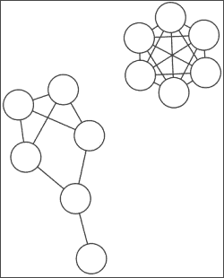
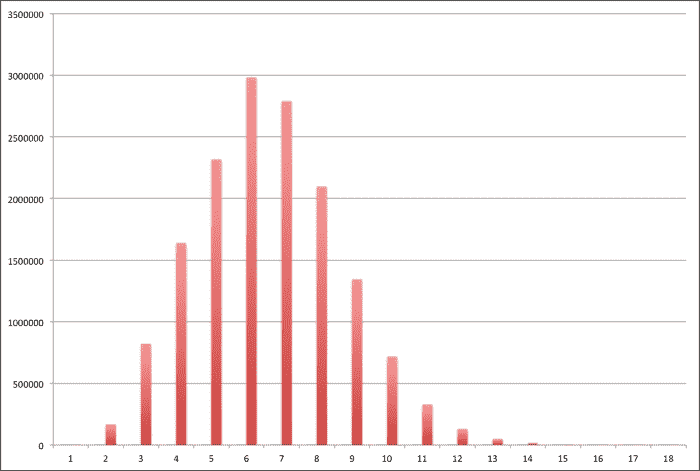
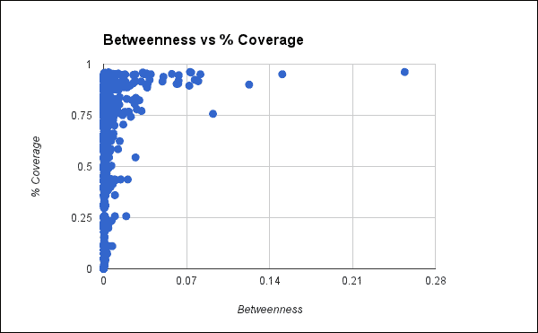
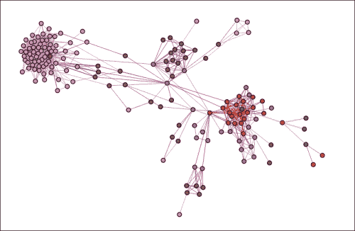
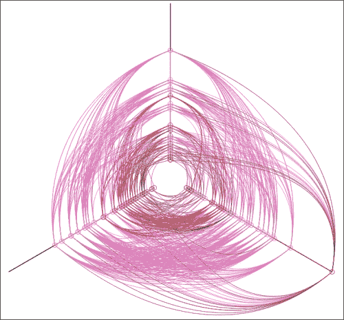
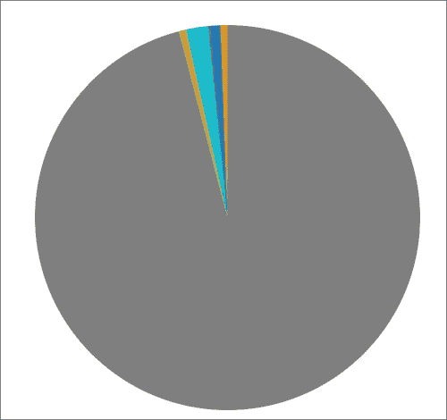
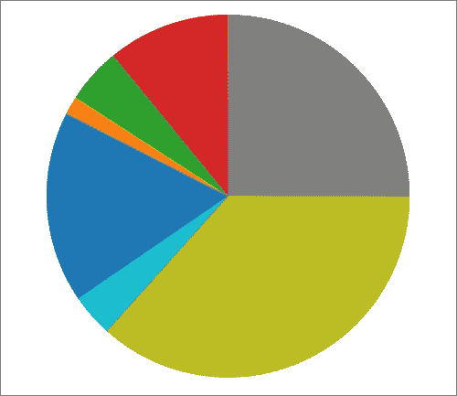

# 第一章 网络分析 – 凯文·贝肯的六度分隔

随着**Facebook**、**Twitter**、**LinkedIn**和其他社交网络的普及，我们越来越多地被我们所认识的人和我们的**网络**中的成员所定义。这些网站帮助我们管理我们所认识的人——无论是个人、职业还是其他方式——以及我们与这些群体和个人的互动。作为交换，我们告诉这些网站我们在网络中的身份。

这些公司，以及许多其他公司，都在花大量时间和精力关注我们的社交网络。它们对我们说了些什么，我们如何向这些群体销售产品？

在本章中，我们将学习如何了解和分析社交网络：

+   分析社交网络

+   获取数据

+   理解图

+   实现图

+   测量社交网络图

+   可视化社交网络图

# 分析社交网络

虽然互联网和像《凯文·贝肯的六度分隔》这样的流行游戏普及了这个概念，但社交网络分析已经存在很长时间了。它在社会学中有着深厚的根源。尽管社会学家约翰·A·巴恩斯可能在 1954 年的文章《挪威岛屿教区的阶级和社区》中首次使用这个术语（[`garfield.library.upenn.edu/classics1987/A1987H444300001.pdf`](http://garfield.library.upenn.edu/classics1987/A1987H444300001.pdf)），但他是在建立在 20 世纪 30 年代的传统之上，在此之前，他正在研究社会群体和相互关系。研究人员认为，这种现象源于社会互动，而不是个人。

稍早一些，从 20 世纪 60 年代开始，斯坦利·米尔格拉姆一直在进行一个小世界实验。他会给美国中西部的某个志愿者寄一封信，并要求他或她将信送到波士顿的目标个人手中。如果志愿者认识目标人物，可以直接寄给他。否则，他们需要将它转交给可能认识目标的人。在每一步，参与者都要给米尔格拉姆寄一张明信片，以便他追踪信件的进展。

这个实验（以及基于它的其他实验）受到了批评。一方面，参与者可能会决定直接扔掉信件，从而错过网络的大部分。然而，结果引人深思。米尔格拉姆发现，少数到达目标信件的平均步骤数为六步。后来的类似实验也产生了类似的结果。

米尔格拉姆本人并没有使用流行的短语“六度分隔”。这可能是从约翰·瓜雷的戏剧和电影《六度分隔》（1990 年和 1993 年）中借用的。他说他从古列尔莫·马可尼那里得到了这个概念，马可尼在 1909 年的诺贝尔奖演讲中讨论了它。

在流行想象中，“六度”这个短语与社会网络同义，这很大程度上归因于流行文化游戏《六度分隔凯文·贝肯》。在这个游戏中，人们会通过追踪他们共同出演的电影来尝试找到凯文·贝肯与其他演员之间的联系。

在本章中，我们将更批判性地审视这个游戏。我们将用它来探索 Facebook（[`www.facebook.com/`](https://www.facebook.com/)）用户网络。我们将可视化这个网络并查看其一些特征。

具体来说，我们将研究一个从 Facebook 收集的网络。我们将找到 Facebook 用户及其朋友的数据，并使用这些数据构建一个社交网络图。我们将分析这些信息，以查看关于六度分隔的观察是否适用于这个网络。更广泛地说，我们将了解我们可以从网络中表示的关系中学到什么，并考虑一些未来研究的可能方向。

# 获取数据

在互联网上可以找到一些 Facebook 网络数据的小型数据集。它们都不特别大或完整，但它们确实为我们提供了一个合理的 Facebook 网络部分的快照。由于 Facebook 图是一个私有数据源，这个部分视图可能就是我们所能期望的最好的了。

我们将从**斯坦福大型网络数据集收集**（[`snap.stanford.edu/data/`](http://snap.stanford.edu/data/））获取数据。这包含了许多网络数据集，从 Facebook 和 Twitter 到道路网络和引用网络。为此，我们将从[http://snap.stanford.edu/data/egonets-Facebook.html](http://snap.stanford.edu/data/egonets-Facebook.html)下载`facebook.tar.gz`文件。一旦它在您的计算机上，您就可以提取它。当我将它放入包含我的源代码的文件夹中时，它创建了一个名为`facebook`的目录。

目录包含 10 组文件。每组基于一个主要顶点（用户），每组包含 5 个文件。对于顶点`0`，这些文件如下：

+   `0.edges`：这包含主要顶点链接到的顶点。

+   `0.circles`：这包含用户为其朋友创建的分组。

+   `0.feat`：这包含用户相邻的顶点的特征以及列在`0.edges`中的顶点。

+   `0.egofeat`：这包含主要用户的特征。

+   `0.featnames`：这包含在`0.feat`和`0.egofeat`中描述的特征的名称。对于 Facebook，这些值已经被匿名化。

为了这些目的，我们只需使用`*.edges`文件。

现在，让我们将注意力转向文件中的数据以及它们所代表的内容。

# 理解图

图是计算机科学数据结构中的瑞士军刀。从理论上讲，任何其他数据结构都可以表示为图，尽管通常它的性能不会很好。

例如，二叉树可以看作是一个图，其中每个节点最多有两个出边。这些边将其与其子节点连接起来。或者，数组可以看作是一个图，其中数组中的每个项目都有边将其与其相邻的项目连接起来。

然而，在这种情况下，我们正在处理的数据自然地可以用图来表示。网络中的人是节点，它们之间的关系是边。

图有多种类型，但它们都有一些共同点。首先，它们是一系列通过边连接的节点。边可以是单向的，在这种情况下，它们所代表的关系只有一个方向（例如，Twitter 上的关注者），或者它是双向的，在这种情况下，关系是双向的（例如，Facebook 上的朋友）。

图通常没有像树或列表那样的层次结构或结构。然而，它们所表示的数据可能具有结构。例如，Twitter 有许多用户（顶点）拥有大量的关注者（入边）。然而，大多数用户只有少数关注者。这种二分法为图创建了一种结构，其中大量数据通过少数顶点流动。

图的数据结构通常支持许多操作，包括添加边、删除边和遍历图。我们将在稍后实现图数据结构。到那时，我们也将查看这些操作。这可能不是性能最好的图，特别是对于非常大的数据集，但它应该有助于清楚地了解图是什么。

# 实现图

由于图数据结构在本章中非常重要，我们在继续之前将更详细地研究它。

实现图有多种方法。在这种情况下，我们将使用**邻接表**的一种变体，它将每个节点映射到其邻居的列表。我们将节点存储在哈希表中，并为每个节点的数据保留单独的哈希表。这种表示对于稀疏图特别有效，因为我们只需要存储现有的链接。如果图非常密集，那么将相邻节点的集合表示为矩阵而不是哈希表将占用更少的内存。

然而，在我们开始查看代码之前，让我们先看看**Leiningen 2**的`project.clj`文件。除了**Clojure**库之外，它还使用了 Clojure JSON 库、`me.raynes`文件实用库（[`github.com/Raynes/fs`](https://github.com/Raynes/fs)）和**Java 简单日志门面**库（[`www.slf4j.org/`](http://www.slf4j.org/)）：

```py
(defproject network-six "0.1.0-SNAPSHOT"
  :description "FIXME: write description"
  :url "http://example.com/FIXME"
  :license {:name "Eclipse Public License"
    :url "http://www.eclipse.org/legal/epl-v10.html"}
  :plugins [[lein-cljsbuild "0.3.2"]]
  :dependencies [[org.slf4j/slf4j-simple "1.7.5"]
    [org.clojure/clojure "1.5.1"]
    [org.clojure/data.json "0.2.2"]
    [me.raynes/fs "1.4.4"]
    [org.clojure/clojurescript "0.0-2202"]]
  :cljsbuild {:builds [{:source-paths ["src-cljs"],
    :compiler {:pretty-printer true,
      :output-to "www/js/main.js",
      :optimizations :whitespace}}]})
```

如果你正在跟踪，还有一些与**ClojureScript**（[`github.com/clojure/clojurescript`](https://github.com/clojure/clojurescript)）相关的部分。我们将在本章后面讨论它们。

对于我们将要工作的第一个文件，打开`src/network_six/graph.clj`。使用以下内容作为命名空间声明：

```py
(ns network-six.graph
  (:require [clojure.set :as set]
            [clojure.core.reducers :as r]
            [clojure.data.json :as json]
            [clojure.java.io :as io]
            [clojure.set :as set]
            [network-six.util :as u]))
```

在这个命名空间中，我们将创建一个包含两个槽位的`Graph`记录。一个是顶点编号与邻居集合之间的映射。第二个是数据映射。我们将定义一个空图，我们可以在任何地方使用它，如下所示：

```py
(defrecord Graph
  [neighbors data])
(def empty-graph (Graph. {} {}))
```

我们将在本章中使用的主要操作是修改图的函数，通过添加或删除边或合并两个图。`add`和`delete`操作都接受一个可选标志来将边视为双向的。在这种情况下，这两个函数只是交换边的端点并调用自己，以便在另一方向的边上进行操作：

```py
(defn update-conj [s x]
  (conj (if (nil? s) #{} s) x))
(defn add
  ([g x y] (add g x y false))
  ([g x y bidirectional?]
   ((if bidirectional? #(add % y x false) identity)
      (update-in g [:neighbors x] #(update-conj % y)))))
(defn delete
  ([g x y] (delete g x y false))
  ([g x y bidirectional?]
   ((if bidirectional? #(delete % y x false) identity)
      (update-in g [:neighbors x] #(disj % y)))))
(defn merge-graphs [a b]
  (Graph. (merge-with set/union (:neighbors a) (:neighbors b))
          (merge (:data a) (:data b))))
```

与图相关的最终低级函数有两个，用于设置或检索与顶点关联的数据。有时，存储与边关联的数据也是有用的，但在这个实现中我们不会使用它。然而，稍后我们将与顶点本身关联一些信息，并在那时使用这些函数。

所有这些函数都是重载的。传入一个图、一个顶点编号和一个键，它们在哈希映射中设置或检索该顶点的值。传入仅图和顶点编号，它们设置或检索顶点的值——要么是哈希映射，要么是那里存在的另一个值：

```py
(defn get-value
  ([g x] ((:data g) x))
  ([g x k] ((get-value g x) k)))
(defn set-value
  ([g x v] (assoc-in g [:data x] v))
  ([g x k v] (set-value g x (assoc (get-value g x) k v))))
(defn update-value
  ([g x f] (set-value g x (f (get-value g x))))
  ([g x k f] (set-value g x k (f (get-value g x k)))))
```

我们还希望获取图中的顶点和边。顶点是所有具有出边节点的集合与具有入边节点的集合的并集。这两个组之间应该有一些，甚至很多重叠。如果图是双向的，那么`get-edges`将返回每条边两次——一条从 a 到 b，另一条从 b 到 a：

```py
(defn get-vertices [graph]
  (reduce set/union (set (keys (:neighbors graph)))
          (vals (:neighbors graph))))
(defn get-edges [graph]
  (let [pair-edges (fn [[v neighbors]]
                     (map #(vector v %) neighbors))]
    (mapcat pair-edges (:neighbors graph))))
```

我们稍后会编写一些更基本的实用工具，但现在，让我们看看一个稍微高级一点但仍然是图的基本操作的函数：对图进行**广度优先遍历**和基于此的搜索。

广度优先遍历首先查看当前节点的所有邻居。然后，它查看这些节点的邻居。它继续逐层扩展搜索。

这与**深度优先遍历**相反，后者沿着一条路径深入到底，直到没有可尝试的出边。然后，它退回到其他路径。

哪种遍历方式更有效实际上取决于单个图的本质以及搜索的内容。然而，在我们的情况下，我们使用广度优先遍历，因为它确保首先找到两个节点之间的最短路径。深度优先搜索不能保证这一点。

`breadth-first`函数的核心是一个**先进先出**（**FIFO**）队列。为了跟踪我们正在尝试的路径中的顶点，我们使用一个包含这些顶点索引的向量。队列持有所有活动路径。我们还保持一个集合，其中包含我们之前到达的顶点。这防止我们陷入循环。

我们将所有内容包装在一个懒序列中，以便调用者可以控制要完成的工作以及它会发生什么。

在循环的每一步中，算法相当标准：

1.  如果队列为空，那么我们已经耗尽了从起始节点可访问的图的部分。我们完成了，我们返回 null 来表示我们没有找到节点。

1.  否则，我们从队列中弹出一个路径向量。当前顶点是最后一个。

1.  我们获取当前顶点的邻居。

1.  我们移除任何已经考虑过的顶点。

1.  对于每个邻居，我们将它追加到当前路径向量中，创建那么多新的路径向量。例如，如果当前路径向量是`[0, 171, 4]`，而新的邻居是`7`、`42`和`532`，那么我们将创建三个新的向量：`[0, 171, 4, 7]`、`[0, 171, 4, 42]`和`[0, 171, 4, 532]`。

1.  我们将每个新的路径向量推入队列。

1.  我们将每个邻居添加到我们已看到的顶点列表中。

1.  我们将当前路径输出到懒序列中。

1.  最后，我们回到第一步，继续输出序列的其余部分。

以下代码是这个实现的实现。大部分都在`bf-seq`中完成，它设置了第一个子句中的处理（两个参数）并在第二个子句中构建序列（三个参数）。另一个函数`breadth-first`是该函数的公共接口：

```py
(defn bf-seq
  ([get-neighbors a]
   (bf-seq
     get-neighbors
     (conj clojure.lang.PersistentQueue/EMPTY [a])
     #{a}))
  ([get-neighbors q seen]
   (lazy-seq
     (when-not (empty? q)
       (let [current (first q)
             nbors (remove seen (get-neighbors (last current)))]
         (cons current
               (bf-seq get-neighbors
                       (into (pop q)
                             (map #(conj current %) nbors))
                       (into seen nbors))))))))
(defn breadth-first [graph a]
  (bf-seq (:neighbors graph) a))
```

注意，使这成为一个广度优先搜索的是我们使用了一个先进先出队列。如果我们使用一个后进先出队列（Clojure 列表对此很适用），那么这将是一个深度优先搜索。它不会广泛地同时尝试多条路径，而是沿着一条路径深入图，直到耗尽第一条路径，然后才回溯尝试新的路径。

这是一个灵活的基础，可以在此基础上构建许多功能。例如，广度优先搜索现在是一个两行函数：

```py
(defn bfs [graph a b]
  (first (filter #(= (last %) b) (breadth-first graph a))))
```

这些只是过滤器，它们找到所有从 a 开始到 b 结束的路径，然后返回这些路径中的第一个。

## 加载数据

现在我们有了将要使用的基本数据结构，我们可以将下载的数据文件读入一个图中。

为了分析网络本身的目的，我们只对`*.edges`文件感兴趣。它列出了图中的边，每行一个边。每条边由它连接的节点编号定义。由于 Facebook 关系是双向的，这里表示的边是双向的。例如，`0.edges`的前几行如下所示：

```py
236 186
122 285
24 346
271 304
176 9
```

我们首先定义一个函数，该函数将一个边文件读入一个`Graph`，然后我们定义另一个函数，该函数遍历目录，读取每个边文件，并将图合并为一个。我将这些放在一个新的命名空间`network-six.ego`中。这定义在`src/network_six/ego.clj`文件中。它使用以下命名空间声明：

```py
(ns network-six.ego
  (:require [clojure.java.io :as io]
            [clojure.set :as set]
            [clojure.string :as string]
            [clojure.data.json :as json]
            [clojure.core.reducers :as r]
            [network-six.graph :as g]
            [network-six.util :as u]
            [me.raynes.fs :as fs])
  (:import [java.io File]))
```

现在我们将定义一个函数，该函数从数据目录中读取`*.edges`文件：

```py
(defn read-edge-file [filename]
  (with-open [f (io/reader filename)]
    (->>
      f
      line-seq
      (r/map #(string/split % #"\s+"))
      (r/map #(mapv (fn [x] (Long/parseLong x)) %))
      (r/reduce #(g/add %1 (first %2) (second %2))
                g/empty-graph))))
(defn read-edge-files [ego-dir]
  (r/reduce g/merge-graphs {}
            (r/map read-edge-file
                   (fs/find-files ego-dir #".*\.edges$"))))
```

我们可以使用这些从**read-eval-print loop**（REPL）中加载数据到我们可以工作的图中。此时我们可以获取一些关于数据的基本信息，以下是如何进行这一操作的步骤：

```py
User=> (require '[network-six.graph :as g]
                '[network-six.ego :as ego])
user=> (def graph (ego/read-edge-files "facebook/"))
#'user/graph
user=> (count (g/get-vertices graph))
3959
user=> (count (g/get-edges graph))
168486
```

现在，让我们更深入地研究图，并获取一些其他指标。

# 测量社交网络图

我们可以使用各种指标来描述特定的图数据结构以及一般的社交网络图。我们将查看其中的一些，并思考它们能教给我们什么，以及我们如何实现它们。

## 密度

回想一下，网络的密度是实际边数与可能边数之比。一个完全密集的网络是每个顶点之间都存在边的网络。例如，在以下图中，右上角的图是完全密集的。左下角的图的密度因子为 0.5333。



可能的边数给出为`N(N-1)`。我们将密度公式定义为以下：

```py
(defn density [graph]
  (let [n (count (get-vertices graph))
        e (count (get-edges graph))]
    (/ (* 2.0 e) (* n (dec n)))))
```

我们可以使用这个来获取关于图中边数的一些信息：

```py
user=> (g/density graph)
0.021504657198130255
```

观察这个图，它看起来并不是很密集。也许其他一些指标能帮助我们解释原因。

## 度

一个顶点的度是连接到它的其他顶点的数量，而对于社交网络来说，平均度也是一个总结统计量。这是通过公式*2E/N*计算的。Clojure 实现这一点的代码非常直接：

```py
(defn avg-degree [graph]
  (/ (* 2.0 (count (get-edges graph)))
     (count (get-vertices graph))))
```

同样，使用它也很容易：

```py
user=> (g/avg-degree graph)
85.11543319019954
```

因此，典型的边数大约是 85。考虑到有近 4,000 个顶点，密度如此低（0.022）是可以理解的。

## 路径

我们可以根据两个元素之间的所有路径得到一些有趣的指标。例如，我们需要这些路径来获取本章后面节点的重要性。平均路径长度也是一个重要的指标。为了计算这些指标中的任何一个，我们需要计算任何两个顶点之间的所有路径。

对于每个边都分配了权重或成本的加权图，有许多算法可以找到最短路径。**Dijkstra 算法**和**Johnson 算法**是两种在多种情况下表现良好的常见算法。

然而，对于无权图，这些搜索算法中的任何一个都会演变成广度优先搜索。我们刚刚实现了这一点。

我们可以找到使用之前提到的`breadth-first`函数走过的路径。我们只需将每个顶点作为起点，并从那里获取所有路径。为了便于后续访问，我们将返回的每个路径转换为以下哈希表：

```py
(defn find-all-paths [graph]
  (->> graph
    get-vertices
    (mapcat #(breadth-first graph %))
    (map #(hash-map :start (first %) :dest (last %) :path %))))
```

不幸的是，还有一个额外的复杂性；输出可能需要的内存比可用的还要多。因此，我们还将定义几个函数来将路径写入文件并再次遍历它们。我们将它们命名为`network-six.graph/write-paths`和`network-six.graph/iter-paths`，你可以在 Packt Publishing 网站上提供的该章节代码下载中找到它们。我将其保存到了名为`path.json`的文件中，因为文件中的每一行都是一个单独的 JSON 文档。

## 平均路径长度

我们可以从路径中获取的第一个度量是平均路径长度。我们可以通过遍历路径来轻松找到这个度量。我们将使用一个略微不同的平均定义，它不需要将所有数据都保存在内存中。你可以在`network-six.util`命名空间中找到它：

```py
user=> (double
         (u/mean
           (map count (map :path (g/iter-paths "path.json")))))
6.525055748717483
```

这很有趣！严格来说，六度分隔的概念表明网络中的所有路径应该是六度或更小。然而，实验通常从平均路径长度的角度来观察路径。在这种情况下，图中任意两个连接节点之间的平均距离略大于六。因此，六度分隔似乎在这个图中是成立的。

通过查看它们的直方图，我们可以更清楚地看到路径长度的分布：



因此，路径长度的分布似乎大致呈正态分布，中心在 6。

## 网络直径

网络直径是图中任意两个节点之间最短路径中最长的路径。这很简单就可以得到：

```py
user=> (reduce
         max Integer/MIN_VALUE
         (map count (map :path (g/iter-paths "path.json"))))
18
```

因此，网络直径大约是平均路径长度的三倍。

## 聚类系数

聚类系数是衡量图中密集连接的集群数量的度量。这是小世界效应的一个度量，有时也被称为“我的所有朋友都互相认识”的性质。为了找到一个顶点的聚类系数，这基本上是将所有邻居从网络中移除并尝试找到子图的密度。在观察整个图时，高聚类系数表明图中存在小世界效应。

以下是如何找到一个单顶点的聚类系数：

```py
(defn clustering-coeff [graph n]
  (let [cluster ((:neighbors graph) n)
        edges (filter cluster (mapcat (:neighbors graph) cluster))
        e (count edges)
        k (count cluster)]
    (if (= k 1)
      0
      (/ (* 2.0 e) (* k (dec k))))))
```

找到图中平均聚类系数的函数很简单，你可以在代码下载中找到它。以下是将其应用于此图时的样子：

```py
user=> (g/avg-cluster-coeff graph)
1.0874536731229358
```

因此，它并不算特别大。可能性很大，有一些节点在整个图中高度连接，而大多数其他节点则连接较少。

## 中心性

有几种方法可以衡量一个顶点在图中的中心程度。一种是**接近中心性**。这是任何特定顶点与其他所有顶点的距离。我们可以通过之前创建的`breadth-first`函数轻松地获取这些信息。不幸的是，这仅适用于完整网络，即每个顶点都可以从其他每个顶点到达的网络。我们目前正在处理的是这种情况。有一些小区域完全与网络的其他部分隔离。

然而，我们可以使用其他中心性度量来代替。**中介中心性**计算一个顶点出现在最短路径中的数量。中介性找到充当桥梁的顶点。这个度量原始的目的是为了识别控制网络通信的人。

为了高效地完成这项工作，我们可以再次依赖`breadth-first`函数返回的路径。我们将从每个顶点获取路径并调用`reduce`。在每一步中，我们将计算路径总数以及每个顶点出现在路径中的次数：

```py
(defn accum-betweenness
  [{:keys [paths betweenness reachable]} [v v-paths]]
  (let [v-paths (filter #(> (count %) 1) v-paths)]
    {:paths (+ paths (count v-paths)),
     :betweenness (merge-with +
                              betweenness
                              (frequencies (flatten v-paths))),
     :reachable (assoc reachable v (count v-paths))}))
```

接下来，一旦我们到达终点，我们将取路径总数并将每个顶点的中介性和可达性总数转换为比率，如下所示：

```py
(defn ->ratio [total [k c]]
  [k (double (/ c total))])
(defn finish-betweenness
  [{:keys [paths betweenness reachable] :as metrics}]
  (assoc metrics
         :betweenness (->> betweenness
                        (map #(->ratio paths %))
                        (into {}))
         :reachable (->> reachable
                      (map #(->ratio paths %))
                      (into {}))))
```

虽然这两个函数做了所有的工作，但它们并不是公共接口。函数指标将这些两个函数结合在一起，形成一个我们实际上想要调用的东西：

```py
(defn metrics [graph]
  (let [mzero {:paths 0, :betweenness {}, :reachable {}}]
    (->> graph
      get-vertices
      (pmap #(vector % (breadth-first graph %)))
      (reduce accum-betweenness mzero)
      finish-betweenness)))
```

我们现在可以使用这个方法来找到任何顶点的中介中心性，如下所示：

```py
user=> (def m (g/metrics graph))
user=> ((:betweenness m) 0)
5.092923145895773E-4
```

或者，我们可以根据中心性度量对顶点进行排序，以获取具有最高值的顶点。返回的每一对值中的第一个数字是节点，第二个数字是该节点的中介中心性。因此，第一个结果是说节点`1085`的中介中心性为`0.254`：

```py
user=> (take 5 (reverse (sort-by second (seq (:betweenness m)))))
([1085 0.2541568423150047] [1718 0.1508391907570839] [1577 0.1228894724115601] [698 0.09236806137867479] [1505 0.08172539570689669])
```

这一切都很有趣，但凯文·贝肯呢？

## 分隔度

我们在第一章中讨论了*六度分隔*的凯文·贝肯，这是一个流行文化现象，以及它如何捕捉许多社交网络的基本性质。让我们分析我们的 Facebook 网络来了解这一点。

首先，我们将创建一个名为`degrees-between`的函数。这个函数将接受一个起始顶点和要向外延伸的度数，然后返回每个级别的分离以及从起始顶点这个距离的顶点列表。`degrees-between`函数将通过累积每个级别的顶点列表和我们已经看到的顶点集合来实现这一点。在每一步中，它将取最后一级别并找到所有这些顶点的邻居，但不包括我们已访问过的那些。以下是这样做的样子：

```py
(defn degrees-between [graph n from]
  (let [neighbors (:neighbors graph)]
    (loop [d [{:degree 0, :neighbors #{from}}],
           seen #{from}]
      (let [{:keys [degree neighbors]} (last d)]
        (if (= degree n)
          d
          (let [next-neighbors (->> neighbors
                             (mapcat (:neighbors graph))
                             (remove seen)
                             set)]
          (recur (conj d {:degree (inc degree)
                            :neighbors next-neighbors})
                   (into seen next-neighbors))))))))
```

之前，我们包括了一种将数据与顶点关联起来的方法，但我们还没有使用它。让我们练习这个功能，将图中从原顶点分离的度数存储起来。我们可以用`degrees-between`函数的输出调用这个函数，或者用`degrees-between`的参数调用：

```py
(defn store-degrees-between
  ([graph degrees]
   (let [store (fn [g {:keys [degree neighbors]}]
                 (reduce #(set-value %1 %2 degree) g neighbors))]
     (reduce store graph degrees)))
  ([graph n from]
   (store-degrees-between graph (degrees-between graph n from))))
```

最后，完整的图形有点大，特别是对于许多可视化来说。所以，让我们包括一个函数，它将允许我们放大由`degrees-between`函数标识的图形。它将返回原始图形，其中顶点数据字段已填充，以及从原顶点分离的`n`级内的顶点子图：

```py
(defn degrees-between-subgraph [graph n from]
  (let [marked (store-degrees-between graph n from)
        v-set (set (map first (filter second (:data marked))))
        sub (subgraph marked v-set)]
    {:graph marked, :subgraph sub}))
```

定义了这些之后，我们可以了解一些关于我们正在研究的网络更有趣的事情。让我们看看有多少不同顶点的网络可以在六跳内到达。让我们看看如何使用顶点`0`来做这件事，然后我们可以看到一张表格，展示了几个顶点的这些值：

```py
user=> (def v-count (count (g/get-vertices g)))
#'user/v-count
user=> (double
         (/ (count
              (g/get-vertices
                (:subgraph (g/degrees-between-subgraph g 6 0))))
            v-count))
0.8949229603435211
```

现在，看到这些顶点的介数值如何跟踪它们可以快速访问的图形量是很有趣的：

| 顶点 | 介数 | 可访问百分比 |
| --- | --- | --- |
| 0 | 0.0005093 | 89.5000 |
| 256 | 0.0000001 | 0.0005 |
| 1354 | 0.0005182 | 75.9500 |
| 1085 | 0.2541568 | 96.1859 |

这些是一些有趣的数据点。对于整个网络来说，这看起来是怎样的？



这清楚地表明，这两个变量之间可能几乎没有相关性。大多数顶点的介数非常低，尽管它们在它们可以访问的网络百分比为 0 到 100 之间变化。

到目前为止，我们有一些关于网络的有趣事实，但得到一个更直观的概述将非常有帮助，就像我们刚才对介数中心性所做的那样。可视化可以帮助我们做到这一点。

# 可视化图形

到目前为止，可视化这个图将非常有用。有许多不同的方法可以可视化图形。我们将使用 JavaScript 库`D3`（数据驱动文档，[`d3js.org/`](http://d3js.org/))在 Facebook 网络数据的子图上生成几个图形可视化，并探讨每种方法的优缺点。最后，我们将使用简单的饼图来可视化当我们从一个节点通过其分离度向外移动时，图形受影响的程度。

## 设置 ClojureScript

正如我刚才提到的，`D3`是一个 JavaScript 库。JavaScript 并不差，但这是一本关于 Clojure 的书。有一个 Clojure 编译器的实现，它可以将 Clojure 转换为 JavaScript。所以，我们将使用它来保持我们的 Clojure 焦点，同时调用 JavaScript 库并将它们部署在浏览器上。

然而，在我们能够做到这一点之前，我们需要设置我们的系统以使用 ClojureScript。我们首先需要做的是将配置添加到我们项目的 `project.clj` 文件中。这相当简单。我们只需要声明 `lein-cljsbuild` 作为此项目的插件，然后配置 ClojureScript 编译器。我们之前的 `project.clj` 文件如下所示，相关行已突出显示：

```py
(defproject network-six "0.1.0-SNAPSHOT"
  :description "FIXME: write description"
  :url "http://example.com/FIXME"
  :license {:name "Eclipse Public License"
            :url "http://www.eclipse.org/legal/epl-v10.html"}
  :plugins [[lein-cljsbuild "0.3.2"]]
  :dependencies [[org.slf4j/slf4j-simple "1.7.5"]
                 [org.clojure/clojure "1.5.1"]
                 [org.clojure/data.json "0.2.2"]
                 [me.raynes/fs "1.4.4"]
                 [org.clojure/clojurescript "0.0-2202"]]
 :cljsbuild {:builds
 [{:source-paths ["src-cljs"],
 :compiler {:pretty-printer true,
 :output-to "www/js/main.js",
 :optimizations :whitespace}}]})

```

第一行将 `lein-cljsbuild` 插件添加到项目中。第二段代码告诉 Leiningen 监视 `src-cljs` 目录中的 ClojureScript 文件。所有这些文件随后都被编译成 `www/js/main.js` 文件。

我们需要一个 HTML 文件来包围编译后的 JavaScript。在代码下载中，我已经包含了一个从 HTML5 Boilerplate 模板（[`html5boilerplate.com/`](http://html5boilerplate.com/)）修改的基本页面。最大的变化是我已经移除了 `div` 内容中的所有内容。

此外，我还添加了一些 `script` 标签来加载 `D3` 和我们将要使用的某些类型图表的 `D3` 插件。在加载 `bootstrap.min.js` 的标签之后，我添加了以下内容：

```py
<script src="img/d3.v3.min.js"></script>
<script src="img/d3.hive.v0.min.js"></script>
```

最后，为了异步使用 AJAX 加载数据文件，`www` 目录需要可以从网络服务器访问。有几种不同的选项，但如果您已安装 Python，最简单的选项可能是导航到 `www` 目录并执行以下命令：

```py
$ cd www
$ python -m SimpleHTTPServer
Serving HTTP on 0.0.0.0 port 8000 ...

```

现在我们准备继续前进。让我们制作一些图表！

## 力导向布局

用于可视化图形的标准图表类型之一是**力导向布局**。这些图表使用动态布局算法生成更清晰且看起来更漂亮的图表。它们基于弹簧模型。每个顶点都排斥其他所有顶点，但边将顶点拉近。

要将此图形编译成 JavaScript，我们首先创建一个名为 `src-cljs/network-six/force.cljs` 的文件。我们将在文件的顶部有一个标准的命名空间声明：

```py
(ns network-six.force)
```

通常情况下，当我们使用 `D3` 时，我们首先设置图形的一部分。然后，我们获取数据。当数据返回时，我们继续设置图形。在 `D3` 中，这通常意味着选择树中当前的一个或多个元素，然后使用 `selectAll` 选择它们的一些子元素。在这个新选择中的元素可能在这个时候存在，也可能不存在。我们将 `selectAll` 元素与数据连接起来。从这一点开始，我们大多数时候使用 `enter` 方法来输入数据项和我们之前选择的非存在元素。如果我们正在更新数据，假设元素已经存在，那么过程略有不同。然而，我描述的使用 `enter` 方法的流程是 `D3` 的正常工作流程。

因此，我们将从设置图形的简单设置开始，创建颜色调色板。在我们创建的图形中，颜色将代表节点与中心节点的距离。我们将花一些时间来理解这一点，因为它说明了 Clojure 和 ClojureScript 之间的一些差异，并展示了如何调用 JavaScript：

```py
(defn make-color []
  (.. js/d3
    -scale
    category10
    (domain (array 0 1 2 3 4 5 6))))
```

让我们一点一点地分析，以便我们能够理解所有内容。我会列出一条线，然后指出它的有趣之处：

```py
  (.. js/d3
```

我们需要注意关于这一行的一些事情。首先，`..` 是我们用于 Java 与主要 Clojure 实现互操作性的标准成员访问宏。在这种情况下，我们使用它来对 JavaScript 对象进行一系列访问调用。在这种情况下，宏展开后的 ClojureScript 将会是 `(.domain (.category10 (.-scale js/d3)) (array 0 1 2 3 4 5 6))`。

在这种情况下，这个对象是主要的 `D3` 对象。`js/` 命名空间默认可用。它只是一个通向主要 JavaScript 作用域的出口。在这种情况下，它将等同于访问 JavaScript `window` 对象上的属性。你可以用它来访问 JavaScript 中的任何内容，而无需声明它。例如，我经常用 `js/console` 进行调试：

```py
    -scale
```

这解析为 JavaScript 的 `d3.scale` 调用。`scale` 前的减号仅仅意味着这是一个属性调用，而不是一个不接受任何参数的函数。由于 Clojure 没有属性，这里所有东西看起来都像函数调用，ClojureScript 需要某种方式知道这不应该生成函数调用。破折号就是这样做的：

```py
    category10
```

这一行，结合前面的行，生成类似于 `d3.scale.category10()` 的 JavaScript 代码。在这种情况下，调用前没有减号，所以 ClojureScript 编译器知道在这种情况下应该生成一个函数调用：

```py
    (domain (array 0 1 2 3 4 5 6))))
```

最后，这个调用使用一个设置域为 0 到 6（包括两者）的数组调用缩放的 `domain` 方法。这些是我们将要查看的距离值。这个 JavaScript 将会是 `d3.scale.category10().domain([0, 1, 2, 3, 4, 5, 6])`。

这个函数创建并返回一个颜色对象。这个对象是可调用的，当它作为一个接受值并返回颜色的函数时，每次调用给定域中的值时，都会一致地返回相同的颜色。例如，这样，距离 `1` 也会与可视化中的相同颜色相关联。

这为我们介绍了 ClojureScript 中互操作性的规则。在我们调用获取数据文件之前，我们还将创建一个负责管理力导向布局和 `svg` 元素的 `D3` 对象。然而，你可以检查 Packt 出版网站提供的代码下载，以获取创建这些对象的函数。

接下来，我们需要访问数据。我们稍后会看到。首先，我们需要定义一些函数来处理我们得到的数据。对于第一个函数，我们需要将力导向布局对象与数据关联起来。

所有可视化的数据都有相同的格式。每个可视化都是一个包含三个键的 JSON 对象。第一个键，`nodes`，是一个表示图中每个顶点的 JSON 对象的数组。我们感兴趣的主要属性是`data`属性。它包含当前顶点与原点顶点的距离。接下来，`links`属性是一个表示图中边的 JSON 对象的列表。每个链接包含一个源顶点和目标顶点的索引。第三个键`graph`包含整个图，使用与我们之前在 Clojure 中使用的相同的数据结构。

力导向布局对象期望与`nodes`和`links`属性的数据一起工作。我们使用`setup-force-layout`函数设置并开始动画：

```py
(defn setup-force-layout [force-layout graph]
  (.. force-layout
    (nodes (.-nodes graph))
    (links (.-links graph))
    start))
```

随着动画的进行，力导向布局对象将为每个节点和边分配一个或多个坐标。我们需要用这些值更新圆圈和路径。

我们将通过布局对象将发出`tick`事件的处理器来完成这项工作：

```py
(defn on-tick [link node]
  (fn []
    (.. link
      (attr "x1" #(.. % -source -x))
      (attr "y1" #(.. % -source -y))
      (attr "x2" #(.. % -target -x))
      (attr "y2" #(.. % -target -y)))
    (.. node
      (attr "cx" #(.-x %))
      (attr "cy" #(.-y %)))))
```

此外，在这个阶段，我们创建了代表顶点和边的`circle`和`path`元素。我们不会在这里列出这些函数。

最后，我们将所有这些整合在一起。首先，我们设置初始对象，然后我们向服务器请求数据，最后，我们创建代表数据的 HTML/SVG 元素。所有这些都与`main`函数紧密相连：

```py
(defn ^:export main [json-file]
  (let [width 960, height 600
        color (make-color)
        force-layout (make-force-layout width height)
        svg (make-svg width height)]
    (.json js/d3 json-file
           (fn [err graph]
             (.. graph
               -links
               (forEach #(do (aset %1 "weight" 1.0)
                           (aset %1 "index" %2))))
             (setup-force-layout force-layout graph)
             (let [link (make-links svg graph color)
                   node (make-nodes svg graph color force-layout)]
               (.on force-layout "tick"
                    (on-tick link node)))))))
```

关于这个函数，我们需要注意几点，它们都在前面的代码片段中被突出显示。首先，函数名附有一个`:export`元数据标志。这仅仅表示 ClojureScript 编译器应该使这个函数在这个命名空间外部的 JavaScript 中可访问。其次，是调用`d3.json`。这个函数接受一个 JSON 数据文件的 URL 和一个处理结果的函数。我们稍后会看到这个函数的更多用法。

在我们能够使用它之前，我们需要从 HTML 页面中调用它。在加载`js/main.js`的`script`标签之后，我添加了这个`script`标签：

```py
<script>
network_six.force.main('facebook-49.json');
</script>
```

这加载了顶点编号为`49`的数据文件。这个顶点的介数因子为 0.0015，它可以在六步之内到达更大网络的四分之一。这足够小，可以创建一个有意义的、可理解的图形，如下面的图所示：



原点顶点（`49`）是位于右下角部分的蓝色顶点，几乎是图中最右边的节点。从这个节点跳出的每个节点都将有不同的颜色。原点顶点分支到三个橙色顶点，这些顶点连接到一些绿色顶点。其中一个绿色顶点位于右侧较大集群的中间。

图的某些方面非常有帮助。它使得追踪节点随着它们远离原点变得相对容易。当在浏览器中与节点交互时，这甚至更容易，因为很容易抓住一个节点并将其从其邻居中拉出来。

然而，它扭曲了一些其他信息。我们今天正在处理的图是没有权重的。从理论上讲，图中的链接应该有相同的长度，因为所有边都有相同的权重。然而，在实践中，在二维中显示一个图是不可能的。力导向布局可以帮助你显示图，但代价是它很难准确地知道线长度和几个不同大小的清晰集群在这个图上的意义。

此外，图本身是无法比较的。如果我们围绕不同的顶点提取一个子图并绘制它，通过比较这两个图我们也不会得到太多信息。

那么，我们还有哪些其他选择？

## 一个蜂巢图

第一个选项是一个**蜂巢图**。这是由 Martin Krzywinski 开发的一种图表类型（[`egweb.bcgsc.ca/`](http://egweb.bcgsc.ca/)）。这些图表略有不同，阅读它们可能需要一些时间来习惯，但它们包含的信息比力导向布局或其他类似图表类型更多。

在蜂巢图中，节点沿着多个径向轴定位，通常是三个。它们在轴上的位置以及它们所在的轴通常是有意义的，尽管在不同的领域和不同的图表中，这些意义可能会发生变化。

为了这个，我们将具有更高度（与更多边相连）的顶点定位在中心更远的位置。靠近中心的顶点将有更少的边和更少的邻居。再次强调，线的颜色代表该节点与中心节点的距离。在这种情况下，我们不会使轴的选择有意义。

要创建这个图，我们将打开一个新的文件，`src-cljs/network-six/hive.cljs`。在顶部，我们将使用这个命名空间声明：

```py
(ns network-six.hive)
```

一个节点所在的轴是一个`D3` *scale*的例子；其从力导向布局图中的颜色是另一个 scale。Scales 是具有附加属性并可通过 getter 或 setter 函数访问的函数。然而，主要的是，当它们传递一个数据对象和一个键函数时，它们知道如何将数据对象分配到 scale 上的一个位置。

在这种情况下，`make-angle`函数将被用来将节点分配到一个轴上：

```py
(defn make-angle []
  (.. js/d3
    -scale
    ordinal
    (domain (.range js/d3 4))
    (rangePoints (array 0 (* 2.0 pi)))))
```

我们将使用`get-radius`函数将节点定位在每个轴上。这是另一个刻度，它根据连接到节点的边的数量，将顶点定位在`40`到`400`的范围之间：

```py
(defn get-radius [nodes]
  (.. js/d3
    -scale
    linear
    (range (array 40 400))
    (domain (array (.min js/d3 nodes #(.-count %))
                   (.max js/d3 nodes #(.-count %))))))
```

我们使用这些刻度尺，以及一个颜色刻度尺，来定位和样式化节点：

```py
(defn make-circles [svg nodes color angle radius]
  (.. svg
    (selectAll ".node")
    (data nodes)
    (enter)
    (append "circle")
    (attr "stroke" #(color (.-data %)))
    (attr "transform"
          #(str "rotate(" (degrees (angle (mod (.-n %) 3))) \)))
    (attr "cx" #(radius (.-count %)))
    (attr "r" 5)
    (attr "class" #(get-classes %))))
```

我已经突出显示了前面代码片段中使用的刻度尺。圆的`stroke`属性来自颜色，它代表顶点在这个图中的距离。

`angle`用于通过圆的`transform`属性将圆分配给一个轴。这是基于顶点在数据集中的索引，或多或少是随机进行的。

最后，`radius`刻度将圆定位在轴上。这设置了圆在*x*轴上的位置，然后使用`transform`属性和`angle`刻度进行旋转。

再次，所有内容都在`main`函数中整合。这个函数设置了刻度尺，请求数据，然后创建和定位节点和边：

```py
(defn ^:export main [json-file]
  (let [width 750, height 750
        angle (make-angle), color (make-color)
        svg (make-svg width height)]
    (.json js/d3 json-file
           (fn [err data]
             (let [nodes (.-nodes data)
                   radius (get-radius nodes)]
               (make-axes svg angle radius)
               (let [df (get-degreed nodes data)]
                 (make-arcs svg nodes df color angle radius)
                 (make-circles svg nodes color angle radius)))))))
```

让我们看看这个图是什么样子：



再次，颜色代表节点与中心节点的距离。每个轴上的中心距离是节点的度数。

从紫色-粉红色的颜色和条纹的普遍存在来看，大多数顶点距离起点有六跳。从顶点在轴上的位置，我们还可以看到大多数节点连接的边数适中。有一个节点连接的边相当多，但大多数节点都更靠近中心。

这个图更密集。虽然力导向图可能有问题，但它似乎更直观，更容易理解，无论它是否有意义。蜂巢图更有意义，但它们也稍微复杂一些，需要更多的工作来学习和解读。

## 饼图

我们现在的需求比我们刚才创建的复杂图要简单；然而，我们主要感兴趣的是从顶点出发，网络中有多少部分在六跳之内。到目前为止，我们查看的两个图都没有很好地传达这一点，尽管它们提供了其他信息，并且通常与图一起使用。我们想知道比例，而用于比例的图表通常是饼图。也许它有点无聊，而且它并不严格地描述图形可视化本身，但它很清晰，我们知道我们在处理什么。

生成饼图的过程将非常类似于创建力导向布局图或蜂巢图。我们将采取相同的步骤，尽管一些细节会有所不同。

第一个不同之处在于创建弧线的函数。这类似于一个刻度尺，但其输出用于创建饼图扇形的`d`（路径描述）属性：

```py
(defn make-arc [radius]
  (.. js/d3 -svg arc
    (outerRadius (- radius 10))
    (innerRadius 0)))
```

`pie`布局控制图表的整体过程和设计。在这种情况下，我们说我们不需要排序，我们需要使用数据对象的`amount`属性：

```py
(defn make-pie []
  (.. js/d3 -layout pie
    (sort nil)
    (value #(.-amount %))))
```

在这个图表中的另一个不同之处在于，在数据准备好被输入到饼图布局之前，我们需要先对数据进行预处理。而不是一个节点和链接的列表，我们需要提供类别和计数。为了使这个过程更简单，我们将为这些频率创建一个记录类型：

```py
(defrecord Freq [degree amount])
```

此外，我们还需要一个函数，它接受与其他图表相同的数据，按距离原点顶点的距离进行计数，并创建`Freq`实例来包含这些数据：

```py
(defn get-freqs [data]
  (->> data
    .-nodes
    (map #(.-data %))
    frequencies
    (map #(Freq. (first %) (second %)))
    into-array))
```

再次，我们在`main`函数中把这些放在一起，我们按照通常的方式行事。首先，我们设置图，然后我们检索数据，最后，我们将两者结合起来创建图。

在这种情况下，这应该能给我们一个概念，即这个顶点可以轻松接触图中的多少部分。顶点`49`的图如下所示。我们可以看到，它实际上几乎根本不接触网络中的任何部分。3799 个顶点，超过网络 95%的部分，都不在顶点`49`的六跳范围内。



然而，如果我们将其与顶点`1085`的饼图进行比较，这是具有最高中介中心性的顶点，我们会看到一个完全不同的画面。对于那个顶点，超过 95%的网络在六跳内是可到达的。



同样有趣的是，大多数顶点距离原点有四个边。对于较小的网络，大多数顶点距离更远。然而，在这种情况下，它几乎就像它开始耗尽网络中的顶点一样。

# 摘要

因此，我们发现这个数据集符合对“小世界”或六度假设的宽松定义。任何两个节点之间的平均距离大约是六。另外，由于我们正在处理一个样本，使用完整的图可能填补一些链接并将节点更紧密地聚集在一起。

我们还花了一些时间查看一些可视化。我们学到的一个重要教训是，更复杂的不一定是更好的。简单，甚至可能有点无聊的图，有时可以更好地回答我们的问题。

然而，我们只是触及了使用社交图可以做的事情的表面。我们主要将网络视为一个非常基本的、无特征的图，查看人们及其关系的存在，而不深入细节。然而，有几个方向我们可以走，使我们的分析更具社交性。一方面，我们可以查看不同类型的关系。例如，Facebook 和其他社交平台允许你指定配偶，可能有趣的是查看配偶网络的交集。Facebook 还使用他们著名的**喜欢**功能跟踪兴趣和归属。我们还可以查看具有相似兴趣的人如何找到彼此并形成小团体。

最后，我们成功地学到了很多关于网络及其工作原理的知识。许多现实世界的社交网络具有非常相似的特征，同时社会学也有很多值得学习的地方。这些结构始终在定义着我们，但从未像现在这样重要。能够有效地分析社交网络，并从中获得洞见，可以成为我们工具箱中一个有用且有效的部分。

在下一章中，我们将探讨使用地理分析并将其应用于气象数据。
