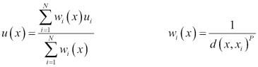
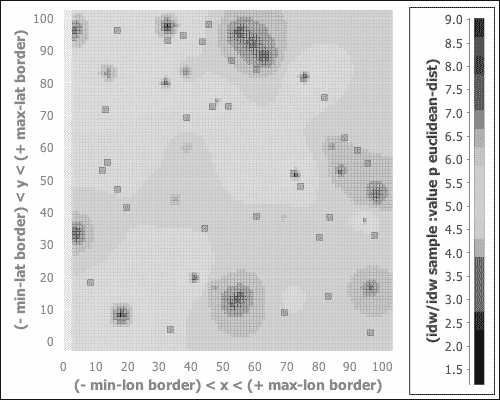
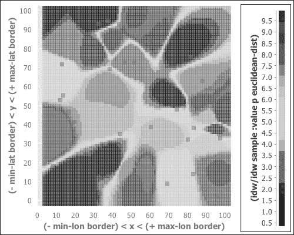
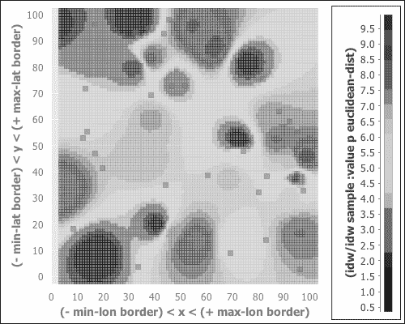
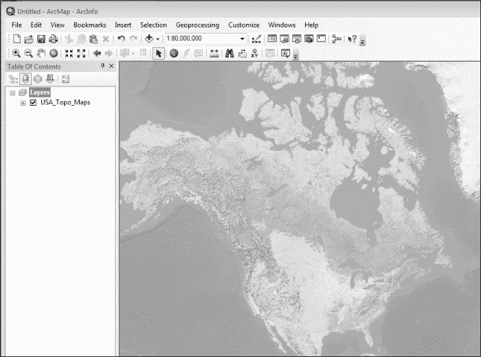
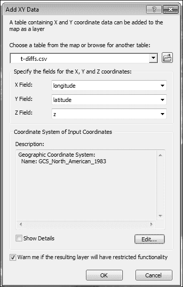
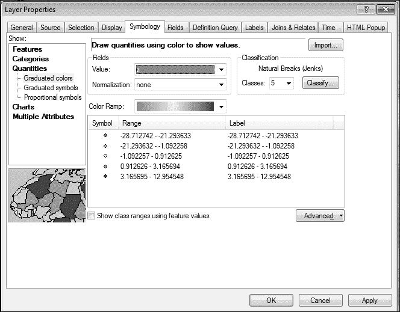
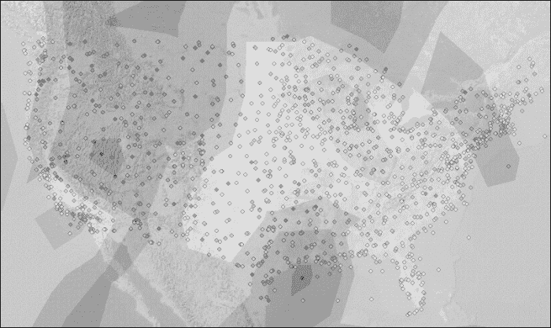

# 第二章：GIS 分析 – 气候变化制图

数据分析的一个领域受到了很多关注，那就是**地理信息系统**（**GIS**）。GIS 是一个旨在存储、管理、操作和分析地理数据的系统。因此，GIS 位于制图学、计算机科学、统计学和信息科学的交汇点。

GIS 应用于军事规划、流行病学、建筑、城市规划、考古学和其他许多领域。基本上，任何涉及位置或拓扑的领域或问题都可以使用 GIS 技术或方法。

如您从这非常简短的描述中可以想象到的，我们在这章中甚至不会触及 GIS 的表面。然而，我们将将其应用于一个小问题，以了解它如何帮助我们更好地理解气候变化对大陆**美国**的影响。

# 理解 GIS

尽管前面的描述是准确的，但它并没有真正帮助我们多少。作为一个关注地形布局的领域，GIS 实际上是从野外开始的。数据是通过航空和卫星摄影收集的，也是通过地面人员使用 GPS、激光测距仪和测量工具收集的。GIS 还可以利用现有的地图，特别是用于历史研究和比较时期。例如，这可能涉及研究一个城市如何随着时间的推移而演变，或者国家边界如何发生变化。GIS 在收集这些数据并将其输入计算机方面投入了大量的时间和精力。

一旦数据进入计算机，GIS 就可以根据提出的问题和手头的任务，对数据进行广泛和多样的分析。例如，以下是一些你可以用 GIS 做的许多事情之一：

+   **视域分析**：这试图回答问题：“站在这里这个高度（也许是在二楼窗户）的人能看到什么？”这考虑了观众周围地形的高度和坡度。

+   **拓扑建模**：这结合了 GIS 数据与数据挖掘和建模中的其他数据，为更主流的数据挖掘和建模添加了地理空间组件。这使得模型能够考虑地理邻近性。

+   **水文建模**：这模拟了水通过降雨、流域、径流和集水区与环境的相互作用方式。

+   **地理编码**：这涉及将可读地址与其地理坐标关联起来。当你点击**谷歌地图**或**必应地图**并获取某个地点的业务或地址时，那是因为它已经为你的点击坐标进行了地理编码。

对于大多数 GIS 专家来说，主要的工具是 **ESRI** 的 **ArcGIS** ([`www.esri.com/`](http://www.esri.com/))。这是一个功能强大、全面集成的 GIS 工作台。它与大多数数据源兼容，并执行大多数分析。它还提供了 **Python** 的 **API** 以及 **Java** 和 **.NET** 的 API，用于与 ArcGIS 服务器交互。我们将在本章的末尾使用 ArcGIS 来生成可视化。

然而，还有其他选择。大多数数据库都具备一些 GIS 功能，**Quantum GIS** ([`www.qgis.org/`](http://www.qgis.org/)) 是 ArcGIS 的开源替代品。它可能没有那么精致，也没有那么全面的功能，但它在自己的领域内仍然非常强大，并且是免费提供的。**GeoServer** ([`geoserver.org/`](http://geoserver.org/)) 是一个面向企业级的服务器和 GIS 数据管理系统。还有多种编程语言的库；**地理空间数据抽象层**，也称为 **GDAL** ([`www.gdal.org/`](http://www.gdal.org/)) 值得特别提及，不仅因为它本身很重要，还因为它为许多其他编程语言的库提供了基础。Java 的一个库是 **GeoTools** ([`www.geotools.org/`](http://www.geotools.org/))，其中一部分在幕后调用 GDAL。

# 映射气候变化

因此，让我们卷起袖子，进行一些基于地理空间的数据分析。

对于我们的问题，我们将研究气候变化在过去一个世纪左右对北美大陆的影响。具体来说，我们将研究七月平均最高温度的变化。对于北美来说，这将为我们提供一个关于最热温度的良好快照。

与天气数据一起工作的一个好处是，数据量很大，而且很容易获得。**美国国家海洋和大气管理局** (**NOAA**) 收集并维护这些数据档案。

对于这个项目，我们将使用 **全球每日概览** ([`www.ncdc.noaa.gov/cgi-bin/res40.pl`](http://www.ncdc.noaa.gov/cgi-bin/res40.pl))。这包括每个活跃气象站的每日概览。我们将过滤掉任何不在美国境内的气象站，以及七月份未使用的任何数据。

气候通常在三十年期进行定义。例如，一个地点的气候将是三十年平均温度，而不是一年的温度。然而，在我们覆盖的时间跨度内，三十年期可能不会那么多，因此，我们将查看每个气象站七月最大温度的十年滚动平均值。

为了找出最大温度的变化量，我们将计算这些十年期的滚动平均值。然后，对于每个气象站，我们将找出第一个十年期平均温度与最后一个十年期平均温度之间的差异。

不幸的是，站点分布并不均匀或紧密；正如我们将看到的，它们在多年间也会开放和关闭。因此，我们将尽力使用这些数据，并填补数据中的地理空间空白。

最后，我们将把这个数据绘制在美国地图上。这样就可以很容易地看到不同地方的温度变化情况。这个过程会是什么样的呢？让我们概述本章剩余部分的步骤：

1.  从 NOAA 的 FTP 服务器下载数据。从文件中提取它。

1.  过滤掉我们不需要用于此分析的数据。我们只会保留我们感兴趣的地方和月份（美国的七月）。

1.  计算每个月的最高温度平均值。

1.  计算第三步中平均值的十年滚动平均值。

1.  获取每个气象站第一个和最后一个十年平均值的差异。

1.  插值计算站点之间的温度差异。

1.  创建差异的热力图。

1.  审查结果。

## 下载和解压缩数据

如上所述，NOAA 维护了一个 GSOD 的存档。对于世界上每个气象站，这些每日总结跟踪了全球所有活跃气象站的各种天气数据。我们将使用这里的数据作为我们分析的基础。

数据可在 ftp://ftp.ncdc.noaa.gov/pub/data/gsod/获取。让我们看看这些数据是如何存储和组织的：


因此，FTP 站点上的主目录（`/pub/data/gsod/`）为有天气数据的每个年份都有一个目录。还有一个名为`ish-history.csv`的文件。它包含有关气象站的信息，它们何时运行，以及它们的位置。（此外，文本文件和`README`文件对于获取每个文件中更具体、更详细的信息总是很重要的。）

现在让我们查看一个数据目录；这是 2013 年的。

数据目录包含大量的数据文件。每个以`.op.gz`结尾的文件在其文件名中有三个组成部分。前两部分是气象站的标识符，第三部分是年份。

每个数据目录都有一个包含所有`*.op.gz`数据文件的 tarball。这个文件将是最容易下载的，然后我们可以从中提取`*.op.gz`文件。之后，我们需要解压缩这些文件以获取`*.op`数据文件。让我们这样做，然后我们可以查看我们拥有的数据。

### 下载文件

在我们实际编写任何代码来完成这个任务之前，让我们看看我们需要依赖的库。

在我们开始之前，让我们设置我们的项目。对于本章，我们的 Leiningen 2（[`leiningen.org/`](http://leiningen.org/)）`project.clj`文件应该看起来像以下代码：

```py
(defproject clj-gis "0.1.0-SNAPSHOT"
  :dependencies [[org.clojure/clojure "1.5.1"]
                 [me.raynes/fs "1.4.4"]
                 [com.velisco/clj-ftp "0.3.0"]
                 [org.clojure/data.csv "0.1.2"]
                 [clj-time "0.5.1"]
                 [incanter/incanter-charts "1.5.1"]]
  :jvm-opts ["-Xmx4096m"])
```

现在让我们打开这段代码的`src/clj_gis/download.clj`文件。我们将为这段代码使用以下命名空间声明：

```py
(ns clj-gis.download
  (:require [clojure.java.io :as io]
            [me.raynes.fs.compression :as compression]
            [me.raynes.fs :as fs]
            [miner.ftp :as ftp]
            [clj-gis.locations :as loc]
            [clj-gis.util :as u])
  (:import [org.apache.commons.net.ftp FTP]
           [java.util.zip GZIPInputStream]
           [java.io BufferedInputStream]))
```

现在，接下来的两个函数一起下载 GSOD 数据文件。主函数是`download-data`。它遍历 FTP 服务器上的目录树，每当它识别出要下载的文件时，它就会将其交给`download-file`函数。这个函数确定文件存放的位置，并将其下载到该位置。我已省略了一些工具和辅助函数的源代码，例如`download-src`，以便我们可以关注更大的问题。您可以在本章代码下载的文件中找到这些函数。以下代码片段是可下载代码的一部分：

```py
(defn download-file
  "Download a single file from FTP into a download directory."
  [client download-dir dirname]
  (let [src (download-src dirname)
        dest (download-dest download-dir dirname)]
    (ftp/client-get client src dest)))

(defn download-data
  "Connect to an FTP server and download the GSOD data files."
  [uri download-dir data-dir]
  (let [download-dir (io/file download-dir)
        data-dir (io/file data-dir)]
    (ensure-dir download-dir)
    (ensure-dir data-dir)
    (ftp/with-ftp [client uri]
      (.setFileType client FTP/BINARY_FILE_TYPE)
      (doseq [dirname
              (filter get-year
                      (ftp/client-directory-names client))]
        (download-file client download-dir dirname)))))
```

### 提取文件

现在，我们已经从 NOAA FTP 服务器上下载了文件到本地硬盘。然而，我们仍然需要使用`tar`实用程序来提取我们下载的文件，然后解压缩它们。

我们将使用**FS**库来提取下载的文件。目前，单个数据文件是以名为`tar`的通用 Unix 文件格式存储的，它将多个文件收集到一个更大的文件中。这些文件也使用**gzip**实用程序进行压缩。我们将使用 Java 的`GZIPOutputStream`来解压缩`gz`文件。让我们看看这是如何工作的：

```py
(defn untar
  "Untar the file into the destination directory."
  [input-file dest-dir]
  (compression/untar input-file dest-dir))

(defn gunzip
  "Gunzip the input file and delete the original."
  [input-file]
  (let [input-file (fs/file input-file)
        parts (fs/split input-file)
        dest (fs/file (reduce fs/file (butlast parts))
                      (first (fs/split-ext (last parts))))]
    (with-open [f-in (BufferedInputStream.
                       (GZIPInputStream.
                         (io/input-stream input-file)))]
      (with-open [f-out (io/output-stream dest)]
        (io/copy f-in f-out)))))
```

我们可以将这些函数与刚才查看的下载函数结合起来。这个函数`download-all`将下载所有数据，然后将所有数据文件解压缩到由`clj-gis.locations/*data-dir*`指定的目录中：

```py
(defn download-all []
  (let [tar-dir (fs/file loc/*download-dir*)
        data-dir (fs/file loc/*data-dir*)]
    (download-data tar-dir data-dir)
    (doseq [tar-file (fs/list-dir tar-dir)]
      (untar (fs/file tar-dir tar-file) data-dir))
    (doseq [gz-file (fs/list-dir data-dir)]
      (gunzip (fs/file data-dir gz-file)))))
```

现在，这些文件看起来是什么样子？其中一个文件的标题行如下：

```py
STN--- WBAN   YEARMODA    TEMP       DEWP      SLP        STP       VISIB      WDSP     MXSPD   GUST    MAX     MIN   PRCP   SNDP   FRSHTT
```

以下是一行数据：

```py
007032 99999  20130126    80.1 12    65.5 12  9999.9  0  9999.9  0  999.9  0    2.5 12    6.0  999.9    91.4*   71.6*  0.00I 999.9  000000
```

因此，有一些标识字段，一些用于温度、露点、风速和其他天气数据。接下来，让我们看看如何筛选数据，只保留我们计划使用的信息。

## 数据转换 – 过滤

正如我们刚才注意到的，GSOD 文件中有大量我们不打算使用的数据。这包括以下内容：

+   有太多我们不感兴趣的地点数据文件

+   有太多我们不感兴趣的月份数据行

+   有太多我们不感兴趣的天气数据列（例如露点）

到目前为止，我们只关注第一个问题。只需过滤掉我们不关注的地点，就可以显著减少我们处理的数据量，从大约 20 GB 的数据减少到仅仅 3 GB。

这部分代码将在`src/clj_gis/filter_data.clj`文件中。给它以下命名空间声明：

```py
(ns clj-gis.filter-data
  (:require
    [clojure.string :as str]
    [clojure.data.csv :as csv]
    [clojure.java.io :as io]
    [me.raynes.fs :as fs]
    [clj-gis.locations :as loc]
    [clj-gis.util :refer (ensure-dir)]))
```

现在是时候将代码放入文件的其余部分了。

为了过滤掉我们不会使用的数据，我们将美国站点的文件复制到它们自己的目录中。我们可以从之前注意到的`ish-history.csv`文件中创建这些站点的集合，因此我们的第一个任务将是解析该文件。此代码将读取 CSV 文件并将每行的数据放入一个新的数据记录中，`IshHistory`。为这些信息创建自己的数据类型不是必需的，但它使其余的代码更容易阅读。例如，我们可以使用`(:country h)`而不是`(nth h 3)`来引用国家字段，稍后。这种类型还可以反映输入文件的列顺序，这使得读取数据更容易：

```py
(defrecord IshHistory
  [usaf wban station_name country fips state call
   lat lon elevation begin end])
(defn read-history
  "Read the station history file."
  [filename]
  (with-open [f (io/reader filename)]
    (doall
      (->> (csv/read-csv f)
        (drop 1)
        (map #(apply ->IshHistory %))))))
```

站点通过 USAF 和 WBAN 字段的组合来识别。一些站点使用 USAF，一些使用 WBAN，还有一些两者都使用。因此，我们需要跟踪两者以唯一识别站点。这个函数将创建给定国家的站点集合：

```py
(defn get-station-set
  "Create a set of all stations in a country."
  [country histories]
  (set (map #(vector (:usaf %) (:wban %))
            (filter #(= (:country %) country)
                    histories))))
```

最后，我们需要将这些函数组合在一起。这个函数`filter-data-files`读取历史数据并创建我们想要保留的站点集合。然后，它遍历数据目录并解析文件名以获取每个文件的站点标识符。然后，来自集合中站点的文件将被复制到与国家代码相同的目录中，如下所示：

```py
(defn filter-data-files
  "Read the history file and copy data files matching the
  country code into a new directory."
  [ish-history-file data-dir country-code]
  (let [history (read-history ish-history-file)
        stations (get-station-set country-code history)]
    (ensure-dir (fs/file country-code))
    (doseq [filename (fs/glob (str data-dir "*.op"))]
      (let [base (fs/base-name filename)
            station (vec (take 2 (str/split base #"-")))]
        (when (contains? stations station)
          (fs/copy filename (fs/file country-code base)))))))
```

这个函数集将过滤掉大部分数据，只留下我们感兴趣的站点的观测数据。

## 滚动平均值

我们不是在绘制原始数据。相反，我们想要进一步过滤并总结它。这种转换可以描述为以下步骤：

1.  仅处理 7 月份的观测数据。

1.  找出每年 7 月份观测的平均温度，这样我们就会有 2013 年 7 月、2012 年 7 月、2011 年 7 月等的平均值。

1.  将这些月度平均值分组到滚动十年窗口中。例如，一个窗口将包含 1950 年到 1960 年的观测数据，另一个窗口将包含 1951 年到 1961 年的观测数据，依此类推。

1.  找出这些窗口中每个窗口的平均温度，以获得该时期的 7 月份气候平均温度。

1.  通过从最后一个窗口的气候平均温度中减去一个站点的第一个窗口的平均值来计算最大温度的变化。

这很好地分解了其余的转换过程。我们可以使用它来帮助我们构建和编写我们需要实现该过程的函数。然而，在我们能够进行之前，我们需要读取数据。

### 读取数据

我们将从空格分隔的数据文件中读取数据，并将行存储在新记录类型中。对于本节，让我们创建`src/clj_gis/rolling_avg.clj`文件。它将以以下命名空间声明开始：

```py
(ns clj-gis.rolling-avg
  (:require
    [clojure.java.io :as io]
    [clojure.string :as str]
    [clojure.core.reducers :as r]
    [clj-time.core :as clj-time]
    [clj-time.format :refer (formatter parse)]
    [clojure.data.csv :as csv]
    [me.raynes.fs :as fs]
    [clj-gis.filter-data :as fd]
    [clj-gis.locations :as loc]
    [clj-gis.types :refer :all]
    [clj-gis.util :as u]))
```

现在，我们可以为天气数据定义一个数据类型。我们将数据读入`WeatherRow`的一个实例中，然后我们需要对数据进行归一化，以确保值是我们能使用的。这涉及到将字符串转换为数字和日期等：

```py
(defrecord WeatherRow
  [station wban date temp temp-count dewp dewp-count slp
   slp-count stp stp-count visibility vis-count wdsp
   wdsp-count max-wind-spd max-gust max-temp min-temp
   precipitation snow-depth rfshtt])
(defn read-weather
  [filename]
  (with-open [f (io/reader filename)]
    (doall
      (->> (line-seq f)
        (r/drop 1)
        (r/map #(str/split % #"\s+"))
        (r/map #(apply ->WeatherRow %))
        (r/map normalize)
        (r/remove nil?)
        (into [])))))
```

现在我们有了天气数据，我们可以按照前面代码片段中概述的流程进行处理。这一系列函数将构建一个 Reducer 序列。

**Reducer**，在 Clojure 1.5 中引入，是语言中相对较新的功能。它们对传统的函数式编程风格进行了改进。与`map`函数接收一个函数和一个序列并构建一个新的序列不同，`Reducer`版本的`map`函数接收一个函数和一个序列或文件夹（核心 Reducer 数据类型）并构建一个新的文件夹，该文件夹将在需要时将函数应用于输入元素。因此，它不是构建一系列序列，而是将函数组合成一个更大的函数，执行相同的处理，但只产生最终输出。这节省了内存分配，并且如果输入数据类型结构正确，处理也可以自动并行化如下：

1.  对于第一步，我们只想返回落在我们感兴趣的月份中的行。这几乎与`filter`的常规调用完全一样，但它返回一个具有相同效果的文件夹；它产生一个只包含我们想要的数据行的序列。或者，我们可以将这个文件夹与其他文件夹组合起来以进一步修改输出。这就是我们在接下来的几个步骤中将要做的：

    ```py
    (defn only-month
      "1\. Process only the observations for the month of July."
      [month coll]
      (r/filter #(= (clj-time/month (:date %)) month) coll))
    ```

1.  此函数将第一步中的 Reducer 传递通过几个更多步骤。`group-by`函数最终将序列实体化为一个哈希表。然而，它立即被送入另一个 Reducer 链，该链平均每个月累积的温度：

    ```py
    (defn mean [coll]
      (/ (sum coll) (double (count coll))))
    (defn get-monthly-avgs
      "2\. Average the observations for each year's July, so
      we'll have an average for July 2013, one for July 2012,
      one for July 2011, and so on."
      [weather-rows]
      (->> weather-rows
        (group-by #(clj-time/year (:date %)))
        (r/map (fn [[year group]]
                 [year (mean (map :max-temp group))]))))
    ```

1.  对于第三步，我们创建一系列移动窗口，跨越月度平均值。如果没有足够的平均值来创建一个完整的窗口，或者如果只有足够的平均值来创建一个窗口，那么我们将这些额外的观测值丢弃：

    ```py
    (defn get-windows
      "3\. Group these monthly averages into a rolling ten-year
      window. For example, one window will have the
      observations for 1950–1960\. Another window will have 
      observations for 1951–1961\. And so on."
      [period month-avgs]
      (->>
        month-avgs
         (into [])
         (sort-by first)
         (partition period 1)
         (r/filter #(> (count %) 1))
         (r/map #(vector (ffirst %) (map second %))))))
    ```

1.  此步骤使用一个实用函数`mean`来获取每个窗口的平均温度。我们在第二步中看到了它的定义。这个函数保留了该窗口的起始年份，以便它们可以正确排序：

    ```py
    (defn average-window
      "4\. Average each of these windows for a climatic average
      temperature for July for that period."
      [windows]
      (r/map (fn [[start-year ws]] [start-year (mean ws)])
             windows))
    ```

1.  在此之后，我们进行一些额外的过滤，只传递平均值，然后我们将平均值列表替换为初始平均值和最终平均值之间的差值：

    ```py
    (defn avg-diff
      "5\. Calculate the change in maximum temperature by 
      subtracting the climatic average for the last window for 
      a station from the average of its first window."
      [avgs]
      (- (last avgs) (first avgs)))
    ```

当然，这里还有更多内容。我们需要获取要处理的文件列表，并且需要对输出进行处理；要么将其发送到向量中，要么发送到文件中。

现在我们已经走到这一步，我们已经完成了数据的转换，我们准备开始我们的分析。

## 使用反距离加权（IDW）插值样本点并生成热图

最后，我们将刚刚创建的数据输入到 ArcGIS 中，以创建热图，但在我们这样做之前，让我们尝试理解在幕后会发生什么。

对于这段代码，让我们打开`src/clj_gis/idw.clj`文件。这个命名空间应该像以下代码那样：

```py
(ns clj-gis.idw
  (:require [clojure.core.reducers :as r]
            [clj-gis.types :refer :all]))
```

要生成**热图**，我们首先从我们要观察的空间中选取一组样本点。通常，这个空间是地理性的，但不必是。对于复杂且计算量大的二维函数，其值也是一个使用热图的有用例子。完全覆盖输入域需要太长时间，可以使用逆距离加权来填补空白。

每个样本数据点都有一个值，通常标记为`z`以暗示第三维度。我们希望有一种方法可以将样本点的`z`值插值到它们之间的空间。热图可视化只是将颜色分配给`z`值的范围，并绘制这些值的结果。

一种常见的将值`z`插值到样本点之间的技术称为**逆距离加权（IDW）**。为了找到点`x, y`的插值值`z`，IDW 会根据每个样本的距离和值`p`来确定每个样本点对那个位置的影响，其中`p`决定了每个样本点的影响范围。低值`p`不会投射到其邻近区域之外。高值`p`可能会投射得太远。我们将在稍后看到一些例子。

计算 IDW（Inverse Distance Weighting）的方法有很多种。一种通用形式是将问题数据点与所有其他数据点之间的加权差值相加，然后除以非加权总和。



IDW 有多种变体，但在这里，我们将只描述由 Donald Shepard 在 1968 年概述的基础版本。首先，我们必须确定逆距离函数。这里给出的是`w`。此外，`x_i`是样本点，`x`是要估计插值的点，正如前面公式中给出的那样：

```py
(defn w
  "Finds the weighted inverse distance between the points x and
  x_i. "
  ([p dist-fn x] (partial w p dist-fn x))
  ([p dist-fn x x_i]
   (/ 1.0 (Math/pow (dist-fn x x_i) p))))
```

在这种情况下，IDW 是样本中每个点的`w`的总和，乘以该样本点的值，然后除以所有样本的`w`的总和。可能解析代码比详细描述它更容易：

```py
(defn sum-over [f coll] (reduce + (map f coll)))
(defn idw
  ([sample-points data-key p dist-fn]
   (partial idw sample-points data-key p dist-fn))
  ([sample-points data-key p dist-fn point]
 (float
 (/ (sum-over #(* (w p dist-fn point %) (data-key %))
 sample-points)
 (sum-over (w p dist-fn point) sample-points))))
  ([sample-points data-key p dist-fn lat lon]
   (idw sample-points data-key p dist-fn
        (->DataPoint lat lon nil))))
```

函数中突出显示的部分是需要注意的部分。其余部分使得在不同的上下文中调用`idw`变得更容易。我在`let`形式中预先计算了分母，因为它对于每个考虑的样本点都不会改变。然后，每个样本点和目标点的距离乘以每个样本点的值，然后除以分母，并将这些值相加。

这个函数很容易用**Incanter**提供的图表库来调用，它有一个非常棒的热图功能。Incanter 是一个库，通过接口与高性能 Java 库进行交互，用于在 Clojure 中执行数据分析和可视化。这个函数首先获取数据周围的边界框并稍微填充一下。然后它使用 Incanter 的`heat-map`函数生成热图。然而，为了使其更有用，我们接着使热图透明，并将样本点绘制到图表上。这可以在`src/clj_gis/heatmap.clj`中找到：

```py
(defn generate-hm
  [sample p border]
  (let [{:keys [min-lat max-lat min-lon max-lon]}
        (min-max-lat-lon sample)]
    (->
      (c/heat-map (idw sample :value p euclidean-dist)
                  (- min-lon border) (+ max-lon border)
                  (- min-lat border) (+ max-lat border))
      (c/set-alpha 0.5)
      (c/add-points (map :lon sample) (map :lat sample)))))
```

让我们随机抽取一个数据样本，并使用它来观察不同*p*值会产生什么效果。

对于第一个实验，让我们看看*p=1*：

```py
(i/view (hm/generate-hm sample 1.0 5.0))
```

生成的图表看起来像以下图：



我们可以看到，每个样本点的影响与其邻近区域紧密相关。大约 4 和 5 的适度值占主导地位。

对于*p=8*，情况略有不同，如下面的截图所示：



在前面的图中，每个插值点受到其附近数据点的强烈影响，而较远点的影響较小。极端区域对较大距离的影响很大，除了具有适度值的样本点周围。

最后，我们将看看一个更平衡的插值点。以下是在*p=3*时的图表：



这似乎更加平衡。每个样本点显然在其自己的邻域内施加其影响。然而，没有点，也没有值域，似乎占主导地位。一个包含真实数据的更有意义的图表可能看起来相当不错。

到目前为止，我们一直在玩玩具数据。在我们可以将这些应用到我们之前准备好的气候数据之前，我们需要考虑几个因素。

# 与地图投影一起工作

你看过世界地图墙，注意到格陵兰有多大吗？它非常大。它比中国、美国和澳大利亚都要大，几乎和非洲一样大。真遗憾它那么冷，否则我们可以在那里安置很多人。或者我们可以吗？

实际上，澳大利亚大约是格陵兰的三倍半大，中国几乎是四倍半大，而非洲几乎是十四倍大！

发生了什么？这是**墨卡托投影**的作用。它是由佛兰德地图学家杰拉鲁斯·墨卡托在 1569 年开发的。随着时间的推移，它变得非常流行，至少部分原因是它非常适合矩形页面，不会像某些投影那样在边缘浪费很多空间。

地图投影是将球体或椭球体上的位置转换到平面上的变换。你可以将其视为一个函数，将地球的纬度和经度转换为纸张上的 x 和 y 坐标。这使得我们能够在地图上取一个点并找到它在地球上的位置，或者在地球上取一个点并找到它在地图上的位置，或者在一个地图上取一个点并找到它在另一个地图上的位置。

梦卡托投影是一种常见的投影。它是通过将一张圆柱形的纸张包裹在地球上，仅在赤道上接触来创建的。然后，地球上的形状就像光线一样投射到纸张卷上。这是为了导航而开发的，如果你用恒定的航向绘制航线，它会在梦卡托地图上显示为一条直线。然而，它的主要问题是它扭曲了边缘附近的形状，例如格陵兰或南极洲。

还有其他一些常见的投影，如下所示：

+   **加尔-彼得斯**投影准确地显示了面积，但扭曲了形状。

+   **埃克特 IV**投影将地图的外形扭曲成一个椭圆形，以最大限度地减少梦卡托投影的面积扭曲，尽管它仍然扭曲了极地附近的形状。

+   **古德同形**投影试图通过将地球的“皮肤”切割成一些不规则的形状来准确地描绘面积和形状。它有时被称为“橙皮地图”，因为地图的轮廓看起来就像你用手剥橙子并将其平铺在桌面上一样。

那么，这如何应用到我们的项目中呢？

一方面，我们需要一种方法来准确测量现实世界中点之间的距离。例如，当我们工作在北半球时，地图顶部的点，即北部的点，会比底部的点更靠近。我们需要知道投影，以便正确测量这些距离并正确计算插值。

另一种说法是，两个经度相差一度点的距离会因纬度不同而不同。在北达科他州的格兰 Forks，经度-97 和-96 之间的距离大约是 46 英里（74.5 公里）。另一方面，在德克萨斯州休斯顿西部的经度-97 和-96 之间的距离几乎是 60 英里（96.52 公里）。想象一下，在赤道上平行的两条线在汇聚到极点时必须向彼此弯曲的方式。

另一方面，我们还需要知道一组纬度和经度对应哪个像素。为了实际上在屏幕上绘制热图，我们必须能够确定哪个像素对应哪种颜色，这取决于地图上的插值点。

## 寻找基础地图

与投影相关，我们还需要一个基础层来在上面显示热图。如果不能看到底层地理的上下文，热图比它所揭示的更令人困惑。

有一些地图在它们的元数据中编码了位置。**GeoTIFF**就是这样一种格式。GIS 软件可以在这些基础地图上叠加数据和信息，以提供更复杂、更有趣和更有用的可视化和分析。

# 使用 ArcGIS

使用投影和基础地图可能会很麻烦且容易出错。虽然有一些 Java 库可以帮助我们处理这个问题，但为了演示的目的，我们将使用该领域的重大软件包**ArcGIS**。虽然能够在像 Clojure 这样的强大、灵活的语言中编程解决方案很酷，但有时快速得到漂亮的图片会更好。

我们将从获取基础图层开始。ESRI 维护了一套拓扑地图，这张美国地图非常适合这个用途：

1.  导航到[`www.arcgis.com/home/item.html?id=99cd5fbd98934028802b4f797c4b1732`](http://www.arcgis.com/home/item.html?id=99cd5fbd98934028802b4f797c4b1732)以查看 ESRI 关于**美国地形图**的页面。

1.  点击**打开**下拉菜单。

1.  选择允许**ArcGIS 桌面**打开图层的选项。



现在我们将添加我们的数据。这是使用我们之前定义的函数以及本章代码下载中可用的几个更多函数创建的：

1.  数据可在[`www.ericrochester.com/clj-data-master/temp-diffs.csv`](http://www.ericrochester.com/clj-data-master/temp-diffs.csv)找到。将您的网络浏览器指向那里并下载文件。别忘了你把它放在哪里了！

1.  在 ArcGIS 中，导航到**文件** | **添加数据** | **添加 XY 数据**。

1.  选择`temp-diffs.csv`文件，并指定`z`字段为**z**。

1.  我们还需要更改输入数据的投影。为此，点击**编辑...**来编辑投影。

1.  在新的对话框中，**选择**一个预定义的坐标系。导航到**坐标系** | **地理坐标系** | **北美洲** | **NAD 1983**。

1.  当文件准备加载时，对话框应该看起来像下面这张截图所示：

1.  一旦数据就位，我们需要为**z**字段设置颜色方案。在新图层上右键单击并选择**属性**。选择**符号**选项卡，并获取您喜欢的渐变色。

1.  在我玩完之后，对话框看起来像下面这张截图所示：

1.  现在我们来到了好戏的部分。打开**目录**并选择**IDW 工具**。这是通过导航到**系统工具箱** | **地理统计分析师工具** | **插值**来完成的。将热图生成到一个新的图层中。

1.  一旦 ArcGIS 处理完毕，热图将过于不透明，无法看到下层的地理信息。在热图图层上右键单击并选择**属性**。在**显示**选项卡中，将不透明度更改为合理的值。我使用了`0.40`。

最终结果如下所示：



我们可以看到，在全国的大部分地区，情况已经变得很热。五大湖的西部有所降温，但落基山脉特别变暖了。

# 摘要

这是一次有趣的实验。然而，观察数据时却需要谨慎。一些站点运行时间足够长，以至于只有少数滑动窗口被定义。其他站点则运行了更长的时间。这使得比较不同站点的汇总数据变得困难，这正是我们通过创建热图所做的事情。

尽管如此，这确实指向了一些有趣的未来研究方向，并简要展示了地理信息系统可以提供什么以及如何使用它们。它们可以为建模和分析增添地理空间信息的有益视角，这是他们带来的数据、工具和技术所无法实现的。

在下一章中，我们将把注意力转向使用主题模型筛选自由形式的文本数据。
