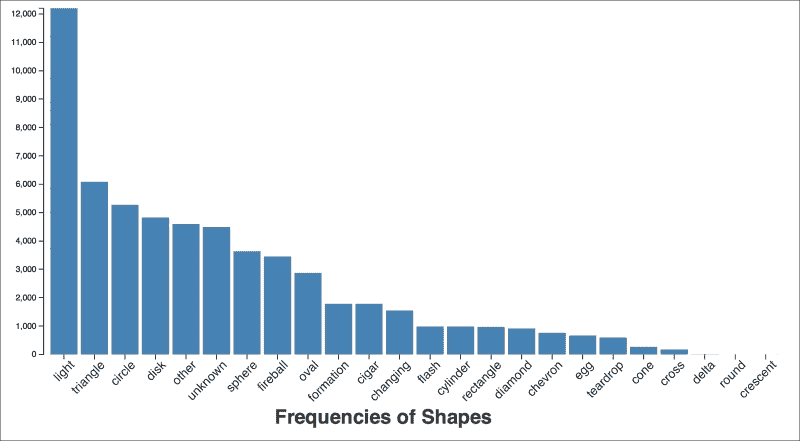
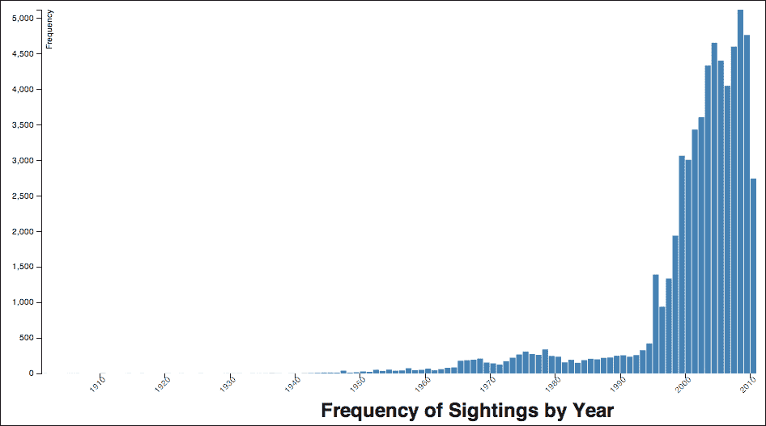
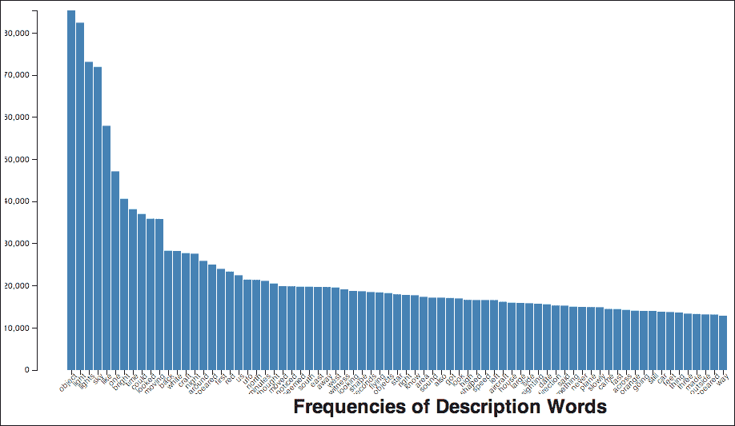

# 第四章：UFO 目击分类

在本章中，我们将研究一个 UFO 目击数据集。有时，数据分析从具体的问题或问题开始。有时，然而，它可能更加模糊和含糊。我们将与这个 UFO 目击数据集互动，并在深入研究朴素贝叶斯分类之前，了解更多关于数据探索、数据可视化和主题建模的知识。

这个数据集是由**国家不明飞行物报告中心**（**NUFORC**）收集的，可在[`www.nuforc.org/`](http://www.nuforc.org/)找到。他们包括了目击日期、大致位置、形状和目击描述。我们将下载并引入这个数据集。我们将了解如何从混乱的自由格式文本中提取更多结构化数据。然后，我们将了解如何可视化、分析和深入了解我们的数据。

在这个过程中，我们将发现何时是寻找 UFO 的最佳时间。我们还将了解它们的重要特征。我们还将学习如何区分可能的骗局目击描述和可能的真实目击描述。最终，希望我们能更好地准备自己看到其中之一。毕竟，我们将知道何时寻找以及寻找什么。

# 获取数据

对于本章，实际上获取数据将会相对容易。在其他章节中，这一步涉及到屏幕抓取、SPARQL 或其他数据提取、整理和清洗技术。对于这个数据集，我们只需从 Infochimps（[`www.infochimps.com/`](http://www.infochimps.com/)）下载即可。Infochimps 是一家公司（以及他们的网站），致力于大数据和数据分析。他们提供了一系列在线且免费可用的数据集。要下载这个特定的数据集，请浏览到[`www.infochimps.com/datasets/60000-documented-ufo-sightings-with-text-descriptions-and-metada`](http://www.infochimps.com/datasets/60000-documented-ufo-sightings-with-text-descriptions-and-metada)，然后从那里下载数据，如下面的截图所示：


数据在一个 ZIP 压缩文件中。它将文件扩展到`chimps_16154-2010-10-20_14-33-35`目录。这个目录包含一个列出数据集元数据的文件以及以几种不同格式存储的数据本身。为了本章的目的，我们将使用**制表符分隔值**（**TSV**）文件。它与**逗号分隔值**（**CSV**）文件类似，但使用制表符作为分隔符而不是逗号。这很好，因为制表符在文本文件中通常使用得较少，因此通常可以在不转义许多（如果有的话）字段的情况下使用这种数据格式。

如果我们打开`16154.yaml`文件，我们将看到关于数据集的元数据和其它信息。我们还将了解到数据集中的字段如下：

+   `sighted_at`：目击发生的日期（格式为 YYYYMMDD）

+   `reported_at`：目击报告给 NUFORC 的日期

+   `location`: 事件发生的城市和州

+   `shape`: 物体的形状

+   `duration`: 事件持续的时间

+   `description`: 对目击事件的更详细描述，以原始文本字符串形式

我们可以通过检查下载的文件中的一行来更好地了解这些数据。以下表格表示该记录的字段包含的内容：

| 字段 | 值 |
| --- | --- |
| `sighted_at` | 19950202 |
| `reported_at` | 19950203 |
| `location` | 丹麦，威斯康星州 |
| `shape` | 锥形 |
| `duration` | 75 min |
| `description` | 叫声者，以及显然还有其他一些人，目击了多架不明飞行物在丹麦和威斯康星州米尔贝尔附近夜空中划过。飞行物被看到在天空中划过，以及垂直下降，速度如同流星，然后突然在地面上方停止。在目击的最后 30 分钟内，可以看到看起来像是美国军事飞机的飞机在追逐或陪伴这些不明飞行物。这些物体呈锥形，前端红色，尾部绿色（原文如此）。 |

浏览其他行时，你会注意到一些重要字段——形状和持续时间——可能缺少数据。描述中包含 XML 实体和缩写，如*w/*和*repts*。

让我们看看我们能用它做什么。

# 提取数据

在我们继续之前，让我们看看以下用于本章的 Leiningen 2 ([`leiningen.org/`](http://leiningen.org/)) `project.clj`文件：

```py
(defproject ufo-data "0.1.0-SNAPSHOT"
  :plugins [[lein-cljsbuild "0.3.2"]]
  :profiles {:dev {:plugins [[com.cemerick/austin "0.1.0"]]}}
  :dependencies [[org.clojure/clojure "1.5.1"]
                 [org.clojure/data.json "0.2.2"]
                 [org.clojure/data.csv "0.1.2"]
                 [clj-time "0.5.1"]
                 [incanter "1.5.2"]
                 [cc.mallet/mallet "2.0.7"]
                 [me.raynes/fs "1.4.4"]]
  :cljsbuild
    {:builds [{:source-paths ["src-cljs"],
               :compiler {:pretty-printer true,
                          :output-to "www/js/main.js",
                          :optimizations :whitespace}}]})
```

上述代码表明，在本章的整个过程中，我们将使用`clj-time`库([`github.com/clj-time/clj-time`](https://github.com/clj-time/clj-time))来解析时间。这是一个丰富、健壮的日期和时间库。我们还将使用 ClojureScript ([`github.com/clojure/clojurescript`](https://github.com/clojure/clojurescript))进行可视化。

我们处理这些数据的第一步是从数据文件中加载它。为了方便起见，我们将将其读入一个我们专门定义来存储 UFO 目击的记录类型。我们将使用位于`src/ufo_data/`的`model.clj`文件。以下是一个命名空间声明，其中包含了我们在本模块中使用的导入和要求：

```py
(ns ufo-data.model
  (:require [clojure.java.io :as io]
            [clojure.core.reducers :as r]
            [clojure.string :as str]
            [clojure.data.json :as json]
            [clj-time.format :as tf]
            [ufo-data.text :as t]
            [ufo-data.util :refer :all]
            [me.raynes.fs :as fs])
  (:import [java.lang StringBuffer]))
```

现在我们将定义记录。它简单地列出了我们之前走过的相同字段。我们还包含了一些新字段。我们将使用这些字段从`reported_at`字段中解析年份、月份和季节，如下所示：

```py
(defrecord UfoSighting
  [sighted-at reported-at location shape duration description
   year month season])
```

现在，当我们从 TSV 文件中取出一行时，我们需要将其解析为这些结构之一。因为输入的每一行只有六个字段，所以我们将确保将其填充到九个字段。我们还将验证是否有恰好六个输入字段。如果字段更多或更少，我们将采取措施进一步填充字段或合并一些字段，如下面的代码所示：

```py
(defn ->ufo [row]
  (let [row (cond
              (> (count row) 6)
                   (concat (take 5 row)
                      [(str/join \t (drop 5 row))])
              (< (count row) 6)
                   (concat row (repeat (- 6 (count row)) nil))
              :else row)]
    (apply ->UfoSighting (concat row [nil nil nil]))))
```

一些字段（实际上是最重要的字段）是日期，我们将想要将它们解析成有效的日期对象。为此，我们将使用出色的`clj-time`库([`github.com/clj-time/clj-time`](https://github.com/clj-time/clj-time))。它为 Joda 时间库([`joda-time.sourceforge.net/`](http://joda-time.sourceforge.net/))提供了一个更“Clojuresque”的接口。执行此操作的代码接受一个自定义日期格式并尝试解析日期。如果任何失败，我们则回退到使用`nil`。看看以下代码：

```py
(def date-formatter (tf/formatter "yyyyMMdd"))
(defn read-date [date-str]
  (try
    (tf/parse date-formatter date-str)
    (catch Exception ex
      nil)))
```

我们使用以下函数将原始字符串日期字段强制转换为 Joda 时间提供的更有用的日期对象：

```py
(defn coerce-fields [ufo]
  (assoc ufo
         :sighted-at (read-date (:sighted-at ufo))
         :reported-at (read-date (:reported-at ufo))))
```

这就是我们加载数据所需的所有内容。现在我们可以编写一个函数，该函数将实际负责从磁盘上的文件读取数据到记录序列中，如下所示：

```py
(defn read-data
  [filename]
  (with-open [f (io/reader filename)]
    (->> (csv/read-csv f :separator \tab)
      vec
      (r/map ->ufo)
      (r/map coerce-fields)
      (into []))))
```

现在我们能够读取数据，我们可以开始分析它并了解我们所拥有的数据。

# 处理杂乱的数据

我们首先需要处理的是来自`shape`和`description`字段的定性数据。

`shape`字段似乎是一个开始的好地方。让我们看看有多少项目有关于它的良好数据：

```py
user=> (def data (m/read-data "data/ufo_awesome.tsv"))
user=> (count (remove (comp str/blank? :shape) data))
58870
user=> (count (filter (comp str/blank? :shape) data))
2523
user=> (count data)
61393
user=> (float 2506/61137)
0.04098991

```

因此，4%的数据没有将`shape`字段设置为有意义的值。让我们看看这个字段最流行的值是什么：

```py
user=> (def shape-freqs
 (frequencies
 (map str/trim
 (map :shape
 (remove (comp str/blank? :shape) data)))))
#'user/shape-freqs
user=> (pprint (take 10 (reverse (sort-by second shape-freqs))))
(["light" 12202]
 ["triangle" 6082]
 ["circle" 5271]
 ["disk" 4825]
 ["other" 4593]
 ["unknown" 4490]
 ["sphere" 3637]
 ["fireball" 3452]
 ["oval" 2869]
 ["formation" 1788])

```

有趣！出现频率最高的并不是一个形状。`other`和`unknown`这两个值也排名相当高。我们可以使用`shape`字段，但我们需要记住这些事情。

# 可视化 UFO 数据

我们将在可视化数据上花费相当多的时间，并且我们将使用与之前章节相同的方法：一点 HTML，一点 CSS，以及大量的 JavaScript，这些我们将从 ClojureScript 生成。

我们已经在之前提到的`project.clj`文件中处理了使用 ClojureScript 的配置。其余的部分涉及几个更多部分：

+   生成图表 JSON 数据的代码。这将位于`src/ufo_data/analysis.clj`文件中。我们首先编写这段代码。

+   一个加载我们将要使用的 JavaScript 库（jQuery [`jquery.org/`](https://jquery.org/) 和 D3 [`d3js.org/`](http://d3js.org/)）的 HTML 页面，并创建一个`div`容器来放置图表本身。

+   图表的源代码。这包括`src-cljs/ufo-data/utils.cljs`中的工具命名空间和`src-cljs/ufo-data/viz.cljs`中的主命名空间。

在这些先决条件就绪后，我们可以开始创建不同形状频率的图表。

首先，我们需要确保我们拥有这个命名空间所需的一切。这将在`src/ufo_data/analysis.clj`文件中。以下代码给出了`ns`声明。这些依赖中的大多数在短期内不会用到，但我们将在这个章节的某个地方使用它们：

```py
(ns ufo-data.analysis
  (:require [ufo-data.text :as t]
            [clj-time.core :as time]
            [clj-time.coerce :as coerce]
            [clojure.string :as str]
            [incanter.core :as i]
            [incanter.stats :as s]))
```

现在，我们将定义一个相当长的函数，该函数接受输入数据。它将提取 `shape` 字段，删除空白，将其分解成单词，并计算它们的频率。这个函数使用的几个函数没有在这里列出，但它们可以在本章的代码下载中找到。然后，以下函数将删除至少未出现一次的任何形状，按频率降序排列，并将其最终转换为向量中的映射结构：

```py
(defn get-shape-freqs
  "This computes the :shape field's frequencies. This also
  removes any items with a frequency less than min-freq."
  [coll min-freq]
  (->> coll
    (map :shape)
    (remove str/blank?)
    (map normalize)
    (mapcat tokenize)
    frequencies
    (remove #(< (second %) min-freq))
    (sort-by second)
    reverse
    (map #(zipmap [:shape :count] %))
    (into [])))
```

然后，我们可以使用 `clojure.data.json` 包 ([`github.com/clojure/data.json`](https://github.com/clojure/data.json)) 将其保存到磁盘。我将其保存到 `www/term-freqs.json`。以下是最初两个记录的小样本：

```py
[{"count":12202,"shape":"light"},
 {"count":6082,"shape":"triangle"},
 …]
```

现在我们需要一个网页来绘制图表。我从 HTML 5 Boilerplate 项目 ([`html5boilerplate.com/`](http://html5boilerplate.com/)) 下载了一个模板，并将其保存为 `www/term-freqs.html`。我在 `body` 标签内几乎删除了所有内容。我只留下了以下 `div` 标签和一串 `script` 标签：

```py
<div class="container"></div>
```

这就处理了 HTML 页面，因此我们可以继续到创建图表的 ClojureScript。

本章的所有 ClojureScript 文件都将位于 `src-cljs` 目录下。在这个目录下是一个 Clojure 命名空间树，类似于 `src` 目录中 Clojure 代码的组织方式。本章的大部分 ClojureScript 都将位于 `src-cljs/ufo-data/viz.cljs` 文件中。在另一个命名空间中有一些实用函数，但它们主要是样板代码，你可以在本章的代码下载中找到它们。以下函数加载数据并创建图表。我们将一步一步地介绍它。

```py
(defn ^:export term-freqs []
  (let [{:keys [x y]} (u/get-bar-scales)
        {:keys [x-axis y-axis]} (u/axes x y)
        svg (u/get-svg)]
    (u/caption "Frequencies of Shapes" 300)
    (.json js/d3 "term-freqs.json"
      (fn [err json-data]
        (u/set-domains json-data [x get-shape] [y get-count])
        (u/setup-x-axis svg x-axis)
           (u/setup-y-axis svg y-axis "")
 (.. svg
 (selectAll ".bar") (data json-data)
 (enter)
 (append "rect")
 (attr "id" #(str "id" (get-shape %)))
 (attr "class" "bar")
 (attr "x" (comp x get-shape))
 (attr "width" (.rangeBand x))
 (attr "y" (comp y get-count))
 (attr "height"
 #(- u/height (y (get-count %))))))))))

```

函数中突出显示之前的部分设置了坐标轴、刻度和父 SVG 元素。然后，我们从服务器加载数据。一旦加载完成，我们就在坐标轴上设置域，并绘制坐标轴本身。

函数的主要部分被突出显示。这将在 SVG 元素中创建条形图。所有这些任务都以以下方式完成：

+   `(selectAll ".bar") (data data)`: 这个命令选择所有具有 `bar` 类的元素。目前还没有任何元素可供选择，因为我们还没有创建任何元素，但这没关系。然后它将这些元素与数据连接起来。

+   `(enter)`: 这个命令开始处理任何之前未创建 `.bar` 元素的数据行。

+   `(append "rect")`: 对于没有 `.bar` 元素的数据行，这个命令将一个 `rect` 标签附加到元素上。

+   `(attr "id" #(str "id" (get-shape %))) (attr "class" "bar")`: 这行代码为矩形添加了 `ID` 和 `class` 属性。

+   `(attr "x" (comp x get-shape)) (attr "y" (comp y get-count))`: 这行代码使用来自每个数据行的值填充 `x` 和 `y` 属性，这些值投影到图表的像素网格上。

+   `(attr "width" (.rangeBand x)) (attr "height" #(- u/height (y (get-count %)))))`: 这行代码最终为每个矩形设置了高度和宽度。

这些命令共同创建了这个图表。还有一些 CSS 的参与。有关所有详细信息的代码下载请参阅。但最终，图表看起来如下：



这组文件作为本章中我们将看到的全部可视化和图表的框架。虽然条形图很简单，但一旦放置，这个框架可以用于更复杂和高级类型的图表。

这个图表更清楚地显示了我们之前在 REPL 中快速频率转储所看到的内容：大多数人将形状描述为*光*。将形状描述为*光*的人数是第二名*三角形*的两倍多。事实上，几乎五分之一的现象都被列为此形状。

现在，让我们尝试了解一些关于这些数据的其他事实。

首先，UFO 何时被观测到？为了找出这个，我们必须根据`sighted-at`字段中的年份对观测进行分组。我们将每个年份下的项目分组，然后将其保存以进行绘图。以下是在`ufo-data.analysis`中处理获取正确数据的函数：

```py
(defn group-by-year [coll]
  (group-by #(timestamp->year (:sighted-at %)) coll))
(defn get-year-counts [by-year]
  (map #(zipmap [:year :count] %)
       (map (on-second count)
            by-year)))
```

一旦我们从这个数据中创建出图表，以下就是输出：



这个图表表明，数据集中的观测数量在 1990 年代中期急剧增加，并且一直在增加。收集这些数据的组织 NUFORC 成立于 1974 年。我无法发现他们何时开始在线收集数据，但互联网的广泛使用也可能导致了报告的目击事件增加。此外，更广泛的文化趋势，如《X 档案》的流行，可能也在这段时间内增加了对 UFO 的认识。

随着我们继续了解我们的数据，另一个有趣的分布是查看每个月的目击次数。获取这些数据的过程与按年份获取目击次数的过程非常相似，所以我们现在不会深入讨论。


之前的图表显示，从 6 月开始，夏天是看到 UFO 的好时机。一个解释是，在这些月份，人们在晚上更多地待在外面。

# 描述

虽然形状字段很重要，但描述字段包含更多信息。让我们看看我们能用它做什么。

首先，让我们考察几个例子，看看它们的样子。以下是我随机选择的一个例子：

> *一个大型回旋镖形状的无形物体在穿越天空时阻挡了星光。我有一张草图，并记下了年份是 1999 年，但没有写下具体日期。目击事件发生在傍晚时分，当时完全黑暗，天空清澈且繁星点点。我从眼角注意到天空从北到南有移动。然而，当我仔细观察时，我看到的并不是移动的物体，而是星星在物体背后的消失和再次出现。物体本身是黑色或无形的，没有灯光。考虑到被阻挡的星星区域，我认为这个物体比喷气式飞机大五倍。它完全无声。它的形状像回旋镖，只是前端略微圆润，而不是三角形，并且在“翼”尖上略微尖锐。由于物体是无形的，我只能根据它在天空中移动时缺少星星的黑色区域来推测形状，就像一个轮廓一样。如果物体确实比喷气式飞机大五倍，并且以大约喷气式飞机的姿态飞行，那么它的速度比喷气式飞机快得多。我眨了几次眼，转移了视线，然后又回过头来看，并跟随物体穿越剩余的地平线，直到它消失。总的来说，它用了大约 8-10 秒的时间横跨天空，并且整个过程中都在同一高度飞行。考虑到三角形的形状，我猜想它可能是一架低飞的隐形轰炸机，如果低飞的话，看起来会大得多。但是隐形轰炸机是完全无声的吗？而且，隐形轰炸机在中间部分有三个向后指的三角形。我看到的物体似乎没有这样的中间部分。（NUFORC 备注：目击者表示事件日期是近似的。PD）*

因此，我们可以看到一些例子相当长，并且它们可能包含作为 HTML/XML 实体编码的字符（例如本例中的`&ldquo;`和`&rdquo;`）。而且这个引用相对干净：有些单词只是用标点符号（通常是几个句号）挤在一起，中间没有空格。

为了处理这些数据，我们需要对其进行一些清理，并将单词拆分出来，或者说进行分词。您可以在代码下载中看到这方面的详细信息，其中大部分只是粘贴了许多字符串操作方法，但这对我们提醒自己在做什么以及如何处理这些数据是有帮助的。我还基于标准的英语停用词列表进行了过滤，并添加了一些特定于*描述*字段的单词，例如*PD*和*NUFORC*。

让我们看看描述字段中最常见的单词有哪些：

```py
user=> (def descr-counts (a/get-descr-counts data 50))
#'user/descr-counts
user=> (take 10 descr-counts)
({:count 85428, :descr "object"}
 {:count 82526, :descr "light"}
 {:count 73182, :descr "lights"}
 {:count 72011, :descr "sky"}
 {:count 58016, :descr "like"}
 {:count 47193, :descr "one"}
 {:count 40690, :descr "bright"}
 {:count 38225, :descr "time"}
 {:count 37065, :descr "could"}
 {:count 35953, :descr "looked"})

```

这似乎更符合我们的预期。最常见的单词是*object*，这对于由人们谈论他们无法识别的事物组成的语料库来说是合适的。接下来的两个单词是*light*和*lights*，这是可以预料的，尤其是由于*light*是*形状*字段中最常见的项目。

让我们也将这些术语绘制成图。我们可能看不到单词频率的细节，但它将让我们更好地了解它们的分布。有足够的标记；然而，在下面的图表中，我们只查看 75 个最频繁的：



这些单词的分布看起来非常相似。事实上，它们非常粗略地符合 Zipf 定律，该定律预测了许多类型的物理和社会数据的幂律分布，包括语言频率。

# 主题建模描述

另一种更好地理解描述的方法是使用主题建模。我们在第三章中学习了这种文本挖掘和机器学习算法，*主题建模——国情咨文中关注点的变化*。在这种情况下，我们将看看我们是否可以使用它来创建这些描述的主题，并从中提取差异、趋势和模式。

首先，我们将创建一个新的命名空间来处理我们的主题建模。我们将使用`src/ufo_data/tm.clj`文件。以下是对其的命名空间声明：

```py
(ns ufo-data.tm
  (:require [clojure.java.io :as io]
            [clojure.string :as str]
            [clojure.pprint :as pp])
  (:import [cc.mallet.util.*]
           [cc.mallet.types InstanceList]
           [cc.mallet.pipe
            Input2CharSequence TokenSequenceLowercase
            CharSequence2TokenSequence SerialPipes
            TokenSequenceRemoveStopwords
            TokenSequence2FeatureSequence]
           [cc.mallet.pipe.iterator ArrayIterator]
           [cc.mallet.topics ParallelTopicModel]
           [java.io FileFilter]
           [java.util Formatter Locale]))
```

生成主题模型的过程与我们之前在第三章中使用的过程非常相似。我们需要做的第一个改变是，我们将从本章早期读取的内存数据中加载实例。我们将创建一个函数，该函数将输入集合推送到数组中，然后使用`ArrayIterator`将数组喂入处理管道。训练数据的函数与上一章相同。

在本章中，我们将探讨更多有助于我们内省训练模型、实例以及每个主题重要概率和关键词的功能。第一个功能返回适用于主题的单词及其权重。我们如下从模型获取特征向量，从实例列表中获取单词本身：

```py
(defn get-topic-words [model instances topic-n]
  (let [topic-words (.getSortedWords model)
        data-alpha (.getDataAlphabet instances)]
    (map #(vector (.lookupObject data-alpha (.getID %))
                  (.getWeight %))
         (iterator-seq (.. topic-words (get topic-n)
                         iterator)))))
```

我们将使用的另一个报告功能按每个主题的概率对实例进行排名。我们可以使用这个功能来查看最有可能适用于任何特定主题的文档：

```py
(defn rank-instances [model data topic-id]
  (let [get-p (fn [n]
                [(aget (.getTopicProbabilities model n) topic-id)
                 (nth data n)])]
    (->> data count range (map get-p) (sort-by first) reverse)))
```

我们可以使用这些功能——以及基于这些功能的一些其他功能——从 REPL 中探索我们的数据。

通常，在决定使用多少主题时，我们会想使用某种客观指标来找到一个好的集合定义。然而，为了即兴探索，我们会使用更主观的东西。首先，在玩弄主题数量后，我选择使用 12 个主题。由于所有这些实际上都只是关于一件事，即 UFO 目击，我并不期望在相当详细和狭窄的层面上会有太多有意义的主题。在 12 个主题中，似乎还有一些模糊、不太有帮助的主题，但我之前看到的一些更有趣的主题仍然存在。当我尝试使用更少的主题时，一些有趣的主题消失了。

因此，为了开始，让我们看看主题和每个主题的前 10 个单词。记住，这里的主题描述不是由计算机生成的。我是在查看这些主题的前几个单词和描述后想出来的。鉴于这里包含的术语样本很小，其中一些可能不是很明显。然而，进一步深入研究主题术语，文档本身给出了这些分类。在某些情况下，我已在括号中包含了一些注释，如下所示：

+   **回忆童年经历**：时光房屋手工艺车看起来年岁记忆回家的路

+   **多亏了其他组织或地方分会，有很多 NUFORC 笔记**：报告目击者 NUFORC 笔记 UFO 目击日期报告物体

+   **天空中明亮的、无声的物体**：光线天空明亮的光白色物体红色移动看起来

+   **视觉描述**：天空光线时间夜晚红色分钟物体背后明亮（这个主题没有明确的主题，因为它通常是这样定义的）

+   **白色、红色和橙红色的灯光**：光线天空灯光看起来明亮移动物体背后红色白色

+   **与飞机和流星相比，天空中非常快、明亮的物体**：光线天空物体飞机灯光西方北方出现南方飞行

+   **NUFORC 笔记。“目击者选择保持完全匿名”**：NUFORC 笔记日期目击者日期天空光线匿名保持近似

+   **模糊**：UFO 相机空气物体照片时间照片照片照片白天（这个主题的主题不是很清楚）

+   **天空中没有灯光或未提及的物体**：驾驶道路汽车灯光形状飞船看起来侧面脚

+   **绑架、访问、恐惧。第四类近距离遭遇**：时间夜晚回望光线房子东西窗户灯光声音

+   **目击。在不同方向移动**：灯光物体飞船灯光飞行白色北方南方东方移动

+   **技术描述**：物体天空光线移动物体出现明亮时间高北方

其中一些主题，例如第三、第五、第六和第九个要点，似乎是对目击的相当通用的描述。它们描述了天空中许多移动的光。

其他主题更有趣。第一个主题包含了许多回顾童年或大学时期的人写的描述。例如，在以下段落中，有人描述了他们大约六岁时的一次近距离遭遇。有很多拼写错误，我保留这部分内容是为了说明这些数据有多么混乱：

> *蓝色灯光，孤立的道路，可能失去的时间当时我六岁，即使现在，如果我集中注意力，我还能回忆起发生的事情。我的母亲、她的最好朋友和我正在“格兰奇路”的一段路上开车。今天，这里有很多房子，但当时，这里全是农田，可能只有一两个房子。那是午夜过后不久，我记得我醒了。我当时在后座睡觉，醒来时感到非常害怕。我坐起来，我母亲和她朋友显然很担心。我们开的车在时开时停，最后熄火了。车一停下来，我们都看到前方大约 20 英尺远的地方有一个蓝色灯光，大约是足球场长度。它滑向我们，没有发出声音，当它距离我们大约 15 英尺时，它在空中停下来，悬浮着。我母亲从后座把我抱起来，紧紧地抱着我，她的朋友在哭。我也在哭，因为不管是什么，它让我们所有人都感到不安。大约五分钟后，我不记得发生了什么，因为不管什么原因，我睡着了。我知道这很奇怪，但我发誓这是真的。后来我醒来，我们三个人坐在那里，震惊不已，灯光已经消失了。我母亲和她的朋友——直到今天——都坚称他们失去了大约 10 分钟的时间。希望这能有所帮助...（NUFORC 备注：目击者表示目击日期是近似的。PD）*

有些主题令人困惑，比如第八个主题。关于它的前 10 份文件没有明显的东西表明它们是一个连贯的主题。可能有一些关于一些更细微的词汇选择被识别出来，但并不明显。

# 恶作剧

在这次调查中最有趣的发现之一是第七个主题。这个主题关注的是那些希望保持匿名的目击者添加到描述中的注释。但最有可能的文件如下：

> *在北卡罗来纳州谢尔比上空，一个圆形发光物体悬浮然后迅速飞走。那是我生日派对，我和我的朋友们大约在 21:30 时分在街区散步。我刚好抬头看，看到一个底部布满白色和明亮的蓝色灯光的圆形物体。它在原地悬浮了大约 8 秒，然后以我见过的任何东西都无法比拟的速度飞走。（NUFORC 备注：目击者选择完全匿名；未提供任何联系方式。可能是恶作剧？PD）（NUFORC 备注：报告来源表明目击日期是近似的。PD）*

引起我注意的是笔记“可能是骗局？？”这个主题中的其他几个描述也有类似的笔记，通常包括单词*骗局*。

发现这一点引发了一个有趣的可能性：我们能否训练一个分类器来识别可能的骗局？我的最初反应是怀疑。但我想这仍然是一个有趣的实验。

最终，我们将想要加载这些数据，并用 MALLET（[`mallet.cs.umass.edu/`](http://mallet.cs.umass.edu/))进行处理。MALLET 在特定目录格式保存的数据上工作起来更简单。这个模板是`base-directory/tag/data-file.txt`。实际上，我们将在这些目录之上包含一个目录，并为`base-directory`定义一个用于训练数据的目录和一个用于测试数据的目录。

训练组用于训练分类器，测试组用于在训练后评估分类器，以确定其成功程度。有两个不同的组来完成这些任务有助于发现分类器是否过拟合，也就是说，它是否对训练组学得太好，以至于在新数据上表现不佳。

## 准备数据

因此，在我们开始之前，我们将预处理数据，将其放入类似于`src/ufo_data/`的目录结构中。所有这些代码都将放入`model.clj`文件中。这个命名空间声明如下：

```py
(ns ufo-data.model
  (:require [clojure.java.io :as io]
            [clojure.core.reducers :as r]
            [clojure.string :as str]
            [clojure.data.json :as json]
            [clj-time.format :as tf]
            [ufo-data.text :as t]
            [ufo-data.util :refer :all]
            [me.raynes.fs :as fs])
  (:import [java.lang StringBuffer]))
```

现在，为了将这个数据集处理成 MALLET 可以轻松处理的形式，我们将进行以下步骤：

1.  将数据读入一系列数据记录。

1.  将 NUFORC 评论拆分出来。

1.  根据评论对文档进行分类。

1.  根据类别将它们分区到目录中。

1.  将它们分成训练集和测试集。

让我们看看我们将如何将这些放在一起。

### 将数据读入一系列数据记录

下载的文件中的数据存在一些问题，值无法正确转义。我已经清理了这些问题，并制作了一个新的数据文件，可在[`www.ericrochester.com/clj-data-master/data/ufo.json`](http://www.ericrochester.com/clj-data-master/data/ufo.json)找到。我已经将这个文件保存在我的`data`目录中，并将该路径绑定到名称`*data-file*`。你可以在本章的代码下载中找到这个以及其他一些定义。

但主要的是，我想专注于数据记录一分钟。这仅仅包含从读取的 JSON 对象中读取的字段。以下定义将作为我们数据的文档，并使处理行变得更容易：

```py
(defrecord UfoSighting
  [sighted-at reported-at location shape duration description
   year month season])
```

我们从 JSON 文件中读取的数据可能并不完全正确。我们仍然需要将日期字符串转换为数据对象。我们将使用`read-date`来完成这项工作，它解析单个日期字符串，以及使用`coerce-fields`来协调在`UfoSighting`的适当字段上调用`read-date`，如下面的代码所示：

```py
(def date-formatter (tf/formatter "yyyyMMdd"))
(defn read-date [date-str]
  (try
    (tf/parse date-formatter date-str)
    (catch Exception ex
      nil)))
(defn coerce-fields [ufo]
  (assoc ufo
         :sighted-at (read-date (:sighted-at ufo))
         :reported-at (read-date (:reported-at ufo))))
```

现在，我们可以使用这些函数来读取和解析输入数据文件的每一行。如下面的代码所示，每一行都是一个单独的 JSON 对象：

```py
(defn read-data
  ([] (read-data *data-file*))
  ([filename]
   (with-open [f (io/reader filename)]
     (->> f
       line-seq
       vec
       (r/map #(json/read-str % :key-fn keyword))
       (r/map map->UfoSighting)
       (r/map coerce-fields)
       (into [])))))
```

现在，我们可以使用这些在 REPL 中加载数据文件。如下面的代码所示，在这个会话中，`model` 绑定到 `ufo-data.model`：

```py
user=> (def data (model/read-data))
user=> (count data)
61067
user=> (first data)
{:sighted-at nil,
 :reported-at nil,
 :location " Iowa City, IA",
 :shape "",
 :duration "",
 :description
 "Man repts. witnessing &quot;flash, followed by a classic UFO, w/ a tailfin at back.&quot; Red color on top half of tailfin. Became triangular.",
 :year nil,
 :month nil,
 :season nil,
 :reported_at "19951009",
 :sighted_at "19951009"}

```

看起来不错。我们现在可以开始进一步处理描述了。

### 分割 NUFORC 评论

许多描述包含 NUFORC ([`www.nuforc.org/`](http://www.nuforc.org/)) 的评论。这些包含编辑评论——其中一些关于报告的真实性。以下是一个带有 NUFORC 评论的示例描述：

> *电话报告：一对夫妇在里奥维斯塔地区的房子外面被非常明亮的光线惊醒。它非常明亮，就像在足球场内一样。“没有声音。”当时地面覆盖着雪。持续了 10 秒。（NUFORC 注记：我们与夫妇进行了交谈，并发现他们在描述他们声称看到的事情时非常可信和令人信服。他们都有负责任的工作。PD）*

这是这些评论的标准格式：它们被双括号包围，并以 "NUFORC." 开头。我们可以利用这些信息以及正则表达式来从文档中提取所有注释。

要做到这一点，我们需要比 Clojure 中定义的实用函数更深入地了解 Java 正则表达式 API。让我们看看我们需要做什么，然后我们可以在以下代码列表之后将其拆解：

```py
(defn split-nuforc [text]
  (let [m (.matcher #"\(\(.*?\)\)" text), sb (StringBuffer.)]
    (loop [accum []]
      (if (.find m)
        (let [nuforc (.substring text (.start m) (.end m))]
          (.appendReplacement m sb "")
          (recur (conj accum nuforc)))
        (do
          (.appendTail m sb)
          [(str sb) (str/join " " accum)])))))
```

因此，我们首先创建一个正则表达式，用于选择双括号内的文本。我们还创建了 `java.lang.StringBuffer`。我们将使用它来累积 UFO 目击描述，并移除 NUFORC 评论。

函数的主体是一个循环，它有一个单个参数，一个名为 `accum` 的向量。这个向量将累积 NUFORC 评论。

在循环内部，每次正则表达式找到匹配项时，我们都会从原始字符串中提取 NUFORC 评论，并在 `StringBuffer` 中用空字符串替换匹配项。最后，当正则表达式上没有更多匹配项时，我们将字符串的其余部分追加到 `StringBuffer` 中，然后我们可以检索其内容以及合并在一起的评论。

让我们看看当我们从前面引用的描述中移除 NUFORC 评论时会发生什么：

```py
user=> (def split-descr (model/split-nuforc description))
user=> (first split-descr)
"Telephoned Report:Husband and wife were awakened by a very bright light outside their house in Rio Vista area of McCall.  It was so bright, it was &quot;like being inside a football stadium.&quot;  No sound.  Ground was covered with snow at the time.  It lasted for 10 seconds."
user=> (second split-descr)
"((NUFORC Note:  We spoke with the husband and wife, and found them to be quite credible and convincing in their description of what they allegedly had seen.   Both have responsible jobs.  PD))"

```

因此，我们可以看到 `split-nuforc` 返回的成对中的第一个项目是单独的描述，第二个项目是评论。

现在，我们可以使用这些评论来对第一部分的描述进行分类。然后我们将使用这些信息来确定保存清理后的描述的位置。

### 根据评论对文档进行分类

文档分类相对简单。我们将使用一个`tokenize`函数，该函数可以在本章的代码下载中找到，位于`ufo-data.text`命名空间中（在代码中用`t`表示）。我们可以将评论中的单词转换为标记集，然后查找单词`"`*hoax*`"`. 如果找到，我们将将其分类如下：

```py
(defn get-category [tokens]
  (if (contains? (set tokens) "hoax")
    :hoax
    :non-hoax))
```

当调用评论的标记时，它将返回描述的类别，如下所示：

```py
user=> (model/get-category
 (map t/normalize (t/tokenize (second split-descr))))
:non-hoax

```

当然，这非常粗糙，但应该适合这个实验。

### 根据类别将文档分割到目录中

现在，它们已经分类了，我们可以使用这些类别将描述保存到文件中。每个描述都将保存在自己的文件中。

初始时，我们将所有文件放入一对目录中。在下一步中，我们将进一步将它们分为测试集和训练集。

本节的第一项功能将接受一个基本目录、一个数字和由`ufo-data.model/split-nuforc`返回的文档对，作为输入。从那里，它将文本保存到文件中，并返回文件的类别和文件名，如下面的代码所示：

```py
(defn save-document [basedir n doc]
  (let [[text category] doc
        filename (str basedir \/ (name category) \/ n ".txt")]
    (spit filename text)
    {:category category, :filename filename}))
```

下一个函数`make-dirtree-sighting`将做很多工作。它将接受一个`UfoSighting`实例，并将 NUFORC 评论分割出来，对两部分进行标记化，获取类别，并使用它来保存文件名，如下面的代码所示：

```py
(defn make-dirtree-sighting
  ([basedir]
   (fn [sighting n]
     (make-dirtree-sighting basedir sighting n)))
  ([basedir sighting n]
   (->> sighting
     :description
     split-nuforc
     (on-both #(map t/normalize (t/tokenize %)))
     (on-second get-category)
     (on-first #(str/join " " %))
     (save-document basedir n))))
```

这将处理将每个文件单独保存到一对目录中：一个用于骗局，一个用于非骗局。然而，我们还想处理所有的 UFO 目击事件，并将这两组文档分为测试集和训练集。我们将在下一节中完成所有这些操作。

### 将它们分为训练集和测试集

现在，我们可以将我们拥有的数据分为训练集和测试集。为此，我们需要以下两个实用函数：

1.  我们需要多次创建类别的子目录。让我们将这个操作放入以下函数中：

    ```py
    (defn mk-cat-dirs [base]
      (doseq [cat ["hoax" "non-hoax"]]
        (fs/mkdirs (fs/file base cat))))
    ```

1.  我们还需要按比例将一组数据分成两组，如下面的代码所示。也就是说，一个子组将是原始数据的 80%，另一个子组将是原始数据的 20%。

    ```py
    (defn into-sets [ratio coll]
      (split-at (int (* (count coll) ratio)) coll))
    ```

现在，将一组文件移动到某个阶段的子目录（测试或训练）的函数将是`mv-stage`。文件集合由`save-document`生成，因此它是一组映射，每个映射包含文件的类别和文件名，如下面的代码所示：

```py
(defn mv-stage [basedir stage coll]
  (let [stage-dir (fs/file basedir stage)]
    (doseq [{:keys [category filename]} coll]
      (fs/copy filename
               (fs/file stage-dir (name category)
                        (fs/base-name filename))))))
```

为了控制整个过程，我们将使用`make-dirtree`。这将接受`UfoSighting`实例的集合，并将它们处理成单独的文本文件。所有文件都将位于`basedir`目录下，然后它们将被分为训练集和测试集。这些将被放在`basedir`下的兄弟目录中，如下面的代码所示：

```py
(defn make-dirtree [basedir training-ratio sightings]
  (doseq [dir [basedir (fs/file basedir "train")
               (fs/file basedir "test")]]
    (mk-cat-dirs dir))
  (let [outputs (map (make-dirtree-sighting basedir)
                     sightings (range))
        {:keys [hoax non-hoax]} (group-by :category
                                          (shuffle outputs))
        [hoax-train hoax-test] (into-sets training-ratio hoax)
        [nhoax-train nhoax-test] (into-sets
                                   training-ratio non-hoax)]
    (mv-stage basedir "train" (concat hoax-train nhoax-train))
    (mv-stage basedir "test" (concat hoax-test nhoax-test))))
```

现在，让我们使用这个方法将目击数据分组，并按照以下方式保存到`bayes-data`目录中：

```py
user=> (model/make-dirtree "bayes-data" 0.8 data)

```

我们现在有了数据，并且它的形状是 MALLET 可以使用的那种。让我们看看我们如何利用这个库进行朴素贝叶斯分类。

## 数据分类

贝叶斯推断一开始可能让人望而却步，但就其最基本层面而言，这是我们处理世界的方式。我们开始时有一个关于某事可能性的想法，然后随着我们获取更多信息，我们更新那个预期。在这种情况下，根据我们的背景、培训、历史和倾向，我们可能会认为所有 UFO 报告都是骗局，或者大多数都是。我们可能会认为很少的 UFO 报告是骗局，或者我们可能完全不确定，并假设其中一半是骗局，一半是真的。但随着我们听到我们知道真相的报告，我们会改变对其他报告的观点和预期。我们可能也会注意到模式。骗局可能会提到绿色人，而真实的报告可能会提到灰色人。因此，你可能会根据这一点进一步细化你的直觉。现在，当你看到提到小绿人的报告时，你更有可能认为它是一个骗局，而不是当你看到提到小灰人的报告时。

你可能还会注意到，三角形的 UFO 被认为是骗局，而圆形的 UFO 则不是。现在，当你阅读另一份文档时，这个观察结果进一步影响了你对该文档是否是骗局的观点。

在贝叶斯术语中，我们最初对文档是骗局或不是的预期被称为**先验或假设概率**，其表示为 *P(H)*，其中 *H* 是文档被认为是骗局的概率。在看到描述中描述的外星人颜色 *C* 后更新的预期称为**条件概率**，其表示为 *P(C|H)*，读作*在 H 的条件下 C 的概率*。在这种情况下，它是给定文档是骗局的条件下外星人颜色的概率分布。

贝叶斯定理是一种交换一组条件概率条件的方法。也就是说，我们现在可以找到 *P(H|C)*，即给定外星人绿色或灰色时文档是骗局的概率分布。

进行这种计算的公式相当简单。要计算给定外星人颜色的文档是骗局的概率，考虑以下条件：

+   给定文档是骗局或不是，外星人的颜色概率。

+   文档是骗局的可能性

+   外星人的颜色概率。

对于朴素贝叶斯分类，我们做出一个重要的假设：我们假设文档中的特征是独立的。这意味着文档中是否是绿色或灰色外星人的概率与 UFO 是圆盘形还是三角形是独立的。

尽管有这个假设，朴素贝叶斯分类器在现实世界中通常表现良好。我们可以轻松快速地训练它们，并且它们可以快速分类新数据，并且通常表现良好，足以有用。

因此，有了这个理解，让我们看看 MALLET 如何处理朴素贝叶斯分类。

### 编码分类器接口

在我们开始本章的下一部分之前，可能是一个好时机来为以下代码创建一个新的命名空间。让我们将其放入 `src/ufo_data/bayes.clj` 文件中。`ns` 声明如下：

```py
(ns ufo-data.bayes
  (:require [clojure.java.io :as io])
  (:import [cc.mallet.util.*]
           [cc.mallet.types InstanceList]
           [cc.mallet.pipe Input2CharSequence
            TokenSequenceLowercase
            TokenSequenceRemoveStoplist
            CharSequence2TokenSequence SerialPipes
            SaveDataInSource Target2Label
            TokenSequence2FeatureSequence
            FeatureSequence2AugmentableFeatureVector]
           [cc.mallet.pipe.iterator FileIterator]
           [cc.mallet.classify NaiveBayesTrainer]
           [java.io ObjectInputStream ObjectOutputStream]))
```

在放置了前面的代码之后，让我们看看我们需要做什么。

#### 设置 Pipe 和 InstanceList

MALLET 通过 `Pipe` 处理所有输入。管道代表对文本的一系列转换。当你使用分类器时，用于训练、测试以及后来用于分类新文档的数据，都需要通过相同的管道处理。此外，它们都必须使用相同的特征和标签集。MALLET 将这些称为 *字母表*。

每个数据文档，无论处于处理哪个阶段，都存储在 `Instance` 对象中，而这些文档的语料库保存在 `InstanceList` 中。`Pipe` 对象与 `InstanceList` 对象相关联。这确保了集合中所有 `Instance` 对象的处理是一致的。

为了保持清晰，我们将定义 `make-pipe-list`。这将创建如以下代码所示的 `Pipe` 对象：

```py
(defn make-pipe-list []
  (SerialPipes.
    [(Target2Label.)
     (SaveDataInSource.)
     (Input2CharSequence. "UTF-8")
     (CharSequence2TokenSequence. #"\p{L}[\p{L}\p{P}]+\p{L}")
     (TokenSequenceLowercase.)
     (TokenSequenceRemoveStoplist.)
     (TokenSequence2FeatureSequence.)
     (FeatureSequence2AugmentableFeatureVector. false)]))
```

此处理管道执行以下步骤：

1.  `Target2Label` 从目录路径中获取类别并将其分配给 `Instance` 对象的标签。标签是用于分类的类别或类别。

1.  `SaveDataInSource` 将路径名（目前位于数据属性中）放入 `Instance` 对象的源属性中。

1.  `Input2CharSequence` 从文件名读取数据并将其替换为文件的内容。

1.  `CharSequence2TokenSequence` 对文件的 内容进行分词。

1.  `TokenSequenceLowercase` 将标记中的所有大写字符转换为小写。

1.  `TokenSequenceRemoveStoplist` 移除常见的英语单词，以便分类器可以专注于内容单词。

1.  `TokenSequence2FeatureSequence` 将标记分类为序列。每个独特的单词被分配一个唯一的整数标识符。

1.  `FeatureSequence2AugmentableFeatureVector` 将标记序列转换为向量。标记的特征标识符是该标记在特征向量中的索引。

MALLET 的分类器期望输入特征向量，因此这是合适的管道使用方式。

现在我们需要从一个输入目录中获取输入，生成 `Instance` 对象，并将它们的处理与管道相关联。在以下代码中，我们将使用 `add-input-directory` 函数来完成所有这些操作：

```py
(defn add-input-directory [dir-name pipe]
  (doto (InstanceList. pipe)
    (.addThruPipe
      (FileIterator. (io/file dir-name)
                     #".*/([^/]*?)/\d+.txt$"))))
```

最后一行的正则表达式取文件目录的名称，并将其用作 `Instance` 对象的分类。我们可以使用这两个函数来处理输入的加载和处理。

#### 训练

训练相当简单。我们创建一个`NaiveBayesTrainer`的实例。它的`train`方法返回一个`NaiveBayes`实例，即分类器。我们将在这个函数中包装它，使其使用起来稍微容易一些：

```py
(defn train [instance-list]
  (.train (NaiveBayesTrainer.) instance-list))
```

以这种方式包装提供了一种 Clojure-native 的方式来处理这个库。它还防止了我们的模块用户直接导入`NaiveBayesTrainer`和其他 MALLET 类。

#### 分类

就像训练一样，分类也很容易。`train`函数返回的分类器只是将调用推迟到`classify`方法，如下所示：

```py
(defn classify [bayes instance-list]
  (.classify bayes instance-list))
```

上述代码将返回一个类型为`cc.mallet.classify.Classification`的实例。这不仅返回了最佳标签及其概率，还返回了其他标签的概率以及分类器和文档实例。

#### 验证

现在，我们可以训练一个分类器并在新文档上运行它。我们希望能够通过比较我们对预分类文档的预期与分类器实际表现来对其进行测试。

在最低级别，我们需要比较预期的分类与实际分类，并记录这些值每一对的计数。我们可以通过`validate1`来实现这一点。它会获取预期的和实际的标签，并创建一个包含它们的向量对。然后`confusion-matrix`函数会按照以下方式获取这些对的出现频率：

```py
(defn validate1 [bayes instance]
  (let [c (.classify bayes instance)
        expected (.. c getInstance getTarget toString)
        actual (.. c getLabeling getBestLabel toString)]
    [expected actual]))
(defn confusion-matrix [classifier instances labels]
  (frequencies (map #(validate1 classifier %) instances)))
```

混淆矩阵是一个表格，其中包含正确分类的实例（预期和实际匹配）的计数、假阳性（预期是不分类，但实际是分类它）和假阴性（预期是分类实例，但实际是不分类它）。这提供了一个易于理解的分类器性能概述。

#### 将所有部分整合在一起

在以下代码中，我们将创建一个`bayes`函数，该函数在数据目录上创建、训练和测试分类器。它将`validate`返回的信息哈希表添加到其中。稍后拥有管道对象将有必要在将来对更多数据进行分类。

```py
(defn bayes [training-dir testing-dir]
  (let [pipe (make-pipe-list)
        training (add-input-directory training-dir pipe)
        testing (add-input-directory testing-dir pipe)
        classifier (train training)
        labels (iterator-seq
                 (.iterator (.getLabelAlphabet classifier)))
        c-matrix (confusion-matrix classifier testing labels)]
    {:bayes classifier
     :pipe pipe
     :confusion c-matrix}))
```

现在我们已经准备好了所有部件，让我们看看如何运行分类器。

### 运行分类器并检查结果

对于本节，我已经将`ufo-data.bayes`命名空间加载到 REPL 中，并用`bayes`作为别名。

我们可以将测试和训练目录传递给`bayes`函数，这些目录如以下代码所示由目击事件创建：

```py
user=> (def bayes-out
 (bayes/bayes "bayes-data/train" "bayes-data/test"))
user=> (:confusion bayes-out)
{["hoax" "non-hoax"] 83, ["non-hoax" "non-hoax"] 12102,
["non-hoax" "hoax"] 29}

```

让我们将这些信息放入一个更传统的形式。预期的值在表格的顶部有它们的标签。实际的值在侧面有它们的标签。看看以下表格：

|   | 骗局 | 非骗局 |
| --- | --- | --- |
| 骗局 | 0 | 31 |
| 非骗局 | 83 | 12100 |

嗯，这似乎没什么用。显然，我之前的怀疑是有根据的。这个分类器未能正确识别任何骗局，并且错误地将 31 个非骗局识别为骗局（假阳性）。

但这并不是我们能学到的全部。`NaiveBayes`的实例还包括了一种打印出每个类别中权重最高的单词的方法。让我们看看每个分类的前 10 个单词是什么：

```py
user=> (.printWords (:bayes bayes-out) 10)

Feature probabilities hoax
apos 0.002311333180377461
lights 0.0022688454380911096
light 0.00217537240506114
object 0.0020988944689457082
sky 0.002081899372031169
quot 0.0015295587223086145
looked 0.0014360856892786434
craft 0.0011556665901887302
red 0.0011301739448169206
back 0.0010961837509878402

Feature probabilities non-hoax
object 0.016553223428401043
light 0.016198059821948316
apos 0.015460989114397925
lights 0.014296272431730976
sky 0.014028337606877127
quot 0.010350232305991571
bright 0.007963812802535785
time 0.007237239541481537
moving 0.007063281856688359
looked 0.007037538118852588

```

因此，术语的顺序略有不同，但描述骗局和非骗局的词汇几乎相同。两者都提到了*物体*、*光*、*灯光*、*天空*和*看起来*。所以，基于我们在这里选择的特点（单词标记），我们没有得到好的结果并不奇怪。

然而，我们可以学习到的最主要的事情是，骗局被认为是极其罕见的，而判断一个目击事件是否为骗局通常是基于外部数据。考虑前面引用的目击事件。为了支持这个判断，评论者提到他们有一份稳定的工作，尽管这一点在描述中并没有提到。

# 摘要

这已经是一次漫游，希望是一次有趣的旅程，通过 UFO 目击数据集。我们了解了一些关于描述近距离遭遇的语言，我们也了解了一些如何使用可视化、探索性数据分析以及朴素贝叶斯分类来了解更多数据的方法。

但我对这次经历的主要印象是反馈分析、可视化和探索。可视化引导我们进行主题建模，而我们在这里发现的东西引导我们进行贝叶斯分类。这在数据分析中很典型，我们学到的东西可以指导和激励分析的下一阶段。每个答案都可以提出更多问题，并驱使我们回到数据中。
