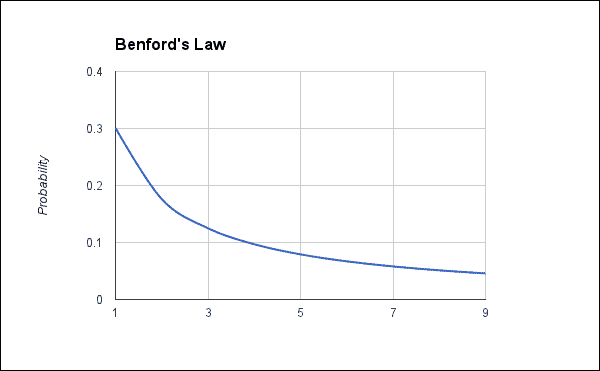
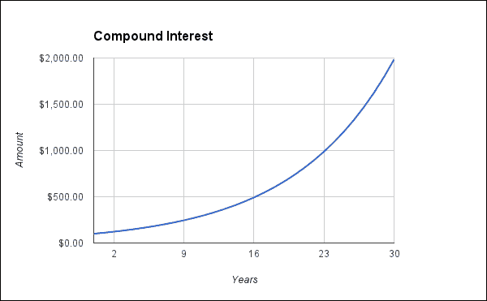
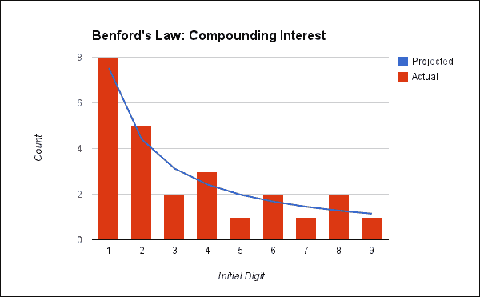
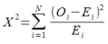
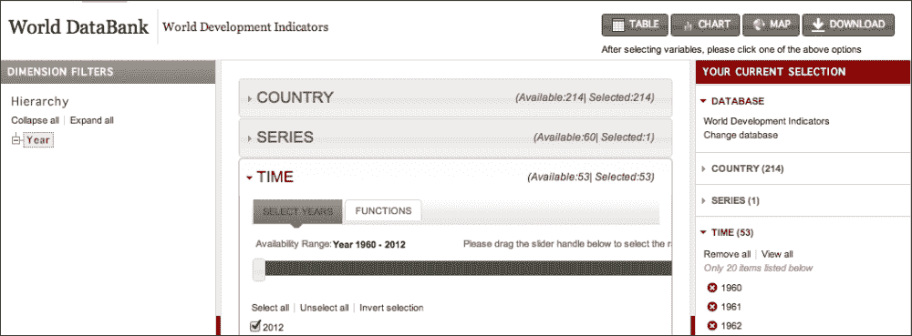
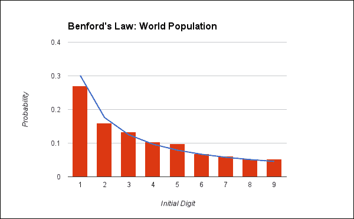
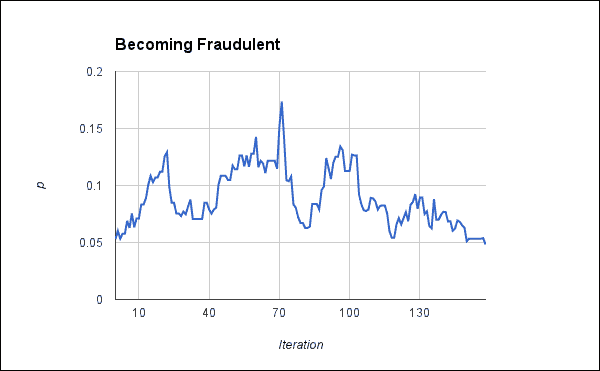
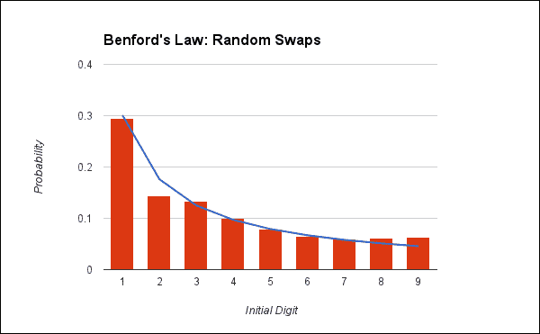

# 第五章 本福特定律 – 检测数字的自然递增

在本章中，我们将探讨**本福特定律**；这是一组许多自然发生的数字序列中固有的有趣属性。对于这些数字集合，这个观察预测了初始数字的分布。

这个奇怪的规则捕捉到了关于数字分布方式的有趣观察，并且它也很实用。本福特定律已被用作欺诈的证据。如果一个数字序列应该是自然发生的，但本福特定律表明它不是，那么这个序列很可能是欺诈的。例如，你银行账户的每日余额应该遵循本福特定律，但如果它们不遵循，那可能就是有人做假账的证据。

# 了解本福特定律

本福特定律最初是由天文学家西蒙·纽科姆在 1881 年观察到的。他参考了对数表，这些是对数不同数值的巨著。他注意到书的首页比末页磨损和褪色得更严重。事实上，处理以*1*开头的数字的页面比以*9*开头的页面磨损得更严重。随着初始数字的增加，页面的磨损程度逐渐减少。

这种现象在 1938 年由物理学家弗兰克·本福特定律再次注意到。他测试了这一原则在多个领域的应用，现在这个原则以他的名字命名。

在实际应用中，这意味着序列中大约三分之一的数字以数字*1*开头，略超过 15%的数字以*2*开头，大约 12%的数字以*3*开头，而其余直到数字*9*的数字都低于 10%。5%的数字以*9*开头。以下是对本福特定律的图形表示：



那么，背后的逻辑是什么？尽管这个观察本身令人惊讶，但理解它实际上并不困难。让我们通过一个例子来看看我们能学到什么。

首先，我们将以将 100 美元存入银行并获得每年 10%的不可思议的利息为例，按月复利，年利率平均分配到复利次数（在这种情况下，12 次），这就是每个复利期间的实际利率。这种行为在更典型的利率中也很明显，但它需要更长的时间跨度。让我们看看这个账户年末报告的表格：

| 年份 | 美元金额 |
| --- | --- |
| 0 | 100.00 |
| 1 | 110.47 |
| 2 | 122.04 |
| 3 | 134.82 |
| 4 | 148.94 |
| 5 | 164.53 |
| 6 | 181.76 |
| 7 | 200.79 |
| 8 | 221.82 |
| 9 | 245.04 |
| 10 | 270.70 |
| 11 | 299.05 |
| 12 | 330.36 |
| 13 | 364.96 |
| 14 | 403.17 |
| 15 | 445.39 |
| 16 | 492.03 |
| 17 | 543.55 |
| 18 | 600.47 |
| 19 | 663.35 |
| 20 | 732.81 |
| 21 | 809.54 |
| 22 | 894.31 |
| 23 | 987.96 |
| 24 | 1,091.41 |

当银行账户中的资金复利增长时，资金的增加是非线性的。也就是说，我上个月累积的 0.30 美元利息现在在本月会赚取 0.32 美元。随着每个月的利息被滚入余额，金额会越来越快地增加。



观察余额，我们可以看到金额在 100s 中停留的时间比在任何其他数字中都要长（七年）。它只在 200s 中停留五年。最后，它在 900s 中只停留一年，然后翻滚，整个过程重新开始。因为可供工作和增长的东西更少，所以数字（即 100s）越低，图表将需要更长的时间才能从这个范围中增长出来。

这种模式在任何几何增长量中都很常见。人口以这种方式增长，许多其他序列也是如此。

然而，具体的例子总是好的。在本章中，我们将通过几个具体的例子来工作。然后，我们将看到贝叶斯定律失败的样子，最后，我们将看看它在生活中的一个应用例子。

## 应用贝叶斯定律于复利

对于第一个插图，让我们继续使用我们刚才开始的例子。

已经有一些库中实现了使用贝叶斯定律的分析，我们将使用**Incanter** ([`incanter.org/`](http://incanter.org/))在章节后面的例子中，但为了更好地理解正在发生的事情，我们首先将编写自己的实现。为了开始，本章的项目.clj 文件如下：

```py
(defproject benford "0.1.0-SNAPSHOT"
  :dependencies [[org.clojure/clojure "1.5.1"]
                 [org.clojure/data.csv "0.1.2"]
                 [incanter "1.5.2"]])
```

命名空间声明如下：

```py
(ns benford.core
  (:require [clojure.string :as str]
            [clojure.java.io :as io]
            [clojure.pprint :as pp]
            [clojure.data.csv :as csv]
            [incanter.stats :as s]))
```

首先，我们需要一种方法来提取一系列数字中的每个首位数字。有几种方法可以做到这一点。我们可以通过反复除以 10，直到值小于 10，然后取结果的整数部分来数学化地完成这个操作。

然而，我们将对此进行简化。我们将数字转换为字符串，并使用一个简单的正则表达式来跳过任何符号或前缀，只取首位数字。我们将这个单个数字转换回整数，如下所示：

```py
(defn first-digit [n]
  (Integer/parseInt (re-find #"\d" (str n))))
```

现在，从一系列数字中提取每个项目的首位数字变得简单：

```py
(defn first-digit-freq [coll]
  (frequencies (map first-digit coll)))
```

让我们使用这些方法从复利数据的年度余额中提取首位数字，并将它们与贝叶斯定律的预期概率进行对比绘图。

这份分析的结果图如下所示。它考察了 25 年的累积利息，这足以让 100 美元增加到超过 1000 美元。



这让我们对数字序列的接近程度有了概念。然而，尽管柱状图看起来与线匹配，但它们并不完全匹配。它们足够接近吗？我们需要应用一个简单的统计测试来找出答案。

首先，我们需要一个函数来计算符合本福特定律的序列的预期值。这个函数将接受一个数字并返回该数字作为序列起始的预期比例：

```py
(defn benford [d]
  (Math/log10 (+ 1.0 (/ 1.0 (float d)))))
```

我们可以利用这个函数来生成本福特定律的完整比率序列。我们可以看到，前一个图中蓝色的线追踪以下值：

```py
user=> (map benford (range 1 10))
(0.3010299956639812 0.17609125905568124 0.12493873660829993 0.09691001300805642 0.07918124604762482 0.06694678963061322 0.05799194697768673 0.05115252244738129 0.04575749056067514)
```

接下来，我们需要一个统计函数来测试一个序列中数字的频率是否与这些值相匹配。由于这是分类数据，通常使用皮尔逊的**χ²**（**卡方**）测试来检验是否符合本福特定律。

χ²测试的公式很简单。这里使用`O`表示观察数据，`E`表示预期数据。`N`是数据类别的数量。例如，以 1 开头的数字是一个类别。在测试本福特定律的情况下，`N`总是`9`。

χ²测试的公式看起来如下所示：



这直接翻译成 Clojure。这里唯一的麻烦是我们需要比较相同的数量。这里使用比率来表示预期值，但使用原始频率来表示观察数据。因此，我们取总的观察次数并将预期比率缩放以匹配它：

```py
(defn x-sqr [expected-ratios observed]
  (let [total (sum observed)
        f (fn [e o]
            (let [n (- o e)]
              (/ (* n n) e)))]
    (sum (map f (map #(* % total) expected-ratios) observed))))
```

我们可以将χ²函数与本福特定律的预期值联系起来：

```py
(defn benford-test [coll]
  (let [freqs (first-digit-freq coll)
        digits (range 1 10)]
    (x-sqr (map benford digits) (map freqs digits))))
```

让我们看看它给出的结果：

```py
user=> (benford-test data)
1.7653767101950812
```

这个数字意味着什么？这个测试的设置方式是，接近零的值表明序列符合本福特定律。

我们得到这里的值`1.8`，考虑到这个函数的范围，这个值相当接近零，所以看起来是好的。然而，我们仍然需要知道它是否具有统计学意义。为了找到这一点，我们需要找到这个χ²的`p-value`。这是这种事情偶然发生的概率。

然而，在我们能够找到χ²测试的这些信息之前，我们必须知道实验的自由度。这是可以自由变化的变量的数量。通常，对于χ²，自由度是测试中单元格数减一，所以对于本福特定律，自由度将是八。

我们使用这个信息来找到该值在χ²累积分布中的概率。累积分布是值或更小值发生的概率。Incanter 在`incanter.stats/cdf-chisq`中有一个χ²的 CDF。我们可以用它来找到χ²测试任何输出的`p`值：

```py
user=> (s/cdf-chisq 1.7653 :df 8 :lower-tail? false)
0.9873810658453659
```

这是一个非常高的 p 值。我们希望它高于 0.05；任何低于这个值的数值都表明这些数据没有遵循本福特定律。（我们将在第七章中讨论这个原因，*零假设检验 – 分析犯罪数据*，当我们讨论零假设检验时。）由于它更高，很明显这个数字序列符合本福特定律的预测。这里没有篡改的证据。

## 查看世界人口数据

对于下一个例子，让我们看看世界人口数据。我从**世界数据银行**([`databank.worldbank.org/`](http://databank.worldbank.org/))下载了这些数据。要将数据下载到您的计算机上，请按照以下步骤操作：

1.  导航到**世界发展指标**数据库。

1.  选择所有国家。

1.  选择**总人口（总计）**。

1.  选择所有年份。

1.  点击**下载**并下载数据为 CSV 文件。

1.  为了便于以后引用，我将此文件移动并重命名为`data/population.csv`。



现在，让我们读取这些数据。为了使这个过程更简单，我们将编写一个函数来读取 CSV 文件，并从每一行创建一个映射，使用标题行的值作为键。这个数据看起来像以下代码片段，列出了标题行和一行数据：

```py
Country Name,Country Code,Indicator Name,Indicator Code,1960 [YR1960],1961 [YR1961],1962 [YR1962],1963 [YR1963],1964 [YR1964],1965 [YR1965],1966 [YR1966],1967 [YR1967],1968 [YR1968],1969 [YR1969],1970 [YR1970],1971 [YR1971],1972 [YR1972],1973 [YR1973],1974 [YR1974],1975 [YR1975],1976 [YR1976],1977 [YR1977],1978 [YR1978],1979 [YR1979],1980 [YR1980],1981 [YR1981],1982 [YR1982],1983 [YR1983],1984 [YR1984],1985 [YR1985],1986 [YR1986],1987 [YR1987],1988 [YR1988],1989 [YR1989],1990 [YR1990],1991 [YR1991],1992 [YR1992],1993 [YR1993],1994 [YR1994],1995 [YR1995],1996 [YR1996],1997 [YR1997],1998 [YR1998],1999 [YR1999],2000 [YR2000],2001 [YR2001],2002 [YR2002],2003 [YR2003],2004 [YR2004],2005 [YR2005],2006 [YR2006],2007 [YR2007],2008 [YR2008],2009 [YR2009],2010 [YR2010],2011 [YR2011],2012 [YR2012],2013 [YR2013]

Afghanistan,AFG,Population (Total),SP.POP.TOTL,8774440,8953544,9141783,9339507,9547131,9765015,9990125,10221902,10465770,10729191,11015621,11323446,11644377,11966352,12273589,12551790,12806810,13034460,13199597,13257128,13180431,12963788,12634494,12241928,11854205,11528977,11262439,11063107,11013345,11215323,11731193,12612043,13811876,15175325,16485018,17586073,18415307,19021226,19496836,19987071,20595360,21347782,22202806,23116142,24018682,24860855,25631282,26349243,27032197,27708187,28397812,29105480,29824536,..
```

这个功能的第一步是`read-csv`：

```py
(defn read-csv [filename]
  (with-open [f (io/reader filename)]
    (let [[row & reader] (csv/read-csv f)
          header (map keyword
                      (map #(str/replace % \space \-) row))]
      (doall
        (map #(zipmap header %) reader)))))
```

从这个，我们可以创建另一个函数来读取人口文件，并提取所有年份列，并返回所有国家所有年份的总人口序列：

```py
(defn read-databank [filename]
  (let [year-keys (map keyword (map str (range 1960 2013)))]
    (->> filename
      read-csv
      (mapcat #(map (fn [f] (f %)) year-keys))
      (remove empty?)
      (map #(Double/parseDouble %))
      (remove zero?))))
```

Χ²测试的一个问题是它对样本大小非常敏感。小样本（小于 50）几乎总是会有一个高的`p-value`。同样，大样本倾向于低`p-value`。一般来说，样本大小在 100 到 2,500 个观测值之间是一个好的范围，但即使在范围内，我们也可以看到一些变化。很容易创建一个函数来返回集合的随机子集。使用它的唯一问题是统计测试的值取决于返回的样本的性质。然而，这始终是样本的问题：

```py
(defn sample [coll k]
  (if (<= (count coll) k)
    coll
    (let [coll-size (count coll)]
      (loop [seen #{}]
        (if (>= (count seen) k)
          (map #(nth coll %) (sort seen))
          (recur (conj seen (rand-int coll-size))))))))
```

现在我们可以把这些放在一起。对于最后一个例子，我们使用自己的函数来执行本福特定律测试和输出上的Χ²测试。这次，我们将使用 Incanter 的`incanter.stats`中的函数来完成这个目的。这也从Χ²分布中查找 p 值，所以它比分两步做更方便：

```py
user=> (def population (b/read-databank "data/population.csv"))
#'user/population
user=> (def pop-test (s/benford-test (b/sample population 100)))
#'user/pop-test
user=> (:X-sq pop-test)
7.926272852944953
user=> (:p-value pop-test)
0.4407050181730324
```

由于*p*值大于 0.05，这似乎符合本福特定律。绘图使 p-Benford's Law 关系更清晰。如果有什么不同的话，这似乎比前面的复利数据更合适：



再次，这些数据似乎也符合本福特定律。

# 违反本福特定律

到目前为止，我们已经看到了几个数据集，它们都符合贝纳德定律，其中大多数相当强烈。我们还没有看到不符合这种初始数字分布的数据集。一个失败的数据集会是什么样子？

我们可以通过许多方式获取不符合规范的数据。例如，任何线性数据都会有更均匀的初始数字分布。然而，我们也可以轻松地模拟欺诈数据，在这个过程中，我们可以了解数据集在贝纳德定律开始对其产生问题之前可以处理多少噪声。

我们将从这个我们之前查看的人口数据开始这个实验。我们将逐渐向数据集中引入越来越多的垃圾数据。我们将随机用随机值替换数据集中的项目，并重新运行`incanter.stats/benford-test`。当它最终失败时，我们可以记录我们替换了多少个项目以及新的分布偏离了多少。

主要函数如下所示。有几个实用工具，你可以查看代码下载以了解它们的定义：

```py
(defn make-fraudulent
  ([data] (make-fraudulent data 1 0.05 1000))
  ([data block sig-level k]
   (let [get-rand (make-rand-range-fn data)]
     (loop [v (vec (sample data k)), benford (s/benford-test v),
            n 0, ps [], swapped #{}]
       (println n \. (:p-value benford))
       (if (< (:p-value benford) sig-level)
         {:n n, :benford benford, :data v, :p-history ps,
          :swapped swapped}
         (let [[new-v new-swapped]
               (swap-random
                 v swapped #(rand-int k) get-rand block)
               benford (s/benford-test new-v)]
           (recur new-v benford (inc n)
                  (conj ps (:p-value benford))
                  new-swapped)))))))
```

这个函数主要是一个循环。在每一步，它会检查`p-value`是否足够低，以至于可以宣布任务完成。如果是这样，它将返回到目前为止收集到的信息。

如果没有这样做，它会交换`block`索引，重新计算一个新的`p-value`，并存储它跟踪的信息。

这不是一个特别有效的过程。它本质上是在数据空间上的随机漫步。有时，它实际上会改善序列的拟合度。然而，由于有更多空间远离贝纳德定律对数字预测的概率，值最终会偏离到拟合度更差、`p-values`更低的区域。以下是从一个`p-value`大约为 0.05 的运行中得到的图表。它并没有立即下降到 0.05 以下，而是在大约 0.17 之前上升，最终在迭代编号 160 左右逐渐下降到 0.05 以下。



观察这个过程的最终数据也很有趣。它实际上并不像你预期的那样与常规贝纳德曲线有很大不同。看起来问题在于数字 2 太少，而数字 8 和 9 太多。



# 案例研究

这一切都非常有趣，但并不特别有用。那么，贝纳德定律有用吗？答案是*是的*。实际上，使用贝纳德定律的分析在美国法庭上是可接受的。为了了解这种分析的一些用途，让我们看看一个适度公开的案件，其中使用了贝纳德定律。

2009 年伊朗总统选举委员会收集了关于选举是否欺诈的分析。其中一些使用了贝德福定律。关于这一主题的主要文章是布杜温·F·罗克马撰写的《2009 年伊朗总统选举中的首位数字异常》（[`arxiv.org/abs/0906.2789`](http://arxiv.org/abs/0906.2789)）。在这项研究中，作者分析了伊朗内政部于 2009 年 6 月 14 日公布的选举结果中的选票首位数字。首先，他分析了其他国家在选举前一年的选举第一轮结果。这建立了一个基线或控制组以进行比较。他还考虑了选举前的民意调查。这使他能够确定选举进行的即时政治环境。

罗克马随后使用自助法获取了选票的样本。在应用贝德福定律对选票进行分析时，他发现，以数字*7*开头的选票数量比贝德福定律所能预测的要多出显著的数量。事实上，数字*7*的频率与数字*3*的频率更为一致。

在对 2009 年伊朗选举的另一项研究中，法医专家沃尔特·R·梅班使用贝德福定律分析了选票的第一位和第二位数字。特别是在第二位数字的基础上，他也发现了欺诈的证据，尤其是在两位候选人的计票中。

这看起来应该很明确。然而，有几个人以不同程度的彻底性审视了这种情况，但都没有找到任何问题。有几个人写了博客文章，关于使用贝德福定律对数据进行粗略检查，但没有发现任何问题的证据。

卡特中心也质疑贝德福定律是否适用于选举数据，在《贝德福定律在检测选举欺诈中的不相关性》一文中，约瑟夫·德克特、米哈伊尔·米亚戈科夫和彼得·C·奥登舒克研究了俄亥俄州、马萨诸塞州和乌克兰的选举数据以及选举的模拟，并得出结论，贝德福定律实际上并不能很好地指示选举欺诈。首位和第二位数字频率的偏差并不能可靠地指示欺诈，实际的欺诈可能使分布更符合贝德福定律。因此，出于许多原因，贝德福定律可能不适合与选举数据一起使用。

# 摘要

在许多方面，贝德福定律似乎是对欺诈和其他不当行为的完美测试。它引人入胜，简单，计算成本低。然而，正如我们所看到的，它并不总是可靠的；χ²测试可能会很挑剔，而且作为证据，它本身并不能站得住脚。它实际上需要其他数据的支持，并有助于支持欺诈案例。

然而，它是一份证据。它提供了一个难以模仿的分布，并且准确地描述了一类数字序列。结合其他信息和证据，它可以在犯罪案件提供支持。

我们还学习了 Χ² 测试，这是一种非常有用的统计程序。尽管它们对样本大小敏感，但这些测试仍然有很多可提供的内容，并且非常推荐。它们执行成本低，并且与分类数据或计数有限、固定可能性的数据（如性别或颜色）配合得很好。当使用适当的样本大小时，它们易于解释。

最后，我们再次被提醒，与数据打交道是混乱的。拥有广泛的应用于我们研究和问题的工具和技术，对于成功追踪所需的信息和分析至关重要。

在下一章中，我们将探讨如何使用情感分析自动找到正面和负面的酒店评论。这实际上比你最初想象的要复杂和有趣得多。
