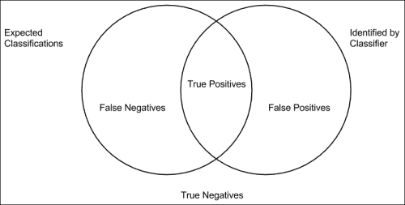
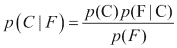
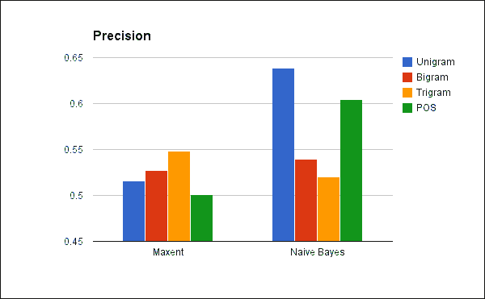
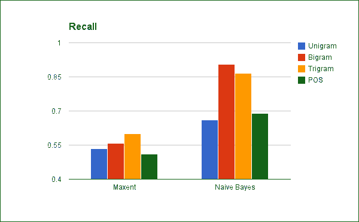
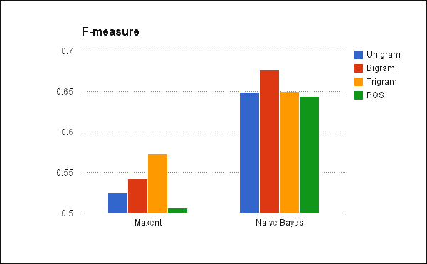

# 第六章：情感分析 – 对酒店评论进行分类

人们在网上谈论很多话题。几乎有关于太阳下所有事情的论坛和社区，其中一些可能与你产品或服务有关。人们可能会抱怨，或者他们可能会赞扬，你想要知道他们是在做哪一种。

这就是情感分析发挥作用的地方。它可以自动跟踪评论和讨论总体上是正面还是负面，并且可以从任一类别中提取项目，使其更容易回应或引起注意。

在本章的整个过程中，我们将涵盖很多内容。其中一些可能有些模糊，但总的来说，以下是我们将涵盖的内容：

+   探索和准备数据

+   理解分类器

+   运行实验

+   检查错误率

在我们继续之前，让我们先了解什么是情感分析。

# 理解情感分析

情感分析是一种基于观点而非主题的文本分类形式。通常，文本是根据它们讨论的主题进行分类的。例如，情感分析试图根据作者的看法或情绪来对文本进行分类，无论文本是关于汽车还是宠物。通常，这些分类是二元的：好或坏，喜欢或不喜欢，正面或负面，等等。这个人喜欢丰田车还是讨厌它们？是哈士奇最好还是德国牧羊犬？他们会回这家餐厅吗？这类问题已被证明是一个重要的研究领域，仅仅因为许多公司都想了解人们在网络上对他们的商品或服务的看法。这为公司营销部门提供了一个途径，以监控人们在 Twitter 和其他在线公共论坛上对他们的产品或服务的看法。他们可以联系不满意的客户，提供更好的、更主动的客户服务，或者联系满意的客户，加强他们的关系和看法。

如你所想，基于观点而非主题进行分类比基于主题分类要困难得多。即使是基本词汇也往往具有多种含义，这些含义非常依赖于它们的上下文。

例如，以单词“好”为例。在评论中，我可以说某件事是“好”的。我也可以说它不好，毫无价值，或者离好差得远，几乎在晴朗的日子里都能看得见。另一方面，我可以说某件事是“坏”的。或者，我可以说它“不坏”。或者，如果我被困在 20 世纪 80 年代，我可以说“我喜欢它，它太糟糕了。”

这是一个非常重要且有趣的问题，因此人们已经研究这个问题多年。关于这个主题的早期论文是在 2002 年发表的，由*Bo Pang*、*Lillian Lee*和*Shivakumar Vaithyanathan*撰写的*Thumbs up? Sentiment classification using machine learning techniques*。在这篇论文中，他们使用朴素贝叶斯的最大熵和支持向量机比较了电影评论，以将电影评论分类为正面或负面。他们还比较了各种特征类型，如 unigrams、bigrams 和其他组合。总的来说，他们发现使用单个标记的支持向量机表现最佳，尽管差异通常不是很大。

无论是集体还是单独，*Bo Pang*、*Lillian Lee*以及许多其他人都在以有趣的方式扩展情感分析。他们试图超越简单的二分类，预测更细致的情感。例如，他们致力于开发系统，从文档中预测评论者会给予被评论服务或对象的四星或五星评分系统中的星级数量。

使这个问题有趣的部分在于基准是系统与人类评分者判断的一致性。然而，在研究中，人类评分者只有 79%的时间达成一致，因此一个与人类评分者 60%或 70%时间达成一致的系统表现相当不错。

# 获取酒店评论数据

对于本章，我们将查看**OpinRank 评论**数据集([`archive.ics.uci.edu/ml/datasets/OpinRank+Review+Dataset`](http://archive.ics.uci.edu/ml/datasets/OpinRank+Review+Dataset))。这是一个包含大约 260,000 条酒店评论的数据集，这些评论来自世界各地的**TripAdvisor**，以及 2007 年、2008 年和 2009 年超过 42,000 条汽车评论([`edmunds.com/`](http://edmunds.com/))，这些评论来自**Edmunds**。

# 探索数据

如果我们查看一些这些评论，我们可以看到将评论归类为正面或负面是多么困难，即使是对于人类来说也是如此。

例如，一些词的使用方式与其直接含义不相关。例如，看看以下来自北京酒店评论的引用中对术语*greatest*的使用：

> *"不是最好的区域，但没问题，即使在凌晨 3 点。"*

此外，许多评论会描述他们讨论的酒店的好与坏两方面，即使最终评论明确地偏向一方或另一方。这篇关于伦敦酒店的评论一开始列举了优点，但随后发生了转变：

> *"… 这些是唯一真正的优点。其他一切都是平均或低于平均水平..."*

另一个评论难以分类的原因是，许多评论并没有全心全意地推荐他们所评论的内容。相反，评论可能是温和的，或者评论者会像在这篇拉斯维加斯酒店的评论中那样对他们的结论进行限定：

> *"它已经褪色了，但还可以。如果你预算有限，想在拉斯维加斯大道上住宿，这个地方很合适。但如果你想体验真正物有所值的服务，请尝试市中心的 Main Street Station。"*

所有这些因素都使得这个任务比标准的文档分类问题更困难。

# 准备数据

对于这个实验，我随机选择了 500 条酒店评论并手动进行了分类。更好的选择可能是使用亚马逊的 Mechanical Turk ([`www.mturk.com/mturk/`](https://www.mturk.com/mturk/)) 来获取比任何一个人都能轻松完成的更多评论分类。实际上，几百条评论是我们想要的最低数量，因为训练集和测试集都需要从这个样本中获取。我确保样本中包含相同数量的正面和负面评论。（您可以在代码下载的`data`目录中找到样本。）

数据文件是**制表符分隔值**（**TSV**）。在手动分类后，每一行有四个字段：分类作为一个`+`或`-`符号、评论的日期、评论的标题以及评论本身。有些评论相当长。

在标记文件后，我们将从标题的词汇表中创建特征向量，并为每个标题创建一个评论。在本章中，我们将看到哪些方法效果最好：unigrams（单个标记）、bigrams、trigrams 或词性标注的 unigrams。这些特征包括从文本中提取特征的几种常见方式：

+   Unigrams 是单个标记，例如，来自前一句的特征

+   Bigrams 是相邻的两个标记，例如，*features comprise*

+   Trigrams 是相邻的三个标记，例如，*features comprise several*

+   词性标注的 unigrams 看起来像`features_N`，这仅仅意味着 unigram 特征是一个名词。

我们还将使用这些特征在评论上训练各种分类器。就像*Bo Pang*和*Lillian Lee*所做的那样，我们将尝试使用朴素贝叶斯最大熵分类器进行实验。为了比较这些分类器的表现，我们将使用交叉验证来多次训练和测试我们的分类器。

## 分词

在我们开始编写本章的代码之前，请注意，Leiningen 2 的`project.clj`文件看起来像以下代码：

```py
(defproject sentiment "0.1.0-SNAPSHOT"
:plugins [[lein-cljsbuild "0.3.2"]]
:dependencies [[org.clojure/clojure "1.5.1"]
                 [org.clojure/data.csv "0.1.2"]
                 [org.clojure/data.json "0.2.3"]
                 [org.apache.opennlp/opennlp-tools "1.5.3"]
                 [nz.ac.waikato.cms.weka/weka-dev "3.7.7"]]
:jvm-opts ["-Xmx4096m"])
```

首先，让我们创建一些处理分词的函数。在幕后，我们将使用**OpenNLP**库（[`opennlp.apache.org/`](http://opennlp.apache.org/））的方法以及**Weka 机器学习**库（[http://www.cs.waikato.ac.nz/ml/weka/](http://www.cs.waikato.ac.nz/ml/weka/））的下一个方法来执行情感分析。然而，我们将包装这些方法以提供一个更自然、类似 Clojure 的接口。

让我们从`src/sentiment/tokens.clj`文件开始，它将以以下方式开始：

```py
(ns sentiment.tokens
  (:require [clojure.string :as str]
            [clojure.java.io :as io])
  (:import [opennlp.tools.tokenizeSimpleTokenizer]
           [opennlp.tools.postagPOSModelPOSTaggerME]))
```

我们的分词器将使用 OpenNLP 库中的`SimpleTokenizer`并将所有字符转换为小写：

```py
(defn tokenize [s]
  (map (memfn toLowerCase)
       (seq
         (.tokenize SimpleTokenizer/INSTANCE s))))
```

我在交互式解释器中将 `sentiment.tokens` 命名空间别名为 `t`。此函数用于将输入字符串分割成一系列标记子字符串：

```py
user=> (t/tokenize "How would this be TOKENIZED?")
("how" "would" "this" "be" "tokenized" "?")

```

接下来，我们将从标记流中创建特征向量。

## 创建特征向量

特征向量是一个向量，它总结了观察或文档。每个向量包含与每个变量或特征关联的值。这些值可能是布尔值，表示存在或不存在，用 0 或 1 表示，也可能是原始计数，或者可能是按整体文档大小缩放的比率。由于机器学习的大部分基于线性代数，因此向量和矩阵是非常方便的数据结构。

为了保持每个特征的索引一致，我们必须维护一个从特征到索引的映射。每次我们遇到一个新特征时，我们需要将其分配到一个新索引。

例如，以下表格追踪了根据短语 *the cat in the hat* 的标记频率创建特征向量的步骤。

| 步骤 | 特征 | 索引 | 特征向量 |
| --- | --- | --- | --- |
| 1 | the | 0 | [1] |
| 2 | cat | 1 | [1, 1] |
| 3 | in | 2 | [1, 1, 1] |
| 4 | the | 0 | [2, 1, 1] |
| 5 | hat | 3 | [2, 1, 1, 1] |

因此，*the cat in the hat* 的最终特征向量将是 `[2, 1, 1, 1]`。在这种情况下，我们正在计算特征。在其他应用中，我们可能使用仅测试特征存在性的词袋方法。在这种情况下，特征向量将是 `[1, 1, 1, 1]`。

我们将在 `sentiment.tokens` 命名空间中包含执行此操作的代码。首先，我们将创建一个函数，该函数增加特征向量中特征值的值。它从特征索引（`f-index`）中查找向量中特征的位置。如果特征尚未被看到，此函数还会为它分配一个索引：

```py
(defn inc-feature [f-index f-vec feature]
  (if-let [i (f-index feature)]
    [f-index, (assoc f-veci (inc (nth f-veci)))]
    (let [i (count f-index)]
      [(assoc f-index feature i), (assoc f-veci 1)])))
```

我们可以使用此函数将特征序列转换为特征向量。此函数最初为特征序列创建一个零向量，然后它遍历特征，根据需要更新特征索引和向量：

```py
(defn ->feature-vec [f-index features]
  (reduce #(inc-feature (first %1) (second %1) %2)
          [f-index (vec (repeat (count f-index) 0))]
features))
```

最后，对于这个任务，我们有一些函数将一起查看。第一个函数 `accum-features` 构建索引和特征向量列表。每次调用它时，它都会接收传递给它的特征序列，并创建一个特征向量。然后，它将这个向量追加到传递给它的特征向量集合中。下一个函数 `pad-to` 确保特征向量具有与特征索引相同的元素数量。这使得稍后处理特征向量稍微容易一些。最后一个函数接受一个特征向量列表，并返回该数据的特征索引和向量：

```py
(defnaccum-features [state features]
  (let [[index accum] state
        [new-index feature] (->feature-vec index features)]
    [new-index (conj accum feature)]))

(defn pad-to [f-index f-vec]
(vec (take (count f-index) (concat f-vec (repeat 0)))))

(defn ->features [feature-seq]
  (let [[f-index f-vecs]
        (reduce accum-features [{} []] feature-seq)]
    [f-index (map #(pad-to f-index %) f-vecs)]))
```

我们可以使用这些函数从一组输入句子中构建特征向量矩阵。让我们看看这是如何在 *Emily Dickinson* 诗歌的前几行中工作的。

```py
user=> (def f-out
 (t/->features
 (map set
 (map t/tokenize ["I'm nobody."
 "Who are you?"
 "Are you nobody too?"]))))
#'user/f-out
user=> (first f-out)
{"nobody" 0, "'" 1, "i" 2, "m" 3, "." 4, "too" 9, "are" 5,
 "who" 6, "you" 7, "?" 8}
user=> (print (second f-out))
([1 1 111 0 0000] [0 0 000 1 111 0]
 [1 0 000 1 0 1 11])

```

注意，在标记化每个文档之后，我们创建了一组标记。这改变了这里的系统，使其使用词袋方法。我们只关注特征的存在或不存在，而不是它们的频率。这确实会使标记顺序混乱，显然`nobody`是第一个索引的标记，但这并不重要。

现在，通过反转特征索引，我们可以从文档包含的特征中查找单词。这使我们能够为每个文档重新创建频率图，以及重新创建每个文档中的标记。在这种情况下，我们将从第一个特征向量`I'm nobody`中查找单词：

```py
user=> (def index (map first (sort-by second (first f-out))))
#'user/index
user=> index
("nobody" "'" "i" "m" "." "are" "who" "you" "?" "too")
user=> (->> f-out
second
first
 (map-indexed vector)
 (remove #(zero? (second %)))
 (map first)
 (map #(nth index %)))
("nobody" "'" "i" "m" ".")

```

这段代码获取特征向量中每个位置的索引，移除未出现的特征，然后在反转特征索引中查找索引。这为我们提供了在该文档中出现的特征序列。注意，它们是乱序的。这是可以预料的，因为既不是输入特征序列（在这种情况下是一个集合）也不是特征向量本身保留了特征的顺序。

## 创建特征向量函数和 POS 标记

我们还将包括一些函数，将标记列表转换为特征列表。通过将这些包装成函数，我们使组合处理函数的管道和实验不同的特征集变得更加容易。

最简单且可能是最常见的特征类型是单语或单个标记。由于`tokenize`函数已经输出单个函数，因此`unigram`函数非常简单实现：

```py
(def unigrams identity)
```

构建特征的另一种方法是使用一系列连续的标记。在摘要中，这些被称为 n-gram。二元组（两个标记）和三元组（三个标记）是这种类型函数的常见实例。我们将把这些都定义为函数：

```py
(defn n-grams [n coll]
  (map #(str/join " " %) (partition n 1 coll)))
(defn bigrams [coll] (n-grams 2 coll))
(defn trigrams [coll] (n-grams 3 coll))
```

我们可以创建和实验多种不同的功能，但在这里我们不会展示所有。然而，在我们继续之前，这里还有一种更常见的功能类型：标记了其**词性**（**POS**）的标记。POS 是词语的分类，它决定了它们在句子中的使用范围。你可能从小学时就已经记得这些了。名词是人、地点和事物。动词是动作。

为了获取这些信息，我们将使用 OpenNLP 的预训练 POS 标记器。这个标记器将一个词与一个词性关联起来。为了使用它，我们需要下载训练模型文件。你可以在[`opennlp.sourceforge.net/models-1.5/`](http://opennlp.sourceforge.net/models-1.5/)找到它。下载带有**最大熵模型和标记字典**描述的**英语 POS 标记器**。文件本身命名为`en-pos-maxent.bin`，我将它放入了我项目的`data`目录中。

此标注器使用宾州树库（[`www.cis.upenn.edu/~treebank/`](http://www.cis.upenn.edu/~treebank/））定义的词性标签。它使用一个训练好的、概率性的标注器将标签与句子中的每个标记相关联。例如，它可能会将标记 things 与 `NNS` 标签相关联，这是复数名词的缩写。我们将通过将这些两个结合起来创建这个特征的字符串，这样这个特征就会看起来像 `things_NNS`。

一旦我们有了数据文件，我们需要将其加载到词性标注模型中。我们将编写一个函数来完成这个任务并返回标注器对象：

```py
(defn read-me-tagger [filename]
  (->>filename
io/input-stream
POSModel.
POSTaggerME.))
```

使用标注器相当简单。我们只需调用它的标注方法，如下所示：

```py
(defn with-pos [model coll]
  (map #(str/join "_" [%1 %2])
coll
       (.tag model (into-array coll))))
```

现在我们已经准备好了这些函数，让我们用一个简短的句子来生成它的特征。对于这组示例，我们将使用子句，`Time flies like an arrow; fruit flies like a banana`。首先，我们将定义输入数据和加载词性标注器。

```py
user=> (def data
 "Time flies like an arrow; fruit flies like a banana.")
user=> (def tagger (t/read-me-tagger "data/en-pos-maxent.bin"))
user=> (def tokens (t/tokenize data))
user=> (t/unigrams tokens)
("time" "flies" "like" "an" "arrow" ";" "fruit" "flies" "like" "a"
 "banana" ".")
user=> (t/bigrams tokens)
("time flies" "flies like" "like an" "an arrow" "arrow ;"
 "; fruit" "fruit flies" "flies like" "like a" "a banana"
 "banana .")
user=> (t/trigrams tokens)
("time flies like" "flies like an" "like an arrow" "an arrow ;"
 "arrow ; fruit" "; fruit flies" "fruit flies like" "flies like a"
 "like a banana" "a banana .")
user=> (t/with-pos tagger tokens)
("time_NN" "flies_VBZ" "like_IN" "an_DT" "arrow_NN" ";_:"
 "fruit_NN" "flies_NNS" "like_IN" "a_DT" "banana_NN" "._.")

```

在最后的输出中，单词与词性标签相关联。此输出使用来自宾州树库（[`www.cis.upenn.edu/~treebank/`](http://www.cis.upenn.edu/~treebank/））的标签。你可以查看它以获取更多信息，但简要来说，以下是前面代码片段中使用的标签：

+   `NN` 表示名词；

+   `VBZ` 表示现在时动词，第三人称单数；

+   `IN` 表示和，介词或从属连词

+   `DT` 表示限定词。

因此，我们可以看到，词性标注的特征提供了关于单个标记的最多的数据；然而，n-gram（双词和三词）提供了关于每个词周围上下文更多的信息。稍后，我们将看到哪一个能得到更好的结果。

现在我们已经处理好了预处理，让我们将注意力转向文档以及我们想要如何构建实验的其余部分。

# 交叉验证结果

正如我之前提到的，本章的数据集是从 OpinRank 数据集中手动编码的 500 条酒店评论。对于这个实验，我们将它们分成 10 个包含 50 条评论的块。

这些块将使我们能够使用 **K 折交叉验证**来测试我们的系统表现如何。交叉验证是一种通过将数据分成大小相等的块来检查你的算法和流程的方法。你然后在除了一个块之外的所有块上训练你的数据；这就是训练集。你在运行训练系统在验证集上后计算错误。然后，你使用下一个块作为验证集并重新开始。最后，我们可以对所有试验的平均错误进行平均。

例如，验证过程使用四个折，A、B、C 和 D。对于第一次运行，A、B 和 C 将是训练集，而 D 将是测试集。接下来，A、B 和 D 将是训练集，而 C 将是测试集。这将一直持续到每个折都至少作为一次测试集使用。

这可能看起来像很多工作，但它有助于我们确保我们没有仅仅因为训练或验证数据的选择而侥幸成功。它提供了一种更稳健的方式来估计分类器的错误率和准确性。

实现交叉验证的主要技巧是 Clojure 的本地分区函数（`partition`和`partition-all`）并不完全按照我们期望的方式处理额外项。`partition`函数只是丢弃额外项，而`partition-all`则将所有额外项粘附在较小的组末尾。我们希望的是将额外项包含在之前的块中。每个块应该有一个额外项，直到所有余数都耗尽。为了处理这个问题，我们将定义一个名为`partition-spread`的函数。它将集合的前一部分分成较大的块，后一部分分成较小的块。

不幸的是，我们需要知道输入集合的大小。为此，我们必须一次性将整个集合保存在内存中，因此这个算法不适合非常大的序列：

```py
(defn partition-spread [k coll]
  (let [get-mod (fn [i x]
                  [(mod i k) x])
map-second #(map second (second %))]
    (->>coll
      (map-indexed get-mod)
      (group-by first)
      (map map-second))))
```

我们现在可以看到这些分区函数的不同之处：

```py
user=> (partition 4 (range 10))
((0 1 2 3) (4 5 6 7))
user=> (partition-all 4 (range 10))
((0 1 2 3) (4 5 6 7) (8 9))
user=> (xv/partition-spread 4 (range 10))
((0 4 8) (1 5 9) (2 6) (3 7))
user=> (xv/partition-spread 3 (range 10))
((0 3 6 9) (1 4 7) (2 5 8))

```

我们还可以看到第一个参数的语义已经改变。它不再表示分区的大小，而是指定分区的数量。现在，所有分区的大小大致相等。

接下来，我们将创建几个函数，用于提取每个块作为验证集，并将所有其他块连接起来。

```py
(defn step-folds-seq [folds steps]
  (lazy-seq
    (when-let [[s &ss] (seq steps)]
      (let [[prefix [validation & suffix]] (split-at s folds)
training (flatten (concat prefix suffix))
current [validation training]]
        (cons current (step-folds-seq folds ss))))))
(defn step-folds [folds]
  (step-folds-seq folds (range (count folds))))
```

现在，通过将数据分成每个元素一个块的块，我们可以清楚地看到 K 折分区是如何工作的。每次，一个新的块被选为验证集（第一个项目），其余的块被连接成训练集（第二个项目）：

```py
user=> (xv/step-folds (xv/partition-spread 10 (range 10)))
([(0) (1 2 3 4 5 6 7 8 9)] [(1) (0 2 3 4 5 6 7 8 9)]
 [(2) (0 1 3 4 5 6 7 8 9)] [(3) (0 1 2 4 5 6 7 8 9)]
 [(4) (0 1 2 3 5 6 7 8 9)] [(5) (0 1 2 3 4 6 7 8 9)]
 [(6) (0 1 2 3 4 5 7 8 9)] [(7) (0 1 2 3 4 5 6 8 9)]
 [(8) (0 1 2 3 4 5 6 7 9)] [(9) (0 1 2 3 4 5 6 7 8)])

```

现在，我们可以定义一个函数来控制 K 折验证过程。它接受训练和错误步骤作为函数参数，它只是处理将数据分成组，调用训练和错误函数，并将它们的输出组合成一个结果：

```py
(defn k-fold
  ([train error combine data]
   (k-fold train error combine 10 data))
  ([train error combine k input-data]
   (->> input-data
shuffle
     (partition-spread k)
step-folds
     (map (fn [[v t]] [v (train t)]))
     (map (fn [[v t]] [err (error t v)]
                        (println :error err)
err)))
     (reduce combine (combine)))))
```

现在，我们需要决定什么构成了错误以及我们将如何计算它。

# 计算错误率

为了计算分类算法的错误率，我们需要记录几件事情。我们将跟踪有多少正例被正确和错误地识别，以及有多少负例被正确和错误地识别。这些值通常被称为真正例、假正例、真负例和假负例。这些值与预期值、分类器的输出以及彼此之间的关系可以在以下图表中看到：



从这些数字中，我们首先计算算法的精确度。这是真正例与所有识别出的正例数量（包括真正例和假正例）的比率。这告诉我们它识别为正例的项目中有多少实际上是正例。

我们接下来将计算召回率。这是所有实际正例（真正例和假负例）中真正例的比例。这让我们了解到有多少正例被遗漏了。

为了计算这个，我们将使用标准的`reduce`循环。首先，我们将为它编写累加器函数。这将接受一个我们需要计数的映射和一对评分，预期的和实际的。根据它们是什么以及它们是否匹配，我们将按照以下方式增加一个计数：

```py
(defnaccum-error [error-counts pair]
  (let [get-key {["+" "+"] :true-pos
                 ["-" "-"] :true-neg
                 ["+" "-"] :false-neg
                 ["-" "+"] :false-pos}
k (get-key pair)]
    (assoc error-counts k (inc (error-counts k)))))
```

一旦我们有了测试集的计数，我们需要将这些计数汇总成精确度和召回率的数值：

```py
(defn summarize-error [error-counts]
  (let [{:keys [true-pos false-pos true-neg false-neg]}
error-counts]
    {:precision (float (/ true-pos (+ true-pos false-pos))),
:recall (float (/ true-pos (+ true-pos false-neg)))}))
```

定义了这两个函数后，实际计算错误的函数是标准的 Clojure：

```py
(defn compute-error [expecteds actuals]
  (let [start {:true-neg 0, :false-neg 0, :true-pos 0,
:false-pos 0}]
    (summarize-error
      (reduceaccum-error start (map vector expecteds actuals)))))
```

我们可以通过类似的方式确定一组精确度/召回率映射的平均误差。我们可以简单地分别计算每个键的值，但与其多次遍历集合，我们将会做更复杂的事情，只遍历一次集合同时计算每个键的总和：

```py
(defn mean-error [coll]
  (let [start {:precision 0, :recall 0}
accum (fn [a b]
                {:precision (+ (:precision a) (:precision b))
:recall (+ (:recall a) (:recall b))})
summarize (fn [n a]
                    {:precision (/ (:precision a) n)
:recall (/ (:recall a) n)})]
    (summarize (count coll) (reduce accum start coll))))
```

这些函数将帮助我们了解我们分类器的性能以及它们在识别数据中表达的情感方面做得如何。

# 使用 Weka 机器学习库

我们将测试一些常用的机器学习算法，这些算法通常用于情感分析。其中一些在 OpenNLP 库中实现。然而，它们没有其他算法。因此，我们将使用 Weka 机器学习库（[`www.cs.waikato.ac.nz/ml/weka/`](http://www.cs.waikato.ac.nz/ml/weka/)）。这个库没有用于分词或分割数据的类，这些数据是自然语言处理应用所需的，但它确实提供了一套更完整的机器学习算法。

Weka 库中的所有类也都有一个标准、一致的接口。这些类实际上是为从命令行使用而设计的，因此每个类都接受一个字符串数组作为选项，具有类似命令行的语法。例如，朴素贝叶斯分类器的数组可能有一个标志，表示它应该使用核密度估计器而不是正态分布。这将在选项数组中通过包含`-K`标志来表示。其他选项可能包括一个参数，该参数将跟随数组中的选项。例如，逻辑回归分类器可以接受一个参数来指示它应该运行的最大迭代次数。这将在选项数组中包括`-M`和`1000`（例如）。

这些类的 Clojure 接口函数非常规范。实际上，它们几乎是模板化的。不幸的是，它们也有些冗余。选项名称在函数的参数列表、那些参数的默认值以及参数被输入到选项数组中的地方都被重复了。最好有一个地方可以指定每个选项，包括它的名称、标志、语义和默认值。

这正是 Clojure 宏系统的完美应用。创建函数所需的数据可以转换成函数定义，然后编译成接口函数。

最终结果是`defanalysis`宏，它接受函数名称、类、基于的方法以及它接受的选项。我们将在本章后面看到它的几个用法。

不幸的是，这个系统大约有 40 行代码，虽然很有趣，但在这里包含它可能会有些长且分散注意力。您可以在代码下载中的`src/sentiment/weka.clj`文件中找到它，我在*Clojure Data Analysis Cookbook*，*Packt Publishing*中对其进行了更详细的讨论。

我们仍然需要将之前加载的`HotelReview`记录转换为`WekaInstances`集合。在训练和测试分类器时，我们需要多次进行此操作，这将为我们提供一个与 Weka 交互的简短示例。

为了存储数据矩阵，Weka 使用`Instances`对象。它实现了多个标准的 Java 集合接口，并持有实现`Instance`接口的对象，如`DenseInstance`或`SparseInstance`。

实例还跟踪其`Attribute`对象集合中每个项目具有哪些字段。为了创建这些，我们将使用在特征索引中积累的所有特征填充`ArrayList`。我们还将创建一个用于评级的特征并将其添加到`ArrayList`中。我们将返回属性的全集以及评论评级的单个属性：

```py
(defn instances-attributes [f-index]
  (let [attrs (->> f-index
                (sort-by second)
                (map #(Attribute. (first %)))
ArrayList.)
review (Attribute. "review-rating"
                           (ArrayList. ["+" "-"]))]
    (.add attrs review)
    [attrs review]))
```

（在这个阶段，我们硬编码了表示情感的标记为加号和减号。然而，这些可以很容易地变成更灵活系统的参数。）

每个酒店评论本身可以单独转换。由于大多数文档将只有全部特征的一部分，我们将使用`SparseInstance`。如果实例中的大多数值都是零，稀疏向量在内存效率上更优。如果特征向量中的特征不为零，我们将将其设置在`Instance`中。最后，我们还将设置如下评级属性：

```py
(defn review->instance [attrs review]
  (let [i (SparseInstance. (.size attrs))]
    (doseq [[attr value] (map vector attrs (:feature-vec review))]
      (when-not (zero? value)
        (.setValueiattr (double value))))
    (.setValuei (last attrs) (:rating review))
i))
```

使用这些工具，我们可以将来自`HotelReview`记录的数据填充到`Instances`中：

```py
(defn ->instances
  ([f-index review-coll]
   (->instances f-index review-coll "hotel-reviews"))
  ([f-index review-coll name]
   (let [[attrs review] (instances-attributes f-index)
instances (Instances. name attrs (count review-coll))]
     (doseq [review review-coll]
       (let [i (review->instance attrs review)]
         (.add instances i)))
     (.setClass instances review)
instances)))
```

现在我们可以定义一些函数，它们将位于我们之前定义的交叉验证函数和 Weka 接口函数之间。

## 连接 Weka 和交叉验证

这些函数中的第一个将根据每个类别的概率分布对实例进行分类，并确定它被分类为哪个评级符号（`+`或`-`）。此函数用于在`Instances`对象中的所有数据上运行分类器：

```py
(defn run-instance [classifier instances instance]
  (let [dist (.distributionForInstance classifier instance)
i (first (apply max-key second
                       (map vector (range) dist)))]
    (.. instances classAttribute (value i))))
(defn run-classifier [classifier instances]
  (map #(run-instance classifier instances %) instances))
```

下一个函数定义了一组 `HotelReview` 记录的交叉验证过程。这个函数实际上接受一个训练函数，并返回一个函数，该函数接受特征索引和 `HotelReview` 记录的集合，并执行交叉验证。这将使我们能够为每种类型的分类器创建一些包装函数：

```py
(defn run-k-fold [trainer]
  (fn [f-index coll]
    (let [do-train (fn [xs]
                     (let [is (w/->instances f-index xs)]
                       (trainer is)))
do-test (fn [classifier xs]
                    (->>xs
                      (w/->instances f-index)
w/filter-class-index
                      (run-classifier classifier)
                      (xv/compute-error (map :rating xs))
vector))]
      (xv/k-fold do-train do-test concat 10 coll))))
```

当执行时，这个函数将返回 `do-test` 函数返回的十个结果。在这种情况下，这意味着一个包含十个精确率和召回率映射的列表。我们可以平均这个输出，以获得每个分类器性能的摘要。

现在我们实际上可以开始定义和测试分类器了。

## 理解最大熵分类器

最大熵（maxent）分类器在某种程度上是非常保守的分类器。它们对隐藏变量没有任何假设，并且严格基于它们所训练的证据进行分类。它们与它们所看到的事实一致，但所有其他分布都被假定为完全均匀。这意味着什么？

假设我们有一组评论和正面或负面评分，我们希望能够预测评分的值，当评分不可用，给定评论中的标记或其他特征时。评分是正面的概率将是 p(+)。最初，在我们看到任何实际证据之前，我们可能会直觉地认为这个概率将在所有可能特征上均匀分布。所以，对于一组五个特征，在训练之前，我们可能期望概率函数返回这些值：

| p(+) | ½ |
| --- | --- |
| p(-) | ½ |

这完全均匀，但不太有用。我们必须从数据中做出观察，以便训练分类器。

训练过程涉及观察每份文档的特征及其评分，并确定在具有给定评分的文档中找到的任何给定特征的概率。我们将这表示为 p(x, y) 或特征 x 和评分 y 的概率。

这些特征对我们的模型施加了约束。随着我们收集越来越多的约束，为模型中非约束概率找到一致和均匀的分布变得越来越困难。

实质上，这是最大熵算法的工作。它考虑了训练数据中找到的所有概率约束，但它在所有无约束的事物上保持均匀分布。这提供了一个更一致、更强的算法，通常表现也非常好。此外，交叉验证可以帮助我们评估其性能。

另一个好处是，maxent 对不同特征之间的关系没有做出任何假设。稍后我们将查看一个朴素贝叶斯分类器，它确实对特征之间的关系做出了假设，这是一个通常不切实际的假设。因为 maxent 没有做出那个假设，它可以更好地匹配涉及的数据。

对于本章，我们将使用 Weka 类中的 maxent 分类器，即 `weka.classifiers.functions.Logistic`（maxent 等同于逻辑回归，它试图根据二元分类标签对数据进行分类，该标签基于一个或多个特征）。我们将使用 `defanalysis` 宏来定义一个效用函数，如下交叉验证逻辑回归分类器：

```py
(w/defanalysis train-logistic Logistic buildClassifier
  [["-D" debugging false :flag-true]
   ["-R" ridge nil :not-nil]
   ["-M" max-iterations -1]])
(def k-fold-logistic (run-k-fold train-logistic))
```

现在让我们为朴素贝叶斯分类器定义一个类似的概念。

## 理解朴素贝叶斯分类器

一种常见且通常表现良好的分类器是朴素贝叶斯分类器。它之所以被称为朴素，是因为它对数据以及特征做出了假设；它假设特征之间是相互独立的。也就是说，例如，*good* 在文档中出现的概率不会受到任何其他标记或特征（例如，*not*）的概率的影响。不幸的是，语言并不按这种方式运作，任何语言数据集的特征之间都存在依赖关系。

幸运的是，即使数据和特征并不完全独立，这个分类器在实践中通常仍然表现相当好。例如，在 Irina Rish、Joseph Hellerstein 和 Jayram Thathachar 的文章《影响朴素贝叶斯性能的数据特征分析》中，发现贝叶斯分类器在特征完全独立或功能依赖时表现最佳。

这个分类器通过知道几个概率，然后使用贝叶斯定理将它们转换过来以预测文档的分类。它需要知道以下概率：

+   需要知道训练集中每个特征的概率。我们将称之为 **p(F**)。比如说，单词 *good* 在 40% 的文档中出现。这是分类的证据。

+   需要知道一个文档成为分类一部分的概率。我们将称之为 **p(C**)。比如说，在评论语料库中正面评价的比率是 80%。这是先验分布。

+   现在它需要知道，如果文档被正面评价，那么包含良好特征的概率是 **p(F|C**)。对于这个假设的例子，假设 *good* 在 40% 的正面评价中出现。这是似然。

贝叶斯定理允许我们将其反过来计算，如果文档包含特征 *good*，则该文档被正面评价的概率。



对于这个例子，结果是 `(0.8)(0.4) / 0.4`，即 0.8（80%）。所以，如果文档包含特征 *good*，它很可能被正面评价。

当然，当我们开始跟踪越来越多的特征时，事情开始变得更有趣。例如，如果文档中既有 *not* 又有 *good*，那么评论为正面的概率可能会发生剧烈变化。

Weka 实现的朴素贝叶斯分类器位于 `weka.classifiers.bayes.NaiveBayes`，我们将以类似于我们用于最大熵分类器的方式包装它：

```py
(w/defanalysis train-naive-bayesNaiveBayesbuildClassifier
  [["-K" kernel-density false :flag-true]
   ["-D" discretization false :flag-true]])
(def k-fold-naive-bayes (run-k-fold train-naive-bayes))
```

现在我们已经设置了分类器，让我们再次看看我们将使用的特征以及我们将如何比较一切。

# 运行实验

记住，我们之前定义了函数来将一系列标记分解成各种类型的特征：单词、二元组、三元组和带词性标注的单词。我们可以使用这些特征并自动测试所有这些类型的特征对分类器的效果。让我们看看如何。

首先，我们将定义一些顶层变量，将标签关键词与我们在该过程点想要测试的函数（即分类器或特征生成器）关联起来（即，分类器或特征生成器）：

```py
(def classifiers
  {:naive-bayes a/k-fold-naive-bayes
:maxent a/k-fold-logistic})
(def feature-factories
  {:unigram t/unigrams
:bigram t/bigrams
:trigram t/trigrams
:pos (let [pos-model 
              (t/read-me-tagger "data/en-pos-maxent.bin")]
          (fn [ts] (t/with-pos pos-model ts)))})
```

我们现在可以遍历这两个哈希表，并交叉验证这些分类器在这些特征上的表现。我们将对所有分类器的错误信息（精确度和召回率）进行平均，并返回平均值。一旦执行了这一步，我们就可以花些时间查看结果。

对于此过程的内部循环，我们将取一组特征和一个分类器，并交叉验证它们。这很简单；它只是从特征生成器的关键词和分类器构建一个标识键，运行交叉验证，并按以下方式平均输出错误信息：

```py
(defn do-class [f-key f-index features c-info]
  (let [[c-key c] c-info, k [c-key f-key]]
    (println k)
    [k (x/mean-error (c f-index features))]))
```

现在，给定一组特征，我们将对每个分类器在上一个循环中调用 `do-class`。通过生成特征然后对分类器进行循环来构建这个循环，我们避免了需要多次重新生成相同特征集的需求：

```py
(defn do-features [docs classifiers f-info]
  (let [[f-key f] f-info
        [f-index features] (d/add-features f docs)]
    (map #(do-class f-key f-index features %) classifiers)))
```

此过程的控制函数简单地对每一组特征生成函数调用 `do-features`，并将所有输出存储到一个哈希表中：

```py
(defn test-suite [docs]
  (into {} (mapcat #(do-features docs classifiers %)
feature-factories)))
```

这需要一段时间来执行：

```py
user=> (def reviews (->> "data/hotels-sample" d/read-data
d/sample vals flatten))
#'user/reviews
user=> (c/test-suite reviews)
[:naive-bayes :unigram]
:error [{:precision 0.5185185, :recall 0.5}]
:error [{:precision 0.6, :recall 0.5769231}]
:error [{:precision 0.5185185, :recall 0.6666667}]
```

现在我们可以更详细地查看数据。

# 检查结果

首先，让我们检查分类器的精确度。记住，精确度是指分类器在仅返回正面评论方面做得有多好。这表明每个分类器识别为正面的评论在测试集中实际上是正面的百分比：



在查看此图表时，我们需要记住一些事情。首先，与其他分类任务相比，情感分析是困难的。最重要的是，人类评分员只有大约 80% 的时间达成一致。因此，前一个图表中几乎达到 65% 的条形实际上相当不错，如果不是非常好的。尽管如此，我们可以看到，对于这个数据集，朴素贝叶斯分类器通常优于最大熵分类器，尤其是在使用单词特征时。对于二元组和三元组特征，它的表现较差，对于带词性标注的单词，表现略差。

我们没有尝试对二元和三元特征进行词性标注，但这可能是一个有趣的实验。根据我们在这里看到的情况，这些特征生成器不会比我们已经测试过的结果更好，但确定这一点会更好。

看到最大熵分类器在三元特征上表现最佳很有趣。一般来说，与单语素相比，三元特征将更多的信息压缩到每个特征中，因为它们将一些隐含的句法信息编码到每个特征中。然而，每个特征出现的次数也更少，这使得对其进行某些统计处理变得更加困难。记住，召回率是测试集中每个分类器正确识别的正面的百分比。现在让我们看看这些分类器的召回率：



首先，尽管朴素贝叶斯分类器仍然优于最大熵分类器，但这次二元和三元特征比单语素或词性标注特征得到了更好的结果。

此外，这两个测试的召回率比精确度的任何值都要好。最好的部分是，朴素贝叶斯二元测试的召回率略超过 90%。

实际上，仅从结果来看，精确度和召回率之间似乎存在一种反向关系，这通常是如此。高精确度的测试往往召回率较低，反之亦然。这从直觉上是有道理的。一个分类器可以通过将更多评论标记为正面来获得高召回率，但这会对其精确度产生负面影响。或者，一个分类器可以通过更严格地标记正面来提高其精确度，但这也将降低其召回率。

## 结合错误率

我们可以使用精确度和召回率的调和平均值（也称为 F 度量）将这两个指标合并为一个。我们将使用以下函数来计算：

```py
(defn f-score [error]
  (let [{:keys [precision recall]} error]
    (* 2 (/ (* precision recall) (+ precision recall)))))
```

这为我们提供了一种以合理、有意义的方式结合精确度和召回率的方法。让我们看看它为 F 度量给出的值：



因此，正如我们已经注意到的，朴素贝叶斯分类器在总体上比最大熵分类器表现更好，而且从平衡的角度来看，二元特征对这种分类器来说效果最佳。

虽然这为我们提供了一个良好的起点，但我们还需要考虑为什么我们要寻找这些信息，我们将如何使用它，以及可能涉及的惩罚。如果得到所有正面评价至关重要，那么我们肯定会想使用具有二元特征的朴素贝叶斯分类器。然而，如果错过一些信息的成本不是那么高，但必须处理大量错误结果的成本很高，那么我们可能更想使用单语素特征，这样可以最小化我们后来必须手动排序的错误结果数量。

# 提高结果

我们可以做些什么来提高这些结果？

首先，我们应该改进测试集和训练集。最好有多个评分者，比如说，每个评论独立评审三次，并使用被选中两次或三次的评分。

最重要的是，我们希望有一个更大、更好的测试集和训练集。对于这类问题，拥有 500 个观测值实际上是你能做任何有用事情的最低限度，而且你可以预期随着观测值的增加，结果会得到改善。然而，我必须强调，更多的训练数据并不一定意味着更好的结果。它可能有所帮助，但没有任何保证。

我们还可以考虑改进特征。我们可以更仔细地选择它们，因为拥有太多无用或不必要的特点可能会使分类器表现不佳。我们还可以选择不同的特征，如日期或关于信息提供者的信息；如果我们有任何关于它们的数据，这可能是有用的。

最近也进行了一些超越极性分类的工作，例如查看情感分类。另一种比二元分类更细粒度的方式是对文档进行评分。例如，而不是正面或负面，这些分类器可以尝试预测用户会在五星级评分上如何评分产品，比如在**亚马逊**和许多包含用户评分和评论的网站上变得流行。

一旦我们确定了正面或负面的评论，我们就可以分别对这些评论应用其他分析，无论是主题建模、命名实体识别还是其他。

# 摘要

最后，情感分析是一种简单的工具，根据两个复杂、可能不明确的类别来分析文档。尽管语言被以复杂的方式使用，但现代情感分析技术几乎可以做到与人类一样好，尽管这并不特别高效。

这些技术最强大的地方在于，它们可以提供其他方式无法解答的问题的答案。因此，它们是数据分析师工具箱中的重要组成部分。

在下一章中，我们将探讨零假设检验，这是传统统计学的一个标准、基础技术。这告诉我们如何处理许多实验以及如何构建我们提出的问题。通过遵循这些指南，我们可以确保我们的结果更加有效和具有普遍性。
