# 第七章. 假设检验 – 分析犯罪数据

数据分析入门可能非常简单。我们只需将数字输入函数或库中，然后获取结果。但有时，我们很容易忘记我们必须注意数据和方法是如何构建的，以及问题是如何界定的。统计学的可靠性很大程度上来自于遵循良好的实践和制定测试和实验的框架和执行过程。

当然，设置统计实验以及遵循最佳实践来收集数据和应用统计测试有很多内容。我们无法对这个主题进行深入的探讨。希望这能作为你已知内容的提醒，或者概述你需要了解的内容，并为你指明进一步学习的正确方向。

在本章中，我们将在这两个主题之间来回切换：一方面是观察我们正在解决的问题，另一方面是了解零假设检验是什么，它如何帮助我们，以及我们如何应用它。

在本章中，我们将涵盖以下主题：

+   介绍验证性数据分析

+   理解零假设检验

+   理解犯罪

+   获取数据

+   转换数据

+   进行实验

+   解释结果

因此，无需进一步延迟，让我们来了解本章中我们将使用这些方法解决的技术和问题。

# 介绍验证性数据分析

通常，数据分析看起来像是对问题应用一系列分析，但缺乏整体结构。当然，情况并非如此，但对于没有强大统计学背景的程序员来说，这似乎是真实的情况。

像**验证性数据分析**和**零假设检验**这样的框架提供了可能缺失的结构。通常，当你开始处理数据时，你会生成一些总结统计量，突出数据的某些基本特征。之后，你可能还会生成一些图表，进一步阐明数据的基本性质。所有这些都属于**探索性数据分析**的范畴。

然而，随着探索的结束，你可能会开始思考一些关于数据的理论，你想要对其进行测试。你会生成一些假设，并需要测试它们是否为真。基于这些测试，你将进一步深化对数据的理解，了解其中包含的内容及其含义。

这个更正式的数据分析阶段代表了验证性数据分析。在这个阶段，你关注的是使用与你的数据相匹配的可靠测试，并试图确定你的样本代表性如何。你正在最小化错误，并试图得到一个**p 值**——一个如此极端的结果可能偶然发生的概率——这意味着结果是统计显著的。

但这一切究竟意味着什么？我们如何进行概念化、规划和执行这些测试？

# 理解零假设检验

一种常见的构建和处理这些测试的方式是使用零假设检验。这代表了**经验主义**的统计推断方法。它基于数据中的频率或比例进行推断，关注置信区间和误差率。另一种方法是贝叶斯推断，它关注信念程度，但本章不会涉及这一点。

经验主义推断非常成功。它在许多领域中被假设使用，如社会科学和生物学。其技术被广泛应用于许多库和软件包中，并且相对容易开始使用。这是我们本章将使用的方法。

## 理解过程

要使用零假设过程，我们应该了解在每个步骤中我们将做什么。以下是我们将在本章中工作的基本过程：

1.  构建初始假设。

1.  陈述零假设（*H[0]*)和备择假设（*H[1]*)。

1.  识别样本中的统计假设。

1.  确定哪些测试（*T*）是合适的。

1.  选择显著性水平（*a*），例如 *p<0.05* 或 *p<0.01*。

1.  确定临界区域，即分布中零假设将被拒绝的区域。

1.  计算检验统计量和在零假设下的观测概率（*p*）。

1.  要么拒绝零假设，要么不拒绝它。

我们将逐步进行，并且将这个过程走两次，以便更好地了解它是如何工作的。实际上，大部分内容都很简单。

### 构建初始假设

在我们开始测试关于我们数据的理论之前，我们需要有可以测试的东西。这通常是可能为真或为假的东西，我们想要确定它是哪一个。一些初始假设的例子可能包括身高与饮食的相关性、速度限制与事故死亡率的相关性，或者一个老美国橄榄球联盟队伍（AFC 分区）赢得超级碗与股市下跌（所谓的超级碗指标）的相关性。

### 陈述零假设和备择假设

现在我们必须将初始假设重新表述为我们将更直接使用的统计术语。这是一个有用的观点，有助于阐明整个过程。

在这种情况下，零假设是控制，或者我们试图反驳的东西。它是备择假设的对立面，即我们想要证明的东西。

例如，在上一个章节的最后一个例子中，超级碗指标，重新构建的假设可能如下：

+   **零假设**：超级碗的赢家对股市没有影响。

+   **备择假设**：当一个 AFC 分区队伍赢得超级碗时，股市将下跌；当一个 NFC 分区队伍赢得超级碗时，股市将上涨。

在接下来的过程中，我们将关注拒绝零假设。这只能在我们确定两件事时发生：首先，我们拥有的数据支持备择假设，其次，这几乎不可能是一个错误；也就是说，我们看到的这些结果很可能不是一个代表潜在总体的样本。

这将会反复出现，所以让我们稍微解释一下。

你可能对关于一个总体——所有男人；所有女人；所有人；所有统计学家；或者过去、现在和未来的股市趋势——的观察感兴趣，但显然你不能对总体中的每个人或方面进行观察。因此，你选择一个样本。它应该是随机的。那么问题就变成了：这个样本是否准确地代表了总体？比如说，你对人们的高度感兴趣。样本的平均高度与总体平均高度有多接近？

假设我们感兴趣的是正态分布，就像高度通常那样。这会是什么样子？对于下面的图表，我生成了一些随机的高度数据。蓝色条形图（在实体书中呈现为深灰色）代表总体的直方图，而红色条形图（在实体书中呈现为浅灰色）是样本的直方图。

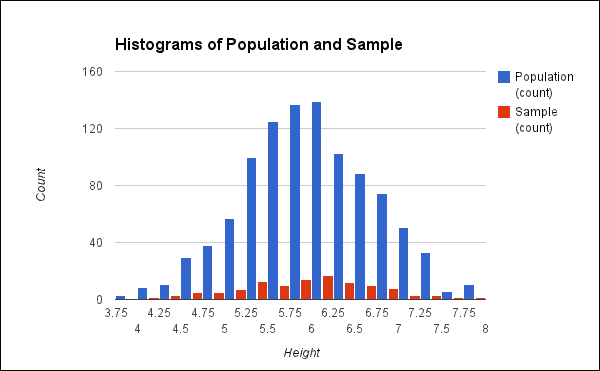

我们可以从前面的图表中看出，分布是相似的，但肯定不是相同的。实际上，总体的均值是 6.01，而样本的均值是 5.94。在这种情况下，它们并不太远，但有些样本会偏离得更远。

从理论上已经证明，总体均值与可能样本均值之间的差异将落在正态分布上。以下是从同一总体中抽取的 500 个样本的均值差异的图表：

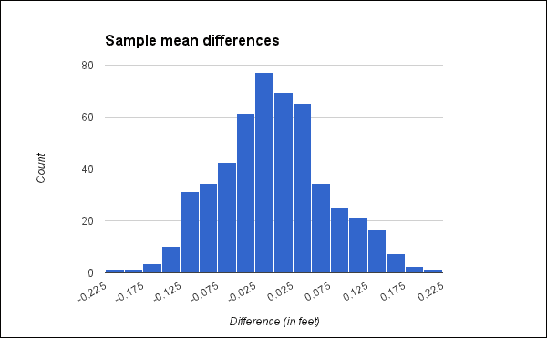

这个直方图清楚地表明，总体均值与样本均值之间的大差异是不太可能的，差异越大，其可能性就越小。这一点有几个重要原因。首先，如果我们知道均值差异的分布，它允许我们设定结果上的约束。如果我们正在处理样本数据，我们知道对于总体来说，相同的值将落在一定的范围内。

此外，如果我们知道差异的分布，那么我们就知道我们的结果是否具有显著性。这意味着我们可以拒绝均值相同的零假设。任何两个样本均值都应该落在相同的边界内。任何两组样本均值之间的大差异同样是不太可能的。

例如，一个样本将是对照组数据，另一个将是测试数据。如果这两个样本之间的差异足够大，以至于不太可能发生，那么我们可以推断测试行为产生了显著差异（假设实验的其他部分设计良好，其他因素没有使实验复杂化）。如果不太可能，那么我们说它是显著的，我们拒绝零假设。

根据我们正在测试的内容，我们可能对图表的左侧、右侧或两侧的结果感兴趣。也就是说，备择假设的测试统计量可能显著小于、显著大于或等于零假设。我们使用以下三种形式之一在符号中表达这一点。（这些使用字符 mu，*μ*，使用样本均值作为测试统计量。）在这些符号中的每一项，第一行陈述零假设，第二行陈述备择假设。例如，以下符号中的第一对表示零假设是测试样本的均值应该大于或等于对照组的均值，备择假设是测试样本的均值应该小于对照组的均值：

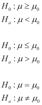

我们花时间更深入地理解这一点，因为它对于整个过程的其余部分是基本的。然而，如果你在这个时候还不理解，在整个章节的其余部分，我们还会继续讲解这一点。到结束时，你应该对样本均值差异的图表及其含义有一个很好的理解。

### 确定适当的测试

你还需要注意的另一个数据方面是数据的形状。这通常可以通过直方图轻松可视化。例如，下面的截图显示了一个正态分布和两个偏斜的分布：

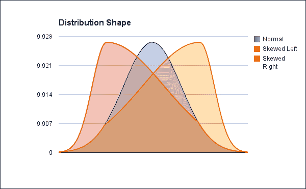

红色曲线左偏（看起来是深灰色），黄色曲线右偏（看起来是白色）。蓝色曲线（看起来是浅灰色）是一个没有偏斜的正态分布。

许多统计测试是为正态数据设计的，它们对于偏斜数据不会给出好的结果。例如，t 检验和回归分析仅对正态分布的数据给出好的结果。

### 选择显著性水平

接下来，我们需要选择我们想要在测试中达到的显著性水平。这是我们可以在拒绝零假设之前需要的确定性水平。更具体地说，这是结果可能是来自总体中异常样本的最大可能性，这会导致你错误地拒绝零假设。

通常，显著性水平，通常表示为 p 值，给出为 *p<0.05* 或 *p<0.01*。这意味着结果有不到 5%或 1%的可能性是由具有异常平均值的样本引起的。

如果我们查看之前给出的样本均值差异图，我们可以看到我们正在查看大约 2.4 英寸的差异以被认为是显著的。换句话说，基于这个总体，平均身高差异需要超过 2 英寸才能被认为是统计上显著的。

假设我们想看看男性和女性的平均身高是否有差异。如果平均身高差异只有 1 英寸，那可能是我们挑选的样本的结果。然而，如果平均身高差异是 2.4 英寸或更多，那就不太可能是样本的结果。

### 确定临界区域

现在我们已经确定了两个重要的信息：我们表达了我们零假设和备择假设，并且决定了一个所需的显著性水平。我们可以使用这两个信息来确定测试结果的临界区域，即我们可以拒绝零假设的区域。

记住，我们的假设可以采取三种形式。以下条件决定了我们的临界区域在哪里：

+   对于两个样本均值不等的备择假设，我们将进行双尾测试。

+   对于测试样本的平均值小于控制样本的平均值的备择假设，我们将进行单尾测试，临界区域位于图表的左侧。

+   而对于测试样本的平均值大于控制样本的平均值的备择假设，我们将进行单尾测试，临界区域位于图表的右侧。

下面的假设图表突出了曲线中临界区域发生的部分。曲线代表样本测试统计量的分布，阴影部分将是临界区域可能来自的区域。

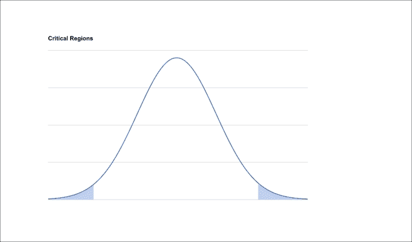

临界区域的精确大小由我们决定的 *p* 值确定。在所有情况下，临界区域的面积是整个曲线的 *p* 百分比。也就是说，如果我们决定尝试 *p<0.05*，整个曲线下的面积是 100，那么临界区域的面积将是 5。

如果我们正在进行双尾测试，那么该区域将分为两部分，所以在我们刚才概述的例子中，每边将有 2.5 的面积。然而，对于单尾测试，整个临界区域将落在一边。

### 计算测试统计量和其概率

现在我们必须计算测试统计量。根据数据的性质、样本以及你试图回答的问题，这可能涉及比较均值、学生 t 检验、X²检验或其他许多测试。

这些测试会给你一个数字，但直接解释它通常并不有帮助。相反，你需要计算该测试分布的 *p* 值。如果你是手动操作，这可能涉及在表中查找值，或者如果你使用软件程序，这通常作为结果的一部分自动完成。

在本章的几个部分中，我们将使用 Incanter，从计算测试统计量和其概率开始。它的函数通常返回测试值和 *p* 值。

### 决定是否拒绝零假设

现在，我们可以找到 *p* 的值与临界区域的关系，并确定我们是否可以拒绝零假设。

例如，假设我们决定我们想要达到的显著性水平是 *p<0.05*，而实际的 *p* 值是 *0.001*。这将使我们能够拒绝零假设。

然而，如果 *p* 的值为 *0.055*，我们将无法拒绝零假设。我们不得不假设备择假设是错误的，至少直到有更多信息为止。

## 抛硬币

现在我们已经了解了零假设检验的过程，让我们再通过一个例子来回顾一下这个过程。这应该足够简单明了，这样我们就可以专注于过程，而不是测试本身。

为了这个目的，我们将测试骰子是否是公平的。如果它是平衡的，那么任何给定面的期望概率应该是 1/6，或者说大约 16%。然而，如果骰子是偏心的，那么掷出某一面的概率应该大于 16%，而掷出其他面的概率应该小于 16%。

当然，通常这不是你需要担心的事情。但在你同意和你朋友一起用 3D 打印的骰子玩骰子游戏之前，你可能想测试一下它们。

对于这个测试，我掷了一次骰子 1,000 次。以下是如何每次出现每个面的次数的表格：

| 面数 | 频率 |
| --- | --- |
| 1 | 157 |
| 2 | 151 |
| 3 | 175 |
| 4 | 187 |
| 5 | 143 |
| 6 | 187 |

因此，我们可以看到频率相对接近，在 44 的范围内，但它们并不完全相同。这正是我们所预期的。问题是它们是否足够不同，以至于我们可以有把握地说骰子是偏心的。

### 制定初始假设

因此，我们怀疑我们的测试骰子是公平的，但我们不知道。我们将这样设定我们的假设：在每次掷骰子时，所有面出现的概率都是相等的。

### 陈述零假设和备择假设

我们的初始假设可以作为我们的零假设。在这种情况下，我们预计无法拒绝它。让我们明确地陈述这两个假设：

+   *H[0]*：所有面出现的概率在每次掷骰子时都是相等的。

+   *H[1]*：某一面的出现概率大于其他面。

在这种情况下，我们让 *H[0]* 等于两边的值相等，因为我们希望有更大的范围来定义什么是公平，并且在宣布骰子被加载之前，我们希望有很高的证明负担。

### 识别样本中的统计假设

对于我们的样本，我们将对有问题的骰子投掷 1,000 次。我们假设每次投掷都是相同的：使用大约相同的臂和手的动作，并且骰子落在平坦的表面上。我们还将假设在投掷之前，骰子被摇动得足够充分，以产生适当的随机性。

这样做，就不会因为骰子投掷的机制而引入偏差。

### 确定适当的测试

对于这个，我们将使用皮尔逊 Χ² 好拟合度测试。这个测试用于检验观察到的频率分布是否与理论分布相匹配。它是通过计算平方偏差的归一化总和来工作的。我们试图检验一些观察值是否与预期分布相匹配，因此这个测试非常适合。

我们将在下一分钟看到如何应用这个测试。

#### 选择显著性水平

证明骰子被加载确实需要比假设它是公平的更高的证明负担，但我们不希望门槛过高。因此，我们将使用 *p<0.05*。

#### 确定临界区域

Χ² 测试的输出符合 Χ² 分布，而不是正态分布，因此图表看起来不会相同。此外，Χ² 测试本质上是一侧的。当数值在右侧太远时，这表明数据与理论值匹配得不好。Χ² 分布左侧的值仅表明拟合非常好，这实际上并不是问题。

下面的图表比较了以 50 为中心的正态分布与具有 3 个自由度的 Χ² 分布：

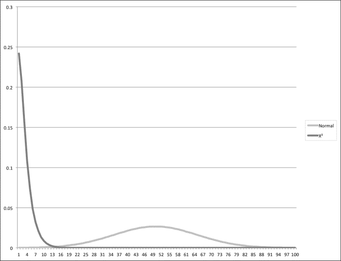

无论哪种方式，我们将使用的统计库（Incanter）将为我们处理这个问题。

#### 计算测试统计量和其概率

因此，让我们启动 Leiningen REPL 并看看我们能做什么。对于这个项目，我们将使用以下 `project.clj` 文件：

```py
(defproject nullh "0.1.0-snapshot"
  :dependencies [[org.clojure/clojure "1.5.1"]
                 [enlive "1.1.4"]
                 [http.async.client "0.5.2"]
                 [org.clojure/data.csv "0.1.2"]
                 [org.clojure/data.json "0.2.3"]
                 [me.raynes/fs "1.4.5"]
                 [incanter "1.5.4"]
                 [geocoder-clj "0.2.2"]
                 [geo-clj "0.3.5"]
                 [congomongo "0.4.1"]
                 [org.apache.poi/poi-ooxml "3.9"]]
  :profiles {:dev {:dependencies
                   [[org.clojure/tools.namespace "0.2.4"]]
                   :source-paths ["dev"]}})
```

首先，我们将加载 Incanter，然后创建一个包含我们数据的矩阵，最后用以下代码运行 Χ² 测试：

```py
user=> (require '[incanter.core :as i] '[incanter.stats :as s])
nil
user=> (def table (i/matrix [157 151 175 187 143 187]))
#'user/table
user=> (def r (s/chisq-test :table table))
#'user/r
user=> (pprint (select-keys r [:p-value :df :X-sq]))
{:X-sq 10.771999999999998, :df 5, :p-value 0.05609271590058857}

```

让我们更详细地看看这段代码：

+   函数 `incanter.stats/chisq-test` 返回大量信息，包括其自身的输入。因此，在最后显示之前，我过滤掉了大部分数据，只返回了我们特别感兴趣的三个键。以下就是这些键及其返回的值。

    +   `:X-sq`：这是 Χ² 统计量。这个量的值越高，表明数据与预期值不匹配。

    +   `:df`：这是自由度。这代表可以自由变化的参数数量。对于没有自然排序的名称数据（如骰子的滚动），这是数据可以取的值的数量减一。在这种情况下，由于它是一个六面的骰子，自由度是五。

    +   `:p-value`：这是我们一直在谈论的*p*的值。这是如果零假设为真，我们从Χ²检验中看到这些结果的概率。

现在我们有了这些数字，我们如何将它们应用到我们的假设中？

#### 决定是否拒绝零假设

在这个例子中，由于*p>0.05*，我们未能拒绝零假设。我们无法真正排除它，但也没有足够的证据来支持它。在这种情况下，我们可以假设骰子是公平的。

希望这个例子能让你更好地理解零假设检验过程及其工作原理。有了这些知识，让我们将注意力转向比想象中的骰子公平性更大的、更有意义的问题。

# 理解盗窃率

理解犯罪似乎是一个普遍存在的问题。以前，社会从神学的角度处理宇宙中的邪恶问题；今天，社会学家和犯罪学家使用各种工具和技术构建理论并研究社会。然而，无论问题如何表述，目标都是更好地理解为什么有些人以往往具有暴力和对周围人甚至对自己有害的方式违反社会规范。通过更好地理解这个问题，我们最终希望能够创建社会项目和政府政策，以最大限度地减少损害，并为所有相关方创造一个更安全、更公正的社会。

当然，作为从事数据分析的数据科学家和程序员，我们倾向于将这个问题作为一个数据问题来处理。这就是我们将在本章的其余部分所做的事情。我们将收集一些犯罪和经济数据，并寻找两者之间的联系。在分析过程中，我们将探索数据，试探性地提出一个假设，并对其进行数据检验。

我们将查看联合国提供的犯罪数据，并观察它与世界银行数据网站的数据之间有什么关系。

## 获取数据

为了获取数据，请执行以下步骤：

1.  首先，我们需要下载数据。

1.  对于犯罪数据，我们将访问联合国毒品和犯罪办公室（[`www.unodc.org/`](http://www.unodc.org/)）的网站。它发布了几年来世界各国犯罪数据。他们数据页面上的[`www.unodc.org/unodc/en/data-and-analysis/statistics/data.html`](http://www.unodc.org/unodc/en/data-and-analysis/statistics/data.html)，在页面标记为**犯罪统计**的部分提供了多个不同类别犯罪的 Excel 文件链接。

1.  您应该下载这些文件并将它们保存到`unodc-data`目录中。您可以在一分钟内从这些文件中提取数据。首先，您可以获取我们想要与犯罪数据相关联的数据。

1.  我们将从世界银行的数据网站（[`data.worldbank.org/`](http://data.worldbank.org/)）获取这些数据。导航网站有点复杂，并且在我的经验中，它经常变化。至少目前，这似乎是获取数据的最简单方法：

    1.  访问[指标](http://data.worldbank.org/indicator)页面。

    1.  在搜索框中输入`land area`并选择**土地面积（平方公里**），如图所示：

    

1.  然后点击**Go**按钮。

1.  在下一页，您可以选择以下几种格式下载数据集。选择**CSV**。

1.  下载数据并将其解压到名为`ag.lnd`的目录中，基于世界银行使用的指标代码。（您可以使用不同的目录名，但您需要修改随后的说明。）

我们还想要一些经济数据。为了获取这些数据，执行以下步骤：

1.  返回到**指标**页面。

1.  搜索**人均国民总收入**（它是搜索框的默认选择）。

1.  从过滤后的结果中选择**人均国民总收入，Atlas 方法（当前美元**）。

1.  点击**Go**。

1.  再次将数据作为 CSV 下载。

1.  将数据解压到名为`ny.gnp`的目录中。

到目前为止，你应该有一个包含多个子目录的数据文件目录。结构应该类似于以下截图：

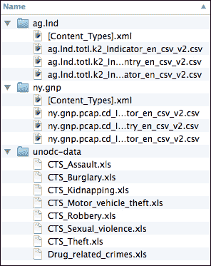

一些数据已经准备好了，但在我们使用它之前，我们需要从 Excel 文件中提取数据。让我们把注意力转向那里。

## 解析 Excel 文件

在我们能够从 Excel 文件中提取数据之前，我们需要弄清楚我们的输入将是什么。如果我们打开其中一个 Excel 文件，例如`CTS_Assault.xls`，我们会看到以下截图类似的内容：

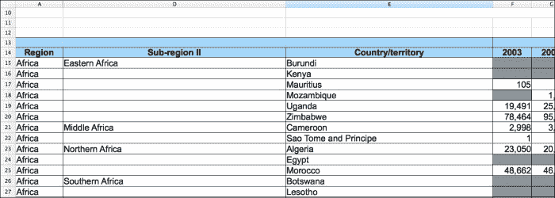

让我们列出一些我们需要考虑的工作表特征：

+   大约有十三行标题，其中大部分在先前的截图中被隐藏。

+   再次，先前的截图中没有显示，但一些文件有多个数据标签。

+   在 A 列和 D 列之间有一些隐藏的列。

+   子区域没有列在每个行上，所以我们需要某种方式来传递这个信息。

+   每个犯罪和国家的组合的年份都列在了一行上。我们可能希望将其转换，以便有一个犯罪列、一个国家列、一个年份列和一个数据值列。

+   有很多缺失数据。我们可以过滤掉这些数据。

要进入 Excel 文件，我们将使用 Apache POI 项目([`poi.apache.org/`](http://poi.apache.org/))。这个库提供了对 Microsoft Office 套件文件格式的访问。

我们将使用这个库在几个阶段从 Excel 文件中提取数据，如下所示：

1.  从 Excel 文件中提取原始数据行

1.  按地区、子地区和国家层次结构分组填充数据树

1.  将层次结构排列的数据扁平化回包含每行所有数据的映射序列

1.  将所有这些封装在一个易于使用的函数中

让我们按照前面的步骤继续本节的其余部分，最后我们将添加一个控制器函数来整合所有内容。

我们将所有这些代码保存在一个单独的模块中。下面的命名空间声明将包括我们需要的所有依赖项。对于包含所有这些内容的完整`project.clj`文件，请参考本章的代码下载。我给这个项目命名为`nullh`，所以我正在处理的文件名为`src/nullh/unodc.clj`。

```py
(ns nullh.unodc
  (:require [clojure.java.io :as io]
            [clojure.string :as str]
            [me.raynes.fs :as fs]
            [clojure.data.json :as json]
            [nullh.utils :as u])
  (:import
    [java.io FileInputStream]
    [org.apache.poi.ss.usermodel
     Cell CellStyle DataFormat Font RichTextString Row Sheet]
    [org.apache.poi.hssf.usermodel HSSFWorkbook]))
```

现在，我们可以开始填充这个命名空间。

## 提取原始数据

在处理过程的第一个阶段，我们将使用几个记录类型将数据读入一系列原始数据行，如下面的代码所示。第一个，`sheet-data`，将工作表的标题与其中的数据关联起来。第二个，`xl-row`，简单地存储每行单元格中的数据到命名字段中。

```py
(defrecord sheet-data [sheet-name sheet-rows])
(defrecord xl-row
  [sheet region sub-region country
   count-2003 count-2004 count-2005 count-2006 count-2007
   count-2008 count-2009 count-2010 count-2011
   rate-2003 rate-2004 rate-2005 rate-2006 rate-2007
   rate-2008 rate-2009 rate-2010 rate-2011])
```

当我们与工作表的数据和 API 交互时，我们将使用许多使访问工作表对象更像使用本地 Clojure 对象的一些实用工具。以下是一些这样的实用工具：

```py
(defn sheets [workbook]
  (->> workbook
    (.getNumberOfSheets)
    (range)
    (map #(.getSheetAt workbook %))))
(defn rows [sheet]
  (->> sheet
    (.getPhysicalNumberOfRows)
    (range)
    (map #(.getRow sheet %))
    (remove nil?)))
(defn cells [row]
  (->> row
    (.getPhysicalNumberOfRows)
    (range)
    (map #(.getCell row %))))
```

我们将花费大量时间访问单元格的值。我们希望围绕 Java 库的 API 创建一个更简单、更 Clojure 风格的包装器来访问它们。我们如何做将取决于单元格的类型，我们可以使用*多方法*来处理它的分派，如下面的代码所示：

```py
(defn cell-type [cell]
  (if (nil? cell)
    nil
    (let [cell-types {Cell/CELL_TYPE_BLANK   :blank
                      Cell/CELL_TYPE_BOOLEAN :boolean
                      Cell/CELL_TYPE_ERROR   :error
                      Cell/CELL_TYPE_FORMULA :formula
                      Cell/CELL_TYPE_NUMERIC :numeric
                      Cell/CELL_TYPE_STRING  :string}]
      (cell-types (.getCellType cell)))))
(defmulti cell-value cell-type)
(defmethod cell-value :blank   [_] nil)
(defmethod cell-value :boolean [c] (.getBooleanCellValue c))
(defmethod cell-value :error   [c] (.getErrorCellValue   c))
(defmethod cell-value :formula [c] (.getErrorCellValue   c))
(defmethod cell-value :numeric [c] (.getNumericCellValue c))
(defmethod cell-value :string  [c] (.getStringCellValue  c))
(defmethod cell-value :default [c] nil)
```

现在，有了这些方法，我们可以轻松地将数据读入一系列数据行。首先，我们需要使用以下代码打开工作簿文件：

```py
(defn open-file [filename]
  (with-open [s (io/input-stream filename)]
    (HSSFWorkbook. s)))
```

我们可以使用以下代码将每个工作表读入`sheet-data`记录中：

```py
(defn get-sheet-data [sheet]
  (->sheet-data (.getSheetName sheet) (rows sheet)))
```

行本身将需要经过一系列的转换，所有这些转换都不涉及工作表名称字段。为了方便起见，我们将定义一个高阶函数，它将函数映射到行字段上，如下所示：

```py
(defn on-rows [sheet f]
  (assoc sheet :sheet-rows (f (:sheet-rows sheet))))
```

第一行转换将涉及跳过每个工作表的头行，如下面的代码所示：

```py
(defn first-cell-empty? [cells]
  (empty? (cell-value (first cells))))
(defn skip-headers [sheet]
  (on-rows sheet (fn [r]
                   (->> r
                     (drop-while #(first-cell-empty? (cells %)))
                     (drop 1)
                     (take-while #(not (first-cell-empty? %)))))))
```

现在，我们可以将`sheet-data`记录的序列取出来，通过将工作表名称添加到行数据中来进行扁平化，如下所示：

```py
(defn row-values [sheet-name row]
  (conj (mapv cell-value (cells row)) sheet-name))
(defn sheet-data->seq [sheet]
  (map #(row-values (:sheet-name sheet) %) (:sheet-rows sheet)))
```

我们确实需要逐行处理并重新排列字段顺序，确保它有恰好正确的字段数量，如下面的代码所示：

```py
(defn clean-row [row]
  (u/pad-vec 22
             (concat (list (last row) (first row))
                     (take 11 (drop 3 row))
                     (drop 15 row))))
```

现在我们已经稍微加固了数据，我们可以将 Clojure 向量填充到`xl-row`记录中，如下所示：

```py
(defn seq->xl-row [coll] (apply ->xl-row coll))
```

最后，我们有一系列相当干净的行数据。

### 构建数据树

不幸的是，我们还没有解决一些问题，例如子区域在每一行中并未被填充。现在让我们来处理这个问题。

我们将通过将记录序列转换为数据层次树来解决这个问题。树由多个记录类型表示，如下述代码所示：

```py
(defrecord region [region-name sub-regions])
(defrecord sub-region [sub-region-name countries])
(defrecord country [country-name counts rates sheet])
(defrecord yearly-data
   [year-2003 year-2004 year-2005 year-2006 year-2007 year-2008
    year-2009 year-2010 year-2011])
```

要构建树，我们将有一系列函数。每个函数都接受将进入一个树或子树的组数据。它填充树的这部分并返回它。

这些函数中的第一个是`xl-rows->regions`。它接受一个`xl-rows`序列，按区域分组，并为它构建一个`region`记录的树，如下述代码所示：

```py
(defn xl-rows->regions [coll]
  (->> coll
    (group-by :region)
    (map #(->region
            (first %) (xl-rows->sub-regions (second %))))))
```

构建此树最复杂的部分是处理缺失的子区域。我们将使用三个函数来处理这个问题。第一个函数`conj-into`，将数据结合到映射中的一个值上，或者如果没有该键的数据，则添加一个包含数据的新的向量。第二个函数`fold-sub-region`，根据行中引用的子区域或最后指定的子区域将每一行折叠到一个映射中。最后，`xl-rows->sub-regions`从一个区域的行序列中取出，将它们划分为子区域，并为它们创建`sub-region`记录，如下述代码所示：

```py
(defn conj-into [m k v]

  (if (contains? m k)
    (assoc m k (conj (get m k) v))
    (assoc m k [v])))
(defn fold-sub-region [state row]
  (let [[current accum] state]
    (if (str/blank? (:sub-region row))
      [current
       (conj-into accum current (assoc row :sub-region current))]
      (let [new-sub-region (:sub-region row)]
        [new-sub-region
         (conj-into accum new-sub-region row)]))))
(defn xl-rows->sub-regions [coll]
  (->> coll
    (reduce fold-sub-region [nil {}])
    second
    (map #(->sub-region
            (first %) (xl-rows->countries (second %))))))
```

现在我们已经确定了子区域，我们可以为每个国家构建一个树。为此，我们将计数数据和比率数据拉入它们自己的结构中，并使用以下代码将它们全部组合到一个`country`记录中：

```py
(defn xl-rows->countries [coll]
  (->> coll
    (group-by :country)
    (map #(let [[country-name [row & _]] %]
            (->country country-name
                       (xl-row->counts row)
                       (xl-row->rates row)
                       (:sheet row))))))
```

计数和比率由相同的记录类型表示，因此我们将使用一个共享函数从行中提取字段，以填充类型中的字段，如下述代码所示：

```py
(defn xl-row->yearly [coll fields]
  (apply ->yearly-data (map #(get coll %) fields)))
(defn xl-row->counts [coll]
  (xl-row->yearly
    coll
    [:count-2003 :count-2004 :count-2005 :count-2006 :count-2007
     :count-2008 :count-2009 :count-2010 :count-2011]))
(defn xl-row->rates [coll]
  (xl-row->yearly
    coll
    [:rate-2003 :rate-2004 :rate-2005 :rate-2006 :rate-2007
     :rate-2008 :rate-2009 :rate-2010 :rate-2011]))
```

这些函数都构建了存储在表格中的数据层次结构。

### 剪枝数据树

我们反转这个过程以再次展平数据。在这个过程中，这隐式地将缺失的子区域填充到所有行中。让我们看看这是如何工作的。

首先，我们取一个区域序列，并将其转换为`xl-row`记录序列，如下述代码所示：

```py
(defn region->xl-rows [tree nil-row]
  (let [region-row (assoc nil-row :region (:region-name tree))]
    (mapcat #(sub-regions->xl-rows % region-row)
            (:sub-regions tree))))
(defn regions->xl-rows [region-coll]
  (let [nil-row (seq->xl-row (repeat 22 nil))]
    (mapcat #(region->xl-rows % nil-row) region-coll)))
```

就像之前一样，这项工作将被委派给其他功能；在这种情况下，`sub-regions->xl-rows`，它再次委派给`country->xl-rows`。在下述代码中的第二个函数稍微长一些（因此我已经从中省略了一些行），但它们在概念上都很简单：

```py
(defn country->xl-rows [tree sub-region-row]
  (let [counts (:counts tree), rates (:rates tree)]
    (assoc sub-region-row
           :sheet (:sheet tree)
           :country (:country-name tree)
           :count-2003 (:year-2003 counts)
           :count-2004 (:year-2004 counts)
           ;; ...
           :rate-2003 (:year-2003 rates)
           :rate-2004 (:year-2004 rates)
           ;; ...
           )))
(defn sub-regions->xl-rows [tree region-row]
  (let [sub-region-row (assoc region-row :sub-region
                              (:sub-region-name tree))]
    (map #(country->xl-rows % sub-region-row) (:countries tree))))
```

到目前为止，我们有一个包含缺失子区域的数据行序列。但我们还没有完成。

### 将一切整合起来

我们将提供几个级别的函数来简化这个过程。首先，一个将我们迄今为止看到的一切联系起来的函数。它接受一个文件名，并返回一个`xl-row`记录序列，如下所示：

```py
(defn read-sheets [filename]
  (->> filename
    (open-file)
    (sheets)
    (map get-sheet-data)
    (map skip-headers)
    (map (fn [s] (on-rows s #(remove empty? %))))
    (mapcat sheet-data->seq)
    (map clean-row)
    (map seq->xl-row)
    (xl-rows->regions)
    (regions->xl-rows)))
```

就这样。我们已经读入了数据。它已经经过了一些处理，但仍然相当原始。以下是一个示例行：

```py
{:sheet "CTS 2012 Domestic Burglary",
 :region "Africa",
 :sub-region "Middle Africa",
 :country "Sao Tome and Principe",
 :count-2003 nil,
 :count-2004 nil,
 :count-2005 nil,
 :count-2006 2.0,
 :count-2007 0.0,
 :count-2008 2.0,
 :count-2009 5.0,
 :count-2010 16.0,
 :count-2011 20.0,
 :rate-2003 nil,
 :rate-2004 nil,
 :rate-2005 nil,
 :rate-2006 1.290572368845583,
 :rate-2007 0.0,
 :rate-2008 1.2511573205214825,
 :rate-2009 3.0766390794695875,
 :rate-2010 9.673694202434143,
 :rate-2011 11.867604998635224}
```

我们仍然需要稍作清理并将数据透视，以便将每个数据值放入单独的行中。而不是有一个包含 `:count-2003`、`:count-2004` 等等的行，我们将有多个行，每个行都有 `:count` 和 `:year`。

接下来，让我们把注意力转向那里。

### 数据转换

到目前为止，我们只是轻微地清理了我们数据的一部分。我们甚至还没有查看我们想要与犯罪数据相关联的数据。此外，数据的形状对于我们想要进行的分析来说很尴尬，因此我们需要按照之前描述的方式对其进行数据透视。我们将在下一分钟了解更多关于这一点。

在这个处理阶段，我们希望将所有代码放入一个新的文件中。我们将把这个文件命名为 `src/nullh/data.clj`，其命名空间声明如下：

```py
(ns nullh.data
  (:require [incanter.core :as i]
            [incanter.io :as iio]
            [clojure.set :as set]
            [clojure.string :as str]
            [clojure.data.csv :as csv]
            [clojure.data.json :as json]
            [clojure.java.io :as io]
            [me.raynes.fs :as fs]
            [nullh.unodc :as unodc]
            [nullh.utils :as u]))
```

现在，我们将开始使用 Incanter 数据集。到目前为止，这本书中我们并没有太多使用 Incanter，这有点不寻常，因为 Incanter 是 Clojure 中处理数字和统计数据的常用库之一。它功能强大且灵活，使得数据处理变得容易。

让我们把从 Excel 文件中读取的数据导入到 Incanter 数据集中。我们需要将数据读入一个长序列，提取数据字段的键，然后按照以下方式创建数据集：

```py
(defn read-cts-data [dirname]
  (let [input (mapcat unodc/read-sheets (u/ls dirname))
        cols (keys (first input))]
    (i/dataset cols (doall (map #(map second %) input)))))
```

现在，我们可以将我们从世界银行下载的数据读入另一个数据集中。这两个数据文件具有大致相同的字段，因此我们可以为两者使用相同的函数。不幸的是，我们需要自己加载 CSV，因为 Incanter 的自省并没有给我们想要的结果。因此，我们还将包括一些函数，在读取数据时将其转换为双精度浮点数，并定义数据包含的列，如下所示：

```py
(def headers [:country-name :country-code :indicator-name
              :indicator-code :1961 :1962 :1963 :1964 :1965 :1966
              :1967 :1968 :1969 :1970 :1971 :1972 :1973 :1974
              :1975 :1976 :1977 :1978 :1979 :1980 :1981 :1982
              :1983 :1984 :1985 :1986 :1987 :1988 :1989 :1990
              :1991 :1992 :1993 :1994 :1995 :1996 :1997 :1998
              :1999 :2000 :2001 :2002 :2003 :2004 :2005 :2006
              :2007 :2008 :2009 :2010 :2011 :2012 :2013])
(defn ->double [x] (if (str/blank? x) nil (Double/parseDouble x)))
(defn coerce-row [row]
  (let [[x y] (split-at 4 row)]
    (concat x (map ->double y))))
(defn read-indicator-data [filename]
  (with-open [f (io/reader filename)]
    (->> f
      csv/read-csv
      (drop 3)
      (map coerce-row)
      doall
      (i/dataset headers))))
```

我们可以使用 `read-indicator-data` 函数来加载我们之前下载的两个世界银行指标的数据。

现在，我们希望将联合国毒品和犯罪问题办公室的所有数据与任何一个世界银行数据集合并。在我们这样做的时候，我们也会将数据表进行数据透视，这样就不会为每年的每个年份有一个列，而是一个包含年份和一个包含该年值的列。同时，我们将删除缺失数据的行，并汇总每个国家每年所有犯罪的计数。

### 数据源合并

将两个数据源合并相对简单，可以使用以下代码完成：

```py
(defn join-all [indicator cts]
  (i/$join [:country-name :country] indicator cts))
```

实际上，我们只是让 Incanter 通过匹配世界银行数据的 `:country-name` 字段和联合国毒品和犯罪问题办公室数据的 `:country` 字段，在字段上合并两个数据结构。

### 数据透视

现在数据已经合并，我们可以进行数据透视。最终，我们希望每行都有以下字段：

+   `region`

+   `subregion`

+   `country`

+   `country-code`

+   `indicator`

+   `indicator-code`

+   `crime`

+   `year`

+   `count`

+   `rate`

+   `indicator-value`

如您所见，其中一些字段来自联合国毒品和犯罪问题办公室数据，而另一些来自世界银行数据。

我们将在一系列映射上执行此翻译，而不是在数据集上。我们将从以下代码开始：

```py
(defn pivot-map [m]
  (let [years [2003 2004 2005 2006 2007 2008 2009 2010 2011]]
    (map #(pivot-year m %) years)))
(defn pivot-data [map-seq] (mapcat pivot-map map-seq))
```

首先，我们使用`->maps`将数据集转换为映射序列。然后，将处理工作委托给`pivot-map`函数。这个函数为每年的数据执行数据透视。

我们分别对每年的数据进行数据透视。我们通过反复转换数据映射的行来实现这一点。这是一个很好的例子，说明了 Clojure 的不可变性如何使事情变得简单。我们不必担心复制映射或覆盖任何数据。我们只需修改原始数据多次，并将每次转换过程的结果保存为单独的新数据行。

这个过程本身相当简单。首先，我们使用年份为感兴趣的领域创建关键词。接下来，我们从原始数据映射中选择我们想要保留的行。然后我们重命名几个，使它们更清晰。最后，我们将年份添加到输出映射中，如下所示：

```py
(defn pivot-year [m year]
  (let [count-key (keyword (str "count-" year))
        rate-key (keyword (str "rate-" year))
        year-key (keyword (str year))]
    (-> m
      (select-keys [:region :sub-region :country :country-code
                    :indicator :indicator-code
                    :sheet count-key rate-key year-key])
      (set/rename-keys {:sheet :crime,
                        count-key :count,
                        rate-key :rate,
                        year-key :indicator-value})
      (assoc :year year))))
```

就这样。这应该会使数据处理更容易。我们可以在数据上做一些更多的转换，并进一步清理一下。

### 过滤缺失数据

首先，数据中有很多空白，我们不希望为此担心。因此，如果某行缺少三个数据字段中的任何一个（`:count`、`:rate`或`:indicator-value`），让我们用以下代码将其删除：

```py
(defn remove-missing [coll]
  (let [fields [:count :rate :indicator-value]
        has-missing (fn [r] (some nil? (map r fields)))]
    (remove has-missing coll)))
```

我们只是检查这些字段中是否有`nil`值。如果有，我们就删除该行。

### 整合所有内容

让我们围绕这个过程创建一个包装函数。这将帮助我们保持一致性，并使库更容易使用。这个函数从 UNODC 和世界银行的一个数据集中加载数据。在返回 Incanter 数据集之前，它将数据连接、数据透视和删除缺失的行，如下面的代码所示：

```py
(defn ->maps [dset]
  (let [col-names (i/col-names dset)]
    (map #(zipmap col-names %) (i/to-list dset))))
(defn load-join-pivot [cts-dir data-file]
  (let [cts (read-cts-data cts-dir)
        indicator-data (read-indicator-data data-file)]
    (->> (join-all indicator-data cts)
      ->maps
      pivot-data
      remove-missing
      i/to-dataset)))
```

让我们使用这些函数来加载一个数据集，如下所示：

```py
(def d (d/load-join-pivot
         "unodc-data"
         "ag.lnd/ag.lnd.totl.k2_Indicator_en_csv_v2.csv"))
```

到目前为止，数据已经处于相当好的状态——实际上，这可能是这些数据可能达到的最佳状态（更多关于这一点将在本章末尾讨论）。所以，让我们看看数据中有什么，以及它能告诉我们什么。

# 探索数据

让我们探索一下，尝试了解数据的感受。首先，让我们尝试为各种数据集获取一些汇总统计。之后，我们将生成一些图表，以更直观地了解数据中包含的内容以及它们之间的关系。

## 生成汇总统计

Incanter 使生成汇总统计变得容易。您可以将数据集传递给`incanter.stats/summary`函数。它返回一个映射序列。每个映射代表原始数据集中每列的汇总数据。这包括数据是否为数值。对于名义数据，它返回一些样本项及其计数。对于数值数据，它返回平均值、中位数、最小值和最大值。

### 汇总 UNODC 犯罪数据

如果我们加载数据并过滤“盗窃”犯罪，我们可以如下获取这些字段的汇总统计：

```py
(s/summary
  (i/$where {:crime {:$eq "CTS 2012 Burglary"}} by-ag-lnd))
```

如果我们分解它输出的数据结构，以下是对主要数据字段的摘要统计：

| 列 | 最小值 | 最大值 | 平均值 | 中位数 |
| --- | --- | --- | --- | --- |
| **比率** | 0.1 | 1939.23 | 376.4 | 292.67 |
| **计数** | 11 | 443010 | 60380 | 17184 |

因此，从前面的表中，我们看到这两个字段都有很大的变异性，并且有些偏斜，基于平均值和中位数之间的差异。这两个具有相似的分布是可以预料的，因为比率是从计数中派生出来的。

图表和图形也有助于更好地理解我们的数据。Incanter 使生成图表变得相当简单。让我们看看如何做到这一点。

首先，我们将加载数据并旋转它，因为这将使从图表中提取数据更容易。在这个例子中，我们将加载与世界银行土地面积数据相结合的 UNODC 犯罪数据，如下所示：

```py
(def by-ag-lnd
  (d/load-join-pivot
    "unodc-data"
    "ag.lnd/ag.lnd.totl.k2_Indicator_en_csv_v2.csv"))
```

接下来，我们将过滤数据集，只包含以下代码所示的盗窃数据：

```py
(def burglary
  (i/$where {:crime {:$eq "CTS 2012 Burglary"}} by-ag-lnd))
```

最后，我们使用`incanter.charts/histogram`函数创建图表，并使用`incanter.core/view`函数以下代码将其显示在屏幕上：

```py
(def h
  (c/histogram (i/sel burglary :cols :count)
                :nbins 30
                :title "Burglary Counts"
                :x-label "Burglaries"))
(i/view h)
```

以下是对`:count`字段的直方图：

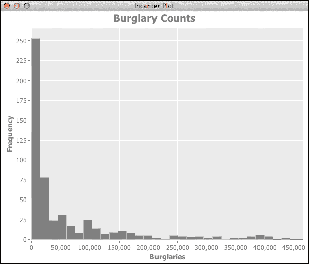

从这张图中，我们可以看到这些数据并不遵循正态分布。其他数据如何对应？

### 总结世界银行土地面积和 GNI 数据

我们可以使用相同的函数`incanter.stats/summary`来生成以下表格中给出的土地面积数据的相同统计信息：

| 列 | 最小值 | 最大值 | 平均值 | 中位数 |
| --- | --- | --- | --- | --- |
| **土地面积** | 300 | 16381390 | 822324 | 100250 |
| **GNI** | 240 | 88500 | 17170 | 8140 |

世界银行土地面积数据的分布与犯罪数据相似。当然，较小、较不富裕的国家更多。土地面积值的分布如下所示：

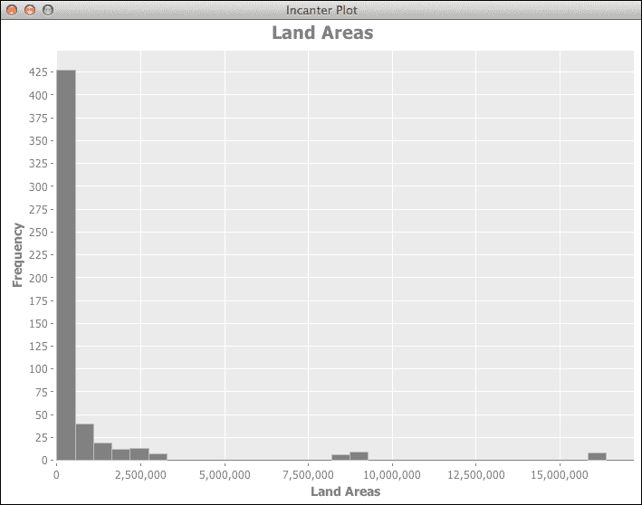

以下是对 GNI 值的分布：

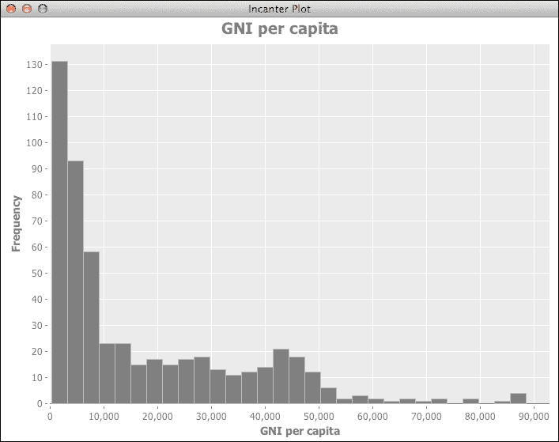

这让我们对数据有了些了解。所有这些都遵循指数分布，正如我们可以在下一个图表中看到的那样：

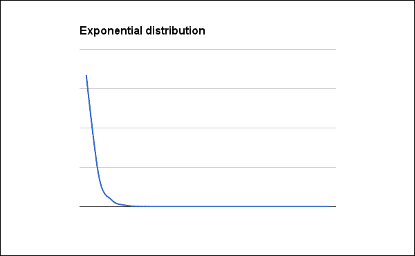

这清楚地表明，所有具有指数分布的图表都以陡峭的下降开始，并迅速平坦化成接近直线。

## 生成更多图表和图形

一些更多的图表可以帮助我们开始理解这些变量之间的关系。我们将编写一个函数来绘制任何犯罪与世界银行指标数据结合到当前数据集中的关系图。

首先，我们需要一个实用函数来根据犯罪过滤数据行。这是一个面向数据的函数，因此我们将它存储在`nullh.data`中，如下代码所示：

```py
(defn by-crime [dset crime-label]
  (i/$where {:crime {:$eq crime-label}} dset))
```

下一个函数 `plot-crime` 提取数据点，然后将所有内容传递给 `incanter.charts/scatter-plot` 函数以生成图表：

```py
(defn plot-crime [dset indicator-label crime-label]
  (let [x (i/sel dset :cols :indicator-value)
        y (i/sel dset :cols :rate)
        title (str indicator-label " and " crime-label)]
    (c/scatter-plot x y
                    :title title
                    :x-label indicator-label
                    :y-label crime-label)))
```

这使得快速、直观地比较不同类型犯罪的数据及其与世界银行指标数据的关系变得容易。

例如，以下代码显示了盗窃（"CTS 2012 Burglary"）与土地面积数据（`plot-crime` 函数位于 `nullh.charts` 命名空间中，别名为 `n-ch`）之间的关系：

```py
(def by-ag-lnd
  (d/load-join-pivot
    "unodc-data"
    "ag.lnd/ag.lnd.totl.k2_Indicator_en_csv_v2.csv"))
(def ag-plot
  (n-ch/plot-crime (d/by-crime by-ag-lnd "CTS 2012 Burglary")
                   "Land Area" "Burglary"))
(i/view ag-plot)
```

上述代码生成以下图表：

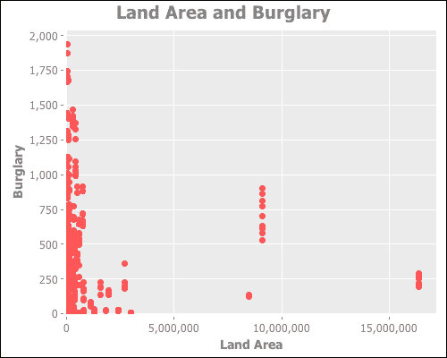

这组数据似乎有一些奇怪的特征。看看土地面积大约为 9,000,000 的数据点行，从每年约 500 起盗事件延伸到近 1,000 起盗事件。这是怎么回事？

好吧，当我们思考这个问题时，一个国家的土地面积很少改变，但如果一个国家有几年的盗窃数据，我们将多次表示该土地面积。我们可以通过获取数据的平均值来简化数据。

为了做到这一点，我们将每个国家的所有年度数据汇总。为此，我们将使用以下函数：

```py
(defn aggregate-years-by-country
  ([dset] (aggregate-years-by-country dset :mean))
  ([dset by]
   (let [data-cols [:count :rate :indicator-value]]
     (->> [:count :rate :indicator-value]
       (map #(i/$rollup by % :country dset))
       (reduce #(i/$join [:country :country] %1 %2))))))
```

上述代码使用 `incanter.core/$rollup` 函数获取每个国家的每个数据列的平均值。然后使用 `reduce` 和 `incanter.core/$join` 将数据折叠回一个数据集。

当我们绘制汇总数据时，我们得到以下图表：

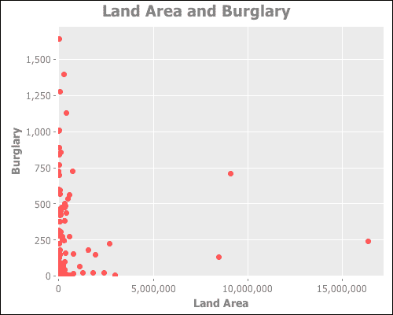

这使得这两个变量之间可能不存在关系的可能性更加明确。

以下图表比较了盗窃数据与人均国民总收入。由于该指标通常在数据所代表的时间跨度内变化不大（中国和一些其他国家除外），我们再次汇总了每个国家的数据。

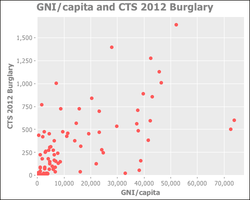

这组数据似乎在这两个变量之间存在某种相关性，尽管可能不是很强。这是我们能够测试的。

# 进行实验

现在，我们已经准备好制定和执行实验。让我们再次回顾执行这些步骤。

## 制定初步假设

在这个例子中，我们的假设是*人均国民总收入与盗窃率之间存在关系*。我们可以进一步强化这个假设，具体说明更高的国民总收入与更高的盗窃率相关，这在某种程度上是反直觉的。

## 提出零假设和备择假设

在我们的工作假设陈述的基础上，我们现在可以制定零假设和备择假设。

+   *H[0]*：人均国民总收入与国家的盗窃率之间没有关系。

+   *H[1]*：人均国民总收入与国家的盗窃率之间存在关系。

这些陈述将引导我们完成剩余的过程。

## 识别样本中的统计假设

在这个数据中，有一些假设我们需要注意。首先，由于犯罪数据来自多个来源，其中的一致性将非常小。

首先，这些犯罪的定义在不同国家之间可能差异很大。此外，数据收集程序和实践将使这些数字的可靠性变得困难。

世界银行的数据可能更一致——像土地面积这样的东西可以测量和外部验证——但国民总收入（GNI）可能依赖于本国自己的报告，而这可能经常被夸大，因为各国试图让自己看起来更重要、更有影响力。

此外，数据中还有很多漏洞。因为我们没有对国家名称进行标准化，所以没有美国的观测数据。在一个数据集中它被列为“United States”，而在另一个数据集中则被列为“United States of America”。虽然这个单一实例很容易纠正，但我们真的需要对国家名称进行更彻底的审计。

因此，虽然我们没有需要考虑的系统性的东西，但数据中存在几个问题，我们需要记住。我们将在本章末尾更详细地回顾这些问题。

## 确定适当的测试

现在我们必须确定要运行哪些测试。有些测试适用于不同类型的数据和不同的数据分布。例如，名义数据和数值数据需要非常不同的分析。

如果关系已知是线性的，我们可以使用皮尔逊相关系数。不幸的是，我们数据中的关系似乎比这更复杂。

在这种情况下，我们的数据是连续的数值数据。我们感兴趣的是两个变量之间的关系，但它们都不是真正独立的，因为我们根据前面给出的假设描述，并不真正确定采样是如何进行的。

由于所有这些因素，我们将使用斯皮尔曼秩相关。

我是如何选择的？这相当简单，但复杂到我们不会在这里详细介绍细节。

主要观点是，你使用的统计测试很大程度上取决于你数据的性质。这部分知识主要来自学习和经验，但一旦你确定了你的数据，一本好的统计教科书或任何在线流程图都可以帮助你选择正确的测试。

但斯皮尔曼秩相关系数是什么？让我们花一分钟时间来了解一下。

### 理解斯皮尔曼秩相关系数

斯皮尔曼秩相关系数衡量两个变量之间的关联。当只有数据的秩是已知的时候，它特别有用，但它也可以在其他情况下有用。例如，它不会被异常值所影响，因为它只看秩。

这个统计量的公式如下：


*n* 的值是样本的大小。*d* 的值是两个变量每个观测值的等级差。例如，在我们一直在看的数据中，丹麦在盗窃方面排名第一（有趣），但在人均 GNI 方面排名第三。因此，斯皮尔曼等级相关系数将查看 *3 – 1 = 2*。

*0* 系数表示两个变量之间没有关系，而 *-1* 或 *+1* 系数表示两个变量完全相关。也就是说，数据可以用一个 **单调** 函数完美描述：一个从变量到另一个变量的函数，它保留了项目的顺序。该函数不必是线性的。事实上，它很容易描述一个曲线。但它确实捕捉了数据。

系数并没有给我们统计显著性（*p* 值）。为了得到它，我们只需要知道当 *n ≥ 10* 时，斯皮尔曼等级相关系数近似服从正态分布。它的均值为 *0*，标准差如下所示：

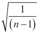

使用这些公式，我们可以计算测试系数的 *z* 分数。*z* 分数是数据点与均值的距离，以标准差为单位。*p* 值与 *z* 分数密切相关。因此，如果我们知道 *z* 分数，我们也知道 *p* 值。

## 选择显著性水平

现在，我们需要选择显著性需要达到多高的标准。目标 *p* 值被称为 *α* 值。通常，*α = 0.05* 是常用的，尽管如果你想要更加小心，*α = 0.01* 也是正常的。

对于这个测试，我们将使用 *α = 0.05*。

## 确定临界区域

为了拒绝零假设，我们将接受任何类型的关系，因此这将是一个双尾测试。这意味着临界区域将来自曲线的两侧，其面积被平均分配到每侧的 0.025。

这对应于一个 *z* 分数小于 *-1.96* 或大于 *1.96*。

## 计算测试统计量和其概率

我们可以使用 Incanter 的函数 `incanter.stats/spearmans-rho` 来计算斯皮尔曼系数。然而，它不仅计算 *z* 分数。我们可以轻松创建以下封装所有这些计算的函数。我们将将其放入 `src/nullh/stats.clj`。我们将命名该函数为 `spearmans`。

```py
(defn spearmans
  ([col-a col-b] (spearmans col-a col-b i/$data))
  ([col-a col-b dataset]
   (let [rho (s/spearmans-rho
               (i/sel dataset :cols col-a)
               (i/sel dataset :cols col-b))
         n (i/nrow dataset)
         mu 0.0
         sigma (Math/sqrt (/ 1.0 (- n 1.0)))
         z (/ (- rho mu) sigma)]
     {:rho rho, :n n, :mu mu, :sigma sigma, :z z})))
```

现在，我们可以在数据集上运行这个测试。让我们从开始，使用以下命令从磁盘加载数据集：

```py
user=> (def by-ny-gnp
 (d/load-join-pivot
 "unodc-data"
 "ny.gnp/ny.gnp.pcap.cd_Indicator_en_csv_v2.csv"))
#'user/by-ny-gnp
user=> (def burglary (d/by-crime by-ny-gnp "CTS 2012 Burglary"))
#'user/burglary
user=> (pprint (n-stat/spearmans :indicator-value :rate burglary))
{:rho 0.6938241467993876,
 :n 537,
 :mu 0.0,
 :sigma 0.04319342127906801,
 :z 16.063190325134588}

```

前面的命令使我们能够从前到后查看过程，我们可以考虑输出结果来了解测试情况。

## 决定是否拒绝零假设

最终的 *z* 分数是 16.03。按照书本上的说法，这么高的 *z* 分数通常甚至不会包含在图表中。这将是一个显著的结果，这将使我们能够拒绝零假设。因此，我们可以得出结论，人均 GNI 与盗窃率之间存在关系。

# 结果的解释

当然，结果并没有告诉我们太多。首先，我们必须记住，仅仅因为存在关系，并不意味着因果关系。此外，由于结果非常显著，我们可能应该对结果及其是否由数据或程序中的某些错误引起持怀疑态度。

我们已经讨论了数据中的问题，其中一些可能是有责任的。特别是，由于标准化问题，一些数据缺失，这可能会改变结果。另一种可能性是，工业化国家记录得更好，因此它们似乎有更多的盗窃案。

# 摘要

因此，在本章中，我们学习了如何通过零假设检验来帮助我们构建分析。有一个经过深思熟虑和标准化的程序也确保我们在分析中是彻底的。例如，在本章中，我们被迫面对我们所处理的数据的丑陋真相，这使我们对我们后来取得的结果有了深刻的见解。

在下一章中，我们将有机会再次使用这些技术，当我们研究在网站上执行 A/B 测试时。
