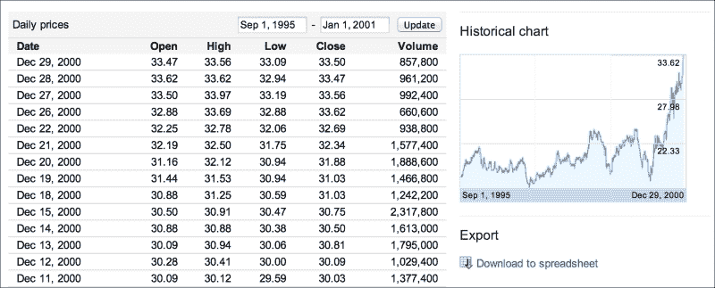
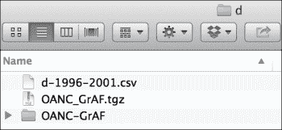
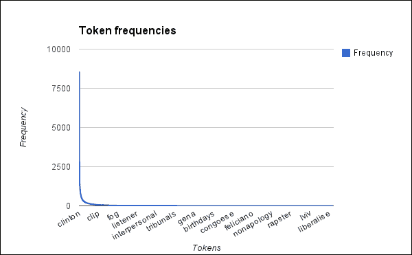
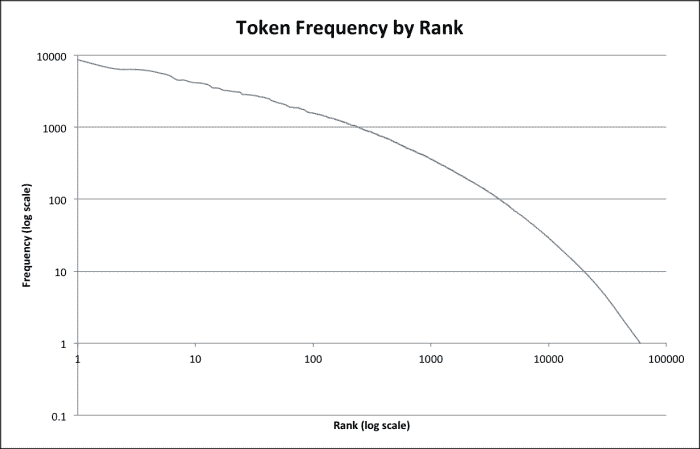
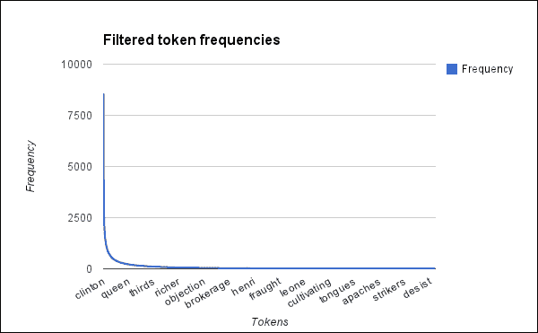
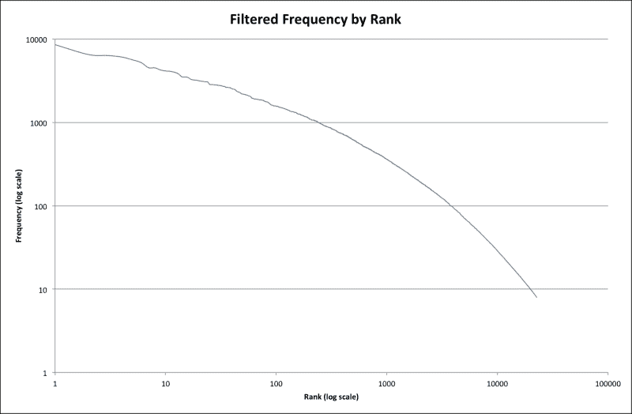
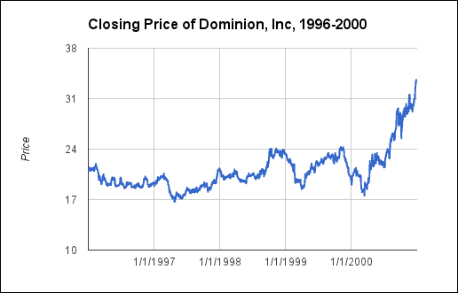
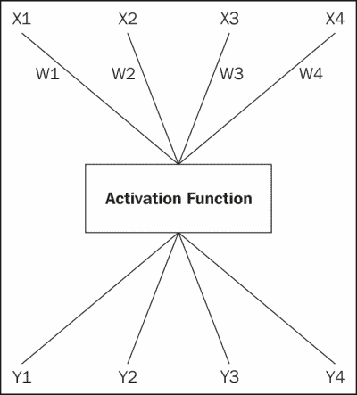
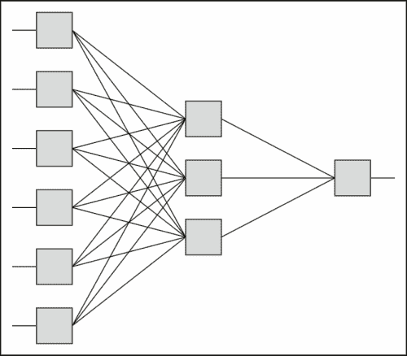

# 第十章。股票数据建模

自动化股票分析最近受到了很多关注。高频交易公司是一个热点。人们要么认为它们对市场有利，增加了流动性，要么认为它们是末日的前兆。较小的交易者也以较慢的速度加入了进来。一些网站，如 Quantopian ([`www.quantopian.com/`](https://www.quantopian.com/)) 和 AlgoTrader ([`www.algotrader.ch/`](http://www.algotrader.ch/)) 提供了允许您创建自动化交易模型的服务。许多其他服务允许您使用自动化分析来指导您的交易决策。

无论你对这种现象的看法如何，它都是一个数据量庞大、亟待分析的区域。它也是一个很好的领域，可以尝试一些分析和机器学习技术。

对于本章，我们将寻找未来新闻文章和股票价格之间的关系。

在本章的进程中，我们将涵盖以下主题：

+   学习金融数据分析

+   设置我们的项目和获取我们的数据

+   准备数据

+   分析文本

+   分析股票价格

+   使用神经网络在文本和股票价格中学习模式

+   使用此系统预测未来

+   讨论这些系统的局限性

# 了解金融数据分析

金融业一直高度依赖数据。收益报告、预测和投资组合管理只是利用数据量化决策的一些领域。因此，金融数据分析及其相关领域——金融工程——是极其广泛的领域，难以在有限的空间内总结。

然而，最近，量化金融、高频交易和类似领域受到了很多关注，并真正地展现了自己的实力。正如我提到的，有些人讨厌它们以及市场似乎增加的波动性。其他人则认为，它们带来了必要的流动性，有助于市场更好地运行。

所有这些领域都将统计或机器学习方法应用于金融数据。其中一些技术可能相当简单。其他则更为复杂。这些分析中的一些被用于向分析师或管理者提供信息，以做出更好的金融决策。其他则作为输入，用于自动化算法流程，这些流程在人类监督下以不同的程度运行，但可能几乎没有干预。

对于本章，我们将专注于向人类分析师的技能库中添加信息。我们将开发一个简单的机器学习系统，用于分析过去、现在和未来的股票价格，以及新闻文章的文本，以识别可能表明股票价格未来波动的有趣文章。这些文章，以及可能的价格向量，可以为试图决定如何调整资金的投资者或分析师提供重要信息。我们将在本章末尾更多地讨论这个系统的目的和局限性。

# 设置基础

在我们真正深入项目和数据之前，我们需要做好准备。我们将设置代码和库，然后下载数据。

## 设置库

首先，我们需要初始化库。我们可以使用 Leiningen 2 ([`leiningen.org/`](http://leiningen.org/))和 Stuart Sierra 的 reloaded 插件来完成此操作([`github.com/stuartsierra/reloaded`](http://https://github.com/stuartsierra/reloaded))。这将初始化开发环境和项目。

要这样做，只需在提示符下执行以下命令（在这个例子中，我将项目命名为`financial`）：

```py
lein new reloaded financial

```

现在，我们可以指定我们将需要使用的库。我们可以在`project.clj`文件中这样做。打开它，并用以下行替换其当前内容：

```py
(defproject financial "0.1.0-SNAPSHOT":dependencies [[org.clojure/clojure "1.5.1"][org.clojure/data.xml "0.0.7"][org.clojure/data.csv "0.1.2"][clj-time "0.6.0"][me.raynes/fs "1.4.4"][org.encog/encog-core "3.1.0"][enclog "0.6.3"]]:profiles
  {:dev {:dependencies [[org.clojure/tools.namespace "0.2.4"]]
            :source-paths ["dev"]}})
```

我们将使用的主要库是 Enclog ([`github.com/jimpil/enclog`](https://github.com/jimpil/enclog))。这是一个围绕 Java 库 Encog ([`www.heatonresearch.com/encog`](http://www.heatonresearch.com/encog))的 Clojure 包装器，Encog 是一个机器学习库，包括人工神经网络的类。

我们现在已经建立了基础。我们现在可以获取数据了。

## 获取数据

我们需要从两个不同的来源获取数据。首先，我们将专注于获取股票数据。

在这个例子中，我们将使用多米尼恩资源公司（Dominion Resources, Inc.）的历史股票数据。他们是一家在美国东部运营的电力公司。他们的纽约证券交易所符号是 D。专注于这样的单一股票将减少可能的噪声，并使我们能够专注于本章我们将要工作的简单系统。

要下载股票数据，我去了谷歌财经([`finance.google.com/`](https://finance.google.com/))。在搜索框中，我输入了`NYSE:D`。在左侧菜单栏中，有一个下载**历史价格**的选项。点击它。

在表头中，设置日期范围为从`1995 年 9 月 1 日`到`2001 年 1 月 1 日`。参考以下截图作为示例：



如果你查看截图的右下角，有一个链接，上面写着**下载到电子表格**。点击此链接以下载数据。默认文件名为`d.csv`。我将它移动到项目文件夹内的名为`d`的目录中，并将其重命名为`d-1995-2001.csv`。

我们还需要一些新闻文章数据来与股票数据相关联。免费获取的新闻文章很难找到。有一些好的语料库可供适度付费（几百美元）。然而，为了尽可能使这个练习易于访问，我已经将数据限制为免费可用的。

目前，最好的集合似乎是开放美国国家语料库（[`www.anc.org/data/oanc/`](http://www.anc.org/data/oanc/)）的新闻部分。**美国国家语料库**（**ANC**）是一个包含各种语域和体裁的文本集合，这些文本是为了语言学研究而汇编的。**开放 ANC**（**OANC**）是可供公开下载的 ANC 的子集。新闻体裁由 Slate 的文章（[`www.slate.com/`](http://www.slate.com/)）代表。这有一些好处也带来了一些问题。主要好处是数据将非常易于管理。这意味着我们不会有很多文档用于训练和测试，我们需要对从文档中提取的特征更加挑剔。我们稍后会看到如何处理这个问题。

要下载数据集，请访问下载页面 [`www.anc.org/data/oanc/download/`](http://www.anc.org/data/oanc/download/) 并以你喜欢的格式获取数据，无论是 TAR 包还是 ZIP 文件。我已经将数据解压缩到 `d` 目录中。它创建了一个名为 `OANC-GrAF` 的目录，其中包含数据。

你的 `d` 目录现在应该看起来像以下这样：



# 准备数据

通常，现在我们需要清理数据并将其整理成我们可以处理的形式。特别是新闻文章数据集将需要一些关注，所以让我们首先关注它。

## 处理新闻文章

OANC 以 XML 格式发布，其中包含大量关于数据的信息和注释。具体来说，这包括：

+   部分 和 章节

+   句子

+   标有词性词元的单词

+   名词块

+   动词块

+   命名实体

然而，我们希望有选项在系统实际使用时使用原始文本。因此，我们将忽略注释，只提取原始标记。实际上，我们真正感兴趣的是每篇文档的文本——无论是作为原始字符串还是特征向量——以及其发布日期。让我们为这个创建一个记录类型。

我们将把这个放入 `src/financial/` 目录下的 `types.clj` 文件中。将以下简单的命名空间标题放入文件中：

```py
(ns financial.types)
```

这条数据记录将同样简单。它可以定义为以下：

```py
(defrecord NewsArticle [title pub-date text])
```

让我们看看 XML 的样子以及我们需要做什么才能让它与刚刚定义的数据结构一起工作。

Slate 数据位于 `OANC-GrAF/data/written_1/journal/slate/` 目录中。数据文件分布在以下 55 个子目录中：

```py
$ ls d/OANC-GrAF/data/written_1/journal/slate/
. .. 1 10 11 12 13 14 15 16 17 18 19 2 20 21 22 23 24 25 26 27 28 29 3 30 31 32
33 34 35 36 37 38 39 4 40 41 42 43 44 45 46 47 48 49 5 50 51 52 53 54 55 6 7 8
9

```

深入挖掘，每个文档都由多个文件表示。从 `slate` 目录中，我们可以看到以下详细信息：

```py
$ ls 1/Article247_99*
1/Article247_99-hepple.xml  1/Article247_99-s.xml 
1/Article247_99.txt
1/Article247_99-logical.xml 1/Article247_99-vp.xml
1/Article247_99-np.xml      1/Article247_99.anc

```

因此，我们可以看到不同的注释文件是具有 `xml` 扩展名的文件。ANC 文件包含有关文件的元数据。我们需要访问该文件以获取日期和其他信息。但最重要的是，还有一个包含文档原始文本的 `.txt` 文件。这将使处理这个数据集变得容易得多！

但让我们花点时间编写一些函数，这些函数将帮助我们以实体形式处理每个文档的文本及其元数据。这些将代表我们刚刚获得的关于 OANC 语料库目录和文件结构的知识。

我们将把这个文件命名为 `src/financial/oanc.clj`，其命名空间头部应该如下所示：

```py
(ns financial.oanc
  (:require [clojure.data.xml :as xml]
            [clojure.java.io :as io]
            [clojure.string :as str]
            [me.raynes.fs :as fs]
            [clj-time.core :as clj-time]
            [clj-time.format :as time-format])
  (:use [financial types utils]))
```

如果我们检查 OANC 使用的目录结构，我们可以看到它被划分为一个清晰的层次结构。让我们在之前讨论的 `slate` 目录中追踪这个结构，`OANC-GrAF/data/written_1/journal/slate/`。在这个例子中，`written_1` 代表一个类别，`journal` 是一个流派，而 `slate` 是一个源。我们可以利用这些信息在遍历目录结构时获取数据文件。

我们的第一段代码包含四个函数。让我们先列出它们，然后我们可以讨论它们：

```py
(defn list-category-genres [category-dir]
  (map #(hash-map :genre % :dirname (io/file category-dir %))
       (fs/list-dir category-dir)))
(defn list-genres [oanc-dir]
  (mapcat list-category-genres (ls (io/file oanc-dir "data"))))
(defn find-genre-dir [genre oanc-dir]
  (->> oanc-dir
    list-genres
    (filter #(= (:genre %) genre))
    first
    :dirname))
(defn find-source-data [genre source oanc-dir]
  (-> (find-genre-dir genre oanc-dir)
    (io/file source)
    (fs/find-files #".*\.anc")))
```

之前代码中使用的函数描述如下：

+   这些函数中的第一个，`list-category-genre`，接受一个类别目录（`OANC-GrAF/data/written_1/`）并返回它包含的流派。这可能是我们的例子中的 `journal`，也可能是小说、信件或其他许多选项之一。每个返回的项都是一个包含完整目录和流派名称的哈希表。

+   第二个函数是 `list-genres`。它列出 OANC 数据目录中的所有流派。

+   第三个功能是 `find-genre-dir`。它查找一个特定的流派，并返回其完整目录。

+   最后，我们有 `find-source-data`。它接受一个流派和源，并列出所有具有 `anc` 扩展名的文件。

使用这些函数，我们可以遍历源文档。我们可以在下一个函数 `find-slate-files` 中看到如何做到这一点，该函数返回指向每个文档的元数据 ANC 文件和其原始文本文件的映射序列，如下面的代码所示：

```py
(defn find-slate-files [oanc-dir]
  (map #(hash-map :anc % :txt (chext % ".txt"))
       (find-source-data "journal" "slate" oanc-dir)))
```

现在我们可以获取 ANC 文件中的元数据。我们将使用 `clojure.data.xml` 库来解析文件，并定义几个实用函数以简化文件的下沉。看以下代码：

```py
(defn find-all [xml tag-name]
  (lazy-seq
    (if (= (:tag xml) tag-name)
      (cons xml (mapcat #(find-all % tag-name) (:content xml)))
      (mapcat #(find-all % tag-name) (:content xml)))))
(defn content-str [xml]
  (apply str (filter string? (:content xml))))
```

第一个实用函数 `find-all` 会懒加载地遍历 XML 文档，并返回所有具有给定标签名的元素。第二个函数 `content-str` 返回一个标签的所有文本子元素。

此外，我们还需要解析`pubDate`元素中的日期。其中一些有`value`属性，但并不一致。相反，我们将直接使用`clj-time`库（[`github.com/clj-time/clj-time`](https://github.com/clj-time/clj-time)）解析元素的内容，该库是 Java 的 Joda 时间库的包装器。从我们的角度来看，我们将使用一些函数。

在此之前，我们需要定义一个日期格式字符串。`pubDate`函数中的日期看起来像*2/13/97 4:30:00 PM*。因此，格式化字符串应该如下所示：

```py
(def date-time-format
     (time-format/formatter "M/d/yyyy h:mm:ss a"))
```

我们可以使用这个格式化器从`pubDate`元素中提取数据并将其解析为`org.joda.time.DateTime`对象，如下所示：

```py
(defn parse-pub-date [pub-date-el]
  (time-format/parse date-time-format (content-str pub-date-el)))
```

不幸的是，其中一些日期大约有 2000 年的误差。我们可以快速归一化日期并纠正这些错误，如下所示：

```py
(defn norm-date [date]
  (cond
    (= (clj-time/year date) 0)
      (clj-time/plus date (clj-time/years 2000))
    (< (clj-time/year date) 100)
      (clj-time/plus date (clj-time/years 1900))
    :else date))
```

在所有这些部分就绪后，我们可以编写一个函数，该函数从 ANC 文件中的 XML 提取并返回出版日期，如下所示：

```py
(defn find-pub-date [anc-xml]
  (-> anc-xml
    (find-all :pubDate)
    first
    parse-pub-date
    norm-date))
```

我们将从 ANC 元数据 XML 中加载的另一份数据是标题。当然，我们从`title`元素中获取它，如下所示：

```py
(defn find-title [anc-xml]
  (content-str (first (find-all anc-xml :title))))
```

现在，加载`NewsArticle`对象很简单。事实上，它如此简单，我们还将包括一个从普通文件中读取文本的版本。看看以下代码：

```py
(defn load-article [data-info]
  (let [{:keys [anc txt]} data-info
        anc-xml (xml/parse (io/reader anc))]
    (->NewsArticle (find-title anc-xml)
                   (find-pub-date anc-xml)
                   (slurp txt))))
(defn load-text-file [data filename]
  (->NewsArticle filename date (slurp filename)))
```

使用这些函数来加载所有 Slate 文章只需重复之前的步骤，如下所示：

```py
user=> (def articles (doall (map oanc/load-article
 (oanc/find-slate-files
 (io/file "d/OANC-GrAF")))))
user=> (count articles)
4531
user=> (let [a (first articles)]
 [(:title a) (:pub-date a) (count (:text a))])
["Article247_4" #<DateTime 1999-03-09T07:47:21.000Z> 3662]

```

上述代码中的最后一个命令只是打印标题、出版日期和文档中的文本长度。

在这些函数就绪后，我们现在可以访问文章数据集。

## 处理股票数据

加载新闻文章很复杂。幸运的是，股价数据是**逗号分隔值**（**CSV**）格式。虽然不是最丰富的数据格式，但它非常流行，`clojure.data.csv`（[`github.com/clojure/data.csv/`](https://github.com/clojure/data.csv/））是一个用于加载它的优秀库。

正如我刚才提到的，CSV 并不是最丰富的数据格式。我们希望将此数据转换为更丰富的格式，因此我们仍然会创建一个记录类型和一些包装函数，以便在读取数据时更容易处理。

这里包含的数据将紧密遵循我们从 Google Finance 下载的 CSV 文件中的列。再次打开`src/financial/types.clj`并添加以下行以表示股票数据的数据类型：

```py
(defrecord StockData [date open high low close volume])
```

在本节剩余的代码中，我们将使用一个新的命名空间。打开`src/financial/cvs_data.clj`文件并添加以下命名空间声明：

```py
(ns financial.csv-data
  (:require [clojure.data.csv :as csv]
            [clojure.java.io :as io]
            [clj-time.core :as clj-time]
            [clj-time.format :as time-format])
  (:use [financial types utils]))
```

就像 Slate 新闻文章数据一样，此数据也有一个包含日期的字段，我们需要解析。与 Slate 数据不同，此值格式不同。浏览文件的前几行就给我们提供了所需的所有信息，如下所示：

```py
Date,Open,High,Low,Close,Volume
29-Dec-00,33.47,33.56,33.09,33.50,857800
28-Dec-00,33.62,33.62,32.94,33.47,961200
27-Dec-00,33.50,33.97,33.19,33.56,992400
26-Dec-00,32.88,33.69,32.88,33.62,660600
```

为了解析这种格式的日期（29-Dec-00），我们可以使用以下格式规范：

```py
(def date-format (time-format/formatter "d-MMM-YY"))
```

现在，我们在此基础上以及几个其他函数（你可以在文件`src/financial/utils.clj`中的代码下载中找到）的基础上，从数据行创建一个`StockData`实例，如下面的代码所示：

```py
(defn row->StockData [row]
  (let [[date open high low close vol] row]
    (->StockData (time-format/parse date-format date)
                 (->double open)
                 (->double high)
                 (->double low)
                 (->double close)
                 (->long vol))))
```

这一切都是直截了当的。基本上，行中的每个值都必须转换为 Clojure/Java 的本地类型，然后使用所有这些值来创建`StockData`实例。

为了读取整个文件，我们只需对 CSV 库返回的每一行这样做：

```py
(defn read-stock-prices [filename]
  (with-open [f (io/reader filename)]
    (doall (map row->StockData (drop 1 (csv/read-csv f))))))
```

唯一的问题是，我们必须删除第一行，因为它是标题行。

现在，为了加载数据，我们只需调用以下函数（我们将`financial.csv-data`命名空间别名为`csvd`）：

```py
user=> (def sp (csvd/read-stock-prices "d/d-1995-2001.csv"))
user=> (first sp)
#financial.types.StockData{:date #<DateTime 2000-12-29T00:00:00.000Z>,
 :open 33.47, :high 33.56, :low 33.09, :close 33.5, :volume 857800}
user=> (count sp)
1263

```

一切似乎都在正常工作。让我们将注意力转回到新闻文章数据集，并开始分析它。

# 分析文本

我们分析新闻文章的目标是生成文档集合的向量空间模型。这试图将文档的显著特征拉入一个浮点数字的向量中。特征可以是单词或为向量编码的文档元数据中的信息。特征值可以是表示存在的 0 或 1，原始频率的整数，或者以某种形式缩放的频率。

在我们的案例中，我们将使用特征向量来表示文档中一组标记的选择。通常，我们可以使用所有标记，或者所有出现一次或两次以上的标记。然而，在这种情况下，我们没有很多数据，因此我们需要在包含的特征上更加选择性地进行。我们将在几个部分中考虑如何选择这些特征。

对于特征值，我们将使用称为**词频-逆文档频率**（**tf-idf**）的标记频率的缩放版本。有很好的库可以做到这一点，但这是在处理自由文本数据时的一个基本指标，因此我们将分解此算法并自行实现它，在本章中。这样，我们将更好地理解它。

在本节的其余部分，我们将代码放入`src/financial/nlp.clj`。打开此文件，并为命名空间头添加以下内容：

```py
(ns financial.nlp
  (:require [clojure.string :as str]
            [clojure.set :as set])
  (:use [financial types utils]))
```

在此基础上，我们现在可以开始分解文档。

## 分析词汇

分析文档的第一步，当然是对其进行分词。我们将使用一个简单的分词函数，该函数仅提取字母或数字的序列，包括任何单个标点符号。

现在，我们可以使用此函数查看文本中存在哪些单词以及它们的频率。Clojure 的核心函数`frequencies`使这变得特别容易，但我们仍然需要提取我们将使用的数据。

对于每个步骤，我们首先处理原始输入，然后编写一个额外的实用函数来修改输入`NewsArticle`的`:text`属性。

要标记化文本，我们将搜索正则表达式的匹配项，并将输出转换为小写。这对于许多情况（例如英语中的缩写、缩写和连字符）可能不起作用，但它将处理简单的需求。查看以下代码：

```py
(defn tokenize [string]
  (map str/lower-case (re-seq #"[\p{L}\p{M}]+" string)))
(defn tokenize-text [m] (update-in m [:text] tokenize))
```

实际的标记化处理由`tokenize`函数负责。`tokenize-text`函数接受一个`NewsArticle`实例，并用从文本生成的标记序列替换其原始文本属性。

`token-freqs`函数将标记序列替换为它们的频率映射。它使用以下代码中显示的 Clojure 核心函数 frequencies：

```py
(defn token-freqs [m] (update-in m [:text] frequencies))
```

然后，我们可以取一个包含标记频率的`NewsArticle`实例序列，并为整个语料库生成频率。`corpus-freqs`函数负责这一点。查看以下代码：

```py
(defn corpus-freqs [coll]
  (reduce #(merge-with + %1 %2) {} (map :text coll)))
```

让我们使用以下函数来获取频率：

+   我们将获取每篇文章的标记。然后，我们将按如下方式打印出第一篇文章的前十个标记：

    ```py
    user=> (def tokens (map nlp/tokenize-text articles))
    user=> (take 10 (:text (first tokens)))
    ("harmonic" "convergences" "you" "re" "right" "maxim" "s" "strong" "point" "is")

    ```

+   现在，我们将获取每个文档中标记的频率，并按如下方式打印出第一个文档中的前十个标记-频率对：

    ```py
    user=> (def freqs (map nlp/token-freqs tokens))
    user=> (take 10 (:text (first freqs)))
    (["sillier" 1] ["partly" 2] ["mags" 4] ["new" 1] ["advisor" 1] ["a" 13] ["worry" 1] ["unsentimental" 1] ["method" 1] ["pampering" 1])

    ```

+   最后，我们可以将这些合并成整个集合中的一组频率。我已经以易读的格式输出了最频繁的前十个标记。查看以下代码：

    ```py
    user=> (def c-freqs (nlp/corpus-freqs freqs))
    user=> (take 10 (reverse (sort-by second c-freqs)))
    (["the" 266011]
     ["of" 115973]
     ["to" 107951]
     ["a" 101017]
     ["and" 96375]
     ["in" 74558]
     ["s" 66349]
     ["that" 64447]
     ["is" 49311]
     ["it" 38175])

    ```

我们可以看到，最常见的词是语义价值很小的常见词。在下一节中，我们将看到我们需要对它们做什么。

## 停用词表

在上一节中识别出的代码中最常见的词通常被称为**函数词**，因为它们在句子中执行功能，但并不真正承载意义。对于某些类型的分析，例如语法和风格分析，这些词至关重要。然而，对于这一特定章节，我们更感兴趣的是文档的内容词，即承载语义意义的词。

为了过滤掉这些词，典型的技术是使用停用词表。这是一个从标记列表中移除的常见词列表。

如果你将`english stop list`输入到 Google 中，你会得到很多可用的停用词表。我已从[`jmlr.org/papers/volume5/lewis04a/a11-smart-stop-list/english.stop`](http://jmlr.org/papers/volume5/lewis04a/a11-smart-stop-list/english.stop)下载了一个。也请下载此文件，并将其与数据文件一起放入`d`目录中。

要加载停用词，我们将使用以下函数。它简单地接受文件名，并返回其中的一组标记。

```py
(defn load-stop-words [filename]
  (set (tokenize (slurp filename))))
```

在原始字符串上直接使用这个集合很容易。然而，我们将需要一个函数来使在`NewsArticle`实例上调用它更容易。查看以下代码：

```py
(defn remove-stop-words [stop-words m]
  (update-in m [:text] #(remove stop-words %)))
```

现在，我们可以加载这些单词并将它们从标记列表中移除。我们将从我们刚刚创建的标记定义开始。看看下面的代码：

```py
user=> (def stop-words (nlp/load-stop-words "d/english.stop"))
user=> (def filtered
 (map #(nlp/remove-stop-words stop-words %) tokens))
user=> (take 10 (:text (first filtered)))
("harmonic" "convergences" "maxim" "strong" "point" "totally" "unsentimental" "ungenteel" "sendup" "model")

```

首先，我们可以看出我们移除了一些实际上并没有增加多少信息的标记。`You`、`re`和`s`都被移除了，以及其他一些。

现在，让我们用以下代码重新生成语料库频率：

```py
user=> (def freqs (map nlp/token-freqs filtered))
user=> (def c-freqs (nlp/corpus-freqs freqs))
user=> (pprint (take 10 (reverse (sort-by second c-freqs))))
(["clinton" 8567]
 ["times" 6528]
 ["people" 6351]
 ["time" 6091]
 ["story" 5645]
 ["president" 5223]
 ["year" 4539]
 ["york" 4516]
 ["world" 4256]
 ["years" 4144])

```

这个列表看起来更加合理。它专注于这个时期的美国总统比尔·克林顿。

另一种处理方法是使用白名单。这将是一组单词或特征，代表我们想要处理的整个集合。我们可以通过以下代码中的简单函数`keep-white-list`来实现这一点：

```py
(defn keep-white-list [white-list-set m]
  (over :text #(filter white-list-set %) m))
```

这个函数现在看起来很学术，但我们完成之前需要它。

## 单次词和双次词

现在，让我们看看频率的图表：



这些很少出现的单词有很多。这实际上是可以预料的。一些单词出现频率很高，但大多数单词只是没有出现。

我们可以通过查看频率和排名的对数-对数图来获取数据的另一种视角。表示值被提升到幂的函数在这些线图中应该是线性的。我们可以看到，这个图中的关系并不是完全在线上，但它非常接近。看看下面的图表：



实际上，让我们在下面的代码中反转频率映射，看看不同频率出现的频率：

```py
user=> (def ffreqs (frequencies (vals c-freqs)))
user=> (pprint (take 10 (reverse (sort-by second ffreqs))))
([1 23342]
 [2 8814]
 [3 5310]
 [4 3749]
 [5 2809]
 [6 2320]
 [7 1870]
 [8 1593]
 [9 1352]
 [10 1183])

```

因此，有超过 23,000 个单词只出现了一次，还有超过 8,000 个单词只出现了两次。这样的单词对于作者研究来说非常有趣。只出现一次的单词被称为**单次词**，源自希腊语“说一次”，而只出现两次的单词被称为**双次词**。

看一下随机的 10 个单次词，我们可以很好地了解这些词的类型。这 10 个单词是：shanties、merrifield、cyberguru、alighting、roomfor、sciaretto、borisyeltsin、vermes、fugs 和 gandhian。其中一些看起来是不寻常或罕见的单词。其他的是错误，或者可能是由于某种原因（可能是破折号）将两个单词合并在一起。

不幸的是，它们对我们的研究贡献不大，因为它们出现得不够频繁，无法在统计上产生影响。事实上，我们将移除任何出现次数少于 10 次的单词。这将形成一个第二停止列表，这次是罕见单词的列表。让我们生成这个列表。另一个可能表现更好的选项是创建一个不罕见的单词白名单，但我们可以轻松地将它与现有的停止列表基础设施集成，所以我们在这里创建另一个列表。

要从频率中创建它，我们将定义一个`make-rare-word-list`函数。它接受一个频率映射并返回出现次数少于*n*的项，如下所示：

```py
(defn make-rare-word-list [freqs n]
  (map first (filter #(< (second %) n) freqs)))
```

我们现在可以使用这个函数来生成`d/english.rare`文件。我们可以像使用停用词列表一样使用这个文件来移除不常见的项目，并进一步清理我们将要处理的标记（你也可以在这个章节的代码下载中找到这个文件）：

```py
(with-open [f (io/writer "d/english.rare")]
  (binding [*out* f]
    (doseq [t (sort (nlp/make-rare-word-list c-freqs 8))]
      (println t))))
```

现在，我们将移除超过 48,000 个标记的列表。为了有更直观的了解，在移除常见停用词后，有超过 71,000 个标记类型。

我们现在可以使用它，就像我们之前对停用词列表所做的那样。从`filtered`开始，这是我们之前在移除常见停用词后定义的，我们现在将定义`filtered2`并重新计算频率，如下所示：

```py
user=> (def rare (nlp/load-stop-words "d/english.rare"))
user=> (def filtered2
 (map #(nlp/remove-stop-words rare %) filtered))
user=> (take 10 (:text (first filtered2)))
("maxim" "strong" "point" "totally" "unsentimental" "sendup" "model" "hustler" "difference" "surprise")

```

因此，我们可以看到这个过程移除了一些不常见的单词，例如`harmonic`和`convergences`。

到目前为止，这个过程相当零散，但这是我们可能需要多次执行的过程。许多自然语言处理和文本分析任务都是从取一个文本，将其转换为一系列特征（分词、归一化和过滤），然后进行计数开始的。让我们将这个过程封装到一个函数中，如下所示：

```py
(defn process-articles
  ([articles]
   (process-articles
      articles ["d/english.stop" "d/english.rare"]))
  ([articles stop-files]
   (let [stop-words (reduce set/union #{}
                            (map load-stop-words stop-files))
         process (fn [text]
                   (frequencies
                     (remove stop-words (tokenize text))))]
     (map #(over :text process %) articles))))
```

前面的函数允许我们仅使用文章列表来调用它。我们还可以指定一个停用词文件列表。所有列表中的条目都会被添加到一起，以创建一个主停用词列表。然后对文章的文本进行分词，通过停用词进行过滤，并计数。这样操作应该可以节省创建和可能保留多个中间处理阶段的列表，而这些列表我们以后可能永远不会使用。

现在我们可以使用以下命令跳转到文档级别的频率：

```py
user=> (def freqs (nlp/process-articles articles))

```

现在我们已经过滤掉了这些内容，让我们再次查看词频的图表：



分布保持不变，正如我们所预期的，但单词的数量应该更容易管理。

再次，我们可以从以下对数-对数图中看到，之前的幂关系——几乎但不是完全线性——也适用于这个频率分布：



另一种方法是使用白名单，正如我们之前提到的。我们可以加载文件，并使用以下函数仅保留我们之前看到的标记：

```py
(defn load-articles [white-list-set articles]
  (let [process (fn [text]
                  (frequencies
                    (filter white-list-set (tokenize text))))]
    (map #(over :text process %) articles)))
```

同样，这将在稍后出现。当我们需要加载未见文档进行分析时，我们会发现这是必要的。

## TF-IDF

我们目前拥有的频率将带来一些困难。一方面，如果我们有一个包含 100 个单词的文档和一个包含 500 个单词的文档，我们实际上无法比较频率。另一方面，如果一个单词在每个文档中只出现三次，比如在标题中，它不如在一个文档中只出现几次且其他地方没有出现的单词有趣。

为了解决这两个问题，我们将使用一个称为 **词频-逆文档频率**（**TF-IDF**）的度量标准。这结合了某种文档-词频与包含该术语的文档百分比的对数。

对于第一部分，即词频，我们可以使用多种度量标准。我们可以使用布尔值 0 或 1 来表示缺失或存在。我们可以使用原始频率或缩放后的原始频率。在这种情况下，我们将使用增强频率，该频率将原始频率按文档中任何单词的最大频率进行缩放。请看以下代码：

```py
(defn tf [term-freq max-freq]
  (+ 0.5 (/ (* 0.5 term-freq) max-freq)))
(defn tf-article [article term]
  (let [freqs (:text article)]
    (tf (freqs term 0) (reduce max 0 (vals freqs)))))
```

上述代码中的第一个函数 `tf` 是一个基本的增强频率方程，它将原始值作为参数。第二个函数 `tf-article` 包装了 `tf`，但它接受一个 `NewsArticle` 实例和一个单词，并为这对生成 TF 值。

对于这个公式的第二部分，即逆文档频率，我们将使用总文档数除以包含该术语的文档数的对数。我们还将最后一个数字加一，以防止除以零错误。

`idf` 函数计算给定语料库中术语的逆文档频率，如下面的代码所示：

```py
(defn has-term?
  ([term] (fn [a] (has-term? term a)))
  ([term a] (not (nil? (get (:text a) term)))))
(defn idf [corpus term]
  (Math/log
    (/ (count corpus)
       (inc (count (filter (has-term? term) corpus))))))
```

单词的 IDF 值在不同文档之间不会改变。正因为如此，我们可以一次性计算出语料库中所有单词的 IDF 值并缓存它们。以下两个函数负责处理这种情况：

```py
(defn get-vocabulary [corpus]
  (reduce set/union #{} (map #(set (keys (:text %))) corpus)))
(defn get-idf-cache [corpus]
  (reduce #(assoc %1 %2 (idf corpus %2)) {}
          (get-vocabulary corpus)))
```

上述代码中的第一个函数 `get-vocabulary` 返回语料库中使用的所有单词的集合。下一个函数 `get-idf-cache` 遍历词汇集来构建缓存 IDF 值的映射。我们将使用此缓存为每个文档生成 TF-IDF 值。

`tf-idf` 函数通过 `get-idf-cache` 结合 `tf` 和 `idf` 的输出来计算 TF-IDF 值。在这种情况下，我们简单地取原始频率和 IDF 值并将它们相乘，如下面的代码所示：

```py
(defn tf-idf [idf-value freq max-freq]
  (* (tf freq max-freq) idf-value))
```

这在基本层面上是有效的；然而，我们希望有一些适配器来处理 `NewsArticle` 实例和更高级的 Clojure 数据结构。

第一级将接受 IDF 缓存和频率映射，并返回基于这些频率的新 TF-IDF 值映射。为此，我们必须找到映射中表示的最大频率。然后我们可以计算频率映射中每个标记类型的 TF-IDF，如下所示：

```py
(defn tf-idf-freqs [idf-cache freqs]
  (let [max-freq (reduce max 0 (vals freqs))]
    (into {}
          (map #(vector (first %)
                        (tf-idf
                          (idf-cache (first %))
                          (second %)
                          max-freq))
               freqs))))
```

`tf-idf-freqs` 函数为我们做了大部分工作。现在我们可以在此基础上进一步扩展。首先，我们将编写 `tf-idf-over` 函数来计算 `NewsArticle` 实例中所有标记的 TF-IDF 值。然后我们将编写 `tf-idf-cached` 函数，它接受语料库中每个单词的 IDF 值缓存。它将返回那些如果转换成 TF-IDF 的文档及其频率。最后，`tf-idf-all` 将在一系列 `NewsArticle` 实例上调用此函数，如下面的代码所示：

```py
(defn tf-idf-over [idf-cache article]
  (over :text (fn [f] (tf-idf-freqs idf-cache f)) article))
(defn tf-idf-cached [idf-cache corpus]
  (map #(tf-idf-over idf-cache %) corpus))
(defn tf-idf-all [corpus]
  (tf-idf-cached (get-idf-cache corpus) corpus))
```

我们已经实现了 TF-IDF，但现在我们应该更多地玩弄它，以了解它在实际中的工作方式。

我们将从我们在*Hapax and Dis Legomena*部分实现的`filtered2`的定义开始。这一部分包含了`NewsArticles`实例的语料库，而`:text`属性是不包含来自罕见和常见单词的停用词列表的标记的频率。

现在，我们可以通过在它们上调用`tf-idf-all`来生成这些文章的缩放 TF-IDF 频率。一旦我们有了这些，我们就可以比较一篇文章的频率。看看下面的代码：

```py
(def tf-idfs (nlp/tf-idf-all filtered2))
(doseq [[t f] (sort-by second (:text (first filtered2)))]
  (println t \tab f \tab (get (:text (first tf-idfs)) t)))
```

表格太长了，无法在这里复制（176 个标记）。相反，我将只挑选 10 个有趣的词来更仔细地查看。以下表格不仅包括每个词的原始频率和 TF-IDF 得分，还包括它们出现的文档数量：

| Token | Raw frequency | Document frequency | TF-IDF |
| --- | --- | --- | --- |
| sillier | 1 | 8 | 3.35002 |
| politics | 1 | 749 | 0.96849 |
| british | 1 | 594 | 1.09315 |
| reason | 2 | 851 | 0.96410 |
| make | 2 | 2,350 | 0.37852 |
| military | 3 | 700 | 1.14842 |
| time | 3 | 2,810 | 0.29378 |
| mags | 4 | 18 | 3.57932 |
| women | 11 | 930 | 1.46071 |
| men | 13 | 856 | 1.66526 |

前面的表格中的标记按其原始频率排序。然而，请注意这与 TF-IDF 的相关性有多差。

+   首先，注意“sillier”和“politics”的数字。这两个词在这篇文档中都只出现了一次。但是，“sillier”可能在整个集合中不太常见，并且它的 TF-IDF 得分超过 3。然而，“politics”很常见，所以它的得分略低于 1。

+   接下来，注意“时间”（原始频率为 3）和“mags”（4）的数字。“时间”是一个非常常见的词，它在功能词和实词类别之间摇摆。一方面，你可以使用像“time after time”这样的表达，但你也可以谈论“时间”作为一个抽象概念。“mags”是“magazines”的俚语版本，其出现次数与“时间”大致相同。然而，由于“mags”在整个语料库中很少出现（只有 18 次），它在这个文档中任何单词的 TF-IDF 得分都是最高的。

+   最后，看看“women”和“men”。这是这篇文章中最常见的两个词。然而，由于它们出现在许多文档中，两者的 TF-IDF 得分都约为 1.5。

我们最终得到的是一个衡量一个词在那个文档中重要性的度量。更常见的词必须出现更多次才能被认为是重要的。只在少数文档中出现的词只需一次提及就可以是重要的。

在我们继续之前，我们还可以编写一个实用函数，它根据标记白名单和 IDF 缓存加载一系列文章。这在我们在训练神经网络后实际使用它时将非常重要。这是因为我们需要保持相同的特征，相同的顺序，并在两次运行之间进行缩放。因此，通过相同的 IDF 值进行缩放很重要。看看以下代码：

```py
(defn load-text-files [token-white-list idf-cache articles]
  (tf-idf-cached idf-cache
                 (load-articles token-white-list articles)))
```

上述代码将允许我们在训练神经网络后分析文档并实际使用我们的神经网络。

# 检查股票价格

现在我们已经对文本数据有了些了解，让我们把注意力转向股票价格。之前，我们使用`financial.csv-data/read-stock-prices`函数从 CSV 文件中加载了它。让我们用以下命令重新加载这些数据：

```py
user=> (def stock (csvd/read-stock-prices "d/d-1995-2001.csv"))
user=> (count stock)
1263

```

让我们从一张显示收盘价随年份变化的图表开始：



因此，价格从 30 多开始，略有波动，最终在 20 多结束。在这段时间里，有一些时期它迅速上升。希望我们能够捕捉并预测这些变化。

# 合并文本和股票特征

然而，在我们开始训练神经网络之前，我们需要弄清楚我们需要如何表示数据以及神经网络需要哪些信息。

这个部分的代码将在`src/financial/nn.clj`文件中。打开它并添加以下命名空间头：

```py
(ns financial.nn
  (:require [clj-time.core :as time]
            [clj-time.coerce :as time-coerce]
            [clojure.java.io :as io]
            [enclog.nnets :as nnets]
            [enclog.training :as training]
            [financial.utils :as u]
            [financial.validate :as v])
  (:import [org.encog.neural.networks PersistBasicNetwork]))
```

然而，我们首先需要明确我们试图做什么。这将使我们能够正确地格式化和展示数据。

让我们这样分解：对于每一份文档，基于之前的股票价格和文档中的标记，我们能否预测未来股票价格的方向。

因此，一组特征将是文档中的标记。我们之前已经确定了这些。其他特征可以代表股票价格。因为我们实际上对未来的价格方向感兴趣，我们可以使用过去某一点和文章发布日的股票价格之间的差异。目前，我们不确定哪个时间段会有帮助，所以我们可以选择几个并包括它们。

输出是股票价格的另一个差异。同样，我们不知道在什么时间差我们能够得到好的结果（如果有的话！），所以我们将尝试在未来的不同距离上观察。

对于时间范围，我们将使用一些标准的时间段，逐渐向外扩展：一天、两天、三天、四天、五天、两周、三周、一个月、两个月、六个月和一年。周末的日期将使用前一天的工作日价值。月份将是 30 天，一年是 365 天。这样，时间段将大致保持规律。

我们可以使用`clj-time`库（[`github.com/clj-time/clj-time`](https://github.com/clj-time/clj-time)）在 Clojure 中表示这些周期，如下所示：

```py
(def periods [(time/days 1)
              (time/days 2)
              (time/days 3)
              (time/days 4)
              (time/days 5)
              (time/days (* 7 2))
              (time/days (* 7 3))
              (time/days 30)
              (time/days (* 30 2))
              (time/days (* 30 6))
              (time/days 365)])
```

对于特征，我们将使用这些周期内的价格差异。获取这些信息的最简单方法是将股票价格按日期索引，然后使用一些实用函数从那里访问价格。让我们看看这将是什么样子：

```py
(defn index-by [key-fn coll]
  (into {} (map #(vector (key-fn %) %) coll)))
(defn get-stock-date [stock-index date]
  (if-let [price (stock-index date)]
    price
    (if (<= (time/year date) 1990)
      nil
      (get-stock-date
        stock-index (time/minus date (time/days 1))))))
```

我们可以使用`index-by`将任何集合索引到一个映射中。另一个函数`get-stock-date`尝试从索引中获取`StockData`实例。如果找不到，它尝试前一天。如果它最终在 1990 年之前找到，它就返回 nil。

现在，让我们从`NewsArticle`实例和股票指数中获取输入特征向量。

这部分的最简单之处在于获取标记向量。获取价格向量将会更复杂，我们几乎会做两遍几乎相同的事情：一次是从文章向后查找输入向量，一次是从文章向前查找输出向量。由于生成这两个向量将大部分相同，我们将编写一个执行此操作并接受函数参数以显示差异的功能，如下面的代码所示：

```py
(defn make-price-vector [stock-index article date-op]
  (let [pub-date (:pub-date article)
        base-price (:close (get-stock-date stock-index pub-date))
        price-feature
        (fn [period]
          (let [date-key (date-op pub-date period)]
            (if-let [stock (get-stock-date stock-index date-key)]
              (/ (price-diff base-price (:close stock))
                 base-price)
              0.0)))]
    (vec (remove nil? (map price-feature periods)))))
```

`make-price-vector`函数从文章发布的当天获取基准价格。然后它获取我们之前概述的日偏移量，并找出这些天中每一天的收盘股票价格。它找出这两个价格之间的差异。

这个函数的参数是`date-op`，它获取用于查找股票价格的第二天。它将根据我们是在看未来还是过去，要么将周期加到文章的发布日期上，要么从中减去。

我们可以在此基础上构建输入向量，它将包含标记向量和价格向量，如下面的代码所示：

```py
(defn make-feature-vector [stock-index vocab article]
  (let [freqs (:text article)
        token-features (map #(freqs % 0.0) (sort vocab))
        price-features (make-price-vector
                         stock-index article time/minus)]
    (vec (concat token-features price-features))))
```

对于标记向量，我们从词汇集合给出的顺序中获取来自`NewsArticle`实例的频率。这应该在所有`NewsArticle`实例中都是相同的。我们调用`make-price-vector`来获取偏移天数的价格。然后我们将它们全部连接成一个（Clojure）向量。

以下代码给出了输入向量。然而，我们还将想要未来的价格作为输出向量。

```py
(defn make-training-vector [stock-index article]
  (vec (make-price-vector stock-index article time/plus)))
```

上述代码只是`make-price-vector`的一个薄包装。它使用适当的参数调用此函数以获取未来的股票价格。

最后，我们将编写一个函数，它接受股票指数、词汇和文章集合。它将生成输入向量和预期输出向量，并将它们存储在哈希映射中。此函数的代码如下所示：

```py
(defn make-training-set [stock-index vocab articles]
  (let [make-pair
        (fn [article]
          {:input (make-feature-vector stock-index vocab article)
           :outputs (zipmap periods
                            (make-training-vector
                              stock-index article))})]
    (map make-pair articles)))
```

这段代码将使我们能够轻松地从我们一直在处理的数据中生成训练集。

# 将文本和股票特征与神经网络一起分析

我们现在已经准备好进行分析了，除了实际尝试学习训练数据的引擎之外。

在这个例子中，我们将尝试训练一个人工神经网络来学习输入数据未来价格变化的方向。换句话说，我们将尝试训练它来告诉价格在不久的将来是上涨还是下跌。我们希望从过去的价格变化和文章的文本中创建一个简单的二元分类器。

## 理解神经网络

正如其名所示，人工神经网络是模仿人类大脑中神经元架构和行为的机器学习结构，例如在人类大脑中发现的那些。人工神经网络有多种形式，但今天我们将使用最古老和最常见的形式之一：三层前馈网络。

我们可以在以下图中看到单元的结构：



每个单元都能够实现线性可分函数。也就是说，这些函数可以沿着一个超平面将它们的 n 维输出空间分割开来。然而，为了模拟更复杂的函数，我们必须超越单个单元，并创建一个由它们组成的网络。

这些网络有三个层次：一个输入层、一个隐藏层和一个输出层。每一层由一个或多个神经元组成。每个神经元接受一个或多个输入并产生一个输出，该输出被广播到一个或多个输出。输入是有权重的，每个输入都是单独加权的。所有输入加在一起，然后通过一个激活函数传递，该函数对输入进行归一化和缩放。输入是*x*，权重是*w*，输出是*y*。

该结构的简单示意图如下所示：



网络以相当简单的方式运行，遵循称为前向激活的过程。它被描述如下：

1.  输入向量被送入网络的输入层。根据网络如何设置，这些输入可能需要通过每个神经元的激活函数。这决定了每个神经元的激活，或者说从该通道进入它的信号的量以及它的兴奋程度。

1.  输入层和隐藏层之间的加权连接被激活并用于激发隐藏层中的节点。这是通过获取输入神经元与进入每个隐藏节点的权重的点积来完成的。然后，这些值通过隐藏神经元的激活函数传递。

1.  前向传播过程在隐藏层和输出层之间再次重复。

1.  输出层中神经元的激活是网络的输出。

初始时，权重通常是随机选择的。然后使用各种技术训练权重。一个常见的方法称为反向传播。这涉及到计算输出神经元和期望输出之间的误差。然后，这个误差被反向输入到网络中。这用于减少一些权重并增加其他权重。最终的效果是稍微调整网络的输出，使其更接近目标。

其他训练方法工作方式不同，但试图做同样的事情：每个方法都试图修改权重，以便对于训练集中的每个输入，输出都接近目标。

注意，我说的是**接近目标**。在训练神经网络时，你不想输出完全与目标对齐。当这种情况发生时，我们说网络已经记住了训练集。这意味着对于它之前见过的输入，网络将表现得很好。但是，当它遇到新的输入时，它会变得脆弱，表现不佳。它对训练集学得太好了，但无法将信息推广到新的输入。

## 设置神经网络

实现神经网络并不困难——这样做是一个有用的练习——但是 Java 和 Clojure 都有可用的神经网络库，我们将选择其中之一。在我们的案例中，我们将使用 Encog 机器学习框架([`www.heatonresearch.com/encog`](http://www.heatonresearch.com/encog))，它专门从事神经网络。但我们将主要通过 Clojure 包装库 Enclog([`github.com/jimpil/enclog/`](https://github.com/jimpil/enclog/))来使用它。我们将在此基础上编写一些封装函数，以定制这个库以适应我们的流程。

第一步是创建神经网络。`make-network`函数接受词汇大小和隐藏节点数量（我们目的的变量），但它在内部定义了其余的参数，如下所示：

```py
(defn make-network [vocab-size hidden-nodes]
  (nnets/network (nnets/neural-pattern :feed-forward)
                 :activation :sigmoid
                 :input (+ vocab-size (count periods))
                 :hidden [hidden-nodes]
                 :output 1))
```

输入节点的数量是词汇大小和句点数量的函数。（句点是非动态的、命名空间级别的绑定。我们可能需要重新考虑这一点，使其动态化以提供更多的灵活性，但就我们现在的需求而言，这已经足够了。）而且，由于从输出节点来看，我们只想得到一个单一值，表示股票是上涨还是下跌，所以我们硬编码了输出节点的数量为 1。然而，将表现最佳的隐藏节点数量是一个悬而未决的问题。我们将将其作为一个参数包括在内，这样我们就可以对其进行实验。

对于输出，我们需要一种方法来处理我们的预期输出，并使其通过与该输出相同的激活函数。这样，我们可以直接比较如下：

```py
(defn activated [act-fn output]
  (let [a (double-array 1 [output]))]
    (.activationFunction act-fn a 0 1)
    a)
```

激活函数接受一个实现了`org.encog.engine.network.activation.ActivationFunction`的对象。我们可以从神经网络中获取这些对象。然后，它将一段时间的输出放入一个双精度数组中。激活函数将这个数组进行缩放，然后返回该数组。

我们还需要准备数据并将其插入到 Encog 可以处理的数据结构中。以下代码中的主要转换是提取我们正在训练的时期的输出价格：

```py
(defn build-data [nnet period training-set]
  (let [act (.getActivation nnet (dec (.getLayerCount nnet)))
        output (mapv #(activated act (get (:outputs %) period))
                     training-set)]
    (training/data :basic-dataset
                   (mapv :input training-set)
                   output)))
```

这里没有什么特别激动人心的。我们将一个时期的输入和输出分别提取到两个单独的向量中，并使用它们创建一个数据集。

## 训练神经网络

现在我们有一个神经网络，但它已经被初始化为随机权重，所以它的表现会非常、非常差。我们需要立即对其进行训练。

要做到这一点，我们将在以下代码中将训练集与网络一起放入。像之前的函数一样，`train-for`接受我们感兴趣可以更改的参数，为那些我们可能不会更改的参数使用合理的默认值，但对于我们不会触及的参数则使用硬编码。该函数创建一个训练器对象并调用其`train`方法。最后，我们返回修改后的神经网络。

```py
(defn train-for
  ([nnet period training-set]
    (train-for nnet period training-set 0.01 500 []))
  ([nnet period training-set error-tolerance
    iterations strategies]
    (let [data (build-data nnet period training-set)
          trainer (training/trainer :back-prop
                                    :network nnet:training-set data)]
      (training/train
        trainer error-tolerance iterations strategies)
      nnet)))
```

当需要验证网络时，将创建网络与训练结合成一个函数会稍微容易一些。我们将通过以下方式使用`make-train`：

```py
(defn make-train [vocab-size hidden-count period coll]
  (let [nn (make-network vocab-size hidden-count)]
    (train-for nn period coll 0.01 100 [])
    nn))
```

这允许我们在一次调用中训练一个新的神经网络。

## 运行神经网络

一旦我们训练了网络，我们将在新的输入上运行它，这些输入的预期输出我们不知道。我们可以使用`run-network`函数来完成这个操作。这个函数接受一个训练好的网络和一个输入集合，并返回网络输出的数组，如下所示：

```py
(defn run-network [nnet input]
  (let [input (double-array (count input) input)
        output (double-array (.getOutputCount nnet))]
    (.compute nnet input output)
    output))
```

我们可以通过两种方式使用此函数：

+   我们可以传递给它我们不知道输出的数据，以查看网络如何对其进行分类。

+   我们可以传递给它我们知道输出的输入数据，以便评估该网络在之前未遇到的数据上的表现如何。

我们将在下一节中看到后者的一个示例。

## 验证神经网络

我们可以基于所有这些函数来验证神经网络，训练它，对新数据进行测试，并评估其表现。

`test-on`实用工具获取在给定时期运行网络上的**平方误差和**（**SSE**）。这将在给定时期对训练集上的神经网络进行训练和运行。然后，它返回该运行的 SSE，如下所示：

```py
(defn test-on [nnet period test-set]
  "Runs the net on the test set and calculates the SSE."
  (let [act (.getActivation nnet (dec (.getLayerCount nnet)))
        sqr (fn [x] (* x x))
        error (fn [{:keys [input outputs]}]
                (- (first (activated act (get outputs period)))
                   (first (run-network nnet input))))]
    (reduce + 0.0 (map sqr (map error test-set)))))
```

运行这个训练-测试组合一次，我们可以对网络使用这些参数的性能有一个非常粗略的了解。然而，如果我们想要一个更好的了解，我们可以使用 K-fold 交叉验证。这会将数据分成 *K* 个大小相等的组。然后它将运行训练-测试组合 *K* 次。每次，它都会保留一个不同的分区作为测试组。它将在其余的分区上训练网络，并在测试组上评估它。`test-on` 返回的错误可以平均，以更好地了解网络使用这些参数的性能。

例如，假设我们使用 K=4。我们将训练输入分成四个组：A、B、C 和 D。这意味着我们将训练以下四个不同的分类器：

+   我们将使用 A 作为测试集，并在 B、C 和 D 的组合上进行训练。

+   我们将使用 B 作为测试集，并在 A、C 和 D 上进行训练。

+   我们将使用 C 作为测试集，并在 A、B 和 D 上进行训练。

+   我们将使用 D 作为测试集，并在 A、B 和 C 上进行训练。

对于每个分类器，我们将计算 SSE，并将这些平均值作为参考，以了解使用这些参数时分类的平均性能。

### 注意

我在 `src/financial/` 目录下的 `validate.clj` 文件中定义了 K-fold 函数。您可以在源代码下载中看到它的实现。我还在当前命名空间中将该命名空间别名为 `v`。

`x-validate` 函数将在输入上执行交叉验证。另一个函数 `accum` 只是一个简单的实用工具，它将错误值累加到一个向量中。`v/k-fold` 函数期望在没有任何参数调用时返回基本案例（一个空向量），如下面的代码所示：

```py
(defn accum
  ([] [])
  ([v x] (conj v x)))
(defn x-validate [vocab-size hidden-count period coll]
  (v/k-fold #(make-train vocab-size hidden-count period %)
            #(test-on %1 period %2)
            accum
            10
            coll))
```

`x-validate` 函数使用 `make-train` 创建一个新的网络并对其进行训练。它使用 `test-on` 测试该网络，并使用 `accum` 收集结果错误率。

## 寻找最佳参数

我们定义了这个系统，以便我们可以玩一些参数。首先，我们可以设置隐藏层中的神经元数量。此外，我们还可以设置我们想要预测的未来时间段（一天、两天、三天、一个月、一年等等）。

这些参数创建了一个可能解决方案的大空间，其中一些可能比其他解决方案表现更好。我们可以对一些参数做出一些有根据的猜测——它将比预测一年后的股价变动更好地预测未来一天的股价变动——但我们不知道这一点，也许我们应该尝试一下。

这些参数构成了一个搜索空间。尝试所有组合将花费太多时间，但我们可以尝试其中的一些，以了解它们的性能。这使我们能够调整神经网络以获得最佳结果。

为了探索这个搜索空间，让我们首先定义当我们测试一个点、未来某个时间段的一个组合以及隐藏节点数量时会发生什么。`explore-point` 函数将在下面的代码中处理这一点：

```py
(defn explore-point [vocab-count period hidden-count training]
  (println period hidden-count)
  (let [error (x-validate
                vocab-count hidden-count period training)]
    (println period hidden-count
             '=> \tab (u/mean error) \tab error)
    (println)
    error))
```

上述代码基本上只是获取信息并将其传递给 `x-validate`。它还返回该函数的返回值（`error`）。在这个过程中，它打印出许多状态消息。然后我们需要某种东西来遍历搜索空间，调用 `explore-point`，并收集返回的输出错误率。

我们将定义一个动态的全局变量 `*hidden-counts*`，它定义了我们感兴趣探索的隐藏神经元数量的范围。我们之前限制的 `periods` 值将定义搜索空间，以确定我们向未来看多远。

为了确保我们不会将网络训练得太具体，以至于使用我们用来寻找最佳参数的数据，我们首先将数据分成一个开发集和一个测试集。我们将使用开发集来尝试不同的参数，并将其进一步分成一个训练集和一个开发-测试集。最后，我们将使用最佳参数集来测试我们最初保留的测试集。这将给我们一个更好的想法，了解神经网络的表现。`final-eval` 函数将执行这个最后的集合，并返回它创建的信息。

以下函数遍历这些值，并命名为 `explore-params`：

```py
(def ^:dynamic *hidden-counts* [5 10 25 50 75])
(defn final-eval [vocab-size period hidden-count
                  training-set test-set]
  (let [nnet (make-train
               vocab-size hidden-count period training-set)
        error (test-on nnet period test-set)]
    {:period period
     :hidden-count hidden-count
     :nnet nnet
     :error error}))

(defn explore-params
  ([error-ref vocab-count training]
   (explore-params
     error-ref vocab-count training *hidden-counts* 0.2))
  ([error-ref vocab-count training hidden-counts test-ratio]
   (let [[test-set dev-set] (u/rand-split training test-ratio)
         search-space (for [p periods, h hidden-counts] [p h])]
     (doseq [pair search-space]
       (let [[p h] pair,
             error (explore-point vocab-count p h dev-set)]
         (dosync
           (commute error-ref assoc pair error))))
     (println "Final evaluation against the test set.")
     (let [[period hidden-count]
           (first (min-key #(u/mean (second %)) @error-ref))
           final (final-eval
                   vocab-count period hidden-count
                   dev-set test-set)]
       (dosync
         (commute error-ref assoc :final final))))
   @error-ref))
```

在编写 `explore-params` 时，我做出了一个稍微不寻常的设计决策。不是初始化一个哈希表来包含周期-隐藏计数对及其相关的错误率，我需要调用者传递一个包含哈希表的引用。在处理过程中，`explore-params` 填充这个哈希表，并最终返回它。

我这样做的原因是：探索这个搜索空间仍然需要很长时间。在撰写本章的过程中，我需要停止验证，调整可能的参数值，然后再次启动。以这种方式设置函数使我能够停止处理，但仍然可以访问到目前为止发生的事情。我可以查看这些值，对它们进行操作，并允许更彻底地检查它们，以影响我关于采取何种方向的决策。

# 预测未来

现在是时候将本章过程中我们所组装的一切整合在一起了，因此从头开始使用本章中我们编写的 Clojure 源代码似乎是合适的。

我们将一次处理一个代码块，加载和处理数据，创建训练集和测试集，训练和验证神经网络，最后查看和分析其结果。

在我们做任何这些之前，我们需要将适当的命名空间加载到 REPL 中。我们可以使用以下 `require` 语句来完成：

```py
user=> (require
 [me.raynes.fs :as fs]
 [financial]
 [financial.types :as t]
 [financial.nlp :as nlp]
 [financial.nn :as nn]
 [financial.oanc :as oanc]
 [financial.csv-data :as csvd]
 [financial.utils :as u])

```

这将使我们能够访问到目前为止我们所实现的一切。

## 加载股票价格

首先，我们将使用以下命令加载股票价格：

```py
user=> (def stocks (csvd/read-stock-prices "d/d-1996-2001.csv"))
user=> (def stock-index (nn/index-by :date stocks))

```

上述代码从 CSV 文件中加载股价，并按日期索引它们。这将使得将它们与新的文章数据集成变得容易。

## 加载新闻文章

现在我们可以加载新闻文章。我们需要从它们中获取两份数据：TF-IDF 缩放频率和词汇表列表。看看以下命令：

```py
user=> (def slate (doall
 (map oanc/load-article
 (oanc/find-slate-files
 (io/file "d/OANC-GrAF")))))
user=> (def corpus (nlp/process-articles slate))
user=> (def freqs (nlp/tf-idf-all corpus))
user=> (def vocab (nlp/get-vocabulary corpus))

```

这段代码将频率绑定到`freqs`，将词汇表绑定到`vocab`。

## 创建训练集和测试集

由于我们将整个过程打包到一个函数中，所以将我们的两个数据源合并到一个训练集中很简单，如下所示：

```py
user=> (def training
 (nn/make-training-set stock-index vocab freqs))

```

现在，对于每篇文章，我们都有一个输入向量以及一系列与数据相关的不同股价的输出。

## 寻找神经网络的最佳参数

训练数据和参数值范围是探索网络参数空间的输入。看看以下命令：

```py
user=> (def error-rates (ref {}))
user=> (nn/explore-params error-rates (count vocab) training)

```

这需要非常长的时间来运行。实际上，我看了它产生的输出，并意识到它无法预测超过一两天，所以我停止了它。多亏了我决定传递一个参考值，我能够停止它，并且仍然可以访问到那个点生成的结果。

输出是从周期和隐藏节点数到每个 K 折交叉验证分区生成的 SSE 值列表的映射。一个更有意义的指标将是误差的平均值。我们可以在这里生成它并按以下方式打印结果：

```py
user=> (def error-means
 (into {}
 (map #(vector (first %) (u/mean (second %)))
 @error-rates)))
user=> (pprint (sort-by second error-means))
([[#<Days P1D> 10] 1.0435393]
 [[#<Days P1D> 5] 1.5253379]
 [[#<Days P1D> 25] 5.0099998]
 [[#<Days P1D> 50] 32.00977]
 [[#<Days P1D> 100] 34.264244]
 [[#<Days P1D> 200] 60.73007]
 [[#<Days P1D> 300] 100.29568])

```

因此，预测未来一天的误差平方和从 10 个隐藏单元的约 1 增加到 300 个隐藏单元的 100。所以，基于这一点，我们将只训练一个网络来预测未来一天，并使用 10 个隐藏节点。

## 训练和验证神经网络

实际上，从我们这边来看，训练神经网络相当简单，但确实需要一段时间。以下命令可能会产生比我们之前看到更好的结果，但代价是花费一些时间。记住，训练过程可能不会这么长，但我们可能需要做好准备。

```py
user=> (def nn (nn/make-network (count vocab) 10))
user=> (def day1 (first nn/periods))
user=> (nn/train-for nn day1 training)
Iteration # 1 Error: 22.025400% Target-Error: 1.000000%
Iteration # 2 Error: 19.332094% Target-Error: 1.000000%
Iteration # 3 Error: 14.241920% Target-Error: 1.000000%
Iteration # 4 Error: 6.283643% Target-Error: 1.000000%
Iteration # 5 Error: 0.766110% Target-Error: 1.000000%

```

嗯，这很快。

这给我们提供了一个训练好的、准备好使用的神经网络，绑定到名称`nn`。

## 在新数据上运行网络

我们现在可以在一些新数据上运行我们的训练好的网络。为了有所观察，我从 Slate 网站下载了 10 篇文章，并将它们保存在目录`d/slate/`中的文件里。我还下载了 Dominion, Inc.的股价。

现在，我该如何分析这些数据？

在我们真正开始之前，我们需要从我们一直在使用的过程中提取一些数据，并且我们需要设置一些参考值，例如文档的日期。看看以下代码：

```py
(def idf-cache (nlp/get-idf-cache corpus))
(def sample-day (time/date-time 2014 3 20 0 0 0))
(def used-vocab (set (map first idf-cache)))
```

因此，我们得到了 IDF 缓存，文章下载的日期以及我们在训练中使用的词汇表。这个词汇表集将作为加载新闻文章的令牌白名单。

让我们看看如何准备文档以便分析。看看以下代码：

```py
(def articles (doall
                (->> "d/slate/"
                  fs/list-dir
                  (map #(str "d/slate/" %))
                  (map #(oanc/load-text-file sample-day %))
                  (nlp/load-text-files used-vocab idf-cache))))
```

这比我们之前加载时要复杂一些。基本上，我们只是读取目录列表并从每个文件中加载文本。然后我们对文本进行分词和过滤，在确定每个标记的 TF-IDF 值之前。

另一方面，阅读股票信息与我们刚才所做的是非常相似的。看以下代码：

```py
(def recent-stocks (csvd/read-stock-prices "d/d-2013-2014.csv"))
(def recent-index (nn/index-by :date recent-stocks))
```

拥有这些，我们可以将它们结合起来，如以下代码所示，来制作输入向量：

```py
(def inputs
  (map #(nn/make-feature-vector recent-index used-vocab %)
       articles))
```

现在让我们看看如何运行网络并观察会发生什么。看以下内容：

```py
user=> (pprint
 (flatten
 (map vec
 (map #(nn/run-network nn %) inputs))))
(0.5046613110846201
 0.5046613110846201
 0.5046613135395166
 0.5046613110846201
 0.5046613110846201
 0.5046613110846201
 0.5046613110846201
 0.5046613110846201
 0.5046613112651592
 0.5046613110846201)

```

这些项目非常一致。它们都聚集在 0.5 左右，精确到很多小数位。从 Sigmoid 函数来看，这意味着它并不真正预测股票在第二天会发生变化。

事实上，这很好地追踪了实际发生的情况。3 月 20 日，股价收盘价为 69.77 美元，而 3 月 21 日收盘价为 70.06 美元。这增加了 0.29 美元。

# 采取谨慎的态度

本章中展示的任何分析都需要我们提出许多问题。本章也不例外。

## 与此项目相关

这个项目的主要弱点是它是在非常少的数据上进行的。这有几个方面的影响：

+   我们需要来自多个数据源的文章

+   我们需要来自更长时间范围的文章

+   我们需要在特定时间段内增加文章的密度

对于所有这些，我们之所以没有在本章中解决这些问题，都有其原因。然而，如果你打算进一步研究，你需要找出一些绕过这些问题的方法。

看结果也有几种方式。我们查看的那天，结果都聚集在接近零的地方。事实上，这只股票相对稳定，所以如果它总是表示微小的变化，那么它总是会有一个相当低的 SSE。大变化似乎偶尔会发生，而未能预测这些变化所带来的误差对 SSE 的影响很小。

## 与机器学习和市场建模相关

其次，更重要的是，仅仅将一些股票数据放入一个带有一些机器学习的罐子中并摇动它是一种冒险的行为。这不是一个快速致富的计划，而且以如此天真的方式处理，你是在自找麻烦。在这种情况下，这意味着损失金钱。

首先，新闻文章中的噪声不多，它们的内容与股价之间的关系足够薄弱，以至于通常情况下，股价可能无法从新闻报道中预测，无论我们在这个研究中取得了什么结果，尤其是考虑到它的规模很小。

真的，要做好这件事，你需要至少理解两件事：

+   **金融建模**：你需要理解如何从数学上建模金融交易和动态

+   **机器学习**：你需要理解机器学习是如何工作的以及它是如何建模事物的

拥有这些知识，你应该能够制定出一个更好的模型来理解股价的变化以及你应该关注的哪些价格。

但请记住，安德烈·克里斯托弗·安德森和斯蒂安·米克尔斯伦在 2012 年发表了一篇硕士学位论文，表明要优于购买并持有指数基金是非常非常困难的([`blog.andersen.im/wp-content/uploads/2012/12/ANovelAlgorithmicTradingFramework.pdf`](http://blog.andersen.im/wp-content/uploads/2012/12/ANovelAlgorithmicTradingFramework.pdf))。因此，如果你尝试走这条路，你面前将是一个艰巨的任务。

# 摘要

在本章的整个过程中，我们收集了一些新闻文章和一些股价，并成功训练了一个能够稍微预测未来的神经网络。将这个风险项目投入生产是有风险的，但我们也已经概述了我们需要学习的内容才能正确地完成这项工作。

这也是本书的结尾。感谢你一直陪伴我走到这里。你是一位了不起的读者。我希望在我们回顾了所涵盖的 10 个数据分析项目之后，你已经学到了一些东西。如果编程和数据都正在吞噬这个世界，希望你已经看到了如何在这两者中找到乐趣。
