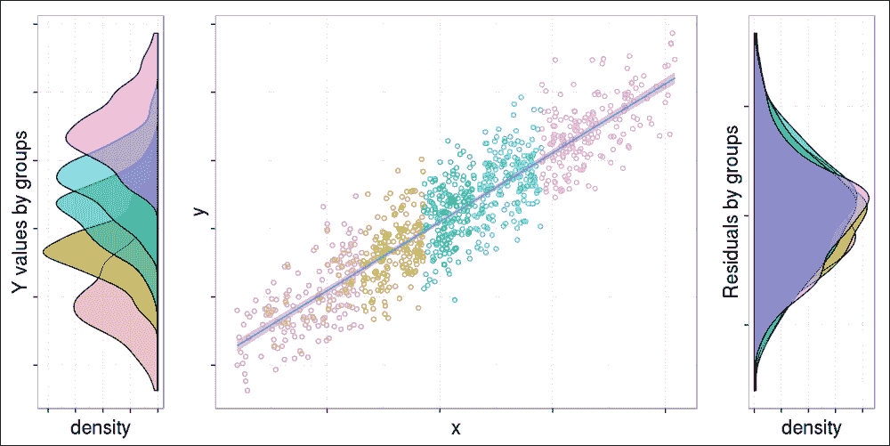

# 第五章。构建模型（由 Renata Nemeth 和 Gergely Toth 撰写）

> "所有模型都应该尽可能简单...但不要过于简单。"
> 
> – 归功于阿尔伯特·爱因斯坦
> 
> "所有模型都是错误的...但有些是有用的。"
> 
> – 乔治·博克斯

在加载数据并进行转换后，本章将重点介绍如何构建统计模型。模型是现实的表示，正如前面的引用所强调的，总是简化的表示。虽然你不可能考虑所有因素，但你应该了解在提供有意义结果的良好模型中应该包含和排除什么。

在本章中，我们将基于线性回归模型和标准建模讨论回归模型。**广义线性模型**（**GLM**）将这些扩展到允许响应变量具有不同的分布，这将在第六章"), *超越线性趋势线（由 Renata Nemeth 和 Gergely Toth 撰写)*中介绍。总的来说，我们将讨论三种最著名的回归模型：

+   **线性回归**用于连续结果（以克为单位的出生体重）

+   **逻辑回归**用于二元结果（低出生体重与正常出生体重）

+   **泊松回归**用于计数数据（每年或每个国家的低出生体重婴儿数量）

虽然还有许多其他回归模型，例如我们在此处不讨论的*Cox 回归*，但模型构建的逻辑和解释是相似的。因此，阅读本章后，你将毫无疑问地理解那些模型。

到本章结束时，你将了解关于回归模型最重要的内容：如何避免混杂因素，如何拟合，如何解释，以及如何在众多不同选项中选择最佳模型。

# 多变量模型背后的动机

如果你想要衡量响应变量和预测变量之间关联的强度，你可以选择一个简单的双向关联度量，例如相关系数或优势比，这取决于你数据的性质。但是，如果你的目标是通过考虑其他预测变量来建模复杂机制，你需要回归模型。

如《卫报》的证据基础专栏作家 Ben Goldacre 在他的精彩 TED 演讲中所说，橄榄油消费与年轻外观皮肤之间的强烈关联并不意味着橄榄油对我们的皮肤有益。在建模复杂的关联结构时，我们也应该控制其他预测变量，例如吸烟状况或身体活动，因为那些消费更多橄榄油的人更有可能总体上过上健康的生活，因此可能不是橄榄油本身防止皮肤皱纹。简而言之，似乎这种生活方式可能混淆了感兴趣变量之间的关系，使得看起来可能存在因果关系，而实际上并不存在。

### 注意

混合因素是一个第三变量，它会影响（增加或减少）我们感兴趣的关联。混合因素总是与响应和预测因子相关联。

如果我们再次通过固定吸烟状态来检查橄榄油和皮肤皱纹的关联，即为吸烟者和非吸烟者建立单独的模型，这种关联可能会消失。固定混合因素是控制混合因素通过回归模型的主要思想。

一般而言，回归模型旨在通过控制其他因素来衡量响应和预测因子之间的关联。潜在的混合因素作为预测因子进入模型，预测因子的回归系数（部分系数）衡量了调整混合因素后的效应。

# 具有连续预测因子的线性回归

让我们从实际且富有启发性的混合因素例子开始。假设我们想要根据城市的大小（以人口规模衡量，以千人为单位）来预测空气污染量。空气污染通过空气中二氧化硫（SO2）浓度来衡量，以每立方米的毫克为单位。我们将使用来自`gamlss.data`包的美国空气污染数据集（Hand 等人，1994 年）：

```py
> library(gamlss.data)
> data(usair)

```

## 模型解释

让我们通过构建一个公式来绘制我们非常第一个线性回归模型。`stats`包中的`lm`函数用于拟合线性模型，这是回归建模的重要工具：

```py
> model.0 <- lm(y ~ x3, data = usair)
> summary(model.0)

Residuals:
 Min      1Q  Median      3Q     Max 
-32.545 -14.456  -4.019  11.019  72.549 

Coefficients:
 Estimate Std. Error t value Pr(>|t|) 
(Intercept) 17.868316   4.713844   3.791 0.000509 ***
x3           0.020014   0.005644   3.546 0.001035 ** 
---
Signif. codes:  0 '***' 0.001 '**' 0.01 '*' 0.05 '.' 0.1 ' ' 1

Residual standard error: 20.67 on 39 degrees of freedom
Multiple R-squared:  0.2438,    Adjusted R-squared:  0.2244 
F-statistic: 12.57 on 1 and 39 DF,  p-value: 0.001035

```

### 注意

公式表示法是 R 语言最好的特性之一，它允许你以人性化的方式定义灵活的模型。一个典型的模型具有`response ~ terms`的形式，其中`response`是连续的响应变量，而`terms`提供了一或一系列数值变量，这些变量指定了响应的线性预测因子。

在前面的例子中，变量`y`表示空气污染，而`x3`代表人口规模。`x3`的系数表明人口规模每增加一个单位（一千人），二氧化硫浓度就会增加`0.02`个单位（每立方米的 0.02 毫克），并且这种效应在`p`值为`0.001035`的情况下具有统计学意义。

### 注意

在*线如何拟合数据？*部分中了解更多关于 p 值的细节。为了保持简单，现在我们将把 p 值低于`0.05`的模型称为具有统计学意义的模型。

通常，截距是当每个预测因子等于 0 时响应变量的值，但在这个例子中，没有没有居民的城市，所以截距（17.87）没有直接的解释。两个回归系数定义了回归线：

```py
> plot(y ~ x3, data = usair, cex.lab = 1.5)
> abline(model.0, col = "red", lwd = 2.5)
> legend('bottomright', legend = 'y ~ x3', lty = 1, col = 'red',
+   lwd = 2.5, title = 'Regression line')

```


如你所见，截距（**17.87**）是回归线与 y 轴相交的值。另一个系数（**0.02**）是回归线的斜率：它衡量线的陡峭程度。在这里，函数向上运行，因为斜率是正的（**y** 随着 **x3** 的增加而增加）。同样，如果斜率是负的，函数就会向下运行。

如果你意识到线是如何绘制的，你就可以轻松理解估计值是如何得到的。这是最适合数据点的线。在这里，我们将“最佳拟合”称为线性最小二乘法，这也是为什么该模型也被称为**普通最小二乘法**（**OLS**）回归。

最小二乘法通过最小化残差的平方和来找到最佳拟合线，其中残差代表误差，即观测值（散点图中的一个原始点）与拟合值或预测值（与相同 *x* 值的线上的点）之间的差异：

```py
> usair$prediction <- predict(model.0)
> usair$residual<- resid(model.0)
> plot(y ~ x3, data = usair, cex.lab = 1.5)
> abline(model.0, col = 'red', lwd = 2.5)
> segments(usair$x3, usair$y, usair$x3, usair$prediction,
+   col = 'blue', lty = 2)
> legend('bottomright', legend = c('y ~ x3', 'residuals'),
+   lty = c(1, 2), col = c('red', 'blue'), lwd = 2.5,
+   title = 'Regression line')

```


线性回归中的“线性”术语指的是我们感兴趣的是线性关系，这比更复杂的方法更自然、更容易理解，也更简单从数学上进行处理。

## 多个预测因子

另一方面，如果我们旨在通过分离人口规模的影响和工业存在的影响来模拟更复杂的机制，我们必须控制变量 `x2`，它描述了雇佣超过 20 名工人的制造商数量。现在，我们可以通过 `lm(y ~ x3 + x2, data = usair)` 创建一个新的模型，或者使用 `update` 函数重新拟合先前的模型：

```py
> model.1 <- update(model.0, . ~ . + x2)
> summary(model.1)

Residuals:
 Min      1Q  Median      3Q     Max 
-22.389 -12.831  -1.277   7.609  49.533 

Coefficients:
 Estimate Std. Error t value Pr(>|t|) 
(Intercept) 26.32508    3.84044   6.855 3.87e-08 ***
x3          -0.05661    0.01430  -3.959 0.000319 ***
x2           0.08243    0.01470   5.609 1.96e-06 ***
---
Signif. codes:  0 '***' 0.001 '**' 0.01 '*' 0.05 '.' 0.1 ' ' 1

Residual standard error: 15.49 on 38 degrees of freedom
Multiple R-squared:  0.5863,    Adjusted R-squared:  0.5645 
F-statistic: 26.93 on 2 and 38 DF,  p-value: 5.207e-08

```

现在，`x3` 的系数是 `-0.06`！在先前的模型中，空气污染与城市规模之间的粗略关联是正的，但在控制了制造商数量之后，这种关联变为负的。这意味着人口增加一千会降低二氧化硫浓度 0.06 单位，这是一个具有统计学意义的效应。

初看之下，这种从正到负的符号变化可能令人惊讶，但在仔细观察后，这相当合理；这绝对不是人口规模，而是工业化水平直接影响了空气污染。在第一个模型中，人口规模显示出正效应，因为它隐含地测量了工业化。当我们保持工业化不变时，人口规模的影响变为负，以固定的工业化水平增长的城市会将空气污染扩散到更广泛的范围。

因此，我们可以得出结论，`x2` 在这里是一个混杂因素，因为它会偏倚 `y` 和 `x3` 之间的关联。尽管它超出了我们当前研究问题的范围，我们也可以解释 `x2` 的系数。它表示，在保持城市规模恒定的情况下，制造商数量的每增加一个单位，SO2 浓度会增加 0.08 毫克。

根据模型，我们可以预测任何组合预测变量的响应的期望值。例如，我们可以预测一个有 40 万居民和 150 家制造商（每家制造商雇佣超过 20 名工人）的城市中二氧化硫浓度的预期水平：

```py
> as.numeric(predict(model.1, data.frame(x2 = 150, x3 = 400)))
[1] 16.04756

```

你也可以自己计算预测值，将值乘以斜率，然后将它们与常数相加——所有这些数字都简单地从先前的模型摘要中复制粘贴过来：

```py
> -0.05661 * 40
0 + 0.08243 * 150 + 26.32508 [1] 16.04558

```

### 备注

在数据范围之外进行预测被称为外推。值离数据越远，你的预测风险就越高。问题是，你无法检查模型假设（例如，线性）在样本数据之外。

如果你有两个预测变量，回归线在三维空间中由一个曲面表示，这可以通过 `scatterplot3d` 包轻松展示：

```py
> library(scatterplot3d)
> plot3d <- scatterplot3d(usair$x3, usair$x2, usair$y, pch = 19,
+   type = 'h', highlight.3d = TRUE, main = '3-D Scatterplot') 
> plot3d$plane3d(model.1, lty = 'solid', col = 'red')

```


由于这个图很难解释，让我们绘制这个三维图的二维投影，这可能会在所有方面都更有信息量。在这里，第三个未呈现变量的值被保持在零：

```py
> par(mfrow = c(1, 2))
> plot(y ~ x3, data = usair, main = '2D projection for x3')
> abline(model.1, col = 'red', lwd = 2.5)
> plot(y ~ x2, data = usair, main = '2D projection for x2')
> abline(lm(y ~ x2 + x3, data = usair), col = 'red', lwd = 2.5)

```


根据斜率的符号变化，值得一提的是，*y-x3* 回归线也发生了变化；从上升趋势变为下降趋势。

# 模型假设

使用标准估计技术的线性回归模型对结果变量、预测变量及其关系做出了一些假设：

1.  *Y* 是一个连续变量（不是二进制、名义或有序的）

1.  错误（残差）在统计上是独立的

1.  *Y* 与每个 *X* 之间存在随机线性关系

1.  在固定每个 *X* 的情况下，*Y* 服从正态分布

1.  无论 *X* 的固定值如何，*Y* 都具有相同的方差

如果我们使用时间作为预测变量，则在趋势分析中，如果违反假设 **2**，则会出现问题。由于连续年份不是独立的，误差将不会相互独立。例如，如果我们有一年因特定疾病死亡率高，那么我们可以预期下一年的死亡率也会很高。

假设**3**的违反意味着关系不是完全线性的，而是偏离线性趋势线。假设**4**和**5**要求*Y*的条件分布是正态的，并且具有相同的方差，无论*X*的固定值如何。它们是回归推断（置信区间、*F*检验和*t*检验）所需的。假设**5**被称为同方差性假设。如果它被违反，则存在异方差性。

以下图表有助于使用模拟数据集可视化这些假设：

```py
> library(Hmisc)
> library(ggplot2)
> library(gridExtra)
> set.seed(7)
> x  <- sort(rnorm(1000, 10, 100))[26:975]
> y  <- x * 500 + rnorm(950, 5000, 20000)
> df <- data.frame(x = x, y = y, cuts = factor(cut2(x, g = 5)),
+                               resid = resid(lm(y ~ x)))
> scatterPl <- ggplot(df, aes(x = x, y = y)) +
+    geom_point(aes(colour = cuts, fill = cuts), shape = 1,
+  show_guide = FALSE) + geom_smooth(method = lm, level = 0.99)
> plot_left <- ggplot(df,  aes(x = y, fill = cuts)) +
+    geom_density(alpha = .5) + coord_flip() + scale_y_reverse()
> plot_right <- ggplot(data = df, aes(x = resid, fill = cuts)) +
+    geom_density(alpha = .5) + coord_flip()
> grid.arrange(plot_left, scatterPl, plot_right,
+    ncol=3, nrow=1, widths=c(1, 3, 1))

```



### 小贴士

可从 Packt Publishing 主页下载的代码包包含一个稍长的代码块，用于前面的图表，并对图表边距、图例和标题进行了一些调整。前面的代码块专注于可视化的主要部分，没有在打印的书籍中过多地浪费空间在样式细节上。

我们将在第九章“从大数据到小数据”中更详细地讨论如何评估模型假设。如果某些假设失败，一个可能的解决方案是寻找异常值。如果你有一个异常值，不要该观测值进行回归分析，并确定结果如何不同。异常值检测的方法将在第八章“数据抛光”中更详细地讨论。

以下示例说明，删除异常值（第 31 个观测值）可能会使假设有效。为了快速验证模型假设是否满足，请使用`gvlma`包：

```py
> library(gvlma)
> gvlma(model.1)

Coefficients:
(Intercept)           x3           x2 
 26.32508     -0.05661      0.08243 

ASSESSMENT OF THE LINEAR MODEL ASSUMPTIONS
USING THE GLOBAL TEST ON 4 DEGREES-OF-FREEDOM:
Level of Significance =  0.05 

 Value  p-value                   Decision
Global Stat        14.1392 0.006864 Assumptions NOT satisfied!
Skewness            7.8439 0.005099 Assumptions NOT satisfied!
Kurtosis            3.9168 0.047805 Assumptions NOT satisfied!
Link Function       0.1092 0.741080    Assumptions acceptable.
Heteroscedasticity  2.2692 0.131964    Assumptions acceptable.

```

看起来有五个假设中的三个没有得到满足。然而，如果我们从同一数据集中排除第 31 个观测值构建完全相同的模型，我们会得到更好的结果：

```py
> model.2 <- update(model.1, data = usair[-31, ])
> gvlma(model.2)

Coefficients:
(Intercept)           x3           x2 
 22.45495     -0.04185      0.06847 

ASSESSMENT OF THE LINEAR MODEL ASSUMPTIONS
USING THE GLOBAL TEST ON 4 DEGREES-OF-FREEDOM:
Level of Significance =  0.05 

 Value p-value                Decision
Global Stat        3.7099  0.4467 Assumptions acceptable.
Skewness           2.3050  0.1290 Assumptions acceptable.
Kurtosis           0.0274  0.8685 Assumptions acceptable.
Link Function      0.2561  0.6128 Assumptions acceptable.
Heteroscedasticity 1.1214  0.2896 Assumptions acceptable.

```

这表明，在未来的章节中构建回归模型时，我们必须始终排除第 31 个观测值。

然而，需要注意的是，仅仅因为观测值是异常值就排除它是不被接受的。在你做出决定之前，调查具体情况。如果发现异常值是由于数据错误导致的，你应该将其删除。否则，进行带有和不带有该观测值的分析，并在你的研究报告中说清楚结果如何变化以及你决定排除极端值的原因。

### 注意

你可以为任何一组数据点拟合一条线；最小二乘法将找到最优解，趋势线将是可解释的。即使模型假设失败，回归系数和 R 平方系数也是有意义的。假设仅在你想要解释 p 值或你旨在做出良好预测时才是必需的。

# 这条线在数据中拟合得有多好？

尽管我们知道趋势线是在可能的线性趋势线中拟合得最好的，但我们不知道它对实际数据的拟合程度如何。回归参数的显著性是通过检验零假设获得的，该假设指出给定的参数等于零。输出中的*F 检验*涉及每个回归参数为零的假设。简而言之，它测试了回归的一般显著性。一个低于 0.05 的*p 值*可以解释为“回归线是显著的”。否则，拟合回归模型几乎没有任何意义。

然而，即使你有显著的 F 值，你也不能对回归线的拟合说太多。我们已经看到，残差描述了拟合的误差。R 平方系数将它们总结成一个单一指标。*R 平方*是回归解释响应变量方差的比率。数学上，它定义为预测*Y*值的方差除以观察到的*Y*值的方差。

### 注意

在某些情况下，尽管 F 检验显著，但根据 R 平方，预测因子仅解释了总方差的一小部分（<10%）。你可以这样解释：尽管预测因子对响应有统计学上的显著影响，但响应是由一个比你的模型所暗示的机制更为复杂的机制形成的。这种现象在医学或生物学领域很常见，在这些领域中，复杂的生物过程被建模，而在计量经济学领域则较少见，在计量经济学领域，通常是宏观层面的聚合变量，这些变量通常平滑了数据中的小变化。

如果我们在空气污染的例子中只使用人口规模作为唯一的预测因子，R 平方等于 0.37，因此我们可以这样说：37%的 SO2 浓度变化可以由城市规模来解释：

```py
> model.0 <- update(model.0, data = usair[-31, ])
> summary(model.0)[c('r.squared', 'adj.r.squared')]
$r.squared
[1] 0.3728245
$adj.r.squared
[1] 0.3563199

```

在模型中添加制造商数量后，R 平方显著增加，几乎翻了一番：

```py
> summary(model.2)[c('r.squared', 'adj.r.squared')]
$r.squared
[1] 0.6433317
$adj.r.squared
[1] 0.6240523

```

### 注意

这里需要注意的是，每次你向模型中添加一个额外的预测因子，R 平方都会增加，仅仅是因为你有了更多预测响应的信息，即使最后添加的预测因子没有重要的影响。因此，具有更多预测因子的模型可能看起来拟合得更好，仅仅是因为它更大。

解决方案是使用调整后的 R 平方，它考虑了预测因子的数量。在先前的例子中，不仅 R 平方，调整后的 R 平方也显示出对后者的巨大优势。

前两个模型是嵌套的，这意味着扩展模型包含第一个模型中的每个预测因子。但不幸的是，调整后的 R 平方不能用作选择非嵌套模型最佳模型的基础。如果你有非嵌套模型，你可以使用**赤池信息量准则**（**AIC**）来选择最佳模型。

AIC 基于信息理论。它为模型中参数的数量引入了一个惩罚项，为更大的模型倾向于显示更好的拟合问题提供了一个解决方案。当使用这个标准时，你应该选择 AIC 最小的模型。作为一个经验法则，如果两个模型的 AIC 差异小于 2，那么这两个模型基本上是不可区分的。在下面的例子中，我们有两个合理的替代模型。考虑到 AIC，`model.4`比`model.3`更好，因为它的优势大约是 10：

```py
> summary(model.3 <- update(model.2, .~. -x2 + x1))$coefficients 
 Estimate   Std. Error   t value     Pr(>|t|)
(Intercept) 77.429836 19.463954376  3.978114 3.109597e-04
x3           0.021333  0.004221122  5.053869 1.194154e-05
x1          -1.112417  0.338589453 -3.285444 2.233434e-03

> summary(model.4 <- update(model.2, .~. -x3 + x1))$coefficients 
 Estimate   Std. Error   t value     Pr(>|t|)
(Intercept) 64.52477966 17.616612780  3.662723 7.761281e-04
x2           0.02537169  0.003880055  6.539004 1.174780e-07
x1          -0.85678176  0.304807053 -2.810899 7.853266e-03

> AIC(model.3, model.4)
 df      AIC
model.3  4 336.6405
model.4  4 326.9136

```

### 备注

注意，AIC 在绝对意义上无法说明模型的品质；你的最佳模型可能仍然拟合得不好。它也不提供测试模型拟合的测试。它本质上是为了对不同模型进行排名。

# 离散预测因子

到目前为止，我们只看到了响应变量和预测变量都是连续的简单情况。现在，让我们将模型推广一点，并将一个离散预测因子纳入模型。以`usair`数据为例，添加`x5`（降水：每年湿天气的平均天数）作为有三个类别（低、中、高降水水平）的预测因子，使用 30 和 45 作为切分点。研究问题是这些降水组如何与 SO2 浓度相关联。这种关联不一定是线性的，如下面的图所示：

```py
> plot(y ~ x5, data = usair, cex.lab = 1.5)
> abline(lm(y ~ x5, data = usair), col = 'red', lwd = 2.5, lty = 1)
> abline(lm(y ~ x5, data = usair[usair$x5<=45,]),
+   col = 'red', lwd = 2.5, lty = 3)
> abline(lm(y ~ x5, data = usair[usair$x5 >=30, ]),
+   col = 'red', lwd = 2.5, lty = 2)
> abline(v = c(30, 45), col = 'blue', lwd = 2.5)
> legend('topleft', lty = c(1, 3, 2, 1), lwd = rep(2.5, 4),
+   legend = c('y ~ x5', 'y ~ x5 | x5<=45','y ~ x5 | x5>=30',
+     'Critical zone'), col = c('red', 'red', 'red', 'blue'))

```


切分点 30 和 45 大致是临时的。定义最佳切分点的一个高级方法是使用回归树。R 中有多种分类树的实现；常用的函数是来自同名包的`rpart`。回归树遵循一个迭代过程，将数据分割成分区，然后继续将每个分区分割成更小的组。在每一步中，算法选择在连续降水尺度上的最佳分割，最佳点最小化从组水平 SO2 均值的平方偏差之和：

```py
> library(partykit)
> library(rpart)
> plot(as.party(rpart(y ~ x5, data = usair)))

```


对先前结果的理解相当直接；如果我们正在寻找两个在 SO2 方面高度不同的组，则最佳切分点是 45.34 的降水水平，如果我们正在寻找三个组，那么我们将不得不使用 30.91 的切分点来分割第二个组，依此类推。四个箱线图描述了四个分区中 SO2 的分布。因此，这些结果证实了我们的先前假设，并且我们有三个在 SO2 浓度水平上强烈不同的降水组。

### 小贴士

查看第十章，*分类与聚类*，以获取更多关于决策树的细节和示例。

下面的散点图也显示，三个组之间存在很大的差异。似乎中间组的 SO2 浓度最高，而其他两组非常相似：

```py
> usair$x5_3 <- cut2(usair$x5, c(30, 45))
> plot(y ~ as.numeric(x5_3), data = usair, cex.lab = 1.5,
+   xlab = 'Categorized annual rainfall(x5)', xaxt = 'n')
> axis(1, at = 1:3, labels = levels(usair$x5_3))
> lines(tapply(usair$y, usair$x5_3, mean), col='red', lwd=2.5, lty=1)
> legend('topright', legend = 'Linear prediction', col = 'red')

```


现在，让我们通过添加三个降水类别到预测因子中来重新拟合我们的线性回归模型。技术上，这通过添加两个与第二和第三组相关的虚拟变量（在第十章，*分类与聚类*）来实现，如下表所示：

|   | 虚拟变量 |
| --- | --- |
| 类别 | 第一 | 第二 |
| --- | --- | --- |
| 低（0-30） | 0 | 0 |
| 中间（30-45） | 1 | 0 |
| 高（45+） | 0 | 1 |

在 R 中，你可以使用`glm`（广义线性模型）函数运行此模型，因为经典线性回归不允许非连续预测因子：

```py
> summary(glmmodel.1 <- glm(y ~ x2 + x3 + x5_3, data = usair[-31, ]))
Deviance Residuals: 
 Min       1Q   Median       3Q      Max 
-26.926   -4.780    1.543    5.481   31.280 

Coefficients:
 Estimate Std. Error t value Pr(>|t|) 
(Intercept)       14.07025    5.01682   2.805  0.00817 ** 
x2                 0.05923    0.01210   4.897 2.19e-05 ***
x3                -0.03459    0.01172  -2.952  0.00560 ** 
x5_3[30.00,45.00) 13.08279    5.10367   2.563  0.01482 * 
x5_3[45.00,59.80]  0.09406    6.17024   0.015  0.98792 
---
Signif. codes:  0 '***' 0.001 '**' 0.01 '*' 0.05 '.' 0.1 ' ' 1

(Dispersion parameter for gaussian family taken to be 139.6349)

 Null deviance: 17845.9  on 39  degrees of freedom
Residual deviance:  4887.2  on 35  degrees of freedom
AIC: 317.74

Number of Fisher Scoring iterations: 2

```

第二组（30 到 45 天的湿润天气）的平均值比第一组高 15.2 个 SO2 单位。这是由人口规模和制造商数量控制的。这种差异在统计学上是显著的。

相反，第三组与第一组相比（低 0.04 单位），只有轻微的差异，这不具有统计学意义。三个组均值显示一个倒 U 形曲线。请注意，如果你使用原始的连续形式的降水，你隐含地假设了一个线性关系，因此你不会发现这种形状。另一个需要注意的重要事项是，这里的 U 形曲线描述了部分关联（控制了`x2`和`x3`），但粗略的关联，在前面的散点图中呈现，显示了非常相似的图像。

回归系数被解释为组均值之间的差异，两组都与省略的类别（第一个）进行比较。这就是为什么省略的类别通常被称为参考类别。这种进入离散预测因子的方式被称为参考类别编码。一般来说，如果你有一个具有*n*个类别的离散预测因子，你必须定义(*n-1*)个虚拟变量。当然，如果你对其他对比感兴趣，你可以通过输入其他(*n-1*)个类别的虚拟变量来轻松修改模型。

### 备注

如果你使用离散预测因子拟合线性回归，回归斜率是组均值之间的差异。如果你还有其他预测因子，那么组均值差异将受这些预测因子的控制。记住，多元回归模型的关键特征是它们在固定其他预测因子的条件下，建模部分双向关联。

你可以通过输入任何其他类型和任何数量的预测变量来进一步深入。如果你有一个有序预测变量，你可以决定是否以原始形式输入，假设线性关系，或者形成虚拟变量并分别输入每个变量，允许任何类型的关系。如果你没有关于如何做出这个决定的背景知识，你可以尝试两种解决方案并比较模型的拟合情况。

# 摘要

本章介绍了如何构建和解释基本模型的概念，例如线性回归模型。到目前为止，你应该熟悉线性回归模型背后的动机；你应该知道如何控制混杂因素，如何输入离散预测变量，如何在 R 中拟合模型，以及如何解释结果。

在下一章中，我们将通过广义模型扩展这一知识，并分析模型拟合情况。
