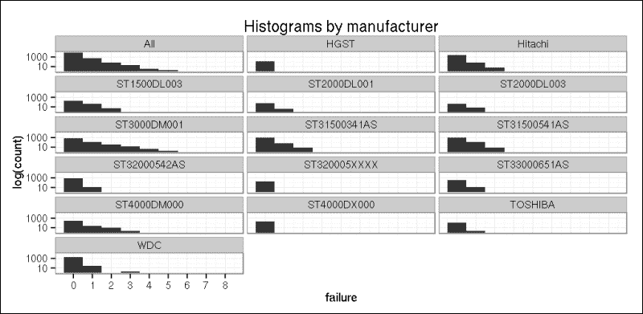
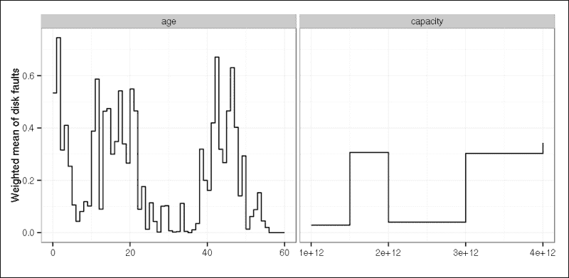
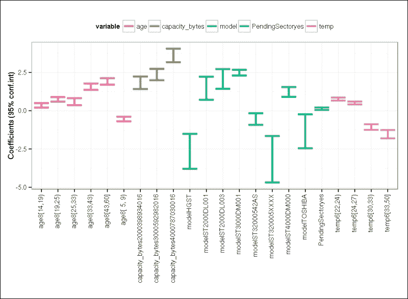

# 第六章. 超越线性趋势线（由 Renata Nemeth 和 Gergely Toth 撰写）

我们在上一章中讨论的线性回归模型可以处理与预测变量具有线性关联的连续响应变量。在本章中，我们将扩展这些模型，允许响应变量在分布上有所不同。但在我们深入探讨广义线性模型之前，我们需要停下来讨论一下回归模型的一般情况。

# 建模工作流程

首先，让我们谈谈术语。统计学家将 *Y* 变量称为响应变量、结果变量或因变量。*X* 变量通常被称为预测变量、解释变量或自变量。其中一些预测变量是我们主要感兴趣的，而其他预测变量只是因为它们可能是潜在的混杂因素而被添加。连续预测变量有时被称为协变量。

广义线性模型（GLM）是线性回归的推广。GLM（在 R 中称为`glm`，来自`stats`包）允许预测变量通过链接函数与响应变量相关联，并通过允许每个测量的方差的大小是预测值的函数。

无论你使用哪种回归模型，主要问题是：“我们可以在什么形式下将连续预测因子添加到模型中？”如果响应变量和预测变量之间的关系不符合模型假设，你可以通过某种方式变换变量。例如，在线性回归模型中，对数或二次变换是一种非常常见的通过线性公式解决独立变量和因变量之间非线性关系问题的方法。

或者，你可以通过适当细分其范围将连续预测因子转换为离散的。在选择类别时，最好的选择之一是遵循某些惯例，例如在年龄的情况下选择 18 岁作为截断点。或者，你可以遵循更技术的方法，例如通过将预测变量分类到分位数。处理此过程的更高级方法之一是使用某些分类或回归树，你可以在第十章分类和聚类中了解更多信息。

离散预测因子可以通过参考类别编码添加到模型中，就像我们在上一章中为线性回归模型所做的那样。

但我们实际上如何构建模型呢？我们已经编制了一个通用工作流程来回答这个问题：

1.  首先，用主要预测因子和所有相关混杂因素拟合模型，然后通过删除非显著的混杂因素来减少混杂因素的数量。为此有一些自动程序（例如向后消除）。

    ### 注意

    给定的样本大小限制了预测因子的数量。一个关于所需样本大小的经验法则是，你应该每个预测因子至少有 20 个观测值。

1.  决定是否使用连续变量在其原始形式或分类形式中。

1.  如果它们在实用上相关，尝试通过测试非线性关系来提高拟合度。

1.  最后，检查模型假设。

那我们如何找到最佳模型呢？是不是拟合度越好，模型就越好？不幸的是并非如此。我们的目标是找到最佳拟合模型，但尽可能少地使用预测变量。良好的模型拟合和独立变量的低数量是相互矛盾的。

正如我们之前看到的，将新的预测变量输入到线性回归模型中总是会增加 R-squared 的值，这可能会导致过度拟合的模型。过度拟合意味着模型描述的是样本的随机噪声，而不是潜在的数据生成过程。例如，当我们模型中的预测变量太多，以至于无法适应样本大小时，就会发生过度拟合。

因此，最佳模型以尽可能少的预测变量给出所需的拟合水平。AIC 是那些考虑拟合和简洁性的适当度量之一。我们强烈建议在比较不同模型时使用它，这可以通过`stats`包中的`AIC`函数非常容易地完成。

# 逻辑回归

到目前为止，我们讨论了线性回归模型，这是建模连续响应变量的适当方法。然而，非连续的二进制响应（如生病或健康，忠诚或决定换工作，移动供应商或合作伙伴）也非常常见。与连续情况相比，主要区别在于现在我们应该而不是建模响应变量的期望值，而是建模概率。

天真的解决方案是在线性模型中将概率作为结果。但这个解决方案的问题在于概率应该始终在 0 和 1 之间，而使用线性模型时，这个有界范围根本无法保证。更好的解决方案是拟合逻辑回归模型，它不仅建模概率，还建模称为**logit**的赔率的自然对数。logit 可以是任何（正或负）数字，因此消除了范围有限的问题。

让我们用一个简单的例子来说明如何预测死刑的概率，使用一些关于被告种族的信息。这个模型与死刑执行中的种族主义问题密切相关，这是一个在美国有着悠久历史的问题。我们将使用来自`catdata`包的`deathpenalty`数据集，关于 1976 年至 1987 年佛罗里达州多起谋杀案中被告的判决。这些案件根据死刑（其中 0 表示没有，1 表示有）进行分类，被告的种族和受害者的种族（黑人表示 0，白人表示 1）。

首先，我们通过`vcdExtra`包中的`expand.dtf`函数将频率表扩展成案例形式，然后在数据集中拟合我们的第一个广义模型：

```py
> library(catdata)
> data(deathpenalty)
> library(vcdExtra)
> deathpenalty.expand <- expand.dft(deathpenalty)
> binom.model.0 <- glm(DeathPenalty ~ DefendantRace,
+   data = deathpenalty.expand, family = binomial)
> summary(binom.model.0)

Deviance Residuals: 
 Min       1Q   Median       3Q      Max 
-0.4821  -0.4821  -0.4821  -0.4044   2.2558 

Coefficients:
 Estimate Std. Error z value Pr(>|z|) 
(Intercept)    -2.4624     0.2690  -9.155   <2e-16 ***
DefendantRace   0.3689     0.3058   1.206    0.228 
---
Signif. codes:  0 '***' 0.001 '**' 0.01 '*' 0.05 '.' 0.1 ' ' 1

(Dispersion parameter for binomial family taken to be 1)

 Null deviance: 440.84  on 673  degrees of freedom
Residual deviance: 439.31  on 672  degrees of freedom
AIC: 443.31

Number of Fisher Scoring iterations: 5

```

回归系数在统计上不显著，所以乍一看，我们看不到数据中的种族偏见。无论如何，为了教学目的，让我们解释回归系数。它是`0.37`，这意味着从黑人类别移动到白人类别时，获得死刑机会的自然对数增加 0.37。如果您取其指数，这个差异很容易解释，因为它是优势的比率：

```py
> exp(cbind(OR = coef(binom.model.0), confint(binom.model.0)))
 OR      2.5 %    97.5 %
(Intercept)   0.08522727 0.04818273 0.1393442
DefendantRace 1.44620155 0.81342472 2.7198224

```

与被告种族相关的优势比是`1.45`，这意味着白人被告获得死刑的机会比黑人被告高出 45%。

### 注意

虽然 R 生成了这个结果，但截距的优势比通常不被解释。

我们可以说得更加普遍。我们已经看到在线性回归模型中，回归系数*b*可以解释为 X 增加一个单位时，Y 增加*b*。但是，在逻辑回归模型中，X 增加一个单位会使 Y 的优势乘以`exp(b)`。

请注意，前面的预测变量是一个离散变量，其值为 0（黑人）和 1（白人），所以它基本上是一个白人的虚拟变量，而黑人则是参照类别。我们已经看到了在线性回归模型中输入离散变量的相同解决方案。如果您有超过两个种族类别，您应该为第三个种族定义第二个虚拟变量，并将其也输入到模型中。每个虚拟变量系数的指数等于优势比，它比较给定类别与参照类别。如果您有一个连续预测变量，系数的指数等于预测变量增加一个单位时的优势比。

现在，让我们将受害者种族纳入考虑，因为它是一个可能的混杂因素。让我们控制它，并使用`DefendantRace`和`VictimRace`作为预测变量拟合逻辑回归模型：

```py
> binom.model.1 <- update(binom.model.0, . ~ . + VictimRace)
> summary(binom.model.1)

Deviance Residuals: 
 Min       1Q   Median       3Q      Max 
-0.7283  -0.4899  -0.4899  -0.2326   2.6919 

Coefficients:
 Estimate Std. Error z value Pr(>|z|) 
(Intercept)    -3.5961     0.5069  -7.094 1.30e-12 ***
DefendantRace  -0.8678     0.3671  -2.364   0.0181 * 
VictimRace      2.4044     0.6006   4.003 6.25e-05 ***
---
Signif. codes:  0 '***' 0.001 '**' 0.01 '*' 0.05 '.' 0.1 ' ' 1

(Dispersion parameter for binomial family taken to be 1)

 Null deviance: 440.84  on 673  degrees of freedom
Residual deviance: 418.96  on 671  degrees of freedom
AIC: 424.96

Number of Fisher Scoring iterations: 6

> exp(cbind(OR = coef(binom.model.1), confint(binom.model.1)))
 OR       2.5 %      97.5 %
(Intercept)    0.02743038 0.008433309  0.06489753
DefendantRace  0.41987565 0.209436976  0.89221877
VictimRace    11.07226549 3.694532608 41.16558028

```

当控制`VictimRace`时，`DefendantRace`的影响变得显著！优势比是`0.42`，这意味着白人被告获得死刑的机会只是黑人被告机会的 42%，在受害者种族固定的情况下。此外，`VictimRace`的优势比（11.07）显示出极其强烈的影响：杀害白人受害者的凶手获得死刑的可能性是杀害黑人受害者的 11 倍。

因此，`DefendantRace`的影响与我们在一预测变量模型中得到的影响正好相反。这种逆转的关联可能看起来是矛盾的，但它可以解释。让我们看一下以下输出：

```py
> prop.table(table(factor(deathpenalty.expand$VictimRace,
+              labels = c("VictimRace=0", "VictimRace=1")),
+            factor(deathpenalty.expand$DefendantRace, 
+              labels = c("DefendantRace=0", "DefendantRace=1"))), 1)

 DefendantRace=0 DefendantRace=1
 VictimRace=0      0.89937107      0.10062893
 VictimRace=1      0.09320388      0.90679612

```

数据似乎在某种程度上具有同质性：黑人被告更有可能遇到黑人受害者，反之亦然。如果你将这些信息放在一起，你就会开始看到，黑人被告产生更小的死刑判决比例，仅仅是因为他们更有可能遇到黑人受害者，而那些有黑人受害者的人不太可能被判死刑。这种悖论消失了：粗略的死刑和`DefendantRace`（被告种族）关联被`VictimRace`（受害者种族）所混淆。

总结一下，似乎在考虑可用信息的情况下，你可以得出以下结论：

+   黑人被告更有可能被判死刑

+   杀死一个白人被认为比杀死一个黑人更严重的罪行

当然，你应该非常谨慎地得出这样的结论，因为种族偏见的问题需要使用所有与犯罪情况相关的相关信息进行非常彻底的分析，以及更多。

## 数据考虑

逻辑回归模型基于观察值之间完全独立的假设。例如，如果你的观察值是连续的年份，这个假设就被违反了。偏差残差和其他诊断统计量可以帮助验证模型并检测诸如链接函数误指定等问题。有关进一步参考，请参阅`LogisticDx`包。

一般而言，逻辑回归模型需要每个预测因子至少有 10 个事件，其中事件表示属于响应中较少出现类别的观察值。在我们的死刑案例中，死刑是响应中较少出现的类别，我们在数据库中有 68 个死刑判决。因此，规则建议最多允许 6-7 个预测因子。

回归系数是通过最大似然法估计的。由于没有封闭的数学形式来获取这些最大似然估计，R 使用优化算法。在某些情况下，你可能会收到一个错误消息，表明算法没有达到收敛。在这种情况下，它无法找到合适的解决方案。这可能是由多种原因造成的，例如预测因子太多、事件太少等等。

## 模型拟合优度

评估模型性能的一个指标是整体模型的显著性。相应的似然比检验表明，给定的模型与仅包含截距项的模型相比，拟合得更好，我们称之为零模型。

要获得测试结果，你必须查看输出中的残差偏差。它衡量了观察到的最大值和拟合的对数似然函数之间的不一致性。

### 注意

由于逻辑回归遵循最大似然原理，目标是使偏差残差的总和最小化。因此，这个残差与线性回归中的原始残差平行，在线性回归中，目标是使残差平方和最小化。

空偏差表示仅由截距预测的模型对响应的预测效果如何。为了评估模型，你必须将残差偏差与空偏差进行比较；差异遵循卡方分布。相应的检验在`lmtest`包中可用：

```py
> library(lmtest)
> lrtest(binom.model.1)
Likelihood ratio test

Model 1: DeathPenalty ~ DefendantRace + VictimRace
Model 2: DeathPenalty ~ 1
 #Df  LogLik Df  Chisq Pr(>Chisq) 
1   3 -209.48 
2   1 -220.42 -2 21.886  1.768e-05 ***
---
Signif. codes:  0 '***' 0.001 '**' 0.01 '*' 0.05 '.' 0.1 ' ' 1

```

*p*值表示偏差的显著降低。这意味着模型是显著的，预测因子对响应概率有显著影响。

你可以将似然比视为线性回归模型中的 F 检验。它揭示了模型是否显著，但它没有提供关于拟合优度方面的任何信息，这在线性情况下是由调整 R 平方测量的。

对于逻辑回归模型，不存在等效的统计量，但已经开发出几种伪 R 平方。这些值通常在 0 到 1 之间，值越高表示拟合度越好。我们将使用来自`BaylorEdPsych`包的`PseudoR2`函数来计算这个值：

```py
> library(BaylorEdPsych)
> PseudoR2(binom.model.1)
 McFadden     Adj.McFadden        Cox.Snell       Nagelkerke 
 0.04964600       0.03149893       0.03195036       0.06655297
McKelvey.Zavoina           Effron            Count        Adj.Count 
 0.15176608       0.02918095               NA               NA 
 AIC    Corrected.AIC 
 424.95652677     424.99234766 

```

但请注意，伪 R 平方不能解释为 OLS R 平方，而且它们也存在一些已记录的问题，但它们为我们提供了一个大致的图景。在我们的案例中，它们表示模型的解释力相当低，如果我们考虑到在如此复杂的过程（如判断犯罪）中只使用了两个预测因子，这一点并不令人惊讶。

## 模型比较

正如我们在上一章中看到的，当处理嵌套线性回归模型时，调整 R 平方为模型比较提供了一个良好的基础。对于嵌套逻辑回归模型，你可以使用似然比检验（例如来自`lmtest`库的`lrtest`函数），它比较残差偏差的差异。

```py
> lrtest(binom.model.0, binom.model.1)
Likelihood ratio test

Model 1: DeathPenalty ~ DefendantRace
Model 2: DeathPenalty ~ DefendantRace + VictimRace
 #Df  LogLik Df Chisq Pr(>Chisq) 
1   2 -219.65 
2   3 -209.48  1 20.35   6.45e-06 ***
---
Signif. codes:  0 '***' 0.001 '**' 0.01 '*' 0.05 '.' 0.1 ' ' 1

```

### 注意

在前面的输出中，`LogLiK`表示模型的对数似然；你通过将其乘以 2 得到残差偏差。

对于非嵌套模型，你可以使用 AIC，就像我们在线性回归模型的情况中所做的那样，但在逻辑回归模型中，AIC 是标准输出的一部分，因此不需要单独调用 AIC 函数。在这里，`binom.model.1`的 AIC 比`binom.model.0`低，差异不可忽视，因为它大于 2。

# 计数数据的模型

逻辑回归只能处理二元响应。如果你有计数数据，例如在特定时间段或特定地理区域内死亡或失败的数量，你可以使用泊松或负二项式回归。这些数据类型在处理作为不同类别事件数量提供的汇总数据时尤其常见。

## 泊松回归

泊松回归模型是具有对数作为链接函数的广义线性模型，并且假设响应具有**泊松分布**。泊松分布只取整数值。它适用于计数数据，例如在固定时间段内发生的事件，即如果事件相对罕见，例如每天硬盘故障的数量。

在以下示例中，我们将使用 2013 年的硬盘数据集。数据集是从[`docs.backblaze.com/public/hard-drive-data/2013_data.zip`](https://docs.backblaze.com/public/hard-drive-data/2013_data.zip)下载的，但我们对其进行了一些打磨和简化。原始数据库中的每条记录对应一个硬盘的每日快照。故障变量，我们主要感兴趣的部分，可以是零（如果驱动器正常），或者一（在硬盘发生故障前的最后一天）。

让我们尝试确定哪些因素会影响故障的出现。潜在的预测因素如下：

+   `model`: 驱动器制造商指定的型号编号

+   `capacity_bytes`: 驱动器容量（以字节为单位）

+   `age_month`: 平均月份的驱动年龄

+   `temperature`: 硬盘驱动器的温度

+   `PendingSector`: 一个逻辑值，表示不稳定扇区的发生（在给定的硬盘上，在给定的那天等待重映射）

我们通过这些变量对这些原始数据集进行了聚合，其中`freq`变量表示给定类别中的记录数。现在是时候加载这个最终、清洗和聚合的数据集了：

```py
> dfa <- readRDS('SMART_2013.RData')

```

快速查看按型号划分的故障数量：

```py
> (ct <- xtabs(~model+failure, data=dfa))
 failure
model             0    1    2    3    4    5    8
 HGST          136    1    0    0    0    0    0
 Hitachi      2772   72    6    0    0    0    0
 SAMSUNG       125    0    0    0    0    0    0
 ST1500DL001    38    0    0    0    0    0    0
 ST1500DL003   213   39    6    0    0    0    0
 ST1500DM003    84    0    0    0    0    0    0
 ST2000DL001    51    4    0    0    0    0    0
 ST2000DL003    40    7    0    0    0    0    0
 ST2000DM001    98    0    0    0    0    0    0
 ST2000VN000    40    0    0    0    0    0    0
 ST3000DM001   771  122   34   14    4    2    1
 ST31500341AS 1058   75    8    0    0    0    0
 ST31500541AS 1010  106    7    1    0    0    0
 ST32000542AS  803   12    1    0    0    0    0
 ST320005XXXX  209    1    0    0    0    0    0
 ST33000651AS  323   12    0    0    0    0    0
 ST4000DM000   242   22   10    2    0    0    0
 ST4000DX000   197    1    0    0    0    0    0
 TOSHIBA       126    2    0    0    0    0    0
 WDC          1874   27    1    2    0    0    0

```

现在，让我们通过删除前表中只有第一列旁边有零的所有行，来去除那些没有发生任何故障的硬盘驱动器型号：

```py
> dfa <- dfa[dfa$model %in% names(which(rowSums(ct) - ct[, 1] > 0)),]

```

为了快速了解故障数量，让我们通过型号编号在对数尺度上绘制一个直方图，借助`ggplot2`包：

```py
> library(ggplot2)
> ggplot(rbind(dfa, data.frame(model='All', dfa[, -1] )), 
+   aes(failure)) + ylab("log(count)") + 
+   geom_histogram(binwidth = 1, drop=TRUE, origin = -0.5)  + 
+   scale_y_log10() + scale_x_continuous(breaks=c(0:10)) + 
+   facet_wrap( ~ model, ncol = 3) +
+   ggtitle("Histograms by manufacturer") + theme_bw()

```



现在，是时候将泊松回归模型拟合到数据中，使用`model`编号作为预测因子。可以使用带有选项`family=poisson`的`glm`函数来拟合模型。默认情况下，期望的对数计数是模型化的，因此我们使用`log`链接。

在数据库中，每个观测值对应一个具有不同数量硬盘的组。由于我们需要处理不同的组大小，我们将使用`offset`函数：

```py
> poiss.base <- glm(failure ~ model, offset(log(freq)),
+   family = 'poisson', data = dfa)
> summary(poiss.base)

Deviance Residuals: 
 Min       1Q   Median       3Q      Max 
-2.7337  -0.8052  -0.5160  -0.3291  16.3495 

Coefficients:
 Estimate Std. Error z value Pr(>|z|) 
(Intercept)        -5.0594     0.5422  -9.331  < 2e-16 ***
modelHitachi        1.7666     0.5442   3.246  0.00117 ** 
modelST1500DL003    3.6563     0.5464   6.692 2.20e-11 ***
modelST2000DL001    2.5592     0.6371   4.017 5.90e-05 ***
modelST2000DL003    3.1390     0.6056   5.183 2.18e-07 ***
modelST3000DM001    4.1550     0.5427   7.656 1.92e-14 ***
modelST31500341AS   2.7445     0.5445   5.040 4.65e-07 ***
modelST31500541AS   3.0934     0.5436   5.690 1.27e-08 ***
modelST32000542AS   1.2749     0.5570   2.289  0.02208 * 
modelST320005XXXX  -0.4437     0.8988  -0.494  0.62156 
modelST33000651AS   1.9533     0.5585   3.497  0.00047 ***
modelST4000DM000    3.8219     0.5448   7.016 2.29e-12 ***
modelST4000DX000  -12.2432   117.6007  -0.104  0.91708 
modelTOSHIBA        0.2304     0.7633   0.302  0.76279 
modelWDC            1.3096     0.5480   2.390  0.01686 * 
---
Signif. codes:  0 '***' 0.001 '**' 0.01 '*' 0.05 '.' 0.1 ' ' 1

(Dispersion parameter for poisson family taken to be 1)

 Null deviance: 22397  on 9858  degrees of freedom
Residual deviance: 17622  on 9844  degrees of freedom
AIC: 24717

Number of Fisher Scoring iterations: 15

```

首先，让我们解释系数。型号是一个离散预测因子，所以我们输入了一些虚拟变量来表示它作为预测因子。默认情况下，参考类别不在输出中，但我们可以随时查询它：

```py
> contrasts(dfa$model, sparse = TRUE)
HGST         . . . . . . . . . . . . . .
Hitachi      1 . . . . . . . . . . . . .
ST1500DL003  . 1 . . . . . . . . . . . .
ST2000DL001  . . 1 . . . . . . . . . . .
ST2000DL003  . . . 1 . . . . . . . . . .
ST3000DM001  . . . . 1 . . . . . . . . .
ST31500341AS . . . . . 1 . . . . . . . .
ST31500541AS . . . . . . 1 . . . . . . .
ST32000542AS . . . . . . . 1 . . . . . .
ST320005XXXX . . . . . . . . 1 . . . . .
ST33000651AS . . . . . . . . . 1 . . . .
ST4000DM000  . . . . . . . . . . 1 . . .
ST4000DX000  . . . . . . . . . . . 1 . .
TOSHIBA      . . . . . . . . . . . . 1 .
WDC          . . . . . . . . . . . . . 1

```

因此，结果证明参考类别是 `HGST`，虚拟变量将每个模型与 `HGST` 硬盘驱动器进行比较。例如，`Hitachi` 的系数是 `1.77`，所以 `Hitachi` 驱动器的预期对数计数比 `HGST` 驱动器大约高 1.77。或者，当讨论比率而不是差异时，可以计算其指数：

```py
> exp(1.7666)
[1] 5.850926

```

因此，`Hitachi` 驱动的预期故障次数是 `HGST` 驱动的 5.85 倍。一般来说，解释如下：`X` 单位增加会使 `Y` 乘以 `exp(b)`。

与逻辑回归类似，让我们确定模型的显著性。为此，我们将当前模型与没有任何预测因子的空模型进行比较，因此可以识别残差偏差和空偏差之间的差异。我们期望差异足够大，相应的卡方检验是显著的：

```py
> lrtest(poiss.base)
Likelihood ratio test

Model 1: failure ~ model
Model 2: failure ~ 1
 #Df LogLik  Df  Chisq Pr(>Chisq) 
1  15 -12344 
2   1 -14732 -14 4775.8  < 2.2e-16 ***
---
Signif. codes:  0 '***' 0.001 '**' 0.01 '*' 0.05 '.' 0.1 ' ' 1

```

看起来模型是显著的，但我们也应该尝试确定是否有任何模型假设可能失败。

就像我们对线性回归和逻辑回归模型所做的那样，我们有一个独立性假设，泊松回归假设事件是独立的。这意味着一个故障的发生不会使另一个故障更有可能或更不可能。在驱动器故障的情况下，这个假设成立。另一个重要的假设来自于响应具有具有相等均值和方差的泊松分布。我们的模型假设，在预测变量的条件下，方差和均值将大致相等。

为了决定假设是否成立，我们可以将残差偏差与其自由度进行比较。对于一个拟合良好的模型，它们的比率应该接近于 1。不幸的是，报告的残差偏差是 `17622`，自由度是 `9844`，所以它们的比率远高于 1，这表明方差远大于均值。这种现象称为 **过度分散**。

## 负二项式回归

在这种情况下，可以使用负二项式分布来模拟过度分散的计数响应，这是泊松回归的推广，因为它有一个额外的参数来模拟过度分散。换句话说，泊松和负二项式模型是嵌套模型；前者是后者的子集。

在以下输出中，我们使用 `MASS` 包中的 `glm.nb` 函数来拟合我们的驱动器故障数据的负二项式回归：

```py
> library(MASS)
> model.negbin.0 <- glm.nb(failure ~ model,
+  offset(log(freq)), data = dfa)

```

要将此模型的性能与泊松模型进行比较，我们可以使用似然比检验，因为这两个模型是嵌套的。负二项式模型显示出显著更好的拟合度：

```py
> lrtest(poiss.base,model.negbin.0)
Likelihood ratio test

Model 1: failure ~ model
Model 2: failure ~ model
 #Df LogLik Df Chisq Pr(>Chisq) 
1  15 -12344 
2  16 -11950  1 787.8  < 2.2e-16 ***
---
Signif. codes:  0 '***' 0.001 '**' 0.01 '*' 0.05 '.' 0.1 ' ' 1

```

这个结果清楚地表明应选择负二项式模型。

## 多元非线性模型

到目前为止，我们模型中唯一的预测变量是模型名称，但我们还有关于驱动器的其他可能重要的信息，例如容量、年龄和温度。现在让我们将这些添加到模型中，并确定新模型是否比原始模型更好。

此外，让我们也检查`PendingSector`的重要性。简而言之，我们定义了一个包含嵌套模型的两个步骤模型构建过程；因此，我们可以使用似然比统计量来检验模型拟合在两个步骤中是否显著增加：

```py
> model.negbin.1 <- update(model.negbin.0, . ~ . + capacity_bytes + 
+   age_month + temperature)
> model.negbin.2 <- update(model.negbin.1, . ~ . + PendingSector)
> lrtest(model.negbin.0, model.negbin.1, model.negbin.2)
Likelihood ratio test

Model 1: failure ~ model
Model 2: failure ~ model + capacity_bytes + age_month + temperature
Model 3: failure ~ model + capacity_bytes + age_month + temperature + 
 PendingSector
 #Df LogLik Df  Chisq Pr(>Chisq) 
1  16 -11950 
2  19 -11510  3 878.91  < 2.2e-16 ***
3  20 -11497  1  26.84  2.211e-07 ***
---
Signif. codes:  0 '***' 0.001 '**' 0.01 '*' 0.05 '.' 0.1 ' ' 1

```

这两个步骤都很重要，因此将每个预测变量添加到模型中是值得的。现在，让我们解释最佳模型：

```py
> summary(model.negbin.2)

Deviance Residuals: 
 Min       1Q   Median       3Q      Max 
-2.7147  -0.7580  -0.4519  -0.2187   9.4018 

Coefficients:
 Estimate Std. Error z value Pr(>|z|) 
(Intercept)       -8.209e+00  6.064e-01 -13.537  < 2e-16 ***
modelHitachi       2.372e+00  5.480e-01   4.328 1.50e-05 ***
modelST1500DL003   6.132e+00  5.677e-01  10.801  < 2e-16 ***
modelST2000DL001   4.783e+00  6.587e-01   7.262 3.81e-13 ***
modelST2000DL003   5.313e+00  6.296e-01   8.440  < 2e-16 ***
modelST3000DM001   4.746e+00  5.470e-01   8.677  < 2e-16 ***
modelST31500341AS  3.849e+00  5.603e-01   6.869 6.49e-12 ***
modelST31500541AS  4.135e+00  5.598e-01   7.387 1.50e-13 ***
modelST32000542AS  2.403e+00  5.676e-01   4.234 2.29e-05 ***
modelST320005XXXX  1.377e-01  9.072e-01   0.152   0.8794 
modelST33000651AS  2.470e+00  5.631e-01   4.387 1.15e-05 ***
modelST4000DM000   3.792e+00  5.471e-01   6.931 4.17e-12 ***
modelST4000DX000  -2.039e+01  8.138e+03  -0.003   0.9980 
modelTOSHIBA       1.368e+00  7.687e-01   1.780   0.0751 . 
modelWDC           2.228e+00  5.563e-01   4.006 6.19e-05 ***
capacity_bytes     1.053e-12  5.807e-14  18.126  < 2e-16 ***
age_month          4.815e-02  2.212e-03  21.767  < 2e-16 ***
temperature       -5.427e-02  3.873e-03 -14.012  < 2e-16 ***
PendingSectoryes   2.240e-01  4.253e-02   5.267 1.39e-07 ***
---
Signif. codes:  0 '***' 0.001 '**' 0.01 '*' 0.05 '.' 0.1 ' ' 1

(Dispersion parameter for Negative Binomial(0.8045) family taken to be 1)

 Null deviance: 17587  on 9858  degrees of freedom
Residual deviance: 12525  on 9840  degrees of freedom
AIC: 23034

Number of Fisher Scoring iterations: 1

 Theta:  0.8045 
 Std. Err.:  0.0525 

 2 x log-likelihood:  -22993.8850.

```

每个预测变量都是显著的——除了模型类型中的一些对比例外。例如，在控制年龄、温度等因素的情况下，`Toshiba`与参考类别`HGST`没有显著差异。

负二项回归参数的解释与泊松模型类似。例如，`age_month`的系数为 0.048，这表明年龄增加一个月，预期故障的对数计数会增加 0.048。或者，你也可以选择使用指数：

```py
> exp(data.frame(exp_coef = coef(model.negbin.2)))
 exp_coef
(Intercept)       2.720600e-04
modelHitachi      1.071430e+01
modelST1500DL003  4.602985e+02
modelST2000DL001  1.194937e+02
modelST2000DL003  2.030135e+02
modelST3000DM001  1.151628e+02
modelST31500341AS 4.692712e+01
modelST31500541AS 6.252061e+01
modelST32000542AS 1.106071e+01
modelST320005XXXX 1.147622e+00
modelST33000651AS 1.182098e+01
modelST4000DM000  4.436067e+01
modelST4000DX000  1.388577e-09
modelTOSHIBA      3.928209e+00
modelWDC          9.283970e+00
capacity_bytes    1.000000e+00
age_month         1.049329e+00
temperature       9.471743e-01
PendingSectoryes  1.251115e+00

```

因此，似乎一生中的一年会增加预期故障次数的 4.9%，而更大的容量也会增加故障次数。另一方面，温度显示出相反的效果：系数的指数为 0.947，这意味着温度每增加一度，预期故障次数会减少 5.3%。

模型名称的影响可以通过与参考类别进行比较来判断，在我们的例子中是`HGST`。有人可能想改变这个参考。例如，对于最常见的驱动器：`WDC`。这可以通过改变硬盘驱动器模型中因子水平的顺序或简单地通过极其有用的`relevel`函数在因子中定义参考类别来实现：

```py
> dfa$model <- relevel(dfa$model, 'WDC')

```

现在，让我们验证`HGST`是否确实替换了系数列表中的`WDC`，但为了不输出冗长的摘要，我们将使用来自`broom`包的`tidy`函数，该函数可以提取不同统计模型的最重要特征（对于模型摘要，请查看`glance`函数）：

```py
> model.negbin.3 <- update(model.negbin.2, data = dfa)
> library(broom)
> format(tidy(model.negbin.3), digits = 4)
 term   estimate std.error statistic    p.value
1        (Intercept) -5.981e+00 2.173e-01 -27.52222 9.519e-167
2          modelHGST -2.228e+00 5.563e-01  -4.00558  6.187e-05
3       modelHitachi  1.433e-01 1.009e-01   1.41945  1.558e-01
4   modelST1500DL003  3.904e+00 1.353e-01  28.84295 6.212e-183
5   modelST2000DL001  2.555e+00 3.663e-01   6.97524  3.054e-12
6   modelST2000DL003  3.085e+00 3.108e-01   9.92496  3.242e-23
7   modelST3000DM001  2.518e+00 9.351e-02  26.92818 1.028e-159
8  modelST31500341AS  1.620e+00 1.069e-01  15.16126  6.383e-52
9  modelST31500541AS  1.907e+00 1.016e-01  18.77560  1.196e-78
10 modelST32000542AS  1.751e-01 1.533e-01   1.14260  2.532e-01
11 modelST320005XXXX -2.091e+00 7.243e-01  -2.88627  3.898e-03
12 modelST33000651AS  2.416e-01 1.652e-01   1.46245  1.436e-01
13  modelST4000DM000  1.564e+00 1.320e-01  11.84645  2.245e-32
14  modelST4000DX000 -1.862e+01 1.101e+03  -0.01691  9.865e-01
15      modelTOSHIBA -8.601e-01 5.483e-01  -1.56881  1.167e-01
16    capacity_bytes  1.053e-12 5.807e-14  18.12597  1.988e-73
17         age_month  4.815e-02 2.212e-03  21.76714 4.754e-105
18       temperature -5.427e-02 3.873e-03 -14.01175  1.321e-44
19  PendingSectoryes  2.240e-01 4.253e-02   5.26709  1.386e-07

```

### 注意

使用`broom`包提取模型系数，比较模型拟合和其他指标，例如传递给`ggplot2`。

温度的效应表明，温度越高，硬盘故障的数量越低。然而，日常经验显示了一个非常不同的画面，例如，在[`www.backblaze.com/blog/hard-drive-temperature-does-it-matter`](https://www.backblaze.com/blog/hard-drive-temperature-does-it-matter)中描述的那样。谷歌工程师发现温度并不是故障的良好预测因子，而微软和弗吉尼亚大学发现它有显著影响。磁盘驱动器制造商建议保持磁盘在较低的温度下。

因此，让我们更仔细地看看这个有趣的问题，我们将把`温度`作为驱动器故障的预测因子。首先，让我们将温度分为六个相等的类别，然后我们将绘制一个条形图来展示每个类别的平均故障数量。请注意，我们必须考虑到不同组的大小，因此我们将通过`freq`进行加权，并且由于我们正在进行一些数据聚合，现在是将我们的数据集转换为`data.table`对象的时候了：

```py
> library(data.table)
> dfa <- data.table(dfa)
> dfa[, temp6 := cut2(temperature, g = 6)]
> temperature.weighted.mean <- dfa[, .(wfailure = 
+     weighted.mean(failure, freq)), by = temp6] 
> ggplot(temperature.weighted.mean, aes(x = temp6, y = wfailure)) + 
+     geom_bar(stat = 'identity') + xlab('Categorized temperature') +
+     ylab('Weighted mean of disk faults') + theme_bw()

```


线性关系的假设显然没有得到支持。条形图建议在模型中输入时使用这种分类形式的温度，而不是原始的连续变量。为了真正看到哪个模型更好，让我们比较一下！由于它们不是嵌套的，我们必须使用 AIC，它强烈支持分类版本：

```py
> model.negbin.4 <- update(model.negbin.0, .~. + capacity_bytes +
+   age_month + temp6 + PendingSector, data = dfa)
> AIC(model.negbin.3,model.negbin.4)
 df      AIC
model.negbin.3 20 23033.88
model.negbin.4 24 22282.47

```

嗯，对温度进行分类真的很有价值！现在，让我们检查其他两个连续预测因子。同样，我们将使用`freq`作为权重因子：

```py
> weighted.means <- rbind(
+     dfa[, .(l = 'capacity', f = weighted.mean(failure, freq)),
+         by = .(v = capacity_bytes)],
+     dfa[, .(l = 'age', f = weighted.mean(failure, freq)),
+         by = .(v = age_month)])

```

与之前的图表一样，我们将使用`ggplot2`来绘制这些离散变量的分布，但我们将使用阶梯线图而不是条形图来克服条形图固定宽度的缺点：

```py
> ggplot(weighted.means, aes(x = l, y = f)) + geom_step() +
+   facet_grid(. ~ v, scales = 'free_x') + theme_bw() +
+   ylab('Weighted mean of disk faults') + xlab('')

```



这些关系显然不是线性的。`年龄`的情况尤其有趣；硬盘寿命中似乎存在高度危险的时期。现在，让我们强制 R 使用`容量`作为名义变量（它只有五个值，所以实际上没有必要对其进行分类），并将`年龄`分为 8 个大小相等的类别：

```py
> dfa[, capacity_bytes := as.factor(capacity_bytes)]
> dfa[, age8 := cut2(age_month, g = 8)]
> model.negbin.5 <- update(model.negbin.0, .~. + capacity_bytes +
+   age8 + temp6 + PendingSector, data = dfa)

```

根据 AIC，最后一个具有分类年龄和容量的模型要好得多，是目前为止的最佳拟合模型：

```py
> AIC(model.negbin.5, model.negbin.4)
 df      AIC
model.negbin.5 33 22079.47
model.negbin.4 24 22282.47

```

如果你看参数估计，你可以看到容量上的第一个虚拟变量与参考值显著不同：

```py
> format(tidy(model.negbin.5), digits = 3)
 term estimate std.error statistic   p.value
1                  (Intercept)  -6.1648  1.84e-01 -3.34e+01 2.69e-245
2                    modelHGST  -2.4747  5.63e-01 -4.40e+00  1.10e-05
3                 modelHitachi  -0.1119  1.21e-01 -9.25e-01  3.55e-01
4             modelST1500DL003  31.7680  7.05e+05  4.51e-05  1.00e+00
5             modelST2000DL001   1.5216  3.81e-01  3.99e+00  6.47e-05
6             modelST2000DL003   2.1055  3.28e-01  6.43e+00  1.29e-10
7             modelST3000DM001   2.4799  9.54e-02  2.60e+01 5.40e-149
8            modelST31500341AS  29.4626  7.05e+05  4.18e-05  1.00e+00
9            modelST31500541AS  29.7597  7.05e+05  4.22e-05  1.00e+00
10           modelST32000542AS  -0.5419  1.93e-01 -2.81e+00  5.02e-03
11           modelST320005XXXX  -2.8404  7.33e-01 -3.88e+00  1.07e-04
12           modelST33000651AS   0.0518  1.66e-01  3.11e-01  7.56e-01
13            modelST4000DM000   1.2243  1.62e-01  7.54e+00  4.72e-14
14            modelST4000DX000 -29.6729  2.55e+05 -1.16e-04  1.00e+00
15                modelTOSHIBA  -1.1658  5.48e-01 -2.13e+00  3.33e-02
16 capacity_bytes1500301910016 -27.1391  7.05e+05 -3.85e-05  1.00e+00
17 capacity_bytes2000398934016   1.8165  2.08e-01  8.73e+00  2.65e-18
18 capacity_bytes3000592982016   2.3515  1.88e-01  1.25e+01  8.14e-36
19 capacity_bytes4000787030016   3.6023  2.25e-01  1.60e+01  6.29e-58
20                 age8[ 5, 9)  -0.5417  7.55e-02 -7.18e+00  7.15e-13
21                 age8[ 9,14)  -0.0683  7.48e-02 -9.12e-01  3.62e-01
22                 age8[14,19)   0.3499  7.24e-02  4.83e+00  1.34e-06
23                 age8[19,25)   0.7383  7.33e-02  1.01e+01  7.22e-24
24                 age8[25,33)   0.5896  1.14e-01  5.18e+00  2.27e-07
25                 age8[33,43)   1.5698  1.05e-01  1.49e+01  1.61e-50
26                 age8[43,60]   1.9105  1.06e-01  1.81e+01  3.59e-73
27                temp6[22,24)   0.7582  5.01e-02  1.51e+01  8.37e-52
28                temp6[24,27)   0.5005  4.78e-02  1.05e+01  1.28e-25
29                temp6[27,30)   0.0883  5.40e-02  1.64e+00  1.02e-01
30                temp6[30,33)  -1.0627  9.20e-02 -1.15e+01  7.49e-31
31                temp6[33,50]  -1.5259  1.37e-01 -1.11e+01  1.23e-28
32            PendingSectoryes   0.1301  4.12e-02  3.16e+00  1.58e-03

```

接下来的三个容量更有可能引起故障，但趋势并非线性。年龄的影响似乎也不是线性的。总的来说，老化会增加故障数量，但也有一些例外。例如，驱动器在第一个（参考）年龄组比第二个年龄组更有可能发生故障。这一发现是合理的，因为驱动器在其操作初期有更高的故障率。温度的影响表明，中等温度（22-30 摄氏度）比低温或高温更有可能引起故障。记住，每个效应都是控制其他每个预测变量的。

判断不同预测变量的效应大小也很重要，将它们相互比较。毕竟，一张图胜过千言万语，让我们用一个图表来总结系数及其置信区间。

首先，我们必须从模型中提取显著的术语：

```py
> tmnb5 <- tidy(model.negbin.5)
> str(terms <- tmnb5$term[tmnb5$p.value < 0.05][-1])
 chr [1:22] "modelHGST" "modelST2000DL001" "modelST2000DL003" ...

```

然后，让我们使用 `confint` 函数和古老的 `plyr` 包来识别系数的置信区间：

```py
> library(plyr)
> ci <- ldply(terms, function(t) confint(model.negbin.5, t))

```

很遗憾，这个生成的数据框还不完整。我们需要添加术语名称，并且，让我们通过一个简单的正则表达式提取分组变量：

```py
> names(ci) <- c('min', 'max')
> ci$term <- terms
> ci$variable <- sub('[A-Z0-9\\]\\[,() ]*$', '', terms, perl = TRUE)

```

现在我们已经得到了一个格式良好的数据集中系数的置信区间，这些区间可以用 `ggplot` 很容易地绘制出来：

```py
> ggplot(ci, aes(x = factor(term), color = variable)) + 
+     geom_errorbar(ymin = min, ymax = max) + xlab('') +
+     ylab('Coefficients (95% conf.int)') + theme_bw() + 
+     theme(axis.text.x = element_text(angle = 90, hjust = 1),
+         legend.position = 'top')

```



很容易看出，尽管每个预测变量都很显著，但它们的影响大小差异很大。例如，`PendingSector` 对故障数量的影响微乎其微，但 `age`、`capacity` 和 `temperature` 的影响则要大得多，硬盘型号是区分故障数量最好的预测变量。

正如我们在 *逻辑回归* 部分中提到的，非线性模型也有不同的伪 R 平方度量。我们再次提醒您，对这些指标要持保留态度。无论如何，在我们的案例中，它们一致表明模型的解释力相当好：

```py
> PseudoR2(model.negbin.6 )
 McFadden     Adj.McFadden        Cox.Snell       Nagelkerke 
 0.3352654        0.3318286        0.4606953        0.5474952 
McKelvey.Zavoina           Effron            Count        Adj.Count 
 NA        0.1497521        0.9310444       -0.1943522 
 AIC    Corrected.AIC 
 12829.5012999    12829.7044941 

```

# 摘要

本章介绍了三种著名的非线性回归模型：逻辑回归、泊松回归和负二项回归模型，并且你对建模的一般逻辑已经熟悉。还展示了相同的概念，如预测变量的影响、拟合优度、解释力、嵌套和非嵌套模型的模型比较以及模型构建，在不同情境中的应用。现在，在掌握数据分析技能上花费了一些时间之后，在下一章中，我们将回到一些核心的数据科学问题，例如数据的清洗和结构化。
