# 第九章. 从大数据到小数据

现在我们有一些准备好的清洁数据用于分析，让我们首先看看我们如何在我们数据集中的大量变量中找到我们的方向。本章将介绍一些统计技术，通过降维和特征提取来减少变量的数量，例如：

+   **主成分分析**（**PCA**）

+   **因子分析**（**FA**）

+   **多维尺度分析**（**MDS**）和其他一些技术

### 注意

大多数降维方法都需要数据集中的两个或多个数值变量高度相关或相关，因此我们矩阵中的列并不是完全相互独立的。在这种情况下，降维的目标是将数据集中的列数减少到实际的矩阵秩；或者换句话说，变量的数量可以减少，同时保留大部分信息内容。在线性代数中，矩阵秩指的是由矩阵生成的向量空间的维度——或者说，在二次矩阵中独立列和行的数量。可能通过一个简单的例子更容易理解秩：想象一个关于学生的数据集，其中我们知道受访者的性别、年龄和出生日期。这些数据是冗余的，因为年龄可以通过线性变换从出生日期计算出来。同样，`hflights`数据集中的年份变量是静态的（没有任何变化），并且可以通过出发和到达时间计算经过的时间。

这些变换基本上集中在变量之间识别出的共同方差上，并排除了剩余的总（独特）方差。这导致数据集的列数减少，这可能更容易维护和处理，但代价是损失一些信息，并创建一些人工变量，这些变量通常比原始列更难以理解。

在完全依赖的情况下，除了一个完全相关的变量外，其他所有完全相关的变量都可以省略，因为其余的变量没有提供关于数据集的额外信息。尽管这种情况并不常见，但在大多数情况下，只保留从一组问题中提取的一个或几个成分，例如在调查中用于进一步分析，是完全可接受的。

# 充分性检验

当你考虑通过多元统计分析减少数据集中的维度或寻找潜在变量时，首先想做的事情是检查变量是否相关，数据是否呈正态分布。

## 正态性

后者通常不是一个严格的要求。例如，如果我们没有多元正态性，PCA 的结果仍然可能是有效的，并且可以解释；另一方面，最大似然因子分析确实有这个强烈的假设。

### 小贴士

你应该始终根据你数据的特征，使用适当的方法来实现你的数据分析目标。

无论如何，你可以使用（例如）`qqplot`来进行变量的成对比较，以及使用`qqnorm`来进行变量的单变量正态性检验。首先，让我们用一个`hflights`的子集来演示这一点：

```py
> library(hlfights)
> JFK <- hflights[which(hflights$Dest == 'JFK'),
+                 c('TaxiIn', 'TaxiOut')]

```

因此，我们过滤我们的数据集，只保留那些飞往约翰·肯尼迪国际机场的航班，并且我们只对描述进出滑行时间（以分钟为单位）的两个变量感兴趣。使用传统的``索引的先前命令可以用`subset`重构，以获得更易读的源代码：

```py
> JFK <- subset(hflights, Dest == 'JFK', select = c(TaxiIn, TaxiOut))

```

请注意，现在在`subset`调用中不需要引用变量名或提及`data.frame`的名称。关于这方面的更多细节，请参阅[第三章，*过滤和汇总数据*。现在让我们看看这两个列值的分布情况：

```py
> par(mfrow = c(1, 2))
> qqnorm(JFK$TaxiIn, ylab = 'TaxiIn')
> qqline(JFK$TaxiIn)
> qqnorm(JFK$TaxiOut, ylab = 'TaxiOut')
> qqline(JFK$TaxiOut)

```

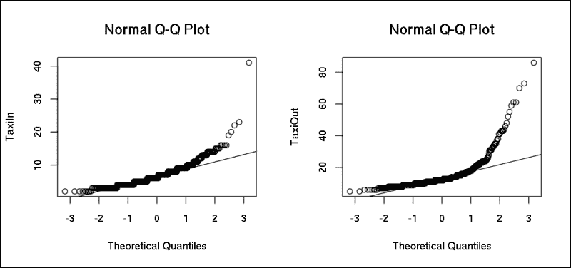

为了生成前面的图，我们创建了一个新的图形设备（使用`par`在一行中保持两个图），然后调用`qqnorm`来显示经验变量的分位数与正态分布的对比，并且还添加了`qqline`来便于比较。如果数据之前已经缩放，`qqline`将渲染一条 45 度的线。

检查 QQ 图表明数据与正态分布不太吻合，这也可以通过如 Shapiro-Wilk 正态性检验之类的分析测试来验证：

```py
> shapiro.test(JFK$TaxiIn)

 Shapiro-Wilk normality test

data:  JFK$TaxiIn
W = 0.8387, p-value < 2.2e-16

```

`p 值`非常小，因此零假设（即数据是正态分布的）被拒绝。但如果没有以及超出单独的统计检验，我们如何测试一串变量的正态性呢？

## 多元正态性

对于多个变量也存在类似的统计检验；这些方法提供了不同的方式来检查数据是否符合多元正态分布。为此，我们将使用`MVN`包，但类似的方法也可以在`mvnormtest`包中找到。后者包括之前讨论过的 Shapiro-Wilk 检验的多变量版本。

但 Mardia 的检验更常用于检查多元正态性，而且更好，它不限制样本量低于 5,000。在加载了`MVN`包之后，调用适当的 R 函数相当直接，并且具有非常直观的解释——在清除我们数据集中的缺失值之后：

```py
> JFK <- na.omit(JFK)
> library(MVN)
> mardiaTest(JFK)
 Mardia's Multivariate Normality Test 
--------------------------------------- 
 data : JFK 

 g1p            : 20.84452 
 chi.skew       : 2351.957 
 p.value.skew   : 0 

 g2p            : 46.33207 
 z.kurtosis     : 124.6713 
 p.value.kurt   : 0 

 chi.small.skew : 2369.368 
 p.value.small  : 0 

 Result          : Data is not multivariate normal. 
---------------------------------------

```

### 提示

关于处理和过滤缺失值的更多细节，请参阅第八章，*精炼数据*。

在三个 p 值中，第三个指的是样本量极小（<20）的情况，所以现在我们只关注前两个值，两者都低于 0.05。这意味着数据似乎不是多元正态的。不幸的是，Mardia 的检验在某些情况下表现不佳，因此可能更适合使用更稳健的方法。

`MVN` 包还可以运行 Henze-Zirkler 和 Royston 的多元正态性检验。两者都返回用户友好且易于解释的结果：

```py
> hzTest(JFK)
 Henze-Zirkler's Multivariate Normality Test 
--------------------------------------------- 
 data : JFK 

 HZ      : 42.26252 
 p-value : 0 

 Result  : Data is not multivariate normal. 
--------------------------------------------- 

> roystonTest(JFK)
 Royston's Multivariate Normality Test 
--------------------------------------------- 
 data : JFK 

 H       : 264.1686 
 p-value : 4.330916e-58 

 Result  : Data is not multivariate normal. 
---------------------------------------------

```

更直观地测试多元正态性的方法是绘制与之前使用的类似的 Q-Q 图。但是，我们不仅仅比较一个变量与理论正态分布，而是首先计算我们变量之间的平方马氏距离，它应该遵循具有自由度为变量数量的卡方分布。`MVN` 包可以自动计算所有必需的值，并使用任何前面的正态性检验 R 函数渲染这些值；只需将 `qqplot` 参数设置为 `TRUE`：

```py
> mvt <- roystonTest(JFK, qqplot = TRUE)

```

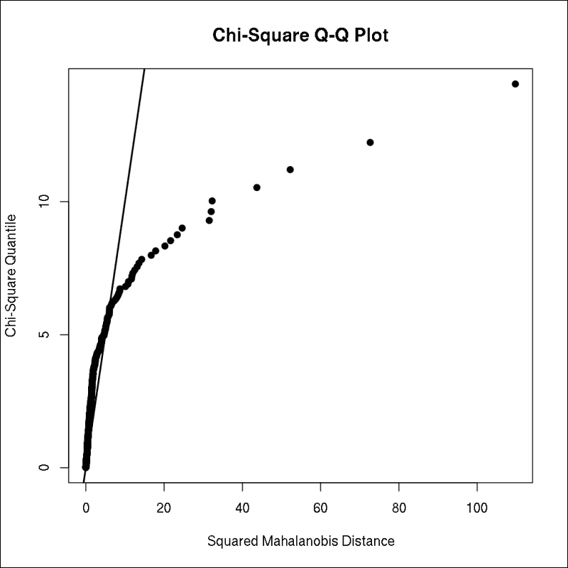

如果数据集是正态分布的，前面图形中显示的点应该适合直线。其他替代的图形方法可以使用之前创建的 `mvt` R 对象生成更直观和用户友好的图形。`MVN` 包提供了 `mvnPlot` 函数，它可以渲染两个变量的透视和等高线图，从而为测试双变量正态性提供了一种很好的方法：

```py
> par(mfrow = c(1, 2))
> mvnPlot(mvt, type = "contour", default = TRUE)
> mvnPlot(mvt, type = "persp", default = TRUE)

```

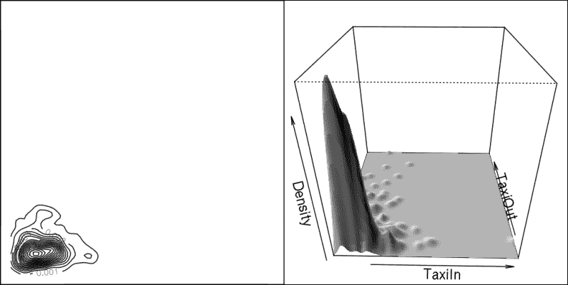

在右侧的图中，你可以看到两个变量在透视图上的经验分布，其中大多数情况都位于左下角。这意味着大多数航班只有相对较短的 **TaxiIn** 和 **TaxiOut** 时间，这表明分布有较重的尾部。左侧的图显示了类似的情况，但以鸟瞰图的形式：等高线代表右手边 3D 图的横截面。多元正态分布看起来更集中，类似于二维的钟形曲线：

```py
> set.seed(42)
> mvt <- roystonTest(MASS::mvrnorm(100, mu = c(0, 0),
+          Sigma = matrix(c(10, 3, 3, 2), 2)))
> mvnPlot(mvt, type = "contour", default = TRUE)
> mvnPlot(mvt, type = "persp", default = TRUE)

```

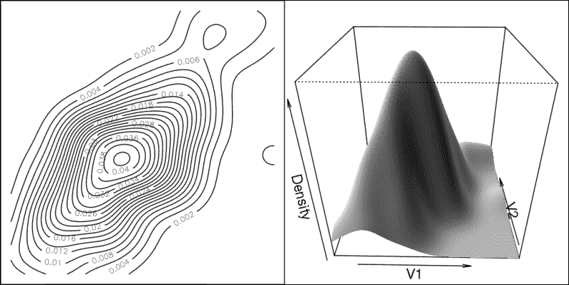

查看第十三章，*我们周围的数据*，了解如何在空间数据上创建类似的等高线图。

## 变量的依赖性

除了正态性之外，在应用降维方法时，还希望相对较高的相关系数。原因是，如果没有变量之间的统计关系，例如，PCA 将返回没有太多变换的精确相同值。

为了达到这个目的，让我们看看 `hflights` 数据集中的数值变量是如何相关的（由于输出是一个大型矩阵，这次将其省略）：

```py
> hflights_numeric <- hflights[, which(sapply(hflights, is.numeric))]
> cor(hflights_numeric, use = "pairwise.complete.obs")

```

在前面的例子中，我们创建了一个新的 R 对象，仅包含原始 `hflights` 数据框的数值列，省略了五个字符向量。然后，我们使用成对删除缺失值的方式运行 `cor`，返回一个 16 列 16 行的矩阵：

```py
> str(cor(hflights_numeric, use = "pairwise.complete.obs"))
 num [1:16, 1:16] NA NA NA NA NA NA NA NA NA NA ...
 - attr(*, "dimnames")=List of 2
 ..$ : chr [1:16] "Year" "Month" "DayofMonth" "DayOfWeek" ...
 ..$ : chr [1:16] "Year" "Month" "DayofMonth" "DayOfWeek" ...

```

结果相关矩阵中的缺失值数量似乎非常高。这是因为所有情况下的`Year`都是 2011 年，因此导致标准差为零。明智的做法是将`Year`以及非数值变量从数据集中排除——不仅通过过滤数值值，还要检查方差：

```py
> hflights_numeric <- hflights[,which(
+     sapply(hflights, function(x)
+         is.numeric(x) && var(x, na.rm = TRUE) != 0))]

```

现在缺失值的数量要低得多：

```py
> table(is.na(cor(hflights_numeric, use = "pairwise.complete.obs")))
FALSE  TRUE 
 209    16

```

尽管进行了成对删除缺失值的操作，但您能猜到为什么这里仍然有一些缺失值吗？嗯，运行前面的命令会产生一个相当有用的警告，但我们将稍后回到这个问题：

```py
Warning message:
In cor(hflights_numeric, use = "pairwise.complete.obs") :
 the standard deviation is zero

```

现在我们来分析 15x15 相关矩阵中的实际数字，这个矩阵太大，无法在这本书中打印出来。为此，我们没有展示之前提到的原始`cor`命令的结果，而是用`ellipse`包的图形功能来可视化这 225 个数字：

```py
> library(ellipse)
> plotcorr(cor(hflights_numeric, use = "pairwise.complete.obs"))

```

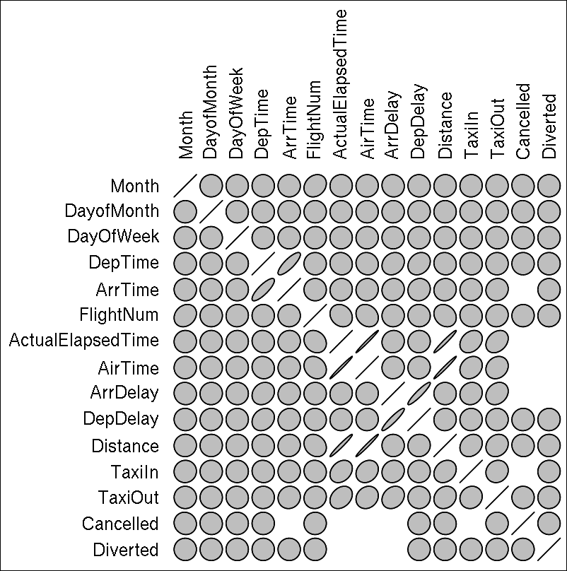

现在我们看到相关矩阵的值通过椭圆表示，其中：

+   完美的圆圈代表零相关系数

+   面积较小的椭圆反映了相关系数与零之间的相对较大距离

+   正切代表系数的负/正符号

为了帮助您分析前面的结果，让我们绘制一个具有一些人工生成的、更容易解释的数字的类似图表：

```py
> plotcorr(cor(data.frame(
+     1:10,
+     1:10 + runif(10),
+     1:10 + runif(10) * 5,
+     runif(10),
+     10:1,
+     check.names = FALSE)))

```

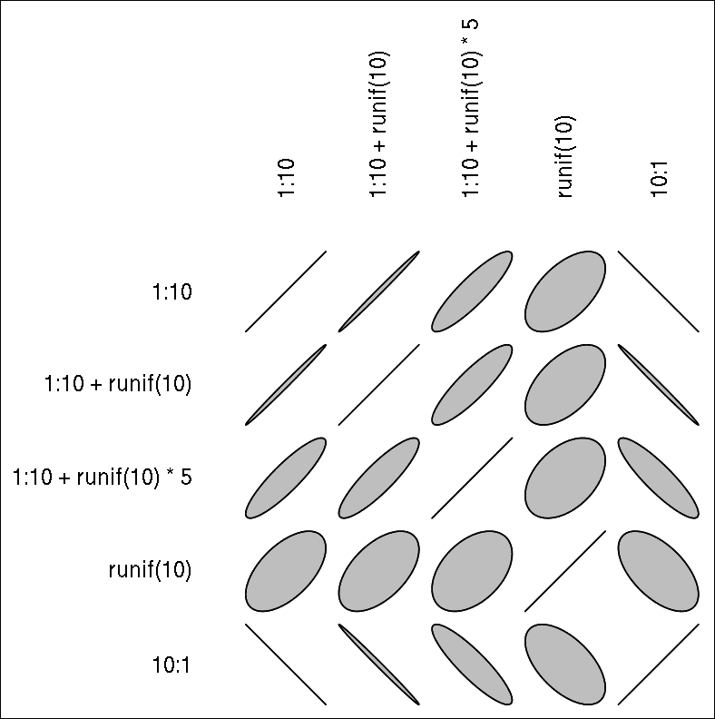

可以使用`corrgram`包在相关矩阵上创建类似的图表。

但让我们回到`hflights`数据集！在前面的图表中，为时间相关的变量绘制了一些狭窄的椭圆，这表明相关系数相对较高，甚至`Month`变量似乎与`FlightNum`函数有轻微的关联：

```py
> cor(hflights$FlightNum, hflights$Month)
[1] 0.2057641

```

另一方面，大多数情况下，图表显示的是完美的圆圈，这代表相关系数约为零。这表明大多数变量之间根本不相关，因此由于共同方差的比例较低，计算原始数据集的主成分可能不会很有帮助。

## KMO 和巴特利特检验

我们可以通过多种统计测试来验证低共同度假设；例如，SAS 和 SPSS 用户倾向于使用 KMO 或巴特利特检验来查看数据是否适合主成分分析。这两种算法在 R 中也可以使用，例如通过`psych`包：

```py
> library(psych)
> KMO(cor(hflights_numeric, use = "pairwise.complete.obs"))
Error in solve.default(r) : 
 system is computationally singular: reciprocal condition number = 0
In addition: Warning message:
In cor(hflights_numeric, use = "pairwise.complete.obs") :
 the standard deviation is zero
matrix is not invertible, image not found
Kaiser-Meyer-Olkin factor adequacy
Call: KMO(r = cor(hflights_numeric, use = "pairwise.complete.obs"))
Overall MSA = NA
MSA for each item = 
 Month    DayofMonth     DayOfWeek 
 0.5        0.5        0.5 
 DepTime      ArrTime     FlightNum 
 0.5        NA        0.5 
ActualElapsedTime      AirTime     ArrDelay 
 NA        NA        NA 
 DepDelay     Distance      TaxiIn 
 0.5        0.5        NA 
 TaxiOut     Cancelled     Diverted 
 0.5        NA        NA

```

不幸的是，由于之前识别的相关矩阵缺失值，前述输出中不可用“总体 MSA”（抽样充分性度量，表示变量之间的平均相关系数）。让我们选择一对变量，其中相关系数为`NA`，以进行进一步分析！这样的对可以从之前的图中轻松识别；例如，对于“取消”和`AirTime`，没有绘制圆圈或椭圆：

```py
> cor(hflights_numeric[, c('Cancelled', 'AirTime')])
 Cancelled AirTime
Cancelled         1      NA
AirTime          NA       1

```

这可以通过以下事实来解释，即如果航班被取消，那么在空中度过的时间变化不大；此外，这些数据不可用：

```py
> cancelled <- which(hflights_numeric$Cancelled == 1)
> table(hflights_numeric$AirTime[cancelled], exclude = NULL)
<NA> 
2973

```

因此，当我们调用`cor`时由于这些`NA`而得到缺失值；同样，当我们使用成对删除调用`cor`时也会得到`NA`，因为数据集中只剩下未取消的航班，导致“取消”变量的方差为零：

```py
> table(hflights_numeric$Cancelled)
 0      1 
224523   2973

```

这表明在运行之前讨论的假设测试之前，我们应该从数据集中删除“取消”变量，因为该变量中存储的信息在其他数据集的列中也是冗余可用的。或者换句话说，“取消”列可以通过其他列的线性变换来计算，这些列可以省略在进一步分析中：

```py
> hflights_numeric <- subset(hflights_numeric, select = -Cancelled)

```

让我们看看在相关矩阵中是否还有任何缺失值：

```py
> which(is.na(cor(hflights_numeric, use = "pairwise.complete.obs")),
+   arr.ind = TRUE)
 row col
Diverted           14   7
Diverted           14   8
Diverted           14   9
ActualElapsedTime   7  14
AirTime             8  14
ArrDelay            9  14

```

看起来“改道”列是造成类似情况的原因，其他三个变量在航班改道时不可用。经过另一个子集后，我们现在可以调用 KMO 来对完整的相关矩阵进行分析：

```py
> hflights_numeric <- subset(hflights_numeric, select = -Diverted)
> KMO(cor(hflights_numeric[, -c(14)], use = "pairwise.complete.obs"))
Kaiser-Meyer-Olkin factor adequacy
Call: KMO(r = cor(hflights_numeric[, -c(14)], use = "pairwise.complete.obs"))
Overall MSA =  0.36
MSA for each item = 
 Month        DayofMonth         DayOfWeek 
 0.42              0.37              0.35 
 DepTime           ArrTime         FlightNum 
 0.51              0.49              0.74 
ActualElapsedTime           AirTime          ArrDelay 
 0.40              0.40              0.39 
 DepDelay          Distance            TaxiIn 
 0.38              0.67              0.06 
 TaxiOut 
 0.06

```

“总体 MSA”，或所谓的**卡特尔-梅耶-奥金**（**KMO**）指数，是一个介于 0 和 1 之间的数字；这个值表明变量的部分相关系数是否足够小，可以继续使用数据降维方法。KMO 的一般评价体系或经验法则可以在以下表格中找到，如凯撒建议：

| 值 | 描述 |
| --- | --- |
| KMO < 0.5 | 不可接受 |
| 0.5 < KMO < 0.6 | 糟糕 |
| 0.6 < KMO < 0.7 | 一般 |
| 0.7 < KMO < 0.8 | 中等 |
| 0.8 < KMO < 0.9 | 优秀 |
| KMO > 0.9 | 极佳 |

KMO 指数低于 0.5 被认为是不可接受的，这基本上意味着从相关矩阵计算出的部分相关系数表明变量之间的相关性不足以进行有意义的降维或潜在变量模型。

虽然省略一些具有最低 MSA 的变量可以提高“总体 MSA”，我们可以在接下来的几页中构建一些适当的模型，但出于教学目的，我们目前不会在数据转换上花费更多时间，我们将使用在第三章中介绍的`mtcars`数据集，*过滤和汇总数据*：

```py
> KMO(mtcars)
Kaiser-Meyer-Olkin factor adequacy
Call: KMO(r = mtcars)
Overall MSA =  0.83
MSA for each item = 
 mpg  cyl disp   hp drat   wt qsec   vs   am gear carb 
0.93 0.90 0.76 0.84 0.95 0.74 0.74 0.91 0.88 0.85 0.62

```

看起来，`mtcars`数据库是多元统计分析的一个很好的选择。这也可以通过所谓的 Bartlett 测试来验证，该测试建议是否协方差矩阵与单位矩阵相似。或者换句话说，如果变量之间存在统计关系。另一方面，如果协方差矩阵除了对角线外只有零，那么变量之间是独立的；因此，考虑多元方法就没有太多意义了。《psych》包提供了一个易于使用的函数来计算 Bartlett 测试：

```py
> cortest.bartlett(cor(mtcars))
$chisq
[1] 1454.985

$p.value
[1] 3.884209e-268

$df
[1] 
55

```

非常低的`p-value`表明我们拒绝了 Bartlett 测试的零假设。这意味着协方差矩阵与单位矩阵不同，因此变量之间的相关系数似乎比 0 更接近于 1。这与高 KMO 值是一致的。

### 注意

在专注于实际的统计方法之前，请务必注意，尽管前面的假设在大多数情况下是有意义的，并且应该作为经验法则遵循，但 KMO 和 Bartlett 测试并不总是必需的。高共同性对于因子分析和其他潜在模型很重要，而例如 PCA 是一种数学变换，即使 KMO 值较低也能工作。

# 主成分分析

在具有大量变量的数据库中找到真正重要的字段可能对数据科学家来说是一项具有挑战性的任务。这就是**主成分分析**（**PCA**）发挥作用的地方：找到数据的核心成分。它是由 Karl Pearson 在 100 多年前发明的，自那时以来，它已经在各个领域得到了广泛的应用。

PCA 的目标是借助正交变换，以更有意义的结构解释数据。这种线性变换旨在通过在向量空间中任意设计的新基中揭示数据集的内部结构，以最佳地解释数据的方差。用简单的话说，这仅仅意味着我们从原始数据中计算新的变量，这些新变量按降序包含原始变量的方差。

这可以通过协方差矩阵的特征分解（所谓的 R 模式 PCA）或数据集的奇异值分解（所谓的 Q 模式 PCA）来完成。每种方法都有很大的优势，例如计算性能、内存需求，或者简单地避免在使用协方差矩阵进行特征分解时，在将数据传递给 PCA 之前对数据进行预先标准化。

无论哪种方式，PCA 都可以成功地将数据的低维图像传递出去，其中不相关的主成分是原始变量的线性组合。这个信息概览对于分析员在识别变量的潜在结构时非常有帮助；因此，这种技术经常被用于探索性数据分析。

PCA 产生的提取组件数量与原始变量完全相同。第一个组件包括大部分共同方差，因此在描述原始数据集时具有最高的重要性，而最后一个组件通常只包括来自一个原始变量的某些独特信息。基于这一点，我们通常会只保留 PCA 的前几个组件进行进一步分析，但我们也会看到一些专注于提取独特方差的用例。

## PCA 算法

R 提供了多种函数来运行 PCA。尽管可以通过`eigen`或`svd`手动计算 R 模式或 Q 模式的组件，但为了简化，我们将关注高级函数。凭借我的统计学教师背景，我认为有时集中精力分析如何运行和解释结果比花大量时间在线性代数背景上更有效率——尤其是在给定的时间/页面限制下。

R 模式 PCA 可以通过`psych`包中的`princomp`或`principal`进行，而更受欢迎的 Q 模式 PCA 可以通过`prcomp`调用。现在让我们专注于后者，看看`mtcars`的组件是什么样的：

```py
> prcomp(mtcars, scale = TRUE)
Standard deviations:
 [1] 2.57068 1.62803 0.79196 0.51923 0.47271 0.46000 0.36778 0.35057
 [9] 0.27757 0.22811 0.14847

Rotation:
 PC1       PC2       PC3        PC4       PC5       PC6
mpg   -0.36253  0.016124 -0.225744 -0.0225403  0.102845 -0.108797
cyl    0.37392  0.043744 -0.175311 -0.0025918  0.058484  0.168554
disp   0.36819 -0.049324 -0.061484  0.2566079  0.393995 -0.336165
hp     0.33006  0.248784  0.140015 -0.0676762  0.540047  0.071436
drat  -0.29415  0.274694  0.161189  0.8548287  0.077327  0.244497
wt     0.34610 -0.143038  0.341819  0.2458993 -0.075029 -0.464940
qsec  -0.20046 -0.463375  0.403169  0.0680765 -0.164666 -0.330480
vs    -0.30651 -0.231647  0.428815 -0.2148486  0.599540  0.194017
am    -0.23494  0.429418 -0.205767 -0.0304629  0.089781 -0.570817
gear  -0.20692  0.462349  0.289780 -0.2646905  0.048330 -0.243563
carb   0.21402  0.413571  0.528545 -0.1267892 -0.361319  0.183522
 PC7        PC8       PC9      PC10      PC11
mpg   0.367724 -0.7540914  0.235702  0.139285 -0.1248956
cyl   0.057278 -0.2308249  0.054035 -0.846419 -0.1406954
disp  0.214303  0.0011421  0.198428  0.049380  0.6606065
hp   -0.001496 -0.2223584 -0.575830  0.247824 -0.2564921
drat  0.021120  0.0321935 -0.046901 -0.101494 -0.0395302
wt   -0.020668 -0.0085719  0.359498  0.094394 -0.5674487
qsec  0.050011 -0.2318400 -0.528377 -0.270673  0.1813618
vs   -0.265781  0.0259351  0.358583 -0.159039  0.0084146
am   -0.587305 -0.0597470 -0.047404 -0.177785  0.0298235
gear  0.605098  0.3361502 -0.001735 -0.213825 -0.0535071
carb -0.174603 -0.3956291  0.170641  0.072260  0.3195947

```

### 注意

请注意，我们已经将`prcomp`的`scale`设置为`TRUE`，这是由于与 S 语言的向后兼容性而默认为`FALSE`。但一般来说，缩放是非常推荐的。使用缩放选项相当于在先前缩放数据集后运行 PCA，例如：`prcomp(scale(mtcars))`，这将产生具有单位方差的数值。

首先，`prcomp`返回了主成分的标准差，这显示了 11 个组件保留了多少信息。第一个组件的标准差远大于任何后续值，解释了超过 60%的方差：

```py
> summary(prcomp(mtcars, scale = TRUE))
Importance of components:
 PC1   PC2   PC3    PC4    PC5    PC6    PC7
Standard deviation     2.571 1.628 0.792 0.5192 0.4727 0.4600 0.3678
Proportion of Variance 0.601 0.241 0.057 0.0245 0.0203 0.0192 0.0123
Cumulative Proportion  0.601 0.842 0.899 0.9232 0.9436 0.9628 0.9751
 PC8   PC9    PC10  PC11
Standard deviation     0.3506 0.278 0.22811 0.148
Proportion of Variance 0.0112 0.007 0.00473 0.002
Cumulative Proportion  0.9863 0.993 0.99800 1.000

```

除了第一个组件外，只有第二个组件的标准差高于 1，这意味着只有前两个组件至少包含与原始变量一样多的信息。或者换句话说：只有前两个变量的特征值高于 1。特征值可以通过主成分标准差的平方来计算，总数应与原始变量的数量一致：

```py
> sum(prcomp(scale(mtcars))$sdev²)
[1] 11

```

## 确定组件数量

PCA 算法总是计算与原始数据集中变量数量相同数量的主成分。组件的重要性从第一个到最后一个逐渐降低。

作为经验法则，我们可以简单地保留所有标准差高于 1 的组件。这意味着我们保留了那些至少解释了与原始变量一样多的方差的组件：

```py
> prcomp(scale(mtcars))$sdev²
 [1] 6.608400 2.650468 0.627197 0.269597 0.223451 0.211596 0.135262
 [8] 0.122901 0.077047 0.052035 0.022044

```

因此，前面的总结建议只保留 11 个组件中的两个，这几乎解释了 85%的方差：

```py
> (6.6 + 2.65) / 11
[1] 0.8409091

```

一个帮助我们确定最佳成分数量的替代且优秀的可视化工具是 scree 图。幸运的是，在`psych`包中至少有两个优秀的函数可以在这里使用：`scree`和`VSS.scree`函数：

```py
> VSS.scree(cor(mtcars))

```

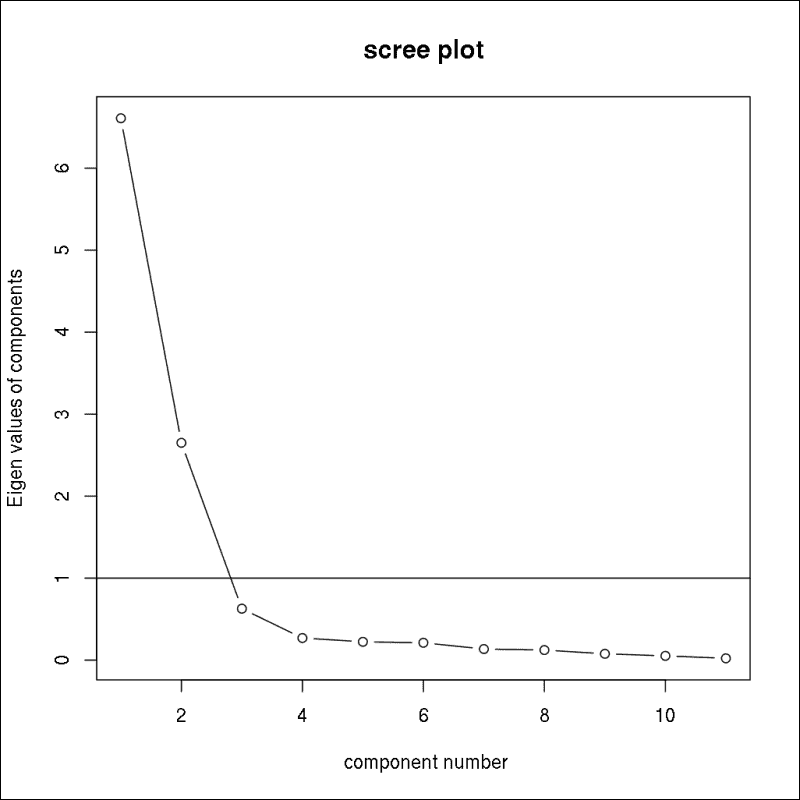

```py
> scree(cor(mtcars))

```

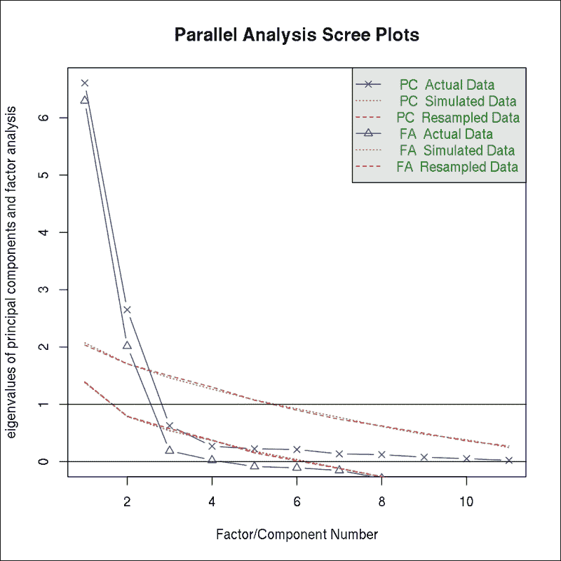

前两个图之间的唯一区别是`scree`除了 PCA 之外还显示了因子分析的特征值。关于这一点，请参阅本章下一节的相关内容。

如所示，`VSS.scree`提供了主成分特征值的视觉概述，并且通过一条水平线突出了 1 的临界值。这通常被称为 Kaiser 标准。

除了这个经验法则之外，正如之前讨论的那样，人们还可以依赖所谓的“肘部法则”，它简单地说，线图代表一条臂，最佳成分数量是这条臂的肘部所在的位置。因此，我们必须寻找曲线变得不那么陡峭的点。在这种情况下，这个尖锐的转折可能是在 3 而不是 2，正如我们使用 Kaiser 标准所发现的那样。

除了 Cattell 的原始 scree 测试之外，我们还可以将之前描述的`scree`与一些随机数据比较，以确定要保留的最佳成分数量：

```py
> fa.parallel(mtcars)

```


```py
Parallel analysis suggests that the number of factors = 2 
and the number of components =  2

```

现在我们已经验证了用于进一步分析的保留主成分的最佳数量，我们可以只使用两个变量而不是 11 个，这真是太好了！但人工创建的这些变量实际上意味着什么呢？

## 解释成分

减少我们数据维度的问题在于，发现我们新创建的、高度压缩和转换的数据实际上是什么可能会非常令人沮丧。现在我们有`PC1`和`PC2`用于我们的 32 辆汽车：

```py
> pc <- prcomp(mtcars, scale = TRUE)
> head(pc$x[, 1:2])
 PC1      PC2
Mazda RX4         -0.646863  1.70811
Mazda RX4 Wag     -0.619483  1.52562
Datsun 710        -2.735624 -0.14415
Hornet 4 Drive    -0.306861 -2.32580
Hornet Sportabout  1.943393 -0.74252
Valiant           -0.055253 -2.74212

```

这些值是通过将原始数据集与识别的权重（所谓的负载或旋转）或成分矩阵相乘得到的。这是一个标准的线性变换：

```py
> head(scale(mtcars) %*% pc$rotation[, 1:2])
 PC1      PC2
Mazda RX4         -0.646863  1.70811
Mazda RX4 Wag     -0.619483  1.52562
Datsun 710        -2.735624 -0.14415
Hornet 4 Drive    -0.306861 -2.32580
Hornet Sportabout  1.943393 -0.74252
Valiant           -0.055253 -2.74212

```

两个变量都经过缩放，均值为零，标准差如前所述：

```py
> summary(pc$x[, 1:2])
 PC1              PC2 
 Min.   :-4.187   Min.   :-2.742 
 1st Qu.:-2.284   1st Qu.:-0.826 
 Median :-0.181   Median :-0.305 
 Mean   : 0.000   Mean   : 0.000 
 3rd Qu.: 2.166   3rd Qu.: 0.672 
 Max.   : 3.892   Max.   : 4.311 
> apply(pc$x[, 1:2], 2, sd)
 PC1    PC2 
2.5707 1.6280 
> pc$sdev[1:2]
[1] 2.5707 1.6280

```

PCA 计算的所有得分都是经过缩放的，因为它总是返回转换到新坐标系（具有正交基）的值，这意味着成分之间不相关且已缩放：

```py
> round(cor(pc$x))
 PC1 PC2 PC3 PC4 PC5 PC6 PC7 PC8 PC9 PC10 PC11
PC1    1   0   0   0   0   0   0   0   0    0    0
PC2    0   1   0   0   0   0   0   0   0    0    0
PC3    0   0   1   0   0   0   0   0   0    0    0
PC4    0   0   0   1   0   0   0   0   0    0    0
PC5    0   0   0   0   1   0   0   0   0    0    0
PC6    0   0   0   0   0   1   0   0   0    0    0
PC7    0   0   0   0   0   0   1   0   0    0    0
PC8    0   0   0   0   0   0   0   1   0    0    0
PC9    0   0   0   0   0   0   0   0   1    0    0
PC10   0   0   0   0   0   0   0   0   0    1    0
PC11   0   0   0   0 
0   0   0   0   0    0    1

```

要了解主成分实际上意味着什么，检查负载矩阵非常有帮助，正如我们之前所看到的：

```py
> pc$rotation[, 1:2]
 PC1       PC2
mpg  -0.36253  0.016124
cyl   0.37392  0.043744
disp  0.36819 -0.049324
hp    0.33006  0.248784
drat -0.29415  0.274694
wt    0.34610 -0.143038
qsec -0.20046 -0.463375
vs   -0.30651 -0.231647
am   -0.23494  0.429418
gear -0.20692  0.462349
carb  0.21402  0.413571

```

可能这个分析表在某些视觉方式上可能更有意义，例如作为一个`biplot`，它不仅显示了原始变量，还显示了基于主成分（红色标签）的新坐标系上的观测值（黑色标签）：

```py
> biplot(pc, cex = c(0.8, 1.2))
> abline(h = 0, v = 0, lty = 'dashed')

```

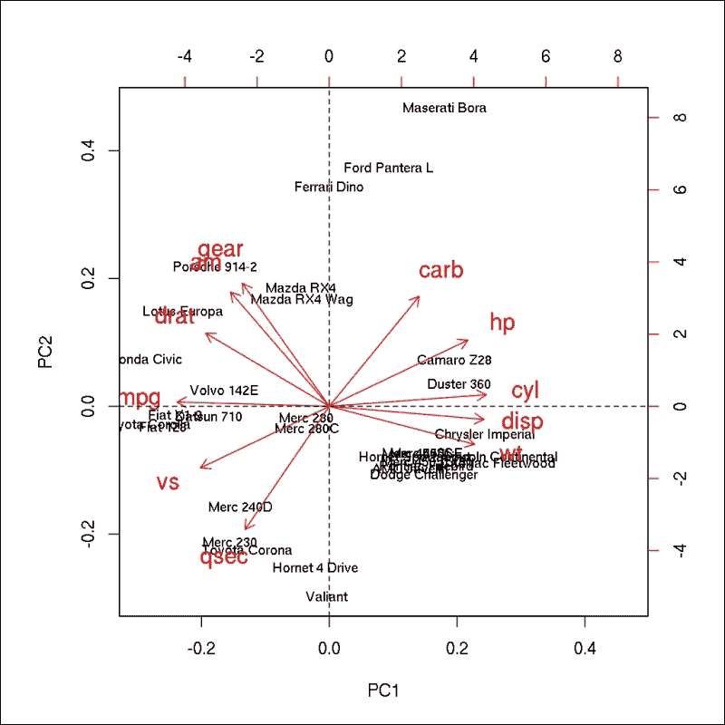

我们可以得出结论，`PC1`主要包含来自气缸数（`cyl`）、排量（`disp`）、重量（`wt`）和油耗（`mpg`）的信息，尽管后者可能降低`PC1`的值。这是通过检查`PC1`轴上的最高和最低值发现的。同样，我们发现`PC2`是由加速（`qsec`）、档位数（`gear`）、化油器（`carb`）和传动类型（`am`）构成的。

为了验证这一点，我们可以轻松地计算原始变量和主成分之间的相关系数：

```py
> cor(mtcars, pc$x[, 1:2])
 PC1       PC2
mpg  -0.93195  0.026251
cyl   0.96122  0.071216
disp  0.94649 -0.080301
hp    0.84847  0.405027
drat -0.75617  0.447209
wt    0.88972 -0.232870
qsec -0.51531 -0.754386
vs   -0.78794 -0.377127
am   -0.60396  0.699103
gear -0.53192  0.752715
carb  0.55017  0.673304

```

这有意义吗？你会如何命名`PC1`和`PC2`？气缸数和排量看起来像是发动机参数，而重量可能更多地受到车身的影响。油耗应该受这两个规格的影响。其他组件的变量处理悬挂，但我们也有速度，更不用说前面矩阵中一串平庸的相关系数了。现在怎么办？

## 旋转方法

基于旋转方法是在子空间中进行的这一事实，旋转总是比之前讨论的 PCA 次优。这意味着旋转后的新轴将解释的方差少于原始组件。

另一方面，旋转简化了组件的结构，因此使得理解和解释结果变得更加容易；因此，这些方法在实践中经常被使用。

### 注意

旋转方法可以（并且通常是）应用于 PCA 和 FA（关于这一点稍后还会讨论）。正交方法更受欢迎。

旋转主要有两种类型：

+   正交，其中新轴相互垂直。组件/因子之间没有相关性。

+   斜交，其中新轴不一定相互垂直；因此，变量之间可能存在一些相关性。

Varimax 旋转是最受欢迎的旋转方法之一。它由凯撒于 1958 年开发，并且自那时起一直很受欢迎。它经常被使用，因为该方法最大化了载荷矩阵的方差，从而得到更可解释的得分：

```py
> varimax(pc$rotation[, 1:2])
$loadings
 PC1    PC2 
mpg  -0.286 -0.223
cyl   0.256  0.276
disp  0.312  0.201
hp           0.403
drat -0.402 
wt    0.356  0.116
qsec  0.148 -0.483
vs          -0.375
am   -0.457  0.174
gear -0.458  0.217
carb -0.106  0.454

 PC1   PC2
SS loadings    1.000 1.000
Proportion Var 0.091 0.091
Cumulative Var 0.091 0.182

$rotmat
 [,1]    [,2]
[1,]  0.76067 0.64914
[2,] -0.64914 0.76067

```

现在第一个成分似乎主要受到传动类型、档位数和后轴比（negatively dominated）的影响，而第二个成分则受到加速、马力和化油器数量的影响。这表明将`PC2`命名为`power`，而`PC1`则指代`transmission`。让我们看看在这个新坐标系中的这 32 辆汽车：

```py
> pcv <- varimax(pc$rotation[, 1:2])$loadings
> plot(scale(mtcars) %*% pcv, type = 'n',
+     xlab = 'Transmission', ylab = 'Power')
> text(scale(mtcars) %*% pcv, labels = rownames(mtcars))

```

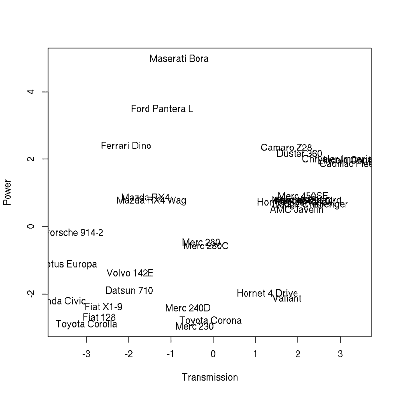

基于前面的图，每个数据科学家都应该从左上象限选择一辆车来搭配顶级车型，对吧？这些车在*y*轴上拥有强大的动力，在*x*轴上显示了良好的传动系统——不要忘记传动与原始变量呈负相关。但让我们看看其他旋转方法及其优势吧！

Quartimax 旋转也是一种正交方法，它最小化了解释每个变量所需组件的数量。这通常会导致一个一般成分和额外的较小成分。当需要 Varimax 和 Quartimax 旋转方法之间的折衷方案时，你可能选择 Equimax 旋转。

斜旋转方法包括 Oblimin 和 Promax，这些方法在基本统计或高度使用的`psych`包中不可用。相反，我们可以加载`GPArotation`包，它为 PCA 和 FA 提供了广泛的旋转方法。为了演示目的，让我们看看 Promax 旋转是如何工作的，它比例如 Oblimin 快得多：

```py
> library(GPArotation)
> promax(pc$rotation[, 1:2])
$loadings

Loadings:
 PC1    PC2 
mpg  -0.252 -0.199
cyl   0.211  0.258
disp  0.282  0.174
hp           0.408
drat -0.416 
wt    0.344 
qsec  0.243 -0.517
vs          -0.380
am   -0.502  0.232
gear -0.510  0.276
carb -0.194  0.482

 PC1   PC2
SS loadings    1.088 1.088
Proportion Var 0.099 0.099
Cumulative Var 0.099 0.198

$rotmat
 [,1]    [,2]
[1,]  0.65862 0.58828
[2,] -0.80871 0.86123

> cor(promax(pc$rotation[, 1:2])$loadings)
 PC1      PC2
PC1  1.00000 -0.23999
PC2 -0.23999  1.00000

```

最后一条命令的结果支持这样的观点：斜旋转方法生成的分数可能相关，这与运行正交旋转时不同。

## PCA 中的异常值检测

PCA 除了用于探索性数据分析之外，还可以用于各种目标。例如，我们可以使用 PCA 生成特征脸、压缩图像、分类观察结果，或通过图像过滤在多维空间中检测异常值。现在，我们将构建一个在 2012 年 R-bloggers 上发布的相关研究帖子中讨论的简化模型：[`www.r-bloggers.com/finding-a-pin-in-a-haystack-pca-image-filtering`](http://www.r-bloggers.com/finding-a-pin-in-a-haystack-pca-image-filtering)。

帖子中描述的挑战是在火星上由好奇号漫游车拍摄的沙子照片中检测到异物。该图像可以在官方 NASA 网站上找到，网址为[`www.nasa.gov/images/content/694811main_pia16225-43_full.jpg`](http://www.nasa.gov/images/content/694811main_pia16225-43_full.jpg)，我为未来使用创建了缩短的 URL：[`bit.ly/nasa-img`](http://bit.ly/nasa-img)。

在以下图像中，你可以看到一个在沙子中用黑色圆圈突出显示的奇怪金属物体，以确保你知道我们在寻找什么。在前面 URL 中找到的图像没有这个突出显示：


现在让我们使用一些统计方法来识别该物体，而不需要（太多）人为干预！首先，我们需要从互联网上下载图像并将其加载到 R 中。`jpeg`包在这里将非常有帮助：

```py
>
 library(jpeg)
> t <- tempfile()
> download.file('http://bit.ly/nasa-img', t)
trying URL 'http://bit.ly/nasa-img'
Content type 'image/jpeg' length 853981 bytes (833 Kb)
opened URL
==================================================
downloaded 833 Kb

>
 img <- readJPEG(t)
> str(img)
 num [1:1009, 1:1345, 1:3] 0.431 0.42 0.463 0.486 0.49 ...

```

`readJPEG`函数返回图片中每个像素的 RGB 值，结果是一个三维数组，其中第一个维度是行，第二个维度是列，第三个维度包括三个颜色值。

### 注意

RGB 是一种加色模型，可以通过给定强度和可选透明度混合红色、绿色和蓝色来重现各种颜色。这种颜色模型在计算机科学中高度使用。

由于 PCA 需要一个矩阵作为输入，我们必须将这个三维数组转换为二维数据集。为此，让我们暂时不要担心像素的顺序，因为我们稍后可以重建它，但让我们简单地列出所有像素的 RGB 值，一个接一个：

```py
> h <- dim(img)[1]
> w <- dim(img)[2]
> m <- matrix(img, h*w)
> str(m)
 num [1:1357105, 1:3] 0.431 0.42 0.463 0.486 0.49 ...

```

简而言之，我们将图像的原始高度（以像素为单位）保存在变量`h`中，将宽度保存在`w`中，然后将 3D 数组转换为具有 1,357,105 行的矩阵。然后，经过四行数据加载和三行数据转换，我们最后可以调用实际的、相对简化的统计方法：

```py
> pca <- prcomp(m)

```

正如我们之前看到的，数据科学家确实大多数时间都在处理数据准备，而实际的数据分析可以轻松完成，对吧？

提取的成分似乎表现相当好；第一个成分解释了超过 96%的方差：

```py
> summary(pca)
Importance of components:
 PC1    PC2     PC3
Standard deviation     0.277 0.0518 0.00765
Proportion of Variance 0.965 0.0338 0.00074
Cumulative Proportion  0.965 0.9993 1.00000

```

以前，解释 RGB 值相当直接，但这些成分又意味着什么呢？

```py
> pca$rotation
 PC1      PC2      PC3
[1,] -0.62188  0.71514  0.31911
[2,] -0.57409 -0.13919 -0.80687
[3,] -0.53261 -0.68498  0.49712

```

看起来第一个成分与所有三种颜色混合得相当多，第二个成分缺少绿色，而第三个成分几乎只包含绿色。为什么不可视化这些人工值，而不是试图想象它们看起来如何呢？为此，让我们通过以下快速辅助函数从先前的成分/加载矩阵中提取颜色强度：

```py
> extractColors <- function(x)
+     rgb(x[1], x[2], x[3])

```

在成分矩阵的绝对值上调用此方法会产生描述主成分的十六进制颜色代码：

```py
> (colors <- apply(abs(pca$rotation), 2, extractColors))
 PC1       PC2       PC3 
"#9F9288" "#B623AF" "#51CE7F"

```

这些颜色代码可以轻松渲染——例如，在饼图中，饼的面积代表主成分的解释方差：

```py
> pie(pca$sdev, col = colors, labels = colors)

```

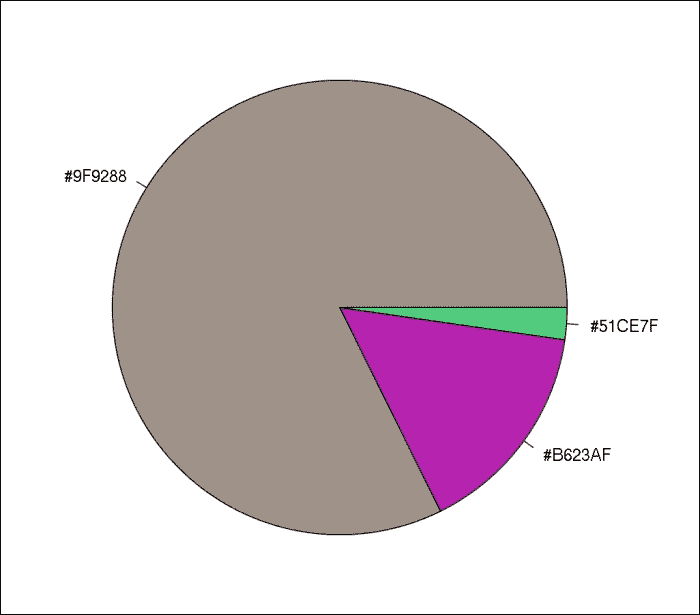

现在我们不再有存储在`pca$x`中的红色、绿色或蓝色强度或实际颜色，而是主成分用之前显示的可视化颜色描述每个像素。正如之前讨论的，第三个成分代表绿色色调，第二个成分缺少绿色（导致紫色），而第一个成分包含来自所有 RGB 颜色的相当高的值，结果产生棕黄色调，这在知道照片是在火星沙漠中拍摄的时并不令人惊讶。

现在我们可以用单色颜色渲染原始图像，以显示主成分的强度。以下几行代码基于`PC1`和`PC2`生成了好奇号及其环境的两张修改后的照片：

```py
> par(mfrow = c(1, 2), mar = rep(0, 4))
> image(matrix(pca$x[, 1], h), col = gray.colors(100))
> image(matrix(pca$x[, 2], h), col = gray.colors(100), yaxt = 'n')

```

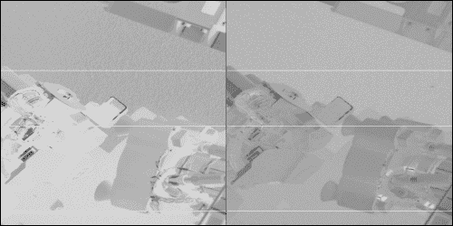

虽然图像在一些线性变换中被旋转了 90 度，但很明显，第一张图像在寻找沙子中的异物方面并没有真正有帮助。事实上，这张图像代表了沙漠地区的噪声，因为`PC1`包含了类似沙子的颜色强度，所以这个成分对于描述棕黄色调的多样性是有用的。

另一方面，第二个成分很好地突出了沙子中的金属物体！由于正常沙子中紫色比例低，所有周围的像素都很暗，而异常物体则相当暗。

我真的很喜欢这段 R 代码和简化的例子：虽然它们仍然足够基本以便于理解，但它们也展示了 R 的力量以及如何使用标准数据分析方法从原始数据中提取信息。

# 因子分析

尽管关于验证性**因子分析**（**FA**）的文献非常令人印象深刻，并且在社会科学等领域被广泛使用，但我们将只关注探索性 FA，我们的目标是根据其他经验数据识别一些未知、未观察到的变量。

因子分析的潜在变量模型最早由 Spearman 于 1904 年提出，用于一个因子，然后在 1947 年 Thurstone 将该模型推广到多个因子。这个统计模型假设数据集中可用的显变量是未观察到的潜在变量的结果，这些潜在变量可以通过观察数据追踪。

FA 可以处理连续（数值）变量，并且模型表明每个观察到的变量是某些未知、潜在因子的总和。

### 注意

请注意，在执行 FA 之前，检查正态性、KMO 和 Bartlett 的测试比 PCA 更重要；后者是一种描述性方法，而在 FA 中，我们实际上是在构建一个模型。

最常用的探索性因子分析（FA）方法是最大似然 FA，这在已安装的`stats`包中的`factanal`函数中也是可用的。其他分解方法由`psych`包中的`fa`函数提供，例如**普通最小二乘法**（**OLS**）、**加权最小二乘法**（**WLS**）、**广义加权最小二乘法**（**GLS**）或主因子解。这些函数以原始数据或协方差矩阵作为输入。

为了演示目的，让我们看看默认的分解方法在`mtcars`的一个子集上的表现。让我们提取所有与性能相关的变量，除了排量，因为排量可能负责所有其他相关指标：

```py
> m <- subset(mtcars, select = c(mpg, cyl, hp, carb))

```

现在只需调用并保存前面`data.frame`上的`fa`结果：

```py
> (f <- fa(m))
Factor Analysis using method =  minres
Call: fa(r = m)
Standardized loadings (pattern matrix) based upon correlation matrix
 MR1   h2   u2 com
mpg  -0.87 0.77 0.23   1
cyl   0.91 0.83 0.17   1
hp    0.92 0.85 0.15   1
carb  0.69 0.48 0.52   1

 MR1
SS loadings    2.93
Proportion Var 0.73

Mean item complexity =  1
Test of the hypothesis that 1 factor is sufficient.

The degrees of freedom for the null model are  6 
and the objective function was  3.44 with Chi Square of  99.21
The degrees of freedom for the model are 2
and the objective function was  0.42 

The root mean square of the residuals (RMSR) is  0.07 
The df corrected root mean square of the residuals is  0.12 

The harmonic number of observations is  32
with the empirical chi square  1.92  with prob <  0.38 
The total number of observations was  32
with MLE Chi Square =  11.78  with prob <  0.0028 

Tucker Lewis Index of factoring reliability =  0.677
RMSEA index =  0.42
and the 90 % confidence intervals are  0.196 0.619
BIC =  4.84
Fit based upon off diagonal values = 0.99
Measures of factor score adequacy 
 MR1
Correlation of scores with factors             0.97
Multiple R square of scores with factors       0.94
Minimum correlation of possible factor scores  0.87

```

嗯，这是一份相当令人印象深刻的信息量，包含了很多细节！`MR1`代表第一个提取的因子，该因子以默认的分解方法（最小残差或 OLS）命名。由于模型中只包含一个因子，因此因子旋转不是一个选项。有一个测试或假设来检查因子的数量是否足够，并且一些系数代表了一个非常好的模型拟合。

结果可以在以下图表中总结：

```py
> fa.diagram(f)

```

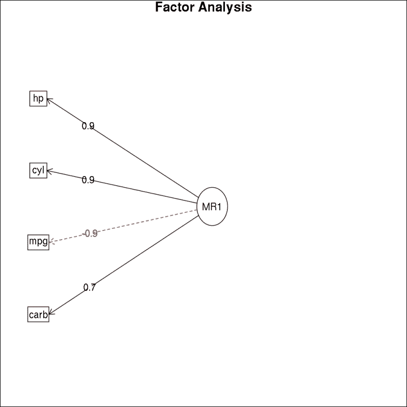

我们可以看到潜在变量和观察变量之间的高相关系数，箭头的方向表明因子对我们的经验数据集中找到的值有影响。猜测这个因子与汽车发动机位移之间的关系！

```py
> cor(f$scores, mtcars$disp)
0.87595

```

嗯，这似乎是一个很好的匹配。

# 主成分分析 versus 因子分析

不幸的是，主成分经常与因子混淆，这两个术语及其相关方法有时被用作同义词，尽管这两种方法的数学背景和目标实际上是非常不同的。

主成分分析（PCA）通过创建主成分来减少变量的数量，这些主成分可以用于后续项目，而不是原始变量。这意味着我们试图通过人工创建的变量来提取数据集的本质，这些变量最好地描述了数据的方差：

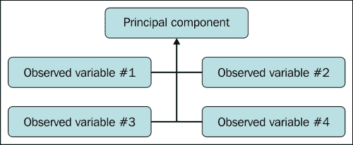

FA 是另一种方法，因为它试图识别未知、潜在变量来解释原始数据。用简单的话说，我们使用来自我们的经验数据集的显性变量来猜测数据的内部结构：

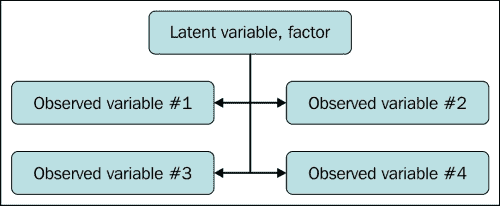

# 多维尺度

**多维尺度**（**MDS**）是一种多变量技术，最初用于地理学。多维尺度（MDS）的主要目标是绘制二维的多变量数据点，通过可视化观察值的相对距离来揭示数据集的结构。MDS 在心理学、社会学和市场研究等众多领域得到应用。

虽然`MASS`包通过`isoMDS`函数提供非度量多维尺度（MDS），但我们将专注于由`stats`包提供的`cmdscale`函数提供的经典度量多维尺度（MDS）。这两种类型的多维尺度都以距离矩阵作为主要参数，并且可以通过`dist`函数从任何数值表格数据创建。

在探索更复杂的例子之前，让我们看看在使用已经存在的距离矩阵时，多维尺度（MDS）能为我们提供什么，例如内置的`eurodist`数据集：

```py
> as.matrix(eurodist)[1:5, 1:5]
 Athens Barcelona Brussels Calais Cherbourg
Athens         0      3313     2963   3175      3339
Barcelona   3313         0     1318   1326      1294
Brussels    2963      1318        0    204       583
Calais      3175      1326      204      0       460
Cherbourg   3339      1294      583    460         0

```

前面的值代表 21 个欧洲城市之间的旅行距离（千米），尽管只显示了前 5-5 个值。运行经典的多维尺度（MDS）相当简单：

```py
> (mds <- cmdscale(eurodist))
 [,1]      [,2]
Athens           2290.2747  1798.803
Barcelona        -825.3828   546.811
Brussels           59.1833  -367.081
Calais            -82.8460  -429.915
Cherbourg        -352.4994  -290.908
Cologne           293.6896  -405.312
Copenhagen        681.9315 -1108.645
Geneva             -9.4234   240.406
Gibraltar       -2048.4491   642.459
Hamburg           561.1090  -773.369
Hook of Holland   164.9218  -549.367
Lisbon          -1935.0408    49.125
Lyons            -226.4232   187.088
Madrid          -1423.3537   305.875
Marseilles       -299.4987   388.807
Milan             260.8780   416.674
Munich            587.6757    81.182
Paris            -156.8363  -211.139
Rome              709.4133  1109.367
Stockholm         839.4459 -1836.791
Vienna            911.2305   205.930

```

这些得分与两个主成分非常相似，例如运行`prcomp(eurodist)$x[, 1:2]`。事实上，主成分分析（PCA）可以被认为是多维尺度（MDS）最基本的方法。

总之，我们已经将 21 维空间转换成了 2 维，这可以很容易地绘制出来（与之前的 21 行 21 列的矩阵不同）：

```py
> plot(mds)

```

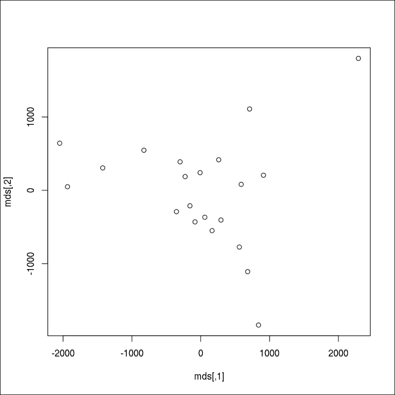

这让你想起什么了吗？如果没有，请随意查看以下图像，其中以下两行代码也显示了城市名称而不是匿名点：

```py
> plot(mds, type = 'n')
> text(mds[, 1], mds[, 2], labels(eurodist))

```

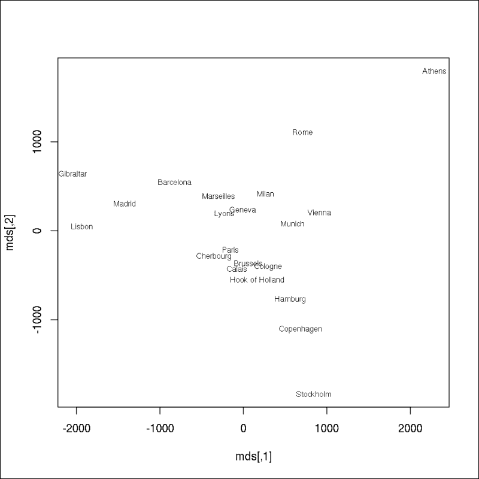

尽管 y 轴被翻转了，你可以通过将文本的第二个参数乘以-1 来修复这个问题，但我们已经根据距离矩阵渲染了一张欧洲城市地图——没有使用任何其他地理数据。我觉得这相当令人印象深刻。

请在第十三章，*我们周围的数据*中查找更多数据可视化技巧和方法。

现在我们来看看如何将 MDS 应用于非地理数据，这些数据并非为成为距离矩阵而准备。让我们回到`mtcars`数据集：

```py
> mds <- cmdscale(dist(mtcars))
> plot(mds, type = 'n')
> text(mds[, 1], mds[, 2], rownames(mds))

```

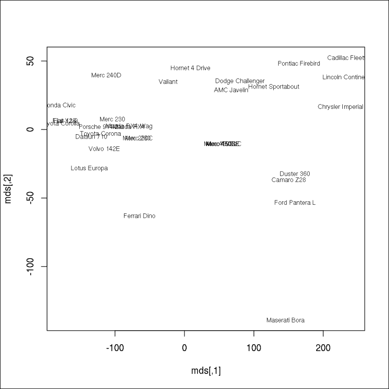

图表显示了原始数据集中的 32 辆汽车在二维空间中的分布。元素之间的距离是通过 MDS 计算的，它考虑了所有 11 个原始变量，因此很容易识别出相似和非常不同的汽车类型。我们将在下一章中更详细地介绍这些主题，第十章，*分类和聚类*。

# 摘要

在本章中，我们介绍了几种处理多元数据的方法，以减少人工计算连续变量中的可用维度，并识别潜在的、隐含的和类似的数值变量。另一方面，有时用数字描述现实相当困难，我们更应该按类别思考。

下一章将介绍新的方法来定义数据类型（聚类），并还将演示如何利用可用训练数据对元素进行分类。
