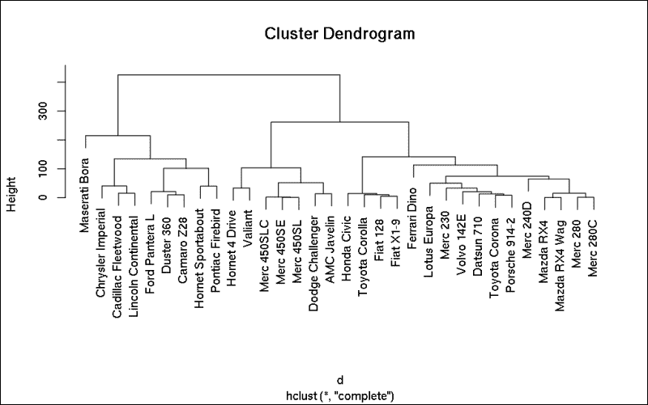
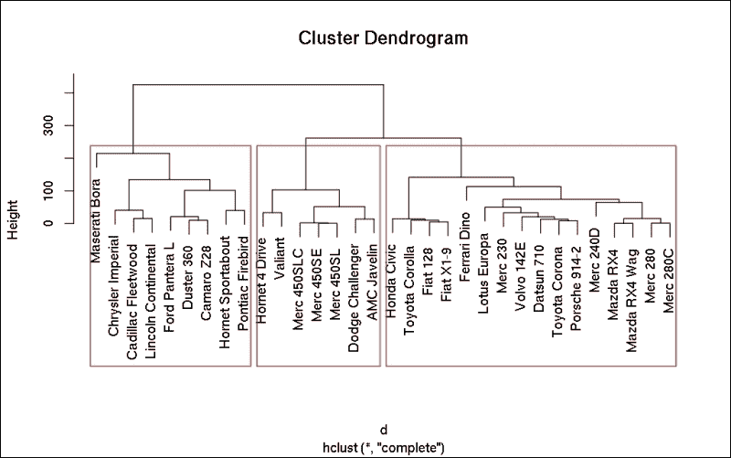
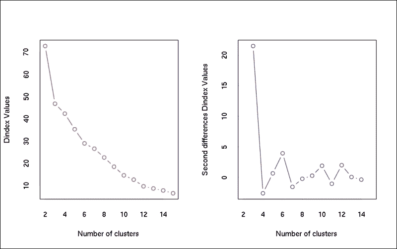
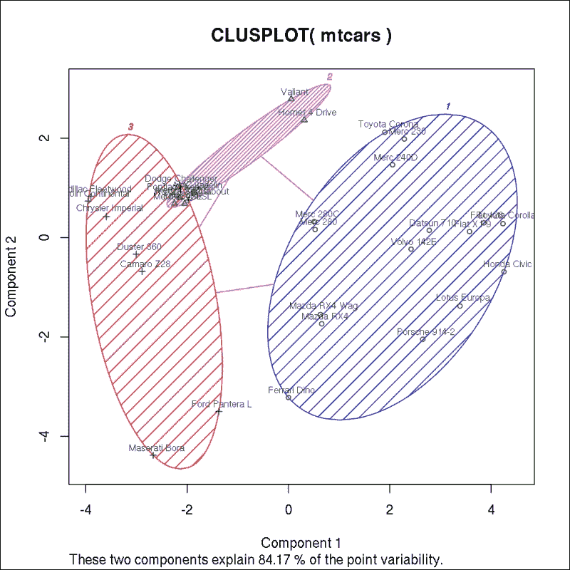
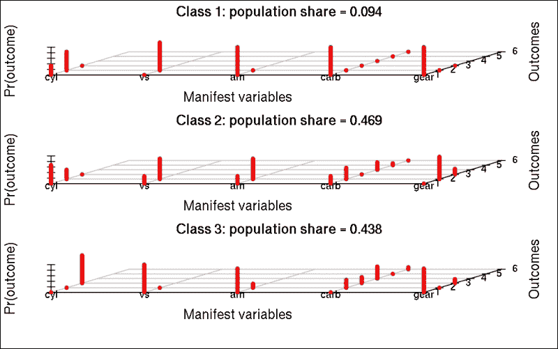
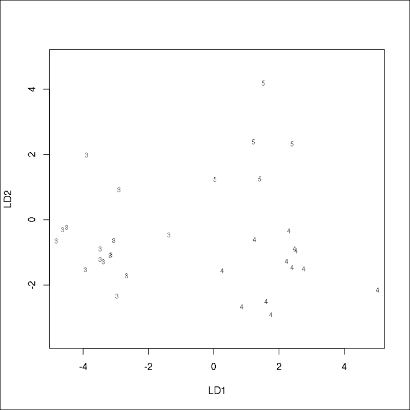
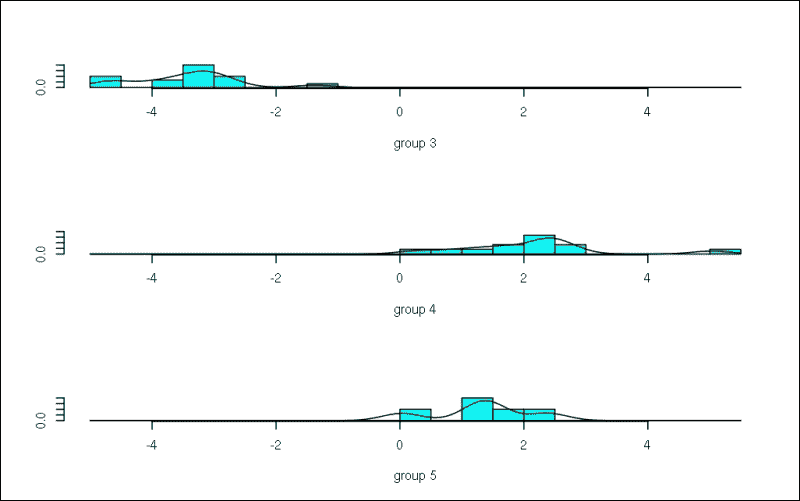
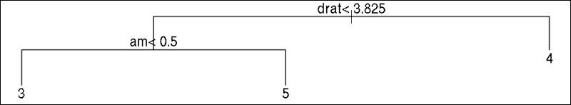
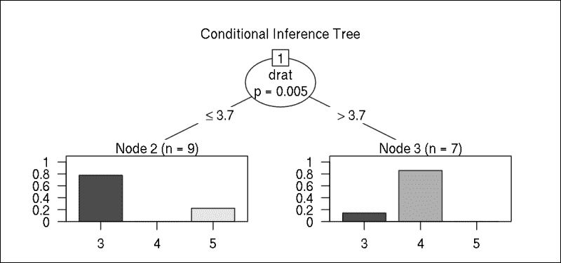
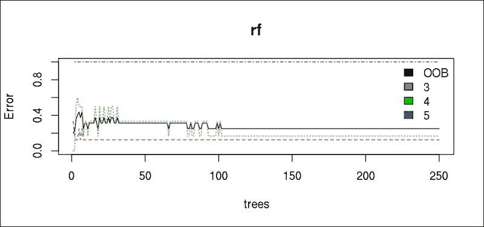

# 第十章 分类与聚类

在上一章中，我们关注了如何将多个连续变量中找到的信息压缩成更小的数字集，但当处理分类数据时，例如分析调查数据时，这些统计方法就有些局限了。

尽管一些方法试图将离散变量转换为数值变量，例如通过使用多个虚拟变量或指示变量，但在大多数情况下，简单地考虑我们的研究设计目标而不是试图强行在分析中使用先前学到的方 法会更好。

### 注意

我们可以通过为原始离散变量的每个标签创建一个新变量来用多个虚拟变量替换一个分类变量，然后为相关列分配*1*，为所有其他列分配*0*。这些值可以用作统计分析中的数值变量，尤其是在回归模型中。

当我们通过分类变量分析样本和目标总体时，我们通常对单个案例不感兴趣，而是对相似元素和组感兴趣。相似元素可以定义为数据集中具有相似列值的行。

在本章中，我们将讨论不同的*监督*和*无监督*方法来识别数据集中的相似案例，例如：

+   层次聚类

+   K-均值聚类

+   一些机器学习算法

+   隐含类模型

+   判别分析

+   逻辑回归

# 聚类分析

**聚类**是一种无监督数据分析方法，在多个领域得到应用，如模式识别、社会科学和药学。聚类分析的目标是创建同质子组，称为簇，其中同一簇中的对象相似，而簇之间相互不同。

## 层次聚类

聚类分析是已知的最著名和最受欢迎的图案识别方法之一；因此，有许多聚类模型和算法在数据集中分析分布、密度、可能的中心点等。在本节中，我们将探讨一些层次聚类方法。

**层次聚类**可以是聚合的或划分的。在聚合方法中，每个案例最初都是一个单独的簇，然后通过迭代方式将最近的簇合并在一起，直到最终合并成一个包含原始数据集所有元素的单一簇。这种方法的最大问题是每次迭代都必须重新计算簇之间的距离，这使得在大数据集上非常慢。我宁愿不推荐尝试在`hflights`数据集上运行以下命令。

相反，划分方法采用自上而下的方法。它们从一个单一簇开始，然后迭代地将其划分为更小的组，直到它们都是单例。

`stats`包包含用于层次聚类的`hclust`函数，它接受距离矩阵作为输入。为了了解它是如何工作的，让我们使用已经分析过的`mtcars`数据集，它在第三章，*过滤和汇总数据*和第九章，*从大数据到小数据*中已经分析过。`dist`函数在后面的章节中也是熟悉的：

```py
> d <- dist(mtcars)
> h <- hclust(d)
> h

Call:
hclust(d = d)

Cluster method   : complete 
Distance         : euclidean 
Number of objects: 32

```

好吧，这是一个过于简略的输出，仅表明我们的距离矩阵包含了 32 个元素以及聚类方法。对于如此小的数据集，结果的视觉表示将更有用：

```py
> plot(h)

```



通过绘制这个`hclust`对象，我们得到了一个*树状图*，它显示了聚类是如何形成的。这有助于确定簇的数量，尽管在包含大量案例的数据集中，它变得难以解释。可以在*y*轴的任何给定高度上画一条水平线，这样与线的交点数量*n*就提供了一个 n 簇的解决方案。

R 可以提供非常方便的方式来在*树状图*上可视化簇。在下面的图表中，红色方框显示了在前面图表之上的三个簇解决方案的簇成员资格：

```py
> plot(h)
> rect.hclust(h, k=3, border = "red")

```



虽然这个图表看起来很漂亮，并且将相似元素分组在一起非常有用，但对于更大的数据集，它变得难以看透。相反，我们可能更感兴趣的是在向量中实际表示的簇成员资格：

```py
> (cn <- cutree(h, k = 3))
 Mazda RX4       Mazda RX4 Wag          Datsun 710 
 1                   1                   1 
 Hornet 4 Drive   Hornet Sportabout             Valiant 
 2                   3                   2 
 Duster 360           Merc 240D            Merc 230 
 3                   1                   1 
 Merc 280           Merc 280C          Merc 450SE 
 1                   1                   2 
 Merc 450SL         Merc 450SLC  Cadillac Fleetwood 
 2                   2                   3 
Lincoln Continental   Chrysler Imperial            Fiat 128 
 3                   3                   1 
 Honda Civic      Toyota Corolla       Toyota Corona 
 1                   1                   1 
 Dodge Challenger         AMC Javelin          Camaro Z28 
 2                   2                   3 
 Pontiac Firebird           Fiat X1-9       Porsche 914-2 
 3                   1                   1 
 Lotus Europa      Ford Pantera L        Ferrari Dino 
 1                   3                   1 
 Maserati Bora          Volvo 142E 
 3                   1

```

以及结果簇中元素数量的频率表：

```py
> table(cn)
 1  2  3 
16  7  9

```

看起来，*簇 1*，在前面图表中的第三个簇，包含的元素最多。你能猜出这个组与其他两个簇有什么不同吗？好吧，那些熟悉汽车名称的读者可能能够猜出答案，但让我们看看数字实际上显示了什么：

### 注意

请注意，在以下示例中，我们使用`round`函数将代码输出中的小数位数限制为 1 或 4，以适应页面宽度。

```py
> round(aggregate(mtcars, FUN = mean, by = list(cn)), 1)
 Group.1  mpg cyl  disp    hp drat  wt qsec  vs  am gear carb
1       1 24.5 4.6 122.3  96.9  4.0 2.5 18.5 0.8 0.7  4.1  2.4
2       2 17.0 7.4 276.1 150.7  3.0 3.6 18.1 0.3 0.0  3.0  2.1
3       3 14.6 8.0 388.2 232.1  3.3 4.2 16.4 0.0 0.2  3.4  4.0

```

在簇之间的平均性能和油耗之间有一个非常显著的区别！那么组内的标准差如何呢？

```py
> round(aggregate(mtcars, FUN = sd, by = list(cn)), 1)
 Group.1 mpg cyl disp   hp drat  wt qsec  vs  am gear carb
1       1 5.0   1 34.6 31.0  0.3 0.6  1.8 0.4 0.5  0.5  1.5
2       2 2.2   1 30.2 32.5  0.2 0.3  1.2 0.5 0.0  0.0  0.9
3       3 3.1   0 58.1 49.4  0.4 0.9  1.3 0.0 0.4  0.9  1.7

```

这些值与原始数据集中的标准差相比相当低：

```py
> round(sapply(mtcars, sd), 1)
 mpg   cyl  disp    hp  drat    wt  qsec    vs    am  gear  carb 
 6.0   1.8 123.9  68.6   0.5   1.0   1.8   0.5   0.5   0.7   1.6

```

同样，当比较组之间的标准差时也是如此：

```py
> round(apply(
+   aggregate(mtcars, FUN = mean, by = list(cn)),
+   2, sd), 1)
Group.1     mpg     cyl    disp      hp    drat      wt    qsec 
 1.0     5.1     1.8   133.5    68.1     0.5     0.8     1.1 
 vs      am    gear    carb 
 0.4     0.4     0.6     1.0

```

这意味着我们实现了我们的原始目标，即识别数据中的相似元素并将它们组织成彼此不同的组。但为什么我们要将原始数据分成恰好三个人为定义的组？为什么不是两个、四个，甚至更多？

## 确定理想簇的数量

`NbClust` 包提供了一种非常方便的方法，在运行实际的聚类分析之前，可以对我们的数据进行一些探索性数据分析。该包的主要功能可以计算 30 种不同的指标，所有这些指标都是为了确定理想的组数。这些包括：

+   单链接

+   平均值

+   完全链接

+   McQuitty

+   质心（聚类中心）

+   中位数

+   K-means

+   Ward

在加载包之后，让我们从一种表示数据中可能聚类数量的可视化方法开始——膝形图，这可能在第九章中很熟悉，*从大数据到小数据*，在那里你还可以找到关于以下肘部规则的更多信息：

```py
> library(NbClust)
> NbClust(mtcars, method = 'complete', index = 'dindex')

```



在前面的图表中，我们传统上寻找 *肘部*，但右侧的第二差分图可能对大多数读者来说更直接。在那里，我们感兴趣的是最显著的峰值在哪里，这表明在聚类 `mtcars` 数据集时选择三个组将是理想的。

不幸的是，在如此小的数据集上运行所有 `NbClust` 方法都失败了。因此，为了演示目的，我们现在只运行一些标准方法，并通过相关列表元素过滤结果以建议的聚类数量：

```py
> NbClust(mtcars, method = 'complete', index = 'hartigan')$Best.nc
All 32 observations were used. 

Number_clusters     Value_Index 
 3.0000         34.1696 
> NbClust(mtcars, method = 'complete', index = 'kl')$Best.nc
All 32 observations were used. 

Number_clusters     Value_Index 
 3.0000          6.8235

```

Hartigan 和 Krzanowski-Lai 指数都建议坚持三个聚类。让我们也查看 `iris` 数据集，它包含更多案例且数值列较少，因此我们可以运行所有可用方法：

```py
> NbClust(iris[, -5], method = 'complete', index = 'all')$Best.nc[1,]
All 150 observations were used. 

******************************************************************* 
* Among all indices: 
* 2 proposed 2 as the best number of clusters 
* 13 proposed 3 as the best number of clusters 
* 5 proposed 4 as the best number of clusters 
* 1 proposed 6 as the best number of clusters 
* 2 proposed 15 as the best number of clusters 

 ***** Conclusion ***** 

* According to the majority rule, the best number of clusters is  3 

 ******************************************************************* 
 KL         CH   Hartigan        CCC      Scott    Marriot 
 4          4          3          3          3          3 
 TrCovW     TraceW   Friedman      Rubin     Cindex         DB 
 3          3          4          6          3          3 
Silhouette       Duda   PseudoT2      Beale  Ratkowsky       Ball 
 2          4          4          3          3          3 
PtBiserial       Frey    McClain       Dunn     Hubert    SDindex 
 3          1          2         15          0          3 
 Dindex       SDbw 
 0         15

```

输出总结表明，基于返回该数字的 13 种方法，有五种进一步的方法建议四个聚类，还有一些其他聚类数量也由更少的方法计算得出。

这些方法不仅适用于之前讨论过的层次聚类，而且通常也用于 k-means 聚类分析，其中在运行分析之前需要定义聚类数量——与层次方法不同，在重计算已经完成之后我们才切割树状图。

## K-means 聚类分析

**K-means 聚类分析**是一种非层次方法，最早由 MacQueen 在 1967 年描述。它相对于层次聚类的最大优势是其出色的性能。

### 注意

与层次聚类分析不同，k-means 聚类分析要求你在实际分析运行之前确定聚类数量。

算法简要运行以下步骤：

1.  在空间中初始化一个预定义的（*k*）数量随机选择的质心。

1.  将每个对象分配到最近的质心的聚类中。

1.  重新计算质心。

1.  重复第二步和第三步，直到收敛。

我们将使用`stats`包中的`kmeans`函数。由于 k 均值聚类需要对簇的数量做出先前的决定，我们可以使用之前描述的`NbClust`函数，或者我们可以提出一个符合分析目标的任意数字。

根据上一节中定义的最佳簇数量，我们将坚持三个组，其中簇内平方和不再显著下降：

```py
> (k <- kmeans(mtcars, 3))
K-means clustering with 3 clusters of sizes 16, 7, 9

Cluster means:
 mpg      cyl     disp       hp     drat       wt     qsec
1 24.50000 4.625000 122.2937  96.8750 4.002500 2.518000 18.54312
2 17.01429 7.428571 276.0571 150.7143 2.994286 3.601429 18.11857
3 14.64444 8.000000 388.2222 232.1111 3.343333 4.161556 16.40444
 vs        am     gear     carb
1 0.7500000 0.6875000 4.125000 2.437500
2 0.2857143 0.0000000 3.000000 2.142857
3 0.0000000 0.2222222 3.444444 4.000000

Clustering vector:
 Mazda RX4       Mazda RX4 Wag          Datsun 710 
 1                   1                   1 
 Hornet 4 Drive   Hornet Sportabout             Valiant 
 2                   3                   2 
 Duster 360           Merc 240D            Merc 230 
 3                   1                   1 
 Merc 280           Merc 280C          Merc 450SE 
 1                   1                   2 
 Merc 450SL         Merc 450SLC  Cadillac Fleetwood 
 2                   2                   3 
Lincoln Continental   Chrysler Imperial            Fiat 128 
 3                   3                   1 
 Honda Civic      Toyota Corolla       Toyota Corona 
 1                   1                   1 
 Dodge Challenger         AMC Javelin          Camaro Z28 
 2                   2                   3 
 Pontiac Firebird           Fiat X1-9       Porsche 914-2 
 3                   1                   1 
 Lotus Europa      Ford Pantera L        Ferrari Dino 
 1                   3                   1 
 Maserati Bora          Volvo 142E 
 3                   1 

Within cluster sum of squares by cluster:
[1] 32838.00 11846.09 46659.32
 (between_SS / total_SS =  85.3 %)

Available components:

[1] "cluster"      "centers"      "totss"        "withinss" 
[5] "tot.withinss" "betweenss"    "size"         "iter" 
[9] "ifault" 

```

簇均值显示了每个簇的一些非常重要的特征，我们在上一节中手动为层次聚类生成了这些特征。我们可以看到，在第一个簇中，汽车的平均油耗（低耗油量）很高，平均有四个汽缸（与六个或八个汽缸相比），性能相对较低，等等。输出还自动揭示了实际的簇编号。

让我们比较这些与层次方法定义的簇：

```py
> all(cn == k$cluster)
[1] TRUE

```

结果似乎相当稳定，对吧？

### 小贴士

簇编号没有意义，它们的顺序是任意的。换句话说，簇成员资格是一个名义变量。基于此，当簇编号以不同的顺序分配时，前面的 R 命令可能会返回`FALSE`而不是`TRUE`，但比较实际的簇成员资格将验证我们已经找到了完全相同的群体。例如，查看`cbind(cn, k$cluster)`以生成包括簇成员资格的表格。

## 可视化簇

绘制这些簇也是理解分组的一种很好的方式。为此，我们将使用`clusplot`函数，该函数来自`cluster`包。为了更容易理解，此函数将维度数量减少到两个，类似于我们在进行 PCA 或 MDS（在第九章中描述，*从大数据到小数据*）时的情况：

```py
> library(cluster) 
> clusplot(mtcars, k$cluster, color = TRUE, shade = TRUE, labels = 2)

```



如您所见，在降维后，两个成分解释了 84.17%的方差，因此这种小的信息损失是易于理解簇的一个很好的权衡。

使用`shade`参数可视化椭圆的相对密度也可以帮助我们了解同一组元素之间的相似性。我们还使用了标签参数来显示点和簇标签。在可视化大量元素时，请务必坚持默认的*0*（无标签）或*4*（仅椭圆标签）。

# 潜在类别模型

**潜在类别分析**（**LCA**）是一种识别多色结果变量中潜在变量的方法。它与因子分析类似，但可以用于离散/分类数据。为此，LCA 主要在分析调查时使用。

在本节中，我们将使用`poLCA`包中的`poLCA`函数。它使用期望最大化算法和牛顿-拉夫森算法来寻找参数的最大似然值。

`poLCA`函数要求数据编码为从一开始的整数或因子，否则将产生错误信息。为此，让我们将`mtcars`数据集中的某些变量转换为因子：

```py
> factors <- c('cyl', 'vs', 'am', 'carb', 'gear')
> mtcars[, factors] <- lapply(mtcars[, factors], factor)

```

### 小贴士

上述命令将覆盖当前 R 会话中的`mtcars`数据集。要恢复到本章其他示例中的原始数据集，请通过`rm(mtcars)`删除此更新后的数据集，如果需要的话。

## 潜在类别分析

现在数据已处于适当的格式，我们可以进行 LCA。相关的函数附带了许多重要的参数：

+   首先，我们必须定义一个描述模型的公式。根据公式，我们可以定义 LCA（类似于聚类，但使用离散变量）或**潜在类别回归**（**LCR**）模型。

+   `nclass`参数指定模型中假设的潜在类别数量，默认为 2。根据本章前面的示例，我们将将其覆盖为 3。

+   我们可以使用`maxiter`、`tol`、`probs.start`和`nrep`参数来微调模型。

+   `graphs`参数可以显示或抑制参数估计。

让我们从由所有可用离散变量定义的三个潜在类的基本 LCA 开始：

```py
> library(poLCA)
> p <- poLCA(cbind(cyl, vs, am, carb, gear) ~ 1,
+   data = mtcars, graphs = TRUE, nclass = 3)

```

输出的第一部分（也可以通过先前保存的`poLCA`列表的`probs`元素访问）总结了每个潜在类别对结果变量的概率：

```py
> p$probs
Conditional item response (column) probabilities,
 by outcome variable, for each class (row) 

$cyl
 4      6 8
class 1:  0.3333 0.6667 0
class 2:  0.6667 0.3333 0
class 3:  0.0000 0.0000 1

$vs
 0      1
class 1:  0.0000 1.0000
class 2:  0.2667 0.7333
class 3:  1.0000 0.0000

$am
 0      1
class 1:  1.0000 0.0000
class 2:  0.2667 0.7333
class 3:  0.8571 0.1429

$carb
 1      2      3      4      6      8
class 1:  1.0000 0.0000 0.0000 0.0000 0.0000 0.0000
class 2:  0.2667 0.4000 0.0000 0.2667 0.0667 0.0000
class 3:  0.0000 0.2857 0.2143 0.4286 0.0000 0.0714
$gear
 3   4      5
class 1:  1.0000 0.0 0.0000
class 2:  0.0000 0.8 0.2000
class 3:  0.8571 0.0 0.1429

```

从这些概率中，我们可以看到所有 8 缸汽车都属于第三类，第一类只包括自动变速、一个化油器、三个档位等的汽车。通过在函数调用中将图形参数设置为`TRUE`，或者直接在调用后调用绘图函数，也可以绘制出完全相同的值：



该图也很有用，可以突出显示与其他类别相比，第一个潜在类别只包含少数几个元素（也称为“估计类别人口份额”）：

```py
> p$P
[1] 0.09375 0.46875 0.43750

```

`poLCA`对象还可以揭示关于结果的其他许多重要信息。仅举几例，让我们看看对象的命名列表部分，可以通过标准的`$`运算符提取：

+   `predclass`返回最可能的类别成员资格

+   另一方面，后验元素是一个矩阵，包含每个案例的类别成员概率

+   **赤池信息准则**（`aic`）、**贝叶斯信息准则**（`bic`）、**偏差**（`Gsq`）和`Chisq`值代表不同的拟合优度度量

## LCR 模型

另一方面，LCR 模型是一种监督方法，在探索性数据分析尺度上，我们主要不感兴趣的是解释我们观察到的潜在变量，而是使用训练数据，其中一个或多个协变量预测潜在类别成员的概率。

# 判别分析

**判别函数分析**（**DA**）指的是确定哪些连续的独立（预测）变量可以区分离散的依赖（响应）变量的类别，这可以被视为反向的**多元方差分析**（**MANOVA**）。

这表明 DA 与逻辑回归非常相似（见第六章"), *超越线性趋势线 (由 Renata Nemeth 和 Gergely Toth 撰写)*以及以下章节），由于其灵活性而更广泛地使用。虽然逻辑回归可以处理分类和连续数据，但 DA 需要数值独立变量，并且有一些逻辑回归没有的进一步要求：

+   假设正态分布

+   应消除异常值

+   两个变量不应高度相关（多重共线性）

+   最小类别的样本量应高于预测值的数量

+   独立变量的数量不应超过样本量

有两种不同的 DA 类型，我们将使用`MASS`包中的`lda`进行线性判别函数，以及`qda`进行二次判别函数。

让我们从依赖变量是齿轮数量开始，并将所有其他数值作为独立变量。为了确保我们从标准`mtcars`数据集开始，该数据集在前面的示例中没有覆盖，让我们清除命名空间并更新齿轮列，以包含类别而不是实际的数值：

```py
> rm(mtcars)
> mtcars$gear <- factor(mtcars$gear)

```

由于观察值数量较少（并且我们已经讨论了第九章, *从大数据到小数据*中的相关选项），我们现在可以暂时搁置进行正态性和其他测试。让我们继续实际分析。

我们调用`lda`函数，将**交叉验证**（**CV**）设置为`TRUE`，以便我们可以测试预测的准确性。公式中的点代表所有变量，除了明确提到的齿轮：

```py
> library(MASS)
> d <- lda(gear ~ ., data = mtcars, CV =TRUE)

```

因此，现在我们可以通过比较混淆矩阵来检查预测的准确性：

```py
> (tab <- table(mtcars$gear, d$class)) 
 3  4  5
 3 14  1  0
 4  2 10  0
 5  1  1  3

```

要表示相对百分比而不是原始数字，我们可以进行一些快速转换：

```py
> tab / rowSums(tab)
 3          4          5
 3 0.93333333 0.06666667 0.00000000
 4 0.16666667 0.83333333 0.00000000
 5 0.20000000 0.20000000 0.60000000

```

我们还可以计算未预测的百分比：

```py
> sum(diag(tab)) / sum(tab)
[1] 0.84375

```

最终，大约 84%的案例被分类到最有可能的相应类别中，这些类别由列表中可以提取的实际概率组成：

```py
> round(d$posterior, 4)
 3      4      5
Mazda RX4           0.0000 0.8220 0.1780
Mazda RX4 Wag       0.0000 0.9905 0.0095
Datsun 710          0.0018 0.6960 0.3022
Hornet 4 Drive      0.9999 0.0001 0.0000
Hornet Sportabout   1.0000 0.0000 0.0000
Valiant             0.9999 0.0001 0.0000
Duster 360          0.9993 0.0000 0.0007
Merc 240D           0.6954 0.2990 0.0056
Merc 230            1.0000 0.0000 0.0000
Merc 280            0.0000 1.0000 0.0000
Merc 280C           0.0000 1.0000 0.0000
Merc 450SE          1.0000 0.0000 0.0000
Merc 450SL          1.0000 0.0000 0.0000
Merc 450SLC         1.0000 0.0000 0.0000
Cadillac Fleetwood  1.0000 0.0000 0.0000
Lincoln Continental 1.0000 0.0000 0.0000
Chrysler Imperial   1.0000 0.0000 0.0000
Fiat 128            0.0000 0.9993 0.0007
Honda Civic         0.0000 1.0000 0.0000
Toyota Corolla      0.0000 0.9995 0.0005
Toyota Corona       0.0112 0.8302 0.1586
Dodge Challenger    1.0000 0.0000 0.0000
AMC Javelin         1.0000 0.0000 0.0000
Camaro Z28          0.9955 0.0000 0.0044
Pontiac Firebird    1.0000 0.0000 0.0000
Fiat X1-9           0.0000 0.9991 0.0009
Porsche 914-2       0.0000 1.0000 0.0000
Lotus Europa        0.0000 0.0234 0.9766
Ford Pantera L      0.9965 0.0035 0.0000
Ferrari Dino        0.0000 0.0670 0.9330
Maserati Bora       0.0000 0.0000 1.0000
Volvo 142E          0.0000 0.9898 0.0102

```

现在，我们可以再次运行`lda`而不进行交叉验证，以查看实际的判别函数以及不同类别的`gear`是如何结构的：

```py
> d <- lda(gear ~ ., data = mtcars)
> plot(d)

```



前面图表中的数字代表`mtcars`数据集中由实际档位数表示的汽车。两个判别因子所渲染的元素非常直观地突出了具有相同档位数的汽车之间的相似性，以及`gear`列中值不等的汽车之间的差异。

这些判别因子也可以通过调用`predict`从`d`对象中提取，或者可以直接在直方图上直接渲染，以查看独立变量类别的连续变量的分布：

```py
> plot(d, dimen = 1, type = "both" )

```



# Logistic 回归

尽管 logistic 回归在第六章")中有所涉及，*超越线性趋势线（由 Renata Nemeth 和 Gergely Toth 撰写)*，因为它常用于解决分类问题，我们将再次通过一些相关示例和一些注意事项来回顾这个主题，例如 logistic 回归的多项式版本，这在之前的章节中没有介绍。

我们的数据通常不符合**判别分析**的要求。在这种情况下，使用 logistic、logit 或 probit 回归可以是一个合理的选择，因为这些方法对非正态分布和每个组内不等方差不敏感；另一方面，它们需要更大的样本量。对于小样本量，判别分析要可靠得多。

按照惯例，你应该至少有 50 个观测值每个自变量，这意味着，如果我们想为之前的`mtcars`数据集建立 logistic 回归模型，我们至少需要 500 个观测值——但我们只有 32 个。

因此，我们将本节限制在一两个快速示例上，说明如何进行 logit 回归——例如，根据汽车的性能和重量来估计汽车是自动变速箱还是手动变速箱：

```py
> lr <- glm(am ~ hp + wt, data = mtcars, family = binomial)
> summary(lr)

Call:
glm(formula = am ~ hp + wt, family = binomial, data = mtcars)

Deviance Residuals: 
 Min       1Q   Median       3Q      Max 
-2.2537  -0.1568  -0.0168   0.1543   1.3449 

Coefficients:
 Estimate Std. Error z value Pr(>|z|) 
(Intercept) 18.86630    7.44356   2.535  0.01126 * 
hp           0.03626    0.01773   2.044  0.04091 * 
wt          -8.08348    3.06868  -2.634  0.00843 **
---
Signif. codes:  0 '***' 0.001 '**' 0.01 '*' 0.05 '.' 0.1 ' ' 1

(Dispersion parameter for binomial family taken to be 1)

 Null deviance: 43.230  on 31  degrees of freedom
Residual deviance: 10.059  on 29  degrees of freedom
AIC: 16.059

Number of Fisher Scoring iterations: 8

```

前面输出中最重要的表格是系数表，它描述了模型和自变量是否对自变量的值有显著贡献。我们可以得出以下结论：

+   马力每增加 1 单位，拥有手动变速箱的对数几率就会增加（至少在 1974 年数据收集时是这样的）

+   另一方面，重量（以磅为单位）每增加 1 单位，相同的对数几率就会减少 8

看起来，尽管（或者更确切地说，正因为）样本量较小，模型与数据拟合得非常好，汽车的马力与重量可以解释汽车是自动变速箱还是手动换挡：

```py
> table(mtcars$am, round(predict(lr, type = 'response')))
 0  1
 0 18  1
 1  1 12

```

但在齿轮数量而不是变速器上运行前面的命令会失败，因为默认情况下，逻辑回归期望的是二元变量。我们可以通过在数据上拟合多个模型来克服这个问题，例如使用虚拟变量来验证一辆车是否有 3/4/5 个齿轮，或者通过拟合多项式逻辑回归。`nnet`包有一个非常方便的函数来完成这个任务：

```py
> library(nnet) 
> (mlr <- multinom(factor(gear) ~ ., data = mtcars)) 
# weights:  36 (22 variable)
initial  value 35.155593 
iter  10 value 5.461542
iter  20 value 0.035178
iter  30 value 0.000631
final  value 0.000000 
converged
Call:
multinom(formula = factor(gear) ~ ., data = mtcars)

Coefficients:
 (Intercept)       mpg       cyl      disp         hp     drat
4  -12.282953 -1.332149 -10.29517 0.2115914 -1.7284924 15.30648
5    7.344934  4.934189 -38.21153 0.3972777 -0.3730133 45.33284
 wt        qsec        vs       am     carb
4 21.670472   0.1851711  26.46396 67.39928 45.79318
5 -4.126207 -11.3692290 -38.43033 32.15899 44.28841

Residual Deviance: 4.300374e-08 
AIC: 44

```

如预期，它返回了一个高度拟合我们小数据集的模型：

```py
> table(mtcars$gear, predict(mlr))
 3  4  5
 3 15  0  0
 4  0 12  0
 5  0  0  5

```

然而，由于样本量小，这个模型非常有限。在继续下一个示例之前，请从当前的 R 会话中删除更新的`mtcars`数据集，以避免意外错误：

```py
> rm(mtcars)

```

# 机器学习算法

**机器学习**（**ML**）是一组数据驱动算法，它们在没有为特定任务明确编程的情况下工作。与无机器学习算法不同，它们需要（并通过）训练数据来学习。机器学习算法分为监督学习和无监督学习两种类型。

**监督学习**意味着训练数据包括输入向量和它们对应的输出值。这意味着任务是建立历史数据库中输入和输出之间的关系，称为训练集，从而能够预测未来输入值的输出。

例如，银行拥有大量关于以前贷款交易详情的数据库。输入向量包括个人信息，如年龄、薪水、婚姻状况等，而输出（目标）变量显示是否按时支付了款项。在这种情况下，监督算法可能会检测到不同的人群，这些人可能无法按时支付，这可能作为申请人的筛选。

无监督学习有不同的目标。由于历史数据集中没有输出值，目标是识别输入之间的潜在相关性，并定义任意案例组。

## K-Nearest Neighbors 算法

**K-Nearest Neighbors**（**k-NN**），与层次聚类或 k-means 聚类不同，是一种监督分类算法。尽管它经常与 k-means 聚类混淆，但 k-NN 分类是一种完全不同的方法。它主要用于模式识别和商业分析。k-NN 的一个大优点是它对异常值不敏感，使用起来极其简单——就像大多数机器学习算法一样。

k-NN 的主要思想是它识别历史数据集中观察到的 k 个最近邻，然后定义观察到的类别以匹配前面提到的多数邻居。

作为样本分析，我们将使用来自 `class` 包的 `knn` 函数。`knn` 函数接受 4 个参数，其中 `train` 和 `test` 分别是训练集和测试集，`cl` 是训练数据的类别成员资格，而 `k` 是在分类测试数据集中的元素时考虑的邻居数量。

`k` 的默认值是 `1`，这通常没有问题——尽管通常准确性相当低。当定义用于分析的更高数量的邻居以提高准确性时，选择一个不是类别数量倍数的整数是明智的。

让我们将 `mtcars` 数据集分成两部分：训练数据和测试数据。为了简单起见，一半的汽车将属于训练集，另一半将属于测试集：

```py
> set.seed(42)
> n     <- nrow(mtcars)
> train <- mtcars[sample(n, n/2), ]

```

### 小贴士

我们使用 `set.seed` 配置随机生成器的状态为一个（已知）的数字，以便于可重复性：这样，所有机器上都会生成完全相同的 *随机* 数字。

因此，我们采样了 16 个介于 1 和 32 之间的整数，以从 `mtcars` 数据集中选择 50% 的行。有些人可能会认为以下 `dplyr`（在第三章过滤和汇总数据和第四章重构数据中讨论）代码片段更适合这项任务：

```py
> library(dplyr)
> train <- sample_n(mtcars, n / 2)

```

然后，让我们选择与原始数据相比新创建的 `data.frame` 差异的其他行：

```py
> test <- mtcars[setdiff(row.names(mtcars), row.names(train)), ]

```

现在，我们必须定义训练数据中观测值的类别成员资格，这是我们希望在测试数据集中通过分类进行预测的内容。为此，我们可以使用我们在上一节中学到的知识，而不是汽车已经知道的特征，我们可以运行聚类方法来定义训练数据中每个元素的类别成员资格——但这不是我们应该用于教学目的的事情。你也可以在你的测试数据上运行聚类算法，对吧？监督学习和无监督方法之间的主要区别在于，前者方法我们有经验数据来喂养分类模型。

因此，让我们使用汽车中的齿轮数作为类别成员资格，并根据训练数据中找到的信息，预测测试数据集中的齿轮数：

```py
> library(class)
> (cm <- knn(
+     train = subset(train, select = -gear),
+     test  = subset(test, select = -gear),
+     cl    = train$gear,
+     k     = 5))
[1] 4 4 4 4 3 4 4 3 3 3 3 3 4 4 4 3
Levels: 3 4 5

```

测试用例刚刚被分类到前面的类别中。我们可以通过计算实际齿轮数与预测齿轮数之间的相关系数来检查分类的准确性：

```py
> cor(test$gear, as.numeric(as.character(cm)))
[1] 0.5459487

```

嗯，这可能要好得多，特别是如果训练数据量很大。机器学习算法通常使用历史数据库中的数百万行数据，而我们的数据集只有 16 个案例。但让我们通过计算混淆矩阵来看看模型在哪里未能提供准确的预测：

```py
> table(test$gear, as.numeric(as.character(cm)))
 3 4
 3 6 1
 4 0 6
 5 1 2

```

因此，似乎 k-NN 分类算法可以非常准确地预测具有三个或四个档位的所有汽车的档位数（13 个中只有一个错误），但对于具有五个档位的汽车最终失败了。这可以通过原始数据集中相关汽车的数量来解释：

```py
> table(train$gear)
3 4 5 
8 6 2

```

嗯，训练数据中只有两辆汽车有 5 个档位，这在构建一个提供准确预测的模型时确实非常紧张。

## 分类树

另一种用于监督分类的机器学习方法是通过决策树进行递归分区。这种方法的一个巨大优势是，可视化决策规则可以显著提高对底层数据的理解，并且在大多数情况下运行算法可以非常简单。

让我们加载`rpart`包并再次使用响应变量`gear`函数构建一个分类树：

```py
> library(rpart)
> ct <- rpart(factor(gear) ~ ., data = train, minsplit = 3)
> summary(ct)
Call:
rpart(formula = factor(gear) ~ ., data = train, minsplit = 3)
 n= 16 

 CP nsplit rel error xerror      xstd
1 0.75      0      1.00  1.000 0.2500000
2 0.25      1      0.25  0.250 0.1653595
3 0.01      2      0.00  0.125 0.1210307

Variable importance
drat qsec  cyl disp   hp  mpg   am carb 
 18   16   12   12   12   12    9    9 

Node number 1: 16 observations,    complexity param=0.75
 predicted class=3  expected loss=0.5  P(node) =1
 class counts:     8     6     2
 probabilities: 0.500 0.375 0.125 
 left son=2 (10 obs) right son=3 (6 obs)
 Primary splits:
 drat < 3.825 to the left,  improve=6.300000, (0 missing)
 disp < 212.8 to the right, improve=4.500000, (0 missing)
 am   < 0.5   to the left,  improve=3.633333, (0 missing)
 hp   < 149   to the right, improve=3.500000, (0 missing)
 qsec < 18.25 to the left,  improve=3.500000, (0 missing)
 Surrogate splits:
 mpg  < 22.15 to the left,  agree=0.875, adj=0.667, (0 split)
 cyl  < 5     to the right, agree=0.875, adj=0.667, (0 split)
 disp < 142.9 to the right, agree=0.875, adj=0.667, (0 split)
 hp   < 96    to the right, agree=0.875, adj=0.667, (0 split)
 qsec < 18.25 to the left,  agree=0.875, adj=0.667, (0 split)

Node number 2: 10 observations,    complexity param=0.25
 predicted class=3  expected loss=0.2  P(node) =0.625
 class counts:     8     0     2
 probabilities: 0.800 0.000 0.200 
 left son=4 (8 obs) right son=5 (2 obs)
 Primary splits:
 am   < 0.5   to the left,  improve=3.200000, (0 missing)
 carb < 5     to the left,  improve=3.200000, (0 missing)
 qsec < 16.26 to the right, improve=1.866667, (0 missing)
 hp   < 290   to the left,  improve=1.422222, (0 missing)
 disp < 325.5 to the right, improve=1.200000, (0 missing)
 Surrogate splits:
 carb < 5     to the left,  agree=1.0, adj=1.0, (0 split)
 qsec < 16.26 to the right, agree=0.9, adj=0.5, (0 split)

Node number 3: 6 observations
 predicted class=4  expected loss=0  P(node) =0.375
 class counts:     0     6     0
 probabilities: 0.000 1.000 0.000 

Node number 4: 8 observations
 predicted class=3  expected loss=0  P(node) =0.5
 class counts:     8     0     0
 probabilities: 1.000 0.000 0.000 

Node number 5: 2 observations
 predicted class=5  expected loss=0  P(node) =0.125
 class counts:     0     0     2
 probabilities: 0.000 0.000 1.000 

```

生成的对象是一个相当简单的*决策树*——尽管我们指定了一个非常低的`minsplit`参数，以便能够生成多个节点。在没有这个参数的情况下运行前面的调用甚至不会产生决策树，因为我们的训练数据中的 16 个案例会由于节点默认的最小值是 20 个元素而适合在一个节点中。

但我们已经构建了一个决策树，其中确定档位数的最重要的规则是后轴比以及汽车是否有自动或手动变速箱：

```py
> plot(ct); text(ct)

```



将其翻译成简单明了的英语：

+   高后轴比的汽车有四个档位

+   所有其他自动挡汽车有三个档位

+   手动换挡的汽车有五个档位

嗯，由于案例数量较少，这个规则确实非常基础，混淆矩阵也揭示了模型的严重局限性，即它无法成功识别具有 5 个档位的汽车：

```py
> table(test$gear, predict(ct, newdata = test, type = 'class'))
 3 4 5
 3 7 0 0
 4 1 5 0
 5 0 2 1

```

但有 13 辆中的 16 辆被完美分类，这相当令人印象深刻，并且比之前的 k-NN 示例要好一些！

让我们改进前面代码，稍微改进一下这个非常简约的图形，可以通过从`rpart.plot`包中调用前面的`main`函数，或者加载`party`包来实现，该包为`party`对象提供了非常整洁的绘图函数。一个选项可能是通过`partykit`包在先前计算的`ct`对象上调用`as.party`；或者，我们可以使用其`ctree`函数重新创建分类树。根据之前的经验，让我们只将前面突出显示的变量传递给模型：

```py
> library(party)
> ct <- ctree(factor(gear) ~ drat, data = train,
+   controls = ctree_control(minsplit = 3)) 
> plot(ct, main = "Conditional Inference Tree")

```



看起来这个模型完全基于后轴比来决定档位数，准确度相当低：

```py
> table(test$gear, predict(ct, newdata = test, type = 'node'))
 2 3
 3 7 0
 4 1 5
 5 0 3

```

现在我们来看看哪些额外的机器学习算法可以提供更准确和/或更可靠的模型！

## 随机森林

随机森林背后的主要思想是，我们不是构建一个具有不断增长节点数量的深度决策树，这可能会风险过度拟合数据，而是生成多个树来最小化方差而不是最大化准确率。这样，预期的结果与训练良好的决策树相比可能会更嘈杂，但平均而言，这些结果更可靠。

这可以通过与 R 中先前的示例类似的方式实现，例如通过`randomForest`包，该包提供了对经典随机森林算法非常用户友好的访问：

```py
> library(randomForest)
> (rf <- randomForest(factor(gear) ~ ., data = train, ntree = 250))
Call:
 randomForest(formula = factor(gear) ~ ., data = train, ntree = 250) 
 Type of random forest: classification
 Number of trees: 250
No. of variables tried at each split: 3

 OOB estimate of  error rate: 25%
Confusion matrix:
 3 4 5 class.error
3 7 1 0   0.1250000
4 1 5 0   0.1666667
5 2 0 0   1.0000000

```

这个函数非常方便使用：它自动返回混淆矩阵，并计算估计的错误率——尽管我们当然可以根据`mtcars`的其他子集生成自己的：

```py
> table(test$gear, predict(rf, test)) 
 3 4 5
 3 7 0 0
 4 1 5 0
 5 1 2 0

```

但这次，绘图函数返回了一些新内容：

```py
> plot(rf)
> legend('topright',
+   legend = colnames(rf$err.rate),
+   col    = 1:4,
+   fill   = 1:4,
+   bty    = 'n')

```



我们看到，当我们对训练数据的随机子样本生成越来越多的决策树时，模型的均方误差是如何随时间变化的，经过一段时间后，错误率似乎没有变化，生成超过给定数量的随机样本似乎没有太多意义。

嗯，对于如此小的例子来说，这确实非常直接，因为可能的子样本组合是有限的。还值得一提的是，具有五个档位（蓝色线）的汽车的错误率在时间上没有任何变化，这再次突出了我们训练数据集的主要限制。

## 其他算法

尽管继续讨论广泛的关联机器学习算法（例如来自`gbm`或`xgboost`包的 ID3 和梯度提升算法）以及如何从 R 控制台调用 Weka 来使用 C4.5 会很棒，但在本章中，我只能专注于最后一个实际示例，即如何通过`caret`包使用这些算法的通用接口：

```py
> library(caret)

```

这个包捆绑了一些非常有用的函数和方法，可以作为预测模型的通用、算法无关的工具使用。这意味着所有之前的模型都可以在不实际调用`rpart`、`ctree`或`randomForest`函数的情况下运行，我们只需简单地依赖 caret 的`train`函数，该函数将算法定义作为参数。

为了快速举例，让我们看看改进版和开源的 C4.5 实现在我们训练数据上的表现：

```py
> library(C50)
> C50 <- train(factor(gear) ~ ., data = train, method = 'C5.0')
> summary(C50)

C5.0 [Release 2.07 GPL Edition]    Fri Mar 20 23:22:10 2015
-------------------------------

Class specified by attribute `outcome'

Read 16 cases (11 attributes) from undefined.data

-----  Trial 0:  -----

Rules:

Rule 0/1: (8, lift 1.8)
 drat <= 3.73
 am <= 0
 ->  class 3  [0.900]

Rule 0/2: (6, lift 2.3)
 drat > 3.73
 ->  class 4  [0.875]

Rule 0/3: (2, lift 6.0)
 drat <= 3.73
 am > 0
 ->  class 5  [0.750]

Default class: 3

*** boosting reduced to 1 trial since last classifier is very accurate

*** boosting abandoned (too few classifiers)

Evaluation on training data (16 cases):

 Rules 
 ----------------
 No      Errors

 3    0( 0.0%)   <<

 (a)   (b)   (c)    <-classified as
 ----  ----  ----
 8                (a): class 3
 6          (b): class 4
 2    (c): class 5

 Attribute usage:

 100.00%  drat
 62.50%  am

```

这个输出看起来非常令人信服，因为错误率正好为零，这意味着我们刚刚创建了一个模型，它仅用三条简单规则就完美地拟合了我们的训练数据：

+   车辆后轴比大的有四个档位

+   其他车辆要么有三个（手动变速）要么有五个（自动变速）

嗯，再次审视结果揭示，我们还没有找到圣杯：

```py
> table(test$gear, predict(C50, test))
 3 4 5
 3 7 0 0
 4 1 5 0
 5 0 3 0

```

因此，这个算法在我们测试数据集上的整体性能结果是 16 辆车中有 12 次命中，这是一个单棵决策树可能过度拟合训练数据的良好例子。

# 摘要

本章介绍了多种聚类和分类数据的方法，讨论了哪些分析程序和模型非常重要，并通常使用了数据科学家工具箱的元素。在下一章中，我们将关注一个不那么通用但仍然重要的领域——如何分析图和网络数据。
