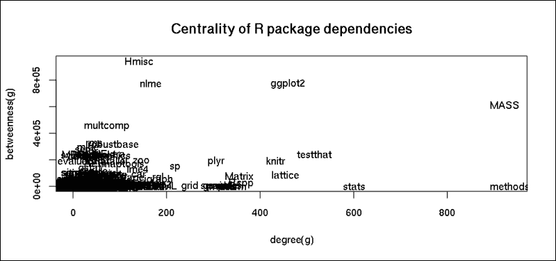
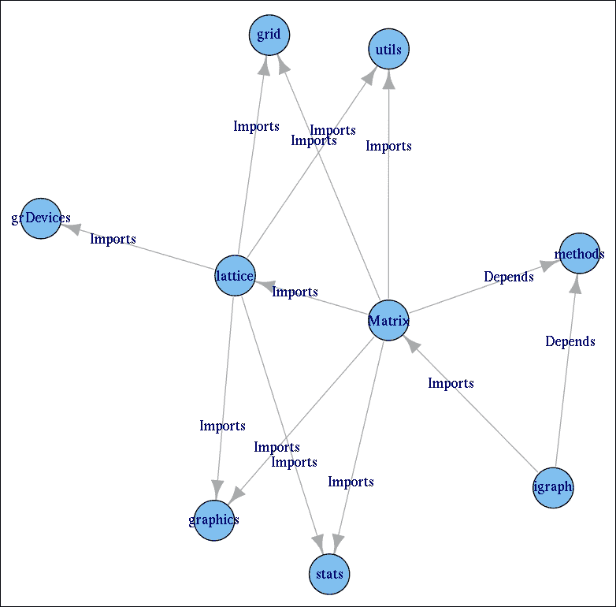
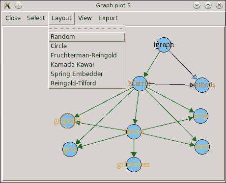
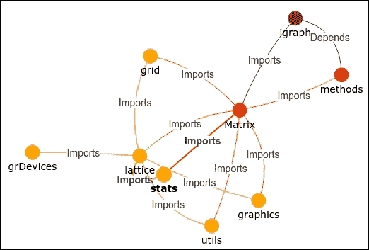
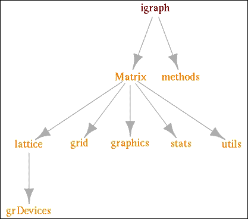
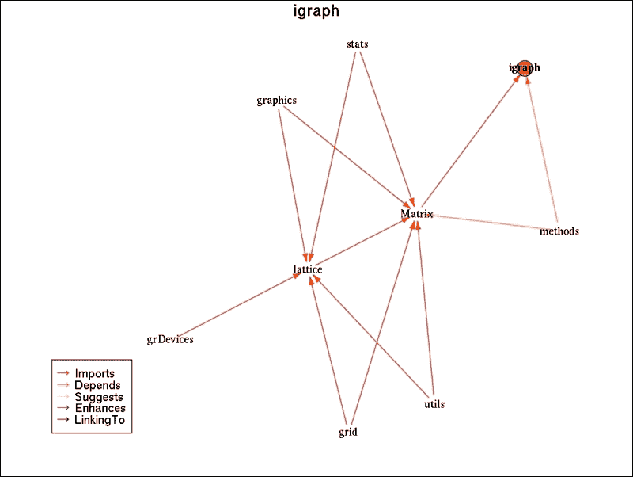

# 第十一章。R 生态系统的社会网络分析

尽管社会网络的概念有着相当长的历史，始于上个世纪初，但**社会网络分析**（**SNA**）仅在最近十年变得极其流行，这可能是由于大型社交媒体网站的成功以及相关数据的可用性。在本章中，我们将探讨如何检索和加载数据，然后通过大量使用 `igraph` 包来分析和可视化这些网络。

`Igraph` 是由 Gábor Csárdi 开发的一个开源网络分析工具。该软件包含各种网络分析方法，并且可以在 R、C、C++ 和 Python 中使用。

在本章中，我们将通过一些 R 生态系统的示例来介绍以下主题：

+   加载和处理网络数据

+   网络中心性度量

+   可视化网络图

# 加载网络数据

可能获取 R 生态系统网络信息最简单的方法就是分析 R 包之间的依赖关系。基于第二章，*获取数据*，我们可以尝试通过 CRAN 镜像的 HTTP 解析来加载数据，但幸运的是，R 有一个内置函数可以返回 CRAN 上所有可用的 R 包以及一些有用的元信息：

### 小贴士

CRAN 上托管的包数量每天都在增长。由于我们正在处理实时数据，您看到的实际结果可能会有所不同。

```py
> library(tools)
> pkgs <- available.packages()
> str(pkgs)
 chr [1:6548, 1:17] "A3" "abc" "ABCanalysis" "abcdeFBA" ...
 - attr(*, "dimnames")=List of 2
 ..$ : chr [1:6548] "A3" "abc" "ABCanalysis" "abcdeFBA" ...
 ..$ : chr [1:17] "Package" "Version" "Priority" "Depends" ...

```

因此，我们有一个包含超过 6,500 行的矩阵，第四列包含以逗号分隔的依赖列表。与其解析这些字符串并从包版本和其他相对不重要的字符中清理数据，不如使用工具包中的另一个便捷函数来完成这项脏活：

```py
> head(package.dependencies(pkgs), 2)
$A3
 [,1]      [,2] [,3] 
[1,] "R"       ">=" "2.15.0"
[2,] "xtable"  NA   NA 
[3,] "pbapply" NA   NA 

$abc
 [,1]       [,2] [,3] 
[1,] "R"        ">=" "2.10"
[2,] "nnet"     NA   NA 
[3,] "quantreg" NA   NA 
[4,] "MASS"     NA   NA 
[5,] "locfit"   NA   NA 

```

因此，`package.dependencies` 函数返回一个长的命名列表矩阵：每个 R 包一个，包括安装和加载引用包所需的包名和版本。除了相同的函数可以通过 `depLevel` 参数检索被导入或建议的包列表。我们将使用这些信息来构建一个包含 R 包之间不同类型连接的更丰富的数据集。

以下脚本创建了一个 `data.frame`，其中每一行代表两个 R 包之间的连接。`src` 列显示哪个 R 包引用了 `dep` 包，标签描述了连接的类型：

```py
> library(plyr)
> edges <- ldply(
+   c('Depends', 'Imports', 'Suggests'), function(depLevel) {
+     deps <- package.dependencies(pkgs, depLevel = depLevel)
+     ldply(names(deps), function(pkg)
+         if (!identical(deps[[pkg]], NA))
+             data.frame(
+                 src   = pkg,
+                 dep   = deps[[pkg]][, 1],
+                 label = depLevel,
+                 stringsAsFactors = FALSE))
+ })

```

虽然这个代码片段一开始看起来可能很复杂，但我们只是查找每个包的依赖关系（就像在一个循环中），返回一行 `data.frame`，并在另一个循环中嵌套它，该循环遍历所有之前提到的 R 包连接类型。生成的 R 对象非常容易理解：

```py
> str(edges)
'data.frame':  26960 obs. of  3 variables:
 $ src  : chr  "A3" "A3" "A3" "abc" ...
 $ dep  : chr  "R" "xtable" "pbapply" "R" ...
 $ label: chr  "Depends" "Depends" "Depends" "Depends" ...

```

# 网络中心性度量

因此，我们在我们的 6,500 个包之间识别了几乎 30,000 个关系。这是一个稀疏网络还是密集网络？换句话说，在所有可能的包依赖关系中，我们有多少个连接？如果所有包都相互依赖会怎样？我们实际上不需要任何功能丰富的包来计算这个：

```py
> nrow(edges) / (nrow(pkgs) * (nrow(pkgs) - 1))
[1] 0.0006288816

```

这是一个相当低的百分比，这使得与维护一个密集的 R 软件网络相比，R 系统管理员的生活要容易得多。但谁是这场游戏中的核心玩家？哪些是最依赖的顶级 R 包？

我们也可以计算一个相当简单的指标来回答这个问题，而无需任何严肃的 SNA 知识，因为这个指标可以这样定义：“在边的数据集的`dep`列中，哪个 R 包被提及的次数最多？”或者，用简单的英语来说：“哪个包有最多的反向依赖？”

```py
> head(sort(table(edges$dep), decreasing = TRUE))
 R  methods     MASS    stats testthat  lattice 
 3702      933      915      601      513      447

```

看起来大约有 50%的包依赖于 R 的最小版本。为了不扭曲我们的有向网络，让我们移除这些边：

```py
> edges <- edges[edges$dep != 'R', ]

```

现在是时候将我们的连接列表转换成一个真正的图对象，以计算更高级的指标，并可视化数据了：

```py
> library(igraph)
> g <- graph.data.frame(edges)
> summary(g)
IGRAPH DN-- 5811 23258 -- 
attr: name (v/c), label (e/c)

```

在加载包之后，`graph.data.frame`函数将各种数据源转换为`igraph`对象。这是一个具有各种支持方法的极其有用的类。摘要简单地打印出顶点和边的数量，这表明大约有 700 个 R 包没有依赖关系。让我们使用`igraph`计算之前讨论的和手动计算的指标：

```py
> graph.density(g)
[1] 0.0006888828
> head(sort(degree(g), decreasing = TRUE))
 methods     MASS    stats testthat  ggplot2  lattice 
 933      923      601      516      459      454

```

在列表的顶部看到`methods`包并不令人惊讶，因为它通常在具有复杂`S4`方法和类的包中是必需的。`MASS`和`stats`包包含了大多数常用的统计方法，但其他包呢？`lattice`和`ggplot2`包是极其智能且功能丰富的绘图引擎，而`testthat`是 R 中最受欢迎的单元测试扩展之一；在提交新包到中央 CRAN 服务器之前，必须在包描述中提到这一点。

但“度”只是社会网络中可用的中心性指标之一。不幸的是，当涉及到依赖关系时，计算每个节点与其他节点的距离的“接近度”并没有太大的意义，但“中介度”与前面的结果相比确实是一个有趣的比较：

```py
> head(sort(betweenness(g), decreasing = TRUE))
 Hmisc     nlme  ggplot2     MASS multcomp      rms 
943085.3 774245.2 769692.2 613696.9 453615.3 323629.8

```

这个指标显示了每个包在连接其他包的最短路径中作为桥梁（连接两个其他节点的唯一连接节点）的次数。所以这并不是关于拥有很多依赖包的问题；相反，它从更全局的角度展示了包的重要性。想象一下，如果一个具有高`中介度`的包被弃用并从 CRAN 中删除；不仅直接依赖的包，而且依赖树中的所有其他包也会处于一个非常尴尬的境地。

# 可视化网络数据

为了比较这两个指标，让我们绘制一个简单的散点图，展示每个 R 包的`degree`和`betweenness`：

```py
> plot(degree(g), betweenness(g), type = 'n',
+   main = 'Centrality of R package dependencies')
> text(degree(g), betweenness(g), labels = V(g)$name)

```



放松；我们将在几分钟内能够生成更多壮观且富有教育意义的图表！但前一个图表明，有一些包的直接依赖项数量相当少，但仍然对全球 R 生态系统有重大影响。

在我们继续之前，让我们通过构建`igraph`包的依赖树，包括它所依赖或从中导入的所有包，来过滤我们的数据集和图，以包含更少的顶点：

### 小贴士

以下简短的`igraph`依赖项列表是在 2015 年 4 月生成的。从那时起，由于从`magrittr`和`NMF`包中导入，`igraph`发布了一个主要的新版本，具有更多的依赖项，因此您计算机上重复的以下示例将返回一个更大的网络和图。出于教育目的，我们在以下输出中显示了较小的网络。

```py
> edges <- edges[edges$label != 'Suggests', ]
> deptree <- edges$dep[edges$src == 'igraph']
> while (!all(edges$dep[edges$src %in% deptree] %in% deptree))
+   deptree <- union(deptree, edges$dep[edges$src %in% deptree])
> deptree
[1] "methods"   "Matrix"    "graphics"  "grid"      "stats"
[6] "utils"     "lattice"   "grDevices"

```

因此，我们需要之前提到的八个包才能使用`igraph`包。请注意，这些并不都是直接依赖项；其中一些是来自其他包的依赖项。为了绘制这个依赖树的视觉表示，让我们创建相关的图对象并绘制它：

```py
> g <- graph.data.frame(edges[edges$src %in% c('igraph', deptree), ])
> plot(g)

```



好吧，`igraph`包实际上只依赖于一个包，尽管它也从`Matrix`包中导入了一些函数。所有其他之前提到的包都是后者的依赖项。

为了绘制一个更直观的版本的前一个图来表明这个陈述，我们可能考虑移除依赖标签，并通过颜色来表示这一方面，我们还可以通过顶点颜色来强调`igraph`的直接依赖。我们可以通过`V`和`E`函数修改顶点和边的属性：

```py
> V(g)$label.color <- 'orange'
> V(g)$label.color[V(g)$name == 'igraph'] <- 'darkred'
> V(g)$label.color[V(g)$name %in%
+        edges$dep[edges$src == 'igraph']] <- 'orangered'
> E(g)$color <- c('blue', 'green')[factor(df$label)]
> plot(g, vertex.shape = 'none', edge.label = NA)

```


太好了！我们的中心主题，`igraph`包，以深红色突出显示，两个直接依赖项以深橙色标记，所有其他依赖项都以较浅的橙色着色。同样，我们将`Depends`关系与大多数其他`Imports`连接相比，以蓝色强调。

## 交互式网络图

如果你不喜欢前一个图中顶点的顺序？请随意重新运行最后一个命令以生成新的结果，或者使用`tkplot`绘制动态图，在那里你可以通过拖放顶点来设计自定义布局：

```py
> tkplot(g, edge.label = NA)

```



我们能做得更好吗？尽管这个结果非常有用，但它缺乏目前流行的、由 JavaScript 提供支持的交互式图表的即时吸引力。所以，让我们用 JavaScript 重新创建这个交互式图表，从 R 开始！在第十三章“我们周围的数据”中详细讨论的 `htmlwidgets` 和 `visNetwork` 包，即使没有 JavaScript 知识，也能帮助我们完成这项任务。只需将提取的节点和边数据集传递给 `visNetwork` 函数：

```py
> library(visNetwork)
> nodes <- get.data.frame(g, 'vertices')
> names(nodes) <- c('id', 'color')
> edges <- get.data.frame(g)
> visNetwork(nodes, edges)

```



## 自定义图表布局

或者，我们也可以通过程序化方式生成这样的分层图表，通过绘制这个有向图的分母树：

```py
> g <- dominator.tree(g, root = "igraph")$domtree
> plot(g, layout = layout.reingold.tilford(g, root = "igraph"), 
+   vertex.shape = 'none')

```



## 使用 R 包分析 R 包依赖关系

由于我们使用的是 R，这是一个统计编程环境，其最令人兴奋和有用的功能是其社区，我们可能更喜欢寻找其他已经实现的研究解决方案。经过快速 Google 搜索，并在 StackOverflow 上查阅了一些问题，以及在 [`www.r-bloggers.com/`](http://www.r-bloggers.com/) 上的帖子后，很容易找到 Revolution Analytics 的 `miniCRAN` 包，它包含一些相关且有用的函数：

```py
> library(miniCRAN)
> pkgs <- pkgAvail()
> pkgDep('igraph', availPkgs = pkgs, suggests = FALSE,
+   includeBasePkgs = TRUE)
[1] "igraph"    "methods"   "Matrix"    "graphics"  "grid"
[6] "stats"     "utils"     "lattice"   "grDevices"
> plot(makeDepGraph('igraph', pkgs, suggests = FALSE,
+   includeBasePkgs = TRUE))

```



但让我们回到原始问题：我们如何分析网络数据？

# 进一步的网络分析资源

除了其令人印象深刻且实用的数据可视化之外，`igraph` 包还有更多功能。不幸的是，这个简短的章节无法提供对网络分析理论的适当介绍，但我建议您浏览一下该包的文档，因为它包含有用的、自解释的示例和良好的参考。

简而言之，网络分析提供了各种计算中心性和密度指标的方法，就像我们在本章开头所做的那样，还可以识别桥梁和模拟网络中的变化；网络中节点分割的强大方法也很多。

例如，在我合著的《定量金融的 R 语言入门》一书的“*金融网络*”章节中，我们开发了 R 脚本来根据银行间借贷市场的交易级网络数据识别匈牙利中的**系统性重要金融机构**（**SIFI**）。这个数据集和网络理论帮助我们建模并可能预测未来的金融危机，以及模拟中央干预的影响。

在芝加哥的 R/Finance 2015 会议上，介绍了这项研究的更详细、免费摘要[`www.rinfinance.com/agenda/2015/talk/GergelyDaroczi.pdf`](http://www.rinfinance.com/agenda/2015/talk/GergelyDaroczi.pdf)，同时展示了一个 Shiny 应用程序[`bit.ly/rfin2015-hunbanks`](https://bit.ly/rfin2015-hunbanks)，并在《精通 R 语言进行量化金融》一书的“系统性风险”章节中描述了一个基于模拟的感染模型。

这项联合研究的主要思想是根据由银行间贷款交易形成的网络，识别核心、外围和半外围金融机构。节点是银行，边被定义为这些银行之间的贷款事件，因此我们可以将外围节点之间的桥梁解释为介于小型银行之间的中介银行，这些小型银行通常不会直接相互贷款。

在解决数据集的一些技术问题之后，有趣的问题是模拟如果一家中介银行违约会发生什么，以及这个不幸的事件是否也可能影响其他金融机构。

# 摘要

这一小节介绍了以图数据集形式的新数据结构，我们使用各种 R 包，包括静态和交互式方法，可视化了小型网络。在接下来的两章中，我们将熟悉两种其他常用的数据类型：首先我们将分析时间序列数据，然后是空间数据。
