# 第十二章 分析时间序列

时间序列是一系列按时间顺序排列的数据点，常用于经济学或例如社会科学。与横截面观测值相比，收集长时间数据的一个巨大优势是我们可以分析同一对象随时间收集的值，而不是比较不同的观测值。

数据的这一特殊特性需要新的方法和数据结构来进行时间序列分析。我们将在本章中介绍这些内容：

+   首先，我们学习如何将观测值加载或转换成时间序列对象

+   然后我们可视化它们，并尝试通过平滑和过滤观测值来改进图表

+   除了季节分解，我们还介绍了基于时间序列模型的预测方法，同时也涵盖了识别时间序列中的异常值、极端值和异常的方法

# 创建时间序列对象

大多数关于时间序列分析的教程都是从`stats`包的`ts`函数开始的，它可以非常直接地创建时间序列对象。只需传递一个数值向量或矩阵（时间序列分析主要处理连续变量），指定数据频率，然后一切就绪！

频率指的是数据的自然时间跨度。因此，对于月度数据，你应该将其设置为 12，季度数据为 4，对于每日数据为 365 或 7，具体取决于事件的最显著季节性。例如，如果你的数据具有显著的周季节性，这在社会科学中很常见，那么它应该是 7，但如果日历日期是主要区分因素，例如与天气数据一样，那么它应该是 365。

在接下来的几页中，我们将使用`hflights`数据集的每日汇总统计数据。首先，让我们加载相关数据集并将其转换为`data.table`以方便聚合。我们还需要从提供的`Year`、`Month`和`DayofMonth`列中创建一个日期变量：

```py
> library(hflights)
> library(data.table)
> dt <- data.table(hflights)
> dt[, date := ISOdate(Year, Month, DayofMonth)]

```

现在，让我们计算 2011 年每一天的航班数量、总到达延误时间、取消航班数量以及相关航班的平均距离：

```py
> daily <- dt[, list(
+     N         = .N,
+     Delays    = sum(ArrDelay, na.rm = TRUE),
+     Cancelled = sum(Cancelled),
+     Distance  = mean(Distance)
+ ), by = date]
> str(daily)
Classes 'data.table' and 'data.frame':	365 obs. of  5 variables:
 $ date     : POSIXct, format: "2011-01-01 12:00:00" ...
 $ N        : int  552 678 702 583 590 660 661 500 602 659 ...
 $ Delays   : int  5507 7010 4221 4631 2441 3994 2571 1532 ...
 $ Cancelled: int  4 11 2 2 3 0 2 1 21 38 ...
 $ Distance : num  827 787 772 755 760 ...
 - attr(*, ".internal.selfref")=<externalptr>

```

# 可视化时间序列

这是在一个非常熟悉的数据结构中：2011 年每一天有 365 行，五列用于存储存储在第一个变量中的四个指标。让我们将其转换为时间序列对象并立即绘制：

```py
> plot(ts(daily))

```

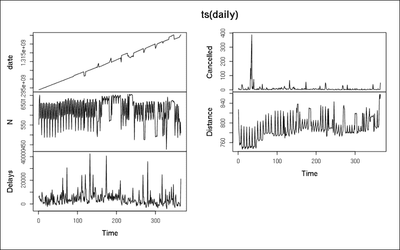

很简单，对吧？我们已经在折线图上绘制了几个独立的时间序列。但第一个图表上显示的是什么？由于`ts`没有自动识别第一列存储的是我们的日期，因此*x*轴从 1 到 365 进行索引。另一方面，我们在*y*轴上找到了转换为时间戳的日期。点不应该形成一条直线吗？

这就是数据可视化的美妙之处：一个简单的图表揭示了我们的数据中的一个主要问题。看起来我们不得不按日期对数据进行排序：

```py
> setorder(daily, date)
> plot(ts(daily))

```

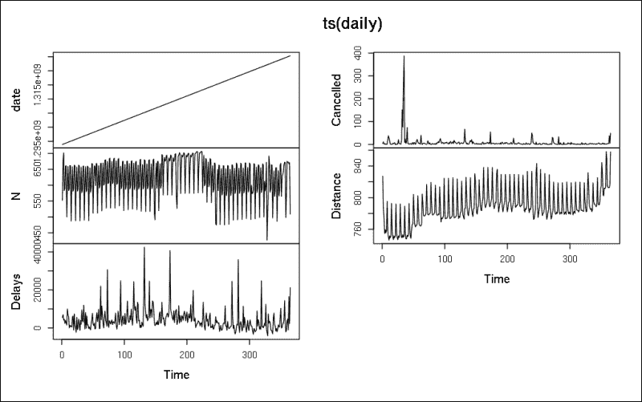

现在值已经按正确顺序排列，我们可以一次一个地关注实际的时间序列数据。首先让我们看看 2011 年第一天以每日频率的航班数量：

```py
> plot(ts(daily$N, start = 2011, frequency = 365),
+      main = 'Number of flights from Houston in 2011')

```

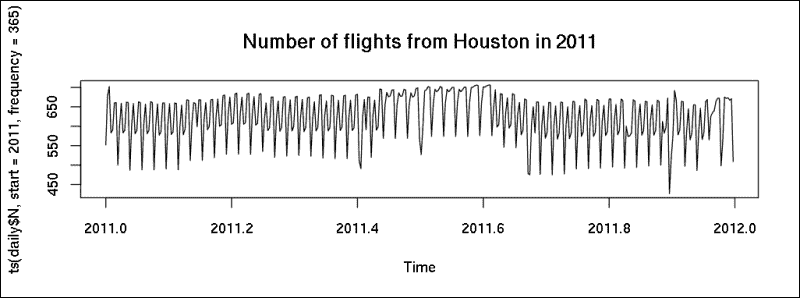

# 季节分解

嗯，看起来工作日的航班数量波动很大，这确实是与人类活动相关的主要特征。让我们通过分解这个时间序列为季节性、趋势和随机成分，并使用移动平均来识别和去除周季节性来验证这一点。

虽然这可以通过利用`diff`和`lag`函数手动完成，但使用`stats`包中的`decompose`函数来做会更直接：

```py
> plot(decompose(ts(daily$N, frequency = 7)))

```

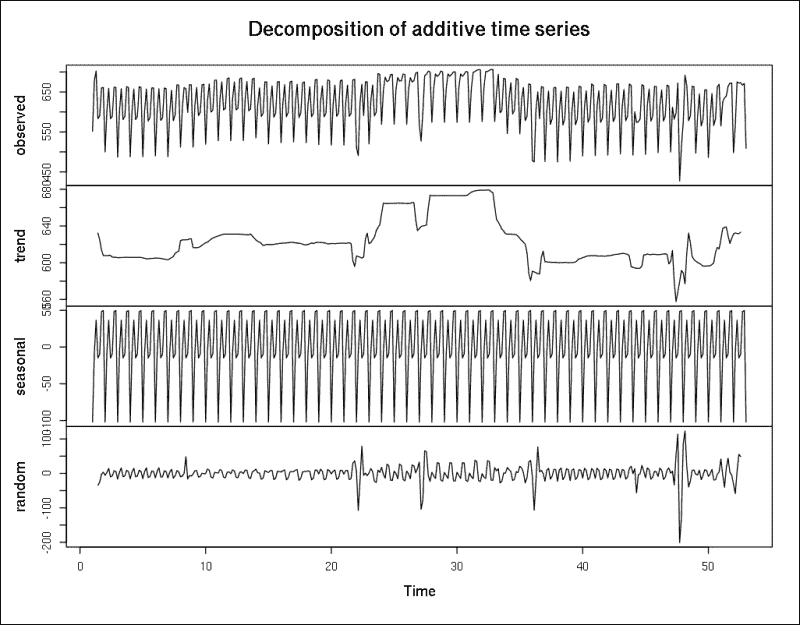

去除每周季节性均值中的峰值揭示了 2011 年航班数量的整体趋势。正如*x*轴所示，自 1 月 1 日以来的周数（基于频率为 7）的峰值间隔在 25 到 35 之间指的是夏季，而第 46 周的航班数量最少——可能是因为感恩节。

但每周季节性可能更有趣。嗯，在先前的图表上很难找到任何东西，因为同样的 7 天重复可以在季节性图表上看到 52 次。所以，让我们提取这些数据，并用适当的标题在表格中显示：

```py
> setNames(decompose(ts(daily$N, frequency = 7))$figure,
+         weekdays(daily$date[1:7]))
 Saturday      Sunday      Monday     Tuesday   Wednesday 
-102.171776   -8.051328   36.595731  -14.928941   -9.483886 
 Thursday      Friday 
 48.335226   49.704974

```

因此，季节性影响（前面的数字表示相对于平均值的相对距离）表明，航班数量最多的是星期一和最后两个工作日，而星期六的航班数量相对较少。

不幸的是，我们无法分解这个时间序列的年度季节性成分，因为我们只有一年的数据，而我们至少需要两个时间周期的数据来给出给定的频率：

```py
> decompose(ts(daily$N, frequency = 365))
Error in decompose(ts(daily$N, frequency = 365)) : 
 time series has no or less than 2 periods

```

对于更高级的季节分解，请参阅`stats`包中的`stl`函数，它使用多项式回归模型对时间序列数据进行处理。下一节将涵盖一些这方面的背景知识。

# Holt-Winters 过滤

我们可以通过 Holt-Winters 过滤类似地去除时间序列的季节性影响。将`HoltWinters`函数的`beta`参数设置为`FALSE`将导致一个模型，其中指数平滑几乎抑制了所有异常值；将`gamma`参数设置为`FALSE`将导致一个非季节性模型。以下是一个快速示例：

```py
> nts <- ts(daily$N, frequency = 7)
> fit <- HoltWinters(nts, beta = FALSE, gamma = FALSE)
> plot(fit)

```

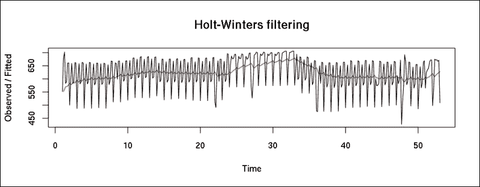

红线代表过滤后的时间序列。我们还可以通过启用`beta`和`gamma`参数，在时间序列上拟合双指数或三指数模型，从而得到更好的拟合：

```py
> fit <- HoltWinters(nts)
> plot(fit)

```

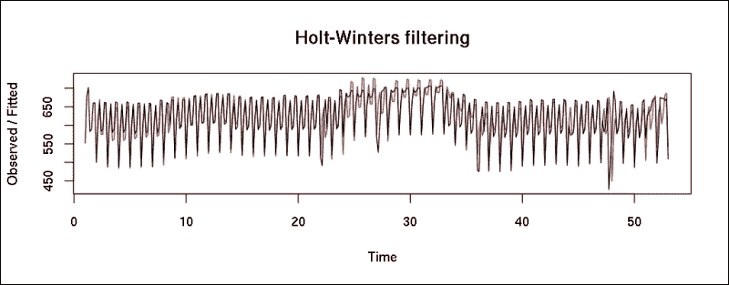

由于这个模型与我们的原始数据相比提供了极其相似的价值，它可以用来预测未来的值。为此，我们将使用`forecast`包。默认情况下，`forecast`函数返回未来 2*频率值的预测：

```py
> library(forecast)
> forecast(fit)
 Point Forecast    Lo 80    Hi 80    Lo 95    Hi 95
53.14286       634.0968 595.4360 672.7577 574.9702 693.2235
53.28571       673.6352 634.5419 712.7286 613.8471 733.4233
53.42857       628.2702 588.7000 667.8404 567.7528 688.7876
53.57143       642.5894 602.4969 682.6820 581.2732 703.9057
53.71429       678.2900 637.6288 718.9511 616.1041 740.4758
53.85714       685.8615 644.5848 727.1383 622.7342 748.9889
54.00000       541.2299 499.2901 583.1697 477.0886 605.3712
54.14286       641.8039 598.0215 685.5863 574.8445 708.7633
54.28571       681.3423 636.8206 725.8639 613.2523 749.4323
54.42857       635.9772 590.6691 681.2854 566.6844 705.2701
54.57143       650.2965 604.1547 696.4382 579.7288 720.8642
54.71429       685.9970 638.9748 733.0192 614.0827 757.9113
54.85714       693.5686 645.6194 741.5178 620.2366 766.9005
55.00000       548.9369 500.0147 597.8592 474.1169 623.7570

```

这些是 2012 年第一周和第二周的估计值，其中（除了精确的点预测外）我们还得到了置信区间。在这个时候，可视化这些预测和置信区间可能更有意义：

```py
> plot(forecast(HoltWinters(nts), 31))

```

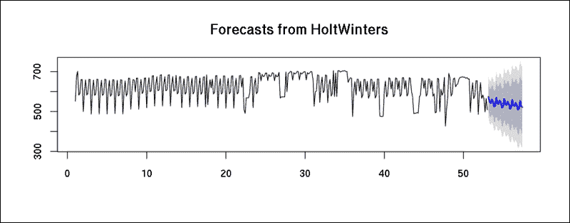

蓝色点表示对 31 个未来时间段的估计，灰色区域覆盖了由`forecast`函数返回的置信区间。

# 自回归积分移动平均模型

我们可以使用**自回归积分移动平均**（**ARIMA**）模型达到类似的结果。为了预测时间序列的未来值，我们通常必须首先对其进行**平稳化**，这意味着数据在时间上有恒定的均值、方差和自相关。在前两个部分中，我们使用了季节分解和 Holt-Winters 滤波器来实现这一点。现在让我们看看**自回归移动平均**（**ARMA**）模型的推广版本如何帮助进行这种数据转换。

*ARIMA(p, d, q)*实际上包括三个模型，有三个非负整数参数：

+   *p*代表模型的自回归部分

+   *d*代表积分部分

+   *q*代表移动平均部分

由于 ARIMA 模型也包括了 ARMA 模型上的一个积分（差分）部分，因此它也可以处理非平稳时间序列，因为它们在差分后自然变得平稳——换句话说，当*d*参数大于零时。

传统上，为时间序列选择最佳 ARIMA 模型需要构建具有各种参数的多个模型并比较模型拟合度。另一方面，`forecast`包提供了一个非常有用的函数，可以通过运行单位根测试并最小化模型的**最大似然**（**ML**）和**赤池信息量准则**（**AIC**）来选择最佳拟合的 ARIMA 模型：

```py
> auto.arima(nts)
Series: ts 
ARIMA(3,0,0)(2,0,0)[7] with non-zero mean 

Coefficients:
 ar1      ar2     ar3    sar1    sar2  intercept
 0.3205  -0.1199  0.3098  0.2221  0.1637   621.8188
s.e.  0.0506   0.0538  0.0538  0.0543  0.0540     8.7260

sigma² estimated as 2626:  log likelihood=-1955.45
AIC=3924.9   AICc=3925.21   BIC=3952.2

```

看起来*AR(3)*模型具有最高的 AIC 值，并且具有*AR(2)*季节性效应。但检查`auto.arima`的说明书发现，由于观测值数量（超过 100）较多，用于模型选择的信度标准被近似了。重新运行算法并禁用近似会得到不同的模型：

```py
> auto.arima(nts, approximation = FALSE)
Series: ts 
ARIMA(0,0,4)(2,0,0)[7] with non-zero mean 

Coefficients:
 ma1      ma2     ma3     ma4    sar1    sar2  intercept
 0.3257  -0.0311  0.2211  0.2364  0.2801  0.1392   621.9295
s.e.  0.0531   0.0531  0.0496  0.0617  0.0534  0.0557     7.9371

sigma² estimated as 2632:  log likelihood=-1955.83
AIC=3927.66   AICc=3928.07   BIC=3958.86

```

虽然看起来先前的季节性 ARIMA 模型具有很高的 AIC 值，但我们可能希望通过指定*D*参数来构建一个真正的 ARIMA 模型，从而通过以下估计得到一个积分模型：

```py
> plot(forecast(auto.arima(nts, D = 1, approximation = FALSE), 31))

```

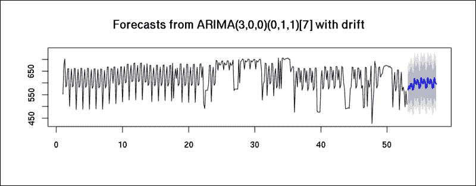

尽管时间序列分析有时可能很棘手（并且找到具有适当参数的最佳模型需要对这些统计方法有合理的经验），但前面的简短示例证明了即使对时间序列对象和相关方法有基本理解，通常也会在数据模式和适当预测方面提供一些令人印象深刻的结果。

# 异常值检测

除了预测之外，另一个与时间序列相关的主要任务是识别一系列观测值中的可疑或异常数据，这些数据可能会扭曲我们的分析结果。这样做的一种方法是通过构建 ARIMA 模型并分析预测值和实际值之间的距离。`tsoutliers`包提供了一个非常方便的方式来做到这一点。让我们在 2011 年取消航班的数量上构建一个模型：

```py
> cts <- ts(daily$Cancelled)
> fit <- auto.arima(cts)
> auto.arima(cts)
Series: ts 
ARIMA(1,1,2)

Coefficients:
 ar1      ma1      ma2
 -0.2601  -0.1787  -0.7752
s.e.   0.0969   0.0746   0.0640

sigma² estimated as 539.8:  log likelihood=-1662.95
AIC=3333.9   AICc=3334.01   BIC=3349.49

```

因此，现在我们可以使用一个*ARIMA(1,1,2)*模型和`tso`函数来突出（并可选地移除）数据集中的异常值：

### 小贴士

请注意，以下`tso`调用可能需要几分钟才能在 CPU 核心上完全加载运行，因为它可能在后台执行大量计算。

```py
> library(tsoutliers)
> outliers <- tso(cts, tsmethod = 'arima',
+   args.tsmethod  = list(order = c(1, 1, 2)))
> plot(outliers)

```

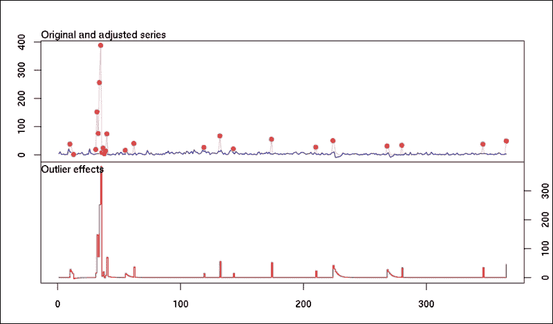

或者，我们可以通过在`tso`中自动调用`auto.arima`而无需指定除时间序列对象之外的任何额外参数，一次性运行所有前面的步骤：

```py
> plot(tso(ts(daily$Cancelled)))

```

总之，结果显示，所有具有大量取消航班观测值的观测值都是异常值，因此应该从数据集中移除。好吧，将具有许多取消航班的任何一天视为异常值听起来非常乐观！但这是非常有用的信息；它表明，例如，使用先前讨论的方法来预测异常事件是不可管理的。

传统上，时间序列分析处理数据的趋势和季节性，以及如何*平稳化*时间序列。如果我们对正常事件的偏差感兴趣，则需要使用其他一些方法。

Twitter 最近发布了一个 R 包，用于检测时间序列中的异常。现在我们将使用其`AnomalyDetection`包以更快的速度识别先前的异常值。正如你可能已经注意到的，`tso`函数运行速度非常慢，并且实际上无法处理大量数据——而`AnomalyDetection`包的表现相当不错。

我们可以将输入数据作为`data.frame`向量的输入，其中第一列存储时间戳。不幸的是，`AnomalyDetectionTs`函数与`data.table`对象配合得并不好，所以我们还是回到传统的`data.frame`类：

```py
> dfc <- as.data.frame(daily[, c('date', 'Cancelled'), with = FALSE])

```

现在让我们加载这个包并绘制观测值中识别出的异常：

```py
> library(AnomalyDetection)
> AnomalyDetectionTs(dfc, plot = TRUE)$plot

```

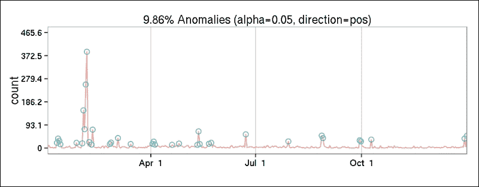

结果与前面的图非常相似，但有两点需要注意，你可能已经注意到了。计算速度极快，另一方面，这个图包含了人类友好的日期，而不是*x*轴上的一些无趣的索引。

# 更复杂的时序对象

`ts`时序 R 对象类的主要局限性（除了前面提到的*x*轴问题之外）是它无法处理不规则时序。为了克服这个问题，我们在 R 中有几个替代方案。

`zoo`包及其反向依赖的`xts`包是`ts`兼容的类，拥有大量极其有用的方法。为了快速举例，让我们从我们的数据中构建一个`zoo`对象，并看看它如何通过默认的图表来表示：

```py
> library(zoo)
> zd <- zoo(daily[, -1, with = FALSE], daily[[1]])
> plot(zd)

```

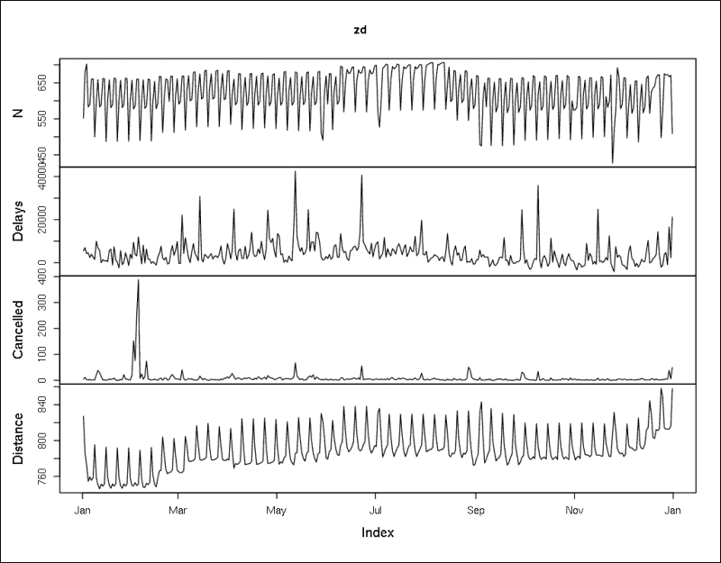

由于我们已经将`date`列定义为观测的时戳，因此这里没有显示。*x*轴有一个非常人性化的日期标注，这在检查了前面几页大量整数标注的图表之后，感觉非常愉快。

当然，`zoo`支持大多数`ts`方法，如`diff`、`lag`或累计总和；这些对于可视化数据速度非常有用：

```py
> plot(cumsum(zd))

```

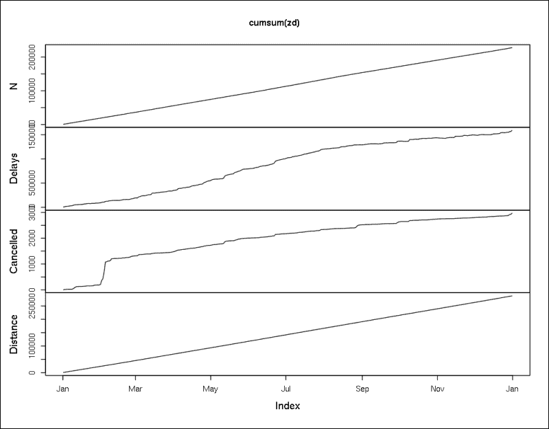

在这里，**N**变量的线性线表明我们没有缺失值，并且我们的数据集每天恰好包含一个数据点。另一方面，**取消**线在二月份的陡峭上升表明，某一天对 2011 年整体取消航班数量的贡献非常大。

# 高级时序分析

很遗憾，这一简短的章节无法提供对时序分析的更详细介绍。说实话，即使将本章的长度增加到两三倍，也还不够进行一个不错的教程，因为时序分析、预测和异常检测是统计分析中最复杂的话题之一。

但好消息是，关于这些主题有很多优秀的书籍！其中最好的资源——以及这个主题上最全面的免费在线教程——可以在[`www.otexts.org/fpp`](https://www.otexts.org/fpp)找到。这是一份非常实用且详细的在线教程，关于预测和一般时序分析，我强烈推荐给任何希望在未来构建更复杂和可实现的时序模型的人。

# 摘要

本章重点介绍了如何加载、可视化和建模与时间相关的数据。尽管我们无法涵盖这个具有挑战性的主题的所有方面，但我们讨论了最广泛使用的平滑和滤波算法、季节分解和 ARIMA 模型；我们还基于这些计算了一些预测和估计。

下一章与这一章有些相似，因为我们将在数据集的另一个重要维度上覆盖另一个领域独立的区域：而不是关注“何时”，我们将关注观测是在哪里捕获的。
