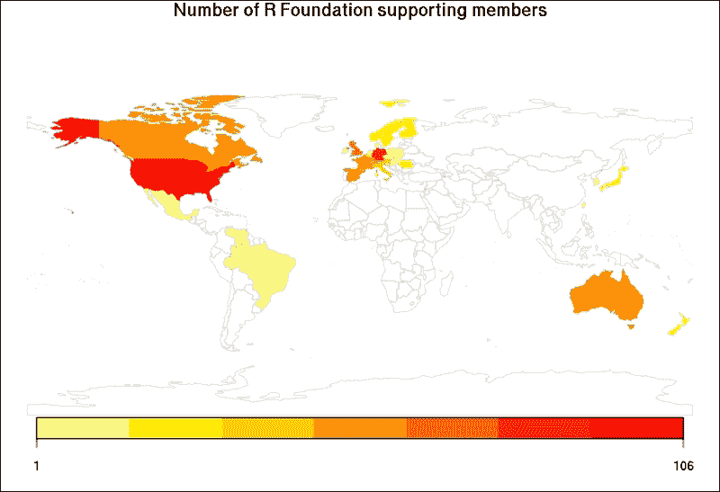
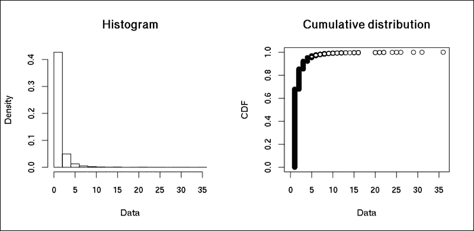
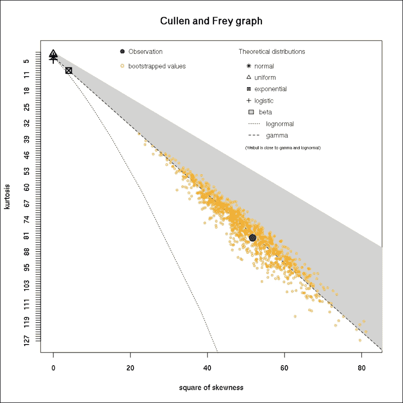
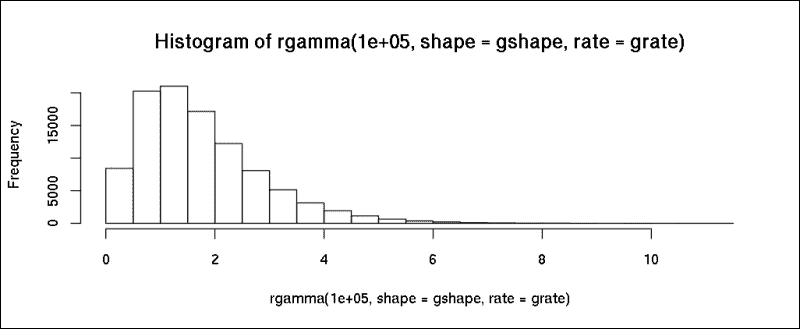
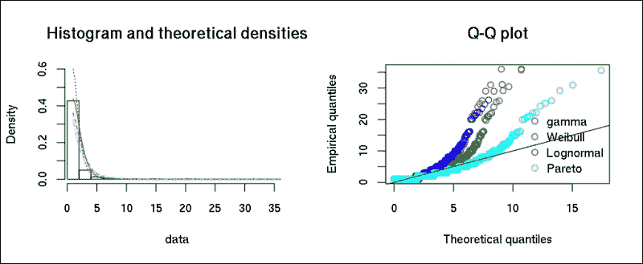
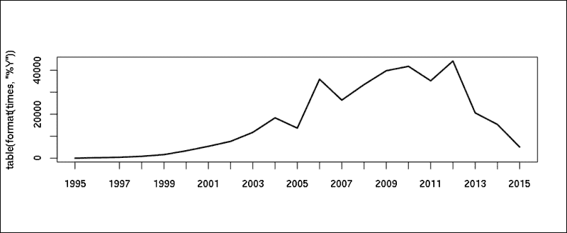
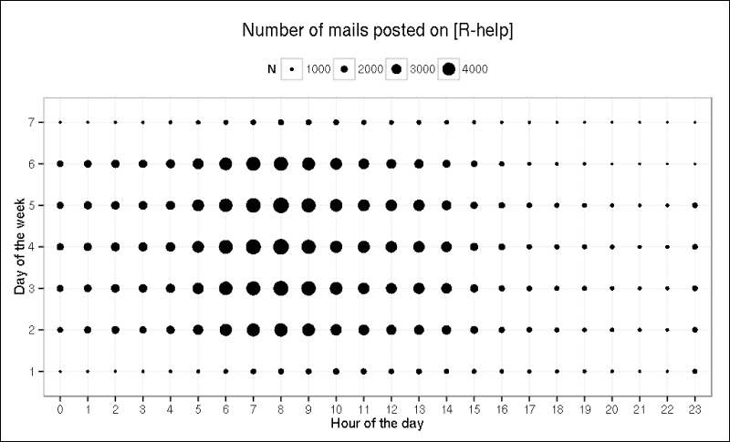
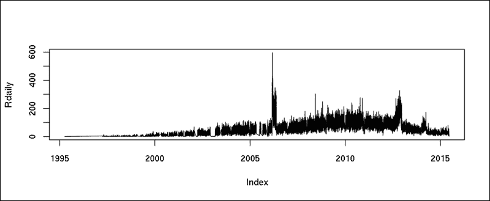
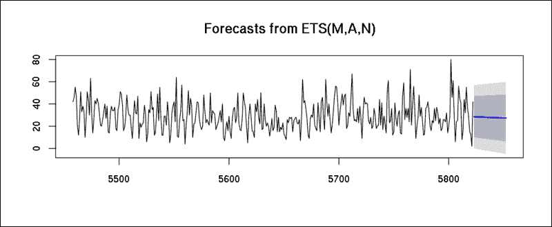

# 第十四章。分析 R 社区

在这一最后一章中，我将尝试总结你过去 13 章中学到的内容。为此，我们将创建一个实际案例研究，独立于之前使用的`hflights`和`mtcars`数据集，并尝试估计 R 社区的规模。这是一个相当困难的任务，因为世界上没有 R 用户的列表；因此，我们将在多个部分数据集上构建一些预测模型。

为了达到这个目的，我们将在本章做以下几件事情：

+   从互联网上的不同数据源收集实时数据

+   清洗数据并将其转换为标准格式

+   运行一些快速描述性和探索性分析方法

+   可视化提取的数据

+   基于独立名单构建一些基于 R 用户数量的对数线性模型

# R 基金会成员

我们能做的最简单的事情之一是计算 R 基金会的成员数量——该组织协调核心 R 程序的开发。由于基金会的普通成员仅包括*R 开发核心团队*，我们最好检查支撑成员。任何人都可以通过支付象征性的年度费用成为基金会的支撑成员——顺便说一句，我强烈建议你这样做。名单可在[`r-project.org`](http://r-project.org)网站上找到，我们将使用`XML`包（更多细节，请参阅第二章“从网络获取数据”，*“从网络获取数据”*)来解析 HTML 页面：

```py
> library(XML)
> page <- htmlParse('http://r-project.org/foundation/donors.html')

```

现在我们已经将 HTML 页面加载到 R 中，我们可以使用 XML 路径语言提取基金会的支撑成员名单，通过读取“支撑成员”标题之后的列表：

```py
> list <- unlist(xpathApply(page,
+     "//h3[@id='supporting-members']/following-sibling::ul[1]/li", 
+     xmlValue))
> str(list)
 chr [1:279] "Klaus Abberger (Germany)" "Claudio Agostinelli (Italy)" 

```

从这个包含 279 个名称和国家的字符向量中，让我们分别提取支撑成员名单和国家名单：

```py
> supporterlist <- sub(' \\([a-zA-Z ]*\\)$', '', list)
> countrylist   <- substr(list, nchar(supporterlist) + 3,
+                               nchar(list) - 1)

```

因此，我们首先通过移除字符串中从开括号开始的所有内容来提取名称，然后通过从名称中的字符数和原始字符串中计算出的字符位置来匹配国家。

除了 R 基金会 279 名支撑成员的名单外，我们还知道成员的国籍或居住地的比例：

```py
> tail(sort(prop.table(table(countrylist)) * 100), 5)
 Canada Switzerland          UK     Germany         USA 
 4.659498    5.017921    7.168459   15.770609   37.992832 

```

## 可视化全球的支撑成员

可能并不令人惊讶，大多数支撑成员来自美国，一些欧洲国家也位于这个名单的顶端。让我们保存这个表格，以便在快速数据转换后，我们可以根据这个计数数据生成一张地图：

```py
> countries <- as.data.frame(table(countrylist))

```

如第十三章“我们周围的数据”所述，“我们周围的数据”，`rworldmap`包可以非常容易地渲染国家级地图；我们只需将值映射到一些多边形上。在这里，我们将使用`joinCountryData2Map`函数，首先启用`verbose`选项以查看哪些国家名称被遗漏：

```py
> library(rworldmap)
> joinCountryData2Map(countries, joinCode = 'NAME',
+    nameJoinColumn = 'countrylist', verbose = TRUE)
32 codes from your data successfully matched countries in the map
4 codes from your data failed to match with a country code in the map
 failedCodes failedCountries
[1,] NA          "Brasil" 
[2,] NA          "CZ" 
[3,] NA          "Danmark" 
[4,] NA          "NL" 
213 codes from the map weren't represented in your data

```

因此，我们尝试将存储在`countries`数据框中的国家名称进行匹配，但前述四个字符串失败了。尽管我们可以手动修复这个问题，但在大多数情况下，最好自动化我们可以处理的事情，所以让我们将所有失败的字符串传递给谷歌地图地理编码 API，看看它返回什么：

```py
> library(ggmap)
> for (fix in c('Brasil', 'CZ', 'Danmark', 'NL')) {
+   countrylist[which(countrylist == fix)] <-
+       geocode(fix, output = 'more')$country
+ }

```

现在我们已经借助谷歌地理编码服务固定了国家名称，让我们重新生成频率表，并使用`rworldmap`包将这些值映射到多边形名称：

```py
> countries <- as.data.frame(table(countrylist))
> countries <- joinCountryData2Map(countries, joinCode = 'NAME',
+   nameJoinColumn = 'countrylist')
36 codes from your data successfully matched countries in the map
0 codes from your data failed to match with a country code in the map
211 codes from the map weren't represented in your data

```

这些结果令人满意得多！现在我们已经将 R 基金会的支持成员数量映射到各个国家，因此我们可以轻松地绘制这些数据：

```py
> mapCountryData(countries, 'Freq', catMethod = 'logFixedWidth',
+   mapTitle = 'Number of R Foundation supporting members')

```



好吧，很明显，R 基金会的多数支持成员都位于美国、欧洲、澳大利亚和新西兰（R 在这里诞生已有 20 多年）。

但支持者的数量非常低，遗憾的是，所以让我们看看我们可以找到和利用的其他数据源来估计全球 R 用户数量。

# R 包维护者

另一个类似简单直接的数据源可能是 R 包维护者的列表。我们可以从 CRAN 的公共页面下载包维护者的名称和电子邮件地址，这些数据存储在一个结构良好的 HTML 表中，非常容易解析：

```py
> packages <- readHTMLTable(paste0('http://cran.r-project.org', 
+   '/web/checks/check_summary.html'), which = 2)

```

从`Maintainer`列中提取名称可以通过一些快速的数据清洗和转换来完成，主要使用正则表达式。请注意，列名以空格开头——这就是为什么我们引用了列名：

```py
> maintainers <- sub('(.*) <(.*)>', '\\1', packages$' Maintainer')
> maintainers <- gsub(' ', ' ', maintainers)
> str(maintainers)
 chr [1:6994] "Scott Fortmann-Roe" "Gaurav Sood" "Blum Michael" ...

```

这个包含近 7000 个包维护者的列表中包含一些重复的名称（他们维护多个包）。让我们看看最顶尖、最多产的 R 包开发者的列表：

```py
> tail(sort(table(maintainers)), 8)
 Paul Gilbert     Simon Urbanek Scott Chamberlain   Martin Maechler 
 22                22                24                25 
 ORPHANED       Kurt Hornik    Hadley Wickham Dirk Eddelbuettel 
 26                29                31                36 

```

尽管前面列表中有一个奇怪的名字（孤儿包没有维护者——值得一提的是，在 6994 个不再积极维护的包中只有 26 个是一个相当好的比例），但其他名字在 R 社区中确实很知名，并且致力于开发多个有用的包。

## 每个维护者拥有的包的数量

另一方面，列表中与仅一个或几个 R 包相关联的名称有很多。与其在简单的条形图或直方图上可视化每个维护者拥有的包的数量，不如加载`fitdistrplus`包，我们将在接下来的页面中使用它来拟合分析数据集上的各种理论分布：

```py
> N <- as.numeric(table(maintainers))
> library(fitdistrplus)
> plotdist(N)

```



前面的图表还显示，列表中的大多数人只维护一个包，但不超过两个或三个包。如果我们对分布的尾部长度/重尾长度感兴趣，我们可能想调用`descdist`函数，该函数返回关于经验分布的一些重要描述性统计信息，并在偏度-峰度图上绘制不同的理论分布如何拟合我们的数据：

```py
> descdist(N, boot = 1e3)
summary statistics
------
min:  1   max:  36 
median:  1 
mean:  1.74327 
estimated sd:  1.963108 
estimated skewness:  7.191722 
estimated kurtosis:  82.0168 

```



我们的实证分布似乎非常长尾，峰度非常高，看起来伽马分布是此数据集的最佳拟合。让我们看看这个伽马分布的估计参数：

```py
> (gparams <- fitdist(N, 'gamma'))
Fitting of the distribution ' gamma ' by maximum likelihood 
Parameters:
 estimate Std. Error
shape 2.394869 0.05019383
rate  1.373693 0.03202067

```

我们可以使用这些参数通过`rgamma`函数模拟出更多的 R 包维护者。让我们看看在例如有 10 万名包维护者的情况下，CRAN 上会有多少 R 包可用：

```py
> gshape <- gparams$estimate[['shape']]
> grate  <- gparams$estimate[['rate']]
> sum(rgamma(1e5, shape = gshape, rate = grate))
[1] 173655.3
> hist(rgamma(1e5, shape = gshape, rate = grate))

```



很明显，这个分布不像我们的实际数据集那样长尾：即使进行 10 万次模拟，最大的数量也低于 10，正如我们可以在前面的图中看到的那样；然而，现实中 R 包维护者的生产力要高得多，可以达到 20 个或 30 个包。

让我们通过基于前面的伽马分布估计不超过两个包的 R 包维护者的比例来验证这一点：

```py
> pgamma(2, shape = gshape, rate = grate)
[1] 0.6672011

```

但在实际数据集中，这个百分比要高得多：

```py
> prop.table(table(N <= 2))
 FALSE      TRUE 
0.1458126 0.8541874 

```

这可能意味着尝试拟合一个更长尾的分布。让我们看看例如帕累托分布将如何拟合我们的数据。为此，让我们通过使用最低值作为分布的位置，以及所有这些值与位置的对数差之和除以值的数量作为形状参数来遵循分析方法：

```py
> ploc <- min(N)
> pshp <- length(N) / sum(log(N) - log(ploc))

```

不幸的是，基础`stats`包中没有`ppareto`函数，因此我们不得不首先加载`actuar`或`VGAM`包来计算分布函数：

```py
> library(actuar)
> ppareto(2, pshp, ploc)
[1] 0.9631973

```

嗯，现在这个比例甚至更高了！看起来前面的理论分布没有一个能完美地拟合我们的数据——但事实上这也是很正常的。但让我们看看这些分布如何在联合图上拟合我们的原始数据集：

```py
> fg <- fitdist(N, 'gamma')
> fw <- fitdist(N, 'weibull')
> fl <- fitdist(N, 'lnorm')
> fp <- fitdist(N, 'pareto', start = list(shape = 1, scale = 1))
> par(mfrow = c(1, 2))
> denscomp(list(fg, fw, fl, fp), addlegend = FALSE)
> qqcomp(list(fg, fw, fl, fp),
+   legendtext = c('gamma', 'Weibull', 'Lognormal', 'Pareto')) 

```



总的来说，似乎帕累托分布是最接近我们长尾数据的拟合。但更重要的是，我们除了之前确定的 279 位 R 基金会支持成员外，还了解到了 4000 多位 R 用户：

```py
> length(unique(maintainers))
[1] 4012

```

我们还能使用哪些数据源来获取关于（R 用户数量）的信息？

# R-help 邮件列表

R-help 是官方的、主要的邮件列表，提供有关使用 R 解决问题的通用讨论，有众多活跃用户，每天有几十封电子邮件。幸运的是，这个公开的邮件列表在几个网站上都有存档，我们可以轻松地从例如 ETH Zurich 的 R-help 存档中下载压缩的月度文件：

```py
> library(RCurl)
> url <- getURL('https://stat.ethz.ch/pipermail/r-help/')

```

现在让我们通过 XPath 查询从这个页面中提取月度压缩存档的 URL：

```py
> R.help.toc <- htmlParse(url)
> R.help.archives <- unlist(xpathApply(R.help.toc,
+      "//table//td[3]/a", xmlAttrs), use.names = FALSE)

```

现在让我们将这些文件下载到我们的计算机上以供将来解析：

```py
> dir.create('r-help')
> for (f in R.help.archives)
+     download.file(url = paste0(url, f),
+          file.path('help-r', f), method = 'curl'))

```

### 注意

根据您的操作系统和 R 版本，我们用于通过 HTTPS 协议下载文件的`curl`选项可能不可用。在这种情况下，您可以尝试其他方法或更新查询以使用`RCurl`、`curl`或`httr`包。

下载这些约 200 个文件需要一些时间，您可能还希望在循环中添加`Sys.sleep`调用，以避免服务器过载。无论如何，经过一段时间，您将在`r-help`文件夹中拥有`R-help`邮件列表的本地副本，准备好解析一些有趣的数据：

```py
> lines <- system(paste0(
+     "zgrep -E '^From: .* at .*' ./help-r/*.txt.gz"),
+                 intern = TRUE)
> length(lines)
[1] 387218
> length(unique(lines))
[1] 110028

```

### 注意

我不是将所有文本文件加载到 R 中并使用`grep`，而是通过 Linux 命令行`zgrep`实用程序预先过滤了文件，该实用程序可以有效地搜索`gzipped`（压缩）文本文件。如果您没有安装`zgrep`（它在 Windows 和 Mac 上都是可用的），您可以首先提取文件，然后使用带有相同正则表达式的标准`grep`方法。

因此，我们筛选了所有包含电子邮件地址和姓名中发送者信息的电子邮件和标题行，从`From`字符串开始。在约 387,000 封电子邮件中，我们找到了大约 110,000 个独特的电子邮件来源。为了理解以下正则表达式，让我们看看这些行中的一行是如何看的：

```py
> lines[26]
[1] "./1997-April.txt.gz:From: pcm at ptd.net (Paul C. Murray)"

```

现在我们通过移除静态前缀并提取电子邮件地址后面的括号中的名称来处理这些行：

```py
> lines    <- sub('.*From: ', '', lines)
> Rhelpers <- sub('.*\\((.*)\\)', '\\1', lines)

```

我们还可以看到最活跃的`R-help`发帖者列表：

```py
> tail(sort(table(Rhelpers)), 6)
 jim holtman     Duncan Murdoch         Uwe Ligges 
 4284               6421               6455 
Gabor Grothendieck  Prof Brian Ripley    David Winsemius 
 8461               9287              10135

```

这个列表看起来似乎是合法的，对吧？尽管我最初的猜测是教授布莱恩·里普利（Brian Ripley）以其简短的邮件内容将是这个列表中的第一个。由于一些早期的经验，我知道匹配名称可能会很棘手且繁琐，所以让我们验证我们的数据是否足够干净，并且教授的姓名只有一个版本：

```py
> grep('Brian( D)? Ripley', names(table(Rhelpers)), value = TRUE)
 [1] "Brian D Ripley"
 [2] "Brian D Ripley [mailto:ripley at stats.ox.ac.uk]"
 [3] "Brian Ripley"
 [4] "Brian Ripley <ripley at stats.ox.ac.uk>"
 [5] "Prof Brian D Ripley"
 [6] "Prof Brian D Ripley [mailto:ripley at stats.ox.ac.uk]"
 [7] "         Prof Brian D Ripley <ripley at stats.ox.ac.uk>"
 [8] "\"Prof Brian D Ripley\" <ripley at stats.ox.ac.uk>"
 [9] "Prof Brian D Ripley <ripley at stats.ox.ac.uk>"
[10] "Prof Brian Ripley"
[11] "Prof. Brian Ripley"
[12] "Prof Brian Ripley [mailto:ripley at stats.ox.ac.uk]"
[13] "Prof Brian Ripley [mailto:ripley at stats.ox.ac.uk] "
[14] "          \tProf Brian Ripley <ripley at stats.ox.ac.uk>"
[15] "  Prof Brian Ripley <ripley at stats.ox.ac.uk>"
[16] "\"Prof Brian Ripley\" <ripley at stats.ox.ac.uk>"
[17] "Prof Brian Ripley<ripley at stats.ox.ac.uk>"
[18] "Prof Brian Ripley <ripley at stats.ox.ac.uk>"
[19] "Prof Brian Ripley [ripley at stats.ox.ac.uk]"
[20] "Prof Brian Ripley <ripley at toucan.stats>"
[21] "Professor Brian Ripley"
[22] "r-help-bounces at r-project.org [mailto:r-help-bounces at r-project.org] On Behalf Of Prof Brian Ripley" 
[23] "r-help-bounces at stat.math.ethz.ch [mailto:r-help-bounces at stat.math.ethz.ch] On Behalf Of Prof Brian Ripley"

```

好吧，看起来教授还使用了某些替代的`From`地址，因此对他消息数量的更准确估计可能应该是这样的：

```py
> sum(grepl('Brian( D)? Ripley', Rhelpers))
[1] 10816

```

因此，使用快速的正则表达式从电子邮件中提取名称返回了我们感兴趣的大部分信息，但似乎我们需要花费更多的时间来获取整个信息集。像往常一样，帕累托法则适用：我们可以将大约 80%的时间用于准备数据，我们可以在整个项目时间线的约 20%内获得大约 80%的数据。

由于篇幅限制，我们在此不会更详细地介绍这个数据集的数据清洗，但我强烈建议检查 Mark van der Loo 的`stringdist`包，它可以计算字符串距离和相似度，例如，在这种情况下合并类似名称。

## R-help 邮件列表的容量

但是除了发送者之外，这些电子邮件还包含一些其他非常有趣的数据。例如，我们可以提取电子邮件发送的日期和时间——以模拟邮件列表的频率和时序模式。

为了这个目的，让我们在压缩的文本文件中过滤一些其他行：

```py
> lines <- system(paste0(
+     "zgrep -E '^Date: [A-Za-z]{3}, [0-9]{1,2} [A-Za-z]{3} ",
+     "[0-9]{4} [0-9]{2}:[0-9]{2}:[0-9]{2} [-+]{1}[0-9]{4}' ",
+     "./help-r/*.txt.gz"),
+                 intern = TRUE)

```

与之前提取的`From`行相比，这返回的行数更少：

```py
> length(lines)
[1] 360817

```

这是因为电子邮件标题中使用了各种日期和时间格式，有时字符串中不包括星期几，或者年、月、日的顺序与大多数其他邮件相比是错误的。无论如何，我们只会关注这部分具有标准日期和时间格式的邮件，但如果你对转换这些其他时间格式感兴趣，你可能想查看 Hadley Wickham 的`lubridate`包以帮助你的工作流程。但请注意，没有通用的算法来猜测十进制年、月和日的顺序——所以你肯定会进行一些手动数据清洗！

让我们看看这些（子集）行看起来如何：

```py
> head(sub('.*Date: ', '', lines[1]))
[1] "Tue, 1 Apr 1997 20:35:48 +1200 (NZST)"

```

然后，我们可以简单地去掉`Date`前缀，并通过`strptime`解析时间戳：

```py
> times <- strptime(sub('.*Date: ', '', lines),
+            format = '%a, %d %b %Y %H:%M:%S %z')

```

现在数据已经解析格式化（即使是本地时区也被转换成了 UTC），相对容易看到，例如，每年邮件列表中的电子邮件数量：

```py
> plot(table(format(times, '%Y')), type = 'l')

```



### 注意

虽然过去几年`R-help`邮件列表的体积似乎有所下降，但这并不是由于 R 活动的减少：R 用户，无论是好是坏，还是互联网上的其他人，现在更倾向于使用其他信息渠道，而不是电子邮件——例如：StackOverflow 和 GitHub（甚至是 Facebook 和 LinkedIn）。有关相关研究，请参阅 Bogdan Vasilescu 等人发表在[`web.cs.ucdavis.edu/~filkov/papers/r_so.pdf`](http://web.cs.ucdavis.edu/~filkov/papers/r_so.pdf)的论文。

嗯，我们可以做得更好，对吧？让我们稍微调整一下我们的数据，并通过一个更优雅的图表来可视化基于星期几和一天中的小时数的邮件频率——灵感来自 GitHub 的打卡图：

```py
> library(data.table)
> Rhelp <- data.table(time = times)
> Rhelp[, H := hour(time)]
> Rhelp[, D := wday(time)]

```

使用`ggplot`可视化这个数据集相对简单：

```py
> library(ggplot2)
> ggplot(na.omit(Rhelp[, .N, by = .(H, D)]),
+      aes(x = factor(H), y = factor(D), size = N)) + geom_point() +
+      ylab('Day of the week') + xlab('Hour of the day') +
+      ggtitle('Number of mails posted on [R-help]') +
+      theme_bw() + theme('legend.position' = 'top')

```



由于时间是按照 UTC 计算的，早上早些时候的邮件可能表明大多数`R-help`发件人所在的地区有正的 GMT 偏差——如果我们假设大多数电子邮件都是在工作时间写的。嗯，至少周末电子邮件数量较少似乎也支持这个说法。

看起来 UTC、UTC+1 和 UTC+2 时区确实相当常见，但美国时区对于`R-help`发件人来说也很常见：

```py
> tail(sort(table(sub('.*([+-][0-9]{4}).*', '\\1', lines))), 22)
-1000 +0700 +0400 -0200 +0900 -0000 +0300 +1300 +1200 +1100 +0530 
 164   352   449  1713  1769  2585  2612  2917  2990  3156  3938 
-0300 +1000 +0800 -0600 +0000 -0800 +0200 -0500 -0400 +0100 -0700 
 4712  5081  5493 14351 28418 31661 42397 47552 50377 51390 55696

```

## 预测未来的电子邮件体积

我们还可以使用这个相对干净的数据库来预测`R-help`邮件列表的未来体积。为此，让我们将原始数据库聚合起来，按日计数，就像我们在第三章中看到的那样，*过滤和汇总数据*：

```py
> Rhelp[, date := as.Date(time)]
> Rdaily <- na.omit(Rhelp[, .N, by = date])

```

现在，让我们通过引用实际的邮件计数作为值和日期作为索引来将这个`data.table`对象转换成时间序列对象：

```py
> Rdaily <- zoo(Rdaily$N, Rdaily$date)

```

嗯，这个每日数据集的波动性比之前渲染的年度图表要大得多：

```py
> plot(Rdaily)

```



但我们不会像在 第十二章 *分析时间序列* 中所做的那样，尝试平滑或分解这个时间序列，而是看看我们如何使用一些自动模型来提供一些基于历史数据的快速估计（关于这个邮件列表即将到来的邮件数量）。为此，我们将使用 `forecast` 包：

```py
> library(forecast)
> fit <- ets(Rdaily)

```

`ets` 函数实现了一种完全自动的方法，可以选择给定时间序列的最佳趋势、季节和误差类型。然后我们可以简单地调用 `predict` 或 `forecast` 函数来查看指定数量的估计，在这种情况下，仅针对下一天：

```py
> predict(fit, 1)
 Point Forecast   Lo 80    Hi 80        Lo 95    Hi 95
5823       28.48337 9.85733 47.10942 -0.002702251 56.96945

```

因此，对于第二天，我们的模型估计大约有 28 封电子邮件，80% 的置信区间在 10 到 47 之间。通过使用标准 `plot` 函数和一些有用的新参数，可以可视化稍长时间段内的预测和历史数据：

```py
> plot(forecast(fit, 30), include = 365)

```



# 分析我们 R 用户列表之间的重叠

但我们的原始想法是预测全球 R 用户的数量，而不是关注一些较小的细分市场，对吧？现在我们有了多个数据源，我们可以开始构建一些模型，结合这些数据来提供全球 R 用户数量的估计。

这种方法背后的基本思想是捕获-再捕获方法，这在生态学中是众所周知的，我们首先尝试确定从人群中捕获一个单位的概率，然后我们使用这个概率来估计未捕获的单位数量。

在我们当前的研究中，单位将是 R 用户，样本是之前捕获的以下名称列表：

+   *R 基金会* 的支持者

+   至少向 *CRAN* 提交了一个软件包的 R 包维护者

+   *R-help* 邮件列表的邮件发送者

让我们使用一个引用数据源的标签来合并这些列表：

```py
> lists <- rbindlist(list(
+     data.frame(name = unique(supporterlist), list = 'supporter'),
+     data.frame(name = unique(maintainers),   list = 'maintainer'),
+     data.frame(name = unique(Rhelpers),      list = 'R-help')))

```

接下来，让我们看看我们可以在一个、两个或所有三个组中找到多少个名字：

```py
> t <- table(lists$name, lists$list)
> table(rowSums(t))
 1     2     3 
44312   860    40

```

因此，至少有 40 人支持 R 基金会，至少在 CRAN 上维护了一个 R 软件包，并且自 1997 年以来至少发布了一封邮件到 `R-help`！我很高兴和自豪能成为这些人中的一员——尤其是我的名字中带有口音，这通常会使字符串匹配更加复杂。

现在，如果我们假设这些列表指的是同一人群，即全球的 R 用户，那么我们可以使用这些共同出现的情况来预测那些以某种方式错过了支持 R 基金会、维护 CRAN 上的软件包和向 R-help 邮件列表发送邮件的 R 用户数量。尽管这个假设显然是错误的，但让我们进行这个快速实验，稍后再回到这些悬而未决的问题。

R 中最好的事情之一是我们几乎为任何问题都有一个包。让我们加载`Rcapture`包，它提供了一些复杂但易于访问的捕获-再捕获模型方法：

```py
> library(Rcapture)
> descriptive(t)

Number of captured units: 45212 

Frequency statistics:
 fi     ui     vi     ni 
i = 1  44312    279    157    279
i = 2    860   3958   3194   4012
i = 3     40  40975  41861  41861
fi: number of units captured i times
ui: number of units captured for the first time on occasion i
vi: number of units captured for the last time on occasion i
ni: number of units captured on occasion i 

```

这些来自第一列`fi`的数字与之前的表格中的数字相似，代表在一份、两份或三份列表上识别出的 R 用户数量。用简单的调用拟合一些模型会更有趣，例如：

```py
> closedp(t)

Number of captured units: 45212 

Abundance estimations and model fits:
 abundance     stderr  deviance df       AIC       BIC
M0              750158.4    23800.7 73777.800  5 73835.630 73853.069
Mt              192022.2     5480.0   240.278  3   302.109   336.986
Mh Chao (LB)    806279.2    26954.8 73694.125  4 73753.956 73780.113
Mh Poisson2    2085896.4   214443.8 73694.125  4 73753.956 73780.113
Mh Darroch     5516992.8  1033404.9 73694.125  4 73753.956 73780.113
Mh Gamma3.5   14906552.8  4090049.0 73694.125  4 73753.956 73780.113
Mth Chao (LB)   205343.8     6190.1    30.598  2    94.429   138.025
Mth Poisson2   1086549.0   114592.9    30.598  2    94.429   138.025
Mth Darroch    6817027.3  1342273.7    30.598  2    94.429   138.025
Mth Gamma3.5  45168873.4 13055279.1    30.598  2    94.429   138.025
Mb                 -36.2        6.2   107.728  4   167.559   193.716
Mbh               -144.2       25.9    84.927  3   146.758   181.635

```

再次强调，这些估计实际上并不是针对全球所有 R 用户的丰富程度，因为：

+   我们的非独立列表指的是更具体的群体

+   模型假设并不成立

+   R 社区肯定不是一个封闭的群体，一些开放群体模型可能会更可靠

+   我们遗漏了一些非常重要的数据清理步骤，正如所注

## 关于扩展捕获-再捕获模型的其他想法

尽管这个轻松的例子并没有真正帮助我们找出全球 R 用户数量，但通过一些扩展，基本想法肯定是可行的。首先，我们可能考虑分析源数据的小块——例如，在 R-help 存档的不同年份中寻找相同的电子邮件地址或姓名。这可能有助于估计那些考虑向`R-help`提交问题但最终没有发送电子邮件的人数（例如，因为另一个发帖者的问题已经得到解答，或者她/他未寻求外部帮助就解决了问题）。

另一方面，我们也可以向模型中添加许多其他数据源，这样我们就可以对一些没有向 R 基金会、CRAN 或 R-help 做出贡献的其他 R 用户进行更可靠的估计。

在过去的两年里，我一直在进行一项类似的研究，收集以下数据：

+   R 基金会的普通和赞助会员、捐赠者和资助者

+   2004 年至 2015 年每年 R 会议的与会者人数

+   2013 年和 2014 年按包和国家的 CRAN 下载量

+   R 用户组和成员人数的聚会

+   2013 年的[`www.r-bloggers.com`](http://www.r-bloggers.com)访客

+   至少有一个包含 R 源代码存储库的 GitHub 用户

+   R 相关术语的 Google 搜索趋势

您可以在交互式地图上找到结果，并在 CSV 文件中找到按国家汇总的数据，该文件位于[`rapporter.net/custom/R-activity`](http://rapporter.net/custom/R-activity)，以及在过去两届*useR!*会议上展示的离线数据可视化，位于[`bit.ly/useRs2015`](http://bit.ly/useRs2015)。

# 社交媒体中的 R 用户数量

尝试估计 R 用户数量的另一种方法可能是分析社交媒体上相关术语的出现频率。在 Facebook 上这相对容易，因为营销 API 允许我们查询所谓的目标受众的大小，我们可以用这些信息来定义一些付费广告的目标。

好吧，我们现在实际上并不感兴趣在 Facebook 上创建付费广告，尽管这可以通过`fbRads`包轻松完成，但我们可以使用这个功能来查看对 R 感兴趣的人的*目标*群体的估计规模：

```py
> library(fbRads)
> fbad_init(FB account ID, FB API token)
> fbad_get_search(q = 'rstats', type = 'adinterest')
 id                       name audience_size path description
6003212345926 R (programming language)       1308280 NULL          NA

```

当然，要运行这个快速示例，你需要拥有一个（免费）的 Facebook 开发者账户、一个注册的应用程序以及一个生成的令牌（请参阅包文档以获取更多详细信息），但这绝对值得：我们刚刚发现，全世界有超过 130 万用户对 R 感兴趣！这真的很令人印象深刻，尽管对我来说这似乎相当高，尤其是与其他一些统计软件相比，例如：

```py
> fbad_get_search(fbacc = fbacc, q = 'SPSS', type = 'adinterest')
 id      name audience_size path description
1 6004181236095      SPSS        203840 NULL          NA
2 6003262140109 SPSS Inc.          2300 NULL          NA

```

话虽如此，将 R 与其他编程语言进行比较表明，受众规模可能实际上是正确的：

```py
> res <- fbad_get_search(fbacc = fbacc, q = 'programming language',
+                        type = 'adinterest')
> res <- res[order(res$audience_size, decreasing = TRUE), ]
> res[1:10, 1:3]
 id                          name audience_size
1  6003030200185          Programming language     295308880
71 6004131486306                           C++      27812820
72 6003017204650                           PHP      23407040
73 6003572165103               Lazy evaluation      18251070
74 6003568029103   Object-oriented programming      14817330
2  6002979703120   Ruby (programming language)      10346930
75 6003486129469                      Compiler      10101110
76 6003127967124                    JavaScript       9629170
3  6003437022731   Java (programming language)       8774720
4  6003682002118 Python (programming language)       7932670

```

世界上似乎有很多程序员！但他们都在谈论什么，哪些是热门话题？我们将在下一节中探讨这些问题。

# 社交媒体中的 R 相关帖子

收集过去几天社交媒体帖子的一种选择是处理 Twitter 的全局 Tweet 数据流。这些流数据和分析 API 提供了访问所有推文的大约 1%的能力。如果你对所有这些数据感兴趣，那么需要一个商业 Twitter Firehouse 账户。在以下示例中，我们将使用免费的 Twitter 搜索 API，它基于任何搜索查询提供不超过 3,200 条推文的访问权限——但这将足以对 R 用户中的热门话题进行一些快速分析。

因此，让我们加载`twitteR`包，并通过提供我们的应用程序令牌和密钥来初始化与 API 的连接，这些令牌和密钥是在[`apps.twitter.com`](https://apps.twitter.com)生成的：

```py
> library(twitteR)
> setup_twitter_oauth(...)

```

现在，我们可以开始使用`searchTwitter`函数搜索任何关键词的推文，包括标签和提及。这个查询可以通过几个参数进行微调。`Since`、`until`和*n*分别设置开始和结束日期，以及要返回的推文数量。可以通过`lang`属性设置语言，使用 ISO 639-1 格式——例如，使用`en`表示英语。

让我们搜索带有官方 R 标签的最近推文：

```py
> str(searchTwitter("#rstats", n = 1, resultType = 'recent'))
Reference class 'status' [package "twitteR"] with 17 fields
 $ text         : chr "7 #rstats talks in 2014"| __truncated__
 $ favorited    : logi FALSE
 $ favoriteCount: num 2
 $ replyToSN    : chr(0) 
 $ created      : POSIXct[1:1], format: "2015-07-21 19:31:23"
 $ truncated    : logi FALSE
 $ replyToSID   : chr(0) 
 $ id           : chr "623576019346280448"
 $ replyToUID   : chr(0) 
 $ statusSource : chr "Twitter Web Client"
 $ screenName   : chr "daroczig"
 $ retweetCount : num 2
 $ isRetweet    : logi FALSE
 $ retweeted    : logi FALSE
 $ longitude    : chr(0) 
 $ latitude     : chr(0) 
 $ urls         :'data.frame':	2 obs. of  5 variables:
 ..$ url         : chr [1:2] 
 "http://t.co/pStTeyBr2r" "https://t.co/5L4wyxtooQ"
 ..$ expanded_url: chr [1:2] "http://budapestbiforum.hu/2015/en/cfp" 
 "https://twitter.com/BudapestBI/status/623524708085067776"
 ..$ display_url : chr [1:2] "budapestbiforum.hu/2015/en/cfp" 
 "twitter.com/BudapestBI/sta…"
 ..$ start_index : num [1:2] 97 120
 ..$ stop_index  : num [1:2] 119 143

```

对于一个不超过 140 个字符的字符串来说，这确实是一个相当惊人的信息量。除了包括实际推文的文本外，我们还获得了一些元信息——例如，作者、发布时间、其他用户点赞或转发该帖子的次数、Twitter 客户端名称以及帖子中的 URL（包括缩短、展开和显示格式）。在某些情况下，如果用户启用了该功能，推文的地理位置信息也是可用的。

基于这条信息，我们可以以非常不同的方式关注 Twitter R 社区。以下是一些例子：

+   计算提及 R 的用户数量

+   分析社交网络或 Twitter 互动

+   基于帖子时间的时序分析

+   推文位置的时空分析

+   推文内容的文本挖掘

可能是这些（和其他）方法的混合体将是最佳方法，我强烈建议你作为练习来做这件事，以巩固你在本书中学到的知识。然而，在接下来的几页中，我们只会专注于最后一项。

因此，首先，我们需要一些关于 R 编程语言的最新推文。为了搜索`#rstats`帖子，我们不仅可以提供相关的标签（就像我们之前做的那样），还可以使用`Rtweets`包装函数：

```py
> tweets <- Rtweets(n = 500)

```

这个函数返回了 500 个与之前看到的类似的参考类。我们可以计算不包括转发的原始推文数量：

```py
> length(strip_retweets(tweets))
[1] 149

```

但是，因为我们正在寻找热门话题，所以我们感兴趣的是原始推文列表，其中转发也很重要，因为它们为热门帖子提供了自然的权重。所以让我们将参考类列表转换为`data.frame`：

```py
> tweets <- twListToDF(tweets)

```

这个数据集包含 500 行（推文）和 16 个变量，涉及推文的内容、作者和位置，如前所述。现在，因为我们只对推文的实际文本感兴趣，所以让我们加载`tm`包并将我们的语料库导入，正如在第七章中看到的，*非结构化数据*：

```py
> library(tm)
Loading required package: NLP
> corpus <- Corpus(VectorSource(tweets$text))

```

由于数据格式正确，我们可以开始从常见英语单词中清理数据，并将所有内容转换为小写格式；我们可能还想删除任何额外的空白：

```py
> corpus <- tm_map(corpus, removeWords, stopwords("english"))
> corpus <- tm_map(corpus, content_transformer(tolower))
> corpus <- tm_map(corpus, removePunctuation)
> corpus <- tm_map(corpus, stripWhitespace)

```

还明智地删除 R 标签，因为这是所有推文的一部分：

```py
> corpus <- tm_map(corpus, removeWords, 'rstats')

```

然后，我们可以使用`wordcloud`包来绘制最重要的单词：

```py
> library(wordcloud)
Loading required package: RColorBrewer
> wordcloud(corpus)

```


# 摘要

在过去的几页中，我试图涵盖各种数据科学和 R 编程主题，尽管由于篇幅限制，许多重要方法和问题都没有涉及。为此，我在书的*参考文献*章节中整理了一份简短的阅读清单。而且别忘了：现在轮到你自己练习前面章节中学到的所有内容了。我祝愿你在这一旅程中玩得开心，取得成功！

再次感谢阅读这本书；我希望你觉得它有用。如果你有任何问题、评论或任何形式的反馈，请随时联系，我期待着你的回复！
